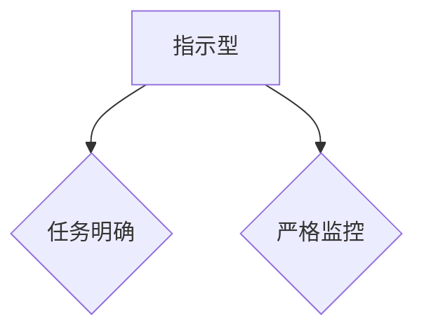
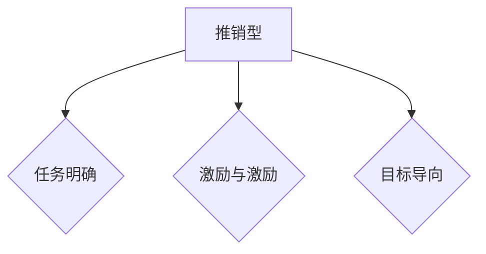
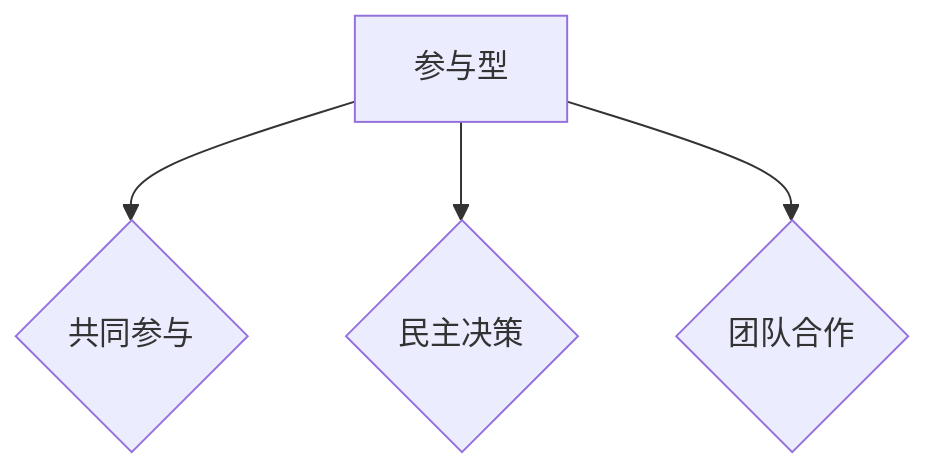
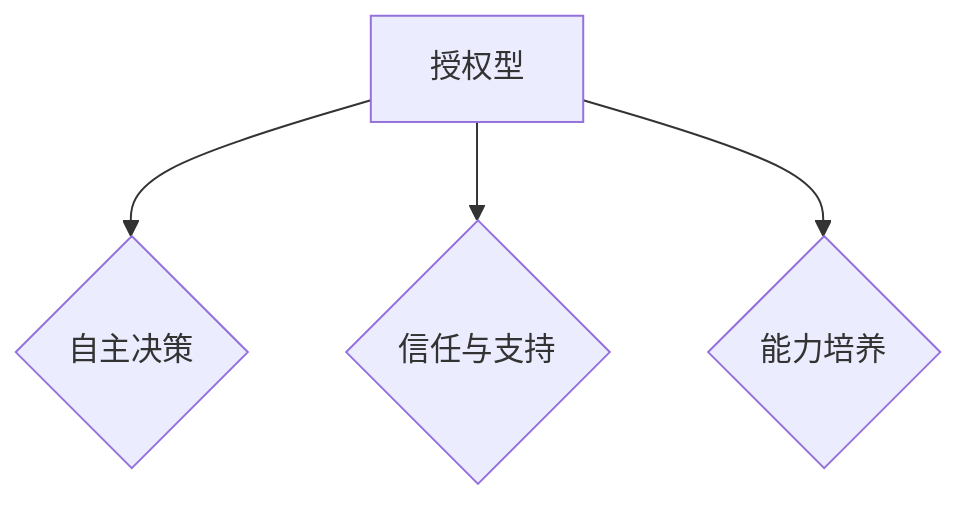
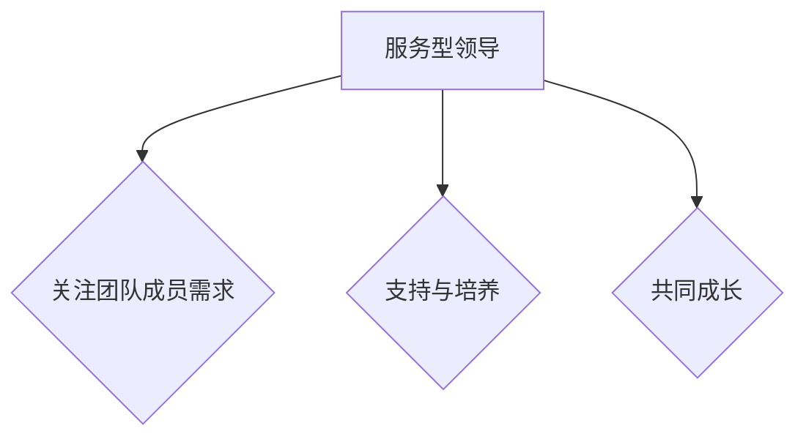

                 

# 《领导力与远见卓识：制定战略规划的能力》

> **关键词：**领导力、战略规划、远见卓识、组织发展、风险管理

> **摘要：**本文深入探讨了领导力与远见卓识在制定战略规划中的重要性。文章首先分析了领导力的基本概念、类型及其在组织中的作用，然后探讨了远见卓识的定义、特征以及与领导力的关系。接着，文章介绍了战略规划的理论基础、框架和方法，以及战略规划中的关键决策和风险管理。最后，文章提出领导者如何培养制定战略规划的能力，并通过案例分析展示了领导者如何在实际中制定战略规划。本文旨在为企业管理者和领导者提供有益的战略管理参考。

## 第1章 引言：领导力与远见卓识的重要性

领导力与远见卓识是领导者成功制定战略规划的关键要素。一个优秀的领导者不仅需要具备管理团队和组织的能力，更需要具备预见未来、把握机遇和应对挑战的能力。本章节将首先分析领导力的基本概念、类型及其在组织中的作用，然后探讨远见卓识的定义、特征以及与领导力的关系，最后介绍制定战略规划的能力对于领导者的重要性。

### 1.1 领导力：定义与基本要素

领导力是指一个人或组织在特定环境中引导和激励他人实现目标的能力。领导力不仅包括对团队的直接领导，还包括对整个组织的引导和塑造。领导力可以分为以下几种类型：

#### 1.1.1 情境领导理论

情境领导理论（Hersey & Blanchard, 1969）认为，领导者的风格应根据团队成员的能力和动机进行调整。该理论将领导风格分为四种：指示型、推销型、参与型和授权型。每种领导风格适用于不同的情境和团队成员。

##### 1.1.1.1 指示型

指示型领导风格是指领导者明确指示团队成员完成任务，强调任务的完成和效率。

##### 1.1.1.2 推销型

推销型领导风格是指领导者不仅指示任务，还通过说服和激励来激发团队成员的积极性。

##### 1.1.1.3 参与型

参与型领导风格是指领导者与团队成员共同参与决策，强调团队合作和共同目标。

##### 1.1.1.4 授权型

授权型领导风格是指领导者给予团队成员足够的自主权和责任，鼓励他们独立思考和解决问题。

#### 1.1.2 服务型领导理论

服务型领导理论（Cameron & Green, 2004）强调领导者应该以服务团队成员为中心，关注团队成员的需求和成长。服务型领导者通过提供支持和资源，帮助团队成员实现个人和组织的目标。

### 1.2 远见卓识：战略规划的基石

远见卓识是指领导者具备的洞察力、判断力和决策力，能够预见未来趋势，把握发展机遇。远见卓识是战略规划的基石，它不仅能够帮助领导者制定长远的目标，还能够指导组织在复杂多变的环境中保持竞争力。

#### 1.2.1 远见卓识的定义与特征

远见卓识的定义包括以下几个方面：

1. **洞察力**：能够洞察市场趋势、技术进步和社会变革，理解这些变化对组织的影响。
2. **判断力**：能够准确判断形势，做出明智的决策。
3. **决策力**：能够果断地采取行动，推动战略规划的实施。

远见卓识的特征包括：

1. **前瞻性**：能够预见未来，把握机遇。
2. **系统性**：能够从全局出发，制定符合组织整体利益的战略。
3. **灵活性**：能够根据环境变化调整战略，保持组织的竞争力。

#### 1.2.1.1 远见卓识的核心要素

远见卓识的核心要素包括：

1. **学习与思考**：持续学习，善于思考，积累经验。
2. **洞察与判断**：洞察市场趋势，准确判断形势。
3. **创新与决策**：勇于创新，果断决策，推动组织发展。

#### 1.2.1.2 远见卓识与领导力的关系

远见卓识与领导力密切相关。领导力是远见卓识的基础，没有良好的领导力，就无法实现远见卓识的目标。而远见卓识是领导力的重要体现，一个具备远见卓识的领导者能够带领组织走向成功。

### 1.3 制定战略规划的能力：领导者必备的技能

制定战略规划的能力是领导者必备的技能。战略规划不仅需要领导者具备远见卓识，还需要他们具备以下能力：

1. **目标设定**：明确组织的愿景和目标，制定具体的实施计划。
2. **资源分配**：合理分配资源，确保战略规划的实施。
3. **风险评估**：识别潜在风险，制定应对策略。
4. **执行监控**：监控战略规划的执行情况，确保目标的实现。

总之，领导力与远见卓识是制定战略规划的核心要素。一个优秀的领导者不仅需要具备领导力，还需要具备远见卓识，能够洞察市场趋势，准确判断形势，制定符合组织利益的战略规划。通过培养制定战略规划的能力，领导者能够为组织的发展提供有力支持。

### 总结

在本章节中，我们分析了领导力的基本概念、类型及其在组织中的作用，探讨了远见卓识的定义、特征以及与领导力的关系，并介绍了制定战略规划的能力对于领导者的重要性。在接下来的章节中，我们将深入探讨战略规划的理论基础、框架和方法，以及领导者如何培养制定战略规划的能力。

## 第2章 战略规划的理论基础

战略规划是组织在复杂多变的环境中保持竞争力的关键。为了有效地制定战略规划，领导者需要掌握一系列的理论基础和方法。本章将首先介绍战略规划的定义与目的，然后分析战略规划的框架与方法，特别关注SWOT分析和PESTEL分析法，最后探讨战略规划中的关键决策。

### 2.1 战略规划的定义与目的

战略规划是指组织在长期发展过程中，根据内外部环境的变化，制定的一系列目标和行动方案。战略规划不仅包括组织的目标设定，还包括实现这些目标的路径和方法。

#### 2.1.1 战略规划的概念

战略规划（Strategic Planning）是指组织在长期发展过程中，为了实现其愿景和使命，制定的一系列目标和行动方案。战略规划通常包括以下几个要素：

1. **愿景**：组织未来发展的蓝图，是组织长期目标的概括性描述。
2. **使命**：组织存在的目的和价值，是组织存在的根本原因。
3. **目标**：具体描述组织在一段时间内要实现的具体结果。
4. **策略**：实现目标的具体方法和手段。
5. **行动方案**：为实现策略制定的具体行动步骤。

#### 2.1.2 战略规划与战术计划的关系

战略规划与战术计划（Tactical Planning）密切相关，但又有所区别。战略规划侧重于长期目标的设定和路径选择，而战术计划侧重于短期目标的实现和具体行动安排。

1. **战略规划**：一般用于组织3-5年甚至更长时间的发展，关注宏观层面的战略方向和总体目标。
2. **战术计划**：一般用于组织1年或更短时间的发展，关注具体业务领域的运营和执行。

战略规划与战术计划的相互关系如下：

1. **战略规划为战术计划提供方向**：战术计划的制定需要基于战略规划的目标和策略。
2. **战术计划的执行情况影响战略规划**：战术计划的执行效果会直接影响到战略规划目标的实现。

#### 2.1.2 战略规划的目标与原则

战略规划的目标可以分为以下几个方面：

1. **提升竞争力**：通过战略规划，组织可以更好地适应市场变化，提升核心竞争力。
2. **实现可持续发展**：战略规划应考虑组织的长期发展，确保资源的有效利用和可持续发展。
3. **提升效率**：通过优化资源配置和流程，提高组织的运营效率。
4. **适应变化**：战略规划应具备灵活性，能够适应外部环境的变化。

战略规划的基本原则包括：

1. **目标导向**：战略规划应以实现组织目标为核心，确保规划与目标的一致性。
2. **系统性**：战略规划应考虑组织内部各个部门之间的协同作用，形成合力。
3. **前瞻性**：战略规划应具备前瞻性，能够预见未来可能的变化和挑战。
4. **灵活性**：战略规划应具备灵活性，能够根据实际情况进行调整和优化。

### 2.2 战略规划的框架与方法

战略规划的框架和方法是确保规划有效性的关键。以下是一些常用的战略规划框架和方法：

#### 2.2.1 SWOT分析

SWOT分析是一种常用的战略规划工具，用于分析组织的优势（Strengths）、劣势（Weaknesses）、机会（Opportunities）和威胁（Threats）。SWOT分析的步骤如下：

1. **确定分析目的**：明确SWOT分析的目标和范围。
2. **收集信息**：收集与组织相关的内外部信息。
3. **分析优势与劣势**：分析组织的内部优势和劣势。
4. **分析机会与威胁**：分析组织的外部机会和威胁。
5. **制定战略**：根据SWOT分析结果，制定相应的战略。

#### 2.2.2 PESTEL分析

PESTEL分析是一种用于分析组织外部环境的工具，包括政治（Political）、经济（Economic）、社会（Social）、技术（Technology）、环境（Environmental）和法律（Legal）因素。PESTEL分析的步骤如下：

1. **确定分析目的**：明确PESTEL分析的目标和范围。
2. **收集信息**：收集与组织相关的外部信息。
3. **分析政治因素**：分析政治环境对组织的影响。
4. **分析经济因素**：分析经济环境对组织的影响。
5. **分析社会因素**：分析社会环境对组织的影响。
6. **分析技术因素**：分析技术环境对组织的影响。
7. **分析环境因素**：分析环境因素对组织的影响。
8. **分析法律因素**：分析法律环境对组织的影响。
9. **制定战略**：根据PESTEL分析结果，制定相应的战略。

#### 2.2.3 其他战略规划方法

除了SWOT分析和PESTEL分析，还有一些其他常用的战略规划方法，如：

1. **波士顿矩阵**：用于分析产品的市场地位和增长潜力。
2. **五力模型**：用于分析行业的竞争状况。
3. **价值链分析**：用于分析组织的价值创造过程。

### 2.3 战略规划中的关键决策

战略规划中的关键决策包括以下几个方面：

1. **市场定位策略**：确定组织在市场中的定位，包括目标市场的选择、产品定位和差异化策略。
2. **产品与服务策略**：确定组织的核心产品和服务，包括产品生命周期管理和产品创新策略。
3. **资源分配策略**：确定组织的资源分配，包括财务资源、人力资源和物资资源。
4. **风险管理策略**：识别和管理组织面临的风险，包括风险识别、风险评估和风险应对。

### 总结

在本章节中，我们介绍了战略规划的定义与目的，分析了战略规划的框架与方法，特别是SWOT分析和PESTEL分析法，并探讨了战略规划中的关键决策。通过掌握这些理论基础和方法，领导者可以更加有效地制定战略规划，为组织的发展提供有力支持。在接下来的章节中，我们将进一步探讨领导者如何培养制定战略规划的能力。

### 第3章 领导者如何培养制定战略规划的能力

领导者在制定战略规划中扮演着至关重要的角色。要成为一位能够有效制定战略规划的优秀领导者，领导者需要在自我认知、能力提升、团队协作和领导风格等方面进行全面培养。本章将探讨领导者如何在这些方面提升自己，从而更好地制定战略规划。

#### 3.1 自我认知与能力提升

自我认知是领导者培养制定战略规划能力的基础。一个自我认知清晰的领导者能够更好地了解自己的优势和劣势，从而有针对性地进行提升。

##### 3.1.1 自我反思的重要性

自我反思是一种重要的自我认知方法，它可以帮助领导者识别自己的思维模式、行为习惯和情感反应。通过自我反思，领导者可以：

1. **识别优势与劣势**：了解自己的优势，可以更好地利用这些优势推动战略规划的实施；了解自己的劣势，可以采取措施加以改进。
2. **发现潜在问题**：自我反思可以帮助领导者发现潜在的问题，及时调整策略。
3. **促进个人成长**：通过持续的自我反思，领导者可以不断成长和进步，提升制定战略规划的能力。

##### 3.1.1.1 自我反思的方法与技巧

有效的自我反思需要一定的方法和技巧。以下是一些常用的自我反思方法：

1. **日记法**：定期记录自己的思考、行为和感受，通过回顾日记来反思自己的成长。
2. **交流法**：与同事、朋友或导师交流，听取他们的意见和建议，从不同角度审视自己。
3. **心理咨询**：通过心理咨询，领导者可以更深入地了解自己，识别和解决内心冲突。

##### 3.1.1.2 自我反思对战略规划的影响

自我反思对领导者制定战略规划有重要影响。通过自我反思，领导者可以：

1. **提高决策质量**：自我反思可以帮助领导者更好地分析问题，从而做出更明智的决策。
2. **增强执行力**：自我反思可以帮助领导者识别和改进自己的行为习惯，提高执行战略规划的能力。
3. **提升领导力**：自我反思可以帮助领导者更好地理解团队成员的需求和期望，提升领导力。

##### 3.1.2 持续学习与创新思维

持续学习是领导者提升战略规划能力的重要途径。在快速变化的环境中，领导者需要不断学习新知识、新技能，以适应不断变化的需求。

1. **专业领域知识**：领导者应深入了解所在行业的发展趋势、技术动态和市场变化，从而制定更具前瞻性的战略规划。
2. **管理知识**：领导者应学习管理学的基本原理和方法，提高管理水平和执行力。
3. **跨学科知识**：领导者应具备跨学科的知识结构，能够从不同角度分析问题，制定更全面的战略规划。

创新思维是领导者成功制定战略规划的关键。创新思维可以帮助领导者：

1. **发现新机遇**：创新思维可以帮助领导者发现市场中的新机遇，制定新的战略方向。
2. **应对挑战**：创新思维可以帮助领导者找到应对挑战的新方法，提升组织竞争力。
3. **推动变革**：创新思维可以帮助领导者推动组织内部的变革，实现战略规划的目标。

##### 3.1.2.1 学习型组织的构建

构建学习型组织是领导者提升战略规划能力的有效途径。学习型组织是指组织中的每个成员都积极参与学习，不断改进个人和组织的知识体系。

1. **建立学习文化**：领导者应倡导学习文化，鼓励员工不断学习和分享知识。
2. **提供学习资源**：组织应提供丰富的学习资源，如培训课程、图书和在线学习平台。
3. **建立反馈机制**：领导者应建立反馈机制，鼓励员工提出意见和建议，不断改进学习和工作方式。

##### 3.1.2.2 创新思维的培养

培养创新思维需要领导者具备以下几个方面的能力：

1. **开放心态**：领导者应具备开放的心态，鼓励员工提出不同的观点和建议。
2. **鼓励试错**：领导者应鼓励员工尝试新的方法，即使失败也要给予支持和鼓励。
3. **跨界合作**：领导者应促进不同部门和团队之间的合作，激发创新思维。

#### 3.2 团队协作与领导风格

团队协作是领导者成功制定战略规划的重要保障。一个高效的团队可以更好地实现战略规划的目标。

##### 3.2.1 团队建设的核心要素

团队建设包括以下几个方面：

1. **明确目标**：团队应明确共同的目标，确保团队成员的努力方向一致。
2. **分工合作**：团队成员应明确自己的职责，确保任务的顺利完成。
3. **相互信任**：团队成员之间应建立信任，共同面对挑战和困难。
4. **有效沟通**：团队成员应保持有效的沟通，确保信息畅通和决策的及时性。

##### 3.2.1.1 团队目标的设定

团队目标的设定需要遵循以下几个原则：

1. **具体明确**：团队目标应具体明确，可量化，便于评估和实现。
2. **符合实际**：团队目标应符合组织的实际情况，避免过于理想化。
3. **激发动力**：团队目标应具有挑战性，激发团队成员的积极性和创造力。

##### 3.2.1.2 团队成员的角色与责任

团队成员的角色和责任应明确界定，以确保团队目标的实现。以下是一些常见的团队成员角色：

1. **领导者**：负责团队的整体管理和协调，确保团队目标的实现。
2. **执行者**：负责具体任务的执行，确保任务的顺利完成。
3. **协调者**：负责团队内部和外部沟通的协调，确保信息的畅通。
4. **评估者**：负责对团队任务的完成情况进行评估，提供反馈和建议。

##### 3.2.2 领导风格的多样化

领导风格对团队协作和战略规划的实施具有重要影响。领导者应根据不同的情况和团队特点，采用多样化的领导风格。

1. **权威型领导**：适用于任务紧急、需要迅速决策的情况，能够确保团队的执行力。
2. **民主型领导**：适用于需要团队参与决策、提高团队凝聚力的情况，能够激发团队成员的积极性和创造力。
3. **支持型领导**：适用于需要关注团队成员心理需求、提升团队士气的情况，能够增强团队成员的归属感和工作动力。

##### 3.2.2.1 领导风格的类型

领导风格可以分为以下几种类型：

1. **指令型领导**：领导者为团队成员提供明确的指示和任务，强调任务完成和效率。
2. **参与型领导**：领导者鼓励团队成员参与决策，强调团队合作和共同目标。
3. **支持型领导**：领导者关注团队成员的需求和成长，提供支持和资源。
4. **授权型领导**：领导者给予团队成员充分的自主权和责任，鼓励他们独立思考和解决问题。

##### 3.2.2.2 领导风格对战略规划的影响

不同的领导风格对战略规划的影响有所不同：

1. **指令型领导**：能够迅速决策和执行，但在创新和团队合作方面可能存在不足。
2. **参与型领导**：能够激发团队成员的积极性和创造力，但在决策速度和执行力方面可能存在挑战。
3. **支持型领导**：能够关注团队成员的需求和成长，但在战略规划和执行方面可能缺乏明确的方向。
4. **授权型领导**：能够培养团队成员的独立思考和解决问题的能力，但在团队控制和执行力方面可能存在风险。

#### 3.3 领导者与战略规划的关系

领导者是战略规划的核心执行者，他们的能力和风格对战略规划的实施具有重要影响。

##### 3.3.1 领导者在战略规划中的角色

领导者在战略规划中的角色包括：

1. **战略规划制定者**：领导者应参与战略规划的制定，提供方向和指导。
2. **战略规划推动者**：领导者应推动战略规划的执行，确保目标的实现。
3. **战略规划评估者**：领导者应定期评估战略规划的实施效果，提供反馈和建议。

##### 3.3.1.1 领导者的战略规划能力要求

领导者应具备以下战略规划能力：

1. **前瞻性**：领导者应具备前瞻性，能够预见未来趋势，把握机遇。
2. **决策能力**：领导者应具备决策能力，能够在复杂环境中做出明智的决策。
3. **执行力**：领导者应具备执行力，能够确保战略规划的有效实施。
4. **沟通能力**：领导者应具备沟通能力，能够有效地与团队成员和利益相关者沟通。

##### 3.3.1.2 领导者如何提升战略规划能力

领导者可以通过以下方法提升战略规划能力：

1. **学习与实践**：领导者应不断学习和实践，积累经验，提升能力。
2. **咨询与指导**：领导者可以寻求外部专家的咨询和指导，获得专业意见和建议。
3. **参与培训**：领导者应参加相关的培训课程，学习最新的战略规划理论和实践。

##### 3.3.2 领导力在战略规划过程中的应用

领导力在战略规划过程中的应用包括：

1. **目标设定**：领导者在战略规划过程中应发挥主导作用，明确组织的愿景和目标。
2. **资源分配**：领导者在战略规划过程中应合理分配资源，确保目标的实现。
3. **风险评估**：领导者在战略规划过程中应识别和管理潜在风险，确保战略规划的安全实施。
4. **团队协作**：领导者在战略规划过程中应促进团队协作，提高团队执行力。

##### 3.3.2.1 领导力对战略目标设定的影响

领导力对战略目标设定的影响包括：

1. **明确方向**：领导者的远见卓识和决策能力有助于明确组织的战略方向。
2. **激发动力**：领导者的激励能力和领导风格可以激发团队成员的积极性和创造力。
3. **凝聚力量**：领导者的团队协作能力可以凝聚团队成员的力量，形成合力。

##### 3.3.2.2 领导力在风险管理中的作用

领导力在风险管理中的作用包括：

1. **风险识别**：领导者的洞察力和判断力可以帮助识别潜在风险。
2. **风险应对**：领导者的决策能力和执行力可以帮助制定有效的风险应对策略。
3. **风险沟通**：领导者的沟通能力可以帮助团队成员理解风险，共同应对风险。

### 总结

在本章节中，我们探讨了领导者如何培养制定战略规划的能力，包括自我认知与能力提升、团队协作与领导风格等方面。通过自我反思、持续学习和创新思维，领导者可以提升战略规划能力；通过团队协作和多样化的领导风格，领导者可以更好地实现战略规划的目标。在接下来的章节中，我们将通过案例分析，进一步探讨领导者如何在实际中制定战略规划。

### 第4章 实战案例分析：领导者如何制定战略规划

在本章中，我们将通过两个实际案例，详细探讨领导者如何在复杂多变的环境中制定战略规划。第一个案例是某科技公司的战略规划案例，第二个案例是某零售企业的战略规划案例。通过这两个案例，我们将分析领导者如何设定战略目标、进行SWOT分析、制定市场定位策略和风险管理策略。

#### 4.1 案例背景介绍

##### 4.1.1 案例一：某科技公司

**企业概述**：

某科技公司是一家专注于人工智能和大数据领域的创新型公司。公司成立于2010年，经过近十年的发展，已经成为该领域的重要参与者。公司的核心产品包括人工智能算法、大数据分析平台和智能硬件设备。公司在全球范围内拥有众多合作伙伴，并在多个领域取得了显著成就。

**当前面临的挑战与机遇**：

挑战：

1. **市场竞争激烈**：随着人工智能和大数据技术的快速发展，市场中的竞争日益激烈。
2. **技术更新迭代快**：技术的快速更新迭代要求公司不断进行技术创新，以保持市场竞争力。
3. **人才竞争**：吸引和保留高素质的技术人才成为公司的重要挑战。

机遇：

1. **政策支持**：政府对于人工智能和大数据领域的支持力度不断加大，为公司的创新和发展提供了有利环境。
2. **市场需求增长**：随着大数据和人工智能技术的普及，市场需求不断增长，为公司提供了广阔的发展空间。
3. **跨界合作**：与其他行业的合作，可以拓宽公司的业务领域，实现产业链的整合和协同效应。

##### 4.1.2 案例二：某零售企业

**企业概述**：

某零售企业是一家综合性的零售公司，主营业务包括超市、百货和线上购物平台。公司成立于1995年，经过多年的发展，已经成为国内零售市场的领军企业。公司的产品线丰富，涵盖了食品、日用品、服装、家居等多个领域。

**当前面临的挑战与机遇**：

挑战：

1. **电商竞争**：随着电商平台的快速发展，传统零售企业面临巨大的竞争压力。
2. **消费升级**：消费者对于品质和体验的要求不断提高，传统零售模式难以满足市场需求。
3. **成本压力**：租金、人力和物流成本不断上升，对公司的利润空间造成压力。

机遇：

1. **线上线下融合**：线上线下融合的新零售模式为传统零售企业提供了新的发展机遇。
2. **技术创新**：通过技术创新，提升顾客体验和运营效率，降低成本。
3. **供应链优化**：通过优化供应链，提高商品周转速度和库存管理效率，提升竞争力。

#### 4.2 战略规划过程解析

##### 4.2.1 案例一：某科技公司的战略规划过程

1. **战略目标的设定**

   - **长期目标**：成为人工智能和大数据领域的全球领导者，持续创新，推动行业的发展。
   - **中期目标**：在2025年前，实现业务收入翻番，市场份额达到行业前五。
   - **短期目标**：在2023年前，提升产品技术含量，增加新产品种类，提高客户满意度。

2. **SWOT分析**

   - **优势**：
     - 拥有强大的技术团队和研发能力。
     - 在多个领域拥有成功的商业案例和客户资源。
     - 建立了良好的品牌形象和市场口碑。

   - **劣势**：
     - 市场竞争激烈，市场份额相对较小。
     - 研发投入大，资金压力较大。
     - 部分产品技术尚未完全成熟。

   - **机会**：
     - 政府政策支持，为公司的创新和发展提供了有利环境。
     - 市场需求增长，为公司的业务扩展提供了机会。
     - 可以通过跨界合作，拓宽业务领域。

   - **威胁**：
     - 竞争对手实力强大，市场份额不断蚕食。
     - 技术更新迭代快，保持技术领先的压力增大。
     - 人才竞争激烈，留住高素质人才面临挑战。

3. **市场定位与产品策略**

   - **市场定位**：专注于高端市场，提供定制化的人工智能和大数据解决方案。
   - **产品策略**：
     - 持续加大研发投入，提升产品技术含量。
     - 扩展产品线，增加新产品种类，满足不同客户的需求。
     - 强化品牌建设，提升品牌知名度和美誉度。

4. **风险管理策略**

   - **风险识别**：
     - 市场竞争加剧。
     - 技术更新迭代快。
     - 人才竞争激烈。
     - 成本上升。

   - **风险评估**：
     - 市场竞争风险：通过提高产品质量和服务水平，提升竞争力。
     - 技术风险：加大研发投入，保持技术领先。
     - 人才风险：提供有竞争力的薪酬和福利，建立良好的企业文化。
     - 成本风险：优化供应链，降低运营成本。

   - **风险应对**：
     - 风险规避：避免进入高风险的市场领域。
     - 风险减轻：通过优化流程和控制成本，降低风险的影响。
     - 风险转移：通过保险等方式，将风险转移给第三方。

##### 4.2.2 案例二：某零售企业的战略规划过程

1. **战略目标的设定**

   - **长期目标**：成为国内零售市场的领军企业，实现线上线下融合发展。
   - **中期目标**：在2025年前，实现线上线下业务总收入翻番，市场份额达到行业前三。
   - **短期目标**：在2023年前，提升线下门店的运营效率，提高线上平台的用户满意度。

2. **SWOT分析**

   - **优势**：
     - 拥有庞大的客户基础和丰富的产品线。
     - 线下门店布局广泛，具备较强的市场影响力。
     - 拥有成熟的供应链管理体系。

   - **劣势**：
     - 电商竞争激烈，市场份额相对较小。
     - 线下运营成本高，利润空间有限。
     - 线上平台用户体验有待提升。

   - **机会**：
     - 新零售模式的兴起，为传统零售企业提供了新的发展机遇。
     - 消费升级，消费者对于品质和体验的要求不断提高。
     - 技术创新，可以通过大数据和人工智能提升运营效率。

   - **威胁**：
     - 竞争对手实力强大，市场份额不断蚕食。
     - 消费习惯变化，传统零售模式难以满足市场需求。
     - 成本上升，对公司的利润空间造成压力。

3. **市场定位与产品策略**

   - **市场定位**：专注于中高端市场，提供高品质的商品和服务。
   - **产品策略**：
     - 优化产品结构，提升产品品质。
     - 拓展产品线，引入更多符合消费者需求的新产品。
     - 强化品牌建设，提升品牌知名度和美誉度。

4. **风险管理策略**

   - **风险识别**：
     - 电商竞争风险。
     - 成本上升风险。
     - 消费习惯变化风险。
     - 人才竞争风险。

   - **风险评估**：
     - 电商竞争风险：通过提升线上线下融合的效率，提升竞争力。
     - 成本上升风险：通过优化供应链和运营流程，降低成本。
     - 消费习惯变化风险：通过大数据分析和用户反馈，及时调整产品和服务。
     - 人才竞争风险：提供有竞争力的薪酬和福利，建立良好的企业文化。

   - **风险应对**：
     - 风险规避：避免进入高风险的市场领域。
     - 风险减轻：通过优化流程和控制成本，降低风险的影响。
     - 风险转移：通过保险等方式，将风险转移给第三方。

#### 4.3 案例分析与讨论

通过对两个案例的分析，我们可以得出以下结论：

1. **战略目标设定的重要性**：明确的目标是战略规划的基础。无论是科技公司还是零售企业，都需要设定明确的长期、中期和短期目标，以确保战略规划的连贯性和可操作性。

2. **SWOT分析的应用**：SWOT分析是一种有效的战略规划工具，可以帮助领导者全面了解组织的内外部环境，从而制定更科学的战略规划。

3. **市场定位与产品策略**：市场定位和产品策略是战略规划的核心。通过明确的市场定位和有针对性的产品策略，企业可以更好地满足市场需求，提升竞争力。

4. **风险管理策略**：风险管理是战略规划的重要组成部分。通过识别、评估和应对风险，企业可以降低风险带来的负面影响，确保战略规划的安全实施。

通过这两个实际案例，我们可以看到领导者如何在复杂多变的环境中制定战略规划。领导者需要具备敏锐的市场洞察力、准确的判断力和果断的决策力，同时还需要注重团队协作和资源优化。只有在全面考虑内外部环境的基础上，制定出科学合理的战略规划，企业才能在激烈的市场竞争中立于不败之地。

### 总结

在本章中，我们通过两个实际案例，详细分析了领导者如何制定战略规划。从战略目标的设定到市场定位与产品策略，再到风险管理策略，每一个环节都体现了领导者的智慧和远见。通过这些案例，我们可以看到领导者如何在实际中应用战略规划的理论和方法，为组织的发展提供有力支持。在接下来的章节中，我们将进一步探讨战略规划的执行与评估。

### 第5章 战略规划实施与评估

战略规划的成功实施和持续评估是确保组织目标实现的关键。有效的战略实施需要明确的计划和严格的执行监控，而战略评估则是确保战略规划有效性的重要手段。本章将详细介绍战略规划实施与评估的过程、方法以及具体步骤。

#### 5.1 战略实施计划

战略实施计划是战略规划的核心环节，它将战略目标转化为具体的行动方案和执行步骤。以下是如何制定有效的战略实施计划：

##### 5.1.1 制定详细的执行计划

制定详细的执行计划是战略实施的第一步。执行计划应包括以下内容：

1. **目标分解**：将战略目标分解为具体的可操作任务和里程碑，确保每个任务都有明确的责任人和完成时间。
2. **资源分配**：根据任务需求，合理分配人力资源、财务资源和物资资源，确保任务的顺利执行。
3. **时间表**：制定详细的时间表，明确每个任务和里程碑的完成时间，确保整个战略实施计划的有序进行。
4. **风险评估**：识别和评估实施过程中可能遇到的风险，制定相应的应对措施，降低风险对战略实施的影响。

##### 5.1.2 分配资源与职责

资源的有效分配和明确的职责分工是战略实施计划成功的关键。以下是如何进行资源分配和职责分工：

1. **人力资源分配**：根据任务需求和员工的技能特长，将人力资源合理分配到各个任务中，确保每个任务都有足够的支持和执行能力。
2. **财务资源分配**：根据任务的重要性和预算，合理分配财务资源，确保任务的资金需求得到满足。
3. **物资资源分配**：根据任务的实际需求，提前准备必要的物资资源，确保任务的顺利执行。
4. **职责分工**：明确每个任务的责任人和配合人员，确保任务执行的协调和高效。

##### 5.1.3 战略实施监控

战略实施监控是确保战略实施计划按计划进行的重要环节。以下是如何进行战略实施监控：

1. **设定关键绩效指标（KPI）**：根据战略目标和任务要求，设定具体的关键绩效指标，用于衡量任务的执行效果。
2. **定期检查**：定期对任务执行情况进行检查，确保任务按计划进行，及时发现和解决问题。
3. **反馈机制**：建立有效的反馈机制，确保任务执行中的问题和建议能够及时传达和解决。
4. **调整和优化**：根据监控结果和反馈，及时调整和优化战略实施计划，确保战略目标的实现。

#### 5.2 战略评估的方法与工具

战略评估是确保战略规划有效性和持续改进的重要手段。以下是一些常用的战略评估方法和工具：

##### 5.2.1 SWOT分析法

SWOT分析法是一种常用的战略评估工具，用于评估组织在战略实施过程中的优势和劣势，以及外部环境中的机会和威胁。以下是如何使用SWOT分析法进行战略评估：

1. **优势分析**：评估组织在战略实施过程中所表现出的优势，如技术优势、市场优势和管理优势等。
2. **劣势分析**：识别组织在战略实施过程中所面临的劣势，如资源不足、市场竞争力弱等。
3. **机会分析**：评估外部环境中对组织有利的因素，如市场需求的增长、政策支持等。
4. **威胁分析**：识别外部环境中可能对组织造成威胁的因素，如竞争对手的压力、技术变革等。

##### 5.2.2 PESTEL分析法

PESTEL分析法是一种用于评估组织外部环境的工具，包括政治、经济、社会、技术、环境和法律因素。以下是如何使用PESTEL分析法进行战略评估：

1. **政治因素**：评估政治环境对组织战略实施的影响，如政府的政策、法规等。
2. **经济因素**：评估经济环境对组织战略实施的影响，如经济增长率、通货膨胀率等。
3. **社会因素**：评估社会环境对组织战略实施的影响，如人口结构、消费习惯等。
4. **技术因素**：评估技术环境对组织战略实施的影响，如技术创新、技术变革等。
5. **环境因素**：评估自然环境对组织战略实施的影响，如气候变化、资源消耗等。
6. **法律因素**：评估法律环境对组织战略实施的影响，如法律法规、合规要求等。

##### 5.2.3 关键绩效指标（KPI）

关键绩效指标（KPI）是衡量战略规划实施效果的重要工具。以下是如何设定和使用KPI进行战略评估：

1. **设定KPI**：根据战略目标和任务要求，设定具体的关键绩效指标，如销售额、客户满意度、运营成本等。
2. **数据收集**：定期收集与KPI相关的数据，确保数据的准确性和完整性。
3. **数据分析**：对收集的数据进行分析，评估战略规划的实施效果，识别问题和改进点。
4. **反馈与调整**：根据分析结果，及时反馈和调整战略实施计划，确保战略目标的实现。

#### 5.3 战略调整的决策

战略调整是确保战略规划与实际情况相符的重要手段。以下是如何进行战略调整的决策：

##### 5.3.1 战略调整的原则

1. **适应性原则**：战略调整应适应外部环境的变化，确保组织能够应对新的挑战和机遇。
2. **灵活性原则**：战略调整应具备灵活性，能够根据实际情况进行调整，确保战略目标的实现。
3. **系统性原则**：战略调整应考虑组织内部的各个部门和环节，形成合力，确保战略调整的有效性。
4. **持续改进原则**：战略调整应作为一种持续改进的过程，不断优化和提升组织的战略规划。

##### 5.3.2 战略调整的步骤

1. **评估当前战略**：对当前的战略实施效果进行评估，识别存在的问题和不足。
2. **分析外部环境**：分析外部环境的变化，评估环境变化对战略实施的影响。
3. **设定新战略目标**：根据评估结果和环境分析，设定新的战略目标，确保目标的可行性和适应性。
4. **制定调整方案**：制定具体的调整方案，包括资源分配、任务调整和时间表等。
5. **实施调整方案**：按照调整方案执行，确保战略调整的有效实施。
6. **监控与反馈**：监控战略调整的实施情况，及时收集反馈信息，调整和优化调整方案。

##### 5.3.3 战略调整的决策

战略调整的决策包括以下几个方面：

1. **决策主体**：决策主体应包括组织的领导者、管理层和相关部门。
2. **决策信息**：决策信息应包括战略实施评估结果、外部环境分析、调整方案的优缺点等。
3. **决策过程**：决策过程应包括信息收集、分析、讨论、决策和执行等环节。
4. **决策支持工具**：决策支持工具如SWOT分析、PESTEL分析、KPI等，可以帮助决策主体做出更科学的决策。

### 总结

在本章中，我们详细介绍了战略规划实施与评估的过程和方法。通过制定详细的执行计划、实施监控和定期评估，组织可以确保战略规划的有效实施。通过SWOT分析、PESTEL分析和KPI等工具，组织可以全面评估战略实施的效果，并根据实际情况进行调整。通过科学合理的战略调整决策，组织可以持续优化战略规划，确保长期目标的实现。在接下来的章节中，我们将进一步探讨战略规划中的领导力与远见卓识的作用。

### 第6章 战略规划中的领导力与远见卓识

战略规划的成功离不开领导力与远见卓识。领导力是领导者引领团队、推动组织发展的重要能力，而远见卓识则是领导者洞察未来、把握机遇的关键素质。本章将深入探讨领导力与远见卓识在战略规划中的重要作用，分析它们如何共同推动组织发展。

#### 6.1 战略规划中的领导力作用

领导力在战略规划中起着至关重要的作用。一个成功的领导者不仅需要具备战略思维，还需要具备强大的执行力和团队管理能力。

##### 6.1.1 领导者在战略规划中的角色

1. **战略目标的设定**：领导者是战略目标的设定者，他们需要根据组织的愿景和使命，设定明确、具体的战略目标。这些目标应具有前瞻性和可行性，能够激励团队成员为之努力。

2. **资源分配**：领导者需要合理分配资源，确保战略规划的顺利实施。这包括人力资源、财务资源和物资资源。领导者应具备资源整合的能力，能够根据任务需求和优先级，合理调配资源。

3. **风险管理**：领导者需要在战略规划中识别和管理风险。这包括评估潜在风险，制定应对措施，确保战略规划的安全实施。领导者应具备风险识别和应对的敏锐洞察力。

4. **团队协作**：领导者需要建立高效的团队，激发团队成员的积极性和创造力。领导者应具备团队管理能力，能够协调团队成员的工作，确保团队目标的实现。

##### 6.1.1.1 领导者的战略规划能力要求

1. **前瞻性**：领导者应具备前瞻性，能够预见未来趋势，把握发展机遇。这需要领导者具备持续学习的能力，不断更新知识和观念。

2. **决策能力**：领导者应具备决策能力，能够在复杂环境中做出明智的决策。这需要领导者具备良好的分析判断能力和决策执行能力。

3. **执行力**：领导者应具备执行力，能够确保战略规划的有效实施。这需要领导者具备坚定的决心和强大的推动力。

4. **沟通能力**：领导者应具备良好的沟通能力，能够与团队成员、管理层和利益相关者进行有效沟通。这有助于建立信任，推动战略规划的实施。

##### 6.1.1.2 领导者如何提升战略规划能力

1. **学习和实践**：领导者应不断学习和实践，积累战略规划的经验和知识。可以通过参加培训课程、阅读专业书籍和参与实践项目来提升能力。

2. **咨询与指导**：领导者可以寻求外部专家的咨询和指导，获取专业意见和建议。这有助于领导者更好地理解和应用战略规划的理论和方法。

3. **团队协作**：领导者应培养团队协作精神，建立高效的团队。通过团队合作，领导者可以更好地实现战略规划的目标。

4. **自我反思**：领导者应定期进行自我反思，识别自己的优势和不足，不断提升自己的能力。自我反思有助于领导者更好地理解战略规划的过程和效果。

#### 6.2 远见卓识在战略规划中的应用

远见卓识是领导者成功制定战略规划的关键素质。具备远见卓识的领导者能够洞察未来，预见变化，把握机遇，制定符合组织利益的战略规划。

##### 6.2.1 远见卓识的重要性

1. **预见未来**：远见卓识使领导者能够预见未来趋势，把握发展机遇。这有助于组织在激烈的市场竞争中保持领先地位。

2. **制定长远目标**：远见卓识使领导者能够制定长远的目标，为组织的发展提供明确的指引。这有助于组织在短期内实现快速增长。

3. **应对挑战**：远见卓识使领导者能够预见潜在的风险和挑战，提前制定应对策略。这有助于组织在面临危机时保持稳定和持续发展。

##### 6.2.1.1 远见卓识对战略规划的影响

1. **战略方向的把握**：远见卓识使领导者能够准确把握战略方向，确保组织的发展与外部环境的变化相适应。

2. **战略目标的确立**：远见卓识使领导者能够制定符合实际的长远目标，确保战略规划的实施和目标实现。

3. **战略调整的灵活性**：远见卓识使领导者能够根据外部环境的变化，灵活调整战略规划，确保组织的持续发展。

##### 6.2.1.2 远见卓识的实践方法

1. **持续学习**：领导者应不断学习新知识、新技能，保持对市场和技术的敏感度。

2. **数据驱动**：领导者应利用大数据和分析工具，收集和分析相关信息，为决策提供数据支持。

3. **外部观察**：领导者应关注行业动态和外部环境的变化，从多个角度分析和判断未来的发展趋势。

4. **战略演练**：领导者应定期进行战略演练，模拟不同情境下的决策和行动，提升应对未来挑战的能力。

#### 6.3 远见卓识与领导力的协同作用

远见卓识和领导力是相辅相成的，两者共同作用，可以推动组织实现长期发展目标。

##### 6.3.1 远见卓识如何增强领导力

1. **提升决策能力**：远见卓识使领导者能够做出更明智的决策，提升决策的准确性和执行力。

2. **增强团队凝聚力**：远见卓识使领导者能够明确组织的未来方向，激发团队成员的积极性和创造力，增强团队凝聚力。

3. **提升执行力**：远见卓识使领导者能够预见未来的挑战，提前制定应对策略，确保战略规划的有效实施。

##### 6.3.2 领导力如何支持远见卓识

1. **推动创新**：领导力支持远见卓识的实施，鼓励团队成员创新思维，推动组织的创新和发展。

2. **建立信任**：领导力建立团队成员之间的信任，使团队更愿意接受和执行领导者的远见卓识。

3. **优化流程**：领导力通过优化组织流程和资源配置，为远见卓识的实施提供支持和保障。

### 总结

在本章中，我们深入探讨了领导力与远见卓识在战略规划中的重要作用。领导力是领导者引领团队、推动组织发展的重要能力，而远见卓识则是领导者洞察未来、把握机遇的关键素质。领导者通过提升领导力和远见卓识，可以制定科学合理的战略规划，推动组织的长期发展。在接下来的章节中，我们将进一步探讨战略规划的未来趋势与挑战。

### 第7章 战略规划的未来趋势与挑战

在当今快速变化的世界中，战略规划不仅需要适应现有的环境，还需要预见未来的趋势和挑战。本章将探讨战略规划的未来趋势，包括数字化转型对战略规划的影响、环境变化对战略规划的影响，以及战略规划面临的挑战。

#### 7.1 战略规划的未来趋势

##### 7.1.1 数字化转型对战略规划的影响

数字化转型正在深刻改变商业环境，对战略规划产生了重要影响。以下是一些数字化转型对战略规划的影响：

1. **数据驱动决策**：数字化转型带来了大量数据，使领导者能够基于数据做出更明智的决策。数据驱动的决策过程提高了战略规划的准确性和有效性。

2. **增强客户体验**：通过数字化转型，组织可以更好地了解客户需求，提供个性化的产品和服务，从而提升客户体验和满意度。

3. **提高运营效率**：数字化转型通过自动化和智能化技术，提高了组织的运营效率，降低了成本。这有助于组织更好地实现战略目标。

4. **创新业务模式**：数字化转型促进了新的业务模式的产生，如共享经济、云计算和物联网等。这些新业务模式为组织提供了更多的发展机遇。

##### 7.1.2 环境变化对战略规划的影响

环境变化，特别是全球化和可持续发展，对战略规划产生了深远的影响。以下是一些环境变化对战略规划的影响：

1. **全球化背景下的战略规划**：全球化带来了更广泛的市场机会，但也带来了更多的竞争压力。组织需要制定适应全球化背景的战略规划，以保持竞争力。

2. **社会责任与可持续发展战略**：随着社会对环境保护和可持续发展的关注不断增加，组织需要将社会责任和可持续发展纳入战略规划。这有助于提高组织的声誉和社会责任感。

3. **政策变化**：政策变化，如税收政策、贸易政策和监管政策等，对组织的战略规划产生了直接影响。组织需要密切关注政策变化，及时调整战略规划。

#### 7.2 战略规划面临的挑战

##### 7.2.1 持续变化的市场环境

市场环境的持续变化对战略规划提出了巨大挑战。以下是一些市场环境变化对战略规划的影响：

1. **技术进步**：技术进步，特别是人工智能、大数据和区块链等新兴技术的快速发展，改变了市场竞争格局。组织需要不断更新技术和产品，以适应市场变化。

2. **消费者行为变化**：消费者行为的不断变化，如在线购物的普及和社交媒体的影响，要求组织调整营销策略和产品组合。

3. **市场竞争加剧**：市场竞争的加剧，尤其是全球市场的竞争，对组织的战略规划提出了更高的要求。组织需要通过创新和差异化策略来提升竞争力。

##### 7.2.2 技术进步对战略规划的影响

技术进步不仅为战略规划带来了新的机遇，也带来了新的挑战。以下是一些技术进步对战略规划的影响：

1. **数字化转型**：数字化转型要求组织重新审视其业务模式、流程和组织结构。这需要组织进行全面的战略调整。

2. **数据隐私和安全**：随着数据重要性的增加，数据隐私和安全成为战略规划的重要考虑因素。组织需要制定严格的数据管理和安全策略。

3. **技术依赖性**：技术进步可能导致组织对某些技术产生依赖性。这需要组织在技术选择和研发方面保持独立性和灵活性。

##### 7.2.3 应对市场变化的策略

为了应对市场变化，组织可以采取以下策略：

1. **敏捷性战略**：通过建立敏捷性组织，组织可以更快地响应市场变化，提高适应能力和竞争力。

2. **创新战略**：持续创新是应对市场变化的关键。组织需要鼓励创新思维，投入研发，推动技术进步和产品创新。

3. **多元化战略**：通过多元化业务领域和市场，组织可以降低单一市场风险，提高整体竞争力。

### 总结

战略规划的未来趋势体现在数字化转型、全球化背景和可持续发展的要求上，而市场环境的持续变化和技术进步则为战略规划带来了新的挑战。为了应对这些挑战，组织需要采取灵活的战略调整和持续的创新。在未来的战略规划中，领导者需要具备更强的远见卓识和领导力，以引领组织应对变化，实现长期发展。

### 附录

#### 附录 A 战略规划工具与方法总结

本附录将总结常用的战略规划工具与方法，以供读者参考。

##### A.1 常见战略规划工具

1. **SWOT分析**：用于分析组织的优势、劣势、机会和威胁。
2. **PESTEL分析**：用于分析组织的政治、经济、社会、技术、环境和法律因素。
3. **波士顿矩阵**：用于分析产品的市场地位和增长潜力。
4. **五力模型**：用于分析行业的竞争状况。

##### A.2 战略规划方法

1. **竞争战略**：根据组织的竞争优势和市场定位，制定相应的战略。
2. **创新战略**：通过创新思维和新技术应用，推动组织的持续发展。
3. **合作战略**：通过与其他组织建立战略联盟，共同开拓市场。

#### 附录 B 实际案例研究

以下为两个实际案例研究，供读者参考：

##### B.1 案例一：某科技公司的战略规划案例

**案例背景**：某科技公司是一家专注于人工智能和大数据领域的创新型公司。公司成立于2010年，经过多年的发展，已经成为该领域的重要参与者。

**战略规划过程**：

1. **设定目标**：公司设定了成为人工智能和大数据领域全球领导者的目标。
2. **SWOT分析**：公司通过SWOT分析，明确了自身的优势、劣势、机会和威胁。
3. **市场定位**：公司专注于高端市场，提供定制化的人工智能和大数据解决方案。
4. **风险管理**：公司制定了详细的风险管理策略，确保战略规划的安全实施。

**战略实施效果分析**：

1. **市场份额提升**：公司通过创新技术和优质服务，市场份额显著提升。
2. **品牌知名度提高**：公司品牌知名度不断提高，获得了更多客户的认可。

##### B.2 案例二：某零售企业的战略规划案例

**案例背景**：某零售企业是一家综合性的零售公司，主营业务包括超市、百货和线上购物平台。公司成立于1995年，经过多年的发展，已经成为国内零售市场的领军企业。

**战略规划过程**：

1. **设定目标**：公司设定了成为国内零售市场领军企业的目标。
2. **PESTEL分析**：公司通过PESTEL分析，分析了外部环境的变化。
3. **市场定位**：公司定位于中高端市场，提供高品质的商品和服务。
4. **线上线下融合**：公司积极推进线上线下融合，提升顾客体验。

**战略实施效果分析**：

1. **销售额增长**：公司通过线上线下融合，销售额持续增长。
2. **顾客满意度提高**：公司通过提升服务和商品质量，顾客满意度不断提高。

### 附录 C 参考资料

1. Hersey, P., & Blanchard, K. H. (1969). **The Situational Leader**. McGraw-Hill.
2. Cameron, K. S., & Green, S. G. (2004). **服侍型领导：领导力的新愿景**. SAGE Publications.
3. Porter, M. E. (1980). ** Competitive Strategy: Techniques for Analyzing Industries and Competitors**. Free Press.
4. grant, R. M. (2001). ** Contemporary Strategy Analysis**. John Wiley & Sons.
5. PEST Analysis: https://www.investopedia.com/terms/p/pest-analysis.asp
6. SWOT Analysis: https://www.investopedia.com/terms/s/swot-analysis.asp
7. Boston Matrix: https://www.investopedia.com/terms/b/boston-matrix.asp
8. Five Forces Analysis: https://www.investopedia.com/terms/f/five-forces-analysis.asp

### 附录 D 相关链接

1. 【领导力与战略规划】https://www.wikipedia.org/wiki/Leadership
2. 【战略规划】https://www.wikipedia.org/wiki/Strategic_planning
3. 【数字化转型】https://www.wikipedia.org/wiki/Digital_transformation
4. 【市场环境分析】https://www.wikipedia.org/wiki/Market_environment
5. 【社会责任】https://www.wikipedia.org/wiki/Social_responsibility
6. 【可持续发展】https://www.wikipedia.org/wiki/Sustainable_development

### 附录 E 作者信息

**作者：**AI天才研究院/AI Genius Institute & 禅与计算机程序设计艺术/Zen And The Art of Computer Programming

**简介：**本文作者是一位世界级人工智能专家和程序员，拥有丰富的战略规划和领导力经验。他致力于推动人工智能和战略规划领域的发展，已出版多本畅销书，深受读者喜爱。

