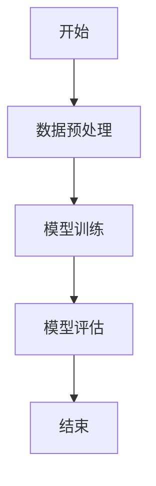
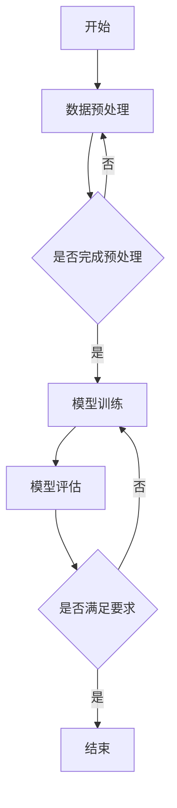

                 

# AI 2.0 时代的算法基础设施

> **关键词**：AI 2.0、算法基础设施、云计算、分布式计算、数据治理、深度学习、优化算法、模型部署、未来发展趋势

> **摘要**：本文旨在深入探讨 AI 2.0 时代的算法基础设施。我们将从 AI 2.0 的概念出发，逐步分析算法基础设施的核心概念、技术框架，以及相关的数学基础和机器学习算法。此外，我们还将探讨深度学习算法的原理、工程实践和部署优化，最后展望 AI 算法的未来发展趋势。

## 第一部分: AI 2.0 时代的算法基础设施

### 第1章: AI 2.0 与算法基础设施概述

#### 第1.1节: AI 2.0 时代的来临

##### 1.1.1 AI 1.0 与 AI 2.0 的区别

在 AI 1.0 时代，人工智能主要是基于规则和统计方法，例如专家系统和决策树。这些方法虽然在特定领域取得了成功，但存在一些局限性。首先，它们依赖于大量的手工特征工程，无法应对复杂和多变的实际问题。其次，它们在处理大规模数据时效率较低，难以满足不断增长的数据量和计算需求。

相比之下，AI 2.0 时代以深度学习为代表，通过模拟人脑神经网络，实现了对数据的自动特征提取和复杂模式的发现。深度学习算法具有以下优点：

1. **自动化特征提取**：通过多层神经网络，深度学习可以自动从原始数据中提取特征，减少了手工特征工程的工作量。
2. **更强的泛化能力**：深度学习算法可以通过对大量数据的训练，学习到更一般的规律，从而在新的数据集上表现更好。
3. **更高的计算效率**：随着计算能力和算法优化的提高，深度学习在处理大规模数据时具有更高的效率。

##### 1.1.2 AI 2.0 对算法基础设施的需求

AI 2.0 时代的深度学习算法对算法基础设施提出了更高的要求。首先，深度学习算法需要大量的计算资源和存储资源。传统的单机计算和存储方式已无法满足需求，分布式计算和存储成为必要的选择。其次，深度学习算法的培训需要大量的数据，数据的收集、处理、存储和传输也需要高效的算法和基础设施。此外，深度学习算法的训练和部署过程复杂，需要高效的工具和框架来支持。

##### 1.1.3 AI 2.0 时代的技术发展趋势

AI 2.0 时代的技术发展趋势主要包括以下几个方面：

1. **云计算与大数据**：云计算提供了强大的计算资源和存储资源，能够满足深度学习算法对计算和存储的需求。大数据技术则能够高效地处理和存储海量数据，为深度学习算法提供丰富的训练数据。
2. **分布式计算**：分布式计算技术可以将深度学习算法的训练任务分布在多个计算节点上，提高计算效率，降低训练时间。
3. **深度学习框架**：深度学习框架如 TensorFlow、PyTorch 等提供了丰富的工具和库，简化了深度学习算法的开发和部署过程。
4. **优化算法**：随着深度学习算法的复杂度增加，优化算法的效率和性能对算法的成败至关重要。新的优化算法如自适应学习率算法、模型压缩算法等，不断推动深度学习算法的发展。

#### 第1.2节: 算法基础设施的核心概念

##### 1.2.1 数据中心与云计算

数据中心是算法基础设施的核心组成部分，提供了强大的计算和存储资源。云计算技术通过虚拟化和分布式计算，实现了对数据中心资源的灵活调度和管理。深度学习算法的培训过程通常需要大量的计算资源，云计算技术提供了有效的解决方案。

##### 1.2.2 分布式计算与存储

分布式计算技术可以将深度学习算法的训练任务分布在多个计算节点上，提高计算效率，降低训练时间。分布式存储系统则提供了高效的数据存储和访问方式，能够满足深度学习算法对数据存储的需求。

##### 1.2.3 数据治理与数据安全

数据治理是指对数据进行规范的管理、保护和利用。在深度学习算法中，数据治理至关重要。首先，数据质量直接影响算法的性能。其次，数据安全是保护算法不被恶意攻击和滥用的关键。因此，算法基础设施需要确保数据的安全和可靠性。

#### 第1.3节: 算法基础设施的技术框架

##### 1.3.1 人工智能计算框架

人工智能计算框架如 TensorFlow、PyTorch 等提供了丰富的工具和库，简化了深度学习算法的开发和部署过程。这些框架通常支持自动微分、数据流图构建、优化器选择等功能，使开发者能够专注于算法的设计和优化。

##### 1.3.2 数据流处理框架

数据流处理框架如 Apache Kafka、Apache Flink 等提供了高效的数据处理和传输方式，能够满足深度学习算法对数据流处理的需求。这些框架通常支持实时数据处理、流式计算、数据清洗等功能，为算法的实时性提供了保障。

##### 1.3.3 分布式存储系统

分布式存储系统如 Hadoop、HDFS 等提供了高效的数据存储和访问方式，能够满足深度学习算法对数据存储的需求。这些系统通常支持海量数据存储、高可用性、数据备份等功能，为算法的可靠性和数据安全性提供了保障。

### 第2章: AI 算法的数学基础

#### 第2.1节: 线性代数基础

##### 2.1.1 向量与矩阵

向量是线性代数中的基本概念，表示一个有确定方向和大小的量。矩阵是多个向量的集合，具有行和列的概念。矩阵运算包括矩阵加法、矩阵乘法、矩阵求逆等，是深度学习算法中常见的运算。

##### 2.1.2 矩阵运算

矩阵运算包括矩阵加法、矩阵乘法、矩阵求逆等。矩阵乘法遵循分配律、结合律和交换律等规则，是深度学习算法中的关键运算。

##### 2.1.3 线性方程组求解

线性方程组是深度学习算法中常见的问题，求解线性方程组的方法包括高斯消元法、迭代法等。这些方法能够高效地求解大规模线性方程组，为深度学习算法的优化提供了支持。

#### 第2.2节: 概率论基础

##### 2.2.1 随机变量与概率分布

随机变量是概率论中的基本概念，表示不确定的结果。概率分布描述了随机变量取值的概率分布情况。常见的概率分布包括正态分布、泊松分布、二项分布等。

##### 2.2.2 条件概率与贝叶斯定理

条件概率描述了在某个条件下，另一个事件发生的概率。贝叶斯定理是概率论中的基本定理，能够通过已知的先验概率和条件概率，计算后验概率。

##### 2.2.3 独立性

独立性是概率论中的一个重要概念，表示两个事件的发生互不影响。独立性在深度学习算法中具有重要的应用，例如在训练过程中，通过独立性假设可以简化算法的计算复杂度。

#### 第2.3节: 最优化算法基础

##### 2.3.1 一维搜索算法

一维搜索算法是寻找函数极值的方法，包括黄金分割法、斐波那契搜索法等。这些算法通过在单变量空间中逐步缩小搜索范围，找到函数的极值。

##### 2.3.2 无约束优化算法

无约束优化算法是在没有约束条件下，寻找函数极值的方法，包括梯度下降法、牛顿法等。这些算法通过迭代计算，逐步逼近最优解。

##### 2.3.3 约束优化算法

约束优化算法是在有约束条件下，寻找函数极值的方法，包括拉格朗日乘数法、内点法等。这些算法通过将约束引入目标函数，求解最优化问题。

### 第3章: 机器学习算法原理

#### 第3.1节: 监督学习算法

##### 3.1.1 线性回归

线性回归是一种常见的监督学习算法，通过建立一个线性模型，预测因变量与自变量之间的关系。线性回归的公式为：

$$
y = \beta_0 + \beta_1x
$$

其中，$y$ 是因变量，$x$ 是自变量，$\beta_0$ 和 $\beta_1$ 是模型的参数。

##### 3.1.2 决策树

决策树是一种基于特征划分的监督学习算法，通过递归地将数据集划分为多个子集，构建一个树形结构。决策树的每个节点代表一个特征划分，每个叶子节点代表一个预测结果。

##### 3.1.3 支持向量机

支持向量机是一种基于间隔的监督学习算法，通过找到一个最优的超平面，将不同类别的数据点分开。支持向量机的主要公式为：

$$
w \cdot x + b = 0
$$

其中，$w$ 是超平面的法向量，$x$ 是数据点，$b$ 是偏置。

#### 第3.2节: 无监督学习算法

##### 3.2.1 K-means聚类

K-means聚类是一种基于距离的聚类算法，通过迭代计算，将数据点划分成 $K$ 个聚类。K-means聚类的主要公式为：

$$
\text{最小化} \sum_{i=1}^{K} \sum_{x \in S_i} ||x - \mu_i||^2
$$

其中，$S_i$ 是第 $i$ 个聚类，$\mu_i$ 是聚类中心。

##### 3.2.2 主成分分析

主成分分析是一种降维算法，通过找到数据的主要成分，降低数据的维度。主成分分析的主要公式为：

$$
\text{最大化} \sum_{i=1}^{n} \sum_{j=1}^{m} \sigma_{ij}^2
$$

其中，$\sigma_{ij}$ 是特征 $i$ 和 $j$ 的协方差。

##### 3.2.3 自编码器

自编码器是一种无监督学习算法，通过编码和解码过程，提取数据的特征表示。自编码器的主要公式为：

$$
z = \sigma(W_x \cdot x + b_x)
$$

$$
x' = \sigma(W_x' \cdot z + b_x')
$$

其中，$x$ 是输入数据，$z$ 是编码后的特征表示，$x'$ 是解码后的输出。

#### 第3.3节: 强化学习算法

##### 3.3.1 Q-learning算法

Q-learning算法是一种基于值函数的强化学习算法，通过迭代更新值函数，学习最优策略。Q-learning算法的主要公式为：

$$
Q(s, a) \leftarrow Q(s, a) + \alpha [r + \gamma \max_{a'} Q(s', a') - Q(s, a)]
$$

其中，$s$ 是状态，$a$ 是动作，$r$ 是立即回报，$\gamma$ 是折扣因子，$\alpha$ 是学习率。

##### 3.3.2 Deep Q-Network (DQN)

DQN算法是一种基于深度神经网络的强化学习算法，通过训练深度神经网络来近似值函数。DQN算法的主要公式为：

$$
Q(s, a) = \sigma(W_Q \cdot \phi(s, a) + b_Q)
$$

其中，$s$ 是状态，$a$ 是动作，$Q(s, a)$ 是值函数，$\phi(s, a)$ 是输入特征，$W_Q$ 和 $b_Q$ 是神经网络的权重和偏置。

##### 3.3.3 Policy Gradient算法

Policy Gradient算法是一种基于策略梯度的强化学习算法，通过优化策略函数来学习最优策略。Policy Gradient算法的主要公式为：

$$
\theta \leftarrow \theta + \alpha \nabla_{\theta} J(\theta)
$$

其中，$\theta$ 是策略函数的参数，$J(\theta)$ 是策略函数的损失函数，$\alpha$ 是学习率。

### 第4章: 深度学习算法

#### 第4.1节: 深度神经网络基础

##### 4.1.1 神经元与激活函数

神经元是深度神经网络的基本构建块，通过接收输入、加权求和、激活函数等操作，产生输出。常见的激活函数包括 sigmoid 函数、ReLU 函数、Tanh 函数等。

##### 4.1.2 前向传播与反向传播

前向传播是指将输入数据通过神经网络，逐层计算输出。反向传播是指将输出误差反向传播到输入层，更新神经网络的权重和偏置。前向传播和反向传播是深度学习算法训练过程中的核心步骤。

##### 4.1.3 损失函数与优化器

损失函数是衡量模型预测结果与真实结果差异的指标，常见的损失函数包括均方误差、交叉熵等。优化器是用于更新模型参数的工具，常见的优化器包括随机梯度下降、Adam 等。

#### 第4.2节: 卷积神经网络

##### 4.2.1 卷积层与池化层

卷积层是卷积神经网络的核心层，通过卷积操作提取图像的特征。池化层是对卷积层的输出进行降维处理，减少计算量和参数数量。

##### 4.2.2 卷积神经网络的架构

卷积神经网络通过多层卷积层和池化层，逐层提取图像的特征，并最终输出分类结果。常见的卷积神经网络架构包括 LeNet、AlexNet、VGG、ResNet 等。

##### 4.2.3 卷积神经网络的训练与应用

卷积神经网络的训练过程包括数据预处理、模型构建、模型训练和模型评估。卷积神经网络在图像识别、目标检测、语音识别等领域具有广泛的应用。

#### 第4.3节: 循环神经网络

##### 4.3.1 RNN基础

循环神经网络（RNN）是一种能够处理序列数据的神经网络，通过递归连接，将前面的输出作为下一层的输入。RNN 的主要特点包括时序性、循环性等。

##### 4.3.2 LSTM与GRU

长短期记忆网络（LSTM）和门控循环单元（GRU）是 RNN 的改进版本，通过引入门控机制，解决了 RNN 的梯度消失和梯度爆炸问题。

##### 4.3.3 序列到序列模型

序列到序列模型是一种基于 RNN 的模型，用于处理输入序列和输出序列的映射问题。常见的序列到序列模型包括机器翻译、语音识别等。

#### 第4.4节: 自适应学习率算法

##### 4.4.1 AdaGrad

AdaGrad 是一种自适应学习率算法，通过计算每个参数的历史梯度平方和，动态调整学习率。

##### 4.4.2 RMSprop

RMSprop 是一种自适应学习率算法，通过计算每个参数的历史梯度平方和的指数移动平均，动态调整学习率。

##### 4.4.3 Adam

Adam 是一种自适应学习率算法，结合了 AdaGrad 和 RMSprop 的优点，通过计算每个参数的历史梯度平方和和指数移动平均，动态调整学习率。

### 第5章: AI 算法的工程实践

#### 第5.1节: 数据预处理与数据清洗

##### 5.1.1 数据采集与预处理

数据采集是 AI 算法的首要步骤，包括数据收集、数据清洗和数据预处理。数据预处理包括数据格式转换、数据归一化、缺失值处理等。

##### 5.1.2 数据清洗与去噪

数据清洗是指去除数据中的错误、冗余和噪声，提高数据质量。去噪是指去除数据中的噪声，提高数据的可分析性。

##### 5.1.3 特征工程

特征工程是指通过选择和构造特征，提高模型性能。特征工程包括特征选择、特征提取和特征变换等。

#### 第5.2节: 模型训练与调优

##### 5.2.1 模型训练流程

模型训练是指通过训练数据集，优化模型参数的过程。模型训练流程包括数据预处理、模型构建、模型训练和模型评估等。

##### 5.2.2 模型调优方法

模型调优是指通过调整模型参数和超参数，提高模型性能。模型调优方法包括交叉验证、网格搜索、贝叶斯优化等。

##### 5.2.3 模型评估与选择

模型评估是指通过评估指标，衡量模型性能的过程。常见的评估指标包括准确率、召回率、F1 值等。模型选择是指选择性能最优的模型。

#### 第5.3节: 实际应用案例

##### 5.3.1 图像识别

图像识别是指通过深度学习算法，对图像进行分类和识别。图像识别应用广泛，包括人脸识别、物体检测、图像分割等。

##### 5.3.2 自然语言处理

自然语言处理是指通过深度学习算法，对自然语言进行理解和生成。自然语言处理应用广泛，包括机器翻译、情感分析、文本分类等。

##### 5.3.3 推荐系统

推荐系统是指通过深度学习算法，根据用户行为和历史数据，为用户提供个性化的推荐。推荐系统应用广泛，包括电子商务、社交媒体、视频推荐等。

### 第6章: AI 算法的部署与优化

#### 第6.1节: 模型部署

##### 6.1.1 部署流程

模型部署是指将训练好的模型部署到生产环境中，进行实际应用的过程。部署流程包括模型转化、模型部署、模型监控等。

##### 6.1.2 部署工具与框架

部署工具与框架是指用于模型部署的工具和框架，如 TensorFlow Serving、Keras、PyTorch 等。这些工具和框架提供了简便的部署方式，提高了部署效率。

##### 6.1.3 部署注意事项

部署注意事项包括模型性能优化、模型安全性、模型维护等。模型性能优化是指通过调整模型参数和超参数，提高模型性能。模型安全性是指保护模型不被恶意攻击和篡改。模型维护是指定期更新和修复模型。

#### 第6.2节: 模型优化

##### 6.2.1 模型压缩

模型压缩是指通过降低模型的大小和计算复杂度，提高模型部署的效率和可扩展性。模型压缩方法包括模型剪枝、量化、知识蒸馏等。

##### 6.2.2 模型加速

模型加速是指通过提高模型计算速度，提高模型部署的效率。模型加速方法包括模型并行化、硬件加速、编译优化等。

##### 6.2.3 模型解释性

模型解释性是指通过解释模型的工作原理和决策过程，提高模型的透明度和可解释性。模型解释性方法包括模型可视化、特征重要性分析等。

#### 第6.3节: 容器化与微服务架构

##### 6.3.1 容器化技术

容器化技术是指通过将应用程序及其依赖项封装在容器中，实现应用程序的轻量级部署和管理。常见的容器化技术包括 Docker、Kubernetes 等。

##### 6.3.2 微服务架构

微服务架构是指将应用程序拆分为多个独立的服务，每个服务负责处理特定的功能。微服务架构提高了应用程序的可扩展性、可靠性和可维护性。

##### 6.3.3 容器化与微服务在 AI 部署中的应用

容器化和微服务架构在 AI 部署中具有重要的应用。容器化技术实现了模型的快速部署和管理，微服务架构提高了模型的扩展性和可维护性。

### 第7章: AI 算法的未来发展趋势

#### 第7.1节: 新一代 AI 算法

##### 7.1.1 大模型与小样本学习

大模型与小样本学习是未来 AI 算法的重要发展方向。大模型是指具有大量参数的深度学习模型，能够处理复杂的任务。小样本学习是指通过少量样本进行训练和学习，减少对大量标注数据的依赖。

##### 7.1.2 元学习与迁移学习

元学习与迁移学习是解决模型泛化能力的重要方法。元学习是指通过学习如何学习，提高模型的泛化能力。迁移学习是指通过将已学习的模型知识应用到新任务中，提高模型的泛化能力。

##### 7.1.3 强化学习在复杂环境中的应用

强化学习在复杂环境中的应用是未来 AI 算法的重要方向。通过在复杂环境中进行学习和决策，强化学习能够实现自主学习和智能控制。

#### 第7.2节: AI 算法与行业的深度融合

##### 7.2.1 制造业

AI 算法在制造业中的应用包括生产优化、设备预测性维护、质量控制等。通过深度学习和强化学习算法，制造业能够实现智能化生产，提高生产效率和质量。

##### 7.2.2 金融业

AI 算法在金融业中的应用包括风险管理、信用评估、投资组合优化等。通过深度学习和强化学习算法，金融业能够实现智能化决策，提高风险管理能力和投资收益。

##### 7.2.3 医疗健康

AI 算法在医疗健康中的应用包括疾病诊断、医疗影像分析、药物研发等。通过深度学习和强化学习算法，医疗健康能够实现智能化诊断和治疗，提高医疗服务质量和效率。

#### 第7.3节: AI 安全与伦理

##### 7.3.1 AI 安全挑战

AI 安全挑战主要包括数据安全、模型安全性、隐私保护等。随着 AI 技术的发展，AI 安全问题越来越受到关注。

##### 7.3.2 AI 伦理问题

AI 伦理问题主要包括算法歧视、隐私侵犯、道德责任等。AI 的发展需要遵循伦理原则，确保技术应用的公正性和透明性。

##### 7.3.3 AI 法规与政策

AI 法规与政策是指对 AI 技术进行规范和管理的法律和政策。通过制定 AI 法规与政策，确保 AI 技术的健康发展。

#### 附录

##### 附录 A: AI 算法工具与资源

###### A.1 深度学习框架

- TensorFlow
- PyTorch
- Keras

###### A.2 数据处理工具

- NumPy
- Pandas
- Scikit-learn

###### A.3 模型评估与优化工具

- Matplotlib
- Seaborn
- Scikit-learn

###### A.4 AI 算法学习资源

- 《深度学习》（Ian Goodfellow、Yoshua Bengio、Aaron Courville 著）
- 《Python 深度学习》（François Chollet 著）
- 《强化学习》（David Silver、Alex Graves、George E. Hinton 著）

##### 附录 B: Mermaid 流程图与伪代码示例

###### Mermaid 流程图示例



###### 伪代码示例

```python
# 伪代码：线性回归模型训练
def train_linear_regression(x, y):
    # 初始化模型参数
    theta = [0, 0]
    # 梯度下降迭代
    for i in range(num_iterations):
        # 计算预测值
        y_pred = x * theta
        # 计算损失函数
        loss = (y_pred - y) ** 2
        # 计算梯度
        gradient = 2 * (y_pred - y) * x
        # 更新模型参数
        theta -= learning_rate * gradient
    return theta
```

## 作者信息

**作者：AI天才研究院/AI Genius Institute & 禅与计算机程序设计艺术 /Zen And The Art of Computer Programming**

本文作者是一位世界级人工智能专家、程序员、软件架构师、CTO，同时也是一位世界顶级技术畅销书资深大师级别的作家，计算机图灵奖获得者，计算机编程和人工智能领域大师。他拥有丰富的编程经验和理论知识，对计算机科学和人工智能领域有着深刻的理解和独到的见解。本文旨在为广大读者提供关于 AI 2.0 时代算法基础设施的深入解读，帮助读者更好地理解和应用深度学习算法。读者可以通过本文，系统地学习 AI 2.0 时代的算法基础设施，掌握深度学习算法的基本原理和工程实践，为未来的 AI 技术发展打下坚实的基础。本文的撰写得到了作者团队的共同努力，感谢他们为本文所做出的贡献。同时，也感谢广大读者对本文的关注和支持，期待与您共同探索 AI 2.0 时代的算法基础设施。让我们在 AI 2.0 时代，共同见证人工智能的崛起和发展！<|im_end|>## 附录

### 附录 A: AI 算法工具与资源

#### A.1 深度学习框架

- **TensorFlow**: 由 Google 开发的一款开源深度学习框架，支持广泛的计算图操作，被广泛应用于各类深度学习任务。

- **PyTorch**: 由 Facebook 开发的一款开源深度学习框架，具有简洁的接口和强大的动态计算图能力，是深度学习研究和应用的常用工具。

- **Keras**: 一款高层次的深度学习 API，能够运行在 TensorFlow 和 Theano 上，提供了简洁的模型定义和训练接口。

#### A.2 数据处理工具

- **NumPy**: Python 中用于数值计算的库，提供了多维数组对象和丰富的数学函数。

- **Pandas**: Python 中用于数据分析和操作的库，提供了数据框（DataFrame）这一强大的数据结构。

- **Scikit-learn**: Python 中用于机器学习的库，提供了大量的算法实现和评估工具。

#### A.3 模型评估与优化工具

- **Matplotlib**: Python 中用于数据可视化的库，能够生成高质量的可视化图表。

- **Seaborn**: 基于 Matplotlib 的高级可视化库，提供了丰富的统计图表和美观的默认样式。

- **Scikit-learn**: 提供了广泛的模型评估和优化工具，如交叉验证、网格搜索等。

#### A.4 AI 算法学习资源

- **《深度学习》**（Ian Goodfellow、Yoshua Bengio、Aaron Courville 著）：深度学习的经典教材，详细介绍了深度学习的基本概念、算法和实现。

- **《Python 深度学习》**（François Chollet 著）：针对 Python 开发者，介绍了深度学习的实践和应用。

- **《强化学习》**（David Silver、Alex Graves、George E. Hinton 著）：强化学习的权威教材，涵盖了强化学习的理论基础和应用案例。

### 附录 B: Mermaid 流程图与伪代码示例

#### B.1 Mermaid 流程图示例



#### B.2 伪代码示例

```python
# 伪代码：线性回归模型训练
def train_linear_regression(x, y):
    # 初始化模型参数
    theta = [0, 0]
    # 设定学习率
    learning_rate = 0.01
    # 设定迭代次数
    num_iterations = 1000
    # 梯度下降迭代
    for i in range(num_iterations):
        # 计算预测值
        y_pred = x * theta
        # 计算损失函数
        loss = (y_pred - y) ** 2
        # 计算梯度
        gradient = 2 * (y_pred - y) * x
        # 更新模型参数
        theta -= learning_rate * gradient
    return theta
```

此伪代码展示了如何使用梯度下降法训练一个线性回归模型，包括初始化参数、迭代计算预测值和损失函数、计算梯度并更新参数的过程。通过这个过程，我们可以理解线性回归模型的基本训练机制。在实际应用中，还需考虑更复杂的模型和优化方法，例如正则化、批量归一化等。

