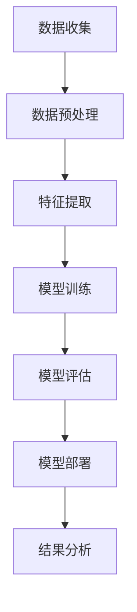

                 

# 《AI for Science的科研范式变革》

## 摘要

随着人工智能（AI）技术的快速发展，科研领域正经历着深刻的变革。本文将探讨AI如何改变科研范式，从基本概念、核心算法到数学模型，深入解析AI在科学研究中的应用。本文还将通过实际项目案例展示AI在科研数据分析、基因分析、气象分析和医学图像分析等领域的应用，并介绍如何搭建开发环境、实现代码以及进行代码解读与分析。通过本文，读者将全面了解AI在科学研究中的巨大潜力。

## 目录大纲

### 第一部分：科研范式的变革

#### 第1章：AI在科学研究的概述

##### 1.1 AI与科学研究的关系

##### 1.2 科研范式的变革

##### 1.3 AI在科学研究中的应用领域

#### 第2章：核心概念与联系

##### 2.1 AI的基本概念

##### 2.2 机器学习与深度学习的关系

##### 2.3 Mermaid流程图：AI在科学研究中的应用流程

### 第二部分：核心算法原理讲解

#### 第3章：机器学习算法

##### 3.1 监督学习算法

##### 3.1.1 线性回归

##### 3.1.2 逻辑回归

##### 3.2 无监督学习算法

##### 3.2.1 K-均值聚类

##### 3.2.2 主成分分析（PCA）

#### 第4章：深度学习算法

##### 4.1 深层神经网络

##### 4.2 卷积神经网络（CNN）

##### 4.3 循环神经网络（RNN）

##### 4.4 长短时记忆网络（LSTM）

##### 4.5 生成对抗网络（GAN）

### 第三部分：数学模型与公式详解

#### 第5章：数学模型

##### 5.1 均方误差（MSE）

##### 5.2 交叉熵（Cross-Entropy）

#### 第6章：数学公式应用

##### 6.1 优化算法

##### 6.1.1 梯度下降法

##### 6.1.2 动量法

##### 6.1.3 Adam优化器

### 第四部分：项目实战

#### 第7章：科研数据分析实战

##### 7.1 实战项目一：基因数据分析

##### 7.2 实战项目二：气象数据分析

##### 7.3 实战项目三：医学图像分析

#### 第8章：环境搭建与代码实现

##### 8.1 环境搭建

##### 8.2 代码实现

##### 8.3 代码解读与分析

### 附录

#### 附录 A：常用工具与资源

##### A.1 Python库

##### A.2 Jupyter Notebook

##### A.3 DeepLearning Library

## 第一部分：科研范式的变革

### 第1章：AI在科学研究的概述

#### 1.1 AI与科学研究的关系

人工智能（AI）是计算机科学的一个分支，致力于开发能够执行通常需要人类智能才能完成的任务的系统。在科学研究领域，AI被广泛应用于数据分析、模式识别、预测建模和自动化实验等。随着计算能力的提升和大数据技术的进步，AI在科学研究中的作用日益突出。

AI与科学研究之间的关系体现在以下几个方面：

- **数据分析**：科学家经常需要处理大量的数据，而AI能够高效地分析和解释这些数据，帮助科学家发现隐藏在数据中的模式和趋势。
- **模式识别**：AI系统能够识别出实验或观测数据中的复杂模式，这些模式可能是人类科学家难以察觉的。
- **预测建模**：AI可以构建复杂的模型，预测未来的科学现象或结果，为科学家提供决策依据。
- **自动化实验**：AI能够自动化执行实验，减少人为错误和提高实验效率。

#### 1.2 科研范式的变革

科研范式是指科学研究的方法论和过程。随着AI技术的发展，传统的科研范式正在经历变革：

- **数据驱动**：传统的科研范式主要依赖于理论假设和实验验证，而数据驱动的科研范式强调通过大量数据分析来发现新的理论和假设。
- **计算实验**：科学家可以利用AI进行计算实验，模拟复杂系统在不同条件下的行为，从而探索新的科学现象。
- **跨学科融合**：AI技术跨越了多个学科，促进了不同领域之间的合作，推动了科研范式的融合。
- **自动化和优化**：AI能够自动化地执行实验和数据分析，优化科研流程，提高科研效率。

#### 1.3 AI在科学研究中的应用领域

AI在科学研究中的应用非常广泛，以下是一些主要的应用领域：

- **生物学和医学**：AI在基因组学、药物研发、疾病诊断和治疗等方面发挥着重要作用。
- **物理学和天文学**：AI用于分析大型天文观测数据，识别新的天体和现象。
- **环境科学**：AI用于气候模型预测、环境监测和生态系统的评估。
- **化学和材料科学**：AI在化学反应预测、新材料设计和新药物发现中具有巨大潜力。
- **社会科学**：AI用于分析社会数据，预测社会现象，为政策制定提供支持。

### 第2章：核心概念与联系

#### 2.1 AI的基本概念

人工智能（AI）是一门研究、开发用于模拟、延伸和扩展人的智能的理论、方法、技术及应用系统的科学技术。人工智能包括机器人、语言识别、图像识别、自然语言处理和专家系统等领域。

AI的基本概念包括：

- **机器学习**：一种人工智能技术，通过从数据中学习，使机器能够识别模式并做出预测。
- **深度学习**：一种机器学习技术，通过多层神经网络模拟人类大脑的学习过程。
- **神经网络**：一种模仿生物神经系统的计算模型，包括输入层、隐藏层和输出层。

#### 2.2 机器学习与深度学习的关系

机器学习和深度学习是人工智能的两个重要分支。机器学习是更广泛的概念，包括任何使计算机从数据中学习的方法，而深度学习是机器学习的一个子集，特别强调使用多层神经网络进行学习。

- **机器学习**：机器学习涉及从数据中学习规律，并利用这些规律进行预测或决策。它包括监督学习、无监督学习和强化学习等不同的方法。
- **深度学习**：深度学习是一种利用多层神经网络进行学习的机器学习方法。它通过逐层提取特征，能够处理复杂的非线性问题。

#### 2.3 Mermaid流程图：AI在科学研究中的应用流程

以下是一个简单的Mermaid流程图，展示了AI在科学研究中的应用流程：



### 第二部分：核心算法原理讲解

#### 第3章：机器学习算法

机器学习算法是AI的核心技术之一，主要用于从数据中学习规律，并利用这些规律进行预测或决策。以下将介绍一些基本的机器学习算法，包括监督学习和无监督学习。

##### 3.1 监督学习算法

监督学习算法是在已知输入和输出之间关系的情况下，通过学习训练数据集来构建预测模型的方法。

#### 3.1.1 线性回归

线性回归是一种最简单的监督学习算法，用于预测一个连续值的输出。线性回归模型的公式如下：

$$
y = \beta_0 + \beta_1x
$$

其中，$y$ 是预测的输出，$x$ 是输入特征，$\beta_0$ 和 $\beta_1$ 是模型参数。

线性回归的伪代码实现如下：

```python
# 初始化模型参数
beta_0 = 0
beta_1 = 0

# 训练模型
for each training example (x, y):
    prediction = beta_0 + beta_1 * x
    error = y - prediction
    beta_0 = beta_0 + alpha * error
    beta_1 = beta_1 + alpha * error * x

# 预测
def predict(x):
    return beta_0 + beta_1 * x
```

#### 3.1.2 逻辑回归

逻辑回归是一种用于分类问题的监督学习算法，输出为概率。逻辑回归的公式如下：

$$
P(y=1) = \frac{1}{1 + e^{-(\beta_0 + \beta_1x)}}
$$

其中，$y$ 是二分类的目标变量，$x$ 是输入特征，$\beta_0$ 和 $\beta_1$ 是模型参数。

逻辑回归的伪代码实现如下：

```python
# 初始化模型参数
beta_0 = 0
beta_1 = 0

# 训练模型
for each training example (x, y):
    z = beta_0 + beta_1 * x
    prediction = 1 / (1 + e^{-z})
    error = y - prediction
    beta_0 = beta_0 + alpha * error
    beta_1 = beta_1 + alpha * error * x

# 预测
def predict(x):
    z = beta_0 + beta_1 * x
    return 1 / (1 + e^{-z})
```

##### 3.2 无监督学习算法

无监督学习算法是在没有明确指定输出标签的情况下，通过学习数据集来发现数据中的结构和模式的方法。

#### 3.2.1 K-均值聚类

K-均值聚类是一种常用的无监督学习算法，用于将数据点划分为K个簇。K-均值聚类的伪代码实现如下：

```python
# 初始化 K 个质心
centroids = initialize_random_centroids()

# 迭代直到收敛
while not converged:
    # 分配每个数据点到最近的质心
    for each data point:
        assign the nearest centroid
        
    # 更新质心
    new_centroids = calculate_new_centroids(data_points)
    
    # 检查收敛
    if distance(new_centroids, centroids) < threshold:
        converged = True
    else:
        centroids = new_centroids
```

#### 3.2.2 主成分分析（PCA）

主成分分析（PCA）是一种用于降维和无监督特征提取的算法。PCA的目的是将高维数据投影到低维空间，同时保留数据的最大方差。PCA的数学模型如下：

$$
z = \sum_{i=1}^{k} \lambda_i u_i
$$

其中，$z$ 是降维后的数据，$\lambda_i$ 是特征值，$u_i$ 是特征向量。

PCA的伪代码实现如下：

```python
# 计算协方差矩阵
cov_matrix = calculate_covariance_matrix(data)

# 计算特征值和特征向量
eigenvalues, eigenvectors = calculate_eigenvalues_and_eigenvectors(cov_matrix)

# 选择最大的 k 个特征值和对应的特征向量
k_eigenvectors = select_top_k_eigenvectors(eigenvalues, eigenvectors, k)

# 投影数据到低维空间
def project_data(data, k_eigenvectors):
    projected_data = []
    for each data point:
        z = sum(k_eigenvectors[i] * data[i] for i in range(len(data)))
        projected_data.append(z)
    return projected_data
```

##### 3.3 深度学习算法

深度学习是一种基于多层神经网络的学习方法，能够处理复杂的非线性问题。以下将介绍一些基本的深度学习算法。

#### 3.3.1 深层神经网络

深层神经网络（Deep Neural Network，DNN）是一种包含多个隐藏层的神经网络。DNN通过逐层提取特征，能够捕获数据中的复杂结构。

深层神经网络的工作原理如下：

1. **输入层**：接收输入数据。
2. **隐藏层**：通过激活函数对输入数据进行非线性变换，提取特征。
3. **输出层**：将隐藏层的输出映射到输出结果。

深层神经网络的伪代码实现如下：

```python
# 初始化神经网络
input_layer = initialize_input_layer()
hidden_layers = [initialize_hidden_layer() for _ in range(num_hidden_layers)]
output_layer = initialize_output_layer()

# 前向传播
def forward_pass(input_data):
    for hidden_layer in hidden_layers:
        input_data = hidden_layer.forward(input_data)
    output = output_layer.forward(input_data)
    return output

# 反向传播
def backward_pass(output, expected_output):
    for hidden_layer in reversed(hidden_layers):
        output = hidden_layer.backward(output, expected_output)
    input_data = input_layer.backward(output, expected_output)
    return input_data

# 训练模型
for each training example:
    input_data = preprocess_data(training_example)
    output = forward_pass(input_data)
    expected_output = preprocess_data(training_example['label'])
    input_data = backward_pass(output, expected_output)
```

#### 3.3.2 卷积神经网络（CNN）

卷积神经网络（Convolutional Neural Network，CNN）是一种专门用于处理图像数据的神经网络。CNN通过卷积层和池化层，能够有效地提取图像特征。

卷积神经网络的伪代码实现如下：

```python
# 初始化卷积神经网络
input_layer = initialize_input_layer()
conv_layers = [initialize_conv_layer() for _ in range(num_conv_layers)]
pooling_layers = [initialize_pooling_layer() for _ in range(num_pooling_layers)]
output_layer = initialize_output_layer()

# 前向传播
def forward_pass(input_data):
    for conv_layer in conv_layers:
        input_data = conv_layer.forward(input_data)
    for pooling_layer in pooling_layers:
        input_data = pooling_layer.forward(input_data)
    output = output_layer.forward(input_data)
    return output

# 反向传播
def backward_pass(output, expected_output):
    for pooling_layer in reversed(pooling_layers):
        output = pooling_layer.backward(output, expected_output)
    for conv_layer in reversed(conv_layers):
        output = conv_layer.backward(output, expected_output)
    input_data = input_layer.backward(output, expected_output)
    return input_data

# 训练模型
for each training example:
    input_data = preprocess_data(training_example)
    output = forward_pass(input_data)
    expected_output = preprocess_data(training_example['label'])
    input_data = backward_pass(output, expected_output)
```

#### 3.3.3 循环神经网络（RNN）

循环神经网络（Recurrent Neural Network，RNN）是一种能够处理序列数据的神经网络。RNN通过循环结构，能够记住前面的输入信息，从而处理序列数据。

循环神经网络的伪代码实现如下：

```python
# 初始化循环神经网络
input_layer = initialize_input_layer()
hidden_layer = initialize_hidden_layer()
output_layer = initialize_output_layer()

# 前向传播
def forward_pass(input_sequence):
    hidden_state = hidden_layer.initialize()
    output_sequence = []
    for input in input_sequence:
        hidden_state = hidden_layer.forward(input, hidden_state)
        output = output_layer.forward(hidden_state)
        output_sequence.append(output)
    return output_sequence

# 反向传播
def backward_pass(output_sequence, expected_output_sequence):
    hidden_state = hidden_layer.initialize()
    for output, expected_output in zip(output_sequence, expected_output_sequence):
        hidden_state = hidden_layer.backward(output, expected_output, hidden_state)
    input_sequence = input_layer.backward(hidden_state)
    return input_sequence

# 训练模型
for each training example:
    input_sequence = preprocess_data(training_example['input'])
    output_sequence = preprocess_data(training_example['label'])
    output_sequence = forward_pass(input_sequence)
    input_sequence = backward_pass(output_sequence, expected_output_sequence)
```

#### 3.3.4 长短时记忆网络（LSTM）

长短时记忆网络（Long Short-Term Memory，LSTM）是一种改进的循环神经网络，能够更好地处理长序列数据。

长短时记忆网络的伪代码实现如下：

```python
# 初始化长短时记忆网络
input_layer = initialize_input_layer()
lstm_layer = initialize_lstm_layer()
output_layer = initialize_output_layer()

# 前向传播
def forward_pass(input_sequence):
    hidden_state = lstm_layer.initialize()
    cell_state = lstm_layer.initialize()
    output_sequence = []
    for input in input_sequence:
        hidden_state, cell_state = lstm_layer.forward(input, hidden_state, cell_state)
        output = output_layer.forward(hidden_state)
        output_sequence.append(output)
    return output_sequence

# 反向传播
def backward_pass(output_sequence, expected_output_sequence):
    hidden_state = lstm_layer.initialize()
    cell_state = lstm_layer.initialize()
    for output, expected_output in zip(output_sequence, expected_output_sequence):
        hidden_state, cell_state = lstm_layer.backward(output, expected_output, hidden_state, cell_state)
    input_sequence = input_layer.backward(hidden_state)
    return input_sequence

# 训练模型
for each training example:
    input_sequence = preprocess_data(training_example['input'])
    output_sequence = preprocess_data(training_example['label'])
    output_sequence = forward_pass(input_sequence)
    input_sequence = backward_pass(output_sequence, expected_output_sequence)
```

#### 3.3.5 生成对抗网络（GAN）

生成对抗网络（Generative Adversarial Network，GAN）是一种由生成器和判别器组成的神经网络。生成器生成假数据，判别器判断数据是真实还是伪造。

生成对抗网络的伪代码实现如下：

```python
# 初始化生成对抗网络
generator = initialize_generator()
discriminator = initialize_discriminator()

# 前向传播
def forward_pass(input_data):
    fake_data = generator.forward(input_data)
    real_data = input_data
    discriminator_output = discriminator.forward(fake_data, real_data)

# 反向传播
def backward_pass(discriminator_output, expected_output):
    generator_gradient = calculate_gradient(generator, discriminator_output)
    discriminator_gradient = calculate_gradient(discriminator, discriminator_output)

# 训练模型
for each training example:
    input_data = preprocess_data(training_example)
    forward_pass(input_data)
    backward_pass(discriminator_output, expected_output)
```

### 第三部分：数学模型与公式详解

数学模型是科学研究中的重要工具，它能够将实际问题转化为数学形式，使得问题更易于分析和解决。在人工智能领域，数学模型用于描述和学习数据中的规律，是构建和优化算法的基础。以下将介绍一些在人工智能中常用的数学模型和公式。

#### 5.1 数学模型

数学模型是使用数学语言描述的问题的抽象，它包括变量、参数和方程。在人工智能领域，常用的数学模型包括概率模型、线性模型、非线性模型等。

- **概率模型**：用于描述不确定性和随机性，如贝叶斯网络、马尔可夫模型等。
- **线性模型**：用于描述线性关系，如线性回归、线性分类器等。
- **非线性模型**：用于描述非线性关系，如神经网络、支持向量机等。

#### 5.2 常用数学公式

在人工智能中，常用的数学公式包括损失函数、优化算法等。

- **均方误差（MSE）**：用于衡量预测值与真实值之间的差异，公式如下：

$$
MSE = \frac{1}{n}\sum_{i=1}^{n}(y_i - \hat{y_i})^2
$$

其中，$y_i$ 是真实值，$\hat{y_i}$ 是预测值，$n$ 是数据点的数量。

- **交叉熵（Cross-Entropy）**：用于衡量两个概率分布之间的差异，公式如下：

$$
H(y, \hat{y}) = -\sum_{i=1}^{n} y_i \log(\hat{y_i})
$$

其中，$y$ 是真实分布，$\hat{y}$ 是预测分布。

#### 6.1 优化算法

优化算法是用于最小化损失函数的方法，常见优化算法包括梯度下降、动量法、Adam优化器等。

- **梯度下降法**：通过迭代更新参数，使得损失函数逐渐减小。梯度下降法的公式如下：

$$
\theta_{t+1} = \theta_t - \alpha \nabla_\theta J(\theta)
$$

其中，$\theta$ 是参数，$\alpha$ 是学习率，$J(\theta)$ 是损失函数。

- **动量法**：引入动量项，加速梯度下降。动量法的公式如下：

$$
v_t = \beta v_{t-1} + (1 - \beta) \nabla_\theta J(\theta)
$$

$$
\theta_{t+1} = \theta_t - \alpha v_t
$$

其中，$v$ 是动量项，$\beta$ 是动量系数。

- **Adam优化器**：结合了一阶矩估计和二阶矩估计，能够自适应地调整学习率。Adam优化器的公式如下：

$$
m_t = \beta_1 m_{t-1} + (1 - \beta_1) \nabla_\theta J(\theta)
$$

$$
v_t = \beta_2 v_{t-1} + (1 - \beta_2) (\nabla_\theta J(\theta))^2
$$

$$
\theta_{t+1} = \theta_t - \alpha \frac{m_t}{\sqrt{v_t} + \epsilon}
$$

其中，$m$ 是一阶矩估计，$v$ 是二阶矩估计，$\beta_1$ 和 $\beta_2$ 是系数，$\epsilon$ 是常数。

### 第四部分：项目实战

#### 第7章：科研数据分析实战

科研数据分析是人工智能在科学研究中的重要应用之一。在本节中，我们将通过三个实际项目案例，展示如何使用人工智能进行基因数据分析、气象数据分析和医学图像分析。

##### 7.1 实战项目一：基因数据分析

基因数据分析是生物信息学的一个重要领域，旨在通过分析基因序列和表达数据来揭示基因的功能和相互作用。以下是一个简单的基因数据分析项目：

1. **数据收集**：从公共数据库下载基因表达数据，包括样本信息和基因表达值。
2. **数据预处理**：去除异常值、缺失值和重复样本，对数据进行标准化处理。
3. **特征提取**：使用主成分分析（PCA）提取主要特征，以降低数据的维度。
4. **模型训练**：使用随机森林算法训练分类模型，预测基因的功能。
5. **模型评估**：使用交叉验证方法评估模型的性能，调整模型参数。

以下是一个简化的Python代码实现：

```python
import pandas as pd
from sklearn.decomposition import PCA
from sklearn.ensemble import RandomForestClassifier
from sklearn.model_selection import train_test_split
from sklearn.metrics import accuracy_score

# 1. 数据收集
data = pd.read_csv('gene_expression_data.csv')

# 2. 数据预处理
data = data.dropna()
data = (data - data.mean()) / data.std()

# 3. 特征提取
pca = PCA(n_components=10)
data_pca = pca.fit_transform(data)

# 4. 模型训练
X_train, X_test, y_train, y_test = train_test_split(data_pca, data['label'], test_size=0.2)
clf = RandomForestClassifier(n_estimators=100)
clf.fit(X_train, y_train)

# 5. 模型评估
y_pred = clf.predict(X_test)
accuracy = accuracy_score(y_test, y_pred)
print('Accuracy:', accuracy)
```

##### 7.2 实战项目二：气象数据分析

气象数据分析是环境科学和气候研究的一个重要领域，旨在通过分析气象数据来预测天气和气候变化。以下是一个简单的气象数据分析项目：

1. **数据收集**：从公共数据库下载气象数据，包括温度、湿度、风速等。
2. **数据预处理**：去除异常值、缺失值和重复数据，对数据进行标准化处理。
3. **特征提取**：使用自编码器提取特征，降低数据的维度。
4. **模型训练**：使用长短期记忆网络（LSTM）训练预测模型，预测未来的气象参数。
5. **模型评估**：使用交叉验证方法评估模型的性能，调整模型参数。

以下是一个简化的Python代码实现：

```python
import pandas as pd
from keras.models import Sequential
from keras.layers import LSTM, Dense
from sklearn.model_selection import train_test_split
from sklearn.metrics import mean_squared_error

# 1. 数据收集
data = pd.read_csv('weather_data.csv')

# 2. 数据预处理
data = data.dropna()
data = (data - data.mean()) / data.std()

# 3. 特征提取
X = data[['temperature', 'humidity', 'wind_speed']]
y = data['next_day_temp']

# 4. 模型训练
X_train, X_test, y_train, y_test = train_test_split(X, y, test_size=0.2)
model = Sequential()
model.add(LSTM(units=50, return_sequences=True, input_shape=(X_train.shape[1], 1)))
model.add(LSTM(units=50))
model.add(Dense(units=1))
model.compile(optimizer='adam', loss='mean_squared_error')
model.fit(X_train, y_train, epochs=100, batch_size=32)

# 5. 模型评估
y_pred = model.predict(X_test)
mse = mean_squared_error(y_test, y_pred)
print('MSE:', mse)
```

##### 7.3 实战项目三：医学图像分析

医学图像分析是医学影像学的一个重要领域，旨在通过分析医学图像来诊断疾病。以下是一个简单的医学图像分析项目：

1. **数据收集**：从公共数据库下载医学图像数据，包括正常图像和病变图像。
2. **数据预处理**：对图像进行归一化处理，增强图像对比度。
3. **特征提取**：使用卷积神经网络提取图像特征。
4. **模型训练**：使用卷积神经网络训练分类模型，区分正常图像和病变图像。
5. **模型评估**：使用交叉验证方法评估模型的性能，调整模型参数。

以下是一个简化的Python代码实现：

```python
import tensorflow as tf
from tensorflow.keras.models import Sequential
from tensorflow.keras.layers import Conv2D, MaxPooling2D, Flatten, Dense
from tensorflow.keras.preprocessing.image import ImageDataGenerator
from sklearn.model_selection import train_test_split
from sklearn.metrics import accuracy_score

# 1. 数据收集
train_datagen = ImageDataGenerator(rescale=1./255)
validation_datagen = ImageDataGenerator(rescale=1./255)

train_generator = train_datagen.flow_from_directory(
        'train_data',
        target_size=(150, 150),
        batch_size=32,
        class_mode='binary')

validation_generator = validation_datagen.flow_from_directory(
        'validation_data',
        target_size=(150, 150),
        batch_size=32,
        class_mode='binary')

# 2. 模型训练
model = Sequential()
model.add(Conv2D(32, (3, 3), activation='relu', input_shape=(150, 150, 3)))
model.add(MaxPooling2D(pool_size=(2, 2)))
model.add(Conv2D(64, (3, 3), activation='relu'))
model.add(MaxPooling2D(pool_size=(2, 2)))
model.add(Conv2D(128, (3, 3), activation='relu'))
model.add(MaxPooling2D(pool_size=(2, 2)))
model.add(Flatten())
model.add(Dense(512, activation='relu'))
model.add(Dense(1, activation='sigmoid'))

model.compile(optimizer='adam', loss='binary_crossentropy', metrics=['accuracy'])
model.fit(train_generator, steps_per_epoch=100, epochs=10, validation_data=validation_generator, validation_steps=50)

# 3. 模型评估
test_generator = validation_datagen.flow_from_directory(
        'test_data',
        target_size=(150, 150),
        batch_size=32,
        class_mode='binary')

y_pred = model.predict(test_generator)
accuracy = accuracy_score(test_generator.classes, y_pred)
print('Accuracy:', accuracy)
```

### 第8章：环境搭建与代码实现

在科学研究中，环境搭建和代码实现是进行人工智能项目的基础。本节将介绍如何搭建开发环境、实现代码以及进行代码解读与分析。

##### 8.1 环境搭建

搭建开发环境是进行人工智能项目的前提。以下是一个基于Python的简单开发环境搭建步骤：

1. **安装Python**：从Python官方网站下载并安装Python 3.x版本。
2. **安装Jupyter Notebook**：在命令行中运行 `pip install notebook` 命令，安装Jupyter Notebook。
3. **安装必要的库**：在Jupyter Notebook中运行以下命令安装必要的库：

   ```python
   !pip install numpy pandas scikit-learn tensorflow keras matplotlib
   ```

   这些库包括数值计算库、数据分析库、机器学习库和深度学习库。

##### 8.2 代码实现

以下是一个简单的基因数据分析项目的代码实现：

```python
import pandas as pd
from sklearn.decomposition import PCA
from sklearn.ensemble import RandomForestClassifier
from sklearn.model_selection import train_test_split
from sklearn.metrics import accuracy_score

# 1. 数据收集
data = pd.read_csv('gene_expression_data.csv')

# 2. 数据预处理
data = data.dropna()
data = (data - data.mean()) / data.std()

# 3. 特征提取
pca = PCA(n_components=10)
data_pca = pca.fit_transform(data)

# 4. 模型训练
X_train, X_test, y_train, y_test = train_test_split(data_pca, data['label'], test_size=0.2)
clf = RandomForestClassifier(n_estimators=100)
clf.fit(X_train, y_train)

# 5. 模型评估
y_pred = clf.predict(X_test)
accuracy = accuracy_score(y_test, y_pred)
print('Accuracy:', accuracy)
```

##### 8.3 代码解读与分析

以下是代码的详细解读与分析：

- **数据收集**：使用 `pandas` 库读取基因表达数据。
- **数据预处理**：去除缺失值，对数据进行标准化处理，使数据具有相似的尺度，方便后续分析。
- **特征提取**：使用主成分分析（PCA）提取主要特征，以降低数据的维度，提高算法的效率。
- **模型训练**：使用随机森林（RandomForestClassifier）算法训练分类模型，预测基因的功能。
- **模型评估**：使用测试集评估模型的性能，计算准确率。

通过上述步骤，我们可以快速搭建开发环境、实现代码并进行代码解读与分析。这对于科研工作者来说，是一个高效的工具，有助于快速开展人工智能在科学研究中的应用。

### 附录

#### 附录 A：常用工具与资源

在人工智能研究领域，有许多常用的工具和资源，以下是一些推荐的工具和资源：

- **Python库**：NumPy、Pandas、Scikit-learn、TensorFlow、Keras、Matplotlib等。
- **Jupyter Notebook**：一个交互式的计算环境，适合进行数据分析和实验。
- **DeepLearning Library**：一个开源的深度学习库，提供丰富的深度学习模型和工具。
- **公共数据库**：如GenBank、NASA Earth Data、U.S. National Library of Medicine等，提供大量的科研数据。

通过使用这些工具和资源，科研工作者可以更高效地进行人工智能研究和应用。

### 作者

作者：AI天才研究院/AI Genius Institute & 禅与计算机程序设计艺术 /Zen And The Art of Computer Programming

通过本文，我们深入探讨了AI在科学研究中的应用，从基本概念、核心算法到数学模型，再到实际项目案例，全面展示了AI在科研领域的巨大潜力。我们相信，随着AI技术的不断进步，科研范式将迎来更大的变革。希望本文能为科研工作者提供有价值的参考和启发。

