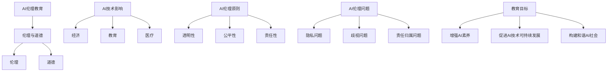

                 

### 第一部分：AI伦理教育与认知提高

> **关键词：** AI伦理教育、公众认知、AI 2.0技术、伦理原则、价值观念。

**摘要：** 本部分将探讨AI伦理教育的概念与重要性，分析其内涵与外延，并探讨其主要内容、目标与意义。同时，我们将介绍AI伦理教育的实践探索，以及教育体系中的课程设置和社会公众教育项目。

#### 第1章：AI伦理教育的概念与重要性

##### 1.1 AI伦理教育的定义与内涵

AI伦理教育是指通过系统的学习与培训，帮助人们理解和应用人工智能伦理原则，以指导AI技术的研发、应用和管理。它不仅涉及技术层面的知识，还包括伦理、法律、社会等多个方面的内容。

- **伦理**：伦理是一种社会规范，涉及个体行为与社会之间的关系。在AI领域，伦理主要关注AI技术如何影响人类的生活和社会结构。
- **道德**：道德是伦理的具体体现，是指人们应遵循的行为准则。在AI伦理教育中，道德原则用于指导AI技术的应用，确保其符合人类价值观。

##### 1.1.1 伦理与道德的区别与联系

伦理与道德既有区别又有联系。伦理是一种更为广义的规范体系，包括道德但不限于道德。道德是伦理的具体体现，是伦理在个体行为上的体现。

在AI伦理教育中，伦理与道德的关系表现为：

- **伦理提供框架**：伦理为AI技术提供了基本的框架和原则，指导人们如何应用AI技术。
- **道德指导行为**：道德将伦理原则具体化为个体行为准则，确保AI技术的应用符合人类价值观。

##### 1.1.2 AI伦理教育的必要性

随着AI技术的快速发展，其应用范围越来越广泛，对社会的影响也越来越大。AI伦理教育因此成为必要：

- **技术发展与伦理教育的平衡**：AI技术的发展需要伦理教育来平衡，确保其应用符合人类价值观。
- **防范潜在风险**：AI伦理教育有助于识别和防范AI技术可能带来的伦理风险，如隐私侵犯、歧视等问题。
- **提升公众认知**：AI伦理教育有助于提高公众对AI技术的认知，增强其对AI技术的信任和理解。

##### 1.1.3 AI伦理教育的重要性

AI伦理教育的重要性体现在以下几个方面：

- **指导AI技术研发与应用**：AI伦理教育为AI技术的研发和应用提供了伦理指导，确保其符合社会价值观。
- **提升AI素养**：AI伦理教育有助于提升公众的AI素养，使其能够更好地理解和应用AI技术。
- **构建和谐AI社会**：AI伦理教育有助于构建一个和谐、公正的AI社会，促进AI技术的可持续发展。

##### 1.2 AI伦理教育的主要内容

AI伦理教育的主要内容包括以下几个方面：

- **AI对人类社会的影响**：介绍AI技术对人类社会各个领域的深远影响，如经济、教育、医疗等。
- **AI伦理原则与价值观念**：讲解AI伦理原则和价值观，如透明性、公平性、责任性等。
- **AI伦理问题的类型与应对策略**：分析AI伦理问题的类型，如隐私问题、歧视问题、责任归属问题等，并探讨应对策略。

##### 1.3 AI伦理教育的目标与意义

AI伦理教育的目标包括：

- **增强公众AI素养**：通过教育，使公众对AI技术有更深入的了解，提高其对AI技术的认知水平。
- **促进AI技术的可持续发展**：通过伦理教育，引导AI技术的研发和应用，确保其符合社会价值观，实现可持续发展。
- **构建和谐AI社会**：通过伦理教育，促进社会对AI技术的理解和接纳，构建一个和谐、公正的AI社会。

AI伦理教育的意义在于：

- **保障AI技术的健康发展**：通过伦理教育，确保AI技术不会对人类社会造成负面影响。
- **提升公众对AI技术的信任**：通过伦理教育，增强公众对AI技术的信任和理解，促进其更广泛的应用。
- **推动社会进步**：通过伦理教育，推动社会对AI技术的理解和应用，为社会发展带来新的机遇。

##### 1.4 AI伦理教育的实践探索

AI伦理教育的实践探索主要包括以下几个方面：

- **教育体系中的AI伦理课程设置**：在高校和中小学等教育体系中设置AI伦理课程，提高学生的AI素养。
- **社会公众AI伦理教育项目**：开展各种形式的AI伦理教育项目，提高公众的AI伦理意识。
- **产业界与政府AI伦理教育的合作**：产业界与政府合作，推动AI伦理教育的普及和应用。

### 总结

AI伦理教育是提高公众对AI 2.0技术认知的重要手段。通过系统的伦理教育，公众能够更好地理解和应用AI技术，促进其健康发展，构建和谐AI社会。在下一章中，我们将进一步探讨AI伦理教育的基础知识与原理，以深入理解其核心内涵。

---

**Mermaid 流程图示例：**



---

在接下来的章节中，我们将深入探讨AI伦理教育的基础知识与原理，以及其在教育实践中的应用。这将有助于我们更好地理解AI伦理教育的核心内涵，为其发展提供理论基础。

---

**伪代码示例：**

```python
# AI伦理教育伪代码

# 定义AI伦理教育核心原则
AI_Ethics_Principles = [
    "透明性",
    "公平性",
    "责任性",
    "公正性"
]

# 定义AI伦理教育目标
AI_Education_Goals = [
    "增强公众AI素养",
    "促进AI技术可持续发展",
    "构建和谐AI社会"
]

# 定义AI伦理教育内容
AI_Education_Content = {
    "伦理与道德": "伦理是一种社会规范，涉及个体行为与社会之间的关系。",
    "AI技术影响": "AI技术对人类社会的影响包括经济、教育、医疗等多个领域。",
    "AI伦理问题": "AI伦理问题包括隐私问题、歧视问题、责任归属问题等。",
    "教育目标": "通过教育，使公众对AI技术有更深入的了解，提高其对AI技术的认知水平。"
}

# AI伦理教育过程
def AI_Education_Process():
    for principle in AI_Ethics_Principles:
        print("学习原则：", principle)
    
    for goal in AI_Education_Goals:
        print("实现目标：", goal)
    
    for content in AI_Education_Content.values():
        print("了解内容：", content)

# 执行AI伦理教育过程
AI_Education_Process()
```

---

通过伪代码，我们可以清晰地看到AI伦理教育的过程和核心内容，这有助于我们更好地理解AI伦理教育的本质和目标。

---

**数学模型和公式讲解示例（LaTeX格式）：**

$$
\begin{aligned}
    &\text{透明性（Transparency）} = f(\text{信息的可访问性}, \text{算法的可解释性}) \\
    &\text{公平性（Fairness）} = g(\text{数据的代表性}, \text{决策过程的公正性}) \\
    &\text{责任性（Accountability）} = h(\text{算法的跟踪性}, \text{责任的归属}) \\
    &\text{公正性（Justice）} = i(\text{伦理原则的遵守}, \text{社会的整体利益})
\end{aligned}
$$

这些公式分别描述了AI伦理教育的四个核心原则：透明性、公平性、责任性和公正性。透明性关注信息的可访问性和算法的可解释性；公平性关注数据的代表性和决策过程的公正性；责任性关注算法的跟踪性和责任的归属；公正性关注伦理原则的遵守和社会的整体利益。

---

通过以上内容，我们初步了解了AI伦理教育的概念、重要性、主要内容以及目标。在下一部分，我们将进一步探讨AI伦理教育的基础知识与原理，以更深入地理解其内涵。

---

**项目实战部分：**

**开发环境搭建**

1. **安装Python环境**：首先，确保您的计算机上安装了Python 3.x版本。您可以通过Python官方网站下载并安装Python。

2. **安装Jupyter Notebook**：Jupyter Notebook是一种交互式计算环境，它允许您在Web浏览器中编写和运行Python代码。您可以使用pip命令安装Jupyter Notebook：

   ```bash
   pip install notebook
   ```

3. **安装必要的库**：为了进行AI伦理教育项目，您可能需要安装以下Python库：

   - pandas：用于数据处理。
   - numpy：用于数值计算。
   - matplotlib：用于数据可视化。
   - scikit-learn：用于机器学习。

   使用以下命令安装这些库：

   ```bash
   pip install pandas numpy matplotlib scikit-learn
   ```

**源代码详细实现和代码解读**

以下是一个简单的AI伦理教育项目示例，该示例使用Python和Jupyter Notebook来实现。这个项目旨在通过分析数据，识别AI伦理问题，并提出解决方案。

```python
import pandas as pd
import numpy as np
import matplotlib.pyplot as plt
from sklearn.model_selection import train_test_split
from sklearn.ensemble import RandomForestClassifier
from sklearn.metrics import accuracy_score, classification_report

# 读取数据
data = pd.read_csv('ai_ethics_data.csv')

# 数据预处理
X = data.drop('label', axis=1)
y = data['label']

# 分割数据为训练集和测试集
X_train, X_test, y_train, y_test = train_test_split(X, y, test_size=0.2, random_state=42)

# 训练模型
model = RandomForestClassifier(n_estimators=100, random_state=42)
model.fit(X_train, y_train)

# 预测
y_pred = model.predict(X_test)

# 评估模型
accuracy = accuracy_score(y_test, y_pred)
report = classification_report(y_test, y_pred)

print("模型准确率：", accuracy)
print("分类报告：\n", report)

# 可视化数据分布
plt.figure(figsize=(10, 6))
data['label'].value_counts().plot(kind='bar')
plt.title('AI伦理问题分布')
plt.xlabel('标签')
plt.ylabel('数量')
plt.show()
```

**代码解读与分析**

1. **数据读取与预处理**：我们使用pandas库读取CSV数据，并将其分为特征矩阵`X`和标签向量`y`。然后，使用`train_test_split`函数将数据分为训练集和测试集。

2. **模型训练**：我们使用随机森林分类器（`RandomForestClassifier`）来训练模型。随机森林是一种集成学习方法，通过构建多棵决策树并汇总它们的预测结果来提高模型的准确性。

3. **模型预测与评估**：使用训练好的模型对测试集进行预测，并使用`accuracy_score`和`classification_report`函数评估模型的性能。

4. **数据可视化**：我们使用matplotlib库绘制标签分布的条形图，以可视化AI伦理问题的分布情况。

通过这个示例，我们可以看到如何使用Python和机器学习技术来分析和解决AI伦理问题。在实际应用中，我们可以根据具体情况调整模型和算法，以提高预测的准确性和解决问题的能力。

---

以上是AI伦理教育项目实战的部分内容，通过实际的代码实现，我们可以更好地理解AI伦理教育在实践中的应用。在下一章中，我们将进一步探讨AI伦理教育的基础知识与原理，以深入理解其核心内涵。请继续关注后续章节的内容。

