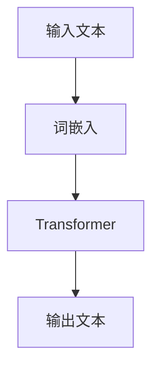
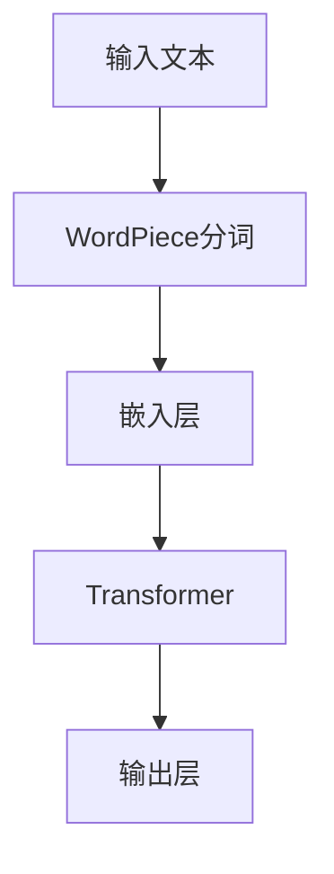
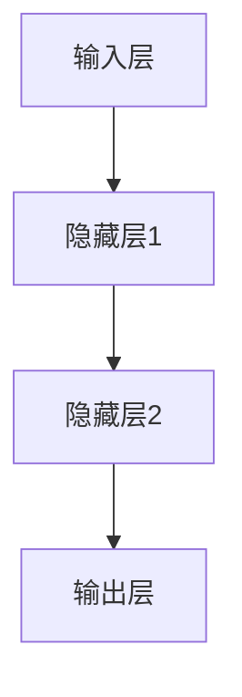

                 

# AI大模型创业：如何利用品牌优势？

> **关键词：** AI大模型、创业、品牌优势、应用、案例分析

> **摘要：** 本文将深入探讨AI大模型在创业中的应用，以及如何利用品牌优势来推动AI大模型创业项目的成功。我们将分析AI大模型的基础知识，介绍主流的AI大模型，探讨AI大模型的技术基础，并详细探讨AI大模型在创业中的应用价值。同时，本文还将提供AI大模型创业的实践策略，分析品牌优势与AI大模型的结合策略，并通过成功和失败的案例来指导创业者。最后，我们对AI大模型创业的未来趋势进行展望，并总结创业者应具备的素质与能力。

## 第一部分：AI大模型基础

### 第1章：AI大模型概述

#### 第1.1节：AI大模型的概念与特点

##### 1.1.1 AI大模型的定义
AI大模型指的是拥有巨大参数量和计算量的神经网络模型，通过大量数据进行训练，可以自动从数据中学习到复杂的模式和规律。这些模型通常具有数亿到数千亿的参数，并且需要强大的计算能力来进行训练。

##### 1.1.2 AI大模型的特点
- **高参数量**：大模型通常拥有数十亿到数万亿个参数。
- **强大的表征能力**：能够处理和生成复杂的文本、图像、音频等多媒体数据。
- **迁移学习效果**：经过预训练的大模型在特定任务上只需少量数据即可实现良好的性能。

#### 第1.2节：主流AI大模型简介

##### 1.2.1 GPT系列模型
GPT（Generative Pre-trained Transformer）模型是OpenAI开发的一系列基于Transformer架构的大规模预训练语言模型。GPT-3是目前最先进的模型之一，拥有1750亿个参数，具有强大的文本生成和语义理解能力。



##### 1.2.2 BERT及其变体
BERT（Bidirectional Encoder Representations from Transformers）模型由Google开发，是一个双向的Transformer模型，用于预训练语言表示。BERT及其变体如RoBERTa、ALBERT等在多种自然语言处理任务上取得了显著的性能提升。



##### 1.2.3 其他知名大模型介绍
除了GPT和BERT系列，还有许多其他知名的大模型，如Transformer-XL、T5、DeBERTa等。这些模型在不同领域和任务上都有出色的表现。

### 第2章：AI大模型技术基础

#### 第2.1节：神经网络基础

##### 2.1.1 神经网络结构
神经网络由多个层次组成，包括输入层、隐藏层和输出层。每个层次由多个神经元（节点）组成，神经元之间通过加权连接进行信息传递。



##### 2.1.2 激活函数
激活函数用于将神经元的线性组合转换为非线性输出。常见的激活函数有Sigmoid、ReLU、Tanh等。

```latex
$$
f(x) =
\begin{cases}
\frac{1}{1 + e^{-x}} & \text{for Sigmoid} \\
\max(0, x) & \text{for ReLU} \\
\frac{e^x - 1}{e^x + 1} & \text{for Tanh}
\end{cases}
$$
```

##### 2.1.3 前向传播与反向传播算法
前向传播是指将输入数据通过神经网络传递到输出层的过程，反向传播是指通过计算梯度来更新网络参数的过程。

```python
# 前向传播
z = W * x + b
a = sigmoid(z)

# 反向传播
dz = a - y
dw = dz * x
db = dz
```

#### 第2.2节：自然语言处理

##### 2.2.1 词嵌入
词嵌入是将词语映射到高维向量空间的过程，使得相似的词语在向量空间中接近。

```python
# Word2Vec算法示例
def word2vec(context, embedding_size):
    # 将context中的每个词转换为向量
    embeddings = []
    for word in context:
        # 计算词向量
        embedding = np.random.rand(embedding_size)
        embeddings.append(embedding)
    return embeddings
```

##### 2.2.2 序列模型
序列模型用于处理时间序列数据，如循环神经网络（RNN）和长短期记忆网络（LSTM）。

```python
# LSTM算法示例
import tensorflow as tf

model = tf.keras.Sequential([
    tf.keras.layers.LSTM(units=50, activation='relu', input_shape=(timesteps, features)),
    tf.keras.layers.Dense(units=1)
])

model.compile(optimizer='adam', loss='mse')
model.fit(x, y, epochs=10)
```

##### 2.2.3 注意力机制
注意力机制是一种用于提高神经网络处理复杂任务的能力的方法，它通过为每个输入分配不同的权重来强调重要信息。

```python
# 注意力机制示例
attention_scores = softmax(scores)
context_vector = sum(attention_scores * inputs)
```

#### 第2.3节：大规模预训练模型

##### 2.3.1 预训练方法
预训练是指在大规模语料库上训练神经网络，以便为特定任务提供良好的初始化参数。

```python
# BERT预训练示例
from transformers import BertModel

model = BertModel.from_pretrained('bert-base-uncased')

# 输入文本
input_ids = tokenizer.encode("Hello, my dog is cute", return_tensors='pt')

# 预训练模型输出
outputs = model(input_ids)
last_hidden_state = outputs.last_hidden_state
```

##### 2.3.2 微调技术
微调是在预训练模型的基础上，在特定任务上进行少量的训练，以适应特定任务的需求。

```python
# 微调BERT模型
model = BertForSequenceClassification.from_pretrained('bert-base-uncased')

# 训练数据
train_data = ...

# 微调模型
model.train()
model.fit(train_data, epochs=3)
```

##### 2.3.3 迁移学习
迁移学习是指将预训练模型的知识转移到新的任务上，以提高新任务的性能。

```python
# 迁移学习示例
pretrained_model = load_model('pretrained_model.h5')
new_model = Model(inputs=pretrained_model.inputs, outputs=pretrained_model.layers[-2].output)

# 重新配置输出层
new_model.add(Dense(num_classes, activation='softmax'))

# 训练新模型
new_model.compile(optimizer='adam', loss='categorical_crossentropy', metrics=['accuracy'])
new_model.fit(x_train, y_train, epochs=10)
```

## 第二部分：AI大模型在创业中的应用

### 第3章：AI大模型在创业中的价值

#### 第3.1节：创业者如何选择AI大模型

##### 3.1.1 创业场景分析
创业者需要根据创业场景来选择合适的AI大模型。例如，如果创业场景涉及文本生成，可以选择GPT系列模型；如果涉及图像识别，可以选择基于卷积神经网络的模型。

##### 3.1.2 模型选择策略
选择AI大模型时，需要考虑以下因素：
- **任务需求**：选择能够满足任务需求的模型。
- **数据量**：选择能够处理所需数据量的模型。
- **计算资源**：选择计算资源需求合理的模型。

##### 3.1.3 数据集准备与预处理
选择合适的AI大模型后，需要准备和预处理数据集。数据集的规模和质量对模型的性能有很大影响。预处理步骤包括数据清洗、数据增强、归一化等。

#### 第3.2节：利用AI大模型提升产品竞争力

##### 3.2.1 AI大模型在产品中的应用案例
AI大模型可以应用于多种产品，例如智能客服、智能写作、智能推荐等。以下是一些应用案例：

- **智能客服**：使用GPT模型生成自然语言回复，提高客服效率。
- **智能写作**：使用BERT模型生成高质量的文章和报告。
- **智能推荐**：使用Transformer模型实现个性化推荐。

##### 3.2.2 AI大模型与用户互动优化
AI大模型可以与用户互动，提供个性化的体验。例如，智能客服可以根据用户的提问历史和偏好提供更相关的回复。

##### 3.2.3 AI大模型与数据分析
AI大模型可以用于数据分析，帮助创业者洞察用户行为和需求。例如，使用BERT模型分析用户评论和反馈，以了解用户对产品的满意度。

### 第4章：AI大模型创业实践

#### 第4.1节：创业团队AI能力建设

##### 4.1.1 AI团队构建策略
构建AI团队时，需要考虑以下策略：
- **技术人才引进**：吸引和培养具有AI领域专业知识和技能的人才。
- **团队结构**：建立高效的团队结构，包括数据科学家、机器学习工程师、软件工程师等角色。

##### 4.1.2 AI人才引进与培养
引进和培养AI人才时，需要考虑以下因素：
- **专业技能**：选择具有相关技能和经验的人才。
- **持续学习**：提供持续学习机会，以保持团队成员的技术水平。

##### 4.1.3 AI技术在创业团队中的应用
AI技术在创业团队中的应用包括：
- **数据收集与处理**：使用AI技术收集和处理数据，为创业项目提供数据支持。
- **模型开发与优化**：使用AI技术开发和优化模型，提高产品性能。

#### 第4.2节：AI大模型创业项目规划

##### 4.2.1 项目目标设定
项目目标应明确、可衡量、可实现、相关性强和时间性。例如，项目目标可以是开发一款基于AI的智能客服系统。

##### 4.2.2 项目计划与实施
项目计划应包括以下内容：
- **任务分解**：将项目任务分解为可管理的子任务。
- **资源分配**：为每个子任务分配所需资源。
- **时间表**：制定项目的时间表，确保项目按时完成。

##### 4.2.3 项目风险管理与应对策略
项目风险管理应包括以下内容：
- **风险评估**：评估项目可能面临的风险。
- **应对策略**：制定应对风险的策略，以降低风险对项目的影响。

## 第三部分：品牌优势与AI大模型

### 第5章：品牌优势与AI大模型

#### 第5.1节：品牌优势的定义与识别

##### 5.1.1 品牌优势的定义
品牌优势是指企业在市场上相对于竞争对手所具有的独特优势，包括产品优势、服务质量优势、品牌影响力等。

##### 5.1.2 如何识别品牌优势
识别品牌优势的方法包括：
- **市场调研**：通过调查用户和行业专家，了解品牌在市场上的优势。
- **SWOT分析**：通过分析品牌的优势、劣势、机会和威胁，识别品牌优势。
- **竞争分析**：通过分析竞争对手的品牌优势和市场表现，识别自身的品牌优势。

##### 5.1.3 品牌优势的重要性
品牌优势对企业的长期发展至关重要，它可以提高企业的竞争力、吸引更多用户、提升品牌价值。

#### 第5.2节：品牌优势与AI大模型结合的策略

##### 5.2.1 品牌优势与AI大模型结合的路径
品牌优势与AI大模型结合的路径包括：
- **产品创新**：利用AI大模型开发创新产品，提升用户体验。
- **服务优化**：利用AI大模型优化服务流程，提高服务质量。
- **营销推广**：利用AI大模型进行精准营销，提升品牌影响力。

##### 5.2.2 品牌优势与AI大模型的协同效应
品牌优势与AI大模型的协同效应可以带来以下好处：
- **提高产品竞争力**：品牌优势可以提升产品的市场竞争力，而AI大模型可以提供更优质的用户体验。
- **降低成本**：AI大模型可以自动化许多流程，降低人力成本。
- **提升品牌价值**：通过创新的产品和服务，提升品牌在用户心中的地位。

##### 5.2.3 实战案例分析
以下是一个品牌优势与AI大模型结合的实战案例分析：

**案例一：公司A的AI大模型创业之路**
公司A是一家专注于智能客服系统的创业公司，拥有强大的技术团队和丰富的行业经验。公司A利用AI大模型（如GPT）开发了一款智能客服系统，实现了自然语言理解和自动回复功能。公司A的品牌优势在于其高效、专业的客服服务，结合AI大模型，使得客服系统能够提供更准确、更快速的回复，大大提高了客户满意度。

### 第6章：AI大模型创业案例分析

#### 第6.1节：成功案例分享

##### 6.1.1 案例一：公司A的AI大模型创业之路
公司A是一家专注于智能客服系统的创业公司，通过结合品牌优势和AI大模型，取得了显著的成功。公司A利用GPT模型开发了一款智能客服系统，实现了自然语言理解和自动回复功能。公司A的品牌优势在于其高效、专业的客服服务，结合AI大模型，使得客服系统能够提供更准确、更快速的回复，大大提高了客户满意度。公司A的成功经验在于：

- **明确目标**：公司A明确了自己的目标市场，专注于智能客服领域，确保了产品的针对性和竞争力。
- **技术优势**：公司A拥有强大的技术团队，能够快速开发并优化AI大模型，确保产品的性能和质量。
- **品牌建设**：公司A注重品牌建设，通过提供优质的服务和个性化的用户体验，树立了良好的品牌形象。

##### 6.1.2 案例二：公司B的品牌优势与AI大模型结合实践
公司B是一家专注于智能写作平台的创业公司，通过结合品牌优势和AI大模型，实现了业务的快速增长。公司B的品牌优势在于其丰富的行业经验和高质量的内容生产能力。公司B利用BERT模型开发了一款智能写作辅助工具，可以帮助用户快速生成高质量的文章和报告。公司B的成功经验在于：

- **深入了解用户需求**：公司B通过市场调研和用户反馈，深入了解用户在写作方面的需求和痛点，确保产品的实用性。
- **技术优势**：公司B的技术团队具备丰富的AI大模型开发经验，能够快速实现产品的功能优化和性能提升。
- **品牌影响力**：公司B通过高质量的内容和服务，树立了良好的品牌形象，吸引了大量的用户和合作伙伴。

#### 第6.2节：失败案例分析

##### 6.2.1 失败原因分析
以下是一些AI大模型创业失败的案例及其失败原因分析：

- **案例一**：公司C的AI大模型项目失败
公司C开发了一款基于GPT模型的智能写作工具，但由于以下原因，项目最终失败：
- **市场需求不足**：公司C没有充分了解市场需求，导致产品无法吸引足够的用户。
- **技术实现难度大**：公司C的技术团队在实现AI大模型时遇到了巨大的困难，导致项目进度缓慢。
- **资金链断裂**：公司C在项目启动初期未能获得足够的投资，导致资金链断裂，最终项目失败。

- **案例二**：公司D的AI大模型项目失败
公司D开发了一款基于BERT模型的智能客服系统，但由于以下原因，项目最终失败：
- **品牌影响力不足**：公司D在市场上的品牌影响力较小，无法与竞争对手抗衡。
- **用户体验不佳**：公司D的智能客服系统在用户体验方面存在较多问题，导致用户满意度较低。
- **运营成本过高**：公司D在项目运营过程中遇到了较高的成本压力，无法持续投入。

##### 6.2.2 避免失败的策略
为了避免AI大模型创业失败，创业者可以采取以下策略：

- **充分了解市场需求**：在项目启动前，深入了解市场需求和用户痛点，确保产品有足够的市场空间。
- **建立强大的技术团队**：招聘具备丰富经验的AI大模型开发人才，确保项目的技术实现。
- **注重用户体验**：在产品设计和开发过程中，始终关注用户体验，确保产品满足用户需求。
- **合理控制成本**：在项目运营过程中，合理控制成本，确保项目的可持续发展。

### 第7章：AI大模型创业展望

#### 第7.1节：AI大模型创业的未来趋势

##### 7.1.1 技术发展预测
随着AI技术的不断发展，AI大模型创业将面临以下趋势：
- **模型规模扩大**：未来AI大模型的规模将进一步扩大，参数量将达到千亿甚至万亿级别。
- **计算能力提升**：随着硬件技术的发展，计算能力将得到大幅提升，为AI大模型的训练和应用提供更多可能。
- **泛化能力增强**：通过改进训练算法和模型结构，AI大模型的泛化能力将得到显著提升，能够应对更多领域的任务。

##### 7.1.2 市场前景分析
AI大模型创业市场前景广阔，将带来以下机遇：
- **行业应用拓展**：AI大模型将在更多行业得到应用，如医疗、金融、教育等。
- **商业化潜力**：AI大模型创业项目具有显著的商业化潜力，有望产生巨大的经济价值。
- **技术创新驱动**：AI大模型创业将推动技术创新，为行业带来更多变革。

##### 7.1.3 创业者面临的挑战与机遇
AI大模型创业者将面临以下挑战与机遇：
- **技术挑战**：AI大模型的训练和应用涉及大量计算资源和数据资源，创业者需要解决技术难题，确保项目成功。
- **市场挑战**：市场竞争激烈，创业者需要不断创新，以应对竞争对手的压力。
- **机遇**：AI大模型创业为创业者提供了广阔的发展空间，通过技术创新和市场拓展，有望实现巨大的商业价值。

#### 第7.2节：创业者应具备的素质与能力

##### 7.2.1 技术能力
创业者应具备以下技术能力：
- **AI大模型开发经验**：熟悉AI大模型的理论知识、架构设计和技术实现。
- **数据处理能力**：具备数据处理和分析的能力，能够有效利用数据资源。
- **技术团队管理能力**：能够组建和管理技术团队，确保项目的顺利进行。

##### 7.2.2 商业洞察力
创业者应具备以下商业洞察力：
- **市场分析能力**：能够准确分析市场需求，制定合适的市场策略。
- **商业策略规划**：能够制定有效的商业策略，实现项目商业化的目标。
- **合作伙伴关系管理**：能够与合作伙伴建立良好的合作关系，共同推动项目的发展。

##### 7.2.3 团队协作能力
创业者应具备以下团队协作能力：
- **沟通与协调能力**：能够与团队成员有效沟通，协调各方资源，确保项目的顺利推进。
- **领导力**：能够带领团队共同面对挑战，实现项目目标。
- **团队建设能力**：能够建立高效的团队，激发团队成员的积极性和创造力。

## 附录

### 附录A：AI大模型开发工具与资源

#### A.1 主流深度学习框架对比

##### A.1.1 TensorFlow
TensorFlow是Google开发的开源深度学习框架，具有强大的功能和支持广泛的硬件平台。

- **优点**：支持多种深度学习模型和算法，具有高度灵活性和可扩展性。
- **缺点**：入门门槛较高，学习曲线较陡。

##### A.1.2 PyTorch
PyTorch是Facebook开发的开源深度学习框架，以其动态计算图和易用性而受到广泛欢迎。

- **优点**：易于使用和调试，动态计算图提供了更多的灵活性和直观性。
- **缺点**：在计算性能上可能不如TensorFlow。

##### A.1.3 其他深度学习框架简介
其他深度学习框架还包括Keras、Theano、MXNet等，各有优缺点，适用于不同的场景和需求。

#### A.2 AI大模型开源资源

##### A.2.1 数据集
- **Common Crawl**：提供大量的网络文本数据，适合训练文本生成模型。
- **ImageNet**：提供大规模的图像数据集，适合训练图像识别模型。

##### A.2.2 预训练模型
- **GPT-3**：由OpenAI开发的预训练模型，适用于文本生成和自然语言处理任务。
- **BERT**：由Google开发的预训练模型，适用于多种自然语言处理任务。

##### A.2.3 开发工具与库
- **Hugging Face Transformers**：提供预训练模型和常用模块的API接口，方便开发者使用。
- **TensorFlow Datasets**：提供数据集加载和处理的工具，方便进行数据预处理。

##### A.3 AI大模型研究热点与趋势
- **模型压缩与优化**：通过模型剪枝、量化等技术，提高模型的计算效率和部署性能。
- **联邦学习**：通过分布式计算和隐私保护技术，实现大规模模型的训练和部署。
- **多模态学习**：通过结合不同类型的数据（如文本、图像、音频），提高模型的泛化能力和任务表现。

