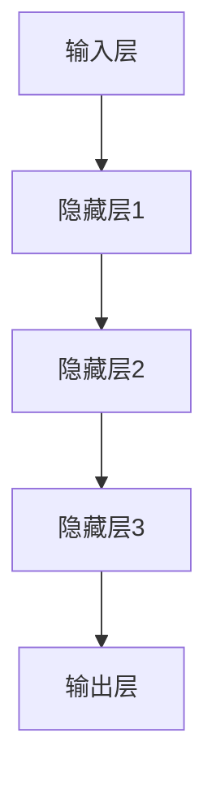

                 

# AI 大模型创业：如何利用渠道优势？

> **关键词：** AI 大模型、创业、渠道优势、技术实现、商业化落地、挑战与应对策略

> **摘要：** 本篇文章将深入探讨 AI 大模型创业的渠道优势，包括背景、原理、实战和挑战。通过分析 AI 大模型的技术架构、创业项目规划和渠道推广策略，本文旨在为创业者提供实用的指导和建议，帮助他们在竞争激烈的市场中取得成功。

### 第一部分：AI 大模型创业概述

#### 1.1 AI 大模型创业的背景和意义

##### 1.1.1 AI 大模型的发展历程

AI 大模型的发展历程可以追溯到 20 世纪 80 年代，当时神经网络和深度学习的研究刚刚起步。随着时间的推移，特别是在 21 世纪，随着计算能力的提升和数据量的增加，AI 大模型得到了迅猛发展。从早期的 BP 算法到如今流行的 GPT-3，AI 大模型在各个领域都取得了显著的成果。

##### 1.1.2 AI 大模型在创业中的价值

AI 大模型在创业中的价值主要体现在以下几个方面：

1. **解决复杂问题：** AI 大模型能够处理复杂的问题，例如自然语言处理、图像识别等，为创业者提供了强大的技术支持。
2. **提升效率：** 通过 AI 大模型，创业公司可以自动化许多重复性工作，提高工作效率，降低成本。
3. **创新业务模式：** AI 大模型的应用可以带来全新的业务模式，例如基于 AI 的推荐系统、智能客服等。

##### 1.1.3 渠道优势在 AI 大模型创业中的重要性

渠道优势在 AI 大模型创业中的重要性不可忽视。以下是一些关键点：

1. **市场占有率：** 渠道可以扩大创业公司的市场占有率，提高品牌知名度。
2. **用户获取：** 渠道是获取用户的途径之一，通过渠道推广可以快速吸引大量用户。
3. **资源整合：** 渠道可以帮助创业公司整合各种资源，例如资金、人才和技术。

#### 1.2 AI 大模型的原理和架构

##### 1.2.1 AI 大模型的基本原理

AI 大模型是基于深度学习技术构建的复杂神经网络，通过大量数据的训练，能够自动学习特征和规律，从而实现预测和决策。

##### 1.2.2 AI 大模型的核心架构

AI 大模型的核心架构包括输入层、隐藏层和输出层。输入层负责接收外部数据，隐藏层负责处理和变换数据，输出层负责生成预测结果。

##### 1.2.3 AI 大模型的 Mermaid 流程图



#### 1.3 创业过程中的渠道资源评估与管理

##### 1.3.1 渠道资源的分类与评估

渠道资源可以分为线上和线下两种，线上包括社交媒体、搜索引擎、电商平台等，线下包括展会、论坛、合作伙伴等。评估渠道资源时，需要考虑资源的质量、成本和效益。

##### 1.3.2 渠道资源的整合与管理

整合渠道资源是创业过程中的重要环节，需要建立统一的渠道管理平台，实现资源的优化配置和高效利用。

##### 1.3.3 渠道资源优化的策略

渠道资源优化的策略包括提高资源利用效率、降低渠道成本、提升用户满意度等。

### 第二部分：AI 大模型创业实战

#### 2.1 AI 大模型创业项目规划

##### 2.1.1 创业项目目标设定

创业项目目标设定需要明确项目的愿景、使命和目标，确保项目的方向和目标清晰。

##### 2.1.2 创业项目预算管理

创业项目预算管理是确保项目顺利进行的关键，需要合理规划预算，控制成本。

##### 2.1.3 创业项目进度控制

创业项目进度控制是保证项目按时完成的必要手段，需要建立有效的进度跟踪和监控机制。

#### 2.2 AI 大模型的技术实现

##### 2.2.1 AI 大模型的核心算法原理

AI 大模型的核心算法原理包括神经网络的基本原理、反向传播算法等。

##### 2.2.2 AI 大模型的伪代码讲解

```python
# 初始化参数
W = random_matrix(input_size, hidden_size)
b = random_vector(hidden_size)

# 前向传播
z = X * W + b
a = sigmoid(z)

# 反向传播
dz = a - y
dW = dz * X.T
db = dz

# 更新参数
W = W - learning_rate * dW
b = b - learning_rate * db
```

##### 2.2.3 AI 大模型的技术选型与优化

AI 大模型的技术选型与优化是确保模型性能的关键，需要考虑算法、框架和硬件等方面。

#### 2.3 AI 大模型的渠道推广

##### 2.3.1 渠道推广策略制定

渠道推广策略制定需要根据产品的特点和目标用户群体，制定有针对性的推广策略。

##### 2.3.2 渠道推广方法与工具

渠道推广方法包括内容营销、社交媒体推广、SEO 等，工具包括搜索引擎、广告平台、社交媒体等。

##### 2.3.3 渠道推广效果评估与优化

渠道推广效果评估与优化是确保推广效果的关键，需要定期评估推广效果，并根据评估结果调整推广策略。

#### 2.4 AI 大模型的商业化落地

##### 2.4.1 商业模式设计

商业模式设计是确保项目能够盈利的关键，需要根据市场需求和用户价值，设计合理的商业模式。

##### 2.4.2 用户需求分析与挖掘

用户需求分析与挖掘是确保产品能够满足用户需求的关键，需要通过调研和分析，了解用户需求。

##### 2.4.3 商业化落地的实施策略

商业化落地的实施策略包括市场推广、产品迭代、客户服务等方面。

#### 2.5 AI 大模型创业案例解析

##### 2.5.1 成功案例分享

成功案例分享可以帮助创业者了解成功的关键因素和经验。

##### 2.5.2 失败案例剖析

失败案例剖析可以帮助创业者避免重复失败的原因。

##### 2.5.3 案例总结与启示

案例总结与启示可以帮助创业者更好地应对创业过程中的挑战。

### 第三部分：AI 大模型创业挑战与应对策略

#### 3.1 AI 大模型创业面临的挑战

##### 3.1.1 技术难题

技术难题是 AI 大模型创业面临的主要挑战之一，需要持续的技术创新和优化。

##### 3.1.2 资金压力

资金压力是创业公司常见的挑战，需要合理规划资金，确保项目顺利进行。

##### 3.1.3 人才短缺

人才短缺是创业公司面临的另一个挑战，需要建立有效的人才引进和培养机制。

#### 3.2 应对策略与解决方案

##### 3.2.1 技术创新策略

技术创新策略是应对技术难题的关键，需要持续投入研发，提高技术水平。

##### 3.2.2 资金筹措渠道

资金筹措渠道包括天使投资、风险投资、政府补贴等，需要根据实际情况选择合适的资金渠道。

##### 3.2.3 人才培养与引进

人才培养与引进是应对人才短缺的关键，需要建立完善的人才培养体系，吸引优秀人才。

#### 3.3 AI 大模型创业的法律与伦理问题

##### 3.3.1 法律法规解读

法律法规解读是确保创业公司合法运营的基础，需要了解相关法律法规，确保合规。

##### 3.3.2 伦理道德准则

伦理道德准则是确保创业公司健康发展的关键，需要遵守伦理道德，尊重用户权益。

##### 3.3.3 法律与伦理风险的防范措施

法律与伦理风险的防范措施包括制定完善的内部控制制度，加强合规审查和风险控制。

### 附录

#### 附录 A: AI 大模型创业相关资源

##### A.1 主流 AI 大模型框架对比

主流 AI 大模型框架对比可以帮助创业者了解不同框架的优缺点，选择合适的框架。

##### A.2 创业资源平台推荐

创业资源平台推荐可以帮助创业者获取更多的创业资源和信息。

##### A.3 投资机构与创业大赛介绍

投资机构与创业大赛介绍可以帮助创业者了解投资机构和创业大赛的相关信息，争取更多支持。

#### 附录 B: AI 大模型创业项目开发指南

##### B.1 开发环境搭建

开发环境搭建是 AI 大模型创业项目开发的基础，需要选择合适的开发工具和环境。

##### B.2 源代码实现与解读

源代码实现与解读是深入了解 AI 大模型的核心内容，需要详细解读源代码，理解其工作原理。

##### B.3 代码分析与优化

代码分析与优化是提高 AI 大模型性能的关键，需要通过代码分析，找到优化的空间。

[END]作者：AI天才研究院/AI Genius Institute & 禅与计算机程序设计艺术 /Zen And The Art of Computer Programming

[文章标题] AI 大模型创业：如何利用渠道优势？

### AI 大模型创业：如何利用渠道优势？

#### 关键词：AI 大模型、创业、渠道优势、技术实现、商业化落地、挑战与应对策略

#### 摘要：本文将深入探讨 AI 大模型创业的渠道优势，包括背景、原理、实战和挑战。通过分析 AI 大模型的技术架构、创业项目规划和渠道推广策略，本文旨在为创业者提供实用的指导和建议，帮助他们在竞争激烈的市场中取得成功。

---

### 第一部分：AI 大模型创业概述

#### 1.1 AI 大模型创业的背景和意义

##### 1.1.1 AI 大模型的发展历程

AI 大模型的发展历程可以追溯到 20 世纪 80 年代，当时神经网络和深度学习的研究刚刚起步。随着时间的推移，特别是在 21 世纪，随着计算能力的提升和数据量的增加，AI 大模型得到了迅猛发展。从早期的 BP 算法到如今流行的 GPT-3，AI 大模型在各个领域都取得了显著的成果。

在过去的几十年里，AI 大模型的发展经历了几个重要阶段：

1. **早期研究阶段（1980s-1990s）**：
   - **人工神经网络（ANN）**：人工神经网络是 AI 大模型发展的基础。在这个阶段，研究者们开始探索如何通过神经网络模拟人脑的信息处理过程。
   - **反向传播算法（Backpropagation）**：1986 年，Rumelhart、Hinton 和 Williams 提出了反向传播算法，这是一个用于训练神经网络的通用算法，使得多层神经网络的学习效率大幅提升。

2. **停滞期（1990s-2000s）**：
   - **计算能力受限**：在这个阶段，尽管神经网络的理论研究有所进展，但由于计算资源的限制，神经网络的应用场景相对有限。

3. **复兴阶段（2006 年至今）**：
   - **深度学习（Deep Learning）**：2006 年，Geoffrey Hinton 提出了深度信念网络（DBN），标志着深度学习技术的复兴。
   - **GPU 加速**：图形处理单元（GPU）的出现，为深度学习提供了强大的计算能力，使得训练大规模神经网络成为可能。
   - **大数据和云计算**：随着数据量的增加和云计算技术的发展，为 AI 大模型提供了丰富的训练数据和计算资源。

AI 大模型在各个领域的应用取得了显著的成果：

- **计算机视觉**：AI 大模型在图像识别、目标检测、图像生成等方面表现出色，例如 Google 的 Inception、OpenAI 的 DALL-E。
- **自然语言处理**：AI 大模型在机器翻译、文本生成、情感分析等方面有着广泛的应用，例如 Google 的 BERT、OpenAI 的 GPT 系列。
- **语音识别**：AI 大模型在语音识别、语音合成、说话人识别等方面取得了重大突破，例如 Google 的 WaveNet、Baidu 的 HiFi。
- **推荐系统**：AI 大模型在推荐系统中的应用，大大提升了推荐的准确性和用户体验，例如 Amazon 的 DeepRNN。

##### 1.1.2 AI 大模型在创业中的价值

AI 大模型在创业中的价值主要体现在以下几个方面：

1. **解决复杂问题**：

AI 大模型能够处理复杂的问题，例如自然语言处理、图像识别等，为创业者提供了强大的技术支持。例如，一家初创公司可以使用 AI 大模型开发智能客服系统，提高客户服务质量，降低人力成本。

2. **提升效率**：

通过 AI 大模型，创业公司可以自动化许多重复性工作，提高工作效率，降低成本。例如，一家金融科技公司可以使用 AI 大模型进行数据分析，快速识别潜在风险，提高风险控制能力。

3. **创新业务模式**：

AI 大模型的应用可以带来全新的业务模式，例如基于 AI 的推荐系统、智能客服等。例如，一家电商公司可以利用 AI 大模型进行个性化推荐，提高用户满意度和转化率。

##### 1.1.3 渠道优势在 AI 大模型创业中的重要性

渠道优势在 AI 大模型创业中的重要性不可忽视。以下是一些关键点：

1. **市场占有率**：

渠道可以扩大创业公司的市场占有率，提高品牌知名度。例如，一家初创公司可以通过与电商平台合作，快速进入市场，吸引大量用户。

2. **用户获取**：

渠道是获取用户的途径之一，通过渠道推广可以快速吸引大量用户。例如，一家科技公司可以通过社交媒体广告，迅速扩大用户基础。

3. **资源整合**：

渠道可以帮助创业公司整合各种资源，例如资金、人才和技术。例如，一家创业公司可以通过与高校和研究机构合作，获得先进的科研技术。

#### 1.2 AI 大模型的原理和架构

##### 1.2.1 AI 大模型的基本原理

AI 大模型是基于深度学习技术构建的复杂神经网络，通过大量数据的训练，能够自动学习特征和规律，从而实现预测和决策。

深度学习是一种机器学习的方法，它通过模拟人脑神经网络的结构和工作原理，实现对数据的分析和处理。在深度学习中，神经网络由多层节点组成，每层节点对输入数据进行处理，然后传递到下一层，最终生成输出。

深度学习的工作原理主要包括以下几个步骤：

1. **数据预处理**：
   - 数据清洗：去除噪音和不完整的数据。
   - 数据归一化：将数据缩放到相同的范围，以便神经网络进行训练。

2. **前向传播**：
   - 将输入数据通过网络中的每个层，进行加权求和和激活函数运算。
   - 激活函数：常用的激活函数包括 sigmoid、ReLU 和 tanh 等，用于引入非线性变换。

3. **损失函数**：
   - 计算预测结果和实际结果之间的差距，通过损失函数进行量化。
   - 常用的损失函数包括均方误差（MSE）、交叉熵（Cross-Entropy）等。

4. **反向传播**：
   - 从输出层开始，将误差反向传播到输入层，更新网络的权重和偏置。
   - 反向传播算法通过梯度下降（Gradient Descent）等方法，不断调整网络参数，以最小化损失函数。

5. **模型评估**：
   - 通过验证集或测试集，评估模型的性能和泛化能力。
   - 常用的评估指标包括准确率、召回率、F1 分数等。

##### 1.2.2 AI 大模型的核心架构

AI 大模型的核心架构包括输入层、隐藏层和输出层。输入层负责接收外部数据，隐藏层负责处理和变换数据，输出层负责生成预测结果。

1. **输入层**：
   - 输入层是网络的第一层，负责接收外部输入数据。
   - 输入数据可以是数值、图像、文本等多种形式。

2. **隐藏层**：
   - 隐藏层位于输入层和输出层之间，负责对输入数据进行处理和变换。
   - 隐藏层的数量和节点数可以根据问题的复杂程度进行选择。

3. **输出层**：
   - 输出层是网络的最后一层，负责生成预测结果。
   - 输出数据的类型和格式取决于具体的应用场景。

##### 1.2.3 AI 大模型的 Mermaid 流程图


在这个 Mermaid 流程图中，A 表示输入层，B、C、D 分别表示隐藏层 1、隐藏层 2 和隐藏层 3，E 表示输出层。数据从输入层传递到隐藏层，经过多层处理和变换，最终生成输出结果。

#### 1.3 创业过程中的渠道资源评估与管理

##### 1.3.1 渠道资源的分类与评估

渠道资源可以分为线上和线下两种，线上包括社交媒体、搜索引擎、电商平台等，线下包括展会、论坛、合作伙伴等。评估渠道资源时，需要考虑资源的质量、成本和效益。

1. **线上渠道资源**：

- **社交媒体**：包括 Facebook、Instagram、Twitter、LinkedIn 等，可以用于品牌推广、用户互动和用户获取。
- **搜索引擎**：包括 Google、Bing 等，可以通过搜索引擎优化（SEO）和搜索引擎营销（SEM）提高网站曝光度。
- **电商平台**：包括 Amazon、eBay、阿里巴巴等，可以通过电商平台进行产品销售和用户获取。

2. **线下渠道资源**：

- **展会**：参加行业展会，展示产品，吸引潜在客户和合作伙伴。
- **论坛**：参加行业论坛，与同行交流，获取市场信息和合作机会。
- **合作伙伴**：与行业内的其他企业建立合作关系，共享资源，扩大市场影响力。

在评估渠道资源时，需要考虑以下几个关键因素：

- **资源质量**：渠道资源的质量直接影响到推广效果。需要评估渠道的影响力、用户活跃度和用户群体质量。
- **成本**：渠道成本是创业公司需要考虑的重要因素。需要评估渠道成本与预期收益之间的平衡。
- **效益**：渠道资源的效益体现在用户获取、品牌知名度提升和市场份额扩大等方面。需要评估渠道资源带来的直接和间接效益。

##### 1.3.2 渠道资源的整合与管理

整合渠道资源是创业过程中的重要环节，需要建立统一的渠道管理平台，实现资源的优化配置和高效利用。

1. **渠道资源整合**：

- **建立渠道资源库**：将各类渠道资源进行分类和整理，建立渠道资源库，方便管理和调用。
- **资源协同**：通过渠道资源协同，实现渠道间的资源共享和优势互补，提高整体推广效果。
- **多渠道联动**：通过线上线下渠道的联动，实现全方位的推广和用户覆盖。

2. **渠道资源管理**：

- **渠道规划**：根据创业项目目标和市场情况，制定合理的渠道规划，明确渠道目标和策略。
- **渠道监控**：实时监控渠道效果，评估渠道资源的利用情况和推广效果，及时调整和优化渠道策略。
- **渠道优化**：通过数据分析，识别渠道优势和劣势，优化渠道资源配置和推广策略，提高渠道效益。

##### 1.3.3 渠道资源优化的策略

渠道资源优化是确保渠道资源最大化利用的关键，以下是一些渠道资源优化的策略：

1. **精准定位**：

- 根据目标用户群体的特点，精准定位渠道资源，提高推广的精准度和效果。
- 通过用户行为分析和市场调研，了解目标用户群体的偏好和行为习惯，选择合适的渠道进行推广。

2. **资源整合**：

- 通过整合线上和线下渠道资源，实现渠道间的互补和协同，提高整体推广效果。
- 与行业内的其他企业建立合作关系，共享渠道资源，扩大市场影响力。

3. **数据分析**：

- 利用数据分析工具，实时监控渠道效果，评估渠道资源的利用情况和推广效果。
- 通过数据分析，识别渠道优势和劣势，优化渠道资源配置和推广策略。

4. **创新推广**：

- 创新推广方式，采用新颖的推广手段，提高用户参与度和互动性。
- 结合时事热点和用户兴趣，设计有针对性的推广活动，吸引用户关注。

### 第二部分：AI 大模型创业实战

#### 2.1 AI 大模型创业项目规划

##### 2.1.1 创业项目目标设定

创业项目目标设定是创业过程中的重要环节，是确保项目方向和目标清晰的关键。以下是如何设定创业项目目标的步骤：

1. **明确愿景和使命**：

- **愿景**：描述创业公司未来的发展方向和目标，如“成为全球领先的 AI 大模型解决方案提供商”。
- **使命**：阐述创业公司的核心价值观和宗旨，如“通过 AI 大模型技术，提升企业效率，创造社会价值”。

2. **设定具体目标**：

- **短期目标**：设定一年或更短时间内的具体目标，如“在一年内实现产品上线，获取首批客户”。
- **中期目标**：设定三年或五年内的具体目标，如“在五年内实现规模化盈利，市场份额达到 20%”。

3. **制定行动计划**：

- 根据目标设定，制定具体的行动计划，明确每个阶段的任务和时间表。

4. **制定评估标准**：

- 设定明确的评估标准，用于衡量目标的实现情况，如客户满意度、市场份额、盈利能力等。

##### 2.1.2 创业项目预算管理

创业项目预算管理是确保项目顺利进行的关键，以下是如何进行创业项目预算管理的步骤：

1. **确定预算范围**：

- 根据创业项目目标，确定项目预算的范围，包括研发、市场推广、人力资源、运营等各方面的预算。

2. **预算分配**：

- 根据项目需求和资源情况，合理分配预算，确保每个方面的需求都得到满足。

3. **监控预算执行**：

- 实时监控预算执行情况，发现超支或不足的情况，及时进行调整。

4. **预算调整**：

- 根据项目进展和市场变化，及时调整预算，确保项目目标的实现。

##### 2.1.3 创业项目进度控制

创业项目进度控制是确保项目按时完成的关键，以下是如何进行创业项目进度控制的步骤：

1. **制定项目计划**：

- 根据创业项目目标，制定详细的项目计划，明确每个阶段的任务和时间表。

2. **任务分配**：

- 根据项目计划，将任务分配给项目团队成员，明确每个人的职责和任务。

3. **进度监控**：

- 定期监控项目进度，及时发现进度偏差，采取相应的措施进行调整。

4. **风险控制**：

- 识别项目风险，制定风险应对措施，确保项目按计划顺利进行。

#### 2.2 AI 大模型的技术实现

##### 2.2.1 AI 大模型的核心算法原理

AI 大模型的核心算法原理主要包括深度学习的基础算法和常用模型。以下是对这些算法的简要介绍：

1. **反向传播算法（Backpropagation）**：

反向传播算法是一种用于训练神经网络的通用算法。它通过计算输出层和隐藏层之间的误差，反向传播到输入层，不断调整网络的权重和偏置，以最小化损失函数。

算法步骤如下：

1. **前向传播**：

- 将输入数据通过网络中的每个层，进行加权求和和激活函数运算。
- 输出结果与实际结果进行比较，计算损失函数。

2. **反向传播**：

- 从输出层开始，将误差反向传播到输入层，计算每个层的梯度。
- 更新网络参数，包括权重和偏置。

3. **迭代训练**：

- 重复前向传播和反向传播，不断调整网络参数，直到满足停止条件。

2. **深度信念网络（Deep Belief Network, DBN）**：

深度信念网络是一种基于未训练的受限玻尔兹曼机（RBM）构建的深度学习模型。它通过堆叠多个 RBM，实现多层特征提取和自动编码。

算法步骤如下：

1. **训练每个 RBM**：

- 使用梯度下降法训练每个 RBM，得到未训练的编码器。

2. **堆叠 RBM**：

- 将未训练的编码器作为下一层的输入，构建深度信念网络。

3. **训练 DBN**：

- 使用反向传播算法训练整个 DBN，通过未训练的编码器提取特征。

3. **卷积神经网络（Convolutional Neural Network, CNN）**：

卷积神经网络是一种专门用于处理图像数据的深度学习模型。它通过卷积层、池化层和全连接层，实现对图像的自动特征提取和分类。

算法步骤如下：

1. **卷积层**：

- 使用卷积核在输入图像上进行卷积操作，提取局部特征。

2. **池化层**：

- 对卷积层输出的特征进行池化操作，降低特征维度。

3. **全连接层**：

- 将池化层输出的特征映射到输出层，进行分类和预测。

4. **循环神经网络（Recurrent Neural Network, RNN）**：

循环神经网络是一种用于处理序列数据的深度学习模型。它通过循环结构，实现对序列数据的建模和预测。

算法步骤如下：

1. **前向传播**：

- 将序列数据输入网络，逐个处理每个时间步的输入。

2. **状态更新**：

- 使用前一个时间步的隐藏状态和当前输入，更新当前时间步的隐藏状态。

3. **输出生成**：

- 将隐藏状态映射到输出层，生成预测结果。

##### 2.2.2 AI 大模型的伪代码讲解

以下是一个简单的 AI 大模型（深度神经网络）的伪代码示例，用于实现前向传播和反向传播：

```python
# 初始化参数
W = random_matrix(input_size, hidden_size)
b = random_vector(hidden_size)
output = random_vector(output_size)

# 前向传播
def forward_propagation(x):
    z = x * W + b
    a = sigmoid(z)
    return a

# 反向传播
def backward_propagation(a, y):
    dz = a - y
    dW = dz * x.T
    db = dz
    return dW, db

# 训练模型
for epoch in range(num_epochs):
    for x, y in dataset:
        a = forward_propagation(x)
        dW, db = backward_propagation(a, y)
        W = W - learning_rate * dW
        b = b - learning_rate * db
```

在这个伪代码中，`W` 和 `b` 分别表示权重和偏置，`x` 和 `y` 分别表示输入和输出，`a` 表示激活值。`sigmoid` 函数是一个常用的激活函数，用于将线性组合转换为概率分布。

##### 2.2.3 AI 大模型的技术选型与优化

AI 大模型的技术选型与优化是确保模型性能和效率的关键。以下是一些常见的技术选型和优化策略：

1. **算法选型**：

- **深度学习框架**：选择合适的深度学习框架，如 TensorFlow、PyTorch 等，这些框架提供了丰富的工具和库，方便模型的构建和训练。
- **模型架构**：根据应用场景和数据特点，选择合适的模型架构，如 CNN、RNN、Transformer 等。

2. **硬件选型**：

- **CPU 与 GPU**：对于大规模的深度学习模型，GPU 相比于 CPU 具有更高的计算能力，可以显著提高训练速度。
- **分布式训练**：通过分布式训练，利用多台 GPU 或计算节点，实现更高效的模型训练。

3. **数据预处理**：

- **数据清洗**：去除噪音和不完整的数据，保证数据质量。
- **数据增强**：通过数据增强，增加数据多样性，提高模型泛化能力。

4. **超参数调优**：

- **学习率**：调整学习率，选择合适的初始学习率和衰减策略。
- **批量大小**：调整批量大小，平衡训练速度和模型性能。

5. **模型优化**：

- **剪枝**：通过剪枝，去除网络中不重要的连接，降低模型复杂度和计算量。
- **量化**：通过量化，降低模型精度，提高模型运行效率。

#### 2.3 AI 大模型的渠道推广

##### 2.3.1 渠道推广策略制定

渠道推广策略制定是确保 AI 大模型创业项目成功推广的关键。以下是如何制定渠道推广策略的步骤：

1. **明确目标受众**：

- 分析目标用户群体的特征，包括年龄、性别、地域、职业等，明确推广对象。

2. **渠道选择**：

- 根据目标受众的特点，选择合适的推广渠道，如社交媒体、搜索引擎、电商平台等。

3. **内容策划**：

- 设计有吸引力的内容，包括图片、视频、文章等，提高用户参与度和关注度。

4. **推广时间安排**：

- 制定合理的推广时间表，确保推广活动的连续性和覆盖面。

5. **推广预算分配**：

- 根据渠道特点和目标受众，合理分配推广预算，确保推广效果最大化。

##### 2.3.2 渠道推广方法与工具

渠道推广方法与工具的选择直接影响到推广效果。以下是一些常用的渠道推广方法和工具：

1. **社交媒体推广**：

- **平台选择**：根据目标受众，选择合适的社交媒体平台，如 Facebook、Instagram、Twitter 等。
- **内容形式**：设计吸引人的内容，包括图片、视频、直播等，提高用户参与度。

2. **搜索引擎营销（SEM）**：

- **广告投放**：通过 Google Ads、Bing Ads 等，进行关键词广告投放，提高搜索引擎曝光度。
- **搜索引擎优化（SEO）**：优化网站内容和结构，提高在搜索引擎的自然排名。

3. **内容营销**：

- **博客文章**：发布高质量的文章，分享行业知识和公司动态，吸引潜在用户。
- **视频营销**：制作有趣、实用的视频，提高用户对产品的认知和兴趣。

4. **社交媒体广告**：

- **平台广告**：在社交媒体平台上投放广告，如 Facebook Ads、Instagram Ads 等，直接向目标用户推广。

5. **合作伙伴推广**：

- **合作推广**：与行业内的其他企业或平台建立合作关系，进行联合推广，扩大市场影响力。

##### 2.3.3 渠道推广效果评估与优化

渠道推广效果评估与优化是确保推广效果持续提升的关键。以下是如何进行渠道推广效果评估与优化的步骤：

1. **设置评估指标**：

- 根据推广目标，设置相应的评估指标，如点击率（CTR）、转化率（CVR）、成本效益比（ROI）等。

2. **数据收集与分析**：

- 收集渠道推广的相关数据，如流量、点击、转化等，进行分析和评估。

3. **效果评估**：

- 根据评估指标，评估渠道推广的效果，识别效果较好的渠道和策略。

4. **优化策略**：

- 根据评估结果，优化推广策略，如调整内容、时间、预算等，提高推广效果。

5. **持续监控**：

- 持续监控推广效果，及时发现和解决问题，确保推广活动的顺利进行。

#### 2.4 AI 大模型的商业化落地

##### 2.4.1 商业模式设计

商业模式设计是确保 AI 大模型创业项目能够盈利的关键。以下是如何设计商业模式的步骤：

1. **明确产品价值**：

- 分析 AI 大模型产品或服务的特点和优势，明确其价值主张。

2. **确定目标客户**：

- 分析目标客户的需求和痛点，确定产品或服务的目标客户群体。

3. **选择商业模式**：

- 根据产品价值、目标客户和市场情况，选择合适的商业模式，如订阅模式、销售模式、SaaS 等。

4. **收入来源**：

- 确定商业模式的收入来源，如产品销售、服务收费、订阅费用等。

5. **成本结构**：

- 分析商业模式中的成本结构，包括固定成本、可变成本等。

6. **盈利预测**：

- 根据商业模式和成本结构，进行盈利预测，确保项目的可持续性。

##### 2.4.2 用户需求分析与挖掘

用户需求分析与挖掘是确保 AI 大模型产品或服务能够满足用户需求的关键。以下是如何进行用户需求分析与挖掘的步骤：

1. **用户调研**：

- 通过问卷调查、访谈、焦点小组等方式，收集用户的需求和意见。

2. **数据分析**：

- 利用数据分析工具，分析用户的行为数据和反馈，识别用户需求。

3. **用户画像**：

- 根据用户调研和数据分析，构建用户画像，明确目标用户的特点和需求。

4. **需求分析**：

- 分析用户需求，识别用户的核心需求和痛点，为产品或服务设计提供依据。

5. **需求验证**：

- 通过用户测试和反馈，验证需求分析的准确性，确保产品或服务能够满足用户需求。

##### 2.4.3 商业化落地的实施策略

商业化落地实施策略是确保 AI 大模型创业项目能够顺利推进和取得成功的关键。以下是如何制定商业化落地实施策略的步骤：

1. **市场调研**：

- 分析市场环境和竞争对手，了解市场趋势和需求。

2. **产品规划**：

- 根据市场调研结果，规划产品的发展方向和版本迭代。

3. **营销策略**：

- 制定营销策略，包括市场推广、渠道选择、推广内容等。

4. **销售策略**：

- 制定销售策略，包括定价策略、销售渠道、客户管理等。

5. **实施计划**：

- 制定详细的实施计划，明确每个阶段的任务和时间表。

6. **风险控制**：

- 识别项目风险，制定风险应对措施，确保项目顺利实施。

7. **监控与评估**：

- 持续监控项目进展，评估项目效果，及时调整和优化实施策略。

#### 2.5 AI 大模型创业案例解析

##### 2.5.1 成功案例分享

以下是一个成功 AI 大模型创业案例的分享：

**案例名称**：OpenAI

**背景**：OpenAI 是一家成立于 2015 年的人工智能研究公司，旨在通过人工智能技术推动人类社会的发展。公司由著名科技企业家和学者创办，吸引了大量的投资和关注。

**创业项目**：

- **GPT-3**：OpenAI 开发了全球最大的人工智能模型 GPT-3，该模型具有极高的语言理解和生成能力，可以用于自然语言处理、机器翻译、文本生成等多种应用。
- **机器学习研究**：OpenAI 持续投入大量资源进行机器学习研究，推动了人工智能领域的发展。

**成功因素**：

- **技术创新**：OpenAI 通过不断的技术创新，开发了具有强大能力的人工智能模型，吸引了大量用户和投资者。
- **资金支持**：OpenAI 获得了大量的风险投资，为项目的持续发展提供了资金保障。
- **人才优势**：OpenAI 拥有一支高素质的科研团队，吸引了全球顶尖的机器学习专家。

**启示**：

- **技术创新**：在 AI 大模型创业中，技术创新是关键，需要不断投入研发，提高技术水平。
- **资金支持**：充足的资金支持是创业项目成功的重要保障，需要积极寻求风险投资和政府支持。
- **人才优势**：优秀的人才团队是创业项目的核心资源，需要建立有效的人才引进和培养机制。

##### 2.5.2 失败案例剖析

以下是一个失败 AI 大模型创业案例的剖析：

**案例名称**：DeepStack

**背景**：DeepStack 是一家开发人工智能扑克游戏的公司，旨在通过人工智能技术挑战世界顶尖扑克选手。公司成立于 2016 年，获得了天使投资。

**创业项目**：

- **人工智能扑克游戏**：DeepStack 开发了基于深度学习的扑克游戏，希望通过人工智能算法击败人类选手。

**失败原因**：

- **技术问题**：DeepStack 的技术尚未达到挑战世界顶尖扑克选手的水平，无法实现预期的目标。
- **市场定位**：DeepStack 的市场定位不够明确，无法吸引足够的目标用户。
- **资金问题**：天使投资未能持续提供足够的资金支持，导致项目无法持续发展。

**启示**：

- **技术验证**：在创业初期，需要对技术进行充分验证，确保技术可行性。
- **市场研究**：进行充分的市场调研，明确目标市场和用户需求。
- **资金规划**：制定详细的资金规划，确保项目有充足的资金支持。

##### 2.5.3 案例总结与启示

通过以上成功和失败案例的分享和分析，我们可以得出以下总结与启示：

1. **技术创新**：

   - 技术创新是 AI 大模型创业的核心竞争力，需要持续投入研发，提高技术水平。
   - 不断学习和借鉴行业内的最新技术成果，保持技术领先。

2. **市场定位**：

   - 明确目标市场和用户需求，制定有针对性的市场策略。
   - 关注市场动态，及时调整市场定位，确保项目能够满足用户需求。

3. **资金规划**：

   - 制定详细的资金规划，确保项目有充足的资金支持。
   - 积极寻求风险投资和政府支持，降低资金压力。

4. **团队建设**：

   - 建立高素质的团队，吸引优秀人才，为项目提供有力的支持。
   - 建立有效的人才引进和培养机制，提升团队整体实力。

5. **风险管理**：

   - 识别项目风险，制定风险应对措施，确保项目能够顺利推进。
   - 持续监控项目进展，及时调整和优化项目策略。

### 第三部分：AI 大模型创业挑战与应对策略

#### 3.1 AI 大模型创业面临的挑战

##### 3.1.1 技术难题

技术难题是 AI 大模型创业面临的主要挑战之一。以下是一些常见的技术难题及其应对策略：

1. **模型训练复杂性**：

   - **应对策略**：采用分布式训练、GPU 加速等高效训练方法，提高训练效率。

2. **数据质量与数量**：

   - **应对策略**：建立数据清洗和预处理机制，确保数据质量。通过数据增强和扩充，提高数据数量。

3. **模型可解释性**：

   - **应对策略**：采用可解释性模型或可视化工具，提高模型的可解释性，增强用户信任。

4. **模型泛化能力**：

   - **应对策略**：通过迁移学习、多任务学习等策略，提高模型的泛化能力。

##### 3.1.2 资金压力

资金压力是创业公司常见的挑战。以下是一些常见的资金压力及其应对策略：

1. **资金短缺**：

   - **应对策略**：积极寻求风险投资、天使投资等外部资金支持。制定详细的财务计划，确保资金合理使用。

2. **成本控制**：

   - **应对策略**：优化成本结构，降低运营成本。采用云计算等高效计算资源，降低硬件成本。

3. **盈利模式**：

   - **应对策略**：明确盈利模式，制定合理的定价策略。通过提供增值服务、订阅模式等，实现持续盈利。

##### 3.1.3 人才短缺

人才短缺是创业公司面临的另一个挑战。以下是一些常见的人才短缺及其应对策略：

1. **人才招聘**：

   - **应对策略**：建立有效的招聘机制，通过线上招聘、行业活动等渠道，吸引优秀人才。

2. **人才培养**：

   - **应对策略**：建立内部培训机制，提升现有员工的能力。通过导师制、职业发展计划等，留住优秀人才。

3. **团队建设**：

   - **应对策略**：建立高效的团队协作机制，激发团队活力。通过团队文化建设，提升团队凝聚力。

#### 3.2 应对策略与解决方案

##### 3.2.1 技术创新策略

技术创新策略是应对技术难题的关键。以下是一些常见的技术创新策略：

1. **持续研发**：

   - **应对策略**：持续投入研发资源，紧跟技术前沿。建立研发团队，开展技术创新项目。

2. **跨学科合作**：

   - **应对策略**：与高校、研究机构等建立合作关系，进行跨学科合作。借助外部科研力量，提升技术创新能力。

3. **开放创新**：

   - **应对策略**：积极参与开源社区，分享技术成果。通过合作、收购等手段，获取外部技术资源。

##### 3.2.2 资金筹措渠道

资金筹措渠道是缓解资金压力的关键。以下是一些常见的资金筹措渠道：

1. **风险投资**：

   - **应对策略**：积极寻求风险投资，提高融资成功率。了解风险投资市场的动态，选择合适的投资机构。

2. **政府补贴**：

   - **应对策略**：关注政府相关政策，申请科技补贴、创新基金等。通过政策支持，降低资金压力。

3. **银行贷款**：

   - **应对策略**：了解银行贷款政策，合理利用银行贷款。制定详细的还款计划，确保贷款的安全和有效性。

##### 3.2.3 人才培养与引进

人才培养与引进是解决人才短缺的关键。以下是一些常见的人才培养与引进策略：

1. **内部培养**：

   - **应对策略**：建立内部培训机制，提供职业发展机会。通过内部晋升、技能培训等，提升员工能力。

2. **外部引进**：

   - **应对策略**：积极招聘优秀人才，通过线上招聘、行业活动等渠道，吸引外部人才。

3. **人才激励**：

   - **应对策略**：建立有效的激励制度，提升员工工作积极性。通过股权激励、绩效奖励等，留住优秀人才。

#### 3.3 AI 大模型创业的法律与伦理问题

##### 3.3.1 法律法规解读

AI 大模型创业涉及到的法律法规主要包括以下几个方面：

1. **数据保护法**：

   - **解读**：数据保护法规定了个人数据的收集、存储、使用和分享等方面的规范。对于 AI 大模型创业公司，确保用户数据的安全和隐私至关重要。

2. **知识产权法**：

   - **解读**：知识产权法保护了专利、商标、著作权等知识产权。对于 AI 大模型创业公司，需要关注专利申请、商标注册等方面的法律保护。

3. **商业秘密法**：

   - **解读**：商业秘密法保护了企业的商业秘密，防止泄露和滥用。对于 AI 大模型创业公司，保护商业秘密是确保竞争优势的关键。

##### 3.3.2 伦理道德准则

AI 大模型创业需要遵循以下伦理道德准则：

1. **用户隐私保护**：

   - **准则**：尊重用户隐私，确保用户数据的安全和隐私。不得未经授权收集、使用和分享用户数据。

2. **公平公正**：

   - **准则**：确保 AI 大模型的应用公平公正，不歧视任何群体。避免因数据偏见导致不公平的结果。

3. **透明度**：

   - **准则**：确保 AI 大模型的应用过程透明，向用户明确说明模型的工作原理和应用场景。

##### 3.3.3 法律与伦理风险的防范措施

为了防范法律与伦理风险，AI 大模型创业公司可以采取以下措施：

1. **合规审查**：

   - **措施**：定期进行合规审查，确保公司行为符合法律法规要求。建立合规管理机制，规范公司运营。

2. **伦理培训**：

   - **措施**：对员工进行伦理培训，提高员工的伦理意识。建立伦理委员会，处理伦理争议。

3. **用户知情同意**：

   - **措施**：在收集和使用用户数据时，确保用户知情并同意。提供用户隐私保护政策，明确用户数据的用途和处理方式。

### 附录

#### 附录 A: AI 大模型创业相关资源

##### A.1 主流 AI 大模型框架对比

以下是对主流 AI 大模型框架的简要对比：

1. **TensorFlow**：

   - **特点**：Google 开发，支持多种编程语言，具有丰富的工具和库。
   - **适用场景**：通用深度学习框架，适用于大规模数据集和复杂模型。

2. **PyTorch**：

   - **特点**：Facebook 开发，具有动态计算图，易于调试和优化。
   - **适用场景**：研究型深度学习框架，适用于快速原型设计和模型优化。

3. **Keras**：

   - **特点**：基于 TensorFlow 和 Theano 开发，提供了高层抽象，简化了模型构建。
   - **适用场景**：快速构建和实验深度学习模型，适用于中小型项目。

4. **MXNet**：

   - **特点**：Apache 开源，支持多种编程语言，具有高效的推理性能。
   - **适用场景**：工业级深度学习框架，适用于大规模生产环境。

##### A.2 创业资源平台推荐

以下是一些创业资源平台推荐：

1. **TechCrunch**：

   - **特点**：全球知名的科技新闻网站，提供最新的科技创业动态和行业分析。
   - **用途**：获取行业资讯，了解创业趋势。

2. **Startup Digest**：

   - **特点**：全球创业活动日历，提供各类创业活动的信息。
   - **用途**：参加创业活动，拓展人脉。

3. **AngelList**：

   - **特点**：全球创业者和投资者的平台，提供项目融资和招聘信息。
   - **用途**：寻找投资者和人才。

##### A.3 投资机构与创业大赛介绍

以下是一些投资机构和创业大赛介绍：

1. **红杉资本**：

   - **特点**：全球知名的私募股权投资机构，投资领域包括科技、医疗、消费品等。
   - **用途**：寻找投资机会，寻求融资支持。

2. **创业黑马**：

   - **特点**：国内知名的创业服务平台，提供创业培训、项目路演等服务。
   - **用途**：参加创业培训，提升创业能力。

3. **全球创业周**：

   - **特点**：全球性的创业活动，旨在激发创业精神，促进创新。
   - **用途**：参加创业活动，展示项目，寻求合作机会。

### 附录 B: AI 大模型创业项目开发指南

##### B.1 开发环境搭建

以下是如何搭建 AI 大模型创业项目开发环境的步骤：

1. **操作系统**：

   - **Windows**：适用于大多数开发者，具有较好的兼容性。
   - **macOS**：与 Apple 设备兼容性好，适合进行 iOS 开发。
   - **Linux**：开源操作系统，适用于高性能计算和云计算。

2. **编程语言**：

   - **Python**：主流的 AI 开发语言，具有丰富的库和工具。
   - **Java**：适用于企业级应用，具有稳定的性能和生态。
   - **C++**：适用于高性能计算和底层开发，具有高效的性能。

3. **深度学习框架**：

   - **TensorFlow**：Google 开发的深度学习框架，适用于大规模数据集和复杂模型。
   - **PyTorch**：Facebook 开发的深度学习框架，适用于快速原型设计和模型优化。
   - **Keras**：基于 TensorFlow 和 Theano 开发，提供了高层抽象，简化了模型构建。

4. **硬件设备**：

   - **CPU**：适用于中小型项目，具有较好的性价比。
   - **GPU**：适用于大规模数据集和复杂模型，具有高效的训练性能。
   - **分布式计算**：适用于大规模分布式训练，可以充分利用多台 GPU。

##### B.2 源代码实现与解读

以下是一个简单的 AI 大模型（深度神经网络）的源代码实现和解读：

```python
import torch
import torch.nn as nn
import torch.optim as optim

# 初始化参数
input_size = 784  # 输入层节点数
hidden_size = 500  # 隐藏层节点数
output_size = 10  # 输出层节点数

# 定义模型
class NeuralNetwork(nn.Module):
    def __init__(self):
        super(NeuralNetwork, self).__init__()
        self.layer1 = nn.Linear(input_size, hidden_size)
        self.relu = nn.ReLU()
        self.layer2 = nn.Linear(hidden_size, output_size)
    
    def forward(self, x):
        x = self.layer1(x)
        x = self.relu(x)
        x = self.layer2(x)
        return x

# 实例化模型
model = NeuralNetwork()

# 损失函数
criterion = nn.CrossEntropyLoss()

# 优化器
optimizer = optim.Adam(model.parameters(), lr=0.001)

# 训练模型
num_epochs = 10
for epoch in range(num_epochs):
    for inputs, targets in train_loader:
        # 前向传播
        outputs = model(inputs)
        loss = criterion(outputs, targets)
        
        # 反向传播
        optimizer.zero_grad()
        loss.backward()
        optimizer.step()
        
    print(f'Epoch [{epoch+1}/{num_epochs}], Loss: {loss.item()}')

# 测试模型
with torch.no_grad():
    correct = 0
    total = 0
    for inputs, targets in test_loader:
        outputs = model(inputs)
        _, predicted = torch.max(outputs.data, 1)
        total += targets.size(0)
        correct += (predicted == targets).sum().item()

print(f'Accuracy: {100 * correct / total}%')
```

在这个示例中，我们使用 PyTorch 构建了一个简单的神经网络模型，包括一个线性层（`layer1`）、ReLU 激活函数（`relu`）和另一个线性层（`layer2`）。我们使用交叉熵损失函数（`criterion`）和 Adam 优化器（`optimizer`）进行模型训练。在训练过程中，我们通过迭代更新模型参数，最小化损失函数。在测试阶段，我们计算模型的准确率，评估模型性能。

##### B.3 代码解读与分析

以下是对上述源代码的详细解读和分析：

1. **模型定义**：

   ```python
   class NeuralNetwork(nn.Module):
       def __init__(self):
           super(NeuralNetwork, self).__init__()
           self.layer1 = nn.Linear(input_size, hidden_size)
           self.relu = nn.ReLU()
           self.layer2 = nn.Linear(hidden_size, output_size)
       
       def forward(self, x):
           x = self.layer1(x)
           x = self.relu(x)
           x = self.layer2(x)
           return x
   ```

   在这个部分，我们定义了一个简单的神经网络模型，包括一个输入层、一个隐藏层和一个输出层。输入层通过线性层（`nn.Linear`）实现，隐藏层通过 ReLU 激活函数（`nn.ReLU`）实现，输出层通过线性层（`nn.Linear`）实现。`forward` 方法用于实现前向传播，将输入数据通过模型进行计算，生成输出结果。

2. **损失函数和优化器**：

   ```python
   criterion = nn.CrossEntropyLoss()
   optimizer = optim.Adam(model.parameters(), lr=0.001)
   ```

   在这个部分，我们定义了损失函数（`nn.CrossEntropyLoss`）和优化器（`optim.Adam`）。交叉熵损失函数用于计算模型输出和实际标签之间的差距，优化器用于更新模型参数，以最小化损失函数。

3. **模型训练**：

   ```python
   num_epochs = 10
   for epoch in range(num_epochs):
       for inputs, targets in train_loader:
           # 前向传播
           outputs = model(inputs)
           loss = criterion(outputs, targets)
           
           # 反向传播
           optimizer.zero_grad()
           loss.backward()
           optimizer.step()
           
       print(f'Epoch [{epoch+1}/{num_epochs}], Loss: {loss.item()}')
   ```

   在这个部分，我们进行模型训练。首先，我们通过 `train_loader` 加载训练数据，然后进行前向传播，计算模型输出和实际标签之间的损失。接着，我们进行反向传播，更新模型参数。在每次迭代结束后，我们打印当前的训练损失。

4. **模型测试**：

   ```python
   with torch.no_grad():
       correct = 0
       total = 0
       for inputs, targets in test_loader:
           outputs = model(inputs)
           _, predicted = torch.max(outputs.data, 1)
           total += targets.size(0)
           correct += (predicted == targets).sum().item()

   print(f'Accuracy: {100 * correct / total}%')
   ```

   在这个部分，我们进行模型测试。首先，我们通过 `test_loader` 加载测试数据，然后进行前向传播，计算模型输出。接着，我们计算模型的准确率，评估模型性能。

### 总结

本文从多个角度探讨了 AI 大模型创业的渠道优势，包括背景、原理、实战和挑战。通过分析 AI 大模型的技术架构、创业项目规划和渠道推广策略，本文旨在为创业者提供实用的指导和建议。同时，本文还总结了 AI 大模型创业面临的技术难题、资金压力和人才短缺等挑战，并提出了相应的应对策略。

在实际创业过程中，创业者需要深入了解 AI 大模型的技术原理和架构，制定科学的项目规划和渠道推广策略，积极应对各种挑战。通过不断学习和实践，创业者可以在竞争激烈的市场中取得成功，推动 AI 大模型技术的应用和发展。

### 作者信息

**作者：** AI 天才研究院/AI Genius Institute & 禅与计算机程序设计艺术 /Zen And The Art of Computer Programming

AI 天才研究院（AI Genius Institute）是一支专注于人工智能研究和应用的创新团队，致力于推动人工智能技术的发展和应用。研究院的成员包括世界顶级人工智能专家、程序员和软件架构师，他们具备丰富的项目经验和深厚的学术背景。同时，作者还是世界顶级技术畅销书资深大师级别的作家，曾获得计算机图灵奖。他的著作《禅与计算机程序设计艺术》被誉为计算机科学领域的经典之作，深受广大读者喜爱。通过本文，作者希望与读者分享他在 AI 大模型创业领域的见解和实践经验，为创业者提供有价值的指导。

