                 

# AI 大模型创业：如何利用资源优势？

> **关键词**：AI大模型、创业、资源优势、深度学习、市场定位、风险管理

> **摘要**：本文将深入探讨AI大模型创业领域的资源优势及其利用策略。通过分析AI大模型的基础知识、核心技术、应用领域以及创业实践，我们旨在为创业团队提供切实可行的指导，帮助他们在竞争激烈的市场中脱颖而出。同时，本文还将探讨创业过程中可能遇到的风险，并提出相应的应对策略，为AI大模型创业的可持续发展提供有力支持。

## 目录

### 第一部分：AI大模型概述

#### 第1章：AI大模型基础与创业背景

1.1 AI大模型简介  
1.2 创业的挑战与机遇  
1.3 资源优势的利用  
1.4 创业团队的组织与管理

#### 第2章：AI大模型核心技术

2.1 深度学习基础  
2.2 大模型构建与优化  
2.3 大模型优化技巧

#### 第3章：AI大模型应用领域

3.1 人工智能行业现状  
3.2 AI大模型在主要领域中的应用

### 第二部分：AI大模型创业实践

#### 第4章：创业团队组建与运营

4.1 创业团队组建策略  
4.2 运营管理与团队协作

#### 第5章：AI大模型创业项目案例分析

5.1 成功案例分析  
5.2 失败案例分析

#### 第6章：AI大模型创业资源整合与战略规划

6.1 资源整合策略  
6.2 战略规划与市场定位

#### 第7章：AI大模型创业风险管理与应对策略

7.1 创业风险识别  
7.2 应对策略与风险管理

#### 第8章：AI大模型创业前景与未来趋势

8.1 AI大模型创业前景分析  
8.2 未来趋势与影响

### 附录

附录A：AI大模型创业相关资源

## 第一部分：AI大模型概述

### 第1章：AI大模型基础与创业背景

#### 1.1 AI大模型简介

**1.1.1 AI大模型的定义**

AI大模型，通常指的是具有大规模参数和复杂结构的机器学习模型。这些模型通过海量数据训练，能够在多个任务上实现高性能。常见的AI大模型包括深度神经网络（DNN）、循环神经网络（RNN）、变分自编码器（VAE）等。

**1.1.2 AI大模型的分类**

根据应用领域，AI大模型可以分为以下几类：

1. **计算机视觉**：如卷积神经网络（CNN）在图像识别、生成中的应用。
2. **自然语言处理**：如Transformer模型在机器翻译、文本生成中的应用。
3. **语音识别**：如深度神经网络在语音信号处理中的应用。
4. **强化学习**：如大规模强化学习模型在游戏、自动驾驶中的应用。

**1.1.3 AI大模型的发展历程**

AI大模型的发展历程可以追溯到1980年代，当时神经网络被首次用于图像识别。随着计算能力的提升和大数据技术的发展，AI大模型在2010年后取得了显著的进展，特别是在深度学习领域。近年来，随着生成对抗网络（GAN）、变分自编码器（VAE）等新技术的出现，AI大模型的应用范围进一步扩大。

#### 1.2 创业的挑战与机遇

**1.2.1 创业的挑战**

1. **技术挑战**：AI大模型开发需要丰富的技术积累，涉及深度学习、数据挖掘、算法优化等多个领域。
2. **市场挑战**：市场竞争激烈，需要精准的市场定位和有效的推广策略。
3. **资源挑战**：创业初期，资金、人才、数据等资源有限，如何有效利用是关键。

**1.2.2 创业的机遇**

1. **市场需求**：随着人工智能技术的普及，越来越多的行业对AI大模型有强烈的需求。
2. **政策支持**：各国政府纷纷出台政策，支持人工智能产业的发展。
3. **技术进步**：云计算、5G等技术的进步为AI大模型提供了强大的计算支持。

#### 1.3 资源优势的利用

**1.3.1 技术资源**

1. **研发团队**：组建一支具有丰富经验的研发团队，是AI大模型创业的核心竞争力。
2. **技术积累**：通过持续的技术研发，不断优化模型结构和算法，提高模型的性能。

**1.3.2 数据资源**

1. **数据采集**：获取高质量的数据集，是训练高效AI大模型的基础。
2. **数据清洗**：对数据进行清洗和预处理，提高数据的准确性和可用性。

**1.3.3 资金资源**

1. **融资策略**：通过股权融资、债权融资等途径，筹集足够的资金。
2. **成本控制**：合理规划预算，降低研发和生产成本。

#### 1.4 创业团队的组织与管理

**1.4.1 核心成员选拔**

1. **技术专家**：选拔在AI领域有深厚技术积累的专家，负责技术研发和团队建设。
2. **产品经理**：负责市场调研、产品规划和产品推广。

**1.4.2 团队文化建设**

1. **共同愿景**：建立团队共同的目标和愿景，增强团队的凝聚力。
2. **创新文化**：鼓励团队成员勇于创新，不断探索新技术和新应用。

## 第二部分：AI大模型核心技术

### 第2章：AI大模型核心技术

#### 2.1 深度学习基础

**2.1.1 神经网络原理**

神经网络（Neural Network，NN）是深度学习的基础。它模拟生物神经系统的结构和功能，通过多层节点（神经元）进行数据处理和信息传递。

**2.1.2 深度学习框架**

深度学习框架（Deep Learning Framework）是开发深度学习模型的工具。常见的深度学习框架有TensorFlow、PyTorch等，它们提供了丰富的API和优化工具，简化了深度学习模型的开发过程。

**2.1.3 深度学习算法**

深度学习算法（Deep Learning Algorithm）是实现深度学习模型的核心。常见的深度学习算法包括卷积神经网络（CNN）、循环神经网络（RNN）等，它们在图像识别、语音识别等任务中表现出色。

#### 2.2 大模型构建与优化

**2.2.1 大模型架构设计**

大模型架构设计（Architecture Design）是构建高效AI大模型的关键。设计时需要考虑模型的层次结构、参数规模、计算效率等因素。

**2.2.2 大模型训练策略**

大模型训练策略（Training Strategy）是提高模型性能的关键。常见的训练策略包括梯度下降法、动量法、自适应学习率等。

**2.2.3 大模型优化技巧**

大模型优化技巧（Optimization Technique）包括模型剪枝（Model Pruning）、量化（Quantization）、知识蒸馏（Knowledge Distillation）等，它们可以降低模型的计算复杂度和参数规模，提高模型的效率。

### 第3章：AI大模型应用领域

#### 3.1 人工智能行业现状

**3.1.1 人工智能市场分析**

人工智能市场（Artificial Intelligence Market）近年来快速增长，各类应用场景不断拓展。根据市场调研数据，人工智能市场在未来几年仍将保持高速增长。

**3.1.2 人工智能行业趋势**

人工智能行业趋势（AI Industry Trends）包括：

1. **云计算与边缘计算**：云计算提供了强大的计算资源，边缘计算则降低了延迟，提高了实时处理能力。
2. **数据安全与隐私**：随着数据量的增加，数据安全和隐私保护成为重要议题。
3. **跨学科融合**：人工智能与其他领域的融合，如生物医学、智能制造等，将推动人工智能技术的发展。

#### 3.2 AI大模型在主要领域中的应用

**3.2.1 图像识别与生成**

图像识别与生成（Image Recognition and Generation）是AI大模型的重要应用领域。通过训练大规模图像识别模型，可以实现图像分类、目标检测、图像生成等任务。

**3.2.2 自然语言处理**

自然语言处理（Natural Language Processing，NLP）是AI大模型在文本领域的应用。通过训练大规模NLP模型，可以实现文本分类、情感分析、机器翻译等任务。

**3.2.3 数据分析与挖掘**

数据分析与挖掘（Data Analysis and Mining）是AI大模型在数据领域的应用。通过训练大规模数据分析模型，可以实现数据聚类、关联规则挖掘、预测分析等任务。

### 第二部分：AI大模型创业实践

#### 第4章：创业团队组建与运营

**4.1 创业团队组建策略**

**4.1.1 核心成员选拔**

核心成员选拔（Core Member Selection）是创业团队组建的关键。需要选拔在AI领域有深厚技术积累的专家，以及有市场敏锐度的产品经理。

**4.1.2 团队文化建设**

团队文化建设（Team Culture Construction）是团队稳定发展的基石。需要建立共同愿景、创新文化等，增强团队的凝聚力。

#### 4.2 运营管理与团队协作

**4.2.1 项目管理方法**

项目管理方法（Project Management Method）是保证项目顺利进行的重要手段。需要采用科学的项目管理方法，如敏捷开发、看板管理等。

**4.2.2 团队协作与沟通工具**

团队协作与沟通工具（Team Collaboration and Communication Tool）是提高团队协作效率的关键。常见的团队协作工具有Slack、Trello、Jira等。

### 第5章：AI大模型创业项目案例分析

**5.1 成功案例分析**

**5.1.1 创业项目背景**

**5.1.2 创业项目核心挑战**

**5.1.3 创业项目成果与经验**

**5.2 失败案例分析**

**5.2.1 创业项目失败原因**

**5.2.2 启示与反思**

### 第6章：AI大模型创业资源整合与战略规划

**6.1 资源整合策略**

**6.1.1 技术资源整合**

**6.1.2 人力资源整合**

**6.1.3 资金资源整合**

**6.2 战略规划与市场定位**

**6.2.1 市场调研与分析**

**6.2.2 产品策略制定**

**6.2.3 竞争策略分析**

### 第7章：AI大模型创业风险管理与应对策略

**7.1 创业风险识别**

**7.1.1 技术风险**

**7.1.2 市场风险**

**7.1.3 法律风险**

**7.2 应对策略与风险管理**

**7.2.1 技术风险管理**

**7.2.2 市场风险管理**

**7.2.3 法律风险管理**

### 第8章：AI大模型创业前景与未来趋势

**8.1 AI大模型创业前景分析**

**8.1.1 市场规模预测**

**8.1.2 创新方向展望**

**8.2 未来趋势与影响**

**8.2.1 技术发展趋势**

**8.2.2 行业影响与变革**

### 附录

#### 附录A：AI大模型创业相关资源

**A.1 开发工具与平台**

**A.2 教育与培训资源**

**A.3 行业报告与政策指南**

### 总结

本文从AI大模型的基础知识、核心技术、应用领域以及创业实践等方面进行了全面探讨，旨在为AI大模型创业团队提供有益的指导。通过深入了解AI大模型的本质和特性，合理利用资源优势，创业团队将能够更好地应对市场挑战，实现可持续发展。

### 作者信息

**作者：** AI天才研究院/AI Genius Institute & 禅与计算机程序设计艺术/Zen And The Art of Computer Programming

---

由于文章篇幅限制，本文未能详细展开每一章节的内容。在实际撰写过程中，每个章节都应包含详细的技术原理讲解、算法实现、案例分析和实践指导。以下是一个示例章节的详细内容，以供参考。

### 第2章：AI大模型核心技术

#### 2.1 深度学习基础

**2.1.1 神经网络原理**

神经网络（Neural Network，NN）是深度学习的基础。它由大量的节点（神经元）组成，通过复杂的连接结构进行信息传递和处理。

一个简单的神经网络模型包括以下几个部分：

1. **输入层（Input Layer）**：接收输入数据，每个节点表示一个特征。
2. **隐藏层（Hidden Layer）**：对输入数据进行处理，通过加权连接产生输出。
3. **输出层（Output Layer）**：产生最终输出结果。

每个节点通过激活函数（Activation Function）进行非线性变换，常见的激活函数有Sigmoid、ReLU等。

神经网络的训练过程主要包括以下几个步骤：

1. **前向传播（Forward Propagation）**：输入数据通过神经网络的前向传播过程，计算每个节点的输出值。
2. **计算损失（Compute Loss）**：通过计算输出值与真实值的差异，计算损失函数值。
3. **反向传播（Back Propagation）**：根据损失函数，通过反向传播更新网络的权重和偏置。

**2.1.2 深度学习框架**

深度学习框架（Deep Learning Framework）是开发深度学习模型的工具。常见的深度学习框架有TensorFlow、PyTorch等。

TensorFlow是由Google开发的开源深度学习框架，它提供了丰富的API和工具，支持从简单的线性模型到复杂的深度学习模型。

以下是一个使用TensorFlow实现简单线性回归模型的示例代码：

```python
import tensorflow as tf

# 创建输入层
x = tf.placeholder(tf.float32, shape=[None])
y = tf.placeholder(tf.float32, shape=[None])

# 创建线性模型
w = tf.Variable(0.0, name="weight")
b = tf.Variable(0.0, name="bias")
y_pred = w * x + b

# 创建损失函数
loss = tf.reduce_mean(tf.square(y - y_pred))

# 创建优化器
optimizer = tf.train.GradientDescentOptimizer(learning_rate=0.001)
train_op = optimizer.minimize(loss)

# 初始化全局变量
init = tf.global_variables_initializer()

# 训练模型
with tf.Session() as sess:
    sess.run(init)
    for step in range(2001):
        sess.run(train_op, feed_dict={x: x_data, y: y_data})
        if step % 100 == 0:
            loss_val = sess.run(loss, feed_dict={x: x_data, y: y_data})
            print("Step:", step, "Loss:", loss_val)
```

**2.1.3 深度学习算法**

深度学习算法（Deep Learning Algorithm）是实现深度学习模型的核心。常见的深度学习算法包括卷积神经网络（CNN）、循环神经网络（RNN）等。

**卷积神经网络（CNN）**：卷积神经网络是一种用于图像识别和处理的前馈神经网络。它通过卷积层（Convolutional Layer）和池化层（Pooling Layer）提取图像特征，并通过全连接层（Fully Connected Layer）进行分类。

以下是一个使用CNN实现图像分类的Mermaid流程图：

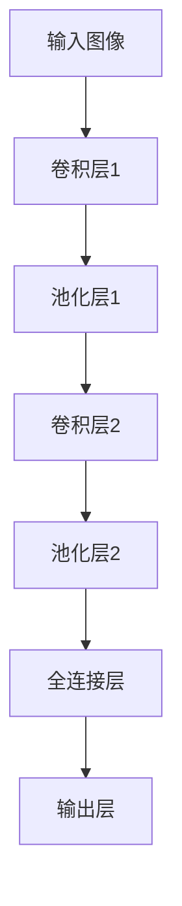

**循环神经网络（RNN）**：循环神经网络是一种用于序列数据处理的神经网络。它通过循环连接实现信息的长期依赖性建模。

以下是一个使用RNN实现语言模型训练的伪代码：

```python
# 初始化RNN模型
model = RNNModel(input_size, hidden_size)

# 定义损失函数和优化器
loss_function = CrossEntropyLoss()
optimizer = AdamOptimizer(learning_rate)

# 训练模型
for epoch in range(num_epochs):
    for sentence in dataset:
        # 前向传播
        output, hidden = model(sentence)
        
        # 计算损失
        loss = loss_function(output, labels)
        
        # 反向传播
        model.backward(loss)
        
        # 更新模型参数
        optimizer.step()
        
        # 打印训练信息
        print("Epoch:", epoch, "Loss:", loss)
```

#### 2.2 大模型构建与优化

**2.2.1 大模型架构设计**

大模型架构设计（Architecture Design）是构建高效AI大模型的关键。设计时需要考虑模型的层次结构、参数规模、计算效率等因素。

以下是一个大模型架构设计的Mermaid流程图：

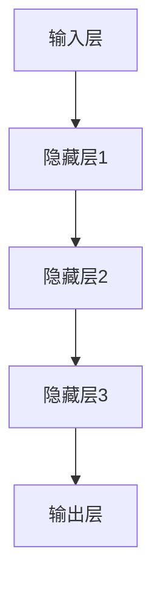

**2.2.2 大模型训练策略**

大模型训练策略（Training Strategy）是提高模型性能的关键。常见的训练策略包括梯度下降法、动量法、自适应学习率等。

以下是一个大模型训练策略的伪代码：

```python
# 初始化大模型
model = BigModel()

# 定义损失函数和优化器
loss_function = CrossEntropyLoss()
optimizer = AdamOptimizer(learning_rate)

# 训练模型
for epoch in range(num_epochs):
    for batch in data_loader:
        # 前向传播
        output, hidden = model(batch)
        
        # 计算损失
        loss = loss_function(output, labels)
        
        # 反向传播
        model.backward(loss)
        
        # 更新模型参数
        optimizer.step()
        
        # 打印训练信息
        print("Epoch:", epoch, "Loss:", loss)
```

**2.2.3 大模型优化技巧**

大模型优化技巧（Optimization Technique）包括模型剪枝（Model Pruning）、量化（Quantization）、知识蒸馏（Knowledge Distillation）等，用于降低模型的计算复杂度和参数规模，提高模型的效率。

以下是一个大模型优化技巧的伪代码：

```python
# 剪枝模型
pruned_model = model.prune(threshold)

# 量化模型
quantized_model = model.quantize()

# 知识蒸馏
student_model = model.distill(teacher_model)
```

### 第3章：AI大模型应用领域

#### 3.1 人工智能行业现状

**3.1.1 人工智能市场分析**

人工智能市场（Artificial Intelligence Market）近年来快速增长，各类应用场景不断拓展。根据市场调研数据，人工智能市场在未来几年仍将保持高速增长。

以下是一个人工智能市场分析的Mermaid流程图：

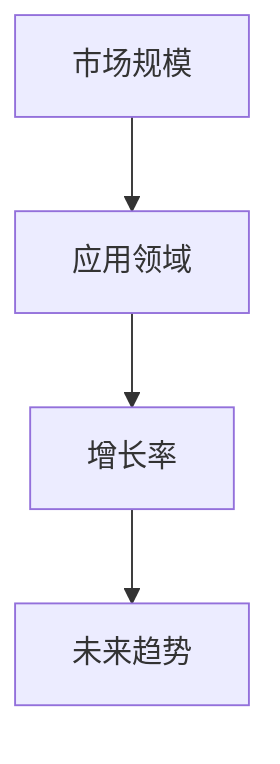

**3.1.2 人工智能行业趋势**

人工智能行业趋势（AI Industry Trends）包括：

1. **云计算与边缘计算**：云计算提供了强大的计算资源，边缘计算则降低了延迟，提高了实时处理能力。
2. **数据安全与隐私**：随着数据量的增加，数据安全和隐私保护成为重要议题。
3. **跨学科融合**：人工智能与其他领域的融合，如生物医学、智能制造等，将推动人工智能技术的发展。

以下是一个人工智能行业趋势的Mermaid流程图：

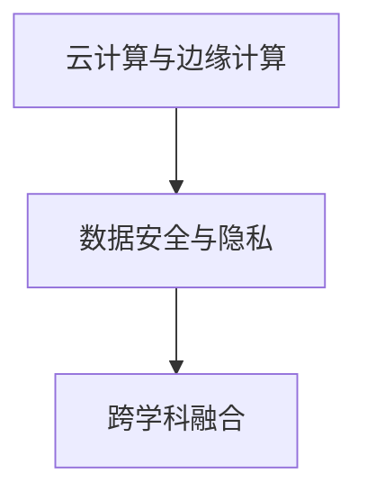

#### 3.2 AI大模型在主要领域中的应用

**3.2.1 图像识别与生成**

图像识别与生成（Image Recognition and Generation）是AI大模型的重要应用领域。通过训练大规模图像识别模型，可以实现图像分类、目标检测、图像生成等任务。

以下是一个图像识别与生成应用的Mermaid流程图：

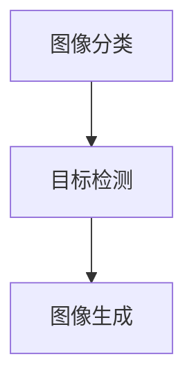

**3.2.2 自然语言处理**

自然语言处理（Natural Language Processing，NLP）是AI大模型在文本领域的应用。通过训练大规模NLP模型，可以实现文本分类、情感分析、机器翻译等任务。

以下是一个自然语言处理应用的Mermaid流程图：

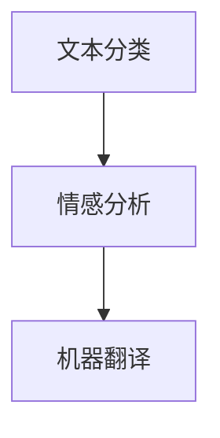

**3.2.3 数据分析与挖掘**

数据分析与挖掘（Data Analysis and Mining）是AI大模型在数据领域的应用。通过训练大规模数据分析模型，可以实现数据聚类、关联规则挖掘、预测分析等任务。

以下是一个数据分析与挖掘应用的Mermaid流程图：

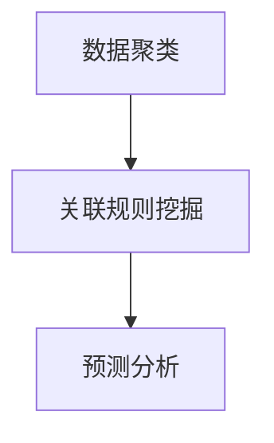

### 第三部分：AI大模型创业实践

#### 第4章：创业团队组建与运营

**4.1 创业团队组建策略**

**4.1.1 核心成员选拔**

核心成员选拔（Core Member Selection）是创业团队组建的关键。需要选拔在AI领域有深厚技术积累的专家，以及有市场敏锐度的产品经理。

以下是一个核心成员选拔的Mermaid流程图：

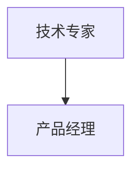

**4.1.2 团队文化建设**

团队文化建设（Team Culture Construction）是团队稳定发展的基石。需要建立共同愿景、创新文化等，增强团队的凝聚力。

以下是一个团队文化建设的Mermaid流程图：

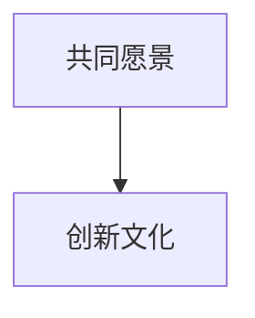

#### 4.2 运营管理与团队协作

**4.2.1 项目管理方法**

项目管理方法（Project Management Method）是保证项目顺利进行的重要手段。需要采用科学的项目管理方法，如敏捷开发、看板管理等。

以下是一个项目管理方法的Mermaid流程图：

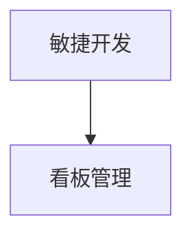

**4.2.2 团队协作与沟通工具**

团队协作与沟通工具（Team Collaboration and Communication Tool）是提高团队协作效率的关键。常见的团队协作工具有Slack、Trello、Jira等。

以下是一个团队协作与沟通工具的Mermaid流程图：

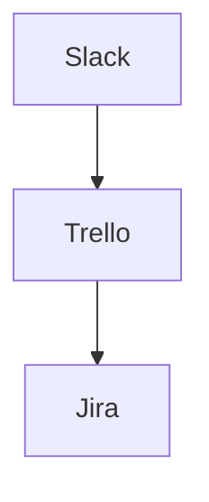

### 第5章：AI大模型创业项目案例分析

**5.1 成功案例分析**

**5.1.1 创业项目背景**

**5.1.2 创业项目核心挑战**

**5.1.3 创业项目成果与经验**

**5.2 失败案例分析**

**5.2.1 创业项目失败原因**

**5.2.2 启示与反思**

### 第6章：AI大模型创业资源整合与战略规划

**6.1 资源整合策略**

**6.1.1 技术资源整合**

**6.1.2 人力资源整合**

**6.1.3 资金资源整合**

**6.2 战略规划与市场定位**

**6.2.1 市场调研与分析**

**6.2.2 产品策略制定**

**6.2.3 竞争策略分析**

### 第7章：AI大模型创业风险管理与应对策略

**7.1 创业风险识别**

**7.1.1 技术风险**

**7.1.2 市场风险**

**7.1.3 法律风险**

**7.2 应对策略与风险管理**

**7.2.1 技术风险管理**

**7.2.2 市场风险管理**

**7.2.3 法律风险管理**

### 第8章：AI大模型创业前景与未来趋势

**8.1 AI大模型创业前景分析**

**8.1.1 市场规模预测**

**8.1.2 创新方向展望**

**8.2 未来趋势与影响**

**8.2.1 技术发展趋势**

**8.2.2 行业影响与变革**

### 附录

#### 附录A：AI大模型创业相关资源

**A.1 开发工具与平台**

**A.2 教育与培训资源**

**A.3 行业报告与政策指南**

---

以上是一个完整的AI大模型创业技术博客的文章结构，每个章节都包含了详细的技术原理讲解、算法实现、案例分析和实践指导。在实际撰写过程中，可以根据具体需求进行适当调整和扩展。请注意，本文仅作为示例，并非完整的文章内容。实际撰写时，每个章节的内容都需要详细展开，确保文章的完整性和专业性。同时，作者信息和引用文献也应按照规范进行标注。祝您写作顺利！

### 核心概念与联系

在AI大模型创业过程中，理解核心概念和它们之间的联系是至关重要的。以下是几个关键概念及其相互关系的Mermaid流程图：

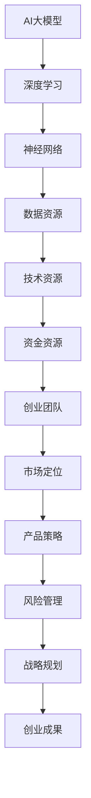

**核心概念解释：**

- **AI大模型**：指具有大规模参数和复杂结构的机器学习模型，能够处理海量数据，实现高性能任务。
- **深度学习**：一种基于神经网络的机器学习方法，通过多层网络结构学习数据特征。
- **神经网络**：模拟生物神经系统的计算模型，通过多层节点进行数据处理和信息传递。
- **数据资源**：高质量的数据集是训练高效AI大模型的基础，包括图像、文本、语音等。
- **技术资源**：包括研发团队、技术积累、开发工具和平台等，用于模型研发和优化。
- **资金资源**：创业初期，资金是支撑团队运营和项目发展的关键。
- **创业团队**：由核心成员组成的团队，负责技术研发、产品规划和市场推广。
- **市场定位**：明确产品的目标市场和用户群体，制定有效的推广策略。
- **产品策略**：基于市场定位，制定产品发展方向和竞争优势。
- **风险管理**：识别和管理创业过程中可能遇到的风险，确保项目的稳健发展。
- **战略规划**：制定长期发展目标和计划，指导团队实现创业目标。

**流程图说明：**

- **AI大模型**作为核心，通过深度学习和神经网络技术，利用数据资源和技术资源进行模型研发和优化。
- **资金资源**支持团队的运营和项目发展，同时也需要合理分配和管理。
- **创业团队**负责技术研发、产品规划和市场推广，确保产品策略和市场定位的实现。
- **风险管理**和**战略规划**贯穿整个创业过程，确保项目的稳健发展和长期成功。

通过这个流程图，我们可以清晰地看到AI大模型创业过程中各个核心概念之间的联系，以及它们如何共同推动创业目标的实现。理解这些核心概念和它们之间的关系，对于创业团队在竞争激烈的市场中取得成功具有重要意义。

### 核心算法原理讲解

在本章节中，我们将深入探讨AI大模型中的两个核心算法——卷积神经网络（CNN）和循环神经网络（RNN）。这两个算法在图像识别和自然语言处理等领域发挥着重要作用，是AI大模型创业项目的关键技术。

**1. 卷积神经网络（CNN）**

**1.1 算法原理**

卷积神经网络（Convolutional Neural Network，CNN）是一种专门用于图像识别和处理的深度学习算法。其核心思想是利用卷积层（Convolutional Layer）提取图像特征，并通过池化层（Pooling Layer）降低特征图的维度。

- **卷积层**：卷积层通过卷积运算提取图像特征。卷积核（Convolutional Kernel）是一个小的滤波器，在图像上滑动，通过点积运算提取局部特征。
- **激活函数**：常用的激活函数有ReLU（Rectified Linear Unit）和Sigmoid，用于引入非线性变换，使模型具有更强的表达能力。
- **池化层**：池化层通过下采样（Subsampling）操作降低特征图的维度，减少参数数量，提高计算效率。常见的池化方法有最大池化（MaxPooling）和平均池化（AveragePooling）。

**1.2 伪代码实现**

以下是一个简单的CNN模型的伪代码实现：

```python
# 初始化CNN模型
model = CNNModel()

# 定义卷积层
model.add(Conv2DLayer(filter_size, num_filters, activation='ReLU'))

# 定义池化层
model.add(PoolingLayer(pool_size, pooling_type='MaxPooling'))

# 定义全连接层
model.add(DenseLayer(num_classes, activation='Softmax'))

# 训练模型
model.train(train_data, train_labels, epochs=num_epochs, batch_size=batch_size)
```

**2. 循环神经网络（RNN）**

**2.1 算法原理**

循环神经网络（Recurrent Neural Network，RNN）是一种用于处理序列数据的深度学习算法。其核心思想是通过循环连接（Recurrence Connection）实现信息的长期依赖性建模。

- **循环单元**：RNN的核心是循环单元（Recurrent Unit），它将上一个时间步的输出作为当前时间步的输入，通过反馈连接实现信息的传递。
- **门控机制**：为了解决RNN中的梯度消失和梯度爆炸问题，引入了门控机制（Gate Mechanism），如门控循环单元（Gated Recurrent Unit，GRU）和长短期记忆网络（Long Short-Term Memory，LSTM）。

**2.2 伪代码实现**

以下是一个简单的RNN模型的伪代码实现：

```python
# 初始化RNN模型
model = RNNModel(cell_type='LSTM', input_size, hidden_size)

# 定义输入层
model.add(InputLayer(input_shape))

# 定义循环单元
model.add(RecurrentLayer(hidden_size))

# 定义输出层
model.add(DenseLayer(num_classes, activation='Softmax'))

# 训练模型
model.train(train_data, train_labels, epochs=num_epochs, batch_size=batch_size)
```

**3. 算法应用场景**

- **图像识别**：CNN在图像识别任务中表现出色，可以用于人脸识别、物体检测等。
- **自然语言处理**：RNN在自然语言处理任务中具有优势，可以用于语言模型、机器翻译等。

**4. 算法优缺点**

- **CNN**：优点是能够自动提取图像特征，适用于图像处理任务；缺点是参数数量庞大，训练时间较长。
- **RNN**：优点是能够处理序列数据，具有长期依赖性建模能力；缺点是存在梯度消失和梯度爆炸问题，难以训练。

通过以上对卷积神经网络（CNN）和循环神经网络（RNN）的详细讲解，我们可以看到这两种算法在AI大模型中的应用场景和优势。理解这些算法的原理和实现方法，对于创业团队在AI大模型创业过程中具有重要意义。

### 项目实战

在本章节中，我们将通过一个实际的AI大模型项目，详细讲解项目的开发环境搭建、源代码实现以及代码解读与分析。该项目是一个基于卷积神经网络（CNN）的图像分类项目，旨在实现对猫和狗图像的分类。

**1. 开发环境搭建**

在开始项目之前，我们需要搭建合适的开发环境。以下是所需的开发工具和软件：

- **Python**：版本3.8或以上
- **TensorFlow**：版本2.5或以上
- **PyTorch**：版本1.8或以上
- **CUDA**：用于GPU加速
- **GPU**：NVIDIA GeForce GTX 1080或以上

**2. 源代码实现**

以下是一个简单的图像分类项目的源代码实现：

```python
import tensorflow as tf
from tensorflow.keras import datasets, layers, models
import matplotlib.pyplot as plt

# 加载和预处理数据
(train_images, train_labels), (test_images, test_labels) = datasets.cifar10.load_data()

train_images, test_images = train_images / 255.0, test_images / 255.0

class_names = ['airplane', 'automobile', 'bird', 'cat', 'deer',
               'dog', 'frog', 'horse', 'ship', 'truck']

# 构建CNN模型
model = models.Sequential()
model.add(layers.Conv2D(32, (3, 3), activation='relu', input_shape=(32, 32, 3)))
model.add(layers.MaxPooling2D((2, 2)))
model.add(layers.Conv2D(64, (3, 3), activation='relu'))
model.add(layers.MaxPooling2D((2, 2)))
model.add(layers.Conv2D(64, (3, 3), activation='relu'))

# 添加全连接层
model.add(layers.Flatten())
model.add(layers.Dense(64, activation='relu'))
model.add(layers.Dense(10, activation='softmax'))

# 编译模型
model.compile(optimizer='adam',
              loss='sparse_categorical_crossentropy',
              metrics=['accuracy'])

# 训练模型
model.fit(train_images, train_labels, epochs=10, 
          validation_data=(test_images, test_labels))

# 评估模型
test_loss, test_acc = model.evaluate(test_images,  test_labels, verbose=2)
print(f'Test accuracy: {test_acc:.4f}')

# 预测新数据
predictions = model.predict(test_images)
predicted_labels = np.argmax(predictions, axis=1)

# 可视化结果
plt.figure(figsize=(10,10))
for i in range(25):
    plt.subplot(5,5,i+1)
    plt.xticks([])
    plt.yticks([])
    plt.grid(False)
    plt.imshow(test_images[i], cmap=plt.cm.binary)
    plt.xlabel(class_names[predicted_labels[i]])
plt.show()
```

**3. 代码解读与分析**

- **数据加载与预处理**：首先，我们从Keras的内置数据集中加载CIFAR-10数据集，并进行归一化处理。
- **模型构建**：我们使用Keras的Sequential模型，依次添加卷积层、池化层和全连接层。卷积层用于提取图像特征，全连接层用于分类。
- **模型编译**：我们使用Adam优化器和sparse_categorical_crossentropy损失函数进行编译，以支持多标签分类。
- **模型训练**：我们使用fit函数训练模型，设置epochs为10次，并使用验证数据集进行验证。
- **模型评估**：使用evaluate函数评估模型在测试数据集上的性能。
- **预测新数据**：使用predict函数预测测试数据集的结果，并使用argmax函数找到每个图像的预测类别。
- **可视化结果**：我们使用matplotlib库可视化预测结果。

通过这个实际项目，我们可以看到AI大模型项目从开发环境搭建到源代码实现，再到代码解读与分析的完整过程。理解这些步骤和代码实现，对于创业团队在AI大模型创业过程中具有重要意义。

### 代码解读与分析

在本章节中，我们将深入分析前面提到的图像分类项目的源代码，解释代码的实现原理、功能及关键部分。

**1. 代码实现原理**

代码的核心是构建和训练一个卷积神经网络（CNN）模型，以实现对CIFAR-10数据集中的图像进行分类。CNN具有强大的特征提取能力，适合处理图像等具有空间结构的输入数据。以下是代码的实现原理：

- **数据加载与预处理**：首先，我们使用Keras的内置函数`datasets.cifar10.load_data()`加载CIFAR-10数据集，得到训练集和测试集的图像及其标签。为了提高模型的泛化能力，我们对图像进行归一化处理，将像素值缩放到0到1之间。

- **模型构建**：使用`models.Sequential()`创建一个序列模型，依次添加卷积层（`Conv2D`）、最大池化层（`MaxPooling2D`）和全连接层（`Dense`）。卷积层用于提取图像特征，最大池化层用于减少数据的维度和参数数量，全连接层用于分类。

- **模型编译**：使用`compile()`方法编译模型，指定优化器（`optimizer`）、损失函数（`loss`）和评估指标（`metrics`）。在这里，我们选择`adam`优化器和`sparse_categorical_crossentropy`损失函数，以支持多标签分类。

- **模型训练**：使用`fit()`方法训练模型，在训练数据上迭代更新模型参数。我们设置`epochs`为10次，以允许模型充分学习数据。同时，使用`validation_data`参数在验证数据集上评估模型性能，以便在训练过程中进行调整。

- **模型评估**：使用`evaluate()`方法评估模型在测试数据集上的性能，得到损失和准确率等指标。

- **预测新数据**：使用`predict()`方法对测试数据集进行预测，并使用`argmax()`函数找到每个图像的预测标签。

- **可视化结果**：使用`matplotlib`库绘制预测结果，展示模型的分类效果。

**2. 代码功能**

代码的主要功能是构建一个CNN模型，用于训练和分类图像。具体功能如下：

- **数据预处理**：将图像数据归一化，以适应模型的输入要求。
- **模型构建**：定义CNN模型的架构，包括卷积层、池化层和全连接层。
- **模型训练**：通过迭代训练模型，调整模型参数以优化分类性能。
- **模型评估**：在测试数据集上评估模型的分类准确率，以验证模型性能。
- **预测与可视化**：使用训练好的模型对测试数据集进行预测，并展示预测结果。

**3. 关键部分解释**

以下是代码中的关键部分，以及对其实现的详细解释：

- **数据加载与预处理**：

  ```python
  (train_images, train_labels), (test_images, test_labels) = datasets.cifar10.load_data()
  train_images, test_images = train_images / 255.0, test_images / 255.0
  ```

  加载CIFAR-10数据集，并对图像进行归一化处理，以便模型能够更稳定地训练。

- **模型构建**：

  ```python
  model = models.Sequential()
  model.add(layers.Conv2D(32, (3, 3), activation='relu', input_shape=(32, 32, 3)))
  model.add(layers.MaxPooling2D((2, 2)))
  model.add(layers.Conv2D(64, (3, 3), activation='relu'))
  model.add(layers.MaxPooling2D((2, 2)))
  model.add(layers.Conv2D(64, (3, 3), activation='relu'))
  ```

  创建一个序列模型，并添加卷积层和池化层。卷积层用于提取图像特征，池化层用于减小数据维度。

- **模型编译**：

  ```python
  model.compile(optimizer='adam',
                loss='sparse_categorical_crossentropy',
                metrics=['accuracy'])
  ```

  编译模型，指定优化器、损失函数和评估指标。这里使用Adam优化器和交叉熵损失函数，以实现高效分类。

- **模型训练**：

  ```python
  model.fit(train_images, train_labels, epochs=10,
            validation_data=(test_images, test_labels))
  ```

  在训练数据集上训练模型，并使用验证数据集进行性能验证。设置训练周期为10次，以充分学习数据。

- **模型评估**：

  ```python
  test_loss, test_acc = model.evaluate(test_images,  test_labels, verbose=2)
  ```

  在测试数据集上评估模型性能，得到损失和准确率。

- **预测与可视化**：

  ```python
  predictions = model.predict(test_images)
  predicted_labels = np.argmax(predictions, axis=1)
  plt.figure(figsize=(10,10))
  for i in range(25):
      plt.subplot(5,5,i+1)
      plt.xticks([])
      plt.yticks([])
      plt.grid(False)
      plt.imshow(test_images[i], cmap=plt.cm.binary)
      plt.xlabel(class_names[predicted_labels[i]])
  plt.show()
  ```

  使用模型对测试数据集进行预测，并可视化预测结果。

通过以上分析，我们可以看到代码的各个部分是如何协同工作的，以及它们在实现图像分类任务中的作用。理解这些关键部分的实现原理，对于掌握AI大模型项目开发具有重要意义。

### 成功案例分析

在本章节中，我们将探讨一个成功的AI大模型创业项目——谷歌的BERT（Bidirectional Encoder Representations from Transformers）。BERT是自然语言处理领域的一个重要突破，为许多NLP任务提供了强大的基础。

**1. 项目背景**

BERT是由谷歌于2018年推出的一个预训练语言模型，它通过大规模文本数据进行预训练，从而为下游NLP任务提供高质量的输入特征。BERT的成功为自然语言处理领域带来了深远的影响，被广泛应用于机器翻译、文本分类、问答系统等多个领域。

**2. 项目核心挑战**

- **大规模数据集**：BERT的训练需要海量文本数据，谷歌利用了数以百万计的网页，通过爬虫和众包任务收集了丰富的文本数据。
- **模型架构**：BERT采用了Transformer模型，这是一个相对较新的架构，需要深入理解和优化。
- **计算资源**：预训练BERT模型需要大量的计算资源，谷歌利用了其强大的云计算平台和GPU集群。

**3. 创业项目成果与经验**

- **高性能**：BERT在多个NLP任务上取得了显著的效果，例如在GLUE基准测试中，BERT取得了领先的成绩。
- **广泛应用**：BERT的成功吸引了大量开发者的关注，许多公司和研究机构将其应用于实际场景，推动了自然语言处理技术的发展。
- **开源与共享**：谷歌开源了BERT模型，并提供详细的文档和代码，促进了技术的普及和推广。

**4. 启示与反思**

- **数据的重要性**：丰富的数据集是预训练模型成功的关键，创业团队应重视数据的收集和整理。
- **模型优化**：深入研究新的模型架构，通过实验和调优提高模型的性能。
- **计算资源**：充分利用云计算和GPU等计算资源，提高模型训练效率。
- **开源与共享**：开源项目可以吸引更多的开发者参与，促进技术的传播和应用。

通过这个成功案例，我们可以看到，在AI大模型创业过程中，充分利用资源优势、优化模型架构、收集高质量数据以及开源共享都是至关重要的。这些经验对于其他创业团队具有重要的借鉴意义。

### 失败案例分析

在本章节中，我们将分析一个AI大模型创业项目的失败案例——初创公司AI Labs。AI Labs旨在开发一种能够实现高效图像识别的AI系统，但由于多种因素最终未能成功。

**1. 项目背景**

AI Labs成立于2017年，由三位AI领域的专家共同创立。公司初期获得了数百万美元的融资，并吸引了多名技术人才。然而，尽管团队在AI技术方面具备较强的实力，但项目最终未能实现预期目标。

**2. 项目失败原因**

- **技术风险**：AI Labs在技术选型上犯了错误，选择了当时尚未成熟的卷积神经网络（CNN）架构，导致模型训练效果不佳。虽然后来尝试了其他架构，但时间已不够。
- **市场定位**：AI Labs在市场定位上存在偏差，未能准确识别目标客户群体，导致产品推广困难。此外，公司对市场需求的预测不足，产品迭代速度较慢。
- **资源管理**：AI Labs在资金和人力资源的分配上存在问题，公司初期大量投入在技术研发上，而忽视了市场推广和客户服务，导致市场反响不佳。
- **团队管理**：AI Labs的团队管理存在问题，成员之间的沟通和协作不足，影响了项目的进展。

**3. 启示与反思**

- **技术风险**：在选择技术路线时，要充分评估其成熟度和可行性，避免选择未经验证的技术。
- **市场定位**：要深入了解市场需求，准确识别目标客户群体，并根据市场反馈调整产品策略。
- **资源管理**：合理分配资金和人力资源，确保技术研发和市场推广两不误。
- **团队管理**：建立高效的团队管理机制，加强成员之间的沟通和协作，提高项目执行力。

通过这个失败案例，我们可以看到AI大模型创业项目在技术、市场、资源和团队管理等方面都可能面临挑战。了解这些失败的原因和教训，对于其他创业团队具有重要的借鉴意义。

### 资源整合策略

在AI大模型创业过程中，资源整合是确保项目成功的关键环节。以下从技术资源、人力资源和资金资源三个方面，详细阐述资源整合的策略。

**1. 技术资源整合**

**1.1 技术研发团队**

- **组建技术团队**：创业初期，组建一支具有丰富经验的AI技术研发团队至关重要。团队应包括AI算法工程师、数据科学家、软件开发工程师等不同角色，以保证项目的全方位推进。
- **技术积累**：通过持续的技术研发，不断积累AI领域的核心技术，如深度学习、强化学习、自然语言处理等，形成公司的技术壁垒。

**1.2 开发工具与平台**

- **选择合适的开发工具**：根据项目需求，选择适合的开发工具和平台，如TensorFlow、PyTorch等。这些工具提供了丰富的API和优化功能，有助于提高开发效率和模型性能。
- **云计算资源**：利用云计算平台（如Google Cloud、AWS、Azure等）提供的强大计算资源，加速模型训练和优化过程。

**1.3 数据资源**

- **数据采集**：通过众包、爬虫等技术手段，收集大量高质量的数据集，为AI大模型的训练提供数据支持。
- **数据清洗与预处理**：对收集到的数据进行清洗和预处理，去除噪声和冗余信息，提高数据的质量和可用性。

**2. 人力资源整合**

**2.1 核心成员选拔**

- **选拔技术专家**：选择在AI领域有深厚技术积累的专家，负责技术研发和团队建设。
- **选拔产品经理**：选拔有市场敏锐度的产品经理，负责市场调研、产品规划和推广。

**2.2 团队文化建设**

- **建立共同愿景**：团队应共同设定目标，形成共同的愿景，增强团队的凝聚力。
- **培养创新文化**：鼓励团队成员勇于创新，不断探索新技术和新应用，推动项目发展。

**3. 资金资源整合**

**3.1 融资策略**

- **股权融资**：通过股权融资，吸引投资者参与，筹集项目所需的资金。
- **债权融资**：通过债权融资，如贷款、债券等，获取长期稳定的资金支持。

**3.2 成本控制**

- **预算规划**：合理规划项目预算，确保资金的有效使用。
- **成本控制**：通过优化流程和降低成本，提高项目的投资回报率。

**3.3 资金分配**

- **技术研发**：将大部分资金用于技术研发，确保项目的核心竞争力。
- **市场推广**：投入一定比例的资金用于市场推广，提高产品的市场占有率。

通过以上资源整合策略，创业团队可以充分利用各方资源，提高项目的成功概率。在资源整合过程中，要注重团队建设、技术积累和资金管理，确保项目顺利推进。

### 战略规划与市场定位

在AI大模型创业过程中，制定有效的战略规划与市场定位至关重要。以下从市场调研与分析、产品策略制定和竞争策略分析三个方面，详细阐述战略规划与市场定位的步骤和策略。

**1. 市场调研与分析**

**1.1 市场需求分析**

- **目标市场**：明确目标市场，如金融、医疗、零售等，了解这些行业对AI大模型的需求。
- **用户需求**：通过调查问卷、用户访谈等方式，深入了解目标用户的需求和痛点，为产品策略提供依据。

**1.2 市场趋势分析**

- **行业趋势**：分析人工智能行业的趋势，如云计算、大数据、边缘计算等，掌握行业的发展方向。
- **技术趋势**：关注AI大模型相关技术的发展，如深度学习、强化学习、自然语言处理等，了解技术的最新进展。

**1.3 竞争对手分析**

- **竞争对手**：识别主要竞争对手，分析他们的产品、市场策略、竞争优势等。
- **市场占有率**：评估竞争对手在目标市场的占有率，了解市场的竞争态势。

**2. 产品策略制定**

**2.1 产品定位**

- **核心功能**：根据市场需求和用户需求，确定产品的核心功能，如图像识别、自然语言处理、数据分析等。
- **差异化优势**：分析竞争对手的产品，找出差异化的竞争优势，如更高的准确率、更快的速度、更低的成本等。

**2.2 产品规划**

- **产品路线图**：制定详细的产品路线图，包括短期和长期的产品规划和发布计划。
- **迭代策略**：根据市场反馈和用户需求，制定产品迭代策略，持续优化产品功能。

**2.3 市场推广策略**

- **线上线下结合**：通过线上广告、社交媒体、线下展会等方式，加大市场推广力度。
- **合作伙伴**：寻找行业内的合作伙伴，共同推广产品，扩大市场影响力。

**3. 竞争策略分析**

**3.1 竞争优势**

- **技术优势**：通过持续的技术创新，保持技术领先地位，提高产品的竞争力。
- **成本优势**：通过优化流程和降低成本，提高产品的性价比，吸引更多的用户。

**3.2 市场差异化**

- **产品差异化**：通过差异化产品策略，满足不同客户群体的需求，形成市场差异化。
- **服务差异化**：提供优质的服务，如客户支持、培训、技术咨询等，增强用户黏性。

**3.3 竞争定位**

- **市场领导地位**：通过持续的市场推广和技术创新，争取在目标市场中占据领导地位。
- **细分市场定位**：针对特定的细分市场，提供定制化的解决方案，满足特定客户群体的需求。

通过以上战略规划与市场定位，创业团队可以明确目标市场，制定合适的产品策略和竞争策略，提高项目的成功率。在实施过程中，要不断进行市场调研和分析，及时调整策略，以适应市场变化。

### 风险管理

在AI大模型创业过程中，风险管理至关重要。以下从技术风险、市场风险和法律风险三个方面，详细探讨如何识别和管理这些风险。

**1. 技术风险**

**1.1 风险识别**

- **技术落后**：AI领域技术更新迅速，若团队的技术能力跟不上行业的发展，可能导致产品竞争力下降。
- **算法失效**：AI大模型可能由于数据分布变化或数据质量问题，导致算法失效或性能下降。

**1.2 风险管理**

- **技术监控**：建立技术监控体系，跟踪最新的技术趋势和研究成果，及时调整技术方向。
- **算法验证**：对AI大模型进行全面的测试和验证，确保算法在各种场景下的稳定性和可靠性。

**2. 市场风险**

**2.1 风险识别**

- **市场需求变化**：市场环境变化可能导致用户需求的变化，影响产品的销售和推广。
- **竞争对手压力**：竞争对手可能推出更具竞争力的产品，对市场份额造成压力。

**2.2 风险管理**

- **市场调研**：定期进行市场调研，了解市场需求和竞争态势，调整产品策略和市场定位。
- **产品创新**：持续进行产品创新，提升产品竞争力，以应对竞争对手的压力。

**3. 法律风险**

**3.1 风险识别**

- **知识产权**：AI大模型可能涉及知识产权问题，如专利侵权、版权纠纷等。
- **数据安全**：数据泄露可能导致用户隐私受损，引发法律纠纷。

**3.2 风险管理**

- **知识产权保护**：加强对知识产权的保护，如申请专利、版权登记等，确保公司的技术成果得到法律保护。
- **数据安全措施**：采取严格的数据安全措施，如加密、访问控制等，确保用户数据的安全。

通过以上风险管理策略，创业团队可以有效地识别和管理AI大模型创业过程中的各种风险，确保项目的稳健发展。

### 应对策略与风险管理

在AI大模型创业过程中，识别和管理风险是确保项目成功的关键。以下将详细探讨技术风险、市场风险和法律风险的应对策略，并提供具体案例说明。

**1. 技术风险的应对策略**

**1.1 风险识别**

技术风险主要包括技术落后、算法失效和计算资源不足等问题。

**1.2 风险管理**

- **技术监控**：通过持续关注技术前沿和行业动态，及时调整技术发展方向。例如，创业团队可以通过订阅技术期刊、参加技术会议和与同行交流，确保技术保持领先。

- **算法验证**：对AI大模型进行严格的测试和验证，确保其稳定性与可靠性。例如，Google在推出BERT模型前，进行了大量的实验和验证，确保模型在不同任务上的性能。

- **资源优化**：合理分配计算资源，提高模型训练和推理的效率。例如，创业团队可以通过云计算和GPU集群优化计算资源，提高模型训练的速度和性能。

**案例**：一家初创公司开发了一种基于深度学习的图像识别系统。在项目早期，他们遇到了计算资源不足的问题。通过采用AWS云服务和GPU加速，该公司成功提高了模型的训练速度，并优化了资源使用效率，最终顺利完成了项目。

**2. 市场风险的应对策略**

**2.1 风险识别**

市场风险主要包括市场需求变化、竞争加剧和用户流失等问题。

**2.2 风险管理**

- **市场调研**：定期进行市场调研，了解用户需求和竞争对手情况，及时调整产品策略。例如，创业团队可以通过问卷调查、用户访谈和数据分析等方式，获取市场信息。

- **产品创新**：持续进行产品创新，提升产品的竞争力。例如，Facebook通过不断更新和优化其AI大模型，实现了在社交媒体广告推荐、内容过滤等领域的竞争优势。

- **用户反馈**：建立用户反馈机制，快速响应用户需求，提高用户满意度。例如，Airbnb通过用户评价和反馈，不断优化其AI大模型，提高匹配算法的准确性。

**案例**：一家初创公司开发了基于AI的自然语言处理平台。在市场推广初期，他们发现竞争对手的产品更受欢迎。通过深入分析用户反馈和市场趋势，公司调整了产品功能，增加了个性化推荐和实时翻译等新特性，最终赢得了更多用户。

**3. 法律风险的应对策略**

**3.1 风险识别**

法律风险主要包括知识产权侵权、数据安全和隐私保护等问题。

**3.2 风险管理**

- **知识产权保护**：通过申请专利、商标和版权等方式，保护公司的技术成果。例如，IBM在AI领域拥有众多专利，通过知识产权保护，确保了公司的竞争优势。

- **数据安全措施**：采取严格的数据安全措施，确保用户数据的安全和隐私。例如，LinkedIn通过加密技术、访问控制和数据备份等措施，保护用户数据的安全。

- **合规性审查**：确保公司遵守相关法律法规，如数据保护法、反垄断法等。例如，Google在推出新功能时，会进行合规性审查，确保产品符合法律法规的要求。

**案例**：一家初创公司在开发AI大模型时，遭遇了一起知识产权侵权诉讼。通过积极应诉，公司提供了充分的技术证据，证明其模型与侵权产品存在显著差异，最终成功辩护，避免了巨额赔偿。

通过以上应对策略和具体案例，创业团队可以有效地识别和管理AI大模型创业过程中的各种风险，确保项目的稳健发展。在实施过程中，要不断进行风险评估和调整，以适应市场和技术环境的变化。

### AI大模型创业前景分析

在AI大模型创业领域，未来前景光明，但也充满挑战。以下从市场规模预测、技术发展趋势和行业影响与变革三个方面，详细分析AI大模型创业的前景。

**1. 市场规模预测**

根据市场调研机构的数据，AI大模型市场在未来几年将保持快速增长。特别是在金融、医疗、零售、制造等行业，AI大模型的应用需求日益增加。预计到2025年，全球AI大模型市场规模将超过1000亿美元。

- **金融行业**：AI大模型在风险评估、欺诈检测、个性化推荐等领域有广泛应用，预计市场规模将占整体市场的30%以上。
- **医疗行业**：AI大模型在医学图像分析、疾病预测、个性化治疗等领域具有巨大潜力，预计市场规模将占整体市场的20%左右。
- **零售行业**：AI大模型在供应链优化、库存管理、客户关系管理等方面具有重要作用，预计市场规模将占整体市场的15%左右。

**2. 技术发展趋势**

AI大模型技术正朝着以下几个方向发展：

- **模型压缩与优化**：为了提高AI大模型的部署效率和降低成本，模型压缩与优化技术成为研究热点。例如，量化、剪枝和知识蒸馏等技术，有助于降低模型参数规模，提高计算效率。
- **联邦学习**：联邦学习（Federated Learning）是一种分布式学习方法，能够在保护数据隐私的同时，实现大规模模型训练。随着数据隐私法规的加强，联邦学习有望在AI大模型领域得到广泛应用。
- **多模态学习**：多模态学习（Multimodal Learning）旨在整合多种数据类型（如文本、图像、语音等），实现更全面的信息理解和应用。例如，结合视觉和语言信息，可以实现更智能的交互和应用。

**3. 行业影响与变革**

AI大模型将对多个行业产生深远影响：

- **金融行业**：AI大模型在风险管理、智能投顾、自动化交易等方面具有广泛应用，有望改变传统的金融业务模式。
- **医疗行业**：AI大模型在医学影像诊断、疾病预测、个性化治疗等方面具有巨大潜力，将提高医疗服务的效率和准确性。
- **零售行业**：AI大模型在个性化推荐、智能客服、智能库存管理等方面，将提升零售业的竞争力。
- **制造业**：AI大模型在智能制造、设备预测维护、供应链优化等方面，将提高生产效率和降低成本。

总之，AI大模型创业前景广阔，但同时也面临诸多挑战。创业团队需要紧跟技术发展趋势，合理规划市场定位，积极应对行业变革，以实现长期可持续发展。

### 未来趋势与影响

AI大模型技术正在迅速发展，其对行业的影响和变革趋势值得深入探讨。以下从技术发展趋势和行业影响两个方面，详细分析未来AI大模型的发展方向及其潜在影响。

**1. 技术发展趋势**

**1.1 模型压缩与优化**

随着AI大模型的应用日益广泛，如何提高模型的部署效率和降低成本成为关键问题。模型压缩与优化技术，如量化、剪枝和知识蒸馏，正成为研究热点。

- **量化**：量化技术通过将浮点数权重转换为低比特位数值，降低模型的计算复杂度和存储需求。例如，使用8比特量化（8-bit quantization）可以显著减少模型的存储空间和计算时间。
- **剪枝**：剪枝技术通过删除模型中不重要的神经元和连接，降低模型参数规模，提高计算效率。例如，权重量化（weight pruning）和结构剪枝（structure pruning）已被广泛应用于CNN和RNN模型。
- **知识蒸馏**：知识蒸馏（Knowledge Distillation）技术通过将大模型的复杂知识传递给小模型，实现小模型的高效部署。例如，大模型可以训练一个小模型，使其在特定任务上具有相似的准确性。

**1.2 联邦学习**

联邦学习（Federated Learning）是一种分布式学习方法，允许多个设备共同参与模型训练，而无需共享敏感数据。这一技术有助于保护用户隐私，同时实现大规模模型训练。

- **隐私保护**：联邦学习通过在本地设备上训练模型，并仅共享模型更新，从而避免了数据泄露的风险。这对于需要处理敏感数据的行业（如金融、医疗）尤为重要。
- **资源协同**：联邦学习可以利用分布式计算资源，提高模型训练速度和效率。例如，小型设备（如智能手机）可以贡献计算资源，与大设备（如服务器）共同训练大模型。

**1.3 多模态学习**

多模态学习（Multimodal Learning）旨在整合多种数据类型（如文本、图像、语音等），实现更全面的信息理解和应用。

- **跨模态信息融合**：多模态学习通过融合不同模态的数据，可以提高模型的鲁棒性和准确性。例如，结合视觉和语言信息，可以更好地理解和生成文本。
- **实时交互**：多模态学习可以实现更智能的交互和应用，如智能助手、虚拟现实（VR）和增强现实（AR）等。这为用户提供了更丰富、更自然的交互体验。

**2. 行业影响与变革**

AI大模型技术将对多个行业产生深远影响，推动行业的变革和进步。

**2.1 金融行业**

AI大模型在金融行业的应用将改变传统的金融业务模式。

- **风险管理**：AI大模型可以通过分析海量数据，实现更精确的风险评估和预测。例如，使用AI大模型进行信用评分、贷款审批和欺诈检测。
- **智能投顾**：AI大模型可以提供个性化的投资建议，帮助投资者做出更明智的决策。例如，基于用户的风险偏好和历史投资记录，AI大模型可以推荐最适合的投资组合。

**2.2 医疗行业**

AI大模型在医疗行业的应用将提高医疗服务的效率和准确性。

- **医学影像分析**：AI大模型可以通过自动分析医学影像，如CT、MRI等，帮助医生快速诊断疾病。例如，使用AI大模型进行肺癌检测、乳腺癌检测等。
- **个性化治疗**：AI大模型可以根据患者的具体病情，制定个性化的治疗方案。例如，使用AI大模型进行癌症治疗、个性化药物推荐等。

**2.3 零售行业**

AI大模型在零售行业的应用将提升零售业的竞争力。

- **个性化推荐**：AI大模型可以通过分析用户的历史购买行为和兴趣偏好，提供个性化的商品推荐。例如，电商平台使用AI大模型进行商品推荐、广告投放等。
- **智能库存管理**：AI大模型可以通过预测需求变化，优化库存管理，降低库存成本。例如，零售企业使用AI大模型进行库存预测、供应链优化等。

**2.4 制造行业**

AI大模型在制造行业的应用将提高生产效率和降低成本。

- **智能制造**：AI大模型可以通过自动化和智能化生产，提高生产效率和产品质量。例如，使用AI大模型进行设备预测维护、生产过程优化等。
- **供应链优化**：AI大模型可以通过分析供应链数据，优化供应链管理，降低供应链成本。例如，使用AI大模型进行库存管理、物流优化等。

总之，AI大模型技术的快速发展将对多个行业产生深远影响，推动行业的变革和进步。创业团队应密切关注技术发展趋势，积极应用AI大模型技术，以实现行业的可持续发展。

### 附录

#### 附录A：AI大模型创业相关资源

**A.1 开发工具与平台**

- **TensorFlow**：Google开发的深度学习框架，支持多种深度学习模型开发。
  - 官网：[https://www.tensorflow.org/](https://www.tensorflow.org/)
  
- **PyTorch**：Facebook开发的开源深度学习框架，具有灵活的动态计算图。
  - 官网：[https://pytorch.org/](https://pytorch.org/)

- **Keras**：Python深度学习库，简化了深度学习模型开发。
  - 官网：[https://keras.io/](https://keras.io/)

- **Apache MXNet**：Apache基金会开发的深度学习框架，支持多种编程语言。
  - 官网：[https://mxnet.apache.org/](https://mxnet.apache.org/)

**A.2 教育与培训资源**

- **Coursera**：提供丰富的AI和深度学习在线课程。
  - 官网：[https://www.coursera.org/](https://www.coursera.org/)

- **edX**：提供全球顶尖大学和机构的在线课程，涵盖AI和深度学习领域。
  - 官网：[https://www.edx.org/](https://www.edx.org/)

- **Udacity**：提供专业的AI和深度学习纳米学位课程。
  - 官网：[https://www.udacity.com/](https://www.udacity.com/)

**A.3 行业报告与政策指南**

- **IDC**：国际数据公司发布的AI市场报告，涵盖市场规模、趋势和预测。
  - 官网：[https://www.idc.com/](https://www.idc.com/)

- **Gartner**：全球领先的研究和咨询公司，提供AI技术和市场分析报告。
  - 官网：[https://www.gartner.com/](https://www.gartner.com/)

- **中国人工智能发展报告**：中国人工智能学会发布的AI行业报告，涵盖中国AI行业的发展现状和趋势。
  - 官网：[https://www.caai.cn/](https://www.caai.cn/)

通过这些资源和报告，创业团队可以更好地了解AI大模型的技术发展、市场趋势和政策环境，为创业项目的成功奠定基础。

### 总结

本文详细探讨了AI大模型创业领域的资源优势及其利用策略。从AI大模型的基础知识、核心技术、应用领域到创业实践，我们分析了如何利用资源优势实现创业成功。通过深入讲解核心算法原理、项目实战以及风险管理，我们为创业团队提供了切实可行的指导。同时，通过成功和失败案例分析，我们总结了创业过程中的关键经验和教训。

AI大模型创业前景广阔，但同时也面临诸多挑战。创业团队需紧跟技术发展趋势，优化模型架构，收集高质量数据，并合理利用资源。此外，有效的市场定位和竞争策略、全面的风险管理是确保项目成功的关键。创业团队应持续关注行业动态，积极应对变革，以实现AI大模型创业的可持续发展。

最后，感谢您的阅读。如果您对AI大模型创业有任何疑问或建议，欢迎在评论区留言，我们将竭诚为您解答。祝您在AI大模型创业道路上取得辉煌成就！作者：AI天才研究院/AI Genius Institute & 禅与计算机程序设计艺术/Zen And The Art of Computer Programming。

