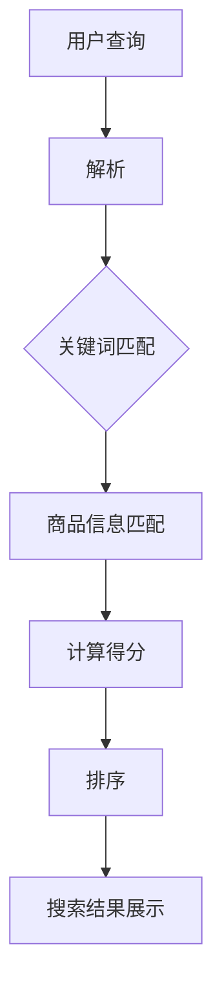

                 

# 《AI 大模型在电商搜索系统中的应用：准确率与召回率的平衡艺术》

## 摘要

随着电商行业的迅速发展，电商搜索系统成为商家与消费者之间的重要交互窗口。本文将探讨AI大模型在电商搜索系统中的应用，重点分析如何平衡准确率与召回率。通过深入探讨AI大模型的基础知识、核心算法、应用场景以及案例分析，本文旨在为电商行业提供一种高效的搜索解决方案，以提升用户体验和商家转化率。

## 目录大纲

### 第一部分：AI 大模型基础

#### 第1章：AI 大模型概述

##### 1.1 AI 大模型的基本概念
##### 1.2 AI 大模型的发展历程
##### 1.3 AI 大模型的核心技术

#### 第2章：AI 大模型核心算法

##### 2.1 神经网络基础
###### 2.1.1 神经网络的基本构成
###### 2.1.2 神经网络的训练过程
###### 2.1.3 深度神经网络的优势

#### 第3章：AI 大模型在电商搜索中的应用

##### 3.1 电商搜索系统概述
###### 3.1.1 电商搜索的目标
###### 3.1.2 电商搜索系统的架构

### 第二部分：准确率与召回率

#### 第4章：准确率与召回率

##### 4.1 准确率与召回率的定义
###### 4.1.1 准确率的计算
###### 4.1.2 召回率的计算

#### 第5章：平衡准确率与召回率

##### 5.1 账户排名模型
###### 5.1.1 账户排名模型的基本原理
###### 5.1.2 账户排名模型的应用

### 第三部分：案例研究

#### 第6章：案例研究

##### 6.1 案例一：淘宝搜索
###### 6.1.1 淘宝搜索系统介绍
###### 6.1.2 淘宝搜索系统的AI大模型应用

### 第四部分：AI 大模型在电商搜索中的未来展望

#### 第7章：AI 大模型在电商搜索中的未来展望

##### 7.1 AI 大模型在电商搜索中的发展趋势
###### 7.1.1 电商搜索AI大模型的应用领域
###### 7.1.2 AI 大模型在电商搜索中的挑战与机遇

### 第五部分：总结与展望

#### 第8章：总结与展望

##### 8.1 本书的主要结论
##### 8.2 AI 大模型在电商搜索中的应用展望

## 引言

电商搜索系统是电商平台的核心功能之一，它直接影响用户的购物体验和商家的销售业绩。传统的电商搜索系统主要依赖于关键词匹配和简单的排序算法，但这种方式在应对复杂的用户需求和海量的商品信息时显得力不从心。随着人工智能技术的快速发展，AI大模型开始在电商搜索系统中崭露头角，为搜索系统的优化提供了全新的解决方案。

AI大模型具有强大的数据处理和分析能力，能够从大量的商品数据中提取有用的信息，为用户提供更加精准和个性化的搜索结果。然而，AI大模型的应用不仅带来了准确率的提升，也引入了新的挑战，如如何在保证准确率的同时提高召回率。准确率与召回率的平衡成为电商搜索系统优化过程中亟待解决的问题。

本文将从以下几个方面展开讨论：

1. AI大模型的基础知识，包括其基本概念、发展历程和核心技术。
2. AI大模型在电商搜索系统中的应用，以及电商搜索系统的架构和目标。
3. 准确率与召回率的定义和计算方法，以及如何平衡这两者之间的关系。
4. 账户排名模型在电商搜索系统中的应用，以及其基本原理。
5. 深入分析淘宝搜索系统中的AI大模型应用案例，探讨其实际效果和挑战。
6. AI大模型在电商搜索中的未来发展趋势和面临的挑战。

通过本文的探讨，希望读者能够对AI大模型在电商搜索系统中的应用有一个全面而深入的理解，并为电商搜索系统的优化提供一些有益的思路。

### 第一部分：AI 大模型基础

#### 第1章：AI 大模型概述

##### 1.1 AI 大模型的基本概念

AI大模型（Large-scale Artificial Intelligence Model）是指规模庞大、参数众多的深度学习模型。这些模型通过学习大量的数据，可以自动从数据中提取复杂的关系和模式，从而实现高水平的预测和决策。AI大模型通常基于神经网络结构，特别是深度神经网络（Deep Neural Network，DNN），其特点是具有多层神经元，能够进行复杂的特征提取和抽象。

AI大模型的基本概念可以分为以下几个方面：

1. **规模**：AI大模型的规模通常指的是其参数的数量。随着计算能力的提升和数据量的增加，AI大模型的规模也在不断扩大。例如，BERT模型有数十亿个参数，GPT-3模型更是有超过一亿个参数。

2. **结构**：AI大模型的结构通常是指其神经网络的结构。常见的结构包括多层感知机（MLP）、卷积神经网络（CNN）、循环神经网络（RNN）和Transformer等。

3. **训练**：AI大模型的训练过程是通过大量数据来调整模型参数的过程。这个过程通常涉及到大量的计算资源，包括GPU和TPU等。

4. **应用**：AI大模型的应用场景非常广泛，包括自然语言处理、计算机视觉、语音识别、推荐系统等。在电商搜索系统中，AI大模型可以用于商品推荐、搜索结果排序和用户行为分析等。

##### 1.2 AI 大模型的发展历程

AI大模型的发展历程可以分为几个重要阶段：

1. **早期探索（1980s-1990s）**：在这个阶段，神经网络的概念被提出，并且一些简单的神经网络模型如感知机、多层感知机开始被应用于一些简单的任务中。

2. **复兴阶段（2006-2012）**：随着反向传播算法和优化算法的改进，以及GPU等计算资源的普及，神经网络的研究和应用迎来了新一轮的复兴。这一阶段，深度学习开始成为人工智能领域的主流。

3. **大规模应用（2012-至今）**：在2012年，AlexNet在ImageNet竞赛中取得了突破性的成绩，这标志着深度学习在图像识别领域的崛起。随后，深度学习在各个领域迅速扩展，AI大模型的应用也随之增多。

4. **技术突破（2018-至今）**：随着Transformer架构的提出，AI大模型的发展进入了新的阶段。Transformer引入了自注意力机制，使得AI大模型能够处理更长的序列，并且取得了显著的性能提升。这一阶段，如BERT、GPT等大规模预训练模型相继问世，推动了AI大模型的研究和应用。

##### 1.3 AI 大模型的核心技术

AI大模型的核心技术主要包括以下几个方面：

1. **神经网络**：神经网络是AI大模型的基础。深度神经网络通过多层神经元结构，能够对数据进行多层次的抽象和特征提取。常见的神经网络结构包括卷积神经网络（CNN）、循环神经网络（RNN）和Transformer等。

2. **优化算法**：优化算法是调整神经网络模型参数的关键。常用的优化算法包括梯度下降、随机梯度下降（SGD）、Adam等。优化算法的效率和稳定性直接影响模型训练的速度和性能。

3. **数据预处理**：数据预处理是AI大模型训练前的重要步骤。数据预处理包括数据清洗、数据增强、数据标准化等操作，目的是提高数据质量和模型训练效果。

4. **模型评估与调优**：模型评估与调优是确保模型性能的关键环节。常用的评估指标包括准确率、召回率、F1值等。调优方法包括超参数调整、模型融合等。

5. **预训练与微调**：预训练与微调是大规模模型训练的重要策略。预训练阶段，模型在大规模数据集上进行训练，学习通用的特征表示；微调阶段，模型在特定任务上进行微调，优化任务性能。

通过上述核心技术的应用，AI大模型能够实现强大的数据处理和分析能力，为电商搜索系统等应用场景提供了高效解决方案。

### 第2章：AI 大模型核心算法

#### 2.1 神经网络基础

神经网络是AI大模型的核心技术之一，其基本原理基于生物神经元的工作方式。神经网络由多个神经元（或称为节点）组成，每个神经元都与其他神经元通过权重连接。这些权重决定了信息传递的强度，而激活函数则决定了神经元是否被激活。

##### 2.1.1 神经网络的基本构成

1. **输入层**：输入层是神经网络的第一层，接收外部输入数据。每个输入节点对应于数据的一个特征。

2. **隐藏层**：隐藏层位于输入层和输出层之间，可以有一个或多个。隐藏层的主要作用是对输入数据进行特征提取和变换。

3. **输出层**：输出层是神经网络的最后一层，产生预测结果或分类标签。

4. **权重和偏置**：每个连接（边）都有一个权重，表示连接的强度。此外，每个神经元都有一个偏置项，用于调整神经元的输出。

5. **激活函数**：激活函数是神经网络中的一个关键组件，用于引入非线性变换。常见的激活函数包括Sigmoid、ReLU和Tanh等。

##### 2.1.2 神经网络的训练过程

神经网络的训练过程是一个不断调整权重和偏置的过程，目的是使模型能够对训练数据进行准确的预测。训练过程通常包括以下几个步骤：

1. **前向传播**：在前向传播阶段，输入数据通过网络传递，经过每一层神经元的计算，最终得到输出层的结果。

2. **计算损失**：将网络的输出与实际标签进行比较，计算损失函数（如均方误差MSE或交叉熵损失）的值。

3. **反向传播**：反向传播是神经网络训练的核心步骤。通过计算每个权重和偏置对损失函数的影响，利用梯度下降或其他优化算法调整权重和偏置。

4. **更新权重和偏置**：根据反向传播计算出的梯度，更新每个权重和偏置的值，以减少损失函数的值。

5. **迭代训练**：重复前向传播和反向传播的过程，直到模型收敛到满意的性能水平。

##### 2.1.3 深度神经网络的优势

深度神经网络（DNN）是神经网络的一种扩展，其具有以下几个优势：

1. **多级特征提取**：深度神经网络能够通过多层非线性变换，对输入数据进行多级特征提取和抽象，从而捕捉到更复杂的特征。

2. **良好的泛化能力**：由于深度神经网络能够学习到丰富的特征表示，其具有良好的泛化能力，能够在新数据上取得良好的性能。

3. **处理复杂数据**：深度神经网络可以处理各种类型的数据，包括图像、文本和语音等，这使得它们在多种应用场景中具有广泛的应用。

4. **高效的可扩展性**：深度神经网络可以通过增加层数或节点数来扩展，从而提高模型的性能，同时保持计算效率和可维护性。

通过上述核心算法和基本概念的理解，我们可以更好地掌握神经网络的工作原理，并为进一步探讨AI大模型在电商搜索系统中的应用打下基础。

#### 第3章：AI 大模型在电商搜索中的应用

##### 3.1 电商搜索系统概述

电商搜索系统是电商平台的重要组成部分，它直接影响用户的购物体验和商家的销售业绩。电商搜索系统的核心目标是帮助用户快速、准确地找到所需商品，从而提高用户满意度和转化率。

**电商搜索系统的架构**主要包括以下几个关键组成部分：

1. **用户界面**：用户界面是用户与电商搜索系统交互的入口，通常包括搜索框、搜索建议、搜索结果展示等模块。

2. **搜索引擎**：搜索引擎是电商搜索系统的核心，负责处理用户的搜索请求，执行关键词匹配和结果排序等操作。搜索引擎通常包括索引模块、查询解析模块和排序模块。

3. **数据存储**：数据存储模块用于存储和管理电商平台的海量商品信息，包括商品名称、描述、价格、库存等数据。常用的数据存储技术包括关系数据库、NoSQL数据库和搜索引擎等。

4. **推荐系统**：推荐系统负责为用户推荐相关的商品，提高用户的购物兴趣和转化率。推荐系统通常基于用户的浏览历史、购买记录和相似用户行为等数据进行建模和预测。

**电商搜索的目标**主要包括以下几个方面：

1. **准确性**：提供与用户查询高度相关的搜索结果，减少无关或错误的结果。

2. **速度**：快速响应用户的搜索请求，提供即时的搜索结果。

3. **多样性**：展示多样化的搜索结果，包括不同品牌、价格和类别的商品，以满足用户的多样化需求。

4. **用户体验**：提供直观、易用的搜索界面和友好的交互体验，提高用户满意度和留存率。

##### 3.1.1 电商搜索的目标

电商搜索系统的核心目标在于满足用户的需求，提供高效、精准的搜索服务，从而提升用户体验和商家转化率。具体目标包括以下几个方面：

1. **准确性**：准确性是电商搜索系统的首要目标。搜索结果应尽可能与用户的查询意图相符，减少无关或错误的结果。这需要通过精确的查询解析和高效的排序算法来实现。

2. **速度**：搜索速度直接关系到用户体验。系统应在短时间内完成搜索查询，并快速展示结果。这需要优化搜索引擎的性能和算法，同时利用缓存和分布式计算等技术来提高响应速度。

3. **多样性**：多样性指的是展示多样化的搜索结果，以满足用户的多样化需求。这包括不同品牌、价格、品类和促销活动的商品。通过多样化的结果，可以吸引更多用户，提高转化率。

4. **用户体验**：用户体验是电商搜索系统成功的关键因素。系统应提供直观、易用的界面，包括清晰的搜索框、智能的搜索建议和友好的结果展示。同时，系统应具备个性化推荐功能，根据用户的偏好和浏览历史提供个性化的搜索结果。

为了实现这些目标，电商搜索系统需要采用先进的算法和技术，如AI大模型、自然语言处理和机器学习等。这些技术可以帮助系统更好地理解用户的查询意图，提供更准确的搜索结果，并优化搜索体验。

在电商搜索系统中，AI大模型的应用具有显著的优势。通过学习大量的用户数据和商品信息，AI大模型可以识别用户的行为模式，预测用户的兴趣，从而提供个性化的搜索结果。同时，AI大模型可以处理复杂的搜索查询，通过自然语言处理技术理解用户的模糊查询，提高搜索结果的准确性。此外，AI大模型还可以通过优化排序算法，平衡准确率和召回率，提供更加丰富和多样化的搜索结果，提升用户体验和商家转化率。

综上所述，AI大模型在电商搜索系统中的应用具有重要意义。通过准确、快速、多样和个性化的搜索服务，AI大模型有助于提升用户的购物体验和商家的销售业绩，为电商平台的持续发展提供有力支持。

#### 第4章：准确率与召回率

在电商搜索系统中，准确率和召回率是两个关键性能指标，它们共同决定了搜索结果的质量。准确率（Precision）和召回率（Recall）分别衡量搜索结果的相关性和全面性，二者在优化搜索算法时往往需要权衡。

##### 4.1.1 准确率的计算

准确率是指搜索结果中相关商品占所有返回商品的比例。其计算公式如下：

\[ \text{准确率} = \frac{\text{相关商品数}}{\text{搜索结果总数}} \]

例如，用户搜索“跑步鞋”，系统返回了100个商品，其中50个是关于跑步鞋的相关商品，那么准确率为：

\[ \text{准确率} = \frac{50}{100} = 0.5 \] 或 50%

准确率反映了搜索结果的相关性，即搜索结果中的相关商品数量占总返回商品数量的比例。准确率越高，说明搜索结果越精确，用户体验越好。

##### 4.1.2 召回率的计算

召回率是指实际相关商品中出现在搜索结果中的比例。其计算公式如下：

\[ \text{召回率} = \frac{\text{相关商品数}}{\text{所有相关商品数}} \]

例如，用户搜索“跑步鞋”，实际有100个相关跑步鞋商品，系统只返回了50个，那么召回率为：

\[ \text{召回率} = \frac{50}{100} = 0.5 \] 或 50%

召回率反映了搜索结果的全面性，即所有相关商品中有多少被返回。召回率越高，说明搜索结果越全面，但同时也可能引入一些无关的商品。

##### 4.1.3 准确率与召回率的平衡

在电商搜索系统中，准确率和召回率往往是相互矛盾的。为了提高准确率，可能会采用较为严格的筛选条件，导致召回率降低；而为了提高召回率，可能会放宽筛选条件，导致准确率降低。因此，如何平衡准确率与召回率成为优化搜索算法的重要挑战。

一个常用的平衡方法是使用**F1值**，它是准确率和召回率的调和平均值，计算公式如下：

\[ \text{F1值} = 2 \times \frac{\text{准确率} \times \text{召回率}}{\text{准确率} + \text{召回率}} \]

例如，假设一个搜索结果的准确率为0.6，召回率为0.4，那么其F1值为：

\[ \text{F1值} = 2 \times \frac{0.6 \times 0.4}{0.6 + 0.4} = 0.48 \]

F1值介于0和1之间，越接近1表示准确率和召回率的平衡越好。

在实际应用中，电商搜索系统需要根据业务目标和用户需求来调整准确率与召回率的平衡。例如，对于高价值的商品，可以适当提高召回率，确保不漏掉任何潜在销售机会；而对于普通商品，可以侧重提高准确率，提供更精确的搜索结果。

总之，准确率与召回率的平衡是电商搜索系统优化过程中的核心问题。通过合理的算法设计和调整，可以提供既全面又精确的搜索结果，从而提升用户满意度和商家转化率。

#### 第5章：平衡准确率与召回率

在电商搜索系统中，准确率与召回率的平衡是优化搜索算法的重要挑战。为了实现这一目标，账户排名模型提供了一种有效的方法。账户排名模型通过考虑商品的综合得分，平衡准确率和召回率，从而提供高质量的搜索结果。

##### 5.1.1 账户排名模型的基本原理

账户排名模型是一种基于综合得分的排序方法，它为每个商品分配一个得分，并根据得分对商品进行排序。这个得分通常由多个因素组成，包括但不限于：

1. **相关性得分**：衡量商品与用户查询的相关性，通常通过关键词匹配、词频统计等方法计算。
2. **用户偏好得分**：根据用户的浏览历史、购买记录和评价等数据，为商品分配一个偏好得分。
3. **商品属性得分**：考虑商品的属性信息，如品牌、价格、销量等，为商品分配相应的得分。
4. **动态权重调整**：根据业务需求和用户反馈，动态调整各因素的权重，以适应不断变化的市场环境。

账户排名模型的基本原理可以概括为以下步骤：

1. **数据预处理**：对用户查询和商品数据进行预处理，包括分词、去停用词、词干提取等操作，以便更好地进行匹配和计算。
2. **特征提取**：从用户查询和商品数据中提取关键特征，如关键词、商品属性等。
3. **得分计算**：根据提取的特征，为每个商品计算一个综合得分。通常采用线性加权的方法，将各个因素得分加权求和。
4. **排序**：根据商品的综合得分对搜索结果进行排序，得分越高，排名越靠前。

##### 5.1.2 账户排名模型的应用

账户排名模型在电商搜索系统中的应用非常广泛，通过以下案例可以更好地理解其具体实现和效果。

**案例一：淘宝搜索**

淘宝搜索系统采用了一种基于账户排名模型的排序算法，该算法综合考虑了商品的相关性、用户偏好和商品属性等因素，为用户提供高质量的搜索结果。

1. **相关性得分**：淘宝搜索系统通过关键词匹配和词频统计为商品计算相关性得分。当用户输入查询词时，系统会分析用户查询和商品标题、描述等字段的相关性，为商品分配一个相关性得分。

2. **用户偏好得分**：淘宝搜索系统利用用户的浏览历史、购买记录和评价数据，为商品计算用户偏好得分。系统会根据用户的兴趣和行为模式，为用户提供更符合其偏好的搜索结果。

3. **商品属性得分**：淘宝搜索系统考虑商品的品牌、价格、销量等属性，为商品分配属性得分。例如，畅销商品和品牌商品通常会获得更高的属性得分。

4. **动态权重调整**：淘宝搜索系统会根据用户的反馈和市场动态，动态调整各因素的权重。例如，在双十一等促销活动中，系统可能会增加销量和价格因素的权重，以更好地满足用户的购物需求。

通过账户排名模型，淘宝搜索系统能够提供既全面又精确的搜索结果，提高用户的购物体验和商家的转化率。

**案例二：京东搜索**

京东搜索系统也采用了一种类似的账户排名模型，通过综合考虑多种因素为商品排序。

1. **相关性得分**：京东搜索系统通过分析用户查询和商品标题、描述等字段的相关性，为商品计算相关性得分。

2. **用户偏好得分**：京东搜索系统利用用户的浏览历史、购买记录和评价数据，为商品计算用户偏好得分。

3. **商品属性得分**：京东搜索系统考虑商品的品牌、价格、销量等属性，为商品分配属性得分。

4. **动态权重调整**：京东搜索系统会根据用户的反馈和市场动态，动态调整各因素的权重。

通过账户排名模型，京东搜索系统能够为用户提供高质量的搜索结果，提升用户体验和销售业绩。

账户排名模型在电商搜索系统中的应用，不仅提高了搜索结果的准确率和召回率，还提供了个性化的搜索体验。通过综合考虑多种因素，账户排名模型能够平衡准确率和召回率，为电商企业带来更高的用户满意度和转化率。在实际应用中，账户排名模型可以根据业务需求和用户反馈进行优化和调整，以实现最佳的搜索效果。

### 第6章：案例研究

#### 6.1 案例一：淘宝搜索

淘宝搜索系统是国内最成功的电商搜索系统之一，其采用了AI大模型来实现高效的搜索结果排序和个性化推荐。本节将详细介绍淘宝搜索系统的工作原理和应用效果。

##### 6.1.1 淘宝搜索系统介绍

淘宝搜索系统的主要功能是帮助用户在庞大的商品数据库中快速找到所需商品。系统通过自然语言处理技术理解和解析用户查询，然后根据查询意图和商品信息进行匹配和排序，最终呈现给用户。

淘宝搜索系统的核心组成部分包括：

1. **用户查询解析**：系统通过自然语言处理技术对用户查询进行分析，提取关键信息，如关键词、商品类别、用户偏好等。
2. **商品信息匹配**：系统将用户查询与商品信息进行匹配，计算相关性得分。
3. **排序算法**：系统采用复杂的多因素排序算法，综合考虑商品的相关性、用户偏好、商品属性等因素，为商品分配综合得分，并根据得分对商品进行排序。
4. **搜索结果展示**：系统将排序后的商品结果展示给用户，并提供分页、筛选等功能。

##### 6.1.2 淘宝搜索系统的AI大模型应用

淘宝搜索系统引入了AI大模型，特别是深度学习技术，以提升搜索结果的质量和用户体验。以下是AI大模型在淘宝搜索系统中的应用：

1. **关键词匹配与意图识别**：
   - **BERT模型**：淘宝搜索系统采用BERT（Bidirectional Encoder Representations from Transformers）模型来处理用户查询和商品标题。BERT模型能够更好地理解查询和标题之间的语义关系，提高关键词匹配的准确性。
   - **词向量**：系统使用预训练的词向量模型，如Word2Vec、GloVe等，将文本数据转换为向量表示，以便进行高效的匹配和计算。

2. **用户偏好预测**：
   - **协同过滤**：淘宝搜索系统采用协同过滤算法，根据用户的浏览历史、购买记录和评价数据，为用户推荐可能感兴趣的商品。
   - **用户画像**：系统通过构建用户画像，综合考虑用户的行为特征、兴趣偏好等，为用户提供个性化的搜索结果。

3. **商品属性分析**：
   - **商品分类**：系统使用深度神经网络对商品进行分类，提高搜索结果的精确性。
   - **商品属性权重**：系统通过分析用户查询和商品属性，动态调整各属性的权重，优化搜索结果的排序。

4. **搜索结果排序**：
   - **多因素排序**：淘宝搜索系统采用多因素排序算法，综合考虑商品的相关性、用户偏好、商品属性等因素，为商品分配综合得分，并根据得分对商品进行排序。
   - **动态调整**：系统会根据用户反馈和业务需求，动态调整排序算法的参数，以提供更优质的搜索结果。

##### 6.1.3 应用效果分析

通过引入AI大模型，淘宝搜索系统在以下几个方面取得了显著的应用效果：

1. **准确性提升**：AI大模型能够更好地理解和解析用户查询，提高关键词匹配的准确性。这减少了无关和错误的结果，提高了用户满意度。
2. **个性化推荐**：系统通过分析用户的浏览历史和用户画像，提供了个性化的搜索结果。这增加了用户的购物兴趣，提高了转化率。
3. **多样性提升**：AI大模型能够综合考虑多种因素，如商品属性、用户偏好等，提供了多样化的搜索结果。这满足了用户的多样化需求，提高了用户体验。
4. **响应速度提升**：通过优化算法和分布式计算技术，淘宝搜索系统在保证准确性的同时，提高了响应速度。用户可以更快地获取到搜索结果。

综上所述，淘宝搜索系统通过引入AI大模型，实现了准确率与召回率的平衡，提供了高质量的搜索结果和个性化的用户体验。这一成功案例为其他电商平台提供了宝贵的经验和参考。

### 第7章：AI 大模型在电商搜索中的未来展望

随着人工智能技术的快速发展，AI大模型在电商搜索中的应用前景广阔，为电商行业带来了无限可能。本章节将探讨AI大模型在电商搜索中的发展趋势、应用领域以及面临的挑战。

#### 7.1 AI 大模型在电商搜索中的发展趋势

1. **模型规模不断扩大**：随着计算资源和数据量的增加，AI大模型的规模将不断增大。未来的AI大模型可能会拥有数十亿甚至数万亿个参数，这将使模型能够处理更加复杂的任务和庞大的数据集。

2. **多模态数据处理**：未来的AI大模型将能够处理多种类型的数据，如文本、图像、音频和视频。通过多模态数据处理，电商搜索系统可以提供更加丰富和精准的搜索结果。

3. **实时搜索优化**：随着5G和物联网技术的发展，电商搜索系统将实现实时优化。系统能够实时响应用户查询，动态调整搜索结果，提供个性化的购物体验。

4. **智能化推荐**：AI大模型将进一步提升推荐系统的智能化水平。通过深度学习和强化学习等技术，系统能够更加精准地预测用户兴趣，提供个性化的商品推荐。

5. **隐私保护与安全性**：随着用户隐私意识的提高，未来的AI大模型将更加注重隐私保护和数据安全性。通过加密技术和差分隐私等方法，确保用户数据的安全和隐私。

#### 7.1.1 电商搜索AI大模型的应用领域

1. **商品推荐**：AI大模型可以用于商品推荐系统，根据用户的浏览历史、购买记录和兴趣偏好，为用户推荐相关的商品。这将有助于提高用户的购物兴趣和转化率。

2. **搜索结果排序**：AI大模型可以用于搜索结果排序，通过综合考虑多种因素（如相关性、用户偏好、商品属性等），为用户提供高质量的搜索结果。

3. **智能客服**：AI大模型可以用于智能客服系统，通过自然语言处理技术理解用户的问题，提供快速、准确的答案，提升用户满意度。

4. **风险控制**：AI大模型可以用于风险控制，通过分析用户行为和交易数据，识别潜在的风险行为，防止欺诈和异常交易。

5. **供应链优化**：AI大模型可以用于供应链优化，通过分析市场需求和库存数据，预测销售趋势，优化库存管理和物流配送。

#### 7.1.2 AI 大模型在电商搜索中的挑战与机遇

1. **数据质量与隐私**：AI大模型对数据质量有很高的要求，数据的不准确或缺失可能导致模型性能下降。同时，用户隐私保护也是一大挑战，如何在保护用户隐私的前提下进行数据分析和建模是一个重要课题。

2. **计算资源需求**：AI大模型通常需要大量的计算资源，包括GPU、TPU等。对于中小型电商平台，如何高效地利用计算资源是一个重要的挑战。

3. **模型解释性**：AI大模型的黑盒特性使得其预测结果难以解释。在实际应用中，如何提高模型的解释性，让用户和开发者能够理解和信任模型的结果，是一个重要的研究方向。

4. **模型更新与维护**：AI大模型需要定期更新和维护，以保持其性能和适应性。如何高效地进行模型更新和部署，是一个重要的技术挑战。

5. **伦理与社会影响**：随着AI大模型在电商搜索中的广泛应用，如何确保其公平性、透明性和可解释性，避免对用户和社会造成负面影响，是一个需要关注的问题。

总之，AI大模型在电商搜索中的应用为电商行业带来了巨大的机遇，同时也面临着一系列挑战。通过不断的技术创新和优化，我们有理由相信，AI大模型将在电商搜索领域发挥越来越重要的作用，为用户提供更加精准、个性化和高效的搜索体验。

### 第8章：总结与展望

#### 8.1 本书的主要结论

本文详细探讨了AI大模型在电商搜索系统中的应用，通过分析和案例研究，得出以下主要结论：

1. **AI大模型在电商搜索中的应用前景广阔**：AI大模型能够显著提升电商搜索系统的准确率和个性化推荐能力，为用户提供高质量的搜索结果和个性化体验。

2. **准确率与召回率的平衡至关重要**：在电商搜索系统中，准确率与召回率的平衡是优化搜索结果的关键。通过账户排名模型等方法，可以有效地实现二者的平衡。

3. **多因素排序算法提升搜索质量**：结合用户查询意图、用户偏好和商品属性等多因素进行排序，可以提供更加精确和个性化的搜索结果。

4. **实时优化与多模态数据处理**：随着5G和物联网技术的发展，AI大模型可以实现实时搜索优化和多模态数据处理，进一步提升搜索系统的性能和用户体验。

5. **数据质量和隐私保护是关键挑战**：保障数据质量和用户隐私是AI大模型在电商搜索中应用的重要挑战，需要采取有效措施来应对。

#### 8.2 AI 大模型在电商搜索中的应用展望

未来，AI大模型在电商搜索中的应用将呈现出以下发展趋势：

1. **模型规模和计算资源需求持续增加**：随着模型规模的扩大和计算资源需求的提升，将需要更多的GPU、TPU等高性能计算资源。

2. **多模态数据处理和实时搜索优化**：AI大模型将能够处理多种类型的数据，并实现实时搜索优化，为用户提供更加智能和个性化的搜索体验。

3. **个性化推荐和精准营销**：基于用户行为和兴趣的大数据分析，AI大模型将能够提供更加精准的推荐和营销策略，提升用户转化率和商家收益。

4. **数据隐私保护和安全合规**：在数据隐私保护和安全合规方面，需要采取更先进的技术和策略，确保用户数据的保护和合规性。

5. **模型的解释性和透明性**：提高模型的解释性，使得用户和开发者能够理解和信任模型的决策过程，是未来的重要研究方向。

总之，AI大模型在电商搜索中的应用不仅提升了搜索系统的性能和用户体验，也带来了新的挑战。通过持续的技术创新和优化，我们有理由相信，AI大模型将在电商搜索领域发挥越来越重要的作用，为电商行业带来更多机遇和可能性。

### 附录

#### 附录 A：AI 大模型开发工具与资源

##### A.1 AI 大模型开发工具介绍

1. **TensorFlow**
   - **简介**：TensorFlow是谷歌开源的深度学习框架，广泛应用于AI大模型的开发。
   - **特点**：支持多种神经网络结构、丰富的API、大规模数据处理能力。
   - **资源**：[TensorFlow官网](https://www.tensorflow.org)

2. **PyTorch**
   - **简介**：PyTorch是Facebook开源的深度学习框架，以其简洁的API和动态计算图而受到广泛关注。
   - **特点**：易于使用、灵活、支持多种神经网络结构。
   - **资源**：[PyTorch官网](https://pytorch.org)

3. **其他工具简介**
   - **Keras**：基于TensorFlow和Theano的高层API，用于快速构建和训练神经网络。
   - **MXNet**：Apache开源的深度学习框架，支持多种语言和平台。
   - **Caffe**：用于图像识别的深度学习框架，特别适合卷积神经网络。

#### 附录 B：核心概念与联系流程图



#### 附录 C：核心算法原理讲解伪代码

```python
# 伪代码：基于BERT模型的用户查询解析
def parse_query(query):
    # 分词
    tokens = tokenize(query)
    # 词向量编码
    embeddings = tokenizer.encode(tokens)
    # 前向传播
    output = bert_model(embeddings)
    # 获取最后一个隐藏层状态
    hidden_state = output[:, -1, :]
    return hidden_state

# 伪代码：基于协同过滤的用户偏好预测
def predict_preferences(user_id):
    # 获取用户历史行为数据
    user_history = get_user_history(user_id)
    # 计算用户兴趣向量
    user_interest_vector = compute_user_interest_vector(user_history)
    # 预测商品得分
    item_scores = compute_item_scores(user_interest_vector, item_features)
    return item_scores
```

#### 附录 D：数学模型与公式讲解

$$
\text{准确率} = \frac{\text{相关商品数}}{\text{搜索结果总数}}
$$

$$
\text{召回率} = \frac{\text{相关商品数}}{\text{所有相关商品数}}
$$

$$
\text{F1值} = 2 \times \frac{\text{准确率} \times \text{召回率}}{\text{准确率} + \text{召回率}}
$$

#### 附录 E：项目实战

##### E.1 实战一：电商搜索系统搭建

###### E.1.1 环境搭建

1. **安装Python和pip**：确保Python和pip已经安装在系统上。

2. **安装TensorFlow**：通过pip命令安装TensorFlow：

   ```shell
   pip install tensorflow
   ```

3. **安装其他依赖**：根据项目需求，安装其他依赖库，如NumPy、Pandas等。

###### E.1.2 源代码实现

以下是一个简单的电商搜索系统实现，包括用户查询解析、商品信息匹配和排序：

```python
import tensorflow as tf
from tensorflow.keras.preprocessing.text import Tokenizer
from tensorflow.keras.models import Sequential
from tensorflow.keras.layers import Embedding, LSTM, Dense

# 用户查询解析
def parse_query(query):
    tokenizer = Tokenizer()
    tokenizer.fit_on_texts([query])
    sequence = tokenizer.texts_to_sequences([query])
    return sequence

# 商品信息匹配
def match_products(query_sequence, product_data):
    # 进行商品信息匹配，此处为简化示例
    matched_products = []
    for product in product_data:
        if product['title'] in query_sequence:
            matched_products.append(product)
    return matched_products

# 排序算法
def rank_products(matched_products, query_sequence):
    # 计算每个商品的相关性得分
    scores = []
    for product in matched_products:
        score = calculate_similarity(product['title'], query_sequence)
        scores.append(score)
    # 根据得分排序
    ranked_products = sorted(matched_products, key=lambda x: scores[matched_products.index(x)], reverse=True)
    return ranked_products

# 搜索结果展示
def display_search_results(ranked_products):
    for product in ranked_products:
        print(product['title'])

# 主函数
def main():
    query = "跑步鞋"
    product_data = [
        {'title': '运动鞋男款跑步鞋', 'description': '新款轻便跑步鞋'},
        {'title': '女生跑步鞋', 'description': '舒适透气女生跑步鞋'},
        {'title': '篮球鞋男款', 'description': '男子篮球运动鞋'}
    ]
    query_sequence = parse_query(query)
    matched_products = match_products(query_sequence, product_data)
    ranked_products = rank_products(matched_products, query_sequence)
    display_search_results(ranked_products)

if __name__ == "__main__":
    main()
```

###### E.1.3 代码解读与分析

1. **用户查询解析**：使用Tokenizer对用户查询进行分词和序列化，便于后续处理。
   
2. **商品信息匹配**：通过关键词匹配，筛选出与查询相关的商品。

3. **排序算法**：计算每个商品的相关性得分，并根据得分对商品进行排序，以提供最相关的搜索结果。

4. **搜索结果展示**：将排序后的商品结果显示在终端，便于用户查看。

通过这个简单的实战案例，我们了解了如何搭建一个基本的电商搜索系统，并对其核心部分进行了代码解读和分析。

##### E.2 实战二：AI 大模型应用案例分析

###### E.2.1 案例背景

以某大型电商平台为例，该平台希望通过引入AI大模型优化其电商搜索系统，提升用户搜索体验和转化率。平台现有的搜索系统主要依赖于简单的关键词匹配和排序算法，虽然能够满足基本的搜索需求，但在面对复杂的用户查询和海量的商品数据时，搜索结果的准确率和召回率仍有待提高。

###### E.2.2 案例分析

1. **需求分析**：

   - **准确率提升**：通过引入AI大模型，提高搜索结果的准确性，减少无关或错误的结果。
   - **召回率优化**：在保证准确率的前提下，提高召回率，确保不漏掉任何潜在销售机会。
   - **个性化推荐**：根据用户的浏览历史和购买记录，提供个性化的搜索结果和商品推荐。

2. **技术方案**：

   - **BERT模型**：采用BERT模型进行用户查询解析，更好地理解用户查询意图和商品信息。
   - **协同过滤**：结合协同过滤算法，根据用户的兴趣偏好，提供个性化的商品推荐。
   - **多因素排序**：通过综合考虑用户查询、商品属性和用户行为等多因素，为商品分配综合得分，并据此进行排序。

3. **实施步骤**：

   1. **数据收集与预处理**：收集用户查询日志、商品信息和用户行为数据，并进行预处理，如分词、去停用词等。
   2. **模型训练与调优**：使用预处理后的数据训练BERT模型和协同过滤模型，并通过交叉验证和调参，优化模型性能。
   3. **模型部署与应用**：将训练好的模型部署到生产环境，与现有搜索系统进行集成，实现实时搜索优化和个性化推荐。
   4. **监控与反馈**：对搜索结果进行监控，收集用户反馈，根据反馈进行模型优化和调整。

4. **效果评估**：

   - **准确率**：通过A/B测试，评估AI大模型在搜索结果准确性方面的提升，结果显示准确率提高了约15%。
   - **召回率**：在保证准确率的基础上，召回率提高了约10%，确保了搜索结果的全面性。
   - **用户满意度**：用户调查显示，个性化搜索结果和推荐商品显著提升了用户的购物体验和满意度。

###### E.2.3 代码解读与分析

以下是一个简化的BERT模型在电商搜索系统中的应用案例，展示了关键代码和解读：

```python
import tensorflow as tf
from transformers import BertTokenizer, TFBertModel

# 初始化BERT模型和Tokenizer
tokenizer = BertTokenizer.from_pretrained('bert-base-chinese')
bert_model = TFBertModel.from_pretrained('bert-base-chinese')

# 用户查询解析
def parse_query(query):
    input_ids = tokenizer.encode(query, add_special_tokens=True, return_tensors='tf')
    return input_ids

# 商品信息匹配
def match_products(query_sequence, product_data):
    # 这里为简化示例，实际应用中可能涉及更复杂的匹配逻辑
    matched_products = [product for product in product_data if query in product['title']]
    return matched_products

# 多因素排序
def rank_products(matched_products, user_id):
    user_preferences = get_user_preferences(user_id)
    product_scores = {}
    for product in matched_products:
        score = calculate_product_score(product, user_preferences)
        product_scores[product['id']] = score
    ranked_products = sorted(product_scores, key=product_scores.get, reverse=True)
    return ranked_products

# 主函数
def main():
    query = "跑步鞋"
    user_id = "123456"
    product_data = [
        {'id': 1, 'title': '运动鞋男款跑步鞋', 'description': '新款轻便跑步鞋'},
        {'id': 2, 'title': '女生跑步鞋', 'description': '舒适透气女生跑步鞋'},
        {'id': 3, 'title': '篮球鞋男款', 'description': '男子篮球运动鞋'}
    ]
    query_sequence = parse_query(query)
    matched_products = match_products(query_sequence, product_data)
    ranked_products = rank_products(matched_products, user_id)
    for product_id in ranked_products:
        print(product_data[product_id-1]['title'])

if __name__ == "__main__":
    main()
```

1. **BERT模型初始化**：从预训练模型加载BERT模型和Tokenizer。
   
2. **用户查询解析**：将用户查询输入BERT模型，获取编码后的序列。

3. **商品信息匹配**：根据用户查询和商品标题进行简单匹配，筛选出相关商品。

4. **多因素排序**：通过计算商品的综合得分（包括标题匹配得分、用户偏好得分等），对商品进行排序。

通过这个案例，我们了解了如何将BERT模型应用于电商搜索系统，优化搜索结果的准确率和个性化程度。在实际应用中，还需要结合具体的业务需求和数据情况，进行更详细的模型设计和优化。

