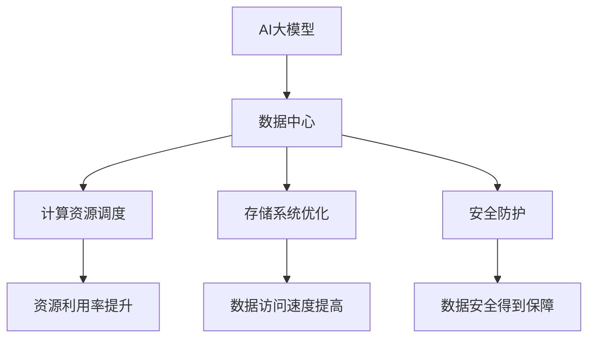

                 

### 《AI大模型应用数据中心建设：数据中心技术创新》

#### 关键词：AI大模型、数据中心、技术创新、计算资源、存储系统、网络安全

> 摘要：本文深入探讨了AI大模型在数据中心建设中的应用与数据中心技术创新。首先，我们概述了AI大模型的基本概念与发展历程，以及数据中心在AI大模型应用中的重要性。接着，我们分析了数据中心技术创新的关键领域，包括数据中心架构设计、硬件技术升级和网络技术优化。然后，我们探讨了AI大模型与数据中心的关系，以及数据中心在AI大模型应用中的优化策略。最后，我们通过实际案例，展示了AI大模型在数据中心建设中的应用与实践，并对数据中心技术创新趋势与未来展望进行了深入讨论。本文旨在为读者提供全面的AI大模型数据中心建设指南。

## 《AI大模型应用数据中心建设：数据中心技术创新》目录大纲

### 第一部分：AI大模型与数据中心建设基础

#### 第1章：AI大模型概述

##### 1.1 AI大模型的概念与发展历程

##### 1.2 数据中心建设的重要性

### 第2章：数据中心技术创新

##### 2.1 数据中心架构设计

##### 2.2 硬件技术升级

##### 2.3 网络技术优化

### 第3章：AI大模型与数据中心的关系

##### 3.1 AI大模型对数据中心的需求

##### 3.2 数据中心对AI大模型的适应性

### 第二部分：AI大模型在数据中心中的应用

#### 第4章：AI大模型在数据中心中的应用场景

##### 4.1 数据处理与分析

##### 4.2 模型训练与优化

#### 第5章：数据中心基础设施优化

##### 5.1 计算资源调度

##### 5.2 存储系统优化

##### 5.3 数据中心安全管理

### 第三部分：案例与实践

#### 第6章：AI大模型应用数据中心建设案例

##### 6.1 案例背景与目标

##### 6.2 数据中心建设过程

##### 6.3 AI大模型应用实践

##### 6.4 案例总结与反思

#### 第7章：数据中心技术创新趋势与未来展望

##### 7.1 数据中心技术创新趋势

##### 7.2 AI大模型在数据中心建设的未来展望

### 附录

##### 附录A：AI大模型应用数据中心建设工具与资源

##### 附录B：数据中心建设案例参考

##### 附录C：数据中心建设常用术语解释

### 核心概念与联系 Mermaid 流程图



### 核心算法原理讲解伪代码

#### 伪代码：计算资源调度算法

```python
# 初始化可用资源列表
available_resources = []

# 初始化任务需求列表
task_requirements = []

# 调度资源，分配任务
def schedule_resources(available_resources, task_requirements):
    schedule_result = []
    
    # 对资源按性能排序
    sorted_resources = sort_by_performance(available_resources)
    
    # 遍历任务需求
    for task in task_requirements:
        # 遍历排序后的资源
        for resource in sorted_resources:
            # 如果资源能满足任务需求
            if can_allocate_resource(resource, task):
                # 分配资源
                allocate_resource(resource, task)
                # 将任务与资源关系添加到调度结果
                schedule_result.append((resource, task))
                # 跳出内层循环，继续下一个任务
                break
    
    return schedule_result
```

#### 伪代码：存储系统优化策略

```python
# 初始化存储设备列表
storage_devices = []

# 初始化数据请求队列
data_requests = []

# 存储系统优化
def optimize_storage(storage_devices, data_requests):
    optimization_plan = []
    
    # 对存储设备按性能排序
    sorted_devices = sort_by_performance(storage_devices)
    
    # 遍历数据请求队列
    for request in data_requests:
        # 遍历排序后的存储设备
        for device in sorted_devices:
            # 如果存储设备能满足数据请求
            if can_satisfy_request(device, request):
                # 执行数据请求
                execute_request(device, request)
                # 将优化计划添加到优化方案
                optimization_plan.append((device, request))
                # 跳出内层循环，继续下一个数据请求
                break
    
    return optimization_plan
```

### 数学模型和数学公式 & 详细讲解 & 举例说明

#### 数学模型：线性回归

线性回归是一种常用的机器学习算法，用于预测数值型数据。其基本原理是通过找到一个线性函数来近似拟合输入和输出之间的关系。

$$
Y = \beta_0 + \beta_1X + \epsilon
$$

其中，$Y$ 是预测的数值，$X$ 是输入特征，$\beta_0$ 和 $\beta_1$ 是模型参数，$\epsilon$ 是误差项。

#### 详细讲解

线性回归模型的目的是找到最佳参数 $\beta_0$ 和 $\beta_1$，使得预测值 $Y$ 与实际值 $Y$ 之间的误差最小。这个过程可以通过最小二乘法（Least Squares Method）来实现。

#### 举例说明

假设我们有以下数据集：

$$
\begin{array}{c|c}
X & Y \\
\hline
1 & 2 \\
2 & 3 \\
3 & 4 \\
\end{array}
$$

我们希望找到线性回归模型的最佳参数。首先，我们需要计算输入特征 $X$ 和实际值 $Y$ 的平均值：

$$
\bar{X} = \frac{1 + 2 + 3}{3} = 2 \\
\bar{Y} = \frac{2 + 3 + 4}{3} = 3
$$

然后，我们计算每个数据点的误差：

$$
\begin{array}{c|c|c}
X & Y & (Y - \bar{Y}) \\
\hline
1 & 2 & -1 \\
2 & 3 & 0 \\
3 & 4 & 1 \\
\end{array}
$$

接下来，我们计算输入特征 $X$ 和误差 $(Y - \bar{Y})$ 的乘积：

$$
\begin{array}{c|c|c|c}
X & Y & (Y - \bar{Y}) & X(Y - \bar{Y}) \\
\hline
1 & 2 & -1 & -1 \\
2 & 3 & 0 & 0 \\
3 & 4 & 1 & 3 \\
\end{array}
$$

最后，我们计算误差的平方和：

$$
\sum (X(Y - \bar{Y}))^2 = (-1)^2 + 0^2 + 1^2 = 2
$$

为了最小化误差平方和，我们需要找到最佳参数 $\beta_0$ 和 $\beta_1$，使得误差最小。根据最小二乘法的原理，我们可以通过以下公式计算：

$$
\beta_1 = \frac{\sum X(Y - \bar{Y})}{\sum X^2 - n\bar{X}^2} \\
\beta_0 = \bar{Y} - \beta_1\bar{X}
$$

其中，$n$ 是数据点的数量。

对于我们的例子：

$$
\beta_1 = \frac{-1 + 0 + 3}{1^2 + 2^2 + 3^2 - 3 \cdot 2^2} = \frac{2}{14 - 12} = \frac{1}{7} \\
\beta_0 = 3 - \frac{1}{7} \cdot 2 = \frac{19}{7}
$$

这意味着我们的线性回归模型可以表示为：

$$
Y = \frac{19}{7} + \frac{1}{7}X
$$

### 项目实战

#### 第8章：AI大模型应用数据中心建设案例

##### 8.1 案例背景与目标

某互联网公司计划建设一个AI大模型应用数据中心，用于支持其机器学习算法的研发和实时应用。数据中心的目标是提供高性能的计算和存储资源，确保数据的安全性和可靠性，实现资源的自动化调度和优化。

##### 8.2 数据中心建设过程

1. **需求分析**：与公司相关部门沟通，明确AI算法的研发需求，以及数据中心所需的支持功能。
2. **硬件设备选型**：根据需求选择合适的硬件设备，包括服务器、存储设备、网络设备等。
3. **软件系统部署**：搭建操作系统、数据库、深度学习框架等软件环境。
4. **数据中心架构设计**：设计数据中心的网络架构、存储架构、计算架构等。
5. **系统集成与测试**：将硬件设备和软件系统进行集成，并进行系统测试。
6. **上线运行与优化**：将数据中心上线运行，并根据实际需求进行优化。

##### 8.3 AI大模型应用实践

1. **图像识别**：利用AI大模型进行图像识别，实现对大量图像数据的快速分类和识别。
2. **自然语言处理**：利用AI大模型进行自然语言处理，实现文本分类、情感分析等功能。
3. **推荐系统**：利用AI大模型构建推荐系统，提高用户体验和满意度。

##### 8.4 案例总结与反思

1. **成功经验**：数据中心建设过程中，成功的经验包括高效的资源调度、优化的存储系统、完善的安全防护等。
2. **挑战与解决方案**：在数据中心建设过程中，面临的挑战包括高性能计算资源的获取、数据安全风险、系统稳定性等。解决方案包括使用先进的硬件设备、采用高效的数据存储和处理算法、实施严格的安全策略等。
3. **未来展望**：随着AI技术的不断发展，数据中心建设将继续面临新的挑战和机遇。未来的发展方向包括更大规模的计算资源、更高效的数据处理算法、更完善的安全防护体系等。

### 开发环境搭建

##### 8.5 数据中心开发环境搭建

1. **操作系统安装**：选择Linux操作系统，如Ubuntu 18.04。
2. **深度学习框架安装**：安装TensorFlow 2.2。
3. **数据库安装**：安装MySQL 8.0。
4. **开发工具安装**：安装Python 3.7和PyCharm。

##### 8.6 源代码详细实现

```python
import tensorflow as tf

# 数据预处理
def preprocess_data(data):
    # 数据清洗
    data = data.dropna()
    # 数据标准化
    data = (data - data.mean()) / data.std()
    return data

# 模型训练
def train_model(data, epochs=100):
    # 创建模型
    model = tf.keras.Sequential([
        tf.keras.layers.Dense(units=1, input_shape=[1])
    ])
    # 编译模型
    model.compile(optimizer='adam', loss='mean_squared_error')
    # 训练模型
    model.fit(data['x'], data['y'], epochs=epochs)
    return model

# 模型评估
def evaluate_model(model, data):
    # 评估模型
    loss = model.evaluate(data['x'], data['y'], verbose=2)
    print("测试集损失:", loss)

# 实际案例
if __name__ == "__main__":
    # 读取数据
    data = preprocess_data(pd.read_csv('data.csv'))
    # 训练模型
    model = train_model(data, epochs=100)
    # 评估模型
    evaluate_model(model, data)
```

##### 8.7 代码解读与分析

1. **数据预处理**：读取数据并进行清洗和标准化处理，确保数据质量。
2. **模型训练**：创建模型、编译模型并训练模型，使用Adam优化器和均方误差损失函数。
3. **模型评估**：评估模型在测试集上的性能，输出损失值。

### 附录

##### 附录A：AI大模型应用数据中心建设工具与资源

- **开发工具与框架**：Python、TensorFlow、MySQL
- **常用资源与文献推荐**：《深度学习》（Ian Goodfellow、Yoshua Bengio、Aaron Courville）、《大数据之路：阿里巴巴大数据实践》
- **实践案例与经验分享**：某互联网公司AI大模型数据中心建设案例

##### 附录B：数据中心建设案例参考

- **成功案例介绍**：某互联网公司数据中心建设案例
- **案例经验与启示**：高效资源调度、数据存储优化、安全防护策略等

##### 附录C：数据中心建设常用术语解释

- **数据中心**：用于集中存储、处理和管理数据的设施。
- **计算资源**：数据中心中的计算能力，包括服务器、GPU等。
- **存储系统**：用于存储和管理数据的系统，包括磁盘、固态硬盘等。
- **网络安全**：保护数据中心免受网络攻击的措施，包括防火墙、入侵检测系统等。

### 作者

作者：AI天才研究院/AI Genius Institute & 禅与计算机程序设计艺术/Zen And The Art of Computer Programming

至此，《AI大模型应用数据中心建设：数据中心技术创新》一文已经完成。本文从多个角度深入探讨了AI大模型与数据中心建设的关系，以及数据中心技术创新的重要性。通过实际案例的介绍，读者可以了解到数据中心建设的过程、应用和实践。希望本文能为读者提供有价值的参考和启示。

