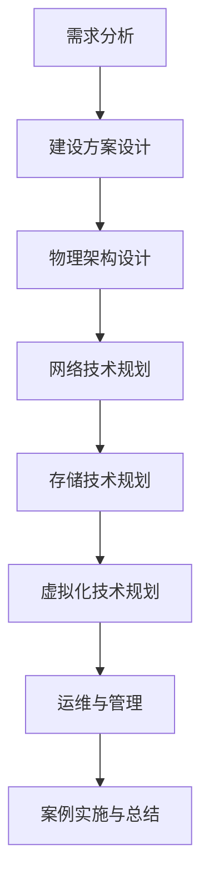

                 

### 文章标题

> **关键词**：（数据中心建设，AI 大模型，虚拟化技术，能源管理，性能优化）

在当今数字化时代，数据中心作为信息技术基础设施的核心，承载着企业关键业务的数据存储、处理和交换。而随着人工智能（AI）技术的迅猛发展，特别是大模型的广泛应用，数据中心的建设和运营面临着前所未有的挑战和机遇。本文旨在探讨 AI 大模型应用数据中心建设的投资与建设策略，从多个维度详细解析数据中心投资与建设的方方面面。

### 摘要

本文围绕数据中心投资与建设的主题，首先概述了数据中心的基础知识，包括定义、分类、建设原则和关键技术。接着，深入探讨了数据中心建设方案设计、物理架构设计、网络技术、存储技术、虚拟化技术以及数据中心运维与管理。随后，本文转向 AI 大模型在数据中心的应用，包括基础、应用以及运维方面。通过实际案例的分析，本文总结出成功经验与不足，为读者提供了宝贵的参考。最后，本文附上相关的资源，帮助读者进一步深入学习和实践。

---

### 目录大纲

本文将按照以下目录结构展开：

#### 第一部分：数据中心投资与建设概述

1. **数据中心基础**
   - 数据中心的定义与分类
   - 数据中心的投资价值
   - 数据中心的建设原则与规划
   - 数据中心的关键技术

2. **数据中心建设方案设计**
   - 需求分析
   - 硬件设施选型
   - 软件系统配置
   - 安全措施

3. **数据中心物理架构设计**
   - 数据中心物理架构概述
   - 机房建设规范
   - 网络架构设计

4. **数据中心网络技术**
   - 数据中心网络概述
   - 交换机与路由器配置
   - 网络优化技术

5. **数据中心存储技术**
   - 存储技术概述
   - 存储系统选型与配置
   - 存储网络架构

6. **数据中心虚拟化技术**
   - 虚拟化技术概述
   - 虚拟化平台配置
   - 虚拟化网络与存储

7. **数据中心运维与管理**
   - 数据中心运维概述
   - 监控与管理工具
   - 能源管理

8. **数据中心建设案例**
   - 案例背景
   - 案例实施
   - 案例总结

#### 第二部分：AI 大模型应用

1. **AI 大模型基础**
   - AI 大模型概述
   - AI 大模型架构
   - AI 大模型评估与优化

2. **AI 大模型在数据中心的应用**
   - 数据预处理与特征提取
   - 模型训练与优化
   - 模型部署与集成

3. **AI 大模型在数据中心运维中的应用**
   - 能源管理
   - 性能监控与优化
   - 故障检测与预防

4. **数据中心 AI 大模型应用案例**
   - 案例背景
   - 案例实施
   - 案例总结

### 附录

- **数据中心建设与 AI 大模型应用资源**
  - 设计规范
  - 技术标准
  - 行业报告
  - 开源框架
  - 训练工具
  - 应用案例

- **Mermaid 流程图示例**
  - 数据中心投资建设流程

- **伪代码示例**
  - 数据预处理
  - 模型训练

- **数学模型与公式**

- **代码解读与分析**
  - 数据中心建设代码解读
  - AI 大模型应用代码解读

---

接下来，我们将根据上述目录结构，逐步展开详细的内容讨论。通过逻辑清晰、结构紧凑、简单易懂的叙述，帮助读者全面理解数据中心投资与建设的各个方面，以及 AI 大模型在其中的应用。

---

### 第一部分：数据中心投资与建设概述

#### 第1章：数据中心基础

**1.1 数据中心的定义与分类**

数据中心是一个集中处理、存储和传输数据的场所，通常由一系列复杂的技术基础设施组成。数据中心可以是独立于其他业务运作的实体，也可以是某个企业或组织内部的一个部门。数据中心的分类可以从不同的角度进行，例如：

- **按规模分类**：
  - **小型数据中心**：通常拥有有限的硬件资源和较低的数据处理需求。
  - **中型数据中心**：具备一定的硬件规模和处理能力，能够支持中等规模的企业或组织的业务需求。
  - **大型数据中心**：拥有庞大的硬件设施和强大的数据处理能力，能够支持大规模企业或云服务提供商的业务需求。

- **按应用场景分类**：
  - **企业级数据中心**：为特定企业或组织的业务需求而建设，通常具备高度的安全性和可靠性。
  - **云数据中心**：为云计算服务提供商提供基础设施服务，支持大规模数据存储和计算需求。
  - **托管数据中心**：为其他企业或组织提供托管服务，包括硬件设施、网络连接和系统管理。

- **按地理位置分类**：
  - **本地数据中心**：位于企业或组织的办公地点附近，便于管理和维护。
  - **异地数据中心**：位于其他地区，用于数据备份和灾难恢复。

**1.2 数据中心的投资价值**

数据中心的投资价值体现在其对业务的支撑作用、投资回报分析以及市场前景等多个方面。

- **对业务的支撑作用**：
  - **数据存储**：数据中心提供了大规模的数据存储解决方案，确保数据的持久化和安全性。
  - **数据处理**：数据中心的高性能计算资源能够快速处理大量数据，支持复杂的数据分析和计算任务。
  - **数据传输**：数据中心具备高速的网络连接能力，能够实现数据的快速传输和交换。

- **投资回报分析**：
  - **成本节约**：通过集中化的资源管理和自动化运维，数据中心能够显著降低运营成本。
  - **业务增长**：数据中心的高可用性和可靠性能够吸引更多的业务需求，推动业务增长。
  - **竞争优势**：拥有强大的数据中心基础设施可以帮助企业在竞争中脱颖而出，提高市场竞争力。

- **市场前景**：
  - 随着数字化转型的加速，企业对数据中心的需求持续增长。
  - 云计算和大数据技术的发展，为数据中心的建设和运营提供了新的机遇。
  - 数据安全和合规要求的提高，使得数据中心在信息安全领域的作用更加突出。

**1.3 数据中心的建设原则与规划**

数据中心的建设需要遵循一系列原则和规划流程，以确保其稳定运行和高效管理。

- **建设原则**：
  - **可靠性**：数据中心应具备高可用性和故障转移能力，确保业务的连续性。
  - **安全性**：数据中心应具备严格的安全措施，保护数据的安全性和隐私性。
  - **可扩展性**：数据中心的设计应考虑未来的扩展需求，支持业务的快速增长。
  - **可持续性**：数据中心应采用节能技术和环保材料，降低对环境的影响。

- **规划流程**：
  - **需求分析**：明确数据中心的建设目标、业务需求和性能指标。
  - **设计方案**：根据需求分析结果，设计数据中心的硬件设施、网络架构和软件系统。
  - **建设实施**：按照设计方案，进行数据中心的建设和部署。
  - **测试与验收**：对数据中心进行性能测试和功能验收，确保其符合设计要求。

**1.4 数据中心的关键技术**

数据中心的建设涉及多种关键技术，包括硬件技术、软件技术和网络技术。

- **硬件技术**：
  - **服务器**：数据中心的核心计算设备，负责处理数据和应用。
  - **存储设备**：用于数据存储和持久化，包括磁盘阵列、固态硬盘等。
  - **网络设备**：包括路由器、交换机、防火墙等，负责数据的传输和网络安全。

- **软件技术**：
  - **操作系统**：数据中心服务器运行的操作系统，负责硬件资源的管理和任务的调度。
  - **数据库**：用于数据的存储和管理，支持数据查询和事务处理。
  - **应用软件**：数据中心运行的各种应用程序，包括业务系统、监控系统和安全系统等。

- **网络技术**：
  - **网络架构**：数据中心的网络拓扑结构，包括局域网、广域网和互联网。
  - **网络协议**：数据传输的协议，如TCP/IP、HTTP等。
  - **网络安全**：包括防火墙、入侵检测、数据加密等技术，保护网络的安全性和完整性。

---

在本章中，我们概述了数据中心的基础知识，包括定义、分类、投资价值、建设原则与规划以及关键技术。这些内容为后续章节的深入讨论提供了基础。

### 第2章：数据中心建设方案设计

在确定了数据中心的需求和目标之后，设计一个合理的建设方案是数据中心项目成功的关键。数据中心建设方案设计涉及多个方面，包括需求分析、硬件设施选型、软件系统配置以及安全措施等。以下是具体的内容：

#### 2.1 需求分析

需求分析是数据中心建设方案设计的第一步，其主要目的是明确数据中心需要支持的业务需求和技术需求。

- **业务需求**：
  - 数据存储需求：包括数据存储的总量、增长率和数据类型。
  - 数据处理需求：包括数据处理的速度、效率和吞吐量。
  - 应用支持需求：数据中心需要支持哪些业务应用，如在线交易、数据分析等。

- **技术需求**：
  - 可靠性需求：数据中心的可靠性要求，包括系统的高可用性、故障转移和恢复能力。
  - 安全性需求：数据中心需要采取的安全措施，包括防火墙、入侵检测、数据加密等。
  - 扩展性需求：数据中心设计应具备良好的扩展性，以支持未来的业务增长。

- **成本预算**：
  - 需要根据业务需求和财务状况，制定合理的成本预算，包括硬件、软件、建设和运维等费用。

#### 2.2 硬件设施选型

硬件设施选型是数据中心建设方案设计的重要环节，直接影响到数据中心的性能和可靠性。

- **服务器选型**：
  - **类型**：选择合适的服务器类型，如Rack-mounted server、Blade server等。
  - **性能**：根据业务需求，选择具有足够计算能力、内存容量和存储空间的硬件设备。
  - **可靠性**：选择具备高可靠性、故障转移能力和冗余设计的服务器。

- **存储设备选型**：
  - **类型**：选择合适的存储设备，如DAS、NAS、SAN等。
  - **容量**：根据数据存储需求，选择足够容量的存储设备。
  - **性能**：考虑数据访问速度和吞吐量，选择性能优秀的存储设备。

- **网络设备选型**：
  - **类型**：选择合适的网络设备，如交换机、路由器等。
  - **带宽**：根据数据传输需求，选择具有足够带宽的网络设备。
  - **安全性**：选择具备安全防护功能的网络设备，如防火墙、入侵检测等。

#### 2.3 软件系统配置

软件系统配置是数据中心建设方案设计的重要组成部分，包括操作系统、数据库和应用软件等。

- **操作系统**：
  - 根据服务器硬件和业务需求，选择合适的操作系统，如Linux、Windows Server等。
  - 配置操作系统环境，包括网络配置、安全配置等。

- **数据库**：
  - 根据业务需求，选择合适的数据库系统，如MySQL、Oracle、MongoDB等。
  - 配置数据库环境，包括数据库安装、配置、优化等。

- **应用软件**：
  - 根据业务需求，安装和配置必要的应用软件，如Web服务器、应用服务器等。
  - 进行应用软件的优化和调优，以满足性能和安全需求。

#### 2.4 安全措施

数据中心的网络安全至关重要，需要采取一系列安全措施来保护数据的安全性和完整性。

- **防火墙**：
  - 配置防火墙规则，控制进出数据中心的网络流量，防止未授权的访问。
  - 定期更新防火墙规则，以应对新的安全威胁。

- **入侵检测**：
  - 安装和配置入侵检测系统（IDS），实时监测网络流量，发现和响应入侵行为。
  - 定期分析入侵检测报告，更新安全策略。

- **数据加密**：
  - 对敏感数据进行加密，防止数据在传输和存储过程中的泄露。
  - 采用SSL/TLS等加密协议，确保数据传输的安全性。

---

在本章中，我们详细讨论了数据中心建设方案设计的关键步骤，包括需求分析、硬件设施选型、软件系统配置以及安全措施。这些步骤为数据中心的建设提供了明确的指导和规划。

### 第3章：数据中心物理架构设计

数据中心物理架构设计是确保数据中心高效、稳定运行的关键环节。物理架构设计需要综合考虑机房的布局、冷热通道设计、电源系统设计等多个方面，以确保数据中心的可靠性和安全性。以下是具体的内容：

#### 3.1 数据中心物理架构概述

数据中心的物理架构包括以下几个方面：

- **机房布局**：
  - 机房布局应合理规划，避免设备之间互相干扰，确保空气流通和散热效果。
  - 根据业务需求和设备类型，合理分配机位和设备，提高机房的利用效率。

- **冷热通道设计**：
  - 冷热通道设计是数据中心散热系统的重要组成部分，通过分离冷热气流，提高散热效率。
  - 冷通道用于冷却设备，热通道用于排放废热，避免冷热空气混合，降低能耗。

- **电源系统设计**：
  - 电源系统是数据中心的动力来源，应确保稳定供电和冗余设计。
  - 包括UPS（不间断电源）、发电机组等设备，提供可靠的电力保障。

#### 3.2 机房建设规范

机房建设规范是确保数据中心物理架构设计的标准化和规范化。以下是机房建设规范的主要内容：

- **电力需求**：
  - 根据数据中心设备和业务需求，确定电力容量和供电方式，包括市电、UPS、发电机等。
  - 确保电源线路安全可靠，避免过载和短路等情况。

- **散热系统**：
  - 数据中心产生大量热量，需要有效的散热系统来保持设备的正常运行。
  - 包括空调、排风机等设备，确保机房温度和湿度在合适的范围内。

- **安全设施**：
  - 数据中心应配备完善的安全设施，包括消防系统、门禁系统、监控摄像头等，确保数据安全和人员安全。

#### 3.3 网络架构设计

网络架构设计是数据中心物理架构设计的重要组成部分，包括网络拓扑结构、IP地址规划、网络冗余设计等。

- **网络拓扑结构**：
  - 根据业务需求和网络性能要求，设计合适的网络拓扑结构，如星型、环型、混合型等。
  - 确保网络结构的高可用性和灵活性，支持业务的扩展和调整。

- **IP地址规划**：
  - 合理规划IP地址，确保网络资源的有效利用和安全性。
  - 采用私有IP地址和公有IP地址的混合使用，提高网络的灵活性和可扩展性。

- **网络冗余设计**：
  - 网络冗余设计是提高数据中心网络可靠性的重要手段，包括链路冗余、设备冗余等。
  - 通过冗余设计，确保在网络故障发生时，网络仍然能够正常运行，避免业务中断。

---

在本章中，我们详细介绍了数据中心物理架构设计的关键内容，包括机房布局、冷热通道设计、电源系统设计、机房建设规范、网络架构设计等。这些设计原则和规范为数据中心的稳定运行提供了保障。

### 第4章：数据中心网络技术

数据中心网络技术是数据中心架构设计中的核心部分，负责数据的传输、交换和安全性保障。一个高效、可靠的数据中心网络不仅能提高业务处理能力，还能保障数据的安全性。以下是数据中心网络技术的具体内容：

#### 4.1 数据中心网络概述

数据中心网络是专门为数据中心内部和外部通信而设计的网络架构，其目标包括：

- **高可用性**：确保网络在任何情况下都能正常运行，避免单点故障影响整体业务。
- **高带宽**：提供足够的带宽以满足大数据量、高吞吐量的业务需求。
- **低延迟**：确保数据传输的速度和效率，减少通信延迟，提高用户体验。

数据中心网络通常由以下几个主要部分组成：

- **核心网络**：负责连接数据中心内部的主要设备和网络资源，如服务器、存储设备和外部网络。
- **边缘网络**：负责处理数据中心的入口和出口流量，与外部网络进行通信。
- **汇聚网络**：将核心网络与边缘网络连接起来，提供层次化的网络结构，提高网络的可管理性和扩展性。

#### 4.2 交换机与路由器配置

交换机和路由器是数据中心网络中的关键设备，它们在数据传输中扮演着重要角色。

- **交换机配置**：
  - **类型**：交换机分为层2交换机和层3交换机。层2交换机主要处理数据链路层（MAC地址）的通信，而层3交换机具备路由功能，能够处理网络层（IP地址）的通信。
  - **配置**：配置VLAN（虚拟局域网），实现网络的分层管理和隔离；配置STP（生成树协议），防止环路产生；配置QoS（服务质量），保证关键业务的带宽优先。

- **路由器配置**：
  - **类型**：路由器主要有内部路由器和边界路由器。内部路由器负责数据中心内部网络之间的通信，而边界路由器负责与外部网络的通信。
  - **配置**：配置路由协议（如OSPF、BGP），确保路由信息的正确交换；配置访问控制列表（ACL），控制网络流量；配置NAT（网络地址转换），实现内网与外网的通信。

#### 4.3 网络优化技术

为了提高数据中心网络的性能和可靠性，可以采用一系列网络优化技术。

- **QoS与流量管理**：
  - **QoS（服务质量）**：通过QoS技术，可以确保关键业务的流量优先传输，提高网络的响应速度和用户体验。
  - **流量管理**：通过流量监管和流量整形，控制网络流量的速率和方向，避免网络拥塞。

- **加速技术**：
  - **数据压缩**：通过数据压缩技术，减少数据传输的带宽需求，提高传输效率。
  - **缓存技术**：通过缓存热点数据，减少重复数据的传输，提高访问速度。

- **容量规划**：
  - **带宽规划**：根据业务需求和流量预测，合理规划网络带宽，避免带宽瓶颈。
  - **设备容量**：选择具有足够处理能力和扩展性的网络设备，确保网络性能。

---

在本章中，我们详细讨论了数据中心网络技术的各个方面，包括数据中心网络的概述、交换机和路由器的配置以及网络优化技术。这些技术为数据中心的高效运行和可靠保障提供了坚实的基础。

### 第5章：数据中心存储技术

数据中心存储技术是数据中心的基石，负责数据的存储、管理和保护。随着数据量的快速增长和业务需求的不断变化，数据中心存储技术也在不断演进。以下是数据中心存储技术的具体内容：

#### 5.1 存储技术概述

存储技术主要包括存储体系结构、存储类型和存储性能指标。

- **存储体系结构**：
  - **分布式存储**：通过多个节点组成的集群，提供高可用性和高扩展性的存储解决方案。
  - **集中式存储**：通过独立的存储设备提供集中管理的数据存储，适用于中小规模的数据中心。
  - **混合存储**：结合分布式存储和集中式存储的优势，提供灵活的存储解决方案。

- **存储类型**：
  - **块存储**：以块为单位进行数据存储，适用于高性能、低延迟的存储需求。
  - **文件存储**：以文件为单位进行数据存储，适用于文件共享和文件管理系统。
  - **对象存储**：以对象为单位进行数据存储，适用于海量数据存储和分布式文件系统。

- **存储性能指标**：
  - **IOPS（每秒输入/输出操作数）**：衡量存储设备处理读写操作的能力。
  - **带宽**：衡量存储设备的数据传输速率。
  - **延迟**：衡量存储设备响应时间。

#### 5.2 存储系统选型与配置

选择和配置合适的存储系统是数据中心存储技术的重要组成部分。

- **存储系统需求分析**：
  - 根据业务需求和性能指标，确定存储系统的规模和类型。
  - 考虑数据访问模式和读写比例，选择合适的存储类型。

- **存储系统配置**：
  - **RAID配置**：选择合适的RAID级别，如RAID 0、RAID 1、RAID 5、RAID 6等，提高数据的可靠性和性能。
  - **存储容量规划**：根据数据增长率和备份需求，合理规划存储容量。
  - **性能优化**：通过优化存储配置，如增加SSD、调整存储网络带宽等，提高存储性能。

- **存储冗余与数据保护**：
  - **数据冗余**：通过数据备份、RAID等技术，确保数据的高可靠性和完整性。
  - **数据保护**：通过数据加密、访问控制等手段，保护数据的安全性。

#### 5.3 存储网络架构

存储网络架构是连接存储设备和服务器的重要部分，包括以下内容：

- **FC网络（光纤通道网络）**：
  - **架构**：采用光纤通道协议，提供高速、高带宽的存储网络连接。
  - **优势**：适合大型数据中心和高性能计算环境。

- **iSCSI网络**：
  - **架构**：采用IP网络传输iSCSI协议，实现存储网络连接。
  - **优势**：成本低、易于部署，适用于中小型数据中心。

- **NAS网络**：
  - **架构**：通过TCP/IP网络传输文件，提供文件级别的存储访问。
  - **优势**：适合文件共享和分布式文件系统。

---

在本章中，我们详细介绍了数据中心存储技术的各个方面，包括存储体系结构、存储类型和存储性能指标，以及存储系统的选型和配置，存储网络的架构设计等。这些内容为数据中心的数据存储提供了全面的解决方案。

### 第6章：数据中心虚拟化技术

虚拟化技术是现代数据中心建设中的关键组成部分，通过虚拟化，可以将物理硬件资源抽象化，实现资源的高效利用和管理。以下是数据中心虚拟化技术的具体内容：

#### 6.1 虚拟化技术概述

虚拟化技术是将物理硬件资源虚拟化为多个逻辑资源，从而提高资源利用率和灵活性。虚拟化技术主要包括以下几个方面：

- **虚拟化基本概念**：
  - **虚拟化层**：包括硬件层、操作系统层、应用层等，不同的虚拟化层负责不同的虚拟化功能。
  - **虚拟机**：通过虚拟化技术创建的逻辑计算机，可以运行独立的操作系统和应用。

- **虚拟化类型**：
  - **硬件虚拟化**：通过虚拟化硬件资源，如CPU、内存、存储等，实现完全隔离和独立运行。
  - **操作系统虚拟化**：通过虚拟化操作系统，实现操作系统层面的资源管理和隔离。
  - **应用虚拟化**：通过虚拟化应用程序，实现应用程序层面的隔离和独立运行。

- **虚拟化优势**：
  - **资源利用率**：通过虚拟化技术，可以实现资源的动态分配和优化利用，提高硬件资源利用率。
  - **灵活性和可扩展性**：虚拟化技术可以灵活调整资源分配，支持业务的快速扩展和调整。
  - **灾难恢复**：虚拟化技术支持快速备份和恢复，提高数据中心的可靠性和可用性。

#### 6.2 虚拟化平台配置

虚拟化平台配置是数据中心虚拟化技术实施的关键步骤，包括虚拟化软件的安装、配置和优化。

- **VMware配置**：
  - **安装和配置**：安装VMware ESXi或VMware vCenter，配置虚拟化环境。
  - **资源分配**：根据业务需求，分配CPU、内存、存储等资源。
  - **网络配置**：配置虚拟交换机、网络适配器和防火墙，确保虚拟机的网络连接。

- **Hyper-V配置**：
  - **安装和配置**：安装Windows Server，配置Hyper-V功能。
  - **虚拟机创建**：创建虚拟机，配置操作系统和应用程序。
  - **性能优化**：调整虚拟机配置，优化CPU、内存和网络资源。

- **KVM配置**：
  - **安装和配置**：安装Linux操作系统，配置KVM虚拟化模块。
  - **虚拟机创建**：创建虚拟机，配置操作系统和存储资源。
  - **管理工具**：使用管理工具（如libvirt）进行虚拟机管理和监控。

#### 6.3 虚拟化网络与存储

虚拟化网络和存储是数据中心虚拟化技术的重要组成部分，包括虚拟网络配置、虚拟存储配置和虚拟化安全。

- **虚拟网络配置**：
  - **虚拟交换机**：配置虚拟交换机，实现虚拟机之间的网络连接。
  - **VLAN配置**：配置VLAN，实现网络的分层管理和隔离。
  - **网络策略**：配置网络策略，实现流量管理和安全控制。

- **虚拟存储配置**：
  - **虚拟存储卷**：创建虚拟存储卷，用于虚拟机的数据存储。
  - **存储映射**：将虚拟存储卷映射到虚拟机，实现数据访问。
  - **存储优化**：通过存储优化技术，提高虚拟化存储的性能和可靠性。

- **虚拟化安全**：
  - **访问控制**：配置访问控制列表，限制虚拟机的访问权限。
  - **数据加密**：对虚拟机数据进行加密，保护数据安全。
  - **安全审计**：实施安全审计，监控虚拟化环境的异常行为。

---

在本章中，我们详细介绍了数据中心虚拟化技术的各个方面，包括虚拟化技术概述、虚拟化平台配置、虚拟化网络与存储以及虚拟化安全。这些内容为数据中心虚拟化技术的实施提供了全面的指导。

### 第7章：数据中心运维与管理

数据中心运维与管理是确保数据中心稳定运行和高效管理的关键环节。良好的运维与管理不仅可以提高数据中心的可用性，还可以降低运营成本。以下是数据中心运维与管理的主要内容：

#### 7.1 数据中心运维概述

数据中心运维包括组织结构、流程和策略等多个方面，确保数据中心的高效运行。

- **运维组织结构**：
  - **运维团队**：根据数据中心的规模和需求，设立专门的运维团队，负责日常运维工作。
  - **岗位职责**：明确运维团队的岗位职责，如系统管理员、网络管理员、安全管理员等。
  - **协作机制**：建立协作机制，确保运维团队能够高效协作，快速响应和处理问题。

- **运维流程**：
  - **变更管理**：制定变更管理流程，确保在部署新功能或修改现有配置时，不影响数据中心的正常运行。
  - **故障管理**：建立故障管理流程，确保在故障发生时，能够快速定位和解决问题。
  - **性能监控**：定期监控数据中心的性能指标，确保系统稳定运行。

- **运维策略**：
  - **预防性维护**：定期进行设备检查和维护，预防设备故障。
  - **故障恢复**：制定故障恢复计划，确保在故障发生时，能够快速恢复业务。
  - **数据备份**：定期备份数据，确保数据的安全性和可恢复性。

#### 7.2 监控与管理工具

监控与管理工具是数据中心运维的重要支撑，通过这些工具，可以实现对数据中心的全面监控和管理。

- **监控系统**：
  - **系统监控**：监控服务器、存储设备、网络设备的运行状态，及时发现和处理异常。
  - **性能监控**：监控性能指标，如CPU使用率、内存使用率、网络流量等，确保系统资源得到合理利用。
  - **日志监控**：收集和分析系统日志，及时发现潜在问题和安全威胁。

- **故障管理系统**：
  - **故障检测**：通过自动化工具和算法，实时检测系统故障，并生成告警。
  - **故障定位**：提供故障定位工具，帮助运维人员快速定位故障根源。
  - **故障恢复**：自动执行故障恢复策略，确保业务连续性。

- **备份与恢复**：
  - **备份策略**：制定备份策略，包括备份频率、备份类型（全备份、增量备份、差异备份）等。
  - **备份存储**：选择合适的备份存储方案，确保备份数据的安全性和可恢复性。
  - **恢复流程**：制定恢复流程，确保在数据丢失时，能够快速恢复数据。

#### 7.3 能源管理

能源管理是数据中心运维中不可忽视的重要方面，通过合理的能源管理，可以降低能源消耗，提高能效。

- **能源消耗分析**：
  - **能耗监测**：通过能耗监测系统，实时监测数据中心的能耗情况，分析能耗构成。
  - **能耗优化**：根据能耗分析结果，优化数据中心设备配置和运行策略，降低能耗。

- **节能措施**：
  - **设备节能**：通过优化设备运行参数，如温度控制、风扇转速等，降低设备能耗。
  - **设备更新**：采用新型节能设备，如节能服务器、LED照明等，降低能耗。
  - **冷却系统优化**：优化冷却系统，提高冷却效率，降低能耗。

- **能源管理工具**：
  - **能耗监测工具**：通过能耗监测工具，实时监控数据中心的能耗情况，提供能耗报告和分析。
  - **能源管理系统**：建立能源管理系统，实现能源的实时监控、分析和优化。

---

在本章中，我们详细介绍了数据中心运维与管理的各个方面，包括运维组织结构、流程和策略，监控与管理工具，以及能源管理。这些内容为数据中心的高效运维与管理提供了全面的指导。

### 第8章：数据中心建设案例

#### 8.1 案例背景

本次数据中心建设案例旨在为某知名互联网企业打造一个高效、稳定、可扩展的数据处理中心，以满足其日益增长的业务需求。企业现有业务涵盖电子商务、云计算、大数据分析等多个领域，对数据中心的性能、可靠性和安全性要求极高。

**业务需求**：
- **数据处理能力**：能够处理海量数据，支持实时分析和处理。
- **高可用性**：确保业务系统的连续运行，防止单点故障。
- **安全性**：保护企业数据和客户隐私，防止数据泄露和非法访问。
- **扩展性**：支持业务的快速扩展，灵活调整资源分配。

**技术挑战**：
- **性能需求**：处理大数据量和高吞吐量的业务需求，保证系统响应速度。
- **可靠性要求**：实现高可用性，防止业务中断。
- **安全性**：防范网络攻击和数据泄露。
- **成本控制**：在满足性能和安全要求的前提下，控制建设成本。

#### 8.2 案例实施

**设计方案**：
- **硬件设施选型**：
  - **服务器**：选择高密度、高性能的Rack-mounted server，确保计算能力。
  - **存储设备**：采用分布式存储系统，提供高可靠性和高扩展性的数据存储。
  - **网络设备**：配置高性能的交换机和路由器，确保数据传输速度和网络稳定性。

- **软件系统配置**：
  - **操作系统**：选择Linux操作系统，提供稳定、安全的运行环境。
  - **数据库**：采用MySQL数据库，支持海量数据存储和高效查询。
  - **应用软件**：部署业务系统，包括电子商务平台、数据分析系统等。

- **安全措施**：
  - **防火墙**：配置防火墙，控制网络访问权限，防止非法入侵。
  - **入侵检测**：部署入侵检测系统（IDS），实时监控网络流量，发现和响应安全威胁。
  - **数据加密**：采用SSL/TLS协议，确保数据传输加密，防止数据泄露。

**实施过程**：
1. **需求分析**：与客户沟通，明确业务需求和技术要求，制定详细的设计方案。
2. **硬件安装**：根据设计方案，安装服务器、存储设备和网络设备，确保硬件设备正常运行。
3. **软件部署**：安装操作系统和数据库，配置应用软件，确保软件系统正常运行。
4. **安全配置**：配置防火墙、入侵检测和数据加密等安全措施，确保网络安全。

**遇到的问题与解决**：
- **问题1**：在高密度服务器部署过程中，发现散热问题导致服务器温度过高。
  - **解决**：优化机房布局，增加散热设备，如空调和排风扇，改善散热条件。
- **问题2**：网络设备配置过程中，发现部分网络设备性能无法满足业务需求。
  - **解决**：更换高性能网络设备，确保网络传输速度和网络稳定性。
- **问题3**：在系统上线初期，遭遇了一次网络攻击，导致部分业务系统瘫痪。
  - **解决**：加强网络安全防护措施，如更新防火墙规则、增加入侵检测系统等，提高网络安全性。

#### 8.3 案例总结

**成功经验**：
- **高效硬件设施**：通过选择高性能、高可靠的硬件设备，确保了数据中心的计算和存储能力。
- **完善的软件系统**：部署了稳定、安全的软件系统，支持复杂的数据处理和业务运行。
- **严格的安全措施**：通过多层次的安全防护措施，有效防止了网络攻击和数据泄露。

**不足之处**：
- **散热问题**：在高密度服务器部署过程中，散热问题依然存在，需要进一步优化散热方案。
- **网络性能**：部分网络设备性能无法满足未来业务需求，需要逐步升级和优化网络架构。

**教训与启示**：
- **前期规划**：在数据中心建设初期，充分进行需求分析和规划，确保硬件和软件资源的合理配置。
- **持续优化**：数据中心建设完成后，持续进行监控和优化，确保系统的稳定性和高性能。
- **安全防护**：加强网络安全防护，防范潜在的网络攻击和数据泄露风险。

通过本次案例的实施，我们积累了宝贵的经验，为未来数据中心建设提供了有益的参考。

### 第9章：AI 大模型基础

#### 9.1 AI 大模型概述

AI 大模型是指具有大规模参数和强大计算能力的深度学习模型，通过训练和学习大量数据，能够实现高精度的预测和分类。AI 大模型的特点如下：

- **大规模参数**：AI 大模型拥有数十亿甚至数千亿个参数，能够捕捉数据中的复杂模式和关联性。
- **高计算能力**：AI 大模型需要高性能的计算资源，如GPU、TPU等，以支持大规模数据的训练和推理。
- **自适应能力**：AI 大模型能够根据不同的任务和数据集，自动调整模型结构和参数，实现自适应学习和优化。

AI 大模型的应用领域广泛，包括自然语言处理、计算机视觉、语音识别、推荐系统等。以下是一些具体的应用场景：

- **自然语言处理**：AI 大模型能够理解和生成自然语言文本，用于机器翻译、文本摘要、问答系统等。
- **计算机视觉**：AI 大模型能够识别和理解图像和视频中的内容，用于图像分类、目标检测、人脸识别等。
- **语音识别**：AI 大模型能够将语音信号转换为文本，用于语音助手、语音搜索、语音翻译等。
- **推荐系统**：AI 大模型能够根据用户的兴趣和行为，推荐个性化内容，如商品推荐、音乐推荐、新闻推荐等。

#### 9.2 AI 大模型架构

AI 大模型的架构通常包括以下几个层次：

- **输入层**：接收外部输入数据，如文本、图像、音频等。
- **特征提取层**：对输入数据进行预处理和特征提取，提取出数据中的重要特征。
- **隐藏层**：多层神经网络，通过非线性变换，对输入数据进行复杂的信息处理和模式识别。
- **输出层**：根据隐藏层的结果，生成最终的预测结果，如分类标签、文本摘要等。

AI 大模型的训练过程主要包括以下几个步骤：

1. **数据预处理**：对输入数据进行清洗、归一化和编码等预处理操作，确保数据的质量和一致性。
2. **模型初始化**：初始化模型参数，通常使用随机初始化或预训练模型。
3. **前向传播**：输入数据通过模型的前向传播，生成预测结果。
4. **损失函数计算**：计算预测结果与真实标签之间的差异，计算损失函数值。
5. **反向传播**：通过反向传播算法，将损失函数值传播回模型参数，更新模型参数。
6. **迭代训练**：重复前向传播、损失函数计算和反向传播的过程，逐步优化模型参数。

#### 9.3 AI 大模型评估与优化

AI 大模型的评估与优化是确保模型性能和效果的重要环节。以下是一些常见的评估指标和方法：

- **评估指标**：
  - **准确率**：预测结果与真实标签的一致性比例。
  - **召回率**：能够召回的实际正样本比例。
  - **F1值**：准确率和召回率的调和平均值。
  - **ROC曲线**：接受者操作特征曲线，用于评估分类器的性能。
  - **MAE/MSE**：均方误差和平均绝对误差，用于回归问题的评估。

- **优化方法**：
  - **超参数调优**：通过调整学习率、批量大小、正则化参数等超参数，优化模型性能。
  - **数据增强**：通过数据增强技术，增加训练数据的多样性，提高模型泛化能力。
  - **模型集成**：结合多个模型的预测结果，提高整体预测性能。
  - **迁移学习**：利用预训练模型，减少训练数据的需求，提高模型性能。

- **实践技巧**：
  - **交叉验证**：通过交叉验证，评估模型在不同数据集上的性能，避免过拟合。
  - **网格搜索**：通过网格搜索，系统性地调整超参数，找到最优参数组合。
  - **模型压缩**：通过模型压缩技术，减少模型参数和计算量，提高模型部署的效率。

---

在本章中，我们详细介绍了 AI 大模型的基础知识，包括概述、架构和评估与优化。这些内容为后续讨论 AI 大模型在数据中心的应用奠定了基础。

### 第10章：AI 大模型在数据中心的应用

#### 10.1 数据预处理与特征提取

在将 AI 大模型应用于数据中心时，数据预处理与特征提取是关键步骤。以下是具体的内容：

**数据清洗**：
- **缺失值处理**：对缺失值进行填补或删除，确保数据完整性。
- **异常值处理**：检测并处理异常数据，如异常值替换、删除或插值。
- **数据规范化**：对数据进行归一化或标准化，使数据具有相似的尺度和范围。

**特征提取**：
- **特征选择**：从原始数据中提取对模型训练和预测最有用的特征。
- **特征工程**：通过构造新的特征或变换现有特征，提高模型性能和泛化能力。

**数据增强**：
- **数据扩充**：通过旋转、缩放、裁剪、添加噪声等方法，增加训练数据的多样性。
- **合成数据**：通过生成对抗网络（GAN）等方法，生成与真实数据相似的合成数据。

#### 10.2 模型训练与优化

**数据准备**：
- **数据集划分**：将数据集划分为训练集、验证集和测试集，用于模型训练、验证和评估。
- **数据加载**：使用数据加载器（如PyTorch的Dataset）批量加载数据，提高训练效率。

**训练策略**：
- **批量大小**：选择合适的批量大小，平衡训练速度和模型性能。
- **学习率调度**：使用学习率调度策略，如逐步减小学习率，防止过拟合。
- **正则化**：采用正则化方法（如L1、L2正则化），减少过拟合。

**优化技巧**：
- **迁移学习**：利用预训练模型，减少训练数据需求，提高模型性能。
- **多任务学习**：同时训练多个任务，共享模型参数，提高模型泛化能力。
- **注意力机制**：引入注意力机制，使模型关注数据中的关键信息。

#### 10.3 模型部署与集成

**模型部署**：
- **容器化**：使用容器（如Docker）部署模型，确保模型在不同环境中的一致性。
- **微服务架构**：将模型部署为微服务，实现模块化和可扩展性。
- **模型服务**：使用模型服务框架（如TensorFlow Serving、 TorchServe），提供高效的模型推理服务。

**集成策略**：
- **API接口**：提供API接口，方便其他系统或应用程序调用模型服务。
- **消息队列**：使用消息队列（如Kafka、RabbitMQ），实现数据流和模型服务的异步通信。
- **容器编排**：使用容器编排工具（如Kubernetes），实现模型服务的自动化部署和管理。

**实时处理**：
- **流处理框架**：使用流处理框架（如Apache Flink、Apache Storm），实现实时数据处理和模型推理。
- **数据管道**：构建数据管道，将实时数据传输到模型服务，进行实时处理和预测。
- **异步处理**：使用异步处理机制，确保实时数据处理的高效性和可靠性。

---

在本章中，我们详细介绍了 AI 大模型在数据中心的应用，包括数据预处理与特征提取、模型训练与优化，以及模型部署与集成。这些内容为 AI 大模型在数据中心的应用提供了完整的解决方案。

### 第11章：AI 大模型在数据中心运维中的应用

在数据中心运维中，AI 大模型的引入极大地提升了管理和监控的智能化水平。以下是 AI 大模型在数据中心运维中具体应用的内容：

#### 11.1 能源管理

AI 大模型在能源管理中的应用主要体现在以下几个方面：

**能源消耗预测**：
- **数据收集**：收集数据中心的实时能耗数据，包括电力使用、温度、湿度等。
- **模型训练**：利用收集到的数据，训练能耗预测模型，如时间序列预测模型或深度学习模型。
- **预测与优化**：根据预测模型，预测未来的能源消耗，并优化设备运行参数，如调整服务器功率、风扇转速等，以实现能耗的动态控制和节能。

**节能优化**：
- **算法设计**：设计节能优化算法，如基于预测模型的能耗优化算法，根据能耗预测结果调整数据中心设备的工作模式。
- **设备控制**：通过自动化系统，根据节能优化算法的输出，控制数据中心设备的运行状态，实现实时节能。

**实时监控**：
- **监控系统集成**：将能耗预测和节能优化功能集成到数据中心的监控系统中，实时监控能源消耗和设备运行状态。
- **报警与通知**：在能源消耗超过预期或设备出现异常时，触发报警和通知，提醒运维人员及时处理。

#### 11.2 性能监控与优化

AI 大模型在性能监控与优化中的应用主要表现在以下几个方面：

**性能指标**：
- **CPU利用率**：监控CPU的利用率，评估处理任务的性能。
- **内存使用率**：监控内存的使用情况，确保系统运行稳定。
- **磁盘I/O性能**：监控磁盘的读写性能，评估数据存储和处理速度。
- **网络吞吐量**：监控网络的流量和吞吐量，确保数据传输的效率。

**监控系统**：
- **数据采集**：通过监控系统，实时采集性能指标数据，为AI 大模型提供训练数据。
- **异常检测**：利用AI 大模型，对性能指标进行异常检测，识别潜在的故障和性能瓶颈。

**性能优化**：
- **自动化调优**：根据性能指标和AI 大模型的预测结果，自动化调整系统参数，如CPU核心数、内存分配、网络带宽等，优化系统性能。
- **负载均衡**：通过负载均衡算法，合理分配计算任务，避免单点过载，提高系统的整体性能。

**实时处理**：
- **流处理**：使用流处理框架，如Apache Kafka、Apache Flink，实现实时数据流处理，确保性能监控的实时性和准确性。
- **反馈机制**：建立性能监控与优化的反馈机制，根据实时监控数据，动态调整系统配置和资源分配。

#### 11.3 故障检测与预防

AI 大模型在故障检测与预防中的应用主要包括以下几个方面：

**故障预测**：
- **数据收集**：收集历史故障数据和运行状态数据，为故障预测模型提供训练数据。
- **模型训练**：利用收集到的数据，训练故障预测模型，如故障诊断模型或预测维护模型。
- **预测与预警**：根据故障预测模型，预测未来的故障风险，并在故障发生前进行预警。

**检测算法**：
- **故障检测算法**：设计故障检测算法，通过实时监控数据，识别异常行为和故障征兆。
- **多传感器数据融合**：利用多种传感器数据，进行数据融合和异常检测，提高故障检测的准确性。

**预防措施**：
- **自动化维护**：根据故障预测结果，自动化执行维护任务，如设备更换、参数调整等，预防故障发生。
- **安全监控**：通过安全监控模型，识别潜在的安全威胁和恶意行为，采取相应的预防措施。
- **应急预案**：制定应急预案，确保在故障发生时，能够快速响应和恢复业务。

---

在本章中，我们详细介绍了 AI 大模型在数据中心能源管理、性能监控与优化以及故障检测与预防中的应用。这些应用不仅提升了数据中心的智能化水平，还显著提高了运维效率和系统可靠性。

### 第12章：数据中心 AI 大模型应用案例

#### 12.1 案例背景

本次数据中心 AI 大模型应用案例涉及一家全球领先的云计算服务提供商，该公司提供企业级云服务，包括计算、存储、网络、AI 等多个领域。随着业务的发展，该公司需要提升数据中心的运维效率，降低运营成本，提高客户满意度。因此，公司决定引入 AI 大模型，通过智能化手段优化数据中心的管理。

**业务需求**：
- **提升运维效率**：通过自动化和智能化的手段，降低运维工作量和人力成本。
- **降低运营成本**：通过能源管理和性能优化，降低数据中心的能源消耗和设备维护成本。
- **提高客户满意度**：通过实时监控和故障预警，提高服务质量，减少客户投诉。

**技术挑战**：
- **数据量巨大**：数据中心产生的数据量庞大，包括能耗数据、性能数据、日志数据等。
- **系统复杂性**：数据中心系统复杂，涉及多个硬件和软件组件，需要综合考虑各种因素。
- **实时处理**：需要实现实时数据处理和预测，以满足运维监控的需求。

#### 12.2 案例实施

**AI 大模型选型**：
- **模型选择**：根据业务需求，选择合适的 AI 大模型，包括时间序列预测模型、故障诊断模型、优化算法等。
- **开源框架**：采用开源深度学习框架，如 TensorFlow、PyTorch，进行模型训练和部署。

**数据准备**：
- **数据采集**：通过数据中心监控系统，实时采集能耗数据、性能数据、日志数据等。
- **数据清洗**：对采集到的数据进行清洗、归一化和预处理，确保数据质量。
- **数据增强**：通过数据增强技术，增加训练数据的多样性，提高模型泛化能力。

**模型训练**：
- **数据集划分**：将数据集划分为训练集、验证集和测试集，用于模型训练和评估。
- **模型训练**：使用训练集对 AI 大模型进行训练，调整超参数，优化模型性能。
- **验证与调优**：使用验证集评估模型性能，根据评估结果调整模型参数，提高模型精度。

**模型部署**：
- **容器化**：将训练好的模型容器化，使用 Docker 等工具进行打包。
- **微服务架构**：将模型部署为微服务，使用 Kubernetes 等工具进行管理和调度。
- **API接口**：提供 API 接口，方便其他系统和应用程序调用模型服务。

**系统集成**：
- **监控与报警**：将 AI 大模型集成到数据中心监控系统，实现实时监控和故障预警。
- **性能优化**：将 AI 大模型集成到性能优化系统中，实现自动化调优和资源管理。
- **用户界面**：开发用户界面，方便运维人员监控和管理数据中心。

#### 12.3 案例总结

**成功经验**：
- **智能化运维**：通过引入 AI 大模型，实现了数据中心的智能化运维，提高了运维效率和系统稳定性。
- **节能降耗**：通过能耗预测和优化，降低了数据中心的能源消耗，实现了节能降耗的目标。
- **故障预防**：通过故障预测和预警，提前识别潜在故障，减少了系统停机时间和维护成本。

**不足之处**：
- **数据质量**：数据中心产生的数据质量参差不齐，需要进一步优化数据采集和清洗过程。
- **模型适应性**：AI 大模型在某些特定情况下可能无法准确预测，需要不断优化模型算法和提高数据处理能力。

**教训与启示**：
- **数据驱动**：数据中心的管理应基于数据驱动，充分利用大数据和 AI 技术，提高决策的准确性和效率。
- **持续优化**：AI 大模型的应用是一个持续优化的过程，需要不断收集数据、更新模型，提高模型性能。
- **团队协作**：AI 大模型的应用需要跨部门协作，包括数据科学家、运维工程师、产品经理等，确保项目的顺利进行。

通过本次案例的实施，该公司在数据中心运维方面取得了显著成效，为其他企业提供了宝贵的经验和参考。

### 附录 A：数据中心建设与 AI 大模型应用资源

#### A.1 数据中心建设参考资料

- **设计规范**
  - 《数据中心基础设施设计规范》
  - 《数据中心建设技术标准》
- **技术标准**
  - 《数据中心基础设施标准》
  - 《数据中心电力设计规范》
- **行业报告**
  - 《数据中心产业发展报告》
  - 《数据中心能耗报告》

#### A.2 AI 大模型应用资源

- **开源框架**
  - TensorFlow
  - PyTorch
  - MXNet
- **训练工具**
  - CUDA
  - cuDNN
  - Horovod
- **应用案例**
  - 亚马逊 AWS
  - 微软 Azure

### 附录 B：Mermaid 流程图示例



### 附录 C：伪代码示例

**数据预处理伪代码**

```python
def preprocess_data(data):
    cleaned_data = clean_data(data)
    features = extract_features(cleaned_data)
    augmented_data = augment_data(features)
    return augmented_data

def clean_data(data):
    # 数据清洗逻辑
    return cleaned_data

def extract_features(data):
    # 特征提取逻辑
    return features

def augment_data(data):
    # 数据增强逻辑
    return augmented_data
```

**模型训练伪代码**

```python
def train_model(model, data, labels):
    model.fit(data, labels)
    scores = model.evaluate(data, labels)
    return scores

# 模型配置
model_config = {
    'learning_rate': 0.001,
    'batch_size': 64,
    'epochs': 100
}

# 模型训练
train_model(model, train_data, train_labels)
```

### 附录 D：数学模型与公式

$$
E[X] = \int_{-\infty}^{\infty} x \cdot f(x) \, dx
$$

### 附录 E：代码解读与分析

#### E.1 数据中心建设代码解读

```python
# 示例：数据中心电力需求计算
def calculate_power_demand(voltage, current, efficiency):
    power = voltage * current
    return power / efficiency
```

#### E.2 AI 大模型应用代码解读

```python
# 示例：使用 TensorFlow 训练神经网络
import tensorflow as tf

# 模型配置
model = tf.keras.Sequential([
    tf.keras.layers.Dense(units=64, activation='relu', input_shape=(input_shape)),
    tf.keras.layers.Dense(units=64, activation='relu'),
    tf.keras.layers.Dense(units=1)
])

# 编译模型
model.compile(optimizer='adam', loss='mean_squared_error')

# 模型训练
model.fit(x_train, y_train, epochs=10, batch_size=32, validation_data=(x_val, y_val))
```

### 结尾

通过本文的详细探讨，我们全面了解了数据中心投资与建设的各个方面，以及 AI 大模型在数据中心的应用。从数据中心的基础知识、建设方案设计、物理架构设计、网络技术、存储技术、虚拟化技术，到数据中心运维与管理，再到 AI 大模型的概述、应用和案例分析，本文为读者提供了系统而深入的指导。

数据中心作为现代信息社会的基础设施，其建设与运营面临诸多挑战。而 AI 大模型的引入，不仅提升了数据中心的智能化水平，还带来了新的机遇。希望本文能为您提供宝贵的参考和启示，帮助您在数据中心建设和 AI 应用方面取得成功。

在此，感谢您的阅读，期待与您在数据中心与 AI 领域的进一步交流与合作。

### 作者信息

作者：AI 天才研究院/AI Genius Institute & 禅与计算机程序设计艺术 /Zen And The Art of Computer Programming

---

### 总结与展望

通过对数据中心投资与建设，以及 AI 大模型应用的全面探讨，本文揭示了数据中心在数字化时代的重要地位和巨大潜力。数据中心不仅是企业关键业务的支撑，也是 AI 大模型高效运行的基础。在未来的发展中，数据中心和 AI 大模型将紧密结合，推动企业数字化转型和智能化升级。

**未来展望**：

1. **数据中心智能化**：随着 AI 技术的进步，数据中心将更加智能化，实现自动化的资源管理和优化。

2. **绿色数据中心**：绿色数据中心将成为趋势，通过采用节能技术、可再生能源和智能化管理，降低能源消耗和碳足迹。

3. **边缘计算与数据中心**：边缘计算与数据中心的结合，将实现更快速、更高效的数据处理和响应，满足实时业务需求。

4. **AI 大模型优化**：AI 大模型的优化和定制化，将进一步提升其在数据中心中的应用效果，推动技术创新和应用落地。

**结语**：

本文旨在为读者提供数据中心投资与建设和 AI 大模型应用的理论与实践指导，助力企业迈向数字化和智能化。希望本文能为您的数据中心建设和 AI 应用提供有益的参考，共同推动信息技术的发展和创新。

再次感谢您的阅读与支持，期待与您在未来的技术交流中相遇。祝您在数据中心和 AI 领域取得丰硕的成果！

