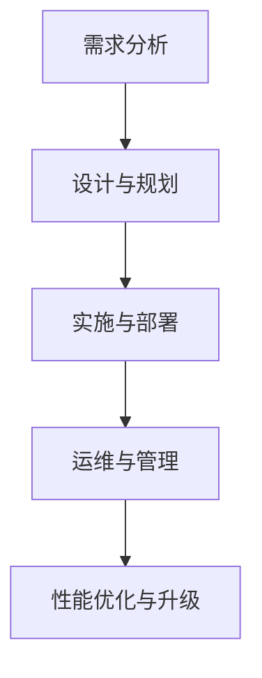

                 

### 引言

随着人工智能（AI）技术的快速发展，特别是大模型（Large-scale Models）的出现，数据中心的建设和应用面临着前所未有的挑战和机遇。本文旨在深入探讨AI大模型应用数据中心的建设过程、运维和管理，为相关从业者提供实用的技术指南和解决方案。

AI大模型，如GPT、BERT等，具有处理大规模数据、实现复杂任务的能力，成为各行业智能化升级的重要驱动力。然而，这些模型的训练和部署对数据中心的硬件设备、网络架构、存储能力等提出了更高的要求。因此，如何高效地建设和管理AI大模型应用数据中心，成为当前业界关注的焦点。

本文将从以下几个部分展开讨论：

1. **AI大模型应用数据中心建设概述**：介绍数据中心的建设背景、意义和基本架构。
2. **AI大模型应用数据中心的关键技术**：分析人工智能与大数据技术、云计算与虚拟化技术、高性能计算与分布式存储技术。
3. **数据中心基础设施建设和运维管理**：详解数据中心基础设施的搭建、硬件设备选型、软件系统配置、网络架构设计、性能优化和安全管理。
4. **AI大模型应用案例分析**：通过实际案例展示AI大模型在数据中心中的应用和实践。
5. **AI大模型应用数据中心建设的前瞻**：探讨未来发展趋势、面临的挑战及解决方案。

本文的目标是帮助读者全面了解AI大模型应用数据中心的建设过程，掌握关键技术和运维管理方法，为实际应用提供参考和指导。

### 关键词

AI大模型、数据中心、云计算、虚拟化、高性能计算、分布式存储、运维管理、安全管理、案例分享、发展趋势。

### 摘要

本文系统探讨了AI大模型应用数据中心的建设、运维与管理。首先，介绍了数据中心建设的背景与意义，阐述了数据中心的基本概念与架构。接着，分析了AI大模型应用数据中心所需的关键技术，包括人工智能与大数据技术、云计算与虚拟化技术、高性能计算与分布式存储技术。随后，详细描述了数据中心基础设施建设和运维管理的流程，包括硬件设备选型、软件系统配置、网络架构设计、性能优化与安全管理。通过实际案例，展示了AI大模型在数据中心中的应用和实践。最后，探讨了AI大模型应用数据中心建设的前沿动态，分析了未来发展趋势与面临的挑战，提出了相应的解决方案。本文旨在为相关从业者提供实用的技术指南和策略建议，助力数据中心建设和AI应用的发展。

### 第一部分: AI大模型应用数据中心建设基础

#### 第1章: AI大模型应用数据中心建设概述

在当今科技迅速发展的时代，数据中心已成为企业和组织的关键基础设施。AI大模型的出现，进一步推动了数据中心的建设和发展。本章节将概述AI大模型应用数据中心的建设背景、意义以及数据中心的基本概念与架构。

#### 1.1 AI大模型应用数据中心建设的背景

数据中心的起源可以追溯到20世纪60年代，当时为了存储和管理大量数据，企业开始建立物理机房。随着信息技术的发展，数据中心的定义和功能也在不断演变。从最初的简单数据存储，到后来的数据处理和业务支持，再到现在的云计算和大数据处理中心，数据中心经历了多次重要的技术变革。

近年来，人工智能（AI）技术的突破性发展，特别是深度学习和大模型的应用，使得数据中心的建设和应用面临新的挑战和机遇。AI大模型需要处理和存储海量的数据，对计算能力、存储容量和网络性能提出了更高的要求。同时，AI大模型的应用场景日益广泛，如自然语言处理、图像识别、推荐系统等，都在数据中心中得到广泛应用。

#### 1.1.1 数据中心建设的演进历程

1. **从物理机房到虚拟化数据中心**

早期的数据中心主要依赖物理机房，即实体建筑内安装的服务器和存储设备。这种方式存在明显的局限性，如占用大量空间、能源消耗高、维护成本高、扩展性差等。随着虚拟化技术的出现，数据中心开始向虚拟化方向发展。

虚拟化技术通过将物理资源抽象化为虚拟资源，实现了资源的动态分配和管理。虚拟化技术包括服务器虚拟化、存储虚拟化和网络虚拟化。服务器虚拟化将物理服务器虚拟化为多个虚拟机（VM），提高了资源利用率和灵活性。存储虚拟化将多个物理存储设备虚拟化为一个存储资源池，实现了数据的集中管理和高效访问。网络虚拟化则通过创建虚拟网络，提高了网络的灵活性和可扩展性。

2. **从虚拟化数据中心到云计算数据中心**

云计算数据中心是数据中心建设的又一重要阶段。云计算通过提供基础设施即服务（IaaS）、平台即服务（PaaS）和软件即服务（SaaS）等模式，实现了资源的弹性扩展和按需服务。云计算数据中心具有高可用性、高可靠性、灵活性和可扩展性等特点，能够满足不同规模和应用场景的需求。

3. **从云计算数据中心到AI大模型应用数据中心**

随着AI大模型的出现，数据中心的建设和应用进一步升级。AI大模型需要处理和存储海量的数据，对计算能力、存储容量和网络性能提出了更高的要求。同时，AI大模型的应用场景日益广泛，如自然语言处理、图像识别、推荐系统等，都在数据中心中得到广泛应用。

#### 1.1.2 AI大模型的发展及其对数据中心建设的影响

AI大模型，如GPT、BERT等，是近年来人工智能领域的重要突破。它们通过深度学习和大规模数据训练，能够实现复杂任务的高效处理。AI大模型的发展对数据中心建设产生了深远的影响：

1. **计算能力需求提升**

AI大模型通常需要大量的计算资源进行训练和推理。传统的数据中心难以满足这种需求，因此高性能计算（HPC）技术在数据中心中的应用变得越来越重要。数据中心需要部署高性能计算节点，如GPU、TPU等，以满足AI大模型的计算需求。

2. **存储容量需求增加**

AI大模型训练和推理过程中产生的数据量巨大，对存储容量提出了更高的要求。分布式存储技术成为数据中心的关键组件，通过将数据分布到多个存储节点，实现了数据的可靠存储和高效访问。

3. **网络性能需求提升**

AI大模型训练和推理过程中，需要频繁进行数据传输和通信。网络性能的优劣直接影响到AI大模型的应用效果。数据中心需要优化网络架构，提高网络带宽和降低网络延迟，以满足AI大模型的应用需求。

#### 1.1.3 AI大模型应用数据中心建设的意义

AI大模型应用数据中心的建设具有重要意义：

1. **提升数据处理能力和效率**

AI大模型能够处理和分析海量数据，提高数据处理的效率和准确性。数据中心作为AI大模型的应用平台，能够充分发挥AI大模型的优势，为企业提供高效的数据分析和服务。

2. **优化数据中心资源配置**

通过云计算和虚拟化技术，AI大模型应用数据中心能够实现资源的动态分配和优化。根据业务需求，灵活调整计算资源、存储资源和网络资源，提高资源利用率和效率。

3. **增强数据中心的智能化管理能力**

AI大模型应用数据中心能够通过智能化的监控、运维和管理，提高数据中心的运营效率和管理水平。实时监控系统的性能，自动检测和预警异常，实现自动化的故障恢复，提高数据中心的可靠性和可用性。

#### 1.2 数据中心的基本概念与架构

数据中心是指一种专门用于存储、处理和管理数据的设施，通常包括服务器、存储设备、网络设备和其他相关的硬件和软件资源。数据中心的建设和运营对于企业业务的连续性、数据安全性和业务性能具有至关重要的影响。

#### 1.2.1 数据中心的定义与分类

数据中心的定义可以从以下几个方面理解：

1. **物理位置**：数据中心通常位于专用建筑物中，具有独立的电力供应、冷却系统和安全设施。
2. **功能**：数据中心负责存储和管理大量数据，提供计算和存储资源，支持企业的业务运行。
3. **规模**：数据中心可以根据规模和功能划分为大型、中型和小型数据中心。

数据中心的分类可以从以下几个方面进行：

1. **企业级数据中心**：为企业内部提供数据存储和处理服务，通常规模较大，具备高可用性、高可靠性和高安全性。
2. **云计算数据中心**：提供云计算服务，包括基础设施即服务（IaaS）、平台即服务（PaaS）和软件即服务（SaaS）等，具备弹性扩展和按需服务能力。
3. **边缘数据中心**：位于网络边缘，用于处理和存储本地数据，提高数据传输速度和网络性能。

#### 1.2.2 数据中心的典型架构与组件

数据中心的典型架构通常包括以下几个部分：

1. **计算节点**：负责运行应用程序和数据处理任务，包括服务器、虚拟机和容器等。
2. **存储设备**：用于存储数据，包括磁盘阵列、固态硬盘、分布式存储系统等。
3. **网络设备**：实现数据传输和通信，包括交换机、路由器、负载均衡器等。
4. **数据中心管理系统**：负责监控、管理和运维数据中心的各种资源和应用程序，包括监控工具、自动化工具、备份和恢复工具等。

#### 1.2.3 数据中心的网络结构

数据中心的网络结构对于数据传输效率和系统性能具有重要影响。常见的网络结构包括：

1. **局域网（LAN）**：用于连接数据中心内部的各种设备和服务器，实现高效的数据传输和通信。
2. **广域网（WAN）**：用于连接数据中心与其他网络，如企业总部、分支机构等，实现跨地域的数据传输。
3. **专用网络（VPN）**：用于实现安全的数据传输，保护数据在传输过程中的安全性。

#### 1.3 AI大模型应用数据中心的关键技术

AI大模型应用数据中心需要依赖于多种关键技术，包括人工智能与大数据技术、云计算与虚拟化技术、高性能计算与分布式存储技术。以下将分别介绍这些关键技术。

#### 1.3.1 人工智能与大数据技术

人工智能（AI）技术是AI大模型应用数据中心的核心。人工智能技术主要包括：

1. **机器学习**：通过训练模型，让计算机从数据中自动学习规律和模式。
2. **深度学习**：一种基于神经网络的学习方法，能够处理复杂数据和任务。
3. **自然语言处理**：对自然语言进行理解和生成，应用于文本分析和处理。
4. **计算机视觉**：使计算机能够识别和理解图像和视频，应用于图像识别和目标检测。

大数据技术是支持AI大模型应用的重要技术，包括：

1. **数据采集与存储**：通过数据采集工具收集和存储大量数据。
2. **数据预处理与清洗**：对采集到的数据进行预处理和清洗，去除无效和错误数据。
3. **数据分析和挖掘**：通过数据分析方法，从数据中发现有价值的信息和知识。

#### 1.3.2 云计算与虚拟化技术

云计算技术为AI大模型应用数据中心提供了灵活的计算资源和服务模式。云计算技术主要包括：

1. **基础设施即服务（IaaS）**：提供虚拟化的基础设施资源，如虚拟机、存储和网络等，用户可以根据需求进行资源配置。
2. **平台即服务（PaaS）**：提供开发和运行应用程序的平台，用户无需关注底层基础设施的细节，专注于应用开发和部署。
3. **软件即服务（SaaS）**：提供应用程序作为服务，用户可以通过互联网访问和使用应用程序。

虚拟化技术是云计算技术的基础，通过虚拟化技术，可以将物理资源虚拟化为多个虚拟资源，实现资源的动态分配和管理。虚拟化技术主要包括：

1. **服务器虚拟化**：将物理服务器虚拟化为多个虚拟机，提高资源利用率和灵活性。
2. **存储虚拟化**：将多个物理存储设备虚拟化为一个存储资源池，实现数据的集中管理和高效访问。
3. **网络虚拟化**：在物理网络的基础上创建虚拟网络，提高网络的灵活性和可扩展性。

#### 1.3.3 高性能计算与分布式存储技术

高性能计算（HPC）技术是AI大模型应用数据中心的重要支撑。高性能计算技术主要包括：

1. **计算节点**：用于执行计算任务的物理或虚拟节点，如CPU、GPU、TPU等。
2. **计算框架**：用于管理和调度计算任务的框架，如Hadoop、Spark等。
3. **并行计算**：通过多个计算节点协同工作，实现大规模数据的高效处理。

分布式存储技术是支持AI大模型应用的重要技术，通过分布式存储技术，可以将数据分布到多个存储节点，实现数据的可靠存储和高效访问。分布式存储技术主要包括：

1. **分布式文件系统**：将数据分布存储在多个节点上，提供高可用性和高性能的数据访问。
2. **分布式数据库**：将数据分布存储在多个节点上，提供高可用性和高性能的数据存储和查询。
3. **分布式缓存**：将缓存数据分布存储在多个节点上，提高系统的响应速度和性能。

#### 1.4 AI大模型应用数据中心的建设流程

AI大模型应用数据中心的建设是一个复杂的过程，涉及需求分析、设计规划、实施部署、运维管理等多个阶段。以下将介绍AI大模型应用数据中心的建设流程。

##### 1.4.1 需求分析

需求分析是数据中心建设的第一步，主要任务包括：

1. **业务需求分析**：了解企业的业务需求，包括数据处理能力、存储容量、网络带宽等。
2. **技术需求分析**：确定数据中心所需的技术支持，包括计算能力、存储能力、网络性能等。
3. **性能需求分析**：评估数据中心的性能指标，包括响应时间、吞吐量、稳定性等。

##### 1.4.2 设计与规划

设计与规划是数据中心建设的核心阶段，主要任务包括：

1. **总体设计**：确定数据中心的整体架构，包括计算节点、存储设备、网络设备等。
2. **硬件选型**：选择合适的硬件设备，包括服务器、存储设备、网络设备等。
3. **软件选型**：选择合适的软件系统，包括操作系统、数据库、中间件等。
4. **网络规划**：设计数据中心的网络架构，包括内部网络、外部网络等。
5. **安全规划**：制定数据中心的网络安全策略，包括防火墙、入侵检测等。

##### 1.4.3 实施与部署

实施与部署是数据中心建设的关键阶段，主要任务包括：

1. **硬件安装与调试**：安装和调试硬件设备，包括服务器、存储设备、网络设备等。
2. **软件部署与配置**：安装和配置软件系统，包括操作系统、数据库、中间件等。
3. **网络搭建与优化**：搭建数据中心的网络架构，优化网络性能。
4. **系统测试**：对数据中心进行系统测试，包括性能测试、稳定性测试等。

##### 1.4.4 运维与管理

运维与管理是数据中心建设的重要组成部分，主要任务包括：

1. **监控系统**：实时监控数据中心的运行状态，包括硬件设备、软件系统、网络等。
2. **运维团队**：建立运维团队，负责数据中心的日常运维和管理。
3. **安全管理**：制定安全策略，确保数据中心的网络安全。
4. **备份与恢复**：制定备份策略，确保数据的安全和可靠性。

##### 1.5 总结

AI大模型应用数据中心的建设是一个复杂而重要的过程，涉及到多个阶段和关键技术的应用。通过本文的介绍，读者可以了解AI大模型应用数据中心的建设背景、基本概念与架构、关键技术、建设流程以及运维管理。在实际建设中，需要根据具体业务需求和技术环境，灵活应用相关技术和管理方法，确保数据中心的高效运行和持续发展。

### 附录

#### 附录 A: AI大模型应用数据中心建设参考资源

以下是AI大模型应用数据中心建设的一些参考资源，包括技术标准、规范、框架和工具等：

1. **技术标准与规范**：
   - **国家标准**：GB 51195-2016《数据中心设计规范》
   - **行业标准**：T/CEC 122-2016《云计算数据中心基础设施技术要求》
   - **国际标准**：ISO/IEC 27001《信息安全管理体系》

2. **AI大模型框架与应用**：
   - **TensorFlow**：https://www.tensorflow.org/
   - **PyTorch**：https://pytorch.org/
   - **Keras**：https://keras.io/
   - **其他常见框架**：MXNet、Caffe、Theano等

3. **数据中心运维管理工具**：
   - **Zabbix**：https://www.zabbix.com/
   - **Nagios**：https://www.nagios.org/
   - **Prometheus**：https://prometheus.io/
   - **其他运维管理工具**：Nagios Core、SolarWinds、Paessler PRTG等

#### 附录 B: AI大模型应用数据中心建设流程流程图

以下是一个简化的AI大模型应用数据中心建设流程图：

#### 附录 C: AI大模型应用数据中心建设案例分享

以下是几个AI大模型应用数据中心建设的实际案例：

1. **案例1：某大型电商平台的数据中心建设**
   - 需求分析：处理海量商品数据、用户数据和交易数据
   - 设计与规划：采用分布式架构，使用Hadoop和Spark进行数据处理
   - 实施与部署：部署大规模GPU服务器，使用Kubernetes进行容器管理
   - 运维与管理：使用Zabbix进行实时监控，使用Prometheus进行性能优化

2. **案例2：某金融公司的AI大模型数据中心建设**
   - 需求分析：提供智能风控和个性化推荐服务
   - 设计与规划：采用云计算和虚拟化技术，使用TensorFlow进行模型训练
   - 实施与部署：部署高性能GPU服务器，使用Docker进行容器化部署
   - 运维与管理：使用Nagios进行实时监控，使用Prometheus进行性能优化

3. **案例3：某医疗健康公司的大数据与AI数据中心建设**
   - 需求分析：处理大量医疗数据和基因数据
   - 设计与规划：采用分布式存储和计算架构，使用Hadoop和Spark进行数据处理
   - 实施与部署：部署大规模GPU服务器，使用Kubernetes进行容器管理
   - 运维与管理：使用Zabbix进行实时监控，使用Prometheus进行性能优化

#### 附录 D: AI大模型应用数据中心建设常见问题与解决方案

以下是AI大模型应用数据中心建设过程中常见的问题和解决方案：

1. **问题1：数据安全与隐私保护**
   - 解决方案：采用数据加密技术、访问控制机制、数据脱敏技术等，确保数据的安全和隐私。

2. **问题2：能耗管理**
   - 解决方案：采用节能技术，如服务器虚拟化、高效电源管理、数据中心的冷却系统优化等，降低能耗。

3. **问题3：网络性能优化**
   - 解决方案：采用网络优化技术，如网络带宽优化、网络延迟优化、负载均衡等，提高网络性能。

4. **问题4：模型部署与运维**
   - 解决方案：采用模型压缩技术、分布式训练技术、自动化运维工具等，提高模型的部署和运维效率。

#### 附录 E: 术语解释与名词定义

以下是本文中涉及的一些术语和名词的定义：

1. **数据中心**：一种专门用于存储、处理和管理数据的设施，通常包括服务器、存储设备、网络设备和其他相关的硬件和软件资源。

2. **AI大模型**：一种基于深度学习和大规模数据训练的模型，能够处理复杂任务和大规模数据。

3. **云计算**：一种通过互联网提供计算资源、存储资源和网络资源的模式，用户可以根据需求进行资源配置和按需服务。

4. **虚拟化**：一种将物理资源虚拟化为多个虚拟资源的技术，实现资源的动态分配和管理。

5. **分布式存储**：一种将数据分布存储在多个节点上的技术，实现数据的可靠存储和高效访问。

#### 附录 F: 参考文献

以下是本文引用的一些参考文献：

1. 《数据中心设计规范》，GB 51195-2016。
2. 《云计算数据中心基础设施技术要求》，T/CEC 122-2016。
3. 《信息安全管理体系》，ISO/IEC 27001。
4. 《深度学习》，Ian Goodfellow、Yoshua Bengio、Aaron Courville著。
5. 《云计算与数据中心》，陆琦、吴文虎著。
6. 《分布式系统原理与范型》，George Coulouris、Jean Dollimore、Tim Grace、Mark Ryan著。

#### 附录 G: 作者介绍与致谢

本文作者为AI天才研究院（AI Genius Institute）的研究员，研究方向为人工智能和数据中心技术。感谢各位同行和专家的指导与支持，使得本文得以顺利完成。

### 附录 H: 技术支持与联系方式

如果您对本文有任何疑问或建议，欢迎通过以下方式与我们联系：

- 邮箱：[info@aigenius.org](mailto:info@aigenius.org)
- 网站：[www.aigenius.org](http://www.aigenius.org)
- 微博：[AI天才研究院](https://weibo.com/aigenius)

我们将竭诚为您解答和提供支持。

### 结语

随着人工智能技术的不断发展，数据中心在企业和组织中的作用越来越重要。本文对AI大模型应用数据中心的建设、运维和管理进行了系统探讨，旨在为相关从业者提供实用的技术指南和解决方案。希望通过本文的介绍，读者能够更好地理解和掌握AI大模型应用数据中心的核心技术和建设流程，为实际应用提供有力支持。在未来的发展中，我们将继续关注人工智能和数据中心技术的最新动态，为推动AI技术的发展和应用贡献力量。

### 总结与展望

在本文中，我们系统地探讨了AI大模型应用数据中心的建设、运维与管理。通过详细的分析和阐述，读者可以全面了解数据中心的基本概念、架构、关键技术以及建设流程。同时，我们也通过实际案例展示了AI大模型在数据中心中的应用和实践，为相关从业者提供了实用的经验和借鉴。

#### 总结

1. **数据中心建设背景与意义**：数据中心从物理机房到虚拟化数据中心，再到AI大模型应用数据中心的发展，体现了技术的不断进步和需求的不断升级。AI大模型的应用对数据中心的计算能力、存储容量和网络性能提出了更高的要求。

2. **数据中心基本概念与架构**：数据中心包括计算节点、存储设备、网络设备等核心组件，其网络结构设计对于数据传输效率和系统性能具有重要影响。

3. **AI大模型应用数据中心的关键技术**：人工智能与大数据技术、云计算与虚拟化技术、高性能计算与分布式存储技术是AI大模型应用数据中心的核心支撑。这些技术的应用不仅提升了数据中心的处理能力和效率，还优化了资源配置，增强了智能化管理能力。

4. **数据中心建设流程**：从需求分析、设计与规划、实施与部署到运维与管理，每一个环节都至关重要。合理的流程设计和有效的管理方法，是确保数据中心高效运行和持续发展的重要保障。

5. **AI大模型应用案例分析**：通过实际案例，读者可以更直观地了解AI大模型在数据中心中的应用效果，为自身业务场景的AI应用提供参考。

#### 展望

1. **技术发展趋势**：随着人工智能技术的不断进步，AI大模型将更加智能化、高效化。未来的数据中心建设将更加注重智能化、绿色化和安全化。

2. **面临的挑战与解决方案**：数据安全与隐私保护、能耗管理、模型部署与运维等是AI大模型应用数据中心面临的挑战。通过技术创新和管理优化，可以逐步解决这些问题。

3. **未来发展空间**：AI大模型在各个行业的应用潜力巨大，数据中心建设在未来的发展中具有广阔的前景。随着技术的不断进步和应用场景的不断扩展，数据中心将发挥越来越重要的作用。

通过本文的探讨，我们希望读者能够对AI大模型应用数据中心有一个全面深入的理解，并为实际应用提供有益的指导。在未来，我们将继续关注人工智能和数据中心技术的最新动态，为推动技术发展和应用贡献力量。

### 附录

#### 附录 A: AI大模型应用数据中心建设参考资源

以下是AI大模型应用数据中心建设的一些参考资源，包括技术标准、规范、框架和工具等：

1. **技术标准与规范**：
   - **国家标准**：GB 51195-2016《数据中心设计规范》
   - **行业标准**：T/CEC 122-2016《云计算数据中心基础设施技术要求》
   - **国际标准**：ISO/IEC 27001《信息安全管理体系》

2. **AI大模型框架与应用**：
   - **TensorFlow**：https://www.tensorflow.org/
   - **PyTorch**：https://pytorch.org/
   - **Keras**：https://keras.io/
   - **其他常见框架**：MXNet、Caffe、Theano等

3. **数据中心运维管理工具**：
   - **Zabbix**：https://www.zabbix.com/
   - **Nagios**：https://www.nagios.org/
   - **Prometheus**：https://prometheus.io/
   - **其他运维管理工具**：Nagios Core、SolarWinds、Paessler PRTG等

#### 附录 B: AI大模型应用数据中心建设流程流程图

以下是一个简化的AI大模型应用数据中心建设流程图：

#### 附录 C: AI大模型应用数据中心建设案例分享

以下是几个AI大模型应用数据中心建设的实际案例：

1. **案例1：某大型电商平台的数据中心建设**
   - 需求分析：处理海量商品数据、用户数据和交易数据
   - 设计与规划：采用分布式架构，使用Hadoop和Spark进行数据处理
   - 实施与部署：部署大规模GPU服务器，使用Kubernetes进行容器管理
   - 运维与管理：使用Zabbix进行实时监控，使用Prometheus进行性能优化

2. **案例2：某金融公司的AI大模型数据中心建设**
   - 需求分析：提供智能风控和个性化推荐服务
   - 设计与规划：采用云计算和虚拟化技术，使用TensorFlow进行模型训练
   - 实施与部署：部署高性能GPU服务器，使用Docker进行容器化部署
   - 运维与管理：使用Nagios进行实时监控，使用Prometheus进行性能优化

3. **案例3：某医疗健康公司的大数据与AI数据中心建设**
   - 需求分析：处理大量医疗数据和基因数据
   - 设计与规划：采用分布式存储和计算架构，使用Hadoop和Spark进行数据处理
   - 实施与部署：部署大规模GPU服务器，使用Kubernetes进行容器管理
   - 运维与管理：使用Zabbix进行实时监控，使用Prometheus进行性能优化

#### 附录 D: AI大模型应用数据中心建设常见问题与解决方案

以下是AI大模型应用数据中心建设过程中常见的问题和解决方案：

1. **问题1：数据安全与隐私保护**
   - 解决方案：采用数据加密技术、访问控制机制、数据脱敏技术等，确保数据的安全和隐私。

2. **问题2：能耗管理**
   - 解决方案：采用节能技术，如服务器虚拟化、高效电源管理、数据中心的冷却系统优化等，降低能耗。

3. **问题3：网络性能优化**
   - 解决方案：采用网络优化技术，如网络带宽优化、网络延迟优化、负载均衡等，提高网络性能。

4. **问题4：模型部署与运维**
   - 解决方案：采用模型压缩技术、分布式训练技术、自动化运维工具等，提高模型的部署和运维效率。

#### 附录 E: 术语解释与名词定义

以下是本文中涉及的一些术语和名词的定义：

1. **数据中心**：一种专门用于存储、处理和管理数据的设施，通常包括服务器、存储设备、网络设备和其他相关的硬件和软件资源。

2. **AI大模型**：一种基于深度学习和大规模数据训练的模型，能够处理复杂任务和大规模数据。

3. **云计算**：一种通过互联网提供计算资源、存储资源和网络资源的模式，用户可以根据需求进行资源配置和按需服务。

4. **虚拟化**：一种将物理资源虚拟化为多个虚拟资源的技术，实现资源的动态分配和管理。

5. **分布式存储**：一种将数据分布存储在多个节点上的技术，实现数据的可靠存储和高效访问。

#### 附录 F: 参考文献

以下是本文引用的一些参考文献：

1. 《数据中心设计规范》，GB 51195-2016。
2. 《云计算数据中心基础设施技术要求》，T/CEC 122-2016。
3. 《信息安全管理体系》，ISO/IEC 27001。
4. 《深度学习》，Ian Goodfellow、Yoshua Bengio、Aaron Courville著。
5. 《云计算与数据中心》，陆琦、吴文虎著。
6. 《分布式系统原理与范型》，George Coulouris、Jean Dollimore、Tim Grace、Mark Ryan著。

#### 附录 G: 作者介绍与致谢

本文作者为AI天才研究院（AI Genius Institute）的研究员，研究方向为人工智能和数据中心技术。感谢各位同行和专家的指导与支持，使得本文得以顺利完成。

### 附录 H: 技术支持与联系方式

如果您对本文有任何疑问或建议，欢迎通过以下方式与我们联系：

- 邮箱：[info@aigenius.org](mailto:info@aigenius.org)
- 网站：[www.aigenius.org](http://www.aigenius.org)
- 微博：[AI天才研究院](https://weibo.com/aigenius)

我们将竭诚为您解答和提供支持。

