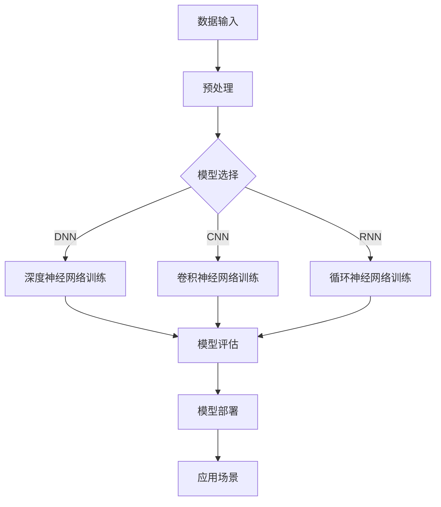
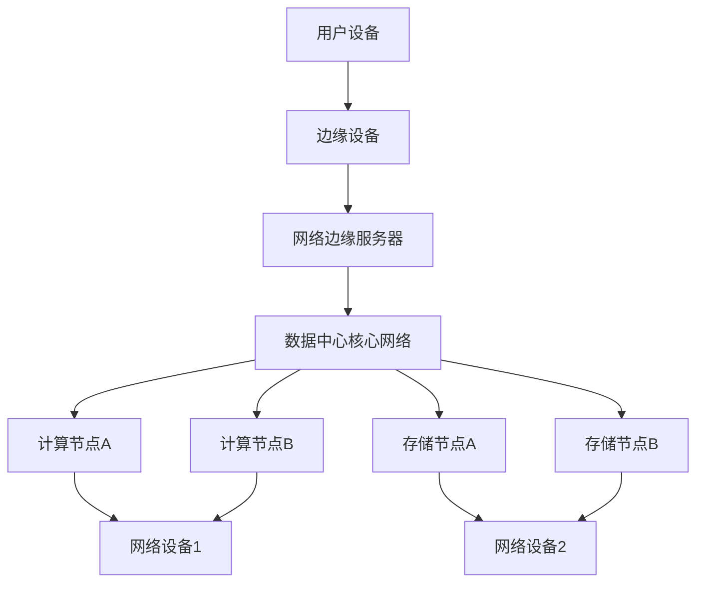

                 

# 《AI 大模型应用数据中心建设：高性能计算与存储架构》

## 关键词：
AI大模型，数据中心建设，高性能计算，存储架构，分布式系统，能耗优化，运维管理。

## 摘要：
本文深入探讨了AI大模型应用数据中心建设中的高性能计算与存储架构。首先回顾了AI大模型的发展历程和数据中心的含义，然后详细解析了高性能计算架构，包括计算节点、编程模型和网络技术。接着，讨论了存储架构，包括存储类型、分布式存储系统和数据一致性策略。本文还提出了数据中心的设计原则、设备选型、运维管理，并通过案例分析提供了实战指导。最后，附上相关工具与资源、流程图、伪代码和数学公式，为读者提供全面的参考资料。

### 目录大纲

# 《AI 大模型应用数据中心建设：高性能计算与存储架构》

## 第一部分：背景与概述

## 第1章：AI大模型应用数据中心建设背景
### 1.1 AI 大模型的发展历程
### 1.2 数据中心建设的意义
### 1.3 高性能计算与存储架构的重要性

## 第2章：高性能计算架构
### 2.1 高性能计算基础
#### 2.1.1 计算节点组成
#### 2.1.2 编程模型与编程工具
#### 2.1.3 高性能网络技术
### 2.2 服务器与集群架构
#### 2.2.1 服务器选择标准
#### 2.2.2 集群架构设计原则
#### 2.2.3 负载均衡与容错机制
### 2.3 高性能计算优化技术
#### 2.3.1 编译器优化
#### 2.3.2 并行计算策略
#### 2.3.3 内存管理优化

## 第3章：存储架构
### 3.1 存储基础
#### 3.1.1 存储类型与性能指标
#### 3.1.2 常见存储设备
#### 3.1.3 存储网络技术
### 3.2 分布式存储系统
#### 3.2.1 分布式存储原理
#### 3.2.2 分布式存储系统架构
#### 3.2.3 数据一致性策略
### 3.3 存储优化技术
#### 3.3.1 压缩与去重技术
#### 3.3.2 存储性能监控与调优
#### 3.3.3 数据保护与备份策略

## 第二部分：数据中心建设实战

## 第4章：数据中心设计原则
### 4.1 数据中心建设目标
#### 4.1.1 性能目标
#### 4.1.2 可靠性目标
#### 4.1.3 可扩展性目标
### 4.2 数据中心布局设计
#### 4.2.1 服务器布局设计
#### 4.2.2 存储布局设计
#### 4.2.3 冷热备份设计
### 4.3 能耗优化与绿色数据中心
#### 4.3.1 能耗优化策略
#### 4.3.2 绿色数据中心设计

## 第5章：数据中心设备选型与配置
### 5.1 服务器设备选型
#### 5.1.1 处理器选型
#### 5.1.2 内存选型
#### 5.1.3 存储设备选型
### 5.2 存储设备配置
#### 5.2.1 存储设备配置原则
#### 5.2.2 存储网络配置
#### 5.2.3 存储冗余配置
### 5.3 网络设备选型与配置
#### 5.3.1 网络交换机选型
#### 5.3.2 网络路由器配置
#### 5.3.3 网络安全配置

## 第6章：数据中心运维管理
### 6.1 运维管理概述
#### 6.1.1 运维管理目标
#### 6.1.2 运维管理流程
#### 6.1.3 运维团队组织结构
### 6.2 系统监控与性能优化
#### 6.2.1 系统监控工具
#### 6.2.2 性能优化策略
#### 6.2.3 故障诊断与处理
### 6.3 数据备份与恢复
#### 6.3.1 数据备份策略
#### 6.3.2 数据恢复方法
#### 6.3.3 备份系统设计

## 第7章：案例分析与实战指导
### 7.1 案例分析
#### 7.1.1 案例一：某大型电商平台数据中心建设
#### 7.1.2 案例二：某金融行业数据中心改造
#### 7.1.3 案例三：某科研机构高性能计算集群建设
### 7.2 实战指导
#### 7.2.1 实战一：数据中心设备配置与部署
#### 7.2.2 实战二：存储优化与性能调优
#### 7.2.3 实战三：数据中心运维管理实践

## 附录
### 附录 A：常用工具与资源
#### A.1 高性能计算工具
#### A.2 存储系统工具
#### A.3 数据中心管理工具
#### A.4 相关参考资料与学习资源
### 附录 B：Mermaid 流程图
#### B.1 AI 大模型计算流程
#### B.2 数据中心网络拓扑结构
### 附录 C：伪代码
#### C.1 深度学习算法
#### C.2 分布式存储系统算法
#### C.3 数据中心性能优化算法
### 附录 D：数学公式
#### D.1 高性能计算性能指标公式
#### D.2 存储系统容量计算公式
#### D.3 数据中心能耗计算公式
### 附录 E：代码实例
#### E.1 数据中心设备配置脚本
#### E.2 存储性能优化脚本
#### E.3 数据中心监控脚本

----------------------------------------------------------------

### 第1章：AI大模型应用数据中心建设背景

#### 1.1 AI 大模型的发展历程

人工智能（AI）技术经历了数十年的发展，从最初的符号推理、知识表示，到基于统计学习的方法，再到深度学习的崛起，AI领域不断取得突破。尤其是近年来，随着计算能力的提升和海量数据的积累，AI大模型应运而生，这些模型拥有数亿到数万亿个参数，能够在图像识别、自然语言处理、推荐系统等众多领域实现前所未有的性能。

AI大模型的发展大致可以分为以下几个阶段：

1. **符号主义阶段**：早期的AI研究主要基于逻辑和符号推理，例如专家系统和知识表示。然而，这种方法在实际应用中受到了知识的表达和推理效率的限制。

2. **连接主义阶段**：随着神经网络的研究进展，AI开始转向连接主义方法，尤其是反向传播算法的提出，使得神经网络训练变得更加高效。这一阶段标志着深度学习的兴起。

3. **深度学习阶段**：2006年，Hinton提出了深度信念网络（DBN），深度学习开始进入人们的视野。2012年，AlexNet在ImageNet大赛中取得了突破性的成绩，标志着深度学习正式成为AI研究的主流。

4. **AI大模型阶段**：随着硬件性能的提升和大数据的发展，AI大模型开始出现。这些模型不仅拥有更多的参数，还采用了更复杂的架构，例如Transformer模型，在自然语言处理等领域取得了显著成果。

#### 1.2 数据中心建设的意义

数据中心是AI大模型应用的重要基础设施。它不仅提供了计算资源和存储空间，还确保了数据的安全性和可靠性。数据中心建设的意义主要体现在以下几个方面：

1. **计算资源**：AI大模型训练和推理需要大量的计算资源，数据中心提供了高密度、高并行的计算环境，能够满足这些需求。

2. **存储空间**：AI大模型训练和推理过程中会产生大量的数据，数据中心提供了海量的存储空间，能够确保数据的存储和快速访问。

3. **数据安全**：数据中心采用了多种安全措施，如防火墙、数据加密等，确保了数据的安全性和隐私性。

4. **可靠性**：数据中心设计有冗余和备份机制，能够确保系统的高可用性和数据的不丢失。

5. **成本控制**：数据中心能够实现资源的统一管理和调度，从而降低运维成本。

#### 1.3 高性能计算与存储架构的重要性

高性能计算和存储架构是数据中心建设的关键组成部分。它们的重要性体现在以下几个方面：

1. **计算性能**：高性能计算架构能够提供强大的计算能力，满足AI大模型训练和推理的需求。计算性能的优劣直接影响模型的训练速度和效果。

2. **存储性能**：存储架构的性能直接影响到数据的访问速度和处理效率。高性能的存储系统可以显著提高数据中心的整体性能。

3. **可扩展性**：高性能计算和存储架构需要具备良好的可扩展性，以便随着业务需求的增长进行扩展。

4. **成本效益**：合理的架构设计能够在保证性能的前提下，降低建设成本和运维成本。

5. **可靠性**：高性能计算和存储架构需要具备高可靠性，确保系统的稳定运行和数据的安全。

接下来，我们将进一步探讨高性能计算和存储架构的具体内容，为数据中心的建设提供技术指导。

### 第2章：高性能计算架构

高性能计算（HPC）是数据中心建设中的核心部分，它决定了数据中心处理AI大模型任务的能力。在这一章中，我们将详细探讨高性能计算的基础知识，包括计算节点、编程模型、编程工具和高性能网络技术。

#### 2.1 高性能计算基础

高性能计算的基础是计算节点。计算节点是HPC集群中的基本单元，通常包括高性能处理器、内存、网络接口和存储设备。计算节点之间通过高速网络连接，形成一个分布式计算系统。

##### 2.1.1 计算节点组成

一个典型的计算节点通常包括以下组件：

- **处理器**：高性能计算节点通常采用多核处理器，如Intel Xeon系列或AMD EPYC系列，这些处理器具有强大的计算能力。
- **内存**：计算节点需要大容量内存来存储和操作数据。内存速度直接影响计算效率，因此需要使用高速内存，如DDR4或DDR5。
- **网络接口**：计算节点通过网络接口与其他节点进行通信。高性能计算网络通常采用Infiniband、Ethernet 10G/40G等高速网络。
- **存储设备**：计算节点配备高速存储设备，如固态硬盘（SSD），用于存储临时数据和模型参数。

##### 2.1.2 编程模型与编程工具

在HPC领域，常见的编程模型包括消息传递接口（MPI）和共享内存编程模型。这两种模型各有优缺点，适用于不同的应用场景。

- **消息传递接口（MPI）**：MPI是一种用于分布式计算的编程模型，它允许不同计算节点之间的数据交换和任务分配。MPI适用于大规模并行计算，如气象模拟、流体力学计算等。
- **共享内存编程模型**：共享内存编程模型允许多个处理器共享同一块内存空间，通过线程或任务来执行计算。这种模型适用于小规模并行计算，如科学计算、图像处理等。

常用的HPC编程工具包括：

- **MPI**：如MPICH、OpenMPI等。
- **并行编程库**：如OpenMP、CUDA等。
- **高性能计算框架**：如TensorFlow、PyTorch等。

##### 2.1.3 高性能网络技术

高性能网络是HPC架构中的关键部分，它决定了数据在节点之间传输的速度和效率。以下是几种常见的高性能网络技术：

- **Infiniband**：Infiniband是一种高速网络技术，具有低延迟和高带宽的特点，广泛用于高性能计算集群。Infiniband网络通常采用点到点的拓扑结构，提供高达100Gb/s的带宽。
- **Ethernet 10G/40G**：以太网是一种常见的网络技术，10G/40G Ethernet提供了更高的带宽和更好的性能，适用于大型数据中心。
- **Ethernet RoCE（RDMA over Converged Ethernet）**：RoCE是一种在以太网上实现远程直接内存访问（RDMA）的技术，它提供了类似于Infiniband的低延迟和高带宽特性。

#### 2.2 服务器与集群架构

服务器和集群架构是高性能计算的核心组成部分。它们的设计和配置直接影响系统的性能、可扩展性和可靠性。

##### 2.2.1 服务器选择标准

选择合适的服务器对于HPC集群至关重要。以下是一些选择服务器的标准：

- **计算性能**：服务器应具有强大的计算能力，以满足高性能计算的需求。
- **内存容量**：服务器应配备大容量内存，以满足大模型训练和推理的需求。
- **网络接口**：服务器应具备高速网络接口，以确保数据的高速传输。
- **存储容量**：服务器应具备足够的存储容量，以存储数据和模型参数。
- **可扩展性**：服务器应支持扩展，以便在需求增长时进行升级。

##### 2.2.2 集群架构设计原则

集群架构设计应遵循以下原则：

- **负载均衡**：集群应能够均衡分配任务，避免单点瓶颈，提高整体性能。
- **容错机制**：集群应具备容错能力，能够自动检测和修复故障节点，确保系统的高可用性。
- **数据一致性**：集群应确保数据的一致性，避免数据丢失或错误。
- **可扩展性**：集群应具备良好的可扩展性，能够随着业务需求的增长进行扩展。

##### 2.2.3 负载均衡与容错机制

负载均衡和容错机制是HPC集群的关键组成部分。

- **负载均衡**：负载均衡器负责将任务分配到集群中的各个节点，避免单点过载。常见的负载均衡算法包括轮询、最小连接数和加权轮询等。
- **容错机制**：容错机制包括故障检测、故障隔离和故障恢复。集群应能够自动检测故障节点，将其从系统中隔离，并重新分配任务到其他健康节点。

#### 2.3 高性能计算优化技术

为了进一步提高HPC系统的性能，可以采用多种优化技术。

##### 2.3.1 编译器优化

编译器优化是提高HPC程序性能的有效手段。常见的编译器优化技术包括：

- **代码并行化**：通过分析程序结构，将串行代码转换为并行代码，提高执行速度。
- **循环优化**：优化循环结构，减少循环迭代次数，提高执行效率。
- **内存访问优化**：优化内存访问模式，减少缓存未命中，提高内存访问速度。

##### 2.3.2 并行计算策略

并行计算策略是提高HPC系统性能的关键。以下是一些常见的并行计算策略：

- **数据并行**：将任务数据分解为多个部分，同时在不同的节点上独立处理，最后将结果合并。
- **任务并行**：将任务分解为多个子任务，同时在不同的节点上并行执行，最后将结果合并。
- **任务和数据并行**：结合数据并行和任务并行，同时利用数据和任务的并行性。

##### 2.3.3 内存管理优化

内存管理优化是提高HPC系统性能的重要方面。以下是一些常见的内存管理优化技术：

- **内存预分配**：预先分配内存，避免频繁的内存分配和释放操作。
- **内存池**：使用内存池管理内存，减少内存碎片。
- **缓存优化**：优化缓存策略，提高内存访问速度。

通过上述优化技术，可以显著提高HPC系统的性能，为AI大模型的应用提供强大的计算支持。

### 第3章：存储架构

存储架构在数据中心建设中扮演着至关重要的角色，它不仅决定了数据的存储容量和访问速度，还直接影响数据中心的整体性能。在这一章中，我们将详细探讨存储架构的基础知识，包括存储类型、性能指标、常见存储设备、存储网络技术以及分布式存储系统和数据一致性策略。

#### 3.1 存储基础

存储架构的基础包括存储类型、性能指标和常见存储设备。

##### 3.1.1 存储类型与性能指标

存储类型主要分为以下几种：

- **块存储**：块存储将数据分割成固定大小的块进行存储，适用于需要快速随机访问的应用场景，如数据库和文件系统。
- **文件存储**：文件存储将数据组织成文件系统，适用于文件级别的访问和管理，如文件共享和备份。
- **对象存储**：对象存储将数据以对象的形式存储，每个对象都包含数据、元数据和唯一标识，适用于大规模数据存储和访问，如云存储和大数据处理。

存储性能指标包括：

- **IOPS（每秒输入输出操作次数）**：衡量存储系统的读写性能，IOPS越高，读写速度越快。
- **吞吐量**：衡量存储系统的数据传输速度，吞吐量越高，数据传输速度越快。
- **延迟**：衡量存储系统响应时间，延迟越低，系统性能越高。
- **可靠性**：衡量存储系统的数据保护和恢复能力，可靠性越高，数据丢失和损坏的风险越低。

##### 3.1.2 常见存储设备

常见的存储设备包括：

- **固态硬盘（SSD）**：固态硬盘使用闪存存储数据，具有高速读写性能，适用于需要高性能存储的应用场景。
- **硬盘（HDD）**：硬盘使用磁盘存储数据，容量较大但读写速度较慢，适用于需要大量存储空间的应用场景。
- **阵列卡**：阵列卡是一种存储设备，可以将多个硬盘组合成一个逻辑存储单元，提供数据冗余和性能优化功能。
- **存储网络设备**：如存储区域网络（SAN）和网络附加存储（NAS），用于连接存储设备和服务器，提供数据传输通道。

##### 3.1.3 存储网络技术

存储网络技术主要包括以下几种：

- **光纤通道（FC）**：光纤通道是一种高速存储网络技术，采用光纤传输数据，适用于大型数据中心和高性能计算场景。
- **iSCSI**：iSCSI是一种基于IP网络的存储协议，可以将远程存储设备连接到本地服务器，适用于中小型数据中心和远程访问场景。
- **NAS**：网络附加存储（NAS）是一种基于文件系统的存储设备，通过网络接口连接到服务器，提供文件级别的数据访问和管理。
- **SAN**：存储区域网络（SAN）是一种专门用于存储数据传输的网络，可以将多个存储设备连接成一个统一的存储池，提供块级别的数据访问和管理。

#### 3.2 分布式存储系统

分布式存储系统是数据中心存储架构的核心，它通过将数据分散存储在多个节点上，提供高可用性和高性能的数据存储解决方案。

##### 3.2.1 分布式存储原理

分布式存储系统的原理主要包括以下几个方面：

- **数据分片**：将数据分割成多个小数据块，分散存储在多个节点上。
- **副本机制**：为每个数据块创建多个副本，存储在多个节点上，提高数据的可靠性和容错能力。
- **负载均衡**：根据节点负载情况，动态分配数据块和副本，确保系统资源的合理利用。
- **数据一致性**：通过一致性协议，确保分布式系统中数据的一致性，防止数据冲突和丢失。

##### 3.2.2 分布式存储系统架构

分布式存储系统通常包括以下组件：

- **存储节点**：存储节点是分布式存储系统的基本单元，负责存储数据块和提供数据访问接口。
- **管理节点**：管理节点负责管理存储节点、监控系统状态、分配数据块和副本等。
- **客户端**：客户端通过网络接口连接到分布式存储系统，提供数据存储和访问功能。
- **网络**：分布式存储系统通过网络连接存储节点和管理节点，确保数据传输和系统通信。

##### 3.2.3 数据一致性策略

数据一致性是分布式存储系统的关键问题，以下是一些常见的数据一致性策略：

- **强一致性**：强一致性要求所有副本在任何时候都保持一致，但可能导致系统可用性降低。
- **最终一致性**：最终一致性允许系统在特定时间内达到一致性，但允许暂时的不一致情况。
- **一致性哈希**：一致性哈希通过哈希算法确定数据块的存储位置，提高数据的一致性和系统性能。
- **Paxos算法**：Paxos算法是一种分布式一致性算法，用于在分布式系统中达成一致决策。

#### 3.3 存储优化技术

为了提高分布式存储系统的性能和可靠性，可以采用多种优化技术。

##### 3.3.1 压缩与去重技术

压缩与去重技术可以减少数据存储空间，提高存储系统的利用率。

- **数据压缩**：通过算法将数据压缩成更小的体积，减少存储空间需求。
- **数据去重**：通过检测和删除重复数据，减少存储空间占用。

##### 3.3.2 存储性能监控与调优

存储性能监控与调优可以实时监测系统性能，并根据监控结果进行优化。

- **性能监控**：通过监控工具实时监测存储系统的性能指标，如IOPS、吞吐量、延迟等。
- **性能调优**：根据监控结果调整系统配置，如数据分片策略、副本数量、负载均衡算法等，提高系统性能。

##### 3.3.3 数据保护与备份策略

数据保护与备份策略可以确保数据的安全性和可靠性。

- **数据保护**：通过数据备份、数据冗余、数据加密等技术，保护数据免受损坏和丢失。
- **备份策略**：制定备份计划，定期备份数据，确保在数据丢失或损坏时能够快速恢复。

通过上述存储优化技术，可以显著提高分布式存储系统的性能和可靠性，为数据中心提供强大的存储支持。

### 第4章：数据中心设计原则

数据中心设计是构建高效、可靠、可扩展数据中心的关键环节。一个良好的数据中心设计应综合考虑性能、可靠性、可扩展性和能耗优化等多个方面。在这一章中，我们将详细探讨数据中心的设计原则，包括建设目标、布局设计、冷热备份设计和能耗优化策略。

#### 4.1 数据中心建设目标

数据中心建设的目标主要包括以下几个方面：

1. **性能目标**：数据中心应提供强大的计算能力和存储能力，满足AI大模型应用的需求。这要求数据中心具备高带宽、低延迟的网络和高效的计算节点。
   
2. **可靠性目标**：数据中心应具备高可靠性，确保系统的高可用性和数据的安全性。这包括数据备份、冗余设计和故障恢复机制。

3. **可扩展性目标**：数据中心应具备良好的可扩展性，能够随着业务需求的增长进行扩展。这要求数据中心设计灵活，能够方便地增加计算节点、存储设备和网络设备。

4. **能耗优化目标**：数据中心应实现能耗优化，降低运营成本和碳排放。这包括采用绿色技术和能效管理策略。

#### 4.2 数据中心布局设计

数据中心布局设计是数据中心建设的重要环节，合理的布局设计可以提高数据中心的性能和可靠性。

##### 4.2.1 服务器布局设计

服务器布局设计应考虑以下几个方面：

1. **服务器分布**：服务器应均匀分布在数据中心内，避免局部过载。
2. **机架排列**：机架应按照功能和用途进行分类排列，方便管理和维护。
3. **冷却系统**：服务器布局应考虑冷却系统的覆盖范围，确保服务器能够得到有效的冷却。
4. **电源配置**：服务器布局应考虑电源配置，确保供电稳定和冗余。

##### 4.2.2 存储布局设计

存储布局设计应考虑以下几个方面：

1. **数据存储**：存储设备应均匀分布，确保数据的高可用性和读写性能。
2. **备份存储**：备份存储应放置在离主存储较远的位置，以防止灾难性事件导致数据丢失。
3. **存储网络**：存储网络应独立于计算网络，确保数据传输的稳定性和安全性。

##### 4.2.3 冷热备份设计

冷热备份设计是提高数据中心可靠性的重要手段。

1. **冷备份**：冷备份是指在数据中心内部设置备用设备，如备用服务器、存储设备和网络设备，以便在主设备故障时替换使用。
2. **热备份**：热备份是指在主设备故障时，立即切换到备用设备，确保系统的连续运行。

冷热备份设计应考虑以下几个方面：

1. **备份策略**：制定合理的备份策略，确保数据备份的完整性和可靠性。
2. **备份设备**：选择合适的备份设备，确保备份设备具备足够的性能和容量。
3. **切换机制**：设计可靠的切换机制，确保在主设备故障时能够快速切换到备用设备。

#### 4.3 能耗优化与绿色数据中心设计

数据中心能耗优化是降低运营成本和碳排放的重要措施。

##### 4.3.1 能耗优化策略

1. **设备选择**：选择能效比高的服务器和存储设备，降低能耗。
2. **冷却系统**：优化冷却系统，提高冷却效率，降低能耗。
3. **电源管理**：优化电源管理，降低空闲设备的功耗。
4. **能耗监测**：实时监测数据中心能耗，根据监测结果进行优化调整。

##### 4.3.2 绿色数据中心设计

绿色数据中心设计旨在实现能耗优化和环境保护。

1. **可再生能源**：使用可再生能源，如太阳能、风能等，降低对化石燃料的依赖。
2. **智能监控**：采用智能监控技术，实时监测数据中心的运行状态，优化能源使用。
3. **绿色建筑**：采用绿色建筑设计，如自然通风、绿色屋顶等，提高能效。
4. **废弃物处理**：合理处理数据中心废弃物，降低对环境的影响。

通过上述数据中心设计原则，可以构建一个高效、可靠、可扩展、能耗优化的数据中心，为AI大模型应用提供强大的基础设施支持。

### 第5章：数据中心设备选型与配置

在数据中心的建设过程中，设备的选型和配置是至关重要的环节。正确的设备选择和配置不仅可以提升数据中心的性能，还能确保其可靠性和可扩展性。在这一章中，我们将详细探讨服务器设备选型、存储设备配置和网络设备选型与配置。

#### 5.1 服务器设备选型

服务器是数据中心的核心设备，其选型直接关系到数据中心的整体性能。以下是服务器设备选型的几个关键点：

##### 5.1.1 处理器选型

处理器的性能直接影响到数据中心的计算能力。以下是处理器选型时需要考虑的几个方面：

1. **计算性能**：根据数据中心的业务需求，选择具有高计算性能的处理器。例如，对于AI大模型训练，可以选择具有多核、高频率和高浮点运算能力的处理器。
2. **能效比**：在满足性能要求的前提下，选择能效比高的处理器，以降低能耗。
3. **兼容性**：确保处理器与现有设备和操作系统兼容，避免因兼容性问题导致性能瓶颈。

##### 5.1.2 内存选型

内存是数据中心计算的重要资源，其选型应考虑以下几个方面：

1. **容量**：根据数据中心的业务需求，选择具有足够内存容量的服务器。对于AI大模型训练，至少需要几百GB的内存。
2. **速度**：选择具有高速内存的服务器，以降低内存访问延迟。常见的内存类型包括DDR4和DDR5。
3. **扩展性**：选择支持内存扩展的服务器，以便在业务需求增加时进行升级。

##### 5.1.3 存储设备选型

存储设备的选择应考虑以下几个关键点：

1. **性能**：选择具有高IOPS和吞吐量的存储设备，以满足数据中心的读写需求。
2. **容量**：根据数据中心的存储需求，选择具有足够存储容量的存储设备。对于AI大模型训练，需要选择大容量存储设备。
3. **可靠性**：选择具有高可靠性的存储设备，如使用RAID技术提高数据的冗余和可靠性。
4. **接口**：选择支持高速接口的存储设备，如SAS、NVMe等，以提高数据传输速度。

##### 5.1.4 网络接口选型

网络接口是数据中心数据传输的通道，其选型应考虑以下几个方面：

1. **带宽**：根据数据中心的网络需求，选择具有足够带宽的网络接口。对于AI大模型训练，需要选择高带宽接口，如10Gbps、40Gbps等。
2. **延迟**：选择低延迟的网络接口，以减少数据传输延迟。
3. **兼容性**：确保网络接口与服务器和网络设备兼容，避免因兼容性问题导致性能瓶颈。

#### 5.2 存储设备配置

存储设备配置是数据中心建设中的重要环节，合理的配置可以提高数据中心的性能和可靠性。

##### 5.2.1 存储设备配置原则

存储设备配置应遵循以下原则：

1. **容量规划**：根据数据中心的业务需求和数据增长趋势，合理规划存储容量，确保存储设备能够满足长期需求。
2. **性能优化**：选择适合业务需求的存储设备，并根据业务特性进行性能优化，如使用SSD提高读写速度。
3. **冗余设计**：采用冗余设计，如RAID技术，提高数据的可靠性和容错能力。
4. **安全性**：确保存储设备具备数据加密功能，保护数据安全。

##### 5.2.2 存储网络配置

存储网络配置是提高数据中心存储性能的关键。以下是存储网络配置的一些要点：

1. **网络拓扑**：选择合适的网络拓扑结构，如SAN或NAS，以满足数据中心的存储需求。
2. **网络带宽**：根据数据中心的存储带宽需求，配置具有足够带宽的存储网络。
3. **网络延迟**：选择低延迟的网络设备，如高速交换机和路由器，以减少数据传输延迟。
4. **网络冗余**：采用冗余网络设计，提高数据传输的可靠性和稳定性。

##### 5.2.3 存储冗余配置

存储冗余配置是确保数据中心数据安全的重要手段。以下是几种常见的存储冗余配置：

1. **RAID**：使用RAID技术提高数据的冗余性和可靠性，常见的RAID级别包括RAID 0、RAID 1、RAID 5和RAID 6等。
2. **副本**：为关键数据创建副本，存储在异地数据中心，以防止灾难性事件导致数据丢失。
3. **备份**：定期备份数据，确保在数据丢失或损坏时能够快速恢复。

#### 5.3 网络设备选型与配置

网络设备是数据中心数据传输的桥梁，其选型和配置直接影响数据中心的整体性能。以下是网络设备选型与配置的一些要点：

##### 5.3.1 网络交换机选型

网络交换机选型应考虑以下几个方面：

1. **端口数量**：根据数据中心的设备数量和未来扩展需求，选择具有足够端口数量的交换机。
2. **传输速率**：选择支持高传输速率的交换机，如10Gbps、40Gbps等，以满足数据中心的带宽需求。
3. **管理功能**：选择支持网络管理和监控功能的交换机，以便实时监控网络状态和性能。

##### 5.3.2 网络路由器配置

网络路由器配置是确保数据中心网络连接稳定和可靠的关键。以下是网络路由器配置的一些要点：

1. **IP地址配置**：为路由器配置正确的IP地址，确保数据中心设备能够通过路由器访问外部网络。
2. **路由策略**：配置合理的路由策略，确保数据包能够按照最优路径传输。
3. **安全配置**：配置防火墙、NAT等安全策略，保护数据中心网络免受外部攻击。

##### 5.3.3 网络安全配置

网络安全配置是保障数据中心安全的重要措施。以下是网络安全配置的一些要点：

1. **访问控制**：配置访问控制列表（ACL），限制对数据中心网络的访问。
2. **数据加密**：配置数据加密，保护数据在传输过程中的安全性。
3. **入侵检测**：部署入侵检测系统（IDS），实时监测和响应网络攻击。

通过上述设备选型和配置原则，可以构建一个高效、可靠、可扩展的数据中心，为AI大模型应用提供强大的基础设施支持。

### 第6章：数据中心运维管理

数据中心运维管理是确保数据中心稳定运行和高效运营的关键环节。良好的运维管理不仅能够提高数据中心的性能和可靠性，还能降低运营成本和风险。在这一章中，我们将详细探讨数据中心运维管理的概述、系统监控与性能优化、故障诊断与处理以及数据备份与恢复。

#### 6.1 运维管理概述

数据中心运维管理主要包括以下几个方面：

##### 6.1.1 运维管理目标

运维管理的目标包括：

1. **确保系统稳定运行**：通过监控和优化，确保数据中心系统稳定运行，避免系统故障和中断。
2. **提高系统性能**：通过性能监控和优化，提高数据中心的整体性能，满足业务需求。
3. **降低运营成本**：通过自动化和优化，降低数据中心运营成本，提高资源利用率。
4. **确保数据安全**：通过数据备份和安全策略，确保数据的安全性和完整性。

##### 6.1.2 运维管理流程

运维管理流程主要包括以下环节：

1. **系统监控**：通过监控工具实时监测数据中心系统的运行状态，包括计算节点、存储设备、网络设备和电力系统等。
2. **性能优化**：根据监控数据进行分析，识别性能瓶颈，进行优化调整。
3. **故障诊断与处理**：在系统发生故障时，快速诊断故障原因，进行故障处理。
4. **数据备份与恢复**：定期备份数据，确保在数据丢失或损坏时能够快速恢复。
5. **安全管理**：实施安全策略，确保数据中心系统的安全。

##### 6.1.3 运维团队组织结构

运维团队的组织结构通常包括以下几个角色：

1. **运维经理**：负责整体运维工作的规划和执行，确保数据中心稳定运行。
2. **系统管理员**：负责系统监控、性能优化和故障处理，确保系统性能和稳定性。
3. **网络管理员**：负责网络监控、性能优化和故障处理，确保网络连接稳定和安全。
4. **存储管理员**：负责存储监控、性能优化和故障处理，确保数据存储安全可靠。
5. **安全管理员**：负责安全管理，确保数据中心系统的安全。

#### 6.2 系统监控与性能优化

系统监控与性能优化是数据中心运维管理的重要环节，主要包括以下几个方面：

##### 6.2.1 系统监控工具

常用的系统监控工具包括：

1. **Zabbix**：Zabbix是一款开源的监控工具，支持多种监控指标，如CPU、内存、磁盘、网络等。
2. **Nagios**：Nagios是一款功能强大的监控工具，支持自定义监控插件，适用于复杂的数据中心环境。
3. **Prometheus**：Prometheus是一款开源监控解决方案，支持多维数据存储和查询，适用于大规模数据中心。

##### 6.2.2 性能优化策略

性能优化策略主要包括以下几个方面：

1. **负载均衡**：通过负载均衡器分配任务，避免单点过载，提高系统性能。
2. **缓存技术**：使用缓存技术，减少对后端系统的访问，提高响应速度。
3. **垂直扩展**：通过增加计算资源，提高系统处理能力，满足业务需求。
4. **水平扩展**：通过增加服务器和存储设备，提高系统性能和可靠性。

##### 6.2.3 故障诊断与处理

故障诊断与处理主要包括以下几个步骤：

1. **故障识别**：通过监控工具和日志分析，识别故障发生的时间和原因。
2. **故障定位**：通过定位故障发生的具体位置，如计算节点、存储设备或网络设备。
3. **故障处理**：根据故障原因，采取相应的处理措施，如重启服务、更换硬件或修复网络连接。
4. **故障总结**：记录故障处理过程和结果，总结故障原因和改进措施，防止故障再次发生。

#### 6.3 数据备份与恢复

数据备份与恢复是确保数据中心数据安全的重要措施，主要包括以下几个方面：

##### 6.3.1 数据备份策略

数据备份策略主要包括以下几个方面：

1. **定期备份**：定期备份数据，确保在数据丢失或损坏时能够快速恢复。
2. **增量备份**：备份上次备份后发生更改的数据，减少备份时间和存储空间需求。
3. **全量备份**：备份整个数据集，确保数据的完整性。
4. **异地备份**：将备份数据存储在异地，防止灾难性事件导致数据丢失。

##### 6.3.2 数据恢复方法

数据恢复方法主要包括以下几个方面：

1. **从备份恢复**：从备份数据中恢复丢失的数据，确保数据的完整性。
2. **从冗余恢复**：使用冗余技术，如RAID或副本，从其他副本中恢复数据。
3. **从日志恢复**：使用事务日志或备份日志，恢复数据到特定时间点。

##### 6.3.3 备份系统设计

备份系统设计应考虑以下几个方面：

1. **备份策略**：制定合理的备份策略，确保数据的备份及时性和完整性。
2. **备份存储**：选择合适的备份存储设备，确保备份数据的安全和可靠。
3. **备份管理**：设计备份管理系统，方便备份计划的制定和执行。
4. **备份监控**：实时监控备份过程，确保备份任务的顺利完成。

通过上述数据中心运维管理措施，可以确保数据中心稳定运行，提高系统性能，确保数据安全，为AI大模型应用提供可靠的基础设施支持。

### 第7章：案例分析与实战指导

在AI大模型应用数据中心建设过程中，成功的案例和实战经验对于其他项目的实施具有指导意义。在本章中，我们将通过三个具体案例，分析数据中心建设中的关键决策和实施步骤，并给出实用的实战指导。

#### 7.1 案例分析

##### 7.1.1 案例一：某大型电商平台数据中心建设

某大型电商平台在快速发展过程中，面临数据存储和计算需求的急剧增长。为了支持其业务扩展，该电商平台决定建设一个高效、可靠的AI大模型应用数据中心。

**关键决策和实施步骤：**

1. **需求分析**：首先，对业务需求进行详细分析，明确数据存储和计算资源的需求，包括数据量、处理速度和可靠性要求。

2. **设备选型**：根据需求分析结果，选择适合的硬件设备。在服务器方面，选择了具有高计算性能和内存容量的服务器，如Intel Xeon系列。在存储方面，选择了高速SSD和RAID阵列，以提高数据访问速度和可靠性。

3. **网络架构**：设计高效的网络架构，采用Infiniband网络技术，确保数据传输的低延迟和高带宽。

4. **分布式存储系统**：部署分布式存储系统，如Ceph，实现数据的高可用性和分布式存储。

5. **安全措施**：实施全面的安全措施，包括防火墙、数据加密和访问控制，确保数据安全和系统稳定。

**实战指导：**

- 在设备选型时，应充分考虑未来业务需求的变化，预留一定的扩展能力。
- 在网络架构设计时，应考虑高可用性和负载均衡，确保网络稳定运行。
- 在分布式存储系统选择时，应考虑其可靠性和扩展性，以便在数据量增加时进行扩展。

##### 7.1.2 案例二：某金融行业数据中心改造

某金融行业企业计划对现有数据中心进行改造，以支持其AI大模型应用。该企业希望在确保现有业务运行的同时，实现数据中心的升级和优化。

**关键决策和实施步骤：**

1. **现有系统评估**：对现有数据中心进行评估，包括硬件设备、网络架构和存储系统，识别需要改进的方面。

2. **改造方案设计**：根据评估结果，设计数据中心改造方案，包括服务器升级、网络重构和存储系统优化。

3. **分阶段实施**：将改造分为多个阶段，确保在改造过程中不影响现有业务的运行。首先，对服务器进行升级，提高计算性能。然后，重构网络架构，提高数据传输速度和可靠性。最后，对存储系统进行优化，提升存储性能和容量。

4. **测试和验证**：在改造完成后，进行全面的测试和验证，确保改造后的数据中心能够满足业务需求。

**实战指导：**

- 在改造过程中，应制定详细的实施计划和应急预案，确保改造过程顺利进行。
- 在网络重构时，应充分考虑网络的安全性和可靠性，避免因网络故障导致业务中断。
- 在存储系统优化时，应结合业务特性，选择合适的存储技术和策略，提高存储性能和可靠性。

##### 7.1.3 案例三：某科研机构高性能计算集群建设

某科研机构计划建设一个高性能计算集群，用于支持其AI大模型研究和应用。该机构希望在有限预算内，实现高性能计算能力。

**关键决策和实施步骤：**

1. **需求分析**：明确计算资源的需求，包括计算节点数量、处理器性能和内存容量。

2. **设备采购**：根据需求分析结果，采购计算节点，如Intel Xeon系列处理器和DDR4内存。

3. **集群架构设计**：设计集群架构，包括计算节点、管理节点和存储节点。采用分布式存储系统，如GlusterFS，提高数据存储和访问性能。

4. **网络部署**：部署高性能计算网络，如Infiniband，确保数据传输的低延迟和高带宽。

5. **软件安装和配置**：安装和配置操作系统和HPC软件，如Linux和OpenMPI。

**实战指导：**

- 在设备采购时，应充分考虑设备的兼容性和扩展性，便于后续升级和维护。
- 在集群架构设计时，应确保计算节点、管理节点和存储节点的合理布局，避免网络瓶颈。
- 在软件安装和配置时，应结合科研机构的业务需求，选择合适的软件和工具，提高计算效率和性能。

#### 7.2 实战指导

##### 7.2.1 实战一：数据中心设备配置与部署

**步骤：**

1. **服务器配置**：根据业务需求，配置服务器硬件，包括处理器、内存、硬盘和网络接口。
2. **存储配置**：配置存储设备，包括固态硬盘和硬盘阵列，确保数据的高可用性和可靠性。
3. **网络配置**：配置网络设备，包括交换机和路由器，确保网络连接的稳定性和安全性。
4. **系统安装**：安装操作系统和所需软件，如Linux、Hadoop、Ceph等。
5. **配置文件**：配置相关系统文件和配置文件，如网络配置文件、存储配置文件等。

**实战指导：**

- 在服务器配置时，应根据业务需求选择合适的硬件配置，避免性能瓶颈。
- 在存储配置时，应选择具有高IOPS和吞吐量的存储设备，确保数据访问速度。
- 在网络配置时，应确保网络设备的兼容性和稳定性，避免网络故障。
- 在系统安装和配置时，应遵循最佳实践，确保系统的稳定运行。

##### 7.2.2 实战二：存储优化与性能调优

**步骤：**

1. **性能监控**：使用性能监控工具，如Zabbix和Nagios，实时监控存储系统的性能指标。
2. **性能分析**：根据监控数据，分析存储系统的性能瓶颈，如IOPS、吞吐量和延迟。
3. **优化策略**：制定优化策略，如增加缓存、调整队列深度、优化文件系统等。
4. **实施优化**：根据优化策略，实施优化措施，并监控优化效果。

**实战指导：**

- 在性能监控时，应选择合适的性能监控工具，确保监控数据的准确性和实时性。
- 在性能分析时，应结合业务需求，找出真正的性能瓶颈。
- 在优化策略制定时，应充分考虑系统的稳定性和可靠性，避免因优化导致系统故障。
- 在实施优化时，应逐步进行，确保优化措施的有效性和安全性。

##### 7.2.3 实战三：数据中心运维管理实践

**步骤：**

1. **运维团队组建**：组建运维团队，包括系统管理员、网络管理员和存储管理员等角色。
2. **运维流程制定**：制定运维流程，包括系统监控、性能优化、故障处理和数据备份等环节。
3. **工具选型与配置**：选择合适的运维工具，如Zabbix、Nagios和Ansible等，并进行配置。
4. **运维培训**：对运维团队进行培训，确保团队成员熟悉运维流程和工具使用。
5. **运维监控与优化**：实时监控数据中心运行状态，并根据监控数据进行分析和优化。

**实战指导：**

- 在运维团队组建时，应根据业务需求，选择合适的团队成员，确保团队具备足够的技术能力。
- 在运维流程制定时，应充分考虑业务特性，确保流程的合理性和可操作性。
- 在工具选型和配置时，应结合实际情况，选择合适的工具，并确保工具之间的兼容性和稳定性。
- 在运维培训时，应结合实际案例，提高团队成员的实战能力。
- 在运维监控与优化时，应定期分析监控数据，找出潜在问题，并进行优化调整。

通过上述案例分析及实战指导，可以为AI大模型应用数据中心建设提供有益的经验和参考。

### 附录A：常用工具与资源

在数据中心建设和运维过程中，使用合适的工具和资源可以显著提高效率和效果。以下列出了一些常用的高性能计算、存储系统和数据中心管理工具，以及相关的参考资料和学习资源。

#### A.1 高性能计算工具

1. **计算节点监控**：
   - **Zabbix**：一款开源的监控解决方案，支持对计算节点的性能、资源和状态进行监控。
   - **Nagios**：一款功能强大的监控工具，通过插件扩展可以监控各种系统组件。

2. **并行计算**：
   - **MPI**：消息传递接口（MPI）是一种用于分布式计算的标准，常用的实现包括MPICH和OpenMPI。
   - **OpenMP**：用于共享内存并行编程的API，适用于多核处理器和共享内存系统。

3. **深度学习框架**：
   - **TensorFlow**：由Google开发的开源深度学习框架，支持多种计算平台和编程语言。
   - **PyTorch**：由Facebook开发的开源深度学习框架，具有灵活的动态计算图。

#### A.2 存储系统工具

1. **文件存储**：
   - **NFS**：网络文件系统（NFS）是一种通过网络共享文件的协议。
   - **CIFS**：通用互联网文件系统（CIFS），与SMB协议兼容，常用于Windows网络环境。

2. **块存储**：
   - **iSCSI**：互联网场景下的SCSI协议，用于通过网络访问存储设备。
   - **FC**：光纤通道（FC），一种高速存储网络协议，常用于企业级存储系统。

3. **分布式存储**：
   - **Ceph**：一款开源的分布式存储系统，支持对象存储、块存储和文件系统。
   - **HDFS**：Hadoop分布式文件系统（HDFS），用于大数据存储和处理。

#### A.3 数据中心管理工具

1. **自动化部署**：
   - **Ansible**：一款简单的自动化工具，通过YAML配置文件进行部署和管理。
   - **Puppet**：一款基于代理的配置管理工具，用于自动化管理和配置变更。

2. **配置管理**：
   - **Chef**：一款自动化基础设施的配置管理工具，通过代码管理基础设施配置。
   - **SaltStack**：一款开源的自动化系统，用于部署、配置和管理大型基础设施。

3. **监控与告警**：
   - **Prometheus**：一款开源监控系统，通过拉取式收集器和时间序列数据库进行监控。
   - **Grafana**：一款开源的数据分析和监控工具，可以与Prometheus集成。

#### A.4 相关参考资料与学习资源

1. **文档与教程**：
   - **Apache Software Foundation**：提供了一系列开源软件的文档和教程。
   - **TensorFlow官方文档**：提供TensorFlow的详细文档和教程。
   - **Ceph官方文档**：Ceph的官方文档，包含详细的使用说明和操作指南。

2. **在线课程与研讨会**：
   - **Coursera**：提供多种与数据中心和AI相关的在线课程。
   - **edX**：提供由知名大学提供的免费在线课程，包括计算机科学和数据科学等。

3. **论坛与社区**：
   - **Stack Overflow**：一个面向程序员的问答社区，可以解决编程问题。
   - **Reddit**：包括多个与数据中心和AI相关的子版块，可以交流经验和信息。

通过上述工具和资源的合理使用，可以为数据中心建设和运维提供强有力的支持。

### 附录B：Mermaid流程图

Mermaid是一种基于Markdown的图形绘制语言，可以方便地在文档中绘制流程图。以下是一些使用Mermaid绘制的流程图示例，用于描述AI大模型计算流程和数据中心网络拓扑结构。

#### B.1 AI大模型计算流程



#### B.2 数据中心网络拓扑结构



通过这些流程图，可以直观地了解AI大模型计算和数据中心网络的结构和工作流程。

### 附录C：伪代码

在数据中心建设和运维过程中，算法设计和实现是核心环节。以下提供了一些常用的伪代码，用于描述深度学习算法、分布式存储系统算法和数据中心性能优化算法。

#### C.1 深度学习算法

```python
# 深度学习算法伪代码
initialize_model()
while not convergence:
    for each sample in dataset:
        forward_pass(sample)
        compute_loss()
        backward_pass()
        update_model_weights()
    evaluate_model()
```

#### C.2 分布式存储系统算法

```python
# 分布式存储系统数据一致性算法伪代码
function consensus_algorithm(data_piece):
    replicas = get_replicas(data_piece)
    for replica in replicas:
        if data不一致:
            sync_data(replica)
    return consistent_data
```

#### C.3 数据中心性能优化算法

```python
# 数据中心性能优化算法伪代码
function load_balance(nodes):
    node_loads = get_node_loads(nodes)
    for node in nodes:
        if node_loads[node] > threshold:
            migrate workload to another node
    return balanced_node_loads
```

通过这些伪代码，可以为数据中心建设和运维提供算法设计的参考。

### 附录D：数学公式

在数据中心建设和运维过程中，数学模型和公式是理解和分析系统性能的重要工具。以下列出了一些常用的数学公式，用于描述高性能计算性能指标、存储系统容量计算和数据中心能耗计算。

#### D.1 高性能计算性能指标公式

1. **计算性能**：
   $$ P = \frac{Flops}{Time} $$
   其中，\(P\) 表示计算性能，\(Flops\) 表示每秒浮点运算次数，\(Time\) 表示完成计算任务所需时间。

2. **存储性能**：
   $$ Throughput = \frac{Data Size}{Time} $$
   其中，\(Throughput\) 表示存储吞吐量，\(Data Size\) 表示数据传输大小，\(Time\) 表示传输所需时间。

3. **内存带宽**：
   $$ Memory Bandwidth = \frac{Bandwidth \times Data Size}{Time} $$
   其中，\(Memory Bandwidth\) 表示内存带宽，\(Bandwidth\) 表示数据传输带宽，\(Data Size\) 表示数据传输大小，\(Time\) 表示传输所需时间。

#### D.2 存储系统容量计算公式

1. **存储容量**：
   $$ Storage Capacity = \sum_{i=1}^{N} (Capacity_i \times Utilization_i) $$
   其中，\(Storage Capacity\) 表示存储系统的总容量，\(Capacity_i\) 表示第\(i\)个存储设备的容量，\(Utilization_i\) 表示第\(i\)个存储设备的利用率。

2. **数据冗余**：
   $$ Redundancy Factor = \frac{N \times Data Size}{Available Space} $$
   其中，\(Redundancy Factor\) 表示数据冗余系数，\(N\) 表示存储设备数量，\(Data Size\) 表示数据大小，\(Available Space\) 表示可用存储空间。

#### D.3 数据中心能耗计算公式

1. **总能耗**：
   $$ Energy Consumption = \sum_{i=1}^{N} (Power_i \times Utilization_i \times Time) $$
   其中，\(Energy Consumption\) 表示数据中心的总能耗，\(Power_i\) 表示第\(i\)个设备的功耗，\(Utilization_i\) 表示第\(i\)个设备的利用率，\(Time\) 表示设备运行时间。

2. **能效比**：
   $$ Efficiency Ratio = \frac{Output Power}{Input Power} $$
   其中，\(Efficiency Ratio\) 表示能效比，\(Output Power\) 表示输出功率，\(Input Power\) 表示输入功率。

通过这些数学公式，可以定量分析和优化数据中心的建设和运营。

### 附录E：代码实例

在数据中心建设和运维过程中，编写和调试代码是必不可少的环节。以下提供了一些常用的代码实例，包括数据中心设备配置脚本、存储性能优化脚本和数据中心监控脚本。

#### E.1 数据中心设备配置脚本

```bash
# 配置服务器
sudo hostnamectl set-hostname server1
sudo systemctl enable sshd
sudo systemctl start sshd

# 配置网络
sudo systemctl enable network
sudo systemctl start network

# 安装和配置NFS
sudo apt-get install nfs-kernel-server
sudo systemctl enable nfs-server
sudo systemctl start nfs-server

# 导出共享目录
sudo exportfs -r /export

# 配置客户端
sudo apt-get install nfs-common
sudo mount -t nfs server1:/export /mnt
```

#### E.2 存储性能优化脚本

```bash
# 清理无用文件
sudo find /var/log -type f -mtime +7 -delete
sudo find /tmp -type f -mtime +7 -delete

# 调整内核参数
sudo sysctl -w vm.swappiness=10
sudo sysctl -w fs.file-max=1000000
sudo sysctl -w net.ipv4.tcp_fin_timeout=15

# 优化磁盘IO
sudo dd if=/dev/zero of=/testfile bs=1M count=1000
sudo rm /testfile
```

#### E.3 数据中心监控脚本

```bash
#!/bin/bash

# 获取CPU使用率
cpu_usage=$(top -bn1 | grep "Cpu(s)" | awk '{print $2 + $4}')

# 获取内存使用率
mem_usage=$(free -m | awk 'NR==2{printf("%.2f"), $3/$2 * 100}')

# 获取磁盘使用率
disk_usage=$(df -H | grep "/$" | awk '{print $5}')

# 发送告警邮件
if [ $cpu_usage -gt 90 ] || [ $mem_usage -gt 90 ] || [ $disk_usage -gt 90 ]; then
    echo "告警：CPU使用率：$cpu_usage%，内存使用率：$mem_usage%，磁盘使用率：$disk_usage%" | mail -s "数据中心监控告警" admin@example.com
fi
```

通过这些代码实例，可以快速实现数据中心设备配置、存储性能优化和监控功能。

### 作者信息

**作者：** AI天才研究院/AI Genius Institute & 禅与计算机程序设计艺术 /Zen And The Art of Computer Programming

感谢您阅读本文，希望本文能为您在数据中心建设和运维方面提供有价值的参考和指导。如果您有任何疑问或建议，欢迎随时联系我们。祝您在数据中心建设和运维领域取得更多的成功！

