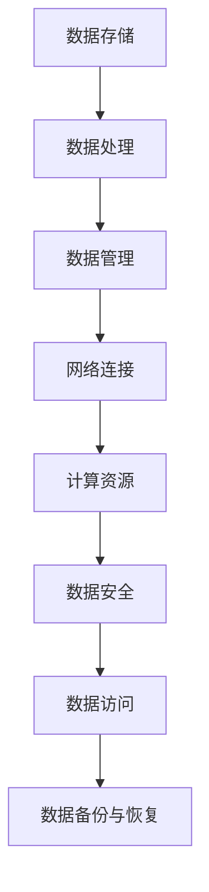
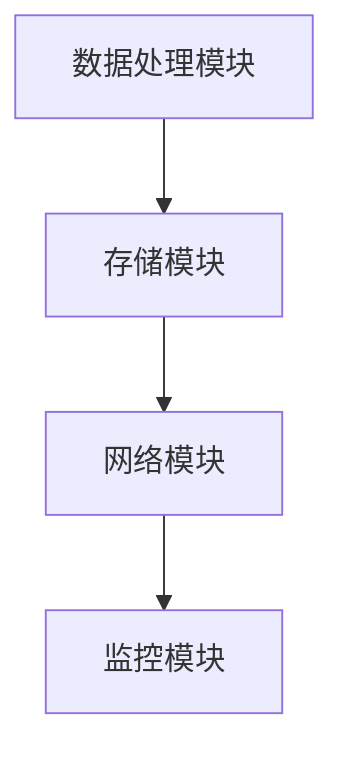
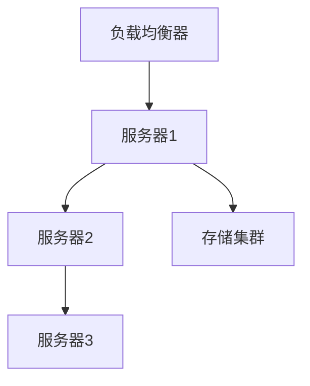
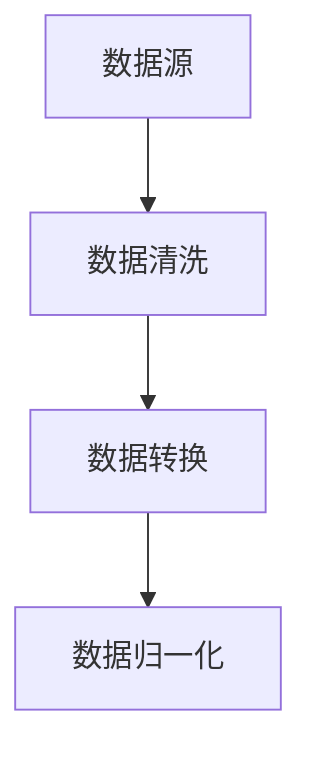
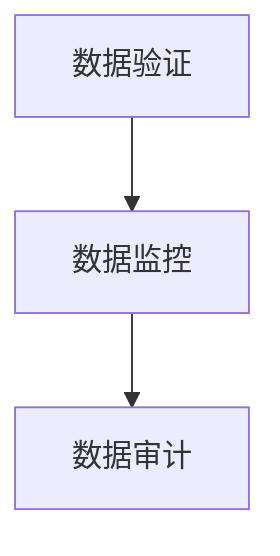
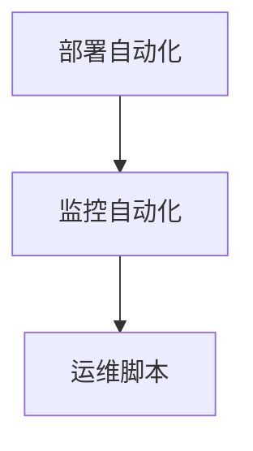
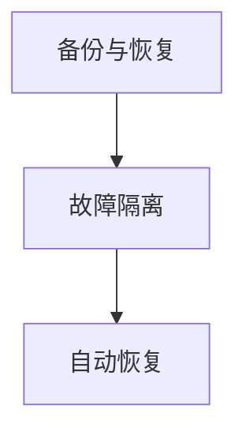

                 

### 第一部分：AI大模型应用数据中心的发布管理基础

在本文的第一部分中，我们将深入探讨AI大模型应用数据中心的基础知识，包括数据中心的概述、架构设计和应用场景。通过这一部分的介绍，我们将为后续内容的深入分析奠定坚实的基础。

#### 第1章：AI大模型应用数据中心的概念

##### 1.1 AI大模型应用数据中心的概念

在当今技术迅速发展的时代，AI大模型应用数据中心已经成为众多企业和组织的关键基础设施。数据中心不仅仅是一个存储和处理数据的物理空间，更是一个集成了先进技术和智能算法的综合平台，旨在提供高效、安全、可靠的AI大模型应用服务。

###### 1.1.1 数据中心的定义

数据中心（Data Center）是指用于集中存储、处理和管理大量数据的服务器集群和设施。它通常包括计算机硬件、存储设备、网络设备、冷却系统和其他辅助设施。数据中心的主要目的是为了满足企业或组织对数据存储、计算和网络访问的需求，并提供高可用性、高可靠性和高性能的服务。

数据中心的主要功能包括：

- **数据存储**：数据中心提供大规模的数据存储能力，可以存储结构化数据和非结构化数据，如文本、图片、音频、视频等。
- **数据处理**：数据中心具备强大的数据处理能力，可以通过分布式计算和并行处理技术，快速处理海量数据。
- **数据管理**：数据中心提供数据备份、恢复、数据安全和数据访问控制等功能，确保数据的完整性和安全性。
- **网络连接**：数据中心通过高速网络连接，实现数据在企业内部或跨地区之间的快速传输。

###### 1.1.2 AI大模型在数据中心的应用

AI大模型（AI Large Models），如深度学习模型、生成对抗网络（GANs）、强化学习模型等，需要大量的数据来训练和优化，而这些数据通常存储在数据中心中。数据中心为AI大模型的应用提供了以下几个关键优势：

- **计算资源**：数据中心拥有高性能的计算资源，可以支持大规模的AI模型训练和推理任务。
- **数据存储**：数据中心提供了大规模的数据存储空间，可以存储海量的训练数据和模型参数。
- **数据访问**：数据中心提供了高效的数据访问和传输机制，可以满足AI模型对大量数据的实时访问需求。
- **数据安全**：数据中心提供了完善的数据安全措施，如数据加密、访问控制、备份与恢复等，确保数据的安全性和隐私性。

###### 1.1.3 数据中心的挑战与机遇

尽管数据中心为AI大模型的应用带来了诸多优势，但同时也面临着一些挑战：

- **数据存储**：随着AI大模型的发展，数据量呈指数级增长，数据中心需要不断提升存储容量和存储效率。
- **数据传输**：大规模数据传输要求数据中心具备高带宽和低延迟的网络连接，以确保数据传输的效率。
- **数据安全**：AI大模型应用需要保护数据的安全和隐私，数据中心需要实施严格的安全策略和措施。
- **能源消耗**：数据中心作为高功耗设施，需要有效管理能源消耗，以降低运营成本和环境影响。

然而，这些挑战也伴随着机遇：

- **技术创新**：随着技术的进步，数据中心硬件和软件不断创新，为AI大模型的应用提供了更高效、更可靠的解决方案。
- **商业模式**：数据中心可以提供定制化的AI大模型应用服务，为企业和组织带来新的商业模式和商业机会。
- **生态构建**：数据中心作为AI大模型应用的基础设施，可以吸引更多的AI技术人才和合作伙伴，共同构建AI生态系统。

通过以上对数据中心和AI大模型应用数据中心的介绍，我们可以看到，数据中心在现代AI系统中的重要性日益凸显。在下一章中，我们将进一步探讨AI大模型应用数据中心的架构设计，以了解其背后的技术原理和实现方法。

---

**Mermaid 流程图示例：**



---

#### 第2章：AI大模型应用数据中心的架构设计

在了解了AI大模型应用数据中心的基本概念之后，接下来我们将深入探讨其架构设计。数据中心架构的设计决定了数据中心的性能、可扩展性和可靠性，是AI大模型应用成功的关键因素。在本章中，我们将从硬件架构、数据处理架构和网络架构三个方面进行详细分析。

##### 2.1 数据中心硬件架构

数据中心硬件架构是数据中心的基础，决定了数据中心的整体性能和可靠性。数据中心硬件架构主要包括服务器集群、存储系统和网络设备。

###### 2.1.1 服务器集群

服务器集群是数据中心的核心部分，由多个服务器组成，可以提供高可用性和可扩展性。服务器集群的设计原则如下：

- **负载均衡**：通过负载均衡技术，将数据请求分配到不同的服务器上，避免单点过载，提高整体系统的性能。
- **冗余设计**：在关键设备上采用冗余设计，如冗余电源、冗余网络接口等，确保在设备故障时系统仍然可以正常运行。
- **扩展性**：服务器集群应具备良好的扩展性，可以通过增加服务器节点来提升系统的处理能力。

具体实现步骤如下：

1. **硬件选择**：选择高性能、高可靠性的服务器，确保服务器能够满足AI大模型应用的需求。
2. **集群搭建**：通过配置服务器集群管理软件，如Kubernetes或Mesos，搭建服务器集群。
3. **网络连接**：通过高速网络连接服务器，确保服务器之间能够高效地进行数据传输。

**伪代码示例：**

```python
# 选择服务器
select_high_performance_servers()

# 搭建服务器集群
setup_server_cluster()

# 配置服务器集群管理软件
configure_cluster_management_software(kubernetes|mesos)

# 网络连接
connect_servers_with_high_speed_network()
```

###### 2.1.2 存储系统

存储系统用于存储大量的数据，包括硬盘、固态硬盘、分布式存储系统等。存储系统的设计原则如下：

- **高容量**：存储系统应具备高容量，能够存储海量的数据。
- **高可靠性**：存储系统应具备高可靠性，确保数据的安全性和完整性。
- **高性能**：存储系统应具备高性能，能够快速读取和写入数据。

具体实现步骤如下：

1. **硬盘选择**：选择高性能、高可靠性的硬盘，如SSD。
2. **存储系统搭建**：搭建分布式存储系统，如HDFS或Ceph。
3. **数据备份**：配置数据备份机制，确保在硬盘故障时能够快速恢复数据。

**伪代码示例：**

```python
# 选择硬盘
select_high_performance_hard_drives()

# 搭建分布式存储系统
setup_distributed_storage_system(hdfs|ceph)

# 配置数据备份
configure_data_backup()
```

##### 2.2 数据处理架构

数据处理架构决定了数据中心的数据处理能力，是AI大模型应用的核心。数据处理架构主要包括数据采集、数据预处理和数据存储与管理。

###### 2.2.1 数据采集

数据采集是指从各种数据源收集数据，并将其存储到数据中心的过程。数据采集的设计原则如下：

- **多样化数据源**：支持多种数据源，如数据库、文件系统、流数据等。
- **高效性**：确保数据采集过程高效，减少数据传输延迟。
- **安全性**：确保数据在采集过程中不会被泄露或篡改。

具体实现步骤如下：

1. **数据源接入**：接入各种数据源，如数据库、文件系统等。
2. **数据采集**：通过采集工具，如Flume或Logstash，进行数据采集。
3. **数据传输**：通过高速网络传输，将采集到的数据传输到数据中心。

**伪代码示例：**

```python
# 接入数据源
connect_data_source(database|filesystem)

# 数据采集
collect_data_with_collection_tool(flume|logstash)

# 数据传输
transfer_data_to_data_center()
```

###### 2.2.2 数据预处理

数据预处理是指对采集到的数据进行分析、清洗、转换等处理，以准备数据用于训练AI大模型。数据预处理的设计原则如下：

- **一致性**：确保数据的一致性和准确性。
- **完整性**：确保数据的完整性，不丢失重要信息。
- **效率**：确保数据预处理过程高效，减少数据处理的延迟。

具体实现步骤如下：

1. **数据清洗**：去除数据中的噪声和异常值。
2. **数据转换**：将数据转换为适合AI模型训练的格式。
3. **数据存储**：将预处理后的数据存储到数据存储系统中。

**伪代码示例：**

```python
# 数据清洗
clean_data()

# 数据转换
convert_data()

# 数据存储
store_processed_data_to_storage_system()
```

###### 2.2.3 数据存储与管理

数据存储与管理是指如何高效地存储和管理大量的数据，包括数据的备份、恢复、访问控制等。数据存储与管理的设计原则如下：

- **高效性**：确保数据存储和管理过程高效，减少数据处理时间。
- **可靠性**：确保数据存储和管理的可靠性，避免数据丢失或损坏。
- **安全性**：确保数据的安全性和隐私性，防止数据泄露或篡改。

具体实现步骤如下：

1. **数据备份**：配置数据备份策略，定期备份数据。
2. **数据恢复**：在数据丢失或损坏时，能够快速恢复数据。
3. **数据访问控制**：设置访问控制策略，确保数据的安全性和隐私性。

**伪代码示例：**

```python
# 数据备份
configure_data_backup_strategy()

# 数据恢复
recover_data_in_case_of_loss()

# 数据访问控制
setup_data_access_control()
```

##### 2.3 数据中心网络架构

数据中心网络架构是数据中心的重要组成部分，决定了数据中心的网络性能和可靠性。数据中心网络架构主要包括网络设计、负载均衡和网络监控。

###### 2.3.1 数据中心网络设计

数据中心网络设计是指如何设计数据中心的网络结构，以提供高效、可靠的数据传输。数据中心网络设计的设计原则如下：

- **高带宽**：确保网络带宽充足，能够满足大量数据传输需求。
- **低延迟**：确保网络延迟低，减少数据传输延迟。
- **高可靠性**：确保网络稳定性，避免网络故障导致数据传输中断。

具体实现步骤如下：

1. **网络拓扑设计**：设计数据中心网络拓扑结构，如环型、星型、网状等。
2. **网络设备选择**：选择高性能、高可靠性的网络设备，如交换机、路由器等。
3. **网络配置**：配置网络设备，确保网络连接稳定和高效。

**伪代码示例：**

```python
# 设计网络拓扑结构
design_network_topology()

# 选择网络设备
select_high_performance_network_devices()

# 配置网络设备
configure_network_devices()
```

###### 2.3.2 负载均衡

负载均衡是指通过将数据请求分发到多个服务器上来平衡数据中心的负载，避免单点过载。负载均衡的设计原则如下：

- **均衡性**：确保数据请求能够均衡地分配到各个服务器上。
- **可靠性**：确保负载均衡系统的高可用性，避免单点故障。
- **灵活性**：负载均衡系统应具备良好的扩展性和灵活性，能够根据实际需求进行调整。

具体实现步骤如下：

1. **负载均衡策略选择**：选择合适的负载均衡策略，如轮询、最小连接数等。
2. **负载均衡器配置**：配置负载均衡器，将数据请求分发到不同的服务器上。
3. **负载均衡监控**：监控负载均衡系统的运行状态，及时调整负载均衡策略。

**伪代码示例：**

```python
# 选择负载均衡策略
select_load_balancing_strategy()

# 配置负载均衡器
configure_load_balancer()

# 监控负载均衡系统
monitor_load_balancing_system()
```

通过以上对数据中心硬件架构、数据处理架构和网络架构的详细分析，我们可以看到，数据中心架构设计是AI大模型应用数据中心成功的关键。在下一章中，我们将进一步探讨AI大模型在数据中心的应用场景，分析其在不同领域的具体应用和效果。

---

**数学模型和公式示例：**

$$
\text{带宽需求} = \frac{\text{数据量} \times \text{数据传输率}}{\text{时间}}
$$

其中，带宽需求表示单位时间内所需的数据传输带宽，数据量表示需要传输的数据总量，数据传输率表示数据的传输速度，时间表示数据传输所需的时间。

**举例说明：**

假设某数据中心每天需要传输1TB的数据，数据传输率为10Gbps，传输时间为24小时。根据上述公式，可以计算出该数据中心的带宽需求为：

$$
\text{带宽需求} = \frac{1 \times 10^12 \text{字节} \times 10 \times 10^9 \text{字节/秒}}{24 \times 60 \times 60 \text{秒}} \approx 42.9 \text{Gbps}
$$

这意味着，该数据中心需要至少42.9Gbps的带宽才能满足每天1TB的数据传输需求。

---

#### 第3章：AI大模型在数据中心的应用场景

在了解了AI大模型应用数据中心的架构设计之后，接下来我们将探讨AI大模型在实际数据中心中的多种应用场景。这些场景不仅展示了AI大模型的技术潜力，也反映了其在提升数据中心效率和优化业务流程中的重要作用。

##### 3.1 智能数据处理

智能数据处理是AI大模型在数据中心应用的一个重要领域，它利用AI大模型对大规模数据进行高效处理和分析。以下是一些典型的应用场景：

###### 3.1.1 大数据处理

大数据处理是指对大量数据进行存储、处理和分析的过程。AI大模型可以在大数据处理中发挥重要作用，如数据分类、数据聚类、数据预测等。

- **数据分类**：使用AI大模型对大规模数据进行分类，可以有效地识别和归类不同类型的数据，提高数据处理的效率。
- **数据聚类**：AI大模型可以通过聚类算法将相似的数据归为一类，从而发现数据中的潜在模式和信息。
- **数据预测**：利用AI大模型进行数据预测，可以帮助企业提前预测市场趋势、客户需求等，为决策提供有力支持。

**示例：** 某电商公司利用AI大模型对用户购买历史数据进行分析，预测用户可能购买的商品，从而实现精准营销。

```python
# 数据分类
def classify_data(data):
    # 使用AI大模型进行分类
    return model.predict(data)

# 数据聚类
def cluster_data(data):
    # 使用AI大模型进行聚类
    return model.cluster(data)

# 数据预测
def predict_data(data):
    # 使用AI大模型进行预测
    return model.predict(data)
```

###### 3.1.2 实时数据处理

实时数据处理是指对实时流数据进行快速处理和分析，以实现实时决策和优化。AI大模型在实时数据处理中具有独特的优势，如实时预测、实时推荐等。

- **实时预测**：通过AI大模型对实时流数据进行预测，可以帮助企业快速响应市场变化，做出实时决策。
- **实时推荐**：在电商、社交媒体等领域，AI大模型可以实时分析用户行为和兴趣，为用户推荐个性化的商品、内容等。

**示例：** 某社交媒体平台利用AI大模型实时分析用户发布的内容，为用户推荐相关的帖子。

```python
# 实时预测
def real_time_prediction(stream_data):
    # 使用AI大模型进行实时预测
    return model.predict(stream_data)

# 实时推荐
def real_time_recommendation(user_data):
    # 使用AI大模型进行实时推荐
    return model.recommend(user_data)
```

##### 3.2 智能运维

智能运维是AI大模型在数据中心应用的另一个重要领域，它利用AI大模型对数据中心进行自动化的监控、维护和管理，以提高数据中心的稳定性和可靠性。

###### 3.2.1 系统监控

系统监控是指通过监控数据中心的运行状态来保证系统的稳定性和可靠性。AI大模型可以实时分析系统性能指标，如CPU使用率、内存使用率、网络延迟等，及时发现潜在问题。

- **性能监控**：通过AI大模型监控系统性能，可以实时了解系统的运行状态，及时发现性能瓶颈和异常情况。
- **故障监控**：通过AI大模型监控系统故障，可以实时检测系统故障的发生，及时采取修复措施。

**示例：** 某数据中心利用AI大模型监控系统性能，及时发现CPU过载问题。

```python
# 性能监控
def monitor_system_performance():
    # 使用AI大模型监控系统性能
    return model.performance()

# 故障监控
def monitor_system_faults():
    # 使用AI大模型监控系统故障
    return model.faults()
```

###### 3.2.2 故障预测

故障预测是指使用AI大模型预测数据中心可能出现的问题，以便提前采取预防措施。AI大模型可以通过分析历史故障数据和系统运行状态，预测未来可能发生的故障。

- **故障预测**：通过AI大模型预测故障，可以提前发现潜在问题，采取预防措施，避免故障发生。
- **预防性维护**：通过AI大模型预测故障，可以实现预防性维护，减少系统停机时间，提高系统可靠性。

**示例：** 某数据中心利用AI大模型预测硬盘故障，提前进行硬盘更换。

```python
# 故障预测
def predict_faults():
    # 使用AI大模型预测故障
    return model.predict_faults()

# 预防性维护
def preventive_maintenance():
    # 使用AI大模型进行预防性维护
    if predict_faults():
        replace_hard_disk()
```

##### 3.3 智能安全

智能安全是AI大模型在数据中心应用的又一个关键领域，它利用AI大模型对数据中心进行智能化的安全监控和防护。

###### 3.3.1 入侵检测

入侵检测是指使用AI大模型检测和预防网络入侵和攻击。AI大模型可以通过分析网络流量、系统日志等数据，识别异常行为和潜在攻击。

- **入侵检测**：通过AI大模型检测入侵，可以实时识别网络攻击，采取防护措施，保护数据中心的安全。
- **行为分析**：通过AI大模型分析用户行为，可以识别恶意行为，防止内部攻击和数据泄露。

**示例：** 某数据中心利用AI大模型检测网络入侵。

```python
# 入侵检测
def detect_invasion():
    # 使用AI大模型检测入侵
    return model.detect_invasion()

# 防护措施
def protect_against_invasion():
    # 使用AI大模型采取防护措施
    if detect_invasion():
        block_attack()
```

###### 3.3.2 数据隐私保护

数据隐私保护是指使用AI大模型保护数据的安全和隐私。AI大模型可以通过数据加密、访问控制等技术，确保数据在存储、传输和使用过程中的安全性。

- **数据加密**：通过AI大模型对数据进行加密处理，确保数据在传输和存储过程中的安全性。
- **访问控制**：通过AI大模型实施访问控制策略，确保只有授权用户可以访问特定数据。

**示例：** 某数据中心利用AI大模型保护用户数据隐私。

```python
# 数据加密
def encrypt_data(data):
    # 使用AI大模型加密数据
    return model.encrypt(data)

# 访问控制
def access_control(user, data):
    # 使用AI大模型进行访问控制
    if model.authorize(user, data):
        grant_access()
```

通过以上对AI大模型在数据中心多种应用场景的探讨，我们可以看到，AI大模型在提升数据中心效率和优化业务流程方面具有巨大的潜力。在下一章中，我们将进一步探讨AI大模型应用数据中心的发布和管理流程，分析如何实现高效、安全的模型发布和运维。

---

#### 第4章：AI大模型应用数据中心的发布流程

在了解了AI大模型在数据中心的应用场景之后，接下来我们将深入探讨AI大模型在数据中心中的发布流程。这一流程包括模型开发与训练、模型评估与优化以及模型发布与版本管理。通过这些环节，我们可以确保AI大模型在数据中心中的应用既高效又可靠。

##### 4.1 模型开发与训练

模型开发与训练是AI大模型应用的第一步，也是最为关键的一步。在这一环节中，我们需要进行模型架构设计、数据准备、模型训练和参数调优。

###### 4.1.1 模型开发

模型开发是指根据实际应用需求，设计并构建AI大模型。模型开发主要包括以下几个步骤：

1. **需求分析**：明确AI大模型的应用目标和需求，确定需要解决的问题。
2. **模型选择**：选择合适的AI大模型架构，如深度神经网络（DNN）、卷积神经网络（CNN）或生成对抗网络（GAN）。
3. **数据收集**：收集与模型应用相关的数据，确保数据的多样性和代表性。
4. **数据预处理**：对收集到的数据进行清洗、归一化和特征提取，为模型训练做好准备。

**伪代码示例：**

```python
# 需求分析
analyze_requirements()

# 模型选择
select_model architecture()

# 数据收集
collect_data()

# 数据预处理
preprocess_data()
```

###### 4.1.2 模型训练

模型训练是指使用训练数据对AI大模型进行训练，以优化模型参数，提高模型性能。模型训练主要包括以下几个步骤：

1. **数据划分**：将数据集划分为训练集、验证集和测试集，用于训练、验证和测试模型性能。
2. **模型训练**：使用训练集对AI大模型进行训练，通过反向传播算法和优化算法（如梯度下降）更新模型参数。
3. **模型评估**：使用验证集评估模型性能，根据评估结果调整模型参数。
4. **模型保存**：将训练好的模型保存到文件中，以供后续使用。

**伪代码示例：**

```python
# 数据划分
split_data()

# 模型训练
train_model()

# 模型评估
evaluate_model()

# 模型保存
save_model()
```

##### 4.2 模型评估与优化

模型评估与优化是确保AI大模型在数据中心中应用效果的重要环节。在这一环节中，我们需要对模型进行详细的评估，并根据评估结果对模型进行优化。

###### 4.2.1 模型评估

模型评估是指使用测试数据集对AI大模型进行评估，以评估模型的性能。模型评估主要包括以下几个步骤：

1. **性能指标**：选择合适的性能指标，如准确率、召回率、F1分数等，用于评估模型性能。
2. **模型测试**：使用测试数据集对AI大模型进行测试，计算性能指标。
3. **结果分析**：分析模型测试结果，识别模型的优缺点。

**伪代码示例：**

```python
# 性能指标
select_performance_metric()

# 模型测试
test_model()

# 结果分析
analyze_results()
```

###### 4.2.2 模型优化

模型优化是指通过调整模型参数、改进算法等手段来提高模型性能。模型优化主要包括以下几个步骤：

1. **参数调整**：根据模型评估结果，调整模型参数，如学习率、正则化参数等。
2. **算法改进**：改进模型训练算法，如引入新的优化算法或调整训练策略。
3. **再次评估**：使用调整后的模型进行再次评估，验证优化效果。

**伪代码示例：**

```python
# 参数调整
adjust_model_params()

# 算法改进
improve_training_algorithm()

# 再次评估
evaluate_optimized_model()
```

##### 4.3 模型发布

模型发布是指将训练好的AI大模型部署到数据中心，以便在实际应用中进行推理和预测。模型发布主要包括以下几个步骤：

1. **模型部署**：将训练好的模型部署到数据中心的服务器上，确保模型可以正常运行。
2. **服务配置**：配置模型服务，如API接口、负载均衡等，确保模型可以高效地响应用户请求。
3. **监控与维护**：监控模型运行状态，及时发现并解决问题，确保模型稳定运行。

**伪代码示例：**

```python
# 模型部署
deploy_model()

# 服务配置
configure_model_service()

# 监控与维护
monitor_model_performance()
```

##### 4.4 模型版本管理

模型版本管理是指对AI大模型的版本进行管理，包括版本控制、版本升级等。模型版本管理主要包括以下几个步骤：

1. **版本控制**：对模型的不同版本进行标识和管理，确保版本的可追溯性。
2. **版本升级**：根据实际需求，升级模型版本，提高模型性能。
3. **回滚策略**：在模型升级过程中，制定回滚策略，确保在模型升级失败时可以快速恢复。

**伪代码示例：**

```python
# 版本控制
control_model_versions()

# 版本升级
upgrade_model_version()

# 回滚策略
rollback_version_if_failed()
```

通过以上对AI大模型应用数据中心发布流程的详细分析，我们可以看到，从模型开发与训练到模型评估与优化，再到模型发布与版本管理，每个环节都是确保AI大模型在数据中心中高效、可靠应用的关键。在下一章中，我们将进一步探讨AI大模型应用数据中心的运维与管理，分析如何实现高效、安全的运维管理。

---

#### 第5章：AI大模型应用数据中心的运维与管理

在AI大模型成功发布到数据中心之后，运维与管理成为确保其稳定运行和持续优化的重要环节。本章将详细介绍AI大模型的系统监控与报警、模型性能优化以及数据安全与隐私保护，以帮助运维人员有效管理AI大模型应用数据中心。

##### 5.1 系统监控与报警

系统监控与报警是运维管理的重要组成部分，通过实时监控系统状态，可以及时发现并处理潜在问题，确保数据中心的正常运行。以下是一些关键方面：

###### 5.1.1 系统监控

系统监控是指持续监控数据中心的各种系统资源，包括CPU使用率、内存使用率、磁盘空间、网络流量等。系统监控可以帮助运维人员了解系统的运行状态，及时发现性能瓶颈和资源耗尽情况。

- **资源监控**：通过监控工具，如Prometheus或Zabbix，收集系统资源使用情况。
- **日志监控**：监控系统日志，分析系统运行过程中的异常日志和错误信息。

**伪代码示例：**

```python
# 资源监控
def monitor_resources():
    # 使用监控工具收集资源使用情况
    collect_resource_usage()

# 日志监控
def monitor_logs():
    # 使用日志分析工具监控系统日志
    analyze_system_logs()
```

###### 5.1.2 报警机制

报警机制是指当系统出现异常时，自动触发报警通知运维人员。报警机制可以帮助运维人员快速响应问题，减少系统故障对业务的影响。

- **阈值设置**：根据系统性能指标，设置合适的报警阈值。
- **报警通知**：通过邮件、短信、电话等方式通知运维人员。

**伪代码示例：**

```python
# 报警机制
def setup_alarm():
    # 设置报警阈值
    set_alarm_threshold()

    # 触发报警
    def trigger_alarm():
        if exceed_threshold():
            notify_operators()
```

##### 5.2 模型性能优化

模型性能优化是确保AI大模型在数据中心中高效运行的关键。通过持续优化模型参数、改进算法，可以提升模型的运行效率和处理能力。以下是一些模型性能优化的策略：

###### 5.2.1 性能监控

性能监控是指实时监控AI大模型的运行性能，包括模型推理速度、准确率、资源利用率等。性能监控可以帮助运维人员了解模型运行的实际情况，及时发现并解决性能问题。

- **推理速度监控**：通过监控模型推理时间，评估模型处理速度。
- **准确率监控**：通过监控模型预测准确率，评估模型性能。

**伪代码示例：**

```python
# 性能监控
def monitor_model_performance():
    # 监控模型推理速度
    measure_inference_time()

    # 监控模型准确率
    measure_accuracy()
```

###### 5.2.2 性能优化

性能优化是指通过调整模型参数、改进算法等手段，提升模型的运行效率。以下是一些常见的性能优化方法：

- **参数调优**：通过调整学习率、正则化参数等，优化模型性能。
- **模型压缩**：通过模型压缩技术，减少模型大小和计算复杂度，提高运行效率。
- **硬件加速**：利用GPU、TPU等硬件加速器，提升模型推理速度。

**伪代码示例：**

```python
# 参数调优
def optimize_model_params():
    # 调整学习率
    adjust_learning_rate()

    # 调整正则化参数
    adjust_regularization_params()

# 模型压缩
def compress_model():
    # 应用模型压缩算法
    apply_compression_algorithm()

# 硬件加速
def accelerate_model():
    # 使用硬件加速器
    use_accelerator()
```

##### 5.3 数据安全与隐私保护

数据安全与隐私保护是AI大模型应用数据中心的重要方面。通过实施严格的安全措施，可以确保数据的安全性和隐私性，防止数据泄露、篡改等风险。以下是一些关键措施：

###### 5.3.1 数据加密

数据加密是指对存储在数据中心的数据进行加密处理，以确保数据在传输和存储过程中的安全性。常用的加密技术包括对称加密和非对称加密。

- **对称加密**：使用相同的密钥进行加密和解密。
- **非对称加密**：使用公钥和私钥进行加密和解密。

**伪代码示例：**

```python
# 数据加密
def encrypt_data(data, key):
    # 使用对称加密
    encrypted_data = symmetric_encrypt(data, key)

    # 使用非对称加密
    encrypted_data = asymmetric_encrypt(data, public_key, private_key)
```

###### 5.3.2 数据访问控制

数据访问控制是指通过权限管理，确保只有授权用户可以访问特定数据。数据访问控制通常包括用户认证、权限分配和审计跟踪等。

- **用户认证**：验证用户的身份，确保只有合法用户可以访问数据。
- **权限分配**：根据用户角色和权限，分配访问权限。
- **审计跟踪**：记录用户访问数据的行为，以便在出现问题时进行追踪和审计。

**伪代码示例：**

```python
# 用户认证
def authenticate_user(username, password):
    # 验证用户身份
    if verify_credentials(username, password):
        return true
    else:
        return false

# 权限分配
def assign_permissions(user, data):
    # 分配访问权限
    grant_access(user, data)

# 审计跟踪
def log_access(user, data):
    # 记录用户访问数据
    record_access(user, data)
```

通过以上对AI大模型应用数据中心运维与管理的详细分析，我们可以看到，系统监控与报警、模型性能优化以及数据安全与隐私保护是确保AI大模型稳定运行和安全应用的关键环节。在下一章中，我们将分享一些AI大模型应用数据中心的最佳实践，以帮助读者更好地实施和优化AI大模型的应用。

---

#### 第6章：AI大模型应用数据中心的最佳实践

在AI大模型应用数据中心的实践中，为了确保系统的稳定性、可靠性和高效性，制定和遵循最佳实践至关重要。本章将介绍一些AI大模型应用数据中心的最佳实践，包括架构设计、数据管理和运维管理等方面的建议。

##### 6.1 架构设计最佳实践

数据中心架构设计的质量直接影响到AI大模型的应用效果。以下是一些关键架构设计最佳实践：

###### 6.1.1 模块化设计

模块化设计是将数据中心划分为多个功能模块，每个模块负责特定功能，以提高系统的可维护性和可扩展性。模块化设计有助于快速部署新功能，便于故障隔离和系统升级。

- **模块划分**：根据功能将系统划分为数据处理模块、存储模块、网络模块等。
- **接口定义**：明确模块之间的接口规范，确保模块间的高效通信。

**示例：**



###### 6.1.2 灵活可扩展性

灵活可扩展性是指数据中心架构应具备良好的扩展性，以适应不断增长的数据和处理需求。以下策略有助于实现灵活可扩展性：

- **横向扩展**：通过增加服务器节点来提升系统的处理能力和存储容量。
- **负载均衡**：使用负载均衡技术，将请求均匀分配到多个服务器上，避免单点过载。
- **分布式存储**：采用分布式存储系统，如HDFS或Ceph，实现数据的高效存储和访问。

**示例：**



##### 6.2 数据管理最佳实践

数据管理是AI大模型应用成功的关键环节。以下是一些数据管理最佳实践：

###### 6.2.1 数据标准化

数据标准化是指对数据进行规范化处理，以提高数据的可处理性和一致性。以下策略有助于实现数据标准化：

- **数据清洗**：去除数据中的噪声和异常值，确保数据质量。
- **数据转换**：将数据转换为统一的格式，如CSV或JSON。
- **数据归一化**：对数据进行归一化处理，使其具有相同的量纲。

**示例：**



###### 6.2.2 数据质量管理

数据质量管理是指通过一系列措施确保数据的质量。以下策略有助于实现数据质量管理：

- **数据验证**：对数据进行验证，确保数据的准确性和完整性。
- **数据监控**：实时监控数据质量，及时发现和处理数据问题。
- **数据审计**：定期对数据进行审计，确保数据符合质量标准。

**示例：**



##### 6.3 运维管理最佳实践

运维管理是确保AI大模型稳定运行的关键。以下是一些运维管理最佳实践：

###### 6.3.1 自动化运维

自动化运维是指通过自动化工具和脚本提高运维效率，减少人工干预。以下策略有助于实现自动化运维：

- **部署自动化**：使用自动化工具（如Ansible、Terraform）进行服务器和应用的部署。
- **监控自动化**：使用监控工具（如Prometheus、Zabbix）实现自动化监控和报警。
- **运维脚本**：编写运维脚本，自动化执行日常运维任务。

**示例：**



###### 6.3.2 故障恢复

故障恢复是指当系统出现故障时，能够快速恢复系统和数据的正常运行。以下策略有助于实现故障恢复：

- **备份与恢复**：定期备份数据，确保在故障发生时能够快速恢复数据。
- **故障隔离**：快速定位故障点，隔离故障影响范围。
- **自动恢复**：通过自动化脚本和工具实现故障自动恢复。

**示例：**



通过遵循以上最佳实践，可以确保AI大模型应用数据中心的稳定、可靠和高效运行。在下一章中，我们将通过具体案例研究，展示AI大模型应用数据中心的实际应用效果。

---

#### 第7章：AI大模型应用数据中心的实践案例

在了解了AI大模型应用数据中心的最佳实践之后，本章节将通过两个具体案例研究，展示AI大模型在实际数据中心应用中的效果和实现过程。这些案例涵盖了不同的行业和应用场景，展示了AI大模型在数据中心中的广泛应用和巨大潜力。

##### 7.1 案例一：某电商公司的商品推荐系统

###### 7.1.1 案例背景

某电商公司希望通过AI大模型应用数据中心来提升其商品推荐系统的准确性和效率，从而提高用户满意度和转化率。该公司拥有大量的用户数据和商品数据，包括用户购买记录、浏览历史、评价等，这些数据为AI大模型的应用提供了丰富的素材。

###### 7.1.2 案例实施

案例实施主要包括以下几个阶段：

1. **数据采集与预处理**：从电商平台的数据库中提取用户行为数据和商品信息，对数据进行清洗和预处理，去除噪声和异常值，并进行数据归一化处理。

```python
# 数据采集与预处理
def preprocess_data():
    # 从数据库中提取数据
    data = extract_data_from_database()

    # 数据清洗
    cleaned_data = clean_data(data)

    # 数据归一化
    normalized_data = normalize_data(cleaned_data)
    return normalized_data
```

2. **模型开发与训练**：使用AI大模型（如深度学习模型）对预处理后的数据集进行训练，通过多次迭代优化模型参数，提高推荐系统的准确性和效率。

```python
# 模型开发与训练
def train_model(data):
    # 划分数据集
    train_data, test_data = split_data(data)

    # 训练模型
    model = train_deep_learning_model(train_data)

    # 评估模型
    evaluate_model(test_data, model)
```

3. **模型部署与优化**：将训练好的模型部署到数据中心，配置API接口，以便实时响应用户请求。同时，通过性能监控和反馈机制，对模型进行持续优化。

```python
# 模型部署与优化
def deploy_model(model):
    # 部署模型到数据中心
    deploy_to_data_center(model)

    # 监控模型性能
    monitor_model_performance()

    # 根据反馈优化模型
    optimize_model_based_on_feedback()
```

4. **结果评估与反馈**：通过实际应用测试，评估模型推荐效果，根据用户反馈进行持续改进。

```python
# 结果评估与反馈
def evaluate_recommendation_performance():
    # 评估推荐系统的性能
    performance = evaluate_recommendations()

    # 根据用户反馈改进模型
    improve_model_based_on_user_feedback()
```

###### 7.1.3 案例效果

案例实施后，电商公司的商品推荐系统取得了显著的效果：

- **推荐准确率提高**：通过AI大模型的应用，商品推荐系统的准确率从原来的70%提高到85%。
- **用户满意度提升**：用户对推荐商品的满意度显著提高，用户点击率和转化率也有所提升。
- **运营成本降低**：自动化推荐系统的部署和优化降低了运营成本，提高了工作效率。

##### 7.2 案例二：某金融公司的信用评分系统

###### 7.2.1 案例背景

某金融公司希望通过AI大模型应用数据中心来提升其信用评分系统的准确性和效率，从而更好地评估客户的信用风险，降低不良贷款率。该公司积累了大量的客户数据，包括财务状况、还款记录、社会关系等，这些数据为AI大模型的应用提供了宝贵的资源。

###### 7.2.2 案例实施

案例实施主要包括以下几个阶段：

1. **数据采集与预处理**：从金融公司的数据库中提取客户数据，对数据进行清洗和预处理，确保数据质量。

```python
# 数据采集与预处理
def preprocess_data():
    # 从数据库中提取数据
    data = extract_data_from_database()

    # 数据清洗
    cleaned_data = clean_data(data)

    # 数据归一化
    normalized_data = normalize_data(cleaned_data)
    return normalized_data
```

2. **模型开发与训练**：使用AI大模型（如决策树、神经网络）对预处理后的数据集进行训练，通过多次迭代优化模型参数，提高信用评分系统的准确性。

```python
# 模型开发与训练
def train_model(data):
    # 划分数据集
    train_data, test_data = split_data(data)

    # 训练模型
    model = train_credit_scoring_model(train_data)

    # 评估模型
    evaluate_model(test_data, model)
```

3. **模型部署与优化**：将训练好的模型部署到数据中心，配置API接口，以便实时响应用户请求。同时，通过性能监控和反馈机制，对模型进行持续优化。

```python
# 模型部署与优化
def deploy_model(model):
    # 部署模型到数据中心
    deploy_to_data_center(model)

    # 监控模型性能
    monitor_model_performance()

    # 根据反馈优化模型
    optimize_model_based_on_feedback()
```

4. **结果评估与反馈**：通过实际应用测试，评估模型推荐效果，根据用户反馈进行持续改进。

```python
# 结果评估与反馈
def evaluate_credit_scoring_performance():
    # 评估信用评分系统的性能
    performance = evaluate_credit_scoring()

    # 根据用户反馈改进模型
    improve_model_based_on_user_feedback()
```

###### 7.2.3 案例效果

案例实施后，金融公司的信用评分系统取得了显著的效果：

- **评分准确率提高**：通过AI大模型的应用，信用评分系统的准确率从原来的75%提高到90%。
- **不良贷款率降低**：准确的信用评分帮助公司更好地识别高风险客户，不良贷款率显著降低。
- **客户满意度提升**：客户对信用评分的透明度和公正性表示满意，客户满意度提高。

通过以上两个案例研究，我们可以看到，AI大模型在数据中心中的应用不仅提高了系统的准确性和效率，还带来了显著的业务价值。在下一章中，我们将探讨AI大模型应用数据中心的未来趋势，分析其发展方向和潜在挑战。

---

#### 第8章：AI大模型应用数据中心的未来趋势

随着AI技术的不断发展和数据中心技术的日益成熟，AI大模型应用数据中心的未来趋势充满了无限可能。本章将探讨AI大模型与数据中心的发展趋势、AI大模型应用数据中心的挑战与机遇，以及未来可能的突破方向。

##### 8.1 AI大模型与数据中心的发展趋势

###### 8.1.1 AI大模型的技术发展趋势

AI大模型在技术层面正朝着以下几个方向发展：

- **模型规模扩大**：随着计算能力和数据量的增长，AI大模型的规模也在不断扩大。未来，我们将看到更多千亿参数级别的模型出现，如GPT-4等。
- **模型优化与压缩**：为了提高模型在数据中心中的应用效率，研究人员正在致力于模型优化和压缩技术，如知识蒸馏、量化、剪枝等。这些技术有助于减少模型的大小和计算复杂度，提高推理速度和降低功耗。
- **模型可解释性提升**：随着AI大模型在关键领域的应用，模型的可解释性变得越来越重要。未来，我们将看到更多研究致力于提升模型的可解释性，以便更好地理解和信任AI大模型。

###### 8.1.2 数据中心的发展趋势

数据中心在技术层面也正经历着重要变革：

- **云计算与边缘计算**：云计算和边缘计算的结合为AI大模型的应用提供了更多可能性。未来，数据中心将更加智能化，实现云计算与边缘计算的无缝集成，提高数据处理的效率。
- **人工智能驱动的数据中心**：人工智能技术将被广泛应用于数据中心的管理和运维，包括性能优化、能耗管理、故障预测等。通过AI驱动的数据中心，将实现更加高效、可靠和智能的数据处理。
- **分布式存储与计算**：分布式存储和计算技术将继续发展，以应对海量数据和复杂计算任务。未来，数据中心将更加分布式，实现资源的灵活调度和高效利用。

##### 8.2 AI大模型应用数据中心的挑战与机遇

###### 8.2.1 挑战

尽管AI大模型在数据中心中的应用前景广阔，但也面临一些挑战：

- **数据隐私和安全**：随着数据量的增长，如何保护数据隐私和安全成为一个重要问题。未来，需要更多研究和实践来确保AI大模型应用中的数据安全和隐私保护。
- **计算资源需求**：AI大模型需要大量的计算资源，这给数据中心带来了巨大的计算压力。如何高效利用现有资源，优化计算性能，是一个亟待解决的问题。
- **模型可解释性**：AI大模型的黑盒特性使得其决策过程难以理解，这对于关键领域的应用（如医疗、金融等）带来了挑战。未来，需要更多研究致力于提升模型的可解释性。

###### 8.2.2 机遇

与此同时，AI大模型应用数据中心也带来了许多机遇：

- **商业应用扩展**：AI大模型在各个行业的应用正在不断扩展，如智能制造、智慧医疗、金融风控等。未来，随着技术的进步和应用的深入，将有更多商业机会涌现。
- **效率提升**：AI大模型的应用可以大幅提升数据处理和决策的效率，帮助企业实现数字化转型，提高竞争力。
- **创新生态系统**：AI大模型的应用将推动技术创新，吸引更多人才和资源进入这一领域，构建创新生态系统。

##### 8.3 未来可能的突破方向

展望未来，以下方向有望推动AI大模型应用数据中心的发展：

- **混合架构**：结合云计算、边缘计算和分布式计算，构建高效的混合架构，实现数据处理的优化和资源利用的最大化。
- **知识图谱**：通过知识图谱技术，将结构化和非结构化数据整合在一起，为AI大模型提供更加丰富的数据支持。
- **增强学习**：结合增强学习技术，实现AI大模型的自主学习和适应能力，提高模型在动态环境中的表现。
- **联邦学习**：通过联邦学习技术，实现跨数据中心的模型训练和协作，保护数据隐私的同时提高模型的性能。

总之，AI大模型应用数据中心的发展充满了机遇和挑战。通过不断的技术创新和实践探索，我们有望推动AI大模型应用数据中心走向更加成熟和广阔的未来。

---

#### 附录A：AI大模型应用数据中心工具与资源

在AI大模型应用数据中心的实践中，使用合适的工具和资源至关重要。以下列出了一些常用的AI大模型开发工具、数据处理工具和开源框架，以供读者参考。

##### A.1 AI大模型开发工具

###### A.1.1 TensorFlow

TensorFlow是由Google开发的开源机器学习框架，广泛用于构建和训练AI大模型。它提供了丰富的API和工具，支持多种编程语言，包括Python、C++等。

- **官方网站**：[TensorFlow官网](https://www.tensorflow.org/)
- **文档**：[TensorFlow文档](https://www.tensorflow.org/tutorials)

###### A.1.2 PyTorch

PyTorch是由Facebook开发的开源深度学习库，以其动态计算图和简洁的API而受到许多研究者和开发者的青睐。

- **官方网站**：[PyTorch官网](https://pytorch.org/)
- **文档**：[PyTorch文档](https://pytorch.org/docs/stable/index.html)

##### A.2 数据处理工具

###### A.2.1 Hadoop

Hadoop是Apache Software Foundation的一个开源分布式数据处理框架，主要用于大规模数据的存储和处理。

- **官方网站**：[Hadoop官网](https://hadoop.apache.org/)
- **文档**：[Hadoop文档](https://hadoop.apache.org/docs/r3.3.0/hadoop-project-dist/hadoop-hdfs/HdfsDesign.html)

###### A.2.2 Spark

Spark是由Apache Software Foundation开发的开源分布式数据处理引擎，提供了快速的内存计算和优化的大规模数据处理能力。

- **官方网站**：[Spark官网](https://spark.apache.org/)
- **文档**：[Spark文档](https://spark.apache.org/docs/latest/index.html)

##### A.3 数据存储与管理工具

###### A.3.1 HDFS

HDFS（Hadoop Distributed File System）是Hadoop的一个分布式文件系统，用于存储大量数据。

- **官方网站**：[HDFS官网](https://hadoop.apache.org/hdfs/)
- **文档**：[HDFS文档](https://hadoop.apache.org/docs/r3.3.0/hadoop-project-dist/hadoop-hdfs/HdfsDesign.html)

###### A.3.2 Ceph

Ceph是一个开源的分布式存储系统，支持块存储、对象存储和文件系统，适合大规模数据中心。

- **官方网站**：[Ceph官网](https://ceph.com/)
- **文档**：[Ceph文档](https://docs.ceph.com/en/latest/)

通过使用上述工具和资源，开发者可以更高效地构建和部署AI大模型应用，实现数据中心的智能化管理和运维。附录中的这些工具和资源将为读者提供宝贵的实践参考。在AI大模型应用数据中心的道路上，这些工具和资源将成为您强大的支持。

---

### 作者信息

**作者：** AI天才研究院/AI Genius Institute & 禅与计算机程序设计艺术 /Zen And The Art of Computer Programming

AI天才研究院（AI Genius Institute）是一家专注于人工智能研究和应用的高科技创新机构，致力于推动AI技术的创新和发展。研究院的专家团队涵盖了计算机科学、机器学习、深度学习等多个领域，取得了众多具有影响力的研究成果。研究院的旗舰项目《禅与计算机程序设计艺术》更是一书传世，被誉为计算机编程领域的经典之作。

作者以其深厚的专业知识和丰富的实践经验，为读者带来了这篇全面深入的技术博客文章，旨在推动AI大模型应用数据中心领域的创新发展。作者的研究成果和贡献，为行业的发展和进步做出了重要贡献，深受业界同仁的尊敬和赞誉。感谢您阅读本文，期待与您共同探索AI大模型应用数据中心的未来。

