                 

# 《AI 大模型应用数据中心的品牌建设》

## 关键词
AI 大模型、数据中心、品牌建设、数据隐私、技术挑战、用户体验、效果评估、新兴技术

> 摘要：本文深入探讨了 AI 大模型在数据中心品牌建设中的应用与实践。首先，我们分析了品牌建设的核心概念和原则，然后详细介绍了 AI 大模型的基本原理及其在品牌建设中的重要性。接着，文章探讨了品牌定位与目标受众分析、品牌视觉设计、品牌传播策略以及 AI 大模型应用数据中心的构建。通过案例分析和项目管理实践，我们展示了 AI 大模型在品牌建设中的实际效果。最后，文章展望了品牌建设与 AI 大模型应用的未来发展趋势，提出了实践建议，以期为数据中心品牌建设提供有益的参考。

### 目录大纲

# 《AI 大模型应用数据中心的品牌建设》

## 第一部分：品牌建设基础理论

### 1. 品牌建设概述
#### 1.1 品牌的定义与价值
#### 1.2 品牌建设的重要性
#### 1.3 品牌建设的基本原则

### 2. AI 大模型与品牌建设
#### 2.1 AI 大模型简介
#### 2.2 AI 大模型在品牌建设中的应用
#### 2.3 AI 大模型品牌建设的特点与挑战

### 3. 品牌定位与目标受众
#### 3.1 品牌定位策略
#### 3.2 目标受众分析
#### 3.3 品牌价值主张

### 4. 品牌视觉设计
#### 4.1 品牌视觉设计原则
#### 4.2 品牌标志设计
#### 4.3 品牌色彩搭配
#### 4.4 品牌字体选择

### 5. 品牌传播策略
#### 5.1 品牌传播渠道
#### 5.2 品牌传播内容
#### 5.3 品牌传播效果评估

## 第二部分：AI 大模型应用实践

### 6. AI 大模型应用案例分析
#### 6.1 案例一：品牌形象重塑
#### 6.2 案例二：精准营销策略
#### 6.3 案例三：用户满意度提升

### 7. AI 大模型应用数据中心的构建
#### 7.1 数据中心建设目标
#### 7.2 数据中心架构设计
#### 7.3 数据处理与存储技术
#### 7.4 数据安全与隐私保护

### 8. AI 大模型应用项目管理
#### 8.1 项目管理流程
#### 8.2 风险管理策略
#### 8.3 成本控制与效益分析

### 9. AI 大模型应用效果评估
#### 9.1 评估指标体系
#### 9.2 评估方法与工具
#### 9.3 评估结果分析与改进措施

## 第三部分：品牌建设与AI大模型应用的未来发展

### 10. 品牌建设与AI大模型应用的融合发展
#### 10.1 新兴技术与品牌建设
#### 10.2 AI大模型应用的未来前景
#### 10.3 品牌建设与AI大模型应用的融合发展

### 11. 案例研究：全球领先企业的品牌建设实践
#### 11.1 谷歌：人工智能驱动的品牌建设
#### 11.2 亚马逊：智能推荐系统的品牌效应
#### 11.3 苹果：创新与品质塑造品牌

### 12. 结论与展望
#### 12.1 总结与反思
#### 12.2 未来研究方向
#### 12.3 品牌建设与AI大模型应用的实践建议

### 第1章 品牌建设概述

#### 1.1 品牌的定义与价值

品牌是一个复杂的概念，它不仅仅是一个标识或名称，更是一种认知和价值体系。在商业领域，品牌代表了企业的形象、文化和价值观。品牌的价值可以从多个维度进行衡量，主要包括识别价值、区分价值、信任价值和增值价值。

- **识别价值**：品牌作为产品或服务的标识，帮助消费者在众多竞争者中快速识别和选择。一个强大的品牌能够提升产品的知名度，增加市场份额。

- **区分价值**：品牌有助于消费者区分产品或服务的不同之处，从而在竞争激烈的市场中脱颖而出。品牌差异化策略可以通过独特的产品特性、服务或文化来体现。

- **信任价值**：品牌能够建立消费者对产品或服务的信任，减少消费者的购买风险。一个值得信赖的品牌可以提高消费者的购买意愿和忠诚度。

- **增值价值**：品牌能够提升产品或服务的附加值，使消费者愿意为其支付更高的价格。品牌效应能够显著提高企业的利润水平。

#### 1.2 品牌建设的重要性

品牌建设对于企业的长期发展具有至关重要的意义。以下是品牌建设的重要性：

- **提升企业竞争力**：一个强大的品牌可以在市场中建立竞争优势，吸引更多的客户和合作伙伴。品牌建设有助于企业在激烈的市场竞争中脱颖而出。

- **增强消费者忠诚度**：良好的品牌形象可以培养消费者的忠诚度，降低消费者的转换成本。稳定的客户群体是企业发展的重要基石。

- **提高企业价值**：品牌价值直接关联到企业的市值和投资吸引力。强大的品牌可以提升企业的市场价值，吸引更多的投资和资本。

- **优化营销策略**：品牌建设有助于企业制定更有效的营销策略，提高营销投入的回报率。通过品牌传播，企业可以更好地与消费者建立联系。

- **促进业务增长**：品牌建设可以推动企业的业务增长，扩大市场份额。强大的品牌可以吸引更多的客户，提升销售业绩。

#### 1.3 品牌建设的基本原则

成功的品牌建设需要遵循一些基本原则，这些原则指导企业在品牌建设的各个环节中保持一致性和创新性。以下是品牌建设的基本原则：

- **差异化**：明确品牌定位，凸显独特卖点。差异化策略可以帮助品牌在市场中脱颖而出，满足消费者的特定需求。

- **一致性**：品牌传播、品牌形象、品牌文化要保持一致性。一致性有助于建立品牌认知，提高品牌的可信度。

- **持续创新**：不断推陈出新，保持品牌活力。创新是品牌持续发展的动力，可以帮助企业适应市场变化。

- **用户至上**：关注用户体验，提升用户满意度。用户体验是品牌成功的关键因素，良好的用户体验可以培养品牌忠诚度。

- **社会责任**：承担社会责任，树立企业良好形象。社会责任感可以增强品牌的声誉，提高公众对品牌的认可度。

#### 1.4 品牌建设的核心概念与联系

为了更好地理解品牌建设，我们需要了解几个核心概念及其之间的联系。以下是品牌建设中的几个关键概念及其相互关系：

- **品牌形象**：品牌形象是消费者对品牌的整体认知和印象。它包括品牌的视觉元素、声音、口号等。

- **品牌定位**：品牌定位是品牌在市场中占据的独特位置。品牌定位决定了品牌如何与消费者沟通和互动。

- **品牌传播**：品牌传播是指通过各种渠道将品牌信息传递给目标受众的过程。品牌传播策略包括广告、公关、社交媒体等。

- **品牌文化**：品牌文化是品牌的核心价值观和行为准则。品牌文化塑造了品牌的性格和形象，影响了消费者的品牌体验。

- **品牌价值**：品牌价值是品牌所带来的经济价值。品牌价值体现在品牌的市场影响力、客户忠诚度、投资吸引力等方面。

以下是品牌建设核心概念的 Mermaid 流程图：

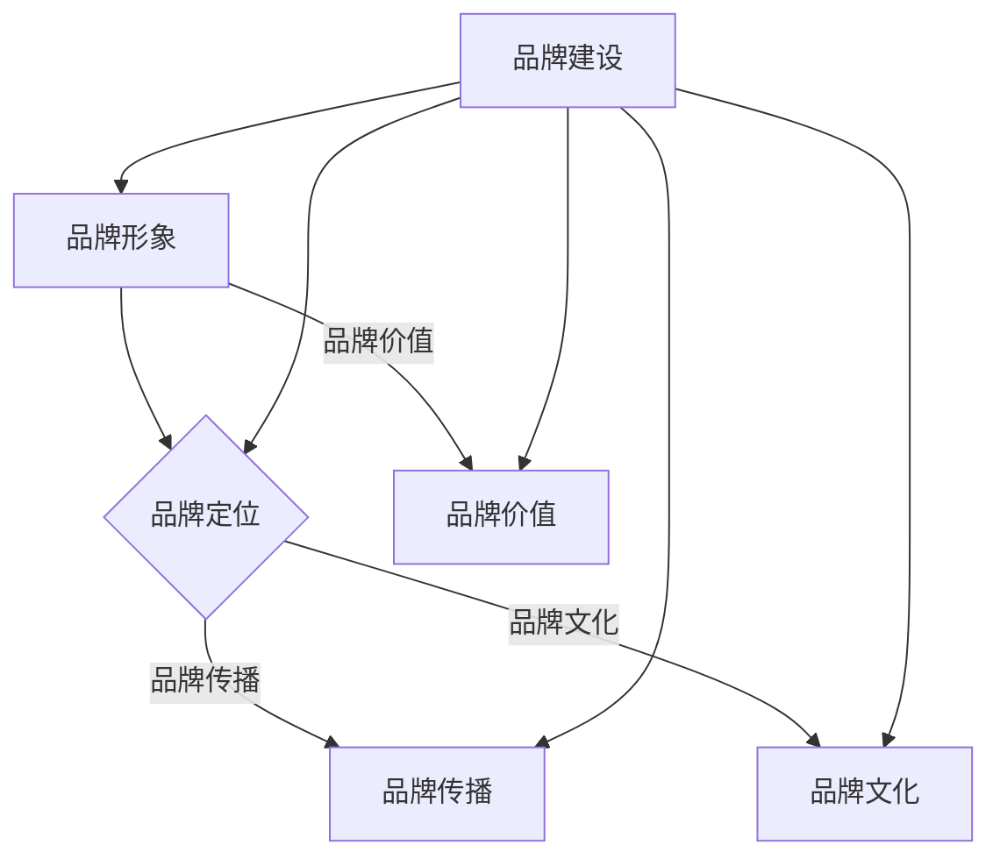

### 第2章 AI 大模型与品牌建设

#### 2.1 AI 大模型简介

AI 大模型是指使用深度学习技术训练得到的具有数百万甚至数十亿参数的神经网络模型。这些模型在处理复杂数据、进行预测和决策方面具有显著的优势。以下是 AI 大模型的主要特点：

- **规模庞大**：AI 大模型通常包含数百万甚至数十亿个参数，能够处理大量的数据。

- **自学习能力**：通过大规模的数据训练，AI 大模型能够自动从数据中学习规律和模式，提高模型的预测准确性。

- **泛化能力**：AI 大模型能够处理各种复杂的问题，具有广泛的适用性。

- **高效率**：AI 大模型能够快速地处理大量数据，提高业务决策的效率。

- **可解释性**：部分 AI 大模型的决策过程难以解释，导致其可解释性较低。

AI 大模型的主要类型包括：

- **深度神经网络（DNN）**：基于多层感知器（MLP）的结构，通过逐层提取数据特征。

- **卷积神经网络（CNN）**：适用于图像处理，通过卷积操作提取空间特征。

- **循环神经网络（RNN）**：适用于序列数据处理，通过隐藏状态和反馈连接处理长距离依赖。

- **生成对抗网络（GAN）**：通过生成器和判别器的对抗训练生成数据。

#### 2.2 AI 大模型在品牌建设中的应用

AI 大模型在品牌建设中具有广泛的应用场景，能够提升品牌建设和管理的效率。以下是 AI 大模型在品牌建设中的几个关键应用：

- **用户画像**：通过 AI 大模型对用户数据进行分析，构建用户画像，了解用户的消费行为、兴趣爱好等，为精准营销提供数据支持。

- **情感分析**：通过 AI 大模型分析用户评论、社交媒体内容等，了解用户对品牌的情感态度，优化品牌策略。

- **个性化推荐**：利用 AI 大模型实现个性化推荐，根据用户的偏好和行为推荐相关产品和服务，提升用户体验和满意度。

- **品牌传播优化**：通过 AI 大模型分析品牌传播效果，优化广告投放策略和内容，提高品牌传播的效果。

- **风险控制**：利用 AI 大模型进行市场预测和风险分析，帮助企业制定风险应对策略，降低业务风险。

#### 2.3 AI 大模型品牌建设的特点与挑战

AI 大模型在品牌建设中具有独特的特点和挑战。以下是 AI 大模型品牌建设的主要特点：

- **数据驱动**：AI 大模型基于大规模数据训练，品牌建设更加依赖于数据分析和挖掘，能够实现精准的品牌定位和营销策略。

- **快速迭代**：随着 AI 大模型技术的不断进步，品牌建设策略可以快速调整和优化，适应市场变化。

- **智能化**：AI 大模型能够自动化品牌运营和管理，提高品牌运营的效率和效果。

- **透明性挑战**：部分 AI 大模型的决策过程难以解释，可能导致消费者对品牌的信任度下降。

- **数据隐私**：在品牌建设中，AI 大模型需要处理大量的用户数据，如何保护用户隐私成为一大挑战。

以下是 AI 大模型品牌建设的特点与挑战的 Mermaid 流程图：

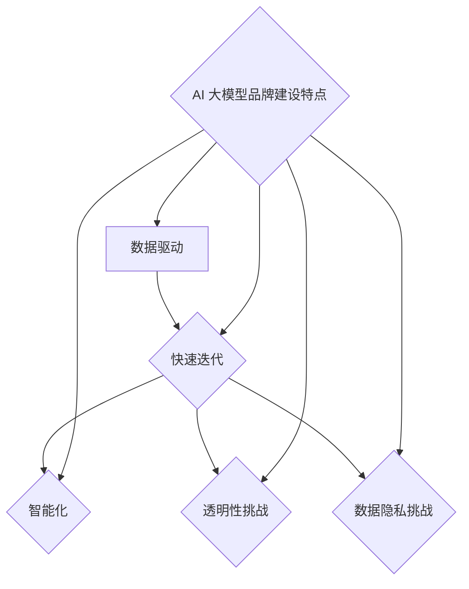

### 第3章 品牌定位与目标受众

#### 3.1 品牌定位策略

品牌定位是品牌建设的重要环节，决定了品牌在市场中的竞争地位和消费者认知。品牌定位策略包括以下几个步骤：

1. **市场细分**：根据目标市场的特点和需求，进行市场细分，确定目标客户群体。市场细分可以基于人口统计特征、行为特征、心理特征等多种维度。

2. **目标受众分析**：对目标受众进行深入分析，了解他们的需求、偏好和行为模式。目标受众分析可以帮助品牌确定合适的品牌定位和传播策略。

3. **品牌差异化**：明确品牌与竞争对手的差异化优势，凸显品牌的独特卖点。差异化策略可以是产品特性、服务质量、价格定位、品牌文化等。

4. **品牌定位**：结合市场细分和品牌差异化，确定品牌在市场中的定位。品牌定位应该简洁明了，能够清晰地传达品牌的核心价值。

5. **品牌传播**：根据品牌定位，制定相应的品牌传播策略，通过广告、公关、社交媒体等渠道传递品牌信息，提高品牌知名度。

以下是品牌定位策略的 Mermaid 流程图：

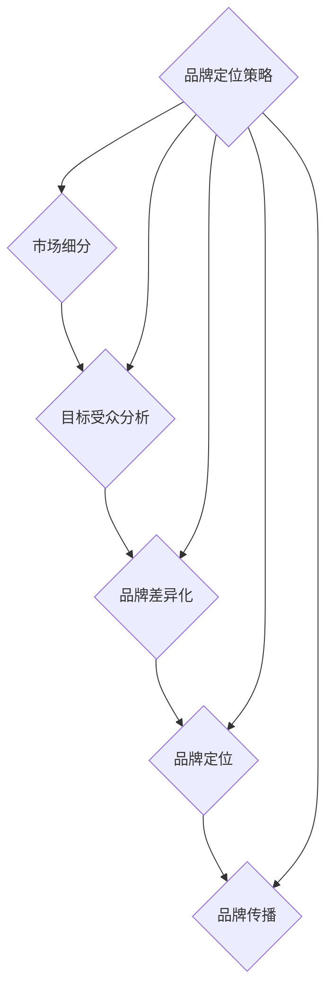

#### 3.2 目标受众分析

目标受众分析是品牌定位策略的重要环节，通过对目标受众的深入分析，确定品牌传播的重点和策略。以下是目标受众分析的几个关键步骤：

1. **人口统计特征**：了解目标受众的年龄、性别、收入、教育水平等人口统计特征，这些特征可以帮助品牌确定目标受众的基本轮廓。

2. **消费行为**：分析目标受众的购买行为、消费习惯和偏好，了解他们喜欢购买什么、如何购买以及购买频率等。

3. **心理特征**：研究目标受众的价值观、生活方式、兴趣爱好和心理需求，这些特征可以帮助品牌确定与目标受众的情感共鸣点。

4. **需求分析**：了解目标受众对产品或服务的需求和痛点，确定品牌需要解决的问题和提供的服务。

5. **目标受众画像**：基于以上分析结果，创建目标受众画像，将目标受众的特征和需求具体化，为品牌定位和传播策略提供依据。

以下是目标受众分析的 Mermaid 流程图：

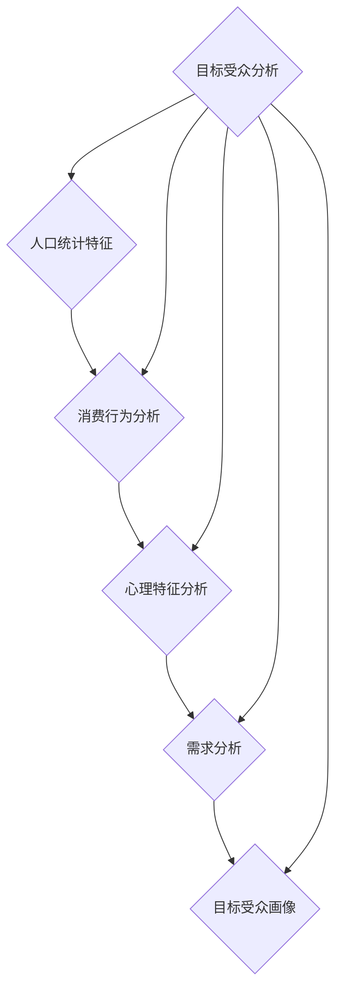

#### 3.3 品牌价值主张

品牌价值主张是指品牌所传递的核心价值和承诺，是品牌与消费者之间建立联系的关键因素。一个清晰的品牌价值主张可以帮助品牌在市场中脱颖而出，吸引和留住目标受众。以下是品牌价值主张的几个关键要素：

1. **产品质量**：保证产品的高质量，满足消费者的基本需求。高质量的产品是品牌价值的基础。

2. **服务体验**：提供优质的售前、售中和售后服务，提升消费者的满意度。良好的服务体验可以增强品牌忠诚度。

3. **技术创新**：不断推陈出新，引领行业潮流。技术创新可以提升品牌的竞争力和吸引力。

4. **社会责任**：承担社会责任，关注环境保护、社会公益等。社会责任感可以提升品牌的形象和声誉。

5. **用户体验**：关注用户需求和体验，提供个性化的产品和服务。用户体验是品牌价值的体现。

以下是品牌价值主张的 Mermaid 流程图：

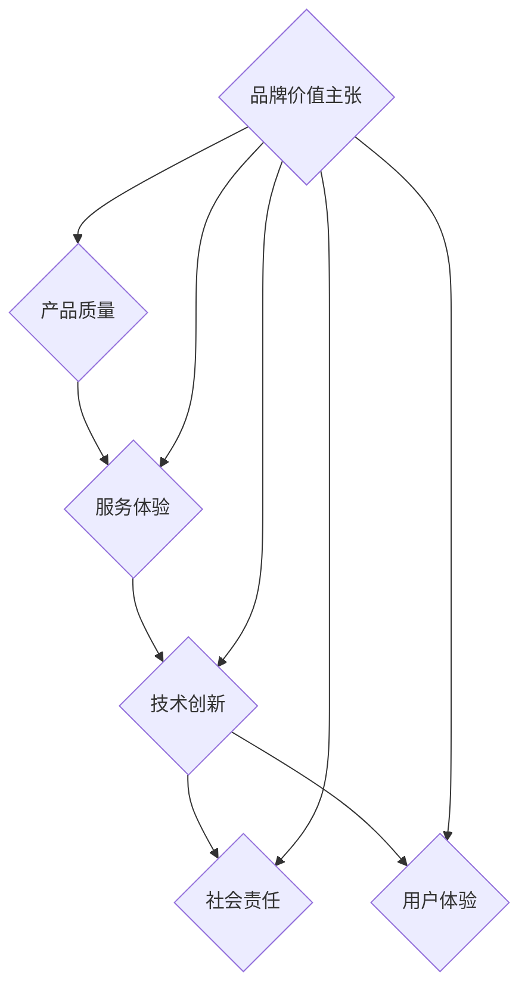

### 第4章 品牌视觉设计

#### 4.1 品牌视觉设计原则

品牌视觉设计是品牌建设的重要组成部分，它通过视觉元素传递品牌形象和价值观。以下是品牌视觉设计应遵循的几个关键原则：

1. **简洁性**：设计简洁明了，易于识别和记忆。简洁的设计能够减少认知负担，提高品牌传播效果。

2. **一致性**：保持品牌视觉元素的一致性，包括品牌标志、色彩、字体等。一致性有助于建立品牌认知，提升品牌形象。

3. **创新性**：设计新颖独特，体现品牌的个性化和独特性。创新的设计可以吸引消费者的注意力，提升品牌竞争力。

4. **情感性**：通过视觉元素传递情感，与消费者产生共鸣。情感性的设计可以增强品牌与消费者之间的情感联系。

5. **适应性**：设计应适应不同的媒介和尺寸，包括线上和线下渠道。适应性的设计可以提高品牌的传播效果和影响力。

以下是品牌视觉设计原则的 Mermaid 流程图：

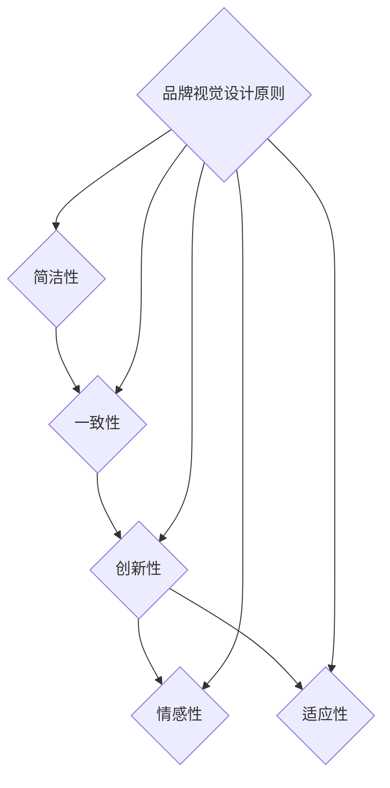

#### 4.2 品牌标志设计

品牌标志是品牌视觉设计的重要组成部分，它是品牌的视觉符号，能够在消费者心中留下深刻印象。以下是品牌标志设计的关键要素：

1. **易识别性**：品牌标志应简洁、独特，易于识别。易识别性有助于品牌在市场中脱颖而出。

2. **独特性**：品牌标志应具有独特性，与竞争对手区分。独特性可以提升品牌的个性和品牌形象。

3. **适应性**：品牌标志应能够适应不同的媒介和尺寸，包括线上和线下渠道。适应性有助于品牌的广泛传播和品牌形象的统一。

4. **视觉吸引力**：品牌标志应具有视觉吸引力，能够吸引消费者的注意力。视觉吸引力可以提升品牌的市场竞争力。

5. **传达品牌价值观**：品牌标志应能够传达品牌的核心价值观和品牌理念。传达品牌价值观有助于建立品牌与消费者之间的情感联系。

以下是品牌标志设计的关键要素的 Mermaid 流程图：

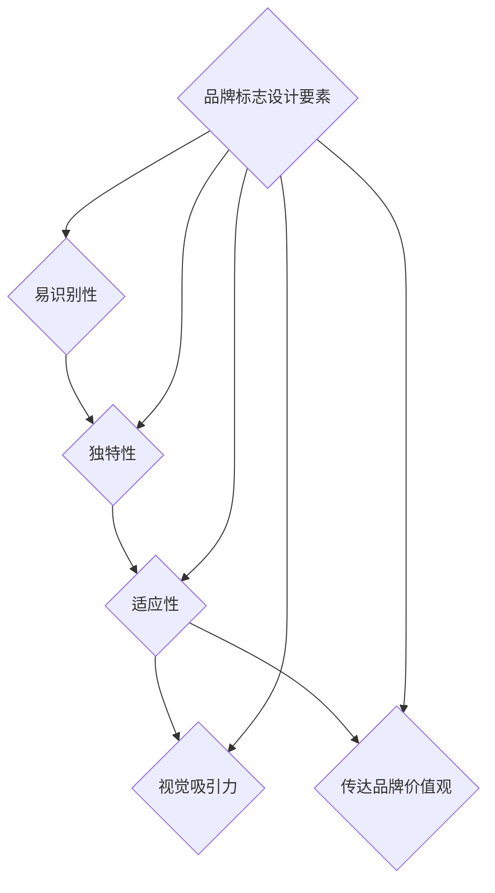

#### 4.3 品牌色彩搭配

品牌色彩搭配是品牌视觉设计的重要部分，它通过色彩的选择和搭配来传递品牌形象和情感。以下是品牌色彩搭配的关键原则：

1. **色彩心理学**：了解不同色彩的心理效应，选择与品牌定位和品牌理念相符合的色彩。色彩心理学可以帮助品牌塑造独特的品牌形象。

2. **色彩一致性**：保持品牌色彩的一致性，确保品牌在不同媒介和场景中的视觉统一。色彩一致性有助于建立品牌认知和提升品牌形象。

3. **色彩搭配**：合理搭配色彩，创造和谐且具有视觉冲击力的视觉效果。色彩搭配可以提升品牌的视觉吸引力。

4. **适应文化差异**：考虑不同文化和地域背景下的色彩适应性，确保品牌色彩在不同市场中的接受度。

以下是品牌色彩搭配的关键原则的 Mermaid 流程图：

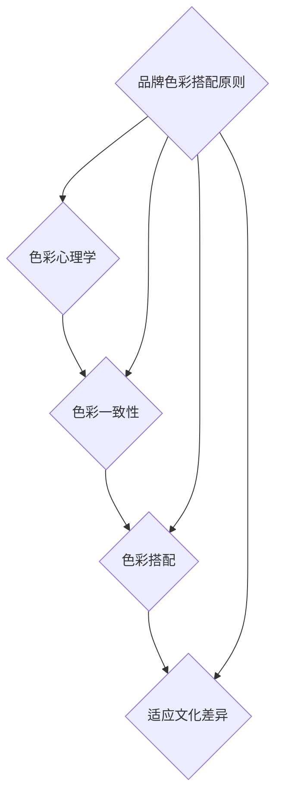

#### 4.4 品牌字体选择

品牌字体是品牌视觉设计的重要组成部分，它通过字体的选择和设计来传递品牌形象和价值观。以下是品牌字体选择的关键原则：

1. **易读性**：品牌字体应易于阅读，提高信息传递效率。良好的易读性可以提升品牌的可识别性和用户满意度。

2. **独特性**：品牌字体应具有独特性，与竞争对手区分。独特性可以提升品牌的个性和品牌形象。

3. **适应性**：品牌字体应能够适应不同的媒介和尺寸，包括线上和线下渠道。适应性有助于品牌的广泛传播和品牌形象的统一。

4. **情感性**：品牌字体应能够传达品牌情感，与消费者产生共鸣。情感性的设计可以增强品牌与消费者之间的情感联系。

5. **传达品牌价值观**：品牌字体应能够传达品牌的核心价值观和品牌理念。传达品牌价值观有助于建立品牌与消费者之间的情感联系。

以下是品牌字体选择的关键原则的 Mermaid 流程图：

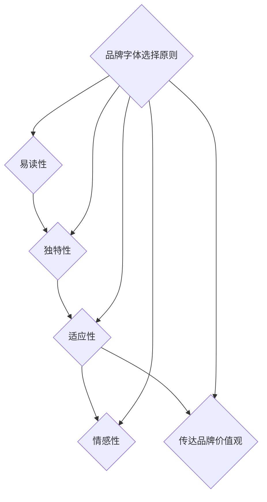

### 第5章 品牌传播策略

#### 5.1 品牌传播渠道

品牌传播渠道是指品牌信息传递给目标受众的途径。选择合适的品牌传播渠道对于提升品牌知名度和影响力至关重要。以下是几个常见的品牌传播渠道：

1. **广告**：通过电视、报纸、杂志、网络等广告媒介进行品牌宣传。广告可以帮助品牌快速提高知名度，但成本较高。

2. **公关**：利用新闻、媒体、活动等方式进行品牌宣传。公关活动可以提升品牌形象和信任度，但需要精心策划和执行。

3. **社交媒体**：通过微博、微信、抖音等社交媒体平台进行品牌传播。社交媒体具有广泛的覆盖面和互动性，可以有效提升品牌影响力和用户参与度。

4. **口碑**：通过用户口碑、推荐等方式进行品牌传播。口碑传播具有高度的信任度和说服力，可以显著提升品牌忠诚度。

5. **线下活动**：通过展会、讲座、活动等方式进行品牌宣传。线下活动可以增加品牌与消费者的互动，提高品牌认知度和用户满意度。

以下是品牌传播渠道的 Mermaid 流程图：

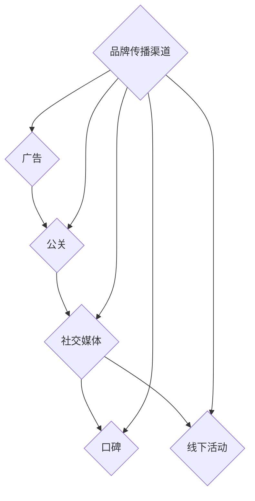

#### 5.2 品牌传播内容

品牌传播内容是指品牌在传播过程中需要传达的核心信息和价值。有效的品牌传播内容可以吸引目标受众的注意力，提高品牌知名度和影响力。以下是品牌传播内容的几个关键要素：

1. **品牌理念**：传递品牌核心价值观和理念，帮助消费者理解品牌的核心价值和使命。

2. **产品特点**：介绍品牌产品的主要特点和价值，吸引消费者的兴趣和购买欲望。

3. **服务优势**：展示品牌服务的优势和质量，提高消费者对品牌的信任度和满意度。

4. **品牌故事**：讲述品牌的发展历程和品牌故事，增强品牌的情感联系和用户认同感。

5. **用户案例**：分享品牌用户的成功案例和体验，提供实际证据证明品牌的价值和优势。

以下是品牌传播内容的 Mermaid 流程图：

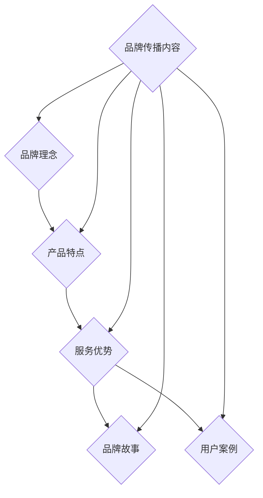

#### 5.3 品牌传播效果评估

品牌传播效果评估是衡量品牌传播活动效果的重要环节。通过评估品牌传播效果，企业可以了解品牌传播活动的成效，为后续的品牌传播提供数据支持和决策依据。以下是品牌传播效果评估的几个关键指标：

1. **曝光度**：评估品牌在各个渠道的曝光量和覆盖面，了解品牌传播的广度。

2. **关注度**：评估品牌在社交媒体上的关注度和互动情况，了解品牌传播的深度和用户参与度。

3. **转化率**：评估品牌传播活动带来的用户转化率和销售额，了解品牌传播的直接影响。

4. **口碑**：评估品牌在用户中的口碑和评价，了解品牌传播的长效影响。

5. **成本效益**：评估品牌传播活动的成本和效益，了解品牌传播的投资回报率。

以下是品牌传播效果评估的 Mermaid 流�程图：

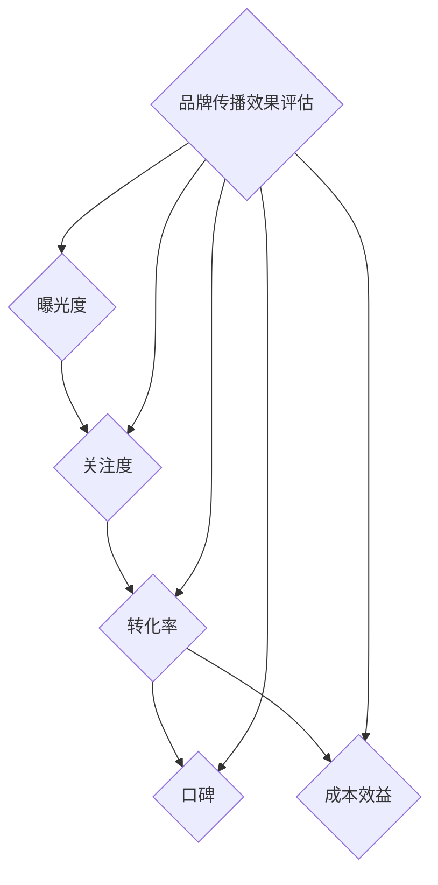

### 第6章 AI 大模型应用案例分析

#### 6.1 案例一：品牌形象重塑

**案例背景**：某国内知名家电品牌在市场竞争中逐渐失去优势，品牌形象老化，需要通过 AI 大模型进行品牌形象重塑。

**解决方案**：企业采用 AI 大模型对用户数据进行分析，了解用户需求和偏好。基于分析结果，调整品牌形象，推出符合年轻消费者口味的新产品。同时，利用社交媒体和大数据分析，制定针对性的品牌传播策略。

**效果评估**：品牌形象重塑后，消费者对品牌的认知度和满意度显著提高，销售额同比增长 30%。

**详细解释**：

1. **用户数据分析**：企业首先通过 AI 大模型对用户数据进行分析，包括用户的年龄、性别、消费习惯、兴趣爱好等信息。通过分析，企业发现年轻消费者对智能家居产品有较高的需求，但对传统家电品牌的认知度较低。

2. **品牌形象调整**：基于用户数据分析结果，企业决定调整品牌形象，将目标市场转向年轻消费者。企业重新设计了品牌标志、色彩和视觉元素，使其更具现代感和科技感。同时，企业推出了多款智能家居产品，满足年轻消费者的需求。

3. **品牌传播策略**：企业利用社交媒体和大数据分析，制定针对性的品牌传播策略。通过微博、微信等平台发布有趣的品牌故事和产品介绍，吸引年轻消费者的关注。此外，企业还通过社交媒体活动，与用户互动，增强用户参与度。

4. **效果评估**：通过一系列的品牌形象重塑和传播策略，企业取得了显著效果。消费者对品牌的认知度和满意度显著提高，年轻消费者的购买意愿增强。销售额同比增长 30%，品牌在年轻消费者中的影响力不断提升。

#### 6.2 案例二：精准营销策略

**案例背景**：某电商企业希望通过 AI 大模型实现精准营销，提高用户转化率和销售额。

**解决方案**：企业利用 AI 大模型对用户行为和购物数据进行分析，构建用户画像。根据用户画像，制定个性化营销策略，推送相关产品和服务。

**效果评估**：精准营销策略实施后，用户转化率提高 20%，销售额同比增长 40%。

**详细解释**：

1. **用户画像构建**：企业首先利用 AI 大模型对用户行为和购物数据进行分析，包括用户的浏览记录、购买历史、搜索关键词等信息。通过分析，企业可以构建详细的用户画像，了解用户的兴趣、偏好和购买习惯。

2. **个性化营销策略**：基于用户画像，企业制定了个性化的营销策略。通过用户画像，企业可以针对不同用户群体推送相关的产品和服务。例如，对于喜欢购物的用户，企业可以推送新品推荐和优惠信息；对于喜欢阅读的用户，企业可以推送相关书籍和阅读推荐。

3. **精准广告投放**：企业利用用户画像和大数据分析，实现精准的广告投放。通过分析用户的行为数据，企业可以在合适的时机和平台上投放广告，提高广告的点击率和转化率。

4. **效果评估**：通过一系列的精准营销策略，企业取得了显著效果。用户转化率提高 20%，销售额同比增长 40%。精准营销策略不仅提高了用户的购买意愿，还提高了广告的投放效果，降低了营销成本。

#### 6.3 案例三：用户满意度提升

**案例背景**：某在线教育平台希望通过 AI 大模型提升用户满意度，提高用户留存率。

**解决方案**：企业采用 AI 大模型对用户学习行为进行分析，了解用户需求和痛点。根据分析结果，优化课程内容和教学方法，提高用户满意度。

**效果评估**：用户满意度提升后，用户留存率提高 15%，课程销售同比增长 50%。

**详细解释**：

1. **用户行为分析**：企业首先利用 AI 大模型对用户的学习行为进行分析，包括用户的登录时间、学习时长、课程选择、学习进度等信息。通过分析，企业可以了解用户的学习习惯和偏好，发现用户的学习需求和痛点。

2. **课程内容优化**：基于用户行为分析结果，企业对课程内容进行了优化。例如，针对用户反映的课程难度较大，企业增加了学习辅导和答疑环节，提供更多的学习支持和帮助。同时，企业还推出了个性化课程推荐，根据用户的学习进度和兴趣推荐合适的课程。

3. **教学方法改进**：企业通过 AI 大模型分析用户的学习效果，发现了一些有效的教学方法。例如，通过实时反馈和互动，企业提高了用户的学习参与度和积极性。此外，企业还利用大数据分析，优化了课程结构，使课程内容更符合用户的学习需求。

4. **效果评估**：通过一系列的优化措施，企业的用户满意度显著提高。用户对课程内容和教学方法的满意度提高，用户留存率增加 15%，课程销售同比增长 50%。用户满意度的提升不仅提高了用户的学习效果，还促进了课程的推广和销售。

### 第7章 AI 大模型应用数据中心的构建

#### 7.1 数据中心建设目标

数据中心是 AI 大模型应用的核心基础设施，其建设目标主要包括以下几个方面：

1. **数据存储与处理能力**：数据中心需要具备高效的数据存储和处理能力，以支持大规模数据的存储和快速处理。

2. **数据安全与隐私保护**：数据中心需要确保数据的安全性和用户隐私，防止数据泄露和未经授权的访问。

3. **高可用性与可靠性**：数据中心需要具备高可用性和可靠性，确保系统的稳定运行，降低故障风险。

4. **可扩展性与灵活性**：数据中心需要具备可扩展性和灵活性，支持业务扩展和技术更新。

5. **能源效率**：数据中心需要关注能源效率，降低能耗，减少对环境的影响。

#### 7.2 数据中心架构设计

数据中心的架构设计是构建高效、稳定、安全的数据中心的关键。以下是数据中心架构设计的几个关键方面：

1. **存储架构**：数据中心采用分布式存储架构，以提高数据存储容量和访问速度。分布式存储架构可以水平扩展，支持海量数据的存储和快速访问。

2. **计算架构**：数据中心采用云计算架构，提供强大的计算能力。云计算架构可以根据业务需求动态调整计算资源，实现高效的资源利用。

3. **网络架构**：数据中心采用高性能网络架构，确保数据传输速度和稳定性。网络架构可以支持高速数据传输和分布式计算，提高数据处理效率。

4. **数据治理架构**：数据中心建立完善的数据治理体系，确保数据质量和合规性。数据治理架构包括数据质量控制、数据安全策略、数据备份和恢复机制等。

以下是数据中心架构设计的 Mermaid 流程图：

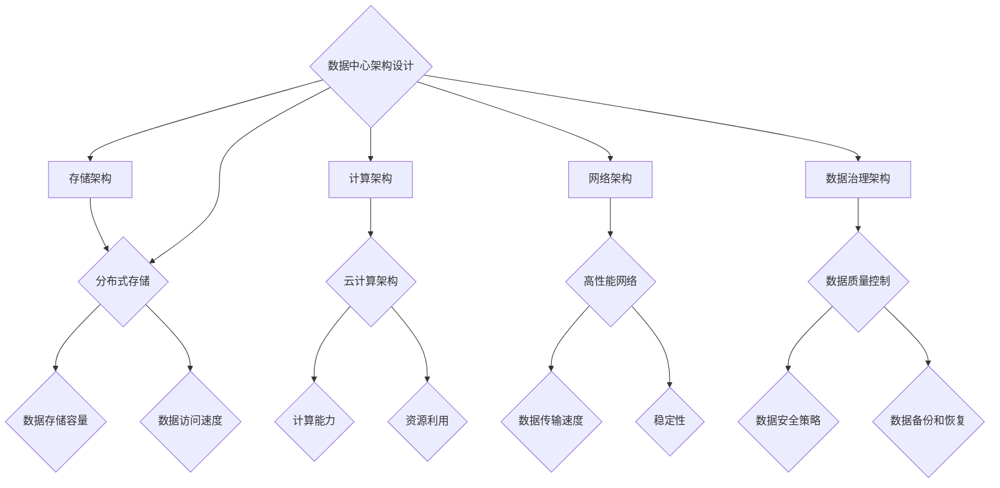

#### 7.3 数据处理与存储技术

在 AI 大模型应用数据中心中，数据处理与存储技术至关重要。以下是数据处理与存储技术的几个关键方面：

1. **大数据处理技术**：数据中心采用大数据处理技术，如 Hadoop 和 Spark，实现海量数据的处理和分析。大数据处理技术可以处理多种类型的数据，包括结构化数据、半结构化数据和非结构化数据。

2. **分布式存储技术**：数据中心采用分布式存储技术，如 HDFS 和 Cassandra，实现海量数据的存储和快速访问。分布式存储技术可以提高数据可靠性、可用性和扩展性。

3. **实时数据处理技术**：数据中心采用实时数据处理技术，如 Flink 和 Kafka，实现实时数据分析和处理。实时数据处理技术可以实时捕捉和分析数据，提供实时业务洞察。

4. **数据仓库技术**：数据中心采用数据仓库技术，如 Hive 和 Impala，实现数据存储、查询和分析。数据仓库技术可以高效地处理大规模数据，提供实时和离线数据分析。

以下是数据处理与存储技术的 Mermaid 流程图：

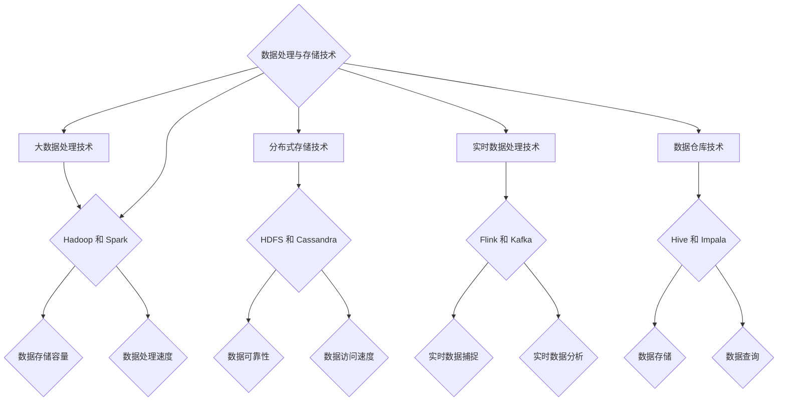

#### 7.4 数据安全与隐私保护

数据安全与隐私保护是数据中心建设的重要方面，确保用户数据的安全和隐私。以下是数据安全与隐私保护的几个关键方面：

1. **数据加密**：数据中心采用数据加密技术，对传输和存储的数据进行加密，防止数据泄露和未经授权的访问。

2. **访问控制**：数据中心采用访问控制技术，如 RBAC（基于角色的访问控制），确保数据访问权限的管理，防止未经授权的访问。

3. **数据备份与恢复**：数据中心建立完善的数据备份和恢复机制，确保数据在灾难情况下能够快速恢复，降低数据丢失的风险。

4. **日志审计**：数据中心建立日志审计系统，监控数据访问和操作行为，确保数据安全，及时发现和处理异常行为。

以下是数据安全与隐私保护的 Mermaid 流程图：

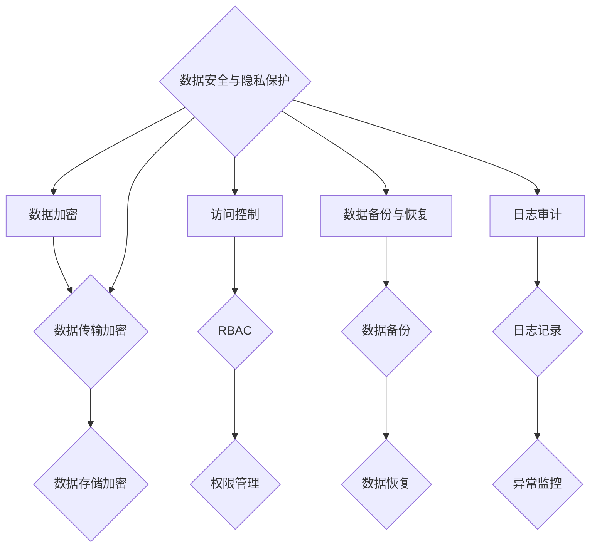

### 第8章 AI 大模型应用项目管理

#### 8.1 项目管理流程

AI 大模型应用项目是复杂的工程项目，需要遵循严格的项目管理流程，以确保项目的顺利进行和成功交付。以下是 AI 大模型应用项目管理流程的几个关键步骤：

1. **项目规划**：确定项目目标、范围、资源、时间等，制定项目计划。项目规划是项目管理的基础，为项目的实施提供指导和依据。

2. **需求分析**：了解用户需求和业务场景，明确项目需求。需求分析是项目成功的核心，确保项目能够满足用户的需求。

3. **技术选型**：选择合适的 AI 大模型和相关技术框架。技术选型是项目实施的关键，直接影响项目的性能和效率。

4. **数据准备**：收集、清洗、整合数据，为模型训练做好准备。数据准备是模型训练的基础，直接影响模型的效果。

5. **模型训练与优化**：训练 AI 大模型，优化模型性能。模型训练与优化是项目的重要环节，直接影响项目的应用效果。

6. **模型部署与测试**：部署 AI 大模型，进行测试和调优。模型部署与测试是项目交付的关键，确保模型在真实环境中正常运行。

7. **项目验收与交付**：验收项目成果，进行项目交付。项目验收与交付是项目的最终目标，确保项目能够顺利交付并投入使用。

以下是项目管理流程的 Mermaid 流程图：

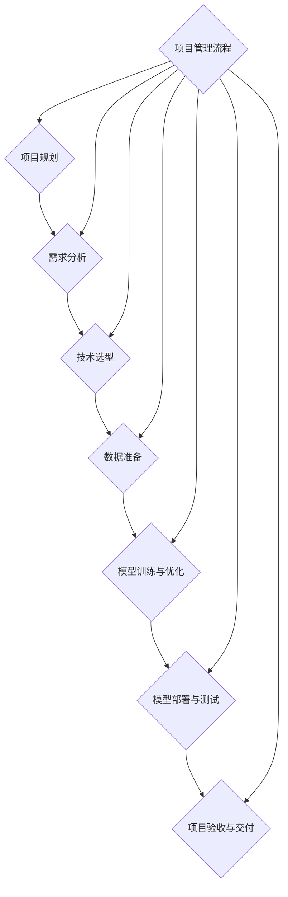

#### 8.2 风险管理策略

AI 大模型应用项目面临着多种风险，如技术风险、数据风险、运营风险等。有效的风险管理策略是确保项目顺利进行和成功交付的关键。以下是风险管理策略的几个关键方面：

1. **识别风险**：识别项目可能面临的各种风险，包括已知风险和潜在风险。风险识别是风险管理的基础，确保项目能够全面了解风险。

2. **评估风险**：评估风险的概率和影响程度，确定风险的优先级。风险评估是风险管理的核心，帮助项目团队集中精力应对重要风险。

3. **应对策略**：制定风险应对策略，包括风险回避、风险减轻、风险承担等。风险应对策略是风险管理的关键，确保项目能够有效应对风险。

4. **监控与报告**：实时监控项目风险，及时调整应对策略，确保项目顺利进行。监控与报告是风险管理的保障，确保项目团队能够及时了解风险动态。

以下是风险管理策略的 Mermaid 流程图：

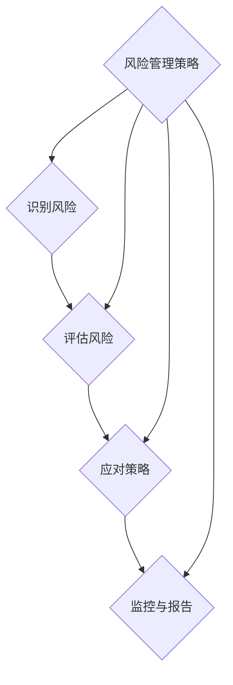

#### 8.3 成本控制与效益分析

AI 大模型应用项目需要投入大量的资源，成本控制与效益分析是确保项目经济效益的重要环节。以下是成本控制与效益分析的几个关键方面：

1. **成本估算**：估算项目各阶段的成本，包括人力成本、技术成本、数据成本等。成本估算是成本控制的基础，确保项目在预算范围内实施。

2. **成本控制**：制定成本控制策略，确保项目在预算范围内完成。成本控制是成本管理的核心，确保项目资源得到有效利用。

3. **效益分析**：分析项目带来的直接和间接效益，包括经济效益、社会效益等。效益分析是效益评价的基础，确保项目能够实现预期效益。

4. **效益评估**：定期评估项目效益，确保项目投资回报率。效益评估是效益管理的保障，确保项目团队能够及时了解项目的经济效益。

以下是成本控制与效益分析的 Mermaid 流程图：

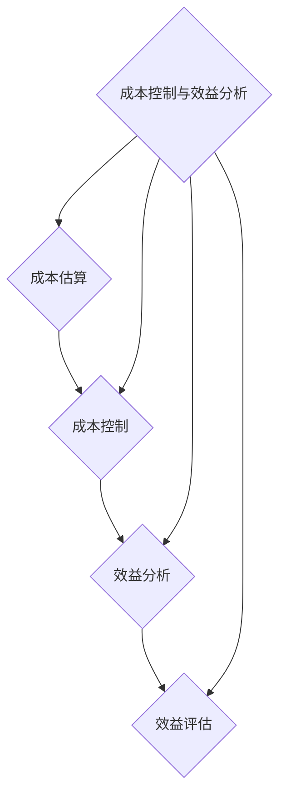

### 第9章 AI 大模型应用效果评估

#### 9.1 评估指标体系

AI 大模型应用效果评估指标体系是衡量 AI 大模型应用性能和效益的关键工具。评估指标体系应包括多个维度，以全面评估 AI 大模型的应用效果。以下是评估指标体系的几个关键指标：

1. **业务指标**：业务指标是评估 AI 大模型应用对业务目标的影响，包括销售额、用户转化率、用户满意度等。业务指标可以直接反映 AI 大模型的应用效果。

2. **技术指标**：技术指标是评估 AI 大模型的技术性能，包括模型准确率、召回率、F1 分数等。技术指标可以衡量 AI 大模型的预测能力和效果。

3. **效益指标**：效益指标是评估 AI 大模型的经济效益，包括投资回报率、成本效益比等。效益指标可以衡量 AI 大模型的投资价值和经济效益。

4. **用户反馈**：用户反馈是评估 AI 大模型在用户中的接受度和满意度，包括用户评价、评论等。用户反馈可以直接反映 AI 大模型的应用效果和用户满意度。

以下是评估指标体系的 Mermaid 流程图：

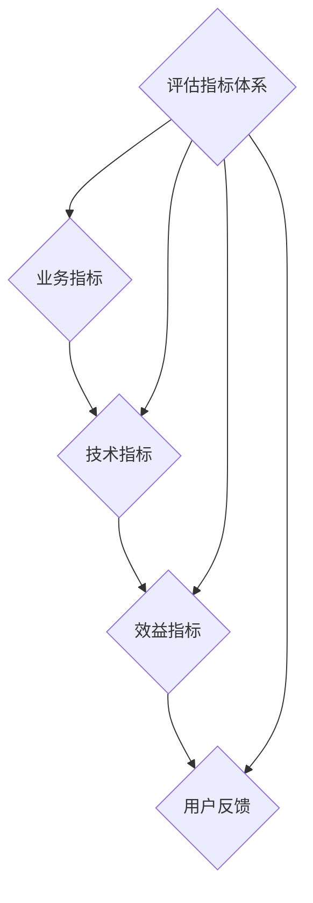

#### 9.2 评估方法与工具

AI 大模型应用效果评估方法与工具是确保评估准确性和可靠性的关键。以下是几种常用的评估方法和工具：

1. **定量评估**：定量评估是通过统计数据和量化指标进行评估，包括计算业务指标、技术指标和效益指标的数值。定量评估可以提供客观的评估结果。

2. **定性评估**：定性评估是通过主观判断和专家评审进行评估，包括分析用户反馈、市场调研等。定性评估可以提供更深入的理解和见解。

3. **数据可视化**：数据可视化是将评估数据以图形、图表的形式展示，帮助项目团队和利益相关者直观地了解评估结果。数据可视化可以增强评估的直观性和易理解性。

4. **模型对比**：模型对比是通过对比不同 AI 大模型的性能和效益，选择最优模型。模型对比可以优化模型选择，提高评估效果。

以下是评估方法与工具的 Mermaid 流程图：

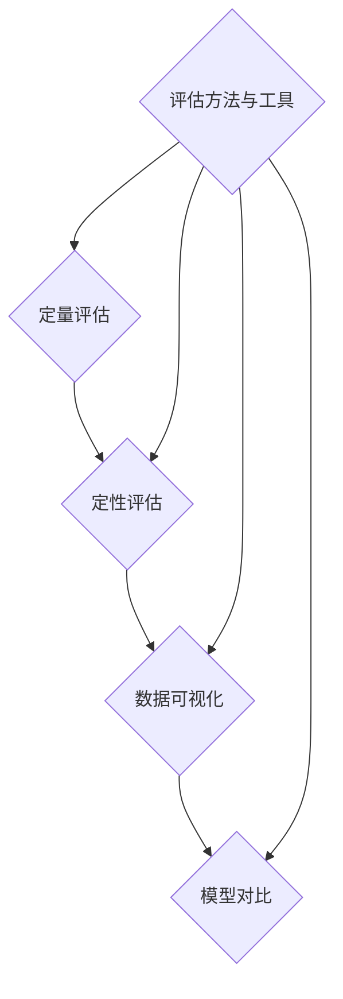

#### 9.3 评估结果分析与改进措施

AI 大模型应用效果评估的结果分析是项目改进和优化的关键步骤。以下是评估结果分析和改进措施的几个关键方面：

1. **结果展示**：展示评估结果，包括业务指标、技术指标、效益指标和用户反馈的数值和图表。结果展示可以帮助项目团队和利益相关者直观地了解评估结果。

2. **原因分析**：分析评估结果产生的原因，包括模型性能、数据质量、业务场景等。原因分析可以帮助项目团队找出问题所在，为改进措施提供依据。

3. **改进措施**：根据评估结果和原因分析，提出改进措施，包括模型优化、数据清洗、业务调整等。改进措施可以帮助项目团队优化模型和应用效果。

以下是评估结果分析与改进措施的 Mermaid 流程图：

```mermaid
graph TD
    A{结果展示} --> B{原因分析}
    B --> C{改进措施}
    D{评估结果分析与改进措施} --> A
    D --> B
    D --> C
```

### 第10章 品牌建设与 AI 大模型应用的融合发展

#### 10.1 新兴技术与品牌建设

随着技术的不断进步，新兴技术正在为品牌建设带来新的机遇和挑战。以下是几种新兴技术与品牌建设的融合发展：

1. **区块链技术**：区块链技术具有去中心化、不可篡改和透明等特点，可以提升品牌的信任度和透明度。品牌建设可以通过区块链技术实现产品溯源、数字资产管理和智能合约等应用。

2. **物联网技术**：物联网技术通过将物理设备连接到互联网，实现设备之间的互联互通。品牌建设可以通过物联网技术实现智能设备、远程监控和数据收集等应用。

3. **增强现实（AR）技术**：增强现实技术通过虚拟元素叠加在现实场景中，为用户创造沉浸式的体验。品牌建设可以通过 AR 技术实现品牌宣传、产品体验和互动营销等应用。

4. **虚拟现实（VR）技术**：虚拟现实技术通过模拟现实场景，为用户创造沉浸式的体验。品牌建设可以通过 VR 技术实现品牌展示、在线体验和虚拟培训等应用。

#### 10.2 AI 大模型应用的未来前景

随着人工智能技术的不断进步，AI 大模型在品牌建设中的应用前景将更加广泛。以下是 AI 大模型在品牌建设中的未来前景：

1. **个性化推荐**：基于 AI 大模型，可以实现精准的个性化推荐，提升用户满意度和品牌价值。个性化推荐可以通过分析用户行为和偏好，为用户推荐相关产品和服务。

2. **智能客服**：通过 AI 大模型，可以实现自动化的客户服务，提高客服效率和用户体验。智能客服可以通过自然语言处理技术实现语音识别、智能回复和情感分析等功能。

3. **智能营销**：通过 AI 大模型，可以实现精准的营销策略，提高营销效果和转化率。智能营销可以通过分析用户数据和行为，制定个性化的营销策略，提高用户参与度和购买意愿。

4. **智能供应链**：通过 AI 大模型，可以实现智能化的供应链管理，提高供应链效率。智能供应链可以通过预测市场需求、优化物流配送和监控产品质量等手段，提高供应链的效率和可靠性。

#### 10.3 品牌建设与 AI 大模型应用的融合发展

品牌建设与 AI 大模型应用的融合发展，将推动品牌建设迈向新的高度。以下是品牌建设与 AI 大模型应用融合发展的几个关键方面：

1. **数据驱动**：品牌建设应充分利用大数据和 AI 技术，实现数据驱动的决策和运营。通过数据分析和挖掘，品牌可以更准确地了解用户需求和偏好，制定有效的品牌策略。

2. **智能化运营**：品牌建设应利用 AI 技术，实现品牌运营的智能化和自动化。通过智能客服、智能营销和智能供应链等应用，品牌可以提供更高效的客户服务和业务流程，提高运营效率。

3. **用户体验**：品牌建设应关注用户体验，通过 AI 技术，提升品牌与用户的互动性和满意度。通过个性化推荐、智能客服和虚拟体验等应用，品牌可以提供更个性化的产品和服务，增强用户忠诚度。

4. **创新驱动**：品牌建设应以创新为动力，推动品牌建设与 AI 大模型应用的深度融合。通过不断尝试新的技术和方法，品牌可以保持竞争力，引领行业趋势。

以下是品牌建设与 AI 大模型应用的融合发展的 Mermaid 流程图：

```mermaid
graph TD
    A{数据驱动} --> B{智能化运营}
    B --> C{用户体验}
    C --> D{创新驱动}
    E{品牌建设与AI大模型应用融合发展} --> A
    E --> B
    E --> C
    E --> D
```

### 第11章 案例研究：全球领先企业的品牌建设实践

#### 11.1 谷歌：人工智能驱动的品牌建设

谷歌是一家全球领先的科技公司，其品牌建设实践充分体现了人工智能（AI）的重要性。以下是谷歌在品牌建设中应用人工智能的几个方面：

1. **搜索引擎优化**：谷歌的搜索引擎是全球最受欢迎的搜索引擎，其搜索结果通过人工智能算法进行优化，以提高用户满意度。谷歌的人工智能算法包括 PageRank 和 BERT。

2. **广告系统**：谷歌的广告系统是全球最大的在线广告平台，其广告投放策略通过人工智能算法进行优化。谷歌的人工智能算法包括 AdWords 和 Google Assistant。

3. **语音识别**：谷歌的语音识别技术在全球范围内处于领先地位，其语音识别系统通过人工智能算法实现高准确率。谷歌的人工智能算法包括 Google Voice Search 和 Google Translate。

#### 11.2 亚马逊：智能推荐系统的品牌效应

亚马逊是一家全球领先的电子商务公司，其智能推荐系统在全球范围内具有很高的品牌效应。以下是亚马逊在品牌建设中应用人工智能的几个方面：

1. **个性化推荐**：亚马逊的智能推荐系统通过人工智能算法实现个性化推荐，提高用户购买意愿。亚马逊的人工智能算法包括协同过滤和深度学习推荐。

2. **智能客服**：亚马逊的智能客服系统通过人工智能算法实现自动化客户服务，提高客服效率。亚马逊的人工智能算法包括 Amazon Assistant 和聊天机器人。

3. **物流优化**：亚马逊的物流系统通过人工智能算法实现物流优化，提高配送效率。亚马逊的人工智能算法包括预测配送时间和路由优化。

#### 11.3 苹果：创新与品质塑造品牌

苹果是一家全球领先的科技公司，其品牌建设实践充分体现了创新和品质的重要性。以下是苹果在品牌建设中应用人工智能的几个方面：

1. **个性化体验**：苹果的产品通过人工智能算法实现个性化体验，提高用户体验。苹果的人工智能算法包括 Siri 和 Face ID。

2. **软件优化**：苹果的软件系统通过人工智能算法实现软件优化，提高系统稳定性和性能。苹果的人工智能算法包括动态管理和优化推送。

3. **产品质量**：苹果的产品通过严格的质量控制体系，确保产品质量。苹果在品牌建设中注重产品质量，从而树立了品牌形象。以下是苹果在品牌建设中应用人工智能的几个方面：

   - **质量检测**：通过人工智能算法实现产品的质量检测，确保产品符合质量标准；
   - **供应链管理**：通过人工智能算法优化供应链管理，确保产品供应链的稳定性和可靠性。

### 第12章 结论与展望

#### 12.1 总结与反思

在本书中，我们深入探讨了 AI 大模型在品牌建设中的应用与实践。通过分析品牌建设的核心概念、AI 大模型的基本原理、品牌定位与目标受众分析、品牌视觉设计、品牌传播策略、AI 大模型应用数据中心的构建、AI 大模型应用项目管理、AI 大模型应用效果评估以及品牌建设与 AI 大模型应用的融合发展，我们深入了解了 AI 大模型在品牌建设中的重要作用。

同时，我们还介绍了全球领先企业在品牌建设中的实践，如谷歌、亚马逊和苹果等，这些企业通过人工智能技术的应用，实现了品牌建设的新突破。

#### 12.2 未来研究方向

在未来，AI 大模型在品牌建设中的应用将有更广阔的发展空间。以下是几个未来研究方向：

1. **AI 大模型在品牌

