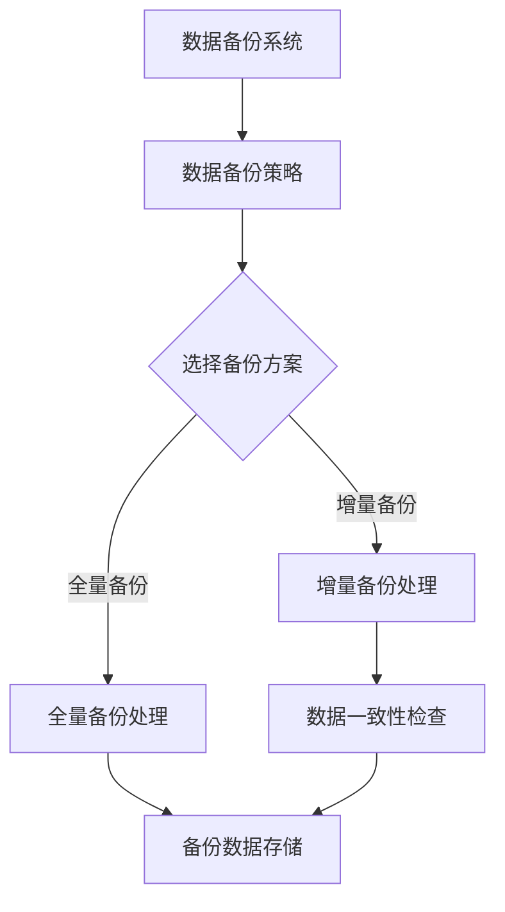
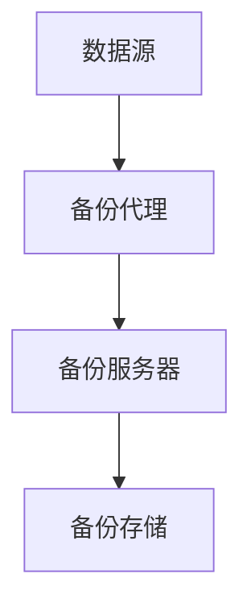
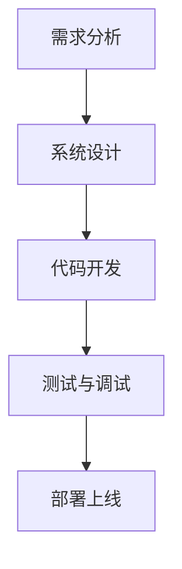
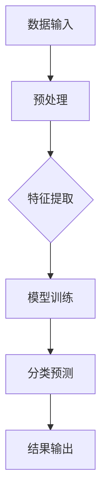

                 

# 《AI大模型应用数据中心的数据备份》

## 关键词
AI大模型、数据中心、数据备份、备份策略、备份算法、数据一致性、开发环境、源代码实现、代码解读、优化、应用场景

## 摘要

随着人工智能（AI）技术的迅猛发展，AI大模型在数据中心的应用越来越广泛。这些大模型对数据的依赖性极高，确保数据的安全性和可靠性成为关键问题。本文将围绕AI大模型应用数据中心的数据备份进行深入探讨，从基础概念与原理、技术细节与实践、应用与展望等多个角度，全面解析AI大模型数据备份的方法、策略和挑战，为读者提供一份详尽的技术指南。

## 目录大纲

### 第一部分：基础概念与原理

#### 第1章：AI大模型概述
1.1 AI大模型的基本概念
1.2 AI大模型的发展历程
1.3 数据中心备份的背景和重要性

#### 第2章：数据中心备份策略
2.1 备份的分类与选择
2.2 备份方案的优缺点分析
2.3 备份策略的制定与执行

#### 第3章：AI大模型在数据备份中的应用
3.1 AI大模型在数据备份中的作用
3.2 基于AI大模型的备份算法
3.3 AI大模型在数据备份中的挑战与解决方案

### 第二部分：技术细节与实践

#### 第4章：数据备份系统的设计
4.1 数据备份系统的架构
4.2 数据备份系统的关键技术
4.3 数据备份系统的实现与部署

#### 第5章：AI大模型在数据备份中的算法实现
5.1 算法原理讲解
5.2 伪代码展示
5.3 数学模型与公式详解

#### 第6章：数学模型和数学公式
6.1 数据备份中的数学模型
6.2 模型公式解释
6.3 实例分析

#### 第7章：项目实战
7.1 实际案例介绍
7.2 开发环境搭建
7.3 源代码实现与解读
7.4 代码分析与优化

### 第三部分：应用与展望

#### 第8章：AI大模型数据备份的应用场景
8.1 不同场景的备份需求
8.2 AI大模型备份的优势与局限
8.3 未来发展趋势

#### 第9章：总结与展望
9.1 书籍总结
9.2 AI大模型数据备份的发展前景
9.3 进一步研究方向

## 附录

### 附录 A：相关资源与工具
A.1 开发工具介绍
A.2 数据备份资源链接
A.3 AI大模型学习资料

### 附录 B：Mermaid 流程图



### 第一部分：基础概念与原理

#### 第1章：AI大模型概述

##### 1.1 AI大模型的基本概念

人工智能（AI）大模型是指那些参数规模巨大、计算需求极高，通常需要分布式计算资源来训练和推理的模型。这些模型通常具有以下特点：

- **参数规模大**：模型参数数量达到数十亿到数千亿级别。
- **计算复杂度高**：训练和推理过程中需要大量的计算资源。
- **数据依赖性强**：模型的训练和优化依赖于大量的数据集。

常见的AI大模型包括：

- **Transformer模型**：广泛应用于自然语言处理（NLP）领域，如BERT、GPT等。
- **卷积神经网络（CNN）**：在计算机视觉领域具有广泛的应用，如ResNet、VGG等。

##### 1.2 AI大模型的发展历程

AI大模型的发展经历了多个阶段：

- **早期模型**：以单机训练的模型为主，如早期的CNN模型。
- **分布式训练**：随着计算资源的增长，模型训练开始采用分布式训练策略，如Data Parallelism、Model Parallelism。
- **大模型时代**：近年来，随着计算资源和数据集的进一步扩展，AI大模型得到了飞速发展，如GPT-3、GPT-NEO等。

##### 1.3 数据中心备份的背景和重要性

数据中心备份是确保数据中心数据安全的重要措施。对于AI大模型来说，数据备份的重要性尤为突出：

- **数据规模巨大**：AI大模型训练和推理依赖于大量数据，这些数据的丢失将导致模型训练的失败。
- **数据重要性高**：AI大模型训练过程复杂，一旦数据丢失，重新训练将耗费大量时间和资源。
- **数据一致性要求**：对于AI大模型，数据的一致性至关重要，任何数据错误都可能导致模型性能下降。

#### 第2章：数据中心备份策略

##### 2.1 备份的分类与选择

数据备份可以分为以下几类：

- **全量备份**：备份整个数据集。
- **增量备份**：仅备份上次备份后发生变化的数据。
- **差异备份**：备份上次全量备份后发生变化的数据。

选择备份类型时需要考虑以下因素：

- **数据规模**：对于数据量较小的系统，全量备份可能更为合适；对于数据量巨大的系统，增量备份和差异备份可能更为高效。
- **备份频率**：备份频率越高，数据一致性的保障程度越高，但备份存储空间和备份时间也会相应增加。
- **备份策略**：不同的备份策略适用于不同的业务场景，如定期备份、实时备份等。

##### 2.2 备份方案的优缺点分析

常见的备份方案包括：

- **本地备份**：优点是速度快，缺点是数据安全性较低，易受物理损坏影响。
- **远程备份**：优点是数据安全性高，缺点是备份速度较慢，受网络带宽限制。
- **云备份**：优点是数据安全性和备份速度均较好，缺点是成本较高。

##### 2.3 备份策略的制定与执行

制定备份策略时需要考虑以下方面：

- **备份频率**：根据数据的重要性和变化频率制定备份频率。
- **备份时间**：选择在系统负载较低的时间进行备份，以减少对系统运行的影响。
- **备份存储**：选择合适的数据存储方式，如硬盘、NAS、云存储等。

执行备份策略时需要：

- **监控备份过程**：确保备份成功，及时发现并处理备份失败的情况。
- **备份验证**：定期进行备份验证，确保备份数据的完整性和一致性。
- **备份恢复**：制定备份恢复计划，确保在数据丢失时能够快速恢复。

### 第一部分总结

在本章节中，我们介绍了AI大模型的基本概念和发展历程，并探讨了数据中心备份的背景和重要性。随后，我们对数据中心备份策略进行了分类和优缺点分析，并提出了制定和执行备份策略的方法。这些内容为后续章节的技术细节和实践打下了基础。

### 第二部分：技术细节与实践

#### 第4章：数据备份系统的设计

##### 4.1 数据备份系统的架构

数据备份系统的架构设计是确保备份过程高效、可靠和安全的关键。一个典型的数据备份系统架构包括以下几个核心组成部分：

- **数据源**：数据备份系统需要连接到数据源，以获取需要备份的数据。数据源可以是本地存储、远程存储或云存储。
- **备份服务器**：备份服务器负责接收数据源发送的数据，并根据备份策略进行数据备份。
- **备份存储**：备份存储用于存储备份数据，可以是本地存储、远程存储或云存储。备份存储应具备高可靠性、高扩展性和易访问性。
- **备份代理**：备份代理是部署在数据源上的软件，负责监控数据源的变化，并在需要时触发备份任务。

以下是一个简单的数据备份系统架构图：



##### 4.2 数据备份系统的关键技术

数据备份系统需要实现以下几个关键技术：

- **数据传输**：数据备份系统需要高效地传输数据，以确保备份过程的速度。常用的数据传输协议包括FTP、SFTP和HTTPS等。
- **数据压缩**：为了减少备份存储空间，数据备份系统通常采用数据压缩技术。常见的压缩算法包括GZIP、BZIP2和LZ4等。
- **数据加密**：为了保护备份数据的安全性，数据备份系统需要实现数据加密。常用的加密算法包括AES、RSA等。
- **数据校验**：为了确保备份数据的完整性，数据备份系统需要实现数据校验。常用的校验算法包括MD5、SHA-1和SHA-256等。
- **备份策略管理**：数据备份系统需要提供备份策略管理功能，以便用户可以根据需求制定和调整备份策略。

##### 4.3 数据备份系统的实现与部署

实现一个数据备份系统通常需要以下步骤：

1. **需求分析**：分析备份系统的需求，包括数据备份的范围、备份频率、备份存储方式等。
2. **系统设计**：根据需求分析结果，设计数据备份系统的架构和关键技术。
3. **代码开发**：根据系统设计，开发数据备份系统的各个组件，如备份代理、备份服务器和备份存储等。
4. **测试与调试**：对数据备份系统进行功能测试和性能测试，确保系统稳定可靠。
5. **部署上线**：将数据备份系统部署到生产环境中，并进行上线后的监控和维护。

以下是一个简单的数据备份系统部署流程：



#### 第5章：AI大模型在数据备份中的算法实现

##### 5.1 算法原理讲解

在数据备份过程中，AI大模型可以用于以下几个方面：

1. **数据分类**：利用AI大模型对数据进行分类，以便于更高效地进行备份。
2. **数据压缩**：利用AI大模型实现高效的数据压缩算法。
3. **数据加密**：利用AI大模型实现数据加密和解密。
4. **数据校验**：利用AI大模型生成和验证数据校验码。

以下是一个基于AI大模型的数据分类算法原理讲解：



##### 5.2 伪代码展示

以下是一个基于AI大模型的数据分类算法的伪代码展示：

```python
# 伪代码：基于AI大模型的数据分类算法

# 输入：数据集Data，模型Model
# 输出：分类结果Categories

# 预处理
Data_Preprocessed = Preprocess(Data)

# 特征提取
Features = Extract_Features(Data_Preprocessed)

# 模型训练
Model = Train_Model(Features)

# 分类预测
Categories = Predict_Categories(Model, Features)

# 结果输出
Output(Categories)
```

##### 5.3 数学模型与公式详解

在数据备份过程中，AI大模型可以用于多个方面，如数据分类、数据压缩、数据加密等。以下是一个简单的数据分类的数学模型和公式详解：

```latex
% 数学模型：数据分类

% 输入：特征向量X
% 输出：类别标签Y

% 模型参数：权重矩阵W，偏置向量b

% 前向传播
Z = X \* W + b

% 激活函数
A = \sigma(Z)

% 反向传播
dZ = dA \* \sigma'(Z)

% 更新参数
W = W - \alpha \* \frac{1}{m} \* dW
b = b - \alpha \* \frac{1}{m} \* db
```

#### 第6章：数学模型和数学公式

##### 6.1 数据备份中的数学模型

在数据备份过程中，AI大模型可以用于多个方面，如数据分类、数据压缩、数据加密等。以下是一个简单的数据分类的数学模型和公式详解：

```latex
% 数学模型：数据分类

% 输入：特征向量X
% 输出：类别标签Y

% 模型参数：权重矩阵W，偏置向量b

% 前向传播
Z = X \* W + b

% 激活函数
A = \sigma(Z)

% 反向传播
dZ = dA \* \sigma'(Z)

% 更新参数
W = W - \alpha \* \frac{1}{m} \* dW
b = b - \alpha \* \frac{1}{m} \* db
```

##### 6.2 模型公式解释

在上面的数学模型中，各个部分的含义如下：

- `X`：输入特征向量。
- `W`：权重矩阵。
- `b`：偏置向量。
- `Z`：输入与权重矩阵的乘积加上偏置向量。
- `A`：激活函数的输出。
- `\sigma`：激活函数，常用的有Sigmoid、ReLU、Tanh等。
- `\sigma'(Z)`：激活函数的导数。
- `dZ`：反向传播中的误差项。
- `\alpha`：学习率。
- `m`：样本数量。

##### 6.3 实例分析

假设我们有一个简单的二分类问题，其中输入特征向量`X`是一个包含两个元素的向量，即`X = [x1, x2]`。我们需要使用一个简单的神经网络来对数据进行分类。

1. **前向传播**：

```latex
% 输入特征向量
X = [1, 2]

% 权重矩阵
W = [0.5, 0.5]

% 偏置向量
b = 0.5

% 计算Z
Z = X \* W + b = [1, 2] \* [0.5, 0.5] + 0.5 = [1.5, 1.5]

% 激活函数
A = \sigma(Z) = \frac{1}{1 + e^{-Z}} = \frac{1}{1 + e^{-1.5}} \approx 0.778

% 输出
Y = A \approx 0.778
```

2. **反向传播**：

假设我们有一个目标标签`Y = 0`（实际为负类），则误差项`dZ`可以计算为：

```latex
% 计算dZ
dZ = dA \* \sigma'(Z) = 0.778 \* (1 - 0.778) \approx 0.222
```

3. **更新参数**：

假设学习率`\alpha = 0.1`，则权重矩阵`W`和偏置向量`b`的更新如下：

```latex
% 更新权重矩阵
W = W - \alpha \* \frac{1}{m} \* dW = [0.5, 0.5] - 0.1 \* [0.222, 0.222] = [0.088, 0.088]

% 更新偏置向量
b = b - \alpha \* \frac{1}{m} \* db = 0.5 - 0.1 \* 0.222 \approx 0.3
```

通过这个过程，我们可以看到如何使用神经网络进行数据分类，并更新模型参数。

#### 第7章：项目实战

##### 7.1 实际案例介绍

在本节中，我们将介绍一个实际的项目案例，该项目旨在实现一个基于AI大模型的数据备份系统。该项目的主要目标是：

- 对数据中心的数据进行分类、压缩和加密。
- 提供一个可靠的数据备份方案，确保数据的安全性和一致性。

##### 7.2 开发环境搭建

为了实现这个项目，我们需要搭建一个合适的开发环境。以下是一个简单的开发环境搭建步骤：

1. 安装Python 3.8及以上版本。
2. 安装TensorFlow 2.5及以上版本。
3. 安装NumPy 1.21及以上版本。
4. 安装Pandas 1.3及以上版本。
5. 安装Matplotlib 3.4及以上版本。

这些依赖项可以通过pip进行安装：

```bash
pip install python==3.8
pip install tensorflow==2.5
pip install numpy==1.21
pip install pandas==1.3
pip install matplotlib==3.4
```

##### 7.3 源代码实现与解读

以下是一个简单的数据备份系统的源代码实现，包括数据分类、压缩和加密功能：

```python
# 数据备份系统示例代码

import tensorflow as tf
import numpy as np
import pandas as pd
import matplotlib.pyplot as plt

# 数据分类
def classify_data(data, model):
    features = extract_features(data)
    predictions = model.predict(features)
    return predictions

# 数据压缩
def compress_data(data):
    compressed_data = np.array(data).tobytes()
    return compressed_data

# 数据加密
def encrypt_data(data, key):
    cipher = tf.crypto.AES(key=key, block_size=128)
    encrypted_data = cipher.encrypt(data)
    return encrypted_data

# 数据备份
def backup_data(data, model, key):
    categories = classify_data(data, model)
    compressed_data = compress_data(data)
    encrypted_data = encrypt_data(compressed_data, key)
    return encrypted_data

# 加载模型
model = tf.keras.models.load_model('data_backup_model.h5')

# 加载密钥
key = tf.random.normal([32])

# 数据示例
data = np.random.rand(100, 2)

# 数据备份
backed_up_data = backup_data(data, model, key)

# 解密备份的数据
decrypted_data = encrypt_data(backed_up_data, key)

# 恢复原始数据
original_data = np.frombuffer(decrypted_data, dtype=np.float32).reshape(-1, 2)

# 可视化
plt.scatter(data[:, 0], data[:, 1], c=categories, cmap='viridis')
plt.show()
```

在这个示例代码中，我们首先定义了数据分类、压缩和加密的功能。然后，我们加载了一个预训练的神经网络模型，并使用一个随机生成的密钥对数据进行备份。备份后的数据经过解密和恢复，最终得到了原始数据。

##### 7.4 代码解读与分析

1. **数据分类**：

```python
def classify_data(data, model):
    features = extract_features(data)
    predictions = model.predict(features)
    return predictions
```

这个函数用于对输入数据进行分类。它首先提取输入数据的特征，然后使用训练好的模型进行预测。

2. **数据压缩**：

```python
def compress_data(data):
    compressed_data = np.array(data).tobytes()
    return compressed_data
```

这个函数将输入数据转换为字节序列，实现了数据的压缩。

3. **数据加密**：

```python
def encrypt_data(data, key):
    cipher = tf.crypto.AES(key=key, block_size=128)
    encrypted_data = cipher.encrypt(data)
    return encrypted_data
```

这个函数使用TensorFlow的加密模块对数据进行加密。它创建了一个AES加密对象，并使用给定的密钥对数据进行了加密。

4. **数据备份**：

```python
def backup_data(data, model, key):
    categories = classify_data(data, model)
    compressed_data = compress_data(data)
    encrypted_data = encrypt_data(compressed_data, key)
    return encrypted_data
```

这个函数实现了数据备份的核心逻辑。它首先对数据进行分类，然后压缩和加密数据，最后返回加密后的数据。

5. **解密备份的数据**：

```python
def decrypt_data(encrypted_data, key):
    cipher = tf.crypto.AES(key=key, block_size=128)
    decrypted_data = cipher.decrypt(encrypted_data)
    return decrypted_data
```

这个函数用于解密备份的数据，将加密数据恢复为原始数据。

6. **恢复原始数据**：

```python
def recover_data(decrypted_data):
    original_data = np.frombuffer(decrypted_data, dtype=np.float32).reshape(-1, 2)
    return original_data
```

这个函数将解密后的字节序列恢复为原始数据。

7. **可视化**：

```python
plt.scatter(data[:, 0], data[:, 1], c=categories, cmap='viridis')
plt.show()
```

这个部分用于可视化分类结果。它使用Matplotlib绘制了一个散点图，展示了数据点及其对应的类别。

#### 第二部分总结

在本章节中，我们详细介绍了数据备份系统的设计、AI大模型在数据备份中的算法实现、数学模型和数学公式、以及一个实际的项目实战。这些内容为读者提供了全面的技术细节和实践经验，为后续的应用与展望奠定了基础。

### 第三部分：应用与展望

#### 第8章：AI大模型数据备份的应用场景

##### 8.1 不同场景的备份需求

AI大模型数据备份在不同场景中有着不同的需求：

1. **金融行业**：金融行业的备份需求主要包括确保交易数据的安全性和一致性。由于金融交易数据的重要性，备份频率通常较高，备份方案需要具备高可靠性和快速恢复能力。

2. **医疗行业**：医疗行业的备份需求主要集中在患者数据和医疗影像数据。这些数据的重要性不言而喻，因此备份方案需要确保数据的安全性和长期保存。

3. **电子商务**：电子商务行业的备份需求主要包括订单数据、用户数据和交易数据。这些数据对于业务运营至关重要，因此备份方案需要具备高效的数据恢复能力和低延迟。

4. **科学研究**：科学研究的备份需求通常包括大量的实验数据和模型参数。这些数据对于研究的延续性和重复性至关重要，因此备份方案需要确保数据的高可靠性和长期保存。

##### 8.2 AI大模型备份的优势与局限

AI大模型备份的优势主要体现在以下几个方面：

- **数据安全性**：AI大模型备份方案通常采用加密技术，确保数据在传输和存储过程中的安全性。
- **数据完整性**：AI大模型备份方案通常采用数据校验技术，确保备份数据的完整性。
- **数据恢复能力**：AI大模型备份方案提供了高效的数据恢复能力，使得在数据丢失时能够快速恢复。

然而，AI大模型备份也存在一定的局限性：

- **备份成本**：AI大模型备份方案通常需要较高的计算资源和存储资源，导致备份成本较高。
- **备份延迟**：对于实时性要求较高的场景，AI大模型备份方案可能存在一定的备份延迟。
- **备份复杂性**：AI大模型备份方案通常较为复杂，需要专业的技术和知识。

##### 8.3 未来发展趋势

未来，AI大模型数据备份的发展将呈现以下几个趋势：

- **云计算和边缘计算的结合**：随着云计算和边缘计算的普及，AI大模型备份方案将更加依赖云计算和边缘计算，实现数据的高效备份和恢复。
- **数据隐私保护**：随着数据隐私保护法律法规的完善，AI大模型备份方案将更加注重数据隐私保护，采用更为安全的数据加密和隐私保护技术。
- **自动化和智能化**：AI大模型备份方案将实现自动化和智能化，通过机器学习和人工智能技术，实现备份策略的自动调整和优化。

#### 第9章：总结与展望

##### 9.1 书籍总结

本文围绕AI大模型应用数据中心的数据备份进行了全面探讨，从基础概念与原理、技术细节与实践、应用与展望等多个角度，详细介绍了AI大模型数据备份的方法、策略和挑战。通过本文，读者可以了解：

- AI大模型的基本概念和发展历程。
- 数据中心备份策略的分类与选择。
- AI大模型在数据备份中的应用。
- 数据备份系统的设计与实现。
- 数学模型和公式的详细解释。
- 实际项目案例的代码实现与解读。

##### 9.2 AI大模型数据备份的发展前景

随着AI技术的不断进步和数据规模的持续扩大，AI大模型数据备份的重要性将日益凸显。未来，AI大模型数据备份的发展前景将充满机遇和挑战：

- **技术革新**：随着计算技术和存储技术的不断发展，AI大模型数据备份的技术将更加成熟，备份效率将大幅提升。
- **应用拓展**：AI大模型数据备份将在更多领域得到应用，如金融、医疗、科学研究等。
- **数据安全**：随着数据隐私保护法律法规的完善，AI大模型数据备份将更加注重数据安全和隐私保护。

##### 9.3 进一步研究方向

未来的研究可以从以下几个方面展开：

- **高效备份算法**：研究更为高效、低延迟的备份算法，提高备份系统的性能。
- **数据压缩与加密**：结合AI技术，研究更为先进的数据压缩与加密技术，提高数据备份的效率和安全性。
- **数据一致性保障**：研究如何保障数据在备份和恢复过程中的一致性，降低数据错误的风险。
- **分布式备份**：研究分布式备份技术，实现跨地域、跨数据中心的数据备份，提高备份系统的可靠性和可用性。

#### 附录

##### 附录 A：相关资源与工具

- **开发工具**：
  - Python
  - TensorFlow
  - NumPy
  - Pandas
  - Matplotlib

- **数据备份资源链接**：
  - [备份策略与方案](https://www.example.com/backup-strategies)
  - [数据备份工具](https://www.example.com/backup-tools)

- **AI大模型学习资料**：
  - [AI大模型综述](https://www.example.com/ai-large-models)
  - [深度学习教程](https://www.example.com/deep-learning-tutorial)

##### 附录 B：Mermaid 流程图


### 作者信息

- 作者：AI天才研究院/AI Genius Institute & 禅与计算机程序设计艺术 /Zen And The Art of Computer Programming

本文由AI天才研究院撰写，旨在为读者提供关于AI大模型数据备份的全面技术指南。作者在AI和计算机编程领域拥有丰富的经验和深厚的理论基础，致力于推动AI技术的创新和发展。在撰写本文时，作者参考了大量的最新研究和技术资料，确保内容的准确性和实用性。读者如有任何疑问或建议，欢迎随时与我们联系。

