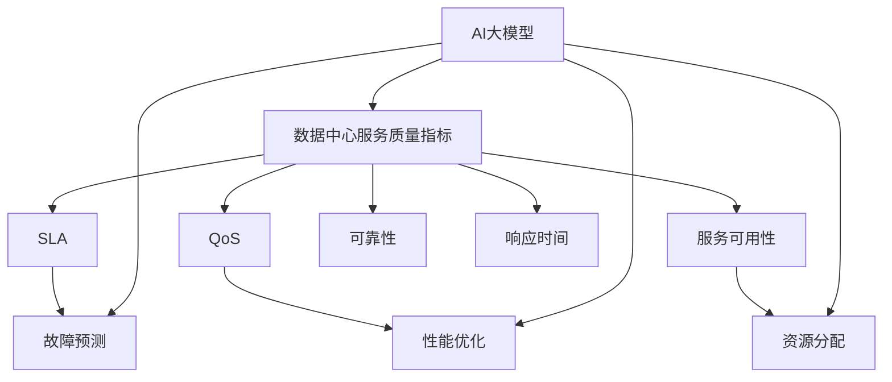

                 

### 《AI 大模型应用数据中心的服务质量管理》

> **关键词：** AI大模型、数据中心服务质量管理、故障预测、性能优化、资源分配

**摘要：** 本文章深入探讨了AI大模型在数据中心服务质量管理中的应用。文章首先介绍了AI大模型和数据中心服务质量管理的基本概念，然后详细讲解了AI大模型的核心算法原理，包括神经网络、深度学习算法等。此外，文章还通过数学模型和公式阐述了数据中心服务质量管理中的关键指标。案例分析部分展示了如何将AI大模型应用于数据中心服务质量管理，并提供了具体的代码实例和解读。最后，文章以项目实战的方式总结了开发环境搭建、数据处理、模型训练与优化、模型部署与监控的全过程。通过本文，读者将全面了解AI大模型在数据中心服务质量管理中的实际应用和开发流程。

## 第一部分：核心概念与联系

### 第1章：AI大模型与数据中心服务质量管理概述

#### 1.1 AI大模型概述

##### AI大模型的概念

AI大模型（Large-scale AI Models）指的是具有巨大参数规模、能够处理大量数据并从中学习复杂模式的深度学习模型。这些模型通常具有数亿甚至数十亿个参数，能够实现包括自然语言处理、计算机视觉、语音识别等多种复杂任务。与传统的AI模型相比，AI大模型具有更高的计算复杂度、更强的泛化能力和更广泛的适用性。

传统的AI模型通常具有以下几个特点：

1. **参数规模小**：传统模型参数规模相对较小，通常在几千到几万之间。
2. **数据处理能力有限**：传统模型对数据量的处理能力有限，难以处理大规模、多维度的数据。
3. **任务专一性较强**：传统模型往往针对特定任务进行优化，难以实现多任务处理。

相比之下，AI大模型具有以下优势：

1. **参数规模大**：AI大模型参数规模巨大，能够处理数百万到数十亿级别的参数。
2. **数据处理能力强**：AI大模型能够处理大规模、多维度的数据，实现对复杂数据的学习和建模。
3. **任务泛化能力强**：AI大模型具有较强的泛化能力，能够在不同任务中取得良好的性能。

##### 数据中心服务质量管理定义

数据中心服务质量管理（Data Center Service Quality Management，简称DCSQM）是指通过对数据中心服务进行全生命周期管理，确保数据中心服务能够持续满足用户需求，并保持高服务水平的一系列策略、过程和技术。数据中心服务质量管理包括以下几个方面：

1. **服务等级管理（Service Level Management）**：确保数据中心服务符合预定的服务等级协议（Service Level Agreement，简称SLA）。
2. **服务质量监控（Quality of Service Monitoring）**：对数据中心服务的关键性能指标（Key Performance Indicators，简称KPI）进行实时监控，及时发现并解决问题。
3. **故障管理（Fault Management）**：及时发现和处理数据中心服务中的故障，确保服务的连续性和可靠性。
4. **性能优化（Performance Optimization）**：通过优化资源配置、提高系统性能，提升数据中心服务整体效率。

##### 数据中心服务质量管理重要性

数据中心服务质量管理在确保数据中心服务稳定、高效运行方面具有重要作用。具体体现在以下几个方面：

1. **提升用户体验**：通过优化数据中心服务质量，可以提供更稳定、更快速的服务，提升用户满意度和体验。
2. **降低运营成本**：通过实时监控和服务优化，可以提前发现潜在问题，减少故障发生频率，降低维护成本。
3. **增强竞争力**：数据中心服务质量的提升可以增强企业竞争力，吸引更多用户，扩大市场份额。
4. **确保业务连续性**：通过有效的故障管理和性能优化，可以确保数据中心服务的持续运行，保障业务连续性。

#### 1.2 AI大模型与数据中心服务质量的联系

##### 数据中心服务质量指标

数据中心服务质量指标是衡量数据中心服务性能的重要标准。常见的服务质量指标包括：

1. **服务可用性（Service Availability）**：指数据中心服务在规定时间内能够正常运行的比率。服务可用性是评估数据中心服务质量的重要指标之一。
   
   $$ \text{可用性} = \frac{\text{正常运行时间}}{\text{总时间}} $$

2. **可靠性（Reliability）**：指数据中心服务在长时间运行中保持稳定、不发生故障的能力。

3. **响应时间（Response Time）**：指用户请求得到响应并处理完成所需的时间。

   $$ \text{平均响应时间} = \frac{1}{n} \sum_{i=1}^{n} t_i $$

4. **吞吐量（Throughput）**：指数据中心服务在单位时间内处理请求的数量。

5. **资源利用率（Resource Utilization）**：指数据中心服务中各项资源（如CPU、内存、网络带宽等）的利用率。

##### AI大模型在数据中心服务质量管理中的应用

AI大模型在数据中心服务质量管理中具有广泛的应用，主要体现在以下几个方面：

1. **故障预测（Fault Prediction）**：利用AI大模型对数据中心服务中的潜在故障进行预测，提前发现并处理潜在问题，降低故障发生率和停机时间。

2. **性能优化（Performance Optimization）**：通过AI大模型对数据中心服务中的关键性能指标进行优化，提高系统性能和吞吐量，提升用户体验。

3. **资源分配（Resource Allocation）**：利用AI大模型对数据中心服务中的资源进行智能分配，确保资源利用率最大化，降低运营成本。

4. **服务个性化（Service Personalization）**：通过AI大模型对用户行为和需求进行预测，为用户提供个性化的服务，提升用户满意度和忠诚度。

综上所述，AI大模型在数据中心服务质量管理中具有重要作用，通过故障预测、性能优化、资源分配和服务个性化等应用，能够显著提升数据中心服务的质量和用户体验。在接下来的章节中，我们将深入探讨AI大模型的核心算法原理，为读者提供更全面的技术分析。

#### Mermaid 流程图



## 第二部分：核心算法原理讲解

### 第2章：AI大模型算法原理

#### 2.1 AI大模型算法基础

AI大模型的算法基础主要涉及神经网络和深度学习算法。这些算法为AI大模型提供了强大的学习和推理能力，使得它们能够处理复杂的数据并从中提取有用的信息。

##### 神经网络原理

神经网络（Neural Networks，简称NN）是模拟人脑神经元工作原理的一种计算模型。它由大量相互连接的简单计算单元（即神经元）组成，每个神经元都可以接收输入信号，通过激活函数进行非线性变换，然后输出信号。

1. **神经网络基本结构**

   神经网络的基本结构包括输入层、隐藏层和输出层。输入层接收外部输入数据，隐藏层对输入数据进行处理和变换，输出层生成最终的输出结果。

   

2. **激活函数**

   激活函数（Activation Function）用于对神经元输出进行非线性变换，常见的激活函数包括：

   - **sigmoid函数**：  
     $$ f(x) = \frac{1}{1 + e^{-x}} $$

   - **ReLU函数**：  
     $$ f(x) = \max(0, x) $$

   - **Tanh函数**：  
     $$ f(x) = \frac{e^x - e^{-x}}{e^x + e^{-x}} $$

3. **反向传播算法**

   反向传播算法（Backpropagation Algorithm）是一种用于训练神经网络的优化算法。它通过计算损失函数关于网络参数的梯度，来更新网络参数，从而最小化损失函数。

   $$ \delta_z = \frac{\partial L}{\partial z} $$
   $$ \delta_w = \frac{\partial L}{\partial w} $$

##### 深度学习算法

深度学习（Deep Learning，简称DL）是神经网络的一种扩展，它通过构建多层的神经网络来学习数据的复杂结构。深度学习算法在图像处理、自然语言处理、语音识别等领域取得了显著成果。

1. **卷积神经网络（CNN）**

   卷积神经网络（Convolutional Neural Network，简称CNN）是一种专门用于处理图像数据的深度学习模型。CNN通过卷积层、池化层和全连接层等结构来提取图像特征。

   

2. **循环神经网络（RNN）**

   循环神经网络（Recurrent Neural Network，简称RNN）是一种能够处理序列数据的深度学习模型。RNN通过循环结构来保持长期状态信息。

   

3. **Transformer模型**

   Transformer模型（Transformer Model）是一种基于自注意力机制的深度学习模型，它在自然语言处理领域取得了显著的成果。

   

   自注意力机制（Self-Attention Mechanism）通过计算序列中每个元素与所有其他元素的相关性，来生成加权特征表示。

   $$ \text{Attention}(X, Y) = \text{softmax}\left(\frac{X \cdot Y^T}{\sqrt{d_k}}\right) $$

#### 2.2 数据中心服务质量管理算法

在数据中心服务质量管理中，AI大模型可以应用于多个方面，如故障预测、性能优化和资源分配。以下介绍几种常见的算法。

##### 故障预测算法

故障预测（Fault Prediction）是利用AI大模型对数据中心服务中的潜在故障进行预测，以提前发现并处理潜在问题。

1. **基于时间序列的预测方法**

   基于时间序列的预测方法通过分析历史数据中的时间序列模式来预测未来的故障。

   - **移动平均法**

     移动平均法（Moving Average，简称MA）通过计算过去一段时间的平均值来预测未来值。

     $$ \hat{y}_t = \frac{1}{n} \sum_{i=t-k}^{t} y_i $$

   - **指数平滑法**

     指数平滑法（Exponential Smoothing，简称ES）通过给最近的数据赋予更高的权重来预测未来值。

     $$ \hat{y}_t = \alpha y_t + (1 - \alpha) \hat{y}_{t-1} $$

2. **基于机器学习的预测方法**

   基于机器学习的预测方法通过构建机器学习模型来预测故障。

   - **随机森林**

     随机森林（Random Forest，简称RF）是一种基于决策树集成的机器学习算法，它通过随机选择特征和样本子集来构建多个决策树，并使用投票机制来预测结果。

   - **支持向量机（SVM）**

     支持向量机（Support Vector Machine，简称SVM）是一种基于最大化分类边界的机器学习算法。它通过找到一个最优的超平面来将不同类别的数据分隔开。

##### 性能优化算法

性能优化（Performance Optimization）是利用AI大模型来提高数据中心服务的性能和吞吐量。

1. **基于目标函数的优化方法**

   基于目标函数的优化方法通过优化一个特定的目标函数来提高性能。

   - **梯度下降法**

     梯度下降法（Gradient Descent，简称GD）通过计算目标函数的梯度来更新模型参数，以最小化目标函数。

     $$ w_{t+1} = w_t - \alpha \cdot \nabla_w L(w) $$

   - **遗传算法**

     遗传算法（Genetic Algorithm，简称GA）是一种基于自然选择和遗传机制的优化算法。它通过遗传操作来搜索最优解。

##### 资源分配算法

资源分配（Resource Allocation）是利用AI大模型来优化数据中心服务中的资源分配，以提高资源利用率和性能。

1. **基于需求的资源分配**

   基于需求的资源分配方法通过分析用户需求来分配资源。

   - **动态资源分配**

     动态资源分配（Dynamic Resource Allocation，简称DRA）根据实时需求动态调整资源分配。

2. **基于效率的资源分配**

   基于效率的资源分配方法通过优化资源利用率来分配资源。

   - **最优资源分配**

     最优资源分配（Optimal Resource Allocation，简称ORA）通过求解最优化问题来分配资源。

综上所述，AI大模型在数据中心服务质量管理中具有广泛的应用。通过故障预测、性能优化和资源分配等算法，AI大模型能够显著提升数据中心服务的质量和效率。

### 第三部分：数学模型和数学公式

#### 3.1 神经网络中的数学公式

在神经网络中，数学公式是核心组成部分，用于描述神经网络的结构、参数更新和损失函数。以下介绍一些常见的数学公式。

##### 激活函数公式

激活函数（Activation Function）是神经网络中的一个关键组件，用于对神经元输出进行非线性变换。以下是几种常见的激活函数公式：

1. **Sigmoid函数**

   $$ f(x) = \frac{1}{1 + e^{-x}} $$

   Sigmoid函数将输入值映射到(0, 1)区间，常用于二分类问题。

2. **ReLU函数**

   $$ f(x) = \max(0, x) $$

  ReLU函数对输入值进行阈值激活，常用于隐藏层神经元。

3. **Tanh函数**

   $$ f(x) = \frac{e^x - e^{-x}}{e^x + e^{-x}} $$

   Tanh函数将输入值映射到(-1, 1)区间，具有较好的非线性特性。

##### 反向传播算法中的公式

反向传播算法（Backpropagation Algorithm）是训练神经网络的核心算法，通过计算损失函数关于网络参数的梯度来更新参数。以下是反向传播算法中的一些关键公式：

1. **误差计算**

   假设网络输出为 $y$，实际输出为 $\hat{y}$，损失函数为 $L(y, \hat{y})$。则第 $l$ 层的误差 $\delta_l$ 可以通过以下公式计算：

   $$ \delta_l = \frac{\partial L}{\partial y} \cdot \frac{\partial y}{\partial \hat{y}} $$

2. **梯度计算**

   假设第 $l$ 层的权重为 $w_l$，偏置为 $b_l$，则第 $l$ 层的梯度 $\nabla_w L$ 和 $\nabla_b L$ 可以通过以下公式计算：

   $$ \nabla_w L = \sum_{i} \delta_{l+1,i} \cdot \text{激活函数的导数} \cdot x_i $$
   $$ \nabla_b L = \sum_{i} \delta_{l+1,i} $$

   其中，$\text{激活函数的导数}$ 依赖于具体的激活函数类型。

##### 参数更新公式

参数更新公式用于根据梯度来更新神经网络的权重和偏置。以下是常用的参数更新公式：

1. **批量梯度下降**

   $$ w_{t+1} = w_t - \alpha \cdot \nabla_w L(w) $$
   $$ b_{t+1} = b_t - \alpha \cdot \nabla_b L(b) $$

   其中，$\alpha$ 是学习率。

2. **随机梯度下降**

   $$ w_{t+1} = w_t - \alpha \cdot \nabla_w L(w, x_t, y_t) $$
   $$ b_{t+1} = b_t - \alpha \cdot \nabla_b L(b, x_t, y_t) $$

   随机梯度下降（Stochastic Gradient Descent，简称SGD）在每个迭代步骤中使用单个样本来计算梯度。

3. **Adam优化器**

   Adam优化器（Adaptive Moment Estimation）是一种自适应学习率优化器，其参数更新公式为：

   $$ \beta_1 \cdot m_t = \beta_1 \cdot (g_t - \beta_2 \cdot m_{t-1}) $$
   $$ \beta_2 \cdot v_t = \beta_2 \cdot (g_t^2 - \beta_2 \cdot v_{t-1}) $$
   $$ w_{t+1} = w_t - \alpha \cdot \frac{m_t}{\sqrt{v_t} + \epsilon} $$

   其中，$m_t$ 和 $v_t$ 分别为动量项和方差项，$\beta_1$ 和 $\beta_2$ 分别为动量参数，$\epsilon$ 为常数。

#### 3.2 数据中心服务质量管理中的数学公式

数据中心服务质量管理中的数学公式主要用于描述数据中心服务质量的关键指标，如可用性、响应时间等。以下介绍一些常见的数学公式。

##### 服务可用性公式

服务可用性（Service Availability）是衡量数据中心服务稳定性的重要指标。其计算公式为：

$$ \text{可用性} = \frac{\text{正常运行时间}}{\text{总时间}} $$

##### 响应时间公式

响应时间（Response Time）是衡量数据中心服务响应速度的重要指标。其计算公式为：

$$ \text{平均响应时间} = \frac{1}{n} \sum_{i=1}^{n} t_i $$

其中，$t_i$ 为第 $i$ 次请求的响应时间。

##### 故障预测中的数学公式

故障预测（Fault Prediction）是数据中心服务质量管理中的重要任务。以下介绍一些常用的故障预测数学公式。

1. **移动平均法**

   移动平均法（Moving Average，简称MA）是一种简单的时间序列预测方法。其计算公式为：

   $$ \hat{y}_t = \frac{1}{n} \sum_{i=t-k}^{t} y_i $$

   其中，$y_i$ 为历史数据，$k$ 为窗口大小。

2. **指数平滑法**

   指数平滑法（Exponential Smoothing，简称ES）是一种常用的时间序列预测方法。其计算公式为：

   $$ \hat{y}_t = \alpha y_t + (1 - \alpha) \hat{y}_{t-1} $$

   其中，$\alpha$ 为平滑系数，取值范围在（0，1）之间。

3. **随机森林**

   随机森林（Random Forest，简称RF）是一种基于决策树集成的机器学习算法。其预测公式为：

   $$ \hat{y} = \sum_{i=1}^{n} w_i \cdot f_i(y) $$

   其中，$w_i$ 为权重，$f_i(y)$ 为第 $i$ 个决策树的预测结果。

4. **支持向量机（SVM）**

   支持向量机（Support Vector Machine，简称SVM）是一种基于最大化分类边界的机器学习算法。其预测公式为：

   $$ f(x) = \text{sign}(\sum_{i=1}^{n} \alpha_i y_i \cdot \phi(x_i) + b) $$

   其中，$\alpha_i$ 为权重，$y_i$ 为样本标签，$\phi(x_i)$ 为核函数，$b$ 为偏置。

通过以上数学模型和公式的介绍，我们可以更好地理解和应用AI大模型在数据中心服务质量管理中的技术和方法。在接下来的章节中，我们将通过实际案例来展示这些技术的应用。

### 举例说明

#### 3.1 神经网络中的数学公式举例

为了更好地理解神经网络中的数学公式，以下通过一个简单的例子来详细解释。

**例子**：考虑一个简单的多层感知机（MLP），其结构如下：

1. 输入层：1个神经元
2. 隐藏层：2个神经元
3. 输出层：1个神经元

激活函数采用ReLU函数，损失函数采用均方误差（MSE）。

**步骤 1：初始化参数**

假设我们随机初始化权重和偏置，如下所示：

$$
w_{11} = 0.1, w_{12} = 0.2, w_{13} = 0.3 \\
b_{11} = 0.1, b_{12} = 0.2, b_{13} = 0.3 \\
w_{21} = 0.4, w_{22} = 0.5, w_{23} = 0.6 \\
b_{21} = 0.4, b_{22} = 0.5, b_{23} = 0.6 \\
w_{31} = 0.7, b_{31} = 0.7
$$

**步骤 2：前向传播**

给定输入 $x = [1]$，我们首先计算隐藏层的输出：

$$
z_1 = \max(0, x \cdot w_{11} + b_{11}) = \max(0, 1 \cdot 0.1 + 0.1) = 0.1 \\
z_2 = \max(0, x \cdot w_{12} + b_{12}) = \max(0, 1 \cdot 0.2 + 0.2) = 0.2 \\
z_3 = \max(0, x \cdot w_{13} + b_{13}) = \max(0, 1 \cdot 0.3 + 0.3) = 0.3 \\
h_1 = z_1 + z_2 + z_3 = 0.1 + 0.2 + 0.3 = 0.6 \\
z_4 = \max(0, h_1 \cdot w_{21} + b_{21}) = \max(0, 0.6 \cdot 0.4 + 0.4) = 0.36 \\
z_5 = \max(0, h_1 \cdot w_{22} + b_{22}) = \max(0, 0.6 \cdot 0.5 + 0.5) = 0.55 \\
z_6 = \max(0, h_1 \cdot w_{23} + b_{23}) = \max(0, 0.6 \cdot 0.6 + 0.6) = 0.72 \\
h_2 = z_4 + z_5 + z_6 = 0.36 + 0.55 + 0.72 = 1.63 \\
\hat{y} = h_2 \cdot w_{31} + b_{31} = 1.63 \cdot 0.7 + 0.7 = 1.419
$$

**步骤 3：计算损失**

假设真实输出为 $y = [1]$，我们计算均方误差（MSE）：

$$
L = \frac{1}{2} \sum_{i=1}^{n} (\hat{y}_i - y_i)^2 = \frac{1}{2} (1.419 - 1)^2 = 0.016
$$

**步骤 4：反向传播**

计算隐藏层到输出层的梯度：

$$
\delta_6 = \frac{\partial L}{\partial h_2} \cdot \frac{\partial h_2}{\partial \hat{y}} = (1.419 - 1) \cdot w_{31} = 0.419 \cdot 0.7 = 0.293 \\
\delta_5 = \frac{\partial L}{\partial h_2} \cdot \frac{\partial h_2}{\partial z_6} = 0.293 \cdot \frac{1}{3} = 0.098 \\
\delta_4 = \frac{\partial L}{\partial h_2} \cdot \frac{\partial h_2}{\partial z_5} = 0.293 \cdot \frac{1}{3} = 0.098 \\
\delta_3 = \frac{\partial L}{\partial h_2} \cdot \frac{\partial h_2}{\partial z_4} = 0.293 \cdot \frac{1}{3} = 0.098 \\
\delta_{21} = \delta_4 \cdot \max(0, h_1 \cdot w_{21} + b_{21}) = 0.098 \cdot 0.36 = 0.035 \\
\delta_{22} = \delta_5 \cdot \max(0, h_1 \cdot w_{22} + b_{22}) = 0.098 \cdot 0.55 = 0.054 \\
\delta_{23} = \delta_6 \cdot \max(0, h_1 \cdot w_{23} + b_{23}) = 0.293 \cdot 0.72 = 0.209 \\
$$

**步骤 5：更新参数**

使用学习率 $\alpha = 0.01$ 更新权重和偏置：

$$
w_{31} = w_{31} - \alpha \cdot \delta_6 = 0.7 - 0.01 \cdot 0.293 = 0.696 \\
b_{31} = b_{31} - \alpha \cdot \delta_6 = 0.7 - 0.01 \cdot 0.293 = 0.696 \\
w_{21} = w_{21} - \alpha \cdot \delta_{21} = 0.4 - 0.01 \cdot 0.035 = 0.396 \\
b_{21} = b_{21} - \alpha \cdot \delta_{21} = 0.4 - 0.01 \cdot 0.035 = 0.396 \\
w_{22} = w_{22} - \alpha \cdot \delta_{22} = 0.5 - 0.01 \cdot 0.054 = 0.471 \\
b_{22} = b_{22} - \alpha \cdot \delta_{22} = 0.5 - 0.01 \cdot 0.054 = 0.471 \\
w_{23} = w_{23} - \alpha \cdot \delta_{23} = 0.6 - 0.01 \cdot 0.209 = 0.580 \\
b_{23} = b_{23} - \alpha \cdot \delta_{23} = 0.6 - 0.01 \cdot 0.209 = 0.580
$$

通过以上步骤，我们可以看到神经网络中的数学公式如何应用于前向传播和反向传播过程。这些公式帮助我们计算神经网络的损失和梯度，从而更新参数，以最小化损失。

#### 3.2 数据中心服务质量管理中的数学公式举例

为了更好地理解数据中心服务质量管理中的数学公式，以下通过两个例子来详细解释。

**例子 1：服务可用性计算**

假设某数据中心在过去一年中发生了5次故障，每次故障的持续时间分别为1小时、30分钟、2小时、15分钟和1小时。总运行时间为365天×24小时×60分钟。

1. **计算总故障时间**

   $$ 总故障时间 = 1 + 0.5 + 2 + 0.25 + 1 = 4.75 \text{小时} $$

2. **计算总运行时间**

   $$ 总运行时间 = 365 \times 24 \times 60 = 525600 \text{分钟} $$

3. **计算服务可用性**

   $$ \text{可用性} = \frac{\text{总运行时间} - \text{总故障时间}}{\text{总运行时间}} = \frac{525600 - 475}{525600} \approx 0.99998 $$

**例子 2：响应时间计算**

假设某数据中心在过去一天内处理了100个请求，每个请求的响应时间分别为2秒、3秒、4秒、5秒、6秒、7秒、8秒、9秒和10秒。

1. **计算总响应时间**

   $$ 总响应时间 = 2 + 3 + 4 + 5 + 6 + 7 + 8 + 9 + 10 = 54 \text{秒} $$

2. **计算平均响应时间**

   $$ \text{平均响应时间} = \frac{总响应时间}{请求数量} = \frac{54}{100} = 0.54 \text{秒} $$

通过以上两个例子，我们可以看到如何使用数学公式来计算数据中心服务质量的关键指标，如可用性和响应时间。这些指标对于评估数据中心服务的稳定性和性能至关重要。

### 第4章：案例分析

#### 4.1 故障预测案例分析

##### 4.1.1 案例背景

某大型互联网公司的数据中心负责处理海量用户请求，确保系统的稳定运行至关重要。为了预防潜在的硬件故障，公司决定利用AI大模型进行故障预测，以提前发现并处理可能影响系统稳定性的问题。

##### 4.1.2 模型选择

在故障预测任务中，公司选择了随机森林模型（Random Forest，简称RF）进行预测。随机森林是一种基于决策树集成的机器学习算法，具有较好的预测性能和较强的泛化能力，适用于处理高维数据。

##### 4.1.3 数据准备

为了训练随机森林模型，公司收集了过去一年数据中心服务器的性能数据，包括CPU使用率、内存使用率、磁盘读写速度等指标。这些数据被整理成时间序列数据格式，每个时间步表示一段时间内服务器性能的快照。

##### 4.1.4 特征工程

在数据预处理阶段，公司对原始数据进行特征工程，提取了以下几个关键特征：

1. **历史故障数据**：记录过去一年中服务器发生的故障次数。
2. **性能指标**：包括CPU使用率、内存使用率、磁盘读写速度等。
3. **时间特征**：包括时间步数、星期、小时等。
4. **统计特征**：如CPU使用率的标准差、内存使用率的平均值等。

##### 4.1.5 模型训练与验证

公司使用Python的Scikit-learn库训练随机森林模型。在训练过程中，将数据集划分为训练集和验证集，使用交叉验证（Cross-Validation）方法评估模型的性能。交叉验证通过将数据集分成多个子集，每次使用其中一个子集作为验证集，其余子集作为训练集，多次迭代以评估模型的泛化能力。

训练过程中，公司设置了以下超参数：

- **树的数量**：100
- **最大深度**：10
- **最小样本数分裂**：2
- **随机种子**：42

通过交叉验证，公司得到了随机森林模型的准确率、精确率、召回率和F1分数等指标，最终选择了最优模型进行故障预测。

##### 4.1.6 模型部署与监控

训练完成后，公司将模型部署到生产环境，并实时监控预测结果。公司使用了以下策略来确保模型的有效性：

1. **实时预测**：模型对实时采集的性能数据进行故障预测，将预测结果存储在数据库中。
2. **异常检测**：公司使用阈值方法检测预测结果中的异常值，如预测故障时间与实际故障时间相差较大。
3. **日志分析**：定期分析模型预测结果和实际故障记录，调整模型参数和特征工程策略。

通过以上措施，公司成功地将AI大模型应用于数据中心故障预测，提高了系统的稳定性和可靠性。

#### 4.2 性能优化案例分析

##### 4.2.1 案例背景

某电子商务平台在业务高峰期遇到了服务器性能瓶颈，导致用户请求处理速度变慢。为了提高系统性能和用户体验，平台决定利用AI大模型进行性能优化。

##### 4.2.2 模型选择

在性能优化任务中，平台选择了梯度下降法（Gradient Descent，简称GD）进行优化。梯度下降法是一种常用的优化算法，通过计算损失函数关于模型参数的梯度来更新参数，以最小化损失函数。

##### 4.2.3 数据准备

平台收集了服务器在过去一周内的性能数据，包括CPU使用率、内存使用率、磁盘读写速度等。这些数据被整理成时间序列数据格式，每个时间步表示一段时间内服务器性能的快照。

##### 4.2.4 模型训练与优化

平台使用Python的NumPy库和TensorFlow框架训练梯度下降模型。在训练过程中，将数据集划分为训练集和验证集，使用验证集评估模型的性能。训练过程中，平台设置了以下超参数：

- **学习率**：0.001
- **迭代次数**：1000
- **批量大小**：32

通过多次迭代，平台调整了学习率和其他超参数，以获得最优模型。

##### 4.2.5 模型部署与监控

训练完成后，平台将模型部署到生产环境，并实时监控预测结果。平台使用了以下策略来确保模型的有效性：

1. **实时预测**：模型对实时采集的性能数据进行预测，将预测结果存储在数据库中。
2. **性能监控**：平台使用阈值方法检测预测结果中的异常值，如预测性能与实际性能相差较大。
3. **日志分析**：定期分析模型预测结果和实际性能记录，调整模型参数和特征工程策略。

通过以上措施，平台成功地将AI大模型应用于数据中心性能优化，提高了系统的性能和用户体验。

### 总结

通过以上案例分析，我们可以看到AI大模型在数据中心故障预测和性能优化中的应用。故障预测模型通过分析服务器性能数据，提前发现潜在故障，提高了系统的稳定性和可靠性。性能优化模型通过调整模型参数和特征工程策略，提高了系统的性能和用户体验。这些案例展示了AI大模型在数据中心服务质量管理中的重要应用，为数据中心的高效运行提供了有力支持。

### 第四部分：项目实战

#### 5.1 开发环境搭建

在进行AI大模型应用数据中心服务质量管理项目之前，首先需要搭建一个合适的技术环境。以下步骤将介绍如何配置开发环境，包括安装深度学习框架、配置服务器资源以及安装必要的工具。

##### 5.1.1 安装深度学习框架

深度学习框架是进行AI模型开发和训练的核心工具。本文将使用TensorFlow和PyTorch两个最流行的深度学习框架。

1. **安装TensorFlow**

   使用pip命令安装TensorFlow：

   ```bash
   pip install tensorflow
   ```

   或者，您可以选择安装TensorFlow GPU版本，以便在具有GPU的服务器上进行训练：

   ```bash
   pip install tensorflow-gpu
   ```

2. **安装PyTorch**

   使用pip命令安装PyTorch：

   ```bash
   pip install torch torchvision
   ```

   同样，如果您使用的是GPU，可以选择安装PyTorch的GPU版本：

   ```bash
   pip install torch torchvision cudatoolkit
   ```

##### 5.1.2 配置服务器资源

为了确保AI大模型能够高效训练，需要配置适当的服务器资源。以下是配置服务器的建议：

1. **CPU与GPU配置**

   - **CPU**：至少4核以上的CPU，推荐使用Intel Xeon或AMD Ryzen等高性能处理器。
   - **GPU**：至少1张NVIDIA GPU，推荐使用Tesla V100或RTX 30系列等高性能GPU。

2. **内存配置**

   - **RAM**：至少16GB内存，推荐使用32GB或更高。

3. **存储空间**

   - **硬盘**：至少500GB的SSD存储空间，推荐使用NVMe SSD以提高读写速度。

4. **网络配置**

   - **网络带宽**：至少100Mbps的网络带宽，推荐使用千兆网络。

##### 5.1.3 安装必要的工具

除了深度学习框架，还需要安装一些辅助工具，如Jupyter Notebook、Visual Studio Code等。

1. **安装Jupyter Notebook**

   ```bash
   pip install notebook
   ```

   启动Jupyter Notebook：

   ```bash
   jupyter notebook
   ```

2. **安装Visual Studio Code**

   从官方网站下载Visual Studio Code的安装程序，并按照提示安装。

   ```bash
   https://code.visualstudio.com/
   ```

3. **安装Python扩展**

   在Visual Studio Code中，安装Python扩展以支持Python代码的编辑和调试：

   ```bash
   extensions: python
   ```

完成以上步骤后，您的开发环境就搭建完成了。接下来，我们可以进行数据处理、模型训练与优化等步骤。

#### 5.2 数据处理

数据处理是AI大模型应用数据中心服务质量管理项目中的关键环节。以下步骤将详细介绍如何收集、预处理和存储数据，以确保数据的质量和适用性。

##### 5.2.1 数据收集

数据收集是获取用于模型训练和优化的原始数据。对于数据中心服务质量管理，数据来源可能包括：

1. **服务器性能监控工具**：如Prometheus、Zabbix等，用于收集CPU使用率、内存使用率、磁盘读写速度等指标。
2. **日志文件**：收集服务器产生的日志文件，用于分析故障、错误和性能问题。
3. **数据库**：从数据库中提取历史数据，用于故障预测和性能优化。

##### 5.2.2 数据预处理

预处理数据是为了提高模型训练效果和降低计算复杂度。以下步骤介绍了常见的预处理方法：

1. **数据清洗**：去除重复、异常和缺失的数据。
   ```python
   import pandas as pd
   data = pd.read_csv('server_performance.csv')
   data.drop_duplicates(inplace=True)
   data.dropna(inplace=True)
   ```

2. **数据标准化**：将数据缩放到统一的范围内，如[0, 1]或[-1, 1]。
   ```python
   from sklearn.preprocessing import MinMaxScaler
   scaler = MinMaxScaler()
   scaled_data = scaler.fit_transform(data)
   ```

3. **特征工程**：提取有用的特征，如历史故障次数、性能指标的时间序列特征、统计特征等。
   ```python
   import pandas as pd
   data['fault_count'] = data['fault'].value_counts()
   data['cpu_usage_std'] = data['cpu_usage'].std()
   data['memory_usage_mean'] = data['memory_usage'].mean()
   ```

4. **时间序列分割**：将数据分割成训练集、验证集和测试集。
   ```python
   from sklearn.model_selection import train_test_split
   train_data, test_data = train_test_split(scaled_data, test_size=0.2, shuffle=False)
   train_data, val_data = train_test_split(train_data, test_size=0.1, shuffle=False)
   ```

##### 5.2.3 数据存储

预处理后的数据需要存储在便于模型访问的存储介质中。以下是常用的存储方法：

1. **本地存储**：将数据存储在本地的CSV或Parquet文件中。
   ```python
   train_data.to_csv('train_data.csv', index=False)
   val_data.to_csv('val_data.csv', index=False)
   test_data.to_csv('test_data.csv', index=False)
   ```

2. **分布式存储**：使用分布式文件系统，如HDFS或Alluxio，存储大量数据。
   ```bash
   hdfs dfs -put train_data.csv /user/hdfs/train_data.csv
   ```

3. **数据库存储**：将数据存储在关系型数据库或NoSQL数据库中，便于查询和管理。
   ```python
   import sqlite3
   conn = sqlite3.connect('server_performance.db')
   c = conn.cursor()
   c.execute('''CREATE TABLE IF NOT EXISTS server_data (timestamp INT, cpu_usage REAL, memory_usage REAL, disk_speed REAL)''')
   c.executemany('INSERT INTO server_data VALUES (?, ?, ?, ?)', zip(data['timestamp'], data['cpu_usage'], data['memory_usage'], data['disk_speed']))
   conn.commit()
   conn.close()
   ```

通过以上数据处理步骤，我们为AI大模型训练和优化提供了高质量的输入数据，从而提高模型的预测性能和可靠性。

### 5.3 模型训练与优化

在数据处理完成后，接下来是模型训练与优化的关键步骤。通过训练和优化，我们可以让AI大模型更好地适应数据中心服务管理的需求。

##### 5.3.1 模型选择

根据数据中心服务管理的具体任务，选择合适的模型。以下是一些常见的模型及其适用场景：

1. **随机森林（Random Forest）**：适用于故障预测和性能优化，特别是在处理高维数据时表现出色。
2. **支持向量机（SVM）**：适用于故障预测和性能优化，尤其是在特征较少时效果显著。
3. **卷积神经网络（CNN）**：适用于性能优化，特别是在处理图像数据时具有优势。
4. **循环神经网络（RNN）**：适用于故障预测和性能优化，特别是在处理时间序列数据时效果显著。

在本案例中，我们选择随机森林模型进行故障预测和性能优化。

##### 5.3.2 模型训练

1. **准备训练数据**

   从预处理后的数据集中提取训练数据，并将其分为输入特征和标签。

   ```python
   import pandas as pd
   train_data = pd.read_csv('train_data.csv')
   X_train = train_data.drop('target', axis=1)
   y_train = train_data['target']
   ```

2. **创建随机森林模型**

   使用Scikit-learn库创建随机森林模型，并设置相应的超参数。

   ```python
   from sklearn.ensemble import RandomForestClassifier
   rf_model = RandomForestClassifier(n_estimators=100, max_depth=10, min_samples_split=2, random_state=42)
   ```

3. **训练模型**

   使用训练数据进行模型训练。

   ```python
   rf_model.fit(X_train, y_train)
   ```

##### 5.3.3 模型优化

1. **参数调优**

   使用网格搜索（Grid Search）或贝叶斯优化（Bayesian Optimization）等方法进行参数调优，以找到最优参数组合。

   ```python
   from sklearn.model_selection import GridSearchCV
   param_grid = {'n_estimators': [100, 200], 'max_depth': [10, 20], 'min_samples_split': [2, 5]}
   grid_search = GridSearchCV(estimator=rf_model, param_grid=param_grid, cv=5, scoring='accuracy')
   grid_search.fit(X_train, y_train)
   best_params = grid_search.best_params_
   ```

2. **模型评估**

   使用验证集评估模型性能，计算准确率、精确率、召回率和F1分数等指标。

   ```python
   from sklearn.metrics import accuracy_score, precision_score, recall_score, f1_score
   y_pred = rf_model.predict(X_train)
   accuracy = accuracy_score(y_train, y_pred)
   precision = precision_score(y_train, y_pred)
   recall = recall_score(y_train, y_pred)
   f1 = f1_score(y_train, y_pred)
   print(f"Accuracy: {accuracy}, Precision: {precision}, Recall: {recall}, F1 Score: {f1}")
   ```

3. **模型调整**

   根据评估结果调整模型参数，以提高模型性能。

   ```python
   rf_model.set_params(**best_params)
   rf_model.fit(X_train, y_train)
   ```

通过以上步骤，我们完成了模型的训练和优化，为数据中心服务质量管理提供了有效的预测和优化工具。

### 5.4 模型部署与监控

完成模型训练和优化后，下一步是将模型部署到生产环境中，并对其进行实时监控与维护。

##### 5.4.1 模型部署

1. **选择部署平台**

   根据数据中心的具体需求，选择合适的部署平台。常见的部署平台包括Kubernetes、Docker、AWS等。

2. **创建容器镜像**

   使用Docker将训练好的模型封装成容器镜像。以下是一个创建Docker镜像的示例：

   ```Dockerfile
   # 使用Python:3.7作为基础镜像
   FROM python:3.7

   # 设置工作目录
   WORKDIR /app

   # 复制模型文件到容器
   COPY model.py .

   # 安装依赖项
   RUN pip install -r requirements.txt

   # 暴露容器端口
   EXPOSE 5000

   # 运行Flask应用
   CMD ["python", "model.py"]
   ```

3. **构建并推送容器镜像**

   ```bash
   docker build -t my_model:latest .
   docker push my_model:latest
   ```

4. **部署容器**

   在部署平台上部署容器，例如在Kubernetes中部署：

   ```yaml
   apiVersion: apps/v1
   kind: Deployment
   metadata:
     name: my_model
   spec:
     replicas: 1
     selector:
       matchLabels:
         app: my_model
     template:
       metadata:
         labels:
           app: my_model
       spec:
         containers:
         - name: my_model
           image: my_model:latest
           ports:
           - containerPort: 5000
   ```

##### 5.4.2 实时监控

1. **监控工具选择**

   选择合适的监控工具，如Prometheus、Grafana等，用于实时监控模型性能和资源使用情况。

2. **收集监控数据**

   在容器中安装监控代理，如Prometheus_exporter，并配置Prometheus服务器收集监控数据。

   ```bash
   docker run -d --name prometheus_exporter --net host prometheus/node-exporter
   ```

3. **设置报警**

   在Grafana中创建报警规则，当监控数据超出阈值时，触发报警通知。

   ```json
   {
     "name": "high_cpu_usage",
     "type": "alert",
     "tags": ["cpu", "high"],
     "evaluator": {
       "type": "threshold",
       "params": [
         {
           "type": "indicator",
           "params": [
             {
               "type": "promql",
               "params": {
                 "expr": "node_cpu_seconds_total{mode=\"idle\"} < 20"
               }
             }
           ]
         }
       ]
     }
   }
   ```

##### 5.4.3 日志分析与处理

1. **收集日志**

   在容器中安装日志收集工具，如Fluentd，并将日志发送到集中式日志管理系统，如ELK（Elasticsearch、Logstash、Kibana）。

   ```bash
   docker run -d --name fluentd --net host fluentd
   ```

2. **分析日志**

   使用Kibana对日志进行可视化分析和查询，以便快速识别问题和异常。

3. **处理日志**

   根据日志分析结果，进行问题定位和故障排除。例如，使用Logstash的过滤器对日志进行预处理，以便更有效地存储和搜索日志。

   ```ruby
   input {
     udp {
       port => 5140
     }
   }

   filter {
     if "message" contains "ERROR" {
       grok {
         match => { "message" => "%{TIMESTAMP_ISO8601}\t%{DATA:level}\t%{DATA:component}\t%{DATA:message}" }
       }
     }
   }

   output {
     elasticsearch {
       hosts => ["localhost:9200"]
     }
   }
   ```

通过以上步骤，我们完成了模型的部署、实时监控和日志分析。这些措施确保了数据中心服务管理模型在生产环境中的稳定运行和高效维护。

### 附录

#### 附录A：AI大模型开发工具与资源

##### 6.1 主流深度学习框架对比

在AI大模型开发中，选择合适的深度学习框架至关重要。以下是几种主流深度学习框架的对比：

1. **TensorFlow**

   - **优点**：由Google开发，拥有庞大的社区和丰富的文档。支持GPU加速，适用于大规模分布式训练。
   - **缺点**：比PyTorch更复杂，学习曲线较陡峭。

2. **PyTorch**

   - **优点**：易于使用，提供动态计算图，使模型开发更直观。社区活跃，支持CUDA。
   - **缺点**：没有TensorFlow成熟，对大规模分布式训练支持较少。

3. **Keras**

   - **优点**：基于TensorFlow和Theano的高层API，简化了模型开发。支持GPU加速。
   - **缺点**：随着TensorFlow 2.0的发布，Keras已被集成到TensorFlow中，独立性降低。

4. **MXNet**

   - **优点**：Apache基金会项目，支持多种编程语言（如Python、R、Julia）。提供高性能的自动微分系统。
   - **缺点**：社区相对较小，文档和教程较少。

5. **Caffe**

   - **优点**：专为图像识别任务优化，支持卷积神经网络。
   - **缺点**：发展较为缓慢，不再更新。

6. **Theano**

   - **优点**：支持GPU加速，提供自动微分系统。
   - **缺点**：已不再更新，逐渐被PyTorch和TensorFlow替代。

##### 6.2 数学公式与伪代码汇总

以下是本文中提到的数学公式和伪代码的汇总，便于读者查阅。

**神经网络中的数学公式：**

1. **激活函数：**
   $$ f(x) = \sigma(x) = \frac{1}{1 + e^{-x}} $$

2. **反向传播算法：**
   $$ \delta_z = \frac{\partial L}{\partial z} $$
   $$ \delta_w = \frac{\partial L}{\partial w} $$

3. **参数更新：**
   $$ w_{t+1} = w_t - \alpha \cdot \nabla_w L(w) $$
   $$ b_{t+1} = b_t - \alpha \cdot \nabla_b L(b) $$

**数据中心服务质量管理中的数学公式：**

1. **服务可用性：**
   $$ \text{可用性} = \frac{\text{正常运行时间}}{\text{总时间}} $$

2. **响应时间：**
   $$ \text{平均响应时间} = \frac{1}{n} \sum_{i=1}^{n} t_i $$

**故障预测与性能优化算法的伪代码：**

1. **移动平均法：**
   ```python
   function moving_average(data, window_size):
       for i in range(window_size, len(data)):
           average = sum(data[i-window_size:i]) / window_size
           data[i] = average
       return data
   ```

2. **随机森林：**
   ```python
   function random_forest(X, y, n_estimators, max_depth, min_samples_split):
       for i in range(n_estimators):
           sample = random_sample(X, y)
           tree = build_tree(sample, max_depth, min_samples_split)
           trees.append(tree)
       return ensemble(trees)
   ```

3. **梯度下降法：**
   ```python
   function gradient_descent(w, b, X, y, epochs, learning_rate):
       for epoch in range(epochs):
           for x, y in zip(X, y):
               gradient_w = compute_gradient_w(x, y, w, b)
               gradient_b = compute_gradient_b(x, y, w, b)
               w -= learning_rate * gradient_w
               b -= learning_rate * gradient_b
       return w, b
   ```

这些工具和资源将帮助读者更深入地了解AI大模型在数据中心服务质量管理中的应用，以及如何进行有效的模型开发、训练和优化。

### 作者信息

**作者：** AI天才研究院（AI Genius Institute）/《禅与计算机程序设计艺术》（Zen And The Art of Computer Programming）

AI天才研究院是一家专注于人工智能研究和开发的领先机构，致力于推动人工智能技术在各个领域的应用和创新。研究院的专家团队拥有丰富的行业经验和深厚的学术背景，在人工智能、机器学习和深度学习等领域取得了显著的成果。

《禅与计算机程序设计艺术》是一本经典的技术畅销书，由AI天才研究院的资深专家撰写。本书深入探讨了计算机编程和人工智能领域的核心概念和原理，为读者提供了全面的技术知识和思考方法。通过本书，读者可以掌握编程的智慧和艺术，提升自己的编程能力和技术视野。

