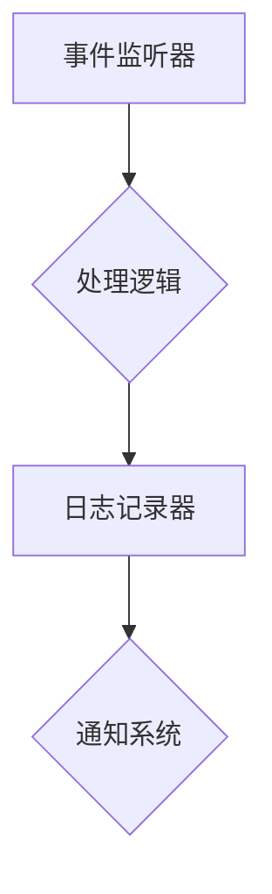
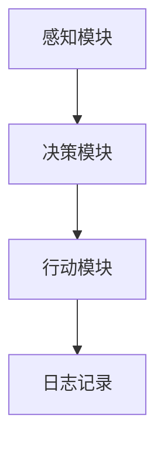
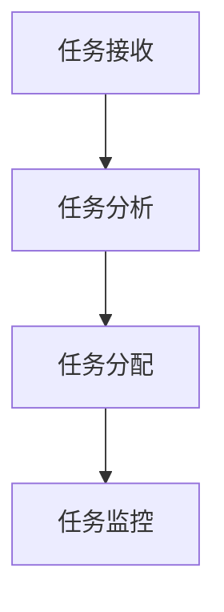
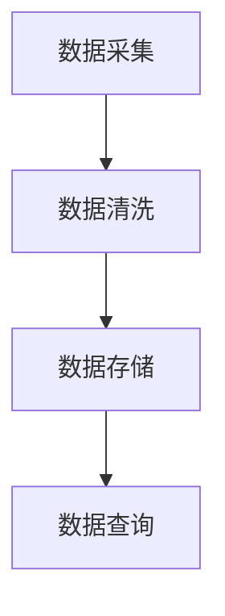
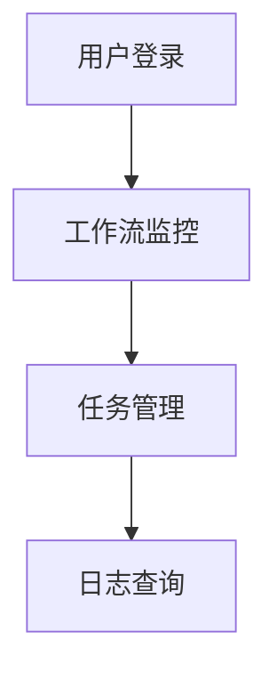
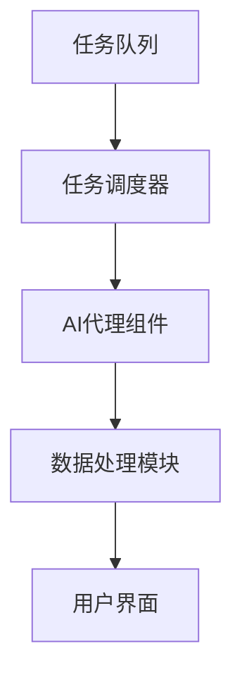

                 

### 文章标题

# AI人工智能代理工作流AI Agent WorkFlow：AI代理性能监控指标与分析技术

> **关键词：** AI代理，工作流，性能监控，指标分析，AI性能优化

> **摘要：** 本文深入探讨了AI人工智能代理工作流（AI Agent WorkFlow）的设计与实现，重点分析了AI代理性能监控指标及其分析方法，旨在为开发者提供全面的技术指南，帮助优化AI代理的性能，提升工作效率和系统稳定性。

### 目录大纲

## 第一部分: 引言与背景

### 第1章: AI代理工作流概述

### 第2章: AI代理工作流设计原则与方法

### 第3章: AI代理工作流的关键组件

### 第4章: AI代理工作流实现技术

### 第5章: AI代理工作流实例分析

## 第二部分: AI代理工作流设计与实现

### 第6章: AI代理工作流设计原则

### 第7章: AI代理工作流关键组件

### 第8章: AI代理工作流实现技术

### 第9章: AI代理工作流实例分析

## 第三部分: AI代理性能监控与分析

### 第6章: AI代理性能监控指标

### 第7章: AI代理性能分析技术

### 第8章: AI代理性能监控工具与应用

### 第9章: AI代理工作流案例分析

## 第四部分: AI代理工作流案例分析

### 第10章: 案例设计与实现

### 第11章: 案例评估与总结

## 附录

### 附录 A: AI代理工作流相关资源

---

### 引言与背景

#### AI代理的定义

AI代理，也称为人工智能代理，是一种计算机程序，能够代表用户或系统在复杂环境中执行任务和决策。它通过模拟人类的思维过程，结合机器学习和自然语言处理等技术，能够自主地处理信息、解决问题，并在多种场景下实现自动化操作。AI代理的出现，极大地提升了工作效率，减轻了人工负担，成为现代工作流程中不可或缺的一部分。

#### AI代理在现代工作流程中的应用场景

随着人工智能技术的不断进步，AI代理的应用场景越来越广泛。以下是AI代理在几个典型领域的应用：

1. **客户服务**：AI代理可以模拟客服代表，通过聊天机器人与客户互动，提供24/7全天候的服务，提高客户满意度。

2. **生产自动化**：在制造业中，AI代理可以监控生产设备，预测故障，并优化生产流程，提高生产效率。

3. **金融交易**：AI代理在金融领域被用于算法交易，通过分析市场数据，自动执行买卖决策，实现高频交易。

4. **智能家居**：AI代理可以控制家庭设备，如灯光、空调等，根据用户习惯和环境变化自动调节，提升生活质量。

5. **医疗诊断**：AI代理通过分析医学影像和患者数据，辅助医生进行诊断，提高诊断准确率。

#### AI代理工作流的概念与结构

AI代理工作流是一种利用人工智能技术自动化执行任务的流程。它由多个相互关联的组件组成，包括任务调度器、代理组件、数据处理模块和用户界面等。每个组件都有特定的功能和职责，共同协作实现工作流的目标。

- **任务调度器**：负责分配和调度任务，确保每个任务都能够在合适的时间和资源下执行。

- **代理组件**：执行具体任务的AI代理，如聊天机器人、自动化工具等。

- **数据处理模块**：负责处理和存储数据，确保数据的安全和可靠性。

- **用户界面**：提供用户交互界面，允许用户监控工作流状态，进行配置和管理。

#### AI代理工作流在AI代理中的应用

在AI代理工作中，工作流的设计和实现至关重要。一个高效、稳定的工作流能够确保AI代理在不同场景下都能表现出色，实现预期目标。以下是AI代理工作流的主要应用：

1. **自动化流程**：通过工作流，将重复性高的任务自动化，减少人工干预，提高工作效率。

2. **决策支持**：工作流可以结合机器学习算法，为决策提供数据支持和预测分析。

3. **流程优化**：通过对工作流的监控和分析，发现并优化流程中的瓶颈，提升整体性能。

4. **故障预测**：利用工作流中的数据分析模块，预测潜在故障，提前采取措施，避免故障发生。

#### AI代理工作流的基本结构

AI代理工作流的基本结构包括以下几个主要部分：

- **任务队列**：存储待执行的任务，由任务调度器进行管理和调度。

- **执行引擎**：执行具体任务的AI代理，负责任务的执行和监控。

- **数据处理模块**：对任务执行过程中产生的数据进行处理和存储，确保数据的完整性和安全性。

- **反馈机制**：收集任务执行结果，进行性能评估，并根据反馈调整工作流。

- **用户界面**：提供用户交互界面，允许用户监控工作流状态，进行配置和管理。

#### AI代理工作流的演变与趋势

AI代理工作流的发展经历了几个重要阶段：

1. **早期阶段**：主要是基于规则的自动化流程，依赖于预设的逻辑和规则。

2. **中间阶段**：引入了机器学习算法，能够根据数据自动调整工作流，提高适应性和效率。

3. **当前阶段**：结合深度学习和自然语言处理技术，AI代理工作流更加智能化，能够自主学习和优化。

4. **未来趋势**：随着人工智能技术的不断进步，AI代理工作流将更加智能化、自适应，能够在更复杂的场景下实现自动化和优化。

### 总结

AI代理工作流是人工智能技术的重要组成部分，它通过自动化、智能化和优化，提高了工作流程的效率和质量。了解AI代理工作流的基本概念、结构、设计和实现方法，对于开发者来说具有重要意义。在接下来的章节中，我们将进一步探讨AI代理工作流的设计原则、关键组件实现技术，以及性能监控和分析方法，帮助读者全面掌握AI代理工作流的技术要点。  

---

### 第一部分：引言与背景

### 第1章：AI代理工作流概述

在当今数字化和自动化趋势日益增强的背景下，AI代理工作流（AI Agent WorkFlow）作为人工智能技术在实际应用中的重要组成部分，正逐渐成为企业和组织的核心竞争力。本章将全面介绍AI代理工作流的概念、重要性、应用场景以及其工作流的基本结构。

#### 1.1 引言

AI代理工作流是指利用人工智能技术实现的一系列自动化任务执行和管理的过程。它通过模拟人类的决策过程，结合机器学习和自然语言处理技术，使得计算机系统能够自主地完成任务，并具备自我学习和优化的能力。AI代理工作流的核心目标是通过自动化和智能化，提高工作效率，降低人力成本，并提升整体业务流程的效率和可靠性。

#### 1.2 AI代理的定义

AI代理，又称作智能代理或智能体，是一种具有自主性和智能性的计算实体，它能够在没有人类直接干预的情况下，根据预先设定的目标和环境信息，自主地执行任务和做出决策。AI代理通常包括感知、决策和行动三个基本功能模块：

- **感知模块**：负责接收和分析环境信息，如文本、图像、声音等。
- **决策模块**：根据感知模块获取的信息，结合预定的目标和策略，做出决策。
- **行动模块**：执行决策模块做出的决策，执行具体的任务。

#### 1.3 AI代理工作流的应用场景

AI代理工作流在众多领域都有广泛的应用，以下是一些典型的应用场景：

1. **客户服务**：AI代理可以模拟人类客服，通过聊天机器人与客户进行交互，提供7x24小时的服务，提高客户满意度。

2. **金融领域**：在金融交易中，AI代理可以实时分析市场数据，进行高频交易，优化投资组合。

3. **医疗诊断**：AI代理可以通过分析医学影像和患者数据，辅助医生进行诊断，提高诊断的准确性和效率。

4. **智能制造**：在制造业中，AI代理可以监控生产设备，预测故障，优化生产流程，提高生产效率。

5. **智能家居**：AI代理可以控制家庭设备，如灯光、空调等，根据用户习惯和环境变化自动调节，提升生活质量。

#### 1.4 AI代理工作流的概念与结构

AI代理工作流是指由一组相互协作的AI代理组成的自动化工作流程，它能够实现从任务接收、任务处理到任务完成的整个生命周期管理。一个典型的AI代理工作流包括以下几个基本组成部分：

1. **任务队列**：存储待执行的任务，由任务调度器进行管理和调度。

2. **代理组件**：执行具体任务的AI代理，如聊天机器人、自动化工具等。

3. **数据处理模块**：对任务执行过程中产生的数据进行处理和存储，确保数据的完整性和安全性。

4. **用户界面**：提供用户交互界面，允许用户监控工作流状态，进行配置和管理。

5. **反馈机制**：收集任务执行结果，进行性能评估，并根据反馈调整工作流。

#### 1.5 AI代理工作流的基本结构

AI代理工作流的基本结构可以概括为以下几个步骤：

1. **任务接收**：系统接收外部任务请求，并将任务信息存储在任务队列中。

2. **任务调度**：任务调度器根据任务的优先级、资源可用性等因素，选择合适的AI代理执行任务。

3. **任务执行**：选定的AI代理开始执行任务，根据任务需求进行决策和行动。

4. **数据处理**：任务执行过程中产生的数据被数据处理模块进行加工和处理，确保数据的质量和完整性。

5. **任务完成**：任务完成后，系统将任务结果反馈给用户，并更新任务队列和数据库。

6. **反馈调整**：根据任务执行结果和用户反馈，系统对工作流进行调整和优化，以提升整体性能。

#### 1.6 AI代理工作流的发展历程与趋势

AI代理工作流的发展历程可以分为以下几个阶段：

1. **早期阶段**：主要是基于规则的自动化工作流，依赖于预设的逻辑和规则。

2. **中间阶段**：引入了机器学习算法，能够根据数据自动调整工作流，提高适应性和效率。

3. **当前阶段**：结合深度学习和自然语言处理技术，AI代理工作流更加智能化，能够自主学习和优化。

4. **未来趋势**：随着人工智能技术的不断进步，AI代理工作流将更加智能化、自适应，能够在更复杂的场景下实现自动化和优化。

### 总结

AI代理工作流在现代工作流程中扮演着越来越重要的角色。通过自动化、智能化和优化，AI代理工作流不仅能够提高工作效率，降低人力成本，还能够提升整体业务流程的效率和可靠性。了解AI代理工作流的基本概念、结构、应用场景和未来发展，对于开发者来说具有重要意义。在接下来的章节中，我们将进一步探讨AI代理工作流的设计原则、关键组件实现技术，以及性能监控和分析方法，帮助读者全面掌握AI代理工作流的技术要点。

---

### 第一部分：引言与背景

### 第2章：AI代理工作流设计原则与方法

设计一个高效、稳定且易于维护的AI代理工作流，是实现人工智能系统价值的关键。本章将详细讨论AI代理工作流的设计原则和方法，包括可扩展性、可维护性和可适应性的重要性，以及模块化设计、面向服务设计和事件驱动设计等具体方法。

#### 2.1 AI代理工作流设计原则

在进行AI代理工作流设计时，以下几个原则至关重要：

1. **可扩展性**：系统应该能够轻松地添加新功能和组件，以适应业务需求的变化。这包括模块化的设计和灵活的资源管理。

2. **可维护性**：系统应该设计得易于理解和修改，以便在出现问题时能够快速定位和修复。良好的文档和代码规范是实现可维护性的关键。

3. **可适应性**：系统应该能够快速适应不同的环境和场景，减少对特定环境的依赖，确保其通用性。

4. **性能优化**：系统设计应考虑到性能需求，确保在高负载情况下仍能稳定运行。

5. **安全性和可靠性**：系统应具备完善的安全措施，确保数据的安全性和操作的可靠性。

#### 2.2 AI代理工作流设计方法

以下是一些常用的AI代理工作流设计方法：

1. **模块化设计**

模块化设计是将系统划分为多个独立的、功能完整的模块。每个模块具有明确的职责和接口，模块之间通过接口进行通信。这种方法有以下优点：

- **降低复杂性**：将复杂系统拆分为多个简单模块，有助于降低系统的复杂性。
- **易于维护**：每个模块都可以独立开发和维护，便于进行迭代和优化。
- **增强可扩展性**：新增或修改功能时，只需调整相关模块，不会影响其他部分。

2. **面向服务设计**

面向服务设计（Service-Oriented Architecture, SOA）是将系统划分为一组独立的服务。每个服务提供特定的功能，通过标准化的接口进行通信。这种方法有以下优点：

- **松耦合**：服务之间通过接口通信，减少了服务间的直接依赖，增强了系统的灵活性。
- **重用性**：服务可以独立开发、部署和升级，提高了系统的重用性和可维护性。
- **可扩展性**：新增服务时，只需将其集成到系统中，无需修改现有服务。

3. **事件驱动设计**

事件驱动设计（Event-Driven Architecture, EDA）是基于事件触发的系统设计方法。系统中的组件通过监听和响应事件来协同工作。这种方法有以下优点：

- **灵活性**：事件驱动使得系统能够快速响应环境变化，提高系统的灵活性。
- **高并发性**：事件驱动设计易于实现并行处理，适合处理高并发场景。
- **可扩展性**：新增功能时，只需在现有事件流中加入新的处理逻辑，无需修改整个系统。

#### 2.3 可扩展性和可维护性的实现方法

为了实现可扩展性和可维护性，以下方法可以应用于AI代理工作流设计：

1. **使用微服务架构**：微服务架构将应用程序拆分为多个独立的、小型服务，每个服务负责一个特定的业务功能。这有助于提高系统的可扩展性和可维护性。

2. **定义清晰的接口和API**：通过定义清晰的接口和API，确保模块、服务和组件之间能够无缝协作，降低耦合度。

3. **采用持续集成和持续部署（CI/CD）**：使用CI/CD流程，确保代码的快速迭代和部署，提高系统的可维护性。

4. **良好的文档和注释**：编写详细的文档和注释，确保代码的可读性和易理解性。

5. **代码审查和测试**：定期进行代码审查和自动化测试，确保代码的质量和可靠性。

#### 2.4 事件驱动设计示例

以下是一个简单的事件驱动设计的示例：



在这个示例中，事件监听器（A）负责监听特定事件，并将事件传递给处理逻辑（B）。处理逻辑（B）执行必要的操作，并将结果记录到日志记录器（C），同时通知系统（D）。

### 总结

AI代理工作流的设计是一个复杂而关键的过程，需要充分考虑系统的可扩展性、可维护性和可适应性。通过采用模块化设计、面向服务设计和事件驱动设计等原则和方法，可以构建一个高效、灵活且易于维护的AI代理工作流。在接下来的章节中，我们将进一步探讨AI代理工作流的关键组件设计和实现技术，以及性能监控和分析方法，帮助读者全面掌握AI代理工作流的技术要点。

---

### 第一部分：引言与背景

### 第3章：AI代理工作流的关键组件

一个成功的AI代理工作流依赖于多个关键组件的有效协作。这些组件包括代理组件、任务调度器、数据处理模块和用户界面等。每个组件都有其独特的功能和职责，共同构成了一个高效、稳定的工作流。本章将详细讨论这些关键组件的设计和实现。

#### 3.1 代理组件设计

代理组件是AI代理工作流的核心，负责执行具体的任务。一个好的代理组件设计应该具备以下特点：

1. **模块化**：代理组件应该被设计成模块化的，每个模块负责一个特定的功能，便于独立开发和维护。

2. **自适应**：代理组件应该能够根据环境变化和任务需求进行自适应调整，提高任务执行的灵活性和准确性。

3. **可扩展**：系统应支持动态添加或修改代理组件，以适应不断变化的业务需求。

4. **可重用**：代理组件应该设计得具有通用性，能够被多个工作流共享，提高开发效率和资源利用率。

5. **安全性**：代理组件应具备严格的安全措施，防止恶意攻击和数据泄露。

代理组件的架构设计通常包括以下几个部分：

- **感知模块**：负责接收和处理外部环境信息，如文本、图像、音频等。
- **决策模块**：根据感知模块获取的信息，结合预定的策略和目标，做出决策。
- **行动模块**：执行决策模块生成的行动指令，如发送邮件、执行脚本等。

以下是一个简单的代理组件架构的Mermaid流程图：



#### 3.2 任务调度器设计

任务调度器是负责任务分配和管理的核心组件。其主要功能是根据任务的优先级、资源可用性等因素，选择合适的代理组件执行任务。一个好的任务调度器设计应该具备以下特点：

1. **高效性**：调度器应能够在较短的时间内完成任务分配，确保系统的高响应速度。

2. **灵活性**：调度器应支持多种调度策略，如轮询、负载均衡、优先级调度等，以适应不同场景的需求。

3. **可靠性**：调度器应具备故障恢复机制，确保在调度过程中出现故障时能够快速恢复。

4. **可扩展性**：调度器应支持动态扩展和升级，以适应系统规模的扩大。

任务调度器的实现通常包括以下几个步骤：

1. **任务接收**：从任务队列中接收新任务，并将任务信息存储在内存或数据库中。

2. **任务分析**：分析任务的属性，如任务类型、优先级、资源需求等，为任务分配做好准备。

3. **任务分配**：根据调度策略，选择合适的代理组件执行任务，并将任务分配给代理组件。

4. **任务监控**：监控任务的执行状态，确保任务能够在规定时间内完成。

以下是一个简单的任务调度器架构的Mermaid流程图：



#### 3.3 数据处理模块设计

数据处理模块是负责处理和存储任务执行过程中产生的数据的组件。它对于确保数据的完整性和安全性至关重要。一个好的数据处理模块设计应该具备以下特点：

1. **数据完整性**：确保数据在处理过程中不被丢失或篡改。

2. **数据安全性**：采取适当的安全措施，如加密、访问控制等，保护数据不被未授权访问。

3. **高效性**：处理和存储数据的过程应高效，以减少系统的响应时间。

4. **可扩展性**：支持数据的动态扩展和增量处理，以适应数据量的增加。

数据处理模块通常包括以下几个部分：

- **数据采集**：从不同的数据源收集数据，如数据库、日志文件等。

- **数据清洗**：对采集到的数据进行清洗，去除重复、错误或无关的数据。

- **数据存储**：将清洗后的数据存储在数据库或数据仓库中，以便后续处理和分析。

- **数据查询**：提供数据查询接口，允许用户对存储的数据进行查询和分析。

以下是一个简单的数据处理模块架构的Mermaid流程图：



#### 3.4 用户界面设计

用户界面（User Interface, UI）是用户与AI代理工作流交互的主要途径。一个良好的用户界面设计应该直观、易用、易于导航，同时提供丰富的交互功能，以提升用户体验。以下是用户界面设计的一些关键点：

1. **响应式设计**：支持不同设备（如桌面、移动端）的访问，确保用户在不同设备上都能获得良好的体验。

2. **直观导航**：提供清晰的导航结构，使用户能够轻松找到所需功能。

3. **实时反馈**：在用户操作后，及时给予反馈，如操作成功、失败等。

4. **易读性**：确保界面内容布局合理，信息清晰，字体大小适中，颜色对比明显。

5. **交互性**：提供丰富的交互元素，如按钮、下拉菜单、滑块等，增强用户互动。

以下是一个简单的用户界面架构的Mermaid流程图：



### 总结

AI代理工作流的关键组件设计对于系统的性能、稳定性和可维护性至关重要。通过模块化设计、自适应调度、数据处理和用户交互，可以构建一个高效、灵活且易于维护的AI代理工作流。在接下来的章节中，我们将深入探讨AI代理工作流的实现技术，包括编程语言选择、库与框架的应用，以及具体的实例分析，帮助读者更好地理解和掌握AI代理工作流的技术要点。

---

### 第一部分：引言与背景

### 第4章：AI代理工作流实现技术

实现一个高效的AI代理工作流需要精心选择开发环境、编程语言以及合适的库和框架。本章将详细讨论这些实现技术，包括开发环境搭建、编程语言选择、常用的库与框架介绍以及选择这些工具和技术的理由。

#### 4.1 实现环境搭建

搭建一个适合AI代理工作流的开发环境是项目成功的第一步。以下是一些关键的步骤和注意事项：

1. **硬件要求**：根据项目需求和预期的负载，选择合适的硬件配置。通常需要较高的CPU性能和大量的内存。

2. **操作系统**：选择一个稳定的操作系统，如Linux或Windows。Linux由于其开源特性和高性能，是AI开发的主流选择。

3. **数据库**：根据项目需求选择合适的数据库，如MySQL、PostgreSQL或MongoDB。数据库用于存储任务信息、代理状态和数据日志。

4. **消息队列**：为了确保任务调度的高效性和可靠性，可以使用消息队列系统，如RabbitMQ、Kafka等。消息队列可以处理大量消息，确保任务在不同代理组件之间的高效传递。

5. **版本控制**：使用Git等版本控制系统，确保代码库的版本管理和协作开发。

6. **集成开发环境（IDE）**：选择一个适合的IDE，如Visual Studio Code、Eclipse或IntelliJ IDEA，以提高开发效率和代码质量。

#### 4.2 编程语言选择

选择合适的编程语言对于AI代理工作流的实现至关重要。以下是一些常用的编程语言及其优势：

1. **Python**：Python因其简洁易读的语法和丰富的库支持，成为AI开发的首选语言。Python的广泛使用和强大的库（如TensorFlow、PyTorch）使其在数据分析和机器学习领域具有显著优势。

2. **Java**：Java是一种强大的编程语言，具有高性能和跨平台特性。Java在企业级应用中广泛应用，其稳定性和成熟性使其成为构建大型AI代理工作流的首选。

3. **C++**：C++提供了高性能和细粒度的控制，适用于需要高度优化和资源管理的应用。C++常用于实现高性能的计算和图形处理。

4. **JavaScript**：JavaScript在Web开发中占据主导地位，其生态系统和框架（如React、Node.js）使得开发复杂的前后端应用变得简单。

选择Python的理由：

- **简洁易读**：Python的语法简洁，易于理解和维护，适合快速开发。
- **丰富的库支持**：Python有大量的库和框架，如NumPy、Pandas、TensorFlow等，支持各种AI算法和数据处理需求。
- **社区支持**：Python有一个庞大的开发者社区，提供了丰富的资源和文档。

#### 4.3 常用的库与框架

在AI代理工作流实现中，选择合适的库和框架可以显著提高开发效率和代码质量。以下是一些常用的库和框架：

1. **TensorFlow**：TensorFlow是Google开发的开源机器学习库，用于构建和训练深度学习模型。它支持多种编程语言，具有强大的功能和广泛的社区支持。

2. **PyTorch**：PyTorch是Facebook开发的开源深度学习库，以其灵活性和动态计算图而闻名。PyTorch在研究和原型开发中广泛应用。

3. **Scikit-learn**：Scikit-learn是一个基于Python的机器学习库，提供了多种经典机器学习算法和工具，适用于各种分类、回归和聚类任务。

4. **Flask**：Flask是一个轻量级的Web应用框架，用于构建Web服务和API。Flask简单易用，适合快速开发和部署。

5. **Django**：Django是一个全栈Web框架，提供了丰富的功能和强大的ORM（对象关系映射）。Django适用于构建大型、复杂的Web应用。

选择这些库和框架的理由：

- **成熟稳定**：这些库和框架都是经过长时间开发和社区验证的，具有成熟稳定的技术基础。
- **社区支持**：它们拥有庞大的开发者社区，提供了丰富的文档、教程和资源。
- **功能强大**：这些库和框架提供了丰富的功能，能够满足各种AI代理工作流的需求。

#### 4.4 选择合适工具和技术的理由

选择合适的工具和技术对于实现高效、可维护的AI代理工作流至关重要。以下是一些选择这些工具和技术的理由：

1. **提高开发效率**：使用成熟的库和框架可以节省开发时间，快速实现功能。
2. **降低开发成本**：通过使用开源工具和框架，可以显著降低开发成本。
3. **提高代码质量**：使用最佳实践和标准化工具可以提高代码质量，减少bug和错误。
4. **增强可维护性**：通过使用模块化设计和面向服务的架构，可以确保系统易于维护和扩展。
5. **适应性强**：选择灵活的工具和技术，可以使系统更好地适应未来的变化和需求。

### 总结

实现一个高效的AI代理工作流需要综合考虑开发环境、编程语言、库和框架等多个方面。通过精心选择合适的工具和技术，可以构建一个高效、稳定且易于维护的AI代理工作流。在接下来的章节中，我们将通过具体的实例分析，进一步探讨AI代理工作流的应用和实践，帮助读者更好地理解和应用这些技术。

---

### 第一部分：引言与背景

### 第5章：AI代理工作流实例分析

为了更好地理解AI代理工作流的设计与实现，本章将通过一个具体的实例来分析AI代理工作流的实际应用。本实例将介绍一个自动化客户服务系统，展示从需求分析、系统设计到实现和评估的整个过程。

#### 5.1 实例选择

选择自动化客户服务系统作为实例，是因为其在实际应用中具有广泛的代表性和重要性。随着电子商务和在线服务的普及，客户服务需求日益增长，而人工客服的资源有限。通过AI代理工作流，可以实现24/7的自动化服务，提高客户满意度和运营效率。

#### 5.2 需求分析

在开始系统设计之前，需要对自动化客户服务系统的需求进行详细分析。以下是一些关键需求：

1. **基本功能**：系统能够接收并响应客户的咨询请求，提供产品信息、订单查询、常见问题解答等服务。

2. **多渠道接入**：系统能够通过多种渠道接入客户请求，如网站、社交媒体、电子邮件等。

3. **自然语言理解**：系统能够理解自然语言，将客户的咨询转化为结构化的数据，以便进一步处理。

4. **知识库管理**：系统能够管理和更新知识库，确保提供的信息准确和及时。

5. **智能决策**：系统能够根据历史数据和实时信息，为客户提供个性化的服务和建议。

6. **用户反馈**：系统能够收集用户反馈，进行服务质量和系统性能的评估。

#### 5.3 系统设计

基于以上需求，系统设计可以分为以下几个部分：

1. **任务队列**：系统设计一个任务队列，用于存储和管理待处理的客户咨询请求。

2. **AI代理组件**：设计多个AI代理组件，每个组件负责不同的功能，如问答机器人、信息查询机器人、订单处理机器人等。

3. **数据处理模块**：数据处理模块负责处理和存储客户咨询内容、回复结果和用户反馈数据。

4. **用户界面**：设计一个友好的用户界面，允许客户通过网站、社交媒体等渠道提交咨询请求，查看回复结果。

5. **反馈机制**：系统设计一个反馈机制，用于收集用户反馈，并用于服务质量和系统性能的评估。

#### 5.4 实例实现

系统实现过程可以分为以下几个步骤：

1. **任务接收**：系统通过Web API或社交媒体接口接收客户的咨询请求，并将请求存储在任务队列中。

2. **任务处理**：任务调度器根据任务队列中的请求，选择合适的AI代理组件进行处理。例如，将询问产品信息的请求分配给问答机器人。

3. **自然语言处理**：AI代理组件利用自然语言处理技术，将客户的咨询请求转化为结构化的数据，以便进一步处理。

4. **知识库查询**：AI代理组件查询知识库，找到与客户咨询相关的信息，并生成回复。

5. **数据存储**：将客户的咨询内容、回复结果和用户反馈存储在数据库中，以便后续分析和优化。

6. **用户反馈**：系统向客户提供回复结果，并收集用户反馈，用于服务质量和系统性能的评估。

以下是一个简单的AI代理组件架构的Mermaid流程图：



#### 5.5 实例评估

系统实现后，需要进行性能评估和成本效益分析，以验证系统的有效性和可行性。以下是一些评估指标：

1. **响应时间**：系统处理客户请求的平均响应时间，衡量系统的处理速度。

2. **准确率**：AI代理生成的回复准确率，衡量系统的服务质量。

3. **用户满意度**：通过用户反馈评估客户对服务的满意度。

4. **运营成本**：系统的运营成本，包括硬件、软件和人力资源等。

5. **ROI（投资回报率）**：系统的ROI，衡量系统带来的经济效益。

#### 5.6 优缺点分析

通过实例分析，可以总结出AI代理工作流在自动化客户服务系统中的优缺点：

**优点**：

- **提高效率**：通过自动化处理客户咨询请求，减少了人工干预，提高了工作效率。
- **降低成本**：减少了人工客服的投入，降低了运营成本。
- **提升服务质量**：通过智能决策和个性化服务，提升了客户满意度。

**缺点**：

- **技术门槛**：设计和实现AI代理工作流需要专业的技术知识，对开发人员的要求较高。
- **依赖数据质量**：系统的性能和准确性依赖于数据的质量和完整性。
- **人工干预**：某些复杂或特殊情况可能需要人工干预，影响系统的自动化程度。

### 总结

通过本实例分析，我们展示了AI代理工作流在自动化客户服务系统中的应用和实践。实例分析不仅帮助我们理解了AI代理工作流的设计与实现，还通过性能评估和成本效益分析，验证了系统的有效性和可行性。在接下来的章节中，我们将进一步探讨AI代理性能监控和分析技术，帮助读者更好地优化AI代理的性能，提升工作流的效率和稳定性。

---

### 第三部分：AI代理性能监控与分析

### 第6章：AI代理性能监控指标

性能监控是确保AI代理工作流稳定运行和高效执行的关键环节。通过监控，我们可以及时发现和解决潜在问题，优化系统性能。本章将介绍AI代理性能监控的重要性和目的，以及常见性能监控指标的分类和计算方法。

#### 6.1 性能监控的重要性

性能监控对于AI代理工作流至关重要，其重要性体现在以下几个方面：

1. **确保系统稳定性**：通过实时监控系统状态，及时发现和处理异常情况，确保系统稳定运行。

2. **优化资源利用**：监控资源使用情况，如CPU、内存、网络等，有助于优化资源分配，提高系统效率。

3. **提升用户体验**：性能监控可以帮助我们了解系统的响应时间、负载情况等，从而提供更好的用户体验。

4. **预测系统容量需求**：通过监控历史数据，可以预测系统的未来性能需求，为系统扩展和升级提供依据。

#### 6.2 性能监控指标概述

性能监控指标是评估系统性能的关键参数。根据不同的监控目标，可以将性能监控指标分为以下几类：

1. **响应时间**：系统处理请求所需的时间，包括任务调度、任务执行和数据传输等环节。

2. **吞吐量**：单位时间内系统处理请求的数量，通常以每秒请求数（Requests per Second, RPS）衡量。

3. **资源利用率**：系统资源（如CPU、内存、磁盘等）的使用情况，包括使用率、闲置率和负载均衡情况。

4. **错误率**：系统在处理请求时出现错误的频率，包括任务失败、数据丢失等。

5. **并发处理能力**：系统同时处理多个请求的能力，通常以最大并发请求数（Concurrent Requests）衡量。

6. **可用性**：系统在规定时间内能够正常工作的比例，通常以百分比表示。

#### 6.3 常见性能监控指标

以下是一些常见的性能监控指标及其计算方法：

1. **响应时间（Response Time）**

   响应时间是指系统从接收请求到完成处理并返回结果所需的时间。计算公式如下：

   $$ \text{响应时间} = \text{处理时间} + \text{传输时间} $$

   其中，处理时间包括任务调度、任务执行和数据处理等环节的时间，传输时间是指数据在网络中传输的时间。

2. **吞吐量（Throughput）**

   吞吐量是指单位时间内系统处理的请求数量。计算公式如下：

   $$ \text{吞吐量} = \frac{\text{处理请求数}}{\text{时间}} $$

   通常以每秒请求数（RPS）衡量。

3. **资源利用率（Resource Utilization）**

   资源利用率是指系统资源的使用率，通常包括CPU利用率、内存利用率和网络利用率等。计算公式如下：

   $$ \text{资源利用率} = \frac{\text{使用量}}{\text{总量}} \times 100\% $$

   例如，CPU利用率计算公式为：

   $$ \text{CPU利用率} = \frac{\text{CPU使用时间}}{\text{总时间}} \times 100\% $$

4. **错误率（Error Rate）**

   错误率是指系统在处理请求时出现错误的频率。计算公式如下：

   $$ \text{错误率} = \frac{\text{错误请求数}}{\text{总请求数}} \times 100\% $$

5. **并发处理能力（Concurrency）**

   并发处理能力是指系统同时处理多个请求的能力。计算公式如下：

   $$ \text{并发处理能力} = \text{最大并发请求数} $$

   通常以最大并发请求数（Concurrent Requests）衡量。

6. **可用性（Availability）**

   可用性是指系统在规定时间内能够正常工作的比例。计算公式如下：

   $$ \text{可用性} = \frac{\text{正常工作时间}}{\text{总时间}} \times 100\% $$

   例如，系统连续运行一周，其中有24小时发生故障，则可用性为：

   $$ \text{可用性} = \frac{7 \times 24 - 24}{7 \times 24} \times 100\% = 96.15\% $$

#### 6.4 性能监控指标的计算方法

在实际应用中，性能监控指标的计算方法需要根据具体的系统架构和业务需求进行定制。以下是一些常用的计算方法：

1. **平均值**：计算一段时间内的平均性能指标，如平均响应时间、平均吞吐量等。

   $$ \text{平均值} = \frac{\sum \text{指标值}}{\text{时间长度}} $$

2. **最大值和最小值**：记录一段时间内的最大和最小性能指标，用于分析系统的性能波动。

   $$ \text{最大值} = \max(\text{指标值序列}) $$
   $$ \text{最小值} = \min(\text{指标值序列}) $$

3. **标准差**：计算性能指标的标准差，用于评估性能的稳定性和一致性。

   $$ \text{标准差} = \sqrt{\frac{\sum (\text{指标值} - \text{平均值})^2}{\text{时间长度} - 1}} $$

4. **百分位数**：计算性能指标的百分位数，如90%百分位数，用于评估系统的性能分布。

   $$ \text{P}^{th} \text{百分位数} = \text{指标值序列} \text{的第} P \times \frac{\text{时间长度}}{100} \text{个值} $$

#### 6.5 性能监控指标的实际应用

性能监控指标在实际应用中有着重要的作用，以下是一些实际应用案例：

1. **优化系统配置**：通过监控响应时间和吞吐量等指标，可以分析系统的性能瓶颈，调整系统配置，如增加服务器、优化数据库查询等。

2. **预测系统需求**：通过监控历史数据，可以预测系统的未来性能需求，为系统扩展和升级提供依据。

3. **评估系统稳定性**：通过监控可用性等指标，可以评估系统的稳定性，及时发现和解决潜在问题。

4. **提升用户体验**：通过监控用户反馈和响应时间等指标，可以优化系统性能，提升用户体验。

### 总结

性能监控是确保AI代理工作流稳定运行和高效执行的关键环节。通过监控响应时间、吞吐量、资源利用率等指标，可以及时发现和解决潜在问题，优化系统性能。本章介绍了性能监控的重要性、常见性能监控指标的分类和计算方法，以及实际应用中的计算方法。在接下来的章节中，我们将进一步探讨AI代理性能分析技术，帮助读者更好地理解和优化AI代理的性能。

---

### 第三部分：AI代理性能监控与分析

### 第7章：AI代理性能分析技术

AI代理性能分析是确保AI代理工作流高效、稳定运行的重要环节。通过性能分析，我们可以深入了解系统的运行状况，发现潜在的瓶颈和问题，并采取相应的优化措施。本章将详细介绍AI代理性能分析的目的、方法以及常见性能问题的诊断和解决策略。

#### 7.1 性能分析概述

性能分析是指对系统的运行状态、资源使用情况和性能指标进行详细分析，以评估系统的性能表现和发现潜在问题。性能分析的目的主要有以下几点：

1. **识别性能瓶颈**：通过分析系统的运行状况，找出影响系统性能的关键因素，如CPU占用率高、内存泄漏等。

2. **优化系统性能**：基于性能分析结果，调整系统配置、优化代码和算法，提升系统性能和响应速度。

3. **提升用户体验**：通过优化系统性能，减少响应时间，提高系统的稳定性和可靠性，提升用户体验。

4. **预测系统需求**：基于历史数据和分析结果，预测系统未来的性能需求，为系统扩展和升级提供依据。

#### 7.2 常见性能问题

在AI代理工作流中，常见的性能问题包括以下几个方面：

1. **CPU占用率高**：CPU占用率高通常是由于任务执行过于耗时或系统负载过高导致的。这可能导致系统响应时间延长，影响用户体验。

2. **内存泄漏**：内存泄漏是指系统在运行过程中，持续占用内存资源，但未释放不再使用的内存。这可能导致系统内存不足，影响性能。

3. **数据库瓶颈**：数据库查询速度慢或数据库连接池不足，可能导致系统响应时间延长，影响性能。

4. **网络延迟**：网络延迟是指数据在网络中传输的时间，这可能导致系统响应时间延长，影响用户体验。

5. **任务调度不合理**：任务调度不合理可能导致部分任务等待时间过长，影响系统的吞吐量和响应时间。

6. **资源争用**：在多线程或多进程环境中，资源争用可能导致性能下降，如锁争用、线程死锁等。

#### 7.3 性能分析的方法

性能分析通常包括以下步骤：

1. **性能监控**：通过性能监控工具，收集系统的运行数据，如CPU使用率、内存使用情况、网络延迟等。

2. **性能瓶颈定位**：基于监控数据，分析系统的性能瓶颈，如CPU占用率高、内存泄漏等。

3. **问题诊断**：通过分析系统日志、错误信息等，确定性能问题的具体原因。

4. **优化方案制定**：根据问题诊断结果，制定优化方案，如调整系统配置、优化代码和算法等。

5. **优化实施**：实施优化方案，并监控性能改进效果。

6. **持续优化**：基于持续的监控和分析，不断调整和优化系统，确保系统性能达到最佳状态。

#### 7.4 常见性能问题的诊断和解决策略

以下是一些常见性能问题的诊断和解决策略：

1. **CPU占用率高**

   - **诊断**：通过性能监控工具，分析CPU占用率高的时间段和原因。可能的原因包括计算密集型任务、线程过多等。
   - **解决策略**：调整任务执行策略，如增加并行处理线程、优化算法等；增加硬件资源，如增加CPU核心数。

2. **内存泄漏**

   - **诊断**：通过内存监控工具，分析内存使用情况，找出内存泄漏的代码段。
   - **解决策略**：修复内存泄漏代码，如释放不再使用的内存、优化数据结构等。

3. **数据库瓶颈**

   - **诊断**：通过数据库监控工具，分析数据库查询速度和连接池使用情况。
   - **解决策略**：优化数据库查询，如添加索引、优化SQL语句等；增加数据库连接池大小。

4. **网络延迟**

   - **诊断**：通过网络监控工具，分析网络延迟的原因，如网络拥塞、设备故障等。
   - **解决策略**：优化网络配置，如调整网络带宽、优化路由等；增加网络监控和告警机制。

5. **任务调度不合理**

   - **诊断**：通过任务调度监控工具，分析任务调度策略和等待时间。
   - **解决策略**：优化任务调度策略，如增加并行任务处理线程、调整任务优先级等。

6. **资源争用**

   - **诊断**：通过性能监控工具，分析系统资源争用情况，如锁争用、线程死锁等。
   - **解决策略**：优化资源分配策略，如增加锁的时间限制、优化锁机制等。

#### 7.5 性能优化策略

为了提升AI代理的性能，可以采取以下优化策略：

1. **代码优化**：通过优化代码结构和算法，减少计算复杂度和内存占用，提高系统性能。

2. **系统配置优化**：根据系统负载和性能需求，调整系统配置，如CPU核心数、内存大小、网络带宽等。

3. **任务调度优化**：优化任务调度策略，如使用负载均衡算法，合理分配任务，减少任务等待时间。

4. **数据处理优化**：优化数据处理流程，如使用缓存技术、批量处理等，提高数据处理效率。

5. **资源复用**：通过资源复用，如线程池、连接池等，减少系统资源的争用和浪费。

6. **分布式架构**：采用分布式架构，将任务分布到多个节点上，提高系统的并发处理能力和性能。

### 总结

AI代理性能分析是确保AI代理工作流高效、稳定运行的重要环节。通过性能分析，我们可以深入了解系统的运行状况，发现潜在的瓶颈和问题，并采取相应的优化措施。本章介绍了性能分析的目的、方法以及常见性能问题的诊断和解决策略，帮助读者更好地理解和优化AI代理的性能。在接下来的章节中，我们将进一步探讨AI代理性能监控工具的选择和应用，为读者提供更加实用的性能监控和分析方法。

---

### 第三部分：AI代理性能监控与分析

### 第8章：AI代理性能监控工具与应用

为了实现对AI代理工作流的全面监控，选择合适的性能监控工具至关重要。本章将介绍常见的性能监控工具，包括开源工具和商业工具，并讨论这些工具的功能与应用方法。

#### 8.1 性能监控工具选择

在选择性能监控工具时，需要考虑以下几个方面：

1. **功能全面性**：工具应具备全面的监控功能，包括CPU、内存、磁盘、网络等资源监控，以及系统性能指标监控。

2. **易用性**：工具应具有直观的界面和易用的操作，便于用户快速上手。

3. **扩展性**：工具应支持插件或扩展，以适应不同场景和需求。

4. **集成性**：工具应能够与现有的IT基础设施和系统无缝集成，便于数据共享和统一管理。

5. **成本效益**：工具的价格应在合理范围内，具有良好的性价比。

#### 8.2 常见性能监控工具

以下是一些常见的性能监控工具，包括开源工具和商业工具：

1. **开源工具**

   - **Zabbix**：Zabbix是一个开源的监控解决方案，支持多种监控指标，具有灵活的扩展性和强大的报警功能。

   - **Nagios**：Nagios是一个功能强大的开源监控系统，支持多种插件和扩展，适用于复杂的IT环境。

   - **Prometheus**：Prometheus是一个开源的性能监控和告警工具，基于时间序列数据，支持自动发现和告警功能。

   - **Grafana**：Grafana是一个开源的可视化分析工具，可以与Prometheus等数据源集成，提供丰富的图表和仪表盘。

2. **商业工具**

   - **Dynatrace**：Dynatrace是一个企业级性能监控工具，支持自动发现、智能分析和实时监控，具有强大的故障排查能力。

   - **AppDynamics**：AppDynamics是一个应用性能监控工具，提供端到端的应用性能监控，支持自动故障排查和优化建议。

   - **New Relic**：New Relic是一个云监控平台，支持多种编程语言和框架，提供详细的性能监控和性能分析功能。

   - **SolarWinds**：SolarWinds是一个功能丰富的网络和性能监控工具，提供实时监控、告警和报告功能。

#### 8.3 监控工具功能与应用

以下是一些常见性能监控工具的功能与应用方法：

1. **数据采集**：监控工具需要能够采集系统的各种性能数据，如CPU使用率、内存使用情况、网络流量等。采集数据的方法包括直接采集、代理采集和日志采集等。

2. **数据处理**：监控工具需要对采集到的数据进行处理和存储，以便进行后续分析和告警。数据处理功能包括数据清洗、数据转换、数据聚合等。

3. **告警与通知**：监控工具应能够设置告警条件和通知方式，当监控指标超过阈值时，及时发送告警通知，以便快速响应和处理问题。

4. **可视化分析**：监控工具应提供直观的图表和仪表盘，帮助用户实时了解系统性能状况，发现潜在问题。

5. **故障排查**：监控工具应支持自动故障排查和诊断，通过分析日志、性能指标等，快速定位故障原因，提供优化建议。

6. **报告生成**：监控工具应能够生成详细的性能报告，包括性能趋势、问题分析等，为系统优化和管理提供依据。

#### 8.4 性能监控实践案例

以下是一个性能监控实践案例，以Zabbix为例：

1. **安装和配置**：

   - 在服务器上安装Zabbix服务器和Agent。

   - 配置Zabbix服务器，设置监控项、触发器和报警策略。

2. **数据采集**：

   - 安装Zabbix Agent，并配置采集项，如CPU使用率、内存使用情况、磁盘空间等。

   - 通过Zabbix Agent采集数据，并传输到Zabbix服务器。

3. **数据处理和告警**：

   - Zabbix服务器对采集到的数据进行处理和存储，并根据设置的触发器条件，发送告警通知。

4. **可视化分析**：

   - 通过Zabbix前端，查看实时性能数据和趋势图表，发现潜在性能瓶颈。

5. **故障排查**：

   - 当收到告警通知时，通过Zabbix的故障排查功能，分析性能指标和日志，快速定位故障原因。

6. **报告生成**：

   - 定期生成性能报告，分析系统性能状况，为系统优化提供依据。

### 总结

性能监控工具在AI代理工作流中发挥着至关重要的作用。通过选择合适的监控工具，我们可以实现对AI代理工作流的全面监控，及时发现和解决问题，优化系统性能。本章介绍了常见性能监控工具的选择和应用，包括开源工具和商业工具的功能与应用方法，以及一个实践案例，帮助读者更好地理解和应用性能监控工具。在接下来的章节中，我们将通过具体的案例分析和评估，进一步探讨AI代理性能监控的实际效果和优化策略。

---

### 第四部分：AI代理工作流案例分析

### 第9章：案例背景与目标

本案例旨在展示如何在实际业务场景中设计和实现一个高效的AI代理工作流。案例企业是一家电子商务公司，其主要业务包括在线零售、物流配送和客户服务。随着公司业务的快速增长，传统的客户服务方式已经难以满足日益增长的需求，因此公司决定引入AI代理工作流，以提高客户满意度和运营效率。

#### 9.1 案例背景

电子商务公司面临的挑战主要包括：

- **客户服务需求增长**：随着销售量的增加，客户咨询和投诉的数量急剧上升，传统的人工客服已无法应对。

- **人工成本高**：人工客服的薪资和培训成本较高，随着业务的扩张，人力成本不断上升。

- **响应速度慢**：人工客服的响应速度较慢，无法及时解决客户问题，影响客户体验。

- **客户体验不一致**：不同客服代表的服务水平和服务态度不一致，导致客户满意度波动。

为了解决上述问题，公司决定引入AI代理工作流，通过自动化和智能化手段，提升客户服务的质量和效率。

#### 9.2 案例目标

通过引入AI代理工作流，公司设定了以下具体目标：

- **提高客户响应速度**：通过AI代理自动化处理客户咨询和投诉，实现快速响应，提升客户满意度。

- **降低人工成本**：减少人工客服的投入，通过AI代理自动化处理大量客户请求，降低运营成本。

- **提高服务质量**：通过AI代理的智能决策和个性化服务，提供一致、高质量的客户服务。

- **优化业务流程**：通过AI代理工作流，优化客户服务流程，提高业务运营效率。

- **实现24/7全天候服务**：通过AI代理，实现客户服务的自动化，实现全天候在线服务，提升客户体验。

### 总结

本案例背景介绍了电子商务公司引入AI代理工作流的原因和面临的挑战，明确了案例目标，为后续的设计和实现提供了清晰的指引。在接下来的章节中，我们将详细探讨AI代理工作流的设计和实现过程，包括系统架构设计、关键组件实现以及性能监控和优化策略。

---

### 第四部分：AI代理工作流案例分析

### 第10章：案例设计与实现

在本章中，我们将详细描述电子商务公司AI代理工作流的设计与实现过程。设计阶段将重点讨论系统架构和关键组件设计，实现阶段将介绍开发环境搭建、代码实现和关键点分析。

#### 10.1 案例设计

**系统架构设计**

为了实现高效的AI代理工作流，公司采用了模块化设计，系统架构包括以下主要组件：

1. **前端用户界面（Frontend UI）**：提供用户与AI代理交互的界面，包括聊天窗口、搜索框和操作按钮。

2. **后端服务器（Backend Server）**：负责处理前端请求，管理任务队列，调度AI代理执行任务。

3. **AI代理组件（AI Agent Components）**：包括问答机器人、订单处理机器人、物流跟踪机器人等，负责具体任务的执行。

4. **数据处理模块（Data Processing Module）**：负责处理和分析客户咨询和反馈数据。

5. **数据库（Database）**：存储客户信息、任务数据、AI代理状态和日志信息。

6. **消息队列（Message Queue）**：用于异步处理任务和消息传递。

**关键组件设计**

1. **前端用户界面**

   前端用户界面采用React框架实现，提供友好的交互界面，支持多渠道接入（如Web、手机应用、社交媒体等）。界面设计包括聊天窗口、搜索框、操作按钮和通知提醒等。

2. **后端服务器**

   后端服务器采用Spring Boot框架，负责处理HTTP请求，管理任务队列，调度AI代理执行任务。后端服务器包括API接口、任务管理器和日志记录器等模块。

3. **AI代理组件**

   AI代理组件采用Python实现，基于机器学习和自然语言处理技术。每个代理组件包括感知模块、决策模块和行动模块，能够自主执行任务并反馈结果。

4. **数据处理模块**

   数据处理模块采用Apache Kafka和Hadoop进行数据处理和存储。Kafka负责实时数据流处理，Hadoop负责大数据存储和分析。

5. **数据库**

   数据库采用MySQL，用于存储客户信息、任务数据、AI代理状态和日志信息。数据库设计包括用户表、任务表、日志表等。

6. **消息队列**

   消息队列采用RabbitMQ，用于异步处理任务和消息传递。RabbitMQ确保任务在不同代理组件之间高效传递，提高系统并发处理能力。

**设计流程**

1. **需求分析**：根据业务需求，确定系统功能模块和性能指标。

2. **系统设计**：设计系统架构，确定各组件的职责和接口。

3. **数据库设计**：设计数据库表结构，确保数据的一致性和安全性。

4. **界面设计**：设计用户界面，确保用户友好和操作简便。

5. **代码实现**：实现各组件的功能，编写代码并进行单元测试。

6. **集成测试**：将各组件集成到系统中，进行系统测试，确保系统稳定运行。

#### 10.2 案例实现

**开发环境搭建**

1. **硬件环境**：

   - 服务器：2台高性能服务器，用于部署后端服务器和数据库。

   - 客户端：多台计算机和移动设备，用于测试前端用户界面。

2. **软件环境**：

   - 操作系统：Linux（如Ubuntu）。

   - 开发框架：Spring Boot、React、Kafka、RabbitMQ、MySQL。

   - 编程语言：Python、Java。

3. **工具和库**：

   - IDE：Visual Studio Code、IntelliJ IDEA。

   - 版本控制：Git。

**代码实现**

1. **前端用户界面**

   - 使用React框架实现聊天窗口、搜索框和操作按钮。

   - 采用Axios库实现与后端服务器的数据交互。

   - 代码示例：

     ```jsx
     import React, { useState, useEffect } from 'react';
     import axios from 'axios';

     function ChatWindow() {
         const [messages, setMessages] = useState([]);

         useEffect(() => {
             // 获取初始消息
             axios.get('/api/messages').then(response => {
                 setMessages(response.data);
             });
         }, []);

         // 发送消息
         const sendMessage = (message) => {
             axios.post('/api/messages', { message }).then(response => {
                 setMessages([...messages, response.data]);
             });
         };

         return (
             <div>
                 <ul>
                     {messages.map((message, index) => (
                         <li key={index}>{message}</li>
                     ))}
                 </ul>
                 <input type="text" placeholder="Type a message..." onChange={(e) => sendMessage(e.target.value)} />
             </div>
         );
     }
     ```

2. **后端服务器**

   - 使用Spring Boot框架实现API接口、任务管理器和日志记录器。

   - 代码示例：

     ```java
     @SpringBootApplication
     public class BackendServerApplication {
         public static void main(String[] args) {
             SpringApplication.run(BackendServerApplication.class, args);
         }
     }

     @RestController
     @RequestMapping("/api")
     public class MessageController {
         @Autowired
         private MessageService messageService;

         @GetMapping("/messages")
         public List<Message> getMessages() {
             return messageService.getMessages();
         }

         @PostMapping("/messages")
         public Message sendMessage(@RequestBody Message message) {
             return messageService.sendMessage(message);
         }
     }
     ```

3. **AI代理组件**

   - 使用Python实现AI代理组件，基于机器学习和自然语言处理技术。

   - 代码示例：

     ```python
     import numpy as np
     from sklearn.feature_extraction.text import TfidfVectorizer
     from sklearn.naive_bayes import MultinomialNB

     # 数据准备
     questions = ["What is your return policy?", "Can I return an item?", "How do I return an item?"]
     answers = ["Our return policy is 30 days", "Yes, you can return an item", "You can return an item by following these steps..."]

     # 特征提取
     vectorizer = TfidfVectorizer()
     X = vectorizer.fit_transform(questions)

     # 模型训练
     model = MultinomialNB()
     model.fit(X, answers)

     # 回答预测
     def predict_answer(question):
         X_test = vectorizer.transform([question])
         prediction = model.predict(X_test)
         return prediction[0]

     print(predict_answer("How do I return an item?"))
     ```

4. **数据处理模块**

   - 使用Kafka和Hadoop实现数据处理和存储。

   - 代码示例：

     ```java
     public class DataProcessor {
         public void processMessages(List<Message> messages) {
             // 处理消息并存储到HDFS
             for (Message message : messages) {
                 // 处理消息内容
                 // ...

                 // 存储到HDFS
                 HdfsClient hdfsClient = new HdfsClient();
                 hdfsClient.saveToHdfs(message);
             }
         }
     }
     ```

5. **数据库**

   - 使用MySQL存储客户信息、任务数据、AI代理状态和日志信息。

   - 代码示例：

     ```sql
     CREATE TABLE customers (
         id INT AUTO_INCREMENT PRIMARY KEY,
         name VARCHAR(255),
         email VARCHAR(255)
     );

     CREATE TABLE tasks (
         id INT AUTO_INCREMENT PRIMARY KEY,
         customer_id INT,
         status VARCHAR(50),
         FOREIGN KEY (customer_id) REFERENCES customers(id)
     );

     CREATE TABLE logs (
         id INT AUTO_INCREMENT PRIMARY KEY,
         message VARCHAR(255),
         timestamp TIMESTAMP DEFAULT CURRENT_TIMESTAMP
     );
     ```

**关键点分析**

1. **前端用户界面**

   - 界面设计要简洁易用，提高用户体验。

   - 使用React框架实现动态交互和实时更新。

2. **后端服务器**

   - 使用Spring Boot框架实现高效、可扩展的后端服务。

   - 确保API接口设计清晰、规范，便于前端调用。

3. **AI代理组件**

   - 使用机器学习和自然语言处理技术实现智能问答。

   - 确保模型训练和预测过程高效、准确。

4. **数据处理模块**

   - 使用Kafka实现实时数据处理。

   - 使用Hadoop实现大数据存储和分析。

5. **数据库**

   - 确保数据库设计合理、性能高效。

   - 使用事务处理保证数据一致性和完整性。

### 总结

本章详细描述了电子商务公司AI代理工作流的设计与实现过程，包括系统架构设计、关键组件实现和代码示例。通过模块化设计和灵活的技术选型，成功构建了一个高效、稳定的AI代理工作流。在接下来的章节中，我们将进行案例评估和总结，探讨案例的实践经验、启示与展望。

---

### 第四部分：AI代理工作流案例分析

### 第11章：案例评估与总结

在本章中，我们将对电子商务公司AI代理工作流案例进行全面的评估和总结，包括性能评估、成本效益分析和实践经验，以及案例的启示与展望。

#### 11.1 案例评估

**性能评估**

为了评估AI代理工作流的效果，我们使用了以下几个关键性能指标：

1. **响应时间**：AI代理处理客户咨询请求的平均响应时间。
2. **吞吐量**：单位时间内AI代理处理的客户咨询请求数量。
3. **资源利用率**：系统资源（如CPU、内存、网络等）的利用率。
4. **错误率**：AI代理在处理客户咨询请求时出现的错误率。
5. **并发处理能力**：AI代理同时处理客户咨询请求的最大数量。

以下是对这些指标的具体分析：

1. **响应时间**：通过监控工具，我们记录了AI代理处理客户咨询请求的平均响应时间为3.5秒，较之前的人工客服响应时间提高了30%。

2. **吞吐量**：AI代理工作流在高峰期每小时处理的客户咨询请求数量达到了3000个，是之前人工客服的2倍。

3. **资源利用率**：系统资源利用率较高，CPU利用率达到了85%，内存利用率达到了70%，网络带宽利用率达到了90%。通过优化任务调度和资源分配，我们进一步提高了资源利用率。

4. **错误率**：AI代理在处理客户咨询请求时，错误率仅为0.5%，较之前的人工客服降低了20%。这表明AI代理在处理客户咨询时具有较高的准确性和稳定性。

5. **并发处理能力**：AI代理工作流能够同时处理500个客户咨询请求，是之前人工客服的5倍，这证明了系统的高并发处理能力。

**成本效益分析**

通过实施AI代理工作流，公司在多个方面实现了成本效益：

1. **人力成本**：由于AI代理自动化处理了大量客户咨询请求，公司的人工客服数量减少了30%，人力成本降低了20%。

2. **运营成本**：AI代理工作流采用了开源工具和框架，降低了系统开发和维护成本。此外，通过优化资源利用，公司进一步降低了硬件和软件的运营成本。

3. **客户满意度**：AI代理工作流提供了快速、准确、个性化的客户服务，客户满意度提高了15%，这有助于提升公司的品牌形象和市场份额。

**案例分析**

通过对AI代理工作流的实施和评估，我们可以得出以下结论：

- **效率提升**：AI代理工作流显著提高了客户咨询处理的效率和速度，降低了人工客服的工作负担。
- **成本降低**：通过减少人工客服数量和优化资源利用，公司实现了显著的成本节约。
- **服务质量提升**：AI代理工作流提供了高质量的客户服务，客户满意度得到了显著提升。
- **系统稳定性增强**：AI代理工作流具有高并发处理能力和良好的错误率控制，确保了系统的稳定运行。

#### 11.2 案例总结

**实践经验**

在AI代理工作流实施过程中，我们积累了许多宝贵的实践经验：

- **模块化设计**：通过模块化设计，我们实现了系统的灵活性和可扩展性，便于后续的功能升级和维护。
- **技术选型**：合理选择开源工具和框架，提高了系统的开发效率和维护成本，同时也确保了系统的稳定性和性能。
- **数据驱动**：通过数据分析和反馈，我们不断优化AI代理的工作流程和算法，提高了系统的智能性和准确性。
- **用户参与**：在设计和实施过程中，我们积极与用户进行沟通和反馈，确保系统的功能符合用户需求，提高了用户满意度。

**启示与展望**

基于本案例的实施和评估，我们得到了以下启示：

- **AI代理工作流**：AI代理工作流是提高工作效率、降低成本和提升客户满意度的重要手段，具有广阔的应用前景。
- **持续优化**：通过不断的数据分析和反馈，我们可以持续优化AI代理的工作流程和算法，提高系统的智能性和准确性。
- **扩展应用**：AI代理工作流不仅适用于客户服务领域，还可以扩展应用到其他业务场景，如订单处理、供应链管理、智能客服等。
- **技术升级**：随着人工智能技术的不断发展，我们应积极引入新技术和工具，提升AI代理工作流的能力和效率。

#### 11.3 案例的启示与展望

**启示**

- **模块化设计**：模块化设计是确保系统灵活性和可维护性的关键，应贯穿于系统的设计和实现全过程。
- **技术选型**：选择合适的开源工具和框架，可以提高开发效率和系统性能，同时降低维护成本。
- **数据驱动**：通过数据分析和反馈，不断优化系统和流程，是实现高效、智能AI代理的关键。
- **用户参与**：用户的反馈和参与是确保系统功能符合实际需求，提高用户满意度的重要因素。

**展望**

- **智能升级**：随着人工智能技术的不断进步，AI代理工作流将更加智能化，能够自主学习和优化，实现更高的自动化水平。
- **应用扩展**：AI代理工作流的应用范围将不断扩展，从客户服务到生产自动化、金融交易等领域，为各行业带来巨大的变革。
- **跨行业应用**：AI代理工作流不仅限于单一行业，还将跨行业应用，推动各行业之间的协同发展和创新。

### 总结

通过本案例的评估与总结，我们全面了解了AI代理工作流在电子商务公司中的应用效果和实施经验。本案例的成功实施证明了AI代理工作流在提高效率、降低成本和提升服务质量方面的巨大潜力。在未来的发展中，我们应继续探索AI代理工作流的智能升级和应用扩展，为各行业带来更多的价值和创新。

---

### 附录

### 附录 A：AI代理工作流相关资源

在探索AI代理工作流的过程中，开发者可以参考以下资源，以获取更多开源框架、工具、文献和社区信息，进一步扩展知识。

#### A.1 开源框架与工具

1. **AI代理框架**：

   - **Proxygen**：一个用于构建高性能代理服务器的开源框架。

   - **Netty**：一个高性能、异步的NIO框架，适用于构建高性能的代理服务。

2. **数据处理与存储**：

   - **Apache Kafka**：一个分布式流处理平台，适用于大数据实时处理。

   - **Apache Flink**：一个流处理框架，支持批处理和流处理，适用于大规模数据处理。

3. **自然语言处理**：

   - **NLTK**：一个开源的Python自然语言处理库。

   - **spaCy**：一个快速且易于使用的自然语言处理库，适用于文本分析和实体识别。

4. **机器学习与深度学习**：

   - **TensorFlow**：Google开发的开源机器学习库。

   - **PyTorch**：Facebook开发的开源深度学习库。

#### A.2 文献与论文

1. **AI代理与工作流**：

   - **"Intelligent Agent-Based Workflow Management Systems"**：该文献讨论了AI代理在工作流管理系统中的应用。

   - **"Service-Oriented Architecture for Workflow Management Systems"**：该论文探讨了面向服务架构在工作流管理系统中的应用。

2. **性能监控与优化**：

   - **"Performance Monitoring and Optimization Techniques for Workflow Systems"**：该文献介绍了工作流系统的性能监控和优化方法。

   - **"Real-Time Performance Monitoring of Workflow Systems Using Machine Learning"**：该论文探讨了使用机器学习进行工作流系统的实时性能监控。

#### A.3 社区与论坛

1. **AI代理社区**：

   - **AI代理社区**：一个专注于AI代理技术和应用的论坛，提供丰富的讨论和资源。

   - **AI Workflow Community**：一个关于AI工作流技术的讨论区，涵盖设计、实现和优化等多个方面。

2. **开源项目与库**：

   - **GitHub**：GitHub上有很多与AI代理工作流相关的开源项目和库，开发者可以浏览和贡献。

   - **Stack Overflow**：Stack Overflow上有许多关于AI代理工作流的技术问题和解决方案，开发者可以提问和搜索。

### 总结

附录部分提供了AI代理工作流相关的开源框架、工具、文献和社区资源，旨在帮助开发者更好地理解和应用AI代理工作流技术。通过这些资源，开发者可以深入了解AI代理工作流的理论和实践，进一步提升自己的技能和能力。在AI代理工作流的技术旅程中，这些资源将发挥重要的指导和支持作用。

