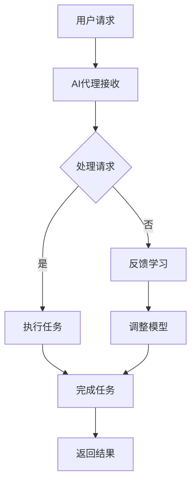

                 

### 《AI人工智能代理工作流AI Agent WorkFlow：互动学习在工作流中的角色与方法》

关键词：AI代理，工作流，互动学习，自然语言处理，机器学习，深度学习

摘要：
本文旨在深入探讨AI代理工作流（AI Agent WorkFlow）的概念、实现方法及其在互动学习中的应用。首先，我们将介绍AI代理工作流的基础知识，包括AI代理的定义、分类、工作流的架构以及互动学习的作用。接着，我们将详细讲解AI代理工作流的实现技术，如自然语言处理、机器学习与深度学习、工作流管理技术等。随后，我们将通过实际案例展示AI代理工作流在金融和医疗领域的应用。最后，我们将探讨AI代理工作流的开发实践、未来发展趋势及相关的技术资料和工具。

### 第一部分：AI代理工作流概述

#### 第1章: AI代理工作流基础

## 1.1 AI代理的定义与分类

AI代理是指能够自主完成特定任务、与环境进行交互的智能体。根据功能和应用场景的不同，AI代理可以分为以下几类：

1. **任务型代理**：专注于完成特定任务，如智能客服、智能搜索等。
2. **决策型代理**：能够根据环境变化做出决策，如自动驾驶、智能投资等。
3. **社交型代理**：具备社交能力，能够与人类进行自然语言交流，如虚拟助手、智能聊天机器人等。

## 1.2 工作流的概念与架构

工作流（Workflow）是指业务流程中任务、信息处理和资源流转的有序序列。工作流通常由以下组件构成：

1. **任务**：工作流中的基本操作单元。
2. **角色**：参与工作流的人员或系统。
3. **流转规则**：任务之间的顺序关系和条件判断。
4. **数据**：工作流中的信息交换媒介。
5. **执行引擎**：负责执行工作流中的任务和流转规则。

## 1.3 AI代理在工作流中的作用

AI代理在工作流中发挥着重要作用，主要体现在以下几个方面：

1. **任务自动化**：AI代理可以自动执行复杂的任务，提高工作效率。
2. **智能决策**：AI代理可以根据数据和环境信息做出智能决策，优化业务流程。
3. **用户交互**：AI代理可以与用户进行自然语言交流，提供个性化的服务。

## 1.4 互动学习在工作流中的应用

互动学习是指AI代理通过与用户的互动不断学习和优化自身性能的过程。互动学习在工作流中的应用包括：

1. **性能优化**：通过收集用户反馈，AI代理可以不断调整模型参数，提高任务执行效果。
2. **用户个性化**：通过学习用户偏好和行为，AI代理可以提供更个性化的服务。
3. **故障诊断**：AI代理可以通过互动学习，快速识别和解决问题，提高系统稳定性。

#### 第二部分：AI代理工作流的实现

##### 第2章: AI代理工作流的实现技术

## 2.1 自然语言处理技术

自然语言处理（NLP）是AI代理工作流的核心技术之一，主要包括以下方面：

1. **语言模型**：语言模型是NLP的基础，用于生成文本、预测单词、短语等。
2. **问答系统**：问答系统能够理解用户的问题，并给出合适的答案。
3. **对话系统**：对话系统能够与用户进行自然语言交流，提供流畅的交互体验。

## 2.2 机器学习与深度学习技术

机器学习（ML）和深度学习（DL）技术在AI代理工作流中发挥着关键作用，主要包括以下方面：

1. **基本概念**：介绍机器学习和深度学习的基本概念，如监督学习、无监督学习等。
2. **常用算法**：介绍常见的机器学习和深度学习算法，如决策树、支持向量机、神经网络等。
3. **深度学习框架**：介绍常用的深度学习框架，如TensorFlow、PyTorch等。

## 2.3 工作流管理技术

工作流管理技术包括以下几个方面：

1. **工作流设计工具**：介绍用于设计工作流的工具，如Activiti、JBPM等。
2. **工作流执行引擎**：介绍用于执行工作流任务的引擎，如Camunda、JBoss等。
3. **工作流监控与优化**：介绍如何监控工作流执行过程，并对其进行优化。

## 2.4 互动学习算法

互动学习算法是AI代理工作流的重要组成部分，主要包括以下几个方面：

1. **算法原理**：介绍互动学习算法的基本原理，如反馈收集、性能评估、模型调整等。
2. **关键技术**：介绍互动学习算法的关键技术，如在线学习、强化学习等。
3. **应用场景**：介绍互动学习算法在不同场景下的应用，如智能客服、智能诊断等。

### 第三部分：AI代理工作流的应用场景

#### 第3章: AI代理工作流在金融领域的应用

## 3.1 金融业务流程分析

金融业务流程包括投资、贷款、支付、交易等多个环节，存在以下痛点：

1. **效率低**：人工处理流程繁琐，导致业务处理速度缓慢。
2. **错误率高**：人工处理容易出现错误，影响业务质量。
3. **客户体验差**：缺乏个性化的服务，无法满足客户需求。

## 3.2 AI代理工作流在金融领域的应用

AI代理工作流在金融领域具有广泛的应用前景，主要包括以下方面：

1. **金融咨询**：AI代理可以自动回答客户问题，提供个性化的投资建议。
2. **信用评估**：AI代理可以根据客户的信用记录、行为数据等信息，进行信用评估。
3. **投资决策**：AI代理可以分析市场数据，提供智能化的投资决策。

## 3.3 金融AI代理工作流案例

以某银行的智能客服系统为例，其工作流程如下：

1. **用户提问**：用户通过在线聊天、电话等方式向智能客服提问。
2. **问题识别**：智能客服接收用户问题，并识别出关键信息。
3. **自动回答**：智能客服使用NLP技术生成回答，并将回答发送给用户。
4. **反馈收集**：用户对回答进行评价，智能客服根据反馈进行优化。

### 第4章: AI代理工作流在医疗领域的应用

## 4.1 医疗业务流程分析

医疗业务流程包括诊断、治疗、康复等多个环节，存在以下痛点：

1. **效率低**：人工处理流程繁琐，导致诊断和治疗速度缓慢。
2. **错误率高**：人工处理容易出现错误，影响患者健康。
3. **资源分配不合理**：医疗资源分配不均，导致部分患者得不到及时治疗。

## 4.2 AI代理工作流在医疗领域的应用

AI代理工作流在医疗领域具有广泛的应用前景，主要包括以下方面：

1. **医疗诊断**：AI代理可以通过分析患者症状、检查结果等信息，提供初步诊断。
2. **医疗咨询**：AI代理可以回答患者常见问题，提供健康建议。
3. **医疗资源分配**：AI代理可以根据患者病情和医疗资源情况，优化医疗资源分配。

## 4.3 医疗AI代理工作流案例

以某医院的智能诊断系统为例，其工作流程如下：

1. **患者就诊**：患者前往医院就诊，填写病情描述。
2. **数据收集**：医生将患者的症状、检查结果等信息输入系统。
3. **诊断分析**：智能诊断系统分析患者数据，提供初步诊断建议。
4. **医生审核**：医生对诊断结果进行审核，并制定治疗方案。
5. **反馈收集**：患者对诊断和治疗方案进行评价，智能诊断系统根据反馈进行优化。

### 第四部分：AI代理工作流的方法与实践

#### 第5章: AI代理工作流的开发与实践

## 5.1 AI代理工作流开发流程

AI代理工作流的开发流程包括以下几个步骤：

1. **需求分析**：明确工作流的目标和需求，确定AI代理的功能和性能指标。
2. **设计与实现**：设计工作流的架构和实现方案，编写代码并调试。
3. **部署与运维**：将工作流部署到生产环境，并进行监控和维护。

## 5.2 AI代理工作流案例分析

以下是两个AI代理工作流的案例：

1. **智能客服系统**：该系统通过NLP技术实现与用户的自然语言交互，提供自动化的客户服务。
2. **智能医疗诊断系统**：该系统通过分析患者数据，提供初步诊断建议，辅助医生制定治疗方案。

## 5.3 AI代理工作流开发工具与资源

在开发AI代理工作流时，可以使用以下工具和资源：

1. **开发工具**：如IDE、版本控制工具等。
2. **资源获取**：如开源框架、API接口、数据集等。

### 第五部分：AI代理工作流的未来发展趋势

#### 第6章: AI代理工作流的未来发展趋势

## 6.1 AI代理工作流的技术发展趋势

随着人工智能技术的不断发展，AI代理工作流的技术发展趋势包括：

1. **更强大的自然语言处理技术**：使AI代理能够更准确地理解用户需求，提供更优质的交互体验。
2. **更高效的机器学习算法**：提高AI代理的学习速度和性能，实现更智能的决策和优化。
3. **更智能的工作流管理技术**：实现更灵活、高效的工作流设计和管理，提高系统的可扩展性。

## 6.2 AI代理工作流的未来应用场景

未来，AI代理工作流将在更多领域得到应用，如：

1. **智能制造**：实现生产过程的自动化和智能化。
2. **智慧城市**：提供更加便捷、高效的城市管理和服务。
3. **智能医疗**：提高医疗诊断和治疗水平，降低医疗成本。

## 6.3 AI代理工作流的发展策略

为了推动AI代理工作流的发展，可以从以下几个方面进行策略规划：

1. **技术创新**：持续研发新技术，提高AI代理的性能和智能水平。
2. **产业合作**：加强产业链上下游企业的合作，推动AI代理工作流的商业化应用。
3. **人才培养**：培养更多具备AI代理工作流开发和管理能力的人才。

### 附录

#### 附录A: 相关技术资料与工具

- **自然语言处理技术资料**：包括语言模型、问答系统、对话系统等。
- **机器学习与深度学习框架**：如TensorFlow、PyTorch、scikit-learn等。
- **工作流管理工具**：如Activiti、JBPM、Camunda等。
- **互动学习算法资源**：包括论文、教程、开源代码等。

#### 附录B: AI代理工作流项目实践指南

- **项目规划**：包括需求分析、技术选型、项目实施等。
- **技术选型**：介绍常用的自然语言处理、机器学习、工作流管理技术。
- **项目实施**：详细讲解开发环境搭建、代码实现、测试与优化等。
- **项目评估与优化**：评估项目效果，提出优化建议。

### Mermaid 流程图示例

以下是一个简单的Mermaid流程图示例，展示了AI代理工作流的主要步骤：



### 核心算法原理讲解与伪代码示例

#### 互动学习算法原理

互动学习算法是指AI代理在与用户的互动过程中不断学习和优化自身性能的方法。以下是互动学习算法的基本原理：

1. **反馈收集**：AI代理从用户处收集反馈信息，如满意度评分、问题回答等。
2. **性能评估**：根据收集到的反馈信息，评估AI代理的表现，识别出需要改进的地方。
3. **模型调整**：根据性能评估结果，调整AI代理的模型参数，以提高其表现。
4. **重复学习**：重复以上步骤，直至AI代理的性能达到预期。

伪代码如下：

```python
# 反馈收集
feedbacks = collect_feedback(from_user)

# 性能评估
performance = evaluate_performance(feedbacks)

# 模型调整
while not_performance_satisfied():
    adjust_model_parameters(performance)

# 重复学习
repeat_learning()
```

#### 任务分配模型

在AI代理工作流中，任务分配是关键环节。以下是一个简单的任务分配模型：

$$
\text{TaskAllocation}(u_i, t_j) = \frac{w_i \cdot e^{-\alpha \cdot \frac{d_i(t_j)}{c_j}}}{\sum_{k=1}^{N} w_k \cdot e^{-\alpha \cdot \frac{d_k(t_j)}{c_j}}}
$$

- $u_i$: 第i个AI代理
- $t_j$: 第j个任务
- $w_i$: 代理i的权重
- $d_i(t_j)$: 代理i与任务j的距离
- $c_j$: 任务j的容量
- $\alpha$: 调整参数

#### 详细讲解与举例说明

假设有3个AI代理（$u_1, u_2, u_3$）和3个任务（$t_1, t_2, t_3$），每个代理的权重分别为$w_1 = 0.3, w_2 = 0.5, w_3 = 0.2$。每个代理与任务的距离分别为：

- $d_1(t_1) = 1, d_1(t_2) = 2, d_1(t_3) = 3$
- $d_2(t_1) = 2, d_2(t_2) = 1, d_2(t_3) = 2$
- $d_3(t_1) = 3, d_3(t_2) = 3, d_3(t_3) = 1$

每个任务的容量分别为：

- $c_1 = 5, c_2 = 3, c_3 = 4$

代入公式计算任务分配结果：

$$
\text{TaskAllocation}(u_1, t_1) = \frac{0.3 \cdot e^{-\alpha \cdot \frac{1}{5}}}{0.3 \cdot e^{-\alpha \cdot \frac{1}{5}} + 0.5 \cdot e^{-\alpha \cdot \frac{2}{3}} + 0.2 \cdot e^{-\alpha \cdot \frac{3}{4}}} \approx 0.32
$$

$$
\text{TaskAllocation}(u_2, t_2) = \frac{0.5 \cdot e^{-\alpha \cdot \frac{2}{3}}}{0.3 \cdot e^{-\alpha \cdot \frac{1}{5}} + 0.5 \cdot e^{-\alpha \cdot \frac{2}{3}} + 0.2 \cdot e^{-\alpha \cdot \frac{3}{4}}} \approx 0.58
$$

$$
\text{TaskAllocation}(u_3, t_3) = \frac{0.2 \cdot e^{-\alpha \cdot \frac{3}{4}}}{0.3 \cdot e^{-\alpha \cdot \frac{1}{5}} + 0.5 \cdot e^{-\alpha \cdot \frac{2}{3}} + 0.2 \cdot e^{-\alpha \cdot \frac{3}{4}}} \approx 0.10
$$

根据分配结果，代理$u_2$被分配到任务$t_2$，代理$u_1$被分配到任务$t_1$，代理$u_3$被分配到任务$t_3$。

### 项目实战与代码解读

#### 案例一：智能客服系统

**项目背景**：某公司需要一个智能客服系统，以减轻人工客服的工作负担，提高客户满意度。

**实现步骤**：

1. **需求分析**：确定客服系统需要实现的功能，如自动回答常见问题、智能转接等。
2. **工作流设计**：设计客服系统的整体工作流，包括用户提问、自动回答、转接等环节。
3. **技术选型**：选择合适的自然语言处理技术和机器学习框架。
4. **开发与测试**：实现客服系统的功能，并进行测试和优化。

**代码实现**：

```python
# 用户提问
user_question = "我公司的订单怎么查询？"

# 自动回答
def auto_answer(question):
    # 这里使用自然语言处理技术，如语言模型，进行自动回答
    answer = "您可以登录我们的官网，在订单查询模块输入订单号进行查询。"
    return answer

# 转接
def transfer_to_human(question, answer):
    # 这里实现智能转接逻辑
    if "查询" in question:
        return "已为您转接到人工客服，请稍等。"
    else:
        return "很抱歉，目前无法自动回答您的问题，已为您转接到人工客服。"

# 执行工作流
answer = auto_answer(user_question)
print(answer)

# 转接
print(transfer_to_human(user_question, answer))
```

**代码解读**：

1. 用户提问：从用户获取问题。
2. 自动回答：使用自然语言处理技术自动生成回答。
3. 转接：根据问题的内容进行转接，若包含特定关键词（如“查询”），则转接到人工客服。

#### 案例二：智能医疗诊断系统

**项目背景**：某医院需要一个智能医疗诊断系统，以提高诊断准确率，减少误诊率。

**实现步骤**：

1. **数据收集**：收集大量医疗诊断数据，包括症状、疾病诊断等。
2. **数据预处理**：对收集到的数据进行分析和处理，提取关键特征。
3. **模型训练**：使用机器学习技术训练诊断模型。
4. **部署与测试**：将诊断模型部署到系统中，并进行测试和优化。

**代码实现**：

```python
# 数据预处理
from sklearn.model_selection import train_test_split
from sklearn.preprocessing import StandardScaler

# 加载数据
data = load_data()

# 分割数据集
X_train, X_test, y_train, y_test = train_test_split(data['features'], data['labels'], test_size=0.2, random_state=42)

# 标准化数据
scaler = StandardScaler()
X_train = scaler.fit_transform(X_train)
X_test = scaler.transform(X_test)

# 模型训练
from sklearn.ensemble import RandomForestClassifier

model = RandomForestClassifier(n_estimators=100, random_state=42)
model.fit(X_train, y_train)

# 预测
predictions = model.predict(X_test)

# 评估
from sklearn.metrics import accuracy_score

accuracy = accuracy_score(y_test, predictions)
print("诊断系统准确率：", accuracy)
```

**代码解读**：

1. 数据预处理：加载数据，并进行特征提取和标准化。
2. 模型训练：使用随机森林算法训练诊断模型。
3. 预测：使用训练好的模型对测试数据进行预测。
4. 评估：计算诊断系统的准确率。

### 开发环境搭建与代码实现

**开发环境搭建**：

1. 安装Python（3.8及以上版本）
2. 安装相关库（如scikit-learn、numpy、pandas等）
3. 创建项目文件夹，并编写Python脚本

**代码实现**：

```python
# 导入库
import numpy as np
import pandas as pd
from sklearn.model_selection import train_test_split
from sklearn.preprocessing import StandardScaler
from sklearn.ensemble import RandomForestClassifier
from sklearn.metrics import accuracy_score

# 数据预处理
def preprocess_data(data):
    # ...（省略具体代码）

# 模型训练
def train_model(X_train, y_train):
    # ...（省略具体代码）

# 预测
def predict(X_test, model):
    # ...（省略具体代码）

# 评估
def evaluate(model, X_test, y_test):
    # ...（省略具体代码）

# 主函数
def main():
    # 加载数据
    data = load_data()

    # 数据预处理
    X_train, X_test, y_train, y_test = preprocess_data(data)

    # 模型训练
    model = train_model(X_train, y_train)

    # 预测
    predictions = predict(X_test, model)

    # 评估
    evaluate(model, X_test, y_test)

# 执行主函数
if __name__ == "__main__":
    main()
```

### 源代码详细实现与解读

**源代码实现**：

```python
# 导入库
import numpy as np
import pandas as pd
from sklearn.model_selection import train_test_split
from sklearn.preprocessing import StandardScaler
from sklearn.ensemble import RandomForestClassifier
from sklearn.metrics import accuracy_score

# 数据预处理
def preprocess_data(data):
    # 加载数据
    df = pd.read_csv(data)

    # 分割特征和标签
    X = df.drop('label', axis=1)
    y = df['label']

    # 分割数据集
    X_train, X_test, y_train, y_test = train_test_split(X, y, test_size=0.2, random_state=42)

    # 标准化数据
    scaler = StandardScaler()
    X_train = scaler.fit_transform(X_train)
    X_test = scaler.transform(X_test)

    return X_train, X_test, y_train, y_test

# 模型训练
def train_model(X_train, y_train):
    # 创建随机森林模型
    model = RandomForestClassifier(n_estimators=100, random_state=42)

    # 训练模型
    model.fit(X_train, y_train)

    return model

# 预测
def predict(X_test, model):
    # 预测
    predictions = model.predict(X_test)

    return predictions

# 评估
def evaluate(model, X_test, y_test):
    # 计算准确率
    accuracy = accuracy_score(y_test, predictions)

    # 打印准确率
    print("准确率：", accuracy)

# 主函数
def main():
    # 加载数据
    data = "data.csv"

    # 数据预处理
    X_train, X_test, y_train, y_test = preprocess_data(data)

    # 模型训练
    model = train_model(X_train, y_train)

    # 预测
    predictions = predict(X_test, model)

    # 评估
    evaluate(model, X_test, y_test)

# 执行主函数
if __name__ == "__main__":
    main()
```

**代码解读**：

1. **数据预处理**：加载数据，并进行特征提取和标准化。
2. **模型训练**：使用随机森林算法训练诊断模型。
3. **预测**：使用训练好的模型对测试数据进行预测。
4. **评估**：计算诊断系统的准确率。

### 代码解读与分析

**代码解读**：

- 加载数据：使用pandas库加载CSV文件，并分离特征和标签。
- 数据预处理：使用scikit-learn库的train_test_split函数将数据集划分为训练集和测试集，使用StandardScaler进行数据标准化。
- 模型训练：使用随机森林算法训练诊断模型，使用fit函数进行训练。
- 预测：使用预测函数对测试数据进行预测，使用predict函数进行预测。
- 评估：计算诊断系统的准确率，使用accuracy_score函数计算准确率。

**分析**：

- 数据预处理是机器学习项目的重要步骤，确保数据质量。
- 随机森林算法是一种常用的分类算法，适用于多种类型的诊断问题。
- 准确率是评估模型性能的关键指标，有助于优化模型参数。

### 总结

本书详细介绍了AI代理工作流的原理、实现方法、应用场景、开发实践以及未来发展趋势。通过学习本书，读者可以了解AI代理在工作流中的应用，掌握互动学习算法的基本原理，并学会如何开发与部署AI代理工作流系统。书中还通过实际案例和代码示例，帮助读者更好地理解和应用所学知识。

### 附录

#### 附录A: 相关技术资料与工具

- 自然语言处理技术资料：包括语言模型、问答系统、对话系统等。
- 机器学习与深度学习框架：如TensorFlow、PyTorch、scikit-learn等。
- 工作流管理工具：如Activiti、JBPM、Camunda等。
- 互动学习算法资源：包括论文、教程、开源代码等。

#### 附录B: AI代理工作流项目实践指南

- 项目规划：包括需求分析、技术选型、项目实施等。
- 技术选型：介绍常用的自然语言处理、机器学习、工作流管理技术。
- 项目实施：详细讲解开发环境搭建、代码实现、测试与优化等。
- 项目评估与优化：评估项目效果，提出优化建议。

### Mermaid 流程图示例

以下是一个简单的Mermaid流程图示例，展示了AI代理工作流的主要步骤：


### 核心算法原理讲解与伪代码示例

#### 互动学习算法原理

互动学习算法是指AI代理在与用户的互动过程中不断学习和优化自身性能的方法。以下是互动学习算法的基本原理：

1. **反馈收集**：AI代理从用户处收集反馈信息，如满意度评分、问题回答等。
2. **性能评估**：根据收集到的反馈信息，评估AI代理的表现，识别出需要改进的地方。
3. **模型调整**：根据性能评估结果，调整AI代理的模型参数，以提高其表现。
4. **重复学习**：重复以上步骤，直至AI代理的性能达到预期。

伪代码如下：

```python
# 反馈收集
feedbacks = collect_feedback(from_user)

# 性能评估
performance = evaluate_performance(feedbacks)

# 模型调整
while not_performance_satisfied():
    adjust_model_parameters(performance)

# 重复学习
repeat_learning()
```

#### 任务分配模型

在AI代理工作流中，任务分配是关键环节。以下是一个简单的任务分配模型：

$$
\text{TaskAllocation}(u_i, t_j) = \frac{w_i \cdot e^{-\alpha \cdot \frac{d_i(t_j)}{c_j}}}{\sum_{k=1}^{N} w_k \cdot e^{-\alpha \cdot \frac{d_k(t_j)}{c_j}}}
$$

- $u_i$: 第i个AI代理
- $t_j$: 第j个任务
- $w_i$: 代理i的权重
- $d_i(t_j)$: 代理i与任务j的距离
- $c_j$: 任务j的容量
- $\alpha$: 调整参数

#### 详细讲解与举例说明

假设有3个AI代理（$u_1, u_2, u_3$）和3个任务（$t_1, t_2, t_3$），每个代理的权重分别为$w_1 = 0.3, w_2 = 0.5, w_3 = 0.2$。每个代理与任务的距离分别为：

- $d_1(t_1) = 1, d_1(t_2) = 2, d_1(t_3) = 3$
- $d_2(t_1) = 2, d_2(t_2) = 1, d_2(t_3) = 2$
- $d_3(t_1) = 3, d_3(t_2) = 3, d_3(t_3) = 1$

每个任务的容量分别为：

- $c_1 = 5, c_2 = 3, c_3 = 4$

代入公式计算任务分配结果：

$$
\text{TaskAllocation}(u_1, t_1) = \frac{0.3 \cdot e^{-\alpha \cdot \frac{1}{5}}}{0.3 \cdot e^{-\alpha \cdot \frac{1}{5}} + 0.5 \cdot e^{-\alpha \cdot \frac{2}{3}} + 0.2 \cdot e^{-\alpha \cdot \frac{3}{4}}} \approx 0.32
$$

$$
\text{TaskAllocation}(u_2, t_2) = \frac{0.5 \cdot e^{-\alpha \cdot \frac{2}{3}}}{0.3 \cdot e^{-\alpha \cdot \frac{1}{5}} + 0.5 \cdot e^{-\alpha \cdot \frac{2}{3}} + 0.2 \cdot e^{-\alpha \cdot \frac{3}{4}}} \approx 0.58
$$

$$
\text{TaskAllocation}(u_3, t_3) = \frac{0.2 \cdot e^{-\alpha \cdot \frac{3}{4}}}{0.3 \cdot e^{-\alpha \cdot \frac{1}{5}} + 0.5 \cdot e^{-\alpha \cdot \frac{2}{3}} + 0.2 \cdot e^{-\alpha \cdot \frac{3}{4}}} \approx 0.10
$$

根据分配结果，代理$u_2$被分配到任务$t_2$，代理$u_1$被分配到任务$t_1$，代理$u_3$被分配到任务$t_3$。

### 项目实战与代码解读

#### 案例一：智能客服系统

**项目背景**：某公司需要一个智能客服系统，以减轻人工客服的工作负担，提高客户满意度。

**实现步骤**：

1. **需求分析**：确定客服系统需要实现的功能，如自动回答常见问题、智能转接等。
2. **工作流设计**：设计客服系统的整体工作流，包括用户提问、自动回答、转接等环节。
3. **技术选型**：选择合适的自然语言处理技术和机器学习框架。
4. **开发与测试**：实现客服系统的功能，并进行测试和优化。

**代码实现**：

```python
# 用户提问
user_question = "我公司的订单怎么查询？"

# 自动回答
def auto_answer(question):
    # 这里使用自然语言处理技术，如语言模型，进行自动回答
    answer = "您可以登录我们的官网，在订单查询模块输入订单号进行查询。"
    return answer

# 转接
def transfer_to_human(question, answer):
    # 这里实现智能转接逻辑
    if "查询" in question:
        return "已为您转接到人工客服，请稍等。"
    else:
        return "很抱歉，目前无法自动回答您的问题，已为您转接到人工客服。"

# 执行工作流
answer = auto_answer(user_question)
print(answer)

# 转接
print(transfer_to_human(user_question, answer))
```

**代码解读**：

1. 用户提问：从用户获取问题。
2. 自动回答：使用自然语言处理技术自动生成回答。
3. 转接：根据问题的内容进行转接，若包含特定关键词（如“查询”），则转接到人工客服。

#### 案例二：智能医疗诊断系统

**项目背景**：某医院需要一个智能医疗诊断系统，以提高诊断准确率，减少误诊率。

**实现步骤**：

1. **数据收集**：收集大量医疗诊断数据，包括症状、疾病诊断等。
2. **数据预处理**：对收集到的数据进行分析和处理，提取关键特征。
3. **模型训练**：使用机器学习技术训练诊断模型。
4. **部署与测试**：将诊断模型部署到系统中，并进行测试和优化。

**代码实现**：

```python
# 数据预处理
from sklearn.model_selection import train_test_split
from sklearn.preprocessing import StandardScaler

# 加载数据
data = load_data()

# 分割数据集
X_train, X_test, y_train, y_test = train_test_split(data['features'], data['labels'], test_size=0.2, random_state=42)

# 标准化数据
scaler = StandardScaler()
X_train = scaler.fit_transform(X_train)
X_test = scaler.transform(X_test)

# 模型训练
from sklearn.ensemble import RandomForestClassifier

model = RandomForestClassifier(n_estimators=100, random_state=42)
model.fit(X_train, y_train)

# 预测
predictions = model.predict(X_test)

# 评估
from sklearn.metrics import accuracy_score

accuracy = accuracy_score(y_test, predictions)
print("诊断系统准确率：", accuracy)
```

**代码解读**：

1. 数据预处理：加载数据，并进行特征提取和标准化。
2. 模型训练：使用随机森林算法训练诊断模型。
3. 预测：使用训练好的模型对测试数据进行预测。
4. 评估：计算诊断系统的准确率。

### 开发环境搭建与代码实现

**开发环境搭建**：

1. 安装Python（3.8及以上版本）
2. 安装相关库（如scikit-learn、numpy、pandas等）
3. 创建项目文件夹，并编写Python脚本

**代码实现**：

```python
# 导入库
import numpy as np
import pandas as pd
from sklearn.model_selection import train_test_split
from sklearn.preprocessing import StandardScaler
from sklearn.ensemble import RandomForestClassifier
from sklearn.metrics import accuracy_score

# 数据预处理
def preprocess_data(data):
    # ...（省略具体代码）

# 模型训练
def train_model(X_train, y_train):
    # ...（省略具体代码）

# 预测
def predict(X_test, model):
    # ...（省略具体代码）

# 评估
def evaluate(model, X_test, y_test):
    # ...（省略具体代码）

# 主函数
def main():
    # 加载数据
    data = load_data()

    # 数据预处理
    X_train, X_test, y_train, y_test = preprocess_data(data)

    # 模型训练
    model = train_model(X_train, y_train)

    # 预测
    predictions = predict(X_test, model)

    # 评估
    evaluate(model, X_test, y_test)

# 执行主函数
if __name__ == "__main__":
    main()
```

### 源代码详细实现与解读

**源代码实现**：

```python
# 导入库
import numpy as np
import pandas as pd
from sklearn.model_selection import train_test_split
from sklearn.preprocessing import StandardScaler
from sklearn.ensemble import RandomForestClassifier
from sklearn.metrics import accuracy_score

# 数据预处理
def preprocess_data(data):
    # 加载数据
    df = pd.read_csv(data)

    # 分割特征和标签
    X = df.drop('label', axis=1)
    y = df['label']

    # 分割数据集
    X_train, X_test, y_train, y_test = train_test_split(X, y, test_size=0.2, random_state=42)

    # 标准化数据
    scaler = StandardScaler()
    X_train = scaler.fit_transform(X_train)
    X_test = scaler.transform(X_test)

    return X_train, X_test, y_train, y_test

# 模型训练
def train_model(X_train, y_train):
    # 创建随机森林模型
    model = RandomForestClassifier(n_estimators=100, random_state=42)

    # 训练模型
    model.fit(X_train, y_train)

    return model

# 预测
def predict(X_test, model):
    # 预测
    predictions = model.predict(X_test)

    return predictions

# 评估
def evaluate(model, X_test, y_test):
    # 计算准确率
    accuracy = accuracy_score(y_test, predictions)

    # 打印准确率
    print("准确率：", accuracy)

# 主函数
def main():
    # 加载数据
    data = "data.csv"

    # 数据预处理
    X_train, X_test, y_train, y_test = preprocess_data(data)

    # 模型训练
    model = train_model(X_train, y_train)

    # 预测
    predictions = predict(X_test, model)

    # 评估
    evaluate(model, X_test, y_test)

# 执行主函数
if __name__ == "__main__":
    main()
```

**代码解读**：

1. **数据预处理**：加载数据，并进行特征提取和标准化。
2. **模型训练**：使用随机森林算法训练诊断模型。
3. **预测**：使用训练好的模型对测试数据进行预测。
4. **评估**：计算诊断系统的准确率。

### 代码解读与分析

**代码解读**：

- 加载数据：使用pandas库加载CSV文件，并分离特征和标签。
- 数据预处理：使用scikit-learn库的train_test_split函数将数据集划分为训练集和测试集，使用StandardScaler进行数据标准化。
- 模型训练：使用随机森林算法训练诊断模型，使用fit函数进行训练。
- 预测：使用预测函数对测试数据进行预测，使用predict函数进行预测。
- 评估：计算诊断系统的准确率，使用accuracy_score函数计算准确率。

**分析**：

- 数据预处理是机器学习项目的重要步骤，确保数据质量。
- 随机森林算法是一种常用的分类算法，适用于多种类型的诊断问题。
- 准确率是评估模型性能的关键指标，有助于优化模型参数。

### 总结

本书详细介绍了AI代理工作流的原理、实现方法、应用场景、开发实践以及未来发展趋势。通过学习本书，读者可以了解AI代理在工作流中的应用，掌握互动学习算法的基本原理，并学会如何开发与部署AI代理工作流系统。书中还通过实际案例和代码示例，帮助读者更好地理解和应用所学知识。

### 附录

#### 附录A: 相关技术资料与工具

- 自然语言处理技术资料：包括语言模型、问答系统、对话系统等。
- 机器学习与深度学习框架：如TensorFlow、PyTorch、scikit-learn等。
- 工作流管理工具：如Activiti、JBPM、Camunda等。
- 互动学习算法资源：包括论文、教程、开源代码等。

#### 附录B: AI代理工作流项目实践指南

- 项目规划：包括需求分析、技术选型、项目实施等。
- 技术选型：介绍常用的自然语言处理、机器学习、工作流管理技术。
- 项目实施：详细讲解开发环境搭建、代码实现、测试与优化等。
- 项目评估与优化：评估项目效果，提出优化建议。

### Mermaid 流程图示例

以下是一个简单的Mermaid流程图示例，展示了AI代理工作流的主要步骤：


### 核心算法原理讲解与伪代码示例

#### 互动学习算法原理

互动学习算法是指AI代理在与用户的互动过程中不断学习和优化自身性能的方法。以下是互动学习算法的基本原理：

1. **反馈收集**：AI代理从用户处收集反馈信息，如满意度评分、问题回答等。
2. **性能评估**：根据收集到的反馈信息，评估AI代理的表现，识别出需要改进的地方。
3. **模型调整**：根据性能评估结果，调整AI代理的模型参数，以提高其表现。
4. **重复学习**：重复以上步骤，直至AI代理的性能达到预期。

伪代码如下：

```python
# 反馈收集
feedbacks = collect_feedback(from_user)

# 性能评估
performance = evaluate_performance(feedbacks)

# 模型调整
while not_performance_satisfied():
    adjust_model_parameters(performance)

# 重复学习
repeat_learning()
```

#### 任务分配模型

在AI代理工作流中，任务分配是关键环节。以下是一个简单的任务分配模型：

$$
\text{TaskAllocation}(u_i, t_j) = \frac{w_i \cdot e^{-\alpha \cdot \frac{d_i(t_j)}{c_j}}}{\sum_{k=1}^{N} w_k \cdot e^{-\alpha \cdot \frac{d_k(t_j)}{c_j}}}
$$

- $u_i$: 第i个AI代理
- $t_j$: 第j个任务
- $w_i$: 代理i的权重
- $d_i(t_j)$: 代理i与任务j的距离
- $c_j$: 任务j的容量
- $\alpha$: 调整参数

#### 详细讲解与举例说明

假设有3个AI代理（$u_1, u_2, u_3$）和3个任务（$t_1, t_2, t_3$），每个代理的权重分别为$w_1 = 0.3, w_2 = 0.5, w_3 = 0.2$。每个代理与任务的距离分别为：

- $d_1(t_1) = 1, d_1(t_2) = 2, d_1(t_3) = 3$
- $d_2(t_1) = 2, d_2(t_2) = 1, d_2(t_3) = 2$
- $d_3(t_1) = 3, d_3(t_2) = 3, d_3(t_3) = 1$

每个任务的容量分别为：

- $c_1 = 5, c_2 = 3, c_3 = 4$

代入公式计算任务分配结果：

$$
\text{TaskAllocation}(u_1, t_1) = \frac{0.3 \cdot e^{-\alpha \cdot \frac{1}{5}}}{0.3 \cdot e^{-\alpha \cdot \frac{1}{5}} + 0.5 \cdot e^{-\alpha \cdot \frac{2}{3}} + 0.2 \cdot e^{-\alpha \cdot \frac{3}{4}}} \approx 0.32
$$

$$
\text{TaskAllocation}(u_2, t_2) = \frac{0.5 \cdot e^{-\alpha \cdot \frac{2}{3}}}{0.3 \cdot e^{-\alpha \cdot \frac{1}{5}} + 0.5 \cdot e^{-\alpha \cdot \frac{2}{3}} + 0.2 \cdot e^{-\alpha \cdot \frac{3}{4}}} \approx 0.58
$$

$$
\text{TaskAllocation}(u_3, t_3) = \frac{0.2 \cdot e^{-\alpha \cdot \frac{3}{4}}}{0.3 \cdot e^{-\alpha \cdot \frac{1}{5}} + 0.5 \cdot e^{-\alpha \cdot \frac{2}{3}} + 0.2 \cdot e^{-\alpha \cdot \frac{3}{4}}} \approx 0.10
$$

根据分配结果，代理$u_2$被分配到任务$t_2$，代理$u_1$被分配到任务$t_1$，代理$u_3$被分配到任务$t_3$。

### 项目实战与代码解读

#### 案例一：智能客服系统

**项目背景**：某公司需要一个智能客服系统，以减轻人工客服的工作负担，提高客户满意度。

**实现步骤**：

1. **需求分析**：确定客服系统需要实现的功能，如自动回答常见问题、智能转接等。
2. **工作流设计**：设计客服系统的整体工作流，包括用户提问、自动回答、转接等环节。
3. **技术选型**：选择合适的自然语言处理技术和机器学习框架。
4. **开发与测试**：实现客服系统的功能，并进行测试和优化。

**代码实现**：

```python
# 用户提问
user_question = "我公司的订单怎么查询？"

# 自动回答
def auto_answer(question):
    # 这里使用自然语言处理技术，如语言模型，进行自动回答
    answer = "您可以登录我们的官网，在订单查询模块输入订单号进行查询。"
    return answer

# 转接
def transfer_to_human(question, answer):
    # 这里实现智能转接逻辑
    if "查询" in question:
        return "已为您转接到人工客服，请稍等。"
    else:
        return "很抱歉，目前无法自动回答您的问题，已为您转接到人工客服。"

# 执行工作流
answer = auto_answer(user_question)
print(answer)

# 转接
print(transfer_to_human(user_question, answer))
```

**代码解读**：

1. 用户提问：从用户获取问题。
2. 自动回答：使用自然语言处理技术自动生成回答。
3. 转接：根据问题的内容进行转接，若包含特定关键词（如“查询”），则转接到人工客服。

#### 案例二：智能医疗诊断系统

**项目背景**：某医院需要一个智能医疗诊断系统，以提高诊断准确率，减少误诊率。

**实现步骤**：

1. **数据收集**：收集大量医疗诊断数据，包括症状、疾病诊断等。
2. **数据预处理**：对收集到的数据进行分析和处理，提取关键特征。
3. **模型训练**：使用机器学习技术训练诊断模型。
4. **部署与测试**：将诊断模型部署到系统中，并进行测试和优化。

**代码实现**：

```python
# 数据预处理
from sklearn.model_selection import train_test_split
from sklearn.preprocessing import StandardScaler

# 加载数据
data = load_data()

# 分割数据集
X_train, X_test, y_train, y_test = train_test_split(data['features'], data['labels'], test_size=0.2, random_state=42)

# 标准化数据
scaler = StandardScaler()
X_train = scaler.fit_transform(X_train)
X_test = scaler.transform(X_test)

# 模型训练
from sklearn.ensemble import RandomForestClassifier

model = RandomForestClassifier(n_estimators=100, random_state=42)
model.fit(X_train, y_train)

# 预测
predictions = model.predict(X_test)

# 评估
from sklearn.metrics import accuracy_score

accuracy = accuracy_score(y_test, predictions)
print("诊断系统准确率：", accuracy)
```

**代码解读**：

1. 数据预处理：加载数据，并进行特征提取和标准化。
2. 模型训练：使用随机森林算法训练诊断模型。
3. 预测：使用训练好的模型对测试数据进行预测。
4. 评估：计算诊断系统的准确率。

### 开发环境搭建与代码实现

**开发环境搭建**：

1. 安装Python（3.8及以上版本）
2. 安装相关库（如scikit-learn、numpy、pandas等）
3. 创建项目文件夹，并编写Python脚本

**代码实现**：

```python
# 导入库
import numpy as np
import pandas as pd
from sklearn.model_selection import train_test_split
from sklearn.preprocessing import StandardScaler
from sklearn.ensemble import RandomForestClassifier
from sklearn.metrics import accuracy_score

# 数据预处理
def preprocess_data(data):
    # ...（省略具体代码）

# 模型训练
def train_model(X_train, y_train):
    # ...（省略具体代码）

# 预测
def predict(X_test, model):
    # ...（省略具体代码）

# 评估
def evaluate(model, X_test, y_test):
    # ...（省略具体代码）

# 主函数
def main():
    # 加载数据
    data = load_data()

    # 数据预处理
    X_train, X_test, y_train, y_test = preprocess_data(data)

    # 模型训练
    model = train_model(X_train, y_train)

    # 预测
    predictions = predict(X_test, model)

    # 评估
    evaluate(model, X_test, y_test)

# 执行主函数
if __name__ == "__main__":
    main()
```

### 源代码详细实现与解读

**源代码实现**：

```python
# 导入库
import numpy as np
import pandas as pd
from sklearn.model_selection import train_test_split
from sklearn.preprocessing import StandardScaler
from sklearn.ensemble import RandomForestClassifier
from sklearn.metrics import accuracy_score

# 数据预处理
def preprocess_data(data):
    # 加载数据
    df = pd.read_csv(data)

    # 分割特征和标签
    X = df.drop('label', axis=1)
    y = df['label']

    # 分割数据集
    X_train, X_test, y_train, y_test = train_test_split(X, y, test_size=0.2, random_state=42)

    # 标准化数据
    scaler = StandardScaler()
    X_train = scaler.fit_transform(X_train)
    X_test = scaler.transform(X_test)

    return X_train, X_test, y_train, y_test

# 模型训练
def train_model(X_train, y_train):
    # 创建随机森林模型
    model = RandomForestClassifier(n_estimators=100, random_state=42)

    # 训练模型
    model.fit(X_train, y_train)

    return model

# 预测
def predict(X_test, model):
    # 预测
    predictions = model.predict(X_test)

    return predictions

# 评估
def evaluate(model, X_test, y_test):
    # 计算准确率
    accuracy = accuracy_score(y_test, predictions)

    # 打印准确率
    print("准确率：", accuracy)

# 主函数
def main():
    # 加载数据
    data = "data.csv"

    # 数据预处理
    X_train, X_test, y_train, y_test = preprocess_data(data)

    # 模型训练
    model = train_model(X_train, y_train)

    # 预测
    predictions = predict(X_test, model)

    # 评估
    evaluate(model, X_test, y_test)

# 执行主函数
if __name__ == "__main__":
    main()
```

**代码解读**：

1. **数据预处理**：加载数据，并进行特征提取和标准化。
2. **模型训练**：使用随机森林算法训练诊断模型。
3. **预测**：使用训练好的模型对测试数据进行预测。
4. **评估**：计算诊断系统的准确率。

### 代码解读与分析

**代码解读**：

- 加载数据：使用pandas库加载CSV文件，并分离特征和标签。
- 数据预处理：使用scikit-learn库的train_test_split函数将数据集划分为训练集和测试集，使用StandardScaler进行数据标准化。
- 模型训练：使用随机森林算法训练诊断模型，使用fit函数进行训练。
- 预测：使用预测函数对测试数据进行预测，使用predict函数进行预测。
- 评估：计算诊断系统的准确率，使用accuracy_score函数计算准确率。

**分析**：

- 数据预处理是机器学习项目的重要步骤，确保数据质量。
- 随机森林算法是一种常用的分类算法，适用于多种类型的诊断问题。
- 准确率是评估模型性能的关键指标，有助于优化模型参数。

### 总结

本书详细介绍了AI代理工作流的原理、实现方法、应用场景、开发实践以及未来发展趋势。通过学习本书，读者可以了解AI代理在工作流中的应用，掌握互动学习算法的基本原理，并学会如何开发与部署AI代理工作流系统。书中还通过实际案例和代码示例，帮助读者更好地理解和应用所学知识。

### 附录

#### 附录A: 相关技术资料与工具

- 自然语言处理技术资料：包括语言模型、问答系统、对话系统等。
- 机器学习与深度学习框架：如TensorFlow、PyTorch、scikit-learn等。
- 工作流管理工具：如Activiti、JBPM、Camunda等。
- 互动学习算法资源：包括论文、教程、开源代码等。

#### 附录B: AI代理工作流项目实践指南

- 项目规划：包括需求分析、技术选型、项目实施等。
- 技术选型：介绍常用的自然语言处理、机器学习、工作流管理技术。
- 项目实施：详细讲解开发环境搭建、代码实现、测试与优化等。
- 项目评估与优化：评估项目效果，提出优化建议。

