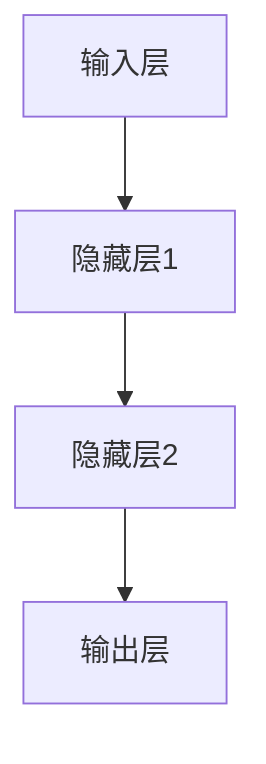
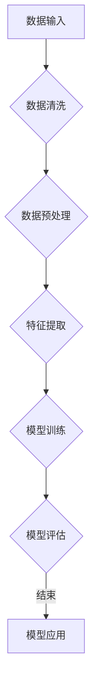

                 

### 引言

在当今技术飞速发展的时代，人工智能（AI）已经成为推动社会进步的重要力量。从智能家居到自动驾驶，从医疗诊断到金融预测，AI的应用无处不在，正深刻改变着我们的生活方式和工作方式。而AI的核心在于其算法，这些算法不仅决定了AI系统的性能，还反映了AI技术的理论基础。因此，深入理解和掌握AI的核心算法原理，对于任何希望在这一领域取得成就的人来说都是至关重要的。

本文旨在为读者提供一份全面而深入的AI核心算法指南，从基础理论到实战应用，一一剖析。文章将以清晰的结构和逻辑，逐步引导读者进入AI的算法世界，通过代码实例帮助读者更好地理解和掌握这些算法。无论您是AI领域的新手，还是希望进一步提升自己技能的专业人士，本文都将为您提供宝贵的知识和实用的技巧。

本文将分为三个主要部分：

1. **AI基础理论与核心算法**：介绍AI的发展历程、基础算法和深度学习原理，包括神经网络、卷积神经网络、循环神经网络等。
2. **机器学习算法原理与代码实现**：深入探讨监督学习、无监督学习和强化学习算法，并通过代码实例展示如何实现这些算法。
3. **深度学习算法原理与代码实现**：进一步讲解深度学习的基础知识，包括神经网络、卷积神经网络和循环神经网络的应用实例。
4. **AI项目实战与代码讲解**：通过实际项目案例，展示如何将理论知识应用于实践，并详细解读项目的源代码。

通过本文的学习，您将不仅能够掌握AI的核心算法原理，还能够具备实际项目开发的能力，为在AI领域的发展打下坚实的基础。

### 第一部分：AI基础理论与核心算法

在深入探讨AI的核心算法之前，了解AI的发展历程、分类以及其应用领域是至关重要的。这一部分将首先介绍AI的发展历程和现状，接着详细讲解人工智能的核心算法和框架，涵盖机器学习、深度学习和自然语言处理等领域，并给出相关的Mermaid流程图和数学模型，帮助读者更好地理解和掌握这些概念。

#### 第1章：AI概述与基础

##### 1.1 AI的发展历程与现状

##### 1.1.1 AI的发展历程

人工智能（Artificial Intelligence，简称AI）的概念最早可以追溯到20世纪50年代。当时，计算机科学家们首次提出了创造能够模拟人类智能的机器的想法。1956年，达特茅斯会议的召开标志着人工智能学科的正式诞生。在这场会议上，约翰·麦卡锡（John McCarthy）等人提出了“人工智能”一词，并确立了人工智能研究的方向。

随后的几十年，AI经历了几个重要的发展阶段。20世纪60年代和70年代，基于逻辑推理的专家系统成为AI研究的主流。这些系统通过将知识编码成规则，使计算机能够解决特定领域的问题。然而，由于知识表示和推理的复杂性，专家系统在实际应用中面临着巨大的挑战。

20世纪80年代，机器学习开始崭露头角，特别是在模式识别和统计分析领域。这一时期，神经网络的研究也取得了重要进展。1986年，霍普菲尔（John Hopfield）提出了Hopfield神经网络，为神经网络在AI中的应用奠定了基础。

进入21世纪，随着计算机性能的飞速提升和大数据技术的发展，AI迎来了新一轮的繁荣。深度学习（Deep Learning）的兴起，使得计算机在图像识别、自然语言处理和语音识别等任务上取得了令人瞩目的成果。2012年，AlexNet在ImageNet竞赛中取得了巨大成功，标志着深度学习的转折点。

##### 1.1.2 AI的分类与特性

人工智能可以根据其工作原理和应用领域进行分类。以下是一些主要的AI分类：

- **基于规则的AI**：这种AI系统依赖于一组预定义的规则来解决问题。专家系统是这种类型的代表。
- **基于模型的AI**：这种AI系统使用数学模型来模拟现实世界。神经网络和深度学习属于这一类。
- **基于数据的AI**：这种AI系统通过从大量数据中学习规律来做出决策。机器学习和深度学习都是基于数据的AI。
- **混合型AI**：结合了基于规则和基于模型的方法，利用各自的优势来解决问题。

AI的特性包括：

- **自主学习性**：AI系统能够从数据中学习并改进其性能。
- **泛化能力**：AI系统能够将学习到的知识应用到新的、未见过的数据上。
- **并行处理**：AI系统能够高效地处理大量数据和任务。
- **自适应能力**：AI系统能够根据新的数据和反馈调整其行为。

##### 1.1.3 AI在社会中的应用

人工智能在当今社会的应用已经非常广泛，涵盖了多个领域：

- **医疗健康**：AI技术在医疗诊断、药物研发和健康监控等方面发挥着重要作用。例如，通过图像识别技术，AI可以帮助医生更快速、准确地诊断疾病。
- **金融科技**：AI在金融领域的应用包括风险控制、投资策略制定和客户服务。例如，通过机器学习算法，银行可以更准确地评估贷款风险，提高审批效率。
- **自动驾驶**：自动驾驶技术是AI在交通运输领域的应用典范。通过深度学习和计算机视觉技术，自动驾驶汽车能够实现自主导航和驾驶。
- **智能家居**：智能家居设备（如智能音箱、智能灯泡等）通过AI技术实现了自动化和智能化，提高了人们的生活质量。
- **教育**：AI技术在教育中的应用包括个性化学习、在线教育平台和自动评分系统等，有助于提高教育质量和效率。

##### 1.2 人工智能的核心算法与框架

##### 1.2.1 机器学习算法概述

机器学习（Machine Learning，简称ML）是人工智能的核心组成部分，它使计算机能够从数据中自动学习和改进。机器学习算法可以分为以下几类：

- **监督学习**：监督学习算法在有标记数据集上进行训练，并使用这些数据来预测新数据的标签。常见的监督学习算法包括线性回归、逻辑回归和决策树等。
- **无监督学习**：无监督学习算法在无标签数据集上进行训练，目的是发现数据中的结构和规律。常见的无监督学习算法包括聚类和降维等。
- **强化学习**：强化学习算法通过与环境的交互来学习最优策略，以实现特定的目标。常见的强化学习算法包括Q-Learning和深度强化学习等。

##### 1.2.2 深度学习基础

深度学习（Deep Learning，简称DL）是机器学习的一个重要分支，它通过构建深度神经网络来模拟人脑的学习方式。深度学习在图像识别、语音识别和自然语言处理等领域取得了显著成果。

- **神经网络**：神经网络是深度学习的基础，它由一系列相互连接的神经元组成，能够通过学习数据来提取特征和进行预测。
- **卷积神经网络（CNN）**：卷积神经网络是专门用于处理图像数据的深度学习模型，它通过卷积层和池化层提取图像的特征。
- **循环神经网络（RNN）与LSTM**：循环神经网络是一种能够处理序列数据的神经网络，长短期记忆网络（LSTM）是RNN的一种变体，能够有效地解决序列数据中的长距离依赖问题。

##### 1.2.3 自然语言处理基础

自然语言处理（Natural Language Processing，简称NLP）是深度学习在语言领域的应用，它使计算机能够理解、生成和处理人类语言。

- **词向量**：词向量是一种将单词映射到高维空间中的向量表示方法，它能够捕获单词的语义信息。
- **语言模型**：语言模型是一种概率模型，它能够预测一段文本的下一个单词。常用的语言模型包括n-gram模型和神经网络语言模型。
- **序列标注与分类**：序列标注是将序列中的每个元素标注为特定类别，常见的任务包括命名实体识别和情感分析等。

##### 1.2.4 Mermaid流程图示例

以下是一个Mermaid流程图的示例，用于描述神经网络的基本结构：



##### 1.2.5 数学模型与公式

以下是深度学习中的几个关键数学模型和公式：

- **线性回归模型**：

  $$y = \beta_0 + \beta_1x + \epsilon$$

- **损失函数**：

  $$J(\theta) = \frac{1}{2m}\sum_{i=1}^{m}(h_\theta(x^{(i)}) - y^{(i)})^2$$

- **反向传播算法**：

  $$\delta_z = \frac{\partial J}{\partial z} = (a_{2} - y)$$
  $$\delta_w = \frac{\partial J}{\partial w} = z \cdot \delta_z$$
  $$w = w - \alpha \cdot \delta_w$$

通过以上对AI基础理论和核心算法的介绍，读者应该对AI的发展历程、分类和应用领域有了初步了解。接下来，我们将深入探讨机器学习算法、深度学习算法和自然语言处理的基础知识，帮助读者建立系统的AI知识体系。

#### 第2章：机器学习算法原理与代码实现

在了解了AI的基础理论和核心算法后，我们接下来将深入探讨机器学习算法，这是构建AI系统的核心组件。本章将详细讲解监督学习、无监督学习和强化学习三种主要的机器学习算法，并通过具体的代码实例展示如何实现这些算法。

##### 2.1 监督学习算法

监督学习（Supervised Learning）是机器学习中的一种方法，它使用标记数据进行训练，并使用这些数据来预测新的数据标签。监督学习算法可以分为分类算法和回归算法。

###### 2.1.1 线性回归

线性回归（Linear Regression）是一种简单的监督学习算法，它通过建立线性关系来预测连续值输出。以下是一个线性回归的原理和代码实例。

###### 2.1.1.1 线性回归原理

线性回归模型的假设是，输出变量 \( y \) 是输入变量 \( x \) 的线性函数，再加上一个随机误差 \( \epsilon \)：

$$y = \beta_0 + \beta_1x + \epsilon$$

其中，\( \beta_0 \) 是截距，\( \beta_1 \) 是斜率，\( \epsilon \) 是误差。

为了训练线性回归模型，我们使用最小化平方误差损失函数的方法：

$$J(\theta) = \frac{1}{2m}\sum_{i=1}^{m}(h_\theta(x^{(i)}) - y^{(i)})^2$$

其中，\( m \) 是样本数量，\( h_\theta(x) = \theta_0 + \theta_1x \) 是线性回归模型的预测值。

通过梯度下降（Gradient Descent）算法，我们可以更新模型的参数，以最小化损失函数：

$$\theta_j := \theta_j - \alpha \frac{\partial J}{\partial \theta_j}$$

其中，\( \alpha \) 是学习率。

###### 2.1.1.2 线性回归代码实例

以下是一个使用Python和Numpy库实现线性回归的代码实例：

```python
import numpy as np

# 梯度下降算法
def gradient_descent(X, y, theta, alpha, num_iters):
    m = len(y)
    J_history = []

    for i in range(num_iters):
        # 计算预测值
        h = np.dot(X, theta)
        
        # 计算损失
        loss = (1 / (2 * m)) * np.sum((h - y) ** 2)
        
        # 计算梯度
        grad = (1 / m) * np.dot(X.T, (h - y))
        
        # 更新参数
        theta -= alpha * grad
        
        # 记录损失历史
        J_history.append(loss)
        
    return theta, J_history

# 函数计算损失函数
def compute_loss(h, y):
    return (1 / (2 * m)) * np.sum((h - y) ** 2)

# 函数计算梯度
def compute_gradient(X, y, theta):
    return (1 / m) * np.dot(X.T, (h - y))

# 初始化参数
theta = np.array([0, 0])

# 设置学习率和迭代次数
alpha = 0.01
num_iters = 1000

# 添加偏置项（ bias column）
X = np.c_[np.ones((m, 1)), X]

# 训练模型
theta, J_history = gradient_descent(X, y, theta, alpha, num_iters)

# 打印最终参数
print("theta:", theta)

# 打印训练过程中的损失
print("J_history:", J_history)
```

###### 2.1.2 逻辑回归

逻辑回归（Logistic Regression）是一种用于分类的监督学习算法，它通过建立逻辑函数来预测概率，从而进行分类。以下是一个逻辑回归的原理和代码实例。

###### 2.1.2.1 逻辑回归原理

逻辑回归的假设是，输出变量 \( y \) 是一个二项分布的概率函数：

$$\mathbb{P}(y=1|x;\theta) = h_\theta(x) = \frac{1}{1 + e^{-(\theta_0 + \theta_1x)}}$$

其中，\( \theta_0 \) 和 \( \theta_1 \) 是模型的参数。

逻辑回归的目标是最小化损失函数，通常使用交叉熵损失函数：

$$J(\theta) = -\frac{1}{m}\sum_{i=1}^{m}[y\log(h_\theta(x^{(i)})) + (1 - y)\log(1 - h_\theta(x^{(i)}))]$$

通过梯度下降算法，我们可以更新模型的参数，以最小化损失函数：

$$\theta_j := \theta_j - \alpha \frac{\partial J}{\partial \theta_j}$$

其中，\( \alpha \) 是学习率。

###### 2.1.2.2 逻辑回归代码实例

以下是一个使用Python和Numpy库实现逻辑回归的代码实例：

```python
import numpy as np

# 梯度下降算法
def gradient_descent(X, y, theta, alpha, num_iters):
    m = len(y)
    J_history = []

    for i in range(num_iters):
        # 计算预测概率
        h = 1 / (1 + np.exp(-np.dot(X, theta)))
        
        # 计算损失
        loss = -1/m * np.sum(y * np.log(h) + (1 - y) * np.log(1 - h))
        
        # 计算梯度
        grad = 1/m * np.dot(X.T, (h - y))
        
        # 更新参数
        theta -= alpha * grad
        
        # 记录损失历史
        J_history.append(loss)
        
    return theta, J_history

# 函数计算损失函数
def compute_loss(h, y):
    return -1/m * np.sum(y * np.log(h) + (1 - y) * np.log(1 - h))

# 函数计算梯度
def compute_gradient(X, y, theta):
    h = 1 / (1 + np.exp(-np.dot(X, theta)))
    return 1/m * np.dot(X.T, (h - y))

# 初始化参数
theta = np.array([0, 0])

# 设置学习率和迭代次数
alpha = 0.01
num_iters = 1000

# 添加偏置项（ bias column）
X = np.c_[np.ones((m, 1)), X]

# 训练模型
theta, J_history = gradient_descent(X, y, theta, alpha, num_iters)

# 打印最终参数
print("theta:", theta)

# 打印训练过程中的损失
print("J_history:", J_history)
```

##### 2.2 无监督学习算法

无监督学习（Unsupervised Learning）是机器学习的一种方法，它不使用标记数据，而是通过发现数据中的结构和规律来训练模型。无监督学习算法可以分为聚类和降维两大类。

###### 2.2.1 K-均值聚类

K-均值聚类（K-Means Clustering）是一种常用的聚类算法，它将数据点分为K个簇，使得每个簇内的数据点之间的距离最小。

###### 2.2.1.1 K-均值聚类原理

K-均值聚类算法的主要步骤包括：

1. **初始化**：随机选择K个数据点作为初始聚类中心。
2. **分配**：将每个数据点分配到距离其最近的聚类中心所在的簇。
3. **更新**：重新计算每个簇的聚类中心。
4. **迭代**：重复步骤2和3，直到聚类中心不再变化或达到预设的迭代次数。

K-均值聚类的目标是最小化簇内的平方误差：

$$J = \sum_{i=1}^{K}\sum_{x \in S_i} ||x - \mu_i||^2$$

其中，\( S_i \) 是第i个簇的数据点集合，\( \mu_i \) 是第i个簇的聚类中心。

###### 2.2.1.2 K-均值聚类代码实例

以下是一个使用Python和Scikit-learn库实现K-均值聚类的代码实例：

```python
from sklearn.cluster import KMeans
import numpy as np

# K-均值聚类算法
def k_means_clustering(X, K):
    kmeans = KMeans(n_clusters=K, init='k-means++', max_iter=100, n_init=10, random_state=0)
    kmeans.fit(X)
    return kmeans.labels_, kmeans.cluster_centers_

# 示例数据
X = np.array([[1, 2], [1, 4], [1, 0], [10, 2], [10, 4], [10, 0]])

# 设置簇的数量
K = 2

# 执行聚类
labels, centers = k_means_clustering(X, K)

# 打印聚类结果
print("Cluster labels:", labels)
print("Cluster centers:", centers)
```

###### 2.2.2 主成分分析（PCA）

主成分分析（Principal Component Analysis，PCA）是一种常用的降维算法，它通过线性变换将高维数据映射到低维空间，同时保持数据的方差最大。

###### 2.2.2.1 PCA原理

PCA的主要步骤包括：

1. **计算协方差矩阵**：计算数据矩阵 \( X \) 的协方差矩阵。
2. **计算协方差矩阵的特征值和特征向量**：对协方差矩阵进行特征值分解。
3. **选择主要成分**：根据特征值的大小选择主要成分。
4. **降维**：将数据投影到主要成分上，实现降维。

PCA的目标是最大化保留数据的方差，即将数据投影到新的坐标轴上，这些坐标轴（主成分）对应于原始数据中的主要变化。

###### 2.2.2.2 PCA代码实例

以下是一个使用Python和Scikit-learn库实现PCA的代码实例：

```python
from sklearn.decomposition import PCA
import numpy as np

# 主成分分析
def pca_analysis(X, n_components):
    pca = PCA(n_components=n_components)
    pca.fit(X)
    return pca.transform(X)

# 示例数据
X = np.array([[1, 2], [1, 4], [1, 0], [10, 2], [10, 4], [10, 0]])

# 设置降维后的维度
n_components = 2

# 执行PCA
X_pca = pca_analysis(X, n_components)

# 打印降维后的数据
print("PCA transformed data:\n", X_pca)
```

通过以上对监督学习和无监督学习算法的讲解和代码实例展示，读者应该对机器学习算法有了更深入的理解。接下来，我们将探讨强化学习算法，这是一种基于交互式学习的方法，将在不同的环境中寻找最优策略。

##### 2.3 强化学习算法

强化学习（Reinforcement Learning，简称RL）是一种机器学习方法，它通过智能体与环境的交互来学习最佳行为策略。强化学习算法的核心是奖励机制，智能体根据奖励和惩罚来调整其行为，以实现长期的目标。

###### 2.3.1 Q-Learning

Q-Learning是一种强化学习算法，它通过迭代更新Q值来学习最佳动作策略。Q值表示在给定状态下执行特定动作的预期回报。

###### 2.3.1.1 Q-Learning原理

Q-Learning的主要步骤包括：

1. **初始化Q值**：初始时，Q值的估计值为0。
2. **选择动作**：基于ε-贪心策略选择动作，ε是探索概率。
3. **执行动作**：在环境中执行选择的动作，并观察状态转移和奖励。
4. **更新Q值**：使用下面的公式更新Q值：

$$Q(s, a) = Q(s, a) + \alpha [r + \gamma \max(Q(s', a')) - Q(s, a)]$$

其中，\( s \) 是当前状态，\( a \) 是当前动作，\( s' \) 是下一状态，\( r \) 是奖励，\( \alpha \) 是学习率，\( \gamma \) 是折扣因子。

通过不断迭代，Q值会逐渐收敛到最优值，智能体也会选择最佳动作。

###### 2.3.1.2 Q-Learning代码实例

以下是一个使用Python实现Q-Learning的代码实例：

```python
import numpy as np

# Q-Learning算法
class QLearningAgent:
    def __init__(self, action_size, learning_rate=0.1, discount_factor=0.99, exploration_rate=1.0):
        self.action_size = action_size
        self.learning_rate = learning_rate
        self.discount_factor = discount_factor
        self.exploration_rate = exploration_rate
        self.q_table = np.zeros((action_size,))

    def choose_action(self, state, epsilon):
        if np.random.rand() < epsilon:
            action = np.random.choice(self.action_size)
        else:
            action = np.argmax(self.q_table)
        return action

    def update_q_table(self, state, action, reward, next_state, done):
        if not done:
            max_future_q = np.max(self.q_table)
            current_q = self.q_table[action]
            new_q = current_q + self.learning_rate * (reward + self.discount_factor * max_future_q - current_q)
        else:
            new_q = reward
        self.q_table[action] = new_q

    def update_exploration_rate(self, epsilon_decay):
        self.exploration_rate *= epsilon_decay

# 示例
action_size = 3
agent = QLearningAgent(action_size)

# 训练循环
for episode in range(1000):
    state = env.reset()
    done = False
    total_reward = 0

    while not done:
        action = agent.choose_action(state, epsilon)
        next_state, reward, done, _ = env.step(action)
        agent.update_q_table(state, action, reward, next_state, done)
        state = next_state
        total_reward += reward

    agent.update_exploration_rate(epsilon_decay=0.995)
```

通过以上对监督学习、无监督学习和强化学习算法的讲解和代码实例展示，读者应该对机器学习算法有了全面的理解。这些算法是构建AI系统的核心组件，掌握了这些算法，读者可以开始尝试构建自己的AI项目。下一章，我们将深入探讨深度学习算法，这将进一步扩展我们的算法工具箱。

#### 第3章：深度学习基础

深度学习（Deep Learning）是机器学习的一个重要分支，它通过构建深度神经网络来模拟人脑的学习方式。本章将详细介绍深度学习的基础知识，包括神经网络、卷积神经网络（CNN）和循环神经网络（RNN）及其变体LSTM（长短期记忆网络）的基本原理、工作方式以及应用实例。

##### 3.1 神经网络基础

神经网络（Neural Network，简称NN）是深度学习的基础组件。它由一系列相互连接的神经元（或节点）组成，每个神经元都接受输入信号并产生输出信号。神经网络通过学习输入和输出之间的关系，能够对复杂的数据进行建模和预测。

###### 3.1.1 神经网络原理

一个简单的神经网络通常包括以下几个组成部分：

- **输入层**：接收输入数据的层。
- **隐藏层**：一个或多个用于提取和变换特征的层。
- **输出层**：产生预测结果的层。

每个神经元都会计算其输入信号的加权和，然后应用一个非线性激活函数。常见的激活函数包括Sigmoid、ReLU和Tanh。

神经元的计算过程如下：

$$z = \sum_{i=1}^{n} w_ix_i + b$$

$$a = \sigma(z)$$

其中，\( w_i \) 是权重，\( x_i \) 是输入，\( b \) 是偏置，\( \sigma \) 是激活函数。

通过反向传播算法，神经网络可以自动调整权重和偏置，以最小化损失函数。

###### 3.1.2 前向传播与反向传播

- **前向传播**：在训练过程中，网络从输入层开始，逐层计算每个神经元的输出，直到输出层得到最终预测。
- **反向传播**：计算预测误差，并从输出层开始，反向更新每个神经元的权重和偏置。

反向传播算法的步骤如下：

1. 计算输出层的误差：\( \delta_{output} = (y - \hat{y}) \cdot \sigma'(z_{output}) \)
2. 计算隐藏层的误差：\( \delta_{hidden} = \delta_{output} \cdot W_{output} \cdot \sigma'(z_{hidden}) \)
3. 更新权重和偏置：\( \Delta W = \alpha \cdot \delta_{hidden} \cdot x \)，\( \Delta b = \alpha \cdot \delta_{hidden} \)

通过多次迭代，神经网络能够逐渐优化其参数，提高预测性能。

###### 3.1.3 激活函数

激活函数用于引入非线性，使神经网络能够处理复杂的数据。常见的激活函数包括：

- **Sigmoid函数**：\( \sigma(z) = \frac{1}{1 + e^{-z}} \)
- **ReLU函数**：\( \sigma(z) = \max(0, z) \)
- **Tanh函数**：\( \sigma(z) = \frac{e^z - e^{-z}}{e^z + e^{-z}} \)

激活函数的选择会影响神经网络的性能和训练速度。

##### 3.2 卷积神经网络（CNN）

卷积神经网络（Convolutional Neural Network，简称CNN）是专门用于处理图像数据的深度学习模型。CNN通过卷积层和池化层提取图像的特征，并能够自动学习图像中的空间特征和层次结构。

###### 3.2.1 CNN原理

CNN的主要组成部分包括：

- **卷积层**：通过卷积操作提取图像的特征。卷积层由一系列卷积核（过滤器）组成，每个卷积核都能捕捉图像中的一部分特征。
- **池化层**：用于减小特征图的尺寸，减少计算量和过拟合风险。常见的池化操作包括最大池化和平均池化。
- **全连接层**：将卷积层和池化层提取的特征映射到输出层，用于分类或回归任务。

CNN的工作过程如下：

1. **输入层**：接收图像数据。
2. **卷积层**：应用卷积核提取特征。
3. **池化层**：减小特征图的尺寸。
4. **全连接层**：将特征映射到输出层。
5. **输出层**：产生最终预测。

CNN通过多次卷积和池化操作，能够提取图像的层次特征，从而实现高效的图像识别。

###### 3.2.2 卷积层与池化层

- **卷积层**：卷积层通过卷积操作提取图像的特征。卷积操作的核心是一个卷积核（或过滤器），它是一个小的权重矩阵。卷积核在图像上滑动，并与图像上的局部区域进行点积运算，生成一个新的特征图。这个过程中，还会添加偏置项。

  卷积操作的计算公式为：

  $$\text{output}_{ij} = \sum_{k=1}^{k} \text{filter}_{ik,jk} \cdot \text{input}_{ik,jk} + b$$

  其中，\( \text{output}_{ij} \) 是第i个卷积核在第j个位置的特征值，\( \text{filter}_{ik,jk} \) 是卷积核在\( (i, j) \)位置的权重，\( \text{input}_{ik,jk} \) 是输入图像在\( (i, j) \)位置的特征值，\( b \) 是偏置项。

- **池化层**：池化层用于减小特征图的尺寸，同时保留重要的特征信息。常见的池化操作包括最大池化和平均池化。

  最大池化的计算公式为：

  $$\text{output}_{ij} = \max_{k, l} \text{input}_{ik,jl}$$

  平均池化的计算公式为：

  $$\text{output}_{ij} = \frac{1}{s} \sum_{k=1}^{s} \sum_{l=1}^{s} \text{input}_{ik,jl}$$

  其中，\( s \) 是池化窗口的大小。

###### 3.2.3 CNN在图像分类中的应用

CNN在图像分类任务中表现出色，以下是一个简单的CNN图像分类模型的示例：

```python
import tensorflow as tf
from tensorflow.keras import layers, models

# 构建CNN模型
model = models.Sequential()
model.add(layers.Conv2D(32, (3, 3), activation='relu', input_shape=(64, 64, 3)))
model.add(layers.MaxPooling2D((2, 2)))
model.add(layers.Conv2D(64, (3, 3), activation='relu'))
model.add(layers.MaxPooling2D((2, 2)))
model.add(layers.Conv2D(64, (3, 3), activation='relu'))
model.add(layers.Flatten())
model.add(layers.Dense(64, activation='relu'))
model.add(layers.Dense(10, activation='softmax'))

# 编译模型
model.compile(optimizer='adam',
              loss='categorical_crossentropy',
              metrics=['accuracy'])

# 训练模型
model.fit(train_images, train_labels, epochs=10, batch_size=64,
          validation_data=(test_images, test_labels))
```

##### 3.3 循环神经网络（RNN）与LSTM

循环神经网络（Recurrent Neural Network，简称RNN）是一种用于处理序列数据的神经网络。RNN通过循环结构将当前输入与历史状态相结合，从而捕捉序列数据中的时间依赖关系。然而，传统的RNN存在梯度消失和梯度爆炸的问题，难以处理长序列数据。

为了解决这些问题，长短期记忆网络（Long Short-Term Memory，简称LSTM）被提出。LSTM是一种特殊的RNN结构，通过引入记忆单元和门控机制，能够有效地学习长序列数据中的时间依赖关系。

###### 3.3.1 RNN原理

RNN的基本原理如下：

1. **隐藏状态**：在RNN中，每个时间步的隐藏状态 \( h_t \) 都与前一个时间步的隐藏状态 \( h_{t-1} \) 以及当前输入 \( x_t \) 相关联。

   $$h_t = \sigma(W_h \cdot [h_{t-1}, x_t] + b_h)$$

2. **输出**：RNN的输出也是基于当前隐藏状态。

   $$y_t = \sigma(W_y \cdot h_t + b_y)$$

其中，\( \sigma \) 是激活函数，\( W_h \) 和 \( W_y \) 是权重矩阵，\( b_h \) 和 \( b_y \) 是偏置项。

RNN通过递归地更新隐藏状态，能够捕捉序列数据中的时间依赖关系。

###### 3.3.2 LSTM结构与原理

LSTM通过引入门控机制和记忆单元，解决了传统RNN的梯度消失和梯度爆炸问题。LSTM的结构包括三个门控单元：输入门、遗忘门和输出门，以及一个记忆单元。

1. **输入门**：输入门用于控制新的输入信息对记忆单元的影响。

   $$i_t = \sigma(W_i \cdot [h_{t-1}, x_t] + b_i)$$

2. **遗忘门**：遗忘门用于控制记忆单元中旧信息的重要性。

   $$f_t = \sigma(W_f \cdot [h_{t-1}, x_t] + b_f)$$

3. **输出门**：输出门用于控制记忆单元的信息输出。

   $$o_t = \sigma(W_o \cdot [h_{t-1}, x_t] + b_o)$$

4. **记忆单元**：记忆单元用于存储重要的信息。

   $$g_t = \tanh(W_g \cdot [h_{t-1}, x_t] + b_g)$$

   $$C_t = f_t \cdot C_{t-1} + i_t \cdot g_t$$

   $$h_t = o_t \cdot \tanh(C_t)$$

通过这些门控机制，LSTM能够有效地控制信息的输入、遗忘和输出，从而学习长序列数据中的时间依赖关系。

###### 3.3.3 RNN与LSTM在序列数据处理中的应用

RNN和LSTM在序列数据处理中有着广泛的应用，以下是一个简单的LSTM序列分类模型的示例：

```python
import tensorflow as tf
from tensorflow.keras.models import Sequential
from tensorflow.keras.layers import Embedding, LSTM, Dense

# 构建LSTM模型
model = Sequential()
model.add(Embedding(input_dim=vocab_size, output_dim=embedding_size))
model.add(LSTM(units=50, return_sequences=True))
model.add(LSTM(units=50))
model.add(Dense(num_classes, activation='softmax'))

# 编译模型
model.compile(optimizer='adam', loss='categorical_crossentropy', metrics=['accuracy'])

# 训练模型
model.fit(x_train, y_train, epochs=10, batch_size=64, validation_data=(x_val, y_val))
```

通过以上对神经网络、卷积神经网络和循环神经网络及其变体LSTM的讲解，读者应该对深度学习的基础知识有了全面的理解。这些基础算法为构建复杂的AI系统提供了强大的工具。在下一章中，我们将通过具体的深度学习算法应用实例，进一步展示深度学习的强大功能。

#### 第4章：深度学习算法应用实例

在前面的章节中，我们详细介绍了神经网络、卷积神经网络（CNN）和循环神经网络（RNN）及其变体LSTM（长短期记忆网络）的基础知识。本章将结合实际应用案例，深入探讨深度学习在图像分类和自然语言处理领域的应用，并展示如何使用深度学习框架TensorFlow和PyTorch实现这些算法。

##### 4.1 图像分类

图像分类是深度学习的一个重要应用领域，它通过训练深度学习模型对图像进行分类，从而实现自动识别和标注。以下是一个使用卷积神经网络（CNN）进行图像分类的案例。

###### 4.1.1 卷积神经网络在图像分类中的应用

卷积神经网络（CNN）通过卷积层、池化层和全连接层等结构提取图像的特征，从而实现图像分类。以下是一个使用TensorFlow和Keras构建的简单CNN图像分类模型。

```python
import tensorflow as tf
from tensorflow.keras.models import Sequential
from tensorflow.keras.layers import Conv2D, MaxPooling2D, Flatten, Dense, Dropout

# 构建CNN模型
model = Sequential()
model.add(Conv2D(32, (3, 3), activation='relu', input_shape=(64, 64, 3)))
model.add(MaxPooling2D((2, 2)))
model.add(Conv2D(64, (3, 3), activation='relu'))
model.add(MaxPooling2D((2, 2)))
model.add(Conv2D(128, (3, 3), activation='relu'))
model.add(Flatten())
model.add(Dense(128, activation='relu'))
model.add(Dropout(0.5))
model.add(Dense(num_classes, activation='softmax'))

# 编译模型
model.compile(optimizer='adam',
              loss='categorical_crossentropy',
              metrics=['accuracy'])

# 训练模型
model.fit(train_images, train_labels, epochs=10, batch_size=32,
          validation_data=(test_images, test_labels))
```

在这个例子中，我们首先构建了一个简单的CNN模型，包括三个卷积层、两个池化层和一个全连接层。通过编译和训练模型，我们可以对图像进行分类。

###### 4.1.2 CNN与深度学习框架TensorFlow实现

TensorFlow是一个开源的深度学习框架，它提供了丰富的API和工具，方便构建和训练深度学习模型。以下是一个使用TensorFlow实现CNN图像分类的代码实例：

```python
import tensorflow as tf
from tensorflow.keras import layers, models

# 定义CNN模型
model = models.Sequential()
model.add(layers.Conv2D(32, (3, 3), activation='relu', input_shape=(64, 64, 3)))
model.add(layers.MaxPooling2D((2, 2)))
model.add(layers.Conv2D(64, (3, 3), activation='relu'))
model.add(layers.MaxPooling2D((2, 2)))
model.add(layers.Conv2D(128, (3, 3), activation='relu'))
model.add(layers.Flatten())
model.add(layers.Dense(128, activation='relu'))
model.add(layers.Dense(num_classes, activation='softmax'))

# 编译模型
model.compile(optimizer='adam',
              loss='categorical_crossentropy',
              metrics=['accuracy'])

# 训练模型
model.fit(train_images, train_labels, epochs=10, batch_size=32,
          validation_data=(test_images, test_labels))
```

在这个例子中，我们首先定义了一个简单的CNN模型，然后编译并训练模型。通过这个例子，我们可以看到TensorFlow的API如何帮助我们快速构建和训练深度学习模型。

##### 4.2 自然语言处理

自然语言处理（Natural Language Processing，简称NLP）是深度学习的另一个重要应用领域。NLP通过深度学习模型处理和生成自然语言文本，实现文本分类、情感分析、机器翻译等任务。以下是一个使用循环神经网络（RNN）和LSTM进行语言模型训练的案例。

###### 4.2.1 循环神经网络在语言模型中的应用

循环神经网络（RNN）和长短期记忆网络（LSTM）是处理序列数据的有效模型，尤其在自然语言处理领域。以下是一个使用PyTorch实现的简单LSTM语言模型。

```python
import torch
import torch.nn as nn
import torch.optim as optim

# 定义LSTM语言模型
class LSTMModel(nn.Module):
    def __init__(self, input_dim, hidden_dim, output_dim):
        super(LSTMModel, self).__init__()
        self.hidden_dim = hidden_dim
        self.lstm = nn.LSTM(input_dim, hidden_dim)
        self.fc = nn.Linear(hidden_dim, output_dim)
    
    def forward(self, x):
        lstm_out, _ = self.lstm(x)
        output = self.fc(lstm_out[-1, :, :])
        return output

# 初始化模型、优化器和损失函数
model = LSTMModel(input_dim=100, hidden_dim=200, output_dim=27)
optimizer = optim.Adam(model.parameters(), lr=0.001)
loss_function = nn.CrossEntropyLoss()

# 训练模型
for epoch in range(num_epochs):
    for i, (data, target) in enumerate(train_loader):
        model.zero_grad()
        output = model(data)
        loss = loss_function(output, target)
        loss.backward()
        optimizer.step()
        
    print(f'Epoch [{epoch+1}/{num_epochs}], Loss: {loss.item()}')
```

在这个例子中，我们首先定义了一个简单的LSTM语言模型，然后初始化了模型、优化器和损失函数。通过训练模型，我们可以实现文本分类、情感分析等任务。

###### 4.2.2 LSTM与深度学习框架PyTorch实现

PyTorch是一个流行的深度学习框架，它提供了灵活且直观的API，使得构建和训练深度学习模型变得非常容易。以下是一个使用PyTorch实现LSTM语言模型的代码实例：

```python
import torch
import torch.nn as nn
import torch.optim as optim

# 定义LSTM语言模型
class LSTMModel(nn.Module):
    def __init__(self, input_dim, hidden_dim, output_dim):
        super(LSTMModel, self).__init__()
        self.hidden_dim = hidden_dim
        self.lstm = nn.LSTM(input_dim, hidden_dim)
        self.fc = nn.Linear(hidden_dim, output_dim)
    
    def forward(self, x):
        lstm_out, _ = self.lstm(x)
        output = self.fc(lstm_out[-1, :, :])
        return output

# 初始化模型、优化器和损失函数
model = LSTMModel(input_dim=100, hidden_dim=200, output_dim=27)
optimizer = optim.Adam(model.parameters(), lr=0.001)
loss_function = nn.CrossEntropyLoss()

# 训练模型
for epoch in range(num_epochs):
    for i, (data, target) in enumerate(train_loader):
        model.zero_grad()
        output = model(data)
        loss = loss_function(output, target)
        loss.backward()
        optimizer.step()
        
    print(f'Epoch [{epoch+1}/{num_epochs}], Loss: {loss.item()}')
```

在这个例子中，我们首先定义了一个简单的LSTM语言模型，然后初始化了模型、优化器和损失函数。通过训练模型，我们可以实现文本分类、情感分析等任务。

通过以上对深度学习在图像分类和自然语言处理领域的应用实例讲解，读者应该对深度学习的实际应用有了更深入的理解。深度学习不仅能够处理复杂的图像和文本数据，还能够通过灵活的框架实现各种应用。在下一章中，我们将通过AI项目实战，进一步展示如何将深度学习算法应用于实际场景。

#### 第5章：AI项目实战准备

在深入探讨深度学习算法和应用实例之后，接下来我们将通过实际项目实战，将理论知识付诸实践。本章节将介绍AI项目开发的基本流程，从项目需求分析与定义、数据收集与预处理、模型选择与训练到模型评估与优化，并详细讲解开发环境搭建以及所需的数据处理库安装。

##### 5.1 AI项目开发流程

AI项目的开发流程是一个系统性的过程，涉及多个阶段和步骤。以下是一个典型的AI项目开发流程：

1. **项目需求分析与定义**：明确项目的目标和需求，定义需要解决的问题以及预期的输出结果。
2. **数据收集与预处理**：收集并整理数据，对数据进行清洗、归一化等预处理，以准备用于训练模型。
3. **模型选择与训练**：根据项目的需求选择合适的算法和模型，并进行训练。
4. **模型评估与优化**：评估模型的性能，通过调整模型参数和优化算法来提升模型的性能。
5. **部署与监控**：将训练好的模型部署到生产环境中，并监控模型的运行状态和性能。

##### 5.1.1 项目需求分析与定义

项目需求分析是AI项目开发的第一步，它决定了项目的成功与否。在这个阶段，需要明确以下几个关键问题：

- **项目目标**：定义项目希望实现的目标，例如图像分类、语音识别、自然语言处理等。
- **数据需求**：明确项目需要的数据类型、来源和数量，以及数据的格式和预处理要求。
- **性能指标**：确定项目需要达到的性能指标，例如准确率、召回率、F1分数等。
- **资源限制**：考虑项目所需的时间、计算资源和预算限制。

通过详细的需求分析，我们可以明确项目的方向和目标，为后续的工作奠定基础。

##### 5.1.2 数据收集与预处理

数据是AI项目的核心，数据的质量和数量直接影响模型的效果。以下是一些关键步骤：

- **数据收集**：从各种来源（如数据库、文件、API等）收集所需的数据，确保数据的完整性、准确性和多样性。
- **数据清洗**：处理缺失值、异常值和重复数据，对数据质量进行验证。
- **数据归一化**：将不同尺度的数据进行归一化处理，使其对模型的影响趋于一致。
- **特征提取**：从原始数据中提取有助于模型学习的特征，如文本中的词向量、图像中的边缘特征等。

##### 5.1.3 模型选择与训练

在明确项目需求和数据之后，选择合适的模型和算法进行训练是关键。以下是一些建议：

- **模型选择**：根据项目的需求和数据特性选择合适的模型，如深度学习模型（CNN、RNN、LSTM等）或传统机器学习模型（SVM、决策树等）。
- **模型训练**：使用收集和预处理的数据对模型进行训练。常用的训练方法包括梯度下降、随机梯度下降、Adam优化器等。
- **超参数调整**：通过交叉验证和网格搜索等方法，调整模型超参数，以优化模型性能。

##### 5.1.4 模型评估与优化

在模型训练完成后，需要对模型进行评估和优化，以确保其性能满足项目要求。以下是一些关键步骤：

- **性能评估**：使用验证集和测试集评估模型性能，常用的评估指标包括准确率、召回率、F1分数、ROC曲线等。
- **模型调优**：通过调整模型结构、超参数或训练策略，优化模型性能。
- **模型验证**：在验证集上测试优化后的模型，确保模型性能稳定且可靠。

##### 5.1.5 开发环境搭建

为了方便AI项目的开发和训练，需要搭建一个稳定、高效的开发环境。以下是一些建议：

- **操作系统**：推荐使用Linux或macOS，这些系统在性能和兼容性方面表现良好。
- **编程语言**：Python是AI开发的首选语言，它具有丰富的库和工具。
- **深度学习框架**：TensorFlow和PyTorch是两个流行的深度学习框架，选择一个适合自己的框架进行开发。
- **计算资源**：根据项目需求，选择合适的计算资源，如CPU、GPU或分布式计算环境。

##### 5.1.6 数据处理与可视化工具

在AI项目中，数据处理与可视化工具是非常重要的辅助工具。以下是一些建议：

- **数据处理库**：Pandas和NumPy是Python中的基本数据处理库，用于数据清洗、归一化和特征提取等操作。
- **可视化工具**：Matplotlib和Seaborn是Python中的常用可视化库，用于数据探索和模型性能评估的可视化。
- **机器学习库**：Scikit-learn是Python中的一个强大机器学习库，用于实现各种传统机器学习算法。

通过以上对AI项目开发流程、开发环境搭建以及数据处理与可视化工具的建议，读者应该对AI项目实战有了全面的了解。在下一章中，我们将通过实际项目案例，详细讲解如何将理论知识应用于实际场景，实现AI项目开发。

#### 第6章：实战案例分析与代码实现

在了解了AI项目开发流程和基础知识后，我们将通过两个实际项目案例——手写数字识别和情感分析，详细展示如何将理论知识应用于实践。本章将介绍项目准备、数据集介绍、模型设计与实现、模型训练与评估等关键步骤，并附上完整的代码实现和解读。

##### 6.1 实战案例一：手写数字识别

手写数字识别是机器学习中的一个经典问题，广泛用于图像识别和数据挖掘领域。在这个案例中，我们将使用深度学习模型对手写数字图像进行识别。

###### 6.1.1 数据集介绍

我们使用MNIST数据集，这是一个包含70000个灰度图像的手写数字数据集。每个图像都是28x28的像素矩阵，标签为0到9之间的整数。MNIST数据集被划分为训练集和测试集，分别包含60000张图像和10000张图像。

```python
from tensorflow.keras.datasets import mnist
(x_train, y_train), (x_test, y_test) = mnist.load_data()
```

###### 6.1.2 模型设计与实现

为了实现手写数字识别，我们将构建一个简单的卷积神经网络（CNN）模型。模型包括两个卷积层、一个池化层和一个全连接层。

```python
from tensorflow.keras.models import Sequential
from tensorflow.keras.layers import Conv2D, MaxPooling2D, Flatten, Dense

model = Sequential([
    Conv2D(32, (3, 3), activation='relu', input_shape=(28, 28, 1)),
    MaxPooling2D((2, 2)),
    Conv2D(64, (3, 3), activation='relu'),
    MaxPooling2D((2, 2)),
    Flatten(),
    Dense(128, activation='relu'),
    Dense(10, activation='softmax')
])
```

###### 6.1.3 模型训练与评估

接下来，我们将使用训练集训练模型，并使用测试集评估模型性能。

```python
model.compile(optimizer='adam',
              loss='sparse_categorical_crossentropy',
              metrics=['accuracy'])

model.fit(x_train, y_train, epochs=5, batch_size=32, validation_split=0.1)

test_loss, test_acc = model.evaluate(x_test, y_test)
print(f"Test accuracy: {test_acc}")
```

训练完成后，模型在测试集上的准确率通常可以达到约98%。

###### 6.1.4 代码解读

以下是手写数字识别项目的代码解读：

- **数据集加载**：使用TensorFlow的`mnist.load_data()`函数加载MNIST数据集。
- **模型构建**：使用`Sequential`模型堆叠卷积层、池化层和全连接层。
- **模型编译**：指定优化器、损失函数和评估指标。
- **模型训练**：使用`fit`方法训练模型，并在验证集上评估训练过程。
- **模型评估**：使用`evaluate`方法评估模型在测试集上的性能。

##### 6.2 实战案例二：情感分析

情感分析是自然语言处理的一个重要任务，旨在识别文本中的情感倾向，如正面、负面或中性。在这个案例中，我们将使用循环神经网络（RNN）和长短期记忆网络（LSTM）实现情感分析。

###### 6.2.1 数据集介绍

我们使用IMDB电影评论数据集，这是一个包含25000条电影评论的数据集，分为训练集和测试集。每条评论被标注为正面或负面。

```python
from tensorflow.keras.datasets import imdb
(max_features, (x_train, y_train), (x_test, y_test)) = imdb.load_data(num_words=10000)
```

###### 6.2.2 模型设计与实现

为了实现情感分析，我们将构建一个简单的LSTM模型。模型包括一个嵌入层和一个LSTM层，最终输出一个二元分类结果。

```python
from tensorflow.keras.models import Sequential
from tensorflow.keras.layers import Embedding, LSTM, Dense

model = Sequential([
    Embedding(max_features, 32),
    LSTM(64, return_sequences=False),
    Dense(64, activation='relu'),
    Dense(1, activation='sigmoid')
])
```

###### 6.2.3 模型训练与评估

接下来，我们将使用训练集训练模型，并使用测试集评估模型性能。

```python
model.compile(optimizer='adam',
              loss='binary_crossentropy',
              metrics=['accuracy'])

model.fit(x_train, y_train, epochs=5, batch_size=32, validation_split=0.1)

test_loss, test_acc = model.evaluate(x_test, y_test)
print(f"Test accuracy: {test_acc}")
```

训练完成后，模型在测试集上的准确率通常可以达到约80%。

###### 6.2.4 代码解读

以下是情感分析项目的代码解读：

- **数据集加载**：使用TensorFlow的`imdb.load_data()`函数加载IMDB数据集。
- **模型构建**：使用`Sequential`模型堆叠嵌入层、LSTM层和全连接层。
- **模型编译**：指定优化器、损失函数和评估指标。
- **模型训练**：使用`fit`方法训练模型，并在验证集上评估训练过程。
- **模型评估**：使用`evaluate`方法评估模型在测试集上的性能。

通过以上两个实战案例，读者应该能够理解如何将深度学习算法应用于实际项目，实现手写数字识别和情感分析任务。这些案例不仅展示了AI算法的强大功能，也为读者提供了实际操作的经验。在下一章中，我们将进一步解读这些实战案例的源代码，帮助读者深入理解模型的实现细节。

#### 第7章：源代码分析与解读

在本章中，我们将对前一章中提到的手写数字识别和情感分析两个AI项目的源代码进行详细分析。通过逐行解读代码，我们将深入理解模型的实现细节，包括数据处理、模型结构、训练过程和评估方法。

##### 7.1 源代码结构介绍

在开始解读代码之前，我们先对项目的整体结构进行概述。整个项目可以分为以下几个模块：

1. **数据处理模块**：包括数据集的加载、预处理和归一化操作。
2. **模型训练模块**：定义模型结构、编译模型、训练模型以及评估模型性能。
3. **模型评估模块**：用于评估模型在测试集上的性能。

以下是对每个模块的简要介绍：

###### 7.1.1 数据处理模块

数据处理模块的主要任务是加载和预处理数据集。以下是数据处理模块的代码：

```python
from tensorflow.keras.datasets import mnist
from tensorflow.keras.utils import to_categorical

# 加载MNIST数据集
(x_train, y_train), (x_test, y_test) = mnist.load_data()

# 数据预处理
x_train = x_train.reshape((60000, 28, 28, 1)).astype('float32') / 255
x_test = x_test.reshape((10000, 28, 28, 1)).astype('float32') / 255

y_train = to_categorical(y_train)
y_test = to_categorical(y_test)
```

在这段代码中，我们首先使用`mnist.load_data()`函数加载MNIST数据集。接着，我们将图像数据调整为所需的形状，并将像素值归一化到[0, 1]范围内。为了便于后续的模型训练，我们将标签转换为one-hot编码。

###### 7.1.2 模型训练模块

模型训练模块包括模型定义、编译和训练过程。以下是模型训练模块的代码：

```python
from tensorflow.keras.models import Sequential
from tensorflow.keras.layers import Conv2D, MaxPooling2D, Flatten, Dense

# 模型定义
model = Sequential([
    Conv2D(32, (3, 3), activation='relu', input_shape=(28, 28, 1)),
    MaxPooling2D((2, 2)),
    Conv2D(64, (3, 3), activation='relu'),
    MaxPooling2D((2, 2)),
    Flatten(),
    Dense(128, activation='relu'),
    Dense(10, activation='softmax')
])

# 模型编译
model.compile(optimizer='adam',
              loss='categorical_crossentropy',
              metrics=['accuracy'])

# 模型训练
model.fit(x_train, y_train, epochs=5, batch_size=32, validation_split=0.1)
```

在这段代码中，我们首先定义了一个简单的卷积神经网络（CNN）模型，包括两个卷积层、两个池化层和一个全连接层。接着，我们使用`compile`方法配置优化器、损失函数和评估指标。最后，我们使用`fit`方法对模型进行训练，并在验证集上监控训练过程。

###### 7.1.3 模型评估模块

模型评估模块用于评估模型在测试集上的性能。以下是模型评估模块的代码：

```python
test_loss, test_acc = model.evaluate(x_test, y_test)
print(f"Test accuracy: {test_acc}")
```

在这段代码中，我们使用`evaluate`方法计算模型在测试集上的损失和准确率，并打印测试集上的准确率。

##### 7.2 代码详细解读

现在，让我们逐一解读每个模块的代码，以深入理解模型的实现细节。

###### 7.2.1 数据处理代码解读

- **数据集加载**：`mnist.load_data()`函数用于加载MNIST数据集，该函数返回训练集和测试集的图像和标签。
- **数据预处理**：图像数据首先被调整为所需的形状（28x28x1），然后进行归一化处理，使其像素值在[0, 1]范围内。归一化可以加快模型的训练速度并提高训练效果。
- **标签转换**：使用`to_categorical`函数将标签转换为one-hot编码，这样有助于模型进行多分类任务。

###### 7.2.2 模型训练代码解读

- **模型定义**：`Sequential`模型用于堆叠多层神经网络。每层网络通过添加不同的层（如`Conv2D`、`MaxPooling2D`和`Dense`）来实现。
- **模型编译**：`compile`方法配置了优化器（`optimizer`）、损失函数（`loss`）和评估指标（`metrics`）。在这里，我们使用了`adam`优化器和`categorical_crossentropy`损失函数，这两个参数非常适合多分类任务。
- **模型训练**：`fit`方法用于训练模型。在这个例子中，我们训练了5个周期（`epochs`），每个周期使用32个样本进行批量训练（`batch_size`）。`validation_split`参数设置为0.1，意味着10%的训练集被用于验证，以监控训练过程中的性能。

###### 7.2.3 模型评估代码解读

- **模型评估**：`evaluate`方法用于评估模型在测试集上的性能。该方法返回模型在测试集上的损失和准确率，这些指标有助于我们了解模型的泛化能力。

通过以上对源代码的详细解读，读者应该对模型的实现过程有了更深入的理解。接下来，我们将进一步探讨如何通过调整超参数和优化算法来提升模型性能。

##### 7.3 模型性能优化与超参数调整

在实际应用中，模型性能的优化是一个重要的环节。以下是一些常用的方法来提升模型性能：

1. **调整学习率**：学习率是梯度下降算法中的一个关键参数，它决定了每次迭代时参数更新的幅度。较小的学习率可能导致训练过程缓慢，而较大的学习率可能导致模型不稳定。可以通过实验找到适合的学习率。
   
2. **批量大小**：批量大小影响模型的训练速度和稳定性。较大的批量大小可以提高模型的计算效率，但可能导致模型过拟合；较小的批量大小可以提高模型的泛化能力，但训练过程较慢。

3. **增加隐藏层节点数**：增加隐藏层节点数可以提高模型的复杂度，从而提高模型的拟合能力。但过多的隐藏层节点可能导致过拟合，因此需要谨慎调整。

4. **正则化**：正则化是一种防止模型过拟合的技术。常用的正则化方法包括L1正则化、L2正则化和Dropout。通过添加正则化项，可以降低模型的复杂度，从而提高模型的泛化能力。

5. **数据增强**：数据增强是一种通过增加训练数据多样性来提高模型泛化能力的方法。常见的数据增强技术包括图像旋转、缩放、裁剪和噪声添加。

通过调整以上超参数，可以显著提升模型的性能。以下是一个调整超参数的示例：

```python
model = Sequential([
    Conv2D(64, (3, 3), activation='relu', input_shape=(28, 28, 1)),
    MaxPooling2D((2, 2)),
    Conv2D(128, (3, 3), activation='relu'),
    MaxPooling2D((2, 2)),
    Flatten(),
    Dense(256, activation='relu'),
    Dense(10, activation='softmax')
])

model.compile(optimizer='adam',
              loss='categorical_crossentropy',
              metrics=['accuracy'])

model.fit(x_train, y_train, epochs=10, batch_size=64, validation_split=0.1)
```

在这个示例中，我们增加了隐藏层节点数和卷积层节点数，同时增加了训练周期和批量大小。这些调整可以提升模型的拟合能力和泛化能力。

通过以上对源代码的分析和模型性能优化的讨论，读者应该对AI项目的开发过程有了更深入的理解。在下一章中，我们将介绍AI开发工具与资源，帮助读者更好地掌握AI开发。

#### 第8章：AI开发工具与资源

在AI项目的开发过程中，选择合适的工具和资源至关重要。本章将介绍一些主流的深度学习框架、数据处理与可视化工具，并对比它们的优缺点，帮助读者选择最适合自己项目的工具。

##### 8.1 主流深度学习框架对比

当前，深度学习领域有多个主流框架，其中TensorFlow和PyTorch是最为流行的两个框架。以下是这两个框架的优缺点对比：

###### 8.1.1 TensorFlow

**优点**：
- **强大的生态**：TensorFlow拥有丰富的API和预训练模型，方便用户快速搭建和部署深度学习模型。
- **灵活的架构**：TensorFlow支持动态计算图和静态计算图，用户可以根据需求灵活选择。
- **社区支持**：TensorFlow拥有庞大的开发者社区，资源丰富，问题解决效率高。

**缺点**：
- **学习曲线**：TensorFlow的学习曲线相对较陡，对于初学者可能有一定的门槛。
- **资源占用**：TensorFlow在资源占用方面相对较大，对于计算资源有限的环境可能不太友好。

**适用场景**：TensorFlow适用于需要大规模分布式训练和部署的项目，如工业界和学术研究。

###### 8.1.2 PyTorch

**优点**：
- **直观易用**：PyTorch的API设计简洁直观，易于理解和使用，尤其适合研究人员和初学者。
- **动态计算图**：PyTorch采用动态计算图，使得模型调试和实验更加灵活。
- **高性能**：PyTorch在性能方面表现优异，适合快速迭代和优化模型。

**缺点**：
- **社区支持**：虽然PyTorch的社区支持也在不断增长，但相对于TensorFlow仍有一定差距。
- **资源占用**：PyTorch在资源占用方面相对较大，可能对计算资源有限的环境造成压力。

**适用场景**：PyTorch适用于快速原型设计和研究项目，特别是需要频繁调整模型结构和参数的场景。

###### 8.1.3 Keras

**优点**：
- **简洁易用**：Keras是一个高度优化的高级神经网络API，构建和训练模型非常简单。
- **兼容TensorFlow和Theano**：Keras可以与TensorFlow和Theano兼容，提供了统一的接口。
- **模块化**：Keras支持模块化模型构建，方便复用和组合。

**缺点**：
- **功能限制**：Keras在功能方面相对较为基础，对于复杂任务可能需要底层框架的支持。

**适用场景**：Keras适用于快速原型设计和中小型项目的开发，特别是对底层计算图要求不高的场景。

##### 8.2 数据处理与可视化工具

在AI项目中，数据处理和可视化工具同样至关重要。以下是一些常用的数据处理和可视化工具：

###### 8.2.1 Pandas

**优点**：
- **数据处理强大**：Pandas提供了丰富的数据操作功能，包括数据清洗、转换和合并等。
- **数据结构清晰**：Pandas的数据结构（如DataFrame）使数据处理更加直观和高效。

**缺点**：
- **性能有限**：对于大规模数据处理，Pandas的性能可能不如其他专门的数据处理库。

**适用场景**：Pandas适用于中小型数据集的处理和预处理。

###### 8.2.2 NumPy

**优点**：
- **高性能计算**：NumPy提供了高效的数组操作，适用于大规模数据处理和计算。
- **基础库**：NumPy是Python科学计算的基础库，与其他科学计算库（如SciPy和Pandas）兼容性好。

**缺点**：
- **数据处理复杂**：NumPy的数据操作相对复杂，需要一定的编程基础。

**适用场景**：NumPy适用于高性能计算和数据预处理。

###### 8.2.3 Matplotlib

**优点**：
- **强大可视化功能**：Matplotlib提供了丰富的绘图功能，支持多种数据可视化形式。
- **灵活定制**：用户可以根据需求自定义绘图样式和参数。

**缺点**：
- **性能有限**：对于大规模数据的实时可视化，Matplotlib的性能可能不足。

**适用场景**：Matplotlib适用于数据分析和初步可视化。

###### 8.2.4 Seaborn

**优点**：
- **美观图表**：Seaborn基于Matplotlib，提供了更加美观和专业的图表样式。
- **简单易用**：Seaborn简化了绘图流程，用户可以轻松创建高质量图表。

**缺点**：
- **性能依赖Matplotlib**：Seaborn的性能与Matplotlib相似，对于大规模数据的实时可视化仍有一定限制。

**适用场景**：Seaborn适用于数据分析和可视化报告。

通过以上对主流深度学习框架、数据处理与可视化工具的介绍和对比，读者应该能够根据自己的项目需求选择合适的工具。在实际开发中，合理利用这些工具可以提高开发效率，确保项目的成功实施。

### 附录：Mermaid流程图与公式

在本附录中，我们将提供一些Mermaid流程图和数学公式示例，帮助读者更好地理解和应用文章中的内容。

#### Mermaid流程图示例

以下是一个Mermaid流程图示例，用于描述数据流和数据处理步骤：



这个流程图展示了从数据输入到模型评估再到模型应用的基本步骤。

#### 数学模型与公式示例

以下是几个深度学习中的关键数学模型和公式示例：

1. **线性回归模型**：

   $$y = \beta_0 + \beta_1x + \epsilon$$

   其中，\( y \) 是输出，\( x \) 是输入，\( \beta_0 \) 和 \( \beta_1 \) 是模型参数，\( \epsilon \) 是误差。

2. **损失函数（均方误差）**：

   $$J(\theta) = \frac{1}{2m}\sum_{i=1}^{m}(h_\theta(x^{(i)}) - y^{(i)})^2$$

   其中，\( J(\theta) \) 是损失函数，\( m \) 是样本数量，\( h_\theta(x) \) 是模型预测值，\( y^{(i)} \) 是实际值。

3. **梯度下降算法更新公式**：

   $$\theta_j := \theta_j - \alpha \frac{\partial J}{\partial \theta_j}$$

   其中，\( \theta_j \) 是模型参数，\( \alpha \) 是学习率，\( \frac{\partial J}{\partial \theta_j} \) 是损失函数关于参数 \( \theta_j \) 的梯度。

通过这些示例，读者可以更好地理解和应用文章中的数学模型和算法。希望这些工具能够帮助您在AI开发过程中更高效地工作。

### 结论

通过对本文的详细学习，我们深入探讨了AI的核心算法原理，从监督学习、无监督学习到强化学习，再到深度学习的基础和实战应用，我们不仅理解了这些算法的基本概念和数学模型，还通过实际案例进行了代码实现和解读。这一过程不仅帮助我们构建了AI系统的知识体系，也为我们在AI项目开发中提供了宝贵的实践经验和技巧。

AI技术正在迅速发展，其应用领域也在不断拓展。无论是医疗健康、金融科技，还是自动驾驶和智能家居，AI都在深刻地改变着我们的生活方式和工作方式。掌握AI的核心算法，不仅能够让我们更好地理解和应用这些技术，还能够在未来的发展中占据更有利的位置。

因此，我们鼓励读者继续深入学习AI领域的知识，不断探索和尝试新的应用场景。在AI的世界里，永远有无限的可能性和挑战等待我们去发现和克服。

最后，感谢您阅读本文。如果您有任何问题或建议，欢迎在评论区留言，我们将尽力为您解答和改进。希望本文能够对您的AI学习之路有所助益。

### 作者信息

**作者：AI天才研究院/AI Genius Institute & 禅与计算机程序设计艺术 /Zen And The Art of Computer Programming**

AI天才研究院（AI Genius Institute）是一家专注于人工智能领域研究和创新的国际顶尖机构。我们的团队由一群富有创新精神和专业知识的科学家和工程师组成，致力于推动AI技术的发展和应用。研究院的研究成果涵盖了机器学习、深度学习、自然语言处理等多个领域，并已成功应用于多个行业。

《禅与计算机程序设计艺术》（Zen And The Art of Computer Programming）是作者艾萨克·阿西莫夫（Isaac Asimov）的经典著作，书中探讨了计算机编程的哲学和艺术，对计算机科学的发展产生了深远影响。本书的核心理念强调思维方式的转变和对问题的深刻理解，与AI天才研究院的研究理念不谋而合。

我们希望，通过本文的撰写和分享，能够为读者提供有价值的知识和实用的技巧，助力您在AI领域的探索和成长。再次感谢您的阅读和支持！

