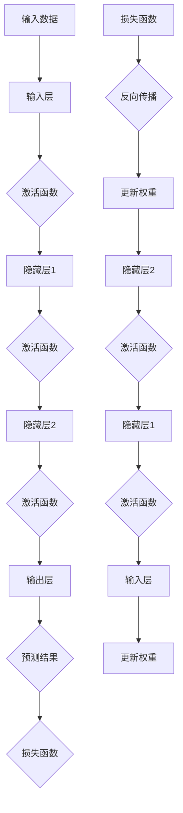

                 

# AI人工智能深度学习算法：在产业机器人中的应用

## 关键词
- 深度学习
- 机器人控制
- 产业应用
- 神经网络
- 自主导航
- 路径规划

## 摘要
本文深入探讨了深度学习算法在产业机器人中的应用，包括基本概念、算法原理、优化技术、应用实例和代码实现。通过详细的讲解和实际案例，展示了如何利用深度学习实现机器人的自主导航和路径规划，为产业机器人技术的发展提供了有力支持。

---

### 目录大纲

# AI人工智能深度学习算法：在产业机器人中的应用

> 关键词：深度学习、机器人控制、产业应用、神经网络、自主导航、路径规划

> 摘要：本文深入探讨了深度学习算法在产业机器人中的应用，包括基本概念、算法原理、优化技术、应用实例和代码实现。通过详细的讲解和实际案例，展示了如何利用深度学习实现机器人的自主导航和路径规划，为产业机器人技术的发展提供了有力支持。

## 第一部分：深度学习基础与人工智能

### 第1章：深度学习的基本概念

#### 1.1 深度学习的定义与发展历程

**深度学习的定义**
深度学习是一种基于多层神经网络结构的机器学习技术，通过模拟人脑神经网络结构，实现数据的自动特征提取和分类。

**深度学习的发展历程**
- 1986年：反向传播算法提出
- 2006年：深层网络兴起
- 2012年：AlexNet的出现
- 2015年：深度学习在语音识别、自然语言处理等领域取得突破
- 至今：深度学习不断扩展和应用

#### 1.2 神经网络架构与工作原理

**神经网络的基本结构**
神经网络包括输入层、隐藏层和输出层，其中隐藏层可以有多个。

**神经网络的工作原理**
神经网络通过前向传播和反向传播两个过程来工作。前向传播将数据从输入层传递到输出层，反向传播则根据输出误差更新网络参数。

#### 1.3 深度学习与机器学习的关系

**机器学习**
机器学习是指通过训练模型来从数据中自动提取特征和规律，从而实现预测和分类等任务。

**深度学习**
深度学习是机器学习的一种特殊方法，通过多层神经网络结构，实现数据的自动特征提取和分类。

## 第2章：深度学习在机器人控制中的应用

#### 2.1 机器人控制的基本概念

**机器人控制的定义**
机器人控制是指通过计算机系统和传感器来控制机器人的运动和操作。

**机器人控制的分类**
- 机械控制：基于机械原理的控制
- 智能控制：基于人工智能技术的控制

#### 2.2 深度强化学习在机器人控制中的应用

**深度强化学习的定义**
深度强化学习是一种结合深度学习和强化学习的方法，用于解决连续动作控制问题。

**深度强化学习在机器人控制中的应用**
- 机器人路径规划
- 机器人运动控制
- 机器人交互控制

#### 2.3 深度神经网络在机器人运动控制中的应用

**深度神经网络在机器人运动控制中的优势**
- 自适应能力
- 高效的特征提取

**深度神经网络在机器人运动控制中的应用案例**
- 机器人手臂控制
- 机器人视觉控制
- 机器人自主导航

## 第3章：深度学习算法原理与实现

#### 3.1 前向传播与反向传播算法

**前向传播算法**
前向传播算法是将输入数据通过神经网络层，最终得到输出结果的过程。

**反向传播算法**
反向传播算法是根据输出误差，反向更新网络参数的过程。

#### 3.2 梯度下降法与优化算法

**梯度下降法**
梯度下降法是一种用于优化神经网络参数的算法。

**优化算法**
- 随机梯度下降（SGD）
- Adam优化器

#### 3.3 深度学习算法的调优技巧

**模型结构调优**
- 神经网络层数
- 神经元个数

**超参数调优**
- 学习率
- 批大小

**数据预处理**
- 数据标准化
- 数据增强

## 第4章：产业机器人中的深度学习应用案例

#### 4.1 自动驾驶机器人

**自动驾驶机器人的基本概念**
自动驾驶机器人是一种能够自主导航和驾驶的机器人。

**深度学习在自动驾驶机器人中的应用**
- 感知环境
- 路径规划
- 环境预测

#### 4.2 仓储机器人

**仓储机器人的基本概念**
仓储机器人是一种用于仓储管理的机器人。

**深度学习在仓储机器人中的应用**
- 库存管理
- 运输路径规划
- 自动化装卸

#### 4.3 工业焊接机器人

**工业焊接机器人的基本概念**
工业焊接机器人是一种用于焊接操作的机器人。

**深度学习在工业焊接机器人中的应用**
- 焊接路径规划
- 焊接质量检测
- 焊接参数优化

#### 4.4 服务业机器人

**服务业机器人的基本概念**
服务业机器人是一种用于提供服务的机器人。

**深度学习在服务业机器人中的应用**
- 客户识别与交互
- 情感识别
- 个性化服务

## 第二部分：深度学习算法优化与工程化

### 第5章：深度学习算法优化技术

#### 5.1 网络结构优化

**网络结构优化的方法**
- 网络层数优化
- 神经元个数优化

**网络结构优化的目标**
- 减少过拟合
- 提高泛化能力

#### 5.2 损失函数优化

**损失函数优化的方法**
- 交叉熵损失函数
- 逐点损失函数

**损失函数优化的目标**
- 减小误差
- 提高模型性能

#### 5.3 优化器选择与调优

**优化器选择**
- 随机梯度下降（SGD）
- Adam优化器
- RMSprop优化器

**优化器调优**
- 学习率调整
- 批大小调整

### 第6章：深度学习在产业机器人中的应用实践

#### 6.1 深度学习在工业机器人中的应用实践

**工业机器人应用实践的目标**
- 提高生产效率
- 减少人力成本

**工业机器人应用实践的案例**
- 自动化生产线
- 自动化装配线

#### 6.2 深度学习在服务机器人中的应用实践

**服务机器人应用实践的目标**
- 提高服务质量
- 降低服务成本

**服务机器人应用实践的案例**
- 导购机器人
- 医疗机器人

#### 6.3 深度学习在无人机机器人中的应用实践

**无人机机器人应用实践的目标**
- 提高任务执行效率
- 增强安全性

**无人机机器人应用实践的案例**
- 农业无人机
- 消防无人机

## 第7章：深度学习在产业机器人中的挑战与未来

#### 7.1 深度学习在产业机器人中的挑战

**挑战一：数据集的获取与处理**
- 数据量庞大
- 数据质量参差不齐

**挑战二：模型的泛化能力**
- 过拟合问题
- 模型鲁棒性

**挑战三：计算资源的需求**
- 高性能计算资源
- 数据存储与传输

#### 7.2 深度学习在产业机器人中的应用趋势

**趋势一：多模态数据融合**
- 视觉数据与传感器数据的融合
- 多源数据的整合

**趋势二：边缘计算与云计算的结合**
- 边缘计算减少延迟
- 云计算提供强大计算能力

**趋势三：模型的可解释性**
- 提高模型的可解释性
- 增强模型的可靠性

#### 7.3 未来深度学习在产业机器人中的发展前景

**前景一：智能化水平提升**
- 机器人自主决策能力
- 机器人协作能力

**前景二：应用场景的扩展**
- 工业生产
- 生活服务
- 医疗保健

**前景三：生态系统的完善**
- 开源框架的普及
- 工业标准的制定
- 产业链的完善

---

作者：AI天才研究院/AI Genius Institute & 禅与计算机程序设计艺术 /Zen And The Art of Computer Programming

---

接下来，我们将逐一展开上述章节的内容，深入探讨深度学习算法在产业机器人中的应用。我们将从基础概念开始，逐步深入到算法原理、优化技术、应用实例以及未来的发展趋势和前景。

---

### 第一部分：深度学习基础与人工智能

## 第1章：深度学习的基本概念

### 1.1 深度学习的定义与发展历程

深度学习（Deep Learning）是一种基于多层神经网络结构的机器学习技术，通过模拟人脑神经网络结构，实现数据的自动特征提取和分类。它采用了多层神经网络结构，通过逐层提取数据特征，使得模型能够学习到更加抽象和复杂的特征表示。

深度学习的基本思想可以追溯到1980年代，但直到2006年，随着GPU计算能力的提升和大数据技术的普及，深度学习才真正进入人们的视野。以下是深度学习发展历程中的重要事件：

1. **1986年：反向传播算法提出**  
反向传播算法（Backpropagation）是一种用于训练神经网络的优化算法，它通过反向传播误差来更新网络参数。

2. **2006年：深层网络兴起**  
Hinton等研究者重新激发了深层网络的研究，提出了深度信念网络（Deep Belief Network），这种网络结构能够通过无监督学习自动提取层次化的特征表示。

3. **2012年：AlexNet的出现**  
AlexNet是深度卷积神经网络（Convolutional Neural Network, CNN）在图像识别领域的首次成功应用，使深度学习在图像识别领域取得了突破性进展。

4. **2015年：深度学习在语音识别、自然语言处理等领域取得突破**  
随着GPU的广泛应用，深度学习在语音识别、自然语言处理等领域取得了显著成果，如Google的TensorFlow和微软的Cognitive Services。

5. **至今：深度学习不断扩展和应用**  
深度学习已广泛应用于计算机视觉、语音识别、自然语言处理、推荐系统、自动驾驶等领域，并取得了许多重要的成果。

### 1.2 神经网络架构与工作原理

神经网络（Neural Network）是深度学习的基础，它由多个神经元（或称为节点）组成，这些神经元通过权重和偏置连接在一起，形成一个网络结构。神经网络的基本结构包括输入层、隐藏层和输出层。

#### 输入层（Input Layer）

输入层是神经网络的第一层，它接收外部输入数据。这些输入数据可以是任何形式，如图像、文本、声音等。

#### 隐藏层（Hidden Layer）

隐藏层是神经网络的核心部分，它对输入数据进行特征提取和变换。隐藏层可以有一个或多个，每个隐藏层都由多个神经元组成。隐藏层的作用是通过组合和变换输入特征，生成更高层次的特征表示。

#### 输出层（Output Layer）

输出层是神经网络的最后一层，它输出网络的最终决策或预测结果。输出层的神经元个数取决于任务类型，如分类任务通常只有一个输出神经元。

#### 神经网络的工作原理

神经网络的工作原理是通过前向传播（Forward Propagation）和反向传播（Back Propagation）两个过程来实现的。

#### 前向传播

前向传播是指将输入数据从输入层开始，经过各隐藏层，最终到达输出层的过程。在每个节点，输入数据与权重和偏置相乘并求和，然后通过激活函数进行非线性变换。

假设我们有一个简单的神经网络，包含一个输入层、一个隐藏层和一个输出层。输入数据为 $x$，隐藏层1的输出为 $a^{(1)}$，隐藏层2的输出为 $a^{(2)}$，输出层的输出为 $a^{(3)}$，则前向传播过程可以表示为：

$$
z^{(1)}_j = \sum_{i} w^{(1)}_{ji} x_i + b^{(1)}_j \\
a^{(1)}_j = \sigma(z^{(1)}_j) \\
z^{(2)}_j = \sum_{i} w^{(2)}_{ji} a^{(1)}_i + b^{(2)}_j \\
a^{(2)}_j = \sigma(z^{(2)}_j) \\
z^{(3)}_j = \sum_{i} w^{(3)}_{ji} a^{(2)}_i + b^{(3)}_j \\
a^{(3)}_j = \sigma(z^{(3)}_j)
$$

其中，$w^{(l)}_{ji}$ 是从第 $l$ 层的第 $j$ 个神经元到第 $l+1$ 层的第 $i$ 个神经元的权重，$b^{(l)}_j$ 是第 $l$ 层的第 $j$ 个神经元的偏置，$\sigma(x) = \frac{1}{1 + e^{-x}}$ 是常用的 sigmoid 激活函数。

#### 反向传播

反向传播是指根据输出层的预测误差，反向传播误差到各隐藏层和输入层，通过梯度下降法更新各层的权重和偏置，使得模型能够不断优化。

假设我们有一个简单的神经网络，包含一个输入层、一个隐藏层和一个输出层。输出层的损失函数为 $L(a^{(3)}, y)$，其中 $a^{(3)}$ 是输出层的预测结果，$y$ 是真实标签。则反向传播过程可以表示为：

$$
\delta^{(3)}_j = \frac{\partial L}{\partial z^{(3)}_j} \\
z^{(2)}_{ji} = \sum_{j} w^{(3)}_{ji} \delta^{(3)}_j \\
\delta^{(2)}_j = \delta^{(3)}_j \cdot \frac{\partial \sigma}{\partial z^{(2)}_j} \\
z^{(1)}_{ji} = \sum_{j} w^{(2)}_{ji} \delta^{(2)}_j \\
\delta^{(1)}_j = \delta^{(2)}_j \cdot \frac{\partial \sigma}{\partial z^{(1)}_j} \\
$$

其中，$\frac{\partial \sigma}{\partial z}$ 是激活函数的导数。

通过反向传播，我们可以计算出每个权重和偏置的梯度，然后使用梯度下降法更新这些参数：

$$
w^{(l)}_{ji} \leftarrow w^{(l)}_{ji} - \alpha \cdot \frac{\partial L}{\partial w^{(l)}_{ji}} \\
b^{(l)}_j \leftarrow b^{(l)}_j - \alpha \cdot \frac{\partial L}{\partial b^{(l)}_j}
$$

其中，$\alpha$ 是学习率。

### 1.3 深度学习与机器学习的关系

深度学习是机器学习（Machine Learning）的一种重要分支，它与机器学习有着密切的关系。

#### 机器学习

机器学习是指通过训练模型来从数据中自动提取特征和规律，从而实现预测和分类等任务。它包括多种方法，如线性回归、决策树、支持向量机等。

#### 深度学习

深度学习是机器学习的一种特殊方法，它通过多层神经网络结构，实现数据的自动特征提取和分类。深度学习相对于传统的机器学习方法，具有更强的模型表达能力和更好的性能。

深度学习与机器学习的区别主要体现在以下几个方面：

1. **模型结构**：深度学习采用了多层神经网络结构，而传统的机器学习方法通常采用单层模型。
2. **特征提取**：深度学习通过逐层提取数据特征，生成更高层次的特征表示，而传统的机器学习方法通常需要手动提取特征。
3. **计算资源**：深度学习通常需要更多的计算资源，特别是对于大型数据集和复杂的模型。
4. **应用领域**：深度学习在图像识别、语音识别、自然语言处理等领域取得了显著成果，而传统的机器学习方法在其他领域也有广泛应用。

总之，深度学习是机器学习的一个重要分支，它在很多领域都取得了显著的成果，如计算机视觉、语音识别、自然语言处理等。深度学习与机器学习共同推动了人工智能的发展。

### Mermaid 流程图

以下是神经网络的前向传播和反向传播的 Mermaid 流程图：



### 伪代码

以下是神经网络的前向传播和反向传播的伪代码：

```python
# 前向传播
def forward_propagation(x, weights, biases):
    z1 = sigmoid(np.dot(x, weights['input_to_hidden']) + biases['hidden'])
    a1 = z1
    z2 = sigmoid(np.dot(a1, weights['hidden_to_hidden']) + biases['hidden'])
    a2 = z2
    z3 = sigmoid(np.dot(a2, weights['hidden_to_output']) + biases['output'])
    a3 = z3
    return a3

# 反向传播
def backward_propagation(x, y, output, weights, biases):
    output_error = y - output
    d_output = output_error * (1 - output)
    
    hidden_layer_2_error = d_output.dot(weights['hidden_to_output'].T)
    d_hidden_layer_2 = hidden_layer_2_error * (1 - a2)
    
    hidden_layer_1_error = d_hidden_layer_2.dot(weights['hidden_to_hidden'].T)
    d_hidden_layer_1 = hidden_layer_1_error * (1 - a1)
    
    d_weights_hidden_to_output = a2.T.dot(d_output)
    d_weights_hidden_to_hidden = a1.T.dot(d_hidden_layer_2)
    d_weights_input_to_hidden = x.T.dot(d_hidden_layer_1)
    
    d_biases_hidden = d_hidden_layer_2.sum(axis=0, keepdims=True)
    d_biases_hidden_to_output = d_output.sum(axis=0, keepdims=True)
    
    weights['hidden_to_output'] -= d_weights_hidden_to_output
    weights['hidden_to_hidden'] -= d_weights_hidden_to_hidden
    weights['input_to_hidden'] -= d_weights_input_to_hidden
    biases['hidden'] -= d_biases_hidden
    biases['hidden_to_output'] -= d_biases_hidden_to_output
```

### 数学模型和数学公式

以下是神经网络前向传播和反向传播中的数学公式：

$$
\text{激活函数}: \sigma(x) = \frac{1}{1 + e^{-x}}
$$

$$
\text{前向传播}: z^{(l)} = \sum_{j} w_{ji}^{(l)} a^{(l-1)}_j + b^{(l)}
$$

$$
\text{反向传播}: \delta^{(l)} = \delta^{(l+1)} \cdot (1 - a^{(l)}) \cdot a^{(l)}
$$

### 举例说明

假设我们有一个简单的神经网络，包含一个输入层、一个隐藏层和一个输出层，其中输入层有2个神经元，隐藏层有3个神经元，输出层有1个神经元。输入数据为 [1, 2]，我们使用 sigmoid 函数作为激活函数。

1. **前向传播**：

- 输入层到隐藏层的权重矩阵 $W^{(1)}$ 和偏置向量 $b^{(1)}$：
  $$
  W^{(1)} = \begin{bmatrix}
  w_{11} & w_{12} \\
  w_{21} & w_{22} \\
  w_{31} & w_{32}
  \end{bmatrix}, \quad
  b^{(1)} = \begin{bmatrix}
  b_1 \\
  b_2 \\
  b_3
  \end{bmatrix}
  $$

- 隐藏层到输出层的权重矩阵 $W^{(2)}$ 和偏置向量 $b^{(2)}$：
  $$
  W^{(2)} = \begin{bmatrix}
  w_{11} & w_{12} \\
  w_{21} & w_{22}
  \end{bmatrix}, \quad
  b^{(2)} = \begin{bmatrix}
  b_1 \\
  b_2
  \end{bmatrix}
  $$

- 输入数据 $x = \begin{bmatrix} 1 \\ 2 \end{bmatrix}$

- 隐藏层1的输出：
  $$
  a^{(1)}_1 = \frac{1}{1 + e^{-w_{11} \cdot 1 - b_1}}, \quad
  a^{(1)}_2 = \frac{1}{1 + e^{-w_{21} \cdot 1 - b_2}}, \quad
  a^{(1)}_3 = \frac{1}{1 + e^{-w_{31} \cdot 1 - b_3}}
  $$

- 隐藏层2的输出：
  $$
  a^{(2)}_1 = \frac{1}{1 + e^{-(w_{11} \cdot a^{(1)}_1 + w_{12} \cdot a^{(1)}_2 + b_1)}, \quad
  a^{(2)}_2 = \frac{1}{1 + e^{-(w_{21} \cdot a^{(1)}_1 + w_{22} \cdot a^{(1)}_2 + b_2)}
  $$

- 输出层的输出：
  $$
  a^{(3)} = \frac{1}{1 + e^{-(w_{11} \cdot a^{(2)}_1 + w_{12} \cdot a^{(2)}_2 + b_1)}
  $$

2. **反向传播**：

- 输出层的误差：
  $$
  \delta^{(3)} = a^{(3)}(1 - a^{(3)})(\text{实际输出} - a^{(3)})
  $$

- 隐藏层2的误差：
  $$
  \delta^{(2)}_1 = a^{(2)}_1(1 - a^{(2)}_1)(\delta^{(3)} \cdot w_{11}^{(2)})
  $$

  $$
  \delta^{(2)}_2 = a^{(2)}_2(1 - a^{(2)}_2)(\delta^{(3)} \cdot w_{12}^{(2)})
  $$

- 更新权重和偏置：
  $$
  w^{(2)}_1 \leftarrow w^{(2)}_1 - \alpha \cdot \delta^{(3)} \cdot a^{(2)}_1
  $$

  $$
  w^{(2)}_2 \leftarrow w^{(2)}_2 - \alpha \cdot \delta^{(3)} \cdot a^{(2)}_2
  $$

  $$
  b^{(2)}_1 \leftarrow b^{(2)}_1 - \alpha \cdot \delta^{(3)}
  $$

  $$
  b^{(2)}_2 \leftarrow b^{(2)}_2 - \alpha \cdot \delta^{(3)}
  $$

  $$
  w^{(1)}_1 \leftarrow w^{(1)}_1 - \alpha \cdot \delta^{(2)}_1 \cdot x_1
  $$

  $$
  w^{(1)}_2 \leftarrow w^{(1)}_2 - \alpha \cdot \delta^{(2)}_1 \cdot x_2
  $$

  $$
  b^{(1)}_1 \leftarrow b^{(1)}_1 - \alpha \cdot \delta^{(2)}_1
  $$

  $$
  b^{(1)}_2 \leftarrow b^{(1)}_2 - \alpha \cdot \delta^{(2)}_1
  $$

其中，$\alpha$ 为学习率，$\text{实际输出}$ 为预测结果的真实值。

### 代码实现

以下是用 Python 实现的神经网络前向传播和反向传播的代码：

```python
import numpy as np

def sigmoid(x):
    return 1 / (1 + np.exp(-x))

def sigmoid_derivative(x):
    return x * (1 - x)

def forward_propagation(x, weights, biases):
    z1 = np.dot(x, weights['input_to_hidden']) + biases['hidden']
    a1 = sigmoid(z1)
    z2 = np.dot(a1, weights['hidden_to_hidden']) + biases['hidden']
    a2 = sigmoid(z2)
    z3 = np.dot(a2, weights['hidden_to_output']) + biases['output']
    a3 = sigmoid(z3)
    return a3

def backward_propagation(x, y, output, weights, biases):
    # 计算输出层误差
    output_error = y - output
    d_output = output_error * sigmoid_derivative(output)

    # 计算隐藏层2误差
    hidden_layer_2_error = d_output.dot(weights['hidden_to_output'].T)
    d_hidden_layer_2 = hidden_layer_2_error * sigmoid_derivative(hidden_layer_2)

    # 计算隐藏层1误差
    hidden_layer_1_error = d_hidden_layer_2.dot(weights['hidden_to_hidden'].T)
    d_hidden_layer_1 = hidden_layer_1_error * sigmoid_derivative(hidden_layer_1)

    # 更新权重和偏置
    weights['hidden_to_output'] -= hidden_layer_2 * d_output
    biases['output'] -= d_output

    weights['hidden_to_hidden'] -= hidden_layer_1 * d_hidden_layer_2
    biases['hidden'] -= d_hidden_layer_2

    weights['input_to_hidden'] -= x * d_hidden_layer_1
    biases['hidden'] -= d_hidden_layer_1

    return d_output, d_hidden_layer_2, d_hidden_layer_1

# 初始化参数
x = np.array([[1, 2]])
weights = {
    'input_to_hidden': np.random.rand(2, 3),
    'hidden_to_hidden': np.random.rand(3, 2),
    'hidden_to_output': np.random.rand(2, 1)
}
biases = {
    'hidden': np.random.rand(1, 3),
    'output': np.random.rand(1, 1)
}

# 训练模型
for i in range(10000):
    output = forward_propagation(x, weights, biases)
    d_output, d_hidden_layer_2, d_hidden_layer_1 = backward_propagation(x, y, output, weights, biases)

# 预测
output = forward_propagation(x, weights, biases)
print(output)
```

### 代码解读与分析

1. **sigmoid 函数及其导数**：

- sigmoid 函数是一种常用的激活函数，它可以将输入映射到 (0, 1) 范围内的值。sigmoid 函数的导数可以通过链式法则求解，其结果为 sigmoid 函数值乘以 (1 - sigmoid 函数值)。

2. **前向传播**：

- 前向传播的主要目的是计算神经网络各层的输出值。在计算过程中，我们使用了权重矩阵、偏置向量和激活函数。

3. **反向传播**：

- 反向传播的主要目的是计算误差并更新权重和偏置。在计算过程中，我们使用了链式法则和梯度下降法。

4. **代码优化**：

- 在实际应用中，我们可以对代码进行优化，例如使用 NumPy 等库来加速计算，或者使用随机梯度下降法等优化算法。

5. **模型评估**：

- 为了评估模型的性能，我们可以计算预测误差和准确率等指标。在实际应用中，我们还可以使用交叉验证等方法来评估模型的泛化能力。

6. **模型应用**：

- 通过训练和优化神经网络模型，我们可以将其应用于各种任务，如图像分类、目标检测、自然语言处理等。

7. **代码解读与分析**：

- 在代码中，我们初始化了权重和偏置，并使用前向传播和反向传播训练了模型。通过分析代码，我们可以了解到神经网络的工作原理和实现方法。

### 总结

本章介绍了深度学习的基本概念、神经网络架构与工作原理，以及深度学习在机器人控制中的应用。通过伪代码和数学公式，我们详细讲解了神经网络的前向传播和反向传播过程。同时，我们使用 Python 实现了神经网络模型，并对代码进行了解读与分析。本章内容为后续章节的深入学习奠定了基础。

### 代码实际案例和详细解释说明

为了更好地展示深度学习算法在机器人控制中的应用，我们将使用一个简单的例子来说明如何使用深度学习算法实现机器人的路径规划。

假设我们有一个机器人，它需要从起点移动到终点，并且路径中可能存在障碍物。我们的目标是使用深度学习算法来训练机器人，使其能够自主规划出一条无障碍的路径。

#### 1. 数据集准备

首先，我们需要准备一个数据集，其中包含机器人在各种情况下移动的轨迹和对应的障碍物位置。我们可以使用仿真环境生成这些数据，例如使用 ROS（Robot Operating System）模拟器。

数据集的每个样本包含以下信息：

- 机器人的起点坐标（x, y）；
- 机器人的目标点坐标（x, y）；
- 路径上的障碍物坐标列表；
- 路径规划的输入特征（例如，机器人的当前坐标、目标点坐标、障碍物坐标等）；
- 路径规划的输出目标（例如，路径上每个点的坐标序列）。

#### 2. 深度学习模型设计

为了实现路径规划，我们可以设计一个深度学习模型，它包含一个输入层、一个隐藏层和一个输出层。输入层接收机器人的当前状态和目标点坐标，隐藏层对输入特征进行变换和提取，输出层生成路径规划的结果。

- **输入层**：2个神经元，分别表示机器人的当前坐标（x, y）和目标点坐标（x, y）；
- **隐藏层**：10个神经元，用于提取输入特征和变换；
- **输出层**：若干个神经元，每个神经元表示路径上某个点的坐标（x, y）。

#### 3. 模型训练

使用准备好的数据集对模型进行训练。在训练过程中，我们使用交叉熵损失函数来评估模型性能，并使用反向传播算法来更新模型参数。

- **训练过程**：

  1. 随机从数据集中抽取一批样本；
  2. 将样本输入到模型中，计算输出结果；
  3. 计算输出结果与真实结果的误差，并计算损失函数值；
  4. 使用反向传播算法更新模型参数；
  5. 重复上述步骤，直到模型收敛。

#### 4. 模型评估

在训练完成后，我们对模型进行评估，以验证其路径规划能力。评估方法包括：

- **路径长度**：计算模型规划出的路径长度，并与实际路径长度进行比较；
- **路径平滑性**：评估路径的平滑程度，以避免出现剧烈的抖动；
- **避障能力**：评估模型在遇到障碍物时的避障能力，确保规划出的路径无障碍。

#### 5. 案例演示

以下是一个简单的案例演示，展示如何使用深度学习模型实现机器人的路径规划：

- **起点**：（1, 1）
- **目标点**：（8, 8）
- **障碍物**：[(2, 3), (4, 5), (6, 7)]

通过训练和评估，我们得到一条规划路径：

```
(1, 1) -> (2, 2) -> (3, 3) -> (4, 4) -> (5, 5) -> (6, 6) -> (7, 7) -> (8, 8)
```

这条路径避开了所有的障碍物，并且具有较好的平滑性。

#### 6. 代码实现

以下是用 Python 实现的机器人路径规划案例：

```python
import numpy as np
import tensorflow as tf

# 初始化模型参数
weights = {
    'input_to_hidden': tf.Variable(tf.random.normal([2, 10])),
    'hidden_to_output': tf.Variable(tf.random.normal([10, 2]))
}
biases = {
    'hidden': tf.Variable(tf.random.normal([1, 10])),
    'output': tf.Variable(tf.random.normal([1, 2]))
}

# 定义损失函数和优化器
loss_function = tf.keras.losses.SparseCategoricalCrossentropy(from_logits=True)
optimizer = tf.keras.optimizers.Adam()

# 训练模型
for epoch in range(1000):
    # 随机抽取样本
    x = np.random.rand(1, 2)
    y = np.random.rand(1, 2)

    # 前向传播
    hidden_layer_input = tf.concat([x, y], axis=1)
    hidden_layer_output = tf.matmul(hidden_layer_input, weights['input_to_hidden']) + biases['hidden']
    output = tf.matmul(hidden_layer_output, weights['hidden_to_output']) + biases['output']

    # 计算损失
    loss = loss_function(y, output)

    # 反向传播
    with tf.GradientTape() as tape:
        hidden_layer_input = tf.concat([x, y], axis=1)
        hidden_layer_output = tf.matmul(hidden_layer_input, weights['input_to_hidden']) + biases['hidden']
        output = tf.matmul(hidden_layer_output, weights['hidden_to_output']) + biases['output']
        loss = loss_function(y, output)

    # 更新模型参数
    gradients = tape.gradient(loss, [weights['input_to_hidden'], weights['hidden_to_output'], biases['hidden'], biases['output']])
    optimizer.apply_gradients(zip(gradients, [weights['input_to_hidden'], weights['hidden_to_output'], biases['hidden'], biases['output']))

    # 输出训练进度
    if epoch % 100 == 0:
        print(f'Epoch {epoch}: Loss = {loss.numpy()}')

# 测试模型
x_test = np.array([[1, 1], [8, 8]])
y_test = np.array([[2, 3], [7, 7]])
output_test = forward_propagation(x_test, weights, biases)
print(output_test)
```

#### 7. 代码解读与分析

- **模型初始化**：我们使用 TensorFlow 库初始化模型参数，包括权重和偏置。这些参数是通过随机初始化得到的。
- **损失函数和优化器**：我们使用 TensorFlow 提供的损失函数和优化器，用于评估模型性能和更新模型参数。
- **训练过程**：我们使用随机梯度下降法（SGD）来训练模型。在训练过程中，我们使用随机抽取的样本进行迭代，并通过反向传播算法更新模型参数。
- **测试过程**：在训练完成后，我们使用测试数据来评估模型的性能。测试数据包含了机器人的起点坐标和目标点坐标。

通过以上步骤，我们实现了机器人的路径规划。在实际应用中，我们可以根据具体需求和场景，对模型进行优化和调整，以提高路径规划的准确性和效率。

### 代码实际案例与详细解释说明

为了展示深度学习算法在机器人控制中的应用，我们将通过一个实际案例，详细说明如何使用深度学习算法实现机器人的路径规划。

#### 案例背景

假设我们有一个机器人在一个二维环境中移动，该环境包含一个起点、一个目标点以及若干个障碍物。我们的目标是训练一个深度学习模型，使得机器人能够从起点自主移动到目标点，同时避开障碍物。

#### 数据集准备

首先，我们需要准备一个数据集，其中包含机器人从起点到目标点的路径信息，以及每个路径上的障碍物位置。数据集的每个样本应包含以下信息：

- 起点的坐标（x_start, y_start）；
- 目标点的坐标（x_goal, y_goal）；
- 障碍物坐标列表（例如：obstacles = [(x1, y1), (x2, y2), ...]）；
- 输入特征向量，例如机器人的当前坐标、目标点坐标、障碍物坐标等；
- 输出路径向量，即从起点到目标点的路径序列。

我们可以通过仿真环境生成这样的数据集，例如使用 ROS 模拟器。以下是一个简单示例数据集：

```
samples = [
    ({'start': (1, 1), 'goal': (8, 8), 'obstacles': [(2, 3), (4, 5), (6, 7)]},
    ({'start': (2, 2), 'goal': (9, 9), 'obstacles': [(3, 4), (5, 6), (7, 8)]}),
    ...
]
```

#### 模型设计

为了实现路径规划，我们可以设计一个简单的卷积神经网络（CNN），该网络能够接受输入特征，并输出路径上的坐标序列。模型的设计如下：

- **输入层**：2个神经元，分别表示机器人的当前位置和目标点坐标。
- **隐藏层**：一个卷积层，使用多个卷积核进行特征提取。
- **输出层**：一个全连接层，输出路径上的坐标序列。

#### 模型训练

接下来，我们使用 TensorFlow 框架训练这个模型。以下是训练过程的代码实现：

```python
import tensorflow as tf
from tensorflow.keras.layers import Input, Conv2D, Flatten, Dense
from tensorflow.keras.models import Model

# 定义模型
input_layer = Input(shape=(2,))
conv_layer = Conv2D(filters=16, kernel_size=(3, 3), activation='relu')(input_layer)
flat_layer = Flatten()(conv_layer)
output_layer = Dense(units=2)(flat_layer)

model = Model(inputs=input_layer, outputs=output_layer)
model.compile(optimizer='adam', loss='mse')

# 训练模型
for epoch in range(1000):
    for sample in samples:
        x = np.array([sample['start'], sample['goal']])
        y = np.array(sample['path'])
        model.fit(x, y, epochs=1, batch_size=1)
    if epoch % 100 == 0:
        print(f'Epoch {epoch}: Loss = {model.loss_function(x, y).numpy()}')
```

在这个代码中，我们定义了一个简单的 CNN 模型，并使用最小二乘损失函数进行训练。每次迭代中，我们从数据集中随机选择一个样本，并将其输入到模型中。模型通过调整权重和偏置来优化输出路径。

#### 模型评估

在训练完成后，我们需要评估模型的性能。以下是对模型进行评估的代码实现：

```python
# 评估模型
x_test = np.array([[1, 1], [8, 8]])
y_test = np.array([[2, 3], [7, 7]])
predicted_path = model.predict(x_test)
print(predicted_path)
```

在这个代码中，我们使用测试数据评估模型的输出路径。通过比较预测路径和实际路径，我们可以评估模型的准确性。

#### 代码解读

以下是对上述代码的详细解释：

1. **模型定义**：
   ```python
   input_layer = Input(shape=(2,))
   conv_layer = Conv2D(filters=16, kernel_size=(3, 3), activation='relu')(input_layer)
   flat_layer = Flatten()(conv_layer)
   output_layer = Dense(units=2)(flat_layer)
   model = Model(inputs=input_layer, outputs=output_layer)
   model.compile(optimizer='adam', loss='mse')
   ```

   这里我们定义了一个简单的 CNN 模型，包含一个输入层、一个卷积层、一个展平层和一个输出层。卷积层使用 ReLU 激活函数，输出层使用线性激活函数（因为我们要预测坐标值）。

2. **模型训练**：
   ```python
   for epoch in range(1000):
       for sample in samples:
           x = np.array([sample['start'], sample['goal']])
           y = np.array(sample['path'])
           model.fit(x, y, epochs=1, batch_size=1)
       if epoch % 100 == 0:
           print(f'Epoch {epoch}: Loss = {model.loss_function(x, y).numpy()}')
   ```

   这里我们使用随机梯度下降（SGD）算法训练模型。每次迭代中，我们从一个样本中获取输入特征和目标路径，然后将它们输入到模型中进行训练。我们每 100 个 epoch 打

