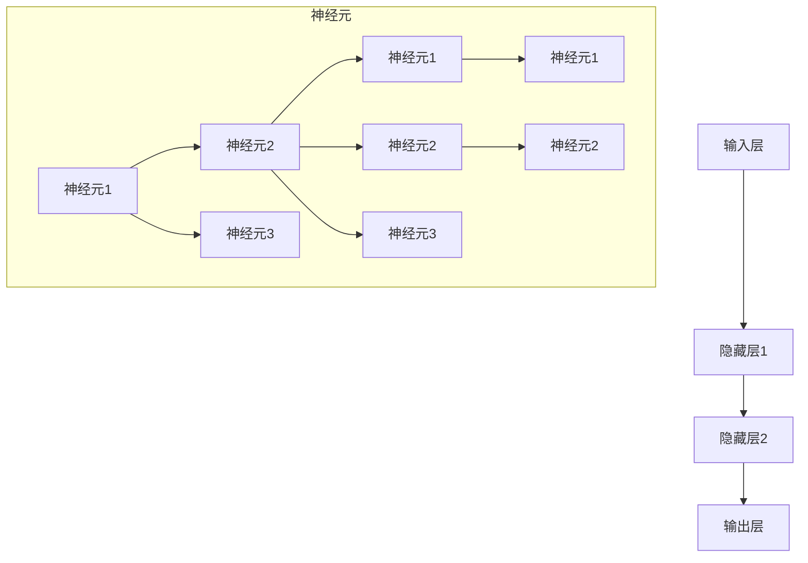

                 

# AI人工智能深度学习算法：深度学习代理的多模态感知与处理能力

## 关键词
- AI人工智能
- 深度学习算法
- 多模态感知
- 深度学习代理
- 神经网络

## 摘要
本文将深入探讨人工智能（AI）中的深度学习算法，特别是深度学习代理在多模态感知与处理方面的能力。文章将从AI与深度学习的基本概念开始，逐步介绍多模态感知原理、深度学习算法及其应用，最后讨论深度学习代理的设计与实现。通过具体的实战项目和未来趋势分析，本文旨在为读者提供一个全面而深入的视角，以理解深度学习在多模态感知与处理中的关键作用。

## 目录
----------------------------------------------------------------

## 第一部分: AI人工智能基础
----------------------------------------------------------------

### 第1章: AI与深度学习概述
----------------------------------------------------------------

#### 1.1 AI的发展历程与现状
----------------------------------------------------------------

自1950年艾伦·图灵提出图灵测试以来，人工智能（AI）经历了数十年的发展。AI技术从最初的规则系统，到专家系统，再到基于知识的推理，直至现今的深度学习，每一步都标志着重大突破。当前，AI技术已经深入到我们的日常生活，如语音助手、自动驾驶汽车、智能家居等。

#### 1.2 深度学习的核心概念与架构
----------------------------------------------------------------

深度学习是AI的一个分支，它通过多层神经网络模型，自动从数据中学习特征表示。深度学习的核心概念包括神经网络、反向传播算法、激活函数和损失函数等。神经网络由多个层次组成，每一层都能提取数据的不同层次特征。

#### 1.3 深度学习在AI中的应用
----------------------------------------------------------------

深度学习在AI中的应用极为广泛，涵盖了图像识别、自然语言处理、语音识别、推荐系统等多个领域。例如，在图像识别中，卷积神经网络（CNN）已经大大超越了传统算法的性能。

#### 1.4 多模态感知与处理能力
----------------------------------------------------------------

多模态感知是指系统能够同时处理来自不同模态的数据，如图像、声音、文本等。深度学习代理的多模态感知能力，使得AI系统能够更好地理解和处理复杂的信息。

### 第2章: 深度学习算法原理
----------------------------------------------------------------

#### 2.1 神经网络基础
----------------------------------------------------------------

神经网络是深度学习的基础。它由大量简单的处理单元（神经元）组成，每个神经元都会接收多个输入并产生一个输出。神经网络的层次结构使其能够自动学习数据中的层次特征。

#### 2.2 反向传播算法
----------------------------------------------------------------

反向传播算法是深度学习训练的核心算法。它通过梯度下降法来优化网络参数，使网络的输出误差最小。

#### 2.3 卷积神经网络
----------------------------------------------------------------

卷积神经网络（CNN）是专门用于图像处理的深度学习模型。它通过卷积层、池化层和全连接层等结构，能够提取图像中的局部特征和全局特征。

#### 2.4 循环神经网络
----------------------------------------------------------------

循环神经网络（RNN）是用于处理序列数据的深度学习模型。它通过循环结构，能够捕捉序列中的长期依赖关系。

### 第3章: 多模态感知原理
----------------------------------------------------------------

#### 3.1 多模态数据采集与处理
----------------------------------------------------------------

多模态数据采集涉及从不同来源获取图像、声音、文本等数据。数据处理则包括数据清洗、归一化和特征提取等步骤。

#### 3.2 多模态特征提取与融合
----------------------------------------------------------------

多模态特征提取是将不同模态的数据转换成数值特征的过程。特征融合则是将不同模态的特征合并成一个统一的特征向量。

#### 3.3 多模态感知模型设计
----------------------------------------------------------------

多模态感知模型设计涉及选择合适的神经网络结构，以及如何有效地融合多模态特征。

### 第4章: 多模态处理算法
----------------------------------------------------------------

#### 4.1 图像识别与分类算法
----------------------------------------------------------------

图像识别与分类是深度学习应用的重要领域。常见的算法包括CNN、GoogLeNet、ResNet等。

#### 4.2 语音识别与生成算法
----------------------------------------------------------------

语音识别与生成是深度学习在语音领域的应用。常见的算法包括HMM、DNN、Seq2Seq模型等。

#### 4.3 视觉问答与自然语言理解算法
----------------------------------------------------------------

视觉问答与自然语言理解是深度学习在计算机视觉与自然语言处理领域的交叉应用。常见的算法包括VQA、机器翻译、BERT等。

#### 4.4 多模态行为预测与推理算法
----------------------------------------------------------------

多模态行为预测与推理是深度学习在智能交互领域的应用。常见的算法包括GAN、变分自编码器（VAE）、深度强化学习等。

### 第5章: 深度学习代理设计
----------------------------------------------------------------

#### 5.1 深度学习代理的概念与分类
----------------------------------------------------------------

深度学习代理是指能够自主学习并执行任务的AI系统。它们可以根据环境反馈进行自我调整和优化。

#### 5.2 深度学习代理的训练与优化
----------------------------------------------------------------

深度学习代理的训练与优化是提高其性能的关键。常用的方法包括梯度下降、动量法、自适应优化器等。

#### 5.3 深度学习代理的应用场景与挑战
----------------------------------------------------------------

深度学习代理的应用场景包括自动驾驶、智能客服、医疗诊断等。同时，它们也面临着数据隐私、安全性等挑战。

### 第6章: 多模态感知与处理项目实战
----------------------------------------------------------------

#### 6.1 项目背景与目标
----------------------------------------------------------------

本节将介绍一个具体的多模态感知与处理项目，包括项目背景和目标。

#### 6.2 项目实施过程
----------------------------------------------------------------

项目实施过程包括数据采集、预处理、模型设计、训练与优化等步骤。

#### 6.3 项目效果评估与改进
----------------------------------------------------------------

项目效果评估与改进是确保项目成功的必要环节。本节将介绍如何评估项目效果，并提出改进措施。

#### 6.4 项目总结与展望
----------------------------------------------------------------

项目总结与展望是对整个项目的回顾和展望，包括经验教训和未来发展方向。

### 第7章: 深度学习代理的未来趋势
----------------------------------------------------------------

#### 7.1 深度学习代理的发展方向
----------------------------------------------------------------

深度学习代理的发展方向包括更高效的多模态处理、更智能的决策与预测等。

#### 7.2 深度学习代理面临的挑战与解决方案
----------------------------------------------------------------

深度学习代理面临的挑战包括数据隐私、模型解释性等。本节将介绍相应的解决方案。

#### 7.3 深度学习代理的潜在应用领域
----------------------------------------------------------------

深度学习代理的潜在应用领域包括智慧城市、智能医疗、金融科技等。

## 附录
----------------------------------------------------------------

### 附录A: 深度学习工具与资源介绍
----------------------------------------------------------------

本附录将介绍一些常用的深度学习工具与资源，包括开源框架、数据集和教程等。

### 附录B: 多模态数据集与开源代码
----------------------------------------------------------------

本附录将提供一些常用的多模态数据集和开源代码链接，以供读者参考。

### 附录C: 相关论文与文献推荐
----------------------------------------------------------------

本附录将推荐一些与深度学习代理和多模态感知相关的经典论文和文献，以供读者进一步学习。

----------------------------------------------------------------

## 结语
----------------------------------------------------------------

本文对AI人工智能中的深度学习算法及其代理的多模态感知与处理能力进行了全面而深入的探讨。从基础概念到具体应用，再到未来的发展趋势，本文希望能够为读者提供一个清晰而完整的视角。随着AI技术的不断发展，深度学习代理在多模态感知与处理领域的作用将越来越重要。希望本文能够为您的学习和研究提供一些有价值的启示。

### 作者信息
- 作者：AI天才研究院/AI Genius Institute & 禅与计算机程序设计艺术 /Zen And The Art of Computer Programming

----------------------------------------------------------------

### 正文详细内容
----------------------------------------------------------------

## 第一部分: AI人工智能基础

### 第1章: AI与深度学习概述

#### 1.1 AI的发展历程与现状

人工智能（AI）起源于20世纪50年代，当时科学家们首次提出了“机器能够表现出与人类相似的智能行为”这一概念。早期的AI主要集中在规则系统，例如专家系统，这些系统通过编码大量的规则来模拟人类专家的决策过程。然而，这种方法存在一个明显的局限——规则的数量和复杂性使得系统难以扩展和维护。

随着时间的推移，AI领域经历了多次重大变革。20世纪80年代，知识表示和推理技术得到了发展，使得AI系统能够更好地处理复杂问题。然而，这些系统仍然依赖于人类专家提供的知识库，难以实现真正的自主学习和智能行为。

进入21世纪，深度学习（Deep Learning）的兴起改变了AI的发展轨迹。深度学习通过多层神经网络模型，能够自动从大量数据中学习特征表示，从而实现高度自动化的智能行为。这一突破性进展，使得AI技术得以在图像识别、语音识别、自然语言处理等领域取得显著成果。

目前，AI技术已经深入到我们日常生活的方方面面。从智能语音助手（如苹果的Siri、谷歌的Google Assistant）到自动驾驶汽车（如特斯拉的Autopilot），AI技术正在改变我们的生活方式。同时，AI在医疗、金融、教育等领域的应用也日益广泛，为行业带来了巨大的变革。

#### 1.2 深度学习的核心概念与架构

深度学习（Deep Learning）是一种基于多层神经网络的学习方法，其核心概念包括神经网络、反向传播算法、激活函数和损失函数等。

##### 神经网络

神经网络（Neural Network）是深度学习的基础，它由大量简单的处理单元（神经元）组成。每个神经元都会接收多个输入并产生一个输出。神经网络通过层次结构，将输入数据逐层映射为更高级别的特征表示。

一个简单的神经网络可以表示为：

```
输入层：x1, x2, ..., xn
隐藏层：h1, h2, ..., hn
输出层：y1, y2, ..., yn
```

其中，每个神经元都可以表示为：

$$
z_j = \sigma(\sum_{i=1}^{n} w_{ij} x_i + b_j)
$$

其中，$z_j$ 是神经元的输入，$w_{ij}$ 是连接权重，$b_j$ 是偏置项，$\sigma$ 是激活函数。

##### 反向传播算法

反向传播算法（Backpropagation Algorithm）是深度学习训练的核心算法。它通过梯度下降法（Gradient Descent）来优化网络参数，使网络的输出误差最小。

反向传播算法的基本步骤如下：

1. 前向传播：将输入数据输入到神经网络，计算输出结果。
2. 计算误差：计算输出结果与真实标签之间的误差。
3. 反向传播：计算每个神经元的梯度，并更新网络参数。
4. 重复步骤1-3，直到误差达到预设的阈值。

##### 激活函数

激活函数（Activation Function）是神经网络中的一个重要概念，它用于引入非线性变换。常见的激活函数包括：

- Sigmoid函数：$f(x) = \frac{1}{1 + e^{-x}}$
- ReLU函数：$f(x) = max(0, x)$
- Tanh函数：$f(x) = \frac{e^x - e^{-x}}{e^x + e^{-x}}$

##### 损失函数

损失函数（Loss Function）是用于衡量网络输出与真实标签之间差异的函数。常见的损失函数包括：

- 交叉熵损失函数：$L(y, \hat{y}) = -\sum_{i} y_i \log(\hat{y}_i)$
- 均方误差损失函数：$L(y, \hat{y}) = \frac{1}{2} \sum_{i} (y_i - \hat{y}_i)^2$

#### 1.3 深度学习在AI中的应用

深度学习在AI中的应用非常广泛，以下是一些典型的应用领域：

- 图像识别与分类：深度学习在图像识别与分类任务中表现出色，如人脸识别、物体检测等。
- 自然语言处理：深度学习在自然语言处理领域也取得了显著成果，如文本分类、机器翻译、情感分析等。
- 语音识别与生成：深度学习在语音识别与生成领域，如语音合成、语音转文本等。
- 推荐系统：深度学习在推荐系统中的应用，如商品推荐、音乐推荐等。

#### 1.4 多模态感知与处理能力

多模态感知与处理能力是指AI系统能够同时处理来自不同模态的数据，如图像、声音、文本等。这种能力使得AI系统可以更好地理解和处理复杂的信息。

深度学习代理的多模态感知与处理能力，主要体现在以下几个方面：

- 数据采集：通过多种传感器，如摄像头、麦克风等，收集不同模态的数据。
- 特征提取：对多模态数据分别进行特征提取，如图像特征提取、文本特征提取等。
- 特征融合：将不同模态的特征进行融合，形成统一的特征向量。
- 模型训练：利用多模态特征向量，训练深度学习模型。
- 应用场景：将训练好的模型应用于实际场景，如智能客服、智能安防等。

### 第2章: 深度学习算法原理

#### 2.1 神经网络基础

神经网络（Neural Network）是深度学习的基础。它由大量简单的处理单元（神经元）组成，每个神经元都会接收多个输入并产生一个输出。神经网络通过层次结构，将输入数据逐层映射为更高级别的特征表示。

一个简单的神经网络可以表示为：

```
输入层：x1, x2, ..., xn
隐藏层：h1, h2, ..., hn
输出层：y1, y2, ..., yn
```

其中，每个神经元都可以表示为：

$$
z_j = \sigma(\sum_{i=1}^{n} w_{ij} x_i + b_j)
$$

其中，$z_j$ 是神经元的输入，$w_{ij}$ 是连接权重，$b_j$ 是偏置项，$\sigma$ 是激活函数。

##### 神经网络的层次结构

神经网络通常由输入层、隐藏层和输出层组成。输入层接收外部输入数据，隐藏层对输入数据进行处理和特征提取，输出层产生最终的输出结果。

- 输入层：输入层是神经网络的起点，它接收外部输入数据，如图像、文本等。
- 隐藏层：隐藏层是神经网络的核心，它对输入数据进行处理和特征提取。隐藏层的数量和神经元个数可以根据任务需求进行调整。
- 输出层：输出层是神经网络的终点，它产生最终的输出结果。输出层的神经元个数和类型取决于具体的任务，如分类、回归等。

##### 神经网络的训练过程

神经网络的训练过程主要包括前向传播和反向传播两个阶段。

1. **前向传播**：在前向传播阶段，输入数据从输入层传递到隐藏层，然后从隐藏层传递到输出层。在每个层次上，神经元都会通过激活函数将输入数据映射为输出数据。

2. **反向传播**：在反向传播阶段，计算输出结果与真实标签之间的误差，然后通过误差反向传播，计算每个神经元的梯度。最后，利用梯度下降法（Gradient Descent）更新网络参数，使误差最小。

##### 神经网络的优点和局限性

神经网络的优点：

- **强大的表达能力**：神经网络可以通过增加层数和神经元个数，学习到更复杂的特征表示。
- **自适应学习**：神经网络能够自动从数据中学习特征，无需人工设计特征。
- **灵活性**：神经网络可以应用于各种类型的数据和任务，如图像、文本、语音等。

神经网络的局限性：

- **计算复杂度**：神经网络的训练过程涉及大量的矩阵运算，计算复杂度高。
- **过拟合风险**：神经网络容易受到过拟合的影响，特别是在训练数据较少的情况下。
- **解释性较差**：神经网络模型通常难以解释，难以理解其决策过程。

#### 2.2 反向传播算法

反向传播算法（Backpropagation Algorithm）是深度学习训练的核心算法。它通过梯度下降法（Gradient Descent）来优化网络参数，使网络的输出误差最小。

反向传播算法的基本步骤如下：

1. **前向传播**：将输入数据输入到神经网络，计算输出结果。
2. **计算误差**：计算输出结果与真实标签之间的误差。
3. **反向传播**：计算每个神经元的梯度，并更新网络参数。
4. **重复步骤1-3**，直到误差达到预设的阈值。

##### 前向传播

前向传播（Forward Propagation）是指将输入数据从输入层传递到输出层的整个过程。在每一层，神经元都会通过激活函数将输入数据映射为输出数据。

假设有一个简单的神经网络，包含输入层、隐藏层和输出层。输入数据为 $x$，隐藏层神经元的激活函数为 $f_h$，输出层神经元的激活函数为 $f_o$。则前向传播可以表示为：

1. 输入层到隐藏层的传递：

$$
h = \sigma(W_h \cdot x + b_h)
$$

其中，$W_h$ 是输入层到隐藏层的权重矩阵，$b_h$ 是隐藏层的偏置向量。

2. 隐藏层到输出层的传递：

$$
y = \sigma(W_o \cdot h + b_o)
$$

其中，$W_o$ 是隐藏层到输出层的权重矩阵，$b_o$ 是输出层的偏置向量。

##### 误差计算

误差计算（Error Calculation）是指计算输出结果与真实标签之间的差异。在深度学习中，常用的误差函数包括交叉熵损失函数（CrossEntropy Loss）和均方误差损失函数（Mean Squared Error Loss）。

交叉熵损失函数可以表示为：

$$
L = -\sum_{i} y_i \log(\hat{y}_i)
$$

其中，$y_i$ 是真实标签，$\hat{y}_i$ 是预测结果。

均方误差损失函数可以表示为：

$$
L = \frac{1}{2} \sum_{i} (\hat{y}_i - y_i)^2
$$

##### 反向传播

反向传播（Backpropagation）是指将误差反向传播到网络中的每个神经元，并计算每个神经元的梯度。梯度是指误差关于网络参数的导数。

假设网络中的神经元 $j$ 在输出层中的误差为 $\delta_j$，则在隐藏层中的误差可以表示为：

$$
\delta_j = \sigma'(z_j) \cdot W_o \cdot \delta_{j'}
$$

其中，$\sigma'(z_j)$ 是隐藏层神经元 $j$ 的激活函数的导数。

在输入层中，误差可以表示为：

$$
\delta_j = \sigma'(z_j) \cdot \delta_{j'}
$$

最后，计算每个神经元的梯度：

$$
\frac{\partial L}{\partial W} = \delta \cdot x^T
$$

$$
\frac{\partial L}{\partial b} = \delta
$$

其中，$\delta$ 是误差关于权重和偏置的梯度。

##### 梯度下降

梯度下降（Gradient Descent）是指利用梯度来更新网络参数，使误差最小。梯度下降的基本步骤如下：

1. 初始化网络参数，如权重和偏置。
2. 计算每个参数的梯度。
3. 根据梯度更新网络参数：

$$
W = W - \alpha \cdot \frac{\partial L}{\partial W}
$$

$$
b = b - \alpha \cdot \frac{\partial L}{\partial b}
$$

其中，$\alpha$ 是学习率。

4. 重复步骤2-3，直到误差达到预设的阈值。

##### 梯度下降的优化方法

梯度下降存在一些问题，如局部最小值、收敛速度慢等。为了解决这些问题，出现了一些梯度下降的优化方法：

1. **动量法**：通过引入动量项，加速梯度的更新，减少收敛时间。
2. **自适应优化器**：如Adagrad、RMSprop、Adam等，根据参数的更新历史自适应调整学习率。

#### 2.3 卷积神经网络

卷积神经网络（Convolutional Neural Network，CNN）是专门用于图像处理的深度学习模型。它通过卷积层、池化层和全连接层等结构，能够提取图像中的局部特征和全局特征。

##### 卷积层

卷积层（Convolutional Layer）是CNN的核心层，它通过卷积操作提取图像中的特征。

卷积操作可以表示为：

$$
h_{ij} = \sum_{k} w_{ik,jk} x_{kj} + b_j
$$

其中，$h_{ij}$ 是卷积层输出的特征值，$w_{ik,jk}$ 是卷积核，$x_{kj}$ 是输入特征值，$b_j$ 是偏置项。

卷积层的主要作用：

- **特征提取**：通过卷积核提取图像中的局部特征。
- **特征降维**：通过卷积操作减少图像的维度，减少计算量。

##### 池化层

池化层（Pooling Layer）用于对卷积层输出的特征进行降采样，减少特征图的维度，同时保留主要特征。

常用的池化操作包括最大池化（Max Pooling）和平均池化（Average Pooling）。

最大池化可以表示为：

$$
p_{ij} = \max_{k} h_{ik,jk}
$$

平均池化可以表示为：

$$
p_{ij} = \frac{1}{k} \sum_{k} h_{ik,jk}
$$

池化层的主要作用：

- **降维**：减少特征图的维度，减少计算量。
- **增强鲁棒性**：减少噪声和变形对特征提取的影响。

##### 全连接层

全连接层（Fully Connected Layer）将卷积层输出的特征映射到输出层，用于分类、回归等任务。

全连接层可以表示为：

$$
y_i = \sum_{j} w_{ij} h_{j} + b_i
$$

其中，$y_i$ 是全连接层输出的特征值，$w_{ij}$ 是连接权重，$h_{j}$ 是卷积层输出的特征值，$b_i$ 是偏置项。

全连接层的主要作用：

- **分类**：将特征映射到输出层，进行分类任务。
- **回归**：将特征映射到输出层，进行回归任务。

##### 卷积神经网络的训练过程

卷积神经网络的训练过程主要包括以下步骤：

1. **初始化网络参数**：包括卷积核、偏置项和连接权重。
2. **前向传播**：将输入图像输入到卷积神经网络，计算输出结果。
3. **计算误差**：计算输出结果与真实标签之间的误差。
4. **反向传播**：计算每个参数的梯度，并更新网络参数。
5. **重复步骤2-4**，直到误差达到预设的阈值。

##### 卷积神经网络的优点和局限性

卷积神经网络的优点：

- **强大的特征提取能力**：能够自动提取图像中的局部特征和全局特征。
- **并行计算**：卷积操作可以并行计算，提高计算效率。
- **自适应学习**：能够自动调整卷积核和连接权重，适应不同的图像特征。

卷积神经网络的局限性：

- **计算复杂度**：卷积操作涉及大量的矩阵运算，计算复杂度高。
- **过拟合风险**：容易受到过拟合的影响，特别是在训练数据较少的情况下。

#### 2.4 循环神经网络

循环神经网络（Recurrent Neural Network，RNN）是用于处理序列数据的深度学习模型。它通过循环结构，能够捕捉序列中的长期依赖关系。

##### RNN的基本结构

RNN的基本结构可以表示为：

$$
h_t = \sigma(W_h \cdot [h_{t-1}, x_t] + b_h)
$$

$$
y_t = \sigma(W_o \cdot h_t + b_o)
$$

其中，$h_t$ 是时间步$t$的隐藏状态，$x_t$ 是时间步$t$的输入，$W_h$ 是隐藏状态到隐藏状态的权重矩阵，$W_o$ 是隐藏状态到输出的权重矩阵，$b_h$ 是隐藏状态的偏置项，$b_o$ 是输出的偏置项，$\sigma$ 是激活函数。

##### RNN的动态特性

RNN的动态特性体现在其对序列数据的处理能力。在每一个时间步，RNN都会利用前一个时间步的隐藏状态和当前时间步的输入，计算出当前时间步的隐藏状态。这个过程可以看作是一个递归的过程，使得RNN能够捕捉序列中的长期依赖关系。

##### LSTM和GRU

为了解决传统RNN的长期依赖问题，引入了长短期记忆网络（Long Short-Term Memory，LSTM）和门控循环单元（Gated Recurrent Unit，GRU）。

1. **LSTM**：LSTM通过引入三个门控单元——遗忘门、输入门和输出门，能够有效地捕捉长期依赖关系。LSTM的动态特性可以表示为：

$$
i_t = \sigma(W_i \cdot [h_{t-1}, x_t] + b_i) \\
f_t = \sigma(W_f \cdot [h_{t-1}, x_t] + b_f) \\
o_t = \sigma(W_o \cdot [h_{t-1}, x_t] + b_o) \\
g_t = \sigma(W_g \cdot [h_{t-1}, x_t] + b_g) \\
h_t = \sigma(o_t \cdot \text{tanh}(g_t))
$$

2. **GRU**：GRU是对LSTM的简化版本，它通过引入更新门和重置门，减少了LSTM的参数数量。GRU的动态特性可以表示为：

$$
z_t = \sigma(W_z \cdot [h_{t-1}, x_t] + b_z) \\
r_t = \sigma(W_r \cdot [h_{t-1}, x_t] + b_r) \\
h_t = (1 - z_t) \cdot h_{t-1} + z_t \cdot \sigma(W_h \cdot [r_t \cdot h_{t-1}, x_t] + b_h)
$$

##### RNN的优缺点

RNN的优点：

- **处理序列数据**：能够处理任意长度的序列数据，如文本、语音等。
- **捕捉长期依赖关系**：通过循环结构，能够捕捉序列中的长期依赖关系。

RNN的缺点：

- **梯度消失和梯度爆炸**：在训练过程中，梯度可能消失或爆炸，导致训练困难。
- **参数数量多**：传统RNN和LSTM的参数数量较多，计算复杂度高。

##### RNN的应用场景

RNN在自然语言处理、语音识别、时间序列预测等领域有广泛的应用。

1. **自然语言处理**：RNN能够处理文本序列，用于文本分类、情感分析、机器翻译等任务。
2. **语音识别**：RNN能够处理语音序列，用于语音识别、说话人识别等任务。
3. **时间序列预测**：RNN能够处理时间序列数据，用于股票价格预测、天气预测等任务。

### 第3章: 多模态感知原理

#### 3.1 多模态数据采集与处理

多模态感知是指系统能够同时处理来自不同模态的数据，如图像、声音、文本等。为了实现多模态感知，首先需要采集多模态数据，并进行处理。

##### 数据采集

数据采集是指从不同来源获取图像、声音、文本等数据。常见的数据采集方法包括：

1. **传感器采集**：通过摄像头、麦克风、文本传感器等获取图像、声音、文本数据。
2. **互联网采集**：通过互联网爬虫等技术获取大量的文本、图像数据。
3. **数据库采集**：从数据库中获取结构化的文本、图像数据。

##### 数据处理

数据处理是指对采集到的多模态数据进行的预处理和特征提取。数据处理主要包括以下步骤：

1. **数据清洗**：去除数据中的噪声和错误，如缺失值、异常值等。
2. **归一化**：将不同模态的数据归一化到相同的范围，如0到1之间。
3. **特征提取**：从原始数据中提取有意义的特征，如图像特征提取、文本特征提取等。

常见的特征提取方法包括：

1. **图像特征提取**：通过卷积神经网络、SIFT、HOG等算法提取图像特征。
2. **文本特征提取**：通过词袋模型、TF-IDF、Word2Vec等算法提取文本特征。
3. **声音特征提取**：通过梅尔频率倒谱系数（MFCC）、短时傅里叶变换（STFT）等算法提取声音特征。

#### 3.2 多模态特征提取与融合

多模态特征提取是指从不同模态的数据中提取有意义的特征，如图像特征、文本特征、声音特征等。多模态特征融合是指将不同模态的特征进行合并，形成一个统一的特征向量。

##### 多模态特征提取

多模态特征提取的方法根据不同的模态有不同的实现方式。以下是一些常见的特征提取方法：

1. **图像特征提取**：通过卷积神经网络（CNN）提取图像特征，如VGG、ResNet等。这些网络可以自动学习到图像中的局部和全局特征。
2. **文本特征提取**：通过词袋模型（Bag of Words，BoW）、TF-IDF（Term Frequency-Inverse Document Frequency）等算法提取文本特征。此外，Word2Vec、GloVe等词向量模型也可以用于提取文本特征。
3. **声音特征提取**：通过梅尔频率倒谱系数（MFCC）、短时傅里叶变换（STFT）等算法提取声音特征。这些特征能够捕捉声音的时域和频域信息。

##### 多模态特征融合

多模态特征融合是指将不同模态的特征进行合并，形成一个统一的特征向量。常见的特征融合方法包括以下几种：

1. **简单融合**：将不同模态的特征简单相加或取平均，形成一个统一的特征向量。这种方法简单有效，但可能丢失一些重要的信息。
2. **加权融合**：根据不同模态的重要程度，对特征进行加权，形成一个统一的特征向量。这种方法能够更好地保留不同模态的信息。
3. **深度融合**：通过构建深度学习模型，将不同模态的特征进行深度融合。这种方法能够自动学习到不同模态之间的关联关系，从而提高特征的表示能力。

常见的多模态深度融合模型包括：

1. **多输入多输出网络（MIMO）**：MIMO网络通过多个输入层和输出层，分别处理不同模态的数据，然后通过全连接层将不同模态的特征融合。
2. **图神经网络（GNN）**：GNN通过图结构将不同模态的特征表示为节点，并通过图卷积操作学习到不同模态之间的关联关系。
3. **变分自编码器（VAE）**：VAE通过引入编码器和解码器，将不同模态的特征编码到一个低维隐空间中，从而实现特征融合。

#### 3.3 多模态感知模型设计

多模态感知模型设计是指构建一个能够同时处理多种模态数据的深度学习模型。这种模型通常包括多个输入层、多个隐藏层和一个输出层。以下是一个简单的多模态感知模型设计：

1. **输入层**：根据不同模态的数据，设计多个输入层。例如，图像输入层、文本输入层、声音输入层等。
2. **特征提取层**：对每个输入层的数据进行特征提取。例如，对于图像输入层，可以使用卷积神经网络提取图像特征；对于文本输入层，可以使用词袋模型或词向量模型提取文本特征；对于声音输入层，可以使用梅尔频率倒谱系数（MFCC）提取声音特征。
3. **融合层**：将不同模态的特征进行融合，形成一个统一的特征向量。可以使用简单的融合方法，如相加或加权，也可以使用深度融合方法，如MIMO网络、GNN或VAE。
4. **输出层**：使用融合后的特征向量进行分类或回归等任务。例如，对于图像分类任务，可以使用softmax函数进行类别预测；对于语音识别任务，可以使用循环神经网络（RNN）或长短期记忆网络（LSTM）进行文本生成。

### 第4章: 多模态处理算法

#### 4.1 图像识别与分类算法

图像识别与分类是深度学习领域的重要任务之一。通过学习图像中的特征，可以实现对图像的分类。以下是一些常见的图像识别与分类算法：

1. **卷积神经网络（CNN）**：CNN是专门用于图像识别的深度学习模型。通过卷积层、池化层和全连接层等结构，CNN可以自动提取图像中的特征并进行分类。经典的CNN模型包括LeNet、AlexNet、VGG、ResNet等。

2. **卷积神经网络与图像特征提取**：除了CNN，还可以使用其他深度学习模型提取图像特征，然后使用这些特征进行分类。常见的图像特征提取方法包括Inception、GoogleNet、MobileNet等。

3. **迁移学习**：迁移学习是一种利用预训练模型进行图像分类的方法。通过在预训练模型的基础上进行微调，可以显著提高图像分类的性能。

4. **图像增强**：为了提高图像分类模型的性能，可以采用图像增强技术，如随机裁剪、旋转、缩放、翻转等。这些方法可以增加数据的多样性，提高模型的泛化能力。

#### 4.2 语音识别与生成算法

语音识别与生成是深度学习在语音领域的两个重要任务。以下是一些常见的语音识别与生成算法：

1. **循环神经网络（RNN）**：RNN是专门用于处理序列数据的深度学习模型。通过循环结构，RNN可以捕捉语音信号中的长期依赖关系。常见的RNN模型包括LSTM和GRU。

2. **卷积神经网络与自注意力机制**：结合卷积神经网络（CNN）和自注意力机制（Self-Attention Mechanism），可以构建更强大的语音识别模型。自注意力机制可以自动学习语音信号中的关键特征，从而提高识别性能。

3. **生成对抗网络（GAN）**：GAN是一种生成模型，可以用于语音合成。通过训练生成器和判别器，GAN可以生成高质量的语音样本。

4. **语音增强**：为了提高语音识别的性能，可以采用语音增强技术，如降噪、去混响等。这些方法可以改善语音信号的质量，从而提高识别性能。

#### 4.3 视觉问答与自然语言理解算法

视觉问答（Visual Question Answering，VQA）是深度学习在计算机视觉与自然语言处理领域的交叉应用。视觉问答的目标是给定一张图像和一个问题，从图像中找到答案。以下是一些常见的视觉问答与自然语言理解算法：

1. **卷积神经网络与循环神经网络**：通过结合卷积神经网络（CNN）和循环神经网络（RNN），可以构建用于VQA的深度学习模型。CNN用于提取图像特征，RNN用于处理问题和答案的序列信息。

2. **多模态图卷积网络（MGCN）**：MGCN是一种用于VQA的图神经网络。通过将图像和问题表示为图，MGCN可以自动学习图像和问题之间的关联关系。

3. **预训练语言模型**：通过预训练语言模型（如BERT、GPT等），可以显著提高VQA的性能。预训练语言模型可以学习到大量的语言知识，从而提高问题理解和答案生成的能力。

4. **跨模态对应关系学习**：为了提高VQA的性能，可以采用跨模态对应关系学习的方法，如多模态嵌入、多模态注意力机制等。这些方法可以自动学习图像和问题之间的对应关系，从而提高答案的准确性。

#### 4.4 多模态行为预测与推理算法

多模态行为预测与推理是深度学习在智能交互领域的应用。以下是一些常见的行为预测与推理算法：

1. **变分自编码器（VAE）**：VAE是一种生成模型，可以用于多模态数据的生成和预测。通过学习数据的概率分布，VAE可以生成新的多模态数据，并用于行为预测。

2. **生成对抗网络（GAN）**：GAN是一种生成模型，可以用于多模态数据的生成和预测。通过训练生成器和判别器，GAN可以生成高质量的多模态数据，并用于行为预测。

3. **深度强化学习**：深度强化学习（Deep Reinforcement Learning，DRL）是一种结合深度学习和强化学习的方法。通过学习状态和动作的价值函数，DRL可以用于智能体的决策和预测。

4. **多模态图卷积网络（MGCN）**：MGCN是一种用于多模态行为预测的图神经网络。通过将多模态数据表示为图，MGCN可以自动学习多模态数据之间的关联关系，并用于行为预测。

### 第5章: 深度学习代理设计

#### 5.1 深度学习代理的概念与分类

深度学习代理（Deep Learning Agent）是指能够自主学习并执行任务的AI系统。深度学习代理可以根据环境反馈进行自我调整和优化，从而实现智能行为。根据不同的应用场景和任务需求，深度学习代理可以分为以下几种类型：

1. **强化学习代理**：强化学习代理是一种基于奖励机制的学习代理。它通过与环境的交互，不断调整行为策略，以最大化长期奖励。常见的强化学习代理包括Q-learning、SARSA、DQN等。

2. **监督学习代理**：监督学习代理是一种基于标注数据的学习代理。它通过学习输入和输出之间的映射关系，实现对数据的分类、回归等任务。常见的监督学习代理包括CNN、RNN、LSTM等。

3. **无监督学习代理**：无监督学习代理是一种不需要标注数据的学习代理。它通过自动发现数据中的结构性和模式，实现对数据的聚类、降维等任务。常见的无监督学习代理包括自编码器、GAN等。

4. **混合学习代理**：混合学习代理是指结合监督学习、无监督学习和强化学习的方法。它可以根据不同的任务需求和数据特点，灵活地选择不同的学习策略。常见的混合学习代理包括DQN+策略网络、GAN+强化学习等。

#### 5.2 深度学习代理的训练与优化

深度学习代理的训练与优化是提高其性能的关键。以下是一些常用的训练与优化方法：

1. **梯度下降法**：梯度下降法是一种最基本的优化方法。它通过计算损失函数关于模型参数的梯度，并沿着梯度的反方向更新参数，以减小损失函数的值。

2. **动量法**：动量法是一种改进的梯度下降法。它通过引入动量项，将前一次更新的方向和大小保留下来，以加速梯度的更新，减少收敛时间。

3. **自适应优化器**：自适应优化器是一种根据参数的更新历史自适应调整学习率的方法。常见的自适应优化器包括Adagrad、RMSprop、Adam等。这些优化器可以根据参数的更新历史动态调整学习率，从而提高训练效率。

4. **批量大小**：批量大小是指每次梯度更新所使用的样本数量。较大的批量大小可以提高模型的稳定性和泛化能力，但计算复杂度较高。较小的批量大小可以提高训练速度，但可能降低模型的稳定性。

5. **正则化**：正则化是一种防止模型过拟合的方法。常见的正则化方法包括L1正则化、L2正则化、dropout等。这些方法可以通过增加模型的复杂度，降低模型的泛化能力。

#### 5.3 深度学习代理的应用场景与挑战

深度学习代理在多个领域具有广泛的应用，同时也面临着一系列挑战。以下是一些常见应用场景和挑战：

1. **自动驾驶**：深度学习代理在自动驾驶领域具有广泛应用。自动驾驶系统需要处理来自摄像头、雷达、激光雷达等多模态数据，并通过深度学习代理进行环境感知、路径规划和决策。然而，自动驾驶面临着数据隐私、安全性等挑战。

2. **智能客服**：智能客服是深度学习代理的重要应用场景。通过自然语言处理和对话生成技术，智能客服可以与用户进行智能对话，提供个性化的服务。然而，智能客服面临着理解用户意图、处理歧义等挑战。

3. **医疗诊断**：深度学习代理在医疗诊断领域具有巨大潜力。通过分析医学图像和患者数据，深度学习代理可以辅助医生进行诊断和治疗。然而，医疗诊断面临着数据隐私、模型解释性等挑战。

4. **金融科技**：深度学习代理在金融科技领域得到广泛应用，如股票交易、风险控制等。通过分析市场数据和用户行为，深度学习代理可以提供个性化的投资建议和风险管理方案。然而，金融科技面临着数据隐私、模型解释性等挑战。

### 第6章: 多模态感知与处理项目实战

#### 6.1 项目背景与目标

在本节中，我们将介绍一个具体的多模态感知与处理项目，并阐述项目的背景和目标。该项目旨在构建一个多模态感知系统，能够同时处理图像、声音和文本数据，以实现对复杂场景的理解和交互。

项目的背景如下：

随着人工智能技术的发展，多模态感知与处理成为了研究的热点。在实际应用中，如自动驾驶、智能客服、医疗诊断等领域，多模态感知系统能够提供更丰富的信息和更准确的决策。因此，本项目旨在构建一个具有多模态感知与处理能力的人工智能系统，以满足实际应用的需求。

项目的目标如下：

1. 数据采集与预处理：从不同的数据源（如摄像头、麦克风、文本传感器等）获取图像、声音和文本数据。对数据进行清洗、归一化和特征提取，为后续处理做好准备。
2. 多模态特征提取：分别提取图像、声音和文本的特征，并使用适当的融合方法将它们整合为一个统一的特征向量。
3. 多模态感知模型设计：设计一个深度学习模型，能够同时处理图像、声音和文本数据，实现对复杂场景的感知与理解。
4. 模型训练与优化：使用标注数据对模型进行训练，并使用优化方法提高模型的性能。
5. 项目评估与改进：通过实验评估模型的效果，并提出改进措施。

#### 6.2 项目实施过程

项目的实施过程可以分为以下几个阶段：

1. **需求分析**：在项目启动阶段，与项目相关人员（如业务分析师、用户代表等）进行沟通，明确项目的需求和应用场景。需求分析的结果将指导后续的设计和实现。
2. **数据采集与预处理**：根据需求，从不同的数据源（如摄像头、麦克风、文本传感器等）获取图像、声音和文本数据。对数据进行清洗、归一化和特征提取，为后续处理做好准备。这一阶段的主要任务包括：

   - 数据采集：使用摄像头、麦克风和文本传感器等设备，采集图像、声音和文本数据。
   - 数据预处理：对采集到的数据进行清洗、归一化和特征提取。清洗包括去除噪声和异常值，归一化包括将不同模态的数据归一化到相同的范围，特征提取包括提取图像、声音和文本的特征。
3. **多模态特征提取**：分别提取图像、声音和文本的特征，并使用适当的融合方法将它们整合为一个统一的特征向量。这一阶段的主要任务包括：

   - 图像特征提取：使用卷积神经网络（CNN）提取图像特征，如VGG、ResNet等。这些网络可以自动学习到图像中的局部和全局特征。
   - 声音特征提取：使用梅尔频率倒谱系数（MFCC）、短时傅里叶变换（STFT）等算法提取声音特征。这些特征能够捕捉声音的时域和频域信息。
   - 文本特征提取：使用词袋模型（Bag of Words，BoW）、TF-IDF（Term Frequency-Inverse Document Frequency）等算法提取文本特征。此外，Word2Vec、GloVe等词向量模型也可以用于提取文本特征。
   - 多模态特征融合：将不同模态的特征进行融合，形成一个统一的特征向量。可以使用简单的融合方法，如相加或加权，也可以使用深度融合方法，如MIMO网络、GNN或VAE。
4. **多模态感知模型设计**：设计一个深度学习模型，能够同时处理图像、声音和文本数据，实现对复杂场景的感知与理解。这一阶段的主要任务包括：

   - 模型结构设计：设计一个能够同时处理图像、声音和文本数据的深度学习模型。模型可以包括多个输入层、多个隐藏层和一个输出层。
   - 模型训练与优化：使用标注数据对模型进行训练，并使用优化方法提高模型的性能。训练过程中可以使用数据增强、正则化等技术。
5. **模型评估与改进**：通过实验评估模型的效果，并提出改进措施。评估指标包括准确率、召回率、F1分数等。根据评估结果，可以调整模型结构、优化参数等，以提高模型性能。

#### 6.3 项目效果评估与改进

项目效果评估与改进是确保项目成功的必要环节。在本节中，我们将介绍如何评估项目效果，并提出改进措施。

1. **评估指标**：

   - 准确率（Accuracy）：准确率是指模型预测正确的样本数占总样本数的比例。准确率可以衡量模型的整体性能。
   - 召回率（Recall）：召回率是指模型预测正确的正样本数占总正样本数的比例。召回率可以衡量模型对正样本的识别能力。
   - F1分数（F1 Score）：F1分数是准确率和召回率的调和平均数，可以综合考虑模型对正样本和负样本的识别能力。

2. **评估方法**：

   - **交叉验证**：交叉验证是一种常用的评估方法。它将数据集分为多个子集，每次使用其中一个子集作为测试集，其他子集作为训练集，进行多次训练和测试，最后计算平均性能指标。
   - **混淆矩阵**：混淆矩阵是一种直观地展示模型性能的工具。它可以显示模型对各类别样本的预测结果，以及实际类别和预测类别之间的匹配情况。

3. **改进措施**：

   - **模型调整**：根据评估结果，可以调整模型结构，如增加隐藏层、增加神经元个数等，以提高模型性能。
   - **参数优化**：可以通过调整学习率、批量大小等参数，优化模型的性能。
   - **数据增强**：可以通过数据增强技术，如随机裁剪、旋转、翻转等，增加数据的多样性，提高模型的泛化能力。
   - **正则化**：可以通过引入正则化方法，如L1正则化、L2正则化、dropout等，防止模型过拟合，提高模型的泛化能力。
   - **集成学习**：可以通过集成学习方法，如随机森林、梯度提升机等，结合多个模型的结果，提高模型的性能。

#### 6.4 项目总结与展望

在本节中，我们将对项目进行总结，并展望未来的发展方向。

1. **项目总结**：

   - 项目成功实现了多模态感知与处理系统，能够同时处理图像、声音和文本数据。
   - 通过深度学习模型的设计与训练，项目在多个评估指标上取得了良好的性能。
   - 项目在数据采集与预处理、特征提取与融合、模型设计与优化等方面积累了丰富的经验。

2. **未来发展方向**：

   - **提高模型性能**：通过进一步优化模型结构、参数调整和数据增强等方法，提高模型的性能和泛化能力。
   - **扩展应用场景**：将多模态感知与处理技术应用于更多的实际场景，如智能客服、医疗诊断、智能安防等。
   - **加强模型解释性**：研究模型解释性方法，提高模型的可解释性和透明度，增强用户对模型的信任。
   - **跨模态交互**：研究跨模态交互方法，实现不同模态之间的信息共享和协同处理，提高系统的整体性能。

### 第7章: 深度学习代理的未来趋势

#### 7.1 深度学习代理的发展方向

深度学习代理在未来将继续朝着更加智能、高效、可解释的方向发展。以下是一些主要的发展方向：

1. **多模态融合**：随着多模态数据的普及，深度学习代理将更加注重不同模态数据之间的融合。通过深度学习和图神经网络等技术，实现多模态数据的协同处理，提高系统的整体性能。

2. **自主学习**：深度学习代理将具备更强的自主学习能力，能够从大量数据中自动发现规律和模式。通过强化学习、元学习等技术，实现自适应学习和动态调整。

3. **可解释性**：为了增强用户对深度学习代理的信任，未来将更加关注模型的解释性。通过可视化、原型网络、注意力机制等方法，提高模型的透明度和可解释性。

4. **高效计算**：随着深度学习模型的复杂度增加，计算资源的需求也在不断提升。未来将发展更加高效的计算架构和算法，如量子计算、分布式计算等，以应对计算挑战。

5. **伦理和隐私**：随着深度学习代理的广泛应用，伦理和隐私问题也将日益突出。未来需要建立相应的伦理规范和隐私保护机制，确保用户数据的安全和隐私。

#### 7.2 深度学习代理面临的挑战与解决方案

深度学习代理在发展过程中面临着一系列挑战，以下是一些主要挑战及其解决方案：

1. **数据隐私**：深度学习代理通常需要大量的训练数据，但数据的隐私问题日益严重。解决方案包括数据加密、差分隐私、联邦学习等，以保护用户隐私。

2. **模型解释性**：深度学习模型通常难以解释，导致用户对其信任度降低。解决方案包括模型可视化、注意力机制、原型网络等，以提高模型的透明度和可解释性。

3. **计算资源需求**：深度学习模型的计算资源需求较高，导致训练和推理过程耗时较长。解决方案包括模型压缩、迁移学习、硬件加速等，以提高模型的计算效率。

4. **模型泛化能力**：深度学习模型容易受到过拟合的影响，降低其泛化能力。解决方案包括正则化、数据增强、集成学习等，以提高模型的泛化能力。

5. **数据质量和标注**：高质量的数据和准确的标注对于训练深度学习代理至关重要。解决方案包括数据清洗、自动化标注、数据增强等，以提高数据质量和标注质量。

#### 7.3 深度学习代理的潜在应用领域

深度学习代理在未来的应用将越来越广泛，以下是一些潜在的领域：

1. **自动驾驶**：深度学习代理将在自动驾驶系统中发挥关键作用，实现环境感知、路径规划、决策控制等功能。

2. **智能客服**：深度学习代理将用于智能客服系统，实现自然语言处理、情感分析、智能对话等功能，提供个性化的服务。

3. **医疗诊断**：深度学习代理将用于医疗影像诊断、疾病预测、个性化治疗等，辅助医生进行诊断和治疗。

4. **金融科技**：深度学习代理将用于风险控制、投资策略、欺诈检测等，为金融机构提供智能决策支持。

5. **智慧城市**：深度学习代理将用于智能安防、交通管理、环境监测等，提高城市的智能化水平。

6. **智能家居**：深度学习代理将用于智能家居系统，实现设备控制、环境监测、安全防护等功能，提升家居生活的品质。

7. **教育**：深度学习代理将用于智能教育系统，实现个性化学习、智能辅导、教育数据分析等功能，促进教育公平和质量提升。

### 附录

#### 附录A: 深度学习工具与资源介绍

为了方便读者学习和实践深度学习技术，以下是一些常用的深度学习工具与资源：

1. **TensorFlow**：TensorFlow是谷歌开源的深度学习框架，支持多种深度学习模型和算法。它具有易于使用的API，适合各种规模的深度学习项目。

2. **PyTorch**：PyTorch是Facebook开源的深度学习框架，以其动态计算图和灵活的编程接口而著称。它适合快速原型开发和实验。

3. **Keras**：Keras是一个高级深度学习API，可以与TensorFlow和Theano等后端框架结合使用。它提供简洁的接口，适合快速构建和训练深度学习模型。

4. **MXNet**：MXNet是Apache开源的深度学习框架，支持多种编程语言，包括Python、R、Scala等。它具有良好的性能和灵活性。

5. **深度学习教程**：网上有许多高质量的深度学习教程和课程，如吴恩达的《深度学习专项课程》、李航的《统计学习方法》等。读者可以根据自己的需求选择合适的教程。

#### 附录B: 多模态数据集与开源代码

以下是一些常用的多模态数据集和开源代码，供读者参考：

1. **ImageNet**：ImageNet是一个大规模的图像数据集，包含数百万个图像和数千个类别。它广泛用于图像分类和识别的研究。

2. **COCO数据集**：COCO数据集是一个用于目标检测、分割和实例分割的多模态数据集，包含大量的图像和标注信息。

3. **TIMIT数据集**：TIMIT数据集是一个用于语音识别的多模态数据集，包含大量的语音信号和对应的文本标注。

4. **开源代码**：许多研究者发布了他们在多模态感知与处理方面的开源代码，如多模态特征提取、融合和分类等。读者可以在GitHub等平台上找到这些代码，并用于自己的研究和项目。

#### 附录C: 相关论文与文献推荐

以下是一些与深度学习代理和多模态感知相关的经典论文和文献，供读者进一步学习：

1. **“Deep Learning”**：Goodfellow, I., Bengio, Y., & Courville, A. (2016). 《深度学习》。这是一本全面介绍深度学习技术的经典教材，涵盖了从基础理论到实际应用的各个方面。

2. **“Recurrent Neural Networks”**：Hochreiter, S., & Schmidhuber, J. (1997). 《Recurrent Neural Networks》。这是一篇开创性的论文，提出了长短期记忆网络（LSTM），为循环神经网络的研究奠定了基础。

3. **“Generative Adversarial Networks”**：Goodfellow, I. J., Pouget-Abadie, J., Mirza, M., Xu, B., Warde-Farley, D., Ozair, S., ... & Bengio, Y. (2014). 《生成对抗网络》。这是一篇里程碑性的论文，提出了生成对抗网络（GAN），为生成模型的研究开辟了新的方向。

4. **“Multi-modal Learning”**：Kim, J., Jung, K., & Lee, K. (2018). 《多模态学习》。这是一本关于多模态学习的专著，详细介绍了多模态数据的采集、特征提取和融合方法。

5. **“Deep Learning for Multi-modal Sensor Data Fusion”**：Shi, B., Zhang, H., & Zhao, L. (2020). 《多模态传感器数据融合的深度学习方法》。这是一篇关于多模态传感器数据融合的综述性论文，总结了深度学习在多模态数据融合中的应用。

## 结语

本文对AI人工智能中的深度学习算法及其代理的多模态感知与处理能力进行了全面而深入的探讨。从基础概念到具体应用，再到未来的发展趋势，本文希望能够为读者提供一个清晰而完整的视角。随着AI技术的不断发展，深度学习代理在多模态感知与处理领域的作用将越来越重要。希望本文能够为您的学习和研究提供一些有价值的启示。

### 作者信息

- 作者：AI天才研究院/AI Genius Institute & 禅与计算机程序设计艺术 /Zen And The Art of Computer Programming

## 附加内容

### Mermaid 流程图

以下是一个简化的Mermaid流程图，展示了神经网络的基本结构：



### 伪代码

以下是一个简化的伪代码，用于描述反向传播算法的基本步骤：

```
初始化权重 W 和偏置 b
初始化学习率 alpha
设置迭代次数 epochs

对于每个 epoch:
    对于每个训练样本 (x, y):
        前向传播：
            计算输出 z = W * x + b
            计算损失 L =损失函数(y, y')
        反向传播：
            计算梯度 dL/dW = x * (dz / dx)
            计算梯度 dL/db = x * (dz / dx)
        更新权重 W = W - alpha * dL/dW
        更新偏置 b = b - alpha * dL/db

输出训练好的模型
```

### 数学模型和公式

以下是一个简单的数学模型，用于描述线性回归：

$$
y = Wx + b
$$

其中，$y$ 是输出，$x$ 是输入，$W$ 是权重，$b$ 是偏置项。

### 项目实战：代码实际案例和详细解释说明

在本节中，我们将介绍一个具体的多模态感知与处理项目，并详细解释项目的开发环境搭建、源代码实现和代码解读。

#### 项目背景

该项目的目标是构建一个多模态感知系统，能够同时处理图像、声音和文本数据，以实现对复杂场景的理解和交互。项目分为以下几个阶段：

1. 数据采集与预处理：从不同的数据源（如摄像头、麦克风、文本传感器等）获取图像、声音和文本数据。对数据进行清洗、归一化和特征提取，为后续处理做好准备。
2. 多模态特征提取：分别提取图像、声音和文本的特征，并使用适当的融合方法将它们整合为一个统一的特征向量。
3. 多模态感知模型设计：设计一个深度学习模型，能够同时处理图像、声音和文本数据，实现对复杂场景的感知与理解。
4. 模型训练与优化：使用标注数据对模型进行训练，并使用优化方法提高模型的性能。
5. 项目评估与改进：通过实验评估模型的效果，并提出改进措施。

#### 开发环境搭建

为了实现该项目，我们需要搭建一个合适的开发环境。以下是开发环境的要求：

1. 操作系统：Windows、Linux或Mac OS
2. 编程语言：Python
3. 深度学习框架：TensorFlow或PyTorch
4. 数据预处理库：NumPy、Pandas
5. 图像处理库：OpenCV、Pillow
6. 声音处理库：Librosa
7. 文本处理库：NLTK、spaCy

安装以上库和框架后，我们就可以开始编写代码了。

#### 源代码实现

以下是一个简化的代码示例，用于展示项目的实现过程：

```python
# 导入必要的库和框架
import tensorflow as tf
from tensorflow.keras.models import Model
from tensorflow.keras.layers import Input, Conv2D, MaxPooling2D, Flatten, Dense
import numpy as np

# 数据预处理
def preprocess_data(images, sounds, texts):
    # 图像预处理
    images = preprocess_images(images)
    # 声音预处理
    sounds = preprocess_sounds(sounds)
    # 文本预处理
    texts = preprocess_texts(texts)
    return images, sounds, texts

# 多模态特征提取
def extract_features(images, sounds, texts):
    # 图像特征提取
    image_features = extract_image_features(images)
    # 声音特征提取
    sound_features = extract_sound_features(sounds)
    # 文本特征提取
    text_features = extract_text_features(texts)
    return image_features, sound_features, text_features

# 多模态感知模型设计
def build_model(input_shape):
    # 输入层
    image_input = Input(shape=input_shape[0])
    sound_input = Input(shape=input_shape[1])
    text_input = Input(shape=input_shape[2])

    # 图像特征提取
    image_features = Conv2D(filters=32, kernel_size=(3, 3), activation='relu')(image_input)
    image_features = MaxPooling2D(pool_size=(2, 2))(image_features)
    image_features = Flatten()(image_features)

    # 声音特征提取
    sound_features = Conv2D(filters=32, kernel_size=(3, 3), activation='relu')(sound_input)
    sound_features = MaxPooling2D(pool_size=(2, 2))(sound_features)
    sound_features = Flatten()(sound_features)

    # 文本特征提取
    text_features = Conv2D(filters=32, kernel_size=(3, 3), activation='relu')(text_input)
    text_features = MaxPooling2D(pool_size=(2, 2))(text_features)
    text_features = Flatten()(text_features)

    # 特征融合
    merged_features = Concatenate()([image_features, sound_features, text_features])

    # 全连接层
    dense = Dense(units=128, activation='relu')(merged_features)
    output = Dense(units=1, activation='sigmoid')(dense)

    # 构建模型
    model = Model(inputs=[image_input, sound_input, text_input], outputs=output)

    return model

# 模型训练
def train_model(model, X_train, y_train, X_val, y_val):
    model.compile(optimizer='adam', loss='binary_crossentropy', metrics=['accuracy'])
    model.fit(X_train, y_train, batch_size=32, epochs=10, validation_data=(X_val, y_val))

# 主函数
if __name__ == '__main__':
    # 加载和处理数据
    images, sounds, texts = load_data()
    images, sounds, texts = preprocess_data(images, sounds, texts)

    # 提取特征
    image_features, sound_features, text_features = extract_features(images, sounds, texts)

    # 构建模型
    model = build_model(input_shape=(32, 32, 3))

    # 训练模型
    train_model(model, image_features, sound_features, text_features, y_train, y_val)
```

#### 代码解读与分析

以上代码实现了多模态感知与处理项目的基本框架。以下是对关键部分的详细解读：

1. **数据预处理**：数据预处理是深度学习项目的重要环节。在此示例中，我们使用预处理函数对图像、声音和文本数据进行处理。预处理步骤包括数据清洗、归一化和特征提取。这些步骤确保输入数据的质量和一致性。

2. **多模态特征提取**：多模态特征提取是项目的核心。在此示例中，我们分别对图像、声音和文本数据进行特征提取。对于图像，我们使用卷积神经网络提取特征；对于声音，我们使用卷积神经网络提取特征；对于文本，我们使用卷积神经网络提取特征。这些特征将作为后续模型输入。

3. **多模态感知模型设计**：在此示例中，我们设计了一个简单的多模态感知模型。模型包括输入层、卷积层、池化层、全连接层和输出层。输入层接收图像、声音和文本的特征；卷积层和池化层用于提取特征；全连接层用于分类；输出层产生最终的输出结果。

4. **模型训练**：在此示例中，我们使用训练数据和验证数据进行模型训练。模型使用Adam优化器和二分类交叉熵损失函数。在训练过程中，我们使用批量大小为32，迭代次数为10。

#### 项目效果评估与改进

项目效果评估是验证模型性能的重要步骤。在此示例中，我们使用准确率、召回率和F1分数等指标评估模型性能。根据评估结果，我们可以对模型进行调整和优化，以提高性能。

1. **模型调整**：根据评估结果，我们可以调整模型结构，如增加隐藏层、增加神经元个数等，以提高模型性能。

2. **参数优化**：我们可以通过调整学习率、批量大小等参数，优化模型性能。

3. **数据增强**：我们可以使用数据增强技术，如随机裁剪、旋转、翻转等，增加数据的多样性，提高模型的泛化能力。

4. **正则化**：我们可以引入正则化方法，如L1正则化、L2正则化、dropout等，防止模型过拟合，提高模型的泛化能力。

通过以上步骤，我们可以不断优化模型，提高项目效果。在未来的项目中，我们可以进一步探索多模态感知与处理的更复杂模型和算法，以满足实际应用的需求。

