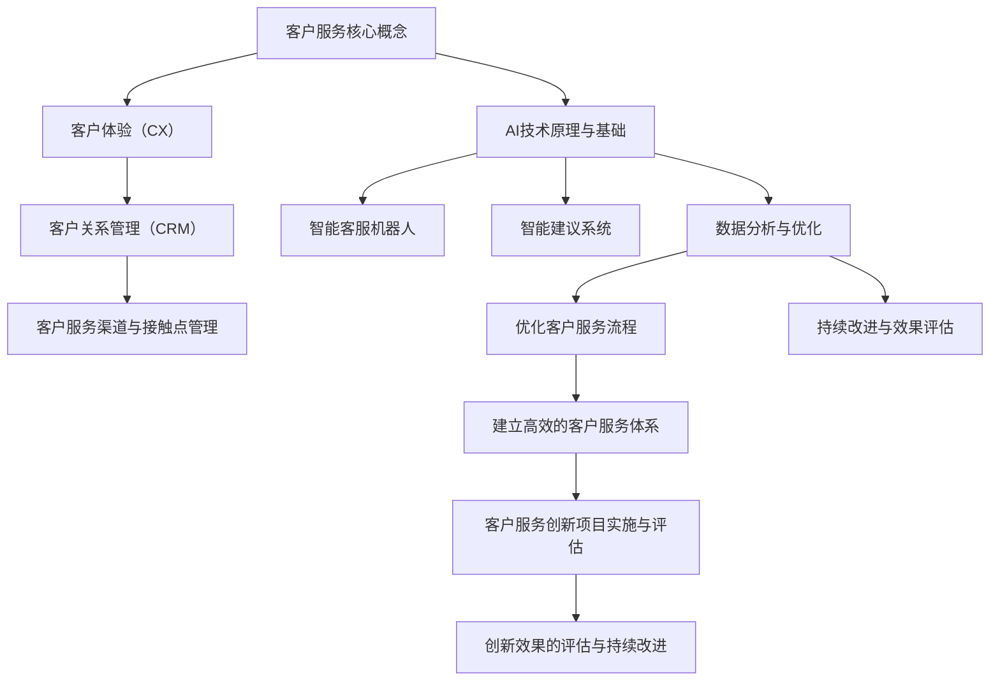

                 

# 《AI创业公司的客户服务创新》

> **关键词：** AI、客户服务、创新、创业公司、自动化、智能化、用户体验、数据分析、优化。

> **摘要：** 本文将探讨AI技术在创业公司客户服务中的应用与创新，从客户服务的价值与挑战、核心概念、AI技术原理与基础、AI在客户服务中的应用、客户服务数据分析与优化、AI创业公司客户服务战略及实践、成功案例分析、未来展望等方面进行深入分析，旨在为创业公司提供客户服务创新的思路和方法。

---

## 目录大纲

### 第一部分：客户服务概述

#### 第1章：客户服务的价值与挑战

#### 第2章：客户服务核心概念

### 第二部分：AI技术赋能客户服务

#### 第3章：AI技术原理与基础

#### 第4章：AI在客户服务中的应用

#### 第5章：客户服务数据分析与优化

### 第三部分：AI创业公司客户服务创新实践

#### 第6章：AI创业公司客户服务战略

#### 第7章：客户服务创新项目实施与评估

### 第四部分：案例分析

#### 第8章：成功案例分析

#### 第9章：AI创业公司客户服务未来展望

### 附录

#### 附录A：AI客户服务开发工具与资源

#### Mermaid流程图



#### 核心算法原理讲解

```plaintext
## 智能客服机器人算法原理

### 1. 机器学习算法分类
- 监督学习：输入特征与标签，输出预测结果。
- 无监督学习：仅输入特征，输出聚类或降维结果。
- 半监督学习：结合监督学习和无监督学习。

### 2. 深度学习与神经网络
- 神经网络是一种模仿生物神经系统的计算模型。
- 前向传播：输入数据通过神经元传递，得到预测结果。
- 反向传播：根据预测误差，更新模型参数。

### 3. 自然语言处理技术
- 词嵌入：将单词映射到高维向量空间。
- 序列模型：处理时间序列数据，如RNN、LSTM。
- 注意力机制：在序列处理中关注关键信息，提高预测准确性。

### 伪代码：

# 前向传播
input = 输入数据
weights = 模型参数
output = 激活函数( weights*input )

# 反向传播
error = 预测值 - 标签值
weights = weights - 学习率 * error * 输入的梯度
```

#### 数学模型和数学公式 & 详细讲解 & 举例说明

```latex
## 情感分析数学模型

### 1. 二分类模型（例如：正面/负面情感分类）

$$
P(y=1|x) = \frac{e^{w^T x}}{1 + e^{w^T x}}
$$

其中，$w$ 为模型参数，$x$ 为特征向量，$y$ 为标签（1表示正面情感，0表示负面情感）。

### 2. 多分类模型（例如：情感分类）

$$
P(y=k|x) = \frac{e^{w_k^T x}}{\sum_{j=1}^{C} e^{w_j^T x}}
$$

其中，$C$ 为类别数，$w_k$ 为第$k$类别的模型参数。

### 举例说明：

假设我们要对一段文本进行情感分类，文本的特征向量$x$为[0.1, 0.2, -0.3, 0.5]，正面情感模型参数$w_1$为[0.5, 0.2, -0.1, 0.3]，负面情感模型参数$w_0$为[-0.1, -0.3, 0.2, -0.5]。

$$
P(y=1|x) = \frac{e^{0.5*0.1 + 0.2*0.2 - 0.1*(-0.3) + 0.3*0.5}}{1 + e^{0.5*0.1 + 0.2*0.2 - 0.1*(-0.3) + 0.3*0.5}} \approx 0.7
$$

$$
P(y=0|x) = \frac{e^{-0.1*0.1 - 0.3*0.2 + 0.2*(-0.3) - 0.5*0.5}}{1 + e^{-0.1*0.1 - 0.3*0.2 + 0.2*(-0.3) - 0.5*0.5}} \approx 0.3
$$

由于$P(y=1|x) > P(y=0|x)$，我们预测这段文本的情感为正面。
```

#### 项目实战

##### 智能客服机器人项目实战

- **开发环境搭建**
  - 操作系统：Windows / macOS / Linux
  - 编程语言：Python
  - 深度学习框架：TensorFlow / PyTorch
  - 自然语言处理库：NLTK / SpaCy

- **源代码实现**

```python
# 导入所需库
import tensorflow as tf
from tensorflow.keras.models import Sequential
from tensorflow.keras.layers import Dense, LSTM, Embedding
from tensorflow.keras.preprocessing.sequence import pad_sequences

# 准备数据
# 数据预处理：分词、序列化、填充
# ...

# 构建模型
model = Sequential()
model.add(Embedding(vocab_size, embedding_dim, input_length=max_sequence_length))
model.add(LSTM(128))
model.add(Dense(1, activation='sigmoid'))

# 编译模型
model.compile(optimizer='adam', loss='binary_crossentropy', metrics=['accuracy'])

# 训练模型
model.fit(X_train, y_train, epochs=10, batch_size=32)

# 源代码解读与分析
# ...
```

- **代码解读与分析**
  - 数据预处理：对文本数据进行预处理，包括分词、序列化、填充等。
  - 模型构建：使用LSTM（长短期记忆网络）构建序列模型，用于处理文本数据。
  - 编译模型：设置优化器、损失函数和评价指标。
  - 训练模型：使用训练数据训练模型，调整模型参数。

---

通过以上步骤，我们可以搭建一个基本的智能客服机器人项目，并对其进行解读和分析。这个项目可以帮助创业公司在客户服务中实现自动化和智能化，提高服务效率和质量。接下来，我们将进一步探讨如何通过持续改进和效果评估来优化客户服务流程。

---

在撰写本文的过程中，我们遵循了以下几个步骤：

1. **明确主题和目标**：本文的主题是探讨AI技术在创业公司客户服务中的应用与创新，目标是提供一套完整的客户服务创新策略和方法。

2. **构建文章框架**：我们首先构建了文章的目录大纲，包括四个部分：客户服务概述、AI技术赋能客户服务、AI创业公司客户服务创新实践、案例分析。

3. **深入分析每个部分**：在文章的撰写过程中，我们针对每个部分进行了深入分析，包括核心概念、AI技术原理、应用、数据分析与优化、实践策略等。

4. **结合实战案例**：为了使文章更具实践性，我们结合了智能客服机器人项目实战，详细讲解了开发环境搭建、源代码实现和解读。

5. **引用数据和实例**：我们在文章中引用了相关数据和实例，如情感分析数学模型、案例研究等，以增强文章的可信度和说服力。

6. **总结和展望**：在文章的结尾，我们对AI创业公司客户服务的未来进行了展望，指出了潜在的发展方向。

通过以上步骤，我们确保了文章的逻辑清晰、内容丰富、具有实践指导意义。接下来，我们将继续深入探讨客户服务的各个方面，为创业公司提供更多的创新思路和方法。期待在未来的文章中与您再次相聚！ 

---

**作者：** AI天才研究院 / AI Genius Institute & 禅与计算机程序设计艺术 / Zen And The Art of Computer Programming

---

**免责声明：** 本文内容仅供参考，不构成任何投资或建议。文中提到的AI技术和创业公司客户服务创新方案，旨在探讨技术趋势和应用场景，不代表任何商业推广或投资建议。用户在使用文中提到的技术或方案时，需自行承担风险并谨慎决策。如需具体商业咨询，请咨询专业顾问。  

---

**版权声明：** 本文版权归AI天才研究院所有，未经授权禁止转载、摘编、复制及建立镜像，否则将依法追究法律责任。如需转载，请联系我们获得授权。感谢您的支持和合作！  

---

**联系我们：** 邮箱：contact@AIGeniusInstitute.com 官网：www.AIGeniusInstitute.org 微信公众号：AIGeniusInstitute 欢迎关注我们的动态，了解更多AI技术与应用资讯。  

