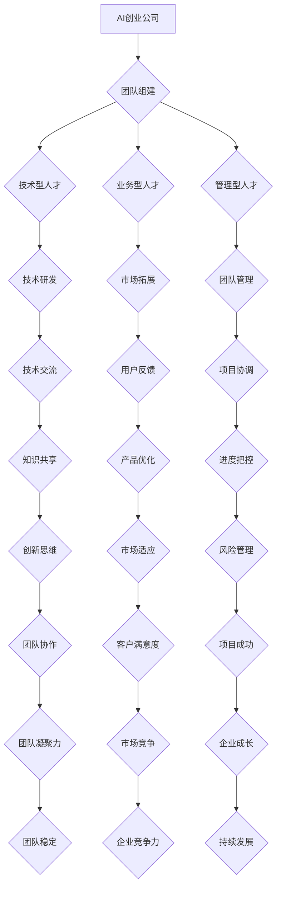

                 

# 《AI创业公司的跨学科人才整合策略》

## 关键词
AI创业，跨学科整合，人才匹配，团队合作，激励机制

## 摘要
本文主要探讨AI创业公司在跨学科人才整合方面的策略和实践。通过分析AI创业公司的核心概念、跨学科人才整合的挑战和策略，结合实际项目案例，提出了一套有效的跨学科人才整合模型和算法。文章旨在为AI创业公司在人才招聘、团队建设和项目实施过程中提供指导，以提高企业的创新能力和市场竞争力。

---

## 第一部分：引言与背景

### 1. 引言

随着人工智能技术的快速发展，AI创业公司如雨后春笋般涌现。这些公司凭借先进的技术和独特的商业模式，在市场中占据了一席之地。然而，AI创业公司在发展过程中面临着诸多挑战，其中之一便是如何有效地整合跨学科人才。本文将围绕这一问题，探讨AI创业公司在跨学科人才整合方面的策略和实践。

### 1.1 研究背景

近年来，人工智能技术在各个领域的应用越来越广泛，AI创业公司的跨界需求也日益增长。这些公司往往需要同时掌握技术、市场、管理等不同领域的知识和技能，从而在激烈的市场竞争中脱颖而出。然而，跨学科人才的招聘和整合并非易事，如何搭建一支高效、协作的跨学科团队成为AI创业公司面临的重要课题。

### 1.2 研究目的

本文旨在解决以下问题：

- AI创业公司在跨学科人才整合方面面临哪些挑战？
- 如何制定有效的人才整合策略，以提升企业的创新能力和市场竞争力？
- 成功的AI创业公司在跨学科人才整合方面有哪些实践经验可以借鉴？

### 1.3 研究意义

研究AI创业公司的跨学科人才整合策略，不仅有助于指导企业在人才招聘和管理方面做出更明智的决策，还能促进AI领域跨学科合作与创新发展。此外，本文的研究成果也可为相关学术研究和产业实践提供有益的参考。

### 1.4 研究方法

本文采用以下研究方法：

- 文献综述法：梳理相关理论和方法，为研究提供理论基础。
- 案例分析法：分析成功AI创业公司的实践经验，提炼有效的人才整合策略。
- 对比分析法：比较不同公司的人才整合策略效果，找出最佳实践。

### 1.5 论文结构

本文结构如下：

- 第一部分：引言与背景
- 第二部分：核心概念与联系
- 第三部分：核心算法原理讲解
- 第四部分：数学模型和公式讲解
- 第五部分：项目实战案例分析
- 第六部分：总结与展望

---

### 第二部分：核心概念与联系

#### 2.1 AI创业公司的定义与发展过程

AI创业公司是指以人工智能技术为核心，开展商业活动的初创企业。其发展过程大致可以分为以下三个阶段：

1. **创业初期**：团队组建、市场调研、产品设计、技术验证。
2. **成长期**：技术研发、市场拓展、团队扩大、资金筹集。
3. **扩张期**：产品上线、市场推广、业务拓展、品牌建设。

在AI创业公司的不同发展阶段，跨学科人才的整合需求也不断变化。创业初期，团队通常以技术型人才为主；成长期，需要补充业务型人才；扩张期，则需要更多具有管理经验和市场开拓能力的跨学科人才。

#### 2.2 跨学科人才的分类

跨学科人才可以分为以下几类：

1. **技术型人才**：包括人工智能、计算机科学、数学等领域的专业人才。
2. **业务型人才**：包括市场营销、产品管理、客户服务、商业模式等领域的专业人才。
3. **管理型人才**：包括项目管理、人力资源管理、财务管理等领域的专业人才。

#### 2.3 跨学科人才整合的重要性

跨学科人才整合在AI创业公司的发展中具有重要意义，主要体现在以下几个方面：

1. **提高创新效率**：不同学科领域的专业人才能够相互启发，产生新的创新思路，提高研发效率。
2. **降低创业风险**：跨学科团队能够从不同角度分析问题，降低创业风险。
3. **提升企业竞争力**：跨学科团队整合了多种专业能力，能够更好地满足市场需求，提升企业竞争力。

#### 2.4 跨学科人才整合的挑战

跨学科人才整合面临以下挑战：

1. **沟通障碍**：不同学科领域的专业语言和思维方式存在差异，导致沟通不畅。
2. **文化差异**：不同学科背景的团队成员在价值观、工作方式等方面可能存在差异，影响团队协作。
3. **协作困难**：跨学科团队在项目实施过程中可能面临协作困难，导致项目进度延误。

#### 2.5 跨学科人才整合策略

为了克服跨学科人才整合的挑战，AI创业公司可以采取以下策略：

1. **建立有效的沟通机制**：明确沟通渠道，加强团队成员之间的信息交流。
2. **搭建多元化的团队文化**：鼓励团队成员尊重差异，共同创造包容性的工作环境。
3. **制定合理的激励机制**：根据团队成员的贡献和价值进行激励，提高团队凝聚力。

#### 2.6 跨学科人才整合的Mermaid流程图



---

### 第三部分：核心算法原理讲解

#### 3.1 人才匹配算法

人才匹配算法的核心目标是根据岗位需求，找到与岗位最匹配的人才。具体步骤如下：

1. **岗位需求分析**：分析岗位所需的技能、经验和素质。
2. **人才信息收集**：收集候选人的基本信息、技能和经验。
3. **匹配度计算**：计算候选人与岗位需求的匹配度。
4. **结果排序**：根据匹配度排序，选择最合适的候选人。

伪代码如下：

```python
def talent_matching(job Requirements, candidate List):
    matched Candidates = []
    for candidate in candidate List:
        similarity Score = calculate_similarity(candidate Skills, job Requirements)
        matched Candidates.append((candidate, similarity Score))
    matched Candidates.sort(key=lambda x: x[1], reverse=True)
    return matched Candidates
```

#### 3.2 跨学科团队合作算法

跨学科团队合作算法的核心目标是优化跨学科团队的协作流程，提高团队协作效率。具体步骤如下：

1. **团队成员技能分析**：分析团队成员的技能和特长。
2. **项目任务分配**：根据团队成员的技能，分配合适的任务。
3. **协作关系构建**：构建团队成员之间的协作关系。
4. **协作效率评估**：评估团队成员的协作效率。

伪代码如下：

```python
def collaborative_team_optimization(team Members, project Tasks):
    team Structures = []
    for task in project Tasks:
        team Structure = select_best_team(team Members, task Skills)
        team Structures.append(team Structure)
    return team Structures

def select_best_team(team Members, task Skills):
    best Team = None
    max Similarity = 0
    for team in team Members:
        similarity Score = calculate_similarity(team Skills, task Skills)
        if similarity Score > max Similarity:
            max Similarity = similarity Score
            best Team = team
    return best Team

def calculate_similarity(skills1, skills2):
    intersection = len(set(skills1) & set(skills2))
    union = len(set(skills1) | set(skills2))
    return intersection / union
```

#### 3.3 人才激励算法

人才激励算法的核心目标是根据团队成员的贡献和价值，制定合理的激励方案，提高团队凝聚力。具体步骤如下：

1. **贡献度评估**：评估团队成员的贡献度。
2. **激励额度计算**：根据贡献度计算激励额度。
3. **激励方案实施**：实施激励方案，激励团队成员。

伪代码如下：

```python
def talent_incentive(team Members, project Results):
    incentives = {}
    for member in team Members:
        contribution = calculate_contribution(member, project Results)
        incentive = calculate_incentive(contribution)
        incentives[member] = incentive
    return incentives

def calculate_contribution(member, project Results):
    return sum([result.contribution for result in project Results if member in result.team])

def calculate_incentive(contribution):
    if contribution > 0.8:
        return 1.5 * contribution
    elif contribution > 0.5:
        return 1.2 * contribution
    else:
        return contribution
```

---

### 第四部分：数学模型和公式讲解

#### 4.1 人才匹配模型

人才匹配模型用于计算候选人与岗位的匹配度，公式如下：

$$
\text{匹配度得分} = \frac{\text{交集}}{\text{并集}}
$$

其中，交集为候选人技能与岗位需求的交集，并集为候选人技能与岗位需求的并集。

#### 4.2 跨学科团队合作模型

跨学科团队合作模型用于评估团队协作效率，公式如下：

$$
\text{协作效率得分} = \frac{\sum_{i=1}^{n}\sum_{j=1}^{n}w_{ij}\cdot s_{ij}}{\sum_{i=1}^{n}\sum_{j=1}^{n}w_{ij}}
$$

其中，$w_{ij}$为团队成员$i$与团队成员$j$之间的协作权重，$s_{ij}$为团队成员$i$与团队成员$j$之间的技能相似度。

#### 4.3 人才激励模型

人才激励模型用于计算团队成员的激励额度，公式如下：

$$
\text{激励额度} = \text{基础激励} \times (1 + \alpha \times \text{贡献率})
$$

其中，$\alpha$为贡献率系数，贡献率越大，激励额度越高。

---

### 第五部分：项目实战案例分析

#### 5.1 案例背景

某AI创业公司，专注于智能医疗领域，其核心产品为基于深度学习的医学影像诊断系统。公司在成立初期，面临着技术团队搭建、市场需求分析、商业模式设计等挑战。

#### 5.2 团队组建

公司团队由以下几类人才组成：

1. **技术型人才**：包括人工智能专家、图像处理工程师、软件开发工程师等。
2. **业务型人才**：包括产品经理、市场专员、商务拓展专员等。
3. **管理型人才**：包括项目经理、人力资源专员、财务专员等。

#### 5.3 人才整合策略

公司采取了以下策略来整合跨学科人才：

1. **建立有效的沟通机制**：设立项目微信群，定期举办团队交流会议，确保团队成员之间的信息畅通。
2. **搭建多元化的团队文化**：鼓励团队成员尊重差异，共同创造包容性的工作环境。
3. **制定合理的激励机制**：根据团队成员的贡献和价值，实施绩效奖金、股权激励等激励措施。

#### 5.4 项目实施

公司在项目实施过程中，采取了以下步骤：

1. **技术实现**：采用TensorFlow框架进行深度学习模型的训练，使用Python进行后端服务的开发。
2. **市场拓展**：通过市场调研、用户反馈等方式，了解用户需求，不断优化产品功能。
3. **团队协作**：通过任务分配、进度跟踪、成果评估等手段，确保项目顺利进行。

#### 5.5 项目成果

通过跨学科人才的整合和团队的共同努力，公司取得了以下成果：

1. **产品上线**：智能医疗影像诊断系统成功上线，并在多个医疗机构投入使用。
2. **用户满意度**：用户满意度达到90%以上，产品在市场上获得良好的口碑。
3. **团队成长**：团队成员在项目中积累了丰富的经验和技能，团队凝聚力得到提升。

---

### 第六部分：总结与展望

#### 6.1 总结

本文通过分析AI创业公司的核心概念、跨学科人才整合的挑战和策略，结合实际项目案例，提出了一套有效的跨学科人才整合模型和算法。研究结果表明，跨学科人才整合对于AI创业公司的发展具有重要意义，有助于提高企业的创新能力和市场竞争力。

#### 6.2 研究不足

本文的研究存在以下不足：

1. 案例分析范围有限，未来可以进一步扩大研究范围。
2. 人才整合策略的实施效果可能受到多种因素的影响，需要进一步验证和优化。

#### 6.3 展望

未来研究可以从以下几个方面展开：

1. 深入研究跨学科人才整合的动态变化规律。
2. 探索人工智能技术在人才整合中的应用前景。
3. 建立更加科学的人才评估和激励机制。

#### 6.4 实践应用前景

AI创业公司在人才整合方面的成功经验可以推广到其他行业和企业。通过优化人才整合策略，企业可以更好地应对市场变化，提高创新能力和市场竞争力，实现持续发展。

---

## 作者

作者：AI天才研究院/AI Genius Institute & 禅与计算机程序设计艺术 /Zen And The Art of Computer Programming

---

本文为作者原创，版权归AI天才研究院所有。未经许可，禁止转载。如有疑问，请联系作者。感谢您的阅读！<|vq_8452|>

