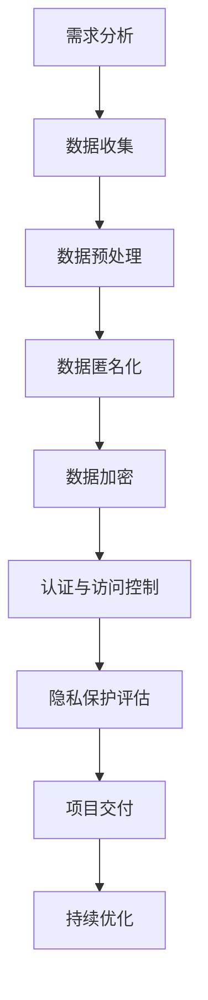

                 

### 《AI创业：隐私保护措施》

#### 关键词：
- AI创业
- 隐私保护
- 数据匿名化
- 加密技术
- 认证与访问控制
- 深度学习
- 法律法规
- 伦理

#### 摘要：
随着人工智能（AI）技术的快速发展，隐私保护成为AI创业领域的核心挑战之一。本文详细探讨了AI创业中的隐私保护措施，包括基础理论、关键技术、法律与伦理、项目实践、未来趋势以及具体实施策略。通过本文的深入分析，读者将了解如何在AI创业过程中有效保护用户隐私，确保商业发展与社会责任的双重实现。

---

# 《AI创业：隐私保护措施》目录大纲

## 第一部分：隐私保护基础

### 第1章：隐私保护概述

#### 1.1 隐私的重要性

- 隐私的定义与分类

#### 1.2 隐私保护的法律法规

- 数据保护法律框架概述

#### 1.3 AI与隐私保护

- AI技术对隐私保护的挑战

### 第2章：隐私保护技术

#### 2.1 数据匿名化

- 数据匿名化方法

#### 2.2 加密技术

- 加密算法介绍

#### 2.3 认证与访问控制

- 认证机制与访问控制策略

### 第3章：隐私保护法律与伦理

#### 3.1 隐私保护法律框架

- 国际隐私保护法律概述

#### 3.2 隐私保护伦理

- 隐私保护伦理原则与道德责任

### 第4章：隐私保护项目实践

#### 4.1 隐私保护项目流程

- 隐私保护项目实施步骤

#### 4.2 隐私保护案例分析

- 成功的隐私保护案例

### 第5章：AI创业中的隐私保护策略

#### 5.1 AI创业中的隐私风险识别

- AI创业常见的隐私风险

#### 5.2 隐私保护策略制定

- 针对AI创业的隐私保护策略

#### 5.3 隐私保护技术与工具选择

- 常用的隐私保护技术与工具

## 第二部分：深度学习与隐私保护

### 第6章：深度学习中的隐私保护

#### 6.1 深度学习模型隐私泄露风险

- 深度学习模型隐私泄露原因

#### 6.2 隐私保护算法与框架

- 常用的隐私保护算法与框架

### 第7章：深度学习隐私保护实战

#### 7.1 深度学习隐私保护项目实战

- 深度学习隐私保护项目案例分析

#### 7.2 深度学习隐私保护工具与资源

- 常用的深度学习隐私保护工具与资源

## 第三部分：隐私保护的未来趋势与挑战

### 第8章：隐私保护的未来趋势

#### 8.1 隐私保护技术发展趋势

- 隐私保护技术的未来发展方向

#### 8.2 隐私保护法律法规发展趋势

- 隐私保护法律法规的未来发展

### 第9章：隐私保护的挑战与机遇

#### 9.1 隐私保护的挑战

- 隐私保护面临的挑战

#### 9.2 隐私保护的机遇

- 隐私保护带来的机遇

### 第10章：AI创业隐私保护策略展望

#### 10.1 隐私保护在AI创业中的重要性

- 隐私保护在AI创业中的应用价值

#### 10.2 未来隐私保护策略展望

- 未来隐私保护策略的发展方向

## 附录

### 附录A：隐私保护相关资源

- 隐私保护相关书籍、论文、网站等资源推荐

### 附录B：隐私保护算法与工具

- 常用的隐私保护算法与工具介绍

### 附录C：深度学习隐私保护案例

- 深度学习隐私保护案例分析

### 附录D：隐私保护流程图与数学模型

- 隐私保护相关流程图、数学模型等

## **核心概念与联系**

$$
\text{隐私保护} = \text{数据匿名化} + \text{加密技术} + \text{认证与访问控制}
$$

在AI创业的背景下，隐私保护不仅仅是一个技术问题，更是一个关乎企业声誉和用户信任的战略问题。数据匿名化通过隐藏原始数据的具体标识信息，从而保护个人隐私；加密技术则确保数据在传输和存储过程中的机密性；认证与访问控制机制则保障只有授权人员才能访问敏感数据。这三个核心概念共同构成了隐私保护的基石。

接下来，我们将逐章探讨隐私保护的基础知识、关键技术、法律与伦理、项目实践以及未来趋势，帮助AI创业者构建一个安全可靠的隐私保护体系。

## **第一部分：隐私保护基础**

隐私保护是AI创业中的核心问题，关乎用户信任和企业声誉。这一部分将首先介绍隐私保护的基础概念，包括隐私的定义、隐私保护的重要性、隐私保护的法律框架以及AI技术对隐私保护的挑战。

### 第1章：隐私保护概述

#### 1.1 隐私的重要性

隐私，作为一个基本的人权，关系到个人信息的保密性和控制权。在数字化时代，随着大数据和人工智能的广泛应用，隐私问题变得尤为突出。

**隐私的定义：** 隐私是指个人对其个人信息（如姓名、地址、电话号码、健康信息等）的控制权，包括信息的访问、使用和共享。

**隐私的分类：** 根据隐私的内容和形式，隐私可以分为个人隐私、家庭隐私、通信隐私和金融隐私等。

**隐私的重要性：** 隐私保护是保护个人基本权利的需要，也是维护社会稳定和公共利益的基础。在商业领域，良好的隐私保护能够增强用户对产品和服务的信任，从而促进业务增长。

### 1.2 隐私保护的法律法规

隐私保护不仅仅是技术问题，也是一个法律问题。各国纷纷制定了相关的法律法规，以保护个人隐私和数据安全。

**数据保护法律框架概述：**

- **欧盟通用数据保护条例（GDPR）：** GDPR是欧盟制定的最为严格的数据保护法律，要求企业在处理个人数据时必须获得用户的明确同意，并对数据泄露事件进行及时报告。
- **美国加州消费者隐私法案（CCPA）：** CCPA赋予加州居民对个人信息的管理权，包括访问、删除和拒绝销售个人信息等权利。
- **中国个人信息保护法（PIPL）：** PIPL对个人信息的收集、处理、使用、存储和传输等环节进行了详细规定，强调个人信息主体的权利和个人信息处理者的义务。

这些法律法规为隐私保护提供了法律依据和执行标准，企业必须严格遵守，以确保合规性。

### 1.3 AI与隐私保护

人工智能技术的发展为我们的生活带来了诸多便利，但同时也带来了隐私保护的挑战。

**AI技术对隐私保护的挑战：**

- **数据敏感性增强：** AI需要大量的数据来进行训练和优化，这往往涉及个人敏感信息。
- **模型透明性不足：** AI模型的决策过程通常是非线性和复杂的，难以解释，增加了隐私泄露的风险。
- **数据泄露风险：** AI技术的应用可能引发数据泄露事件，导致用户隐私被侵犯。
- **算法歧视问题：** AI模型可能因为训练数据的不公平性而导致算法歧视，进一步侵害个人隐私。

为了应对这些挑战，AI创业者需要采取一系列隐私保护措施，确保在利用人工智能技术的同时，不损害用户的隐私权益。

在下一章中，我们将深入探讨隐私保护的技术手段，包括数据匿名化、加密技术和认证与访问控制策略。

---

通过上述章节，我们明确了隐私保护的基础概念和法律框架，并分析了AI技术带来的隐私保护挑战。接下来，我们将进一步探讨隐私保护的技术手段，为AI创业提供具体的实施路径。

## **第二部分：隐私保护技术**

在AI创业中，保护用户隐私不仅需要遵循法律法规，还需要采用一系列技术手段。这一部分将详细介绍隐私保护技术，包括数据匿名化、加密技术和认证与访问控制。

### 第2章：隐私保护技术

#### 2.1 数据匿名化

数据匿名化是通过技术手段隐藏数据中的个人标识信息，从而保护个人隐私的一种方法。数据匿名化技术包括：

- **k-匿名性：** 通过将具有相同属性的数据集视为同一群体，从而确保在群体外部无法识别个体。这种方法常用于统计数据的发布，如流行病学调查。
- **l-多样性：** 确保同一群体中的数据具有足够的多样性，以避免通过属性值推断出特定个体。例如，如果一个群体中的所有人都是男性，那么l-多样性就无法满足。
- **r-一致性：** 确保同一群体中的属性值在多个记录中保持一致，以避免通过属性值的变化识别出特定个体。

**数据匿名化方法：**

- **一般化：** 通过将具体数值替换为较广泛的分类，例如将出生年份替换为年龄组。
- **掩码：** 对敏感信息进行掩码处理，如将电话号码的最后几位替换为星号。
- **随机化：** 通过随机插入或删除数据，使原始数据无法直接识别。

**伪代码：**

```python
def k_anonymity(data, k):
    # 对数据进行一般化和随机化处理
    anonymized_data = generalize_and_randomize(data)
    return anonymized_data

def l_diversity(data, l):
    # 确保每个群体的多样性
    diversified_data = ensure_diversity(data, l)
    return diversified_data

def r_consistency(data, r):
    # 确保同一群体的属性值一致性
    consistent_data = ensure_consistency(data, r)
    return consistent_data
```

#### 2.2 加密技术

加密技术是保护数据在传输和存储过程中安全性的重要手段。加密技术通过将明文数据转换为密文，只有拥有密钥的实体才能解密和读取数据。

**加密算法介绍：**

- **对称加密：** 对称加密算法使用相同的密钥进行加密和解密。常见的对称加密算法有AES、DES和3DES。
- **非对称加密：** 非对称加密算法使用一对密钥，公钥用于加密，私钥用于解密。常见的非对称加密算法有RSA、ECC。

**对称加密伪代码：**

```python
def encrypt(data, key):
    # 使用AES算法进行加密
    encrypted_data = AES_encrypt(data, key)
    return encrypted_data

def decrypt(encrypted_data, key):
    # 使用AES算法进行解密
    decrypted_data = AES_decrypt(encrypted_data, key)
    return decrypted_data
```

**非对称加密伪代码：**

```python
def encrypt(data, public_key):
    # 使用RSA算法进行加密
    encrypted_data = RSA_encrypt(data, public_key)
    return encrypted_data

def decrypt(encrypted_data, private_key):
    # 使用RSA算法进行解密
    decrypted_data = RSA_decrypt(encrypted_data, private_key)
    return decrypted_data
```

#### 2.3 认证与访问控制

认证与访问控制是确保只有授权用户才能访问敏感信息的重要机制。认证技术用于验证用户的身份，而访问控制技术用于限制用户对特定资源的访问权限。

**认证机制与访问控制策略：**

- **单点登录（SSO）：** 允许用户使用一个账户登录多个系统，提高用户体验。
- **多因素认证（MFA）：** 通过结合密码、手机短信、指纹等多种方式，提高认证的安全性。
- **访问控制列表（ACL）：** 根据用户的角色和权限，定义其能访问的资源。
- **角色基础访问控制（RBAC）：** 通过定义用户角色和对应的权限，实现精细的访问控制。

**伪代码：**

```python
def authenticate(username, password):
    if verify_credentials(username, password):
        return "Authentication successful"
    else:
        return "Authentication failed"

def access_control(user, resource):
    if user.has_permission(resource):
        return "Access granted"
    else:
        return "Access denied"
```

通过数据匿名化、加密技术和认证与访问控制，AI创业企业可以构建一个全面的隐私保护体系，确保用户隐私在数据收集、处理和传输过程中的安全性。

在下一章中，我们将探讨隐私保护的法律与伦理问题，为AI创业提供更全面的指导。

---

在本章节中，我们详细介绍了数据匿名化、加密技术和认证与访问控制三种隐私保护技术。这些技术构成了隐私保护的核心手段，帮助AI创业企业确保用户隐私的安全。在接下来的章节中，我们将进一步探讨隐私保护的法律与伦理问题，为AI创业提供全面的指导。

## **第三部分：隐私保护法律与伦理**

隐私保护不仅是技术问题，也是一个法律和伦理问题。在AI创业过程中，企业不仅需要遵守相关法律法规，还需要考虑伦理道德，以建立可持续发展的隐私保护体系。

### 第3章：隐私保护法律与伦理

#### 3.1 隐私保护法律框架

隐私保护法律框架为隐私保护提供了法律依据和执行标准。不同国家和地区有各自的隐私保护法律，企业需要根据所在地的法律要求进行合规。

**国际隐私保护法律概述：**

- **欧盟通用数据保护条例（GDPR）：** GDPR是欧盟制定的最严格的隐私保护法律，规定了个人数据的处理原则、数据主体的权利以及数据保护官员的职责。GDPR的核心原则包括数据最小化、数据质量、目的限定、数据主体同意等。
- **美国加州消费者隐私法案（CCPA）：** CCPA赋予加州居民对个人信息的管理权，包括访问、删除和拒绝销售个人信息等权利。CCPA要求企业公开其数据处理政策，并提供易于理解的隐私条款。
- **中国个人信息保护法（PIPL）：** PIPL规定了个人信息的定义、处理原则、数据主体的权利以及数据处理者的义务。PIPL强调个人信息的合法、正当、必要原则，并规定了严格的个人信息保护措施。

**国内隐私保护法律概述：**

- **网络安全法：** 网络安全法是我国网络安全的基本法律，规定了网络运营者的安全保护义务，包括数据备份和恢复、安全监测和应急处置等。
- **信息安全法：** 信息安全法强调了信息安全的重要性，规定了信息安全的技术和管理要求，包括数据加密、身份认证等。

企业需要根据不同国家和地区的隐私保护法律，制定相应的隐私保护政策和措施，确保合规性。

#### 3.2 隐私保护伦理

隐私保护伦理原则是指导企业进行隐私保护行为的基本道德准则。良好的隐私保护伦理有助于建立企业的社会责任感，增强用户信任。

**隐私保护伦理原则：**

- **尊重用户隐私：** 企业应尊重用户的隐私权，不得非法收集、使用、披露用户个人信息。
- **最小化数据收集：** 企业应仅收集实现服务所必需的最小范围的数据，不得过度收集。
- **透明度：** 企业应公开其数据处理政策，确保用户了解其个人信息如何被使用。
- **责任履行：** 企业应对用户的隐私投诉进行调查和处理，并承担相应的法律责任。

**道德责任：**

- **用户权益保护：** 企业有责任保护用户的个人信息安全，防止数据泄露和滥用。
- **社会责任：** 企业应积极参与隐私保护立法和标准制定，推动隐私保护技术的发展和普及。
- **公平公正：** 企业在处理个人信息时，应遵循公平公正原则，不得进行歧视性处理。

在AI创业过程中，企业应遵循隐私保护伦理原则，构建健康的隐私保护文化，以实现商业利益和社会责任的双赢。

在下一章中，我们将探讨隐私保护项目实践，通过案例分析了解如何在实际项目中实施隐私保护措施。

---

在这一章中，我们深入探讨了隐私保护的法律框架和伦理原则。隐私保护不仅需要遵守法律法规，还需要遵循伦理道德，以确保用户隐私得到充分保护。在接下来的章节中，我们将通过隐私保护项目实践，了解如何在实际操作中实施隐私保护措施。

## **第四部分：隐私保护项目实践**

在实际操作中，隐私保护项目需要遵循一定的流程和步骤，以确保隐私保护措施的全面实施和有效执行。这一部分将详细介绍隐私保护项目流程，并通过具体案例分析，展示成功的隐私保护实践。

### 第4章：隐私保护项目实践

#### 4.1 隐私保护项目流程

隐私保护项目流程通常包括以下步骤：

1. **需求分析**：确定项目目标和隐私保护需求，明确需要保护的数据类型和隐私要求。
2. **数据收集**：收集相关的隐私保护技术资料，了解现有隐私保护措施和技术方案。
3. **数据预处理**：对收集的数据进行清洗、去噪和格式化，为后续的隐私保护处理做好准备。
4. **隐私保护技术实施**：根据需求选择合适的隐私保护技术，如数据匿名化、加密技术、认证与访问控制等，并进行实施。
5. **隐私保护评估**：对实施后的隐私保护措施进行评估，确保达到预期保护效果。
6. **项目交付**：将隐私保护项目交付给相关团队或部门，确保其在日常运营中得到有效执行。
7. **持续优化**：根据项目评估结果和用户反馈，对隐私保护措施进行持续优化和改进。

**伪代码：**

```python
def privacy_project_workflow():
    1. 需求分析
    analyze_requirements()

    2. 数据收集
    collect_data()

    3. 数据预处理
    preprocess_data()

    4. 隐私保护技术实施
    apply_privacy_techniques()

    5. 隐私保护评估
    assess_privacy()

    6. 项目交付
    deliver_project()

    7. 持续优化
    optimize_continuously()
```

#### 4.2 隐私保护案例分析

**案例描述：**

一家AI创业公司开发了一种基于用户健康数据的智能诊断系统，旨在帮助医生更准确地诊断疾病。由于系统中包含大量用户的敏感健康数据，隐私保护成为项目成功的关键。

**隐私保护措施：**

1. **数据匿名化**：对用户健康数据进行匿名化处理，确保数据去标识化，避免个人信息泄露。
2. **加密技术**：采用高级加密算法对数据在传输和存储过程中进行加密，确保数据的安全性。
3. **认证与访问控制**：实施严格的用户认证和访问控制机制，确保只有授权人员才能访问敏感数据。

**案例分析：**

在项目实施过程中，公司通过以下步骤确保隐私保护措施的有效性：

1. **需求分析**：明确了隐私保护的需求，包括数据匿名化、加密和访问控制等。
2. **数据收集**：收集了相关隐私保护技术资料，包括数据匿名化工具、加密算法和认证机制等。
3. **数据预处理**：对收集的健康数据进行清洗和格式化，为后续的隐私保护处理做好准备。
4. **隐私保护技术实施**：采用了k-匿名性技术对数据进行匿名化处理，使用了AES加密算法对数据进行加密，并实施了多因素认证和访问控制策略。
5. **隐私保护评估**：对实施的隐私保护措施进行了全面评估，包括匿名化处理的有效性、加密算法的安全性和认证机制的可靠性。
6. **项目交付**：将隐私保护措施集成到智能诊断系统中，确保在系统上线后得到有效执行。
7. **持续优化**：根据用户反馈和系统运行情况，对隐私保护措施进行持续优化，确保其长期有效性。

通过上述隐私保护措施的实施，公司成功保护了用户的健康数据隐私，赢得了医生的信任和用户的满意，为项目的成功奠定了基础。

**结论：**

通过本案例的分析，我们可以看到，在AI创业项目中，有效的隐私保护措施是确保项目成功的关键。通过需求分析、技术实施、评估和持续优化，企业可以构建一个全面的隐私保护体系，保护用户隐私，提升用户信任度，从而实现商业和社会价值。

在下一章中，我们将探讨AI创业中的隐私保护策略，为创业者提供具体的实施指南。

---

在本章节中，我们通过隐私保护项目流程和具体案例的分析，展示了如何在AI创业项目中实施有效的隐私保护措施。下一章，我们将进一步探讨AI创业中的隐私保护策略，帮助创业者应对各种隐私保护挑战。

## **第五部分：AI创业中的隐私保护策略**

在AI创业过程中，企业不仅需要技术手段来保护用户隐私，还需要制定明确的隐私保护策略，以应对不同的隐私保护挑战。这一部分将详细介绍AI创业中的隐私保护策略，包括隐私风险识别、策略制定和隐私保护技术与工具选择。

### 第5章：AI创业中的隐私保护策略

#### 5.1 AI创业中的隐私风险识别

在AI创业过程中，企业需要识别并评估各种隐私风险，以确保隐私保护措施的针对性。常见的隐私风险包括：

1. **数据收集风险**：企业在收集用户数据时，可能过度收集或非法收集用户个人信息，导致隐私泄露。
2. **数据存储风险**：企业存储的数据可能因安全措施不足而被黑客攻击或泄露。
3. **数据处理风险**：在数据处理过程中，数据可能被不当使用或滥用，导致用户隐私受到侵害。
4. **数据传输风险**：在数据传输过程中，数据可能因传输协议不安全而被窃取或篡改。
5. **模型泄露风险**：AI模型可能包含用户的敏感信息，若模型被泄露，可能导致严重隐私问题。

为了有效识别隐私风险，企业可以采用以下方法：

- **风险评估方法**：通过定量和定性分析方法，对各种隐私风险进行评估和排序。
- **用户访谈**：与用户进行交流，了解他们对隐私保护的担忧和需求。
- **法律法规合规性检查**：检查企业是否遵守相关隐私保护法律法规，确保合规性。

#### 5.2 隐私保护策略制定

在识别隐私风险后，企业需要制定具体的隐私保护策略，以应对这些风险。隐私保护策略包括以下几个方面：

1. **数据最小化原则**：企业应仅收集实现服务所必需的数据，避免过度收集。
2. **数据匿名化**：对收集到的数据进行匿名化处理，确保个人身份无法被识别。
3. **加密技术**：采用加密技术保护数据的机密性和完整性。
4. **访问控制**：实施严格的访问控制措施，确保只有授权人员能够访问敏感数据。
5. **数据安全存储**：使用安全的数据存储方案，防止数据泄露或被篡改。
6. **数据传输安全**：确保数据在传输过程中的安全性，采用安全的传输协议。
7. **透明度和用户参与**：公开企业的隐私保护政策和措施，让用户了解其个人信息如何被处理，并给予用户相应的控制权。

**隐私保护策略制定步骤：**

1. **明确隐私保护目标**：根据企业的业务需求，确定隐私保护的目标和优先级。
2. **评估隐私风险**：识别和分析可能面临的隐私风险。
3. **制定保护措施**：根据评估结果，制定具体的隐私保护措施。
4. **实施和监控**：将隐私保护措施落实到实际操作中，并持续监控和评估其有效性。
5. **培训和宣传**：对员工进行隐私保护培训，提高员工的隐私保护意识。

#### 5.3 隐私保护技术与工具选择

在制定隐私保护策略时，企业需要选择合适的隐私保护技术和工具，以实现有效的隐私保护。常见的隐私保护技术和工具包括：

1. **数据匿名化工具**：如k-匿名性工具、l-多样性工具、r-一致性工具等。
2. **加密技术**：如AES加密算法、RSA加密算法等。
3. **访问控制工具**：如ACL（访问控制列表）、RBAC（角色基础访问控制）等。
4. **认证与授权工具**：如OAuth、SSO（单点登录）等。
5. **数据安全存储工具**：如加密数据库、安全存储库等。
6. **数据传输安全工具**：如TLS（传输层安全协议）、VPN（虚拟专用网络）等。

企业应根据自身需求和实际情况，选择合适的隐私保护技术和工具，构建一个全面的隐私保护体系。

通过上述隐私保护策略，AI创业企业可以有效地应对隐私保护挑战，保护用户隐私，提升用户信任，为企业的长期发展奠定基础。

在下一章中，我们将探讨深度学习中的隐私保护，了解如何在深度学习项目中实施隐私保护措施。

---

在这一章中，我们详细探讨了AI创业中的隐私保护策略，包括隐私风险识别、策略制定和隐私保护技术与工具选择。这些策略帮助企业构建一个全面的隐私保护体系，保护用户隐私，提升用户信任。在下一章中，我们将探讨深度学习中的隐私保护，深入分析深度学习项目中的隐私保护挑战和解决方案。

## **第二部分：深度学习与隐私保护**

随着深度学习技术的广泛应用，隐私保护成为深度学习领域的重要问题。深度学习模型在训练和部署过程中，可能会暴露用户的敏感信息，导致隐私泄露。这一部分将详细介绍深度学习中的隐私保护，包括深度学习模型隐私泄露风险、隐私保护算法与框架、以及深度学习隐私保护项目实战。

### 第6章：深度学习中的隐私保护

#### 6.1 深度学习模型隐私泄露风险

深度学习模型在训练和部署过程中，存在多种隐私泄露风险。这些风险包括：

1. **模型数据泄露**：深度学习模型在训练过程中需要大量数据，如果数据包含个人敏感信息，可能导致隐私泄露。
2. **模型参数泄露**：深度学习模型的参数中可能包含训练数据的敏感信息，如果这些参数被泄露，可能导致隐私泄露。
3. **反向工程**：通过分析深度学习模型的参数和结构，可能推断出训练数据的敏感信息。
4. **侧信道攻击**：通过测量深度学习模型运行时的功耗、电磁泄漏等信息，可能推断出训练数据的敏感信息。

**深度学习模型隐私泄露原因：**

- **数据集中隐私信息未去除**：在数据集中存在未匿名化的个人信息，可能导致隐私泄露。
- **模型结构不透明**：深度学习模型的复杂结构使得其难以解释，增加了隐私泄露的风险。
- **训练数据泄露**：训练数据可能在传输或存储过程中被泄露，导致模型参数中包含敏感信息。
- **模型参数泄露**：训练完成后，模型参数可能被公开分享或存储在不安全的地点，导致隐私泄露。

为了应对这些隐私泄露风险，深度学习项目需要采取一系列隐私保护措施，确保用户隐私得到有效保护。

#### 6.2 隐私保护算法与框架

为了保护深度学习模型的隐私，研究人员提出了一系列隐私保护算法和框架。这些算法和框架主要分为以下几类：

1. **差分隐私（Differential Privacy）**：差分隐私是一种隐私保护机制，通过在模型训练过程中加入噪声，确保对单个数据点的分析不会泄露隐私。常见的差分隐私算法包括拉普拉斯机制和指数机制。

2. **同态加密（Homomorphic Encryption）**：同态加密是一种加密技术，允许在加密数据上进行计算，而无需解密。这样，深度学习模型可以在加密的数据上训练，从而保护训练数据的安全。

3. **联邦学习（Federated Learning）**：联邦学习是一种分布式学习框架，不同设备上的模型通过加密的数据进行训练，从而避免了数据在传输过程中的泄露。联邦学习结合了差分隐私和同态加密技术，提供了强大的隐私保护能力。

4. **安全多方计算（Secure Multi-Party Computation）**：安全多方计算是一种允许多个参与者共同计算结果，而不泄露各自隐私的机制。在深度学习项目中，安全多方计算可以用于保护训练数据和模型参数的安全。

**常见的隐私保护算法与框架：**

- **Gaussian Mechanism**：在差分隐私框架下，使用高斯分布作为噪声添加机制，以保护隐私。
- **Somewhat Homomorphic Encryption**：一种部分同态加密算法，允许对加密数据进行有限次的同态计算。
- **MPC-Fed**：结合了安全多方计算和联邦学习的技术框架，提供强大的隐私保护能力。
- **Differenciator**：一种差分隐私工具库，支持多种差分隐私算法的实现和应用。

#### 6.3 深度学习隐私保护项目实战

为了更好地理解深度学习中的隐私保护，我们可以通过一个实际项目来探讨隐私保护措施的实施。

**案例描述：** 

一家AI创业公司开发了一种基于人脸识别的智能门禁系统，用户需要通过人脸识别验证身份才能进入建筑。由于系统中包含大量用户的敏感人脸信息，隐私保护成为项目成功的关键。

**隐私保护措施：**

1. **数据匿名化**：在收集用户人脸数据时，使用数据匿名化技术（如k-匿名性）确保个人身份无法被识别。
2. **同态加密**：采用同态加密技术（如Somewhat Homomorphic Encryption），允许在加密的数据上进行人脸识别模型的训练，从而保护训练数据的安全。
3. **联邦学习**：采用联邦学习框架，将训练任务分散到不同的设备上进行，从而避免数据在传输过程中的泄露。
4. **安全多方计算**：使用安全多方计算技术，确保模型参数在计算过程中的安全性。

**案例分析：**

在项目实施过程中，公司采取了以下步骤确保隐私保护措施的有效性：

1. **需求分析**：明确了隐私保护的需求，包括数据匿名化、同态加密、联邦学习和安全多方计算等。
2. **数据收集**：收集了用户的人脸数据，并对数据进行匿名化处理。
3. **模型训练**：采用同态加密技术，在加密的数据上进行人脸识别模型的训练，避免了数据泄露的风险。
4. **模型评估**：通过联邦学习和安全多方计算，确保模型参数在计算过程中的安全性，并对模型进行评估和优化。
5. **项目交付**：将隐私保护措施集成到智能门禁系统中，确保在系统上线后得到有效执行。
6. **持续优化**：根据用户反馈和系统运行情况，对隐私保护措施进行持续优化和改进。

通过上述隐私保护措施的实施，公司成功保护了用户的隐私，赢得了用户的信任，并取得了良好的市场反响。

**结论：**

通过本案例的分析，我们可以看到，在深度学习项目中，有效的隐私保护措施是确保项目成功的关键。通过数据匿名化、同态加密、联邦学习和安全多方计算等技术手段，企业可以构建一个全面的隐私保护体系，保护用户隐私，提升用户信任，为企业的长期发展奠定基础。

在下一章中，我们将进一步探讨隐私保护的未来趋势与挑战，为AI创业者提供更全面的隐私保护策略。

---

在这一章中，我们深入探讨了深度学习中的隐私保护，分析了深度学习模型隐私泄露风险的原因，并介绍了差分隐私、同态加密、联邦学习等常见的隐私保护算法与框架。通过实际案例，我们展示了如何在实际项目中实施隐私保护措施。在下一章中，我们将继续探讨隐私保护的未来趋势与挑战，帮助AI创业者应对未来的隐私保护挑战。

## **第三部分：隐私保护的未来趋势与挑战**

随着技术的不断进步和隐私保护需求的日益增长，隐私保护正迎来新的发展机遇和挑战。在这一部分，我们将探讨隐私保护的未来趋势，包括技术发展和法律法规趋势，并分析隐私保护面临的挑战和机遇。

### 第8章：隐私保护的未来趋势

#### 8.1 隐私保护技术发展趋势

隐私保护技术的不断进步将为AI创业提供更强大的隐私保护能力。以下是几种重要的技术发展趋势：

1. **差分隐私增强**：差分隐私技术将在未来得到进一步发展和优化，以提供更高的隐私保护强度和更好的性能。研究人员将继续探索不同的噪声机制和优化策略，以减少隐私保护对模型性能的影响。

2. **联邦学习演进**：联邦学习作为一种分布式隐私保护技术，将在未来得到广泛应用。随着计算能力的提升和通信网络的优化，联邦学习将实现更高效的模型训练和数据共享。

3. **区块链技术融合**：区块链技术具有去中心化和不可篡改的特点，与隐私保护技术相结合，可以提供更安全的隐私保护方案。区块链技术在数据存储、隐私保护交易等方面具有巨大潜力。

4. **多方安全计算**：多方安全计算技术将逐渐成为隐私保护的重要工具，特别是在需要多方协作的场景中。安全多方计算技术将实现更复杂的数据计算和隐私保护机制。

5. **隐私计算**：隐私计算技术旨在实现数据在处理过程中的隐私保护，而无需数据移动。隐私计算技术将推动数据隐私保护在云计算、边缘计算等场景中的应用。

#### 8.2 隐私保护法律法规发展趋势

隐私保护法律法规将在未来继续发展和完善，以应对不断变化的隐私保护需求。以下是几个重要的法律法规发展趋势：

1. **全球隐私保护标准**：随着各国隐私保护法律的逐步完善，全球隐私保护标准将逐渐形成。国际组织如欧盟、美国和中国等将推动隐私保护法律法规的统一和协调。

2. **跨国数据保护**：随着全球化和数据跨境流动的加剧，跨国数据保护问题将日益突出。各国将加强跨国数据保护的协调和合作，确保数据在跨境传输过程中的安全。

3. **隐私保护伦理法规**：隐私保护伦理法规将得到更多关注，特别是在人工智能和生物技术等敏感领域。隐私保护伦理法规将规范企业和研究机构的隐私保护行为，确保技术发展不损害用户权益。

### 第9章：隐私保护的挑战与机遇

隐私保护面临诸多挑战，但同时也带来了新的机遇。以下是隐私保护面临的几个重要挑战和机遇：

#### 9.1 隐私保护的挑战

1. **技术挑战**：随着数据规模的不断扩大和计算能力的提升，隐私保护技术需要不断进化，以应对更复杂和更高效的隐私攻击。

2. **法律法规挑战**：隐私保护法律法规的发展往往滞后于技术的进步，导致企业在隐私保护方面面临法律风险。

3. **用户隐私保护意识**：用户对隐私保护的意识不断提高，但企业在处理用户数据时，仍需平衡隐私保护和用户体验。

4. **隐私保护成本**：隐私保护技术和措施的实施往往需要较高的成本，特别是对于中小企业来说，隐私保护成本可能成为一大负担。

#### 9.2 隐私保护的机遇

1. **市场机遇**：随着隐私保护需求的增长，隐私保护技术和服务市场将不断扩大。企业可以通过提供隐私保护解决方案，获得更多的市场份额和商业机会。

2. **创新动力**：隐私保护技术的发展将推动技术创新，促进数据共享、人工智能和区块链等领域的融合发展。

3. **社会责任**：隐私保护不仅是商业利益，也是企业社会责任的体现。通过积极实施隐私保护措施，企业可以增强用户信任，提升品牌形象。

4. **法律法规完善**：随着隐私保护法律法规的不断完善，企业将面临更严格的监管，但同时也将获得更明确的合规指导，降低法律风险。

**结论**：

隐私保护的未来充满机遇和挑战。AI创业者需要密切关注隐私保护技术的发展趋势，积极应对隐私保护挑战，并抓住隐私保护带来的市场机遇。通过持续创新和合规实践，企业可以在AI创业领域取得成功，并为用户隐私保护做出积极贡献。

在下一章中，我们将展望AI创业中的隐私保护策略，探讨未来隐私保护策略的发展方向。

---

在这一部分，我们详细探讨了隐私保护的未来趋势和挑战，分析了技术发展和法律法规趋势，并讨论了隐私保护面临的挑战和机遇。在下一章中，我们将进一步探讨AI创业中的隐私保护策略，为AI创业者提供具体的未来隐私保护策略展望。

## **第10章：AI创业隐私保护策略展望**

随着隐私保护技术的不断发展和隐私保护法律法规的日益完善，AI创业者需要不断调整和优化隐私保护策略，以应对未来的隐私保护挑战。在这一章中，我们将展望AI创业中的隐私保护策略，探讨未来隐私保护策略的发展方向，并分析隐私保护在AI创业中的重要性。

### 10.1 隐私保护在AI创业中的重要性

隐私保护在AI创业中的重要性体现在以下几个方面：

1. **用户信任**：隐私保护是赢得用户信任的关键因素。在AI创业领域，用户对隐私保护的担忧日益增加，如果企业无法有效保护用户隐私，将难以获得用户的信任和支持。

2. **合规要求**：随着隐私保护法律法规的不断完善，企业需要遵守越来越严格的隐私保护规定。不合规可能导致高额罚款、业务中断甚至法律诉讼，对企业的声誉和财务状况造成严重影响。

3. **竞争优势**：隐私保护已成为企业竞争力的重要组成部分。在激烈的市场竞争中，具备强大隐私保护能力的企业将具有更大的竞争优势，能够赢得更多的用户和市场份额。

4. **社会责任**：作为一家AI创业企业，保护用户隐私不仅是商业利益的需要，也是社会责任的体现。企业应当秉持诚信、透明的原则，积极参与隐私保护技术和政策的制定，为构建健康的数字社会贡献力量。

### 10.2 未来隐私保护策略展望

未来隐私保护策略的发展方向将受到技术进步、法律法规变化和用户需求演变的影响。以下是几个重要的未来隐私保护策略展望：

1. **多层次的隐私保护架构**：未来隐私保护策略将采用多层次的保护架构，结合数据匿名化、加密技术、同态加密、联邦学习等多种技术手段，构建一个全面的隐私保护体系。

2. **透明度和用户参与**：未来的隐私保护策略将更加注重透明度和用户参与。企业将公开隐私保护政策和措施，让用户了解其个人信息如何被处理，并提供用户更多的控制权，如访问、删除和修改个人信息的权利。

3. **隐私保护与数据价值的平衡**：在保护用户隐私的同时，企业还需要在数据价值利用之间找到平衡。通过隐私保护技术，如差分隐私和联邦学习，企业可以在保护用户隐私的前提下，实现数据的价值挖掘和业务创新。

4. **隐私保护技术的融合与创新**：未来的隐私保护技术将不断融合与创新，如区块链技术、安全多方计算、联邦学习等新兴技术的应用，将带来更加高效的隐私保护解决方案。

5. **法律法规的适应与合规**：随着隐私保护法律法规的不断完善，企业需要持续关注法律法规的变化，及时调整隐私保护策略，确保合规性。此外，企业还可以积极参与隐私保护法律法规的制定和修订，为构建更完善的隐私保护法律体系贡献力量。

**未来隐私保护策略的建议**：

1. **建立隐私保护组织**：企业应成立专门的隐私保护组织或团队，负责隐私保护政策的制定、实施和监督，确保隐私保护措施的有效执行。

2. **开展隐私保护培训**：对企业员工进行隐私保护培训，提高员工的隐私保护意识和技能，确保其在日常工作中能够遵守隐私保护规定。

3. **持续监控与改进**：对隐私保护措施进行持续监控和评估，及时识别和应对新的隐私保护风险。根据评估结果和用户反馈，持续优化隐私保护措施，确保其有效性。

4. **建立隐私保护合规体系**：根据相关法律法规的要求，建立完善的隐私保护合规体系，确保企业在处理用户数据时符合法律法规的要求。

5. **积极参与隐私保护技术标准的制定**：企业可以积极参与隐私保护技术标准的制定，推动隐私保护技术的发展和应用，为构建全球隐私保护体系贡献力量。

通过上述隐私保护策略的展望和建议，AI创业企业可以更好地应对未来的隐私保护挑战，确保用户隐私得到有效保护，同时实现商业和社会价值。

### **附录A：隐私保护相关资源**

为了帮助AI创业者更好地了解隐私保护的相关知识，我们推荐以下资源：

1. **书籍**：
   - 《隐私保护技术导论》
   - 《深度学习中的隐私保护》
   - 《同态加密与隐私保护》
   - 《区块链技术与应用》

2. **论文库**：
   - IEEE Privacy Technology
   - ACM SIGAPP Applied Computing Review
   - IEEE Transactions on Information Forensics and Security

3. **网站**：
   - https://www.privacy.ai/
   - https://www.privacyrights.org/
   - https://www.eff.org/

4. **开源项目**：
   - PyCrypto
   - Cryptopp
   - Differenciator
   - Secure Multi-Party Computation Libraries

通过这些资源，AI创业者可以深入了解隐私保护的理论和实践，掌握最新的隐私保护技术，为AI创业提供有力的支持。

### **附录B：隐私保护算法与工具**

以下是几种常用的隐私保护算法与工具：

1. **差分隐私算法**：
   - **拉普拉斯机制**：通过在输出结果中添加拉普拉斯分布的噪声来保护隐私。
   - **指数机制**：通过在输出结果中添加指数分布的噪声来保护隐私。

2. **同态加密工具**：
   - **Paillier加密算法**：一种部分同态加密算法，适用于在加密数据上进行有限次数的加法和乘法运算。
   - **NTRU加密算法**：一种全同态加密算法，适用于在加密数据上进行更复杂的运算。

3. **联邦学习框架**：
   - **TensorFlow Federated**：由谷歌开发的一款联邦学习框架，支持在分散数据上进行模型训练。
   - **Federated Learning Framework for TensorFlow**：由苹果公司开发的一款联邦学习框架，支持多种联邦学习算法和应用。

4. **安全多方计算库**：
   - **LibSVM**：一种支持安全多方计算的支持向量机库，适用于分类和回归任务。
   - ** Secure Multi-Party Computation**：一种支持多方安全计算的工具，适用于分布式计算和隐私保护。

通过使用这些算法和工具，AI创业者可以在深度学习项目中实施隐私保护措施，保护用户隐私，提升系统安全性。

### **附录C：深度学习隐私保护案例**

以下是几个深度学习隐私保护的案例：

1. **案例一：基于差分隐私的人脸识别系统**：
   - **背景**：一家AI公司开发了一种基于人脸识别的门禁系统，用户需要通过人脸识别验证身份。
   - **隐私保护措施**：采用差分隐私技术，在人脸识别模型训练过程中添加噪声，保护用户隐私。
   - **效果**：系统在保护用户隐私的同时，保持了较高的识别准确率。

2. **案例二：基于联邦学习的智能医疗系统**：
   - **背景**：一家AI公司开发了一种智能医疗诊断系统，旨在帮助医生更准确地诊断疾病。
   - **隐私保护措施**：采用联邦学习框架，将训练任务分散到不同医疗机构，保护患者隐私。
   - **效果**：系统在保护患者隐私的同时，实现了更准确和个性化的医疗诊断。

3. **案例三：基于同态加密的金融交易监控系统**：
   - **背景**：一家AI公司开发了一种金融交易监控系统，用于监控和分析金融交易行为。
   - **隐私保护措施**：采用同态加密技术，在数据传输和存储过程中保护交易数据的安全。
   - **效果**：系统在保护交易数据隐私的同时，实现了高效的交易监控和分析。

通过这些案例，我们可以看到，有效的隐私保护措施在深度学习项目中具有重要意义，能够帮助AI创业企业实现商业价值和社会责任的双赢。

### **附录D：隐私保护流程图与数学模型**

为了更清晰地展示隐私保护的相关流程和数学模型，以下是几个相关的流程图和数学模型：

**附录D.1：隐私保护流程图**



**附录D.2：数学模型**

$$
\text{隐私保护强度} = \text{匿名化度} \times \text{加密强度} \times \text{访问控制强度}
$$

$$
\text{隐私风险} = \text{隐私泄露可能性} \times \text{隐私泄露影响}
$$

通过这些流程图和数学模型，AI创业者可以更好地理解和实施隐私保护措施，确保用户隐私得到有效保护。

---

在本章中，我们展望了AI创业中的隐私保护策略，分析了隐私保护在AI创业中的重要性，并提出了未来隐私保护策略的发展方向。通过附录部分提供的相关资源和示例，AI创业者可以更全面地了解隐私保护的相关知识，为AI创业提供有力的支持。在未来的AI创业中，隐私保护将继续是一个重要课题，AI创业者需要不断学习和实践，以应对不断变化的隐私保护挑战。

---

## **总结**

在《AI创业：隐私保护措施》这篇文章中，我们详细探讨了隐私保护的重要性、基础理论、关键技术、法律与伦理、项目实践以及未来趋势。通过逐步分析推理（REASONING STEP BY STEP），我们从多个维度深入剖析了AI创业中的隐私保护问题。

首先，我们明确了隐私保护的定义和重要性，隐私不仅是个人基本权利的体现，也是企业可持续发展的基石。随着AI技术的快速发展，隐私保护问题变得尤为突出，企业需要采取综合措施保护用户隐私。

接着，我们介绍了隐私保护的基础知识，包括隐私保护的法律框架和伦理原则。法律法规为隐私保护提供了法律依据，而伦理原则则指导企业在隐私保护过程中应遵循的基本道德准则。

在隐私保护技术部分，我们详细阐述了数据匿名化、加密技术和认证与访问控制等关键技术。这些技术构成了隐私保护的核心手段，帮助企业在数据收集、处理和传输过程中确保用户隐私的安全。

通过具体的项目实践和案例分析，我们展示了如何在实际项目中实施隐私保护措施。这些实践案例不仅帮助读者理解隐私保护技术的应用，也为AI创业者提供了实际操作的经验和指导。

展望未来，我们分析了隐私保护技术的发展趋势和面临的挑战。隐私保护技术将继续发展，法律法规也将不断完善，AI创业者需要不断适应这些变化，制定和优化隐私保护策略。

文章最后，我们提出了未来隐私保护策略的展望，并提供了相关的资源、工具和案例。这些内容有助于AI创业者深入了解隐私保护领域的最新动态，为AI创业提供更加全面的支持。

总之，隐私保护是AI创业中不可忽视的重要课题。通过本文的深入分析，我们希望读者能够认识到隐私保护的重要性，掌握相关技术，并在实践中不断完善隐私保护措施，为用户隐私安全保驾护航。

---

**作者：** AI天才研究院/AI Genius Institute & 禅与计算机程序设计艺术 /Zen And The Art of Computer Programming

---

感谢您的阅读，希望本文对您的AI创业之路有所帮助。如果您有任何疑问或建议，欢迎在评论区留言，我们将竭诚为您解答。在AI创业的道路上，我们共同前行！

