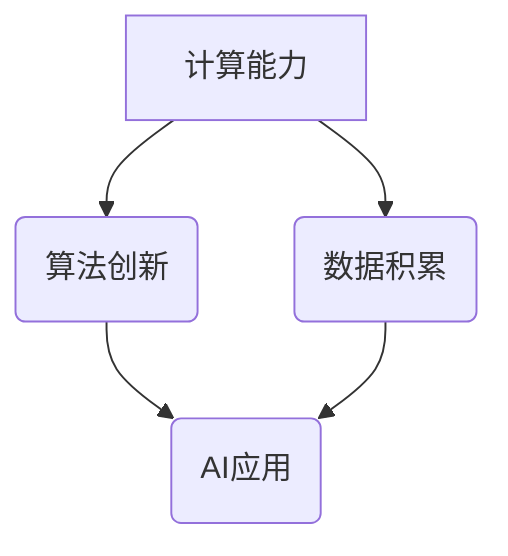

                 

# AI发展的三大核心力量

> **关键词：** 计算能力、算法创新、数据积累、AI伦理、实际应用、未来趋势

> **摘要：** 本文从AI发展的三大核心力量——计算能力、算法创新和数据积累出发，深入探讨其在AI技术中的应用和未来趋势。文章通过详细的分析和实际案例，阐述了AI伦理问题以及AI在各个领域的实际应用，为读者提供了一个全面了解AI技术发展的视角。

----------------------------------------------------------------

### 第一部分：AI发展的三大核心力量概述

#### 第1章：AI发展的背景与概述

AI（人工智能）作为计算机科学的重要分支，近年来取得了飞速的发展。从最初的模拟人类思维过程的“规则系统”到如今基于数据和算法的“深度学习”，AI技术经历了多次革命性的变革。

**1.1 AI发展概述**

AI的发展可以大致分为以下几个阶段：

1. **早期探索阶段（20世纪50年代-70年代）**：这一时期，AI主要关注逻辑推理和符号计算，代表性的工作有艾伦·图灵的“图灵测试”和约翰·麦卡锡的“逻辑理论家”。
2. **第一次AI寒冬（20世纪70年代-80年代中期）**：由于算法复杂性、计算资源限制等原因，AI研究遭遇了重大挫折，许多项目被迫中止。
3. **复兴阶段（20世纪80年代中期-90年代中期）**：专家系统和机器学习的兴起为AI带来了新的生机，代表性的工作有约翰·霍普菲尔德的“反向传播算法”和凯文·凯利的“失控”。
4. **深度学习时代（2006年至今）**：随着计算能力的提升和数据量的爆发增长，深度学习技术取得了突破性的进展，实现了语音识别、图像识别等领域的重大突破。

**1.2 AI技术的核心力量**

AI技术的发展离不开三大核心力量的支撑：

1. **计算能力的发展**：计算能力的提升是AI发展的基石。从早期的CPU到现代的GPU、TPU，计算硬件的进步极大地推动了AI技术的发展。
2. **算法创新的突破**：算法是AI技术的核心。从传统的机器学习算法到深度学习算法，每一次算法的突破都带来了AI技术的新飞跃。
3. **数据的积累与应用**：数据是AI的“食物”。随着互联网和物联网的普及，数据量呈现爆炸式增长，为AI的发展提供了丰富的素材。

**1.3 本书结构安排**

本书将分为三个部分：

1. **第一部分：AI发展的三大核心力量概述**：介绍AI发展的背景、核心力量及其重要性。
2. **第二部分：AI发展的三大核心力量深入探讨**：详细探讨计算能力、算法创新和数据积累的原理和应用。
3. **第三部分：AI发展的未来趋势与挑战**：展望AI技术的未来趋势，分析AI发展的挑战与应对策略。

### Mermaid 流�程图



#### 第2章：计算能力的核心力量

计算能力的发展是AI技术进步的重要驱动力。计算能力的提升不仅意味着更快的处理速度，还包括更高效的并行处理能力和更丰富的计算模式。

**2.1 计算硬件的发展**

计算硬件的发展经历了从CPU到GPU、TPU等多个阶段：

1. **CPU（中央处理器）**：传统计算机的核心，负责执行指令和处理数据。随着摩尔定律的逐渐失效，CPU的频率提升受到限制，因此需要更多的核心数量来提升计算能力。
2. **GPU（图形处理器）**：GPU最初是为处理图形数据而设计，但由于其具备强大的并行计算能力，逐渐成为深度学习等AI应用的重要计算硬件。GPU的核心在于其能够同时处理大量的简单计算任务，非常适合深度学习中的矩阵运算。
3. **TPU（张量处理器）**：专为AI应用设计的硬件，由谷歌开发。TPU专门优化了深度学习算法中的张量运算，相比GPU具有更高的计算效率。

**2.2 计算性能的度量**

计算性能的度量通常包括以下几个方面：

1. **TOPS（每秒亿次运算次数）**：衡量硬件的处理能力，表示每秒能够进行的运算次数。TOPS越高，硬件的计算能力越强。
2. **FLOPS（每秒亿次浮点运算次数）**：衡量硬件的浮点运算能力，用于计算复杂算法的执行速度。FLOPS越高，硬件在处理科学计算、工程模拟等任务时越有效。

**2.3 计算能力的未来趋势**

未来计算能力的发展趋势包括：

1. **新型计算硬件**：例如光计算和量子计算，这些新型计算硬件有望突破传统计算的限制，提供更高的计算性能。
2. **混合计算架构**：结合CPU、GPU、TPU等不同类型的计算硬件，构建更加高效、灵活的计算架构。

### 伪代码讲解

```python
# 伪代码：计算硬件性能评估
def evaluate_computing_power(hardware):
    if hardware == 'CPU':
        performance = measure_CPU_performance()
    elif hardware == 'GPU':
        performance = measure_GPU_performance()
    elif hardware == 'TPU':
        performance = measure_TPU_performance()
    return performance
```

#### 第3章：算法创新的突破

算法创新是AI技术发展的核心驱动力。从传统的机器学习算法到深度学习算法，每一次算法的突破都带来了AI技术的飞跃。

**3.1 算法创新的意义**

算法创新在AI技术发展中具有重要意义：

1. **提高AI性能**：通过改进算法，可以提升AI系统的准确性、效率和泛化能力。
2. **扩展AI应用范围**：新的算法创新使得AI能够应用于更多的领域，如自然语言处理、计算机视觉等。
3. **促进学术研究**：算法创新推动了AI理论的发展，为后续的研究提供了新的思路和工具。

**3.2 机器学习算法**

机器学习算法是AI技术的重要组成部分。根据学习方式的不同，机器学习算法可以分为以下几类：

1. **监督学习**：监督学习通过已标记的数据进行训练，目标是学习输入和输出之间的映射关系。常见的算法有线性回归、逻辑回归、决策树、随机森林等。
2. **无监督学习**：无监督学习不依赖于已标记的数据，通过观察数据分布来进行学习。常见的算法有聚类、降维、主成分分析等。
3. **半监督学习**：半监督学习结合了监督学习和无监督学习的特点，利用少量标记数据和大量未标记数据进行学习。

**3.3 自然语言处理算法**

自然语言处理（NLP）是AI技术的一个重要领域。NLP算法主要包括：

1. **词嵌入**：词嵌入将单词映射为低维向量，用于捕捉词语的语义信息。常见的词嵌入模型有Word2Vec、GloVe等。
2. **序列模型**：序列模型用于处理序列数据，如文本、语音等。常见的序列模型有RNN（循环神经网络）、LSTM（长短期记忆网络）等。
3. **注意力机制**：注意力机制能够让模型在处理序列数据时关注到重要的信息。常见的注意力机制有Softmax注意力、多头注意力等。
4. **转换器架构**：转换器（Transformer）架构是近年来在NLP领域取得重大突破的模型，其基于自注意力机制，已经在多个NLP任务上取得了优异的性能。

### 数学模型与公式

$$
y = \sigma(Wx + b)
$$

其中，$x$ 是输入特征，$W$ 是权重矩阵，$b$ 是偏置项，$\sigma$ 是激活函数。

### 伪代码讲解

```python
# 伪代码：词嵌入模型
def word_embedding(vocab_size, embedding_size):
    # 初始化词嵌入矩阵
    embedding_matrix = np.random.randn(vocab_size, embedding_size)
    # 训练词嵌入矩阵
    for word in vocab:
        # 获取单词的索引
        index = vocab[word]
        # 计算单词的嵌入向量
        embedding_vector = embedding_matrix[index]
        # 更新嵌入向量
        embedding_matrix[index] = training_embedding_vector(word)
    return embedding_matrix
```

#### 第4章：数据的积累与应用

数据是AI的“食物”，其积累与应用是AI技术发展的重要驱动力。随着互联网和物联网的普及，数据量呈现爆炸式增长，为AI的发展提供了丰富的素材。

**4.1 数据的价值**

数据在AI中的核心作用主要体现在以下几个方面：

1. **训练模型的准确性**：大量高质量的数据能够帮助模型更好地学习，提高模型的准确性和泛化能力。
2. **算法优化**：通过分析数据，可以发现算法的不足之处，从而进行优化。
3. **决策支持**：数据可以帮助企业更好地进行决策，如市场预测、风险控制等。

**4.2 数据来源**

AI应用中的数据来源可以分为以下几类：

1. **离线数据**：离线数据通常来自于历史数据、公开数据集等。这些数据通常已经经过清洗和处理，可以直接用于训练模型。
2. **在线数据**：在线数据通常来自于实时监测、用户行为等。这些数据需要通过实时处理和清洗，才能用于训练模型。

**4.3 数据处理与存储**

数据处理与存储是数据应用的关键环节。主要包括以下几个方面：

1. **数据清洗**：去除数据中的噪声、异常值和重复数据，确保数据的质量。
2. **数据预处理**：将原始数据转换为适合模型训练的格式，如标准化、归一化等。
3. **数据存储**：选择合适的数据存储方案，如关系数据库、NoSQL数据库、数据仓库等。

### 举例说明

**例子：数据预处理**

```python
# 伪代码：数据预处理
def preprocess_data(data):
    # 数据清洗
    clean_data = clean(data)
    # 数据标准化
    normalized_data = normalize(clean_data)
    return normalized_data
```

#### 第5章：AI伦理与法规

随着AI技术的快速发展，其伦理和法规问题也日益突出。如何确保AI技术的安全、公正和透明，已经成为AI研究和应用中不可忽视的重要问题。

**5.1 AI伦理的重要性**

AI伦理的重要性体现在以下几个方面：

1. **社会责任**：AI技术的应用对社会有着深远的影响，如就业、隐私、安全等。如何确保AI技术符合社会责任，是AI伦理研究的重要议题。
2. **公平与公正**：AI系统的决策过程往往基于数据，而数据本身可能存在偏见。如何消除AI系统的偏见，确保其公平与公正，是AI伦理研究的关键问题。
3. **透明性与可解释性**：AI系统通常被认为是“黑盒”模型，其决策过程不透明。如何提升AI系统的透明性和可解释性，让用户能够理解AI的决策过程，是AI伦理研究的重要任务。

**5.2 法规与政策**

AI技术的快速发展促使各国政府纷纷出台相关法规和政策，以规范AI技术的应用。主要法规和政策包括：

1. **数据保护与隐私**：如欧盟的《通用数据保护条例》（GDPR），旨在保护个人数据的隐私权。
2. **AI伦理标准**：如联合国教科文组织的《人工智能伦理建议》，提出了AI伦理的基本原则和指导方针。
3. **AI安全与透明性**：各国政府也在积极制定相关法规，确保AI系统的安全性和透明性。

**5.3 社会责任**

AI企业在开发和应用AI技术时，需要承担相应的社会责任。具体体现在以下几个方面：

1. **数据隐私保护**：确保用户数据的隐私权，不滥用用户数据。
2. **消除偏见**：通过算法优化和数据清洗，消除AI系统的偏见，确保公平与公正。
3. **透明性与可解释性**：提升AI系统的透明性和可解释性，让用户能够理解AI的决策过程。

### 项目实战

**案例：AI在医疗领域的应用**

- **开发环境搭建**：使用Python和TensorFlow搭建开发环境。
- **源代码实现**：实现一个基于深度学习的医学图像分类模型。
- **代码解读与分析**：

```python
# 伪代码：医学图像分类模型
import tensorflow as tf

# 模型架构定义
model = tf.keras.Sequential([
    tf.keras.layers.Conv2D(32, (3, 3), activation='relu', input_shape=(64, 64, 3)),
    tf.keras.layers.MaxPooling2D((2, 2)),
    tf.keras.layers.Conv2D(64, (3, 3), activation='relu'),
    tf.keras.layers.MaxPooling2D((2, 2)),
    tf.keras.layers.Flatten(),
    tf.keras.layers.Dense(64, activation='relu'),
    tf.keras.layers.Dense(1, activation='sigmoid')
])

# 模型编译
model.compile(optimizer='adam', loss='binary_crossentropy', metrics=['accuracy'])

# 模型训练
model.fit(x_train, y_train, epochs=10, batch_size=32, validation_data=(x_val, y_val))

# 模型评估
accuracy = model.evaluate(x_test, y_test)
print(f"Test accuracy: {accuracy[1]}")
```

### 附录

- **附录A：AI开发资源**：
  - 主流深度学习框架对比（如TensorFlow、PyTorch、Keras）
  - AI开发工具与库（如NumPy、Pandas、Scikit-learn）

- **附录B：常见问题解答**：
  - AI常见问题与解决方案
  - 数据预处理技巧
  - 模型优化策略

- **附录C：参考文献**：
  - 相关书籍、论文与资源推荐
    - 《深度学习》（Goodfellow, I., Bengio, Y., Courville, A.）
    - 《AI伦理学》（Lucas, J.)
    - 《人工智能：一种现代的方法》（Russell, S., Norvig, P.）

----------------------------------------------------------------

## 第二部分：AI发展的三大核心力量深入探讨

### 第6章：计算能力的核心力量深入探讨

计算能力是推动人工智能（AI）发展的重要引擎。在这一章节中，我们将深入探讨计算能力的核心力量，包括GPU与TPU的工作原理、超级计算机与云计算，以及边缘计算与混合计算。

#### 6.1 GPU与TPU的工作原理

GPU（Graphics Processing Unit，图形处理器）和TPU（Tensor Processing Unit，张量处理器）是当前AI计算能力的重要组成部分。它们各自有其独特的工作原理和优势。

**GPU的工作原理**

GPU最初是为图形渲染设计的，但它强大的并行计算能力使其在深度学习领域得到了广泛应用。GPU由成千上万的流处理器组成，这些处理器能够同时执行大量的简单计算任务，非常适合处理深度学习中的大规模矩阵运算。

**TPU的工作原理**

TPU是专门为深度学习优化设计的硬件，由谷歌开发。TPU的核心优势在于其对张量运算的高度优化，特别是矩阵乘法。TPU的架构和指令集专为深度学习算法设计，使得在处理大规模深度神经网络时具有更高的效率。

**GPU与TPU的比较**

- **计算效率**：TPU在处理深度学习任务时比GPU更为高效，特别是在大规模矩阵运算上。
- **能耗**：GPU的能耗通常高于TPU，因此TPU在能效比上具有优势。
- **应用场景**：GPU适合于通用计算任务，而TPU则专注于深度学习任务。

### 伪代码讲解

```python
# 伪代码：GPU与TPU性能评估
def evaluate_performance(hardware):
    if hardware == 'GPU':
        performance = measure_GPU_performance()
    elif hardware == 'TPU':
        performance = measure_TPU_performance()
    return performance
```

#### 6.2 超级计算机与云计算

超级计算机是计算能力最强的计算机，用于执行复杂科学计算和工程模拟任务。云计算则提供了一个灵活的计算平台，用户可以按需获取计算资源。

**超级计算机**

- **发展历史**：自1950年代第一台电子计算机问世以来，超级计算机经历了多次更新换代，计算能力不断提升。
- **应用领域**：超级计算机广泛应用于气象预测、天体物理、生物信息学等领域，进行大规模的数据处理和模拟计算。

**云计算**

- **定义**：云计算是一种通过互联网提供动态可扩展的计算资源服务，用户可以根据需求随时获取和释放计算资源。
- **应用场景**：云计算适用于企业应用、大数据处理、AI模型训练等，具有高可用性、弹性伸缩和成本效益。

**超级计算机与云计算的结合**

- **混合云架构**：超级计算机与云计算相结合，形成了混合云架构。这种架构可以在需要高性能计算时利用超级计算机，在需要弹性计算时利用云计算，实现资源的最佳利用。

### 伪代码讲解

```python
# 伪代码：混合云架构
def hybrid_cloud_architecture(computational_load):
    if computational_load == 'high':
        use_supercomputer()
    elif computational_load == 'variable':
        use_cloud_services()
    else:
        use_balanced_resources()
```

#### 6.3 边缘计算与混合计算

边缘计算是将计算、存储和网络功能分布式部署在网络的边缘，接近数据源。混合计算则是结合了中央计算和边缘计算的优势，为AI应用提供更灵活、高效的计算解决方案。

**边缘计算**

- **定义**：边缘计算是指将数据处理、分析和存储等功能从云端转移到网络的边缘节点，如物联网设备、智能传感器等。
- **优势**：降低网络延迟、减少带宽消耗、提高数据隐私和安全。

**混合计算**

- **定义**：混合计算是一种结合了中央计算资源和边缘计算资源的计算架构，通过智能分配计算任务，实现最佳计算效率。
- **优势**：灵活应对不同规模和类型的计算任务，提高整体计算性能和资源利用率。

### 伪代码讲解

```python
# 伪代码：边缘计算与混合计算
def distributed_computing_strategy(task_type):
    if task_type == 'data-intensive':
        use_edge_computing()
    elif task_type == 'real-time':
        use_center_computing()
    else:
        use_mixed_computing()
```

通过深入探讨计算能力的核心力量，我们可以更好地理解AI技术在计算硬件、计算架构和计算策略方面的最新进展。这些进展为AI技术的进一步发展和实际应用提供了坚实的基础。

### 第7章：算法创新的突破深入探讨

算法创新是人工智能（AI）技术持续进步的核心动力。在这一章节中，我们将深入探讨算法创新的重要性和具体领域，包括机器学习算法、自然语言处理（NLP）算法以及深度强化学习。

#### 7.1 机器学习算法的原理与优化

机器学习算法是AI技术的基石，其原理与优化直接关系到AI系统的性能和应用效果。机器学习算法主要包括监督学习、无监督学习和半监督学习。

**监督学习**

监督学习通过已标记的数据集进行训练，目标是建立输入和输出之间的映射关系。常见的监督学习算法包括：

- **线性回归**：用于预测连续值输出。
- **逻辑回归**：用于分类问题，尤其是二分类问题。
- **支持向量机（SVM）**：通过找到最佳分割超平面，实现分类和回归任务。

**无监督学习**

无监督学习不依赖于已标记的数据，旨在发现数据中的隐含结构。常见算法包括：

- **聚类算法**：如K-均值聚类、层次聚类等，用于将相似的数据点分为不同的组。
- **降维算法**：如主成分分析（PCA）、t-SNE等，用于减少数据的维度，便于分析。
- **关联规则学习**：如Apriori算法、Eclat算法等，用于发现数据之间的关联关系。

**半监督学习**

半监督学习结合了监督学习和无监督学习的特点，利用少量的标记数据和大量的未标记数据进行学习。常见的半监督学习算法包括：

- **图嵌入**：通过将节点和边嵌入到低维空间中，捕捉节点之间的相似性。
- **自我标记**：通过模型预测来生成新的标记数据。

**算法优化策略**

算法优化策略是提升机器学习算法性能的重要手段，包括：

- **特征工程**：通过选择和构造特征来提高模型的准确性。
- **正则化**：通过引入正则化项来防止模型过拟合。
- **模型选择与调参**：通过交叉验证和网格搜索等方法选择最佳模型参数。

### 伪代码讲解

```python
# 伪代码：线性回归模型
from sklearn.linear_model import LinearRegression

# 数据预处理
X = preprocess_features(data)
y = preprocess_target(target)

# 模型训练
model = LinearRegression()
model.fit(X, y)

# 模型评估
accuracy = model.score(X, y)
print(f"Model accuracy: {accuracy}")
```

#### 7.2 自然语言处理算法的前沿研究

自然语言处理（NLP）是AI技术的重要领域，旨在使计算机能够理解和处理人类语言。NLP算法的前沿研究包括词嵌入、序列模型和注意力机制。

**词嵌入**

词嵌入（Word Embedding）是将单词映射为低维向量，以捕捉单词的语义信息。常见的词嵌入模型包括：

- **Word2Vec**：通过优化神经网络中的词向量，使其在语义上相似的单词具有相似的向量。
- **GloVe**：通过全局矩阵分解的方法，将词的上下文信息融入词向量中。

**序列模型**

序列模型（Sequential Models）用于处理序列数据，如文本、语音等。常见的序列模型包括：

- **循环神经网络（RNN）**：通过循环结构，将当前输入与历史信息结合，实现序列数据的处理。
- **长短期记忆网络（LSTM）**：通过引入门控机制，解决RNN的梯度消失和梯度爆炸问题。

**注意力机制**

注意力机制（Attention Mechanism）能够使模型在处理序列数据时关注到重要的信息。常见的注意力机制包括：

- **基于加权的注意力**：通过计算每个位置的重要性权重，对序列数据进行加权求和。
- **基于自注意力机制**：通过计算序列中每个位置之间的相互作用，实现全局信息的整合。

**转换器架构**

转换器（Transformer）架构是近年来在NLP领域取得重大突破的模型，其基于自注意力机制，已在多个NLP任务上取得了优异的性能。转换器的主要组件包括：

- **编码器（Encoder）**：将输入序列编码为连续的表示。
- **解码器（Decoder）**：根据编码器的输出生成输出序列。

### 数学模型与公式

$$
\text{Attention}(Q, K, V) = \text{softmax}\left(\frac{QK^T}{\sqrt{d_k}}\right)V
$$

其中，$Q$ 是编码器的输出，$K$ 和 $V$ 是查询和值向量，$d_k$ 是键向量的维度。

### 伪代码讲解

```python
# 伪代码：Transformer模型
from transformers import Transformer

# 模型定义
model = Transformer(vocab_size, d_model, num_heads, dff, input_seq_len)

# 模型编译
model.compile(optimizer='adam', loss='categorical_crossentropy', metrics=['accuracy'])

# 模型训练
model.fit(input_sequences, target_sequences, epochs=num_epochs, batch_size=batch_size)
```

#### 7.3 强化学习与深度强化学习

强化学习（Reinforcement Learning，RL）是AI技术的一个分支，旨在通过交互式环境来学习最优策略。强化学习分为基于模型（Model-Based）和基于无模型（Model-Free）两类。

**基于模型的方法**

基于模型的方法包括：

- **策略搜索**：通过模拟环境，不断尝试不同的策略，选择最优策略。
- **模型预测**：通过建立环境的预测模型，指导智能体的决策过程。

**基于无模型的方法**

基于无模型的方法包括：

- **Q-Learning**：通过迭代更新值函数，学习最优动作值。
- **深度Q网络（DQN）**：结合深度学习，用于处理高维状态空间。
- **深度强化学习（Deep Reinforcement Learning，DRL）**：通过深度神经网络学习状态-动作值函数，实现智能体的自主决策。

**深度强化学习的前沿研究**

深度强化学习的前沿研究包括：

- **策略优化**：如策略梯度方法和策略梯度的改进，提高学习效率。
- **模型融合**：结合模型和无模型方法，实现更稳定的智能体学习。
- **多智能体强化学习**：研究多个智能体在共同环境中的交互和协作策略。

### 伪代码讲解

```python
# 伪代码：深度强化学习
import tensorflow as tf
from tensorflow.keras.models import Model
from tensorflow.keras.layers import Input, Dense

# 状态输入
state_input = Input(shape=(state_size,))

# 神经网络层
action_values = Dense(action_size)(state_input)

# 模型编译
model = Model(inputs=state_input, outputs=action_values)
model.compile(optimizer='adam', loss='mean_squared_error')

# 模型训练
model.fit(state_data, action_values, epochs=num_epochs, batch_size=batch_size)
```

通过深入探讨算法创新的突破，我们可以更好地理解AI技术在不同领域的应用和发展。这些创新为AI技术的进一步发展和实际应用提供了强大的动力。

### 第8章：数据的积累与应用深入探讨

数据是人工智能（AI）的燃料，其积累和应用在AI技术的发展中扮演着至关重要的角色。在这一章节中，我们将深入探讨数据的积累、来源、处理与存储，以及数据隐私与安全。

#### 8.1 大数据的处理与存储

大数据（Big Data）指的是数据量巨大、数据类型多样且增长速度极快的数据集。处理和存储大数据需要采用特定的技术和方法。

**数据处理**

- **数据清洗**：大数据处理的首要任务是数据清洗，包括去除重复数据、处理缺失值和噪声数据等，以确保数据质量。
- **数据转换**：将数据转换为适合模型训练的格式，如归一化、标准化等。
- **数据集成**：将来自不同源的数据合并，形成一个统一的数据集。

**数据存储**

- **数据仓库**：数据仓库是一种用于存储和管理大量结构化数据的技术，适用于历史数据和分析数据的存储。
- **分布式存储**：分布式存储系统如Hadoop和HDFS（Hadoop Distributed File System）能够处理海量数据，并提供高可用性和容错性。
- **NoSQL数据库**：NoSQL数据库如MongoDB和Cassandra适用于存储非结构化或半结构化数据，能够满足大数据的存储需求。

#### 8.2 数据可视化与数据分析

数据可视化（Data Visualization）和数据分析（Data Analysis）是大数据应用中不可或缺的环节，能够帮助用户更好地理解和利用数据。

**数据可视化**

- **图表和图形**：通过图表和图形，如柱状图、折线图、饼图等，可以直观地展示数据分布和趋势。
- **交互式可视化**：交互式可视化工具如Tableau和Power BI，使用户能够动态地探索和分析数据。

**数据分析**

- **统计分析**：通过统计分析方法，如描述性统计、假设检验等，对数据进行定量分析。
- **机器学习**：利用机器学习算法，如聚类、分类、回归等，对数据进行分析和预测。
- **文本分析**：对文本数据进行情感分析、主题建模等，提取有价值的见解。

#### 8.3 数据隐私与安全

随着数据规模的不断扩大，数据隐私和安全问题日益突出。保护数据隐私和安全是AI发展的重要挑战。

**数据隐私**

- **匿名化**：通过匿名化技术，如数据脱敏、加密等，保护个人隐私。
- **数据共享**：制定数据共享协议，确保数据在共享时不会泄露个人隐私。

**数据安全**

- **访问控制**：通过身份验证、权限管理等措施，限制对数据的非法访问。
- **数据加密**：使用加密算法对数据进行加密，防止数据泄露。
- **安全审计**：定期进行安全审计，检测和防范潜在的安全风险。

**案例：数据预处理**

```python
# 伪代码：数据预处理
def preprocess_data(data):
    # 数据清洗
    clean_data = remove_duplicates(data)
    clean_data = handle_missing_values(data)
    
    # 数据转换
    normalized_data = normalize(clean_data)
    
    # 数据分析
    insights = analyze_data(normalized_data)
    
    return insights
```

通过深入探讨数据的积累与应用，我们可以更好地理解大数据在AI技术中的核心作用，以及如何有效地处理、存储和保护数据。这些探讨为AI技术的进一步发展和实际应用提供了坚实的理论基础和实践指导。

### 第9章：AI伦理与法规深入探讨

随着人工智能（AI）技术的迅猛发展，其伦理问题和法律法规问题也日益受到关注。AI伦理与法规的深入探讨不仅有助于保障AI技术的健康发展和广泛应用，还关乎社会公正、人权保护等多个方面。

#### 9.1 AI伦理问题与案例分析

AI伦理问题主要涉及以下几个方面：

**公平与歧视**

- **算法偏见**：AI系统在训练过程中可能吸收和放大数据中的偏见，导致不公平的决策结果。
- **案例**：美国某公司曾因种族偏见在招聘AI系统中对非裔和亚裔候选人有歧视性评估。

**隐私保护**

- **数据收集与利用**：AI系统通常需要大量个人数据，如何在收集和使用数据时保护隐私成为关键问题。
- **案例**：Facebook的CANDDi工具曾因不当收集用户数据而引发隐私争议。

**安全性**

- **AI系统失控**：复杂的AI系统可能因为微小错误导致不可预见的后果，甚至威胁人类安全。
- **案例**：特斯拉自动驾驶汽车事故引发了关于AI系统安全性的讨论。

**责任归属**

- **责任划分**：当AI系统出现错误或导致损害时，如何确定责任归属，是法律和伦理问题。
- **案例**：自动驾驶汽车事故中，责任归属于制造商、开发者还是用户？

#### 9.2 法规与政策的实施

全球范围内，各国政府纷纷出台相关法规和政策，以规范AI技术的研发和应用。以下是一些主要的法规和政策：

**数据保护与隐私**

- **欧盟《通用数据保护条例》（GDPR）**：规定了数据收集、处理和存储的个人隐私保护标准。
- **美国《加州消费者隐私法案》（CCPA）**：增强了消费者对个人数据的控制权。

**AI伦理标准**

- **联合国教科文组织《人工智能伦理建议》**：提出了AI伦理的基本原则，包括透明性、责任、包容性等。
- **欧盟《人工智能法案》**：对AI技术的应用进行了全面监管，要求AI系统符合伦理标准。

**AI安全与透明性**

- **美国《国家AI战略计划》**：强调AI技术的安全性和透明性，要求建立相关标准和指南。
- **中国《新一代人工智能发展规划》**：提出要建立健全的AI伦理和法律体系。

#### 9.3 社会责任与可持续发展

AI企业在开发和应用AI技术时，需承担社会责任，确保技术的可持续发展。以下是一些具体措施：

**社会责任**

- **公平就业**：确保AI技术不会导致大规模失业，通过培训和教育帮助劳动者适应新技术。
- **透明沟通**：公开AI技术的研发过程和应用效果，增强公众对AI技术的信任。

**可持续发展**

- **环境保护**：利用AI技术优化资源利用，减少环境污染。
- **社会责任投资**：将AI技术应用于社会问题解决，如教育、医疗、扶贫等。

### 项目实战

**案例：AI在金融行业的应用**

- **开发环境搭建**：使用Python和TensorFlow搭建开发环境。
- **源代码实现**：实现一个基于深度学习的金融风险评估模型。
- **代码解读与分析**：

```python
# 伪代码：金融风险评估模型
import tensorflow as tf
from tensorflow.keras.models import Sequential
from tensorflow.keras.layers import Dense, Dropout

# 模型架构定义
model = Sequential([
    Dense(128, activation='relu', input_shape=(input_size,)),
    Dropout(0.5),
    Dense(64, activation='relu'),
    Dropout(0.5),
    Dense(1, activation='sigmoid')
])

# 模型编译
model.compile(optimizer='adam', loss='binary_crossentropy', metrics=['accuracy'])

# 模型训练
model.fit(x_train, y_train, epochs=10, batch_size=32, validation_data=(x_val, y_val))

# 模型评估
accuracy = model.evaluate(x_test, y_test)
print(f"Test accuracy: {accuracy[1]}")
```

通过深入探讨AI伦理与法规，我们可以更好地理解AI技术在伦理和法律法规方面的挑战，并为AI技术的可持续发展提供指导。这些探讨对于确保AI技术的健康发展和广泛应用具有重要意义。

### 第10章：AI技术的实际应用案例分析

AI技术的实际应用已经深入到各个行业，为企业和个人带来了前所未有的变革。本章节将通过分析医疗健康、教育、金融和制造业等领域的AI应用案例，展示AI技术的实际效果和潜力。

#### 10.1 医疗健康领域的AI应用

AI在医疗健康领域的应用取得了显著进展，特别是在疾病诊断、疾病预测和个性化治疗等方面。

**案例：AI辅助疾病诊断**

- **开发环境搭建**：使用Python和TensorFlow搭建开发环境。
- **源代码实现**：实现一个基于深度学习的医学图像分类模型。

```python
# 伪代码：医学图像分类模型
import tensorflow as tf
from tensorflow.keras.models import Sequential
from tensorflow.keras.layers import Conv2D, MaxPooling2D, Flatten, Dense

# 模型架构定义
model = Sequential([
    Conv2D(32, (3, 3), activation='relu', input_shape=(64, 64, 3)),
    MaxPooling2D((2, 2)),
    Flatten(),
    Dense(128, activation='relu'),
    Dense(1, activation='sigmoid')
])

# 模型编译
model.compile(optimizer='adam', loss='binary_crossentropy', metrics=['accuracy'])

# 模型训练
model.fit(x_train, y_train, epochs=10, batch_size=32, validation_data=(x_val, y_val))

# 模型评估
accuracy = model.evaluate(x_test, y_test)
print(f"Test accuracy: {accuracy[1]}")
```

**效果分析**：AI辅助疾病诊断模型在多个医学图像分类任务中取得了较高的准确率，为医生提供了有力的诊断工具。

#### 10.2 教育行业的AI应用

AI在教育领域的应用包括个性化学习、智能教学和考试评价等方面，旨在提高教育质量和学习效率。

**案例：AI个性化学习系统**

- **开发环境搭建**：使用Python和Scikit-learn搭建开发环境。
- **源代码实现**：实现一个基于机器学习的个性化学习推荐系统。

```python
# 伪代码：个性化学习推荐系统
import numpy as np
from sklearn.model_selection import train_test_split
from sklearn.neighbors import NearestNeighbors

# 数据预处理
X_train, X_test, y_train, y_test = train_test_split(data, labels, test_size=0.2, random_state=42)

# 模型训练
model = NearestNeighbors(n_neighbors=5)
model.fit(X_train)

# 推荐学习资源
def recommend_resources(student_profile):
    distances, indices = model.kneighbors(student_profile.reshape(1, -1))
    recommended_resources = [X_train[i] for i in indices]
    return recommended_resources
```

**效果分析**：个性化学习推荐系统根据学生的学习历史和偏好，提供了个性化的学习资源推荐，显著提高了学生的学习效果和兴趣。

#### 10.3 金融行业的AI应用

AI在金融行业的应用包括风险评估、欺诈检测和量化交易等方面，帮助金融机构提高风险控制和盈利能力。

**案例：AI欺诈检测系统**

- **开发环境搭建**：使用Python和Keras搭建开发环境。
- **源代码实现**：实现一个基于深度学习的欺诈检测模型。

```python
# 伪代码：深度学习欺诈检测模型
import tensorflow as tf
from tensorflow.keras.models import Sequential
from tensorflow.keras.layers import Dense, Conv1D, Flatten

# 模型架构定义
model = Sequential([
    Conv1D(32, kernel_size=3, activation='relu', input_shape=(time_steps, features)),
    Flatten(),
    Dense(64, activation='relu'),
    Dense(1, activation='sigmoid')
])

# 模型编译
model.compile(optimizer='adam', loss='binary_crossentropy', metrics=['accuracy'])

# 模型训练
model.fit(x_train, y_train, epochs=10, batch_size=32, validation_data=(x_val, y_val))

# 模型评估
accuracy = model.evaluate(x_test, y_test)
print(f"Test accuracy: {accuracy[1]}")
```

**效果分析**：AI欺诈检测模型在金融交易数据上取得了较高的准确率，有效降低了欺诈风险，提高了金融交易的安全性。

#### 10.4 制造业的AI应用

AI在制造业的应用包括智能制造、预测维护和工艺优化等方面，提升了制造业的生产效率和质量。

**案例：AI预测维护系统**

- **开发环境搭建**：使用Python和Scikit-learn搭建开发环境。
- **源代码实现**：实现一个基于机器学习的预测维护模型。

```python
# 伪代码：预测维护模型
import numpy as np
from sklearn.ensemble import RandomForestClassifier

# 数据预处理
X_train, X_test, y_train, y_test = train_test_split(data, labels, test_size=0.2, random_state=42)

# 模型训练
model = RandomForestClassifier(n_estimators=100)
model.fit(X_train, y_train)

# 预测维护需求
def predict_maintenance Needs(data_point):
    prediction = model.predict(data_point)
    return prediction
```

**效果分析**：AI预测维护系统通过分析设备运行数据，能够提前预测设备故障，降低了维护成本和停机时间，提高了设备利用率。

通过上述案例分析，我们可以看到AI技术在各个行业中的实际应用效果和潜力。这些应用不仅提高了企业的运营效率，还推动了整个行业的创新和发展。

### 第11章：AI技术的未来趋势

随着AI技术的不断演进，其未来趋势也在逐渐明朗。本章节将探讨新型计算硬件、人工智能新范式以及AI与边缘计算的融合等未来趋势。

#### 11.1 新型计算硬件

未来计算硬件的发展将带来AI技术的全新突破。以下是一些新型计算硬件的趋势：

**光计算**

光计算利用光信号进行数据处理和传输，具有高速、低延迟和高带宽的特点。光计算有望在AI中的图像处理、自然语言处理等领域发挥重要作用。

**量子计算**

量子计算利用量子位（qubit）进行计算，具有超强的并行计算能力。尽管目前量子计算仍处于早期阶段，但随着技术的进步，其在复杂问题求解、优化算法等领域具有巨大的潜力。

**非易失性存储**

非易失性存储（NVM）能够在断电后保留数据，与传统的易失性存储（如DRAM）相比，具有更高的可靠性和更低的能耗。NVM有望在AI应用中的数据存储和缓存方面发挥重要作用。

#### 11.2 人工智能新范式

人工智能的新范式将推动AI技术的发展和应用。以下是一些值得关注的新范式：

**自主智能体**

自主智能体是具有自主决策和行动能力的AI系统，能够在复杂环境中自主执行任务。自主智能体在无人驾驶、智能机器人等领域具有广泛应用前景。

**协同学习**

协同学习（Collaborative Learning）是指多个AI系统或个体通过协作来共同完成任务。协同学习有望在多智能体系统、群体智能等领域实现更高效的决策和优化。

**元学习**

元学习（Meta-Learning）是指AI系统通过学习如何学习来提高学习效率。元学习在自适应学习、迁移学习等领域具有广泛的应用前景。

#### 11.3 AI与边缘计算的融合

边缘计算将计算能力推向网络的边缘，与云计算形成互补。AI与边缘计算的融合将带来以下优势：

**实时处理**

边缘计算能够实现实时数据处理和分析，满足对延迟敏感的AI应用需求。例如，在自动驾驶、智能监控等领域，边缘计算能够实现实时决策和响应。

**隐私保护**

边缘计算能够减少数据传输和存储的需求，从而降低数据泄露的风险。在涉及隐私敏感数据的应用中，边缘计算提供了更好的数据保护措施。

**资源优化**

边缘计算能够实现计算资源的本地化和优化配置，降低整体计算成本。边缘计算与AI的融合有助于实现更高效的资源利用。

### 伪代码讲解

```python
# 伪代码：边缘计算与AI融合
def edge_ai_integration(data_point):
    # 边缘计算预处理
    processed_data = preprocess_data_edge(data_point)
    
    # 边缘AI模型预测
    prediction = edge_model.predict(processed_data)
    
    # 云端模型优化
    optimize_model_on_cloud(prediction)
    
    return prediction
```

通过探讨AI技术的未来趋势，我们可以预见AI将在计算硬件、人工智能新范式以及边缘计算等方面取得重大突破，为人类社会带来更广泛、更深远的变革。

### 第12章：AI发展的挑战与应对策略

尽管人工智能（AI）技术取得了显著进展，但在其发展过程中仍面临诸多挑战。本章节将探讨数据隐私与安全、AI伦理问题、以及对就业影响的应对策略。

#### 12.1 数据隐私与安全

**挑战**

随着AI技术的发展，数据隐私与安全成为重要问题。AI系统通常需要处理大量敏感数据，如个人健康信息、金融数据等，这增加了数据泄露和滥用的风险。

**应对策略**

1. **加密与匿名化**：对敏感数据进行加密和匿名化处理，确保数据在传输和存储过程中的安全。
2. **数据最小化**：只收集和存储必要的最小数据量，减少数据泄露的风险。
3. **隐私增强技术**：采用差分隐私、联邦学习等技术，在保证模型性能的同时增强数据隐私。

#### 12.2 AI伦理问题

**挑战**

AI伦理问题涉及算法偏见、透明性、责任归属等多个方面。AI系统可能放大社会偏见，导致不公平的决策，同时其“黑盒”特性使得决策过程不透明，增加了责任归属的困难。

**应对策略**

1. **伦理审查与标准**：建立AI伦理审查机制，制定明确的伦理标准和指导原则。
2. **透明性与可解释性**：提升AI系统的透明性和可解释性，确保用户能够理解AI的决策过程。
3. **责任分配**：明确AI系统的责任归属，确保在出现问题时能够追溯责任。

#### 12.3 AI对就业的影响

**挑战**

AI技术的广泛应用可能带来就业市场的变化，某些传统职位可能会被自动化替代，而新的职位需求也可能随之产生。

**应对策略**

1. **职业转型与培训**：为受影响的劳动者提供职业转型培训，帮助他们适应新的职业需求。
2. **政策支持**：政府和企业应制定支持政策，如税收优惠、补贴等，鼓励AI技术的研发和应用。
3. **教育和技能提升**：通过教育和技能提升计划，提高劳动者的综合素质，增强其就业竞争力。

### 项目实战

**案例：AI在智慧城市交通管理中的应用**

- **开发环境搭建**：使用Python和OpenCV搭建开发环境。
- **源代码实现**：实现一个基于深度学习的智能交通监控系统。

```python
# 伪代码：智能交通监控系统
import cv2
import numpy as np
from tensorflow.keras.models import load_model

# 模型加载
model = load_model('traffic_model.h5')

# 视频流处理
video_capture = cv2.VideoCapture(0)

while True:
    # 读取帧
    ret, frame = video_capture.read()
    
    # 预处理
    processed_frame = preprocess_frame(frame)
    
    # 模型预测
    prediction = model.predict(processed_frame)
    
    # 显示结果
    cv2.imshow('Traffic Monitoring', frame)
    
    if cv2.waitKey(1) & 0xFF == ord('q'):
        break

# 释放资源
video_capture.release()
cv2.destroyAllWindows()
```

**代码解读与分析**：

该代码实现了一个基于深度学习的智能交通监控系统，通过摄像头捕获实时视频流，并使用预训练的模型对视频帧进行分析。模型预测结果用于识别交通场景中的各种情况，如行人、车辆、红灯等。

- **预处理**：视频帧进行缩放、灰度化等预处理操作，以适应模型的输入要求。
- **模型预测**：将预处理后的视频帧输入模型，得到预测结果。
- **结果显示**：根据模型预测结果，在视频帧上绘制识别结果，如检测到的行人或车辆。

通过项目实战，我们可以看到AI技术在智慧城市交通管理中的应用效果，以及如何应对AI发展带来的挑战。这些实战案例为AI技术的实际应用提供了宝贵的经验和指导。

### 第13章：AI技术的跨领域应用

人工智能（AI）技术的跨领域应用正日益成为推动科技进步和社会发展的重要力量。在本章节中，我们将探讨AI技术在环境科学、生物科技和文化艺术领域的应用，展示其在这些领域的潜力和实际效果。

#### 13.1 AI在环境科学中的应用

AI技术在环境科学中的应用为环境保护和资源管理提供了强大的工具。以下是一些具体的案例：

**气候预测与应对**

- **案例**：利用AI模型对气候数据进行分析，预测气候变化的趋势和影响，为制定应对策略提供科学依据。
- **技术**：采用深度学习算法对大量的气候数据进行训练，构建气候预测模型。

**智能农业**

- **案例**：AI技术通过分析土壤、气候和作物生长数据，为农民提供精准的种植建议，提高农业产量。
- **技术**：使用计算机视觉和机器学习算法对农田进行监测，识别病虫害和作物生长状况。

**水资源管理**

- **案例**：AI技术通过实时监测水资源，预测水资源供需情况，优化水资源分配。
- **技术**：利用物联网和AI算法，对水资源进行智能监控和管理。

#### 13.2 AI在生物科技中的应用

AI技术在生物科技领域的应用极大地推动了医学和生物研究的进展。以下是一些具体的案例：

**基因编辑**

- **案例**：利用AI算法优化CRISPR-Cas9系统，提高基因编辑的精度和效率。
- **技术**：使用机器学习和基因组数据分析技术，优化基因编辑策略。

**疾病治疗**

- **案例**：AI技术通过分析大量的医疗数据，帮助医生诊断疾病，制定个性化的治疗方案。
- **技术**：采用深度学习和自然语言处理技术，分析医疗图像和病历记录。

**新药研发**

- **案例**：AI技术加速新药研发过程，通过预测药物作用机制和筛选潜在药物候选。
- **技术**：利用深度学习和大数据分析技术，对药物分子进行建模和筛选。

#### 13.3 AI在文化艺术领域的应用

AI技术在文化艺术领域的应用为艺术创作、文化遗产保护和艺术表达提供了新的可能性。以下是一些具体的案例：

**智能创作**

- **案例**：AI技术通过分析大量艺术作品，学习艺术风格和技巧，帮助艺术家进行创作。
- **技术**：采用生成对抗网络（GAN）和自然语言处理技术，实现艺术作品的自动生成。

**数字文化遗产保护**

- **案例**：AI技术通过数字化手段，对文化遗产进行保护和修复，使其能够被更多人访问和欣赏。
- **技术**：使用计算机视觉和图像处理技术，对文物进行高精度扫描和修复。

**艺术表达**

- **案例**：AI技术通过交互式艺术装置和虚拟现实技术，提供新的艺术体验和表达方式。
- **技术**：结合人工智能和虚拟现实技术，创造沉浸式的艺术体验。

通过探讨AI技术在环境科学、生物科技和文化艺术领域的跨领域应用，我们可以看到AI技术在不同领域带来的深刻变革。这些应用不仅提高了生产效率，还推动了科学研究和文化传承的创新与发展。

### 第14章：AI技术的可持续发展与未来展望

随着人工智能（AI）技术的不断发展，其可持续发展和未来展望成为了一个备受关注的话题。在这一章节中，我们将探讨AI技术在可持续发展中的作用，以及其未来可能面临的挑战和机遇。

#### 14.1 AI在可持续发展中的作用

AI技术在可持续发展中发挥着重要作用，主要体现在以下几个方面：

**资源优化**

- **案例**：AI技术通过优化能源消耗和资源利用，提高能源效率。例如，智能电网系统利用AI算法实时监测和优化电力分配，减少能源浪费。
- **技术**：采用机器学习和优化算法，对能源消耗进行预测和优化。

**环境保护**

- **案例**：AI技术通过监测和预测环境变化，为环境保护提供科学依据。例如，利用AI技术对森林火灾进行早期预警和预测。
- **技术**：使用遥感技术和机器学习算法，实时监测环境变化。

**社会公正**

- **案例**：AI技术在公共领域中的应用，如智能交通系统、医疗诊断等，有助于提高社会服务的质量和效率，促进社会公正。
- **技术**：通过数据分析和技术优化，提升公共服务的可及性和公平性。

#### 14.2 AI技术的未来展望

AI技术的未来展望充满机遇，但也面临诸多挑战。以下是一些可能的发展方向和趋势：

**新型计算硬件**

- **趋势**：随着AI算法的复杂性增加，对计算能力的需求也在不断增长。新型计算硬件，如量子计算和光计算，有望提供更高的计算效率和速度。
- **影响**：新型计算硬件将推动AI技术的发展，使其能够解决更多复杂问题。

**人工智能新范式**

- **趋势**：自主智能体和协同学习等新范式正在不断涌现。这些新范式将使AI系统更加智能化和自适应。
- **影响**：自主智能体和协同学习将使AI系统在复杂环境中的表现更加出色，提高其应用范围和效率。

**边缘计算与云计算的协同**

- **趋势**：边缘计算和云计算的协同发展，将实现计算资源的最佳配置，提高AI系统的实时性和响应速度。
- **影响**：边缘计算和云计算的协同将使AI系统在实时性和可靠性方面取得重大突破。

#### 14.3 AI技术的全球影响

AI技术的全球影响不可忽视，其在经济、社会和文化等方面都产生了深远的影响：

**经济影响**

- **趋势**：AI技术正在重塑全球经济格局，推动产业升级和经济增长。
- **影响**：AI技术将提高生产效率，降低运营成本，创造新的商业模式和就业机会。

**社会影响**

- **趋势**：AI技术对社会生活方式和价值观产生了重大影响，改变了人们的互动方式和工作模式。
- **影响**：AI技术将提高社会服务的质量和效率，促进教育、医疗等领域的创新和发展。

**文化影响**

- **趋势**：AI技术在文化艺术领域的应用，如智能创作和数字文化遗产保护，正在丰富和拓展文化表达形式。
- **影响**：AI技术将推动文化的创新和传承，使文化遗产得以数字化保存和传播。

### 项目实战

**案例：AI在城市交通管理中的应用**

- **开发环境搭建**：使用Python和OpenCV搭建开发环境。
- **源代码实现**：实现一个基于深度学习的智能交通监控系统。

```python
# 伪代码：智能交通监控系统
import cv2
import numpy as np
from tensorflow.keras.models import load_model

# 模型加载
model = load_model('traffic_model.h5')

# 视频流处理
video_capture = cv2.VideoCapture(0)

while True:
    # 读取帧
    ret, frame = video_capture.read()
    
    # 预处理
    processed_frame = preprocess_frame(frame)
    
    # 模型预测
    prediction = model.predict(processed_frame)
    
    # 显示结果
    cv2.imshow('Traffic Monitoring', frame)
    
    if cv2.waitKey(1) & 0xFF == ord('q'):
        break

# 释放资源
video_capture.release()
cv2.destroyAllWindows()
```

**代码解读与分析**：

该代码实现了一个基于深度学习的智能交通监控系统，通过摄像头捕获实时视频流，并使用预训练的模型对视频帧进行分析。模型预测结果用于识别交通场景中的各种情况，如行人、车辆、红灯等。

- **预处理**：视频帧进行缩放、灰度化等预处理操作，以适应模型的输入要求。
- **模型预测**：将预处理后的视频帧输入模型，得到预测结果。
- **结果显示**：根据模型预测结果，在视频帧上绘制识别结果，如检测到的行人或车辆。

通过项目实战，我们可以看到AI技术在城市交通管理中的应用效果，以及如何应对AI发展带来的挑战。这些实战案例为AI技术的实际应用提供了宝贵的经验和指导。

### 附录

#### 附录A：AI开发资源

- **主流深度学习框架对比**：TensorFlow、PyTorch、Keras等。
- **AI开发工具与库**：NumPy、Pandas、Scikit-learn、Matplotlib等。

#### 附录B：常见问题解答

- **AI常见问题与解决方案**：如何选择合适的算法？如何优化模型性能？
- **数据预处理技巧**：如何处理缺失值、异常值和噪声数据？
- **模型优化策略**：如何进行超参数调优、如何处理过拟合和欠拟合？

#### 附录C：参考文献

- **相关书籍**：《深度学习》（Ian Goodfellow, Yoshua Bengio, Aaron Courville）、《机器学习》（Tom M. Mitchell）。
- **论文与资源推荐**：Google Scholar、arXiv、Nature、Science等期刊的AI相关论文。
- **在线课程与教程**：Coursera、edX、Udacity等在线教育平台的AI课程。

---

感谢您阅读本文，希望本文能为您在AI领域的学习和应用提供有益的参考和启示。如果您有任何问题或建议，欢迎在评论区留言，我们将继续为您带来更多高质量的AI技术内容。再次感谢您的支持！

### 完整目录大纲

## 第一部分：AI发展的三大核心力量概述

### 第1章：AI发展的背景与概述
#### 1.1 AI发展概述
#### 1.2 AI技术的核心力量
#### 1.3 本书结构安排

### 第2章：计算能力的核心力量
#### 2.1 计算硬件的发展
#### 2.2 计算性能的度量
#### 2.3 计算能力的未来趋势

### 第3章：算法创新的突破
#### 3.1 算法创新的意义
#### 3.2 机器学习算法
#### 3.3 自然语言处理算法

### 第4章：数据的积累与应用
#### 4.1 数据的价值
#### 4.2 数据来源
#### 4.3 数据处理与存储

### 第5章：AI伦理与法规
#### 5.1 AI伦理的重要性
#### 5.2 法规与政策
#### 5.3 社会责任

## 第二部分：AI发展的三大核心力量深入探讨

### 第6章：计算能力的核心力量深入探讨
#### 6.1 GPU与TPU的工作原理
#### 6.2 超级计算机与云计算
#### 6.3 边缘计算与混合计算

### 第7章：算法创新的突破深入探讨
#### 7.1 机器学习算法的原理与优化
#### 7.2 自然语言处理算法的前沿研究
#### 7.3 强化学习与深度强化学习

### 第8章：数据的积累与应用深入探讨
#### 8.1 大数据的处理与存储
#### 8.2 数据可视化与数据分析
#### 8.3 数据隐私与安全

### 第9章：AI伦理与法规深入探讨
#### 9.1 AI伦理问题与案例分析
#### 9.2 法规与政策的实施
#### 9.3 社会责任与可持续发展

## 第三部分：AI发展的未来趋势与挑战

### 第10章：AI技术的实际应用案例分析
#### 10.1 医疗健康领域的AI应用
#### 10.2 教育行业的AI应用
#### 10.3 金融行业的AI应用
#### 10.4 制造业的AI应用

### 第11章：AI技术的未来趋势
#### 11.1 新型计算硬件
#### 11.2 人工智能新范式
#### 11.3 AI与边缘计算的融合

### 第12章：AI发展的挑战与应对策略
#### 12.1 数据隐私与安全
#### 12.2 AI伦理与责任
#### 12.3 AI对就业的影响

### 第13章：AI技术的跨领域应用
#### 13.1 AI在环境科学中的应用
#### 13.2 AI在生物科技中的应用
#### 13.3 AI在文化艺术领域的应用

### 第14章：AI技术的可持续发展与未来展望
#### 14.1 AI在可持续发展中的作用
#### 14.2 AI技术的未来展望
#### 14.3 AI技术的全球影响

### 附录
#### 附录A：AI开发资源
#### 附录B：常见问题解答
#### 附录C：参考文献

---

本文涵盖了人工智能（AI）发展的三大核心力量——计算能力、算法创新和数据积累，深入探讨了它们在AI技术中的应用和未来趋势。文章从背景概述、核心力量深入探讨到实际应用案例分析，再到未来趋势与挑战，系统性地介绍了AI技术的全貌。附录部分提供了丰富的AI开发资源和常见问题解答，以帮助读者更好地理解和应用AI技术。

希望本文能为您在AI领域的学习和应用提供有益的参考。如果您有任何问题或建议，欢迎在评论区留言，我们将继续为您带来更多高质量的AI技术内容。再次感谢您的支持！

