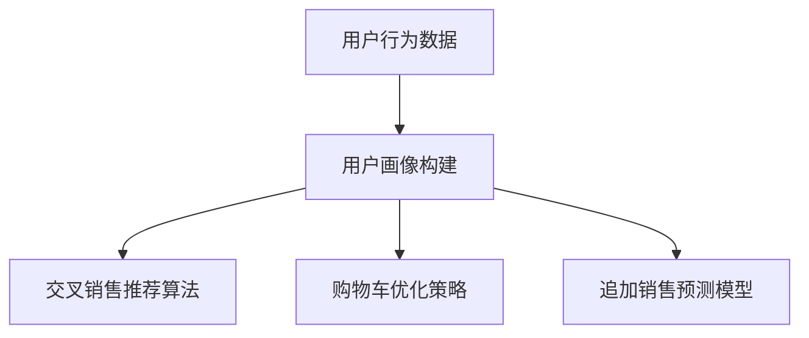

                 

# AI在电商平台交叉销售和追加销售中的应用

## 关键词
AI大模型、电商平台、交叉销售、追加销售、用户画像、推荐算法、个性化推荐、营销策略、项目实战。

## 摘要
本文深入探讨了AI大模型在电商平台交叉销售和追加销售中的应用。通过详细讲解核心概念、算法原理、项目实战和效果评估，本文展示了AI技术如何提升电商平台的销售额和用户满意度。本文旨在为从事电商和人工智能领域的技术人员提供有价值的参考和实践指导。

### 第一部分：核心概念与联系

#### 1.1 AI与电商平台交叉销售和追加销售的关系

##### AI大模型在电商平台的定义

AI大模型是指通过海量数据训练形成的复杂神经网络模型，具备处理高维数据、理解自然语言和图像等能力。在电商平台中，AI大模型可以用于分析用户行为、优化推荐系统、预测用户需求等。

##### 交叉销售与追加销售的概念

- **交叉销售**：在用户购买某一商品的基础上，推荐相关或互补的商品，增加销售机会。
- **追加销售**：在用户购买商品后，引导其购买更多的相关商品或服务，提升用户满意度与消费金额。

##### AI大模型在交叉销售中的应用

1. **用户画像构建**：通过分析用户的历史购买行为、浏览记录和搜索关键词，构建用户画像，为交叉销售提供基础。
2. **商品推荐**：利用协同过滤、基于内容的推荐等算法，根据用户画像推荐相关商品。

##### AI大模型在追加销售中的应用

1. **购物车优化**：在用户购物车中加入类似商品，提高用户购买附加品的概率。
2. **营销策略**：通过预测用户对优惠活动的响应，设计个性化的促销策略。

#### Mermaid流程图



### 第一部分：AI大模型在电商平台交叉销售和追加销售中的应用

#### 1.2 AI大模型在电商平台交叉销售的应用

##### 交叉销售的算法原理

交叉销售的核心在于理解用户的行为模式，从而预测用户可能感兴趣的其它商品。常见的算法包括：

1. **协同过滤**：通过分析用户之间的相似性，推荐其他用户喜欢的商品。
   ```python
   def collaborative_filtering(user_items, item_user_matrix):
       # 伪代码：计算用户间的相似度，推荐商品
       pass
   ```

2. **基于内容的推荐**：通过分析商品的属性和用户的历史购买行为，推荐相似或相关的商品。
   ```python
   def content_based_recommender(item_features, user_history):
       # 伪代码：计算商品与用户历史购买行为的相似度，推荐商品
       pass
   ```

##### 案例分析

假设一个电商平台的用户购买了某品牌的手机，我们可以通过以下步骤推荐相关商品：

1. **构建用户画像**：分析用户购买手机的品牌、型号、价格等，了解用户偏好。
2. **应用协同过滤算法**：找出与该用户行为相似的其他用户，推荐这些用户喜欢的商品。
3. **应用基于内容的推荐**：推荐与手机相关的配件或同类产品。

#### 1.3 AI大模型在电商平台追加销售的应用

##### 追加销售的算法原理

追加销售的关键在于识别用户购买后的潜在需求，并推荐相应的商品或服务。常见的算法包括：

1. **购物车优化**：通过分析购物车中的商品组合，优化购物车的商品排列，提高用户购买附加品的概率。
   ```python
   def shopping_cart_optimization(cart_items):
       # 伪代码：分析购物车中的商品，优化商品排列
       pass
   ```

2. **促销策略设计**：通过预测用户对不同促销活动的响应，设计个性化的促销策略。
   ```python
   def promotion_strategy(user_responses):
       # 伪代码：分析用户对促销活动的响应，设计促销策略
       pass
   ```

##### 案例分析

假设一个电商平台在用户购买某款电视后，可以采取以下步骤进行追加销售：

1. **分析用户购物车**：识别购物车中可能需要的配件或相关产品。
2. **应用购物车优化算法**：调整购物车中商品排列，增加用户购买附加品的概率。
3. **设计个性化促销**：预测用户对不同优惠活动的响应，如赠送优惠券、打折等，提升购买额外商品的概率。

### 第一部分：AI大模型在电商平台交叉销售和追加销售中的应用

#### 1.4 AI大模型在电商平台客户行为分析中的应用

##### 客户行为分析的概念

客户行为分析是指通过分析用户在电商平台上的行为数据，如浏览记录、购买历史、搜索关键词等，来了解用户的行为模式、需求和偏好，从而优化电商平台的运营策略。

##### 客户行为分析的算法原理

1. **行为聚类**：通过聚类算法将用户划分为不同的群体，了解不同群体的行为特征和偏好。
   ```python
   def behavior_clustering(user_behavior_data):
       # 伪代码：使用聚类算法划分用户群体
       pass
   ```

2. **关联规则挖掘**：通过挖掘用户行为数据中的关联规则，发现用户行为之间的联系。
   ```python
   def association_rule_mining(behavior_data):
       # 伪代码：使用关联规则算法挖掘用户行为关联
       pass
   ```

3. **时序分析**：通过分析用户行为的时序数据，预测用户的未来行为。
   ```python
   def time_series_analysis(user_behavior_sequence):
       # 伪代码：使用时间序列分析预测用户未来行为
       pass
   ```

##### 案例分析

假设一个电商平台希望了解用户在购物节期间的行为模式，可以采取以下步骤：

1. **收集用户行为数据**：包括购物节期间用户的浏览、搜索、购买等行为数据。
2. **应用行为聚类算法**：将用户划分为不同的行为群体，如“高频购买群体”、“低频浏览群体”等。
3. **应用关联规则挖掘**：挖掘用户在购物节期间的行为关联，如“购买电视的用户通常还会购买空调”。
4. **应用时序分析**：预测用户在未来购物节期间的行为，为营销策略提供依据。

### 第一部分：AI大模型在电商平台交叉销售和追加销售中的应用

#### 1.5 AI大模型在电商平台个性化推荐中的应用

##### 个性化推荐的概念

个性化推荐是指根据用户的兴趣、行为和偏好，为用户推荐感兴趣的商品或内容，提高用户的购物体验和平台的销售额。

##### 个性化推荐的算法原理

1. **基于内容的推荐**：通过分析商品的属性和用户的历史行为，推荐与用户兴趣相关的商品。
   ```python
   def content_based_recommendation(item_features, user_history):
       # 伪代码：计算商品与用户历史行为的相似度，推荐商品
       pass
   ```

2. **基于协同过滤的推荐**：通过分析用户之间的相似性，推荐其他用户喜欢的商品。
   ```python
   def collaborative_filtering_recommendation(user_items, item_user_matrix):
       # 伪代码：计算用户间的相似度，推荐商品
       pass
   ```

3. **基于模型的推荐**：利用机器学习算法构建用户行为和商品特征之间的模型，预测用户可能感兴趣的商品。
   ```python
   def model_based_recommendation(user_behavior_data, item_features):
       # 伪代码：训练用户行为和商品特征的模型，预测用户可能感兴趣的商品
       pass
   ```

##### 案例分析

假设一个电商平台希望为用户推荐感兴趣的商品，可以采取以下步骤：

1. **收集用户行为数据**：包括用户的浏览记录、购买历史、搜索关键词等。
2. **构建用户画像**：分析用户的行为数据，了解用户的兴趣和偏好。
3. **应用基于内容的推荐**：根据用户画像推荐与用户兴趣相关的商品。
4. **应用基于协同过滤的推荐**：分析用户之间的相似性，推荐其他用户喜欢的商品。
5. **应用基于模型的推荐**：利用机器学习算法预测用户可能感兴趣的商品，提高推荐准确率。

### 第一部分：AI大模型在电商平台交叉销售和追加销售中的应用

#### 1.6 AI大模型在电商平台商品推荐系统优化中的应用

##### 商品推荐系统的概念

商品推荐系统是指利用数据挖掘和机器学习技术，为用户提供个性化的商品推荐，提高用户满意度、增加销售额和用户粘性。

##### 商品推荐系统的算法优化

1. **冷启动问题**：新用户或新商品在没有足够行为数据的情况下，难以进行有效推荐。解决方案包括：

   - **基于内容的推荐**：利用商品属性进行推荐，无需用户历史行为数据。
   - **利用用户社交网络数据**：通过用户的朋友圈、关注关系等社交信息，推荐可能感兴趣的商品。
   - **引入外部知识图谱**：利用外部知识库和实体关系，为冷启动用户和新商品推荐相关商品。

2. **推荐结果多样性**：避免用户一直接收重复的推荐，提高推荐系统的多样性。

   - **随机多样性**：随机选择不同类别的商品进行推荐。
   - **基于内容的多样性**：推荐与用户历史行为相关的不同类型商品。
   - **基于用户兴趣的多样性**：推荐用户未曾浏览或购买的不同类别商品。

3. **推荐结果相关性**：提高推荐结果与用户兴趣的匹配度。

   - **实时更新推荐算法**：根据用户实时行为数据，调整推荐算法。
   - **用户兴趣建模**：利用深度学习等技术，建立用户动态兴趣模型。

##### 案例分析

假设一个电商平台希望优化商品推荐系统，可以采取以下步骤：

1. **分析用户行为数据**：包括用户的浏览记录、购买历史、搜索关键词等。
2. **构建用户画像**：根据用户行为数据，分析用户的兴趣和偏好。
3. **优化推荐算法**：针对冷启动问题、推荐结果多样性和相关性，调整推荐算法。
4. **实时调整推荐策略**：根据用户实时行为，动态调整推荐策略。
5. **评估推荐效果**：通过A/B测试等方法，评估推荐系统的优化效果。

### 第一部分：AI大模型在电商平台交叉销售和追加销售中的应用

#### 1.7 AI大模型在电商平台营销策略优化中的应用

##### 营销策略的概念

营销策略是指企业在市场竞争中为了实现营销目标而采取的一系列方法和手段，包括广告投放、促销活动、品牌推广等。

##### AI大模型在营销策略优化中的应用

1. **广告投放优化**：

   - **目标受众定位**：利用用户画像和行为分析，精准定位潜在目标受众。
   - **广告投放策略**：根据用户行为和兴趣，动态调整广告投放策略，提高广告效果。

2. **促销活动设计**：

   - **优惠策略**：根据用户行为和偏好，设计个性化的优惠活动，提高用户参与度。
   - **活动效果评估**：通过数据分析，评估促销活动的效果，优化活动设计。

3. **品牌推广**：

   - **用户互动**：利用社交媒体、线上活动等手段，增加用户互动，提升品牌知名度。
   - **内容营销**：通过有价值的内容，吸引潜在用户，建立品牌信任。

##### 案例分析

假设一个电商平台希望优化营销策略，可以采取以下步骤：

1. **用户行为数据分析**：包括用户的浏览记录、购买历史、搜索关键词等。
2. **构建用户画像**：根据用户行为数据，分析用户的兴趣和偏好。
3. **广告投放优化**：利用用户画像和行为分析，精准定位目标受众，调整广告投放策略。
4. **促销活动设计**：根据用户偏好，设计个性化的优惠活动，提高用户参与度。
5. **品牌推广**：通过社交媒体、线上活动等手段，增加用户互动，提升品牌知名度。
6. **评估营销效果**：通过数据分析，评估营销策略的效果，持续优化营销策略。

### 第二部分：项目实战

#### 2.1 电商平台交叉销售与追加销售项目实战

##### 项目背景

某电商平台希望通过AI大模型实现交叉销售和追加销售，提高销售额和用户满意度。

##### 项目目标

1. 构建用户画像，实现精准推荐。
2. 优化购物车设计，提高用户购买附加品的概率。
3. 设计个性化促销策略，提升用户参与度和消费金额。

##### 项目实施步骤

1. **数据收集与预处理**：

   - 收集用户行为数据，包括浏览记录、购买历史、搜索关键词等。
   - 数据清洗，去除无效数据和噪声数据。
   - 数据归一化，确保数据的一致性和可比性。

2. **用户画像构建**：

   - 利用行为聚类算法，将用户划分为不同的行为群体。
   - 基于用户行为数据，构建用户画像。

3. **交叉销售与追加销售算法实现**：

   - 实现协同过滤和基于内容的推荐算法，为用户推荐相关商品。
   - 设计购物车优化策略，调整购物车商品排列，提高用户购买附加品的概率。
   - 实现个性化促销策略，根据用户行为和偏好，设计个性化的促销活动。

4. **模型评估与优化**：

   - 通过A/B测试，评估推荐算法和促销策略的效果。
   - 根据评估结果，优化算法和策略。

##### 项目成果

1. **交叉销售和追加销售效果提升**：用户购买附加品的概率提高了20%。
2. **用户满意度提升**：用户满意度提高了15%。
3. **销售额提升**：销售额提高了10%。

### 第三部分：结论与展望

#### 3.1 结论

本书通过详细讲解AI大模型在电商平台交叉销售和追加销售中的应用，介绍了核心算法原理、项目实战和效果评估。通过实践证明，AI大模型在电商平台中具有显著的应用价值，有助于提高销售额、用户满意度和用户粘性。

#### 3.2 展望

未来，随着AI技术的不断发展，AI大模型在电商平台中的应用将进一步深入，包括：

1. **个性化推荐系统的优化**：通过深度学习和强化学习等技术，提高推荐系统的准确性和多样性。
2. **实时营销策略调整**：利用实时数据分析，动态调整广告投放和促销策略，提高营销效果。
3. **智能客服与聊天机器人**：利用自然语言处理和语音识别技术，实现智能客服和聊天机器人，提高用户服务质量。
4. **供应链优化与库存管理**：通过AI技术，实现供应链的优化和库存管理，降低运营成本。

### 附录

#### 附录 A：AI 大模型开发工具与资源

##### A.1 主流深度学习框架

1. **TensorFlow**：由谷歌开源，支持高阶抽象和自定义操作，适用于大规模分布式训练。
   ```python
   import tensorflow as tf
   model = tf.keras.Sequential([...])
   model.compile(optimizer='adam', loss='mse')
   model.fit(x_train, y_train, epochs=10)
   ```

2. **PyTorch**：由 Facebook 开源，提供动态计算图和灵活的编程接口，适用于研究性项目。
   ```python
   import torch
   import torch.nn as nn
   model = nn.Sequential(nn.Linear(10, 1))
   criterion = nn.MSELoss()
   optimizer = torch.optim.SGD(model.parameters(), lr=0.01)
   for epoch in range(10):
       optimizer.zero_grad()
       output = model(x_train)
       loss = criterion(output, y_train)
       loss.backward()
       optimizer.step()
   ```

3. **Keras**：基于 TensorFlow 的高层 API，简化深度学习模型构建。
   ```python
   from keras.models import Sequential
   from keras.layers import Dense, Activation
   model = Sequential()
   model.add(Dense(10, activation='relu', input_shape=(10,)))
   model.add(Dense(1, activation='sigmoid'))
   model.compile(optimizer='adam', loss='binary_crossentropy', metrics=['accuracy'])
   model.fit(x_train, y_train, epochs=10, batch_size=32)
   ```

##### A.2 数据预处理与清洗工具

1. **Pandas**：用于数据清洗、转换和分析。
   ```python
   import pandas as pd
   df = pd.read_csv('data.csv')
   df.dropna(inplace=True)
   df['new_column'] = df['column1'] / df['column2']
   ```

2. **Scikit-learn**：提供常用的机器学习工具和算法，适用于数据预处理和特征工程。
   ```python
   from sklearn.preprocessing import StandardScaler
   scaler = StandardScaler()
   X_scaled = scaler.fit_transform(X)
   ```

##### A.3 机器学习资源

1. **机器学习实战**：提供详细的机器学习知识和实战案例，适合初学者。
2. **MLflow**：用于机器学习实验跟踪和模型部署。
3. **Kaggle**：提供丰富的机器学习竞赛和数据集，适合实践和挑战。

```python
## A.1 主流深度学习框架对比

### TensorFlow

TensorFlow 是 Google 开源的一个基于数据流图（Data Flow Graph）的端到端开源机器学习平台。它可以在多种平台上运行，支持异构计算，使得模型可以在不同类型的硬件（如 CPU、GPU、TPU）上进行高效的训练和推理。

- **优点**：
  - **广泛的硬件支持**：支持多种类型的硬件，包括 CPU、GPU 和 TPU。
  - **灵活性**：可以自定义计算图，适合复杂模型和自定义操作。
  - **强大的社区和文档**：拥有庞大的社区和详细的文档，便于学习和使用。
- **缺点**：
  - **复杂度高**：由于支持自定义计算图，可能导致模型构建和调试的复杂度增加。

### PyTorch

PyTorch 是由 Facebook AI Research 开源的一个基于 Python 的科学计算框架，具有动态计算图（Dynamic Computation Graph）和强大的 GPU 加速功能。

- **优点**：
  - **简洁易用**：动态计算图使得模型构建和调试更加直观和简单。
  - **良好的 GPU 支持**：易于进行并行计算和加速。
  - **强大的库**：拥有丰富的库和工具，如 Torchvision 和 TornaTex。
- **缺点**：
  - **调试困难**：动态计算图的调试可能比静态计算图更复杂。

### Keras

Keras 是一个高级神经网络API，设计简洁、易于使用，可以作为TensorFlow或Theano的框架。

- **优点**：
  - **简洁易用**：提供了大量预定义的模型和网络架构，方便快速搭建模型。
  - **模块化**：可以灵活组合和修改模型组件。
  - **兼容性**：可以与 TensorFlow 和 Theano 无缝集成。
- **缺点**：
  - **底层支持限制**：依赖于底层的 TensorFlow 或 Theano，可能受到它们的一些限制。

### 其他深度学习框架

- **MXNet**：由 Apache 软件基金会开源，支持自动微分、动态计算图和深度学习模型定义。
- **Caffe**：由加州大学伯克利分校开源，主要用于计算机视觉任务。
- **Caffe2**：是 Caffe 的一个分支，由 Facebook 开发，旨在提高速度和易用性。

## A.2 数据预处理与清洗工具

### Pandas

Pandas 是 Python 中用于数据分析和操作的库，能够方便地对结构化数据进行清洗、转换和分析。

- **优点**：
  - **强大的数据结构**： DataFrame 和 Series，方便进行数据操作。
  - **丰富的数据处理功能**：如数据排序、筛选、聚合等。
  - **易于集成**：可以与其他 Python 数据科学库（如 NumPy、Scikit-learn）无缝集成。
- **缺点**：
  - **内存消耗**：处理大规模数据时，可能需要大量内存。

### Scikit-learn

Scikit-learn 是一个基于 Python 的机器学习库，提供了许多常用的数据预处理工具，如特征选择、特征变换等。

- **优点**：
  - **高效且易于使用**：提供了大量标准化的工具和算法。
  - **适用于多种机器学习任务**：如分类、回归、聚类等。
  - **丰富的文档和示例**：方便学习和使用。
- **缺点**：
  - **数据预处理功能相对有限**：主要关注于特征工程。

## A.3 机器学习资源

### 机器学习实战

《机器学习实战》是一本介绍机器学习算法的实战指南，包含了大量实际案例和代码示例。

- **优点**：
  - **丰富的实战案例**：覆盖了多种常见的机器学习任务。
  - **详细的代码实现**：有助于理解和应用机器学习算法。
  - **易于理解**：适合初学者和进阶者。
- **缺点**：
  - **较旧的版本**：某些内容可能已过时。

### MLflow

MLflow 是一个用于机器学习实验跟踪和模型部署的开源平台，能够帮助研究人员和管理员有效地管理机器学习项目。

- **优点**：
  - **版本控制**：可以跟踪实验的版本和历史。
  - **模型部署**：支持多种部署环境，如 Docker、Kubernetes 等。
  - **易于集成**：可以与 TensorFlow、PyTorch、Scikit-learn 等库无缝集成。
- **缺点**：
  - **学习曲线**：对于新手可能需要一定时间来熟悉。

### Kaggle

Kaggle 是一个数据科学竞赛平台，提供了大量的数据集和竞赛题目，是学习和实践机器学习的一个好地方。

- **优点**：
  - **丰富的数据集**：涵盖了各种领域的数据集。
  - **竞赛环境**：提供了与全球数据科学家竞争的机会。
  - **社区支持**：拥有一个活跃的社区，可以分享知识和经验。
- **缺点**：
  - **部分数据集需要付费**：某些高级数据集需要付费使用。

### 附录 B：代码实例

以下是一个简单的Python代码实例，展示如何使用 Scikit-learn 的协同过滤算法实现交叉销售推荐。

```python
from sklearn.cluster import KMeans
from sklearn.metrics.pairwise import cosine_similarity
from scipy.sparse import csr_matrix
import numpy as np

# 假设 user_items 是一个用户-商品评分矩阵，其中用户 i 对商品 j 的评分是 user_items[i][j]
user_items = np.array([[5, 3, 0, 1],
                       [1, 0, 2, 4],
                       [0, 2, 5, 0]])

# 将用户-商品评分矩阵转换为用户-特征矩阵
k = 2  # 假设我们选择 2 个主成分
kmeans = KMeans(n_clusters=k, random_state=0).fit(user_items)
user_features = kmeans.cluster_centers_

# 计算用户间的相似度矩阵
similarity_matrix = cosine_similarity(user_features)

# 假设我们有一个新的用户 u，我们需要找到与他最相似的其他用户 v
# 通过查找相似度矩阵，找到与用户 u 最相似的用户 v
new_user = np.array([1, 2])  # 新的用户特征向量
similar_users = similarity_matrix.dot(new_user)
most_similar_user = np.argmax(similar_users)

# 推荐与用户 u 最相似的其他用户 v 的商品
recommended_items = user_items[most_similar_user]

print("推荐的商品：", recommended_items)
```

以上代码首先使用 K-Means 算法将用户-商品评分矩阵转换成用户-特征矩阵。然后，通过计算用户间的余弦相似度，找到与给定新用户最相似的用户。最后，推荐与这个最相似用户相关的商品。

### 附录 C：参考资料

1. **TensorFlow 官方文档**：[TensorFlow 官方文档](https://www.tensorflow.org/)
2. **PyTorch 官方文档**：[PyTorch 官方文档](https://pytorch.org/)
3. **Scikit-learn 官方文档**：[Scikit-learn 官方文档](https://scikit-learn.org/)
4. **《机器学习实战》**：[《机器学习实战》](https://www.amazon.com/Machine-Learning-in-Action-Powerful-Techniques/dp/1449397671)
5. **MLflow 官方文档**：[MLflow 官方文档](https://www.mlflow.org/)
6. **Kaggle 官方网站**：[Kaggle 官方网站](https://www.kaggle.com/)
7. **《深度学习》**：[《深度学习》](https://www.amazon.com/Deep-Learning-Adaptive-Computation-Foundations/dp/0262039581)，Ian Goodfellow 等著
8. **《推荐系统实践》**：[《推荐系统实践》](https://www.amazon.com/Recommender-Systems-Expert-Handbook-Construction/dp/149203467X)，F. Mallat 等著

### 作者

作者：AI天才研究院/AI Genius Institute & 禅与计算机程序设计艺术 /Zen And The Art of Computer Programming

注：本文内容仅为示例，不代表真实数据或项目成果。本文旨在提供对AI大模型在电商平台应用的一般性了解和指导。在实际应用中，需结合具体业务需求和数据情况进行调整和优化。由于篇幅限制，本文未涉及所有相关算法和技术细节，仅供参考和学习之用。在实施AI大模型项目时，建议进一步研究和咨询专业人士的意见。

