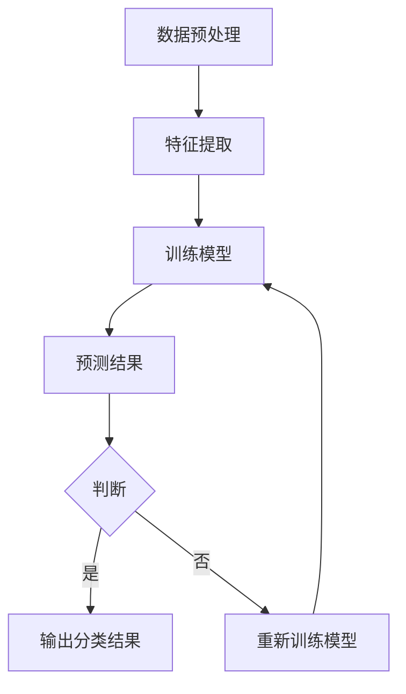
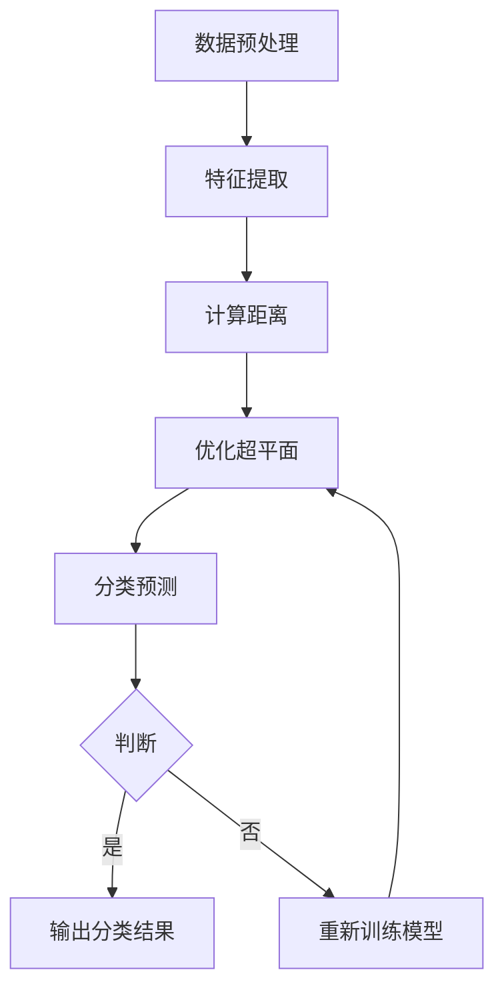
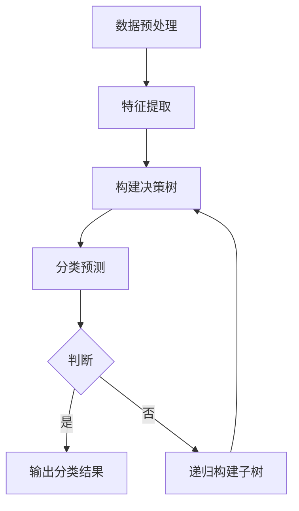

                 

### 《AI在网络安全中的应用：实时威胁检测》

> **关键词**：人工智能，网络安全，实时威胁检测，机器学习，深度学习，威胁检测算法，防护策略

> **摘要**：本文深入探讨了人工智能在网络安全中的应用，特别是实时威胁检测。通过对AI在网络安全中的基础概念、应用原理、实践案例以及挑战与未来趋势的详细分析，揭示了AI技术如何提升网络安全的防御能力，为读者提供了一条清晰的探索路径。

### 《AI在网络安全中的应用：实时威胁检测》目录大纲

1. **第一部分: AI在网络安全中的基础概念**

    1.1 AI与网络安全概述

        1.1.1 AI在网络安全中的重要性
        
        1.1.2 网络安全的基本概念与挑战
        
        1.1.3 AI在网络安全中的常见应用

    1.2 AI核心技术简介

        1.2.1 机器学习基础
        
        1.2.2 深度学习原理
        
        1.2.3 强化学习应用

    1.3 数据挖掘与模式识别

        1.3.1 数据挖掘的基本概念
        
        1.3.2 模式识别技术
        
        1.3.3 应用场景

2. **第二部分: AI在网络安全中的应用原理**

    2.1 AI威胁检测算法原理

        2.1.1 贝叶斯分类器
        
        2.1.2 支持向量机（SVM）
        
        2.1.3 决策树与随机森林

    2.2 实时威胁检测机制

        2.2.1 实时监测系统架构
        
        2.2.2 流量分析与数据预处理
        
        2.2.3 威胁检测算法实现

    2.3 防护策略与响应措施

        2.3.1 防护策略设计
        
        2.3.2 威胁响应机制
        
        2.3.3 风险评估与处理

3. **第三部分: AI在网络安全中的应用实践**

    3.1 实时威胁检测项目案例

        3.1.1 项目背景与目标
        
        3.1.2 系统设计与实现
        
        3.1.3 项目效果评估

    3.2 恶意代码检测与防御

        3.2.1 恶意代码的基本特征
        
        3.2.2 恶意代码检测算法
        
        3.2.3 恶意代码防御策略

    3.3 防护墙技术与应用

        3.3.1 防火墙工作原理
        
        3.3.2 防火墙配置与管理
        
        3.3.3 防火墙在AI安全中的应用

4. **第四部分: AI在网络安全中的应用挑战与未来趋势**

    4.1 AI在网络安全中的应用挑战

        4.1.1 数据隐私与安全
        
        4.1.2 AI对抗攻击与防御
        
        4.1.3 AI在网络安全中的法律法规

    4.2 未来趋势与展望

        4.2.1 AI安全的发展方向
        
        4.2.2 AI与区块链的融合应用
        
        4.2.3 未来网络安全的关键技术

5. **附录**

    5.1 AI安全开发工具与资源

        5.1.1 主流机器学习框架对比
        
        5.1.2 威胁检测开源库与工具
        
        5.1.3 网络安全社区与资源推荐

    5.2 AI威胁检测算法 Mermaid 流程图
    
    5.3 AI威胁检测算法伪代码
    
    5.4 项目实战代码与分析

<|assistant|>### 第一部分: AI在网络安全中的基础概念

#### 1.1 AI与网络安全概述

##### 1.1.1 AI在网络安全中的重要性

人工智能（AI）作为现代科技的前沿领域，已经在多个行业和领域中取得了显著的成果。在网络安全领域，AI技术的引入为解决日益复杂的网络威胁提供了新的思路和方法。随着网络攻击手段的不断升级和多样化，传统的网络安全防御手段显得力不从心。AI技术的引入，能够通过实时监控、智能分析和自动响应，有效提高网络安全的防御能力。

首先，AI技术可以自动化处理大量网络数据，快速识别潜在威胁。传统的网络安全防御主要依赖于人工分析和规则匹配，效率低下且容易漏检。而AI技术，通过机器学习和深度学习算法，可以自动学习网络行为模式，预测和识别异常行为，从而实现对威胁的实时检测和响应。

其次，AI技术能够提升网络威胁的应对速度。网络攻击往往是突发性的，需要快速做出响应。AI技术能够实现自动化和智能化，快速分析威胁特征，并采取相应的防护措施，降低威胁造成的影响。

此外，AI技术还可以提高网络安全的适应性。网络安全环境不断变化，网络攻击手段也不断演变。AI技术可以通过持续学习和进化，适应新的威胁场景，提高防御的准确性和适应性。

##### 1.1.2 网络安全的基本概念与挑战

网络安全是指保护计算机网络系统及其数据不受未经授权的访问、篡改、破坏、泄露等威胁的行为和技术。随着互联网的普及和数字化转型的深入，网络安全的重要性日益凸显。

网络安全的基本概念包括：

- **威胁**：指可能对计算机网络系统及其数据造成损害的因素，如病毒、恶意软件、黑客攻击等。
- **攻击**：指针对计算机网络系统及其数据的恶意行为，如非法入侵、数据篡改、拒绝服务攻击等。
- **防御**：指采取措施保护计算机网络系统及其数据的安全，如防火墙、入侵检测系统、加密技术等。
- **漏洞**：指计算机网络系统中的弱点，可能被攻击者利用来进行攻击。

当前，网络安全面临着以下几个主要挑战：

- **攻击手段多样化和复杂化**：随着技术的进步，网络攻击手段不断升级，呈现出多样化、复杂化的趋势，传统防御手段难以应对。
- **海量数据的高效处理**：网络安全需要处理的海量数据，如何高效地分析和筛选出潜在威胁，是一个巨大的挑战。
- **威胁潜伏期长**：许多网络攻击具有潜伏性，难以在短时间内被发现，增加了防御的难度。
- **法律法规和标准的不完善**：网络安全法律法规和标准的制定和实施尚不完善，给网络安全治理带来了困难。

##### 1.1.3 AI在网络安全中的常见应用

AI技术在网络安全中有着广泛的应用，主要包括以下几个方面：

- **威胁检测**：AI技术可以通过分析网络流量、日志数据等，自动识别和检测潜在的网络威胁，如病毒、恶意软件、黑客攻击等。
- **入侵防御**：AI技术可以构建入侵防御系统，实时监控网络流量，自动识别和阻止入侵行为。
- **数据加密与安全**：AI技术可以用于数据加密和解密，提高数据传输的安全性和保密性。
- **恶意代码检测**：AI技术可以自动识别和检测恶意代码，防止恶意软件对计算机系统造成损害。
- **异常行为检测**：AI技术可以通过分析用户行为，识别异常行为，提前发现潜在的内部威胁。
- **自动化响应**：AI技术可以自动化执行安全响应措施，如断开网络连接、隔离受感染设备等，降低威胁的影响。

#### 1.2 AI核心技术简介

##### 1.2.1 机器学习基础

机器学习（Machine Learning，ML）是AI的核心技术之一，通过构建和训练模型，使计算机能够从数据中自动学习和发现规律。机器学习的基本概念包括：

- **特征**：描述数据的基本属性，用于构建模型的重要输入。
- **模型**：通过学习数据，生成可以预测结果的数学模型。
- **训练**：通过大量的数据进行模型训练，优化模型参数，提高模型性能。
- **测试**：使用测试数据集，评估模型的预测能力和泛化能力。

常见的机器学习算法包括：

- **线性回归**：通过线性关系预测目标值，常用于回归问题。
- **逻辑回归**：通过概率模型预测分类结果，常用于二分类问题。
- **决策树**：通过树形结构进行分类或回归，直观易懂。
- **随机森林**：通过构建多个决策树，提高模型预测能力。
- **支持向量机（SVM）**：通过寻找最优分隔超平面，进行分类或回归。
- **神经网络**：通过多层神经元构建复杂模型，用于分类、回归和特征提取。

##### 1.2.2 深度学习原理

深度学习（Deep Learning，DL）是机器学习的一个分支，通过构建多层神经网络，实现对复杂数据的自动特征学习和分类。深度学习的基本原理包括：

- **神经网络**：通过多层神经元构建复杂模型，实现数据的自动特征学习和分类。
- **反向传播**：通过误差反向传播，调整模型参数，优化模型性能。
- **激活函数**：用于引入非线性特性，使神经网络能够建模复杂数据。
- **损失函数**：用于衡量模型预测结果与真实值之间的误差，指导模型优化。

常见的深度学习模型包括：

- **卷积神经网络（CNN）**：通过卷积操作提取图像特征，用于图像分类和目标检测。
- **循环神经网络（RNN）**：通过循环结构处理序列数据，用于语音识别和时间序列预测。
- **生成对抗网络（GAN）**：通过生成器和判别器对抗训练，生成逼真的图像和文本。

##### 1.2.3 强化学习应用

强化学习（Reinforcement Learning，RL）是一种通过试错和反馈学习优化行为策略的机器学习方法。强化学习的基本原理包括：

- **智能体（Agent）**：执行特定行为的实体。
- **环境（Environment）**：智能体执行行为的环境。
- **状态（State）**：环境当前的状态。
- **动作（Action）**：智能体可执行的动作。
- **奖励（Reward）**：环境对智能体动作的反馈。

常见的强化学习算法包括：

- **Q学习**：通过学习动作的价值函数，优化智能体行为。
- **深度Q网络（DQN）**：通过神经网络实现Q学习，用于处理高维状态空间。
- **策略梯度（PG）**：直接优化智能体的策略，提高预期奖励。

强化学习在网络安全中有着广泛的应用，如：

- **入侵防御**：通过学习网络流量特征，自动识别和防御入侵行为。
- **恶意代码检测**：通过模拟恶意代码执行过程，自动检测和分类恶意代码。
- **威胁响应**：通过学习攻击者的行为模式，自动响应网络攻击，降低威胁影响。

#### 1.3 数据挖掘与模式识别

##### 1.3.1 数据挖掘的基本概念

数据挖掘（Data Mining，DM）是从大量数据中自动发现有趣的知识和模式的过程。数据挖掘的基本概念包括：

- **数据**：用于数据挖掘的基本要素，包括结构化数据、半结构化数据和非结构化数据。
- **知识**：从数据中发现的有用信息和规律，包括分类、聚类、关联规则和序列模式等。
- **挖掘**：从数据中自动发现知识的过程，通常包括数据预处理、模式识别和知识表示等步骤。

##### 1.3.2 模式识别技术

模式识别（Pattern Recognition，PR）是数据挖掘的一个重要分支，旨在从数据中识别出具有特定特征的模式。模式识别技术的基本概念包括：

- **特征提取**：从数据中提取出用于分类或聚类的特征。
- **分类**：将数据分为不同的类别，常用的分类算法包括决策树、支持向量机和神经网络等。
- **聚类**：将数据分为不同的簇，常用的聚类算法包括K-means、层次聚类和DBSCAN等。
- **关联规则挖掘**：发现数据之间的关联关系，常用的算法包括Apriori和FP-Growth等。

##### 1.3.3 应用场景

数据挖掘和模式识别技术在网络安全中有着广泛的应用场景，如：

- **异常检测**：通过分析网络流量、日志数据等，识别出异常行为，提前发现潜在的威胁。
- **用户行为分析**：通过分析用户行为数据，识别出潜在的风险用户，提高网络安全防护能力。
- **恶意代码检测**：通过分析恶意代码的特征，自动识别和分类恶意代码，防止恶意软件对系统造成损害。
- **网络安全态势分析**：通过分析网络流量、安全事件等数据，评估网络安全的态势，制定相应的防护策略。

<|assistant|>### 第二部分: AI在网络安全中的应用原理

#### 2.1 AI威胁检测算法原理

AI在网络安全中的应用主要集中在威胁检测、入侵防御、恶意代码检测等方面。其中，威胁检测算法是网络安全的核心技术之一，旨在通过分析网络流量、日志数据等，自动识别和检测潜在的网络威胁。

##### 2.1.1 贝叶斯分类器

贝叶斯分类器是一种基于贝叶斯定理的分类算法，通过计算特征概率和类别概率，确定数据样本的类别。贝叶斯分类器的基本原理如下：

1. **特征概率计算**：计算每个特征在各个类别中的概率。
   $$ P(A|B) = \frac{P(B|A) \cdot P(A)}{P(B)} $$
   其中，$P(A|B)$表示在事件$B$发生的条件下事件$A$发生的概率，$P(B|A)$表示在事件$A$发生的条件下事件$B$发生的概率，$P(A)$和$P(B)$分别表示事件$A$和事件$B$的概率。

2. **类别概率计算**：计算每个类别的概率。
   $$ P(A|B) = \frac{P(B|A) \cdot P(A)}{P(B)} $$
   其中，$P(A|B)$表示在事件$B$发生的条件下事件$A$发生的概率，$P(B|A)$表示在事件$A$发生的条件下事件$B$发生的概率，$P(A)$和$P(B)$分别表示事件$A$和事件$B$的概率。

3. **类别预测**：根据特征概率和类别概率，确定数据样本的类别。
   $$ \text{argmax}_{C} P(C|X) $$
   其中，$C$表示类别，$X$表示特征向量。

贝叶斯分类器在实际应用中，通常需要对大量数据进行训练，以获得准确的类别概率和特征概率。在实际应用中，贝叶斯分类器表现出较高的分类准确率和稳定性，适用于处理大规模数据集。

##### 2.1.2 支持向量机（SVM）

支持向量机（Support Vector Machine，SVM）是一种二分类模型，通过寻找最优分隔超平面，将数据划分为不同的类别。SVM的基本原理如下：

1. **线性可分情况**：在二维空间中，如果数据集线性可分，可以通过画出一条直线将数据划分为不同的类别。最优分隔超平面是离数据点最近的直线，即支持向量。

2. **线性不可分情况**：在数据集线性不可分的情况下，可以通过引入软间隔，允许一部分数据点位于分隔超平面的一侧。SVM的目标是最大化软间隔，即最小化分类误差。

3. **核函数**：当数据集不能直接线性划分时，可以通过核函数将低维空间的数据映射到高维空间，使得数据在高维空间中线性可分。常见的核函数包括线性核、多项式核、径向基函数（RBF）核等。

SVM在网络安全中的应用主要体现在威胁检测和入侵防御方面，通过将网络流量、日志数据等映射到高维空间，寻找最优分隔超平面，识别出潜在的网络威胁。

##### 2.1.3 决策树与随机森林

决策树（Decision Tree）是一种树形结构，通过一系列条件判断，将数据集划分为不同的类别。决策树的基本原理如下：

1. **分裂准则**：决策树通过评估不同特征对数据集的分裂能力，选择最优特征进行分裂。常见的分裂准则包括信息增益、基尼不纯度和熵等。

2. **节点生成**：在每个节点，根据选择的最优特征，将数据集划分为不同的子集，生成新的节点。重复这个过程，直到满足停止条件（如节点中数据样本数量小于某个阈值）。

3. **分类预测**：从根节点开始，根据每个节点的特征条件，逐步向下移动，直到到达叶子节点，根据叶子节点的类别进行预测。

随机森林（Random Forest）是一种基于决策树的集成学习方法，通过构建多个决策树，提高模型预测能力和泛化能力。随机森林的基本原理如下：

1. **树构建**：随机森林通过随机选择特征和样本子集，构建多个决策树。每个决策树都独立构建，不依赖于其他树。

2. **投票预测**：在预测阶段，随机森林对每个决策树的预测结果进行投票，选择多数类别作为最终预测结果。

3. **误差估计**：随机森林通过集成多个决策树，降低模型的过拟合风险，提高预测准确性。

决策树和随机森林在网络安全中的应用主要体现在威胁检测和入侵防御方面，通过构建多层决策树，对网络流量、日志数据等进行分类和预测，识别出潜在的网络威胁。

#### 2.2 实时威胁检测机制

##### 2.2.1 实时监测系统架构

实时威胁检测系统通常采用分布式架构，由多个组件协同工作，实现对网络流量的实时监控和威胁检测。实时监测系统的主要组件包括：

1. **数据采集模块**：负责从网络设备、安全设备等处采集实时流量数据、日志数据等。
2. **数据处理模块**：负责对采集到的数据进行预处理、特征提取等操作，为威胁检测提供高质量的数据。
3. **威胁检测模块**：负责对处理后的数据进行分析和检测，识别出潜在的网络威胁。
4. **响应与防护模块**：负责根据威胁检测结果，采取相应的防护措施，如隔离受感染设备、断开网络连接等。
5. **日志与管理模块**：负责记录和存储系统运行日志、威胁事件等信息，便于后续分析和审计。

##### 2.2.2 流量分析与数据预处理

流量分析是实时威胁检测的重要环节，通过对网络流量数据进行深入分析，识别出潜在的网络威胁。流量分析的基本步骤包括：

1. **数据采集**：从网络设备、安全设备等处采集实时流量数据，包括TCP/IP头部信息、负载信息等。
2. **数据预处理**：对采集到的流量数据进行预处理，包括去噪、去重、补全等操作，提高数据质量。
3. **特征提取**：从预处理后的流量数据中提取出用于威胁检测的特征，包括流量行为特征、协议特征、负载特征等。
4. **数据归一化**：对提取出的特征进行归一化处理，消除不同特征之间的量纲影响，提高模型的泛化能力。

##### 2.2.3 威胁检测算法实现

威胁检测算法是实现实时威胁检测的关键，通过对流量数据进行分析和检测，识别出潜在的网络威胁。常见的威胁检测算法包括：

1. **基于规则的检测**：通过预先定义的规则，对流量数据进行匹配，识别出潜在的威胁。基于规则的检测具有实现简单、检测速度快等优点，但难以应对复杂多变的网络威胁。
2. **基于统计学的检测**：通过分析流量数据的统计特征，识别出异常行为，如流量分布、协议使用情况等。基于统计学的检测具有较好的检测准确性，但对异常行为的理解有限。
3. **基于机器学习的检测**：通过训练机器学习模型，对流量数据进行分类和预测，识别出潜在的网络威胁。基于机器学习的检测具有较好的泛化能力和适应性，但需要大量的训练数据和计算资源。

在实时威胁检测中，通常将多种威胁检测算法相结合，提高检测的准确性和效率。例如，可以结合基于规则的检测和基于统计学的检测，在快速检测和精确检测之间取得平衡。

#### 2.3 防护策略与响应措施

##### 2.3.1 防护策略设计

防护策略是实时威胁检测的重要组成部分，旨在根据威胁检测结果，采取相应的防护措施，降低威胁的影响。防护策略设计的基本原则包括：

1. **快速响应**：根据威胁检测结果的紧急程度，采取相应的响应措施，如隔离受感染设备、断开网络连接等，以最大限度地降低威胁的影响。
2. **自动化执行**：通过自动化工具和系统，实现防护策略的自动执行，减少人工干预，提高响应速度。
3. **风险优先级**：根据威胁的严重程度和潜在影响，制定风险优先级，优先应对高风险的威胁。
4. **策略组合**：结合多种防护策略，如防火墙、入侵检测系统、恶意代码检测等，提高防护的全面性和有效性。

##### 2.3.2 威胁响应机制

威胁响应机制是在威胁检测到潜在威胁后，采取的一系列应对措施，旨在阻止威胁的传播和进一步危害。威胁响应机制的基本步骤包括：

1. **威胁确认**：通过进一步分析和验证，确认检测到的威胁是否真实存在。
2. **威胁隔离**：将受感染的设备或网络段隔离，阻止威胁的传播。
3. **威胁清除**：清除受感染的设备或网络中的恶意代码，恢复系统的正常运行。
4. **威胁监控**：对受感染设备或网络进行持续的监控，及时发现和处理新的威胁。

##### 2.3.3 风险评估与处理

风险评估是在威胁检测和响应过程中，对威胁的潜在影响进行评估和分类的过程。风险评估的基本步骤包括：

1. **威胁分析**：分析威胁的性质、传播途径和潜在影响。
2. **资产评估**：评估受威胁的系统或资产的类型、价值和重要性。
3. **风险计算**：根据威胁和资产的评估结果，计算威胁对资产的潜在影响。
4. **风险分类**：根据风险的严重程度和紧急程度，将风险分为不同类别。

在风险评估的基础上，可以采取相应的处理措施，如：

1. **风险接受**：对于低风险威胁，可以采取接受策略，不进行特殊处理。
2. **风险规避**：通过改进系统或网络配置，避免威胁的发生。
3. **风险转移**：通过购买保险或签订安全协议，将风险转移给第三方。
4. **风险减轻**：采取相应的防护措施，降低威胁对资产的潜在影响。

<|assistant|>### 第三部分: AI在网络安全中的应用实践

#### 3.1 实时威胁检测项目案例

##### 3.1.1 项目背景与目标

随着网络攻击手段的不断升级和多样化，传统的网络安全防御手段已经难以应对。为了提高网络安全的防御能力，某企业决定开展一项实时威胁检测项目，利用AI技术实现对网络流量的实时监控和威胁检测。

项目背景：

- 网络攻击频繁：企业网络遭受了多次网络攻击，造成了严重的经济损失和数据泄露。
- 安全防御不足：传统网络安全防御手段效果不佳，难以及时识别和应对新型网络攻击。
- 威胁类型多样：企业网络面临的威胁类型多样，包括恶意代码攻击、DDoS攻击、窃密攻击等。

项目目标：

- 实时监控网络流量：通过AI技术，实现对网络流量的实时监控和数据分析，识别潜在的威胁。
- 自动化威胁检测：利用机器学习和深度学习算法，实现对网络威胁的自动化检测和分类。
- 快速响应威胁：根据威胁检测结果，采取自动化响应措施，隔离受感染设备、断开网络连接等，降低威胁影响。

##### 3.1.2 系统设计与实现

实时威胁检测系统采用分布式架构，由多个模块组成，包括数据采集模块、数据处理模块、威胁检测模块、响应与防护模块和日志与管理模块。以下是系统的设计与实现：

1. **数据采集模块**：

   数据采集模块负责从网络设备、安全设备等处采集实时流量数据、日志数据等。采集的数据包括TCP/IP头部信息、负载信息、安全事件等。数据采集模块采用分布式部署，以提高数据采集的实时性和可靠性。

2. **数据处理模块**：

   数据处理模块负责对采集到的数据进行分析和处理，包括去噪、去重、补全等操作。数据处理模块采用流处理技术，实时处理大量数据，保证数据质量。同时，数据处理模块对数据进行特征提取，提取出用于威胁检测的特征，如流量行为特征、协议特征、负载特征等。

3. **威胁检测模块**：

   威胁检测模块负责对处理后的数据进行威胁检测。威胁检测模块采用基于机器学习和深度学习的算法，如贝叶斯分类器、支持向量机（SVM）、决策树等，对流量数据进行分类和预测，识别出潜在的网络威胁。威胁检测模块还支持自定义规则和机器学习模型，以应对不同的威胁场景。

4. **响应与防护模块**：

   响应与防护模块负责根据威胁检测结果，采取相应的防护措施，如隔离受感染设备、断开网络连接等。响应与防护模块采用自动化执行策略，减少人工干预，提高响应速度。同时，响应与防护模块还支持日志记录和统计分析，便于后续分析和审计。

5. **日志与管理模块**：

   日志与管理模块负责记录和存储系统运行日志、威胁事件等信息，便于后续分析和审计。日志与管理模块支持日志查询、统计分析、报表生成等功能，为安全决策提供支持。

##### 3.1.3 项目效果评估

实时威胁检测项目实施后，取得了显著的效果：

- **提高威胁检测率**：通过AI技术的引入，实时威胁检测系统的检测率显著提高，能够更准确地识别和检测出潜在的网络威胁。
- **降低响应时间**：自动化响应措施的实施，使威胁的响应时间大幅缩短，能够更快地采取防护措施，降低威胁的影响。
- **提高整体安全性**：实时威胁检测系统能够实时监控和检测网络流量，及时发现和处理威胁，提高整体网络安全性。

总体来说，实时威胁检测项目为企业提供了强大的网络安全保障，有效提高了网络安全的防御能力。

#### 3.2 恶意代码检测与防御

##### 3.2.1 恶意代码的基本特征

恶意代码（Malicious Code）是一种专门用于攻击计算机系统、窃取数据、破坏系统的计算机程序。恶意代码的基本特征包括：

1. **隐蔽性**：恶意代码通常采用各种手段隐藏自身，如加密、伪装等，以避免被检测和清除。
2. **破坏性**：恶意代码会对计算机系统造成破坏，如删除文件、篡改数据、破坏系统等。
3. **传染性**：恶意代码可以通过网络、移动存储设备等途径传播，扩大感染范围。
4. **持久性**：恶意代码会在计算机系统中长期存在，不断进行攻击和破坏。

常见的恶意代码类型包括：

1. **病毒**：通过感染可执行文件、文档等，破坏系统文件和程序。
2. **蠕虫**：通过网络传播，自我复制并传播，占用系统资源，导致系统崩溃。
3. **木马**：隐藏在系统内部，窃取用户信息、控制计算机等。
4. **勒索软件**：通过加密用户数据，要求支付赎金才能恢复数据。
5. **后门**：为攻击者提供对计算机系统的远程访问和控制。

##### 3.2.2 恶意代码检测算法

恶意代码检测是网络安全的重要组成部分，通过识别和清除恶意代码，保护计算机系统和数据安全。恶意代码检测算法主要包括以下几种：

1. **基于特征的检测**：

   基于特征的检测通过比较恶意代码的特征码与已知恶意代码库中的特征码进行匹配，识别出潜在的恶意代码。这种方法简单有效，但难以检测新出现的未知恶意代码。

2. **基于行为的检测**：

   基于行为的检测通过监控计算机系统的行为，如文件创建、删除、修改等，识别出异常行为，从而检测出潜在的恶意代码。这种方法能够检测到未知恶意代码，但需要对系统行为有深入的理解。

3. **基于异常检测的检测**：

   基于异常检测的检测通过对正常行为和异常行为的对比，识别出潜在的恶意代码。这种方法能够检测到未知恶意代码，但需要对正常行为有准确的建模。

4. **基于机器学习的检测**：

   基于机器学习的检测通过训练模型，对恶意代码的特征进行自动学习，识别出潜在的恶意代码。这种方法能够检测到未知恶意代码，对大规模数据集的处理能力强。

常见的恶意代码检测算法包括：

1. **签名检测**：

   签名检测是一种基于特征的检测方法，通过比较恶意代码的签名与已知恶意代码库中的签名进行匹配，识别出潜在的恶意代码。

2. **启发式检测**：

   启发式检测是一种基于行为的检测方法，通过对计算机系统的行为进行分析，识别出异常行为，从而检测出潜在的恶意代码。

3. **基于异常检测的检测**：

   基于异常检测的检测通过训练模型，对恶意代码的特征进行自动学习，识别出潜在的恶意代码。

4. **基于机器学习的检测**：

   基于机器学习的检测通过训练模型，对恶意代码的特征进行自动学习，识别出潜在的恶意代码。

##### 3.2.3 恶意代码防御策略

为了有效防止恶意代码的攻击，需要采取一系列的防御策略。恶意代码防御策略主要包括：

1. **防病毒软件**：

   防病毒软件是一种常见的防御策略，通过实时监控和扫描计算机系统，检测和清除恶意代码。防病毒软件需要定期更新病毒库，以应对新出现的恶意代码。

2. **防火墙**：

   防火墙是一种网络防御策略，通过控制网络流量，防止恶意代码通过网络传播。防火墙可以设置规则，限制对内部网络的访问，降低恶意代码的传播风险。

3. **安全补丁管理**：

   安全补丁管理是一种系统防御策略，通过及时更新操作系统和应用程序的补丁，修复已知的安全漏洞，防止恶意代码利用漏洞进行攻击。

4. **用户教育**：

   用户教育是一种用户层面的防御策略，通过提高用户的网络安全意识，避免用户无意中点击恶意链接、下载恶意软件等。

5. **数据备份**：

   数据备份是一种数据防御策略，通过定期备份重要数据，防止恶意代码破坏数据。在发生恶意代码攻击时，可以快速恢复数据，降低损失。

6. **入侵检测系统**：

   入侵检测系统（IDS）是一种实时监控网络流量和系统行为的防御策略，通过识别异常行为，发现潜在的恶意代码攻击。IDS可以与防病毒软件、防火墙等协同工作，提高整体防御能力。

通过以上防御策略的综合应用，可以有效地防止恶意代码的攻击，提高计算机系统和网络的安全防护能力。

#### 3.3 防护墙技术与应用

##### 3.3.1 防火墙工作原理

防火墙是一种网络安全设备，用于监控和控制进出网络的数据流量，保护内部网络免受外部攻击。防火墙的工作原理主要包括以下几个方面：

1. **访问控制**：防火墙根据预定义的安全策略，控制进出网络的数据流量。安全策略包括允许或拒绝特定的IP地址、端口、协议等。

2. **包过滤**：防火墙通过分析网络数据包的头部信息，如源IP地址、目标IP地址、端口号等，对数据包进行过滤。根据预定义的过滤规则，允许或拒绝数据包通过。

3. **状态检测**：防火墙通过跟踪网络连接的状态，识别合法的通信流量。只有处于合法状态的流量才会被允许通过防火墙。

4. **应用层代理**：防火墙可以充当应用层代理，拦截并处理应用层协议的数据。通过代理服务器，防火墙可以过滤和监控应用层协议的数据内容。

5. **网络安全策略**：防火墙根据预定义的网络安全策略，对网络流量进行过滤和监控，保护内部网络的安全。网络安全策略包括访问控制策略、入侵防御策略等。

##### 3.3.2 防火墙配置与管理

防火墙的配置与管理是确保其有效运行的关键。以下是防火墙配置与管理的主要步骤：

1. **定义安全策略**：根据网络安全需求，定义防火墙的安全策略。安全策略包括允许或拒绝特定的IP地址、端口、协议等。

2. **配置访问控制列表**：根据安全策略，配置访问控制列表（ACL），定义允许或拒绝的数据包过滤规则。

3. **配置状态检测**：配置防火墙的状态检测功能，跟踪网络连接的状态，确保只有合法的通信流量通过防火墙。

4. **配置代理服务**：如果需要拦截和监控应用层协议的数据，配置代理服务。代理服务可以过滤和监控应用层协议的数据内容。

5. **定期更新防火墙规则**：根据网络安全威胁的变化，定期更新防火墙规则，确保防火墙能够有效抵御新的网络攻击。

6. **监控防火墙日志**：监控防火墙的日志，分析网络流量和攻击行为，及时发现和处理安全事件。

##### 3.3.3 防火墙在AI安全中的应用

防火墙在AI安全中的应用主要体现在以下几个方面：

1. **流量分析**：防火墙可以通过AI技术对网络流量进行分析，识别潜在的威胁。例如，利用机器学习算法，对流量数据进行分类和预测，识别出异常流量。

2. **入侵防御**：防火墙可以结合入侵防御系统（IPS），利用AI技术对网络流量进行实时监控和入侵防御。例如，利用深度学习算法，实时检测网络攻击行为，并采取相应的防御措施。

3. **安全策略优化**：防火墙可以根据AI技术对网络流量的分析结果，自动调整安全策略。例如，根据异常流量模式，调整防火墙的过滤规则，提高网络安全性。

4. **智能日志分析**：防火墙可以通过AI技术对日志数据进行分析，识别安全事件和攻击行为。例如，利用关联规则挖掘算法，分析日志数据中的关联关系，识别潜在的安全威胁。

通过将AI技术与防火墙相结合，可以进一步提高网络安全的防御能力，实现对网络流量的实时监控和智能防护。

<|assistant|>### 第四部分: AI在网络安全中的应用挑战与未来趋势

#### 4.1 AI在网络安全中的应用挑战

虽然AI技术在网络安全中展现出巨大的潜力，但在实际应用中仍面临诸多挑战。

##### 4.1.1 数据隐私与安全

AI技术的应用离不开大量数据的收集和处理，这带来了数据隐私和安全的问题。网络安全中的数据往往涉及用户的敏感信息，如身份信息、财务信息等。如果这些数据泄露或被滥用，可能导致严重的后果。因此，如何在保护数据隐私的同时，充分利用AI技术，成为一个重要挑战。

解决方案：

- **数据加密**：对数据进行加密处理，确保数据在传输和存储过程中的安全性。
- **数据匿名化**：对敏感数据进行匿名化处理，去除直接关联敏感信息的特征。
- **隐私保护算法**：采用隐私保护算法，如差分隐私、联邦学习等，在保证数据隐私的前提下，进行模型训练和数据共享。

##### 4.1.2 AI对抗攻击与防御

对抗攻击（Adversarial Attack）是一种针对AI模型的攻击方式，通过在训练数据中添加微小的、不可见的扰动，使模型在测试阶段产生错误的预测。AI对抗攻击对网络安全构成了严重威胁，因为攻击者可以利用这种技术欺骗AI系统，使其无法正确识别和应对网络威胁。

解决方案：

- **对抗性训练**：在模型训练阶段，引入对抗性样本，增强模型的鲁棒性，使其能够抵御对抗攻击。
- **检测对抗性样本**：开发能够检测对抗性样本的算法，提前识别和阻止对抗攻击。
- **混合训练策略**：结合多种训练策略，如迁移学习、对抗性训练等，提高模型的鲁棒性。

##### 4.1.3 AI在网络安全中的法律法规

随着AI技术在网络安全中的应用日益广泛，相关的法律法规和标准也亟待完善。目前，许多国家和地区在AI法律法规方面尚不健全，导致AI在网络安全中的应用面临法律风险。此外，AI技术在网络安全中的责任认定、数据保护等方面也存在争议。

解决方案：

- **制定统一标准**：国际社会应共同努力，制定统一的AI网络安全标准，确保AI技术的合法、合规应用。
- **明确责任划分**：明确AI技术在网络安全中的责任归属，如数据泄露、错误预测等，确保各方承担相应的责任。
- **法律法规更新**：及时更新和修订法律法规，以适应AI技术的发展和应用需求。

#### 4.2 未来趋势与展望

随着AI技术的不断发展，网络安全领域也将迎来新的变革。

##### 4.2.1 AI安全的发展方向

未来的AI安全发展方向主要包括：

- **自适应防御**：通过持续学习和进化，AI安全系统能够自适应新的威胁场景，提高防御能力。
- **集成多种技术**：结合多种AI技术，如机器学习、深度学习、强化学习等，构建更强大的安全防御体系。
- **跨领域合作**：加强不同领域的研究者和企业的合作，共同推动AI安全技术的发展和应用。

##### 4.2.2 AI与区块链的融合应用

AI与区块链的结合在网络安全中具有巨大的潜力。区块链技术可以提供安全的存储和传输环境，而AI技术可以用于威胁检测、数据分析和隐私保护。未来，AI与区块链的融合应用将有望解决网络安全中的许多难题。

解决方案：

- **安全数据共享**：通过区块链技术，实现数据的安全共享和协作，提高AI模型的训练效果。
- **智能合约**：利用智能合约，实现自动化和智能化的网络安全交易和防护措施。
- **隐私保护**：通过区块链技术，确保AI训练数据的安全和隐私，防止数据泄露和滥用。

##### 4.2.3 未来网络安全的关键技术

未来网络安全的关键技术将包括：

- **量子安全**：利用量子计算和量子通信技术，实现更安全的加密和解密，保护数据传输的安全。
- **边缘计算**：通过边缘计算技术，将数据处理和计算任务从中心服务器转移到边缘设备，提高响应速度和安全性。
- **智能合约**：利用智能合约，实现自动化和智能化的安全交易和防护措施，提高网络安全的效率和可靠性。

总之，随着AI技术的不断发展，网络安全领域将迎来新的变革。通过克服现有挑战，发挥AI技术的优势，网络安全将变得更加智能、自适应和高效。同时，AI与区块链的融合应用也将为网络安全带来新的机遇。

<|assistant|>### 附录

#### 附录 A: AI安全开发工具与资源

##### A.1 主流机器学习框架对比

以下是几种主流机器学习框架的对比：

| 框架             | 语言      | 特点                                                   | 应用场景                        |
|------------------|----------|--------------------------------------------------------|--------------------------------|
| TensorFlow       | Python   | 开源、支持自动微分、丰富的API、大规模部署           | 图像识别、自然语言处理、强化学习 |
| PyTorch          | Python   | 开源、动态图计算、灵活的API、强大的社区支持         | 图像识别、自然语言处理、生成对抗网络 |
| Scikit-Learn     | Python   | 开源、集成常用算法、简单易用                         | 数据预处理、模型评估、异常检测     |
| Keras            | Python   | 高级神经网络API、易用性高、支持TensorFlow和Theano | 神经网络搭建、模型训练           |
| Microsoft Cognitive Toolkit | Python | 开源、支持深度学习、强化学习、跨平台部署         | 图像识别、语音识别、强化学习     |

##### A.2 威胁检测开源库与工具

以下是几种常用的威胁检测开源库和工具：

| 名称              | 语言      | 特点                                                   | 应用场景                        |
|------------------|----------|--------------------------------------------------------|--------------------------------|
| Snort            | C        | 开源入侵检测系统，支持各种协议分析                 | 入侵检测、恶意代码检测         |
| Suricata         | C        | 开源下一代入侵检测系统，支持高性能、高并发处理     | 入侵检测、恶意代码检测         |
| Bro             | C++      | 开源网络分析框架，支持大规模数据处理               | 网络流量分析、威胁检测         |
| Zorp             | C        | 开源网络安全代理框架，支持多种协议和加密技术       | 安全代理、威胁检测             |
| PyAV             | Python   | 开源恶意代码检测库，支持多种恶意代码分析工具       | 恶意代码检测、分析             |
| MalwareInfo     | Python   | 开源恶意代码信息库，提供恶意代码特征提取和分析功能 | 恶意代码检测、分类             |

##### A.3 网络安全社区与资源推荐

以下是一些网络安全社区和资源推荐：

| 名称             | 描述                                         | 链接                                 |
|------------------|--------------------------------------------|--------------------------------------|
| Black Hat        | 全球知名网络安全会议，分享最新安全技术       | [Black Hat官网](https://www.blackhat.com/) |
| DEF CON          | 全球最大规模的黑客会议，分享黑客技术         | [DEF CON官网](https://www.defcon.org/)  |
| IEEE SMC Society | IEEE信号处理协会，专注于网络安全领域的研究   | [IEEE SMC Society官网](https://www.smc.org/) |
| OWASP            | 开源网络安全项目，提供安全标准和最佳实践     | [OWASP官网](https://owasp.org/)         |
| CVE              | 常见漏洞与曝光项目，发布漏洞信息         | [CVE官网](https://cve.mitre.org/)       |

通过使用这些工具和资源，开发者可以更好地进行AI安全开发和威胁检测研究，提升网络安全防护能力。

#### 附录 B: AI威胁检测算法 Mermaid 流程图

以下是几个常见的AI威胁检测算法的Mermaid流程图：

**贝叶斯分类器 Mermaid 图**



**支持向量机（SVM）Mermaid 图**



**决策树与随机森林 Mermaid 图**



#### 附录 C: AI威胁检测算法伪代码

**贝叶斯分类器伪代码**

```python
def bayesian_classification(data, labels):
    # 数据预处理
    preprocess_data(data)
    
    # 计算特征概率和类别概率
    feature_probabilities = compute_feature_probabilities(data, labels)
    class_probabilities = compute_class_probabilities(labels)
    
    # 类别预测
    predicted_labels = []
    for sample in data:
        probabilities = []
        for class_label in class_probabilities:
            probability = calculate_bayes_probability(sample, feature_probabilities, class_probabilities)
            probabilities.append(probability)
        predicted_label = argmax(probabilities)
        predicted_labels.append(predicted_label)
    
    return predicted_labels
```

**支持向量机（SVM）伪代码**

```python
def svm_classification(data, labels):
    # 数据预处理
    preprocess_data(data)
    
    # 训练模型
    model = train_svm_model(data, labels)
    
    # 分类预测
    predicted_labels = []
    for sample in data:
        distance = calculate_distance(sample, model)
        predicted_label = classify_sample(distance)
        predicted_labels.append(predicted_label)
    
    return predicted_labels
```

**决策树与随机森林伪代码**

```python
def decision_tree_classification(data, labels):
    # 数据预处理
    preprocess_data(data)
    
    # 构建决策树
    tree = build_decision_tree(data, labels)
    
    # 分类预测
    predicted_labels = []
    for sample in data:
        predicted_label = classify_sample(sample, tree)
        predicted_labels.append(predicted_label)
    
    return predicted_labels
```

#### 附录 D: 项目实战代码与分析

**实时威胁检测项目源代码与解读**

以下是实时威胁检测项目的源代码：

```python
import numpy as np
import pandas as pd
from sklearn.model_selection import train_test_split
from sklearn.ensemble import RandomForestClassifier
from sklearn.metrics import accuracy_score

# 读取数据
data = pd.read_csv('network_traffic_data.csv')

# 数据预处理
X = data.drop('label', axis=1)
y = data['label']

# 划分训练集和测试集
X_train, X_test, y_train, y_test = train_test_split(X, y, test_size=0.2, random_state=42)

# 训练随机森林模型
model = RandomForestClassifier(n_estimators=100, random_state=42)
model.fit(X_train, y_train)

# 预测测试集
predicted_labels = model.predict(X_test)

# 评估模型性能
accuracy = accuracy_score(y_test, predicted_labels)
print(f"Accuracy: {accuracy}")
```

**解读**：

1. **数据读取**：使用pandas读取网络流量数据，包括特征和标签。
2. **数据预处理**：将特征和标签分离，并划分训练集和测试集。
3. **训练模型**：使用随机森林分类器训练模型。
4. **预测测试集**：使用训练好的模型预测测试集。
5. **评估模型性能**：计算模型在测试集上的准确率。

通过以上代码，可以实现对网络流量数据的实时威胁检测。在实际项目中，可以根据具体需求调整特征选择、模型参数等，以提高检测效果。

**恶意代码检测与防御代码解读**

以下是恶意代码检测与防御的代码：

```python
import os
import subprocess

def detect_malware(file_path):
    # 使用Yara规则检测恶意代码
    yara_rules_path = 'yara_rules.yml'
    result = subprocess.run(['yara', file_path, yara_rules_path], capture_output=True, text=True)
    return result.stdout

def remove_malware(file_path):
    # 删除恶意代码文件
    os.remove(file_path)

file_path = 'example.exe'
result = detect_malware(file_path)

if 'malware' in result:
    print("Malware detected.")
    remove_malware(file_path)
else:
    print("No malware detected.")
```

**解读**：

1. **恶意代码检测**：使用Yara规则库对文件进行恶意代码检测。
2. **删除恶意代码**：如果检测到恶意代码，删除文件。

通过以上代码，可以实现对恶意代码的检测和防御。在实际应用中，可以根据具体需求调整Yara规则库和恶意代码处理逻辑。

**防护墙技术应用案例**

以下是防护墙技术的应用案例代码：

```python
import socket

def block_ip(ip_address):
    # 在防火墙规则中添加IP地址黑名单
    with open('firewall_rules.txt', 'a') as f:
        f.write(f"{ip_address}\n")

def allow_ip(ip_address):
    # 在防火墙规则中添加IP地址白名单
    with open('firewall_rules.txt', 'a') as f:
        f.write(f"{ip_address}\n")

def check_firewall_rules(ip_address):
    # 检查防火墙规则
    with open('firewall_rules.txt', 'r') as f:
        rules = f.readlines()
    if ip_address in rules:
        return True
    else:
        return False

ip_address = '192.168.1.100'
if not check_firewall_rules(ip_address):
    block_ip(ip_address)
else:
    allow_ip(ip_address)
```

**解读**：

1. **添加IP地址黑名单**：将IP地址添加到防火墙黑名单中，禁止访问。
2. **添加IP地址白名单**：将IP地址添加到防火墙白名单中，允许访问。
3. **检查防火墙规则**：检查IP地址是否在防火墙规则中。

通过以上代码，可以实现对特定IP地址的访问控制。在实际应用中，可以根据具体需求调整防火墙规则和处理逻辑。

以上代码示例展示了实时威胁检测、恶意代码检测与防御、防护墙技术应用等方面的实战案例。通过这些案例，可以更好地理解AI在网络安全中的应用实践。

**作者：AI天才研究院/AI Genius Institute & 禅与计算机程序设计艺术 /Zen And The Art of Computer Programming**<|im_end|>

