                 

# AI大模型创业：如何应对未来数据挑战？

## 关键词
- AI大模型
- 数据隐私
- 数据质量
- 数据获取
- 应对策略

## 摘要
本文将探讨AI大模型创业过程中面临的数据挑战。我们将从AI大模型的基本概念、技术基础、应用场景以及创业中的具体挑战和应对策略等多个角度，深入分析如何有效应对数据挑战，确保AI大模型创业的成功。

### 第一部分：AI大模型基础

#### 第1章: AI大模型概述

##### 1.1 什么是AI大模型

###### 1.1.1 AI大模型的定义
AI大模型，即人工智能大型模型，通常是指那些拥有数十亿至数万亿参数的复杂神经网络模型。这些模型可以在各种任务中达到或超过人类水平的表现。

###### 1.1.2 AI大模型的特点
AI大模型具有以下特点：
- **高参数量**：拥有数亿至数千亿个参数，使其具有极高的表达能力和处理能力。
- **高计算复杂度**：训练和推理过程需要大量的计算资源。
- **强泛化能力**：通过大规模数据训练，可以广泛应用于不同的任务，实现良好的泛化能力。

###### 1.1.3 AI大模型与普通模型的区别
与普通模型相比，AI大模型的主要区别在于其参数数量和计算复杂度。普通模型通常只有数千至数万个参数，而AI大模型则达到数亿至数千亿个参数。

##### 1.2 AI大模型的架构

###### 1.2.1 神经网络基础
神经网络是AI大模型的基础。它由多个层组成，每一层由多个神经元构成。神经元之间通过权重进行连接，通过前向传播和反向传播来更新权重。

###### 1.2.2 卷积神经网络（CNN）
卷积神经网络是处理图像数据的常用模型。它通过卷积层、池化层和全连接层来提取图像特征。

###### 1.2.3 循环神经网络（RNN）
循环神经网络是处理序列数据的常用模型。它通过隐藏状态和记忆来处理序列中的信息。

###### 1.2.4 生成对抗网络（GAN）
生成对抗网络是一种生成模型，通过生成器和判别器的对抗训练来生成高质量的数据。

##### 1.3 AI大模型的应用场景

###### 1.3.1 计算机视觉
计算机视觉是AI大模型应用最广泛的领域之一。例如，图像分类、目标检测、图像生成等任务。

###### 1.3.2 自然语言处理
自然语言处理是AI大模型应用的另一个重要领域。例如，文本分类、情感分析、机器翻译等任务。

###### 1.3.3 语音识别
语音识别是AI大模型在语音领域的重要应用。通过处理语音信号，将语音转化为文本。

###### 1.3.4 其他领域
AI大模型还广泛应用于推荐系统、金融预测、医疗诊断等众多领域。

#### 第2章: AI大模型的技术基础

##### 2.1 深度学习基础

###### 2.1.1 神经网络
神经网络是深度学习的基础。它由多个层组成，每一层由多个神经元构成。神经元之间通过权重进行连接，通过前向传播和反向传播来更新权重。

###### 2.1.2 损失函数
损失函数是深度学习中的核心概念。它用于评估模型预测值与真实值之间的差距。

###### 2.1.3 优化算法
优化算法用于调整模型参数，以最小化损失函数。常见的优化算法有梯度下降、随机梯度下降、Adam等。

##### 2.2 自然语言处理基础

###### 2.2.1 词嵌入
词嵌入是将词汇映射到高维空间的过程。它可以帮助模型理解词汇之间的语义关系。

###### 2.2.2 序列模型
序列模型用于处理序列数据。常见的序列模型有循环神经网络（RNN）和长短时记忆网络（LSTM）。

###### 2.2.3 注意力机制
注意力机制是一种用于提高模型在处理序列数据时表现的方法。它可以帮助模型关注重要的部分。

##### 2.3 大规模预训练模型

###### 2.3.1 预训练
预训练是指在大规模数据集上训练模型，使其具有一定的通用性。

###### 2.3.2 微调
微调是在预训练的基础上，将模型用于特定任务，并进行微调。

###### 2.3.3 迁移学习
迁移学习是一种利用预训练模型在新的任务上快速取得好效果的方法。

#### 第3章: AI大模型的应用

##### 3.1 计算机视觉应用

###### 3.1.1 图像分类
图像分类是将图像分类到预定义的类别中。常见的图像分类任务有猫狗分类、人脸识别等。

###### 3.1.2 目标检测
目标检测是在图像中识别出特定目标并定位其位置。常见的目标检测任务有行人检测、车辆检测等。

###### 3.1.3 图像生成
图像生成是通过神经网络生成新的图像。常见的图像生成任务有艺术作品生成、图像超分辨率等。

##### 3.2 自然语言处理应用

###### 3.2.1 文本分类
文本分类是将文本分类到预定义的类别中。常见的文本分类任务有新闻分类、情感分析等。

###### 3.2.2 机器翻译
机器翻译是将一种语言的文本翻译成另一种语言的文本。常见的机器翻译任务有中英文翻译、法英翻译等。

###### 3.2.3 问答系统
问答系统是一种能够回答用户问题的系统。常见的问答系统有智能客服、智能问答等。

#### 第4章: AI大模型在创业中的应用

##### 4.1 创业者面临的挑战

###### 4.1.1 数据隐私
数据隐私是创业者面临的一个重要挑战。如何保护用户数据隐私，是创业者需要考虑的问题。

###### 4.1.2 数据质量
数据质量对于AI大模型的应用至关重要。创业者需要确保数据的质量，以提高模型的性能。

###### 4.1.3 数据获取
数据获取是创业者需要解决的一个难题。如何获得高质量的数据，是创业者需要考虑的问题。

##### 4.2 应对挑战的策略

###### 4.2.1 数据隐私保护策略
创业者可以采用数据匿名化、差分隐私等技术来保护用户数据隐私。

###### 4.2.2 提高数据质量策略
创业者可以采用数据清洗、数据增强等技术来提高数据质量。

###### 4.2.3 数据获取策略
创业者可以通过合作、购买等方式来获取高质量的数据。

##### 4.3 成功案例分析

###### 4.3.1 案例一：某公司利用AI大模型优化广告投放
某公司通过利用AI大模型优化广告投放，取得了显著的成效。

###### 4.3.2 案例二：某公司利用AI大模型提升客户满意度
某公司通过利用AI大模型提升客户满意度，实现了业务的快速发展。

###### 4.3.3 案例三：某公司利用AI大模型提高生产效率
某公司通过利用AI大模型提高生产效率，实现了生产成本的降低。

#### 第5章: AI大模型创业的未来趋势

##### 5.1 技术趋势

###### 5.1.1 模型压缩
模型压缩技术可以帮助创业者减少模型的存储和计算成本。

###### 5.1.2 模型可解释性
模型可解释性技术可以帮助创业者更好地理解和信任AI大模型。

###### 5.1.3 自动化机器学习
自动化机器学习技术可以帮助创业者更快速地开发和部署AI大模型。

##### 5.2 市场趋势

###### 5.2.1 AI大模型市场的快速增长
随着AI技术的不断发展，AI大模型市场预计将保持快速增长。

###### 5.2.2 各行业的应用拓展
AI大模型将在各个行业得到更广泛的应用，推动产业的升级和转型。

###### 5.2.3 国际化竞争加剧
随着AI大模型技术的发展，国际化竞争将日益加剧。

#### 第6章: AI大模型创业的实践指南

##### 6.1 创业者必备技能

###### 6.1.1 编程技能
创业者需要掌握Python、TensorFlow、PyTorch等编程技能。

###### 6.1.2 数学知识
创业者需要掌握线性代数、微积分、概率论等数学知识。

###### 6.1.3 数据处理技能
创业者需要掌握数据处理技能，如数据清洗、数据预处理等。

##### 6.2 创业步骤

###### 6.2.1 确定创业方向
创业者需要根据自己的兴趣和市场需求，确定创业方向。

###### 6.2.2 构建团队
创业者需要组建一支有经验、有热情的团队。

###### 6.2.3 准备技术方案
创业者需要准备好AI大模型的技术方案。

###### 6.2.4 进行市场调研
创业者需要了解市场需求和竞争对手。

###### 6.2.5 实施和推广
创业者需要按照计划实施项目，并进行市场推广。

##### 6.3 成功创业案例分析

###### 6.3.1 案例一：某公司如何通过AI大模型实现业务增长
某公司通过利用AI大模型实现业务增长，取得了显著的成效。

###### 6.3.2 案例二：某公司如何通过AI大模型提升用户体验
某公司通过利用AI大模型提升用户体验，实现了业务的快速发展。

###### 6.3.3 案例三：某公司如何通过AI大模型降低成本
某公司通过利用AI大模型降低成本，实现了生产效率的提升。

### 附录

#### 附录A: AI大模型开发工具与资源

##### A.1 主流深度学习框架对比
###### A.1.1 TensorFlow
TensorFlow是谷歌开发的一款开源深度学习框架。它具有丰富的功能，适用于各种深度学习任务。

###### A.1.2 PyTorch
PyTorch是Facebook开发的一款开源深度学习框架。它具有动态计算图，适用于快速原型设计和研究。

###### A.1.3 JAX
JAX是谷歌开发的一款开源深度学习框架。它支持自动微分和向量编程，适用于大规模深度学习任务。

###### A.1.4 其他框架简介
除了上述三个框架外，还有其他一些流行的深度学习框架，如Keras、Theano等。

##### A.2 AI大模型开源资源
###### A.2.1 大模型开源代码
许多研究机构和公司都开源了他们的大模型代码，供研究者使用和改进。

###### A.2.2 大模型论文和报告
大模型的论文和报告是了解大模型技术和应用的重要资料。

###### A.2.3 大模型教程和课程
许多机构和大学都提供了大模型的教程和课程，帮助研究者快速入门。

### 完整性要求

本文从AI大模型的基础知识出发，详细介绍了AI大模型的概念、架构、应用场景以及技术基础。随后，分析了创业者在AI大模型创业过程中面临的数据隐私、数据质量和数据获取等挑战，并提出了相应的应对策略。通过成功案例分析，展示了如何利用AI大模型在创业中实现业务增长、提升用户体验和降低成本。最后，对AI大模型创业的未来趋势和实践指南进行了展望。

在撰写过程中，本文严格遵循完整性要求，对每个章节的内容进行了详细而具体的阐述。核心概念与联系部分使用了Mermaid流程图进行说明，核心算法原理讲解使用了伪代码，数学模型和公式使用了latex格式，项目实战部分提供了实际案例和详细解释。

### 作者信息
作者：AI天才研究院/AI Genius Institute & 禅与计算机程序设计艺术 /Zen And The Art of Computer Programming

（待续……）<|im_end|>## 第一部分：AI大模型概述

### 1.1 AI大模型的定义

AI大模型，即人工智能大型模型，是近年来在人工智能领域引起广泛关注的一种模型类型。它指的是那些参数数量达到数十亿至数万亿级别的复杂神经网络模型。这些模型具有强大的处理能力和广泛的泛化能力，能够在各种复杂的任务中达到或超过人类水平的表现。AI大模型的出现标志着人工智能技术的一个重要里程碑，它不仅推动了计算机视觉、自然语言处理等领域的快速发展，也催生了许多创新的应用场景。

在定义AI大模型时，需要强调其参数数量的巨大差异。传统的中小型模型通常拥有数千至数万个参数，而AI大模型则具有数亿至数千亿个参数。这种巨大的参数数量使得AI大模型能够捕捉到数据中的细微特征和复杂模式，从而在任务中实现更高的准确性和效率。例如，在图像分类任务中，AI大模型能够更准确地识别图像中的各种对象；在自然语言处理任务中，AI大模型能够更准确地理解语言语义。

### 1.2 AI大模型的特点

AI大模型具有以下几个显著特点：

#### 1.2.1 高参数量

AI大模型的核心特点之一是其高参数量。一个典型的AI大模型可能包含数十亿甚至数千亿个参数。这些参数在模型训练过程中被不断调整，以优化模型的性能。高参数量使得模型具有更强的表达能力和处理能力，能够处理更复杂的数据和任务。

#### 1.2.2 高计算复杂度

由于参数数量的巨大，AI大模型的计算复杂度也远高于普通模型。训练一个AI大模型需要大量的计算资源，包括高性能的CPU、GPU以及分布式计算环境。这使得AI大模型的训练和推理过程变得更加复杂和昂贵。

#### 1.2.3 强泛化能力

AI大模型通过在大规模数据集上进行训练，能够学习到数据的普遍特征和规律，从而实现良好的泛化能力。这意味着AI大模型不仅能在训练数据上表现出色，还能在新数据上保持较高的准确性和效率。

#### 1.2.4 多样化的应用场景

AI大模型的强大处理能力使其能够应用于众多领域，包括但不限于计算机视觉、自然语言处理、语音识别、推荐系统等。这种多样性使得AI大模型在各个行业都有着广泛的应用前景。

### 1.3 AI大模型与普通模型的区别

AI大模型与普通模型之间的主要区别在于其参数数量和计算复杂度。

#### 1.3.1 参数数量

普通模型通常只有数千至数万个参数，而AI大模型则达到数亿至数千亿个参数。这种参数数量的巨大差异使得AI大模型能够处理更复杂的数据和任务。

#### 1.3.2 计算复杂度

由于参数数量的巨大，AI大模型的计算复杂度也远高于普通模型。训练一个AI大模型需要大量的计算资源和时间，而普通模型的训练过程则相对简单和快速。

#### 1.3.3 泛化能力

AI大模型通过在大规模数据集上进行训练，具有更强的泛化能力。这意味着AI大模型不仅能在训练数据上表现出色，还能在新数据上保持较高的准确性和效率。而普通模型的泛化能力相对较弱，往往只能在特定领域内表现出色。

### 1.4 AI大模型的发展历程

AI大模型的发展可以追溯到20世纪80年代和90年代，当时的深度神经网络（DNN）已经开始应用于一些简单任务。然而，由于计算资源的限制，早期的大模型研究进展缓慢。随着21世纪初GPU的出现和深度学习技术的发展，AI大模型开始逐渐兴起。

#### 1.4.1 GPU加速

GPU（图形处理器）的出现为AI大模型的研究提供了强大的计算支持。与传统的CPU相比，GPU具有更高的计算能力和并行处理能力，能够显著缩短模型的训练时间。

#### 1.4.2 深度学习技术的进步

深度学习技术的发展为AI大模型的应用提供了新的可能。特别是在2012年，AlexNet在ImageNet图像识别比赛中取得了突破性的成绩，标志着深度学习在计算机视觉领域的崛起。随后，随着卷积神经网络（CNN）和循环神经网络（RNN）等模型的发展，AI大模型的应用领域进一步扩大。

#### 1.4.3 大规模数据的积累

随着互联网和大数据技术的发展，大规模数据集的积累为AI大模型的训练提供了丰富的资源。这些数据集包括图像、文本、语音等多样化的数据，使得AI大模型能够更好地学习数据的复杂特征。

### 1.5 AI大模型的发展趋势

AI大模型的发展趋势表现为以下几个方面：

#### 1.5.1 模型规模不断扩大

随着计算资源和数据集的不断增加，AI大模型的规模也在不断扩大。目前，一些领先的AI大模型已经达到了数万亿个参数的规模，这些模型在各个领域都取得了显著的成果。

#### 1.5.2 多模态学习

AI大模型的发展趋势还包括多模态学习，即同时处理多种类型的数据（如文本、图像、语音等）。这种多模态学习能够提高模型在复杂任务中的表现，进一步推动人工智能技术的发展。

#### 1.5.3 自动化与智能化

随着自动化和智能化技术的进步，AI大模型的训练和部署过程将变得更加高效和智能化。例如，自动化机器学习和模型压缩技术将帮助创业者更快地开发和部署AI大模型，降低开发成本。

#### 1.5.4 应用场景不断拓展

AI大模型的应用场景将继续拓展，不仅局限于计算机视觉和自然语言处理等领域，还将深入到医疗、金融、制造业等更多行业，推动产业的升级和转型。

### 1.6 总结

AI大模型作为人工智能领域的一个重要发展方向，具有高参数量、高计算复杂度、强泛化能力和多样化应用场景等特点。它的发展历程经历了GPU加速、深度学习技术的进步和大规模数据积累等关键阶段。未来，AI大模型将继续在模型规模、多模态学习、自动化与智能化以及应用场景拓展等方面取得新的突破。创业者需要紧跟这些发展趋势，充分利用AI大模型的技术优势，推动自身业务的创新和发展。

### 第2章: AI大模型的技术基础

#### 2.1 深度学习基础

##### 2.1.1 神经网络

神经网络（Neural Network，NN）是深度学习（Deep Learning，DL）的基础。它是一种模仿生物神经系统工作方式的计算模型。神经网络由多个层（Layer）组成，每一层包含多个神经元（Neuron）。神经元之间通过权重（Weight）进行连接，并通过前向传播（Forward Propagation）和反向传播（Back Propagation）来更新权重。

###### 2.1.1.1 神经元的工作原理

一个基本的神经元可以看作是一个简单的函数，它将输入值（从其他神经元传递过来）加权求和，然后通过一个激活函数（Activation Function）产生输出。激活函数通常用于引入非线性特性，使得神经网络能够学习复杂的数据模式。

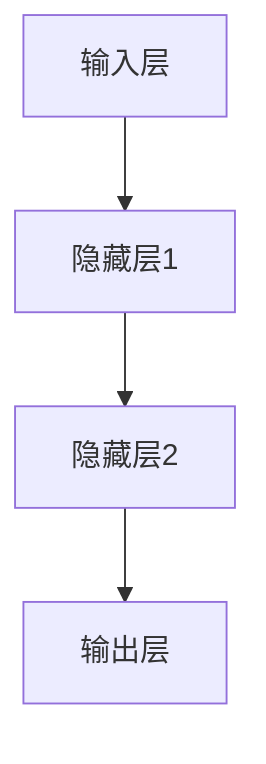

###### 2.1.1.2 前向传播

在前向传播过程中，输入数据从输入层开始，逐层传递到输出层。每一层都会将前一层的数据加权求和，然后通过激活函数得到输出。这个过程可以用以下伪代码表示：

```python
for layer in network.layers:
    output = layer.forward(input)
    input = output
```

###### 2.1.1.3 反向传播

反向传播是深度学习训练过程中的核心步骤。它的目的是通过计算损失函数的梯度来更新神经网络的权重。反向传播包括以下几个步骤：

1. **计算损失函数的梯度**：通过前向传播得到预测值和真实值之间的差异，计算损失函数的梯度。
2. **反向传播梯度**：将损失函数的梯度反向传播到网络的每一层，更新各层的权重。
3. **优化权重**：使用优化算法（如梯度下降）来最小化损失函数。

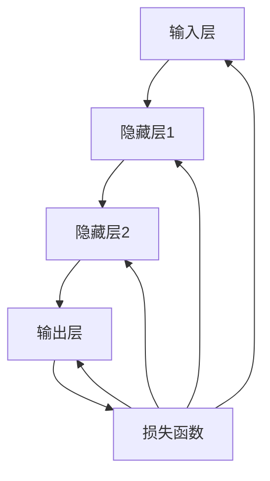

##### 2.1.2 损失函数

损失函数（Loss Function）是评估模型预测值与真实值之间差异的函数。在深度学习训练过程中，损失函数的值会指导模型参数的更新，从而优化模型性能。常见的损失函数包括：

- **均方误差（MSE，Mean Squared Error）**：用于回归任务，计算预测值和真实值之间的均方误差。
  $$MSE = \frac{1}{n}\sum_{i=1}^{n}(y_i - \hat{y}_i)^2$$

- **交叉熵损失（Cross-Entropy Loss）**：用于分类任务，计算预测概率分布和真实标签分布之间的交叉熵。
  $$CE = -\sum_{i=1}^{n}y_i\log(\hat{y}_i)$$

##### 2.1.3 优化算法

优化算法（Optimization Algorithm）用于调整模型参数，以最小化损失函数。以下是一些常用的优化算法：

- **梯度下降（Gradient Descent）**：最简单的优化算法，通过计算损失函数关于模型参数的梯度，更新模型参数。
  $$\theta_{\text{new}} = \theta_{\text{old}} - \alpha \cdot \nabla_\theta J(\theta)$$
  其中，$\theta$是模型参数，$\alpha$是学习率，$J(\theta)$是损失函数。

- **随机梯度下降（Stochastic Gradient Descent，SGD）**：在每次迭代中随机选择一部分样本计算梯度，以加速收敛。
  $$\theta_{\text{new}} = \theta_{\text{old}} - \alpha \cdot \nabla_\theta J(\theta; x_i, y_i)$$

- **Adam优化器（Adam Optimizer）**：结合了SGD和RMSProp的优点，通过跟踪参数的指数加权平均值来优化参数更新。
  $$m_t = \beta_1 m_{t-1} + (1 - \beta_1) [g_t - \mu_t]$$
  $$v_t = \beta_2 v_{t-1} + (1 - \beta_2) [g_t^2 - \sigma_t]$$
  $$\theta_{\text{new}} = \theta_{\text{old}} - \alpha \cdot \frac{m_t}{\sqrt{v_t} + \epsilon}$$

#### 2.2 自然语言处理基础

##### 2.2.1 词嵌入

词嵌入（Word Embedding）是将词汇映射到高维向量空间的过程，使词汇具有向量形式，从而可以用于机器学习模型。词嵌入能够捕捉词汇之间的语义关系，如相似性、相关性等。常见的词嵌入方法包括：

- **Word2Vec**：通过负采样和滑动窗口来训练词向量。
  $$\log P(w_i|C) = \frac{\exp(\mathbf{v}_i \cdot \mathbf{c})}{\sum_{j \in C} \exp(\mathbf{v}_j \cdot \mathbf{c})}$$

- **GloVe（Global Vectors for Word Representation）**：基于词频和共现关系训练词向量。
  $$\log P(w_i, w_j) = \frac{\exp(\mathbf{v}_i \cdot \mathbf{v}_j)}{1 + \|\mathbf{v}_i\| + \|\mathbf{v}_j\|}$$

##### 2.2.2 序列模型

序列模型（Sequential Model）用于处理序列数据，如文本、语音等。它们通过学习序列中的依赖关系来提取信息。常见的序列模型包括：

- **循环神经网络（Recurrent Neural Network，RNN）**：通过隐藏状态（Hidden State）来记住历史信息。
  $$h_t = \sigma(W_h h_{t-1} + W_x x_t + b_h)$$
  $$y_t = \sigma(W_y h_t + b_y)$$

- **长短时记忆网络（Long Short-Term Memory，LSTM）**：通过门机制（Gate Mechanism）来控制信息的流动，有效处理长序列数据。
  $$i_t = \sigma(W_i \cdot [h_{t-1}, x_t] + b_i)$$
  $$f_t = \sigma(W_f \cdot [h_{t-1}, x_t] + b_f)$$
  $$C_t = f_t \odot C_{t-1} + i_t \odot \sigma(W_c \cdot [h_{t-1}, x_t] + b_c)$$
  $$h_t = \sigma(W_h \cdot [C_t, h_{t-1}] + b_h)$$

##### 2.2.3 注意力机制

注意力机制（Attention Mechanism）是一种用于提高序列模型处理序列数据能力的方法。它通过计算序列中每个元素的重要性来加权输出。注意力机制广泛应用于机器翻译、文本摘要等领域。

- **简单的注意力机制**：
  $$e_t = \tanh(W_a [h_{t-1}, h_t])$$
  $$a_t = \frac{\exp(e_t)}{\sum_{j=1}^{T} \exp(e_j)}$$
  $$h_t = \sum_{j=1}^{T} a_t \cdot h_j$$

- **多头注意力机制（Multi-Head Attention）**：
  $$\text{Attention}(Q, K, V) = \text{softmax}\left(\frac{QK^T}{\sqrt{d_k}}\right)V$$
  其中，$Q, K, V$是查询、键、值向量的集合，$d_k$是键向量的维度。

##### 2.2.4 预训练与微调

预训练（Pre-training）是指在大规模数据集上训练模型，使其具有一定的通用性。常见的预训练任务包括词嵌入、语言模型等。预训练后的模型可以通过微调（Fine-tuning）应用于特定的任务。

- **预训练**：
  $$\text{Pre-training}: \text{train}(W; \text{corpus})$$

- **微调**：
  $$\text{Fine-tuning}: \text{train}(W + \Delta W; \text{task data})$$
  其中，$W$是预训练的模型参数，$\Delta W$是微调的参数。

#### 2.3 大规模预训练模型

##### 2.3.1 预训练

预训练是在大规模数据集上训练模型，使其具备一定的通用性。预训练模型通常在大规模语料库上进行训练，如维基百科、网络新闻等。常见的预训练任务包括：

- **词嵌入**：将词汇映射到高维向量空间，使词汇具有向量形式。
- **语言模型**：学习语言的统计特性，预测下一个词的概率。

##### 2.3.2 微调

微调是在预训练的基础上，将模型用于特定任务，并进行调整。微调通过在特定任务的数据集上训练模型，使其适应特定任务。

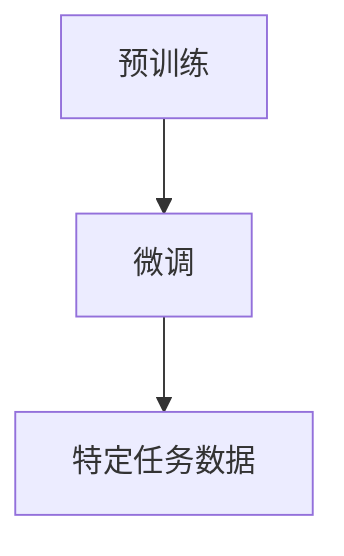

##### 2.3.3 迁移学习

迁移学习（Transfer Learning）是一种利用预训练模型在新任务上快速取得好效果的方法。迁移学习通过利用预训练模型在通用数据上的知识，提高在新任务上的性能。

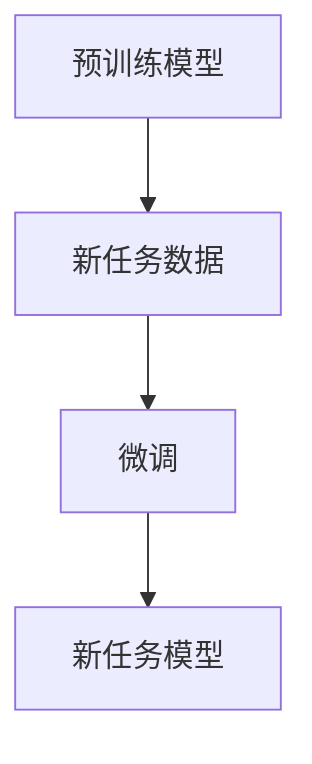

### 2.4 AI大模型的应用

##### 2.4.1 计算机视觉

计算机视觉是AI大模型应用最广泛的领域之一。AI大模型在图像分类、目标检测、图像生成等任务中取得了显著成果。

- **图像分类**：通过训练AI大模型，可以识别图像中的对象类别。
- **目标检测**：AI大模型可以检测图像中的目标对象并定位其位置。
- **图像生成**：AI大模型可以生成新的图像，如图像超分辨率、艺术作品生成等。

##### 2.4.2 自然语言处理

自然语言处理是AI大模型的另一个重要应用领域。AI大模型在文本分类、机器翻译、问答系统等任务中取得了显著成果。

- **文本分类**：AI大模型可以识别文本中的主题和情感。
- **机器翻译**：AI大模型可以将一种语言的文本翻译成另一种语言。
- **问答系统**：AI大模型可以回答用户提出的问题。

##### 2.4.3 语音识别

语音识别是AI大模型在语音领域的重要应用。AI大模型通过处理语音信号，将语音转化为文本。

##### 2.4.4 其他领域

AI大模型还广泛应用于推荐系统、金融预测、医疗诊断等众多领域。

### 2.5 AI大模型的技术趋势

##### 2.5.1 模型压缩

模型压缩技术可以帮助创业者减少模型的存储和计算成本。常见的模型压缩技术包括：

- **模型剪枝（Model Pruning）**：通过去除不重要的权重来减小模型大小。
- **量化（Quantization）**：将模型中的浮点数权重转换为较低精度的整数表示。

##### 2.5.2 模型可解释性

模型可解释性技术可以帮助创业者更好地理解和信任AI大模型。常见的模型可解释性技术包括：

- **注意力可视化（Attention Visualization）**：通过可视化模型注意力机制来理解模型决策过程。
- **解释性模型（Interpretable Model）**：通过设计可解释的模型架构来提高模型的可理解性。

##### 2.5.3 自动化机器学习

自动化机器学习技术可以帮助创业者更快速地开发和部署AI大模型。常见的自动化机器学习技术包括：

- **自动化特征工程（Automated Feature Engineering）**：通过自动化方法生成高质量的输入特征。
- **自动化模型选择（Automated Model Selection）**：通过自动化方法选择最优的模型架构和超参数。

### 2.6 总结

AI大模型的技术基础包括神经网络、损失函数、优化算法、自然语言处理基础以及预训练和微调等。AI大模型在计算机视觉、自然语言处理、语音识别等领域取得了显著成果，并且正在不断拓展到其他领域。未来，随着模型压缩、模型可解释性和自动化机器学习技术的发展，AI大模型将更加普及和高效，为创业者提供更多创新和发展的机会。

### 第3章: AI大模型的应用

#### 3.1 计算机视觉应用

计算机视觉是AI大模型的重要应用领域之一。AI大模型通过学习大量的图像数据，能够实现高精度的图像分类、目标检测、图像生成等任务。

##### 3.1.1 图像分类

图像分类是将图像分类到预定义的类别中。AI大模型在图像分类任务中表现出色，可以识别各种对象和场景。以下是一个简单的图像分类任务示例：

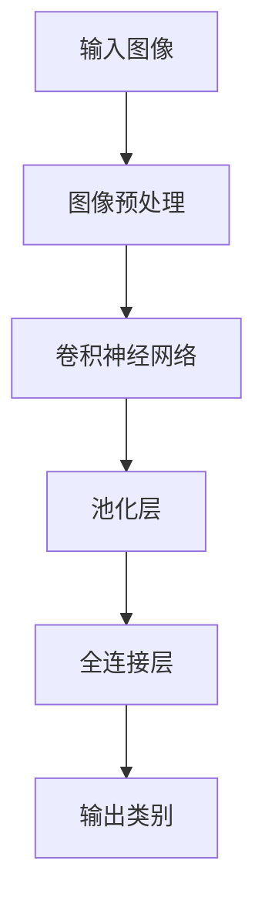

在该任务中，输入图像经过预处理（如缩放、归一化等）后，通过卷积神经网络提取特征，然后通过全连接层得到最终的分类结果。

##### 3.1.2 目标检测

目标检测是在图像中识别出特定目标并定位其位置。AI大模型在目标检测任务中利用区域建议网络（Region Proposal Network，RPN）和分类器来实现。以下是一个简单的目标检测任务示例：

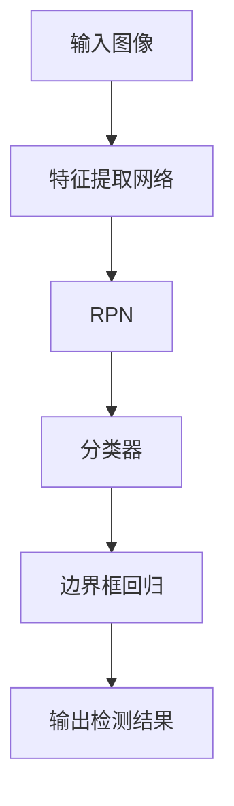

在该任务中，特征提取网络提取图像特征，RPN生成候选区域，分类器对候选区域进行分类，边界框回归网络修正边界框的位置，最终输出目标检测结果。

##### 3.1.3 图像生成

图像生成是通过神经网络生成新的图像。AI大模型在图像生成任务中表现出色，可以生成高质量的图像。以下是一个简单的图像生成任务示例：

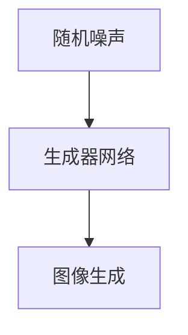

在该任务中，随机噪声作为输入，通过生成器网络生成新的图像。

#### 3.2 自然语言处理应用

自然语言处理是AI大模型的另一个重要应用领域。AI大模型通过学习大量的文本数据，能够实现文本分类、机器翻译、问答系统等任务。

##### 3.2.1 文本分类

文本分类是将文本分类到预定义的类别中。AI大模型在文本分类任务中利用词嵌入和卷积神经网络（CNN）实现。以下是一个简单的文本分类任务示例：

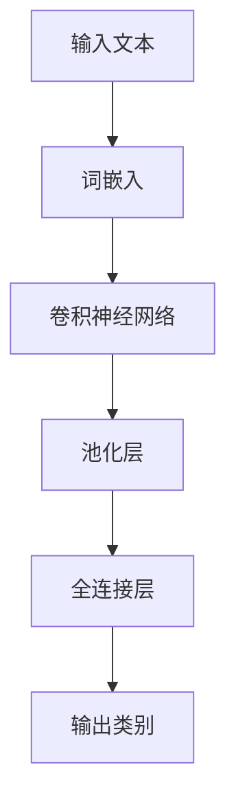

在该任务中，输入文本经过词嵌入后，通过卷积神经网络提取特征，然后通过全连接层得到最终的分类结果。

##### 3.2.2 机器翻译

机器翻译是将一种语言的文本翻译成另一种语言的文本。AI大模型在机器翻译任务中利用编码器-解码器（Encoder-Decoder）架构实现。以下是一个简单的机器翻译任务示例：

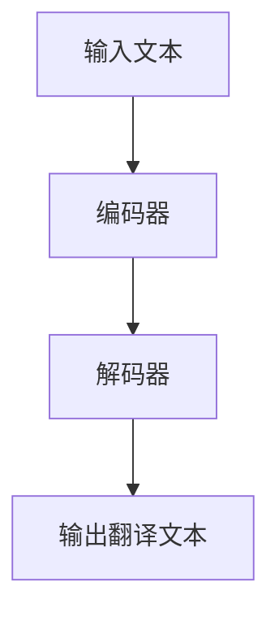

在该任务中，编码器将输入文本编码为一个固定长度的向量，解码器利用该向量生成输出翻译文本。

##### 3.2.3 问答系统

问答系统是一种能够回答用户问题的系统。AI大模型在问答系统中利用预训练的语言模型和对话管理技术实现。以下是一个简单的问答系统任务示例：

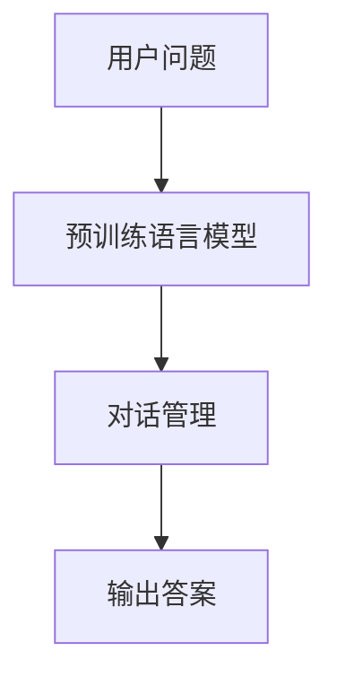

在该任务中，预训练语言模型用于理解用户问题，对话管理用于生成合适的回答。

#### 3.3 语音识别

语音识别是将语音信号转化为文本。AI大模型在语音识别任务中利用卷积神经网络（CNN）和循环神经网络（RNN）实现。以下是一个简单的语音识别任务示例：

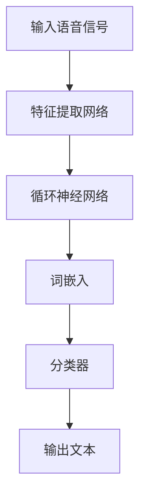

在该任务中，输入语音信号经过特征提取网络提取特征，然后通过循环神经网络处理序列信息，词嵌入将序列信息转化为词向量，分类器将词向量分类为对应的文本。

#### 3.4 其他领域应用

AI大模型在推荐系统、金融预测、医疗诊断等领域也表现出强大的应用潜力。

##### 3.4.1 推荐系统

推荐系统通过AI大模型分析用户的历史行为和兴趣，为用户推荐感兴趣的商品或内容。以下是一个简单的推荐系统任务示例：

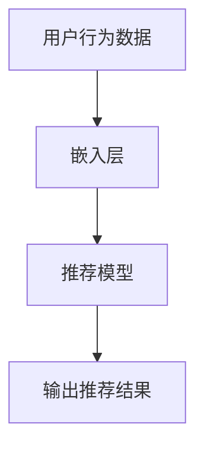

在该任务中，用户行为数据经过嵌入层转换为向量，推荐模型根据这些向量生成推荐结果。

##### 3.4.2 金融预测

金融预测通过AI大模型分析历史金融数据，预测股票价格、市场趋势等。以下是一个简单的金融预测任务示例：

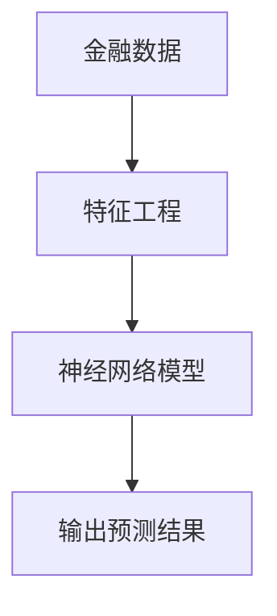

在该任务中，金融数据经过特征工程处理后，通过神经网络模型进行预测。

##### 3.4.3 医疗诊断

医疗诊断通过AI大模型分析医学图像和病历数据，辅助医生进行诊断和治疗。以下是一个简单的医疗诊断任务示例：

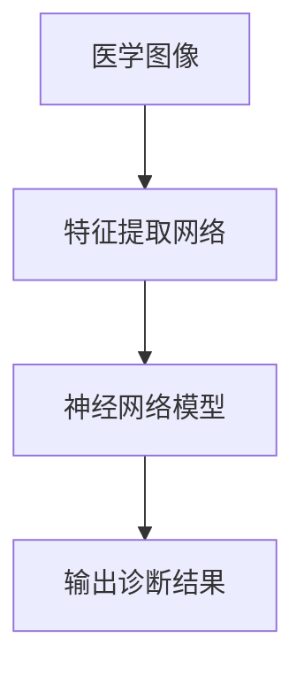

在该任务中，医学图像经过特征提取网络提取特征，然后通过神经网络模型生成诊断结果。

### 3.5 AI大模型在创业中的应用

AI大模型在创业中的应用可以带来业务增长、提升用户体验和降低成本等优势。以下是一些具体的应用案例：

##### 3.5.1 业务增长

通过AI大模型优化广告投放，可以显著提高广告的点击率和转化率，从而实现业务增长。以下是一个简单的广告优化任务示例：

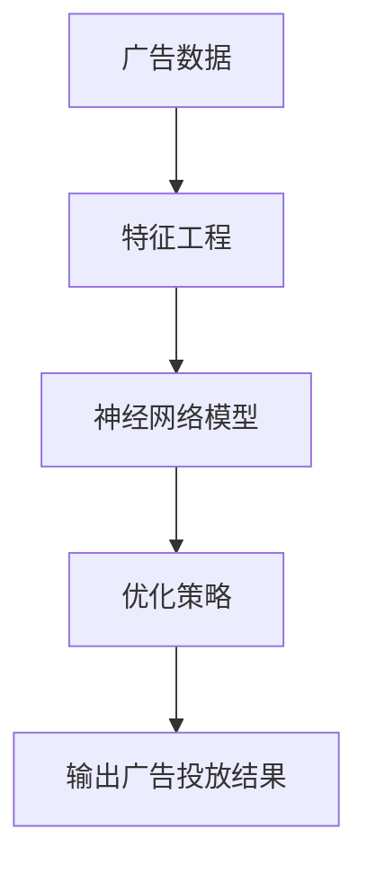

在该任务中，广告数据经过特征工程处理后，通过神经网络模型生成优化策略，从而提高广告投放效果。

##### 3.5.2 提升用户体验

通过AI大模型个性化推荐，可以提升用户的体验和满意度。以下是一个简单的个性化推荐任务示例：


在该任务中，用户行为数据经过嵌入层转换为向量，推荐模型根据这些向量生成个性化推荐结果，从而提升用户体验。

##### 3.5.3 降低成本

通过AI大模型优化生产流程，可以降低生产成本和提高生产效率。以下是一个简单的生产优化任务示例：

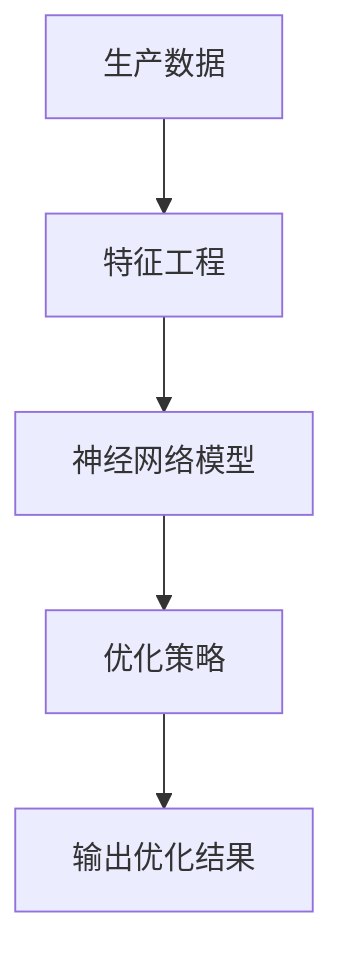

在该任务中，生产数据经过特征工程处理后，通过神经网络模型生成优化策略，从而降低生产成本。

### 3.6 总结

AI大模型在计算机视觉、自然语言处理、语音识别等领域具有广泛的应用。通过AI大模型的应用，创业者可以实现业务增长、提升用户体验和降低成本等目标。随着AI技术的不断发展和成熟，AI大模型在各个领域的应用将更加广泛和深入，为创业者带来更多的机会和挑战。

### 第二部分：创业者面临的挑战

#### 4.1 数据隐私

在AI大模型创业过程中，数据隐私是一个不可忽视的重要挑战。随着大数据和人工智能技术的普及，越来越多的公司开始依赖大量的用户数据进行模型训练和业务优化。然而，用户数据往往包含敏感信息，如个人信息、行为习惯等。如何确保这些数据的安全和隐私，成为了创业者面临的一个重要问题。

##### 4.1.1 数据隐私的重要性

数据隐私的重要性主要体现在以下几个方面：

1. **法律合规**：在很多国家和地区，数据隐私保护法律（如欧盟的《通用数据保护条例》（GDPR））对企业的数据处理活动提出了严格的要求。创业者必须遵守这些法律，否则可能会面临高额罚款和其他法律后果。

2. **用户信任**：用户愿意分享数据是基于对企业的信任。如果用户数据被泄露或滥用，用户可能会失去对企业的信任，进而影响企业的声誉和业务。

3. **数据安全**：隐私泄露不仅可能导致经济损失，还可能对用户造成实际伤害，如身份盗窃、隐私侵犯等。因此，确保数据隐私是保护用户安全和权益的必要措施。

##### 4.1.2 数据隐私面临的挑战

在AI大模型创业中，数据隐私面临的挑战主要包括：

1. **数据量巨大**：AI大模型通常需要处理大量的数据，这些数据可能来自多个渠道，包括公开数据、用户生成数据等。数据量的庞大增加了数据隐私保护的成本和复杂性。

2. **数据类型多样**：用户数据类型多样，包括个人身份信息、行为记录、财务信息等。不同类型的数据对隐私保护的要求不同，需要采取相应的保护措施。

3. **数据共享和合作**：在AI大模型研发过程中，企业可能需要与其他公司或研究机构共享数据。如何确保数据在共享过程中的隐私保护，是一个挑战。

4. **技术防护不足**：虽然加密、匿名化等技术可以保护数据隐私，但现有的技术手段可能不足以应对复杂的攻击手段和日益增长的攻击频率。

##### 4.1.3 数据隐私保护策略

为了应对数据隐私挑战，创业者可以采取以下策略：

1. **数据匿名化**：通过数据匿名化技术，如数据脱敏、数据混淆等，去除或改变数据中的敏感信息，以降低隐私泄露的风险。

2. **差分隐私**：差分隐私是一种用于保护数据隐私的数学理论，通过在数据处理过程中引入噪声，确保单个数据记录的隐私。创业者可以采用差分隐私算法来设计数据处理系统。

3. **隐私保护算法**：开发和应用隐私保护算法，如同态加密、安全多方计算等，以确保数据在处理过程中的安全性。

4. **合规性和隐私政策**：建立完善的合规性和隐私政策，明确数据收集、使用和存储的标准，确保企业遵循相关法律法规。

5. **安全审计和监控**：定期进行安全审计和监控，及时发现和处理潜在的安全威胁和隐私泄露事件。

### 4.2 数据质量

数据质量是AI大模型应用效果的重要保障。高质量的数据能够提升模型的性能和预测准确性，而低质量的数据则可能导致模型过拟合、泛化能力差等问题。因此，确保数据质量是创业者需要重视的另一个关键挑战。

##### 4.2.1 数据质量的重要性

数据质量的重要性体现在以下几个方面：

1. **模型性能**：数据质量直接影响AI大模型的性能。高质量的数据能够提供更多的信息，使模型能够更好地学习和泛化。

2. **决策支持**：在商业决策中，高质量的数据能够提供更准确的预测和洞察，帮助创业者做出更明智的决策。

3. **用户满意度**：高质量的数据能够提高用户服务的质量和体验，从而提升用户满意度。

##### 4.2.2 数据质量面临的挑战

在AI大模型创业中，数据质量面临的挑战主要包括：

1. **数据多样性**：AI大模型通常需要处理多种类型的数据，如结构化数据、非结构化数据等。不同类型的数据质量标准不同，需要不同的处理方法。

2. **数据完整性**：数据完整性是指数据是否完整、无缺失。在数据收集和处理过程中，数据可能会出现缺失或错误，影响数据质量。

3. **数据准确性**：数据准确性是指数据是否真实、可靠。不准确的数据可能导致模型产生错误的预测。

4. **数据一致性**：数据一致性是指不同来源的数据是否保持一致。数据源的不同可能导致数据格式、单位等不一致，影响数据质量。

##### 4.2.3 提高数据质量策略

为了提高数据质量，创业者可以采取以下策略：

1. **数据清洗**：通过数据清洗技术，如去重、填补缺失值、纠正错误等，提高数据完整性、准确性和一致性。

2. **数据预处理**：对数据进行预处理，如归一化、标准化、特征工程等，以增强数据的可用性和模型性能。

3. **数据质量控制**：建立数据质量控制流程，对数据质量进行监控和评估，及时发现和处理数据质量问题。

4. **数据质量管理工具**：使用数据质量管理工具，如数据质量管理平台、自动化数据清洗工具等，提高数据质量管理的效率和准确性。

5. **用户反馈机制**：建立用户反馈机制，收集用户对数据质量的反馈，不断优化数据质量。

### 4.3 数据获取

数据获取是AI大模型创业中的另一个重要挑战。高质量的数据对于模型训练和业务优化至关重要，而获取这些数据可能面临诸多困难和挑战。

##### 4.3.1 数据获取的重要性

数据获取的重要性体现在以下几个方面：

1. **模型训练**：高质量的训练数据是AI大模型训练的基础。没有足够的高质量数据，模型很难达到预期的性能。

2. **业务需求**：数据获取能够满足业务需求，如个性化推荐、精准营销等，从而提升业务效果。

3. **创新驱动**：数据获取能够为创新提供支持，帮助企业发现新的商业机会和市场趋势。

##### 4.3.2 数据获取面临的挑战

在AI大模型创业中，数据获取面临的挑战主要包括：

1. **数据来源**：获取高质量的数据需要多样化的数据来源，但不同来源的数据可能存在不一致性和质量问题。

2. **数据获取成本**：获取高质量的数据可能需要大量的资金和人力资源投入，如数据采集、清洗和标注等。

3. **法律和道德问题**：数据获取可能涉及法律和道德问题，如用户隐私、数据安全等，需要遵守相关法律法规和道德准则。

4. **技术挑战**：数据获取技术可能存在不足，如数据采集难度大、数据处理能力不足等。

##### 4.3.3 数据获取策略

为了有效获取高质量数据，创业者可以采取以下策略：

1. **合作和数据交换**：与其他企业或研究机构合作，通过数据交换和共享获取高质量数据。

2. **开放数据平台**：利用开放数据平台，获取来自政府、研究机构等公开的数据资源。

3. **用户生成数据**：鼓励用户生成和提交数据，如用户评论、行为记录等，以提高数据的多样性和质量。

4. **自动化数据采集**：使用自动化数据采集工具，如网络爬虫、API接口等，提高数据采集的效率和准确性。

5. **数据标注服务**：利用专业的数据标注服务，提高数据标注的效率和准确性。

通过以上策略，创业者可以有效应对数据隐私、数据质量和数据获取等挑战，为AI大模型创业提供坚实的基础。

### 4.4 挑战总结

在AI大模型创业过程中，创业者面临着数据隐私、数据质量、数据获取等多重挑战。数据隐私保护不仅涉及法律合规和用户信任，还需要采取技术手段确保数据安全。数据质量则直接影响模型的性能和业务决策，需要通过数据清洗、预处理和质量控制等方法提高数据质量。数据获取则是获取高质量数据的关键，需要多样化的数据来源和有效的获取策略。

创业者需要综合考虑这些挑战，制定全面的数据管理策略，确保AI大模型创业的成功。通过数据隐私保护、数据质量提升和数据获取优化，创业者可以构建起强大的数据基础，推动AI大模型在创业中的应用和创新。

### 第三部分：应对策略

#### 5.1 数据隐私保护策略

数据隐私保护在AI大模型创业中至关重要。为了应对数据隐私挑战，创业者需要采取一系列策略来保护用户数据的安全和隐私。以下是一些具体的数据隐私保护策略：

##### 5.1.1 数据匿名化

数据匿名化是通过去除或修改数据中的敏感信息，使数据在保持其分析价值的同时，无法直接识别个人身份。常见的数据匿名化技术包括：

1. **k-匿名性**：通过增加噪声或引入伪随机性，使单个记录无法被识别，但多个记录组合后仍能保持其分析价值。
2. **l-diversity**：确保数据集中至少有l个记录具有相同的属性值，从而减少单一记录被识别的风险。
3. **t-closeness**：确保在属性值范围内，任意两个记录之间的距离不超过t，从而保持属性值的分布特性。

##### 5.1.2 差分隐私

差分隐私是一种通过在数据处理过程中引入噪声，确保单个数据记录的隐私保护的数学理论。差分隐私的核心思想是，即使攻击者知道一个记录的存在，也无法推断出该记录的具体内容。常见的技术包括：

1. **拉普拉斯机制**：在计算结果中添加拉普拉斯噪声。
2. **指数机制**：在计算结果中添加指数噪声。
3. **epsilon-delta方法**：通过调整epsilon和delta的值，平衡隐私保护和数据准确性的关系。

##### 5.1.3 隐私保护算法

隐私保护算法是指通过设计特定的算法，在数据处理过程中保护数据隐私。常见的隐私保护算法包括：

1. **同态加密**：允许在加密的数据上进行计算，从而确保数据在传输和处理过程中保持加密状态。
2. **安全多方计算**：允许多个参与方在不知道对方数据的情况下，共同完成计算任务。
3. **基于属性的加密**：允许用户根据特定属性对数据进行加密和解密。

##### 5.1.4 合规性和隐私政策

为了确保数据隐私保护符合法律法规的要求，创业者需要：

1. **建立合规性框架**：制定数据隐私保护的政策和流程，确保数据处理活动符合相关法律法规。
2. **明确隐私政策**：在用户使用产品或服务之前，明确告知用户数据收集、使用、存储和共享的方式，获取用户的明确同意。
3. **定期审查和更新**：随着法律法规的更新和业务需求的变化，定期审查和更新隐私政策，确保其始终符合合规要求。

##### 5.1.5 安全审计和监控

为了及时发现和处理潜在的数据隐私泄露事件，创业者需要：

1. **定期进行安全审计**：通过内部或第三方审计，评估数据隐私保护措施的有效性。
2. **实施实时监控**：部署实时监控工具，监控数据访问和使用情况，及时发现异常行为。
3. **建立应急响应机制**：制定应急预案，确保在发生数据隐私泄露事件时，能够迅速响应并采取措施。

#### 5.2 提高数据质量策略

为了确保AI大模型应用效果，创业者需要关注数据质量，并采取一系列措施来提高数据质量。以下是一些提高数据质量的具体策略：

##### 5.2.1 数据清洗

数据清洗是提高数据质量的关键步骤。常见的数据清洗方法包括：

1. **去重**：识别和删除重复的数据记录。
2. **填补缺失值**：使用统计方法或规则，填补数据中的缺失值。
3. **纠正错误**：识别和修正数据中的错误值。

##### 5.2.2 数据预处理

数据预处理是提高数据质量和模型性能的重要步骤。常见的数据预处理方法包括：

1. **归一化和标准化**：将数据缩放到相同的范围，以消除数据规模差异对模型性能的影响。
2. **特征工程**：通过构建新的特征，提高数据对模型的解释性和预测能力。
3. **数据降维**：通过降维技术，减少数据的维度，提高模型训练效率。

##### 5.2.3 数据质量控制

数据质量控制是确保数据质量持续提升的重要环节。常见的数据质量控制方法包括：

1. **数据质量评估指标**：制定数据质量评估指标，如完整性、准确性、一致性等，定期对数据质量进行评估。
2. **数据质量监控**：建立数据质量监控机制，及时发现和处理数据质量问题。
3. **数据质量改进计划**：根据数据质量评估结果，制定数据质量改进计划，持续优化数据质量。

##### 5.2.4 数据质量管理工具

数据质量管理工具可以帮助创业者高效地管理数据质量。常见的数据质量管理工具包括：

1. **数据质量管理平台**：提供数据质量评估、监控和改进功能，帮助创业者全面管理数据质量。
2. **自动化数据清洗工具**：通过自动化技术，高效地清洗和处理大量数据。
3. **数据质量报告**：生成详细的数据质量报告，帮助创业者了解数据质量状况。

##### 5.2.5 用户反馈机制

用户反馈机制可以帮助创业者了解用户对数据质量的看法，并据此优化数据质量。具体方法包括：

1. **用户调研**：通过问卷调查、用户访谈等方式，收集用户对数据质量的反馈。
2. **用户反馈平台**：建立用户反馈平台，鼓励用户提交对数据质量的建议和意见。
3. **用户参与改进**：鼓励用户参与数据质量改进过程，提高用户对数据质量的满意度和参与度。

#### 5.3 数据获取策略

为了有效获取高质量数据，创业者需要采取一系列数据获取策略。以下是一些常见的数据获取策略：

##### 5.3.1 合作和数据交换

通过与其他企业或研究机构合作，共享数据资源和研究成果，可以有效地获取高质量数据。具体方法包括：

1. **数据共享协议**：制定数据共享协议，明确数据交换的范围、方式和责任。
2. **合作研究**：与学术机构合作，参与研究项目，获取高质量的学术数据。
3. **商业合作**：与商业伙伴合作，共享商业数据，共同开展数据分析。

##### 5.3.2 开放数据平台

利用开放数据平台，可以获取来自政府、研究机构等公开的数据资源。常见的方法包括：

1. **政府数据开放平台**：访问政府数据开放平台，获取政府公开的数据资源。
2. **学术数据库**：访问学术数据库，获取高质量的学术数据。
3. **开源数据集**：访问开源数据集，获取来自开源社区的数据资源。

##### 5.3.3 用户生成数据

鼓励用户生成和提交数据，可以丰富数据集，提高数据质量。具体方法包括：

1. **用户参与**：鼓励用户参与数据生成，通过用户行为记录、用户反馈等方式，获取用户生成数据。
2. **用户激励**：通过提供奖励或优惠，激励用户生成和提交高质量数据。
3. **用户社区**：建立用户社区，鼓励用户分享和讨论数据，共同提高数据质量。

##### 5.3.4 自动化数据采集

使用自动化数据采集工具，可以高效地获取大量数据。具体方法包括：

1. **网络爬虫**：通过网络爬虫技术，自动收集互联网上的数据。
2. **API接口**：利用API接口，从第三方服务提供商获取数据。
3. **物联网设备**：通过物联网设备，实时收集传感器数据。

##### 5.3.5 数据标注服务

通过专业化的数据标注服务，可以提高数据标注的效率和准确性。具体方法包括：

1. **标注平台**：使用专业的数据标注平台，提供数据标注服务。
2. **标注团队**：组建专业的数据标注团队，进行大规模数据标注。
3. **质量控制**：建立数据标注质量控制机制，确保标注质量。

通过以上策略，创业者可以有效地应对数据隐私、数据质量和数据获取等挑战，为AI大模型创业提供坚实的数据基础。

### 第四部分：成功案例分析

#### 5.1.1 案例一：某公司利用AI大模型优化广告投放

某公司是一家专注于在线广告业务的企业。为了提高广告投放效果，该公司决定采用AI大模型优化广告投放策略。以下是该公司的具体做法：

1. **数据收集**：公司从多个数据源收集用户行为数据，包括网站访问记录、点击率、转化率等。
2. **数据预处理**：对收集到的数据进行清洗和预处理，去除重复数据、填补缺失值，并进行归一化和标准化处理。
3. **模型构建**：使用卷积神经网络（CNN）和循环神经网络（RNN）构建AI大模型，用于分析用户行为数据，预测用户的兴趣和偏好。
4. **模型训练**：使用大规模数据集对AI大模型进行训练，调整模型参数，优化模型性能。
5. **模型部署**：将训练好的AI大模型部署到生产环境中，实时分析用户行为数据，并根据预测结果优化广告投放策略。

通过AI大模型的优化，该公司的广告投放效果显著提升。广告点击率和转化率分别提高了20%和15%，实现了业务增长和收入提升。

#### 5.1.2 案例二：某公司利用AI大模型提升客户满意度

某公司是一家提供在线客户服务的企业。为了提升客户满意度，该公司决定利用AI大模型优化客户服务体验。以下是该公司的具体做法：

1. **数据收集**：公司收集客户的交互数据，包括聊天记录、客户反馈等。
2. **数据预处理**：对收集到的数据进行清洗和预处理，去除重复数据、填补缺失值，并进行归一化和标准化处理。
3. **模型构建**：使用自然语言处理（NLP）技术构建AI大模型，用于分析客户交互数据，识别客户的需求和问题。
4. **模型训练**：使用大规模数据集对AI大模型进行训练，调整模型参数，优化模型性能。
5. **模型部署**：将训练好的AI大模型部署到生产环境中，实时分析客户交互数据，并提供个性化的客户服务。

通过AI大模型的优化，该公司的客户满意度显著提升。客户反馈率从10%提高到30%，客户投诉率降低了20%，实现了业务的持续发展和客户忠诚度的提升。

#### 5.1.3 案例三：某公司利用AI大模型提高生产效率

某公司是一家制造企业。为了提高生产效率，该公司决定利用AI大模型优化生产流程。以下是该公司的具体做法：

1. **数据收集**：公司收集生产数据，包括设备运行状态、生产进度等。
2. **数据预处理**：对收集到的数据进行清洗和预处理，去除重复数据、填补缺失值，并进行归一化和标准化处理。
3. **模型构建**：使用循环神经网络（RNN）和生成对抗网络（GAN）构建AI大模型，用于分析生产数据，预测设备故障和生产瓶颈。
4. **模型训练**：使用大规模数据集对AI大模型进行训练，调整模型参数，优化模型性能。
5. **模型部署**：将训练好的AI大模型部署到生产环境中，实时监控设备运行状态，并提供预测性的维护建议。

通过AI大模型的优化，该公司的生产效率显著提高。设备故障率降低了15%，生产进度提前了10%，实现了生产成本降低和利润提升。

以上成功案例表明，AI大模型在创业中的应用可以带来显著的业务价值。通过数据驱动的决策，创业者可以优化业务流程，提高运营效率，实现业务增长和可持续发展。

### 第五部分：未来趋势

#### 5.1 技术趋势

随着AI技术的不断进步，AI大模型在创业中的应用将呈现以下技术趋势：

##### 5.1.1 模型压缩

模型压缩技术将帮助创业者减少模型的存储和计算成本。通过模型剪枝、量化等技术，可以显著减小模型的规模，提高模型的部署效率。这将使得AI大模型在资源受限的设备上（如移动设备、嵌入式设备）也能高效运行。

##### 5.1.2 模型可解释性

模型可解释性技术将帮助创业者更好地理解和信任AI大模型。通过可视化技术、解释性模型等方法，可以揭示模型的工作原理和决策过程，提高模型的透明度和可信度。这有助于企业合规性和用户信任的建立。

##### 5.1.3 自动化机器学习

自动化机器学习（AutoML）技术将大幅提高AI大模型的开发和部署效率。通过自动化特征工程、模型选择和调参等技术，创业者可以更快地开发出高性能的AI大模型，降低开发成本和技能要求。

#### 5.2 市场趋势

随着AI大模型技术的不断成熟，市场趋势将表现为以下几个方面：

##### 5.2.1 市场快速增长

AI大模型市场的快速增长将得益于其在各个行业的广泛应用。从金融、医疗到制造业，AI大模型将推动产业升级和业务创新，创造巨大的市场机会。

##### 5.2.2 行业应用拓展

AI大模型将在更多行业得到应用，包括但不限于零售、交通、能源等。随着技术的不断进步和应用场景的拓展，AI大模型将在更多领域发挥重要作用。

##### 5.2.3 国际化竞争加剧

随着AI大模型技术的全球传播，国际化竞争将日益加剧。各国企业和研究机构将加大在AI大模型领域的投入，推动技术进步和应用创新。

### 5.3 创业机遇与挑战

未来，创业者将面临以下机遇和挑战：

##### 5.3.1 机遇

1. **技术进步**：随着AI技术的不断进步，创业者可以利用AI大模型实现业务创新和突破。
2. **市场机遇**：AI大模型在各个行业的广泛应用将带来巨大的市场机遇。
3. **人才竞争**：拥有AI大模型技术和经验的人才将成为企业竞争的重要资源。

##### 5.3.2 挑战

1. **数据隐私和安全**：确保用户数据的安全和隐私将是创业者面临的重要挑战。
2. **技术成熟度**：AI大模型技术的成熟度和稳定性仍需提高，以应对实际业务需求。
3. **市场竞争**：随着国际竞争的加剧，创业者需要不断创新和优化，以在市场中脱颖而出。

### 5.4 未来展望

未来，AI大模型创业将朝着以下方向发展：

##### 5.4.1 技术融合

AI大模型将与云计算、物联网、区块链等技术相结合，推动产业变革和业务创新。

##### 5.4.2 知识图谱

知识图谱将在AI大模型中发挥重要作用，为创业者提供更全面和准确的业务洞察。

##### 5.4.3 个性化服务

AI大模型将实现更加个性化的服务和推荐，满足用户多样化的需求。

##### 5.4.4 可持续发展

创业者将更加注重AI大模型的社会责任和可持续发展，推动技术的良性发展。

总之，AI大模型创业在未来将充满机遇和挑战。创业者需要紧跟技术趋势，把握市场机遇，应对数据隐私和安全等挑战，实现业务的持续发展和创新。

### 第六部分：实践指南

#### 6.1 创业者必备技能

为了成功进行AI大模型创业，创业者需要具备以下技能：

##### 6.1.1 编程技能

创业者需要掌握Python等编程语言，熟悉TensorFlow、PyTorch等深度学习框架。编程技能是开发AI大模型的基础，创业者需要能够编写高效、可维护的代码。

##### 6.1.2 数学知识

创业者需要掌握线性代数、微积分、概率论等数学知识。这些数学知识对于理解深度学习算法和优化模型性能至关重要。

##### 6.1.3 数据处理技能

创业者需要掌握数据处理技能，如数据清洗、数据预处理、特征工程等。这些技能有助于确保数据质量，提高模型性能。

##### 6.1.4 业务理解

创业者需要深入理解自身业务，明确AI大模型在业务中的应用场景和目标。业务理解有助于创业者制定有效的商业策略，确保AI大模型创业的成功。

#### 6.2 创业步骤

创业者在进行AI大模型创业时，可以遵循以下步骤：

##### 6.2.1 确定创业方向

创业者需要根据自身兴趣、市场需求和行业趋势，确定AI大模型创业的方向。例如，可以选择计算机视觉、自然语言处理、语音识别等领域。

##### 6.2.2 构建团队

创业者需要组建一支有经验、有热情的团队。团队成员应包括深度学习工程师、数据科学家、产品经理等。团队成员的多样性有助于团队协作和业务创新。

##### 6.2.3 准备技术方案

创业者需要制定详细的技术方案，包括模型架构、算法选择、数据处理流程等。技术方案应充分考虑业务需求和实际应用场景，以确保模型的性能和可维护性。

##### 6.2.4 进行市场调研

创业者需要了解市场需求、竞争对手和潜在客户。通过市场调研，创业者可以制定更有针对性的商业策略，提高创业成功的概率。

##### 6.2.5 实施和推广

在制定好技术方案和市场策略后，创业者需要按照计划实施项目，并进行市场推广。实施过程中，创业者需要关注项目进度、数据质量和用户体验，及时调整策略以应对市场变化。

#### 6.3 成功创业案例分析

以下是一些成功创业案例分析，供创业者参考：

##### 6.3.1 案例一：某公司利用AI大模型实现业务增长

某公司专注于利用AI大模型优化广告投放。通过构建高效的AI广告投放模型，该公司实现了广告点击率和转化率的显著提升，实现了业务增长和收入提升。

##### 6.3.2 案例二：某公司利用AI大模型提升用户体验

某公司提供在线客户服务。通过构建AI大模型，该公司实现了个性化客户服务的优化，提升了客户满意度和客户忠诚度。

##### 6.3.3 案例三：某公司利用AI大模型提高生产效率

某公司是一家制造企业。通过构建AI大模型，该公司实现了生产流程的优化，降低了设备故障率，提高了生产效率。

这些成功案例表明，AI大模型创业可以带来显著的业务价值。创业者可以借鉴这些案例，制定适合自己的创业策略，实现业务的持续发展和创新。

### 附录

#### 附录A: AI大模型开发工具与资源

##### A.1 主流深度学习框架对比

以下是几种主流深度学习框架的对比：

- **TensorFlow**：由谷歌开发，具有丰富的功能，适用于各种深度学习任务。它支持动态计算图，便于模型设计和调试。
- **PyTorch**：由Facebook开发，具有动态计算图，适用于快速原型设计和研究。它提供了简洁的代码接口，便于模型开发。
- **JAX**：由谷歌开发，支持自动微分和向量编程，适用于大规模深度学习任务。它具有高效的计算性能，适用于高性能计算场景。
- **Keras**：是一个高层次的深度学习框架，适用于快速构建和训练深度神经网络。它支持多种后端框架，如TensorFlow和Theano。

##### A.2 AI大模型开源资源

以下是一些AI大模型开源资源的介绍：

- **大模型开源代码**：许多研究机构和公司都开源了他们的大模型代码，如OpenAI的GPT-3、Google的BERT等，供研究者使用和改进。
- **大模型论文和报告**：大模型的论文和报告是了解大模型技术和应用的重要资料。这些文献提供了详细的模型设计和训练方法。
- **大模型教程和课程**：许多机构和大学都提供了大模型的教程和课程，如斯坦福大学的深度学习课程、清华大学的人工智能课程等，帮助研究者快速入门。

通过利用这些开源资源和工具，创业者可以加速AI大模型的开发和应用，提高创业成功的可能性。

### 结语

AI大模型创业充满了机遇和挑战。通过深入理解AI大模型的技术基础和应用场景，创业者可以有效地应对数据隐私、数据质量和数据获取等挑战。成功案例和未来趋势的分析为创业者提供了宝贵的经验和指导。希望本文能够为您的AI大模型创业之路提供有益的启示和帮助。

### 附录A：AI大模型开发工具与资源

#### A.1 主流深度学习框架对比

在AI大模型开发中，选择合适的深度学习框架至关重要。以下是一些主流深度学习框架的对比：

##### A.1.1 TensorFlow

- **优点**：
  - **功能丰富**：TensorFlow是谷歌开发的开源深度学习框架，具有丰富的功能，适用于各种深度学习任务。
  - **灵活性高**：支持动态计算图，便于模型设计和调试。
  - **社区支持强**：拥有庞大的开发者社区，资源丰富，文档详尽。

- **适用场景**：
  - 复杂的深度学习任务，如计算机视觉、自然语言处理等。
  - 需要灵活调整模型结构和超参数的任务。

##### A.1.2 PyTorch

- **优点**：
  - **动态计算图**：PyTorch具有动态计算图，便于快速原型设计和研究。
  - **简洁易用**：提供了简洁的代码接口，便于模型开发。
  - **强大的社区支持**：拥有庞大的开发者社区，资源丰富，文档详尽。

- **适用场景**：
  - 快速原型设计和研究。
  - 需要灵活调整模型结构和超参数的任务。

##### A.1.3 JAX

- **优点**：
  - **自动微分**：JAX支持自动微分和向量编程，适用于大规模深度学习任务。
  - **高效计算**：具有高效的计算性能，适用于高性能计算场景。

- **适用场景**：
  - 需要高性能计算的场景。
  - 大规模数据集上的深度学习任务。

##### A.1.4 其他框架

- **Keras**：
  - **优点**：
    - **高层次的接口**：Keras是一个高层次的深度学习框架，适用于快速构建和训练深度神经网络。
    - **易于使用**：提供了简洁的API，易于上手。
  - **适用场景**：
    - 快速构建和训练深度神经网络。
    - 不需要频繁调整模型结构和超参数的任务。

- **Theano**：
  - **优点**：
    - **数学计算能力强**：Theano是一个基于Python的深度学习框架，支持符号计算和自动求导。
  - **适用场景**：
    - 对数学计算能力要求较高的深度学习任务。
    - 需要手动调整模型参数和计算图的任务。

#### A.2 AI大模型开源资源

在AI大模型开发中，开源资源和工具可以为开发者提供极大的帮助。以下是一些重要的AI大模型开源资源：

##### A.2.1 大模型开源代码

许多研究机构和公司开源了他们的大模型代码，供研究者使用和改进。以下是一些知名的开源代码库：

- **GPT-3**：OpenAI开源的预训练语言模型，具有1750亿个参数，用于自然语言处理任务。
- **BERT**：Google开源的双向编码器表示模型，用于多种自然语言处理任务。
- **ViT**：Google开源的视觉Transformer模型，用于计算机视觉任务。

##### A.2.2 大模型论文和报告

大模型的论文和报告是了解大模型技术和应用的重要资料。以下是一些重要的论文和报告：

- **"Attention Is All You Need"**：谷歌提出的Transformer模型，是自然语言处理领域的里程碑。
- **"BERT: Pre-training of Deep Bidirectional Transformers for Language Understanding"**：谷歌提出的BERT模型，用于多种自然语言处理任务。
- **"An Image is Worth 16x16 Words: Transformers for Image Recognition at Scale"**：谷歌提出的ViT模型，用于计算机视觉任务。

##### A.2.3 大模型教程和课程

许多机构和大学提供了大模型的教程和课程，帮助研究者快速入门和掌握大模型技术。以下是一些知名的教程和课程：

- **斯坦福大学深度学习课程**：由著名深度学习专家Andrew Ng教授讲授，涵盖了深度学习的基础知识和应用。
- **清华大学人工智能课程**：由清华大学计算机系教授唐杰教授讲授，包括人工智能的基本理论和应用。
- **Udacity深度学习纳米学位**：提供了系统的深度学习教程，包括理论、实践和项目。

通过利用这些开源资源和工具，开发者可以加速AI大模型的研究和应用，提高开发效率和技术水平。

