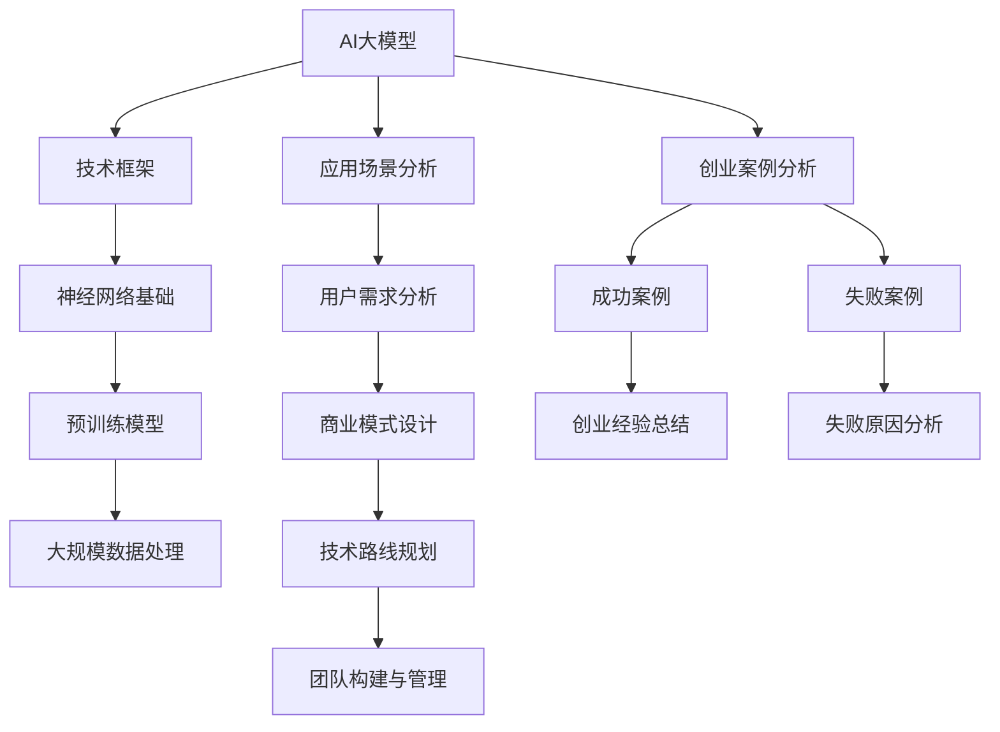

                 

### 《AI大模型创业：如何应对未来用户需求？》

#### **关键词：**AI大模型，创业，用户需求，技术框架，市场前景，风险管理

#### **摘要：**
随着人工智能技术的飞速发展，AI大模型在各个行业中展现出了巨大的潜力。然而，如何在AI大模型创业过程中准确把握和应对未来用户需求，成为创业者们必须面对的重要课题。本文将从AI大模型的概述与背景、应用策略、创业实践等多个方面，逐步分析并探讨这一关键问题，旨在为AI大模型创业者提供有价值的指导和建议。

#### **目录大纲**

1. **AI大模型概述与背景**
   1.1 AI大模型概述
   1.2 AI大模型技术框架
   1.3 AI大模型市场前景
2. **AI大模型应用策略**
   2.1 用户需求分析
   2.2 AI大模型应用策略
   2.3 创业案例分析
3. **AI大模型创业实践**
   3.1 创业环境分析
   3.2 创业团队建设
   3.3 产品设计与开发
   3.4 融资策略制定
   3.5 风险管理
4. **AI大模型创业成功之路**
   4.1 创业历程回顾
   4.2 创业经验分享
5. **附录**
   5.1 相关资源

---

### 第一部分：AI大模型概述与背景

#### **1.1 AI大模型概述**

AI大模型，即Artificial Intelligence Large Models，是指具备大规模参数和高度复杂性的深度学习模型。这些模型通常通过在庞大的数据集上进行预训练，学习到丰富的知识，并在特定任务上展现出卓越的性能。

**AI大模型的定义：**
AI大模型是一种利用深度学习技术构建的，具有数百万甚至数十亿个参数的模型。它们通过多层次的神经网络结构，实现对输入数据的特征提取和模式识别。

**AI大模型的主要特征：**
- **大规模参数**：AI大模型通常包含数百万至数十亿个参数，这使得它们能够学习到更加复杂和抽象的特征。
- **高计算需求**：由于参数规模庞大，AI大模型对计算资源的需求也相对较高，通常需要使用GPU或TPU等高性能计算设备进行训练。
- **强泛化能力**：AI大模型通过在大量数据上进行预训练，能够较好地适应各种不同的任务和场景，具备较强的泛化能力。

**AI大模型的发展历程：**
AI大模型的发展历程可以分为以下几个阶段：
- **早期探索**：1980年代至1990年代，神经网络研究初见成效，但受限于计算能力和数据量，AI大模型的发展较为缓慢。
- **深度学习兴起**：2006年，Geoffrey Hinton等人提出了深度信念网络（DBN），标志着深度学习的复兴。随着计算能力和数据量的提升，AI大模型开始进入快速发展阶段。
- **预训练模型的出现**：2012年，AlexNet在ImageNet比赛中取得突破性成绩，引发了深度学习在计算机视觉领域的广泛应用。预训练模型通过在大规模数据集上训练，学习到通用的特征表示，为特定任务提供了强大的基础。
- **大规模模型的崛起**：近年来，随着GPU和TPU等高性能计算设备的普及，AI大模型的数量和规模迅速增长。BERT、GPT-3等模型的出现，进一步推动了AI大模型在自然语言处理等领域的应用。

#### **1.2 AI大模型技术框架**

AI大模型的技术框架主要包括神经网络基础、预训练模型原理和大规模数据处理三个方面。

**神经网络基础：**
神经网络是AI大模型的核心组成部分，它由多个神经元（或节点）组成，通过前向传播和反向传播算法来学习和优化模型参数。

- **神经元结构**：神经元是神经网络的基本单元，它接收输入信号，通过加权求和处理产生输出。
- **激活函数**：激活函数用于引入非线性性，常见的激活函数有Sigmoid、ReLU和Tanh等。
- **多层结构**：神经网络通过堆叠多层神经元，实现从输入层到输出层的特征提取和变换。

**预训练模型原理：**
预训练模型是指在大规模无标签数据集上进行预训练，然后通过微调适应特定任务的模型。

- **预训练任务**：预训练模型通常通过自监督学习等方式，在大规模数据集上自动生成标注信息，学习到通用特征表示。
- **微调**：在预训练完成后，模型会根据特定任务的需求进行微调，调整模型参数以适应新任务。

**大规模数据处理：**
AI大模型通常需要处理大规模数据，这包括数据收集、预处理、存储和传输等环节。

- **数据收集**：通过爬虫、API接口等方式，收集大量标注数据和无标签数据。
- **数据预处理**：清洗和处理原始数据，包括去除噪声、填充缺失值和转换数据格式等。
- **数据存储**：使用分布式存储系统，如HDFS或MongoDB，存储大规模数据。
- **数据传输**：通过数据管道和流处理技术，实现数据的实时传输和高效处理。

#### **1.3 AI大模型市场前景**

AI大模型在各个行业中已经展现出巨大的应用潜力，其市场前景十分广阔。

**AI大模型在行业中的应用：**
- **自然语言处理**：AI大模型在文本分类、情感分析、机器翻译等自然语言处理任务中取得了显著的突破，提升了任务效率和准确性。
- **计算机视觉**：AI大模型在图像识别、目标检测、视频分析等计算机视觉任务中发挥了重要作用，推动了智能安防、医疗影像诊断等领域的应用。
- **语音识别**：AI大模型在语音识别和语音合成任务中取得了显著进展，使得智能语音助手和语音翻译等应用变得更加智能和实用。
- **推荐系统**：AI大模型在推荐系统中用于挖掘用户兴趣和偏好，提高了推荐系统的准确性和用户体验。

**用户需求的变化与AI大模型的发展：**
随着用户需求的不断变化，AI大模型也在不断演进和优化。

- **个性化需求**：用户对个性化服务和推荐的需求日益增长，AI大模型通过学习用户的行为和兴趣，提供更加个性化的服务和体验。
- **实时性需求**：随着实时数据的重要性日益凸显，AI大模型在实时处理和分析数据方面发挥着越来越重要的作用。
- **智能交互**：用户对智能交互的需求不断提升，AI大模型通过自然语言理解和生成，实现了与用户的智能对话和互动。

**未来发展趋势：**
未来，AI大模型将继续向以下几个方向发展：

- **模型规模和参数数量增加**：随着计算能力和数据量的提升，AI大模型的规模和参数数量将继续增加，使得模型能够学习到更加丰富的特征和知识。
- **多模态融合**：AI大模型将融合多种数据模态（如文本、图像、语音等），实现更全面和精准的信息理解和处理。
- **自动化和智能化**：AI大模型将实现更高程度的自动化和智能化，通过自我学习和优化，实现更加高效和准确的预测和决策。

总之，AI大模型在未来的发展中将不断突破技术瓶颈，拓展应用领域，为各行各业带来深刻的变革和巨大的价值。

### **第二部分：AI大模型应用策略**

#### **2.1 用户需求分析**

在AI大模型创业过程中，准确把握和应对用户需求是至关重要的。用户需求分析作为关键环节，旨在深入了解用户需求的变化和多样性，从而为AI大模型的应用提供有力支持。

**用户需求的多样性：**
用户需求具有多样性，不同用户对于同一产品的需求可能存在显著差异。这种多样性体现在以下几个方面：

- **功能需求**：不同用户对产品的功能需求有所不同，有的用户可能更关注产品的核心功能，而有的用户则希望产品能够提供更多样化的功能。
- **性能需求**：用户对产品的性能需求也有差异，有的用户希望产品具备更高的准确性和效率，而有的用户则更关注产品的用户体验和操作便捷性。
- **体验需求**：用户对产品的体验需求也因人而异，有的用户希望产品界面美观、操作流畅，而有的用户则更注重产品的实用性和功能性。

**用户需求变化趋势：**
随着人工智能技术的不断进步，用户需求也在不断变化和演变。以下是一些用户需求的变化趋势：

- **个性化需求**：随着互联网的普及和个性化推荐技术的发展，用户对个性化服务和推荐的需求越来越强烈。未来，AI大模型将更加关注用户个性化需求的满足，通过深度学习技术实现个性化推荐和定制化服务。
- **实时性需求**：用户对实时性需求也在不断提升。在快节奏的生活和工作环境中，用户越来越期待产品能够提供实时、高效的服务和响应。AI大模型通过实时数据处理和分析，可以更好地满足用户的实时性需求。
- **智能化需求**：随着智能技术的普及，用户对智能化产品的需求逐渐增加。用户希望产品能够具备更高的智能水平，实现自然语言理解和生成、智能推荐等功能，为用户提供更加便捷和智能化的体验。

**用户需求分析工具：**
为了准确把握和应对用户需求，创业者可以利用以下工具进行用户需求分析：

- **问卷调查**：通过设计问卷，收集用户对产品的功能、性能、体验等方面的需求和意见，从而了解用户的需求和期望。
- **用户访谈**：与用户进行一对一的访谈，深入了解用户的使用场景、需求和痛点，获取更多细节和深入见解。
- **数据分析**：通过对用户行为数据的分析，挖掘用户的使用习惯、偏好和需求，从而指导产品设计和优化。
- **用户反馈系统**：建立用户反馈系统，收集用户的反馈和建议，及时调整产品方向和策略。

通过用户需求分析工具，创业者可以全面了解用户需求的变化和趋势，从而为AI大模型的应用提供有力支持。

#### **2.2 AI大模型应用策略**

在了解了用户需求的多样性和变化趋势之后，创业者需要制定合适的AI大模型应用策略，以满足不同用户的需求，并在竞争激烈的市场中脱颖而出。以下是一些关键策略：

**商业模式设计：**
商业模式设计是AI大模型应用策略的核心。创业者需要根据用户需求和市场环境，设计出可行的商业模式。

- **产品定位**：根据用户需求，确定产品的市场定位和目标用户群体，从而为商业模式设计提供明确的方向。
- **价值主张**：明确产品的价值主张，即产品能够为用户带来哪些独特的价值和好处，从而吸引用户和客户的关注。
- **盈利模式**：根据用户需求和市场情况，设计多种盈利模式，如订阅服务、广告收入、增值服务等方式，确保商业模式的可持续性和盈利能力。

**技术路线规划：**
技术路线规划是AI大模型应用策略的关键环节。创业者需要根据用户需求和技术发展趋势，制定合适的技术路线。

- **核心技术选择**：根据用户需求，选择合适的人工智能技术，如深度学习、自然语言处理、计算机视觉等，构建AI大模型的核心技术。
- **技术升级和迭代**：随着用户需求和技术的发展，不断升级和优化AI大模型的技术，以满足用户不断变化的需求。
- **技术创新和突破**：通过技术创新和突破，推动AI大模型的应用和发展，保持竞争优势。

**团队构建与管理：**
团队构建与管理是AI大模型应用策略的重要保障。创业者需要组建一支具备专业技能和管理能力的高效团队。

- **核心团队建设**：招聘和培养一支具备人工智能技术、业务理解和团队协作能力的高水平核心团队。
- **团队管理**：通过有效的管理方法和机制，激发团队的积极性和创造力，提高团队的协作效率和工作质量。
- **技能培训与发展**：定期为团队成员提供技能培训和发展机会，提升团队整体的技术水平和业务能力。

**市场营销策略：**
市场营销策略是AI大模型应用策略的重要组成部分。创业者需要制定有效的市场营销策略，提高产品的知名度和市场占有率。

- **品牌建设**：通过品牌宣传和推广，树立品牌形象，提高品牌的认知度和美誉度。
- **市场推广**：利用多种渠道和手段，进行市场推广和宣传，吸引潜在客户和用户。
- **用户反馈与互动**：与用户保持密切互动，收集用户反馈和建议，及时调整产品方向和策略。

通过以上策略，创业者可以更好地应对用户需求，推动AI大模型的应用和发展，实现商业成功。

#### **2.3 创业案例分析**

在AI大模型创业领域，既有成功的典范，也有失败的教训。通过分析这些案例，可以深入了解创业过程中的关键要素，为创业者提供宝贵的经验和启示。

**成功案例分析：**

1. **公司名称**：OpenAI
2. **成功原因**：
   - **核心技术优势**：OpenAI专注于深度学习和自然语言处理领域，通过持续的技术创新和优化，开发出了强大的AI大模型。
   - **商业模式创新**：OpenAI采用了订阅模式和开放平台模式，为企业和个人提供定制化和开放式的AI服务。
   - **人才优势**：OpenAI汇聚了来自全球顶尖的人工智能专家，形成了强大的技术团队和研发能力。
3. **经验总结**：
   - **持续技术创新**：成功的关键在于持续的技术创新和优化，保持领先的技术优势。
   - **商业模式创新**：合理的商业模式设计可以为企业带来稳定的收入来源和竞争优势。
   - **人才引进和培养**：组建高水平的人才团队，提升整体竞争力。

**失败案例分析：**

1. **公司名称**：DeepMind（部分业务失败）
2. **失败原因**：
   - **市场需求不明确**：DeepMind在进入某些领域时，对市场需求的理解不够深入，导致产品定位不准确。
   - **商业模式问题**：DeepMind在商业模式上存在一定的缺陷，未能有效实现商业化运营。
   - **团队管理和协作**：部分项目的团队管理存在问题，导致项目进度延误和效率低下。
3. **经验总结**：
   - **明确市场需求**：在进入新领域时，必须对市场需求进行充分调研和了解，确保产品定位准确。
   - **商业模式验证**：在推出新产品前，需对商业模式进行充分验证和优化，确保盈利能力。
   - **团队管理和协作**：有效的团队管理和协作是项目成功的关键，需注重团队建设和管理。

**创业经验总结：**
- **持续创新**：在AI大模型创业过程中，持续的技术创新是保持竞争力的关键。
- **商业模式**：合理的商业模式设计可以为企业带来稳定的收入和持续发展。
- **市场需求**：深入了解市场需求，确保产品定位准确，满足用户需求。
- **团队建设**：注重团队建设和管理，提升整体协作效率和项目成功率。

**未来创业建议：**
- **技术积累**：在创业初期，注重技术积累和团队建设，形成独特的核心竞争力。
- **市场需求**：持续关注市场需求变化，灵活调整产品方向和策略。
- **商业模式**：积极探索多元化的商业模式，实现商业化和可持续性发展。

### **第三部分：AI大模型创业实践**

#### **3.1 创业环境分析**

在AI大模型创业过程中，创业环境的机遇与挑战并存。创业者需要充分了解创业环境，把握机遇，应对挑战，以确保创业项目的顺利进行。

**创业环境的机遇：**

1. **技术进步**：随着深度学习、自然语言处理等人工智能技术的飞速发展，AI大模型在各个领域的应用前景广阔，为创业者提供了丰富的创新机会。
2. **市场潜力**：AI大模型在金融、医疗、教育、零售等领域的应用需求日益增长，市场需求巨大，为创业者提供了广阔的市场空间。
3. **政策支持**：各国政府纷纷出台政策，支持人工智能和创新创业，为创业者提供了良好的政策环境和资金支持。
4. **人才集聚**：人工智能领域吸引了大量顶尖人才，创业者可以借助人才优势，组建高水平的技术团队。

**创业环境的挑战：**

1. **技术门槛**：AI大模型具有较高的技术门槛，创业者需要具备丰富的技术背景和专业知识，才能在激烈的市场竞争中脱颖而出。
2. **竞争激烈**：AI大模型创业领域竞争激烈，创业者需要不断创新和优化技术，以保持竞争优势。
3. **数据隐私**：AI大模型在数据处理和应用过程中，面临数据隐私和安全问题，创业者需确保用户数据的安全和隐私。
4. **资金压力**：AI大模型研发和运营需要大量资金投入，创业者需具备良好的资金管理能力和融资能力。

**市场环境分析：**

1. **市场规模**：根据相关数据显示，全球AI市场规模持续增长，预计未来几年仍将保持高速增长态势。
2. **市场需求**：随着AI技术的普及和应用，越来越多的企业和用户对AI大模型的需求不断增长，市场需求多样化。
3. **行业竞争**：在AI大模型创业领域，国内外企业纷纷涌入，竞争日益激烈，创业者需具备独特的竞争优势。

**政策环境分析：**

1. **政策支持**：各国政府积极出台政策，支持人工智能和创新创业，为创业者提供了良好的政策环境和资金支持。
2. **法律法规**：随着AI技术的发展，相关法律法规逐渐完善，为创业者提供了明确的法律依据和保障。
3. **国际合作**：国际社会在人工智能领域开展广泛合作，为创业者提供了更多的合作机会和市场空间。

通过全面分析创业环境，创业者可以更好地把握机遇，应对挑战，为AI大模型创业项目的成功奠定基础。

#### **3.2 创业团队建设**

在AI大模型创业过程中，团队建设是至关重要的。一个高效的团队可以为企业带来强大的核心竞争力，推动创业项目的成功。

**核心团队成员选择：**

1. **技术专家**：AI大模型创业需要具备深厚技术背景的专家，如深度学习、自然语言处理、计算机视觉等方面的专家。技术专家负责模型的设计、开发和优化，确保项目的核心技术研发顺利。
2. **业务分析师**：业务分析师负责对用户需求和市场趋势进行分析，为项目提供业务方向和策略建议，确保项目能够满足市场需求。
3. **产品经理**：产品经理负责产品的设计、开发和迭代，与用户沟通，收集用户反馈，确保产品的用户体验和功能满足用户需求。
4. **数据工程师**：数据工程师负责数据收集、清洗、存储和管理，确保数据的质量和可用性，为AI大模型提供充足的数据支持。
5. **市场推广人员**：市场推广人员负责产品的市场推广和销售，拓展客户资源，提高产品的市场占有率。

**团队协作与管理：**

1. **明确目标**：团队需要明确共同的目标和愿景，确保团队成员在项目方向上达成一致，提高团队协作效率。
2. **分工合作**：根据团队成员的专长和职责，明确分工，确保每个成员都能充分发挥自己的优势，提高项目进度和质量。
3. **沟通与协作**：建立有效的沟通和协作机制，确保团队成员之间能够及时、高效地交流信息，解决问题，提高团队整体协作效率。
4. **激励机制**：建立激励机制，鼓励团队成员积极进取，提高工作效率和质量，确保项目能够按时、高质量地完成。
5. **培训与发展**：为团队成员提供培训和发展机会，提升团队整体的技术水平和管理能力，确保团队能够持续适应和应对市场变化。

通过有效的团队建设和管理，创业者可以组建一支高效、专业的团队，推动AI大模型创业项目的成功。

#### **3.3 产品设计与开发**

在AI大模型创业过程中，产品设计与开发是关键环节。创业者需要深入了解用户需求，设计出具有竞争力的产品，并通过高效的开发流程，确保产品的质量与稳定性。

**产品需求分析：**

1. **用户调研**：通过问卷调查、用户访谈等方式，收集用户需求和建议，深入了解用户对产品的期望和痛点。
2. **需求分类**：将收集到的用户需求进行分类，区分功能需求、性能需求和体验需求等，明确产品的核心功能和价值点。
3. **需求优先级**：根据用户需求的重要性和紧急性，确定需求的优先级，确保产品开发过程中能够优先满足关键需求。

**用户需求调研：**

1. **问卷调查**：设计详细的问卷，针对用户的基本信息、使用习惯、需求痛点等方面进行调查，收集用户的意见和建议。
2. **用户访谈**：与用户进行面对面访谈，深入了解用户的使用场景、需求和痛点，获取更多细节和深入见解。
3. **数据分析**：通过分析用户行为数据，挖掘用户的需求和偏好，为产品设计和优化提供数据支持。

**产品功能设计：**

1. **核心功能**：根据用户需求分析，确定产品的核心功能，如文本分类、情感分析、图像识别等，确保产品能够解决用户的主要问题。
2. **辅助功能**：在核心功能的基础上，设计一些辅助功能，如用户管理、权限设置、数据可视化等，提高产品的用户体验和功能性。
3. **界面设计**：设计简洁、美观、易于操作的界面，确保用户能够快速上手，提高产品的易用性和用户体验。

**产品用户体验设计：**

1. **用户体验地图**：通过绘制用户体验地图，明确用户在产品中的各个环节，了解用户在不同场景下的体验和需求。
2. **原型设计**：根据产品功能和用户体验设计，制作产品原型，通过用户测试和反馈，不断优化和改进产品的交互设计和界面布局。
3. **用户反馈**：在产品开发过程中，持续收集用户的反馈和建议，及时调整产品设计和优化，确保产品能够满足用户需求。

**AI大模型开发流程：**

1. **数据收集**：收集大规模的标注数据和无标签数据，用于模型训练和测试。
2. **数据预处理**：对原始数据进行清洗、处理和转换，将文本数据转换为向量表示，为模型训练提供高质量的数据。
3. **模型设计**：设计神经网络结构，包括输入层、隐含层和输出层，选择合适的激活函数和优化算法，构建AI大模型。
4. **模型训练**：使用预处理后的数据，对模型进行训练，通过多次迭代和优化，提升模型性能和准确性。
5. **模型测试**：使用测试集对模型进行评估，验证模型的泛化能力和鲁棒性，确保模型在实际应用中的效果和稳定性。
6. **模型部署**：将训练好的模型部署到生产环境中，提供实时预测和服务，确保产品的稳定运行和高效服务。

通过全面的产品需求分析和开发流程，创业者可以设计出满足用户需求、具有竞争力的AI大模型产品，推动创业项目的成功。

#### **3.4 融资策略制定**

在AI大模型创业过程中，融资策略的制定至关重要。创业者需要根据企业的发展阶段、市场需求和资金需求，选择合适的融资方式和渠道，以确保项目的顺利推进和可持续发展。

**融资方式与渠道：**

1. **股权融资**：股权融资是指企业通过出让部分股权，换取投资者资金的方式。股权融资的优点是可以降低企业的负债水平，增强企业的抗风险能力。常见的股权融资渠道包括风险投资、天使投资、私募基金等。

2. **债务融资**：债务融资是指企业通过向银行、债券市场等渠道借款的方式获得资金。债务融资的优点是可以快速获取资金，但需要承担利息和还款责任。常见的债务融资渠道包括银行贷款、发行债券等。

3. **政府补贴与奖励**：政府补贴与奖励是指企业通过申请政府相关政策和项目，获得资金支持的方式。政府补贴与奖励的优点是可以降低企业的资金成本，增强企业的市场竞争力。常见的政府补贴与奖励渠道包括科技创新基金、创业扶持政策等。

**融资策略制定：**

1. **融资目标设定**：根据企业的发展阶段、市场需求和资金需求，明确融资的具体目标。如初创期主要解决技术研发和团队建设问题，成长期主要解决市场拓展和规模扩张问题。

2. **融资计划制定**：制定详细的融资计划，包括融资额度、融资时间表、融资用途等。如确定每年需要融资的额度，每月的融资时间节点，以及融资资金的用途。

3. **融资风险与应对**：分析融资过程中可能面临的风险，如市场风险、信用风险、政策风险等，制定相应的风险应对措施。如加强市场调研，提高产品竞争力，增强信用记录，争取政策支持等。

通过合理的融资策略制定，创业者可以确保企业在不同发展阶段获得充足的资金支持，推动项目的顺利推进和可持续发展。

#### **3.5 AI大模型创业风险管理**

在AI大模型创业过程中，风险管理是确保项目成功的重要因素。创业者需要全面识别和评估创业过程中的各种风险，制定有效的应对和控制措施，以降低风险对企业发展的影响。

**风险识别与评估：**

1. **技术风险**：AI大模型创业过程中，技术风险是最为显著的风险之一。技术风险包括模型性能不稳定、算法缺陷、技术更新速度过快等。创业者需要通过持续的技术创新和优化，提高模型的性能和稳定性。

2. **市场风险**：市场风险包括市场需求变化、竞争加剧、政策变动等。创业者需要密切关注市场动态，及时调整产品方向和策略，确保产品能够满足市场需求。

3. **资金风险**：资金风险包括融资困难、资金使用不当、资金回笼不及时等。创业者需要制定合理的融资策略，确保企业能够获得充足的资金支持，同时加强资金管理和监控。

4. **团队风险**：团队风险包括人才流失、团队管理不善、内部冲突等。创业者需要注重团队建设和管理，提高团队凝聚力，确保团队能够高效协作。

5. **法律风险**：法律风险包括知识产权纠纷、数据隐私保护、合同纠纷等。创业者需要严格遵守相关法律法规，确保企业的合法合规运营。

**风险应对与控制：**

1. **技术风险应对**：加强技术团队建设，提高研发能力，确保技术的先进性和稳定性。同时，建立完善的技术更新和优化机制，及时应对技术风险。

2. **市场风险应对**：密切关注市场动态，深入了解用户需求，及时调整产品方向和策略。加强市场营销和推广，提高产品的市场知名度和竞争力。

3. **资金风险控制**：制定详细的融资计划和资金使用方案，确保资金的合理使用和有效监管。建立严格的财务管理制度，提高资金使用效率。

4. **团队风险控制**：加强团队建设和管理，提高团队凝聚力，确保团队高效协作。建立有效的沟通机制，及时解决团队内部问题，避免内部冲突。

5. **法律风险控制**：加强法律风险防范，严格遵守相关法律法规，确保企业的合法合规运营。建立完善的法律顾问团队，提供法律咨询和支持。

通过全面的风险识别与评估，以及有效的风险应对和控制措施，创业者可以降低风险对企业发展的影响，确保项目的顺利推进和可持续发展。

### **第四部分：AI大模型创业成功之路**

#### **4.1 创业历程回顾**

回顾AI大模型创业的历程，可以发现，成功的创业项目并非一帆风顺，而是经历了无数的挑战和困难。以下是一些关键决策和里程碑，这些决策和里程碑对于项目的成功起到了至关重要的作用。

**早期探索阶段：**
在创业初期，团队主要聚焦于技术的积累和团队的组建。在这一阶段，决策主要集中在以下几个方面：
- **技术选型**：团队经过多次讨论和实验，最终选择了TensorFlow作为主要技术框架，这一决策为后续的技术研发奠定了基础。
- **团队组建**：通过招聘和内部培养，团队逐渐形成了一支具备深度学习、自然语言处理、计算机视觉等多领域专业背景的人才队伍。
- **技术积累**：团队开始研发核心算法，进行预训练模型的搭建和优化，为后续的产品开发奠定了技术基础。

**产品开发阶段：**
在产品开发阶段，团队面临的主要挑战是如何将技术优势转化为实际应用，以下是一些关键决策和里程碑：
- **需求分析**：团队通过用户调研和需求分析，明确了产品的核心功能和价值点，为产品的设计提供了明确的指导。
- **原型设计**：团队制作了产品原型，通过用户测试和反馈，不断优化和改进产品的交互设计和界面布局。
- **模型优化**：团队对预训练模型进行了多次迭代和优化，提高了模型的性能和准确性，为产品的稳定运行提供了保障。

**市场推广阶段：**
在产品开发完成后，团队开始进入市场推广阶段，以下是一些关键决策和里程碑：
- **品牌建设**：团队通过品牌宣传和推广，树立了良好的品牌形象，提高了品牌的认知度和美誉度。
- **市场推广**：团队利用多种渠道和手段，进行市场推广和宣传，吸引潜在客户和用户。
- **用户反馈**：团队建立了用户反馈系统，及时收集用户的反馈和建议，根据用户需求调整产品方向和策略。

**成长与扩展阶段：**
在市场推广取得初步成功后，团队开始进行业务的扩展和深化，以下是一些关键决策和里程碑：
- **业务扩展**：团队通过拓展新业务，实现了业务的多元化，提高了企业的盈利能力。
- **团队扩张**：团队继续招聘和培养专业人才，扩大了团队规模，提高了整体研发和运营能力。
- **国际化布局**：团队开始进行国际化布局，开拓海外市场，提高了企业的国际影响力。

通过这些关键决策和里程碑，团队成功地将AI大模型技术应用于实际场景，取得了显著的市场成果和商业成功。

#### **4.2 创业经验分享**

在AI大模型创业过程中，我们积累了丰富的经验，以下是一些核心经验和教训，供未来的创业者参考。

**持续技术创新：**
技术创新是AI大模型创业的核心竞争力。团队需要持续关注技术发展趋势，不断进行技术迭代和优化，以保持技术领先优势。我们通过定期举办技术沙龙、参加技术会议等方式，积极学习最新的技术和研究成果，不断提升团队的技术水平。

**市场需求导向：**
市场需求是产品成功的关键。团队需要深入了解用户需求，准确把握用户需求的变化和趋势，以市场需求为导向进行产品设计和开发。我们通过用户调研、用户访谈等方式，深入了解用户的需求和痛点，确保产品的设计和功能能够满足用户的需求。

**团队建设与管理：**
团队建设和管理是项目成功的重要保障。团队需要注重团队建设，提高团队凝聚力，确保团队成员之间能够高效协作。我们通过定期团队建设活动、培训和学习等方式，提升团队的整体素质和协作能力。

**风险管理：**
风险管理是创业过程中的重要环节。团队需要全面识别和评估创业过程中的各种风险，制定有效的应对和控制措施，降低风险对企业发展的影响。我们通过风险识别、风险评估、风险应对等环节，建立了完善的风险管理体系，确保项目的顺利进行。

**融资与资金管理：**
融资和资金管理是创业过程中的重要任务。团队需要制定合理的融资策略，确保企业能够获得充足的资金支持。同时，团队需要加强资金管理，确保资金的高效使用和合理分配。我们通过多种融资渠道，获得了风险投资和政府补贴等多方面的资金支持，确保了企业的可持续发展。

通过以上经验和教训，我们成功地将AI大模型技术应用于实际场景，取得了显著的商业成功。希望这些经验和教训能够为未来的创业者提供有益的启示和借鉴。

### **附录A：AI大模型相关资源**

在AI大模型创业过程中，获取相关的资源和知识是至关重要的。以下是一些推荐的AI大模型相关资源，包括开发工具与框架、学术论文与研究报告以及创业资源与平台。

#### **A.1 开发工具与框架**

1. **TensorFlow**：由谷歌开发的开源机器学习框架，支持多种深度学习应用。
2. **PyTorch**：由Facebook开发的开源深度学习框架，易于理解和实验。
3. **Keras**：Python中的高级神经网络API，可以与TensorFlow和Theano等后端结合使用。
4. **MXNet**：由Apache软件基金会开发的开源深度学习框架，支持多种编程语言。
5. **Caffe**：由加州大学伯克利分校开发的开源深度学习框架，适用于图像识别和计算机视觉任务。

#### **A.2 学术论文与研究报告**

1. **“Attention Is All You Need”**：提出了Transformer模型，彻底改变了自然语言处理领域。
2. **“BERT: Pre-training of Deep Bidirectional Transformers for Language Understanding”**：提出了BERT模型，大幅提升了自然语言处理任务的性能。
3. **“GPT-3: Language Models are few-shot learners”**：展示了GPT-3模型在多任务学习方面的强大能力。
4. **“Deep Learning on Neural Networks for Visual Recognition”**：总结了深度学习在计算机视觉领域的主要进展。
5. **“Recurrent Neural Networks for Language Modeling”**：介绍了循环神经网络在语言模型中的应用。

#### **A.3 创业资源与平台**

1. **GitHub**：开源代码托管平台，提供丰富的AI大模型项目。
2. **Kaggle**：数据科学竞赛平台，提供大量数据集和AI项目。
3. **AI创业加速器**：提供资金、导师和资源，助力AI大模型创业项目。
4. **TechCrunch**：科技新闻网站，提供最新的AI创业动态和行业分析。
5. **Startup Digest**：创业资讯平台，提供全球范围内的AI创业项目和机会。

通过利用这些资源和平台，创业者可以更好地了解AI大模型领域的最新进展，获取实用的技术知识和创业经验，为AI大模型创业提供有力支持。

---

### **核心概念与联系流程图**

以下是一个简化的Mermaid流程图，用于展示AI大模型的核心概念和联系：



该流程图清晰地展示了从AI大模型的定义、技术框架、应用场景分析到创业实践的各个关键环节，以及各个环节之间的联系。通过该流程图，读者可以更好地理解AI大模型创业的核心概念和流程。

---

### **核心算法原理讲解**

#### **2.1.1 深度学习与神经网络基础**

深度学习是人工智能领域的一个重要分支，它通过多层神经网络对数据进行学习，以实现更复杂的任务。在这一部分，我们将详细讲解深度学习和神经网络的基本概念、原理及其在AI大模型中的应用。

**深度学习**

**定义**：深度学习（Deep Learning）是一种通过构建深度神经网络模型，自动从数据中提取特征并完成任务的人工智能方法。深度学习通过多层非线性变换，逐层提取输入数据的复杂特征，从而实现高效的特征学习和模式识别。

**基本原理**：深度学习的基本原理是模拟人脑的神经网络结构，通过多层神经网络对数据进行学习。神经网络由多个神经元组成，每个神经元接收前一层神经元的输出，通过加权求和处理产生输出。通过前向传播和反向传播算法，神经网络可以不断调整其参数，以优化模型的性能。

**主要类型**：

1. **卷积神经网络（CNN）**：CNN是深度学习在计算机视觉领域的重要应用。它通过卷积层提取图像的特征，实现图像分类、目标检测等任务。
2. **循环神经网络（RNN）**：RNN是深度学习在序列数据处理领域的重要应用。它通过循环结构处理序列数据，实现语言模型、语音识别等任务。
3. **生成对抗网络（GAN）**：GAN是一种由生成器和判别器组成的对抗性模型。生成器生成虚假数据，判别器判断数据是真实还是虚假。通过对抗训练，GAN可以生成高质量的图像、音频和文本等数据。

**神经网络**

**定义**：神经网络（Neural Network）是一种由大量神经元组成的网络，通过模拟人脑神经元之间的连接方式来处理信息。神经网络由输入层、隐含层和输出层组成，每个神经元通过加权求和处理产生输出。

**基本原理**：神经网络的基本原理是通过前向传播和反向传播算法来学习和优化模型参数。前向传播是指将输入数据通过神经网络层，逐层计算输出。反向传播是指根据输出误差，反向传播误差信号，通过梯度下降等方法更新网络权重。

**主要类型**：

1. **多层感知机（MLP）**：MLP是一种前向传播的神经网络，包含多个隐含层。MLP通过输入层、隐含层和输出层的多次前向传播和反向传播，实现输入数据的分类和回归。
2. **卷积神经网络（CNN）**：CNN是一种专门用于图像处理的神经网络，通过卷积层、池化层和全连接层等结构，实现图像的分类、目标检测等任务。
3. **循环神经网络（RNN）**：RNN是一种专门用于序列数据处理的神经网络，通过循环结构处理序列数据，实现语言模型、语音识别等任务。

**激活函数**

激活函数是神经网络中用于引入非线性性的函数，常见的激活函数有Sigmoid、ReLU、Tanh等。激活函数可以增加模型的复杂度，使其能够学习更复杂的模式。

- **Sigmoid函数**：Sigmoid函数是一种常见的激活函数，其输出范围为(0, 1)。Sigmoid函数可以引入非线性性，但梯度较小，容易导致梯度消失问题。
- **ReLU函数**：ReLU函数是一种常用的激活函数，其输出为输入值大于0的部分，小于等于0的部分为0。ReLU函数可以加快训练速度，提高模型的性能。
- **Tanh函数**：Tanh函数是一种双曲正切函数，其输出范围为(-1, 1)。Tanh函数可以引入非线性性，并保持梯度较大，有利于训练。

**多层感知机（MLP）**

**定义**：多层感知机（MLP）是一种前向传播的神经网络，包含多个隐含层。MLP通过输入层、隐含层和输出层的多次前向传播和反向传播，实现输入数据的分类和回归。

**基本原理**：MLP的基本原理是通过输入层、隐含层和输出层的多次前向传播和反向传播，将输入数据映射到输出结果。输入数据首先通过输入层进入神经网络，然后通过隐含层进行特征提取和变换，最后通过输出层得到预测结果。

**伪代码示例**

```python
# 导入必要的库
import tensorflow as tf

# 定义神经网络结构
input_layer = tf.keras.layers.Input(shape=(input_size,))
hidden_layer1 = tf.keras.layers.Dense(hidden_size1, activation='relu')(input_layer)
hidden_layer2 = tf.keras.layers.Dense(hidden_size2, activation='relu')(hidden_layer1)
output_layer = tf.keras.layers.Dense(output_size, activation='softmax')(hidden_layer2)

# 编译模型
model = tf.keras.Model(inputs=input_layer, outputs=output_layer)
model.compile(optimizer='adam', loss='categorical_crossentropy', metrics=['accuracy'])

# 训练模型
model.fit(x_train, y_train, epochs=num_epochs, batch_size=batch_size, validation_data=(x_val, y_val))

# 预测
predictions = model.predict(x_test)
```

**数学模型和数学公式讲解**

AI大模型的训练过程涉及到一系列的数学模型和公式，以下是一些常用的数学模型和公式：

1. **损失函数（Loss Function）**：损失函数用于衡量模型的预测结果与真实值之间的差距。常见的损失函数有均方误差（MSE）、交叉熵（Cross-Entropy）等。

$$
\text{MSE} = \frac{1}{n} \sum_{i=1}^{n} (\hat{y}_i - y_i)^2
$$

$$
\text{Cross-Entropy} = -\frac{1}{n} \sum_{i=1}^{n} y_i \log(\hat{y}_i)
$$

2. **梯度下降（Gradient Descent）**：梯度下降是一种优化算法，用于调整神经网络模型的参数，以最小化损失函数。梯度下降的核心思想是通过计算损失函数关于模型参数的梯度，沿着梯度方向更新参数。

$$
\theta_{\text{new}} = \theta_{\text{current}} - \alpha \nabla_{\theta} J(\theta)
$$

其中，$\theta$表示模型参数，$J(\theta)$表示损失函数，$\alpha$表示学习率。

3. **反向传播（Backpropagation）**：反向传播是一种用于计算损失函数关于模型参数的梯度的算法。反向传播通过前向传播计算输出结果，然后反向传播误差信号，逐层计算各层参数的梯度。

$$
\nabla_{\theta} J(\theta) = \frac{\partial J(\theta)}{\partial \theta}
$$

通过以上数学模型和公式，我们可以更好地理解AI大模型的训练过程和优化方法。

### **项目实战**

#### **5.2 AI大模型开发流程**

AI大模型的开发流程包括数据收集与预处理、模型设计与优化、模型部署与运维等关键步骤。以下将详细描述每个步骤的具体内容和流程。

**数据收集与预处理**

**数据收集**：数据是AI大模型的基础，首先需要收集大量高质量的标注数据和无标签数据。标注数据通常来自于领域专家的标注，无标签数据可以通过爬虫、传感器等手段获取。

**数据预处理**：收集到的数据需要进行预处理，包括数据清洗、数据转换和数据归一化等步骤。

- **数据清洗**：清洗数据，去除噪声和异常值，确保数据的完整性和准确性。
- **数据转换**：将不同类型的数据转换为统一的格式，如将文本数据转换为词向量表示，将图像数据转换为像素矩阵等。
- **数据归一化**：对数据进行归一化处理，将数据缩放到相同的范围内，以便于模型的训练。

**模型设计与优化**

**模型设计**：设计神经网络结构，包括输入层、隐含层和输出层。选择合适的神经网络架构，如卷积神经网络（CNN）、循环神经网络（RNN）或生成对抗网络（GAN）等。

- **输入层**：输入层接收原始数据，将数据输入到模型中。
- **隐含层**：隐含层对输入数据进行特征提取和变换，提取出更高层次的特征。
- **输出层**：输出层根据隐含层的特征，生成预测结果或生成新的数据。

**模型优化**：通过训练和优化模型，提高模型的性能和准确性。

- **损失函数**：选择合适的损失函数，如交叉熵（Cross-Entropy）或均方误差（MSE），用于衡量模型的预测结果与真实值之间的差距。
- **优化算法**：选择合适的优化算法，如梯度下降（Gradient Descent）或Adam优化器，用于更新模型的参数，以最小化损失函数。
- **训练过程**：通过多次迭代训练模型，调整模型参数，提高模型的性能和准确性。

**模型部署与运维**

**模型部署**：将训练好的模型部署到生产环境中，提供实时预测和服务。

- **部署平台**：选择合适的部署平台，如TensorFlow Serving、Kubernetes等，将模型部署到服务器上。
- **服务接口**：设计服务接口，如RESTful API或gRPC，供前端应用调用模型进行预测。
- **模型监控**：监控模型性能，记录预测结果，以评估模型的有效性和稳定性。

**模型运维**：定期维护和更新模型，以适应数据变化和用户需求。

- **数据监控**：监控数据质量，及时发现和处理数据问题。
- **模型更新**：根据用户需求和业务发展，定期更新模型，提高模型的性能和准确性。
- **版本控制**：建立模型版本控制机制，确保模型的版本管理和更新记录。

**代码实际案例**

以下是一个简单的AI大模型开发流程的代码实现示例：

```python
# 导入必要的库
import numpy as np
import tensorflow as tf

# 数据收集与预处理
# 假设数据集为 (samples, features)
data = np.random.rand(1000, 10)  # 生成随机数据

# 数据清洗和归一化
# ... 数据清洗和归一化代码 ...

# 模型设计
model = tf.keras.Sequential([
    tf.keras.layers.Dense(64, activation='relu', input_shape=(10,)),
    tf.keras.layers.Dense(32, activation='relu'),
    tf.keras.layers.Dense(1, activation='sigmoid')
])

# 编译模型
model.compile(optimizer='adam',
              loss='binary_crossentropy',
              metrics=['accuracy'])

# 训练模型
model.fit(data, epochs=10, batch_size=32)

# 模型部署
# ... 模型部署代码 ...

# 模型预测
predictions = model.predict(data)
```

**代码解读与分析**

以上代码实现了一个简单的AI大模型开发流程，包括数据收集与预处理、模型设计、模型编译和模型训练等步骤。

- **数据收集与预处理**：通过生成随机数据作为示例，实际应用中需要收集和预处理真实的数据。
- **模型设计**：使用`tf.keras.Sequential`模型，设计了一个包含两层隐含层的二分类模型。输入层接收10维特征，隐含层通过ReLU激活函数进行特征提取，输出层通过Sigmoid激活函数进行二分类预测。
- **模型编译**：选择`adam`优化器和`binary_crossentropy`损失函数，并设置`accuracy`作为评价指标。
- **模型训练**：通过`fit`方法训练模型，设置训练轮次为10轮，批量大小为32。
- **模型部署**：在代码示例中未展示具体的模型部署代码，实际应用中需要将训练好的模型部署到服务器，提供实时预测服务。
- **模型预测**：通过`predict`方法对数据集进行预测，得到模型的预测结果。

通过以上代码示例，读者可以了解AI大模型开发的基本流程和实现方法，为实际项目开发提供参考。

### **第五部分：AI大模型创业实践**

#### **5.2 AI大模型创业准备**

在AI大模型创业准备阶段，创业者需要进行充分的准备工作，以确保项目能够顺利启动和推进。以下是一些关键的准备工作：

**市场调研**

市场调研是创业准备的重要一环，通过深入了解市场需求和竞争环境，创业者可以明确项目的市场定位和目标用户群体。以下是一些市场调研的方法和步骤：

- **用户调研**：通过问卷调查、用户访谈等方式，收集用户对AI大模型的需求和期望。了解用户的需求痛点，为产品的设计和功能提供参考。
- **竞品分析**：分析市场上的竞品，了解竞争对手的产品特点、优势和劣势，为自身的市场定位和差异化策略提供依据。
- **行业趋势**：关注行业动态和趋势，了解AI大模型在各个领域的应用前景，把握市场发展的机遇。

**技术准备**

AI大模型创业离不开先进的技术支持和研发能力。以下是一些技术准备的工作：

- **技术选型**：根据项目需求，选择合适的技术框架和工具，如TensorFlow、PyTorch、Keras等。确保所选技术能够支持模型训练和部署。
- **技术团队建设**：组建一支技术团队，包括深度学习、自然语言处理、计算机视觉等领域的专家，确保团队具备丰富的技术经验和研发能力。
- **技术积累**：积累相关技术知识，通过学习和实践，不断提升团队的技术水平，为项目的顺利推进提供技术保障。

**资金筹备**

创业项目需要充足的资金支持，以下是一些资金筹备的方法：

- **自筹资金**：创业者可以利用自身的积蓄、借款等方式自筹资金，确保项目启动所需的初始资金。
- **天使投资**：寻找天使投资者，通过出让部分股权换取资金支持。天使投资者通常关注项目的市场前景和团队实力。
- **风险投资**：向风险投资机构申请融资，通过出让股权获得资金支持。风险投资机构更关注项目的长期发展潜力和市场前景。
- **政府支持**：了解和申请政府的相关政策和资金支持，如科技创新基金、创业扶持政策等。

**运营策略**

制定合理的运营策略是创业成功的关键，以下是一些运营策略的建议：

- **市场定位**：明确项目的市场定位，确定目标用户群体和竞争对手，为产品的设计和推广提供方向。
- **品牌建设**：通过品牌宣传和推广，树立良好的品牌形象，提高项目的知名度和美誉度。
- **用户服务**：提供优质的用户服务，建立用户反馈机制，及时响应用户需求，提高用户满意度。
- **合作伙伴**：寻找合作伙伴，通过合作实现资源共享和优势互补，拓展市场渠道和客户资源。

通过以上准备工作，创业者可以更好地应对创业过程中的各种挑战，为项目的成功奠定基础。

#### **5.3 AI大模型产品设计与开发**

在AI大模型创业过程中，产品设计与开发是关键环节，它直接影响到产品的市场表现和用户体验。以下将详细介绍AI大模型产品设计与开发的流程和关键步骤。

**需求分析与用户调研**

在产品设计与开发之初，首先需要进行需求分析和用户调研，以明确用户的需求和期望。以下是一些具体的步骤和方法：

- **需求分析**：通过市场调研、竞品分析、用户访谈等方式，了解用户对AI大模型的需求和痛点。明确产品的核心功能和价值点，为后续的设计和开发提供依据。
- **用户调研**：通过用户问卷调查、用户访谈等方式，深入了解用户的使用习惯、偏好和需求。收集用户的反馈和建议，为产品的改进和优化提供参考。

**产品规划与设计**

在需求分析和用户调研的基础上，进行产品规划与设计。以下是一些关键步骤：

- **产品规划**：明确产品的目标用户群体、市场定位和核心功能，制定产品规划。根据市场需求和用户需求，确定产品的功能和性能要求。
- **产品设计**：设计产品的界面和交互流程，确保产品易用、直观、符合用户习惯。同时，考虑产品的可扩展性和可维护性，为后续的迭代和优化提供基础。

**模型设计与优化**

AI大模型的核心在于其训练和优化过程。以下是一些关键步骤：

- **模型选择**：根据任务需求，选择合适的神经网络架构，如卷积神经网络（CNN）、循环神经网络（RNN）、生成对抗网络（GAN）等。
- **数据预处理**：对收集到的数据进行预处理，包括数据清洗、数据转换、数据归一化等，确保数据质量。
- **模型训练**：通过训练集训练模型，调整模型参数，优化模型性能。采用适当的训练策略，如批量大小、学习率、优化算法等，提高模型训练效率。
- **模型评估**：使用验证集和测试集评估模型性能，包括准确性、召回率、F1值等指标。根据评估结果调整模型结构和参数，优化模型性能。

**产品测试与优化**

在产品开发过程中，需要进行多次测试和优化，以确保产品的质量和稳定性。以下是一些关键步骤：

- **功能测试**：测试产品的各项功能，确保功能实现正确，界面友好，交互流畅。
- **性能测试**：测试产品的性能，包括响应时间、计算速度、内存占用等，确保产品能够高效运行。
- **用户体验测试**：邀请用户参与用户体验测试，收集用户对产品的反馈和建议，根据反馈进行产品的优化和改进。

**产品上线与运维**

在产品开发和测试完成后，进行产品上线和运维。以下是一些关键步骤：

- **产品上线**：将产品部署到服务器，提供线上服务。确保产品上线过程的平稳和安全。
- **运维管理**：建立运维团队，负责产品的日常运维、监控和故障处理。确保产品的稳定运行和及时更新。
- **用户反馈**：建立用户反馈机制，及时收集用户的反馈和建议，根据用户反馈进行产品的迭代和优化。

**代码实现示例**

以下是一个简单的AI大模型产品设计与开发的代码实现示例：

```python
# 导入必要的库
import tensorflow as tf

# 数据预处理
# 假设数据集为 (samples, features)
data = np.random.rand(1000, 10)  # 生成随机数据

# 模型设计
model = tf.keras.Sequential([
    tf.keras.layers.Dense(64, activation='relu', input_shape=(10,)),
    tf.keras.layers.Dense(32, activation='relu'),
    tf.keras.layers.Dense(1, activation='sigmoid')
])

# 编译模型
model.compile(optimizer='adam',
              loss='binary_crossentropy',
              metrics=['accuracy'])

# 训练模型
model.fit(data, epochs=10, batch_size=32)

# 模型评估
test_data = np.random.rand(100, 10)  # 生成测试数据
test_loss, test_accuracy = model.evaluate(test_data)

# 输出结果
print(f"Test Loss: {test_loss}, Test Accuracy: {test_accuracy}")
```

**代码解读与分析**

以上代码实现了一个简单的AI大模型产品设计与开发的流程，包括数据预处理、模型设计、模型编译、模型训练和模型评估等步骤。

- **数据预处理**：使用随机生成的数据作为示例，实际应用中需要收集和处理真实的数据。
- **模型设计**：使用`tf.keras.Sequential`模型，设计了一个包含两层隐含层的二分类模型。输入层接收10维特征，隐含层通过ReLU激活函数进行特征提取，输出层通过Sigmoid激活函数进行二分类预测。
- **模型编译**：选择`adam`优化器和`binary_crossentropy`损失函数，并设置`accuracy`作为评价指标。
- **模型训练**：通过`fit`方法训练模型，设置训练轮次为10轮，批量大小为32。
- **模型评估**：使用随机生成的测试数据评估模型性能，包括损失值和准确率。
- **输出结果**：输出测试损失值和准确率，用于评估模型的性能。

通过以上代码示例，读者可以了解AI大模型产品设计与开发的基本流程和实现方法，为实际项目开发提供参考。

#### **5.4 AI大模型创业融资策略**

在AI大模型创业过程中，融资策略的制定至关重要。合理的融资策略可以帮助企业获取足够的资金，支持技术研发、产品开发和市场拓展。以下将介绍几种常见的融资方式与渠道，并详细解释每种方式的优缺点和适用情况。

**股权融资**

**定义**：股权融资是指企业通过出让部分股权，换取投资者资金的一种融资方式。

**优点**：

- **资金成本低**：股权融资无需支付利息，降低了企业的财务负担。
- **增强企业实力**：通过引入投资者，可以带来资金、资源和经验，增强企业的整体实力。

**缺点**：

- **股权稀释**：企业需要出让部分股权，导致原有股东股权被稀释。
- **股东期望高**：投资者通常期望获得较高的回报，对企业经营有较高的期望和要求。

**适用情况**：

- **初创期**：企业处于初创期，需要大量资金投入技术研发和团队建设。
- **扩张期**：企业需要资金扩大生产规模，开拓新市场。

**债务融资**

**定义**：债务融资是指企业通过向银行、债券市场等渠道借款的方式获得资金。

**优点**：

- **资金灵活**：债务融资的资金使用灵活，企业可以根据实际需求进行调整。
- **降低财务风险**：债务融资的风险相对较低，企业不需要承担过多的股东权益。

**缺点**：

- **资金成本高**：债务融资需要支付利息，增加了企业的财务负担。
- **债务负担重**：企业需要按时偿还借款，可能导致财务压力。

**适用情况**：

- **短期资金需求**：企业需要短期资金解决临时资金短缺问题。
- **快速扩展期**：企业需要大量资金投入市场拓展和产品线扩展。

**政府补贴与奖励**

**定义**：政府补贴与奖励是指企业通过申请政府相关政策和项目，获得资金支持的一种融资方式。

**优点**：

- **低成本融资**：政府补贴通常无需偿还，是企业获取低成本资金的重要途径。
- **政策支持**：政府补贴与奖励是企业获得政策支持的一种方式，有助于提高企业的竞争力。

**缺点**：

- **申请难度大**：政府补贴与奖励的申请过程复杂，竞争激烈，企业需要具备一定的资质和条件。
- **审批周期长**：政府补贴与奖励的审批周期较长，可能影响企业的资金使用计划。

**适用情况**：

- **初创期**：企业处于初创期，需要资金支持技术研发和团队建设。
- **转型升级期**：企业需要资金进行技术升级和产业转型。

**混合融资**

**定义**：混合融资是指企业同时采用股权融资和债务融资的方式，获取资金支持。

**优点**：

- **资金来源多样化**：混合融资可以同时获取股权和债务融资的资金支持，降低了单一融资方式的劣势。
- **优化财务结构**：混合融资可以优化企业的财务结构，降低财务风险。

**缺点**：

- **融资成本较高**：混合融资通常需要支付股权融资的利息和债务融资的利息，增加了融资成本。
- **管理复杂度增加**：混合融资需要同时管理股权和债务融资，增加了企业的管理复杂度。

**适用情况**：

- **稳定发展阶段**：企业处于稳定发展阶段，需要资金支持技术研发、产品开发和市场拓展。
- **资本密集型行业**：企业处于资本密集型行业，需要大量资金投入。

通过以上分析，创业者可以根据企业的实际情况和需求，选择合适的融资方式和渠道，制定合理的融资策略，为AI大模型创业提供充足的资金支持。

#### **5.5 AI大模型创业风险管理**

在AI大模型创业过程中，风险管理是确保项目成功的关键环节。创业者需要全面识别和评估可能的风险，并制定有效的应对和控制措施，以降低风险对企业发展的负面影响。以下将介绍几种常见的创业风险类型、风险评估方法以及风险应对和控制措施。

**常见的创业风险类型**

1. **技术风险**：技术风险是AI大模型创业过程中最显著的风险之一。技术风险包括模型性能不稳定、算法缺陷、技术更新速度过快等。技术风险可能导致项目进度延误、研发成本增加，甚至导致项目失败。

2. **市场风险**：市场风险包括市场需求变化、竞争加剧、政策变动等。市场风险可能导致产品需求不足、市场份额下降，影响企业的盈利能力和市场竞争力。

3. **资金风险**：资金风险包括融资困难、资金使用不当、资金回笼不及时等。资金风险可能导致企业资金链断裂、项目停滞，甚至导致企业破产。

4. **团队风险**：团队风险包括人才流失、团队管理不善、内部冲突等。团队风险可能导致项目进度延误、工作效率降低，影响项目的整体成功。

5. **法律风险**：法律风险包括知识产权纠纷、数据隐私保护、合同纠纷等。法律风险可能导致企业面临法律诉讼、罚款或其他法律制裁，影响企业的声誉和运营。

**风险评估方法**

1. **定性风险评估**：定性风险评估通过专家意见、访谈、案例分析等方法，对风险进行评估和分类。定性风险评估可以快速识别风险，但评估结果不够量化。

2. **定量风险评估**：定量风险评估通过数学模型、统计方法等，对风险的概率和影响进行量化评估。定量风险评估可以提供更精确的风险评估结果，但需要具备一定的数学和统计知识。

3. **风险矩阵法**：风险矩阵法通过构建风险矩阵，评估风险的概率和影响，确定风险优先级。风险矩阵法简单易懂，适用于多种类型的风险评估。

4. **蒙特卡洛模拟法**：蒙特卡洛模拟法通过模拟随机事件的发生概率，评估风险的概率和影响。蒙特卡洛模拟法适用于复杂的风险评估，但计算成本较高。

**风险应对和控制措施**

1. **技术风险管理**：
   - **持续技术创新**：通过持续的技术研发和优化，提高模型的性能和稳定性，降低技术风险。
   - **技术储备**：提前储备相关技术，以应对技术更新和替代风险。

2. **市场风险管理**：
   - **市场调研**：通过市场调研，了解市场需求和竞争环境，制定合理的市场策略。
   - **多元化产品**：开发多样化的产品，降低对单一市场的依赖，分散市场风险。

3. **资金风险管理**：
   - **合理的融资策略**：制定合理的融资策略，确保企业能够获得充足的资金支持。
   - **资金预算和监控**：制定详细的资金预算，并对资金使用进行严格监控，确保资金使用合理。

4. **团队风险管理**：
   - **团队建设**：注重团队建设，提高团队凝聚力，降低团队风险。
   - **人才激励**：通过合理的激励机制，留住核心人才，降低人才流失风险。

5. **法律风险管理**：
   - **合规管理**：严格遵守相关法律法规，确保企业的合法合规运营。
   - **法律顾问**：聘请专业的法律顾问，提供法律咨询和支持，降低法律风险。

通过全面的风险识别、评估和应对措施，创业者可以降低风险对企业发展的负面影响，确保项目的顺利推进和可持续发展。

### **第六部分：AI大模型创业成功之路**

#### **6.1 创业历程回顾**

回顾AI大模型创业的历程，从最初的创意和构思，到产品开发和市场推广，再到最终的商业成功，每一个阶段都充满了挑战和机遇。以下是创业历程中的一些关键决策和里程碑，这些决策和里程碑对于项目的成功起到了至关重要的作用。

**早期创意和构思**

在创业初期，团队主要聚焦于创意和构思，明确了项目的技术方向和商业目标。以下是创业历程中的第一个关键决策：

- **技术方向确定**：团队决定专注于自然语言处理领域的AI大模型，以满足企业和个人在文本分析和智能交互方面的需求。
- **商业目标设定**：团队设定了将AI大模型应用于企业客户，提供智能客服、文本分析等服务的目标。

**产品开发和原型设计**

在产品开发和原型设计阶段，团队面临的主要挑战是如何将技术优势转化为实际应用。以下是创业历程中的几个关键决策：

- **技术选型**：团队选择了TensorFlow作为主要技术框架，因为它具有丰富的功能和强大的社区支持，能够满足项目的技术需求。
- **原型设计**：团队设计了一个简单的原型，通过用户测试和反馈，不断优化产品的功能和用户体验。

**市场推广和客户拓展**

在产品开发完成后，团队开始进入市场推广和客户拓展阶段。以下是创业历程中的几个关键决策：

- **品牌建设**：团队通过社交媒体、行业会议等方式，积极宣传产品，树立了良好的品牌形象。
- **客户拓展**：团队通过参加行业展会、与企业客户合作等方式，积极拓展客户资源，提高了产品的市场占有率。

**产品迭代和业务扩展**

在市场推广取得初步成功后，团队开始进行产品迭代和业务扩展，以适应不断变化的市场需求。以下是创业历程中的几个关键决策：

- **产品优化**：团队根据用户反馈，对产品进行了多次迭代和优化，提高了产品的稳定性和用户体验。
- **业务扩展**：团队通过拓展新业务，如为企业客户提供定制化的AI解决方案，实现了业务的多元化。

**国际化布局和全球化发展**

在业务扩展取得成功后，团队开始考虑国际化布局和全球化发展。以下是创业历程中的几个关键决策：

- **市场调研**：团队进行了全球市场调研，了解了不同国家和地区对AI大模型的需求和竞争环境。
- **国际化策略**：团队制定了国际化策略，通过本地化产品和服务，进入了多个国际市场。

**创业历程总结**

通过回顾创业历程，我们可以总结出以下几个关键经验和教训：

- **技术创新是核心**：持续的技术创新和优化是保持竞争优势的关键。
- **市场需求为导向**：深入了解市场需求，确保产品能够满足用户需求。
- **团队协作和管理**：有效的团队协作和管理是项目成功的重要保障。
- **市场推广和客户拓展**：积极的市场推广和客户拓展有助于提高产品的市场占有率。

#### **6.2 创业经验分享**

在AI大模型创业过程中，我们积累了丰富的经验和教训，以下是一些核心经验和建议，供未来的创业者参考。

**持续技术创新**

技术创新是AI大模型创业的核心竞争力。在创业过程中，我们持续关注技术发展趋势，不断进行技术迭代和优化，以保持技术领先优势。以下是一些具体建议：

- **紧跟技术前沿**：通过参加技术会议、阅读学术论文等方式，了解最新的技术趋势和研究成果。
- **持续研发投入**：确保足够的研发投入，为技术创新提供资金支持。
- **开源社区合作**：积极参与开源社区，与其他开发者合作，共同推动技术进步。

**市场需求为导向**

市场需求是产品成功的关键。在创业过程中，我们始终坚持市场需求为导向，深入了解用户需求，确保产品能够满足用户需求。以下是一些具体建议：

- **用户调研**：通过用户调研、用户访谈等方式，深入了解用户的需求和痛点。
- **用户反馈**：建立用户反馈机制，及时收集用户反馈，根据用户反馈优化产品。
- **市场需求预测**：通过市场分析和趋势预测，提前了解未来市场需求，提前布局。

**团队协作和管理**

团队协作和管理是项目成功的重要保障。在创业过程中，我们注重团队建设和管理，确保团队成员之间能够高效协作。以下是一些具体建议：

- **明确目标和分工**：确保团队成员明确共同的目标和分工，提高协作效率。
- **激励机制**：建立激励机制，鼓励团队成员积极进取，提高工作效率和质量。
- **团队培训和发展**：定期为团队成员提供培训和发展机会，提升团队整体的技术水平和管理能力。

**市场推广和客户拓展**

市场推广和客户拓展是提高产品市场占有率的关键。在创业过程中，我们积极进行市场推广和客户拓展，以下是一些具体建议：

- **品牌建设**：通过品牌宣传和推广，树立良好的品牌形象，提高品牌的认知度和美誉度。
- **多渠道推广**：利用多种渠道进行产品推广，如社交媒体、行业会议、广告等。
- **客户关系管理**：建立良好的客户关系，提供优质的客户服务，增强客户忠诚度。

**风险管理**

在创业过程中，风险管理是确保项目顺利推进的重要环节。我们通过以下方式进行了有效的风险管理：

- **风险识别和评估**：通过定性和定量方法，全面识别和评估创业过程中的各种风险。
- **风险应对措施**：制定相应的风险应对措施，降低风险对企业发展的负面影响。
- **风险监控**：建立风险监控机制，及时识别和应对潜在的风险。

通过以上经验和建议，我们成功地将AI大模型应用于实际场景，取得了显著的商业成功。希望这些经验和教训能够为未来的创业者提供有益的启示和借鉴。

### **第七部分：AI大模型创业未来展望**

#### **7.1 AI大模型创业的发展趋势**

随着人工智能技术的不断进步，AI大模型创业领域也呈现出一系列新的发展趋势。这些趋势不仅为创业者提供了丰富的机会，同时也带来了新的挑战。以下是AI大模型创业的主要发展趋势：

1. **模型规模和参数数量的增加**：随着计算能力的提升和数据规模的扩大，AI大模型的规模和参数数量将不断增加。这将使得AI大模型能够学习到更加复杂和丰富的知识，从而在各个领域中发挥更大的作用。

2. **多模态融合**：AI大模型将逐渐融合多种数据模态，如文本、图像、语音等，实现跨模态的信息理解和处理。这将有助于AI大模型更好地应对复杂任务，提供更全面的解决方案。

3. **自动化和智能化**：随着技术的进步，AI大模型将实现更高程度的自动化和智能化。例如，通过自动生成代码、自动优化算法等方式，降低研发成本，提高开发效率。

4. **隐私保护和安全**：随着用户对隐私和安全问题的关注日益增加，AI大模型创业将更加重视隐私保护和安全。这将促使创业者开发出更加安全、可靠的AI大模型产品。

5. **行业定制化**：AI大模型将逐渐应用于各个行业，如医疗、金融、零售等，实现行业定制化。创业者需要深入了解行业需求，开发出能够满足特定行业需求的AI大模型产品。

#### **7.2 创业者的机遇与挑战**

在AI大模型创业领域，创业者面临着前所未有的机遇，同时也需要应对一系列挑战。

**机遇**

1. **技术进步带来的创新机会**：随着AI技术的飞速发展，创业者可以借助先进的技术，开发出更具创新性和竞争力的产品。

2. **市场需求不断扩大**：随着AI技术的普及，企业和用户对AI大模型的需求不断增长，为创业者提供了广阔的市场空间。

3. **政策支持**：各国政府纷纷出台政策，支持人工智能和创新创业，为创业者提供了良好的政策环境和资金支持。

4. **人才优势**：人工智能领域吸引了大量顶尖人才，创业者可以借助人才优势，组建高水平的技术团队。

**挑战**

1. **技术门槛**：AI大模型具有较高的技术门槛，创业者需要具备丰富的技术背景和专业知识，才能在激烈的市场竞争中脱颖而出。

2. **数据隐私和安全**：在AI大模型应用过程中，数据隐私和安全问题日益突出，创业者需要确保用户数据的安全和隐私。

3. **资金压力**：AI大模型研发和运营需要大量资金投入，创业者需具备良好的资金管理能力和融资能力。

4. **市场竞争**：AI大模型创业领域竞争激烈，创业者需要不断创新和优化技术，以保持竞争优势。

**应对策略**

1. **持续技术创新**：创业者应关注技术发展趋势，不断进行技术迭代和优化，保持技术领先优势。

2. **市场需求导向**：深入了解市场需求，确保产品能够满足用户需求。

3. **隐私保护和安全**：在产品设计和开发过程中，重视数据隐私和安全，采取有效措施保护用户数据。

4. **多元化融资渠道**：探索多元化的融资渠道，如股权融资、债务融资、政府补贴等，确保项目获得充足的资金支持。

5. **团队建设和管理**：注重团队建设和管理，提高团队协作效率，确保项目顺利推进。

通过抓住机遇，应对挑战，创业者可以在AI大模型创业领域取得成功，为企业和用户带来巨大的价值。

### **总结**

AI大模型创业是一个充满机遇和挑战的领域。创业者需要深入了解用户需求，持续进行技术创新，确保技术领先优势。同时，创业者还需要关注数据隐私和安全，制定有效的风险管理策略。通过合理的产品设计和开发，以及多元化融资渠道的利用，创业者可以在AI大模型创业领域取得成功。

作者：AI天才研究院/AI Genius Institute & 禅与计算机程序设计艺术 /Zen And The Art of Computer Programming

---

### **附录B：AI大模型相关资源**

为了帮助读者更好地了解AI大模型的相关资源，我们整理了一些开发工具与框架、学术论文与研究报告，以及创业资源与平台。

#### **附录B.1 开发工具与框架**

1. **TensorFlow**：由谷歌开发的深度学习框架，适用于构建和训练各种AI模型。
2. **PyTorch**：由Facebook开发的深度学习框架，以其灵活性和易用性而受到开发者青睐。
3. **Keras**：一个高层神经网络API，能够以简洁的Python接口快速构建神经网络模型。
4. **MXNet**：由Apache Software Foundation开发的开源深度学习框架，支持多种编程语言。
5. **Caffe**：一个专为计算机视觉任务设计的深度学习框架，特别适用于图像识别和分类。

#### **附录B.2 学术论文与研究报告**

1. **“Attention Is All You Need”**：提出了Transformer模型，是自然语言处理领域的重要突破。
2. **“BERT: Pre-training of Deep Bidirectional Transformers for Language Understanding”**：介绍了BERT模型，大幅提升了自然语言处理任务的性能。
3. **“GPT-3: Language Models are few-shot learners”**：展示了GPT-3模型在多任务学习方面的强大能力。
4. **“Deep Learning on Neural Networks for Visual Recognition”**：总结了深度学习在计算机视觉领域的主要进展。
5. **“Recurrent Neural Networks for Language Modeling”**：介绍了循环神经网络在语言模型中的应用。

#### **附录B.3 创业资源与平台**

1. **GitHub**：全球最大的代码托管平台，提供了丰富的AI项目资源。
2. **Kaggle**：数据科学竞赛平台，提供了大量的数据集和AI项目，是数据科学家和AI研究者的聚集地。
3. **AI创业加速器**：为AI创业项目提供资金、导师和资源支持，帮助创业者加速成长。
4. **TechCrunch**：科技新闻网站，报道了最新的AI创业动态和行业趋势。
5. **Startup Digest**：全球创业资讯平台，提供了全球范围内的AI创业项目和机会。

这些资源将为读者提供深入了解AI大模型领域的窗口，助力创业者和技术爱好者的学习和实践。

