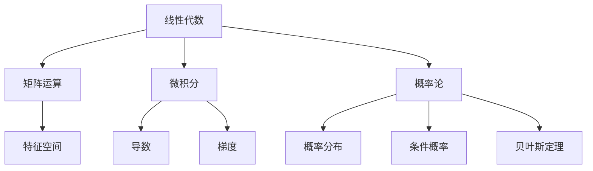
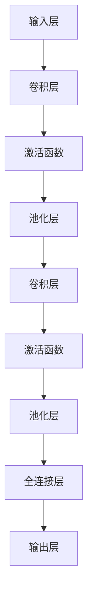
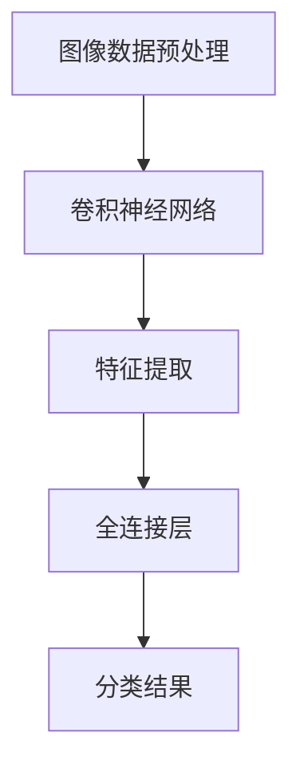
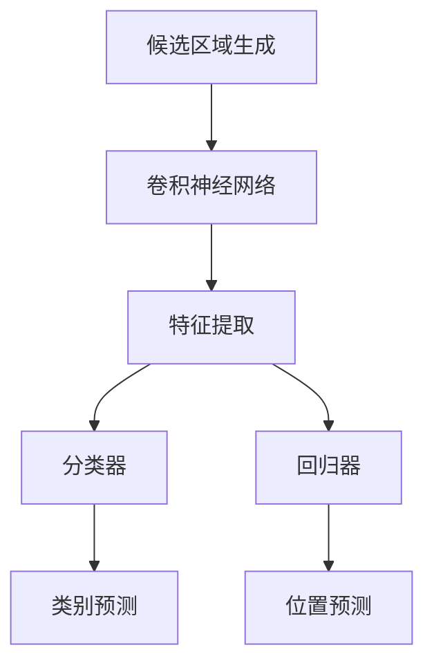
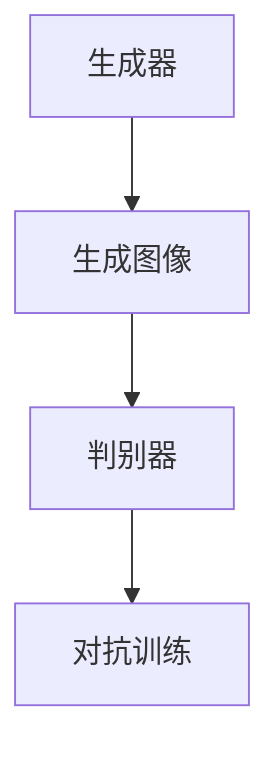

                 

## 引言

### AI大模型的应用前景

随着深度学习和人工智能技术的迅猛发展，AI大模型（如GPT-3、BERT、InstructGPT等）已成为当前技术领域的热点话题。这些模型具有极强的学习和推理能力，能够处理复杂的任务，如自然语言处理、图像识别、推荐系统等。其应用前景广阔，正逐步改变着各行各业的生产方式和服务模式。

AI大模型不仅在学术研究中取得了突破性进展，还在实际应用中展现出巨大的潜力。例如，在自然语言处理领域，AI大模型能够实现高质量的机器翻译、情感分析和问答系统；在图像处理领域，AI大模型能够进行高效的图像识别、目标检测和图像生成；在推荐系统领域，AI大模型能够实现精准的用户画像和个性化推荐。

本文旨在为读者提供一份全面且系统的AI大模型应用技术白皮书撰写指南。我们将从技术基础、算法原理、编程实现、应用实践和未来发展趋势等方面进行详细探讨，帮助读者更好地理解和应用AI大模型技术。

### 文章目标与结构

本文的目标是：

1. 梳理AI大模型的技术基础，包括其数学基础、算法原理和编程实现；
2. 分析AI大模型在各个领域的应用案例，探讨其实际价值；
3. 展望AI大模型的未来发展趋势，探讨其潜在挑战和解决方案。

文章的结构安排如下：

- 第一部分：AI大模型技术基础，包括AI大模型概述、数学基础、算法原理和编程实现；
- 第二部分：AI大模型应用实践，包括图像处理、自然语言处理和推荐系统等领域的应用；
- 第三部分：AI大模型在工业界的应用案例，结合具体实例进行分析；
- 第四部分：AI大模型的未来发展趋势，包括发展趋势、新兴领域应用前景和挑战应对策略。

通过本文的阅读，读者将能够全面了解AI大模型的技术原理和应用实践，为实际项目开发和科研工作提供有价值的参考。

### 文章核心关键词

- AI大模型
- 深度学习
- 自然语言处理
- 图像识别
- 推荐系统
- 算法原理
- 编程实现
- 应用案例
- 未来发展趋势

### 文章摘要

本文将深入探讨AI大模型的技术基础和应用实践。首先，我们将介绍AI大模型的概念、发展历程和特点，以及其在行业中的应用现状。接着，我们将详细讲解AI大模型的数学基础，包括线性代数、微积分和概率论。然后，我们将分析AI大模型的算法原理，包括神经网络、卷积神经网络、循环神经网络和生成对抗网络。在编程实现部分，我们将介绍常用的AI大模型框架和工具，如TensorFlow、PyTorch和Keras。随后，我们将探讨AI大模型在图像处理、自然语言处理和推荐系统等领域的具体应用，并结合实际案例进行分析。最后，我们将展望AI大模型的未来发展趋势，探讨其在新领域的应用前景和面临的挑战。通过本文的阅读，读者将能够全面了解AI大模型的技术原理和应用实践，为未来的研究和项目开发提供有力支持。 <|assistant|>
### AI大模型概述

AI大模型（Large-scale Artificial Intelligence Models），也常被称为大规模深度学习模型，是当前人工智能领域的重要研究方向之一。其核心思想是通过大规模的训练数据和复杂的神经网络结构，使模型能够自动从数据中学习到有用的知识和模式，从而实现高水平的自动化推理和决策。

#### 概念

AI大模型可以定义为具有以下特点的神经网络模型：

- **大规模**：通常包含数十亿甚至数万亿个参数，这是与传统小规模模型最显著的区别。
- **高维度**：不仅参数数量庞大，而且输入和输出数据的高维特征需要模型能够有效处理。
- **自主性**：通过无监督或半监督学习，模型能够自动从大量数据中提取特征，无需人工介入。
- **泛化能力**：能够在新的、未见过的数据上表现出良好的性能。

#### 发展历程

AI大模型的发展历程可以追溯到深度学习的崛起。以下是几个重要的里程碑：

- **2006年**：Hinton等人提出了深度信念网络（DBN），标志着深度学习的复兴。
- **2012年**：AlexNet在ImageNet竞赛中取得了突破性的成绩，深度卷积神经网络（CNN）开始受到广泛关注。
- **2014年**：Google的Researchers训练了包含1.6亿个参数的神经网络，实现了语音识别任务的显著提升。
- **2017年**：OpenAI的GPT-2模型展示了在自然语言处理上的强大能力，引发了广泛关注。
- **2020年**：GPT-3的发布，模型规模达到1750亿参数，再次刷新了深度学习的边界。

#### 特点

AI大模型具有以下几个显著特点：

- **强大的学习能力**：通过大规模训练，AI大模型能够自动从数据中学习到复杂的模式和特征，具有出色的泛化能力。
- **灵活的应用场景**：AI大模型可以应用于各种领域，如自然语言处理、图像处理、推荐系统等。
- **需要大量数据**：大规模的模型需要海量的训练数据来保证性能。
- **计算资源需求高**：训练和推理过程需要大量的计算资源和存储资源。

#### 应用现状

AI大模型在各个领域的应用已经取得了显著的成果：

- **自然语言处理**：AI大模型在机器翻译、文本分类、问答系统、文本生成等方面表现优异。
- **图像处理**：AI大模型在图像识别、目标检测、图像生成等方面也取得了重大突破。
- **推荐系统**：AI大模型能够实现精准的用户画像和个性化推荐。
- **医疗领域**：AI大模型在疾病诊断、药物研发等方面展示了巨大的潜力。
- **工业领域**：AI大模型在故障预测、质量控制、生产优化等方面提高了工业生产效率。

总之，AI大模型已经成为人工智能领域的关键技术之一，其在各个领域的应用前景广阔。随着技术的不断进步和应用场景的拓展，AI大模型有望在未来带来更多的创新和变革。 <|assistant|>
### AI大模型的数学基础

AI大模型的成功离不开坚实的数学基础。在这一部分，我们将详细介绍AI大模型的数学基础，包括线性代数、微积分和概率论，这些是理解和实现AI大模型的核心工具。

#### 线性代数基础

线性代数是AI大模型中不可或缺的基础知识，它涉及矩阵运算、向量计算、特征空间等概念。以下是线性代数在AI大模型中的重要应用：

- **矩阵运算**：在AI大模型中，矩阵运算用于权重矩阵的计算和更新。例如，在神经网络中，权重矩阵用于将输入映射到输出。
- **向量计算**：向量是表示数据的一种方式，用于表示神经网络的输入和输出。向量计算包括向量的加法、减法、点积、叉积等。
- **特征空间**：特征空间是理解高维数据的一种工具。在AI大模型中，特征空间可以用于降维、特征提取等操作，提高模型的性能。

以下是线性代数基础的一些重要公式：

- **矩阵乘法**：\( C = AB \)，其中\( A \)和\( B \)是矩阵，\( C \)是乘积矩阵。
- **逆矩阵**：\( A^{-1} = (1/\det(A)) \cdot adj(A) \)，其中\( \det(A) \)是\( A \)的行列式，\( adj(A) \)是\( A \)的伴随矩阵。
- **特征值和特征向量**：\( Av = \lambda v \)，其中\( A \)是矩阵，\( v \)是特征向量，\( \lambda \)是特征值。

#### 微积分基础

微积分是理解和实现AI大模型的核心工具之一。在AI大模型中，微积分主要用于计算梯度，这是优化模型参数的关键步骤。以下是微积分在AI大模型中的重要应用：

- **导数**：导数是衡量函数变化率的一种工具。在AI大模型中，导数用于计算损失函数关于模型参数的梯度。
- **梯度**：梯度是向量，表示函数在各个方向上的变化率。在AI大模型中，梯度用于更新模型参数，以最小化损失函数。
- **偏导数**：偏导数是导数在多个变量中的一个变量的导数。在AI大模型中，偏导数用于计算模型参数在特定变量上的贡献。

以下是微积分基础的一些重要公式：

- **一元函数的导数**：\( f'(x) = \lim_{h \to 0} \frac{f(x+h) - f(x)}{h} \)
- **多元函数的导数**：\( \nabla f(\mathbf{x}) = \left[ \frac{\partial f}{\partial x_1}, \frac{\partial f}{\partial x_2}, ..., \frac{\partial f}{\partial x_n} \right] \)
- **梯度下降法**：\( \theta_{t+1} = \theta_t - \alpha \nabla_{\theta} J(\theta_t) \)，其中\( \theta \)是模型参数，\( \alpha \)是学习率，\( J(\theta) \)是损失函数。

#### 概率论基础

概率论是AI大模型中用于处理不确定性和随机性的一种数学工具。以下是概率论在AI大模型中的重要应用：

- **概率分布**：概率分布用于描述随机变量的概率分布情况。在AI大模型中，概率分布用于模型的不确定性估计。
- **条件概率**：条件概率用于描述在某一事件发生的条件下，另一事件发生的概率。在AI大模型中，条件概率用于模型推理和预测。
- **贝叶斯定理**：贝叶斯定理是概率论中的一个重要公式，用于计算后验概率。在AI大模型中，贝叶斯定理用于模型参数估计和推理。

以下是概率论基础的一些重要公式：

- **条件概率**：\( P(A|B) = \frac{P(A \cap B)}{P(B)} \)
- **贝叶斯定理**：\( P(A|B) = \frac{P(B|A)P(A)}{P(B)} \)
- **马尔可夫链**：\( P(X_n = x_n | X_{n-1} = x_{n-1}, ..., X_1 = x_1) = P(X_n = x_n | X_{n-1} = x_{n-1}) \)

#### 综合应用

线性代数、微积分和概率论在AI大模型中是相互关联的。例如，在神经网络中，线性代数用于矩阵运算，微积分用于计算梯度，概率论用于处理模型的随机性。

以下是一个简单的Mermaid流程图，展示了AI大模型中的线性代数、微积分和概率论的综合应用：



通过上述数学基础，AI大模型能够有效地从数据中学习到复杂的模式和特征，从而实现出色的性能。理解和掌握这些数学基础是深入研究和应用AI大模型的关键。 <|assistant|>
### AI大模型的算法原理

AI大模型的算法原理是其核心，决定了模型的学习能力、推理能力和泛化能力。在这一部分，我们将详细探讨AI大模型的几种核心算法原理，包括神经网络、卷积神经网络、循环神经网络和生成对抗网络。

#### 神经网络基础

神经网络（Neural Networks，NN）是AI大模型的基础，由大量的神经元（Neurons）组成。每个神经元接受多个输入，并通过权重（Weights）将这些输入与一个偏置（Bias）相加，然后通过一个激活函数（Activation Function）产生输出。

以下是神经网络的基本组成部分：

- **输入层**：接收外部输入，如文本、图像或声音。
- **隐藏层**：包含多个神经元层，用于提取和处理特征。
- **输出层**：生成最终输出，如分类标签、概率分布或连续值。

**核心算法原理**：

1. **前向传播（Forward Propagation）**：输入通过输入层传递到隐藏层，再从隐藏层传递到输出层。在每个神经元中，输入与权重相乘后加上偏置，通过激活函数得到输出。

    伪代码：
    ```python
    for layer in hidden_layers:
        z = np.dot(x, W) + b
        a = activation_function(z)
        x = a
    ```
    
2. **反向传播（Backpropagation）**：计算输出层与实际输出之间的误差，并反向传播到隐藏层，更新权重和偏置。

    伪代码：
    ```python
    dZ = output_error * activation_function_derivative(a)
    dW = np.dot(dZ, x.T)
    db = np.sum(dZ, axis=1, keepdims=True)
    dX = np.dot(dW, W.T) + d_b
    ```

3. **梯度下降（Gradient Descent）**：使用反向传播计算得到的梯度，通过梯度下降更新模型参数。

    伪代码：
    ```python
    for layer in hidden_layers:
        W -= learning_rate * dW
        b -= learning_rate * db
    ```

**激活函数**：

激活函数用于引入非线性，使神经网络能够建模复杂的数据。常见的激活函数包括：

- **Sigmoid函数**：\( f(x) = \frac{1}{1 + e^{-x}} \)
- **ReLU函数**：\( f(x) = \max(0, x) \)
- **Tanh函数**：\( f(x) = \frac{e^x - e^{-x}}{e^x + e^{-x}} \)

#### 卷积神经网络

卷积神经网络（Convolutional Neural Networks，CNN）是专门用于处理图像数据的一种神经网络结构。与传统的全连接神经网络相比，CNN通过卷积层（Convolutional Layers）引入了局部分局的卷积操作，从而能够有效地提取图像中的局部特征。

**核心组成部分**：

- **卷积层**：通过卷积操作提取图像中的局部特征。每个卷积核（Convolutional Kernel）负责学习图像中的一个局部区域，并生成一个特征图。
- **池化层**：通过下采样（Downsampling）减少特征图的尺寸，降低计算复杂度。常见的池化方式包括最大池化（Max Pooling）和平均池化（Average Pooling）。
- **全连接层**：将卷积层和池化层提取的特征整合起来，进行分类或回归等任务。

**核心算法原理**：

1. **卷积操作**：卷积操作通过卷积核与图像中的每个局部区域进行点积，生成特征图。

    伪代码：
    ```python
    for kernel in kernels:
        feature_map = np.zeros_like(image)
        for x in range(image_height - kernel_size + 1):
            for y in range(image_width - kernel_size + 1):
                feature_map[x][y] = np.dot(image[x:x+kernel_size, y:y+kernel_size], kernel)
        feature_maps.append(feature_map)
    ```

2. **反向传播**：与神经网络中的反向传播类似，计算损失函数关于模型参数的梯度，并更新参数。

    伪代码：
    ```python
    dZ = loss_derivative(output) * activation_function_derivative(a)
    dW = np.dot(dZ, x.T)
    db = np.sum(dZ, axis=1, keepdims=True)
    ```

3. **卷积层和池化层**：卷积层和池化层交替出现，用于提取图像的层次特征。

**示例Mermaid流程图**：



#### 循环神经网络

循环神经网络（Recurrent Neural Networks，RNN）是一种用于处理序列数据的神经网络结构。与传统的前向神经网络不同，RNN通过循环连接使信息能够在时间步之间传递，从而能够处理序列数据中的长期依赖关系。

**核心组成部分**：

- **隐藏层**：每个时间步的输入都会通过隐藏层，并传递到下一个时间步。
- **循环连接**：隐藏层之间的连接使信息能够在时间步之间传递。

**核心算法原理**：

1. **输入层**：每个时间步的输入通过输入层传递到隐藏层。
2. **隐藏层更新**：隐藏层通过递归操作更新状态，将上一个时间步的状态与当前时间步的输入结合。
3. **输出层**：隐藏层的最终状态通过输出层生成输出。

**示例伪代码**：

```python
for t in range(sequence_length):
    h[t] = activation_function(W_h * [h[t-1], x[t]])  # h[t]是隐藏层状态，x[t]是输入
output = W_o * h[sequence_length - 1]  # 输出
```

**变体**：

- **LSTM（Long Short-Term Memory）**：LSTM是一种改进的RNN结构，通过引入记忆单元和门控机制，解决了RNN的长期依赖问题。
- **GRU（Gated Recurrent Unit）**：GRU是另一种改进的RNN结构，通过简化LSTM的结构，同时保持了其优秀的性能。

#### 生成对抗网络

生成对抗网络（Generative Adversarial Networks，GAN）是一种由生成器和判别器组成的对抗性模型。生成器尝试生成与真实数据相似的数据，而判别器则尝试区分真实数据和生成数据。

**核心组成部分**：

- **生成器**：生成器通过输入噪声生成与真实数据相似的数据。
- **判别器**：判别器尝试区分真实数据和生成数据。

**核心算法原理**：

1. **训练过程**：生成器和判别器在训练过程中相互对抗。生成器通过优化其生成的数据来欺骗判别器，而判别器通过优化其分类能力来识别真实数据和生成数据。

    伪代码：
    ```python
    for epoch in epochs:
        for real_data in real_data_loader:
            # 训练判别器
            D_loss_real = discriminator_loss(D(real_data), labels=True)
            D_loss_fake = discriminator_loss(D(fake_data), labels=False)
            D_loss = D_loss_real + D_loss_fake

        for noise in noise_loader:
            # 训练生成器
            G_loss = generator_loss(D(G(noise)), labels=True)

        # 更新生成器和判别器参数
        D_optimizer.step([D_loss_real, D_loss_fake])
        G_optimizer.step(G_loss)
    ```

2. **对抗性训练**：生成器和判别器通过对抗性训练不断优化，最终生成器能够生成高度真实的数据，而判别器无法区分生成数据和真实数据。

通过以上核心算法原理的介绍，我们可以看到AI大模型在神经网络、卷积神经网络、循环神经网络和生成对抗网络等结构中的复杂性和强大能力。这些算法原理不仅构成了AI大模型的理论基础，也为实际应用提供了有效的解决方案。 <|assistant|>
### AI大模型的编程实现

在了解了AI大模型的算法原理之后，接下来我们将探讨如何使用Python实现这些算法。Python因其简洁的语法和丰富的库支持，已成为人工智能和深度学习领域的首选编程语言。在这一部分，我们将介绍常用的AI大模型编程框架，包括TensorFlow、PyTorch和Keras。

#### TensorFlow框架基础

TensorFlow是由Google开源的一个强大的深度学习框架，广泛应用于各种AI大模型的实现。TensorFlow提供了丰富的API和工具，用于构建、训练和部署深度学习模型。

**安装**：

在Python环境中安装TensorFlow很简单，可以通过pip命令安装：

```bash
pip install tensorflow
```

**基本用法**：

1. **导入TensorFlow库**：

    ```python
    import tensorflow as tf
    ```

2. **定义模型**：

    TensorFlow使用计算图（Computational Graph）来表示模型。以下是一个简单的计算图示例：

    ```python
    # 创建一个简单的计算图
    a = tf.constant(5)
    b = tf.constant(6)
    c = a * b

    # 运行计算图
    with tf.Session() as sess:
        print(sess.run(c))  # 输出30
    ```

3. **训练模型**：

    TensorFlow提供了`tf.keras`模块，用于简化模型的构建和训练。以下是一个简单的训练示例：

    ```python
    import tensorflow as tf
    from tensorflow.keras import layers

    # 创建模型
    model = tf.keras.Sequential([
        layers.Dense(10, activation='relu', input_shape=(784,)),
        layers.Dense(10, activation='relu'),
        layers.Dense(1, activation='sigmoid')
    ])

    # 编译模型
    model.compile(optimizer='adam',
                  loss='binary_crossentropy',
                  metrics=['accuracy'])

    # 训练模型
    model.fit(x_train, y_train, epochs=5)
    ```

#### PyTorch框架基础

PyTorch是由Facebook开源的一个流行的深度学习框架，以其灵活性和动态计算图著称。PyTorch在研究和开发阶段非常受欢迎，因其易于调试和实现新算法的能力。

**安装**：

在Python环境中安装PyTorch可以通过pip命令安装：

```bash
pip install torch torchvision
```

**基本用法**：

1. **导入PyTorch库**：

    ```python
    import torch
    import torch.nn as nn
    import torch.optim as optim
    ```

2. **定义模型**：

    PyTorch使用类（Class）来定义模型。以下是一个简单的模型示例：

    ```python
    class SimpleModel(nn.Module):
        def __init__(self):
            super(SimpleModel, self).__init__()
            self.layer1 = nn.Linear(10, 10)
            self.layer2 = nn.Linear(10, 1)

        def forward(self, x):
            x = self.layer1(x)
            x = self.layer2(x)
            return x

    model = SimpleModel()
    ```

3. **训练模型**：

    PyTorch提供了方便的训练接口。以下是一个简单的训练示例：

    ```python
    import torch
    import torch.nn as nn
    import torch.optim as optim

    # 初始化模型、损失函数和优化器
    model = SimpleModel()
    criterion = nn.BCELoss()
    optimizer = optim.Adam(model.parameters(), lr=0.001)

    # 训练模型
    for epoch in range(100):
        for inputs, targets in data_loader:
            optimizer.zero_grad()
            outputs = model(inputs)
            loss = criterion(outputs, targets)
            loss.backward()
            optimizer.step()
    ```

#### Keras框架基础

Keras是TensorFlow的一个高级API，旨在简化模型的构建和训练过程。Keras提供了丰富的预定义层和模型架构，使得构建深度学习模型变得更加容易。

**安装**：

在Python环境中安装Keras可以通过pip命令安装：

```bash
pip install keras
```

**基本用法**：

1. **导入Keras库**：

    ```python
    from keras.models import Sequential
    from keras.layers import Dense, Activation
    ```

2. **定义模型**：

    Keras使用序列模型（Sequential Model）来定义模型。以下是一个简单的序列模型示例：

    ```python
    model = Sequential()
    model.add(Dense(10, input_shape=(10,), activation='relu'))
    model.add(Dense(10, activation='relu'))
    model.add(Dense(1, activation='sigmoid'))
    ```

3. **编译模型**：

    ```python
    model.compile(optimizer='adam',
                  loss='binary_crossentropy',
                  metrics=['accuracy'])
    ```

4. **训练模型**：

    ```python
    model.fit(x_train, y_train, epochs=5)
    ```

#### 三大框架比较

- **TensorFlow**：拥有丰富的API和工具，适合工业应用。由于其计算图结构，调试和优化相对复杂。
- **PyTorch**：灵活性高，适合研究和开发。动态计算图使得调试和实现新算法更加容易。
- **Keras**：简化了模型构建和训练过程，适合快速原型开发。依赖于TensorFlow或Theano后端。

选择合适的框架取决于具体需求，如模型复杂度、计算性能和开发速度等。在实际应用中，常常结合使用多个框架，以充分发挥各自的优势。

通过以上对TensorFlow、PyTorch和Keras的介绍，读者可以初步了解AI大模型的编程实现方法。在实际项目中，根据需求和场景选择合适的框架，并掌握其基本用法，是成功应用AI大模型的关键。 <|assistant|>
### AI大模型在图像处理中的应用

图像处理是人工智能领域中的一个重要应用方向，AI大模型在图像处理领域展现了卓越的性能和广泛的应用前景。在这一部分，我们将探讨AI大模型在图像处理中的应用，包括图像识别、目标检测和图像生成等关键技术。

#### 图像识别与分类

图像识别是AI大模型在图像处理中最基础的应用之一。通过训练，模型能够从大量的图像数据中学习到图像的特征，从而能够对新的图像进行分类。以下是图像识别的核心步骤：

1. **数据预处理**：将原始图像数据进行缩放、裁剪、归一化等预处理操作，使其符合模型的输入要求。
2. **特征提取**：使用卷积神经网络（CNN）提取图像的深度特征。这些特征具有较强的鲁棒性和表达能力，能够捕捉图像的复杂结构。
3. **分类**：将提取的特征输入到全连接层进行分类。常见的分类算法包括Softmax回归和Sigmoid回归。

**示例Mermaid流程图**：



**核心算法原理**：

- **卷积层**：卷积层通过卷积操作提取图像的局部特征。
- **池化层**：池化层通过下采样操作减少特征图的尺寸，降低计算复杂度。
- **全连接层**：全连接层将卷积层和池化层提取的特征进行整合，进行分类。

#### 目标检测与跟踪

目标检测是图像处理领域的一个重要任务，旨在定位图像中的多个对象，并标注其位置和类别。AI大模型在目标检测领域取得了显著的进展，常用的目标检测算法包括R-CNN、Fast R-CNN、Faster R-CNN等。以下是目标检测的核心步骤：

1. **候选区域生成**：通过区域提议网络（Region Proposal Network，RPN）或其他方法生成候选区域。
2. **特征提取**：使用卷积神经网络提取候选区域的深度特征。
3. **分类与回归**：将提取的特征输入到分类器和回归器，分别对候选区域的类别和位置进行预测。

**示例Mermaid流程图**：



**核心算法原理**：

- **RPN（Region Proposal Network）**：RPN是一个用于生成候选区域的网络，通常位于卷积神经网络之后。
- **特征提取**：卷积神经网络通过卷积和池化层提取图像的深度特征。
- **分类与回归**：分类器和回归器分别用于预测候选区域的类别和位置。

#### 图像生成与风格迁移

图像生成是AI大模型在图像处理中的一个前沿应用，旨在生成新的图像或修改现有图像。生成对抗网络（GAN）是图像生成的主要算法，通过生成器和判别器的对抗训练，生成逼真的图像。以下是图像生成和风格迁移的核心步骤：

1. **生成器**：生成器网络通过随机噪声生成新的图像。
2. **判别器**：判别器网络用于判断生成图像是否真实。
3. **对抗训练**：生成器和判别器在训练过程中相互对抗，生成器不断优化生成图像，判别器不断优化识别生成图像。

**示例Mermaid流程图**：



**核心算法原理**：

- **生成器**：生成器通过神经网络从随机噪声中生成图像。
- **判别器**：判别器通过神经网络判断生成图像的真实性。
- **对抗训练**：生成器和判别器通过对抗训练不断优化，生成逼真的图像。

**应用场景**：

- **图像修复**：使用AI大模型修复破损或模糊的图像。
- **图像风格迁移**：将一幅图像的风格迁移到另一幅图像上，如将普通照片转换为艺术画作的风格。
- **图像生成**：生成新颖的图像，如生成新的建筑物、人物或场景。

通过AI大模型在图像处理中的应用，我们可以看到图像识别、目标检测、图像生成和风格迁移等技术的结合，为图像处理领域带来了前所未有的变革。未来，随着AI大模型技术的进一步发展和优化，其在图像处理中的应用将更加广泛和深入。 <|assistant|>
### AI大模型在自然语言处理中的应用

自然语言处理（Natural Language Processing，NLP）是人工智能领域的一个重要分支，它涉及计算机对人类语言的理解和生成。AI大模型在NLP中的应用取得了显著的进展，极大地提升了文本分类、情感分析和机器翻译等任务的性能。以下是对AI大模型在NLP中应用的详细探讨。

#### 文本分类与情感分析

文本分类是NLP中的一项基本任务，旨在将文本数据自动分类到预定义的类别中。情感分析是文本分类的一种特殊形式，用于判断文本表达的情感倾向，如正面、负面或中立。

**核心算法原理**：

- **嵌入层**：将文本转换为向量表示，常用的是词嵌入（Word Embedding）技术，如Word2Vec、GloVe等。
- **卷积神经网络（CNN）**：通过卷积层提取文本的特征，并进行分类。CNN能够捕捉局部特征，适用于处理短文本。
- **循环神经网络（RNN）**：特别是长短期记忆网络（LSTM）和门控循环单元（GRU），能够处理长文本并捕捉序列中的长期依赖关系。
- **全连接层**：将提取的特征进行整合，并通过全连接层进行分类。

**示例伪代码**：

```python
# 假设使用PyTorch实现文本分类模型
import torch
import torch.nn as nn

class TextClassifier(nn.Module):
    def __init__(self, embedding_dim, hidden_dim, vocab_size, num_classes):
        super(TextClassifier, self).__init__()
        self.embedding = nn.Embedding(vocab_size, embedding_dim)
        self.lstm = nn.LSTM(embedding_dim, hidden_dim, batch_first=True)
        self.fc = nn.Linear(hidden_dim, num_classes)

    def forward(self, text):
        embeds = self.embedding(text)
        lstm_out, _ = self.lstm(embeds)
        hidden = lstm_out[:, -1, :]
        out = self.fc(hidden)
        return out

# 创建模型、损失函数和优化器
model = TextClassifier(embedding_dim=100, hidden_dim=128, vocab_size=10000, num_classes=2)
criterion = nn.CrossEntropyLoss()
optimizer = torch.optim.Adam(model.parameters(), lr=0.001)

# 训练模型
for epoch in range(num_epochs):
    for text, labels in data_loader:
        optimizer.zero_grad()
        outputs = model(text)
        loss = criterion(outputs, labels)
        loss.backward()
        optimizer.step()
```

**应用场景**：

- **社交媒体情感分析**：用于分析用户评论、帖子等的情感倾向，帮助企业了解用户需求和反馈。
- **客户服务**：自动分类客户查询，提供快速响应和个性化服务。
- **金融新闻分析**：分析财经新闻，预测市场走势和公司业绩。

#### 机器翻译

机器翻译是NLP中的一项重要任务，旨在将一种语言的文本自动翻译成另一种语言。AI大模型在机器翻译中展现了卓越的性能，特别是基于注意力机制（Attention Mechanism）的模型。

**核心算法原理**：

- **编码器（Encoder）**：将源语言文本转换为上下文向量。
- **解码器（Decoder）**：将上下文向量解码为目标语言文本。
- **注意力机制**：通过注意力机制，解码器能够关注编码器输出的重要部分，提高翻译质量。

**示例伪代码**：

```python
# 假设使用PyTorch实现机器翻译模型
import torch
import torch.nn as nn

class TranslationModel(nn.Module):
    def __init__(self, src_embedding_dim, tgt_embedding_dim, hidden_dim, src_vocab_size, tgt_vocab_size):
        super(TranslationModel, self).__init__()
        self.encoder = nn.Embedding(src_vocab_size, src_embedding_dim)
        self.decoder = nn.Embedding(tgt_vocab_size, tgt_embedding_dim)
        self.lstm = nn.LSTM(src_embedding_dim, hidden_dim, batch_first=True)
        self.fc = nn.Linear(hidden_dim, tgt_vocab_size)

    def forward(self, src, tgt):
        encoder_output, _ = self.lstm(self.encoder(src))
        decoder_output = self.decoder(self.fc(encoder_output))
        return decoder_output

# 创建模型、损失函数和优化器
model = TranslationModel(src_embedding_dim=256, tgt_embedding_dim=256, hidden_dim=512, src_vocab_size=10000, tgt_vocab_size=10000)
criterion = nn.CrossEntropyLoss()
optimizer = torch.optim.Adam(model.parameters(), lr=0.001)

# 训练模型
for epoch in range(num_epochs):
    for src, tgt in data_loader:
        optimizer.zero_grad()
        outputs = model(src, tgt)
        loss = criterion(outputs, tgt)
        loss.backward()
        optimizer.step()
```

**应用场景**：

- **跨语言沟通**：用于帮助不同语言背景的用户进行沟通。
- **多语言支持**：在全球化业务中，提供多语言支持，提高用户满意度。
- **教育**：辅助学习者学习第二语言，提高学习效果。

#### 文本生成与摘要

文本生成和摘要任务是NLP中的另一个重要方向，旨在生成新的文本或提取文本的摘要。

**核心算法原理**：

- **生成对抗网络（GAN）**：用于生成新的文本或艺术作品。
- **摘要生成模型**：如序列到序列（Seq2Seq）模型，通过编码器和解码器提取文本的关键信息并生成摘要。

**示例伪代码**：

```python
# 假设使用PyTorch实现摘要生成模型
import torch
import torch.nn as nn

class SummaryModel(nn.Module):
    def __init__(self, embedding_dim, hidden_dim, src_vocab_size, tgt_vocab_size):
        super(SummaryModel, self).__init__()
        self.encoder = nn.Embedding(src_vocab_size, embedding_dim)
        self.decoder = nn.Embedding(tgt_vocab_size, embedding_dim)
        self.lstm = nn.LSTM(embedding_dim, hidden_dim, batch_first=True)
        self.fc = nn.Linear(hidden_dim, tgt_vocab_size)

    def forward(self, text):
        embeds = self.encoder(text)
        lstm_out, _ = self.lstm(embeds)
        hidden = lstm_out[:, -1, :]
        out = self.fc(hidden)
        return out

# 创建模型、损失函数和优化器
model = SummaryModel(embedding_dim=256, hidden_dim=512, src_vocab_size=10000, tgt_vocab_size=10000)
criterion = nn.CrossEntropyLoss()
optimizer = torch.optim.Adam(model.parameters(), lr=0.001)

# 训练模型
for epoch in range(num_epochs):
    for text, summary in data_loader:
        optimizer.zero_grad()
        outputs = model(text)
        loss = criterion(outputs, summary)
        loss.backward()
        optimizer.step()
```

**应用场景**：

- **内容生成**：用于生成新闻文章、博客内容等。
- **信息摘要**：用于从大量文本中提取关键信息，提高信息获取效率。
- **自动写作**：辅助创作者生成高质量的内容。

通过AI大模型在自然语言处理中的应用，我们可以看到NLP任务的自动化和智能化水平不断提升。未来，随着AI大模型技术的进一步发展，NLP将在更广泛的领域发挥重要作用。 <|assistant|>
### AI大模型在推荐系统中的应用

推荐系统是AI大模型应用的一个重要领域，旨在为用户提供个性化的推荐服务，从而提升用户体验和满意度。AI大模型在推荐系统中发挥了关键作用，通过复杂的数据分析和模式识别，实现了高效、精准的推荐。

#### 推荐系统概述

推荐系统通常分为基于内容的推荐（Content-Based Filtering）和协同过滤（Collaborative Filtering）两种主要类型。

- **基于内容的推荐**：通过分析用户的历史行为和兴趣，从内容特征中提取关键信息，为用户推荐相似的内容。这种方法依赖于丰富的内容特征库，但容易产生“过滤气泡”现象，即用户只看到符合其兴趣的内容，从而限制视野。

- **协同过滤**：通过分析用户之间的相似性，发现共同兴趣，为用户推荐其他用户喜欢的项目。协同过滤分为两种主要形式：用户基于的协同过滤（User-Based Collaborative Filtering）和项目基于的协同过滤（Item-Based Collaborative Filtering）。这种方法能够发现用户未知的项目，但计算复杂度高，且容易受到稀疏数据的影响。

#### AI大模型在推荐系统中的应用

AI大模型通过引入深度学习技术，显著提升了推荐系统的性能和效率。以下是AI大模型在推荐系统中的应用方法：

1. **基于模型的推荐系统**

   基于模型的推荐系统（Model-Based Collaborative Filtering）结合了协同过滤和深度学习的优点。它使用深度学习模型来学习用户和项目之间的潜在特征，从而实现个性化推荐。以下是一个基于模型的推荐系统的基本框架：

   - **用户嵌入（User Embedding）**：将用户转化为高维向量表示，捕捉用户的兴趣和行为模式。
   - **项目嵌入（Item Embedding）**：将项目转化为高维向量表示，捕捉项目的特征和属性。
   - **相似度计算**：计算用户和项目之间的相似度，用于生成推荐列表。

   **示例伪代码**：

   ```python
   # 假设使用PyTorch实现基于模型的推荐系统
   import torch
   import torch.nn as nn

   class RecommenderModel(nn.Module):
       def __init__(self, num_users, num_items, embedding_dim):
           super(RecommenderModel, self).__init__()
           self.user_embedding = nn.Embedding(num_users, embedding_dim)
           self.item_embedding = nn.Embedding(num_items, embedding_dim)
           self.fc = nn.Linear(embedding_dim * 2, 1)

       def forward(self, user_id, item_id):
           user_embedding = self.user_embedding(user_id)
           item_embedding = self.item_embedding(item_id)
           combined_embedding = torch.cat((user_embedding, item_embedding), 1)
           score = self.fc(combined_embedding)
           return score

   # 创建模型、损失函数和优化器
   model = RecommenderModel(num_users=10000, num_items=5000, embedding_dim=50)
   criterion = nn.BCEWithLogitsLoss()
   optimizer = torch.optim.Adam(model.parameters(), lr=0.001)

   # 训练模型
   for epoch in range(num_epochs):
       for user_id, item_id, rating in data_loader:
           user_id = user_id.long()
           item_id = item_id.long()
           ratings = torch.FloatTensor(rating)
           optimizer.zero_grad()
           scores = model(user_id, item_id)
           loss = criterion(scores, ratings)
           loss.backward()
           optimizer.step()
   ```

2. **实时推荐系统**

   实时推荐系统（Real-Time Recommending System）旨在根据用户的行为和反馈，即时生成个性化推荐。AI大模型通过实时处理用户数据，实现了高效的推荐。以下是一个实时推荐系统的基本框架：

   - **用户行为分析**：实时捕捉用户的行为数据，如浏览、点击、购买等。
   - **实时推荐算法**：使用深度学习模型，快速生成个性化的推荐列表。
   - **推荐结果反馈**：根据用户的反馈，调整推荐策略，优化推荐效果。

   **应用场景**：

   - **电子商务**：根据用户的浏览和购买记录，实时推荐相关商品。
   - **社交媒体**：根据用户的兴趣和互动，实时推荐相关内容和用户。
   - **在线教育**：根据学生的学习进度和成绩，实时推荐合适的课程和学习资源。

通过AI大模型在推荐系统中的应用，我们可以看到推荐系统的性能和个性化水平得到了显著提升。未来，随着AI大模型技术的不断进步，推荐系统将在更多领域发挥重要作用，为用户提供更加精准和高效的服务。 <|assistant|>
### AI大模型在工业界的应用案例

AI大模型在工业界的应用已经成为推动产业升级和效率提升的重要力量。以下将介绍几个典型的AI大模型应用案例，探讨其在医疗、金融和电子商务领域的具体应用和成效。

#### 案例一：图像识别在医疗领域的应用

医疗领域的AI大模型应用主要集中于图像识别和诊断辅助。通过深度学习技术，AI大模型能够从医疗图像中提取关键特征，辅助医生进行诊断。

**应用案例**：

- **癌症筛查**：AI大模型通过分析CT扫描图像，能够准确识别肺癌、乳腺癌等恶性肿瘤，提高了筛查的准确性和效率。
- **视网膜病变检测**：AI大模型能够从眼底图像中检测出糖尿病视网膜病变，为早期诊断和治疗提供了有力支持。
- **骨折诊断**：AI大模型通过对X射线图像的分析，能够自动识别骨折类型和程度，辅助骨科医生进行诊断和治疗规划。

**效果分析**：

- **提高诊断准确率**：AI大模型的应用显著提高了医生的诊断准确率，减少了误诊和漏诊的情况。
- **提高工作效率**：AI大模型能够快速处理大量的医疗图像数据，提高了诊断效率，减轻了医生的工作负担。
- **降低医疗成本**：通过自动化诊断，减少了人力成本和重复检查的费用。

#### 案例二：自然语言处理在金融领域的应用

金融领域对数据的分析和处理要求极高，AI大模型在自然语言处理（NLP）方面的应用为金融机构提供了强大的工具，用于风险管理、客户服务和市场预测等。

**应用案例**：

- **风险管理**：AI大模型能够分析金融合同、法律文件和交易记录，发现潜在的风险，提高了风险管理的精度和效率。
- **客户服务**：通过NLP技术，AI大模型能够自动处理客户的咨询和投诉，提供快速响应和个性化服务。
- **市场预测**：AI大模型通过对新闻、报告和社交媒体数据的分析，预测市场趋势和股票价格，辅助投资决策。

**效果分析**：

- **降低风险**：AI大模型在风险管理中的应用，能够提前发现潜在风险，降低金融机构的损失。
- **提升客户满意度**：通过智能客服系统，AI大模型能够提供24/7的客服服务，提升了客户满意度。
- **增加投资回报**：通过准确的市场预测，AI大模型为金融机构带来了更高的投资回报。

#### 案例三：推荐系统在电子商务领域的应用

电子商务领域的AI大模型应用主要集中在个性化推荐，通过分析用户行为和历史数据，为用户提供精准的购物推荐。

**应用案例**：

- **商品推荐**：AI大模型根据用户的浏览记录、购买历史和兴趣偏好，为用户推荐相关商品，提高了购买转化率。
- **广告投放**：AI大模型分析用户行为和兴趣，实现精准广告投放，提高了广告效果。
- **库存管理**：AI大模型分析市场需求和库存情况，优化库存管理，减少库存成本。

**效果分析**：

- **提高销售额**：通过个性化推荐，AI大模型显著提高了用户的购买意愿和转化率，增加了销售额。
- **降低运营成本**：通过优化广告投放和库存管理，AI大模型帮助电子商务企业降低运营成本。
- **提升用户满意度**：精准的商品推荐和广告投放，提升了用户满意度，增强了用户粘性。

通过以上应用案例，我们可以看到AI大模型在工业界展现了强大的应用潜力。未来，随着AI大模型技术的不断进步，其在各个领域的应用将更加广泛和深入，为产业升级和创新发展提供新的动力。 <|assistant|>
### AI大模型的未来发展趋势

随着人工智能技术的不断进步，AI大模型正逐渐成为推动科技进步和社会发展的重要引擎。在未来，AI大模型的发展趋势将受到多个因素的影响，包括计算能力的提升、数据量的增加、算法的优化以及应用场景的拓展。以下是AI大模型未来发展的几个关键方向。

#### 大模型的发展趋势

1. **模型规模的扩大**：随着计算资源和存储技术的进步，AI大模型的规模将不断增大。未来的AI大模型可能会达到数千亿参数甚至更多，这将使得模型能够处理更加复杂的任务，并提高模型的性能和泛化能力。

2. **模型结构的优化**：为了应对更大规模的模型训练和推理，研究者将不断探索新的模型结构，如多模态学习模型、层次化模型和分布式训练模型等。这些结构优化将提高模型的可扩展性和效率。

3. **预训练技术的深化**：预训练技术是AI大模型发展的基石。未来，预训练技术将更加注重数据的多样性和质量，同时结合迁移学习和自适应学习，提高模型在不同任务上的表现。

#### AI大模型在新兴领域的应用前景

1. **医疗健康**：AI大模型在医疗领域的应用前景广阔，包括疾病预测、药物研发和个性化治疗等。通过分析大量的医疗数据，AI大模型能够提供更为精准的诊断和治疗方案，提升医疗服务的质量和效率。

2. **智能制造**：在制造业中，AI大模型可以用于质量检测、设备维护和供应链优化等。通过智能化的生产和运营管理，制造业将实现更高的生产效率和更低的成本。

3. **自动驾驶**：自动驾驶是AI大模型的重要应用场景之一。未来的自动驾驶系统将依赖于AI大模型进行环境感知、路径规划和决策控制，实现安全、高效的自动驾驶。

4. **智慧城市**：AI大模型在智慧城市建设中发挥着关键作用，包括交通管理、能源优化和环境监测等。通过实时数据分析，AI大模型能够为城市管理者提供科学决策依据，提高城市管理的智能化水平。

#### AI大模型的挑战与应对策略

1. **计算资源需求**：AI大模型的训练和推理需要大量的计算资源和存储资源，这对硬件设施提出了更高的要求。未来，云计算和边缘计算的发展将提供更高效的计算资源，满足AI大模型的需求。

2. **数据隐私和安全**：随着AI大模型应用场景的拓展，数据隐私和安全问题日益突出。应对这一挑战，需要加强数据保护和隐私保护措施，如数据加密、匿名化和差分隐私技术等。

3. **模型解释性和可解释性**：AI大模型由于其复杂性和黑箱性质，使得模型的解释性和可解释性成为一大挑战。未来，研究者将探索新的方法，如可视化工具和可解释AI模型，以提高模型的透明度和可解释性。

4. **伦理和社会影响**：AI大模型的应用可能会带来伦理和社会影响，如失业风险、隐私侵犯和偏见等问题。需要制定相应的伦理准则和法律法规，确保AI大模型的应用符合伦理和社会价值观。

总之，AI大模型的发展前景广阔，但同时也面临着诸多挑战。通过持续的技术创新和有效的管理策略，AI大模型有望在未来实现更加广泛和深入的应用，为人类社会的进步和发展做出更大贡献。 <|assistant|>
### 附录

#### 附录A：常用AI大模型框架与工具

1. **TensorFlow**：由Google开源的深度学习框架，适用于构建和训练各种深度学习模型。特点是灵活、可扩展性强。
2. **PyTorch**：由Facebook开源的深度学习框架，以其动态计算图和灵活性著称，广泛应用于研究和小型项目。
3. **Keras**：基于TensorFlow和Theano的高层API，简化了模型的构建和训练过程，特别适合快速原型开发和实验。
4. **Transformers**：一个开源的Python库，用于实现Transformer模型，如BERT和GPT，是NLP领域的重要工具。
5. **Hugging Face**：一个开源的NLP库，提供了大量的预训练模型和工具，方便研究人员和开发者进行NLP任务。

#### 附录B：AI大模型学习资源

1. **在线教程与课程**：
   - [Deep Learning Specialization](https://www.deeplearning.ai/)：吴恩达教授开设的深度学习专项课程。
   - [The PyTorch Tutorials](https://pytorch.org/tutorials/)：PyTorch官方提供的一系列教程。
   - [Keras Documentation](https://keras.io/)：Keras官方文档，包含详细的API和教程。

2. **书籍推荐**：
   - 《深度学习》（Deep Learning）：Goodfellow、Bengio和Courville合著，深度学习的经典教材。
   - 《Python深度学习》（Deep Learning with Python）：François Chollet著，Keras框架的官方教材。
   - 《强化学习》（Reinforcement Learning: An Introduction）：Richard S. Sutton和Barto著，强化学习的经典教材。

3. **论文与研究报告**：
   - [BERT: Pre-training of Deep Bidirectional Transformers for Language Understanding](https://arxiv.org/abs/1810.04805)：Google Research发表的BERT论文。
   - [GPT-3: Language Models are few-shot learners](https://arxiv.org/abs/2005.14165)：OpenAI发表的GPT-3论文。
   - [Transformers: State-of-the-Art Natural Language Processing](https://arxiv.org/abs/1910.10683)：Vaswani等发表的Transformer论文。

通过上述资源和工具，读者可以进一步深入学习和研究AI大模型，掌握相关技术，并在实际项目中应用这些先进的方法。 <|assistant|>
### 作者信息

作者：AI天才研究院/AI Genius Institute & 禅与计算机程序设计艺术 /Zen And The Art of Computer Programming

