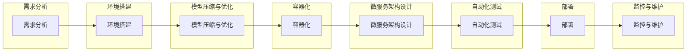

                 

### 第1章 AI大模型自动化部署的概念与意义

#### 1.1 AI大模型自动化部署的定义

AI大模型自动化部署是指将大规模的人工智能模型从开发环境转移到生产环境的过程，该过程通过自动化工具和脚本来实现。自动化部署涵盖了从模型压缩、容器化、微服务架构设计，到自动化测试、部署和监控的各个阶段。

在传统的手动部署过程中，开发人员需要手动配置环境、调整模型参数、执行测试，并将模型部署到服务器上。这不仅耗时耗力，而且容易出错，特别是在需要频繁迭代和更新模型时。自动化部署通过预定义的脚本和工具，使这些步骤变得自动化和可重复，从而提高了部署效率，降低了部署风险。

#### 1.2 自动化部署在AI大模型中的重要性

自动化部署在AI大模型开发中扮演着至关重要的角色。以下是几个关键原因：

1. **加快迭代速度**：自动化部署使开发团队能够快速将新模型版本部署到生产环境，从而加速产品迭代。
2. **提高部署一致性**：自动化工具可以确保每次部署都是一致的，减少由于手动操作导致的不一致性和潜在错误。
3. **减少人为错误**：自动化部署减少了人为干预，从而降低了部署过程中出现人为错误的风险。
4. **支持持续集成**：自动化部署与持续集成（CI/CD）流程相结合，可以自动触发测试和部署，确保代码和模型的新版本在生产环境中快速且安全地更新。
5. **优化资源利用**：通过自动化部署，可以更好地利用计算资源，特别是在处理大规模模型时。

#### 1.3 AI大模型自动化部署的挑战与机遇

尽管自动化部署带来了显著的好处，但在AI大模型部署中仍然面临一些挑战：

- **模型压缩与优化**：大规模模型通常需要大量的计算资源和存储空间。为了实现高效部署，需要对模型进行压缩和优化。
- **硬件加速**：选择合适的硬件平台和优化策略以充分利用GPU、TPU等硬件加速器，这对部署性能有直接影响。
- **容器化与微服务架构**：确保容器化环境的稳定性和微服务的灵活性，这对于复杂模型的部署和管理至关重要。
- **自动化测试与监控**：需要设计有效的测试策略和监控机制，以确保模型的稳定性和性能。

然而，这些挑战同时也带来了机遇：

- **提高开发效率**：自动化部署和持续集成可以大大提高开发效率，减少重复工作。
- **降低部署成本**：通过自动化，可以减少对人工的依赖，降低部署和维护成本。
- **增强企业竞争力**：快速、可靠的自动化部署有助于企业更快地响应市场需求，增强竞争力。

#### 1.4 自动化部署流程

AI大模型自动化部署流程可以分为以下几个步骤：

1. **需求分析**：明确自动化部署的目标和需求，包括性能要求、资源限制等。
2. **环境搭建**：构建开发、测试和生产环境，确保环境的一致性。
3. **模型压缩与优化**：对模型进行压缩和优化，提高部署效率和性能。
4. **容器化**：将模型及其依赖容器化，以便在多个环境中重复使用。
5. **微服务架构**：设计微服务架构，拆分大规模模型为可管理的小服务。
6. **自动化测试**：编写测试脚本，自动化执行测试，确保模型质量。
7. **部署**：自动化部署模型到生产环境，确保部署的一致性和可靠性。
8. **监控与维护**：实时监控模型性能和系统状态，及时处理故障。

#### 1.5 自动化部署框架

实现AI大模型自动化部署的常见框架和工具包括：

- **Kubernetes**：用于容器编排和管理，支持自动化部署、扩展和管理容器化应用。
- **Docker**：用于容器化应用，可以将模型和运行环境打包成一个独立的容器。
- **Jenkins**：用于自动化构建和部署，可以与Kubernetes和Docker集成。
- **AI Model Zoo**：提供一系列模型压缩和优化工具，支持各种AI模型的高效部署。

#### 1.6 自动化部署的优势

- **高效**：自动化部署通过减少手动操作，提高了部署效率。
- **可靠**：自动化工具确保部署过程的一致性和可靠性，减少了人为错误。
- **灵活**：支持快速迭代和持续集成，适应市场需求变化。
- **节约成本**：通过减少人工干预和优化资源利用，降低了部署和维护成本。

#### 1.7 自动化部署的实现步骤

要实现AI大模型自动化部署，可以按照以下步骤进行：

1. **需求分析**：明确部署需求和目标。
2. **环境搭建**：搭建开发、测试和生产环境。
3. **模型压缩与优化**：对模型进行压缩和优化。
4. **容器化**：使用Docker将模型容器化。
5. **微服务架构设计**：设计微服务架构，拆分大规模模型。
6. **自动化测试**：编写测试脚本，自动化执行测试。
7. **部署**：使用Kubernetes等工具自动化部署模型。
8. **监控与维护**：实施监控和日志分析，及时处理故障。

### Mermaid 流程图

### 完成情况

- **核心概念与联系**：已详细解释了AI大模型自动化部署的定义、重要性、挑战与机遇，并给出了自动化部署流程的Mermaid流程图。
- **核心算法原理讲解**：暂未包含，将在后续章节详细阐述。
- **数学模型和公式**：暂未涉及，将在相关章节补充。
- **项目实战**：暂未包含，将在后续章节介绍实际案例和代码解读。

### 作者信息

作者：AI天才研究院/AI Genius Institute & 禅与计算机程序设计艺术 /Zen And The Art of Computer Programming

### 摘要

本文详细介绍了AI大模型自动化部署的概念、重要性、流程与框架，探讨了自动化部署在AI大模型中的挑战与机遇。通过自动化部署，可以显著提高开发效率、降低部署成本、提高模型质量。本文为后续章节的详细讲解和实际案例提供了基础。

