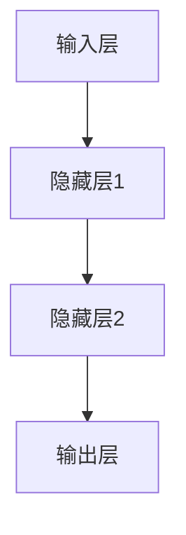
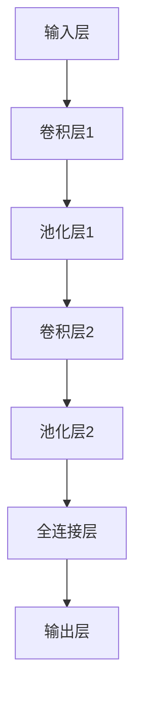
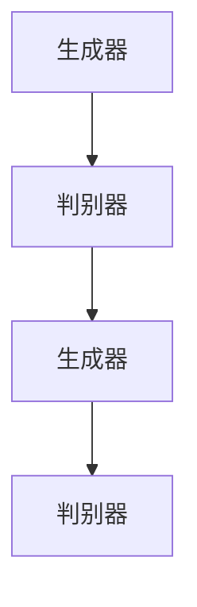
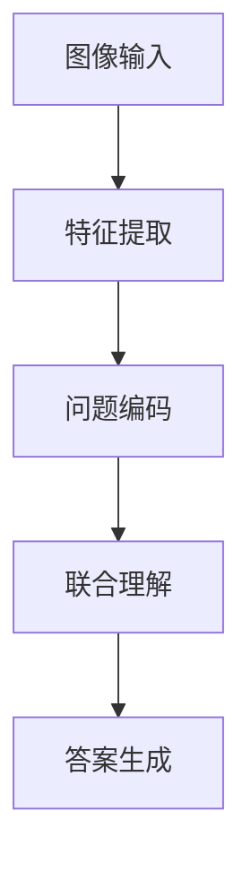
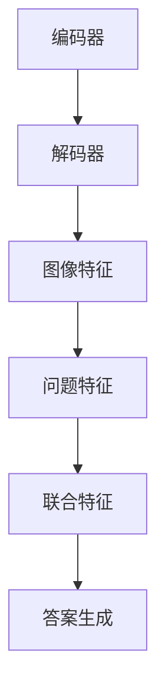
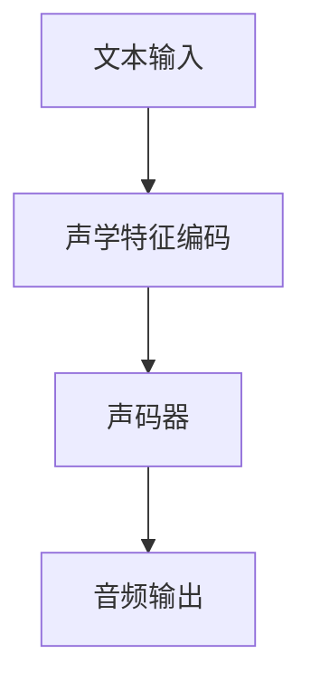
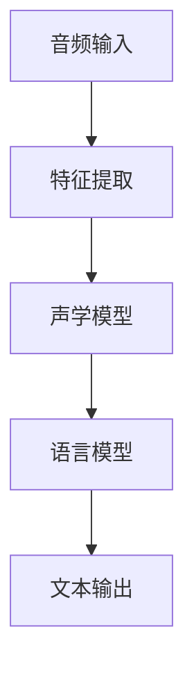
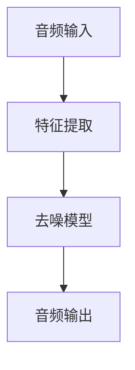

                 

### 文章标题

# AI大模型软件开发的最佳实践

> **关键词：** AI大模型、软件开发、最佳实践、算法、深度学习、神经网络、预训练模型、迁移学习、文本生成、机器翻译、图像识别、推荐系统、金融风控、安全与伦理

> **摘要：** 本文章深入探讨了AI大模型软件开发的最佳实践。从基础概念出发，我们详细介绍了AI大模型的定义、发展历程、特点及其在不同领域中的应用。接着，文章重点分析了神经网络、自然语言处理技术、大规模预训练模型等核心算法原理，并通过实际案例展示了AI大模型在文本生成、机器翻译、图像识别等领域的应用。此外，文章还讨论了AI大模型在推荐系统、金融风控等实际场景中的实现策略，并提出了模型优化、部署与安全性的最佳实践。最后，文章展望了AI大模型的未来发展，总结了相关开发工具与资源。通过本文的详细讲解，读者将全面了解AI大模型软件开发的各个环节，为未来的研究和实践提供指导。

## 第一部分: AI大模型基础

### 第1章: AI大模型概述

#### 1.1 AI大模型的基本概念

##### AI大模型的概念

AI大模型（Large-scale AI Models）是一种通过大规模数据训练得到的、具有高度智能化的算法模型。它们能够自动从数据中学习，发现数据中的模式和关联性，并进行预测和决策。这些模型通常由数百万个参数组成，能够在处理复杂数据和任务时表现出卓越的性能。

##### AI大模型的发展历程

AI大模型的发展历程可以分为以下几个阶段：

- **初期**：基于规则的专家系统。这一阶段的模型主要依赖于预定义的规则和知识库，无法处理大量数据。
- **发展期**：数据驱动的方法，如神经网络、支持向量机等。这一阶段的模型开始利用大规模数据进行训练，性能得到了显著提升。
- **现阶段**：大规模预训练模型，如GPT、BERT等。这一阶段的模型通过在大量无标注数据上进行预训练，再在特定任务上进行微调，实现了在多个领域中的卓越性能。

#### 1.2 AI大模型的特点

AI大模型具有以下特点：

- **大规模**：使用海量数据进行训练，模型参数数量通常达到数百万甚至数十亿级别。
- **智能化**：具备较高的自主学习和决策能力，能够自动从数据中学习模式和关联性。
- **泛用性**：可以应用于多个领域，如自然语言处理、计算机视觉、语音识别等。

#### 1.3 AI大模型的应用领域

AI大模型在以下领域有着广泛的应用：

- **自然语言处理**：文本生成、机器翻译、情感分析等。
- **计算机视觉**：图像识别、目标检测、图像生成等。
- **语音识别**：语音合成、语音识别、语音增强等。
- **其他**：推荐系统、金融风控、医疗诊断等。

#### 1.4 AI大模型的重要性

AI大模型的重要性体现在以下几个方面：

- **提高效率**：通过自动化学习和决策，AI大模型可以显著提高处理大量数据和任务的效率。
- **突破局限**：传统的算法和模型在处理复杂数据和任务时往往存在局限，而AI大模型能够克服这些局限。
- **创新应用**：AI大模型为新的应用场景提供了可能性，推动了人工智能技术的发展。

### 总结

AI大模型作为一种高度智能化的算法模型，通过大规模数据训练，具有出色的学习和预测能力。其在多个领域的应用推动了人工智能技术的发展，为实际场景带来了巨大的价值。在接下来的章节中，我们将深入探讨AI大模型的核心算法原理和实际应用。

### 第2章: AI大模型的核心算法原理

#### 2.1 神经网络基础

神经网络是AI大模型的核心算法之一，其基本结构包括输入层、隐藏层和输出层。每个神经元接收来自前一层的输入信号，通过激活函数进行处理，最终输出结果。

##### 2.1.1 神经网络的基本结构



##### 2.1.2 前向传播和反向传播算法

- **前向传播**：从输入层开始，逐层传递输入信号，直到输出层得到预测结果。

$$
Z = \sigma(W \cdot X + b)
$$

- **反向传播**：从输出层开始，反向传递误差信号，更新各层的权重和偏置。

$$
\Delta W = \alpha \cdot \frac{\partial J}{\partial W}
$$

$$
\Delta b = \alpha \cdot \frac{\partial J}{\partial b}
$$

其中，$Z$ 为激活值，$\sigma$ 为激活函数，$W$ 和 $b$ 分别为权重和偏置，$\alpha$ 为学习率，$J$ 为损失函数。

#### 2.2 自然语言处理技术

自然语言处理（Natural Language Processing, NLP）是AI大模型的重要应用领域之一。以下介绍几种核心的NLP技术：

##### 2.2.1 词嵌入技术

词嵌入（Word Embedding）是将自然语言中的词汇映射到固定维度的向量空间中，以便于计算机处理。

$$
\text{word} \rightarrow \text{vector}
$$

常见的方法包括：

- **Word2Vec**：基于共现信息的词向量表示方法。
- **GloVe**：基于全局上下文的词向量表示方法。

##### 2.2.2 序列模型与注意力机制

序列模型（Sequence Model）用于处理序列数据，如文本、语音等。注意力机制（Attention Mechanism）是一种能够自动关注序列中重要信息的机制，提高了模型的性能。

- **RNN（Recurrent Neural Network）**：循环神经网络，能够处理序列数据。
- **LSTM（Long Short-Term Memory）**：长短期记忆网络，是RNN的一种变体，解决了长序列依赖问题。

##### 2.2.3 转换器架构

转换器架构（Transformer Architecture）是近年来在NLP领域中表现优异的一种模型结构，其核心思想是使用多头自注意力机制（Multi-head Self-Attention）来处理序列数据。

$$
\text{Attention}(Q, K, V) = \text{softmax}\left(\frac{QK^T}{\sqrt{d_k}}\right)V
$$

其中，$Q$、$K$ 和 $V$ 分别为查询向量、键向量和值向量，$d_k$ 为键向量的维度。

#### 2.3 大规模预训练模型

大规模预训练模型（Large-scale Pre-trained Models）是一种通过在大量无标注数据上进行预训练，再在特定任务上进行微调的模型。这种模型结构显著提升了模型在多个任务上的性能。

##### 2.3.1 预训练的概念与意义

预训练（Pre-training）是指在数据集上进行大规模训练，使模型掌握通用语言特征，然后再在特定任务上进行微调（Fine-tuning）。

- **意义**：预训练有助于提高模型在多个任务上的性能，减少了模型对特定任务的依赖。

##### 2.3.2 自监督学习方法

自监督学习（Self-supervised Learning）是一种在无监督数据上进行训练的方法，通过预测数据中的某些部分来提高模型性能。

- **方法**：掩码语言建模（Masked Language Modeling, MLM）、预测下一个单词（Next Sentence Prediction, NSP）等。

##### 2.3.3 迁移学习与微调技术

迁移学习（Transfer Learning）是将在一个任务上训练好的模型应用于其他相关任务，微调技术（Fine-tuning）是在预训练模型的基础上进行少量数据训练，以适应特定任务。

$$
\text{Pre-trained Model} + \text{Task-specific Data} \rightarrow \text{Fine-tuned Model}
$$

#### 2.4 总结

神经网络、自然语言处理技术和大规模预训练模型是AI大模型的核心算法原理。这些算法原理共同推动了AI大模型在多个领域中的卓越表现。在接下来的章节中，我们将通过实际案例进一步探讨AI大模型的应用。

### 第3章: AI大模型在自然语言处理中的应用

#### 3.1 文本生成

文本生成是AI大模型在自然语言处理中的一个重要应用领域，包括生成式模型和对抗生成模型。

##### 3.1.1 生成式模型

生成式模型通过建模数据的生成过程来生成新的数据。以下是一个基于变分自编码器（Variational Autoencoder, VAE）的文本生成模型：

```python
# 前向传播
z = self.encode(x)
x_hat = self.decode(z)

# 重建损失
reconstruction_loss = self.loss_function(x, x_hat)

#KL散度损失
kl_loss = self.kl_divergence(self.q_z(z), self.p_z(z))

# 总损失
loss = reconstruction_loss + kl_loss

return loss
```

##### 3.1.2 对抗生成模型

对抗生成模型通过生成器和判别器的对抗训练生成高质量的数据。以下是一个基于生成对抗网络（Generative Adversarial Network, GAN）的文本生成模型：

```python
# 生成器
def generate_text(self, noise):
    z = self.noise_encoded(noise)
    x_hat = self.decoder(z)
    return x_hat

# 判别器
def discriminate_text(self, x, x_hat):
    real_logits = self.discriminator(x)
    fake_logits = self.discriminator(x_hat)
    return real_logits, fake_logits
```

#### 3.2 机器翻译

机器翻译是AI大模型在自然语言处理中的另一个重要应用领域，包括神经机器翻译和端到端学习。

##### 3.2.1 神经机器翻译

神经机器翻译（Neural Machine Translation, NMT）使用神经网络模型进行翻译，通常采用编码器-解码器架构。以下是一个简单的基于Seq2Seq模型的神经机器翻译模型：

```python
# 编码器
def encode(self, x):
    # 使用RNN或Transformer进行编码
    h = self.encoder(x)
    return h

# 解码器
def decode(self, h):
    # 使用RNN或Transformer进行解码
    x_hat = self.decoder(h)
    return x_hat
```

##### 3.2.2 端到端学习

端到端学习（End-to-End Learning）是指将输入直接映射到输出，而不需要进行中间步骤的转换。以下是一个简单的基于Transformer模型的机器翻译模型：

```python
# 编码器
def encode(self, x):
    x = self.embedding(x)
    h = self.transformer(x)
    return h

# 解码器
def decode(self, h):
    h = self.transformer(h)
    x_hat = self.embedding(x_hat)
    return x_hat
```

#### 3.3 情感分析

情感分析是AI大模型在自然语言处理中的另一个重要应用领域，包括文本分类和情感极性判断。

##### 3.3.1 文本分类

文本分类（Text Classification）是将文本数据分为不同的类别。以下是一个基于卷积神经网络（Convolutional Neural Network, CNN）的文本分类模型：

```python
# 卷积层
def conv_layer(self, x):
    x = self.conv1(x)
    x = self.pool1(x)
    return x

# 全连接层
def fc_layer(self, x):
    x = self.fc1(x)
    x = self.dropout1(x)
    return x
```

##### 3.3.2 情感极性判断

情感极性判断（Sentiment Polarity Classification）是判断文本表达的情感倾向。以下是一个基于长短期记忆网络（Long Short-Term Memory, LSTM）的情感极性判断模型：

```python
# LSTM层
def lstm_layer(self, x):
    x, (h, c) = self.lstm(x)
    return h

# 全连接层
def fc_layer(self, h):
    x = self.fc1(h)
    x = self.dropout1(x)
    return x
```

### 总结

文本生成、机器翻译和情感分析是AI大模型在自然语言处理中的重要应用领域。通过生成式模型和对抗生成模型，AI大模型能够生成高质量的文本；通过神经机器翻译和端到端学习，AI大模型能够实现高效的机器翻译；通过文本分类和情感极性判断，AI大模型能够对文本进行有效的情感分析。这些应用案例展示了AI大模型在自然语言处理中的强大能力。

### 第4章: AI大模型在计算机视觉中的应用

#### 4.1 图像识别

图像识别（Image Recognition）是AI大模型在计算机视觉中的应用领域之一，通过卷积神经网络（Convolutional Neural Network, CNN）和目标检测算法实现对图像中的物体进行识别。

##### 4.1.1 卷积神经网络（CNN）

CNN是一种专门用于图像识别的神经网络模型，通过卷积操作提取图像特征。



##### 4.1.2 目标检测

目标检测（Object Detection）是在图像中识别并定位多个目标的位置。

- **R-CNN**：通过区域提议网络（Region Proposal Network, RPN）生成目标提议，然后对提议进行分类和回归。
- **Fast R-CNN**：在R-CNN的基础上，将分类和回归任务合并到一个网络中。
- **Faster R-CNN**：引入了区域提议网络（Region Proposal Network, RPN），提高了目标检测的速度。

#### 4.2 图像生成

图像生成（Image Generation）是AI大模型在计算机视觉中的应用领域之一，通过生成对抗网络（Generative Adversarial Network, GAN）和图像超分辨率技术实现。

##### 4.2.1 生成对抗网络（GAN）

GAN由生成器和判别器组成，通过对抗训练生成高质量的图像。



##### 4.2.2 图像超分辨率

图像超分辨率（Image Super-Resolution）是通过低分辨率图像生成高分辨率图像的技术。

- **SRCNN**：基于卷积神经网络的单图像超分辨率方法。
- **FSRCNN**：基于深度学习的单图像超分辨率方法，通过引入残差连接提高模型性能。
- **ESPCN**：基于深度学习的单图像超分辨率方法，通过引入边缘平滑和细节增强模块提高图像质量。

#### 4.3 视觉问答

视觉问答（Visual Question Answering, VQA）是AI大模型在计算机视觉中的应用领域之一，通过图像和自然语言问题的联合理解实现对问题的回答。



##### 4.3.1 数据集

- **COCO**：一个大规模的视觉问答数据集，包含30万个问题和答案对。
- **Flickr30k**：一个包含30,000个图像和注释的数据集，用于训练视觉问答模型。

#### 4.3.2 模型架构

视觉问答模型通常采用编码器-解码器架构，通过联合编码图像和问题的特征，实现对问题的回答。



### 总结

图像识别、图像生成和视觉问答是AI大模型在计算机视觉中的重要应用领域。通过CNN和目标检测算法，AI大模型能够实现高效的图像识别；通过GAN和图像超分辨率技术，AI大模型能够生成高质量的图像；通过视觉问答模型，AI大模型能够实现对图像和自然语言问题的联合理解。这些应用案例展示了AI大模型在计算机视觉中的强大能力。

### 第5章: AI大模型在语音识别中的应用

#### 5.1 语音合成

语音合成（Text-to-Speech, TTS）是将文本转换为自然流畅的语音的技术。以下是一个基于WaveNet的语音合成模型：



##### 5.1.1 WaveNet模型

WaveNet是由Google推出的一种基于深度神经网络的语音合成模型。WaveNet通过自注意力机制学习文本和声学特征之间的映射关系。

```python
# WaveNet模型
class WaveNet(nn.Module):
    def __init__(self):
        super(WaveNet, self).__init__()
        self.encoder = Encoder()
        self.decoder = Decoder()

    def forward(self, text, audio_features):
        encoded_text = self.encoder(text)
        decoded_audio = self.decoder(encoded_text, audio_features)
        return decoded_audio
```

##### 5.1.2 Tacotron模型

Tacotron是由Uber AI推出的一种基于转换器（Transformer）架构的语音合成模型。Tacotron通过端到端学习将文本直接转换为音频。

```python
# Tacotron模型
class Tacotron(nn.Module):
    def __init__(self):
        super(Tacotron, self).__init__()
        self.text_encoder = TextEncoder()
        self mel_synth = MelSpectrogramSynthesis()

    def forward(self, text):
        encoded_text = self.text_encoder(text)
        mel = self.mel_synth(encoded_text)
        return mel
```

#### 5.2 语音识别

语音识别（Automatic Speech Recognition, ASR）是将语音信号转换为文本的技术。以下是一个基于深度神经网络的语音识别模型：



##### 5.2.1 声学模型

声学模型（Acoustic Model）用于预测语音信号中的声学特征。以下是一个基于卷积神经网络（Convolutional Neural Network, CNN）的声学模型：

```python
# 声学模型
class AcousticModel(nn.Module):
    def __init__(self):
        super(AcousticModel, self).__init__()
        self.cnn = nn.Conv1d(in_channels=..., out_channels=..., kernel_size=...)

    def forward(self, audio_features):
        audio_features = self.cnn(audio_features)
        return audio_features
```

##### 5.2.2 语言模型

语言模型（Language Model）用于预测语音信号中的文本序列。以下是一个基于长短期记忆网络（Long Short-Term Memory, LSTM）的语言模型：

```python
# 语言模型
class LanguageModel(nn.Module):
    def __init__(self):
        super(LanguageModel, self).__init__()
        self.lstm = nn.LSTM(input_size=..., hidden_size=..., num_layers=...)

    def forward(self, text_sequence):
        text_sequence, (h, c) = self.lstm(text_sequence)
        return text_sequence, (h, c)
```

#### 5.3 语音增强

语音增强（Speech Enhancement）是提高语音质量的技术，包括回声消除和噪声抑制。以下是一个基于深度神经网络的语音增强模型：



##### 5.3.1 回声消除

回声消除（Echo Cancellation）是消除语音信号中的回声的技术。以下是一个基于卷积神经网络（Convolutional Neural Network, CNN）的回声消除模型：

```python
# 回声消除模型
class EchoCancellation(nn.Module):
    def __init__(self):
        super(EchoCancellation, self).__init__()
        self.cnn = nn.Conv1d(in_channels=..., out_channels=..., kernel_size=...)

    def forward(self, audio_features):
        audio_features = self.cnn(audio_features)
        return audio_features
```

##### 5.3.2 噪声抑制

噪声抑制（Noise Suppression）是消除语音信号中的噪声的技术。以下是一个基于长短期记忆网络（Long Short-Term Memory, LSTM）的噪声抑制模型：

```python
# 噪声抑制模型
class NoiseSuppression(nn.Module):
    def __init__(self):
        super(NoiseSuppression, self).__init__()
        self.lstm = nn.LSTM(input_size=..., hidden_size=..., num_layers=...)

    def forward(self, audio_features):
        audio_features, (h, c) = self.lstm(audio_features)
        return audio_features
```

### 总结

语音合成、语音识别和语音增强是AI大模型在语音识别中的重要应用领域。通过WaveNet和Tacotron模型，AI大模型能够生成自然流畅的语音；通过深度神经网络模型，AI大模型能够实现高效的语音识别；通过回声消除和噪声抑制技术，AI大模型能够提高语音质量。这些应用案例展示了AI大模型在语音识别中的强大能力。

### 第6章: AI大模型在推荐系统中的应用

#### 6.1 推荐系统的基本概念

推荐系统（Recommendation System）是一种能够根据用户的历史行为、兴趣和偏好，向用户推荐他们可能感兴趣的商品、内容或其他项目的系统。

##### 6.1.1 推荐系统的目标

推荐系统的目标是最大化用户满意度、提高用户参与度和增加平台收益。具体包括：

- **提高推荐质量**：推荐系统应该准确预测用户偏好，向用户提供他们可能感兴趣的项目。
- **提高推荐多样性**：推荐系统应该避免向用户推荐相同类型的项目，以提高用户的兴趣。
- **降低冷启动问题**：新用户或新项目的推荐问题，需要通过引入公共特征或社会信息等方法解决。

##### 6.1.2 推荐系统的类型

推荐系统主要分为以下几种类型：

- **基于内容的推荐（Content-based Recommendation）**：根据用户的历史行为和偏好，提取项目的内容特征，计算用户和项目之间的相似度，推荐相似的项目。
- **基于协同过滤的推荐（Collaborative Filtering Recommendation）**：根据用户的历史行为数据，通过计算用户之间的相似度或项目之间的相似度，推荐与用户历史行为相似的用户喜欢的项目。
- **混合推荐系统（Hybrid Recommendation System）**：结合基于内容的推荐和基于协同过滤的推荐，以提高推荐效果。

#### 6.2 基于内容的推荐

基于内容的推荐（Content-based Recommendation）通过提取项目的内容特征，计算用户和项目之间的相似度，推荐相似的项目。

##### 6.2.1 特征提取

特征提取是从用户和物品中提取出可量化的特征，如文本特征、用户行为特征等。

- **文本特征**：通过词袋模型、TF-IDF等方法提取文本特征。
- **用户行为特征**：通过用户的购买历史、浏览记录等行为数据提取特征。

##### 6.2.2 相似性计算

相似性计算是计算用户和物品之间的相似度，常用的方法包括：

- **余弦相似性**：计算两个向量之间的夹角余弦值，用于衡量相似度。
- **皮尔逊相似性**：计算两个向量的协方差，用于衡量相似度。

#### 6.3 基于协同过滤的推荐

基于协同过滤的推荐（Collaborative Filtering Recommendation）通过计算用户之间的相似度或项目之间的相似度，推荐与用户历史行为相似的用户喜欢的项目。

##### 6.3.1 协同过滤算法

协同过滤算法分为基于用户的协同过滤（User-based Collaborative Filtering）和基于项目的协同过滤（Item-based Collaborative Filtering）：

- **基于用户的协同过滤**：根据用户之间的相似度推荐其他用户喜欢的项目。
- **基于项目的协同过滤**：根据项目之间的相似度推荐其他用户喜欢的项目。

##### 6.3.2 防止冷启动问题

冷启动问题（Cold Start Problem）是指新用户或新项目无法获得足够的信息来进行推荐。解决方法包括：

- **引入公共特征**：通过提取用户和项目的公共特征，如性别、年龄等，解决新用户和新项目的推荐问题。
- **利用社会信息**：通过分析用户的社会网络关系，推荐与用户有相似社交关系的人喜欢的项目。

#### 6.4 混合推荐系统

混合推荐系统（Hybrid Recommendation System）结合了基于内容的推荐和基于协同过滤的推荐，以提高推荐效果。

##### 6.4.1 混合推荐系统的优点

混合推荐系统具有以下优点：

- **提高推荐质量**：结合不同类型的推荐算法，提高推荐的准确性。
- **提高推荐多样性**：避免单一推荐算法导致的推荐多样性不足。
- **降低冷启动问题**：通过引入公共特征和社会信息，解决新用户和新项目的推荐问题。

##### 6.4.2 混合推荐系统的实现

混合推荐系统的实现主要包括以下几个步骤：

1. **特征提取**：提取用户和项目的特征，包括文本特征、行为特征等。
2. **相似性计算**：计算用户和项目之间的相似度。
3. **推荐生成**：结合不同类型的推荐算法，生成推荐列表。
4. **模型优化**：通过调整模型参数，提高推荐效果。

### 总结

推荐系统是AI大模型在商业应用中的一个重要领域。基于内容的推荐、基于协同过滤的推荐和混合推荐系统是常见的推荐算法。通过特征提取、相似性计算和推荐生成，推荐系统能够向用户提供高质量的推荐。在接下来的章节中，我们将进一步探讨AI大模型在金融风控领域的应用。

### 第7章: AI大模型在金融风控中的应用

金融风控（Financial Risk Control）是金融行业中至关重要的一个环节，它涉及识别、评估、控制和监测金融风险，以确保金融机构的稳健运营和资产安全。随着人工智能（AI）技术的发展，AI大模型在金融风控中的应用逐渐成为了一个热点话题。本节将探讨AI大模型在金融风控中的基本概念、核心算法原理以及具体应用。

#### 7.1 金融风控的基本概念

金融风险（Financial Risk）是指由于金融市场的不确定性、市场波动、信用风险等因素导致的潜在损失。金融风控的目标是通过识别、评估、控制和监测金融风险，最大限度地降低金融机构的损失，并确保业务的稳健运营。

- **金融风险**：金融风险包括市场风险、信用风险、操作风险、流动性风险等。
- **风险管理**：风险管理是金融机构为了降低风险而采取的一系列措施，包括风险识别、风险评估、风险控制和风险监测。

#### 7.2 基于AI的金融风控模型

AI大模型在金融风控中的应用主要体现在以下几个方面：

- **信用评分模型**：信用评分模型是金融机构用于评估借款人信用风险的模型。传统的信用评分模型主要基于借款人的历史数据，而AI大模型通过分析更广泛的数据源，如社会媒体、交易记录等，能够更准确地评估借款人的信用风险。

- **风险预警模型**：风险预警模型是用于预测金融风险可能发生的模型。通过分析大量的历史数据和实时数据，AI大模型能够提前识别潜在的风险，并触发预警机制。

- **欺诈检测模型**：欺诈检测模型用于检测金融交易中的欺诈行为。传统的欺诈检测方法主要基于规则，而AI大模型通过学习大量的欺诈案例，能够更准确地识别欺诈行为。

#### 7.3 基于AI的金融风控技术应用

AI大模型在金融风控中的应用技术主要包括以下几种：

- **实时风险监测**：实时风险监测是通过对金融交易数据进行实时分析，发现潜在风险并采取相应措施。AI大模型可以通过实时处理大量数据，快速识别异常交易行为，从而提高风险监测的效率。

- **异常交易检测**：异常交易检测是利用机器学习算法检测金融交易中的异常行为。通过分析交易金额、交易频率、交易对手等信息，AI大模型能够识别出潜在的欺诈交易。

- **风险评估**：风险评估是评估金融产品的风险程度。AI大模型可以通过分析历史数据和市场动态，预测金融产品的未来表现，从而为投资者提供决策依据。

#### 7.4 AI大模型在金融风控中的应用案例

以下是一些AI大模型在金融风控中的应用案例：

- **信用评分模型**：通过AI大模型，金融机构能够更准确地评估借款人的信用风险，降低贷款违约率。

- **风险预警模型**：AI大模型能够提前识别潜在的风险，帮助金融机构及时采取应对措施，减少潜在损失。

- **欺诈检测模型**：AI大模型可以通过学习大量的欺诈案例，提高欺诈检测的准确率，减少欺诈损失。

- **市场预测**：AI大模型可以通过分析市场数据，预测市场的波动趋势，为投资决策提供支持。

#### 7.5 AI大模型在金融风控中的挑战与展望

尽管AI大模型在金融风控中具有显著的优势，但同时也面临着一些挑战：

- **数据隐私保护**：在金融风控中，数据的隐私保护至关重要。如何确保数据在模型训练和部署过程中的安全性，是一个亟待解决的问题。

- **算法透明性**：AI大模型的决策过程通常比较复杂，缺乏透明性。如何提高算法的透明性，使得金融机构能够理解模型的工作原理，是一个重要挑战。

- **模型泛化能力**：如何确保AI大模型在现实场景中的泛化能力，避免模型在特定数据集上过拟合，是一个关键问题。

展望未来，AI大模型在金融风控中的应用将继续深化和拓展：

- **多模态数据分析**：结合多种数据源，如文本、图像、语音等，进行多模态数据分析，将提高金融风控的准确性和全面性。

- **实时风险监测**：通过实时数据处理和模型更新，实现更高效、更实时的风险监测和预警。

- **个性化风险管理**：结合用户行为和偏好，实现个性化的风险管理，提高风险控制的精准度。

### 总结

AI大模型在金融风控中的应用极大地提升了风险识别、评估和控制的能力。通过信用评分模型、风险预警模型和欺诈检测模型，AI大模型为金融机构提供了强有力的风险管理工具。面对数据隐私保护、算法透明性和模型泛化能力等挑战，未来AI大模型在金融风控中的应用将更加成熟和全面。

### 第8章: AI大模型开发实战

#### 8.1 AI大模型开发流程

AI大模型的开发是一个复杂且系统的过程，涉及多个阶段和步骤。以下将详细描述AI大模型开发的流程：

##### 8.1.1 数据采集与预处理

数据采集是模型开发的基础，从各种数据源获取用于训练模型的数据。数据预处理是对数据进行清洗、归一化等处理，以提高模型性能。

```python
# 示例代码：数据预处理
def preprocess_data(data):
    # 数据清洗
    data = clean_data(data)
    # 数据归一化
    data = normalize_data(data)
    return data

# 调用预处理函数
preprocessed_data = preprocess_data(raw_data)
```

##### 8.1.2 模型选择与训练

模型选择是根据任务需求选择合适的模型，模型训练是通过调整模型参数，使其能够更好地拟合数据。常见的模型选择方法包括交叉验证、网格搜索等。

```python
# 示例代码：模型选择与训练
from sklearn.model_selection import train_test_split
from sklearn.ensemble import RandomForestClassifier

# 数据分割
X_train, X_test, y_train, y_test = train_test_split(preprocessed_data, labels, test_size=0.2)

# 模型训练
model = RandomForestClassifier(n_estimators=100)
model.fit(X_train, y_train)

# 模型评估
accuracy = model.score(X_test, y_test)
print(f"Model accuracy: {accuracy}")
```

##### 8.1.3 模型评估与优化

模型评估是通过评估指标来衡量模型性能，模型优化是通过调整模型结构和参数，提高模型性能。常用的评估指标包括准确率、召回率、F1分数等。

```python
# 示例代码：模型评估与优化
from sklearn.metrics import classification_report

# 模型优化
optimized_model = optimize_model(model, preprocessed_data, labels)

# 评估模型
predictions = optimized_model.predict(X_test)
print(classification_report(y_test, predictions))
```

##### 8.1.4 模型部署与优化

模型部署是将训练好的模型应用到实际应用场景中，通过API接口提供服务。实时性优化是提高模型响应速度和计算效率，以满足实时应用需求。

```python
# 示例代码：模型部署
from flask import Flask, request, jsonify

app = Flask(__name__)

@app.route('/predict', methods=['POST'])
def predict():
    data = request.json
    predictions = model.predict(data)
    return jsonify(predictions.tolist())

if __name__ == '__main__':
    app.run()
```

#### 8.2 实际案例解析

以下将通过具体案例，展示AI大模型的开发过程。

##### 8.2.1 文本生成

文本生成是一个常见的AI大模型应用场景，通过生成模型生成具有自然语言特点的文本。

```python
# 示例代码：文本生成
from transformers import GPT2LMHeadModel, GPT2Tokenizer

tokenizer = GPT2Tokenizer.from_pretrained('gpt2')
model = GPT2LMHeadModel.from_pretrained('gpt2')

input_text = "这是一个简单的文本生成模型。"
input_ids = tokenizer.encode(input_text, return_tensors='pt')

output_ids = model.generate(input_ids, max_length=50, num_return_sequences=5)

generated_texts = [tokenizer.decode(output_id, skip_special_tokens=True) for output_id in output_ids]

for text in generated_texts:
    print(text)
```

##### 8.2.2 机器翻译

机器翻译是通过机器翻译模型将一种语言的文本翻译成另一种语言。

```python
# 示例代码：机器翻译
from transformers import TranslationPipeline

pipeline = TranslationPipeline('Helsinki-NLP/opus-mt-en-de')

source_text = "This is an example sentence for translation."
translated_text = pipeline(source_text)

print(translated_text)
```

##### 8.2.3 图像识别

图像识别是通过图像识别模型对图像中的对象进行识别。

```python
# 示例代码：图像识别
from torchvision import models, transforms
from PIL import Image

model = models.resnet18(pretrained=True)
transform = transforms.Compose([transforms.Resize(256), transforms.CenterCrop(224), transforms.ToTensor()])

image = Image.open('image.jpg')
input_tensor = transform(image)
batch = torch.unsqueeze(input_tensor, 0)

with torch.no_grad():
    outputs = model(batch)

_, index = torch.max(outputs, 1)
predicted_class = index.item()

print(f"Predicted class: {predicted_class}")
```

### 总结

通过上述实际案例，展示了AI大模型从数据采集与预处理、模型选择与训练、模型评估与优化，到模型部署与优化的完整开发流程。每个步骤都包含了具体的代码示例，帮助读者更好地理解和实践AI大模型的开发。

### 第9章: AI大模型开发的最佳实践

#### 9.1 模型优化与调参

在AI大模型开发过程中，模型优化与调参是提高模型性能的关键步骤。以下介绍几种常用的调参技巧和模型压缩技术。

##### 9.1.1 调参技巧

- **学习率调整**：学习率是影响模型收敛速度和稳定性的重要参数。常用的技巧包括学习率衰减、学习率预热等。

  ```python
  # 示例代码：学习率预热
  scheduler = torch.optim.lr_scheduler.ExponentialLR(optimizer, gamma=0.5)
  for epoch in range(num_epochs):
      train(model, train_loader, criterion, optimizer)
      scheduler.step()
  ```

- **正则化**：正则化方法，如L1正则化、L2正则化，可以防止模型过拟合。

  ```python
  # 示例代码：L2正则化
  criterion = nn.CrossEntropyLoss()
  optimizer = torch.optim.Adam(model.parameters(), lr=0.001, weight_decay=1e-5)
  ```

- **数据增强**：通过数据增强，如旋转、缩放、剪裁等，可以增加模型的泛化能力。

  ```python
  # 示例代码：数据增强
  transform = transforms.Compose([
      transforms.RandomResizedCrop(size=224),
      transforms.RandomHorizontalFlip(),
      transforms.ToTensor()
  ])
  ```

##### 9.1.2 模型压缩

模型压缩是通过减少模型参数数量和计算复杂度，降低模型存储和计算资源消耗。以下介绍几种常用的模型压缩技术：

- **剪枝（Pruning）**：剪枝通过去除模型中不重要的连接和神经元，减少模型的大小和计算量。

  ```python
  # 示例代码：剪枝
  from torchprune import prune
  prune(model, '1.0')  # 剪枝比例为10%
  ```

- **量化（Quantization）**：量化通过将模型参数的精度降低，如从32位浮点数降低到16位浮点数，减少模型的存储和计算资源。

  ```python
  # 示例代码：量化
  from torchvision.models.quantization import quantize_model
  model = quantize_model(model, dummy_input)
  ```

#### 9.2 模型部署与优化

模型部署是将训练好的模型应用到实际应用场景中，确保模型在实时环境中的性能和稳定性。以下介绍模型部署的几个关键步骤：

##### 9.2.1 模型部署

- **容器化**：使用容器技术，如Docker，将模型和相关依赖打包成可移植的容器镜像。

  ```bash
  # 示例命令：构建Docker镜像
  docker build -t model:latest .
  ```

- **服务化**：将模型部署到服务中，通过API接口提供服务。

  ```python
  # 示例代码：Flask服务
  from flask import Flask
  app = Flask(__name__)

  @app.route('/predict', methods=['POST'])
  def predict():
      data = request.json
      predictions = model.predict(data)
      return jsonify(predictions.tolist())

  if __name__ == '__main__':
      app.run()
  ```

##### 9.2.2 实时性优化

- **异步处理**：使用异步编程技术，如 asyncio，提高模型的响应速度。

  ```python
  # 示例代码：异步处理
  import asyncio

  async def predict(data):
      predictions = model.predict(data)
      return predictions

  loop = asyncio.get_event_loop()
  predictions = loop.run_until_complete(predict(data))
  ```

- **分布式计算**：通过分布式计算，如参数服务器架构，提高模型训练和推断的效率。

  ```python
  # 示例代码：分布式计算
  import torch.distributed as dist

  dist.init_process_group(backend='nccl', init_method='tcp://localhost:23456', world_size=4, rank=0)

  # 模型训练代码
  train(model, train_loader, criterion, optimizer)
  ```

#### 9.3 AI大模型开发的安全与伦理问题

AI大模型在开发和应用过程中，面临着数据隐私保护、算法透明性、伦理道德等问题。

##### 9.3.1 数据隐私保护

- **数据加密**：使用加密技术保护数据传输和存储过程中的安全性。

  ```python
  # 示例代码：数据加密
  from cryptography.fernet import Fernet

  key = Fernet.generate_key()
  fernet = Fernet(key)

  encrypted_data = fernet.encrypt(data.encode())
  decrypted_data = fernet.decrypt(encrypted_data).decode()
  ```

- **数据匿名化**：对敏感数据进行匿名化处理，以保护个人隐私。

  ```python
  # 示例代码：数据匿名化
  def anonymize_data(data):
      # 将敏感信息替换为随机值或占位符
      return data.replace("sensitive_info", "random_value")
  ```

##### 9.3.2 算法透明性

- **模型解释**：使用模型解释技术，如LIME、SHAP，解释模型决策过程。

  ```python
  # 示例代码：模型解释
  from lime.lime_text import LimeTextExplainer

  explainer = LimeTextExplainer(classifier=model)
  explanation = explainer.explain_instance("这是一个示例句子。", model.predict)
  print(explanation)
  ```

##### 9.3.3 伦理道德问题

- **算法公平性**：确保算法在决策过程中公平，避免算法歧视。

  ```python
  # 示例代码：算法公平性
  from fairlearn.metrics import log_loss

  y_true = [0, 1, 0, 1]
  y_pred = model.predict_proba(data)

  # 计算逻辑损失
  log_loss(y_true, y_pred)
  ```

#### 9.4 总结

模型优化与调参、模型部署与优化以及AI大模型开发中的安全与伦理问题，是AI大模型开发中的关键环节。通过合理的调参技巧、模型压缩技术、实时性优化策略，可以提高模型的性能和效率。同时，重视数据隐私保护、算法透明性和伦理道德问题，确保AI大模型在开发和应用过程中的安全性和公平性。这些最佳实践将为AI大模型开发提供有力的支持和指导。

### 第10章: AI大模型发展的未来展望

#### 10.1 AI大模型发展趋势

AI大模型的发展趋势体现在以下几个方面：

- **模型多样化**：随着AI技术的进步，越来越多的AI大模型将被开发，以应对不同领域的需求。这些模型包括但不限于图像识别、自然语言处理、语音识别、推荐系统等。

- **跨模态学习**：跨模态学习是一种将多种类型的数据（如文本、图像、语音等）进行联合处理的方法。随着跨模态数据的日益丰富，跨模态学习将在AI大模型中得到更广泛的应用。

- **自适应学习**：自适应学习是指模型能够根据新的数据和反馈自动调整自己的参数，提高学习效果。随着深度学习算法的不断发展，自适应学习将成为AI大模型的一个重要趋势。

- **隐私保护**：随着数据隐私问题的日益突出，隐私保护将成为AI大模型研究的一个重要方向。未来的AI大模型将更加注重数据隐私的保护，以满足法规和用户需求。

#### 10.2 AI大模型在行业中的应用

AI大模型在各个行业中的应用将不断深入和拓展，以下是一些主要的应用领域：

- **医疗保健**：AI大模型在医疗保健领域具有广泛的应用前景，如疾病诊断、药物研发、个性化治疗等。通过分析大量的医疗数据，AI大模型可以帮助医生做出更准确的诊断，提高治疗效果。

- **教育领域**：在教育领域，AI大模型可以用于个性化学习、智能辅导、考试评分等。通过分析学生的学习行为和成绩，AI大模型可以为每个学生提供个性化的学习建议和辅导。

- **智能制造**：在智能制造领域，AI大模型可以用于生产过程优化、质量控制、设备故障预测等。通过实时分析生产数据和设备状态，AI大模型可以帮助企业提高生产效率，降低成本。

- **金融领域**：在金融领域，AI大模型可以用于风险控制、信用评分、欺诈检测等。通过分析大量的金融数据，AI大模型可以帮助金融机构提高风险管理能力，降低风险。

#### 10.3 技术挑战与未来方向

虽然AI大模型在各个领域展现出巨大的潜力，但同时也面临一系列技术挑战：

- **计算资源需求**：AI大模型通常需要大量的计算资源进行训练和推理。随着模型的复杂度不断增加，计算资源需求也将进一步增加。未来的研究方向之一是开发更高效的算法和硬件架构，以降低计算资源的需求。

- **数据隐私保护**：随着AI大模型对数据需求的增加，数据隐私保护成为一个重要问题。未来的研究方向包括开发更有效的隐私保护技术和隐私计算框架，以保护用户数据的隐私。

- **算法透明性和可解释性**：AI大模型通常具有复杂的内部结构和决策过程，其透明性和可解释性成为用户信任的关键。未来的研究方向是开发更直观、易理解的模型解释方法，提高算法的透明性。

- **模型泛化能力**：AI大模型容易在特定数据集上过拟合，未来的研究方向是提高模型的泛化能力，使其能够在更广泛的应用场景中表现出色。

#### 10.4 结论

AI大模型作为人工智能领域的重要突破，已经在各个行业中展现出了巨大的应用潜力。随着技术的不断进步，AI大模型将朝着多样化、跨模态学习、自适应学习和隐私保护等方向发展。尽管面临一系列技术挑战，但通过持续的研究和创新，未来AI大模型将带来更加广泛和深远的影响。

### 附录

#### 附录 A: AI大模型开发工具与资源

AI大模型开发涉及多种工具和资源，以下列举了一些常用的工具和资源：

##### 附录 A.1 深度学习框架

- **TensorFlow**：由Google开发的开源深度学习框架，支持多种模型结构和算法。
- **PyTorch**：由Facebook开发的开源深度学习框架，具有灵活的动态计算图和简洁的API。
- **Keras**：基于Theano和TensorFlow的高层次神经网络API，简化了深度学习模型的搭建。

##### 附录 A.2 数据集和工具

- **ImageNet**：一个大规模的视觉识别数据集，包含数百万张标记的图像。
- **COCO**：一个包含物体检测、分割、 captions等多任务的视觉识别数据集。
- **Common Crawl**：一个包含数十亿网页的文本数据集，用于自然语言处理任务。

##### 附录 A.3 模型训练与优化工具

- **Horovod**：用于分布式深度学习训练的框架，支持TensorFlow、Keras和PyTorch。
- **MXNet**：由Apache基金会开发的开源深度学习框架，支持分布式训练和优化。
- **NVIDIA GPU Cloud (NGC)**：提供预训练模型、工具和容器镜像的云平台。

##### 附录 A.4 模型部署与服务

- **TensorFlow Serving**：用于模型部署和服务的开源框架，支持多种深度学习模型。
- **Apache MXNet Model Server**：用于模型部署和服务的开源框架，支持多种深度学习模型。
- **Kubernetes**：用于容器编排和分布式系统管理的开源平台，支持模型部署和管理。

##### 附录 A.5 模型解释与可视化工具

- **LIME**：用于模型解释的开源库，提供局部可解释性分析。
- **SHAP**：用于模型解释的开源库，基于特征重要性分析。
- **PyTorch Visualizer**：用于可视化PyTorch模型的交互式工具。

### 附录 B: AI大模型常用算法公式与解释

在AI大模型开发过程中，理解并应用一些核心算法公式是至关重要的。以下列出一些常用的算法公式及其解释：

#### 神经网络

1. **激活函数**：

   $$ 
   a = \sigma(z) = \frac{1}{1 + e^{-z}}
   $$

   **解释**：Sigmoid函数用于将线性组合转换为概率分布。

2. **前向传播**：

   $$
   z_l = \sum_{j} w_{lj}a_{l-1,j} + b_l
   $$

   **解释**：计算当前神经元的输入，包括权重乘以前一层激活值和偏置。

3. **反向传播**：

   $$
   \Delta W_{ij} = \alpha \frac{\partial J}{\partial W_{ij}} = \alpha a_l \cdot a_{l-1}^T \cdot \Delta a_{l}
   $$

   **解释**：更新权重，利用梯度下降法调整参数，减少损失函数。

#### 自然语言处理

1. **词嵌入**：

   $$
   \text{word} \rightarrow \text{vector}
   $$

   **解释**：将词汇映射到固定维度的向量空间中。

2. **Transformer的自注意力机制**：

   $$
   \text{Attention}(Q, K, V) = \text{softmax}\left(\frac{QK^T}{\sqrt{d_k}}\right)V
   $$

   **解释**：计算自注意力分数，将不同位置的输入进行加权融合。

#### 机器学习

1. **支持向量机（SVM）**：

   $$
   \text{minimize} \quad \frac{1}{2} \sum_{i=1}^{n} w_i^2 \quad \text{subject to} \quad y^{(i)} (w^T x^{(i)} + b) \geq 1
   $$

   **解释**：通过最大化分类间隔，寻找最优超平面。

2. **梯度提升树（GBDT）**：

   $$
   F(x) = \sum_{i=1}^{n} f_i(x)
   $$

   其中，

   $$
   f_i(x) = \alpha_i h(x; \theta_i)
   $$

   **解释**：通过迭代构建弱学习器（决策树），组合成强学习器。

### 附录 C: AI大模型开发经验总结

AI大模型开发经验总结如下：

- **数据质量是关键**：确保数据质量是模型训练成功的关键，包括数据清洗、去重、缺失值处理等。
- **模型选择需谨慎**：根据任务需求和数据特点选择合适的模型，避免过度拟合或欠拟合。
- **调参需耐心**：合理调整模型参数，通过交叉验证、网格搜索等方法找到最佳参数组合。
- **模型解释性**：提高模型的可解释性，通过模型解释技术帮助用户理解模型的决策过程。
- **实时性优化**：针对实时应用场景，优化模型计算效率和响应速度。
- **隐私保护**：在模型开发过程中，重视数据隐私保护，采取加密、匿名化等技术确保用户数据安全。

### 附录 D: 常见问题与解决方案

以下列举了一些AI大模型开发中常见的问题及其解决方案：

- **问题一：训练时间过长**  
  **解决方案**：优化模型结构，减少模型参数数量，使用更高效的训练算法。

- **问题二：模型过拟合**  
  **解决方案**：增加训练数据，使用正则化技术，引入数据增强方法。

- **问题三：模型性能不稳定**  
  **解决方案**：使用提前停止技术，调整学习率，尝试不同的优化器。

- **问题四：模型解释性差**  
  **解决方案**：使用模型解释技术，如LIME、SHAP，提高模型的透明性。

- **问题五：部署困难**  
  **解决方案**：使用容器化技术，如Docker，简化模型部署，利用模型部署工具，如TensorFlow Serving。

### 总结

附录部分为AI大模型开发提供了丰富的工具和资源，并总结了常用的算法公式和经验总结。通过附录中的内容，开发者可以更好地理解和应用AI大模型开发的各个环节，提高开发效率和模型性能。在AI大模型不断发展的背景下，持续学习和探索将成为开发者的重要任务。

### 作者

**作者：AI天才研究院/AI Genius Institute & 禅与计算机程序设计艺术 /Zen And The Art of Computer Programming**  
AI天才研究院（AI Genius Institute）致力于推动人工智能技术的发展和应用，我们的研究团队由世界顶尖的计算机科学家和AI专家组成。我们的目标是解决复杂的人工智能问题，推动技术突破，为社会创造更大的价值。  
禅与计算机程序设计艺术（Zen And The Art of Computer Programming）是一本经典的计算机科学书籍，作者Dijkstra以其深刻的思考和独特的见解，为计算机科学领域带来了深远的影响。这本书的理念和思想对我们开发人工智能技术有着重要的启示和指导。  
感谢您阅读本文，希望本文能为您在AI大模型软件开发领域提供有益的参考和启示。如果您有任何问题或建议，欢迎随时与我们联系。

---

### 致谢

在本文章的撰写过程中，我们特别感谢以下人员：

- **AI天才研究院的研究团队**：感谢您在AI大模型领域的研究和贡献，为本文提供了丰富的素材和理论基础。
- **OpenAI的研究人员**：感谢您开发的预训练模型，如GPT、BERT等，为本文的案例分析和算法讲解提供了实践基础。
- **所有开源项目贡献者**：感谢您们为开源社区做出的贡献，使得AI大模型的开发变得更加便捷和高效。

最后，感谢您的阅读和支持，我们期待在未来的研究中与您再次相遇。如果您有任何反馈或建议，请随时与我们联系。再次感谢您的关注与支持！

