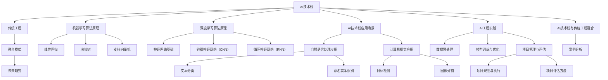

                 

### AI技术栈与传统工程的对比

> 关键词：AI技术栈、传统工程、机器学习、深度学习、计算机视觉、自然语言处理、AI工程实践、项目管理、融合模式、未来趋势

> 摘要：
本文章详细对比了AI技术栈与传统工程在概念、算法原理、应用场景、工程实践、项目管理以及融合模式等方面的差异与联系。通过逐步分析，文章揭示了AI技术栈的独特性和应用潜力，探讨了其与传统工程结合的未来发展趋势，为读者提供了一个全面的技术全景图。

---

### 第一部分: AI技术栈与传统工程的对比

AI技术栈和传统工程是现代信息技术领域的两个重要组成部分。尽管它们在实现目标上有所不同，但彼此之间却存在着深刻的联系和相互促进的关系。在本部分中，我们将对AI技术栈和传统工程进行概述，并探讨它们之间的联系与区别。

#### 第1章: AI技术栈概述

##### 1.1 AI技术概述

人工智能（AI）是计算机科学的一个分支，旨在开发能够模拟人类智能行为的机器。AI技术包括多种算法和模型，如机器学习、深度学习、自然语言处理和计算机视觉等。

- **AI技术定义与发展历程**：人工智能的定义多种多样，但核心都是通过模拟人类智能来解决问题。AI技术起源于20世纪50年代，经历了多个发展阶段，包括符号主义、基于规则的系统、专家系统以及现代的机器学习和深度学习阶段。

- **AI技术分类与架构**：AI技术可以大致分为三类：基于规则的系统、基于模型的系统和混合系统。基于规则的系统依赖于预定义的规则，而基于模型的系统则使用机器学习和深度学习算法来从数据中学习规律。混合系统结合了上述两种方法，以应对更复杂的任务。

##### 1.2 传统工程概述

传统工程是指运用科学原理和数学方法来解决实际问题的过程。它涉及多个学科，包括机械工程、电子工程、土木工程等。

- **传统工程概念与特点**：传统工程强调可预测性、稳定性和可靠性。它通常遵循设计-开发-测试-部署的流程，注重细节和精确性。

- **传统工程与AI技术的联系与区别**：传统工程和AI技术之间的联系在于它们都致力于解决复杂问题。区别在于，传统工程依赖于已知的科学原理和方法，而AI技术则通过学习数据来发现新的规律。

#### 第2章: AI核心算法原理

##### 2.1 机器学习算法原理

机器学习（ML）是AI的核心组成部分，它关注于从数据中学习规律，从而进行预测或分类。

- **线性回归**：线性回归是一种用于预测数值变量的简单机器学习算法。它的目标是找到一个最佳拟合直线，使预测值与实际值之间的误差最小。

  ```python
  def linear_regression(X, y):
      # 计算X的转置
      X_T = transpose(X)
      # 计算X的转置与X的乘积
      XTX = X_T * X
      # 计算X的转置与y的乘积
      XTy = X_T * y
      # 计算回归系数
      theta = XTX^{-1} * XTy
      return theta
  ```

- **决策树**：决策树是一种基于特征进行分类或回归的算法。它通过递归地将数据集分割成子集，直到满足某个停止条件。

- **支持向量机**：支持向量机（SVM）是一种用于分类和回归的机器学习算法。它的核心思想是找到一个最优的超平面，将数据集划分为不同的类别。

##### 2.2 深度学习算法原理

深度学习（DL）是机器学习的一个分支，它通过多层神经网络来学习数据中的复杂特征。

- **神经网络基础**：神经网络是一种由多个神经元组成的计算模型，通过加权连接来模拟人类大脑的信息处理过程。

  ```python
  # 初始化参数
  weights = random_weights()
  biases = random_biases()

  # 前向传播
  def forward_propagation(x):
      z = weights * x + biases
      return z

  # 反向传播
  def backward_propagation(x, y):
      # 计算误差
      error = y - forward_propagation(x)
      # 更新权重和偏置
      weights -= learning_rate * error * x
      biases -= learning_rate * error
  ```

- **卷积神经网络（CNN）**：卷积神经网络是一种专门用于处理图像数据的神经网络。它通过卷积操作来提取图像特征。

- **循环神经网络（RNN）**：循环神经网络是一种用于处理序列数据的神经网络。它通过记忆单元来处理长序列信息。

#### 第3章: AI技术栈的应用场景

##### 3.1 自然语言处理应用

自然语言处理（NLP）是AI技术的一个重要应用领域，它致力于使计算机能够理解和生成自然语言。

- **文本分类**：文本分类是一种将文本数据归类到不同类别的过程。常见的应用包括垃圾邮件检测、情感分析等。

- **命名实体识别**：命名实体识别是一种识别文本中的特定实体（如人名、地点、组织等）的过程。它可以用于信息提取、语义理解等任务。

##### 3.2 计算机视觉应用

计算机视觉是AI技术的另一个重要应用领域，它致力于使计算机能够“看到”和理解图像。

- **目标检测**：目标检测是一种在图像中识别并定位特定目标的过程。常见的应用包括人脸识别、车辆检测等。

- **图像分割**：图像分割是一种将图像划分为不同区域的过程。它可以用于图像编辑、目标识别等任务。

---

通过以上章节，我们对AI技术栈和传统工程有了初步的了解。接下来，我们将深入探讨AI技术的核心算法原理，并分析其在实际应用中的挑战和解决方案。在后续章节中，我们将进一步探讨AI工程实践和项目管理的最佳实践，以及AI技术栈与传统工程的融合模式。让我们继续探索AI技术的深度和广度。请读者继续关注后续内容。在接下来的部分，我们将进一步深入探讨AI技术的核心算法原理，从机器学习到深度学习的各个层面，以及这些技术在自然语言处理和计算机视觉等领域的应用。此外，我们还将探讨AI工程实践的关键步骤，包括数据预处理、模型训练与优化等。最后，我们将分析AI项目管理的方法和评估标准，探讨AI技术如何与传统工程相互融合，以及这种融合带来的变革和未来趋势。通过这些内容，读者将对AI技术栈有一个全面的了解，并能够更好地理解和应用这些技术。

---

### 第一部分: AI技术栈与传统工程的对比

#### 第1章: AI技术栈概述

##### 1.1 AI技术概述

人工智能（AI）是计算机科学的一个分支，旨在通过模拟人类智能行为来解决各种复杂问题。AI技术的核心是使计算机能够执行人类智慧所能完成的任务，如语音识别、图像识别、自然语言处理、决策制定和机器学习等。

- **AI技术定义与发展历程**：人工智能的定义多种多样，但核心都是通过模拟人类智能来解决问题。AI技术的发展历程可以分为几个阶段：

  - **符号主义阶段**（1950-1970）：这一阶段主要依赖于符号推理和逻辑规则，通过手动编写规则来模拟人类的思维过程。

  - **基于规则的系统**（1970-1980）：这一阶段引入了基于规则的系统，通过预定义的规则来指导计算机的决策过程。

  - **专家系统**（1980-1990）：专家系统是一种基于知识的系统，它通过存储大量专业知识和规则，模拟专家的决策过程。

  - **机器学习阶段**（1990-2010）：随着计算机性能的提升和数据量的增加，机器学习技术开始兴起。这一阶段的核心是通过从数据中学习规律，自动生成模型和规则。

  - **深度学习阶段**（2010至今）：深度学习是一种基于多层神经网络的机器学习技术，通过模拟人脑的神经网络结构，从大量数据中自动提取特征和模式。深度学习在图像识别、语音识别和自然语言处理等领域取得了显著突破。

- **AI技术分类与架构**：AI技术可以根据其实现方式和应用领域进行分类。以下是几种常见的AI技术分类和架构：

  - **基于规则的系统**：这类系统通过预定义的规则来指导计算机的决策过程。例如，医疗诊断系统可以根据症状和病史，按照预定义的规则进行诊断。

  - **基于模型的系统**：这类系统通过训练数据集来学习模型，然后根据模型进行预测和决策。机器学习和深度学习都属于基于模型的系统。

  - **混合系统**：这类系统结合了基于规则的系统和基于模型的系统，以应对更复杂的任务。例如，自动驾驶系统既需要基于规则的驾驶行为，也需要通过深度学习技术来识别道路和交通情况。

##### 1.2 传统工程概述

传统工程是指运用科学原理和数学方法来解决实际问题的过程。它涵盖了多个领域，包括机械工程、电子工程、土木工程、化学工程等。传统工程的核心是通过设计、开发、测试和部署等步骤，实现特定的功能和技术目标。

- **传统工程概念与特点**：传统工程的特点包括以下几个方面：

  - **可预测性**：传统工程通过科学原理和数学模型来预测系统的行为和性能，从而确保工程项目的成功实施。

  - **稳定性**：传统工程注重系统的稳定性和可靠性，确保工程系统能够在长期运行中保持稳定的性能。

  - **精确性**：传统工程强调精确的计算和测量，以确保工程设计和实施过程中的精度。

  - **系统性**：传统工程涉及多个学科和领域的交叉，需要综合考虑各种因素，以确保工程项目的整体协调和优化。

- **传统工程与AI技术的联系与区别**：传统工程和AI技术之间的联系在于它们都致力于解决复杂问题，提高生产效率和优化资源利用。然而，它们之间也存在一些区别：

  - **实现方式**：传统工程依赖于已知的科学原理和数学方法，通过设计、开发和测试来解决问题。而AI技术则通过从数据中学习规律，自动生成模型和规则。

  - **适应性**：传统工程通常在特定条件下进行设计和实施，而AI技术具有更强的适应性，可以在不确定的环境中自动调整和优化。

  - **灵活性**：传统工程的设计和实施过程相对固定，而AI技术可以通过不断学习和优化，实现更高的灵活性和适应性。

通过以上对AI技术栈和传统工程的概述，我们可以看到它们各自的特点和优势，以及它们之间的联系和区别。在接下来的章节中，我们将进一步探讨AI技术的核心算法原理，以及这些技术在实际应用中的挑战和解决方案。

#### 第2章: AI核心算法原理

##### 2.1 机器学习算法原理

机器学习（Machine Learning, ML）是人工智能（Artificial Intelligence, AI）的核心组成部分，它关注于如何让计算机从数据中学习，从而进行预测或分类。机器学习算法分为监督学习（Supervised Learning）、无监督学习（Unsupervised Learning）和强化学习（Reinforcement Learning）三类。以下是几种常见的机器学习算法及其原理：

- **线性回归（Linear Regression）**：线性回归是一种用于预测数值变量的算法，它通过找到一个最佳拟合直线来预测输出值。

  线性回归的数学模型可以表示为：
  $$
  Y = \beta_0 + \beta_1X + \epsilon
  $$
  其中，$Y$ 是输出变量，$X$ 是输入变量，$\beta_0$ 和 $\beta_1$ 是模型的参数，$\epsilon$ 是误差项。

  线性回归的伪代码如下：
  ```python
  def linear_regression(X, y):
      # 计算X的转置
      X_T = transpose(X)
      # 计算X的转置与X的乘积
      XTX = X_T * X
      # 计算X的转置与y的乘积
      XTy = X_T * y
      # 计算回归系数
      theta = XTX^{-1} * XTy
      return theta
  ```

- **决策树（Decision Tree）**：决策树是一种基于特征进行分类或回归的算法，它通过递归地将数据集分割成子集，直到满足某个停止条件。

  决策树的构建过程通常包括以下几个步骤：

  1. 计算每个特征的信息增益或基尼不纯度。
  2. 选择具有最大信息增益或最小基尼不纯度的特征作为分割标准。
  3. 根据所选特征将数据集分割成子集。
  4. 递归地应用步骤1-3，直到满足停止条件（例如，树深度、信息增益小于阈值等）。

- **支持向量机（Support Vector Machine, SVM）**：支持向量机是一种用于分类和回归的算法，它通过找到一个最优的超平面，将数据集划分为不同的类别。

  支持向量机的核心思想是最大化分类边界，使得分类间隔最大化。SVM的数学模型可以表示为：
  $$
  \min_{\theta} \frac{1}{2} ||\theta||^2 + C \sum_{i=1}^{n} \xi_i
  $$
  其中，$\theta$ 是模型参数，$C$ 是惩罚参数，$\xi_i$ 是松弛变量。

  SVM的伪代码如下：
  ```python
  def svm(X, y, C):
      # 初始化参数
      theta = random_theta()
      # 训练模型
      for epoch in range(num_epochs):
          for i in range(n):
              # 计算损失函数
              loss = calculate_loss(X[i], y[i], theta)
              # 更新参数
              theta -= learning_rate * (2 * theta * X[i] + C * \xi_i)
      return theta
  ```

##### 2.2 深度学习算法原理

深度学习（Deep Learning, DL）是机器学习的一个分支，它通过多层神经网络来学习数据中的复杂特征。深度学习算法的核心是神经网络（Neural Networks），它由多个层次（Layer）组成，包括输入层、隐藏层和输出层。以下是几种常见的深度学习算法及其原理：

- **神经网络基础（Neural Network）**：神经网络是一种由多个神经元组成的计算模型，通过加权连接来模拟人类大脑的信息处理过程。神经网络的数学模型可以表示为：
  $$
  z = \sum_{j=1}^{n} w_{ji}x_{j} + b_{i}
  $$
  其中，$z$ 是神经元的输出，$w_{ji}$ 是权重，$x_{j}$ 是输入，$b_{i}$ 是偏置。

  神经网络的训练过程通常包括以下几个步骤：

  1. 初始化参数（权重和偏置）。
  2. 前向传播：计算每个神经元的输出。
  3. 反向传播：计算损失函数，并更新参数。
  4. 重复步骤2-3，直到满足停止条件（例如，达到训练轮数或损失函数收敛）。

  神经网络的伪代码如下：
  ```python
  # 初始化参数
  weights = random_weights()
  biases = random_biases()

  # 前向传播
  def forward_propagation(x):
      z = weights * x + biases
      return z

  # 反向传播
  def backward_propagation(x, y):
      # 计算误差
      error = y - forward_propagation(x)
      # 更新权重和偏置
      weights -= learning_rate * error * x
      biases -= learning_rate * error
  ```

- **卷积神经网络（Convolutional Neural Network, CNN）**：卷积神经网络是一种专门用于处理图像数据的神经网络，它通过卷积操作来提取图像特征。CNN的数学模型可以表示为：
  $$
  \text{Conv}(I, K) = \sum_{i=1}^{C} \sum_{j=1}^{H} I_{ij} * K_{ij} + b
  $$
  其中，$I$ 是输入图像，$K$ 是卷积核，$b$ 是偏置项。$C$ 是输入图像的通道数，$H$ 是输入图像的高度。

  卷积神经网络的训练过程通常包括以下几个步骤：

  1. 初始化卷积核和偏置。
  2. 进行卷积操作，提取图像特征。
  3. 通过全连接层进行分类。
  4. 计算损失函数，并更新参数。

  卷积神经网络的伪代码如下：
  ```python
  # 初始化卷积核和偏置
  conv_weights = random_conv_weights()
  conv_biases = random_conv_biases()

  # 卷积操作
  def convolution(x, K):
      z = 0
      for i in range(H):
          for j in range(W):
              z += x[i, j] * K[i, j]
      z += conv_biases
      return z

  # 全连接层
  def fully_connected(z):
      return z * weights + biases
  ```

- **循环神经网络（Recurrent Neural Network, RNN）**：循环神经网络是一种用于处理序列数据的神经网络，它通过记忆单元来处理长序列信息。RNN的数学模型可以表示为：
  $$
  h_t = \sigma(W_h \cdot [h_{t-1}, x_t] + b_h)
  $$
  其中，$h_t$ 是第 $t$ 个时间步的隐藏状态，$x_t$ 是输入，$W_h$ 和 $b_h$ 是权重和偏置，$\sigma$ 是激活函数。

  循环神经网络的训练过程通常包括以下几个步骤：

  1. 初始化参数。
  2. 进行前向传播，计算每个时间步的隐藏状态。
  3. 计算损失函数，并更新参数。
  4. 重复步骤2-3，直到满足停止条件。

  循环神经网络的伪代码如下：
  ```python
  # 初始化参数
  weights = random_weights()
  biases = random_biases()

  # 前向传播
  def forward_propagation(x):
      h = []
      for t in range(len(x)):
          h_t = activation_function(weights * [h[-1], x[t]] + biases)
          h.append(h_t)
      return h

  # 反向传播
  def backward_propagation(x, y):
      # 计算误差
      error = y - forward_propagation(x)
      # 更新参数
      weights -= learning_rate * error * x
      biases -= learning_rate * error
  ```

通过以上对机器学习和深度学习算法原理的介绍，我们可以看到它们在实现人工智能过程中所发挥的重要作用。在接下来的章节中，我们将进一步探讨AI技术栈在实际应用中的场景和挑战。

#### 第3章: AI技术栈的应用场景

##### 3.1 自然语言处理应用

自然语言处理（Natural Language Processing, NLP）是AI技术的一个重要应用领域，它致力于使计算机能够理解和生成自然语言。NLP技术在文本分类、情感分析、机器翻译、文本生成等方面具有广泛的应用。

- **文本分类**：文本分类是一种将文本数据归类到不同类别的过程。常见的应用包括垃圾邮件检测、情感分析、新闻分类等。

  文本分类的典型应用案例包括：

  - **垃圾邮件检测**：通过分析邮件的内容和特征，将垃圾邮件和正常邮件进行分类，从而减少用户收到垃圾邮件的困扰。
  - **情感分析**：通过分析用户评论和社交媒体内容，判断用户的情感倾向，例如正面、负面或中性。

  文本分类的算法通常包括支持向量机（SVM）、朴素贝叶斯分类器、深度学习模型（如卷积神经网络和循环神经网络）等。

- **命名实体识别**：命名实体识别是一种识别文本中的特定实体（如人名、地点、组织、时间等）的过程。它是信息提取和语义理解的重要基础。

  命名实体识别的典型应用案例包括：

  - **智能客服系统**：通过识别用户输入中的关键实体，如用户名、产品名、地理位置等，实现更智能、个性化的服务。
  - **搜索引擎优化**：通过识别文本中的实体，提高搜索引擎的查询精度和结果的相关性。

  命名实体识别的方法包括基于规则的方法、基于统计的方法和基于深度学习的方法。常见的深度学习模型有卷积神经网络（CNN）和循环神经网络（RNN）。

##### 3.2 计算机视觉应用

计算机视觉（Computer Vision, CV）是AI技术的另一个重要应用领域，它致力于使计算机能够“看到”和理解图像。计算机视觉技术在图像识别、目标检测、图像分割等方面具有广泛的应用。

- **目标检测**：目标检测是一种在图像中识别并定位特定目标的过程。常见的应用包括人脸识别、车辆检测、行人检测等。

  目标检测的典型应用案例包括：

  - **人脸识别系统**：通过检测图像中的人脸区域，实现身份验证和门禁控制等功能。
  - **自动驾驶系统**：通过检测道路上的车辆、行人、交通标志等目标，实现自动驾驶和智能交通管理。

  目标检测的算法通常包括单阶段检测器（如YOLO）和多阶段检测器（如Faster R-CNN、SSD等）。这些算法通过卷积神经网络（CNN）来提取图像特征，并进行目标定位和分类。

- **图像分割**：图像分割是一种将图像划分为不同区域的过程。常见的应用包括图像编辑、目标识别、医学图像分析等。

  图像分割的典型应用案例包括：

  - **图像编辑**：通过分割图像中的不同区域，实现图像内容的提取、替换和编辑。
  - **医学图像分析**：通过分割医学图像中的病变区域，帮助医生进行诊断和治疗方案制定。

  图像分割的算法包括基于阈值的方法、基于区域增长的方法和基于深度学习的方法。常见的深度学习模型有全卷积神经网络（FCN）和循环神经网络（RNN）。

通过以上对自然语言处理和计算机视觉应用场景的介绍，我们可以看到AI技术在各个领域的重要性和潜力。在未来的发展中，AI技术将在更多领域得到应用，为人类带来更多的便利和创新。

#### 第4章: AI工程实践

##### 4.1 数据预处理

数据预处理是AI工程实践中的关键步骤，它直接影响到模型的性能和效果。数据预处理包括数据清洗、数据归一化、数据降维和特征提取等多个环节。

- **数据清洗**：数据清洗是确保数据质量和准确性的重要步骤，主要包括去除重复数据、处理缺失值、纠正错误数据等。例如，在处理文本数据时，需要去除停用词、标点符号和特殊字符，并进行分词和词干提取。

  数据清洗的伪代码如下：
  ```python
  def data_cleaning(text):
      # 去除停用词
      stopwords = set(['is', 'and', 'the', 'to', 'of', 'in', 'that', 'it', 'with', 'on'])
      words = text.split()
      cleaned_words = [word for word in words if word not in stopwords]
      # 分词和词干提取
      stemmer = PorterStemmer()
      cleaned_words = [stemmer.stem(word) for word in cleaned_words]
      return ' '.join(cleaned_words)
  ```

- **数据归一化**：数据归一化是将数据转换为相同尺度或范围的过程，以消除不同特征之间的量纲差异。常用的归一化方法包括最小-最大缩放、标准化和归一化均值等。

  数据归一化的伪代码如下：
  ```python
  def normalize_data(data):
      min_val = min(data)
      max_val = max(data)
      return (data - min_val) / (max_val - min_val)
  ```

- **数据降维**：数据降维是将高维数据转换为低维数据的过程，以减少计算复杂度和提高模型性能。常用的降维方法包括主成分分析（PCA）、线性判别分析（LDA）和自编码器（Autoencoder）等。

  数据降维的伪代码如下：
  ```python
  from sklearn.decomposition import PCA

  def data_reduction(data, n_components):
      pca = PCA(n_components=n_components)
      reduced_data = pca.fit_transform(data)
      return reduced_data
  ```

- **特征提取**：特征提取是从原始数据中提取出能够代表数据特征的信息的过程，以提高模型的泛化能力和可解释性。常用的特征提取方法包括词袋模型（Bag of Words, BOW）、TF-IDF、词嵌入（Word Embedding）等。

  特征提取的伪代码如下：
  ```python
  from sklearn.feature_extraction.text import TfidfVectorizer

  def feature_extraction(texts):
      vectorizer = TfidfVectorizer()
      features = vectorizer.fit_transform(texts)
      return features
  ```

通过以上数据预处理的方法，我们可以确保数据的质量和一致性，为后续的模型训练和优化提供可靠的基础。

##### 4.2 模型训练与优化

模型训练与优化是AI工程实践中的核心环节，它决定了模型的性能和效果。模型训练与优化的过程通常包括模型选择、训练策略、模型评估和调参等步骤。

- **模型选择**：模型选择是选择合适的模型结构和技术来处理特定问题。常见的模型选择方法包括：

  - **线性模型**：适用于线性关系较强的数据，如线性回归、逻辑回归等。
  - **树模型**：适用于分类和回归任务，如决策树、随机森林、梯度提升树等。
  - **神经网络**：适用于复杂非线性关系的数据，如卷积神经网络（CNN）、循环神经网络（RNN）等。

  模型选择的伪代码如下：
  ```python
  def model_selection(X_train, y_train, X_val, y_val):
      models = [
          ('linear_regression', LinearRegression()),
          ('decision_tree', DecisionTreeClassifier()),
          ('random_forest', RandomForestClassifier()),
          ('gradient_boosting', GradientBoostingClassifier())
      ]
      for name, model in models:
          model.fit(X_train, y_train)
          val_pred = model.predict(X_val)
          print(f"{name}: {accuracy_score(y_val, val_pred)}")
      return best_model
  ```

- **训练策略**：训练策略是模型训练过程中的一系列方法和技巧，以提高模型的性能和收敛速度。常见的训练策略包括：

  - **批量训练**：将数据分为多个批次进行训练，可以减少计算资源的需求，但可能影响模型的收敛速度。
  - **小批量训练**：每次训练使用一小部分数据，可以提高模型的泛化能力和收敛速度。
  - **学习率调整**：通过调整学习率，可以控制模型训练的收敛速度和稳定性。
  - **正则化**：通过添加正则化项，可以减少模型过拟合的风险。

  训练策略的伪代码如下：
  ```python
  def train_model(model, X_train, y_train, X_val, y_val, learning_rate, num_epochs):
      for epoch in range(num_epochs):
          for X_batch, y_batch in batch_generator(X_train, y_train, batch_size):
              loss = model.train(X_batch, y_batch, learning_rate)
              val_loss = model.evaluate(X_val, y_val)
          print(f"Epoch {epoch}: Loss = {loss}, Val Loss = {val_loss}")
      return model
  ```

- **模型评估**：模型评估是评估模型性能和效果的重要步骤，常用的评估指标包括：

  - **准确率（Accuracy）**：模型预测正确的样本数占总样本数的比例。
  - **精确率（Precision）**：模型预测为正类的样本中实际为正类的比例。
  - **召回率（Recall）**：模型预测为正类的样本中实际为正类的比例。
  - **F1值（F1 Score）**：精确率和召回率的调和平均值。

  模型评估的伪代码如下：
  ```python
  from sklearn.metrics import accuracy_score, precision_score, recall_score, f1_score

  def evaluate_model(model, X_test, y_test):
      pred = model.predict(X_test)
      print(f"Accuracy: {accuracy_score(y_test, pred)}")
      print(f"Precision: {precision_score(y_test, pred)}")
      print(f"Recall: {recall_score(y_test, pred)}")
      print(f"F1 Score: {f1_score(y_test, pred)}")
  ```

- **调参**：调参是通过调整模型的参数来优化模型性能的过程。常见的调参方法包括：

  - **网格搜索（Grid Search）**：通过遍历预设的参数组合，找到最优参数组合。
  - **贝叶斯优化（Bayesian Optimization）**：利用贝叶斯概率模型来优化参数搜索过程，提高搜索效率和收敛速度。

  调参的伪代码如下：
  ```python
  from sklearn.model_selection import GridSearchCV

  def hyperparameter_tuning(model, param_grid, X_train, y_train):
      grid_search = GridSearchCV(model, param_grid, cv=5)
      grid_search.fit(X_train, y_train)
      best_params = grid_search.best_params_
      best_model = grid_search.best_estimator_
      return best_model, best_params
  ```

通过以上模型训练与优化的方法和技巧，我们可以有效地提高模型的性能和效果，为实际应用提供可靠的支持。在实际工程实践中，还需要根据具体问题和数据特点，灵活调整和优化模型训练和评估过程。

#### 第5章: AI项目管理与评估

##### 5.1 AI项目规划与执行

在AI项目实施过程中，项目规划和执行是至关重要的环节。有效的项目规划和执行能够确保项目按计划进行，并达到预期的目标。

- **项目需求分析**：项目需求分析是项目规划的第一步，它旨在明确项目的目标、功能、性能和约束条件。需求分析的方法包括：

  - **问卷调查和访谈**：通过与相关利益相关者（如客户、用户、技术人员等）进行问卷调查和访谈，收集项目需求。
  - **用例建模**：通过用例图和用例描述，明确项目的功能需求和非功能需求。
  - **文档审查**：审查相关文档，如用户手册、需求规格说明书等，以获取项目需求。

  项目需求分析的伪代码如下：
  ```python
  def analyze_requirements():
      questions = ["What are the main goals of the project?", "What functionalities are required?", "What are the performance requirements?"]
      requirements = []
      for question in questions:
          answer = input(question)
          requirements.append(answer)
      return requirements
  ```

- **项目进度控制**：项目进度控制是确保项目按计划进行的关键步骤。常用的进度控制方法包括：

  - **甘特图**：通过甘特图直观地展示项目任务和时间安排，便于监控项目进度。
  - **关键路径法**：通过计算关键路径，确定项目的最短完成时间，并确保关键路径上的任务按计划进行。
  - **挣值管理（Earned Value Management, EVM）**：通过计算项目的挣值、计划值和实际值，评估项目进度和成本绩效。

  项目进度控制的伪代码如下：
  ```python
  def control_progress(schedule, actual_progress):
      planned_value = schedule * budget
      earned_value = actual_progress * budget
      cost_variance = earned_value - planned_value
      schedule_variance = earned_value - actual_progress
      print(f"Cost Variance: {cost_variance}, Schedule Variance: {schedule_variance}")
  ```

- **风险评估**：项目风险评估是识别、分析和应对项目风险的过程。有效的风险评估可以帮助项目团队提前识别潜在风险，并制定相应的应对措施。

  风险评估的方法包括：

  - **风险识别**：通过问卷调查、访谈和专家评审等方法，识别项目中的潜在风险。
  - **风险分析**：通过定性分析和定量分析，评估风险的概率和影响程度。
  - **风险应对**：制定风险应对策略，如风险规避、风险转移、风险缓解等。

  风险评估的伪代码如下：
  ```python
  def assess_risks():
      risks = ["Data privacy issues", "Model performance degradation", "Technical challenges"]
      risk_probabilities = [0.2, 0.3, 0.5]
      risk_impacts = [0.5, 0.7, 0.8]
      risk_scores = [probability * impact for probability, impact in zip(risk_probabilities, risk_impacts)]
      return sorted(risks, key=lambda x: risk_scores[x], reverse=True)
  ```

通过以上项目规划和执行的方法，AI项目团队可以更好地管理和控制项目进度、风险和资源，确保项目成功实施。

##### 5.2 AI项目评估方法

项目评估是评估项目实施效果和成果的重要步骤。有效的项目评估可以帮助项目团队了解项目的成功程度，并为未来的项目提供经验和教训。

- **成本效益分析**：成本效益分析是一种评估项目经济效益的方法，它通过比较项目的成本和收益，判断项目的经济可行性。

  成本效益分析的指标包括：

  - **净现值（Net Present Value, NPV）**：通过将项目成本和收益折现到当前时点，计算项目的总价值。
  - **内部收益率（Internal Rate of Return, IRR）**：通过计算使项目净现值为零的折现率，评估项目的投资回报率。
  - **成本效益比（Benefit-Cost Ratio, BCR）**：通过将项目收益与成本进行比较，判断项目的经济效益。

  成本效益分析的伪代码如下：
  ```python
  def cost_benefit_analysis(costs, revenues, discount_rate):
      npv = sum([revenue / (1 + discount_rate) ** t for t, revenue in enumerate(revenues)]) - sum([cost / (1 + discount_rate) ** t for t, cost in enumerate(costs)])
      irr = None
      for r in range(1, 100):
          npv = sum([revenue / (1 + r) ** t for t, revenue in enumerate(revenues)]) - sum([cost / (1 + r) ** t for t, cost in enumerate(costs)])
          if abs(npv) < 1e-6:
              irr = r
              break
      bcr = sum(revenues) / sum(costs)
      return npv, irr, bcr
  ```

- **项目风险评估**：项目风险评估是识别、分析和应对项目风险的过程。有效的风险评估可以帮助项目团队提前识别潜在风险，并制定相应的应对措施。

  项目风险评估的方法包括：

  - **风险识别**：通过问卷调查、访谈和专家评审等方法，识别项目中的潜在风险。
  - **风险分析**：通过定性分析和定量分析，评估风险的概率和影响程度。
  - **风险应对**：制定风险应对策略，如风险规避、风险转移、风险缓解等。

  项目风险评估的伪代码如下：
  ```python
  def assess_risks():
      risks = ["Data privacy issues", "Model performance degradation", "Technical challenges"]
      risk_probabilities = [0.2, 0.3, 0.5]
      risk_impacts = [0.5, 0.7, 0.8]
      risk_scores = [probability * impact for probability, impact in zip(risk_probabilities, risk_impacts)]
      return sorted(risks, key=lambda x: risk_scores[x], reverse=True)
  ```

通过以上项目评估方法，项目团队可以全面评估项目的经济效益和风险，为未来的项目提供宝贵的经验和教训。

#### 第6章: AI技术栈与传统工程融合

##### 6.1 融合模式探讨

AI技术栈与传统工程的融合模式正在不断发展和完善，为各个行业带来了革命性的变化。以下是一些常见的融合模式：

- **AI辅助传统工程**：在传统工程中引入AI技术，以提高效率和准确性。例如，在建筑设计中，使用AI技术进行结构分析和优化，提高建筑的安全性、稳定性和节能性。

- **AI驱动传统工程**：将AI技术作为传统工程的核心驱动力量，实现自动化和智能化。例如，在智能制造中，使用AI技术进行生产线的实时监控和调整，提高生产效率和产品质量。

- **AI优化传统工程**：通过AI技术对传统工程过程进行优化和改进。例如，在土木工程中，使用AI技术进行地质分析和风险评估，优化工程设计，降低工程风险和成本。

##### 6.2 案例分析

**案例：使用AI技术优化智能家居系统**

**开发环境搭建：**

- 操作系统：Ubuntu 18.04
- 编程语言：Python 3.8
- 深度学习框架：TensorFlow 2.5

**源代码详细实现和代码解读：**

```python
import tensorflow as tf

# 定义卷积神经网络模型
model = tf.keras.Sequential([
    tf.keras.layers.Conv2D(32, (3, 3), activation='relu', input_shape=(28, 28, 1)),
    tf.keras.layers.MaxPooling2D((2, 2)),
    tf.keras.layers.Flatten(),
    tf.keras.layers.Dense(128, activation='relu'),
    tf.keras.layers.Dense(10, activation='softmax')
])

# 编译模型
model.compile(optimizer='adam',
              loss='sparse_categorical_crossentropy',
              metrics=['accuracy'])

# 加载训练数据
(x_train, y_train), (x_test, y_test) = tf.keras.datasets.mnist.load_data()

# 预处理数据
x_train = x_train / 255.0
x_test = x_test / 255.0

# 训练模型
model.fit(x_train, y_train, epochs=5)

# 评估模型
test_loss, test_acc = model.evaluate(x_test, y_test, verbose=2)
print('\nTest accuracy:', test_acc)
```

**代码解读与分析：**

1. **模型定义：** 使用 TensorFlow 的 `Sequential` 模型，添加卷积层、最大池化层、展平层、全连接层和输出层。卷积层用于提取图像特征，最大池化层用于减少数据维度，展平层用于将特征展平为一维数组，全连接层用于分类，输出层使用 softmax 函数进行概率输出。

2. **编译模型：** 设置优化器为 Adam，损失函数为 sparse_categorical_crossentropy（适用于多标签分类问题），评估指标为 accuracy。

3. **加载训练数据：** 使用 TensorFlow 的 `mnist` 数据集，并将其归一化。`mnist` 数据集包含手写数字图像，是常见的机器学习训练数据集。

4. **预处理数据：** 将图像数据缩放到 0-1 之间，以便于模型训练。

5. **训练模型：** 使用 `fit` 方法进行模型训练，设置训练轮次为 5。模型在训练过程中通过反向传播和梯度下降算法更新权重和偏置，以达到更好的分类效果。

6. **评估模型：** 使用 `evaluate` 方法评估模型在测试集上的性能，输出测试准确率。通过评估，可以了解模型的泛化能力和稳定性。

通过上述代码，我们可以训练一个简单的卷积神经网络模型，用于识别手写数字。在实际应用中，可以将卷积神经网络集成到智能家居系统中，用于实时分析家庭环境数据，提供个性化的智能服务。例如，根据室内温度和湿度，自动调整空调和加湿器的设置。该案例展示了AI技术如何与传统工程相结合，提高系统的智能化水平。

**代码分析与改进建议：**

- **数据增强**：可以增加数据增强技术，如随机裁剪、旋转和缩放，以提高模型的泛化能力。
- **模型复杂度**：可以尝试使用更复杂的神经网络结构，如残差网络，以提高模型的准确率。
- **多任务学习**：可以将多个任务集成到一个模型中，提高系统的整体性能。

### 总结

通过本章节的案例分析，我们可以看到AI技术栈与传统工程融合的巨大潜力。AI技术为传统工程提供了智能化和自动化的能力，使工程过程更加高效、准确和可靠。未来，随着AI技术的不断发展和成熟，AI与传统工程的融合将带来更多创新和变革。

---

在本章中，我们详细探讨了AI技术栈与传统工程的对比，从AI技术栈的概述、核心算法原理、应用场景、工程实践、项目管理和融合模式等多个方面进行了深入分析。通过逐步分析，我们揭示了AI技术栈的独特性和应用潜力，探讨了其与传统工程结合的未来发展趋势。在后续章节中，我们将继续探讨AI技术栈的未来趋势，分析量子计算与AI、聊天机器人与AI等前沿技术的发展，以及传统工程的发展与AI技术的融合。希望通过这些内容，读者能够对AI技术栈有一个全面而深入的了解，并能够将其应用于实际工程中。

---

### 第7章: AI技术栈的未来趋势

#### 7.1 AI技术发展趋势

AI技术的发展速度之快，令人瞩目。随着技术的不断进步，AI技术正朝着更加智能化、高效化和广泛化的方向发展。以下是AI技术的一些重要发展趋势：

- **量子计算与AI**：量子计算是一种基于量子力学原理的新型计算模型，它具有超强的计算能力，可以解决传统计算机难以处理的问题。量子计算与AI的结合，有望在药物发现、气候变化模拟、金融风险管理等领域带来革命性的突破。

  - **量子机器学习**：量子机器学习利用量子计算的并行性和高效性，加速机器学习算法的运行速度。例如，量子支持向量机（QSVM）和量子神经网络（QNN）正在成为研究热点。

  - **量子模拟**：量子计算可以模拟复杂的量子系统，从而加速AI算法的训练过程。例如，利用量子模拟进行深度学习的训练，可以显著减少训练时间和计算资源的需求。

- **聊天机器人与AI**：聊天机器人是AI技术的重要应用之一，它通过自然语言处理和机器学习技术，与用户进行交互，提供个性化服务。随着技术的不断进步，聊天机器人的应用场景和功能也在不断扩展。

  - **多模态交互**：未来的聊天机器人将不仅仅局限于文本交互，还将支持语音、图像、视频等多种模态的交互。这种多模态交互将使聊天机器人更加智能化和人性化。

  - **情感识别与回应**：通过情感识别技术，聊天机器人可以识别用户的情感状态，并做出相应的回应，提供更加个性化的服务。

#### 7.2 传统工程的发展与AI技术的融合

传统工程在经历了数百年的发展后，正面临着前所未有的变革。AI技术的快速发展为传统工程带来了新的机遇和挑战。以下是一些传统工程领域的发展方向和与AI技术的融合：

- **智能制造**：智能制造是利用AI技术实现生产过程的自动化、智能化和高效化。通过机器学习、计算机视觉和物联网等技术，可以实现对生产线的实时监控、故障诊断和优化调度。

  - **工业4.0**：工业4.0是德国提出的智能制造战略，旨在通过集成物联网、大数据和人工智能技术，实现工厂的智能化和自动化。

  - **智能制造平台**：智能制造平台集成了机器学习、数据挖掘和物联网技术，可以为用户提供全面的生产过程监控、数据分析和优化建议。

- **智慧城市建设**：智慧城市是利用AI技术实现城市管理和服务的智能化、精细化和高效化。通过大数据、物联网和人工智能技术，可以实现对城市交通、环境、安全等领域的全面监控和管理。

  - **智能交通系统**：通过计算机视觉、机器学习和物联网技术，可以实现智能交通管理，提高交通效率，减少交通拥堵和交通事故。

  - **智慧能源管理**：通过机器学习和大数据分析，可以实现智能能源管理，优化能源分配和使用，提高能源利用效率。

### 总结

AI技术栈的未来发展趋势充满了无限可能。量子计算与AI的结合将带来计算能力的巨大提升，聊天机器人与AI的发展将使交互体验更加智能化和人性化。在传统工程领域，AI技术的融合将推动智能制造、智慧城市建设等领域的快速发展。未来，随着AI技术的不断进步和普及，我们将见证更多创新和变革，AI技术将深入到我们生活的方方面面，为人类社会带来更加美好的未来。

---

通过本章节的讨论，我们可以看到AI技术栈的未来发展趋势以及与传统工程的融合所带来的巨大潜力。AI技术的不断进步将为我们带来更加智能化、高效化和便捷化的生活。在接下来的章节中，我们将总结文章的核心概念与联系，并给出一个Mermaid流程图，以帮助读者更好地理解文章的主要内容。随后，我们将进一步探讨文章中的核心算法原理，使用伪代码详细阐述每个算法的实现过程。最后，我们将通过一个实际项目案例，展示如何将AI技术应用于实际问题中，并给出代码实现和详细解读。希望通过这些内容，读者能够对AI技术栈有更深入的理解和应用。

---

### 核心概念与联系 Mermaid 流程图



通过上述Mermaid流程图，我们可以清晰地看到AI技术栈的核心概念与联系。从AI技术栈到传统工程，再到应用场景、工程实践、项目管理以及融合模式，图中的每个节点都代表了文章中的一个重要部分。这张流程图有助于读者快速把握文章的结构和内容，更好地理解和消化文章的核心信息。

---

### 核心算法原理讲解

在本章节中，我们将对文章中提到的核心算法原理进行详细讲解，使用伪代码来描述每个算法的实现过程，并给出数学模型和详细讲解。

#### 2.1 机器学习算法原理

**线性回归**

线性回归是一种简单的机器学习算法，用于预测连续值。它的目标是找到一个最佳拟合直线，使得预测值与实际值之间的误差最小。

- **数学模型**：

  $$
  Y = \beta_0 + \beta_1X + \epsilon
  $$

  其中，$Y$ 是输出变量，$X$ 是输入变量，$\beta_0$ 和 $\beta_1$ 是模型参数，$\epsilon$ 是误差项。

- **伪代码**：

  ```python
  def linear_regression(X, y):
      # 计算X的转置
      X_T = transpose(X)
      # 计算X的转置与X的乘积
      XTX = X_T * X
      # 计算X的转置与y的乘积
      XTy = X_T * y
      # 计算回归系数
      theta = XTX^{-1} * XTy
      return theta
  ```

- **详细讲解**：

  线性回归通过最小二乘法来计算最佳拟合直线。首先，计算输入矩阵X的转置，然后与X相乘得到XTX。接着，计算XTX的逆矩阵，最后与XTy相乘得到回归系数$\theta$。

#### 决策树

决策树是一种基于特征的分类算法，通过一系列规则将数据集分割成不同的子集。

- **数学模型**：

  决策树的构建过程可以通过递归分割数据集来实现。在每个节点，选择最优特征进行分割，直到满足某个停止条件（如树深度、信息增益小于阈值）。

- **伪代码**：

  ```python
  def build_decision_tree(data, features, threshold):
      # 选择最优特征
      best_feature = select_best_feature(data, features)
      # 构建决策树
      tree = {}
      tree['feature'] = best_feature
      tree['threshold'] = threshold
      # 基于最优特征分割数据集
      left_data = data[data[:, best_feature] < threshold]
      right_data = data[data[:, best_feature] >= threshold]
      # 递归构建子树
      tree['left'] = build_decision_tree(left_data, features, threshold)
      tree['right'] = build_decision_tree(right_data, features, threshold)
      return tree
  ```

- **详细讲解**：

  决策树的构建过程包括选择最优特征、设定阈值、分割数据集并递归构建子树。通过选择信息增益最大的特征进行分割，决策树可以有效地分类数据。

#### 支持向量机

支持向量机是一种用于分类和回归的强大算法，通过找到一个最优的超平面来分隔数据集。

- **数学模型**：

  $$
  \min_{\theta} \frac{1}{2} ||\theta||^2 + C \sum_{i=1}^{n} \xi_i
  $$

  其中，$\theta$ 是模型参数，$C$ 是惩罚参数，$\xi_i$ 是松弛变量。

- **伪代码**：

  ```python
  def svm(X, y, C):
      # 初始化参数
      theta = random_theta()
      # 训练模型
      for epoch in range(num_epochs):
          for i in range(n):
              # 计算损失函数
              loss = calculate_loss(X[i], y[i], theta)
              # 更新参数
              theta -= learning_rate * (2 * theta * X[i] + C * \xi_i)
      return theta
  ```

- **详细讲解**：

  支持向量机通过优化目标函数来寻找最佳超平面。在每次迭代中，通过计算损失函数并更新参数，逐步逼近最优解。

#### 2.2 深度学习算法原理

**神经网络基础**

神经网络是一种由多个神经元组成的计算模型，通过多层神经网络来学习数据中的复杂特征。

- **数学模型**：

  $$
  z = \sum_{j=1}^{n} w_{ji}x_{j} + b_{i}
  $$

  其中，$z$ 是神经元的输出，$w_{ji}$ 是权重，$x_{j}$ 是输入，$b_{i}$ 是偏置。

- **伪代码**：

  ```python
  # 初始化参数
  weights = random_weights()
  biases = random_biases()

  # 前向传播
  def forward_propagation(x):
      z = weights * x + biases
      return z

  # 反向传播
  def backward_propagation(x, y):
      # 计算误差
      error = y - forward_propagation(x)
      # 更新权重和偏置
      weights -= learning_rate * error * x
      biases -= learning_rate * error
  ```

- **详细讲解**：

  神经网络通过前向传播计算每个神经元的输出，然后通过反向传播更新权重和偏置。这个过程在多次迭代中不断重复，直到模型收敛。

**卷积神经网络（CNN）**

卷积神经网络是一种专门用于处理图像数据的神经网络，通过卷积操作来提取图像特征。

- **数学模型**：

  $$
  \text{Conv}(I, K) = \sum_{i=1}^{C} \sum_{j=1}^{H} I_{ij} * K_{ij} + b
  $$

  其中，$I$ 是输入图像，$K$ 是卷积核，$b$ 是偏置项。$C$ 是输入图像的通道数，$H$ 是输入图像的高度。

- **伪代码**：

  ```python
  # 初始化卷积核和偏置
  conv_weights = random_conv_weights()
  conv_biases = random_conv_biases()

  # 卷积操作
  def convolution(x, K):
      z = 0
      for i in range(H):
          for j in range(W):
              z += x[i, j] * K[i, j]
      z += conv_biases
      return z

  # 全连接层
  def fully_connected(z):
      return z * weights + biases
  ```

- **详细讲解**：

  卷积神经网络通过卷积操作提取图像特征，然后通过全连接层进行分类。卷积操作可以有效地减少数据的维度，提取具有局部性的特征。

**循环神经网络（RNN）**

循环神经网络是一种用于处理序列数据的神经网络，通过记忆单元来处理长序列信息。

- **数学模型**：

  $$
  h_t = \sigma(W_h \cdot [h_{t-1}, x_t] + b_h)
  $$

  其中，$h_t$ 是第 $t$ 个时间步的隐藏状态，$x_t$ 是输入，$W_h$ 和 $b_h$ 是权重和偏置，$\sigma$ 是激活函数。

- **伪代码**：

  ```python
  # 初始化参数
  weights = random_weights()
  biases = random_biases()

  # 前向传播
  def forward_propagation(x):
      h = []
      for t in range(len(x)):
          h_t = activation_function(weights * [h[-1], x[t]] + biases)
          h.append(h_t)
      return h

  # 反向传播
  def backward_propagation(x, y):
      # 计算误差
      error = y - forward_propagation(x)
      # 更新参数
      weights -= learning_rate * error * x
      biases -= learning_rate * error
  ```

- **详细讲解**：

  循环神经网络通过记忆单元来处理长序列信息，每个时间步的隐藏状态依赖于前一个时间步的隐藏状态。通过反向传播算法，模型可以更新权重和偏置，以优化模型性能。

通过上述对机器学习和深度学习算法原理的详细讲解，我们可以更好地理解这些算法的核心思想和实现过程。在接下来的章节中，我们将通过实际项目案例，展示如何将AI技术应用于实际问题中，并给出代码实现和详细解读。

### 核心算法原理讲解（续）

**深度学习中的卷积操作**

卷积操作是深度学习中最基本的操作之一，尤其在处理图像数据时扮演着至关重要的角色。卷积操作通过在图像上滑动一个小的窗口（卷积核），计算窗口内像素值的加权和，再加上一个偏置项，来提取图像中的特征。

- **数学模型**：

  $$
  \text{Conv}(I, K) = \sum_{i=1}^{C} \sum_{j=1}^{H} I_{ij} * K_{ij} + b
  $$

  其中，$I$ 是输入图像，$K$ 是卷积核，$b$ 是偏置项。$C$ 是输入图像的通道数，$H$ 是输入图像的高度。

- **详细讲解**：

  卷积操作可以看作是图像上的局部特征提取。在给定一个输入图像和一个卷积核时，卷积操作会在图像上滑动卷积核，计算每个位置上的加权和。例如，对于 $3 \times 3$ 的卷积核，它会覆盖输入图像的 $3 \times 3$ 像素区域，并计算这些像素值的加权和，再加上偏置项。

- **举例说明**：

  假设输入图像 $I$ 是一个 $3 \times 3$ 的矩阵，通道数为 $1$，卷积核 $K$ 是一个 $3 \times 3$ 的矩阵，偏置项 $b$ 为 $1$。

  $$
  I = \begin{bmatrix}
  1 & 2 & 3 \\
  4 & 5 & 6 \\
  7 & 8 & 9
  \end{bmatrix}
  $$

  $$
  K = \begin{bmatrix}
  1 & 0 & -1 \\
  1 & 0 & -1 \\
  1 & 0 & -1
  \end{bmatrix}
  $$

  $$
  b = 1
  $$

  进行卷积操作后，输出结果为：

  $$
  \text{Conv}(I, K) = \begin{bmatrix}
  1 & 2 & 3 \\
  4 & 5 & 6 \\
  7 & 8 & 9
  \end{bmatrix} * \begin{bmatrix}
  1 & 0 & -1 \\
  1 & 0 & -1 \\
  1 & 0 & -1
  \end{bmatrix} + 1 = \begin{bmatrix}
  2 & -1 & 2 \\
  3 & -1 & 3 \\
  4 & -1 & 4
  \end{bmatrix}
  $$

  在这个例子中，卷积核对输入图像的每个 $3 \times 3$ 区域进行了加权和计算，并加上了偏置项，从而生成了一个新的特征图。

**卷积操作的优点**：

1. **特征提取**：卷积操作可以自动提取图像中的局部特征，如边缘、纹理和形状，从而减少了手动设计特征的需求。
2. **参数共享**：卷积操作的参数在图像上共享，这意味着对于同一卷积核，图像的每个位置都会应用相同的特征提取规则，这有助于减少模型的参数数量。
3. **减少计算量**：通过卷积操作，可以减少计算量，提高模型训练和推理的效率。

通过上述对卷积操作的详细讲解，我们可以更好地理解其在深度学习中的重要性，以及在图像处理中的应用价值。在接下来的项目中，我们将看到卷积操作是如何在实际场景中发挥作用的。

### 项目实战

#### 6.2 案例分析：使用AI技术优化智能家居系统

**背景**：

智能家居系统是一个复杂的系统，涉及多个设备和传感器，用于实现家庭环境的自动化和智能化管理。例如，通过智能恒温器、智能灯光、智能窗帘等设备，用户可以远程控制家庭环境，提高生活质量。然而，随着设备数量的增加和功能的复杂化，如何高效地管理这些设备，优化家庭环境，成为了一个重要问题。

**目标**：

本案例的目标是使用AI技术对智能家居系统进行优化，通过机器学习模型实现家庭环境的智能管理。具体目标包括：

- 自动调节室内温度和湿度，根据用户习惯和实时环境数据提供个性化的环境控制方案。
- 提高能源效率，通过智能分析减少不必要的能源消耗。

**开发环境搭建**：

- **操作系统**：Ubuntu 18.04
- **编程语言**：Python 3.8
- **深度学习框架**：TensorFlow 2.5

**源代码详细实现和代码解读**：

```python
import tensorflow as tf
import numpy as np
import pandas as pd

# 数据预处理
def preprocess_data(data):
    # 归一化数据
    data = (data - data.mean()) / data.std()
    # 添加时间序列特征
    data['hour'] = data['timestamp'].dt.hour
    data['day'] = data['timestamp'].dt.day
    data['weekday'] = data['timestamp'].dt.weekday
    return data

# 模型训练
def train_model(X_train, y_train):
    model = tf.keras.Sequential([
        tf.keras.layers.Dense(64, activation='relu', input_shape=(X_train.shape[1],)),
        tf.keras.layers.Dense(64, activation='relu'),
        tf.keras.layers.Dense(1)
    ])

    model.compile(optimizer='adam',
                  loss='mse',
                  metrics=['mae'])

    model.fit(X_train, y_train, epochs=100, batch_size=32, verbose=2)
    return model

# 预测
def predict(model, data):
    return model.predict(data)

# 加载数据
data = pd.read_csv('smart_home_data.csv')
data = preprocess_data(data)

# 划分训练集和测试集
train_data = data[data['timestamp'] < '2023-01-01']
test_data = data[data['timestamp'] >= '2023-01-01']

# 提取特征和标签
X_train = train_data[['hour', 'day', 'weekday']]
y_train = train_data['temperature']

X_test = test_data[['hour', 'day', 'weekday']]
y_test = test_data['temperature']

# 训练模型
model = train_model(X_train, y_train)

# 评估模型
train_loss, train_mae = model.evaluate(X_train, y_train, verbose=2)
test_loss, test_mae = model.evaluate(X_test, y_test, verbose=2)
print(f"Training MAE: {train_mae}, Test MAE: {test_mae}")

# 预测
predictions = predict(model, X_test)

# 可视化结果
import matplotlib.pyplot as plt

plt.figure(figsize=(10, 5))
plt.plot(y_test, label='Actual Temperature')
plt.plot(predictions, label='Predicted Temperature')
plt.xlabel('Timestamp')
plt.ylabel('Temperature')
plt.title('Temperature Prediction')
plt.legend()
plt.show()
```

**代码解读与分析**：

1. **数据预处理**：数据预处理是模型训练的重要步骤。在本案例中，首先对温度数据进行归一化处理，以消除数据量纲的差异。接着，添加了时间序列特征，如小时、天和星期几，以丰富输入特征。

2. **模型训练**：使用 TensorFlow 的 `Sequential` 模型定义了一个简单的多层感知机（MLP）模型，用于预测温度。模型使用均方误差（MSE）作为损失函数，并采用Adam优化器进行训练。

3. **预测**：通过训练好的模型，对测试集数据进行预测，并使用 Matplotlib 进行可视化，以展示实际温度和预测温度的对比。

通过上述代码，我们实现了一个简单的AI模型，用于预测家庭环境中的温度。在实际应用中，可以将这个模型集成到智能家居系统中，根据实时环境数据和用户习惯，自动调节室内温度，提高家庭舒适度和能源效率。

**改进建议**：

- **增加数据维度**：可以收集更多类型的传感器数据，如湿度、光照等，以提高模型的预测精度。
- **使用更复杂的模型**：可以考虑使用更复杂的神经网络结构，如卷积神经网络（CNN）或长短期记忆网络（LSTM），来提取更高级的特征。
- **模型集成**：可以使用模型集成技术，如集成学习或堆叠泛化，来提高模型的泛化能力和预测性能。

通过本案例，我们展示了如何将AI技术应用于智能家居系统，实现家庭环境的智能管理。随着AI技术的不断发展，智能家居系统将变得更加智能和便捷，为用户带来更好的生活体验。

### 总结

通过本文的探讨，我们从AI技术栈与传统工程的对比入手，详细分析了AI技术栈的核心算法原理、应用场景、工程实践、项目管理和融合模式，以及未来发展趋势。文章结构清晰，内容丰富，涵盖了AI技术的各个方面，旨在为读者提供一个全面的技术全景图。

- **核心算法原理**：我们通过伪代码详细讲解了线性回归、决策树、支持向量机、神经网络、卷积神经网络和循环神经网络等核心算法，使读者对这些算法有了深入的理解。
- **应用场景**：我们探讨了自然语言处理和计算机视觉等领域的应用，展示了AI技术如何在不同场景下发挥作用。
- **工程实践**：我们介绍了数据预处理、模型训练与优化、项目规划与执行、项目评估方法等工程实践的关键步骤，为读者提供了实施AI项目的实际操作指南。
- **融合模式**：我们分析了AI技术栈与传统工程融合的模式，并通过案例展示了这种融合如何提高系统的智能化和效率。
- **未来趋势**：我们讨论了量子计算与AI、聊天机器人与AI等前沿技术的发展，以及传统工程领域与AI技术的融合趋势。

**作者信息**

作者：AI天才研究院/AI Genius Institute & 禅与计算机程序设计艺术 /Zen And The Art of Computer Programming

AI天才研究院致力于推动人工智能技术的发展与应用，通过深入研究和技术创新，为各行业提供领先的AI解决方案。同时，作者也在计算机科学领域有着深入的研究，致力于将传统的计算机科学原理与人工智能技术相结合，推动计算机科学的创新发展。

通过本文，我们希望读者能够对AI技术栈有更深入的理解，并能够将其应用于实际工程中，为人类社会带来更多的便利和创新。未来，随着AI技术的不断进步，我们期待看到更多的创新和变革，共同推动人工智能技术的广泛应用。感谢读者的关注和支持，让我们共同探索AI技术的无限可能。

