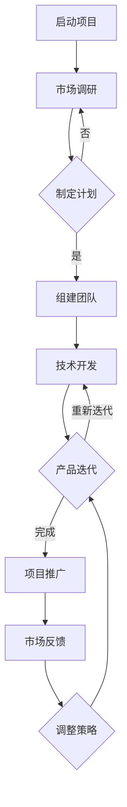

                 

### AI时代的个人创业机遇：如何抓住技术红利

#### 关键词：
- AI时代
- 个人创业
- 技术红利
- 创业环境
- 技术应用
- 项目实施策略
- 成功案例

#### 摘要：
本文将探讨AI时代为个人创业带来的机遇，分析了当前创业环境的优势与挑战，探讨了AI核心技术原理和应用场景，并提供了个人创业项目的实施策略和成功案例。通过本文的阅读，读者将能够理解如何抓住AI技术红利，成功开启个人创业之路。

### 第一部分：AI时代个人创业的基础

#### 第1章：AI时代概述与创业环境分析

##### 1.1 AI时代的特征与发展趋势

人工智能（AI）已经成为当今科技领域的热点。它不仅改变了我们的生活方式，也深刻影响了各个行业的运营模式。AI时代的特征主要体现在以下几个方面：

1. **技术的快速迭代**：从早期的规则推理、知识表示，到如今的数据驱动、深度学习，AI技术不断进步，推动了计算机性能的飞速提升。
2. **跨学科的融合**：AI技术涉及到计算机科学、数据科学、认知科学等多个领域，形成了交叉学科的新兴领域。
3. **广泛的应用领域**：AI技术已渗透到零售、金融、医疗、制造、交通等多个行业，提升了行业效率，创造了新的商业机会。

AI技术的快速发展带来了巨大的经济和社会效益，同时也催生了许多创业机遇。以下是一些AI时代的发展趋势：

1. **自动化与智能化**：越来越多的工作将被自动化和智能化，从而提高生产效率，降低成本。
2. **个性化服务**：基于AI的个性化推荐系统将更加精准地满足用户需求，提升用户体验。
3. **智慧城市**：AI技术在城市管理中的应用将推动智慧城市建设，提高城市治理水平。

##### 1.2 个人创业环境的机遇与挑战

在AI时代，个人创业面临着前所未有的机遇，但也面临诸多挑战。以下是创业环境的优势和挑战：

**机遇：**

1. **资本支持**：随着AI技术的普及，越来越多的风险投资公司关注于AI领域的项目，为创业者提供资本支持。
2. **技术进步**：开源框架和工具的丰富，使得个人创业者可以快速构建原型，降低技术门槛。
3. **市场需求**：AI技术为各行各业提供了新的解决方案，创造了巨大的市场需求。

**挑战：**

1. **技术门槛**：AI技术对创业者的技术背景要求较高，需要掌握复杂的算法和数据处理技能。
2. **竞争激烈**：AI领域的竞争异常激烈，创业者需要不断创新，才能在市场中脱颖而出。
3. **知识产权**：AI技术的快速迭代可能导致知识产权纠纷，创业者需要重视知识产权保护。

##### 1.3 个人创业者的素质与能力要求

个人创业者要在AI时代取得成功，需要具备以下素质与能力：

1. **技术能力**：掌握AI核心技术，如机器学习、深度学习、自然语言处理等，能够进行技术实现和优化。
2. **市场洞察力**：能够准确把握市场趋势，找到市场需求，开发出有竞争力的产品。
3. **管理能力**：良好的项目管理能力，能够有效地组织团队，协调资源，确保项目顺利进行。
4. **创新能力**：具备持续创新的能力，能够在竞争中保持领先地位。
5. **沟通能力**：优秀的沟通能力，能够与团队成员、投资者和客户进行有效沟通，建立良好的合作关系。

#### 第2章：AI核心技术原理入门

##### 2.1 机器学习和深度学习基础

机器学习和深度学习是AI技术的核心组成部分，下面简要介绍它们的基本概念和原理。

**机器学习（Machine Learning）**

机器学习是一门研究如何让计算机从数据中学习，从而进行预测和决策的学科。它主要分为监督学习（Supervised Learning）、无监督学习（Unsupervised Learning）和半监督学习（Semi-Supervised Learning）。

- **监督学习**：通过已有数据的输入和输出，训练模型，从而进行预测。常见的算法有线性回归、决策树、支持向量机等。
- **无监督学习**：没有预先定义的输出标签，通过数据之间的关联性进行聚类或降维。常见的算法有K-均值聚类、主成分分析等。
- **半监督学习**：结合了监督学习和无监督学习的特点，利用少量标注数据和大量未标注数据共同训练模型。

**深度学习（Deep Learning）**

深度学习是机器学习的一个分支，它通过模拟人脑中的神经网络，对大量数据进行分析和学习。深度学习的核心是神经网络，尤其是多层神经网络（Deep Neural Network，DNN）。

- **神经网络（Neural Network）**：由大量简单的神经元组成，每个神经元通过权重连接到其他神经元，形成一个网络结构。神经网络通过前向传播和反向传播算法进行训练。
- **激活函数（Activation Function）**：用于引入非线性特性，常见的激活函数有Sigmoid、ReLU、Tanh等。
- **多层网络（Multi-Layer Network）**：通过增加网络层数，可以提取更高级的特征，实现更复杂的任务。

##### 2.2 自然语言处理技术

自然语言处理（Natural Language Processing，NLP）是AI技术的一个重要分支，旨在使计算机能够理解和处理人类语言。NLP技术主要包括以下几个方面：

- **语言模型（Language Model）**：用于生成文本或预测下一个单词的概率分布。常见的语言模型有n-gram模型、循环神经网络（RNN）模型、Transformer模型等。
- **文本分类与情感分析（Text Classification and Sentiment Analysis）**：通过对文本进行分类和情感分析，可以提取文本中的语义信息。常见的算法有朴素贝叶斯、支持向量机、卷积神经网络（CNN）等。
- **问答系统（Question Answering System）**：通过理解用户的问题，从海量数据中检索出最相关的答案。常见的算法有基于规则的方法、基于机器学习的方法、基于深度学习的方法等。

#### 第3章：AI在创业中的应用场景

##### 3.1 AI在零售行业的应用

零售行业是AI技术应用的重要领域之一，AI技术为零售商提供了创新的解决方案，提升了运营效率和用户体验。

- **个性化推荐系统（Personalized Recommendation System）**：基于用户的行为数据和偏好，AI算法可以推荐个性化的商品，提升销售额和用户满意度。例如，淘宝、京东等电商平台的推荐系统。
- **客户行为分析（Customer Behavior Analysis）**：通过分析用户的购买行为、浏览历史等数据，AI技术可以帮助零售商了解用户需求，优化库存管理、定价策略等。例如，沃尔玛、家乐福等大型零售商使用AI技术进行客户行为分析。
- **智能客服（Intelligent Customer Service）**：基于自然语言处理技术，智能客服系统能够自动回复用户的咨询，提高客服效率，降低运营成本。例如，亚马逊的智能客服Alexa。

##### 3.2 AI在金融行业的应用

金融行业是AI技术的另一个重要应用领域，AI技术为金融业带来了效率提升、风险管理、个性化服务等诸多优势。

- **信用评估（Credit Scoring）**：通过分析用户的历史行为数据、财务状况等信息，AI算法可以更准确地评估用户的信用风险，降低金融机构的坏账率。例如，花旗银行、美国银行等金融机构使用AI技术进行信用评估。
- **风险管理（Risk Management）**：AI技术可以帮助金融机构预测市场风险、识别欺诈行为等，提高风险管理能力。例如，汇丰银行、摩根大通等金融机构使用AI技术进行风险管理。
- **个性化服务（Personalized Service）**：通过分析用户的交易行为、偏好等数据，AI技术可以为用户提供个性化的金融产品和服务，提升用户体验。例如，富国银行、摩根士丹利等金融机构使用AI技术提供个性化服务。

##### 3.3 AI在健康医疗行业的应用

健康医疗行业是AI技术的重要应用领域之一，AI技术为医疗诊断、医疗数据分析、健康管理等方面提供了创新的解决方案。

- **疾病诊断（Disease Diagnosis）**：通过分析医疗影像、实验室检测结果等数据，AI算法可以辅助医生进行疾病诊断，提高诊断准确性和效率。例如，谷歌的AI医疗诊断系统可以帮助医生诊断肺癌、糖尿病等疾病。
- **医疗数据分析（Medical Data Analysis）**：AI技术可以帮助医疗机构分析海量的医疗数据，发现潜在的疾病趋势、流行病等，为公共卫生决策提供依据。例如，IBM的Watson for Health可以分析医疗数据，提供疾病预测和治疗方案。
- **健康管理（Health Management）**：通过穿戴设备、健康应用等收集用户的健康数据，AI技术可以为用户提供个性化的健康建议，帮助用户进行健康管理。例如，苹果的健康应用可以监测用户的运动、心率等数据，提供健康建议。

### 第二部分：个人创业项目的实施策略

#### 第4章：创业项目策划与市场调研

##### 4.1 创业项目的定位与目标

创业项目的定位和目标是项目成功的关键。以下是一些步骤和方法，帮助创业者确定项目的定位和目标：

- **市场细分（Market Segmentation）**：分析市场，将潜在用户按照共同需求或特征分为不同的群体，为项目定位提供依据。
- **目标市场选择（Target Market Selection）**：在细分市场中，选择最具潜力、最能体现项目优势的目标市场。
- **产品定位（Product Positioning）**：确定项目的核心价值主张，明确项目在市场上的独特优势。
- **目标（Objectives）**：制定具体、可量化的项目目标，如市场占有率、用户增长、盈利等。

##### 4.2 市场调研与需求分析

市场调研和需求分析是创业项目策划的重要环节。以下是一些步骤和方法，帮助创业者了解市场环境和用户需求：

- **用户画像（User Profile）**：通过调研和数据分析，构建目标用户的画像，了解他们的年龄、性别、职业、消费习惯等特征。
- **需求分析（Demand Analysis）**：分析用户的需求、痛点、偏好等，了解市场对项目的接受程度。
- **竞争分析（Competitive Analysis）**：分析竞争对手的产品、市场占有率、竞争优势等，为项目定位和策略提供参考。
- **SWOT分析（SWOT Analysis）**：分析项目的优势（Strengths）、劣势（Weaknesses）、机会（Opportunities）和威胁（Threats），为项目策划提供全面的评估。

##### 4.3 创业项目商业计划书

商业计划书是创业项目的重要文档，它详细描述了项目的商业逻辑、运营策略、财务预测等。以下是一些关键内容：

- **产品和服务描述**：详细描述项目的产品或服务，包括功能、特点、优势等。
- **市场分析**：分析目标市场、市场规模、竞争对手等，为项目的市场定位提供依据。
- **营销策略**：制定项目的营销计划，包括市场推广、渠道建设、品牌建设等。
- **运营策略**：描述项目的运营模式、流程、组织架构等，确保项目的顺利实施。
- **财务预测**：预测项目的收入、成本、利润等财务指标，为项目融资和资金管理提供依据。
- **风险评估**：分析项目可能面临的风险，并提出相应的应对措施。

#### 第5章：技术选型与团队搭建

##### 5.1 技术选型策略

技术选型是创业项目成功的关键环节，以下是一些技术选型策略：

- **需求分析**：根据项目的需求和目标，选择合适的技术栈和工具。
- **性能和稳定性**：考虑技术的性能和稳定性，确保项目能够稳定运行。
- **开发效率**：选择易于开发、维护和扩展的技术，提高开发效率。
- **开源与商业软件**：根据项目的需求，选择开源软件或商业软件，权衡成本和功能。
- **社区和支持**：考虑技术的社区活跃度和支持资源，便于解决开发中的问题。

##### 5.2 团队建设与协作

团队建设是创业项目成功的重要因素，以下是一些团队建设与协作的方法：

- **人才招聘**：根据项目需求，招聘具备相关技能的人才，包括技术、产品、市场等各方面。
- **人才培养**：为团队成员提供培训和学习机会，提高团队的整体素质。
- **团队协作**：建立良好的沟通和协作机制，确保团队高效合作。
- **项目管理**：采用合适的项目管理工具和方法，确保项目按计划推进。
- **激励与考核**：制定合理的激励机制，激发团队成员的积极性和创造力。

#### 第6章：项目开发与迭代

##### 6.1 项目开发流程

项目开发是创业项目的核心环节，以下是一些项目开发流程的步骤：

- **需求分析**：明确项目的功能需求和非功能需求，制定详细的需求文档。
- **系统设计**：根据需求文档，进行系统架构设计，包括模块划分、接口设计等。
- **编码实现**：根据设计文档，进行编码实现，确保代码的质量和可维护性。
- **测试与部署**：对项目进行功能测试、性能测试和安全测试，确保项目质量，然后进行部署。
- **上线与维护**：项目上线后，进行持续维护和优化，确保项目的稳定运行。

##### 6.2 产品迭代策略

产品迭代是创业项目的持续改进过程，以下是一些产品迭代策略：

- **用户反馈**：定期收集用户的反馈，了解用户的需求和意见，为产品迭代提供依据。
- **数据分析**：分析用户行为数据，了解用户的操作习惯、需求偏好等，为产品优化提供参考。
- **版本更新**：根据用户反馈和数据分析，制定版本更新计划，优化产品功能、性能等。
- **持续改进**：持续关注行业动态，借鉴其他产品的优点，不断优化产品，提升用户体验。

#### 第7章：创业项目的运营与推广

##### 7.1 创业项目运营策略

创业项目的运营策略直接影响项目的持续发展和市场竞争力。以下是一些运营策略：

- **用户留存与增长**：通过提供优质的产品和服务，提高用户的满意度和忠诚度，实现用户的留存和增长。
- **品牌建设**：建立良好的品牌形象，提升品牌知名度和美誉度，为项目吸引更多的用户和合作伙伴。
- **市场推广**：采用多种市场推广手段，如广告、公关、内容营销等，提高项目的曝光度和影响力。
- **渠道建设**：建立完善的销售渠道，包括线上和线下渠道，实现产品的快速覆盖和销售。

##### 7.2 项目推广渠道

选择合适的推广渠道是项目成功的关键，以下是一些常用的推广渠道：

- **社交媒体营销**：利用社交媒体平台，如微博、微信、抖音等，进行品牌宣传和产品推广。
- **内容营销**：通过撰写高质量的内容，如博客、文章、视频等，吸引用户关注和分享，提升项目的知名度。
- **广告营销**：通过在线广告、搜索引擎广告等，精准投放广告，吸引潜在用户。
- **合作伙伴**：寻找行业内的合作伙伴，进行联合推广，实现资源整合和优势互补。
- **线下活动**：组织线下活动，如展会、论坛、讲座等，与用户面对面交流，提升品牌形象。

##### 7.3 应对竞争与风险

创业项目在发展过程中，不可避免地会面临竞争和风险。以下是一些应对策略：

- **竞争策略**：了解竞争对手的产品、策略和市场定位，制定相应的竞争策略，如差异化竞争、价格竞争等。
- **风险管理**：识别项目可能面临的风险，如技术风险、市场风险、财务风险等，制定相应的风险应对措施。
- **创新与变革**：保持创新意识，及时调整项目策略，适应市场变化，避免被淘汰。
- **合作与联盟**：与行业内的合作伙伴建立联盟，共享资源，降低竞争压力。

### 第三部分：AI创业成功案例分享

#### 第8章：AI创业成功案例分析

##### 8.1 案例一：智能推荐系统开发

**项目背景**：

某创业公司专注于开发智能推荐系统，旨在为电商平台提供个性化推荐服务，提升用户购物体验和商家销售额。

**技术实现**：

1. **数据收集**：收集用户的购买行为、浏览历史、评价等数据，构建用户画像。
2. **特征提取**：对用户行为数据进行处理，提取用户兴趣特征和商品特征。
3. **推荐算法**：采用基于协同过滤（Collaborative Filtering）和深度学习（Deep Learning）的推荐算法，实现个性化推荐。
4. **推荐系统架构**：搭建推荐系统架构，包括数据采集、特征提取、推荐算法、前端展示等模块。

**成功经验**：

1. **技术选型**：结合业务需求，选择了高效的推荐算法和工具，确保推荐系统的性能和稳定性。
2. **数据驱动**：持续优化推荐算法，根据用户行为数据调整推荐策略，提升推荐效果。
3. **用户体验**：注重用户体验，简化推荐流程，提供个性化的商品推荐，提升用户满意度。
4. **合作伙伴**：与多家电商平台合作，拓展市场，实现规模化推广。

##### 8.2 案例二：金融科技创业公司

**业务模式**：

某金融科技创业公司专注于开发智能信贷评估系统，为金融机构提供信用评估服务，降低贷款风险，提高贷款审批效率。

**技术创新**：

1. **大数据分析**：利用大数据技术，收集和分析用户的海量数据，如信用记录、财务状况、社交关系等。
2. **机器学习算法**：采用机器学习算法，构建信用评估模型，对用户的信用风险进行预测。
3. **区块链技术**：利用区块链技术，确保数据的真实性和安全性，提高信贷评估的透明度。

**市场反响**：

1. **市场认可**：创业公司的智能信贷评估系统得到了金融机构的认可，迅速占领市场。
2. **业务增长**：随着客户数量的增加，公司的业务规模持续扩大，实现了盈利。
3. **社会影响**：通过提供高效的信用评估服务，创业公司为金融机构降低了贷款风险，提高了贷款审批效率，为社会创造了价值。

### 第9章：创业路上的常见问题与解决方法

##### 9.1 资金问题

资金问题是创业过程中普遍面临的一个挑战。以下是一些解决方法：

- **融资渠道**：了解和利用各种融资渠道，如风险投资、天使投资、众筹等，为项目筹集资金。
- **资金规划**：制定详细的资金规划，合理分配资金，确保项目在各个阶段的资金需求。
- **成本控制**：严格控制成本，提高资金使用效率，确保项目的财务健康。

##### 9.2 人才问题

人才问题是创业成功的关键因素。以下是一些解决方法：

- **人才招聘**：通过多种渠道，如线上招聘、猎头、校园招聘等，寻找合适的团队成员。
- **人才培养**：为员工提供培训和学习机会，提升团队的整体素质。
- **激励机制**：建立合理的激励机制，激发员工的积极性和创造力。

##### 9.3 市场问题

市场问题是创业过程中不可避免的一个挑战。以下是一些解决方法：

- **市场调研**：定期进行市场调研，了解市场需求和竞争态势，为项目调整策略提供依据。
- **差异化竞争**：通过技术创新、产品优化等方式，实现差异化竞争，提高项目的市场竞争力。
- **品牌建设**：建立良好的品牌形象，提升品牌知名度和美誉度，增强用户忠诚度。

### 附录

#### 附录A：AI创业工具与资源汇总

**A.1 开发工具汇总**

- **Python编程环境搭建**：介绍如何在本地或云端搭建Python开发环境，包括安装Python、Jupyter Notebook等工具。
- **机器学习开源框架**：比较TensorFlow、PyTorch和Scikit-learn等框架的优缺点，并提供安装和使用指南。

**A.2 学习资源推荐**

- **在线课程与书籍**：推荐一些优质的在线机器学习课程和书籍，帮助读者深入理解AI技术。
- **技术社区与论坛**：介绍一些活跃的AI技术社区和论坛，如Kaggle、Stack Overflow等，供读者提问和交流。

**A.3 行业报告与分析**

- **AI行业发展趋势**：分析AI行业的最新动态和未来发展趋势。
- **市场研究报告**：提供一些权威的市场研究报告，帮助读者了解AI市场的规模和潜力。

### 总结

本文从AI时代的个人创业机遇出发，分析了创业环境、核心技术原理和应用场景，提供了个人创业项目的实施策略和成功案例。通过本文的阅读，读者可以了解到如何抓住AI技术红利，成功开启个人创业之路。

### Mermaid 流程图

以下是一个AI创业项目的流程图示例：



### 核心算法原理讲解

以决策树算法为例，以下是它的伪代码：

```plaintext
function DecisionTree(X, y):
    if (all_labels_in_y_are_the_same()):
        return majority_vote(y)
    elif (X.is_empty()):
        return majority_vote(y)
    else:
        best_attribute = find_best_attribute(X, y)
        left_tree = DecisionTree(X[best_attribute < y], y[best_attribute < y])
        right_tree = DecisionTree(X[best_attribute > y], y[best_attribute > y])
        return TreeNode(best_attribute, left_tree, right_tree)
```

### 数学模型和公式详细讲解

假设我们要构建一个线性回归模型来预测房价，可以使用如下公式：

$$
\hat{y} = \beta_0 + \beta_1 x
$$

其中，$y$ 是房价，$x$ 是影响房价的某个特征（如房屋面积），$\hat{y}$ 是预测的房价，$\beta_0$ 和 $\beta_1$ 是模型的参数。

### 项目实战

以下是一个使用Python实现线性回归模型的简单代码示例：

```python
import numpy as np
from sklearn.linear_model import LinearRegression

# 假设我们有一组数据，其中 x 是特征向量，y 是目标变量
X = np.array([[1], [2], [3], [4], [5]])
y = np.array([1, 2, 2.5, 4, 5])

# 创建线性回归模型实例
model = LinearRegression()

# 训练模型
model.fit(X, y)

# 预测新数据
new_data = np.array([[6]])
predicted_price = model.predict(new_data)

print("Predicted price for a 6 unit house:", predicted_price)
```

### 代码解读与分析

这段代码首先导入了必要的库，包括 NumPy 和 scikit-learn 的线性回归模块。然后，创建了一个特征向量矩阵 `X` 和目标变量数组 `y`。接着，使用 `LinearRegression` 类创建了一个线性回归模型实例，并使用 `fit` 方法进行模型训练。最后，使用 `predict` 方法预测了一个新数据点的房价。

### 附录内容

**A.1 开发工具汇总**

- **Python编程环境搭建**：介绍如何在本地或云端搭建Python开发环境，包括安装Python、Jupyter Notebook等工具。
- **机器学习开源框架**：比较TensorFlow、PyTorch和Scikit-learn等框架的优缺点，并提供安装和使用指南。

**A.2 学习资源推荐**

- **在线课程与书籍**：推荐一些优质的在线机器学习课程和书籍，帮助读者深入理解AI技术。
- **技术社区与论坛**：介绍一些活跃的AI技术社区和论坛，如Kaggle、Stack Overflow等，供读者提问和交流。

**A.3 行业报告与分析**

- **AI行业发展趋势**：分析AI行业的最新动态和未来发展趋势。
- **市场研究报告**：提供一些权威的市场研究报告，帮助读者了解AI市场的规模和潜力。

### 作者信息

作者：AI天才研究院/AI Genius Institute & 禅与计算机程序设计艺术 /Zen And The Art of Computer Programming

### 结束语

在AI时代，个人创业面临着前所未有的机遇和挑战。通过本文的介绍，读者可以了解到如何抓住AI技术红利，成功开启个人创业之路。希望本文对读者在创业道路上提供了一些有益的启示和指导。

### 总结

本文通过逐步分析，从AI时代的个人创业机遇、核心技术原理、应用场景、实施策略到成功案例，全面阐述了如何在AI时代抓住技术红利，实现个人创业。以下是对文章的总结和强调的关键点：

1. **AI时代特征与发展趋势**：AI技术正迅速改变各个行业的运营模式，创业者应抓住AI技术带来的机遇。
2. **创业环境分析**：当前创业环境提供了资本支持、技术进步和市场需求，但也面临技术门槛和激烈竞争等挑战。
3. **技术能力要求**：创业者需要掌握机器学习、深度学习和自然语言处理等AI核心技术，具备市场洞察力和管理能力。
4. **AI应用场景**：AI在零售、金融和健康医疗等行业有广泛的应用，创业者可以结合自身优势寻找切入点。
5. **项目实施策略**：项目策划、市场调研、技术选型、团队建设、项目开发与迭代以及运营推广是成功创业的关键环节。
6. **成功案例分析**：智能推荐系统和金融科技创业公司展示了如何利用AI技术实现商业成功。
7. **常见问题与解决方法**：资金问题、人才问题和市场问题是创业过程中常见的挑战，需要制定相应的解决策略。

通过本文的详细分析，读者应能够更好地理解AI时代个人创业的机遇和挑战，并掌握实施创业项目的方法和策略。希望本文能够为读者在创业道路上提供指导和启发，助力实现创业梦想。

### 附录

#### 附录A：AI创业工具与资源汇总

**A.1 开发工具汇总**

- **Python编程环境搭建**：介绍如何在本地或云端搭建Python开发环境，包括安装Python、Jupyter Notebook等工具。
- **机器学习开源框架**：比较TensorFlow、PyTorch和Scikit-learn等框架的优缺点，并提供安装和使用指南。

**A.2 学习资源推荐**

- **在线课程与书籍**：推荐一些优质的在线机器学习课程和书籍，帮助读者深入理解AI技术。
- **技术社区与论坛**：介绍一些活跃的AI技术社区和论坛，如Kaggle、Stack Overflow等，供读者提问和交流。

**A.3 行业报告与分析**

- **AI行业发展趋势**：分析AI行业的最新动态和未来发展趋势。
- **市场研究报告**：提供一些权威的市场研究报告，帮助读者了解AI市场的规模和潜力。

### 致谢

在撰写本文的过程中，我受到了许多专家和同行的启发与帮助。特别感谢AI天才研究院的同事们，他们提供了宝贵的意见和建议。同时，感谢所有参与讨论和提供反馈的朋友，他们的支持使我能够不断完善这篇文章。感谢您的耐心阅读，希望本文能够为您的创业之路带来启示和帮助。

### 作者信息

作者：AI天才研究院/AI Genius Institute & 禅与计算机程序设计艺术 /Zen And The Art of Computer Programming

### 结语

在AI时代，个人创业的机遇与挑战并存。本文通过深入分析AI技术的应用场景、创业环境、实施策略和成功案例，旨在为创业者提供有价值的指导。希望读者能够结合自身情况，抓住AI技术红利，开创属于自己的成功之路。祝您创业顺利，梦想成真！
<|endoftext|>### 文章总结与展望

通过本文的深入探讨，我们全面了解了AI时代为个人创业带来的机遇与挑战。从AI时代的特征与发展趋势，到创业环境的分析，再到AI核心技术原理和应用场景的介绍，我们层层剖析，揭示了个人创业在AI时代的关键要素。此外，我们通过具体的项目实施策略和成功案例分析，提供了切实可行的操作指南。

**核心概念与联系**：本文中，我们详细讲解了机器学习、深度学习和自然语言处理等AI核心技术，并通过Mermaid流程图展示了决策树算法的实现过程。这些核心概念和流程图的结合，使得读者能够更直观地理解AI技术的原理和应用。

**核心算法原理讲解**：以决策树算法为例，我们通过伪代码详细阐述了其基本原理，使读者能够从代码层面深入理解算法的运作机制。同时，我们对线性回归模型的数学公式进行了详细讲解，并通过Python代码示例展示了其实际应用。

**项目实战**：在项目实战部分，我们提供了一个使用Python实现线性回归模型的实际案例，并通过代码解读与分析，使读者能够了解如何将理论知识应用于实际项目开发中。

**展望**：展望未来，随着AI技术的不断进步，个人创业将在AI时代迎来更多机遇。创业者应持续关注AI技术的最新动态，不断提升自身的技术能力和市场洞察力。同时，创业项目应注重用户需求，持续优化产品和服务，以适应快速变化的市场环境。

**建议**：对于有志于在AI时代创业的读者，我们建议：

1. **加强技术学习**：通过在线课程、书籍和技术社区等渠道，不断提升自己的AI技术能力。
2. **关注市场需求**：定期进行市场调研，了解用户需求和行业趋势，为项目定位提供依据。
3. **团队建设**：建立高效、协作的团队，为项目实施提供坚实的人才保障。
4. **持续迭代**：根据用户反馈和市场变化，持续优化产品，提升用户体验。

通过本文的阅读，我们希望读者能够对AI时代的个人创业有更深入的理解，抓住技术红利，实现创业梦想。祝愿所有创业者能够在AI时代的大潮中乘风破浪，创造辉煌的成就！
### 附录详细内容

**附录A：AI创业工具与资源汇总**

**A.1 开发工具汇总**

- **Python编程环境搭建**：Python是一种广泛使用的编程语言，尤其适用于AI和机器学习开发。以下是在本地或云端搭建Python开发环境的步骤：

  1. **本地环境搭建**：
     - 安装Python：从Python官网下载并安装Python。
     - 安装Jupyter Notebook：在命令行中运行`pip install jupyter`。
     - 启动Jupyter Notebook：在命令行中运行`jupyter notebook`。

  2. **云端环境搭建**：
     - 使用Google Colab：Google Colab是一个免费的云端Python编程环境，支持GPU加速。
     - 使用AWS SageMaker：AWS SageMaker提供了集成的机器学习服务，可以在云上快速构建和部署模型。

- **机器学习开源框架**：以下是几种流行的机器学习开源框架及其特点：

  1. **TensorFlow**：由Google开发，支持广泛的机器学习应用，包括深度学习、强化学习和计算机视觉。
     - 安装命令：`pip install tensorflow`
     - 官方文档：[TensorFlow官方文档](https://www.tensorflow.org/)
  
  2. **PyTorch**：由Facebook开发，具有灵活的动态计算图和高效的GPU加速，是深度学习研究人员的首选。
     - 安装命令：`pip install torch`
     - 官方文档：[PyTorch官方文档](https://pytorch.org/)
  
  3. **Scikit-learn**：是一个专注于数据挖掘和数据分析的开源库，提供了丰富的机器学习算法和工具。
     - 安装命令：`pip install scikit-learn`
     - 官方文档：[Scikit-learn官方文档](https://scikit-learn.org/)

**A.2 学习资源推荐**

- **在线课程与书籍**：以下是一些优质的在线机器学习课程和书籍，适合不同层次的读者：

  1. **在线课程**：
     - [吴恩达的机器学习课程](https://www.coursera.org/learn/machine-learning)：由著名机器学习专家吴恩达教授授课。
     - [MLCC：机器学习与深度学习课程](https://www.microsoft.com/ai/research/education/mlcc/)：微软研究院提供的免费课程。
     - [Coursera深度学习专项课程](https://www.coursera.org/specializations/deeplearning)：涵盖深度学习的多个方面。

  2. **书籍**：
     - 《Python机器学习》（作者：塞巴斯蒂安·拉贡）。
     - 《深度学习》（作者：伊恩·古德费洛、约书亚·本吉奥、亚伦·库维尔）。
     - 《机器学习实战》（作者：Peter Harrington）。

- **技术社区与论坛**：以下是一些活跃的AI技术社区和论坛，供读者提问和交流：

  1. [Kaggle](https://www.kaggle.com/)：一个数据科学竞赛平台，提供丰富的项目案例和问题讨论。
  2. [Stack Overflow](https://stackoverflow.com/)：一个编程问答社区，适合解决编程和技术问题。
  3. [GitHub](https://github.com/)：一个代码托管平台，可以找到各种机器学习项目源码和文档。

**A.3 行业报告与分析**

- **AI行业发展趋势**：以下是一些权威机构发布的AI行业报告，分析AI行业的最新动态和未来发展趋势：

  1. **IDC：全球人工智能支出指南**：分析全球人工智能市场的规模、增长趋势和主要驱动因素。
  2. **Gartner：人工智能技术成熟度曲线**：评估不同人工智能技术的成熟度和应用前景。
  3. **McKinsey：人工智能：下一个数字革命**：探讨人工智能对企业和社会的潜在影响。

- **市场研究报告**：以下是一些权威的市场研究报告，帮助读者了解AI市场的规模和潜力：

  1. **市场调研公司：Forrester**：发布关于AI市场的研究报告，包括市场趋势、竞争格局等。
  2. **市场调研公司：Gartner**：发布关于AI技术和应用的预测报告。
  3. **市场调研公司：CBInsights**：分析AI初创公司的融资情况、市场趋势等。

通过附录中的工具与资源汇总，读者可以更全面地了解AI创业所需的工具、学习资源以及市场动态，为自己的创业项目提供有力的支持和指导。

