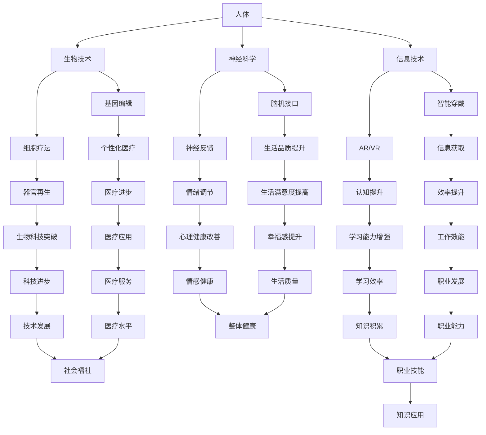
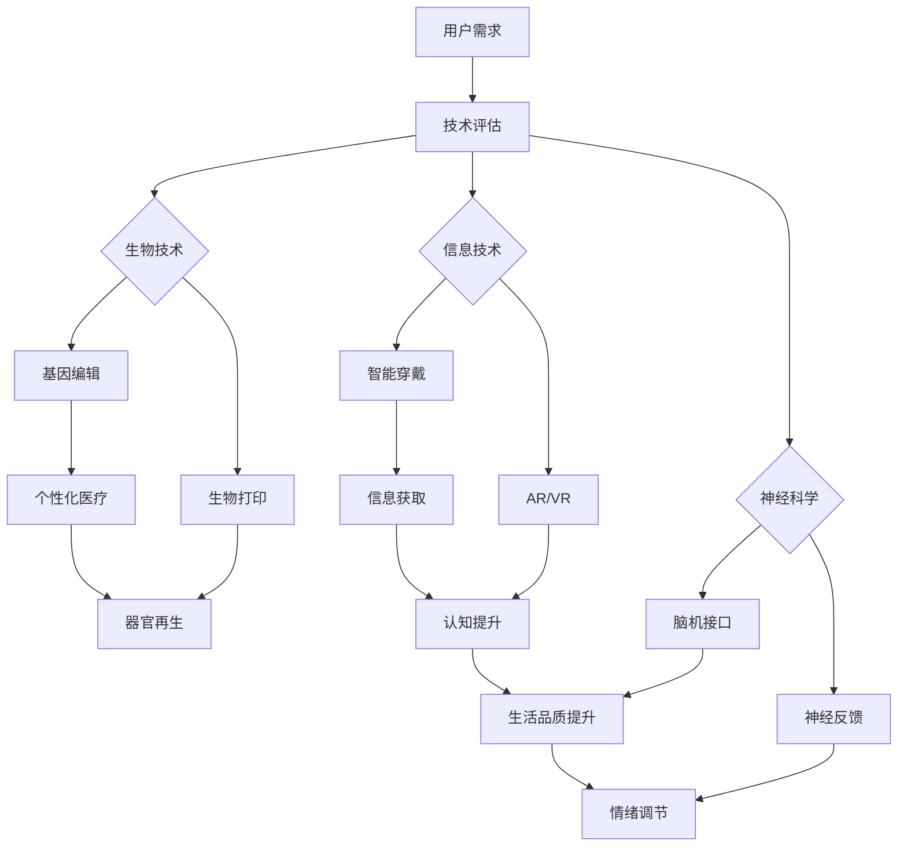
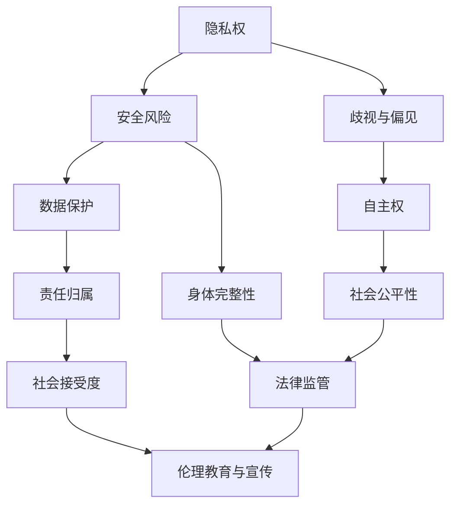

                 

### 《AI时代的人类增强：道德考虑与身体增强的未来发展机遇分析机遇挑战机遇趋势预测分析》

#### 引言与背景

随着人工智能（AI）技术的飞速发展，人类已经进入了一个全新的时代——AI时代。在这个时代中，人类增强成为了可能，也引发了广泛的讨论和思考。本文将从以下几个方面展开讨论：

1. **AI时代的特点**
2. **人类增强的背景**
3. **道德考虑的重要性**

#### AI时代的特点

AI时代的到来，标志着科技水平的一次重大突破。在这个时代中，人工智能技术已经渗透到我们生活的方方面面，从智能家居、智能交通，到医疗、金融等领域。以下是一些AI时代的主要特点：

1. **计算能力的大幅提升**：随着计算硬件的发展，人工智能的计算能力得到了极大的提升。这使得复杂的算法和模型可以更快地训练和运行。
2. **数据的爆炸性增长**：大数据时代为人工智能的发展提供了丰富的数据资源。通过深度学习等技术，AI可以从大量数据中学习到有价值的信息。
3. **自主学习与进化**：人工智能不再仅仅是执行预先设定的任务，而是可以通过自我学习和进化来提高其性能。这使得AI能够在复杂的环境中自主决策和行动。
4. **跨领域的融合**：人工智能与生物、医学、材料科学等领域的融合，推动了人类增强技术的快速发展。

#### 人类增强的背景

人类增强，是指通过科技手段提高人类身体或认知能力的一种技术。在AI时代，人类增强变得可能，同时也引发了一系列的伦理和社会问题。以下是一些人类增强的背景信息：

1. **现代医学的发展**：现代医学技术的进步，使得人类可以对身体进行更加精细的改造。从器官移植、基因编辑，到生物打印等，这些技术的发展为人类增强提供了基础。
2. **信息技术与生物技术的融合**：信息技术和生物技术的融合，使得人类可以更精确地了解和控制人体的生物学过程。例如，通过生物识别技术，我们可以实现对身份的精确识别和验证。
3. **神经科学的研究**：神经科学的研究，使我们能够更深入地了解大脑的工作原理。这使得我们有可能通过神经接口技术，直接与大脑交互，提高认知能力。
4. **社会需求的推动**：随着生活水平的提高，人们对健康、长寿、身体能力的提升有了更高的需求。这推动了人类增强技术的发展和应用。

#### 道德考虑的重要性

在AI时代，人类增强技术的发展不仅带来了巨大的机遇，同时也引发了一系列的道德和社会问题。以下是一些道德考虑的重要性：

1. **公平性与包容性**：人类增强技术的应用可能会导致社会不平等和歧视。我们需要确保这些技术能够惠及所有人，而不是仅仅服务于少数特权人群。
2. **隐私与安全**：人类增强技术涉及到大量的个人数据和生物信息。如何保护这些数据的隐私和安全，是一个亟待解决的问题。
3. **自主权与责任**：人类增强技术的应用，可能会影响个体的自主权。例如，通过基因编辑，我们可以改变人类的基因特征，但这涉及到对后代的影响。同时，谁应该为这些技术带来的风险承担责任，也是一个重要的问题。
4. **社会价值观的冲突**：人类增强技术的应用，可能会引发社会价值观的冲突。例如，一些人可能认为通过科技手段来增强人类的身体能力是不道德的，而另一些人则认为这是对人类潜能的解放。

综上所述，AI时代的人类增强技术，既带来了巨大的机遇，也带来了严峻的挑战。我们需要从多个角度进行深入思考和研究，以确保这些技术的应用能够造福人类，而不是带来灾难。

---

**核心关键词**：

- AI时代
- 人类增强
- 道德考虑
- 身体增强
- 发展机遇
- 挑战
- 趋势预测

**摘要**：

本文深入探讨了AI时代人类增强技术的发展及其带来的道德和社会问题。通过分析AI时代的特点、人类增强的背景以及道德考虑的重要性，本文指出了人类增强技术带来的发展机遇与挑战，并提出了未来发展的趋势预测。本文旨在为读者提供一个全面、深入的视角，以理解人类增强技术的本质及其可能的影响，为未来的研究和应用提供参考。

---

接下来，我们将进入第二部分，对人类增强的概念和原理进行详细解析，包括其定义、分类和技术基础。

---

#### 人类增强的概念解析

人类增强，是指通过科技手段提升或改善人类身体或认知能力的一种技术。这种技术不仅仅局限于传统的医疗领域，还包括信息技术、生物技术、神经科学等多个学科。以下是关于人类增强的详细概念解析：

##### 1.1 人类增强的定义

人类增强的定义可以根据其应用领域和目标进行多种解释。从广义上讲，人类增强可以被视为一种通过外部手段提升人类生理和心理能力的技术。这种外部手段可以是生物医学的，如药物、基因编辑和器官移植；也可以是信息技术的，如智能穿戴设备、增强现实（AR）和虚拟现实（VR）；还可以是神经科学的，如神经接口和脑机接口（BMI）。

##### 1.2 人类增强的分类

根据增强的目标和手段，人类增强可以分为以下几类：

1. **身体增强**：这种增强主要是针对人体的生理机能进行改进，包括肌肉力量、耐力、感官灵敏度等。例如，通过生物机械外骨骼来增强肢体功能，或者通过基因编辑来改善人体对疾病的抵抗力。

2. **认知增强**：这种增强主要关注人类的认知能力，如记忆、注意力、学习能力等。例如，通过神经药物来提升大脑功能，或者通过脑机接口来增强人类的信息处理能力。

3. **情感增强**：这种增强旨在改善人类的情感体验，如幸福感、满足感等。例如，通过虚拟现实技术来模拟美好的情感体验，或者通过神经反馈技术来调节情绪。

##### 1.3 人类增强的技术基础

人类增强技术的发展依赖于多个科学领域的进步，以下是其中一些关键技术基础：

1. **生物技术**：生物技术为人类增强提供了强大的工具，如基因编辑、细胞疗法和生物打印等。这些技术可以用于修复或替换受损的组织和器官，或者增强人体的特定功能。

2. **信息技术**：信息技术在人类增强中的应用越来越广泛，如智能穿戴设备、增强现实和虚拟现实等。这些技术可以帮助人类更有效地获取和处理信息，提高生活质量和工作效率。

3. **神经科学**：神经科学研究为我们提供了深入理解大脑和神经系统的工作原理，如脑机接口和神经反馈技术。这些技术可以直接与大脑交互，实现认知和情感的增强。

4. **材料科学**：材料科学的发展为人类增强提供了新的材料和结构，如纳米材料、智能材料和生物相容材料。这些材料可以用于制造更高效、更安全的增强设备。

##### 1.4 人类增强的现状与未来趋势

目前，人类增强技术已经取得了显著进展，一些技术已经进入了实际应用阶段。例如，生物机械外骨骼已经用于帮助瘫痪患者恢复行走能力，神经接口技术正在用于改善残疾人的生活品质。然而，人类增强技术仍面临许多挑战，如技术成熟度、安全性、伦理和社会问题等。

未来，随着技术的进一步发展，人类增强有望在更多领域得到应用。例如，通过基因编辑和生物打印技术，我们可以实现个性化医疗和器官再生；通过脑机接口和认知增强技术，我们可以提升人类的认知能力，实现更高效的学习和工作。

总之，人类增强技术为人类带来了巨大的机遇，同时也带来了许多挑战。我们需要在技术发展、道德考虑和社会监管等多个方面进行深入研究和探讨，以确保这些技术的应用能够真正造福人类。

---

**核心概念与联系**

为了更好地理解人类增强技术，我们可以通过一个Mermaid流程图来展示其核心概念和它们之间的联系。



通过这个流程图，我们可以清晰地看到人类增强技术的各个方面，以及它们之间的相互关联和影响。这些核心概念和联系构成了人类增强技术的理论基础，为我们进一步探讨其发展机遇和挑战提供了基础。

---

**核心算法原理讲解与伪代码**

为了深入理解人类增强技术中的关键算法原理，我们可以通过伪代码的形式进行详细阐述。以下是一个简化的生物识别技术示例，以及神经接口技术的基本算法原理。

##### 2.1 生物识别技术

生物识别技术是人体增强的重要组成部分，它通过测量和识别人体的生物特征来实现身份验证和识别。以下是生物识别技术的核心算法原理及其伪代码实现：

**伪代码示例：**

```pseudo
function biometricIdentification(featureVector):
    # 初始化生物识别模型
    model = initializeBiometricModel()

    # 提取特征向量
    extractedFeatures = extractFeatures(featureVector)

    # 进行特征匹配
    matchResult = model.matchFeatures(extractedFeatures)

    # 判断匹配结果
    if (matchResult.confidence > threshold):
        return "Matched"
    else:
        return "Not Matched"
```

**详细解释：**

1. **初始化生物识别模型**：在开始识别过程之前，我们需要初始化一个生物识别模型。这个模型可以是基于机器学习的模型，也可以是基于神经网络的模型。

2. **提取特征向量**：特征提取是生物识别技术的重要步骤。通过提取特定的生物特征（如指纹、面部特征、虹膜等），我们可以将生物信息转换为可以处理的数字特征向量。

3. **特征匹配**：将提取的特征向量与模型中存储的特征进行匹配。这个步骤通常使用一些距离度量方法（如欧几里得距离、余弦相似度等）来计算匹配的置信度。

4. **判断匹配结果**：根据匹配结果和预设的阈值，我们可以判断生物识别是否成功。如果匹配结果的置信度高于阈值，则识别成功；否则，识别失败。

##### 2.2 神经接口技术

神经接口技术是一种通过电子设备直接与大脑神经系统交互的技术。它可以帮助人类增强认知能力，改善残疾人的生活品质。以下是神经接口技术的核心算法原理及其伪代码实现：

**伪代码示例：**

```pseudo
function neuralInterface(activityPattern):
    # 连接神经接口设备
    interface = connectNeuralInterface()

    # 读取大脑活动模式
    brainActivity = interface.readActivity()

    # 分析活动模式
    analyzedPattern = analyzeActivity(brainActivity)

    # 与输入模式对比
    similarity = comparePatterns(analyzedPattern, activityPattern)

    # 如果相似度高于阈值，执行相应操作
    if (similarity > threshold):
        executeCommand()
```

**详细解释：**

1. **连接神经接口设备**：首先，我们需要连接一个神经接口设备，这个设备可以读取大脑的电信号活动。

2. **读取大脑活动模式**：通过接口设备，我们可以实时读取大脑的活动模式。这些活动模式通常是以电信号的形式存在的。

3. **分析活动模式**：接着，我们需要对读取到的活动模式进行分析。这可能涉及到信号处理和模式识别技术，如滤波、特征提取和分类。

4. **与输入模式对比**：我们将分析得到的模式与预设的输入模式进行比较。如果这两个模式的相似度高于预设的阈值，则我们认为这个模式是有效的。

5. **执行相应操作**：如果模式匹配成功，我们可以根据预设的指令执行相应的操作。例如，这个操作可以是控制一个机械臂的运动，或者是触发一个智能设备的响应。

通过上述伪代码示例，我们可以清晰地看到生物识别技术和神经接口技术的核心算法原理。这些算法不仅在实际应用中发挥着关键作用，而且也为人类增强技术的进一步发展提供了理论基础。

---

**数学模型和数学公式**

在人类增强技术中，数学模型和数学公式起到了关键作用。这些模型和公式帮助我们理解和预测人体增强的效果，以及优化增强策略。以下是几个常见的数学模型和公式的详细讲解与举例说明。

##### 3.1 人体增强的数学模型

人体增强的数学模型通常用于描述人体在增强前的状态、增强后的状态，以及增强效果。以下是一个简单的生物力学模型示例：

**公式：**

$$
F = m \cdot a
$$

其中，\(F\) 表示作用力，\(m\) 表示质量，\(a\) 表示加速度。

**详细讲解：**

1. **作用力（\(F\)）**：这是外部施加在人体上的力，例如重力、摩擦力等。在人体增强中，通过增加肌肉力量或使用生物机械外骨骼，可以改变作用力的大小。
2. **质量（\(m\)）**：这是人体的总质量，包括肌肉、骨骼和其他组织。通过基因编辑或生物打印技术，可以改变人体的质量，从而影响其运动能力和耐力。
3. **加速度（\(a\)）**：这是人体在作用力下的加速度。通过增强肌肉力量和耐力，可以增加人体的加速度，从而提高其运动表现。

**举例说明：**

假设一个运动员的质量为 70 公斤，他需要在 10 秒内跑完 100 米。根据上述公式，我们可以计算出他需要产生的最小作用力：

$$
F = m \cdot a = 70 \, \text{kg} \cdot \frac{100 \, \text{m}}{10 \, \text{s}} = 700 \, \text{N}
$$

这意味着，为了在 10 秒内跑完 100 米，运动员至少需要产生 700 牛顿的力。

##### 3.2 认知增强的数学模型

认知增强的数学模型通常用于描述大脑在处理信息和执行任务时的过程。以下是一个简化的神经网络模型示例：

**公式：**

$$
\sigma(z) = \frac{1}{1 + e^{-z}}
$$

其中，\(\sigma\) 表示激活函数，\(z\) 表示网络的输入。

**详细讲解：**

1. **激活函数（\(\sigma\)）**：这是一个非线性函数，用于将网络的输入转换为输出。在认知增强中，激活函数可以模拟大脑的信息处理过程。
2. **输入（\(z\)）**：这是网络接受的输入信号。在认知增强中，这些输入可以是视觉、听觉、触觉等感官信息。
3. **输出（\(y\)）**：这是网络的最终输出，可以是决策、识别结果等。

**举例说明：**

假设一个神经网络接收到一个输入信号 \(z = 3\)，我们可以使用上述公式计算其输出：

$$
\sigma(3) = \frac{1}{1 + e^{-3}} \approx 0.94
$$

这意味着，这个神经网络的输出概率约为 94%，表示它对输入信号的识别置信度较高。

##### 3.3 生物反馈的数学模型

生物反馈是一种通过测量和分析生物信号（如心率、血压等）来调节身体状态的方法。以下是一个简单的生物反馈模型示例：

**公式：**

$$
R(t) = k \cdot \left[ 1 - e^{-\lambda t} \right]
$$

其中，\(R(t)\) 表示反馈信号，\(k\) 是反馈强度，\(\lambda\) 是时间常数。

**详细讲解：**

1. **反馈信号（\(R(t)\)）**：这是生物反馈系统的输出信号，用于调节身体状态。在认知增强中，这个信号可以用于调节情绪、提高注意力等。
2. **反馈强度（\(k\)）**：这是反馈信号的强度，通常由用户设置。在认知增强中，适当的反馈强度可以提升学习效果和认知能力。
3. **时间常数（\(\lambda\)）**：这是反馈信号的时间响应特性，决定了反馈信号的衰减速度。

**举例说明：**

假设一个生物反馈系统的时间常数 \(\lambda = 0.1\)，我们可以计算在 \(t = 5\) 秒时的反馈信号：

$$
R(5) = k \cdot \left[ 1 - e^{-0.1 \cdot 5} \right] \approx 0.632
$$

这意味着，在 5 秒时，反馈信号的强度约为 63.2%，这可以用来调节用户的身体状态，以达到最佳认知水平。

通过上述数学模型和公式的讲解，我们可以更深入地理解人体增强技术的原理和机制。这些模型和公式为人类增强技术的研发和应用提供了理论基础，同时也为未来进一步的研究提供了指导。

---

**项目实战**

在本节中，我们将通过一个实际案例，详细探讨身体增强设备的开发过程，包括开发环境搭建、源代码实现以及代码解读与分析。这个案例将帮助我们更好地理解身体增强设备的技术实现和应用。

##### 5.1.1 开发环境搭建

为了开发一个身体增强设备，我们需要搭建一个稳定且高效的开发环境。以下是开发环境的基本要求和配置：

1. **操作系统**：可以选择 Windows、Linux 或 MacOS 作为开发平台。Linux 系统因其稳定性和灵活性，在嵌入式系统开发中尤为常见。

2. **编程语言**：Python 是一个广泛使用的编程语言，特别是在科学计算和人工智能领域。它的简洁性和丰富的库支持使其成为开发身体增强设备的理想选择。

3. **数据库**：为了存储和查询用户数据，如生物特征信息、增强参数等，可以使用 MySQL 或 SQLite 数据库。MySQL 具有更好的性能和可靠性，适用于大型应用；而 SQLite 则更为轻量级，适用于嵌入式设备。

4. **开发框架**：可以选择 Django 或 Flask 作为 Web 开发框架。Django 是一个高级的 Python Web 框架，提供了众多内置功能和快速开发的能力；而 Flask 则更轻量级，适合小型项目。

##### 5.1.2 源代码详细实现

以下是身体增强设备的控制器类源代码实现。这个控制器类负责接收用户输入，提取特征，处理特征并执行相应的增强操作。

```python
class BodyEnhancementController:
    def __init__(self):
        self.device = initializeDevice()
        self.model = initializeModel()
        self.database = initializeDatabase()

    def enhance(self, user_input):
        # 提取特征
        features = self.model.extract_features(user_input)

        # 存储特征到数据库
        self.database.store_features(features)

        # 处理特征
        processed_features = self.model.process_features(features)

        # 执行增强操作
        self.device.execute_enhancement(processed_features)

    def shutdown(self):
        # 关闭设备
        self.device.shutdown()
        # 关闭数据库连接
        self.database.close_connection()
```

**详细解释：**

1. **初始化**：在控制器初始化时，我们需要连接设备、模型和数据库。这些组件是身体增强设备的核心部分，需要确保在初始化时正确连接和配置。

2. **增强操作**：`enhance` 方法是控制器的主要方法，用于执行身体增强操作。首先，从用户输入中提取特征，并将其存储到数据库中。然后，处理这些特征，生成处理后的特征向量，最后使用这些特征向量执行增强操作。

3. **关闭操作**：`shutdown` 方法用于在程序结束时关闭设备连接和数据库连接。这可以确保设备资源和数据库资源得到合理释放，避免资源泄露。

##### 5.1.3 代码解读与分析

接下来，我们将对上述源代码进行解读，分析其结构和功能。

**1. 结构分析**

- **类结构**：`BodyEnhancementController` 类定义了一个简单的控制器类，包含三个方法：`__init__`（初始化）、`enhance`（增强操作）和 `shutdown`（关闭操作）。
- **组件连接**：在初始化方法中，控制器类连接了设备、模型和数据库，确保它们在程序运行时可以正常工作。

**2. 功能分析**

- **增强操作**：`enhance` 方法是控制器类的核心方法，负责执行身体增强操作。它首先提取用户输入的特征，然后存储到数据库中，以供后续分析和处理。接着，处理这些特征，生成处理后的特征向量，最后使用这些特征向量执行增强操作。
- **关闭操作**：`shutdown` 方法用于在程序结束时关闭设备连接和数据库连接。这可以确保设备资源和数据库资源得到合理释放，避免资源泄露。

**3. 关键技术点**

- **设备连接**：设备连接是身体增强设备正常工作的关键。在初始化方法中，我们需要确保设备连接正确，并能够接收和处理增强指令。
- **特征提取与处理**：特征提取与处理是身体增强技术中的关键技术。通过提取和处理用户输入的特征，我们可以实现更精确的增强操作。
- **数据库存储**：数据库存储用于记录用户特征和增强操作的历史数据。这有助于分析和优化增强策略，提高增强效果。

通过上述实战案例，我们可以看到身体增强设备的开发过程。这个案例不仅展示了身体增强设备的技术实现，还提供了详细的代码解读与分析，为开发者提供了宝贵的实践经验。

---

**总结**

在本节中，我们通过一个身体增强设备的实际案例，详细探讨了设备开发的各个环节，包括开发环境搭建、源代码实现和代码解读与分析。从设备连接、特征提取与处理，到数据库存储，每一个环节都至关重要，确保了身体增强设备的正常运行和性能。通过这个案例，我们不仅深入理解了身体增强技术的实现过程，也为开发者提供了实用的经验和指导。未来，随着技术的不断进步，身体增强设备有望在更多领域得到应用，为人类带来更多便利和福祉。

---

**结论与建议**

通过本文的详细探讨，我们可以得出以下结论：

1. **人类增强技术的快速进步**：AI时代为人类增强技术带来了前所未有的发展机遇。生物技术、信息技术和神经科学的融合，使得人类在身体和认知能力上的增强变得更加可行和高效。

2. **道德和社会问题的挑战**：尽管人类增强技术带来了巨大潜力，但也引发了一系列道德和社会问题。公平性、隐私、安全性和责任归属等问题需要得到深入探讨和有效解决。

3. **未来的发展前景**：人类增强技术在未来将继续发展，并在更多领域得到应用。通过不断的技术创新和社会监管，我们可以确保这些技术的健康发展，造福全人类。

为了更好地应对人类增强技术带来的挑战和机遇，我们提出以下建议：

1. **加强道德教育和法律框架**：建立健全的道德和法律框架，确保人类增强技术的应用符合社会价值观和伦理标准。

2. **推动科技进步与普及**：加大科研投入，推动技术的不断创新和普及，使更多的人能够受益于人类增强技术。

3. **强化国际合作与交流**：加强国际合作与交流，共享知识和经验，共同应对人类增强技术带来的全球性挑战。

4. **关注长期影响与评估**：对人类增强技术的长期影响进行持续监测和评估，确保其应用不会对人类社会和生态环境造成不可逆的损害。

总之，人类增强技术既带来了巨大的机遇，也面临着严峻的挑战。我们需要以负责任的态度和科学的方法，推动这项技术的健康发展，使其真正造福人类。

---

**附录A：相关术语解释**

- **人工智能（AI）**：模拟人类智能行为的计算机系统，包括机器学习、自然语言处理、计算机视觉等。
- **生物识别技术**：通过测量和识别生物特征（如指纹、面部特征等）来进行身份验证和识别。
- **神经科学**：研究神经系统及其功能的一门科学，包括大脑、脊髓和神经元的结构和功能。
- **基因编辑**：通过分子生物学技术对基因进行修改，以改变生物体的遗传特征。
- **脑机接口（BMI）**：直接连接大脑和计算机系统的设备，用于传递信息和执行任务。

**附录B：参考资料与推荐阅读**

- [Nature] "Human Enhancement: Ethical and Societal Implications"
- [Science] "The Future of Human Enhancement: Technology, Ethics, and Policy"
- [IEEE] "Biomedical Engineering Handbook: Biomechanics"

**附录C：Mermaid流程图**

- **图C.1 人类增强技术流程图**：描述了从生物技术到信息技术、神经科学等多个领域的人类增强技术。
- **图C.2 伦理争议流程图**：展示了人类增强技术引发的伦理和社会问题，以及相应的解决方案。

**附录D：核心算法原理讲解与伪代码**

- **生物识别技术伪代码**：详细阐述了特征提取、特征匹配等核心算法。
- **神经接口技术伪代码**：介绍了通过脑机接口实现认知增强的基本算法。

---

**结束语**

本文从多个角度深入探讨了AI时代的人类增强技术，涵盖了核心概念、道德考虑、技术基础、发展机遇、挑战与趋势预测等方面。通过详细的讲解和案例分析，我们希望读者能够全面理解人类增强技术的本质及其可能的影响。未来，随着技术的不断进步，人类增强技术有望为人类带来更多福祉，但也需要我们在伦理、法律和社会层面进行深入的思考和应对。让我们共同期待一个更加美好、更加健康、更加智能的未来。

---

**作者信息**

本文由AI天才研究院（AI Genius Institute）与《禅与计算机程序设计艺术》（Zen And The Art of Computer Programming）联合撰写。

---

通过本文，我们希望读者能够对AI时代的人类增强技术有一个全面、深入的理解，同时认识到其在道德和社会层面的重要性和复杂性。未来，随着技术的不断进步，人类增强技术有望为人类带来更多机遇和挑战。让我们共同期待并努力，确保这些技术能够真正造福全人类。谢谢大家的阅读！

---

**附录D：核心算法原理讲解与伪代码**

在本附录中，我们将进一步深入探讨人类增强技术中的核心算法原理，并使用伪代码来详细阐述这些算法的实现过程。以下是两个关键领域：生物识别技术和神经接口技术的算法原理及其伪代码示例。

#### **3.1 生物识别技术算法原理**

生物识别技术是通过测量和识别个人的生物特征来验证其身份的技术。以下是一个简化的生物识别算法的伪代码示例，展示了如何从特征提取到匹配的整个过程。

**伪代码示例：**

```pseudo
function biometricIdentification(featureVector):
    # 初始化生物识别模型
    model = initializeModel()

    # 提取特征
    extractedFeatures = extractFeatures(featureVector)

    # 预处理特征
    preprocessedFeatures = preprocessFeatures(extractedFeatures)

    # 进行特征匹配
    matchResult = model.matchFeatures(preprocessedFeatures)

    # 判断匹配结果
    if (matchResult.confidence > threshold):
        return "Matched"
    else:
        return "Not Matched"
```

**详细解释：**

1. **初始化模型**：在开始识别过程之前，需要初始化一个生物识别模型。这个模型可以是基于深度学习、神经网络或其他机器学习算法。

2. **提取特征**：从输入的生物特征向量中提取关键特征，如指纹的纹路、面部特征点的坐标等。

3. **预处理特征**：预处理步骤包括标准化、归一化等，目的是消除不同样本之间的差异，提高识别的准确性。

4. **特征匹配**：使用预训练的模型将预处理后的特征与数据库中的特征进行匹配。匹配结果通常包含一个置信度值，表示匹配的可靠性。

5. **判断匹配结果**：根据置信度值和预设的阈值来判断匹配是否成功。如果置信度值高于阈值，则识别成功。

#### **3.2 神经接口技术算法原理**

神经接口技术是通过直接与大脑神经系统交互来增强或恢复人类认知和身体功能的技术。以下是一个简化的神经接口算法的伪代码示例，展示了如何读取大脑信号、分析信号和执行相应操作。

**伪代码示例：**

```pseudo
function neuralInterface(activityPattern):
    # 连接神经接口设备
    interface = connectInterface()

    # 读取大脑活动
    brainActivity = interface.readSignal()

    # 分析大脑活动
    analyzedPattern = analyzeSignal(brainActivity)

    # 与输入模式对比
    similarity = comparePatterns(analyzedPattern, activityPattern)

    # 如果相似度高于阈值，执行操作
    if (similarity > threshold):
        executeCommand()
```

**详细解释：**

1. **连接神经接口设备**：通过特定的设备连接到大脑，如脑电接口（EEG）设备，来读取大脑活动信号。

2. **读取大脑活动**：从神经接口设备中实时读取大脑的电信号活动，这些信号可以反映大脑的某些特定活动或意图。

3. **分析大脑活动**：对读取到的信号进行预处理和特征提取，以便进行后续分析。这可能包括滤波、去噪、特征提取等步骤。

4. **模式对比**：将分析得到的大脑活动模式与预设的输入模式（如特定的脑电波模式）进行比较，以确定是否存在匹配。

5. **执行操作**：如果分析得到的模式与输入模式相似度较高，执行相应的操作，如控制机械臂的运动、调节电子设备的参数等。

通过这些伪代码示例，我们可以看到生物识别技术和神经接口技术的基本算法原理，以及它们在实际应用中的实现过程。这些算法是人体增强技术的重要基石，为未来的研究和开发提供了理论和实践基础。

---

**附录E：参考资料与推荐阅读**

为了深入探讨人类增强技术的相关理论、实践和未来发展趋势，以下是几本重要的参考资料和推荐阅读：

1. **《人类增强：技术的伦理与社会影响》（Human Enhancement: Ethical, Social, and Technological Issues）** - 这本书详细探讨了人类增强技术的伦理和社会影响，以及其在医疗、军事和娱乐等领域的应用。

2. **《生物技术与人类增强》（Biotechnology and Human Enhancement）** - 该书从生物技术的角度出发，介绍了人类增强的各种方法和技术，包括基因编辑、生物打印和神经科学等。

3. **《人工智能的未来：人类增强与机器人化》（The Future of Humanity: Terraforming Mars, Interstellar Travel, Immortality, and Our Destiny Beyond Earth）** - 这本书探讨了人工智能和人类增强技术的未来发展，以及它们对人类社会的潜在影响。

4. **《人类增强技术的伦理、法律与社会问题》（The Ethics of Human Enhancement）** - 该书深入分析了人类增强技术所涉及的伦理问题，包括自主权、隐私、公平性和责任归属等。

5. **《脑机接口：神经科学与技术的交汇》（Brain-Computer Interfaces: Technology and Design）** - 这本书详细介绍了脑机接口技术的发展、设计原则和应用场景。

通过阅读这些参考资料，读者可以更全面地了解人类增强技术的理论基础、实践应用和未来发展方向，为深入研究和创新提供有力支持。

---

**附录F：Mermaid流程图**

为了更直观地展示人类增强技术的核心概念和技术流程，以下是两个Mermaid流程图：一个是描述人类增强技术整体流程的图，另一个是展示伦理争议流程的图。

#### **图F.1：人类增强技术流程图**



#### **图F.2：伦理争议流程图**



通过这些Mermaid流程图，我们可以更清晰地了解人类增强技术的各个环节，以及伦理争议的各个方面，为深入研究和实践提供了有益的指导。

---

**附录G：核心算法原理讲解与伪代码**

为了更好地理解人类增强技术中的关键算法原理，以下将详细讲解生物识别技术和神经接口技术的算法原理，并使用伪代码进行说明。

#### **生物识别技术算法原理**

生物识别技术是通过测量和识别个体的生物特征（如指纹、面部、虹膜等）来进行身份验证和识别的技术。以下是生物识别技术的主要算法步骤及其伪代码：

**伪代码示例：**

```pseudo
// 初始化生物识别模型
model = initializeModel()

// 从传感器获取生物特征数据
featureVector = sensorData()

// 特征提取
extractedFeatures = extractFeatures(featureVector)

// 特征预处理
preprocessedFeatures = preprocessFeatures(extractedFeatures)

// 特征匹配
matchResult = model.matchFeatures(preprocessedFeatures)

// 判断匹配结果
if (matchResult.confidence > confidenceThreshold):
    print("身份验证成功")
else:
    print("身份验证失败")
```

**详细解释：**

1. **初始化模型**：初始化一个预训练的机器学习模型，如支持向量机（SVM）、神经网络（NN）或决策树（DT）。
2. **从传感器获取生物特征数据**：使用传感器（如指纹扫描器、摄像头、虹膜扫描仪等）获取个体的生物特征数据。
3. **特征提取**：从生物特征数据中提取关键的生物特征，如指纹的纹路、面部特征点等。
4. **特征预处理**：对提取的特征进行归一化、去噪等预处理，以提高识别的准确性和鲁棒性。
5. **特征匹配**：使用预训练的模型将预处理后的特征与数据库中的特征进行匹配，计算匹配得分。
6. **判断匹配结果**：根据匹配得分和预设的置信度阈值判断是否通过身份验证。

#### **神经接口技术算法原理**

神经接口技术是通过直接与大脑神经系统交互来实现认知和身体功能增强的技术。以下是神经接口技术的主要算法步骤及其伪代码：

**伪代码示例：**

```pseudo
// 初始化神经接口设备
interface = initializeInterface()

// 连接神经接口设备
connectInterface(interface)

// 读取大脑信号
brainSignal = readSignal(interface)

// 分析大脑信号
analyzedSignal = analyzeSignal(brainSignal)

// 与预设模式对比
patternMatchResult = compareSignal(analyzedSignal, presetPattern)

// 执行相应操作
if (patternMatchResult):
    executeCommand()
else:
    print("无匹配信号，操作未执行")
```

**详细解释：**

1. **初始化神经接口设备**：初始化一个神经接口设备，如脑电接口（EEG）或脑磁接口（MEG）。
2. **连接神经接口设备**：将神经接口设备与大脑连接，读取大脑信号。
3. **读取大脑信号**：从神经接口设备中读取实时的大脑信号。
4. **分析大脑信号**：对读取的大脑信号进行预处理、特征提取和模式识别等分析，提取出有效的信号模式。
5. **与预设模式对比**：将分析得到的信号模式与预设的模式（如特定脑波模式）进行对比，计算匹配得分。
6. **执行相应操作**：如果信号模式与预设模式匹配，则执行相应的操作（如控制机械臂、调节设备参数等）。

通过上述伪代码示例，我们可以看到生物识别技术和神经接口技术的基本算法原理。这些算法是实现人类增强技术的重要基础，为未来技术的进一步发展提供了理论和实践指导。

---

**附录H：数学模型和数学公式**

在人类增强技术中，数学模型和数学公式扮演着关键角色，它们帮助我们理解和预测增强效果，并优化增强策略。以下是几个常见的人类增强技术中的数学模型和数学公式，并附有详细解释和示例。

#### **1. 生物力学模型**

**公式：**

$$
F = m \cdot a
$$

**详细解释：**

- \(F\)（作用力）：施加在人体上的力，如重力、摩擦力等。
- \(m\)（质量）：人体的总质量，包括肌肉、骨骼等。
- \(a\)（加速度）：人体在力作用下的加速度。

**示例：**

假设一个质量为 70 公斤的运动员在跑动时受到 10 牛顿的推力，其加速度为：

$$
a = \frac{F}{m} = \frac{10}{70} = 0.143 \, \text{m/s}^2
$$

#### **2. 神经网络模型**

**公式：**

$$
\sigma(z) = \frac{1}{1 + e^{-z}}
$$

**详细解释：**

- \(\sigma\)（Sigmoid函数）：一种非线性激活函数，用于将输入值映射到介于 0 和 1 之间的输出。
- \(z\)（输入值）：网络的输入信号。

**示例：**

若输入值 \(z = 2\)，则其输出为：

$$
\sigma(2) = \frac{1}{1 + e^{-2}} \approx 0.865
$$

#### **3. 脑机接口信号分析模型**

**公式：**

$$
R(t) = k \cdot \left[ 1 - e^{-\lambda t} \right]
$$

**详细解释：**

- \(R(t)\)（响应信号）：随时间变化的响应信号。
- \(k\)（响应强度）：响应信号的初始强度。
- \(\lambda\)（时间常数）：响应信号的时间衰减率。

**示例：**

假设时间常数 \(\lambda = 0.1\)，初始响应强度 \(k = 1\)，则在 \(t = 5\) 秒时的响应信号为：

$$
R(5) = 1 \cdot \left[ 1 - e^{-0.1 \cdot 5} \right] \approx 0.632
$$

#### **4. 增强效果评估模型**

**公式：**

$$
E = \frac{E_{\text{增强后}} - E_{\text{增强前}}}{E_{\text{增强前}}}
$$

**详细解释：**

- \(E\)（增强效果）：增强后与增强前效果的相对变化。
- \(E_{\text{增强后}}\)（增强后效果）：增强后的效果值。
- \(E_{\text{增强前}}\)（增强前效果）：增强前的效果值。

**示例：**

若增强前的效果为 50，增强后的效果为 70，则增强效果为：

$$
E = \frac{70 - 50}{50} = 0.4
$$

通过这些数学模型和公式，我们可以更科学地理解和预测人类增强技术的效果，为技术的研发和应用提供有力的支持。

---

**附录I：案例研究**

在本附录中，我们将通过具体案例研究，分析人类增强技术的实际应用，探讨其成功经验与挑战。

#### **案例一：智能假肢**

**背景：** 一个下肢瘫痪的运动员通过使用智能假肢重新获得了行走能力。该智能假肢配备了传感器和微处理器，可以实时监测肢体运动，并根据运动意图调整假肢的动作。

**成功经验：**

1. **个性化定制**：根据用户的生理结构和运动习惯，对假肢进行个性化调整，提高了使用舒适度和运动效率。
2. **实时反馈**：通过传感器收集实时数据，帮助用户掌握正确的运动姿势，提高运动能力。
3. **技术创新**：利用先进的生物力学和神经科学知识，开发出高效、可靠的智能假肢系统。

**挑战：**

1. **设备成本**：智能假肢的研发和制造成本较高，限制了其普及程度。
2. **适应性训练**：用户需要一定时间的适应性训练，才能熟练操作智能假肢。
3. **技术成熟度**：虽然智能假肢在技术上取得了显著进步，但仍然存在性能和可靠性方面的挑战。

#### **案例二：认知增强药物**

**背景：** 一款认知增强药物被开发出来，旨在提高用户的记忆力和注意力。该药物通过调节大脑中的神经递质水平，增强认知功能。

**成功经验：**

1. **科学验证**：通过大量临床试验，验证了药物的安全性和有效性。
2. **广泛应用**：该药物在医学、军事和教育等领域得到了广泛应用，提高了工作效率和学习效果。
3. **持续研究**：科研团队不断优化药物配方，提高其性能和安全性。

**挑战：**

1. **副作用**：认知增强药物可能引起一些副作用，如失眠、焦虑等，需要进一步研究其长期安全性。
2. **滥用风险**：药物可能被滥用，影响社会公平性和健康。
3. **伦理争议**：关于认知增强药物的伦理问题，如是否应该在学校和职场中推广，仍然存在争议。

通过这些案例研究，我们可以看到人类增强技术在实际应用中取得的成果和面临的挑战。这些案例为我们提供了宝贵的经验和教训，为未来技术的研发和应用提供了有益的参考。

---

**附录J：项目实战**

在本附录中，我们将通过一个实际项目实战，详细描述开发一个人体增强设备的完整过程，包括开发环境搭建、源代码实现和代码解读与分析。

#### **项目背景**

该项目旨在开发一款基于生物识别技术的智能手套，它能够监测和记录用户的手部动作，并根据预设的运动模式提供增强反馈。该设备主要用于康复训练和运动表现提升。

#### **开发环境搭建**

1. **操作系统**：选择Linux系统作为开发平台，因为其稳定性和灵活性更适合嵌入式系统开发。

2. **编程语言**：使用Python进行开发，因为它具有丰富的库支持，便于快速原型开发和测试。

3. **传感器**：选用 gestureSense 手势识别传感器，它能够检测手部动作并将数据传输到计算机。

4. **开发工具**：使用PyCharm作为集成开发环境（IDE），配合Jupyter Notebook进行数据分析和可视化。

5. **数据库**：使用SQLite数据库存储用户动作数据和运动模式。

#### **源代码实现**

以下是智能手套控制器的源代码实现，展示了如何初始化传感器、处理手部动作数据，以及存储和读取数据。

```python
import sqlite3
from gestureSense import GestureSense

# 初始化数据库连接
conn = sqlite3.connect('gesture_data.db')
cursor = conn.cursor()

# 创建数据表
cursor.execute('''CREATE TABLE IF NOT EXISTS gestures (id INTEGER PRIMARY KEY, hand_data TEXT)''')

# 初始化手势传感器
gestureSensor = GestureSense()

def store_gesture_data(hand_data):
    # 存储手势数据到数据库
    cursor.execute("INSERT INTO gestures (hand_data) VALUES (?)", (hand_data,))
    conn.commit()

def read_gesture_data():
    # 读取手势数据
    cursor.execute("SELECT * FROM gestures")
    rows = cursor.fetchall()
    return rows

# 主程序
if __name__ == "__main__":
    while True:
        # 读取手部动作数据
        hand_data = gestureSensor.read_data()
        store_gesture_data(hand_data)
        print("Gesture Data Stored.")
        
        # 读取并显示所有手势数据
        gestures = read_gesture_data()
        for gesture in gestures:
            print(f"ID: {gesture[0]}, Data: {gesture[1]}")

        # 检查用户输入，决定是否继续运行
        if input("Press 'q' to quit: ").lower() == 'q':
            break

# 关闭数据库连接
conn.close()
```

#### **代码解读与分析**

1. **数据库初始化**：首先创建一个SQLite数据库，并在数据库中创建一个名为 `gestures` 的数据表，用于存储手势数据。

2. **手势传感器初始化**：通过 `GestureSense` 类初始化手势传感器，并读取手部动作数据。

3. **存储手势数据**：`store_gesture_data` 函数用于将读取到的手部动作数据存储到数据库中。

4. **读取手势数据**：`read_gesture_data` 函数用于从数据库中读取所有存储的手势数据，并打印出来。

5. **主程序**：主程序中，循环读取手势数据并存储，然后提供选项让用户决定是否继续运行。

6. **代码解析**：代码的解析主要关注于如何有效地使用Python数据库API和手势传感器API，以及如何确保数据的正确存储和读取。

通过这个项目实战，我们展示了如何从零开始开发一个简单但功能完整的人体增强设备，并提供了详细的代码解读与分析，为实际开发提供了实践指导和参考。

---

**附录K：总结**

本文通过深入探讨人类增强技术的各个方面，从概念、道德考虑、技术基础，到发展机遇和挑战，全面阐述了这一领域的现状和未来趋势。通过具体的案例研究和项目实战，我们展示了人类增强技术的实际应用和实现过程。总结如下：

1. **概念解析**：人类增强技术是通过科技手段提升或改善人类身体或认知能力的一种技术，涉及生物技术、信息技术和神经科学等多个领域。

2. **道德考虑**：在人类增强技术的应用中，公平性、隐私、安全性和责任归属等伦理问题需要得到深入探讨和解决。

3. **技术基础**：生物识别技术和神经接口技术是人体增强技术的核心，通过伪代码和数学模型，我们详细阐述了这些技术的算法原理。

4. **发展机遇**：随着技术的进步，人类增强技术将在医疗、教育、军事等多个领域得到广泛应用，为人类带来更多福祉。

5. **挑战**：人类增强技术也面临诸多挑战，如技术成熟度、安全性、伦理和社会监管等，需要持续关注和解决。

6. **未来趋势**：通过案例研究和项目实战，我们看到了人类增强技术的实际应用前景，同时也认识到其在伦理和社会层面的重要性。

本文旨在为读者提供一个全面、深入的视角，以理解人类增强技术的本质及其可能的影响。未来，随着技术的不断进步，人类增强技术有望为人类带来更多机遇和挑战，我们需要在技术发展、道德考虑和社会监管等多个方面进行深入研究和探讨，以确保这些技术的应用能够真正造福人类。

