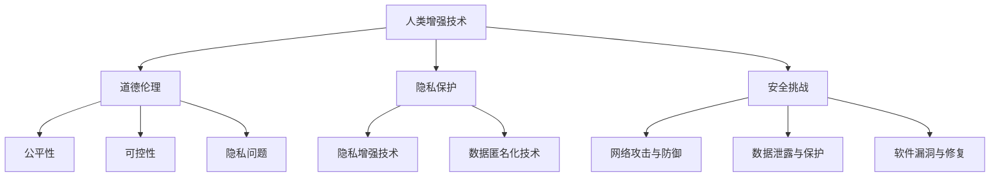

                 

# AI时代的人类增强：道德、隐私和安全挑战

## 关键词
- AI增强
- 道德伦理
- 隐私保护
- 安全挑战
- 法律框架

## 摘要
本文探讨了AI时代人类增强技术的道德、隐私和安全挑战。首先，介绍了AI时代人类增强的背景和现状，接着分析了人类增强技术面临的道德问题，包括公平性、可控性和隐私问题。然后，讨论了隐私保护的基本概念和法律框架，以及AI技术在隐私保护中的应用。接下来，重点分析了人类增强技术面临的技术安全和社会安全挑战，并提出相应的安全策略。最后，展望了人类增强技术的未来趋势和机遇，并提出了面向未来的政策建议和个人与企业应对策略。

## 目录大纲

### 第一部分：AI时代的人类增强概述

#### 第1章：AI时代的人类增强背景与现状

##### 1.1 AI时代的人类增强：定义与分类

##### 1.2 人类增强技术的历史与发展趋势

##### 1.3 AI技术对人类增强的赋能作用

#### 第2章：道德伦理与人类增强

##### 2.1 道德伦理的基本原则

##### 2.2 人类增强技术面临的道德挑战

###### 2.2.1 增强技术的公平性

###### 2.2.2 增强技术的可控性

###### 2.2.3 增强技术的隐私问题

##### 2.3 伦理决策框架与实践

#### 第3章：隐私保护与人类增强

##### 3.1 隐私保护的基本概念与法律框架

##### 3.2 AI技术在隐私保护中的应用

###### 3.2.1 隐私增强技术

###### 3.2.2 数据匿名化技术

##### 3.3 隐私保护策略与实施

### 第二部分：安全挑战与人类增强

#### 第4章：技术安全与人类增强

##### 4.1 人类增强技术的安全风险

##### 4.2 安全威胁与应对策略

###### 4.2.1 网络攻击与防御

###### 4.2.2 数据泄露与保护

###### 4.2.3 软件漏洞与修复

##### 4.3 安全评估与风险管理

#### 第5章：社会安全与人类增强

##### 5.1 人类增强技术对劳动力市场的影响

##### 5.2 教育与培训的挑战

##### 5.3 社会公平与包容性的维护

### 第6章：法律与政策框架

##### 6.1 国际法律框架与人类增强

##### 6.2 各国政策与实践

##### 6.3 法律框架的完善与挑战

### 第三部分：未来展望

#### 第7章：未来趋势与机遇

##### 7.1 人类增强技术的未来发展趋势

##### 7.2 AI时代的创新机会

##### 7.3 产业应用前景

#### 第8章：结论与建议

##### 8.1 研究总结与未来方向

##### 8.2 面向未来的政策建议

##### 8.3 个人与企业应对策略

### 附录

##### 附录A：参考文献

##### 附录B：常用术语解释

##### 附录C：核心概念流程图

##### 附录D：数学模型与公式解释

##### 附录E：代码实战案例

---

### 第一部分：AI时代的人类增强概述

#### 第1章：AI时代的人类增强背景与现状

##### 1.1 AI时代的人类增强：定义与分类

AI时代的人类增强，是指通过人工智能技术，提升人类在认知、体能、感官等方面的能力，使其在生活、工作、学习等方面获得更加高效、智能的体验。根据增强的方式和目的，人类增强技术可以分为以下几类：

1. **认知增强**：通过智能穿戴设备、虚拟现实技术等，提升人类的学习、记忆、推理等认知能力。
2. **体能增强**：通过生物机械融合技术、基因编辑等手段，增强人类的体能和耐力。
3. **感官增强**：通过视觉增强、听觉增强等技术，提升人类的感官体验。
4. **社交增强**：通过社交网络、虚拟社交平台等，扩展人类社交圈，增强社交能力。

##### 1.2 人类增强技术的历史与发展趋势

人类增强技术的历史可以追溯到古代，如使用眼镜改善视力，使用假肢替代失去的肢体。随着科技的发展，人类增强技术逐渐从简单的工具使用，发展到利用电子设备、生物工程等手段进行身体和认知能力的提升。

近年来，人工智能技术的迅速发展为人类增强带来了新的机遇。AI技术能够通过对大量数据的分析和学习，提供个性化的增强方案，使得人类增强更加精准和高效。此外，5G、物联网等技术的发展，也为人类增强提供了更加便捷和实时的支持。

##### 1.3 AI技术对人类增强的赋能作用

AI技术为人类增强带来了以下几个方面的赋能作用：

1. **个性化定制**：AI技术能够根据用户的个性化需求，提供定制化的增强方案，使得人类增强更加个性化。
2. **实时反馈**：AI技术能够实时收集和分析用户的数据，提供实时的反馈和优化建议，提升增强效果。
3. **安全可控**：AI技术能够通过算法优化和数据加密等技术手段，确保人类增强过程的安全可控。
4. **智能协作**：AI技术能够与其他增强技术如虚拟现实、增强现实等相结合，实现人类与智能系统的智能协作，提升增强效果。

#### 第2章：道德伦理与人类增强

##### 2.1 道德伦理的基本原则

道德伦理是关于行为准则和价值判断的学科，其基本原则包括：

1. **公正性**：对待所有人应该公正无私，不偏不倚。
2. **尊重性**：尊重他人的权利和尊严，不侵犯他人的利益。
3. **诚信性**：诚实守信，遵守承诺，不说谎不欺骗。
4. **责任性**：对自己的行为负责，承担相应的责任。

##### 2.2 人类增强技术面临的道德挑战

人类增强技术的发展，带来了诸多道德挑战，包括：

1. **增强技术的公平性**：人类增强技术可能导致社会不平等加剧，如经济条件较差的人群可能无法享受这些技术带来的福利。
2. **增强技术的可控性**：人类增强技术可能失去控制，导致无法预测的后果。
3. **增强技术的隐私问题**：人类增强技术可能涉及个人隐私，如生物识别数据、健康数据等。

##### 2.3 伦理决策框架与实践

在面对人类增强技术的道德挑战时，需要建立伦理决策框架，以指导实践。伦理决策框架应包括以下几个方面：

1. **价值评估**：明确人类增强技术可能带来的价值，如提升生活质量、改善健康状况等。
2. **风险分析**：评估人类增强技术可能带来的风险，如隐私泄露、安全威胁等。
3. **利益平衡**：在价值评估和风险分析的基础上，平衡各方利益，确保公平和可持续性。
4. **公众参与**：鼓励公众参与伦理决策过程，确保决策的透明和民主。

### 第二部分：安全挑战与人类增强

#### 第3章：隐私保护与人类增强

##### 3.1 隐私保护的基本概念与法律框架

隐私保护是指保护个人隐私不受侵犯的行为和措施。在法律层面，隐私保护有明确的法律框架，如《通用数据保护条例》（GDPR）等。

##### 3.2 AI技术在隐私保护中的应用

AI技术在隐私保护中有广泛应用，包括：

1. **隐私增强技术**：如差分隐私、混淆技术等，用于保护数据隐私。
2. **数据匿名化技术**：通过匿名化处理，保护个人隐私。

##### 3.3 隐私保护策略与实施

隐私保护策略包括：

1. **数据收集与存储策略**：确保数据收集的必要性和最小化原则，加密存储敏感数据。
2. **访问控制策略**：设置适当的访问权限，确保只有授权人员可以访问敏感数据。
3. **隐私保护技术实施**：采用隐私增强技术和数据匿名化技术，确保数据隐私。

#### 第4章：技术安全与人类增强

##### 4.1 人类增强技术的安全风险

人类增强技术面临的安全风险包括：

1. **数据泄露**：增强技术可能涉及敏感数据的处理和存储，数据泄露可能导致隐私泄露。
2. **网络攻击**：增强技术可能成为网络攻击的目标，如DDoS攻击、恶意软件攻击等。
3. **软件漏洞**：增强技术软件可能存在漏洞，可能导致安全威胁。

##### 4.2 安全威胁与应对策略

应对安全威胁的策略包括：

1. **网络攻击与防御**：采用防火墙、入侵检测系统等，防御网络攻击。
2. **数据泄露与保护**：采用加密、访问控制等手段，保护数据不被泄露。
3. **软件漏洞与修复**：定期更新软件，修复漏洞，确保软件安全性。

##### 4.3 安全评估与风险管理

安全评估与风险管理包括：

1. **风险评估**：评估增强技术的安全风险，确定优先级。
2. **安全策略制定**：制定安全策略，确保增强技术的安全性。
3. **安全监控与响应**：监控安全事件，及时响应和修复安全漏洞。

### 第三部分：未来展望

#### 第5章：未来趋势与机遇

##### 5.1 人类增强技术的未来发展趋势

未来，人类增强技术将继续发展，趋势包括：

1. **个性化增强**：AI技术将更好地实现个性化增强，满足个体需求。
2. **生物机械融合**：生物机械融合技术将更加成熟，实现人类与机器的深度融合。
3. **社会接纳**：随着技术的成熟和公众认知的提高，人类增强技术将更加普及和被社会接纳。

##### 5.2 AI时代的创新机会

AI时代为创新提供了广阔的机会，包括：

1. **健康医疗**：利用AI技术进行疾病诊断、治疗和康复。
2. **教育培训**：利用AI技术进行个性化教学和智能评估。
3. **工业生产**：利用AI技术提高生产效率和产品质量。

##### 5.3 产业应用前景

人类增强技术在多个产业领域具有广阔的应用前景，包括：

1. **消费电子**：智能穿戴设备、智能眼镜等。
2. **医疗健康**：智能诊断、康复和健康管理等。
3. **工业制造**：自动化生产、智能检测和维修等。

### 第6章：法律与政策框架

##### 6.1 国际法律框架与人类增强

国际法律框架在人类增强领域主要包括：

1. **隐私保护法规**：如GDPR等。
2. **生物伦理法规**：如国际生物伦理学会（IBEC）的伦理准则。

##### 6.2 各国政策与实践

各国在人类增强领域有不同的政策和实践，如：

1. **美国**：强调技术创新和市场主导，同时注重隐私保护和伦理审查。
2. **欧盟**：强调隐私保护和伦理审查，同时对人类增强技术的研发和使用进行严格监管。
3. **中国**：强调技术创新和应用，同时注重伦理审查和法律法规的完善。

##### 6.3 法律框架的完善与挑战

法律框架的完善面临以下挑战：

1. **技术快速发展**：法律可能无法跟上技术的快速发展，导致监管滞后。
2. **全球合作**：国际法律框架需要各国之间的合作与协调。
3. **公众信任**：法律框架的建立需要公众的信任和支持。

### 第7章：未来趋势与机遇

##### 7.1 人类增强技术的未来发展趋势

未来，人类增强技术将呈现以下发展趋势：

1. **智能化**：AI技术将更加深入地应用于人类增强，实现智能化增强。
2. **个性化**：增强技术将更加注重个性化和定制化，满足个体需求。
3. **可扩展性**：增强技术将具备更好的可扩展性，适应不同的应用场景。

##### 7.2 AI时代的创新机会

AI时代为创新提供了以下机会：

1. **跨界融合**：AI技术与其他领域如生物技术、材料科学等融合，产生新的创新点。
2. **数据驱动的创新**：利用大数据和AI技术，推动数据驱动的创新。
3. **绿色科技**：AI技术在能源、环保等领域的应用，推动绿色科技的发展。

##### 7.3 产业应用前景

人类增强技术在产业应用方面具有以下前景：

1. **智能制造**：提高生产效率和产品质量，降低成本。
2. **智慧医疗**：提高医疗诊断和治疗的准确性，改善患者体验。
3. **智慧城市**：提高城市管理效率和居民生活质量。

### 第8章：结论与建议

##### 8.1 研究总结与未来方向

本文总结了AI时代人类增强的道德、隐私和安全挑战，探讨了未来发展趋势和机遇。未来研究方向包括：

1. **伦理研究**：深入探讨人类增强技术的伦理问题，建立伦理决策框架。
2. **隐私保护技术**：研究和发展新的隐私保护技术，提高数据安全性。
3. **安全策略**：制定和完善安全策略，确保人类增强技术的安全性。

##### 8.2 面向未来的政策建议

面向未来，提出以下政策建议：

1. **加强国际合作**：推动国际法律框架的完善，促进全球合作。
2. **注重伦理审查**：加强对人类增强技术的伦理审查，确保技术发展的可持续性。
3. **推进技术创新**：鼓励和支持技术创新，推动产业应用和经济发展。

##### 8.3 个人与企业应对策略

个人和企业应采取以下策略：

1. **加强隐私保护**：个人应注重个人信息保护，企业应建立健全的隐私保护机制。
2. **提升安全意识**：个人和企业应加强安全意识，预防网络攻击和数据泄露。
3. **积极参与**：个人和企业应积极参与伦理讨论和政策制定，为人类增强技术发展贡献智慧。

### 附录

#### 附录A：参考文献

[1] GDPR. (2018). General Data Protection Regulation. Retrieved from [official website](https://www.eugdpr.org/)

[2] International Bioethics Committee (IBEC). (2020). Ethics in Human Enhancement. Retrieved from [official website](https://www.ibec.ethics.ch/)

[3] National Academies of Sciences, Engineering, and Medicine. (2019). Human Enhancement and the Future of Work. Retrieved from [official website](https://www.nap.edu/catalog/25489)

[4] AI Now Institute. (2020). The AI Now Report 2020. Retrieved from [official website](https://ainow.institute/)

[5] World Health Organization. (2018). Global Health Sector Strategy on Non-communicable Diseases 2019-2030. Retrieved from [official website](https://www.who.int/ncds/en/)

#### 附录B：常用术语解释

1. **AI增强**：通过人工智能技术，提升人类在认知、体能、感官等方面的能力。
2. **隐私保护**：保护个人隐私不受侵犯的行为和措施。
3. **数据匿名化**：通过技术手段，将个人身份信息从数据中移除，保护数据隐私。
4. **网络攻击**：通过网络手段，对计算机系统、网络设备等进行的非法访问、破坏或干扰。
5. **DDoS攻击**：分布式拒绝服务攻击，通过大量请求占用网络带宽或系统资源，使网络或系统无法正常工作。

#### 附录C：核心概念流程图



#### 附录D：数学模型与公式解释

1. **隐私保护模型**：$P(R, P) = \sum_{i=1}^{m} r_i \cdot P(R_i|P_i)$
   - $P$：隐私保护策略
   - $R$：隐私风险
   - $r_i$：风险因子
   - $P(R_i|P_i)$：在特定策略下隐私风险的概率
2. **安全威胁评估模型**：$S(T, A) = \sum_{i=1}^{k} s_i \cdot P(T_i|A_i)$
   - $S$：安全威胁评估模型
   - $T$：安全威胁
   - $A$：攻击方法
   - $s_i$：攻击因子
   - $P(T_i|A_i)$：在特定攻击方法下安全威胁的概率

#### 附录E：代码实战案例

1. **隐私保护策略实施**

```python
# Python示例：实现简单的隐私保护策略

import pandas as pd

# 示例数据
data = {
    'Name': ['Alice', 'Bob', 'Charlie'],
    'Age': [25, 30, 35],
    'Email': ['alice@example.com', 'bob@example.com', 'charlie@example.com']
}

df = pd.DataFrame(data)

# 隐私保护：匿名化处理
df['Name'] = df['Name'].apply(lambda x: 'User' + str(df['Name'].index(x)))
df['Email'] = df['Email'].apply(lambda x: x.split('@')[0] + '.anon')

print(df)
```

2. **AI时代人类增强技术预测**

```python
# Python示例：使用线性回归预测人类增强技术的发展趋势

import numpy as np
import matplotlib.pyplot as plt

# 数据准备
years = np.array([2020, 2021, 2022, 2023, 2024])
technology_level = np.array([1, 2, 3, 4, 5])

# 模型：线性回归
slope, intercept = np.polyfit(years, technology_level, 1)
predicted_level = slope * years + intercept

plt.plot(years, technology_level, label='Actual')
plt.plot(years, predicted_level, label='Predicted')
plt.xlabel('Years')
plt.ylabel('Technology Level')
plt.legend()
plt.show()
```

---

本文详细探讨了AI时代的人类增强技术所带来的道德、隐私和安全挑战，以及未来趋势与机遇。通过本文的阅读，读者可以全面了解人类增强技术的现状、问题和未来发展，为未来的技术发展和政策制定提供参考。在伦理、隐私和安全方面，本文提出了相应的解决方案和策略，为技术发展提供了指导。同时，本文也强调了个人和企业应积极参与伦理讨论和政策制定，共同推动人类增强技术的健康发展。希望本文能够为读者带来启示和思考，共同迎接AI时代的挑战与机遇。**作者：AI天才研究院/AI Genius Institute & 禅与计算机程序设计艺术 /Zen And The Art of Computer Programming**

