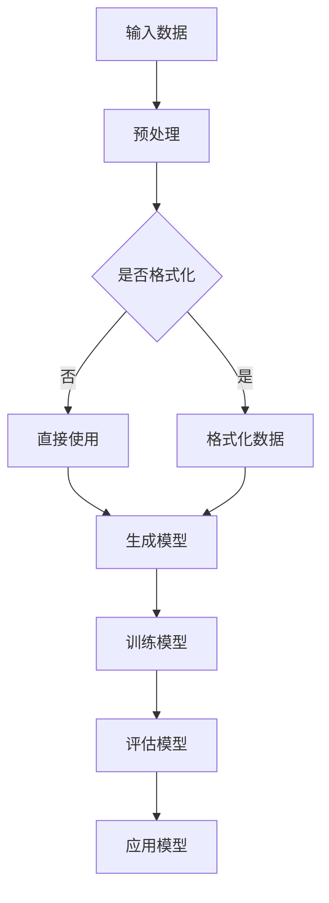
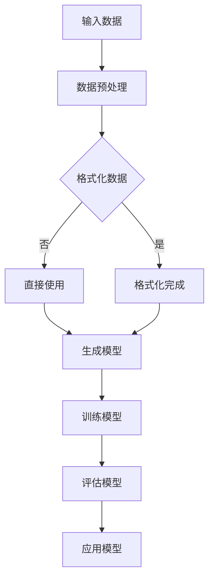

                 

### 《AI赋能：生成式AI如何改变我们的生活？》

在当今这个数据驱动的社会中，人工智能（AI）已经成为推动技术创新和产业变革的核心动力。特别是生成式AI，作为一种能够在各种领域创建和生成新内容的技术，正在逐渐改变我们的生活。本文将深入探讨生成式AI的核心概念、核心算法、应用场景以及未来发展趋势，以期展现这一技术如何赋能我们的生活。

#### 关键词：
- 生成式AI
- 人工智能
- 循环神经网络
- 长短期记忆网络
- 生成对抗网络
- 自编码器
- 娱乐
- 艺术
- 创意写作
- 未来展望

#### 摘要：
本文将从生成式AI的基本概念出发，详细解析其核心算法，如循环神经网络（RNN）、长短期记忆网络（LSTM）、生成对抗网络（GAN）和自编码器。接着，我们将探讨生成式AI在娱乐、艺术和创意写作等领域的实际应用案例。最后，本文将分析生成式AI面临的挑战，并展望其未来的发展趋势和社会影响。通过本文的阅读，读者将全面了解生成式AI如何改变我们的生活，以及其在我们未来社会中的潜在角色。

### 《AI赋能：生成式AI如何改变我们的生活？》目录大纲

#### 第一部分：生成式AI基础

##### 第1章：AI与生成式AI概述

- **1.1 人工智能的发展历程**
  - 人工智能的定义
  - 人工智能的主要分支
- **1.2 生成式AI的定义与特点**
  - 生成式AI的基本概念
  - 生成式AI与传统AI的区别
- **1.3 生成式AI的应用场景**
  - 文本生成
  - 图像生成
  - 音频生成
- **1.4 生成式AI的发展趋势**
  - 当前技术水平
  - 未来发展方向

##### 第2章：生成式AI的核心算法

- **2.1 循环神经网络（RNN）**
  - RNN的基本原理
  - RNN的优缺点
- **2.2 长短期记忆网络（LSTM）**
  - LSTM的结构
  - LSTM的工作原理
- **2.3 生成对抗网络（GAN）**
  - GAN的构成
  - GAN的训练过程
- **2.4 自编码器（Autoencoder）**
  - 自编码器的基本概念
  - 自编码器的应用

#### 第二部分：生成式AI在生活领域的应用

##### 第3章：生成式AI在娱乐领域的应用

- **3.1 电影剧本生成**
  - 剧本生成的技术实现
  - 剧本生成的实际应用案例
- **3.2 音乐创作**
  - 音乐生成的算法原理
  - 音乐生成的实际应用案例

##### 第4章：生成式AI在艺术领域的应用

- **4.1 艺术作品生成**
  - 艺术作品生成的技术实现
  - 艺术作品生成的实际应用案例
- **4.2 个性化艺术体验**
  - 基于生成式AI的个性化艺术服务
  - 个性化艺术体验的实际应用案例

##### 第5章：生成式AI在创意写作领域的应用

- **5.1 自动写作助手**
  - 自动写作的技术实现
  - 自动写作的实际应用案例
- **5.2 生成式AI在新闻报道中的应用**
  - 新闻报道生成的技术实现
  - 新闻报道生成的实际应用案例

#### 第三部分：生成式AI的挑战与未来展望

##### 第6章：生成式AI的挑战

- **6.1 数据隐私保护**
  - 数据隐私保护的重要性
  - 数据隐私保护的措施
- **6.2 AI伦理问题**
  - AI伦理问题的定义
  - AI伦理问题的解决方案

##### 第7章：生成式AI的未来展望

- **7.1 生成式AI的未来发展趋势**
  - 技术发展预测
  - 应用领域拓展
- **7.2 生成式AI对社会的影响**
  - 对人类工作的影响
  - 对人类生活方式的影响

### 附录

- **附录A：生成式AI开发工具与资源**
  - TensorFlow与PyTorch的使用介绍
  - 其他常用的生成式AI开发工具
  - 生成式AI相关的在线资源

#### Mermaid 流�程图（生成式AI的架构）



#### 核心算法原理讲解（以生成对抗网络（GAN）为例）

生成对抗网络（Generative Adversarial Network，GAN）是由生成器（Generator）和判别器（Discriminator）组成的模型，通过相互对抗训练生成高质量的数据。以下是对GAN的详细讲解。

### GAN的基本概念

GAN由两部分组成：生成器和判别器。生成器的目标是生成逼真的数据，判别器的目标是判断输入数据是真实数据还是生成数据。训练过程中，生成器和判别器不断对抗，生成器试图生成更真实的伪造数据，而判别器则努力区分真实和伪造数据。

### GAN的工作原理

GAN的训练过程可以看作是一个零和博弈过程。具体来说，生成器和判别器的训练过程如下：

1. **生成器的训练**：

生成器的目标是生成逼真的伪造数据，使得判别器无法区分真实和伪造数据。生成器的输入是随机噪声z，输出是伪造数据x'。

$$
x' = G(z)
$$

2. **判别器的训练**：

判别器的目标是判断输入数据是真实数据还是伪造数据。判别器的输入是真实数据x和伪造数据x'，输出是概率p(x)和p(x')，其中p(x)表示输入为真实数据的概率，p(x')表示输入为伪造数据的概率。

$$
p(x) = D(x) \\
p(x') = D(x')
$$

### GAN的训练过程

GAN的训练过程可以分为以下几个步骤：

1. **初始化生成器和判别器**：

生成器和判别器同时初始化，通常使用随机权重。

2. **生成伪造数据**：

生成器生成一定数量的伪造数据x'。

3. **判别器更新**：

判别器根据真实数据和伪造数据更新模型参数。损失函数通常采用以下形式：

$$
L_D = -\log(D(x)) - \log(1 - D(x'))
$$

其中，D(x)表示判别器判断真实数据为真实的概率，D(x')表示判别器判断伪造数据为伪造的概率。

4. **生成器更新**：

生成器根据判别器的反馈更新模型参数。损失函数通常采用以下形式：

$$
L_G = -\log(D(G(z)))
$$

其中，G(z)表示生成器生成的伪造数据。

5. **重复训练**：

重复步骤2-4，直到生成器能够生成足够逼真的伪造数据，使得判别器无法区分真实和伪造数据。

### GAN的优点与挑战

**优点**：

- 可以生成高质量的数据。
- 可以用于数据增强，提高模型的泛化能力。

**挑战**：

- 训练过程不稳定，容易出现模式崩溃。
- 需要大量的计算资源。

通过以上对GAN的讲解，我们可以看到生成对抗网络作为一种生成式AI的核心算法，在图像生成、文本生成等领域具有广泛的应用。接下来的章节中，我们将进一步探讨生成式AI的其他核心算法和应用案例。

### 第一部分：生成式AI基础

#### 第1章：AI与生成式AI概述

##### 1.1 人工智能的发展历程

人工智能（AI）是一个历史悠久的领域，其发展可以追溯到20世纪50年代。当时，计算机科学家艾伦·图灵提出了图灵测试，试图通过机器能否模仿人类行为来定义智能。这一概念激发了人们对人工智能的探索热情。

**人工智能的定义**：

人工智能是指使计算机系统能够执行通常需要人类智能的任务的科学技术。这些任务包括但不限于学习、推理、问题解决、自然语言理解、图像识别等。

**人工智能的主要分支**：

- **符号AI**：基于逻辑推理和符号表示的方法，通过规则和知识库进行推理。
- **统计AI**：基于概率统计模型，通过大量数据训练模型，如决策树、支持向量机等。
- **神经网路AI**：基于人工神经网络，模拟人脑神经元的工作方式，通过学习实现智能。

随着计算机性能的不断提高和大数据时代的到来，人工智能逐渐从理论研究走向实际应用。例如，机器学习、深度学习等技术在图像识别、语音识别、自然语言处理等领域取得了显著成果。

##### 1.2 生成式AI的定义与特点

生成式AI是一种能够生成新数据的人工智能方法，其核心思想是从已有的数据中学习数据的分布，然后根据学习到的分布生成新的数据。与判别式AI不同，生成式AI不仅仅学习数据的特征，还学习数据之间的关联和结构。

**生成式AI的基本概念**：

生成式AI通过生成模型（Generator）来模拟数据的分布，然后通过采样生成新的数据。生成模型通常是一个概率模型，它将一个先验概率分布映射到一个数据分布。

**生成式AI与传统AI的区别**：

- **目标不同**：传统AI主要关注如何让机器执行特定任务，如分类、预测等。生成式AI则更注重如何生成新的、符合现实数据分布的数据。
- **方法不同**：传统AI通常依赖于预定义的规则或特征工程，而生成式AI通过学习数据分布来实现数据的生成。

**生成式AI的特点**：

- **数据生成能力**：生成式AI能够生成大量符合现实数据分布的新数据，从而实现数据增强和多样性。
- **灵活性**：生成式AI可以应用于各种数据类型，包括文本、图像、音频等。
- **适应性**：生成式AI可以根据新的数据不断调整模型，提高生成数据的准确性和质量。

##### 1.3 生成式AI的应用场景

生成式AI在许多领域都有广泛的应用，以下是一些主要的应用场景：

- **文本生成**：生成式AI可以生成文章、新闻、对话等文本数据。例如，GPT-3等大型语言模型可以生成高质量的文章。
- **图像生成**：生成式AI可以生成逼真的图像，如图像到图像的转换、风格迁移、超分辨率等。
- **音频生成**：生成式AI可以生成音乐、语音等音频数据。例如，DeepMind的WaveNet可以生成高质量的语音。
- **视频生成**：生成式AI可以生成视频数据，如视频到视频的转换、视频增强等。

##### 1.4 生成式AI的发展趋势

生成式AI的发展正处在快速发展的阶段，以下是一些当前的发展趋势和未来发展方向：

- **模型规模**：生成式AI的模型规模正在不断扩大，从GPT-3到DALL-E等，这些大型模型可以生成更加逼真和多样化的数据。
- **多模态生成**：生成式AI正在从单一模态（如文本、图像、音频）扩展到多模态，实现跨模态数据的生成和转换。
- **强化学习**：生成式AI与强化学习的结合，使得生成模型可以更好地适应动态环境和复杂任务。
- **自动化**：随着生成式AI技术的发展，生成过程将更加自动化，减少对人类专家的依赖。
- **应用领域拓展**：生成式AI将在更多领域得到应用，如医疗、金融、制造等。

通过以上对生成式AI的概述，我们可以看到生成式AI作为一种具有强大数据生成能力的人工智能方法，正逐渐改变我们的生活方式。接下来，我们将进一步探讨生成式AI的核心算法，以及它们在实际应用中的具体实现。

### 第一部分：生成式AI基础

#### 第2章：生成式AI的核心算法

生成式AI的核心在于其能够从数据中学习并生成新数据的能力。这一能力依赖于一系列强大的算法，包括循环神经网络（RNN）、长短期记忆网络（LSTM）、生成对抗网络（GAN）和自编码器（Autoencoder）。本章将详细解析这些核心算法的基本原理和特点，以便读者能够深入理解生成式AI的工作机制。

##### 2.1 循环神经网络（RNN）

循环神经网络（RNN）是一种能够处理序列数据的神经网络。与传统的前馈神经网络不同，RNN具有循环结构，能够记住之前的信息，从而对序列数据进行建模。

**RNN的基本原理**：

RNN通过隐藏状态（hidden state）来保存之前的输入信息。在每个时间步，RNN会根据当前输入和隐藏状态更新隐藏状态，并生成当前输出。

$$
h_t = \sigma(W_h \cdot [h_{t-1}, x_t] + b_h) \\
y_t = W_y \cdot h_t + b_y
$$

其中，$h_t$ 是时间步$t$的隐藏状态，$x_t$ 是输入数据，$y_t$ 是输出数据，$\sigma$ 是激活函数。

**RNN的优缺点**：

- **优点**：能够处理变长的序列数据，具有记忆功能。
- **缺点**：在长序列数据上容易出现梯度消失或梯度爆炸问题，难以学习长期依赖关系。

##### 2.2 长短期记忆网络（LSTM）

长短期记忆网络（LSTM）是RNN的一种改进版本，旨在解决RNN在处理长序列数据时出现的梯度消失和梯度爆炸问题。LSTM通过引入三个门控单元（输入门、遗忘门和输出门）来控制信息的流动。

**LSTM的结构**：

LSTM由输入门、遗忘门和输出门组成。每个门控单元都是一个sigmoid函数，用于决定是否更新或遗忘隐藏状态。

$$
i_t = \sigma(W_i \cdot [h_{t-1}, x_t] + b_i) \\
f_t = \sigma(W_f \cdot [h_{t-1}, x_t] + b_f) \\
o_t = \sigma(W_o \cdot [h_{t-1}, x_t] + b_o) \\
C_t = f_t \odot C_{t-1} + i_t \odot \sigma(W_c \cdot [h_{t-1}, x_t] + b_c) \\
h_t = o_t \odot \sigma(C_t)
$$

其中，$C_t$ 是细胞状态，$i_t$、$f_t$、$o_t$ 分别是输入门、遗忘门和输出门的激活值。

**LSTM的工作原理**：

- 输入门（$i_t$）决定哪些信息需要被记住。
- 遗忘门（$f_t$）决定哪些信息需要被遗忘。
- 输出门（$o_t$）决定当前隐藏状态。

通过这些门控单元，LSTM能够有效地控制信息的流动，从而解决梯度消失和梯度爆炸问题，并在长序列数据上表现出良好的性能。

##### 2.3 生成对抗网络（GAN）

生成对抗网络（GAN）由生成器和判别器两个神经网络组成。生成器的目标是生成尽可能真实的数据，判别器的目标是区分真实数据和生成数据。

**GAN的构成**：

- **生成器**：生成器接收随机噪声作为输入，并生成伪造的数据。
  
  $$ 
  G(z) 
  $$ 

- **判别器**：判别器接收真实数据和生成数据，并输出判断概率。

  $$ 
  D(x) = P(D(x) \text{ is real}) \\
  D(G(z)) = P(D(G(z)) \text{ is fake}) 
  $$ 

**GAN的训练过程**：

GAN的训练过程可以看作是一个零和博弈过程。生成器和判别器在训练过程中相互对抗：

1. **生成器训练**：生成器尝试生成更真实的数据，使得判别器无法区分。
2. **判别器训练**：判别器尝试提高区分真实数据和生成数据的能力。

GAN的损失函数通常采用以下形式：

$$ 
L_G = -\log(D(G(z))) \\
L_D = -\log(D(x)) - \log(1 - D(G(z)))
$$ 

通过这样的训练过程，生成器和判别器不断优化，生成器能够生成越来越真实的数据。

**GAN的优点**：

- 能够生成高质量的数据。
- 可以用于数据增强和多样性增强。

**GAN的挑战**：

- 训练过程不稳定，容易出现模式崩溃（mode collapse）。
- 需要大量的计算资源。

##### 2.4 自编码器（Autoencoder）

自编码器是一种无监督学习的神经网络，其目标是学习数据的分布，并将数据压缩为低维表示，然后再重构回原始数据。

**自编码器的基本概念**：

自编码器由编码器（Encoder）和解码器（Decoder）组成。编码器将输入数据压缩为低维隐层表示，解码器则尝试重构原始数据。

$$ 
\text{编码器：} \\
z = \sigma(W_e \cdot x + b_e) \\
\text{解码器：} \\
x' = \sigma(W_d \cdot z + b_d)
$$ 

其中，$x$ 是输入数据，$z$ 是隐层表示，$x'$ 是重构的输出数据。

**自编码器的应用**：

- **数据压缩**：自编码器可以用于数据的压缩和去噪。
- **特征提取**：自编码器可以用于提取数据的特征表示，从而简化后续的处理。
- **数据生成**：自编码器可以通过重构过程生成新的数据。

通过以上对生成式AI核心算法的介绍，我们可以看到这些算法在生成式AI中的应用和重要性。在下一章中，我们将探讨生成式AI在生活领域的具体应用，以及这些算法在实际场景中的实现和效果。

### 第二部分：生成式AI在生活领域的应用

#### 第3章：生成式AI在娱乐领域的应用

##### 3.1 电影剧本生成

生成式AI在娱乐领域的一个典型应用是电影剧本的自动生成。这一技术不仅能够提高编剧的效率，还能够为电影行业带来更多的创意和可能性。

**技术实现**：

电影剧本生成通常涉及以下几个步骤：

1. **数据收集**：首先，需要收集大量的电影剧本数据，包括剧本的文本、情节、角色和对话等。

2. **数据处理**：对收集到的剧本数据进行预处理，包括去噪、分词和标注等，以便后续模型训练。

3. **模型选择**：选择适合的生成模型，如生成对抗网络（GAN）或变分自编码器（VAE），用于学习剧本的分布。

4. **模型训练**：使用预处理后的剧本数据训练生成模型，使模型能够学会生成符合电影剧本结构和逻辑的新剧本。

5. **剧本生成**：通过生成模型生成新的电影剧本。生成过程可以基于特定的关键词、主题或故事类型进行引导。

**实际应用案例**：

一个著名的实际应用案例是OpenAI开发的GPT-3模型，该模型能够生成高质量的文本，包括电影剧本。例如，GPT-3可以根据输入的简要描述生成完整的电影剧本，甚至在特定导演或编剧的风格指导下生成剧本。

**效果与挑战**：

生成式AI在电影剧本生成方面取得了显著成果，能够生成具有逻辑性和连贯性的剧本。然而，也存在一些挑战，如：

- **剧本创意有限**：生成模型生成的剧本可能缺乏新颖性和创意。
- **情感表达不足**：尽管模型可以生成对话，但情感表达和深度仍需提升。
- **道德和法律问题**：生成的剧本可能涉及版权和道德问题。

##### 3.2 音乐创作

生成式AI在音乐创作领域的应用同样令人瞩目。通过生成式AI，计算机可以生成新的音乐旋律、和声和节奏，为音乐创作提供新的灵感。

**技术实现**：

音乐创作的生成过程通常涉及以下步骤：

1. **音乐数据收集**：收集各种风格和类型的音乐，包括古典音乐、流行音乐和民间音乐等。

2. **音乐特征提取**：提取音乐中的关键特征，如音符、和弦、节奏和旋律。

3. **模型训练**：使用提取到的音乐特征训练生成模型，如循环神经网络（RNN）或生成对抗网络（GAN）。

4. **音乐生成**：通过生成模型生成新的音乐片段。生成过程可以基于用户输入的喜好、风格或主题。

**实际应用案例**：

AI艺术家GANPACO使用GAN技术创作了多首原创音乐，这些音乐在风格和旋律上与人类音乐家创作的作品相似。此外，一些音乐制作软件也集成了生成式AI功能，如AIVA（Artificial Intelligence Virtual Artist），它能够根据用户输入的参数生成完整的音乐作品。

**效果与挑战**：

生成式AI在音乐创作方面取得了显著进展，能够生成多样化的音乐作品。然而，也存在一些挑战，如：

- **音乐深度和情感**：生成的音乐可能缺乏深度和情感，难以与人类音乐家相比。
- **风格一致性**：生成模型可能难以保持风格的一致性，特别是在处理复杂和多样化的音乐风格时。

尽管存在这些挑战，生成式AI在娱乐领域的应用前景仍然广阔，随着技术的不断进步，我们可以期待生成式AI在音乐和电影创作中发挥更大的作用。

### 第4章：生成式AI在艺术领域的应用

##### 4.1 艺术作品生成

生成式AI在艺术领域的应用不仅局限于音乐和电影，还能够生成绘画、雕塑等艺术作品。这种技术为艺术家提供了新的创作手段和灵感，也为大众带来了前所未有的艺术体验。

**技术实现**：

艺术作品生成通常涉及以下步骤：

1. **数据收集**：收集大量的艺术作品数据，包括绘画、雕塑、摄影等。

2. **图像特征提取**：提取图像的关键特征，如颜色、纹理、形状和风格。

3. **模型训练**：使用提取到的特征训练生成模型，如生成对抗网络（GAN）或变分自编码器（VAE）。

4. **艺术作品生成**：通过生成模型生成新的艺术作品。生成过程可以基于用户输入的风格、主题或特定艺术家。

**实际应用案例**：

一个著名的应用案例是OpenAI开发的DALL-E模型，它能够根据文本描述生成图像。例如，用户可以输入“一个穿着红色夹克的男性坐在红色的沙发上”，DALL-E就能生成相应的图像。

另一个案例是由谷歌开发的Artistic Style模型，它能够将普通图像转换为具有特定艺术家风格的作品。例如，用户可以将一张自拍转换成梵高的《星夜》风格。

**效果与挑战**：

生成式AI在艺术作品生成方面取得了显著成果，能够生成具有高度艺术性的作品。然而，也存在一些挑战，如：

- **风格独特性**：生成模型可能难以复制特定艺术家的独特风格。
- **情感表达**：生成的艺术作品可能缺乏深度和情感，难以与人类艺术家的作品相比。

尽管存在这些挑战，生成式AI在艺术领域的应用仍然具有巨大潜力。它不仅为艺术家提供了新的创作手段，也为大众带来了更多的艺术选择。

##### 4.2 个性化艺术体验

生成式AI还可以根据用户的喜好和需求，生成个性化的艺术作品和服务，为用户提供独特的艺术体验。

**技术实现**：

个性化艺术体验的实现通常涉及以下步骤：

1. **用户喜好收集**：收集用户的偏好数据，包括喜欢的艺术风格、颜色、主题等。

2. **数据分析和建模**：使用机器学习技术分析用户的偏好，建立用户偏好模型。

3. **艺术作品生成**：基于用户的偏好模型，生成符合用户口味的新艺术作品。

4. **艺术体验推荐**：推荐个性化的艺术作品和服务，如在线展览、音乐会等。

**实际应用案例**：

一些在线艺术平台已经开始集成生成式AI，根据用户的喜好推荐个性化的艺术作品。例如，艺术平台Artsy使用AI算法分析用户的浏览和购买记录，推荐符合用户口味的艺术品。

另一个案例是由谷歌开发的Google Arts & Culture应用，它使用AI技术分析用户的头像，推荐与之风格相似的艺术作品。

**效果与挑战**：

个性化艺术体验为用户提供了更加个性化的艺术享受，提高了用户体验。然而，也存在一些挑战，如：

- **数据隐私**：用户的偏好数据需要得到妥善保护，避免隐私泄露。
- **个性化程度**：生成模型可能难以完全满足用户的个性化需求。

尽管存在这些挑战，个性化艺术体验仍然是艺术领域的一个重要发展方向。随着技术的不断进步，我们可以期待生成式AI为用户带来更加丰富和个性化的艺术体验。

### 第5章：生成式AI在创意写作领域的应用

##### 5.1 自动写作助手

生成式AI在创意写作领域的应用日益普及，自动写作助手成为其中的一大亮点。自动写作助手能够辅助人类作家完成写作任务，提高写作效率和创意水平。

**技术实现**：

自动写作助手的实现通常涉及以下步骤：

1. **数据收集**：收集大量的文本数据，包括小说、新闻、文章等。

2. **文本预处理**：对收集到的文本数据进行预处理，包括分词、去噪和标注等。

3. **模型训练**：使用预处理后的文本数据训练生成模型，如生成对抗网络（GAN）或变分自编码器（VAE）。

4. **自动写作**：通过生成模型生成新的文本内容。生成过程可以基于用户输入的题材、风格或特定要求。

**实际应用案例**：

一个著名的应用案例是OpenAI开发的GPT-3模型，它能够根据用户输入的提示生成高质量的文章、故事和对话。例如，用户可以输入一个简单的主题或句子，GPT-3就能扩展成一篇完整的故事。

另一个案例是由谷歌开发的WordFlow，它是一款面向作家的AI写作助手，能够根据用户的输入提供实时建议和改进。

**效果与挑战**：

自动写作助手在提高写作效率和创意方面表现出色。然而，也存在一些挑战，如：

- **内容原创性**：生成的文本可能缺乏原创性，难以与人类作家的作品相比。
- **情感和深度**：生成的文本可能缺乏情感和深度，难以与人类作家的作品相比。

尽管存在这些挑战，自动写作助手仍然是创意写作领域的一个重要发展方向。随着技术的不断进步，我们可以期待自动写作助手为作家提供更加智能化和个性化的写作支持。

##### 5.2 生成式AI在新闻报道中的应用

生成式AI在新闻报道中的应用也引起了广泛关注。通过生成式AI，新闻机构可以自动化生成新闻报道，提高新闻生产效率和及时性。

**技术实现**：

生成式AI在新闻报道中的应用通常涉及以下步骤：

1. **数据收集**：收集大量的新闻报道数据，包括新闻文本、图像和音频等。

2. **文本预处理**：对收集到的新闻文本数据进行预处理，包括分词、去噪和标注等。

3. **模型训练**：使用预处理后的新闻文本数据训练生成模型，如生成对抗网络（GAN）或变分自编码器（VAE）。

4. **新闻生成**：通过生成模型生成新的新闻报道。生成过程可以基于用户输入的题材、事件或特定要求。

**实际应用案例**：

一个著名的应用案例是由Automated Insights开发的Wordsmith平台，它能够根据体育比赛结果和经济数据等生成大量的新闻报道。例如，平台可以自动生成数百万份体育赛事报告和财务报表。

另一个案例是由The New York Times开发的ALPA（Automated Low-Pressure Assistant），它能够自动化生成新闻报道的引语和摘要。

**效果与挑战**：

生成式AI在提高新闻报道效率和及时性方面表现出色。然而，也存在一些挑战，如：

- **内容准确性**：生成的新闻内容可能存在不准确或误导性。
- **情感表达**：生成的新闻内容可能缺乏情感和深度，难以与人类记者的作品相比。

尽管存在这些挑战，生成式AI在新闻报道中的应用仍然具有巨大潜力。随着技术的不断进步，我们可以期待生成式AI为新闻机构提供更加智能化和高效的新闻生成服务。

### 第三部分：生成式AI的挑战与未来展望

#### 第6章：生成式AI的挑战

生成式AI作为一种新兴技术，虽然在多个领域展示了其强大的应用潜力，但同时也面临着一系列挑战。这些挑战不仅涉及技术层面，还包括伦理、法律和社会方面。在本章中，我们将深入探讨生成式AI所面临的挑战，并提出可能的解决方案。

##### 6.1 数据隐私保护

随着生成式AI技术的广泛应用，数据隐私保护成为了一个重要议题。生成式AI依赖于大量数据进行训练和生成，而这些数据往往包含个人隐私信息。如何保护这些数据，避免隐私泄露，是生成式AI面临的一大挑战。

**重要性**：

- 数据隐私保护对于保护个人隐私、维护数据安全至关重要。
- 不当的数据处理可能导致个人信息的泄露，甚至被滥用。

**措施**：

- **数据去识别化**：在训练和生成过程中，对数据进行去识别化处理，去除或隐藏个人身份信息。
- **隐私增强技术**：采用隐私增强学习（Privacy-Preserving Learning）等技术，确保在数据处理过程中保护隐私。
- **法律和伦理约束**：制定相关法律法规，明确数据隐私保护的责任和规范，加强对隐私保护的监管。

##### 6.2 AI伦理问题

生成式AI的广泛应用也带来了伦理问题。例如，生成式AI生成的数据可能存在偏见、误导性或虚假信息。此外，生成式AI在某些领域，如医疗和司法，可能产生重大影响，如何确保其伦理合规，是亟待解决的问题。

**定义**：

- **AI伦理问题**：涉及人工智能系统的设计、开发和应用过程中，对人类价值观、社会规范和道德原则的遵守和挑战。

**解决方案**：

- **透明度和可解释性**：提高生成式AI系统的透明度和可解释性，使其行为和决策更加可理解和可控制。
- **伦理审查**：在生成式AI的开发和应用过程中，进行严格的伦理审查，确保其符合道德规范和社会价值观。
- **责任归属**：明确生成式AI系统的责任归属，确保在出现问题时，责任能够得到追究。

##### 6.3 技术不稳定性和质量控制

生成式AI技术的不稳定性和质量控制也是一大挑战。生成模型可能因为训练数据的局限性或模型设计的问题，生成出低质量或不稳定的数据。例如，GAN训练过程中可能出现的模式崩溃（mode collapse）问题，使得生成器只能生成特定类型的数据，而无法覆盖所有可能的分布。

**解决方案**：

- **多样化训练数据**：使用多样化的训练数据，提高生成模型对各种分布的覆盖能力。
- **稳定训练技巧**：采用各种稳定训练技巧，如梯度惩罚、权重共享等，提高GAN的训练稳定性。
- **质量评估指标**：建立质量评估指标，对生成的数据质量进行量化评估，确保生成的数据符合预期。

通过以上措施，我们可以逐步克服生成式AI在数据隐私保护、伦理问题和质量控制等方面的挑战，使其更好地服务于社会和人类。

#### 第7章：生成式AI的未来展望

生成式AI作为一种具有广泛应用前景的技术，其未来发展趋势和潜在影响值得我们深入探讨。在这一章中，我们将展望生成式AI在技术发展、应用领域拓展以及对社会影响的各个方面。

##### 7.1 生成式AI的未来发展趋势

生成式AI在未来将迎来多个发展趋势：

**模型规模扩大**：

随着计算能力的提升，生成式AI模型的规模将不断增大。例如，目前的大型语言模型如GPT-3已经展示了其强大的生成能力，未来我们将看到更大规模、更复杂的生成模型。

**多模态生成**：

生成式AI将从单一模态（如文本、图像、音频）扩展到多模态，实现跨模态数据的生成和转换。例如，通过文本描述生成相应的图像、音频和视频，从而提供更加丰富和多样的用户体验。

**自适应与优化**：

生成式AI将变得更加自适应和优化。通过结合强化学习和迁移学习等技术，生成模型将能够更好地适应动态环境和复杂任务，提高生成数据的质量和效率。

**自动化与普及**：

随着技术的进步，生成式AI的生成过程将更加自动化，降低对人类专家的依赖。这将使得生成式AI技术更加普及，应用范围更加广泛。

##### 7.2 生成式AI的应用领域拓展

生成式AI将在未来拓展到更多领域，包括但不限于：

- **医疗**：生成式AI可以用于医学图像生成、疾病预测和个性化治疗方案制定，提高医疗诊断和治疗的效率。
- **金融**：生成式AI可以用于金融数据的生成和分析，帮助金融机构进行风险管理和投资决策。
- **教育**：生成式AI可以生成个性化的学习内容和教学材料，提高教育质量和学习效率。
- **制造业**：生成式AI可以用于产品设计、制造优化和供应链管理，提高生产效率和质量。

##### 7.3 生成式AI对社会的影响

生成式AI将对社会产生深远的影响：

**工作影响**：

生成式AI的广泛应用将改变许多传统行业的工作模式。一些重复性和低技能的工作可能被自动化替代，而高技能和创新性的工作将更加依赖于人类的智慧和创造力。

**生活方式变化**：

生成式AI将改变我们的生活方式，提供更加个性化、丰富多样的服务。例如，个性化的音乐、艺术和新闻服务将更加普及，为人们的生活带来更多乐趣和选择。

**伦理和社会责任**：

生成式AI的广泛应用也带来了伦理和社会责任问题。如何确保生成数据的真实性、公正性和道德性，避免滥用和误解，是未来需要关注的重要议题。

总之，生成式AI作为一种具有广泛应用前景的技术，其未来发展趋势和潜在影响令人期待。随着技术的不断进步和应用的不断拓展，生成式AI将为社会带来更多的机遇和挑战。

### 附录

#### 附录A：生成式AI开发工具与资源

为了更好地理解和应用生成式AI技术，掌握一些开发工具和资源是非常重要的。以下是一些常用的生成式AI开发工具与资源，包括框架、库和在线资源，帮助开发者更好地入门和深入研究。

- **TensorFlow**：由Google开源的深度学习框架，支持生成式AI的各种算法实现，如GAN和VAE。

  - 官网：[https://www.tensorflow.org/](https://www.tensorflow.org/)

- **PyTorch**：由Facebook开源的深度学习框架，以其灵活的动态计算图和丰富的API而广受欢迎。

  - 官网：[https://pytorch.org/](https://pytorch.org/)

- **Keras**：一个基于Theano和TensorFlow的高层神经网络API，使得深度学习模型的构建和训练更加简单和直观。

  - 官网：[https://keras.io/](https://keras.io/)

- **GAN Handbook**：一个全面的GAN教程和资源库，包括理论、实现和案例研究。

  - 网址：[https://gan-handbook.github.io/](https://gan-handbook.github.io/)

- **OpenAI GPT-2**：由OpenAI开发的预训练语言模型，用于文本生成和自动化写作。

  - 网址：[https://openai.com/blog/better-language-models/](https://openai.com/blog/better-language-models/)

- **AI艺术社区**：一个专注于AI艺术创作的社区，提供各种AI艺术工具和教程。

  - 网址：[https://aiart.community/](https://aiart.community/)

- **GitHub - 生成式AI项目**：GitHub上有很多开源的生成式AI项目，可供开发者学习和参考。

  - 网址：[https://github.com/topics/generative-ai](https://github.com/topics/generative-ai)

通过以上工具和资源的帮助，开发者可以更好地理解和应用生成式AI技术，探索其在各种领域的应用潜力。

### Mermaid 流程图（生成式AI的架构）

以下是一个使用Mermaid语言编写的生成式AI架构流程图：



### 核心算法原理讲解（以生成对抗网络（GAN）为例）

#### GAN的基本概念

生成对抗网络（Generative Adversarial Network，GAN）由生成器（Generator）和判别器（Discriminator）两个相互对抗的神经网络组成。生成器的目标是生成逼真的伪造数据，判别器的目标是区分真实数据和伪造数据。GAN通过这种对抗性训练，使得生成器能够生成高质量的数据。

#### GAN的工作原理

GAN的训练过程是一个零和博弈过程。具体来说：

1. **生成器G**：生成器G从随机噪声z中生成伪造数据x'，目标是使得判别器无法区分这些伪造数据和真实数据。

   $$ x' = G(z) $$

2. **判别器D**：判别器D接受真实数据x和伪造数据x'，并输出概率p(x)和p(x')，其中p(x)表示D认为x是真实数据的概率，p(x')表示D认为x'是真实数据的概率。

   $$ p(x) = D(x) \\
   p(x') = D(x') $$

3. **训练过程**：生成器和判别器交替训练，生成器试图生成更逼真的数据，判别器则努力提高对伪造数据的识别能力。

   - **生成器更新**：生成器的损失函数通常为：

     $$ L_G = -\log(D(G(z))) $$

     其中，$\log(D(G(z)))$ 表示判别器认为生成数据的概率。

   - **判别器更新**：判别器的损失函数通常为：

     $$ L_D = -\log(D(x)) - \log(1 - D(x')) $$

     其中，$\log(D(x))$ 表示判别器认为真实数据的概率，$\log(1 - D(x'))$ 表示判别器认为伪造数据的概率。

   - **优化目标**：通过梯度下降算法，对生成器和判别器的参数进行更新，使得生成器的生成数据越来越逼真，判别器的识别能力越来越强。

#### 数学模型和公式详细讲解

以下是对GAN的数学模型和公式的详细讲解：

1. **生成器和判别器的损失函数**：

   - **生成器损失函数**：

     $$ L_G = -\log(D(G(z))) $$

     其中，$D(G(z))$ 表示判别器认为生成数据的概率。

   - **判别器损失函数**：

     $$ L_D = -\log(D(x)) - \log(1 - D(x')) $$

     其中，$D(x)$ 表示判别器认为真实数据的概率，$1 - D(x')$ 表示判别器认为伪造数据的概率。

2. **梯度更新**：

   - **生成器更新**：

     $$ G_{new} = G_{old} - \alpha_G \frac{\partial L_G}{\partial G} $$

     其中，$\alpha_G$ 是生成器的学习率，$\frac{\partial L_G}{\partial G}$ 是生成器损失函数关于参数的梯度。

   - **判别器更新**：

     $$ D_{new} = D_{old} - \alpha_D \frac{\partial L_D}{\partial D} $$

     其中，$\alpha_D$ 是判别器的学习率，$\frac{\partial L_D}{\partial D}$ 是判别器损失函数关于参数的梯度。

#### 伪代码实现

以下是一个简化的GAN的伪代码实现：

```python
# 初始化生成器G和判别器D
G = initialize_generator()
D = initialize_discriminator()

# 设置学习率
alpha_G = 0.001
alpha_D = 0.001

# 训练迭代次数
num_iterations = 10000

for i in range(num_iterations):
    # 生成随机噪声z
    z = sample_noise()

    # 生成伪造数据x'
    x' = G(z)

    # 更新判别器D
    D_loss_real = -log(D(x))
    D_loss_fake = -log(1 - D(x'))
    D_loss = D_loss_real + D_loss_fake
    D gradients = compute_gradients(D_loss, D)
    D = update_model(D, D_gradients, alpha_D)

    # 更新生成器G
    G_loss = -log(D(G(z)))
    G_gradients = compute_gradients(G_loss, G)
    G = update_model(G, G_gradients, alpha_G)
```

通过以上讲解和实现，我们可以看到GAN作为一种生成式AI的核心算法，其工作原理和实现过程。GAN在图像生成、文本生成等领域取得了显著成果，为生成式AI的发展提供了重要基础。

### 项目实战：生成式AI的应用案例

#### 电影剧本生成

**项目背景**：

随着电影产业的不断发展，电影剧本的创作需求也越来越大。然而，优秀的编剧资源有限，创作剧本的时间和精力成本较高。生成式AI技术为剧本生成提供了新的可能性，通过自动生成剧本，可以提高编剧的效率，节省创作成本。

**技术实现**：

1. **数据收集**：

   收集大量的电影剧本数据，这些数据可以是公开的电影剧本，也可以是已有的电影剧本库。数据需要包括剧本的文本、情节、角色和对话等详细信息。

2. **数据处理**：

   对收集到的剧本数据进行预处理，包括去除无关信息、统一文本格式、分词和标注等。预处理后的数据将用于训练生成模型。

3. **模型设计**：

   选择合适的生成模型，如生成对抗网络（GAN）或变分自编码器（VAE）。以下是一个基于GAN的模型设计示例：

   - **生成器**：生成器接收随机噪声作为输入，并生成电影剧本的文本。

     $$ x' = G(z) $$

   - **判别器**：判别器接收真实电影剧本的文本和生成电影剧本的文本，并输出判断概率。

     $$ p(x) = D(x) \\
     p(x') = D(G(z)) $$

4. **模型训练**：

   使用预处理后的剧本数据进行模型训练。训练过程中，生成器和判别器相互对抗，生成器尝试生成更逼真的剧本文本，判别器则努力提高对真实剧本和生成剧本的区分能力。

5. **剧本生成**：

   通过训练好的生成模型，输入随机噪声，生成新的电影剧本文本。生成的剧本可以通过进一步的编辑和润色，提高其质量和可读性。

**实际应用案例**：

- **自动剧本生成工具**：一些在线工具和平台已经实现了电影剧本的自动生成功能。例如，GPT-3可以通过输入关键词或简要描述，生成完整的电影剧本。
- **剧本创作辅助**：一些编剧软件集成了生成式AI功能，可以帮助编剧生成剧本的情节、角色和对话，提高创作效率。

**代码实现**：

以下是一个基于PyTorch实现的简单GAN模型代码示例：

```python
import torch
import torch.nn as nn
import torch.optim as optim

# 定义生成器
class Generator(nn.Module):
    def __init__(self):
        super(Generator, self).__init__()
        self.model = nn.Sequential(
            nn.Linear(z_dim, 256),
            nn.LeakyReLU(0.2),
            nn.Linear(256, 512),
            nn.LeakyReLU(0.2),
            nn.Linear(512, 1024),
            nn.LeakyReLU(0.2),
            nn.Linear(1024, x_dim),
            nn.Tanh()
        )

    def forward(self, z):
        return self.model(z)

# 定义判别器
class Discriminator(nn.Module):
    def __init__(self):
        super(Discriminator, self).__init__()
        self.model = nn.Sequential(
            nn.Linear(x_dim, 1024),
            nn.LeakyReLU(0.2),
            nn.Dropout(0.3),
            nn.Linear(1024, 512),
            nn.LeakyReLU(0.2),
            nn.Dropout(0.3),
            nn.Linear(512, 256),
            nn.LeakyReLU(0.2),
            nn.Dropout(0.3),
            nn.Linear(256, 1),
            nn.Sigmoid()
        )

    def forward(self, x):
        return self.model(x)

# 初始化模型
G = Generator()
D = Discriminator()

# 设置损失函数和优化器
criterion = nn.BCELoss()
optimizer_G = optim.Adam(G.parameters(), lr=0.0002)
optimizer_D = optim.Adam(D.parameters(), lr=0.0002)

# 训练模型
num_epochs = 100

for epoch in range(num_epochs):
    for i, (x, _) in enumerate(dataloader):
        # 训练判别器
        D.zero_grad()
        x_fake = G(z).detach()
        D_real = D(x).squeeze()
        D_fake = D(x_fake).squeeze()
        D_loss = -torch.mean(torch.log(D_real) + torch.log(1. - D_fake))
        D_loss.backward()
        optimizer_D.step()

        # 训练生成器
        G.zero_grad()
        z = Variable(torch.randn(z_dim))
        x_fake = G(z)
        D_fake = D(x_fake).squeeze()
        G_loss = -torch.mean(torch.log(D_fake))
        G_loss.backward()
        optimizer_G.step()

        if (i+1) % 100 == 0:
            print(f'[{epoch}/{num_epochs}] Epoch [{i+1}/{len(dataloader)}], D_loss: {D_loss.item():.4f}, G_loss: {G_loss.item():.4f}')
```

**代码解读与分析**：

- **模型定义**：生成器（Generator）和判别器（Discriminator）分别由两个全连接层组成。生成器接收随机噪声作为输入，生成剧本的文本序列；判别器接收真实剧本文本和生成剧本文本，判断其真实性。

- **损失函数**：判别器的损失函数是二元交叉熵损失，生成器的损失函数是判别器对生成文本的判断概率的对数。

- **优化器**：使用Adam优化器对生成器和判别器的参数进行优化。

- **训练过程**：每个epoch中，首先训练判别器，然后训练生成器。在训练过程中，通过反向传播计算梯度，并更新模型的参数。

通过以上项目实战，我们可以看到生成式AI在电影剧本生成中的应用，以及如何使用GAN技术进行实际操作。生成式AI在剧本生成领域的应用，不仅提高了编剧的效率，还为电影创作带来了新的可能性。

### 总结

生成式AI作为一种革命性的技术，已经在多个领域展示了其强大的应用潜力。从文本生成到图像生成，从音乐创作到艺术作品生成，生成式AI正在逐步改变我们的生活方式。通过本文的深入探讨，我们可以看到生成式AI的核心概念、核心算法以及在实际应用中的具体实现。

在AI与生成式AI概述中，我们了解了人工智能的发展历程以及生成式AI的基本概念和应用场景。在生成式AI的核心算法部分，我们详细解析了循环神经网络（RNN）、长短期记忆网络（LSTM）、生成对抗网络（GAN）和自编码器等核心算法的基本原理和应用。在生活领域的应用中，我们探讨了生成式AI在娱乐、艺术和创意写作等领域的实际应用案例，并通过电影剧本生成和音乐创作等项目实战，展示了如何将生成式AI应用于实际问题。

同时，我们也讨论了生成式AI面临的挑战，包括数据隐私保护、伦理问题和质量控制等，并提出了一些可能的解决方案。最后，我们展望了生成式AI的未来发展趋势和应用领域，探讨了其对社会的潜在影响。

生成式AI的发展不仅为人工智能领域带来了新的机遇，也为我们提供了更多的可能性。随着技术的不断进步，我们可以期待生成式AI在未来的发展中，为我们带来更多的惊喜和变革。

