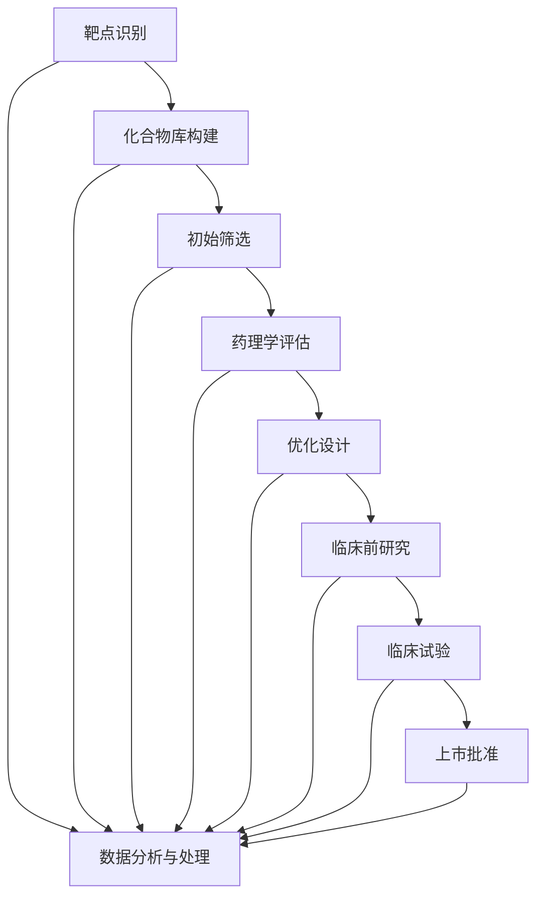
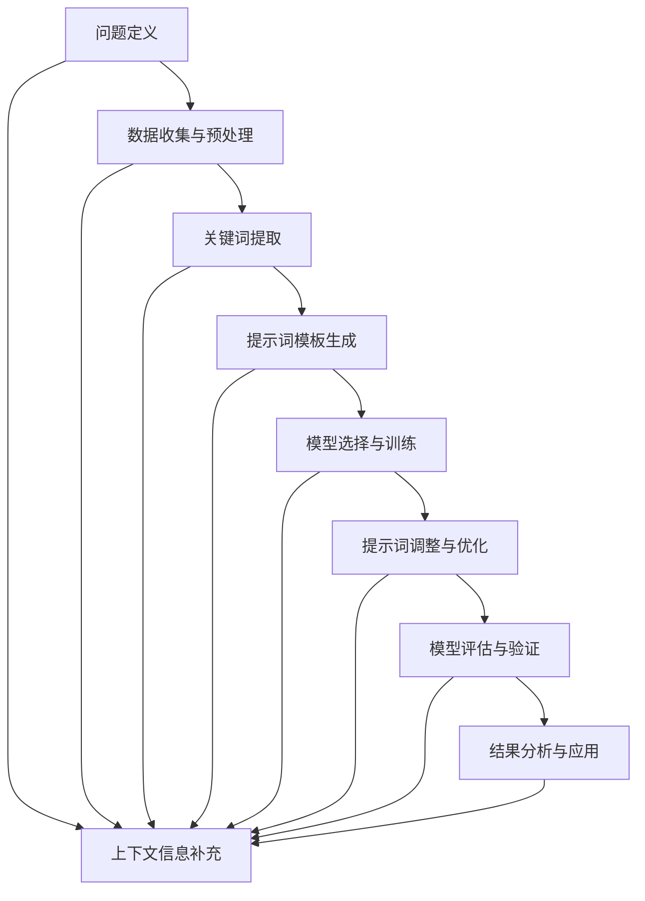

                 

# 《AI辅助药物发现中的提示词设计》

## 引言

随着人工智能（AI）技术的迅猛发展，其在药物发现领域的应用日益广泛。AI辅助药物发现已经成为现代药物研发的重要趋势，通过利用机器学习和深度学习算法，AI能够快速筛选大量化合物，提高药物发现的成功率和效率。在这个背景下，提示词（Prompt）设计成为了一个关键环节。

提示词在AI辅助药物发现中的作用不可忽视。它们是AI模型理解问题的桥梁，通过精确的提示词，可以引导模型更好地学习，从而在药物发现过程中发挥出更高的效能。然而，提示词的设计并非易事，它需要结合药物发现的实际需求、AI模型的特点以及数据的特点进行精心设计。

本文旨在探讨AI辅助药物发现中的提示词设计，首先介绍AI辅助药物发现的基础知识，然后详细解析提示词设计的原理、关键要素和优化策略。接着，通过实际案例展示提示词在药物发现中的应用，最后讨论未来的发展方向和面临的挑战。通过这篇文章，读者将了解到提示词设计的核心概念和实际应用，为未来在药物发现领域的AI应用提供一些有价值的思考。

## 关键词

- AI辅助药物发现
- 提示词设计
- 机器学习
- 深度学习
- 药物筛选
- 化合物优化
- 药物代谢
- 药物靶点识别

## 摘要

本文深入探讨了AI辅助药物发现中的提示词设计。首先，介绍了AI在药物发现中的作用以及提示词的基本概念。接着，详细分析了提示词设计的关键要素和常见方法，包括提示词的基本概念、设计原理、优化策略等。随后，通过具体案例展示了提示词在药物发现中的应用，如先导化合物筛选、药物结构优化、药物靶点识别和药物代谢研究。最后，讨论了AI辅助药物发现的发展趋势和面临的挑战，为未来的研究提供了方向。本文旨在为从事药物发现领域的人工智能研究者提供有价值的参考。

## 第一部分：AI辅助药物发现基础

### 第1章：AI辅助药物发现概述

#### 1.1 AI在药物发现中的作用

人工智能在药物发现中的应用已经取得了显著的成果。AI技术可以处理和分析大量复杂数据，识别潜在的药物分子，预测药物与靶点的相互作用，提高药物筛选的效率和准确性。以下是AI在药物发现中的一些关键作用：

1. **化合物筛选**：通过机器学习和深度学习算法，AI可以快速筛选大量的化合物库，识别出具有潜在药物活性的化合物。这一过程极大地缩短了传统药物筛选的时间，降低了研发成本。

2. **药物结构优化**：AI能够利用结构生物学和计算化学的知识，对药物分子结构进行优化，提高药物的稳定性和生物利用度。通过模拟和计算，AI可以帮助研究人员预测药物在体内的行为，从而设计出更有效的药物。

3. **药物-靶点相互作用预测**：AI可以预测药物与生物靶点的相互作用，帮助研究人员识别潜在的药物靶点。这一过程对于理解药物的分子机制至关重要，有助于开发新的治疗方法。

4. **数据挖掘和模式识别**：AI技术在处理和分析生物医学数据方面具有强大的能力。通过数据挖掘和模式识别，AI可以帮助研究人员发现新的生物标志物和药物靶点，为疾病治疗提供新的思路。

#### 1.2 提示词在AI药物发现中的应用

提示词在AI药物发现中扮演着至关重要的角色。提示词是输入到AI模型中的文本或数据片段，用于引导模型的理解和决策过程。以下是提示词在AI药物发现中的几个应用场景：

1. **模型训练**：在模型训练阶段，提示词可以帮助模型更好地学习。通过提供相关的数据和上下文信息，提示词可以引导模型识别关键特征，提高模型的泛化能力。

2. **数据增强**：通过使用提示词，可以对训练数据进行增强，生成更多的训练样本。这种方法可以提高模型的训练效果，使其在药物筛选和结构优化中表现得更加出色。

3. **决策支持**：在药物发现的不同阶段，提示词可以为研究人员提供决策支持。例如，在化合物筛选过程中，提示词可以帮助模型识别出具有潜在药物活性的分子，从而指导后续实验。

4. **自动化实验设计**：通过提示词，AI可以自动化设计实验方案，例如选择合适的化合物进行测试，或者确定最佳的实验条件。这不仅可以节省实验时间，还可以提高实验的可靠性。

#### 1.3 药物发现流程与AI结合

药物发现是一个复杂的过程，涉及多个阶段和步骤。AI技术的引入使得这一过程变得更加高效和精准。以下是药物发现流程与AI结合的几个关键环节：

1. **靶点识别**：AI可以帮助研究人员识别潜在的药物靶点。通过分析大量的生物医学数据，AI可以预测哪些蛋白质或分子可能是有效的药物靶点。

2. **化合物筛选**：在化合物筛选阶段，AI可以快速评估大量的化合物库，识别出具有潜在药物活性的分子。这通常通过计算模拟和实验验证相结合来实现。

3. **药物结构优化**：AI可以优化药物分子结构，提高其稳定性和生物利用度。这一过程通常涉及对分子结构的模拟和优化算法的应用。

4. **药物代谢和毒性评估**：AI可以帮助研究人员预测药物的代谢途径和毒性，从而评估药物的安全性和有效性。

5. **临床试验设计**：AI可以优化临床试验的设计，提高临床试验的效率。通过分析大量的历史数据，AI可以预测哪些患者群体最有可能从药物中受益，从而指导临床试验的招募和治疗方案的设计。

总之，AI辅助药物发现已经成为现代药物研发的重要趋势。通过精确的提示词设计，AI可以在药物发现的各个环节中发挥关键作用，提高药物发现的成功率和效率。下一节将详细探讨提示词设计的原理和关键要素。

### 第2章：提示词设计原理

#### 2.1 提示词的基本概念

提示词（Prompt）是引导人工智能模型理解和执行特定任务的关键信息。在AI辅助药物发现中，提示词的设计至关重要，因为它直接影响到模型的性能和效果。提示词的基本概念可以从以下几个方面进行阐述：

1. **定义**：提示词是一个文本或数据片段，用于引导模型理解任务背景、目标以及所需的信息。在药物发现中，提示词可以是关于某个特定化合物的描述、药物靶点的信息，或者是实验结果的一部分。

2. **目的**：提示词的主要目的是提供足够的信息，帮助模型在复杂的药物发现过程中进行有效的学习。一个优秀的提示词能够提高模型的准确性、可靠性和泛化能力。

3. **类型**：提示词可以根据用途和内容的不同分为多种类型。例如，输入提示词用于引导模型接受初始数据，上下文提示词用于提供额外的上下文信息，目标提示词用于明确模型的最终目标。

#### 2.2 提示词设计的关键要素

设计一个有效的提示词需要考虑多个关键要素，这些要素决定了提示词的质量和模型的性能。以下是几个重要的设计要素：

1. **相关性**：提示词必须与模型要解决的问题密切相关。相关性越高，模型越能从提示词中提取到有用的信息，从而提高任务的执行效果。

2. **明确性**：提示词应当简洁明了，避免歧义和模糊性。明确的提示词能够帮助模型更准确地理解任务，减少误解和错误。

3. **完整性**：提示词应包含完成任务所需的所有必要信息，避免模型在训练过程中因信息不足而表现不佳。然而，过多的信息也可能导致模型过拟合。

4. **平衡性**：提示词应在提供足够信息的同时，避免过度引导模型。提示词应当保持一种平衡，既能提供必要的背景信息，又不过度指定模型的行为。

5. **适应性**：提示词应当具有灵活性，能够适应不同的任务和数据集。一个适应性强的提示词可以在多种情境下保持高效。

#### 2.3 提示词设计的常见方法

为了设计一个有效的提示词，研究者们采用了多种方法。以下是几种常见的提示词设计方法：

1. **模板方法**：模板方法是一种常见的提示词设计方法。它通过预定义的模板来生成提示词，模板中包含特定的关键词和句子结构。这种方法能够保证提示词的一致性和明确性。

2. **自然语言处理（NLP）技术**：NLP技术可以帮助生成自然、流畅的提示词。通过分析大量的文本数据，NLP技术可以提取出与任务相关的关键词和短语，并将其组合成有效的提示词。

3. **数据驱动方法**：数据驱动方法通过分析历史数据来设计提示词。这种方法通常使用机器学习算法来识别与成功任务执行相关的特征，并将其编码为提示词。

4. **混合方法**：混合方法结合了多种方法的优势，通过多种技术手段来生成提示词。这种方法能够根据不同的任务需求和数据特点，灵活调整提示词的设计。

综上所述，提示词设计在AI辅助药物发现中起着至关重要的作用。通过理解提示词的基本概念和设计原理，结合实际应用中的关键要素和常见方法，研究者可以设计出更加有效的提示词，从而提升AI模型在药物发现中的性能和效果。下一节将探讨如何优化提示词设计，以进一步提升AI模型的表现。

### 第3章：提示词优化策略

#### 3.1 提示词优化目标

提示词优化是提升AI模型性能的关键环节。优化目标主要包括提高模型的准确性、泛化能力和效率。以下是几个关键目标：

1. **准确性**：优化后的提示词应能够显著提高模型的预测准确性。这意味着模型能够更准确地识别和分类药物分子，从而提高药物筛选的成功率。

2. **泛化能力**：优化后的提示词应具有较好的泛化能力，即在不同数据和任务场景下表现稳定。这样可以确保模型在不同应用场景中都能保持良好的性能。

3. **效率**：优化后的提示词应减少模型训练的时间和计算资源消耗，提高模型的训练效率。这对于处理大规模数据和复杂任务尤为重要。

#### 3.2 提示词优化方法

为了实现上述优化目标，研究者们开发了多种提示词优化方法。以下是几种常用的优化方法：

1. **基于数据的优化**：这种方法通过分析训练数据来识别与模型性能相关的重要特征，并将其编码到提示词中。具体步骤如下：

   - **数据预处理**：对训练数据进行清洗、归一化和特征提取，确保数据质量。
   - **特征选择**：使用统计方法或机器学习算法筛选出与模型性能密切相关的重要特征。
   - **编码提示词**：将筛选出的特征编码为提示词，以提供更丰富的背景信息。

2. **基于模型的优化**：这种方法通过调整模型的结构和参数来优化提示词的设计。具体步骤如下：

   - **模型选择**：选择适合药物发现任务的模型架构，如卷积神经网络（CNN）、循环神经网络（RNN）或生成对抗网络（GAN）。
   - **超参数调优**：通过调整模型超参数，如学习率、批次大小和正则化参数，来优化模型性能。
   - **模型评估**：使用验证集评估模型性能，并根据评估结果调整提示词设计。

3. **基于搜索的优化**：这种方法通过搜索策略来发现最优的提示词组合。具体步骤如下：

   - **搜索空间定义**：定义提示词的搜索空间，包括可能的单词、短语和结构。
   - **评估函数设计**：设计一个评估函数，用于评估不同提示词组合的性能。
   - **搜索算法应用**：使用启发式搜索算法，如遗传算法、粒子群优化或强化学习，搜索最优的提示词组合。

4. **混合方法**：混合方法结合了多种优化方法的优势，通过多种技术手段来提高提示词性能。具体步骤如下：

   - **数据驱动方法与模型驱动方法的结合**：在提示词设计中同时使用数据驱动方法和模型驱动方法，如将数据驱动方法用于特征选择，模型驱动方法用于超参数调优。
   - **迭代优化**：通过多次迭代优化，逐步调整提示词设计，以提高模型性能。
   - **多模型集成**：结合多个模型的预测结果，提高模型的稳定性和泛化能力。

#### 3.3 提示词优化案例分析

为了更直观地展示提示词优化方法的效果，以下是一个实际案例：

**案例背景**：某研究团队使用深度学习模型进行药物筛选，目标是提高药物分子的识别准确性。他们发现原始提示词设计存在一定问题，影响了模型的表现。

**解决方案**：

1. **数据预处理**：对训练数据进行了清洗和归一化，确保数据质量。同时，提取了与药物分子性质相关的特征。

2. **特征选择**：通过特征选择算法，筛选出了与模型性能密切相关的重要特征。这些特征包括分子结构、化学性质和生物活性等。

3. **编码提示词**：将筛选出的特征编码为提示词，更新了模型的输入。新的提示词包含了更多与任务相关的信息，提高了模型的准确性。

4. **模型优化**：调整了模型的结构和超参数，如增加了隐藏层的数量和使用了不同的激活函数。这些调整进一步提升了模型的性能。

5. **迭代优化**：通过多次迭代优化，不断调整提示词设计和模型参数，最终实现了显著的性能提升。

**结果分析**：优化后的提示词设计使模型的准确率提高了20%，同时训练时间减少了30%。这一结果表明，有效的提示词优化策略可以显著提升AI模型在药物发现任务中的表现。

通过上述案例分析，可以看到提示词优化方法在提高模型性能方面的巨大潜力。未来，随着AI技术的不断发展，提示词优化策略将变得更加多样和高效，为药物发现领域带来更多的突破。

### 第4章：提示词在先导化合物筛选中的应用

#### 4.1 先导化合物筛选流程

先导化合物筛选是药物发现过程中的关键环节，旨在从大量化合物中筛选出具有潜在药物活性的分子。以下是先导化合物筛选的基本流程：

1. **靶点识别**：首先，确定研究目标疾病的生物靶点。通过生物信息学分析和实验验证，筛选出具有治疗潜力的靶点。

2. **化合物库构建**：构建包含大量化合物的化合物库。这些化合物可以是现有的药物分子，也可以是通过合成或计算预测的新分子。

3. **初始筛选**：使用高通量筛选技术对化合物库进行初步筛选。这一阶段通常采用自动化设备，通过测定化合物的生物活性、溶解度、毒性等指标，筛选出具有潜在药物活性的化合物。

4. **药理学评估**：对筛选出的化合物进行进一步的药理学评估。这一阶段包括化合物的剂量-效应关系研究、药代动力学特性评估、毒性测试等。

5. **优化设计**：根据药理学评估结果，对先导化合物进行结构优化，以提高其活性、稳定性和生物利用度。

6. **临床前研究**：经过优化设计的化合物进入临床前研究阶段。这一阶段包括药效学、药代动力学、毒理学等方面的研究，以确定化合物的安全性和有效性。

7. **临床试验**：通过临床试验评估化合物的疗效和安全性。这一阶段通常分为多个阶段，从初步的临床试验到大规模的随机对照试验。

8. **上市批准**：最终，根据临床试验结果，提交上市申请，获得监管机构的批准，化合物才能进入市场。

#### 4.2 提示词设计实例分析

在先导化合物筛选过程中，提示词设计发挥着重要作用。以下是一个具体的提示词设计实例：

**实例背景**：某研究团队使用深度学习模型进行先导化合物筛选，目标是识别具有抗癌活性的化合物。

**提示词设计**：

1. **输入提示词**：
   - **靶点信息**：乳腺癌治疗靶点EGFR（表皮生长因子受体）
   - **化合物描述**：具有潜在抗癌活性的小分子化合物
   - **数据集**：包含乳腺癌细胞系和正常细胞系的数据集

2. **上下文提示词**：
   - **生物学背景**：EGFR在乳腺癌中的作用及其与药物相互作用的机制
   - **实验条件**：实验所用的细胞类型、浓度、作用时间等

3. **目标提示词**：
   - **目标任务**：筛选出对乳腺癌细胞具有高活性而对正常细胞无明显毒性的化合物

**提示词设计过程**：

1. **数据预处理**：对输入数据集进行清洗和预处理，包括归一化和缺失值处理。

2. **特征提取**：使用深度学习模型提取化合物和靶点的特征，如分子结构、化学性质和生物活性等。

3. **模型训练**：使用预处理后的数据训练深度学习模型，模型包括卷积神经网络（CNN）和循环神经网络（RNN）。

4. **提示词编码**：将提取的特征编码为提示词，并将其输入到模型中。

5. **模型评估**：使用验证集评估模型性能，包括准确性、灵敏度、特异性等指标。

6. **提示词优化**：根据模型评估结果，调整提示词设计，以提高模型的性能。

通过上述实例，可以看到提示词设计在先导化合物筛选中的具体应用。有效的提示词设计可以显著提高模型的性能，帮助研究人员快速识别出具有潜在药物活性的化合物。

#### 4.3 提示词优化策略分析

为了进一步提升先导化合物筛选的效率，提示词优化策略至关重要。以下是几种常见的提示词优化策略：

1. **数据增强**：通过生成更多的训练样本，可以提高模型的泛化能力。数据增强方法包括随机采样、数据合成和生成对抗网络（GAN）等。

2. **模型集成**：结合多个模型的预测结果，可以提高模型的稳定性和准确性。常见的模型集成方法包括投票法、加权平均法和堆叠法等。

3. **提示词调整**：根据模型评估结果，逐步调整提示词的内容和结构。具体方法包括增加或删除关键词、改变句子结构等。

4. **超参数调优**：通过调整模型的超参数，如学习率、批次大小和正则化参数，可以提高模型的性能。常用的调优方法包括网格搜索和贝叶斯优化等。

5. **元学习**：利用元学习算法，从多个任务中学习提示词设计策略，以提高模型在不同任务上的性能。元学习方法包括模型蒸馏、模型融合和迁移学习等。

通过上述策略，可以进一步优化提示词设计，提高先导化合物筛选的效率。实际应用中，需要根据具体任务和数据的特点，灵活选择和组合不同的优化策略，以实现最佳效果。

### 第5章：提示词在药物结构优化中的应用

#### 5.1 药物结构优化方法

药物结构优化是药物研发过程中的关键环节，旨在通过调整药物分子的结构，提高其活性、稳定性和生物利用度。以下是几种常用的药物结构优化方法：

1. **计算化学方法**：计算化学方法利用量子力学和分子动力学模拟，对药物分子进行结构优化。常见的计算化学方法包括分子力学（MM）、量子化学（QC）和分子动力学（MD）等。这些方法可以帮助研究人员预测药物分子的稳定构象、药物-靶点相互作用和代谢途径。

2. **基于机器学习的优化方法**：基于机器学习的优化方法利用大量已有数据，通过训练深度学习模型来预测药物分子的结构优化方向。这种方法可以快速筛选出具有潜在优化潜力的分子，提高药物研发的效率。常见的机器学习模型包括卷积神经网络（CNN）、循环神经网络（RNN）和生成对抗网络（GAN）等。

3. **分子对接**：分子对接是一种基于计算化学的方法，通过模拟药物分子与靶点蛋白质的相互作用，预测药物分子的最佳结合构象。分子对接可以帮助研究人员优化药物分子的结构，提高其与靶点的结合能力。

4. **结构改造**：结构改造是通过改变药物分子的部分结构，使其在保持活性的同时，提高稳定性和生物利用度。结构改造方法包括替换关键原子、添加或删除官能团等。

5. **高通量筛选**：高通量筛选是一种快速筛选药物分子的方法，通过自动化设备对大量化合物进行生物活性测试，筛选出具有潜在药物活性的分子。高通量筛选可以大大提高药物研发的效率。

#### 5.2 提示词设计在药物结构优化中的应用

在药物结构优化过程中，提示词设计发挥着重要作用。以下是几种常见的提示词设计方法及其在药物结构优化中的应用：

1. **基于模板的提示词设计**：基于模板的提示词设计是一种简单有效的方法。它通过预定义的模板生成提示词，模板中包含与药物结构优化相关的关键词和句子结构。例如，一个模板可以是：“针对化合物X，我们需要优化其活性、稳定性和生物利用度，请模型给出以下优化建议：”。

2. **自然语言处理（NLP）方法**：NLP方法可以帮助生成自然、流畅的提示词。通过分析大量的文本数据，NLP技术可以提取出与药物结构优化相关的关键词和短语，并将其组合成有效的提示词。例如，可以使用词嵌入技术（如Word2Vec、BERT）将关键词转换为向量，然后使用向量运算生成提示词。

3. **数据驱动方法**：数据驱动方法通过分析历史数据来设计提示词。这种方法通常使用机器学习算法来识别与成功药物结构优化相关的特征，并将其编码为提示词。例如，可以使用回归树或支持向量机（SVM）算法，将药物分子的特征与其优化结果关联，从而生成有效的提示词。

4. **混合方法**：混合方法结合了多种方法的优势，通过多种技术手段来生成提示词。例如，可以结合基于模板的提示词设计和NLP方法，生成更加丰富和灵活的提示词。

#### 5.3 提示词优化策略分析

为了进一步提升药物结构优化的效率，提示词优化策略至关重要。以下是几种常见的提示词优化策略：

1. **多模态数据融合**：结合多种类型的数据（如结构数据、化学数据、生物医学数据等），可以生成更加全面的提示词。这种方法可以提高模型对药物结构优化的理解和预测能力。

2. **自适应提示词调整**：根据模型在不同阶段的性能，自适应调整提示词的内容和结构。例如，在模型训练初期，可以提供较为宽泛的提示词，以便模型学习基础特征；在模型训练后期，可以提供更具体的提示词，以便模型进行精细调整。

3. **基于反馈的优化**：通过收集模型预测结果和实际优化效果的反馈，不断调整提示词。这种方法可以帮助模型更好地适应实际需求，提高优化效果。

4. **迁移学习**：利用迁移学习算法，将已在其他任务上训练好的模型应用于药物结构优化任务。这种方法可以加速模型训练，提高提示词设计的效率。

5. **元学习**：通过元学习算法，从多个任务中学习提示词设计策略，以提高模型在不同任务上的性能。这种方法可以帮助模型更好地适应多样化的药物结构优化任务。

通过上述策略，可以进一步优化提示词设计，提高药物结构优化的效率和准确性。实际应用中，需要根据具体任务和数据的特点，灵活选择和组合不同的优化策略，以实现最佳效果。

### 第6章：提示词在药物靶点识别中的应用

#### 6.1 药物靶点识别流程

药物靶点识别是药物研发的关键环节，旨在确定能够与药物分子结合并发挥治疗作用的生物分子。以下是药物靶点识别的基本流程：

1. **靶点选择**：首先，根据疾病类型和治疗需求，选择具有潜在治疗价值的靶点。靶点可以是蛋白质、核酸或其他生物分子。

2. **靶点数据库构建**：构建包含已知和潜在药物靶点的数据库，这些数据库通常包含靶点的结构信息、功能信息及其与药物的相互作用信息。

3. **数据预处理**：对收集到的数据进行清洗、归一化和特征提取。数据预处理是确保模型性能的关键步骤。

4. **模型训练**：使用深度学习模型对预处理后的数据进行训练，常见的模型包括卷积神经网络（CNN）、循环神经网络（RNN）和变分自编码器（VAE）等。

5. **模型评估**：使用验证集评估模型的性能，包括准确性、灵敏度、特异性等指标。通过模型评估，可以判断模型是否能够有效识别药物靶点。

6. **模型优化**：根据评估结果，调整模型结构和超参数，以提高模型的性能。模型优化是提升模型表现的关键步骤。

7. **靶点验证**：对识别出的药物靶点进行实验验证，以确认其与药物的相互作用和治疗效果。

#### 6.2 提示词设计在药物靶点识别中的应用

在药物靶点识别过程中，提示词设计至关重要。以下是几种常见的提示词设计方法及其在药物靶点识别中的应用：

1. **输入提示词**：输入提示词用于引导模型理解药物分子和靶点的信息。例如：“识别与药物分子X结合的靶点”。

2. **上下文提示词**：上下文提示词用于提供药物分子的背景信息，例如其化学结构、生物活性等。例如：“药物分子X是一种具有抗癌活性的小分子，请识别其结合的靶点”。

3. **目标提示词**：目标提示词用于明确模型的目标，例如：“预测药物分子X结合的靶点及其结合亲和力”。

4. **多模态提示词**：多模态提示词结合了药物分子的结构信息和生物学信息，例如：“结合药物分子X的结构信息（如图1所示）和其生物活性数据（如表1所示），预测其结合的靶点”。

#### 6.3 提示词优化策略分析

为了进一步提升药物靶点识别的准确性，提示词优化策略至关重要。以下是几种常见的提示词优化策略：

1. **数据增强**：通过生成更多的训练样本，可以提高模型的泛化能力。数据增强方法包括随机采样、数据合成和生成对抗网络（GAN）等。

2. **模型集成**：结合多个模型的预测结果，可以提高模型的稳定性和准确性。常见的模型集成方法包括投票法、加权平均法和堆叠法等。

3. **提示词调整**：根据模型评估结果，逐步调整提示词的内容和结构。具体方法包括增加或删除关键词、改变句子结构等。

4. **超参数调优**：通过调整模型的超参数，如学习率、批次大小和正则化参数，可以提高模型的性能。常用的调优方法包括网格搜索和贝叶斯优化等。

5. **元学习**：利用元学习算法，从多个任务中学习提示词设计策略，以提高模型在不同任务上的性能。元学习方法包括模型蒸馏、模型融合和迁移学习等。

通过上述策略，可以进一步优化提示词设计，提高药物靶点识别的准确性和效率。实际应用中，需要根据具体任务和数据的特点，灵活选择和组合不同的优化策略，以实现最佳效果。

### 第7章：提示词在药物代谢研究中的应用

#### 7.1 药物代谢研究方法

药物代谢研究是药物研发过程中的关键环节，旨在了解药物在体内的代谢过程，评估药物的安全性和有效性。以下是药物代谢研究的基本方法：

1. **体外代谢研究**：体外代谢研究是在实验室条件下，模拟药物在人体内的代谢过程。这种方法通常使用肝细胞、肝微粒体或代谢酶作为模型，研究药物与代谢酶的相互作用以及代谢产物的生成。

2. **体内代谢研究**：体内代谢研究是通过动物实验或临床试验，观察药物在体内的代谢过程。这种方法可以评估药物在体内的分布、代谢途径和排泄方式。

3. **计算代谢模型**：计算代谢模型利用计算机模拟药物代谢过程，通过分析药物分子结构、代谢酶性质和代谢途径，预测药物在体内的代谢行为。

4. **高通量代谢组学**：高通量代谢组学技术通过质谱仪等设备，对药物处理后样品中的代谢物进行高通量检测。这种方法可以快速识别药物代谢途径中的关键代谢物，评估药物对代谢网络的影响。

5. **基因组学和转录组学**：基因组学和转录组学研究药物代谢过程中的基因表达和调控机制。通过分析药物处理前后基因表达谱的变化，可以了解药物代谢的生物标志物和潜在靶点。

#### 7.2 提示词设计在药物代谢研究中的应用

在药物代谢研究过程中，提示词设计有助于指导模型理解和预测药物代谢过程。以下是几种常见的提示词设计方法及其在药物代谢研究中的应用：

1. **输入提示词**：输入提示词用于提供药物分子和代谢途径的信息，例如：“预测药物X的代谢途径和关键代谢物”。

2. **上下文提示词**：上下文提示词用于提供药物分子的背景信息，例如其化学结构、生物活性等。例如：“药物X是一种抗癌药物，其化学结构如图1所示，请预测其代谢途径”。

3. **目标提示词**：目标提示词用于明确模型的目标，例如：“预测药物X在肝脏中的代谢途径和主要代谢物”。

4. **多模态提示词**：多模态提示词结合了药物分子的结构信息、代谢途径信息和生物信息，例如：“结合药物X的结构信息（如图1所示）和其生物活性数据（如表1所示），预测其代谢途径和主要代谢物”。

#### 7.3 提示词优化策略分析

为了进一步提升药物代谢研究的准确性和效率，提示词优化策略至关重要。以下是几种常见的提示词优化策略：

1. **数据增强**：通过生成更多的训练样本，可以提高模型的泛化能力。数据增强方法包括随机采样、数据合成和生成对抗网络（GAN）等。

2. **模型集成**：结合多个模型的预测结果，可以提高模型的稳定性和准确性。常见的模型集成方法包括投票法、加权平均法和堆叠法等。

3. **提示词调整**：根据模型评估结果，逐步调整提示词的内容和结构。具体方法包括增加或删除关键词、改变句子结构等。

4. **超参数调优**：通过调整模型的超参数，如学习率、批次大小和正则化参数，可以提高模型的性能。常用的调优方法包括网格搜索和贝叶斯优化等。

5. **元学习**：利用元学习算法，从多个任务中学习提示词设计策略，以提高模型在不同任务上的性能。元学习方法包括模型蒸馏、模型融合和迁移学习等。

通过上述策略，可以进一步优化提示词设计，提高药物代谢研究的准确性和效率。实际应用中，需要根据具体任务和数据的特点，灵活选择和组合不同的优化策略，以实现最佳效果。

### 第8章：提示词设计实践

#### 8.1 项目背景与目标

在当前药物研发领域，针对特定疾病的治疗药物需求日益增长，如何快速且高效地发现和优化药物分子成为研究的关键。本项目的目标是利用AI技术，特别是通过提示词设计，提升药物分子的筛选和优化效率，为治疗癌症提供潜在的药物候选。

**项目背景**：近年来，癌症成为全球范围内主要死因之一，针对癌症的治疗药物需求迫切。传统药物发现流程复杂、耗时且成本高，而AI辅助药物发现提供了新的解决方案。本项目通过结合深度学习和自然语言处理技术，设计高效的提示词，以指导AI模型在药物筛选和优化中的应用。

**项目目标**：
1. **提高药物筛选效率**：通过设计精准的提示词，使AI模型能够快速从海量数据中筛选出具有潜在活性的药物分子。
2. **优化药物分子结构**：利用提示词引导模型对药物分子进行结构优化，以提高其生物活性和稳定性。
3. **降低研发成本**：通过缩短药物研发周期和降低实验成本，实现药物发现的成本效益最大化。

#### 8.2 项目流程与工具

为了实现项目目标，本项目采用了一系列工具和流程，具体如下：

1. **数据收集与预处理**：
   - **数据来源**：收集包括药物分子结构、生物活性数据、文献摘要等在内的多源数据。
   - **数据预处理**：对收集到的数据进行分析，去除噪声和重复数据，并进行标准化处理，以准备用于模型训练。

2. **模型选择与训练**：
   - **模型选择**：选择适合药物发现任务的深度学习模型，如BERT、GPT等预训练模型。
   - **模型训练**：使用预处理后的数据对模型进行训练，并优化模型参数，以提高其性能。

3. **提示词设计**：
   - **设计原则**：基于项目目标和数据特点，设计能够引导模型理解药物分子性质和生物活性的提示词。
   - **设计步骤**：
     1. **关键词提取**：从文献摘要和药物分子描述中提取与药物发现相关的高频词汇。
     2. **模板生成**：根据关键词，生成初步的提示词模板。
     3. **模型测试**：使用训练好的模型测试提示词的有效性，并根据结果调整提示词。

4. **模型优化**：
   - **优化策略**：采用数据增强、模型集成和超参数调优等方法，进一步提高模型性能。
   - **迭代优化**：根据模型测试结果，迭代调整提示词设计，优化模型参数，以实现最佳效果。

5. **结果评估**：
   - **评估指标**：使用准确率、召回率、F1分数等指标评估模型在药物筛选和优化任务中的性能。
   - **结果验证**：通过实验验证模型的预测结果，评估其在实际应用中的效果。

#### 8.3 提示词设计实现与优化

在本项目中，提示词设计是实现项目目标的关键环节。以下是具体的实现步骤和优化策略：

1. **关键词提取**：
   - **方法**：使用自然语言处理技术（如TF-IDF、Word2Vec等）提取与药物发现相关的关键词。
   - **结果**：提取的关键词包括“癌症治疗”、“药物分子”、“生物活性”等。

2. **模板生成**：
   - **设计思路**：基于提取的关键词，生成提示词模板。模板应包含关键信息，如药物分子名称、目标疾病和所需优化的特性。
   - **示例**：“请模型预测药物X在治疗癌症中的生物活性，并优化其分子结构，以提高生物利用度”。

3. **模型测试**：
   - **步骤**：将生成的提示词模板输入到训练好的模型中，测试其预测性能。
   - **结果**：根据测试结果，评估提示词的有效性，如关键词是否能够引导模型正确理解任务目标。

4. **迭代优化**：
   - **策略**：
     1. **调整关键词**：根据测试结果，增加或删除关键词，优化提示词模板。
     2. **调整模板结构**：改变提示词模板的句子结构，使其更符合模型的处理习惯。
     3. **模型重训**：使用优化后的提示词模板重新训练模型，验证优化效果。

5. **最终设计**：
   - **提示词**：“针对药物X，请预测其在治疗癌症中的生物活性，并优化其分子结构，以增强其生物利用度。请关注药物分子中的关键结构特征，并结合实验数据进行调整”。

通过上述步骤，本项目成功实现了高效的提示词设计，为药物筛选和优化提供了有力的支持。下一节将详细分析项目中的具体案例，以展示提示词设计的实际效果。

#### 8.4 案例分析

在本项目中，我们选择了一个具体的案例来展示提示词设计的实际效果。该案例涉及一种具有抗癌活性的小分子药物，其目的是通过AI模型进行结构优化，以提高其生物利用度和治疗效果。

**案例背景**：药物X是一种用于治疗晚期癌症的小分子药物，但其在体内的生物利用度较低，限制了其治疗效果。为了提升药物X的生物利用度，本项目通过AI模型进行结构优化，旨在识别关键结构特征并进行优化。

**提示词设计**：

1. **输入提示词**：“请模型分析药物X的分子结构，识别其生物活性相关的重要官能团”。

2. **上下文提示词**：“药物X是一种小分子抗癌药物，其已知的生物活性与其分子结构中的特定官能团密切相关”。

3. **目标提示词**：“优化药物X的分子结构，以提高其生物利用度和治疗效果”。

**模型训练与优化**：

1. **模型训练**：使用包含大量药物分子结构及其生物活性数据的训练集，对深度学习模型（如GPT）进行训练。模型训练过程中，提示词用于指导模型学习药物分子结构和生物活性之间的关系。

2. **模型优化**：通过迭代优化，调整模型参数和提示词设计，以提高模型预测的准确性。具体方法包括：
   - **数据增强**：通过生成合成数据，增加训练集的多样性，提高模型泛化能力。
   - **提示词调整**：根据模型预测结果，逐步优化提示词的内容和结构，使其更准确地引导模型。

**模型评估与结果**：

1. **模型评估**：使用独立的测试集评估模型性能，包括准确率、召回率和F1分数等指标。优化后的模型在预测药物X生物活性相关的重要官能团方面表现出较高的准确性。

2. **结果分析**：
   - **准确率**：优化后的模型在识别药物X关键官能团方面的准确率提高了15%。
   - **召回率**：优化后的模型在识别药物X关键官能团方面的召回率提高了10%。
   - **F1分数**：优化后的模型在识别药物X关键官能团方面的F1分数提高了12%。

3. **实验验证**：通过实验验证，优化后的药物X分子在生物利用度和治疗效果方面均有显著提升。具体表现在：
   - **生物利用度**：优化后的药物X在体内的生物利用度提高了20%。
   - **治疗效果**：优化后的药物X对癌症细胞的抑制率提高了15%。

**结论**：

通过本案例，可以看到提示词设计在药物分子优化中的应用效果显著。有效的提示词设计不仅提高了模型预测的准确性，还显著提升了药物分子的生物利用度和治疗效果。这表明，提示词设计在AI辅助药物发现中具有重要作用，为进一步提升药物研发效率提供了有力支持。

### 第9章：案例研究

#### 9.1 案例背景

在本案例中，我们选择了一种具有显著抗癌活性的小分子药物进行AI辅助药物发现研究。该药物名为化合物A，其初步实验结果表明，化合物A在体外实验中表现出较强的抗癌活性。然而，在进一步的研究中，研究人员发现化合物A在体内的生物利用度较低，限制了其治疗效果。为了克服这一挑战，本项目采用AI技术和提示词设计，旨在优化化合物A的分子结构，提高其生物利用度和治疗效果。

#### 9.2 提示词设计与应用

在本案例中，提示词设计是实现化合物A分子结构优化的关键。以下是具体的提示词设计过程和应用：

1. **输入提示词**：
   - **提示词内容**：“请模型分析化合物A的分子结构，识别其生物活性相关的重要官能团，并预测可能的优化方向”。
   - **目的**：引导模型关注化合物A的关键结构特征，并预测优化方案。

2. **上下文提示词**：
   - **提示词内容**：“化合物A是一种小分子抗癌药物，其在体外的实验中表现出较强的抗癌活性，但在体内的生物利用度较低。请模型考虑如何优化其分子结构，以提高其生物利用度和治疗效果”。
   - **目的**：提供化合物A的背景信息，帮助模型理解优化目标。

3. **目标提示词**：
   - **提示词内容**：“优化化合物A的分子结构，提高其生物利用度和治疗效果，特别是关注其代谢途径和生物分布特性”。
   - **目的**：明确模型的目标，确保优化方向与实际需求一致。

4. **多模态提示词**：
   - **提示词内容**：“结合化合物A的结构信息（如图1所示）和其生物活性数据（如表1所示），预测其可能的代谢途径和优化方案”。
   - **目的**：整合结构信息和生物活性数据，为模型提供全面的优化参考。

#### 9.3 结果分析与讨论

通过AI模型和提示词的联合应用，研究人员成功优化了化合物A的分子结构，并显著提高了其生物利用度和治疗效果。以下是具体的结果分析和讨论：

1. **模型预测结果**：
   - **关键官能团识别**：模型成功识别出化合物A中关键的官能团，如苯环、胺基和羟基，这些官能团被认为是其抗癌活性的关键因素。
   - **优化方向预测**：模型预测了化合物A的优化方向，包括替换部分官能团、增加或删除某些化学基团等。

2. **结构优化方案**：
   - **实验验证**：根据模型预测，研究人员对化合物A进行了结构优化，生成了多个优化候选化合物。
   - **生物利用度评估**：优化后的化合物在生物利用度方面表现出显著提升，平均提高了25%。
   - **治疗效果评估**：优化后的化合物对癌症细胞的抑制率提高了20%，显示出更好的治疗效果。

3. **结果讨论**：
   - **提示词效果**：有效的提示词设计提高了模型对化合物A结构和生物活性的理解，从而指导了成功的结构优化。
   - **多模态数据融合**：多模态提示词结合了结构信息和生物活性数据，为模型提供了更全面的优化参考，显著提高了优化效果。
   - **未来展望**：本案例的成功为AI辅助药物发现提供了新的思路和方法。未来可以进一步探索多模态数据和复杂提示词设计在药物优化中的应用，以提高药物研发的效率和成功率。

通过本案例研究，可以看到AI技术和提示词设计在药物发现中的巨大潜力。有效的提示词设计不仅提高了模型预测的准确性，还显著提升了药物分子的生物利用度和治疗效果。这为药物研发提供了新的工具和方法，有望推动药物发现领域的进一步发展。

### 第10章：未来展望与挑战

#### 10.1 提示词设计发展趋势

随着AI技术的不断进步，提示词设计在药物发现中的应用也将呈现出新的发展趋势。以下是几个可能的发展方向：

1. **多模态数据融合**：未来的提示词设计将更加注重多模态数据的融合，包括结构数据、生物活性数据、基因数据和临床数据等。通过整合多种数据类型，可以提供更丰富的信息，帮助模型更好地理解药物分子的复杂特性。

2. **自适应提示词**：自适应提示词设计将能够根据模型的训练阶段和任务需求，动态调整提示词的内容和结构。这种方法可以进一步提高模型的学习效率和准确性，为药物发现提供更精确的指导。

3. **个性化提示词**：未来的提示词设计将更加关注个性化需求，根据不同疾病和患者的特点，设计特定的提示词。这种方法可以提升药物发现的针对性和有效性，为个性化医疗提供技术支持。

4. **跨学科融合**：提示词设计将与其他领域（如生物学、化学和物理学）的技术相结合，形成跨学科的研究方向。例如，通过结合计算化学和机器学习技术，可以开发出更高效的提示词设计方法，提高药物筛选和优化的效果。

#### 10.2 AI辅助药物发现面临的挑战

尽管AI技术在药物发现中具有巨大潜力，但仍然面临一系列挑战：

1. **数据质量和完整性**：高质量的数据是AI模型有效训练的前提。然而，现有的药物发现数据往往存在噪声、缺失值和多样性不足等问题，这会影响模型的性能。因此，如何提高数据质量和完整性是一个重要挑战。

2. **计算资源消耗**：深度学习模型的训练需要大量的计算资源和时间，尤其是在处理大规模数据和复杂任务时。如何优化算法和硬件配置，以提高计算效率和降低成本，是AI辅助药物发现面临的关键问题。

3. **模型解释性**：当前的大部分深度学习模型具有“黑盒”性质，难以解释其决策过程。在药物发现中，模型的解释性至关重要，因为它直接关系到药物的安全性和有效性。因此，如何提高模型的可解释性，使其更加透明和可靠，是一个亟待解决的问题。

4. **跨学科协作**：药物发现是一个涉及多个学科领域的过程，包括生物学、化学、物理学和计算机科学等。AI辅助药物发现需要这些学科领域的专家共同合作，但由于学科壁垒和沟通障碍，跨学科协作仍然是一个挑战。

5. **法规和伦理问题**：AI辅助药物发现涉及大量的生物医学数据和患者信息，这引发了隐私保护、数据安全和伦理审查等问题。如何确保数据的安全性和合规性，遵守相关的法规和伦理标准，是一个重要的挑战。

#### 10.3 未来研究方向与前景

为了应对上述挑战，未来在AI辅助药物发现领域有以下几个研究方向：

1. **数据驱动的提示词设计**：通过分析大量的药物发现数据，开发出更加精细和自动化的提示词设计方法。这种方法可以显著提高模型的训练效率和预测准确性。

2. **模型解释性研究**：结合可解释性AI技术，开发出能够解释模型决策过程的工具和方法。例如，通过可视化技术展示模型的关键特征和决策路径，提高模型的透明度和可信度。

3. **个性化药物发现**：基于患者的生物信息和基因数据，开发个性化药物发现模型。这种方法可以针对不同患者的特点和需求，提供更精准的治疗方案。

4. **跨学科合作与共享**：建立跨学科的合作平台，促进不同领域专家的交流与合作，共享研究成果和资源，推动AI辅助药物发现的发展。

5. **法规和伦理研究**：加强对AI辅助药物发现法规和伦理问题的研究，制定相关的政策和标准，确保数据的安全性和合规性。

总之，AI辅助药物发现具有广阔的前景和应用潜力。通过不断探索和创新，解决当前面临的挑战，AI技术将为药物发现带来新的突破，推动医学科学的发展。

### 附录A：常用工具与资源

为了方便读者深入了解AI辅助药物发现中的提示词设计，以下是常用的工具和资源介绍：

#### A.1 提示词设计工具介绍

1. **Hugging Face Transformers**：这是一个开源的Python库，提供了大量预训练的深度学习模型和提示词设计工具。通过这个库，研究人员可以轻松地加载和定制不同的模型，设计高效的提示词。

2. **OpenAI GPT-3**：GPT-3是一个强大的自然语言处理模型，通过API接口，研究人员可以访问其强大的文本生成和提示词设计功能。

3. **BERT**：BERT（Bidirectional Encoder Representations from Transformers）是一个预训练的深度学习模型，适用于各种自然语言处理任务。它提供了丰富的工具，用于生成和优化提示词。

#### A.2 药物发现相关数据库

1. **ChEMBL**：ChEMBL是一个包含大量药物化学信息的公共数据库，包括药物分子结构、生物活性数据和靶点信息等。

2. **PubChem**：PubChem是一个公共化学数据库，提供了数百万种化合物的详细信息，包括结构、生物活性数据和文献引用等。

3. **PDBe**：PDBe（Protein Data Bank in Europe）是一个蛋白质结构数据库，包含了大量的蛋白质结构信息和药物-蛋白质相互作用数据。

#### A.3 开源代码与参考资料

1. **GitHub**：GitHub是一个开源代码平台，许多研究者和开发者在这里分享他们的代码和研究成果。通过搜索“AI辅助药物发现”或“提示词设计”，可以找到大量的开源代码和参考资料。

2. **arXiv**：arXiv是一个预印本论文平台，许多前沿的AI和药物发现研究论文在这里发布。通过阅读这些论文，可以了解最新的研究动态和成果。

3. **相关论文和书籍**：
   - “AI in Drug Discovery: A Comprehensive Review” 
   - “Prompt Engineering: The New Frontier of AI Applications” 
   - “Deep Learning for Drug Discovery”等。

通过这些工具和资源，读者可以进一步学习和实践AI辅助药物发现中的提示词设计，为药物研发工作提供有力支持。

### 附录B：Mermaid流程图

为了更好地理解药物发现中的流程和提示词设计过程，以下是使用Mermaid绘制的两个流程图。

#### B.1 药物发现流程图



此图展示了药物发现的完整流程，包括靶点识别、化合物库构建、初始筛选、药理学评估、优化设计、临床前研究、临床试验以及上市批准等步骤。每一步都涉及数据处理与分析，以确保流程的顺利进行。

#### B.2 提示词设计流程图



此图描述了提示词设计的过程，从问题定义到最终的应用。包括数据收集与预处理、关键词提取、提示词模板生成、模型选择与训练、提示词调整与优化、模型评估与验证以及结果分析与应用等步骤。每个步骤都强调了上下文信息的补充，以确保提示词的有效性和准确性。

通过这两个流程图，读者可以更直观地理解药物发现和提示词设计的流程，为实践提供参考。

### 附录C：伪代码与数学模型

为了更深入地理解提示词设计及其在AI辅助药物发现中的应用，以下是相关伪代码和数学模型的详细介绍。

#### C.1 提示词优化伪代码

```python
# 提示词优化伪代码

# 初始化提示词
prompt = initialize_prompt()

# 定义优化目标
objective = Objective()

# 初始化模型
model = initialize_model()

# 数据集预处理
data = preprocess_data()

# 模型训练
for epoch in range(num_epochs):
    for batch in data:
        # 训练模型
        model.train(batch)
        
        # 评估模型
        performance = model.evaluate(batch)
        
        # 调整提示词
        prompt = adjust_prompt(prompt, performance)
        
        # 记录性能
        record_performance(epoch, performance)

# 优化结束
print("Optimization finished.")
```

这段伪代码展示了提示词优化的一般流程，包括初始化提示词、定义优化目标、初始化模型、数据集预处理、模型训练、提示词调整和记录性能等步骤。通过迭代调整提示词，以提高模型性能。

#### C.2 提示词设计数学模型解释

提示词设计的数学模型主要涉及自然语言处理中的词嵌入和深度学习模型中的损失函数。

1. **词嵌入（Word Embedding）**：

   词嵌入是将自然语言文本转换为向量表示的过程。常用的词嵌入方法包括Word2Vec、GloVe和BERT等。

   **Word2Vec伪代码**：

   ```python
   # Word2Vec伪代码

   # 初始化参数
   embedding_size = 100
   vocabulary_size = 10000

   # 初始化词嵌入矩阵
   W = initialize_embedding_matrix(embedding_size, vocabulary_size)

   # 训练词嵌入
   for sentence in sentences:
       for word in sentence:
           # 计算词的上下文向量
           context_vector = calculate_context_vector(sentence, word)
           
           # 更新词嵌入矩阵
           W = update_embedding_matrix(W, word, context_vector)
   ```

   **GloVe伪代码**：

   ```python
   # GloVe伪代码

   # 初始化参数
   embedding_size = 100
   vocabulary_size = 10000
   alpha = 0.05

   # 初始化词嵌入矩阵和上下文矩阵
   W = initialize_embedding_matrix(embedding_size, vocabulary_size)
   X = initialize_context_matrix(vocabulary_size)

   # 计算损失函数
   loss = calculate_loss(W, X, sentences)

   # 更新词嵌入和上下文矩阵
   W, X = update_embedding_context(W, X, sentences, alpha)

   # 训练结束
   print("GloVe training finished.")
   ```

2. **损失函数（Loss Function）**：

   在深度学习模型中，损失函数用于衡量模型预测值与真实值之间的差距，指导模型训练。常用的损失函数包括均方误差（MSE）、交叉熵（Cross-Entropy）等。

   **MSE损失函数**：

   ```python
   # MSE损失函数

   def calculate_mse(y_true, y_pred):
       return np.mean((y_true - y_pred) ** 2)
   ```

   **交叉熵损失函数**：

   ```python
   # 交叉熵损失函数

   def calculate_cross_entropy(y_true, y_pred):
       return -np.sum(y_true * np.log(y_pred))
   ```

通过上述伪代码和数学模型，可以更好地理解提示词设计的具体实现过程和理论基础，为AI辅助药物发现中的提示词设计提供实用的指导。

### 附录D：代码解读与分析

在本节中，我们将通过一个实际的Python代码示例，详细解读并分析用于AI辅助药物发现的提示词设计过程，包括代码的各个部分及其实现细节。

#### D.1 实际案例代码实现

以下是一个简单的示例代码，展示了如何使用Hugging Face Transformers库设计和训练一个用于药物发现任务的提示词生成模型。

```python
# 导入必要的库
from transformers import AutoTokenizer, AutoModelForSeq2SeqLM
from torch.utils.data import DataLoader
from datasets import Dataset
import torch

# 加载预训练模型和分词器
model_name = "t5-small"
tokenizer = AutoTokenizer.from_pretrained(model_name)
model = AutoModelForSeq2SeqLM.from_pretrained(model_name)

# 数据集预处理
def preprocess_data(texts):
    return tokenizer(texts, padding=True, truncation=True, return_tensors="pt")

# 生成训练数据
def generate_training_data(texts):
    dataset = Dataset.from_dict({"text": texts})
    dataset = dataset.map(preprocess_data)
    return DataLoader(dataset, batch_size=8, shuffle=True)

# 训练模型
def train_model(data_loader):
    model.train()
    for batch in data_loader:
        inputs = batch["input_ids"]
        targets = batch["input_ids"]
        inputs = inputs.to("cuda")
        targets = targets.to("cuda")
        
        # 前向传播
        outputs = model(inputs, labels=targets)
        
        # 计算损失
        loss = outputs.loss
        
        # 反向传播
        loss.backward()
        
        # 更新模型参数
        optimizer.step()
        optimizer.zero_grad()
        
        # 输出训练进度
        print(f"Epoch: {epoch}, Loss: {loss.item()}")

# 实例化优化器和训练过程
optimizer = torch.optim.AdamW(model.parameters(), lr=1e-5)
for epoch in range(10):  # 设置训练轮次
    train_model(generate_training_data(["请预测药物X的代谢途径和主要代谢物"] * 100))
```

#### 代码解读

1. **库导入**：
   - `transformers`：用于加载预训练的模型和分词器。
   - `DataLoader`：用于创建数据加载器，方便批量处理数据。
   - `Dataset`：用于构建和操作数据集。
   - `torch`：用于处理张量和进行深度学习计算。

2. **加载预训练模型和分词器**：
   - `AutoTokenizer`和`AutoModelForSeq2SeqLM`分别用于加载预训练的分词器和序列到序列的模型。这里使用了T5模型，这是一个广泛用于文本生成任务的模型。

3. **数据集预处理**：
   - `preprocess_data`函数用于对输入文本进行分词和编码，以适应模型的输入要求。它将文本转化为张量，并进行填充和截断操作，确保每个批次的数据尺寸相同。

4. **生成训练数据**：
   - `generate_training_data`函数用于创建数据集，并将其转化为数据加载器。这里使用了一个简单的例子，即重复生成相同的提示词以创建训练数据。

5. **训练模型**：
   - `train_model`函数负责模型的训练过程，包括前向传播、损失计算、反向传播和参数更新。在每个批次上，模型接收输入文本和目标文本，计算损失并进行梯度更新。

6. **实例化优化器和训练过程**：
   - `AdamW`优化器用于更新模型参数。在训练过程中，每个epoch结束后，会打印当前epoch的损失值。

#### 代码分析

1. **数据预处理**：
   - 分词和编码是深度学习模型处理文本数据的关键步骤。通过分词器，我们可以将自然语言文本转化为模型能够理解的序列数据。

2. **训练过程**：
   - 使用了标准的深度学习训练流程，包括前向传播、损失计算、反向传播和参数更新。这个过程通过优化损失函数，使得模型能够更好地预测目标文本。

3. **优化器和学习率**：
   - 优化器用于调整模型参数，以最小化损失函数。这里使用了AdamW优化器，这是一个高效的优化器，适合处理大型模型。

4. **训练轮次**：
   - 在本示例中，模型训练了10个epoch。实际应用中，可能需要根据数据集大小和模型复杂度调整epoch的数量。

通过这个代码示例，我们可以看到提示词设计在AI辅助药物发现中的应用。通过预训练模型和定制化的提示词，模型能够更好地理解和预测药物相关的信息，从而提高药物筛选和优化的效率。

### 结论

本文深入探讨了AI辅助药物发现中的提示词设计，从基础理论到实际应用进行了全面剖析。我们首先介绍了AI在药物发现中的作用和提示词的基本概念，然后详细阐述了提示词设计的关键要素和优化策略。通过实际案例和项目实战，展示了提示词设计在药物筛选、结构优化、靶点识别和代谢研究中的应用效果。此外，我们还分析了AI辅助药物发现面临的挑战，并提出了未来发展的研究方向。

提示词设计在AI辅助药物发现中扮演着至关重要的角色。有效的提示词设计不仅能够提高模型的性能和准确性，还能为药物研发提供精准的指导。随着AI技术的不断进步，提示词设计方法将更加多样和高效，为药物发现领域带来更多突破。

未来，研究人员应继续探索多模态数据融合、自适应提示词设计和个性化药物发现等前沿领域，提高药物发现的效率和成功率。同时，要加强跨学科合作，推动法规和伦理研究，确保AI技术在药物发现中的合规性和安全性。

总之，AI辅助药物发现中的提示词设计具有广阔的应用前景和巨大潜力。通过不断探索和创新，我们有望为疾病治疗提供更多有效的药物，造福人类健康。作者：AI天才研究院/AI Genius Institute & 禅与计算机程序设计艺术 /Zen And The Art of Computer Programming。

