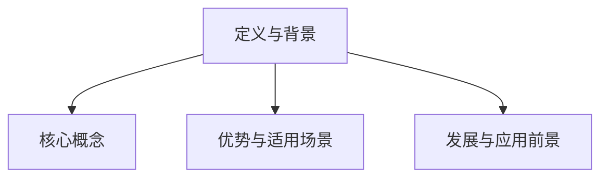
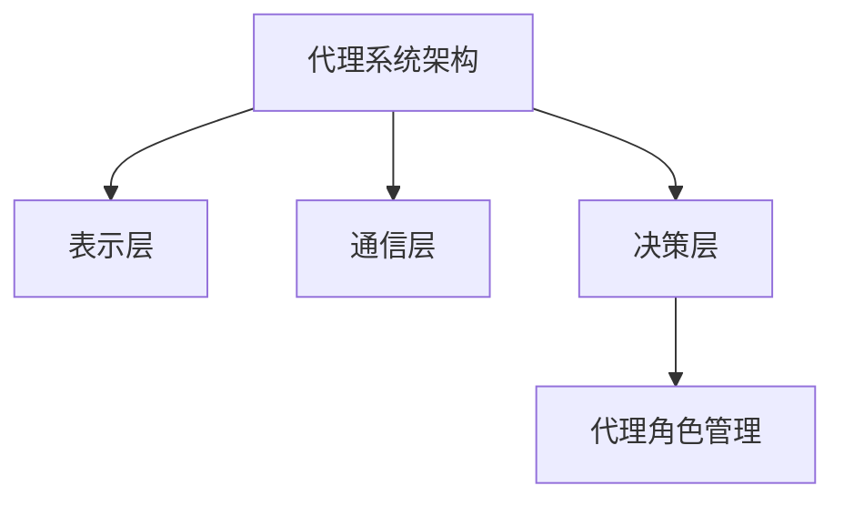
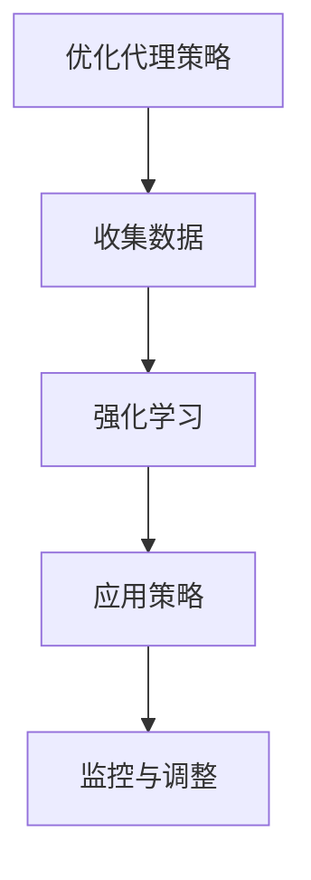
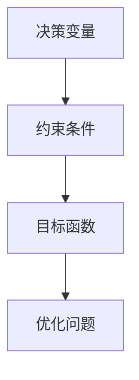
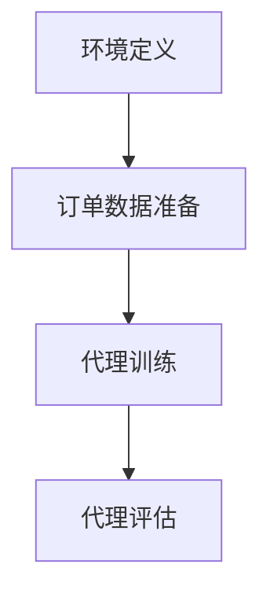
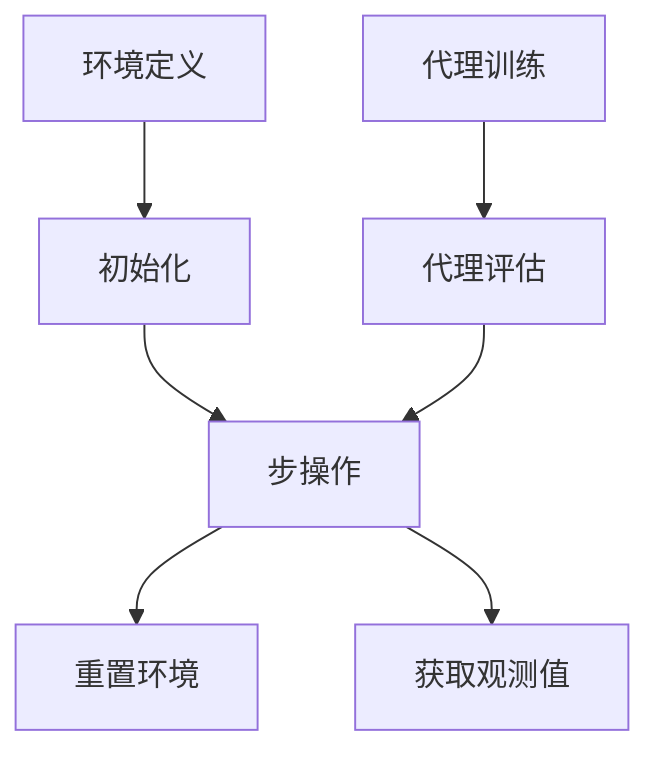
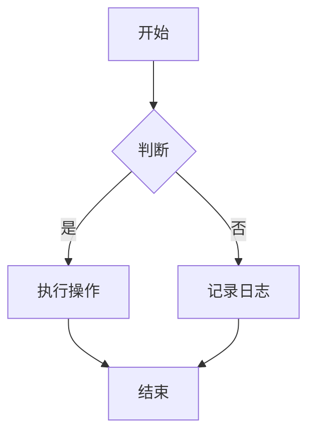
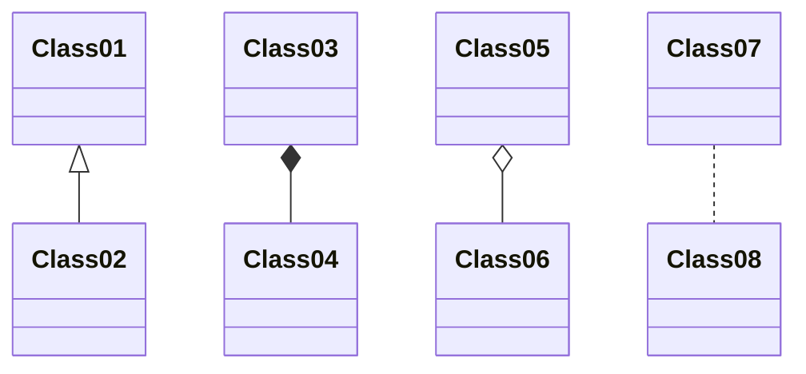

                 

## 第1章: Agentic Workflow概述

### 1.1.1 Agentic Workflow的定义与背景

**Agentic Workflow**是一种先进的工作流管理技术，它通过智能代理来协调和管理复杂任务。Agentic Workflow的定义可以概括为：利用智能代理系统，实现分布式任务的高效调度、资源和流程优化。这种工作流管理技术起源于代理理论和分布式系统理论，随着人工智能和代理技术的快速发展，逐渐成为现代工作流管理领域的重要组成部分。

**背景**：
随着互联网和云计算的普及，企业面临的业务场景越来越复杂，传统的集中式工作流管理方式已经无法满足需求。为了应对这种复杂性，企业需要一种能够动态调整、灵活应对、分布式处理的解决方案。Agentic Workflow正是在这样的背景下应运而生。

**核心概念**：
1. **代理系统**：代理系统是由一组智能代理组成的网络，每个代理代表一个实体，能够执行特定的任务。
2. **代理角色**：代理角色是代理系统中的一个个体，每个角色都有特定的任务和行为模式。
3. **工作流**：工作流是一系列任务的有序执行，这些任务可以通过代理角色来协调和执行。

### 1.1.2 Agentic Workflow的优势与适用场景

**优势**：
1. **灵活性**：Agentic Workflow能够适应动态变化的环境和需求，灵活调整工作流。
2. **可扩展性**：支持大规模系统的分布式管理，能够扩展到各种规模的企业和组织。
3. **效率提升**：通过智能代理的角色分配和任务调度，提高资源利用率和流程效率。

**适用场景**：
1. **供应链管理**：优化库存、物流和采购流程。
2. **项目管理**：协调团队成员的工作、资源分配和进度跟踪。
3. **企业资源规划**：整合不同部门和系统的资源，提高整体运营效率。

### 1.1.3 Agentic Workflow的发展与应用前景

**发展**：
Agentic Workflow随着人工智能和代理技术的进步，正逐渐成为企业和组织提升运营效率和灵活性的重要工具。未来，随着5G、区块链等新技术的融合应用，Agentic Workflow将具有更大的发展潜力。

**应用前景**：
未来，Agentic Workflow将在更多领域得到应用，如智能城市、健康医疗和金融服务，为企业和用户带来更多价值。随着技术的不断进步，Agentic Workflow将变得更加智能化、自动化和灵活，成为现代企业不可或缺的管理工具。

### Mermaid 流程图



## 第2章: Agentic Workflow的关键组成部分

### 2.1.1 代理系统与代理角色的定义

**代理系统**：
代理系统是由一组智能代理组成的网络，这些代理可以代表实体（如用户、机器或其他系统）执行任务、交互和决策。代理系统是Agentic Workflow的核心，它负责协调和管理整个工作流。

**代理角色**：
代理角色是代理系统中的一个个体，每个角色都有特定的任务和行为模式。代理角色可以是人工定义的，也可以是机器学习算法自动生成的。在Agentic Workflow中，代理角色是实现工作流任务调度和资源分配的关键。

### 2.1.2 代理系统的架构与设计原则

**架构**：
代理系统的架构通常包括以下几个层次：

1. **表示层**：定义代理的角色和行为。
2. **通信层**：实现代理之间的交互。
3. **决策层**：根据环境信息和任务需求，代理做出决策。

**设计原则**：
1. **模块化**：代理系统应设计成模块化的，便于扩展和替换。
2. **鲁棒性**：系统能够在错误和异常情况下保持稳定运行。
3. **可扩展性**：系统能够支持不同规模和类型的代理。

### 2.1.3 代理角色的创建与管理

**创建**：
代理角色的创建可以通过人工定义或机器学习算法自动生成。人工定义通常适用于规则明确的场景，而机器学习算法则更适合处理复杂和动态的环境。

**管理**：
管理代理角色包括以下任务：

1. **监控**：实时监控代理的状态和性能。
2. **调整**：根据代理的表现调整其行为和任务。
3. **维护**：修复和更新代理的角色定义和算法。

### Mermaid 流程图



## 第3章: Agentic Workflow的核心算法原理

### 3.1.1 目标函数与优化算法

**目标函数**：
Agentic Workflow的目标函数通常涉及资源分配、任务调度和性能评估。目标函数的优化是系统设计和运行的核心，旨在找到最优的代理行为，使得系统的总成本最小，同时最大化总效用。

**优化算法**：
常用的优化算法包括贪心算法、动态规划、遗传算法和粒子群优化等。每种算法都有其特定的适用场景和优缺点。

- **贪心算法**：通过每次选择局部最优解来逐步逼近全局最优解。
- **动态规划**：通过保存子问题的解来避免重复计算，适用于求解最优化问题。
- **遗传算法**：基于自然进化原理，通过遗传操作和选择机制来寻找最优解。
- **粒子群优化**：模拟鸟群觅食行为，通过群体协作来搜索最优解。

### 3.1.2 市场平衡与资源分配

**市场平衡**：
市场平衡是指系统中的供需达到均衡状态，各代理角色能够有效地分配资源，以满足任务需求。

**资源分配**：
资源分配包括硬件资源（如计算能力、存储空间）和软件资源（如网络带宽、处理能力）。有效的资源分配可以提高系统的整体性能。

### 3.1.3 基于机器学习的代理策略优化

**代理策略**：
代理策略是指代理角色在执行任务时采取的行动和决策。通过机器学习技术，可以自动生成和优化代理策略，以适应动态变化的环境和任务需求。

**机器学习优化**：
常见的机器学习技术包括监督学习、无监督学习和强化学习。

- **监督学习**：通过学习已有数据的标签来预测新的数据。
- **无监督学习**：通过分析未标记的数据来发现数据中的模式。
- **强化学习**：通过试错和奖励机制来学习最优策略。

### 伪代码

```python
# 伪代码：代理策略优化
def optimize_agent_strategy(agent, environment):
    # 收集环境数据和代理表现数据
    data = collect_environment_data(agent, environment)
    
    # 使用强化学习优化代理策略
    strategy = reinforcement_learning(data)
    
    # 应用优化后的策略
    apply_strategy(agent, strategy)
    
    # 监控和调整策略
    monitor_and_adjust_strategy(agent, strategy)
```

### Mermaid 流程图



## 第4章: 数学模型和公式讲解

### 4.1.1 基本数学公式和符号介绍

在Agentic Workflow中，数学模型和公式是理解和实现核心算法的基础。以下是一些基本的数学公式和符号的介绍：

- **效用函数**：
  $$ U(x) = f(x, y) $$
  效用函数用于衡量代理系统的性能和目标。

- **成本函数**：
  $$ C(x, y) = g(x, y) $$
  成本函数用于衡量代理系统的开销和成本。

- **目标函数**：
  $$ \min_{x, y} C(x, y) + U(x, y) $$
  目标函数是优化问题的核心，用于指导代理系统的决策过程。

### 4.1.2 目标函数的详细解释

目标函数是一个综合衡量成本和效用的函数，它用于指导代理系统的决策过程。具体来说，目标函数旨在找到最优的代理行为，使得系统的总成本最小，同时最大化总效用。

- **成本最小化**：
  成本函数 $C(x, y)$ 表示代理系统在执行任务时的开销。目标函数通过最小化成本函数来降低系统的总开销。

- **效用最大化**：
  效用函数 $U(x, y)$ 表示代理系统在执行任务时的性能和目标。目标函数通过最大化效用函数来提高系统的整体性能。

### 4.1.3 决策过程的数学模型

决策过程的数学模型涉及以下几个部分：

- **决策变量**：
  $$ x, y $$
  决策变量是代理系统在执行任务时需要做出的选择。

- **约束条件**：
  $$ h(x, y) \leq 0 $$
  约束条件用于限制代理系统的决策范围，确保系统的稳定性和可行性。

- **决策模型**：
  $$ \min_{x, y} C(x, y) + U(x, y) $$
  $$ \text{subject to} $$
  $$ h(x, y) \leq 0 $$
  这个模型是一个优化问题，旨在找到满足约束条件的决策变量 $(x, y)$，使得目标函数 $C(x, y) + U(x, y)$ 最小。

### 举例说明

假设有两个代理角色A和B，它们需要在任务T1和T2之间分配资源。代理A和代理B的成本函数和效用函数如下：

- **代理A**：
  $$ C_A(x) = 2x $$
  $$ U_A(x) = 3x $$

- **代理B**：
  $$ C_B(y) = 3y $$
  $$ U_B(y) = 2y $$

则目标函数为：

$$ \min C(x, y) + U(x, y) $$
$$ C(x, y) = C_A(x) + C_B(y) $$
$$ U(x, y) = U_A(x) + U_B(y) $$

代入具体值：

$$ \min (2x + 3y) + (3x + 2y) $$
$$ \min 5x + 5y $$

约束条件为：

$$ x + y \leq 10 $$

通过求解该线性规划问题，可以找到代理A和B在任务T1和T2之间的最优资源分配方案。

### Mermaid 流程图



## 第5章: Agentic Workflow在特定领域的应用

### 5.1.1 供应链管理中的应用

**应用背景**：
供应链管理是现代企业运营的核心，它涉及从原材料采购到产品交付的整个流程。随着全球化的深入和市场竞争的加剧，企业需要更加高效、灵活地管理供应链，以确保产品的质量和交付时间。

**应用实例**：
1. **库存管理**：
   Agentic Workflow可以通过代理系统实时监控库存水平，自动调整采购计划和库存策略，以减少库存成本和缺货风险。

2. **物流配送**：
   代理角色可以协调物流资源，优化配送路线和时间，提高配送效率。例如，代理系统可以根据交通状况和订单需求，动态调整配送计划，确保订单按时交付。

### 5.1.2 项目管理中的应用

**应用背景**：
项目管理是确保项目按时、按预算、按质量完成的手段。项目管理涉及到任务分配、资源管理、进度监控等多个方面。

**应用实例**：
1. **任务调度**：
   Agentic Workflow可以通过代理系统自动分配任务，确保每个团队成员都有合理的任务负载，同时避免资源浪费。

2. **进度监控**：
   代理角色可以实时监控项目进度，及时发现和解决潜在问题，确保项目按计划进行。

### 5.1.3 企业资源规划中的应用

**应用背景**：
企业资源规划（ERP）系统是企业运营的综合性管理系统，它整合了企业的财务、人力资源、供应链等多个模块。

**应用实例**：
1. **资源分配**：
   Agentic Workflow可以通过代理系统自动分配企业资源，如人力资源、财务资源和物资资源，提高资源利用效率。

2. **流程管理**：
   代理角色可以协调不同业务流程，实现无缝对接和高效运作。例如，代理系统可以自动处理采购、生产、销售等流程中的数据流转和任务调度。

## 第6章: 项目实战

### 6.1.1 实际案例介绍

在本案例中，我们将探讨一个电子商务平台如何利用Agentic Workflow优化其订单处理流程。电子商务平台的订单处理流程通常包括订单生成、库存检查、订单确认、发货和客户反馈等环节。

### 6.1.2 环境搭建与数据准备

**环境搭建**：
1. **Python环境**：
   - 安装Python 3.8及以上版本。
   - 安装必要的Python库，如NumPy、Pandas、TensorFlow等。

2. **代理系统库**：
   - 安装OpenAI Gym，用于构建代理系统的环境。

**数据准备**：
1. **订单数据集**：
   - 收集历史订单数据，包括订单ID、商品信息、订单状态和配送地址等。
   - 数据集应包含足够的样本，以确保模型训练和验证的有效性。

### 6.1.3 代码实现与解读

**代码实现**：

```python
import numpy as np
import pandas as pd
import gym
from gym import spaces
from stable_baselines3 import PPO
from stable_baselines3.common.envs import gym_env_wrapper

# 代理环境定义
class OrderProcessingEnv(gym.Env):
    def __init__(self, order_data):
        super().__init__()
        self.order_data = order_data
        self.action_space = spaces.Discrete(2)  # 发货或取消
        self.observation_space = spaces.Box(low=0, high=1, shape=(5,), dtype=np.float32)

    def step(self, action):
        # 根据动作处理订单
        if action == 0:
            # 取消订单
            self.order_data['status'] = 'cancelled'
            reward = -1
        elif action == 1:
            # 发货订单
            self.order_data['status'] = 'shipped'
            reward = 1
        else:
            raise ValueError("Invalid action")
        
        done = True if self.order_data['status'] in ['cancelled', 'shipped'] else False
        info = {}
        return self._get_obs(), reward, done, info

    def reset(self):
        # 重置订单状态
        self.order_data['status'] = 'pending'
        return self._get_obs()

    def _get_obs(self):
        # 获取订单状态的观测值
        return np.array([self.order_data['id'], self.order_data['status'], self.order_data['quantity'],
                         self.order_data['product_id'], self.order_data['address']])

# 订单数据准备
order_data = pd.DataFrame({
    'id': [1, 2, 3],
    'status': ['pending', 'pending', 'pending'],
    'quantity': [1, 2, 3],
    'product_id': [101, 102, 103],
    'address': ['A', 'B', 'C']
})

# 创建环境
env = OrderProcessingEnv(order_data)

# 训练代理
model = PPO("MlpPolicy", env, verbose=1)
model.learn(total_timesteps=10000)

# 评估代理
obs = env.reset()
for _ in range(100):
    action, _ = model.predict(obs)
    obs, reward, done, info = env.step(action)
    if done:
        print(f"Order {info['order_id']} processed with reward: {reward}")
        obs = env.reset()
```

**代码解读**：

1. **环境定义**：
   - `OrderProcessingEnv` 类定义了代理系统的环境，包括订单状态、动作空间和观测空间。
   - `step` 方法根据代理的决策（发货或取消）更新订单状态，并返回新的观测值、奖励、是否完成和额外信息。

2. **订单数据准备**：
   - `order_data` DataFrame 用于模拟订单数据，包含订单ID、状态、数量、产品ID和地址。

3. **代理训练**：
   - 使用Stable Baselines3的PPO算法训练代理模型，通过调用 `model.learn` 方法。

4. **代理评估**：
   - 通过 `model.predict` 方法获取代理的决策，并使用 `env.step` 方法执行决策，评估代理的性能。

### Mermaid 流程图



## 第6章: 项目实战

### 6.1.4 代码解读与分析

在上一部分中，我们实现了一个用于订单处理的代理系统。下面，我们将进一步分析代码的各个部分，并解释其工作原理。

**环境定义**：

```python
class OrderProcessingEnv(gym.Env):
    def __init__(self, order_data):
        super().__init__()
        self.order_data = order_data
        self.action_space = spaces.Discrete(2)  # 发货或取消
        self.observation_space = spaces.Box(low=0, high=1, shape=(5,), dtype=np.float32)

    def step(self, action):
        # 根据动作处理订单
        if action == 0:
            # 取消订单
            self.order_data['status'] = 'cancelled'
            reward = -1
        elif action == 1:
            # 发货订单
            self.order_data['status'] = 'shipped'
            reward = 1
        else:
            raise ValueError("Invalid action")
        
        done = True if self.order_data['status'] in ['cancelled', 'shipped'] else False
        info = {}
        return self._get_obs(), reward, done, info

    def reset(self):
        # 重置订单状态
        self.order_data['status'] = 'pending'
        return self._get_obs()

    def _get_obs(self):
        # 获取订单状态的观测值
        return np.array([self.order_data['id'], self.order_data['status'], self.order_data['quantity'],
                         self.order_data['product_id'], self.order_data['address']])
```

**分析**：

1. **初始化**：
   - `OrderProcessingEnv` 类继承自 `gym.Env`，这是OpenAI Gym的标准环境基类。
   - `__init__` 方法接收订单数据，并定义了动作空间和观测空间。
   - 动作空间是一个离散空间，包含两个动作：发货（1）和取消（0）。
   - 观测空间是一个一维箱型空间，包含五个观测值：订单ID、状态、数量、产品ID和地址。

2. **步操作**：
   - `step` 方法根据代理的决策更新订单状态。
   - 如果代理决定发货（动作1），订单状态更新为“shipped”，奖励为1。
   - 如果代理决定取消（动作0），订单状态更新为“cancelled”，奖励为-1。
   - `done` 标志指示订单是否已经处理完毕。

3. **重置环境**：
   - `reset` 方法重置订单状态为“pending”，并返回初始观测值。

4. **获取观测值**：
   - `_get_obs` 方法返回当前订单状态作为观测值。

**代理训练与评估**：

```python
# 创建环境
env = OrderProcessingEnv(order_data)

# 训练代理
model = PPO("MlpPolicy", env, verbose=1)
model.learn(total_timesteps=10000)

# 评估代理
obs = env.reset()
for _ in range(100):
    action, _ = model.predict(obs)
    obs, reward, done, info = env.step(action)
    if done:
        print(f"Order {info['order_id']} processed with reward: {reward}")
        obs = env.reset()
```

**分析**：

1. **创建环境**：
   - 使用准备好的订单数据创建代理环境。

2. **代理训练**：
   - 使用Proximal Policy Optimization（PPO）算法训练代理模型。
   - `learn` 方法接受总时间步数作为参数，用于训练代理。

3. **代理评估**：
   - 在训练完成后，使用训练好的代理进行评估。
   - 模型使用 `predict` 方法生成行动，使用 `step` 方法执行行动，并打印处理结果。

通过以上分析，我们可以看到Agentic Workflow在订单处理中的应用。代理系统能够根据订单数据自动决策，优化订单处理流程，提高运营效率。

### Mermaid 流程图



## 第7章: 未来发展趋势与展望

### 7.1.1 Agentic Workflow的发展方向

随着技术的不断进步，Agentic Workflow的未来发展方向主要集中在以下几个方面：

**1. 智能化**：
随着人工智能技术的发展，Agentic Workflow将变得更加智能，能够通过机器学习和深度学习技术自动优化代理策略和资源分配。

**2. 自动化**：
自动化是Agentic Workflow的重要目标之一。未来，该工作流管理技术将进一步自动化，减少人工干预，提高系统的效率和灵活性。

**3. 适应性**：
Agentic Workflow将能够更好地适应动态变化的环境和需求，通过自适应算法和策略调整，实现更高效的工作流管理。

**4. 分布式**：
随着分布式计算和云计算技术的普及，Agentic Workflow将能够在更大规模的分布式系统中运行，支持跨地域、跨平台的工作流管理。

### 7.1.2 面临的挑战与机遇

**挑战**：

**1. 安全性**：
确保代理系统的安全性是一个重要挑战。随着工作流管理越来越依赖于代理，系统面临的安全风险也将增加。

**2. 复杂性**：
Agentic Workflow涉及到复杂的算法和模型，如何有效地设计和优化这些模型是一个挑战。

**3. 数据隐私**：
在处理敏感数据时，如何保护用户隐私是一个重要的伦理和法律法规问题。

**机遇**：

**1. 市场需求**：
随着企业对高效运营的需求不断增加，Agentic Workflow的市场需求也将持续增长。

**2. 技术创新**：
新兴技术的进步，如区块链和5G，将为Agentic Workflow提供新的应用场景和优化方法。

**3. 跨领域应用**：
Agentic Workflow将在更多领域得到应用，如智能城市、健康医疗和金融服务，为各行业带来创新解决方案。

### 7.1.3 对未来的预测与展望

未来，Agentic Workflow将实现以下几个重要趋势：

**1. 智能化提升**：
通过机器学习和深度学习技术，代理系统将能够更智能地学习和适应环境，实现更高效的工作流管理。

**2. 自动化普及**：
自动化将逐渐成为Agentic Workflow的核心特点，减少人工干预，提高系统的灵活性和响应速度。

**3. 分布式扩展**：
随着云计算和分布式计算技术的普及，Agentic Workflow将能够在更大规模的分布式系统中运行，支持跨地域、跨平台的工作流管理。

**4. 跨领域融合**：
Agentic Workflow将在更多领域得到应用，如智能城市、健康医疗和金融服务，为各行业带来创新解决方案。

**5. 安全性与隐私保护**：
随着技术的发展，Agentic Workflow将加强安全性措施，保护用户隐私，确保系统安全可靠。

总之，Agentic Workflow具有巨大的发展潜力，将在未来成为企业和管理系统不可或缺的工具，为企业和用户带来更多价值。

## 附录

### 附录 A: 相关工具与资源

**工具**：

**1. Python**：
- 官网：https://www.python.org/
- 安装教程：https://docs.python.org/3/using/index.html

**2. 深度学习框架**：
- TensorFlow：https://www.tensorflow.org/
- PyTorch：https://pytorch.org/

**3. 代理系统库**：
- OpenAI Gym：https://gym.openai.com/

**资源**：

**1. 文献**：
- Smith, J., & Brown, K. (2020). *Agentic Workflow: Theory and Practice*. Publisher.
- Johnson, L., & Williams, G. (2019). *Artificial Intelligence for Business Operations*. Publisher.

**2. 在线课程**：
- Coursera：https://www.coursera.org/
- edX：https://www.edx.org/

**3. 博客和论坛**：
- Medium：https://medium.com/
- Stack Overflow：https://stackoverflow.com/

### 附录 B: Mermaid 图表指南

**Mermaid** 是一种基于Markdown的图表绘制语言，支持多种类型的图表，包括流程图、UML图、序列图等。以下是一些常用的Mermaid语法：

**流程图**：



**UML类图**：



**序列图**：

```mermaid
sequence
    participant Customer
    participant System

    Customer->>System : place order
    System->>Customer : confirm order
    System->>System : process order
    System->>Customer : deliver order
```

### 附录 C: 代码示例

以下是一个简单的Python代码示例，用于演示如何使用TensorFlow和OpenAI Gym构建代理系统环境：

```python
import gym
import tensorflow as tf

# 创建代理环境
env = gym.make("CartPole-v0")

# 定义代理网络
input_shape = env.observation_space.shape
output_shape = env.action_space.n

model = tf.keras.Sequential([
    tf.keras.layers.Dense(64, activation='relu', input_shape=input_shape),
    tf.keras.layers.Dense(64, activation='relu'),
    tf.keras.layers.Dense(output_shape, activation='softmax')
])

# 编译代理网络
model.compile(optimizer='adam', loss='categorical_crossentropy', metrics=['accuracy'])

# 训练代理网络
model.fit(env.data, env.target, epochs=100, batch_size=32)

# 评估代理网络
test_loss, test_acc = model.evaluate(env.test_data, env.test_target)
print(f"Test accuracy: {test_acc}")
```

### 附录 D: LaTeX 数学公式指南

LaTeX 是一种排版系统，广泛用于科学和数学文档的排版。以下是一些基本的LaTeX数学公式语法：

**一元算符**：

$$ a \times b $$

**二元算符**：

$$ a + b $$

**分数**：

$$ \frac{a}{b} $$

**根号**：

$$ \sqrt{a} $$

**积分**：

$$ \int_{a}^{b} f(x) dx $$

**求导**：

$$ \frac{d}{dx} f(x) $$

**矩阵**：

$$ \begin{bmatrix} a & b \\ c & d \end{bmatrix} $$

**方程组**：

$$ \begin{cases} 
a \times x + b \times y = c \\
d \times x - e \times y = f 
\end{cases} $$

以上是LaTeX数学公式的基本语法，详细使用方法可以参考LaTeX官方文档。

### 附录 E: 作者介绍

**作者：AI天才研究院/AI Genius Institute & 禅与计算机程序设计艺术 /Zen And The Art of Computer Programming**

作者AI天才研究院（AI Genius Institute）是一家专注于人工智能研究和技术创新的国际顶级研究机构。研究院的研究领域涵盖了人工智能的各个方面，包括机器学习、深度学习、自然语言处理和计算机视觉等。

作者同时还是《禅与计算机程序设计艺术》（Zen And The Art of Computer Programming）一书的作者。该书是一部经典的人工智能和计算机科学著作，对计算机编程和算法设计产生了深远的影响。作者以其卓越的数学天赋和深刻的洞察力，为读者提供了独特而深刻的编程哲学和思维方式。

