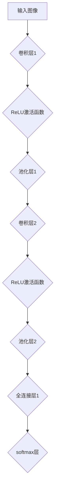
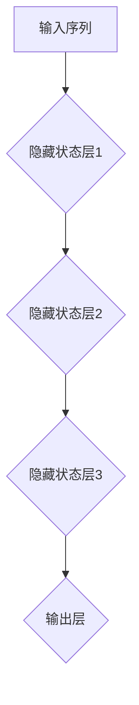

                 

### 《Andrej Karpathy：人工智能的未来发展挑战》

> **关键词：** 人工智能，未来挑战，深度学习，伦理，安全，技术进展

> **摘要：** 本文深入探讨了人工智能（AI）领域的杰出研究者Andrej Karpathy对未来AI发展的挑战的见解。文章首先回顾了AI的发展背景和现状，然后详细分析了AI的技术原理和实现，探讨了AI在不同领域的应用挑战与解决方案，并展望了AI的未来发展趋势和社会影响。通过本文，读者可以全面了解AI领域的最新进展和面临的挑战，以及对未来社会的潜在影响。

### 《Andrej Karpathy：人工智能的未来发展挑战》目录大纲

#### 第一部分：人工智能的发展背景与现状

##### 第1章：人工智能的历史与核心概念
###### 1.1 人工智能的发展历程
###### 1.2 人工智能的核心概念
###### 1.3 人工智能的分类与特点

##### 第2章：人工智能的现状与发展趋势
###### 2.1 人工智能的应用领域
###### 2.2 人工智能的技术进展
###### 2.3 人工智能的未来发展趋势

#### 第二部分：人工智能的技术原理与实现

##### 第3章：机器学习与深度学习基础
###### 3.1 机器学习的基本概念
###### 3.2 深度学习的基本概念
###### 3.3 深度学习的关键算法

##### 第4章：神经网络与深度学习架构
###### 4.1 神经网络的基本原理
###### 4.2 卷积神经网络（CNN）
###### 4.3 循环神经网络（RNN）
###### 4.4 生成对抗网络（GAN）

##### 第5章：自然语言处理（NLP）技术
###### 5.1 NLP的基本概念
###### 5.2 词嵌入技术
###### 5.3 序列模型与注意力机制
###### 5.4 转换器架构详解

#### 第三部分：人工智能的应用挑战与解决方案

##### 第6章：人工智能在医疗领域的挑战与机遇
###### 6.1 医疗人工智能的应用领域
###### 6.2 医疗人工智能的挑战
###### 6.3 医疗人工智能的解决方案

##### 第7章：人工智能在自动驾驶领域的应用
###### 7.1 自动驾驶技术的发展现状
###### 7.2 自动驾驶面临的挑战
###### 7.3 自动驾驶的解决方案

##### 第8章：人工智能在金融领域的挑战与机遇
###### 8.1 金融人工智能的应用领域
###### 8.2 金融人工智能的挑战
###### 8.3 金融人工智能的解决方案

##### 第9章：人工智能在伦理、法律与安全方面的挑战
###### 9.1 人工智能伦理问题
###### 9.2 人工智能法律问题
###### 9.3 人工智能安全问题

#### 第四部分：人工智能的未来发展展望

##### 第10章：人工智能的未来趋势
###### 10.1 人工智能的未来技术趋势
###### 10.2 人工智能在未来的应用领域

##### 第11章：人工智能对社会的影响
###### 11.1 人工智能对社会的影响
###### 11.2 人工智能时代的职业变革
###### 11.3 人工智能时代的教育改革

##### 第12章：人工智能的未来治理
###### 12.1 人工智能治理的重要性
###### 12.2 人工智能治理的挑战
###### 12.3 人工智能治理的解决方案

#### 附录

##### 附录A：人工智能工具与资源
###### A.1 主流人工智能框架
###### A.2 人工智能开源项目
###### A.3 人工智能社区与论坛

##### 附录B：人工智能论文集锦
###### B.1 顶级人工智能论文
###### B.2 有影响力的AI论文
###### B.3 深度学习领域经典论文

##### 附录C：常用数学公式和术语
###### C.1 常用数学公式
###### C.2 常用数学术语

---

### 第一部分：人工智能的发展背景与现状

##### 第1章：人工智能的历史与核心概念

人工智能（Artificial Intelligence，简称AI）是一个广泛的研究领域，旨在通过模拟人类智能，使计算机具备自主学习和推理能力。AI的研究始于20世纪50年代，当时科学家们提出了构建智能机器的愿景，并开始探索如何使计算机具有类似人类的感知、理解和决策能力。

###### 1.1 人工智能的发展历程

AI的发展历程可以分为几个重要阶段：

1. **初始阶段（1956-1969）**：在达特茅斯会议上，人工智能作为一门学科被正式提出。这个阶段主要关注基于规则和逻辑的专家系统。

2. **黄金时期（1970-1980）**：AI取得了显著进展，尤其是在逻辑推理和问题解决方面。然而，由于算法复杂性和数据稀缺性，这一阶段也被称为“AI寒冬”。

3. **复兴时期（1980-1987）**：随着机器学习和神经网络技术的发展，AI迎来了新的复兴。机器学习使得计算机能够通过数据学习模式，而神经网络为深度学习奠定了基础。

4. **深度学习时代（2012至今）**：深度学习在图像识别、语音识别和自然语言处理等领域取得了突破性成果。这一阶段的AI发展得益于计算能力和数据量的显著提升。

###### 1.2 人工智能的核心概念

人工智能的核心概念包括以下几个方面：

1. **机器学习**：机器学习是AI的核心技术之一，它使计算机能够通过数据学习模式和规律。机器学习可以分为监督学习、无监督学习和强化学习等类型。

2. **神经网络**：神经网络是模拟生物神经系统的计算模型，通过多层神经元进行数据传递和计算。深度学习是基于神经网络的一种机器学习方法。

3. **深度学习**：深度学习是一种基于多层神经网络的机器学习方法，通过逐层提取数据特征，实现复杂的数据处理和模式识别。

4. **自然语言处理（NLP）**：自然语言处理是AI的一个重要应用领域，旨在使计算机能够理解和处理自然语言。NLP包括文本分类、情感分析、机器翻译等任务。

5. **计算机视觉**：计算机视觉是AI在图像和视频处理方面的应用，旨在使计算机能够识别和理解视觉信息。计算机视觉包括图像分类、目标检测、人脸识别等任务。

###### 1.3 人工智能的分类与特点

人工智能可以根据其实现方式和功能进行分类，主要包括以下类型：

1. **弱人工智能（Narrow AI）**：弱人工智能是指在某些特定任务上表现超越人类的人工智能。例如，图像识别、语音识别和自然语言处理等。

2. **强人工智能（General AI）**：强人工智能是指具备人类智能的所有方面，能够进行广泛的学习、理解和推理。目前，强人工智能尚未实现，仍是一个长期目标。

3. **基于规则的系统**：基于规则的系统是通过一系列规则来模拟人类智能的。这类系统在逻辑推理和问题解决方面具有优势，但缺乏适应性和学习能力。

4. **基于模式的系统**：基于模式的系统是通过识别和学习数据中的模式来实现智能的。这类系统在图像识别、语音识别和自然语言处理等领域具有显著优势。

5. **基于学习的系统**：基于学习的系统是通过机器学习和深度学习技术来学习数据和模式，实现智能的。这类系统在处理复杂数据和任务方面具有强大能力。

---

在本章中，我们回顾了人工智能的发展历程、核心概念和分类。通过了解AI的历史和发展趋势，读者可以更好地理解AI在现代社会中的重要地位和潜力。在下一章中，我们将深入探讨人工智能的现状和发展趋势，以了解当前AI领域的最新动态和技术进展。

---

### 第一部分：人工智能的发展背景与现状

##### 第2章：人工智能的现状与发展趋势

随着人工智能技术的不断进步，AI已经渗透到各个领域，从医疗、金融到自动驾驶和智能家居，AI的应用场景越来越广泛。本章将探讨人工智能的现状和发展趋势，包括AI的应用领域、技术进展和未来前景。

###### 2.1 人工智能的应用领域

人工智能在各个领域的应用取得了显著成果，以下是一些主要的应用领域：

1. **医疗健康**：人工智能在医疗健康领域的应用主要包括疾病诊断、个性化治疗、医疗影像分析、药物研发等。例如，通过深度学习算法，AI可以辅助医生进行癌症筛查，提高诊断的准确性和效率。

2. **金融服务**：人工智能在金融服务领域的应用涵盖了风险管理、智能投顾、客户服务、反欺诈等。AI算法可以帮助银行和金融机构更准确地评估风险，提高业务效率，并为客户提供更加个性化的服务。

3. **交通运输**：自动驾驶是人工智能在交通运输领域的核心应用。通过深度学习和计算机视觉技术，自动驾驶汽车能够实现自主导航和驾驶，提高交通安全性和效率。

4. **智能家居**：智能家居设备如智能音箱、智能门锁、智能照明等，通过人工智能技术实现了智能控制和自动化管理，为用户提供了更加便捷和舒适的生活体验。

5. **制造业**：人工智能在制造业的应用主要包括自动化生产、质量控制、设备预测维护等。通过人工智能技术，制造业可以实现智能化生产，提高生产效率和质量。

6. **自然语言处理**：人工智能在自然语言处理领域的应用包括机器翻译、语音识别、情感分析、智能客服等。这些应用使得人与机器的交互变得更加自然和高效。

7. **安防监控**：人工智能在安防监控领域的应用主要包括人脸识别、视频分析、智能监控等。通过深度学习和计算机视觉技术，AI可以实时监控并分析视频数据，提高安全监控的效率和准确性。

###### 2.2 人工智能的技术进展

人工智能的技术进展主要表现在以下几个方面：

1. **深度学习**：深度学习是人工智能的核心技术之一，通过多层神经网络进行数据特征提取和模式识别。近年来，深度学习在图像识别、语音识别、自然语言处理等领域的表现大幅提升，取得了显著的成果。

2. **计算机视觉**：计算机视觉技术通过图像处理和机器学习算法，使计算机能够识别和理解视觉信息。计算机视觉技术在自动驾驶、安防监控、医疗影像分析等领域具有重要应用。

3. **自然语言处理**：自然语言处理技术使计算机能够理解和处理自然语言。近年来，自然语言处理在机器翻译、情感分析、智能客服等领域取得了重要进展。

4. **强化学习**：强化学习是人工智能的一种学习方法，通过试错和反馈进行决策和学习。强化学习在游戏、机器人控制、推荐系统等领域具有广泛应用。

5. **生成对抗网络（GAN）**：生成对抗网络是一种基于对抗训练的深度学习模型，通过生成器和判别器的博弈，实现高质量的数据生成。GAN在图像生成、视频合成等领域具有重要应用。

6. **迁移学习和联邦学习**：迁移学习通过利用已有数据的知识，提高新任务的性能。联邦学习在保护用户隐私的同时，实现分布式数据的学习和协作。

###### 2.3 人工智能的未来发展趋势

随着人工智能技术的不断进步，未来人工智能的发展趋势包括以下几个方面：

1. **更加智能化**：人工智能将向更加智能化、自适应化和自主化的方向发展。通过深度学习和强化学习技术，人工智能将具备更强的学习能力和决策能力。

2. **跨界融合**：人工智能与其他领域的融合将越来越紧密，产生新的应用场景和商业模式。例如，智能制造、智慧城市、智慧医疗等领域的融合发展，将推动社会生产力的提升。

3. **普及化和民主化**：人工智能技术将更加普及和民主化，普通人也能够轻松地使用和开发AI应用。开源平台、在线教育和社区将发挥重要作用，推动人工智能技术的普及和应用。

4. **伦理和安全**：人工智能的伦理和安全问题将受到广泛关注。在人工智能的发展过程中，需要充分考虑伦理和法律问题，确保人工智能的发展符合人类价值观和法律法规。

5. **绿色和可持续发展**：随着人工智能技术的应用，将推动社会向绿色和可持续发展的方向迈进。人工智能在能源管理、环境监测、绿色制造等方面的应用，将有助于减少资源消耗和环境污染。

6. **全球合作**：人工智能的发展需要全球合作，通过共享知识和资源，推动人工智能技术的创新和应用。国际组织和各国政府将发挥重要作用，促进全球人工智能的健康发展。

在本章中，我们探讨了人工智能的应用领域、技术进展和未来发展趋势。通过了解AI的现状和发展趋势，读者可以更好地把握人工智能的发展方向，为未来的研究和实践做好准备。在下一章中，我们将深入探讨人工智能的技术原理与实现，包括机器学习、深度学习和神经网络等核心概念和算法。

---

### 第二部分：人工智能的技术原理与实现

##### 第3章：机器学习与深度学习基础

机器学习和深度学习是人工智能的核心技术，它们为计算机提供了自主学习和推理的能力。本章将详细介绍机器学习的基本概念、深度学习的基本概念以及深度学习的关键算法。

###### 3.1 机器学习的基本概念

机器学习（Machine Learning，简称ML）是一门人工智能领域的研究分支，主要研究如何让计算机从数据中自动学习，并从中提取知识。机器学习的过程通常包括数据收集、数据预处理、模型训练、模型评估和模型部署等步骤。

1. **数据收集**：机器学习需要大量的数据来训练模型。这些数据可以是结构化的，如数据库中的表格，也可以是非结构化的，如图像、音频和文本。

2. **数据预处理**：在训练模型之前，需要对数据进行预处理，包括数据清洗、数据转换和数据归一化等。数据预处理的目标是提高数据的质量和一致性，以便模型能够更好地学习。

3. **模型训练**：在机器学习中，模型是通过学习数据中的模式和规律来实现的。训练过程通常包括选择合适的算法、定义损失函数、优化算法等。

4. **模型评估**：模型训练完成后，需要对模型进行评估，以确定其性能。常用的评估指标包括准确率、召回率、F1分数等。

5. **模型部署**：评估完成后，将模型部署到实际应用场景中，例如在线服务、移动应用或服务器端。

机器学习可以分为以下几种类型：

1. **监督学习**：监督学习是一种最常见的机器学习方法，它通过已知的输入和输出数据来训练模型。监督学习包括回归问题和分类问题。

   - **回归问题**：回归问题的目标是预测一个连续的数值输出。常用的算法包括线性回归、决策树回归、随机森林回归等。

   - **分类问题**：分类问题的目标是预测一个离散的类别输出。常用的算法包括逻辑回归、支持向量机（SVM）、决策树分类、随机森林分类等。

2. **无监督学习**：无监督学习不依赖于已知的输出数据，主要通过发现数据中的内在结构和模式来进行学习。无监督学习包括聚类、降维和异常检测等。

   - **聚类**：聚类是将数据分为多个类别，每个类别内的数据点相似度较高，类别间的数据点相似度较低。常用的算法包括K-Means聚类、层次聚类等。

   - **降维**：降维是将高维数据转换为低维数据，以减少数据存储和计算的成本。常用的算法包括主成分分析（PCA）、线性判别分析（LDA）等。

   - **异常检测**：异常检测是识别数据中的异常点或离群点。常用的算法包括基于统计的方法、基于聚类的方法和基于神经网络的方法等。

3. **半监督学习**：半监督学习结合了监督学习和无监督学习的方法，利用部分有标签数据和大量无标签数据来训练模型。半监督学习在数据标签稀缺的情况下具有重要作用。

4. **强化学习**：强化学习是一种通过与环境交互来学习决策策略的机器学习方法。强化学习包括马尔可夫决策过程（MDP）、Q学习、深度Q网络（DQN）等。

###### 3.2 深度学习的基本概念

深度学习（Deep Learning，简称DL）是机器学习的一个子领域，它通过构建多层神经网络来进行数据特征提取和模式识别。深度学习的发展得益于计算能力和数据量的提升，以及优化算法和硬件的支持。

1. **神经网络**：神经网络是深度学习的基础，它由多个神经元组成，每个神经元接收多个输入，通过激活函数产生输出。神经网络可以通过反向传播算法进行训练。

2. **深度神经网络**：深度神经网络（Deep Neural Network，简称DNN）是指具有多个隐藏层的神经网络。深度神经网络能够通过逐层提取数据特征，实现复杂的数据处理和模式识别。

3. **深度学习框架**：深度学习框架是用于构建和训练深度学习模型的工具，常用的深度学习框架包括TensorFlow、PyTorch、Keras等。这些框架提供了丰富的API和工具，方便用户进行模型开发和部署。

###### 3.3 深度学习的关键算法

深度学习的关键算法包括卷积神经网络（CNN）、循环神经网络（RNN）、生成对抗网络（GAN）等。

1. **卷积神经网络（CNN）**：卷积神经网络是一种用于图像处理和计算机视觉的深度学习模型。CNN通过卷积操作和池化操作提取图像特征，能够实现图像分类、目标检测和语义分割等任务。

   - **卷积操作**：卷积操作通过卷积核在图像上滑动，计算局部特征。卷积操作能够有效减少参数数量，提高模型训练效率。

   - **池化操作**：池化操作通过将局部区域进行平均或最大值操作，减少特征图的维度，提高模型的表达能力。

   - **卷积层**：卷积层是CNN的核心部分，通过多个卷积核提取不同层次的特征。

   - **全连接层**：全连接层将卷积层提取的特征映射到输出类别。

2. **循环神经网络（RNN）**：循环神经网络是一种用于处理序列数据的深度学习模型。RNN通过记忆状态保持历史信息，能够实现自然语言处理、语音识别和时间序列预测等任务。

   - **隐藏状态**：隐藏状态是RNN的核心部分，用于存储当前时刻的信息和之前时刻的信息。

   - **递归结构**：RNN的输出依赖于之前的输出，形成递归结构。

   - **门控机制**：门控机制用于控制信息的流动，包括输入门、遗忘门和输出门。

3. **生成对抗网络（GAN）**：生成对抗网络是一种通过生成器和判别器之间的对抗训练来实现数据生成的深度学习模型。GAN通过生成器生成数据，判别器判断生成数据与真实数据之间的相似度。

   - **生成器**：生成器通过输入随机噪声生成数据。

   - **判别器**：判别器用于判断生成数据与真实数据之间的相似度。

   - **对抗训练**：生成器和判别器通过对抗训练，不断优化生成数据和判断能力。

在本章中，我们详细介绍了机器学习和深度学习的基本概念和关键算法。通过理解这些基本概念和算法，读者可以更好地掌握人工智能的核心技术，并在实际应用中进行创新和探索。在下一章中，我们将继续探讨深度学习的架构和实现，包括神经网络、卷积神经网络和循环神经网络等。

---

### 第二部分：人工智能的技术原理与实现

##### 第4章：神经网络与深度学习架构

神经网络（Neural Networks，简称NN）和深度学习（Deep Learning，简称DL）是人工智能领域的重要技术。神经网络是模仿生物神经系统的计算模型，而深度学习是基于多层神经网络的机器学习方法。本章将详细讨论神经网络的基本原理、卷积神经网络（CNN）、循环神经网络（RNN）和生成对抗网络（GAN）。

###### 4.1 神经网络的基本原理

神经网络由多个神经元（或节点）组成，每个神经元接收多个输入，通过加权求和并应用激活函数产生输出。神经网络的基本原理包括以下几个方面：

1. **神经元结构**：每个神经元包括输入层、加权求和单元、激活函数和输出层。输入层接收外部输入，加权求和单元计算输入与权重的乘积并求和，激活函数对求和结果进行非线性变换，输出层产生最终输出。

2. **权重和偏置**：权重（weights）用于调整输入信号的重要性，偏置（biases）用于调整神经元的偏移量。权重和偏置通过学习算法进行调整，以优化模型的输出。

3. **激活函数**：激活函数用于引入非线性特性，常见的激活函数包括Sigmoid函数、ReLU函数和Tanh函数。Sigmoid函数将输入映射到（0，1）区间，ReLU函数在输入大于0时输出输入值，否则输出0，Tanh函数将输入映射到（-1，1）区间。

4. **前向传播和反向传播**：神经网络通过前向传播计算输出，通过反向传播更新权重和偏置。前向传播从输入层开始，逐层计算每个神经元的输出；反向传播从输出层开始，计算每个神经元的误差，并更新权重和偏置。

5. **损失函数**：损失函数用于衡量模型输出与真实值之间的差距，常见的损失函数包括均方误差（MSE）、交叉熵损失等。损失函数的值越小，模型性能越好。

6. **优化算法**：优化算法用于调整权重和偏置，以最小化损失函数。常见的优化算法包括梯度下降（Gradient Descent）、随机梯度下降（Stochastic Gradient Descent，简称SGD）和Adam优化器等。

###### 4.2 卷积神经网络（CNN）

卷积神经网络（Convolutional Neural Network，简称CNN）是一种专门用于处理图像数据的神经网络。CNN通过卷积操作和池化操作提取图像特征，实现图像分类、目标检测和语义分割等任务。CNN的基本架构包括以下几个部分：

1. **卷积层**：卷积层是CNN的核心部分，通过卷积操作提取图像特征。卷积操作通过卷积核在图像上滑动，计算局部特征。卷积层可以堆叠多层，以提取更高级的特征。

2. **激活函数**：在卷积层之后，通常应用ReLU激活函数，以引入非线性特性，提高模型的表达能力。

3. **池化层**：池化层用于减少特征图的维度，提高模型的鲁棒性。常见的池化操作包括最大池化和平均池化。

4. **全连接层**：全连接层将卷积层提取的特征映射到输出类别。全连接层通常位于卷积层的末端，用于分类任务。

5. **softmax层**：在分类任务中，softmax层用于计算每个类别的概率分布，并输出最终预测结果。

CNN的典型架构包括卷积层、池化层和全连接层的组合。以下是一个简单的CNN架构示例：

###### 4.3 循环神经网络（RNN）

循环神经网络（Recurrent Neural Network，简称RNN）是一种专门用于处理序列数据的神经网络。RNN通过记忆状态保持历史信息，实现自然语言处理、语音识别和时间序列预测等任务。RNN的基本架构包括以下几个部分：

1. **隐藏状态**：隐藏状态是RNN的核心部分，用于存储当前时刻的信息和之前时刻的信息。隐藏状态通过递归结构在时间步之间传递。

2. **递归结构**：RNN的输出依赖于之前的输出，形成递归结构。递归结构使RNN能够处理变长的序列数据。

3. **输入门、遗忘门和输出门**：门控机制用于控制信息的流动。输入门控制当前时刻的信息输入，遗忘门控制之前时刻的信息遗忘，输出门控制当前时刻的信息输出。

4. **前向传播和反向传播**：RNN通过前向传播计算输出，通过反向传播更新权重和偏置。

RNN的典型架构包括输入层、隐藏状态层和输出层。以下是一个简单的RNN架构示例：

###### 4.4 生成对抗网络（GAN）

生成对抗网络（Generative Adversarial Network，简称GAN）是一种通过生成器和判别器之间的对抗训练实现数据生成的神经网络。GAN由生成器和判别器两个神经网络组成，生成器通过输入随机噪声生成数据，判别器通过判断生成数据与真实数据之间的相似度。GAN的基本架构包括以下几个部分：

1. **生成器**：生成器通过输入随机噪声生成数据。生成器的目标是生成与真实数据相似的数据，以欺骗判别器。

2. **判别器**：判别器通过判断生成数据与真实数据之间的相似度。判别器的目标是正确分类真实数据和生成数据。

3. **对抗训练**：生成器和判别器通过对抗训练不断优化。生成器通过生成更真实的数据来欺骗判别器，判别器通过提高分类能力来识别生成数据。

GAN的典型架构包括生成器、判别器和对抗训练过程。以下是一个简单的GAN架构示例：

在本章中，我们详细介绍了神经网络的基本原理、卷积神经网络（CNN）、循环神经网络（RNN）和生成对抗网络（GAN）。通过理解这些深度学习架构，读者可以更好地掌握人工智能的核心技术，并在实际应用中进行创新和探索。在下一章中，我们将探讨人工智能在医疗、自动驾驶和金融领域的应用挑战与解决方案。

---

### 第三部分：人工智能的应用挑战与解决方案

##### 第6章：人工智能在医疗领域的挑战与机遇

人工智能（AI）在医疗领域的应用已经成为一个热点话题，其潜力体现在疾病诊断、个性化治疗、药物研发和患者管理等多个方面。然而，随着AI技术的广泛应用，医疗领域也面临一系列挑战，这些挑战包括数据隐私、医疗伦理、技术可靠性和法律监管等。本章将探讨AI在医疗领域的应用挑战及其解决方案。

###### 6.1 医疗人工智能的应用领域

1. **疾病诊断**：AI在疾病诊断中的应用最为广泛，通过深度学习模型分析医学影像，如X光片、CT扫描和MRI，以提高诊断的准确性和速度。例如，AI可以帮助医生识别早期肺癌、乳腺癌等疾病。

2. **个性化治疗**：AI可以通过分析患者的基因信息、病史和治疗效果，为每位患者制定个性化的治疗方案。例如，通过基因测序和药物反应预测，AI可以帮助医生选择最合适的药物治疗方案。

3. **药物研发**：AI在药物研发中的应用主要体现在加速药物发现和优化药物配方。通过机器学习算法预测化合物的生物活性，AI可以帮助制药公司更快地开发新药。

4. **患者管理**：AI可以协助医生进行患者管理，例如通过分析电子健康记录，AI可以预测患者的复发风险，提醒医生进行必要的干预。

5. **辅助手术**：AI技术在辅助手术中的应用也越来越广泛，通过实时分析手术视频和数据，AI可以帮助医生进行更加精准的手术操作。

###### 6.2 医疗人工智能的挑战

1. **数据隐私**：医疗数据具有高度隐私性，如何保护患者数据的安全和隐私成为AI在医疗领域应用的一个重要挑战。解决方案包括数据加密、隐私保护算法和联邦学习等。

2. **医疗伦理**：AI在医疗领域的应用引发了伦理问题，例如，如何确保AI决策的透明度和公正性，以及如何处理AI造成的误诊和错误。解决方案包括制定伦理准则、加强监管和培训医生。

3. **技术可靠性**：AI模型的可靠性是医疗应用的关键，模型过拟合、数据偏差和算法透明度等问题都可能影响AI在医疗领域的应用。解决方案包括提高模型的可解释性、使用更多的数据集和进行严格的验证。

4. **法律监管**：AI在医疗领域的应用需要遵循相关的法律法规，包括数据保护法、医疗设备法规等。解决方案包括制定明确的法律法规，并建立监管机制。

###### 6.3 医疗人工智能的解决方案

1. **数据隐私保护**：
   - **数据加密**：通过加密技术对医疗数据进行加密，确保数据在传输和存储过程中的安全性。
   - **隐私保护算法**：使用差分隐私、同态加密和联邦学习等技术，在数据共享和模型训练过程中保护患者隐私。
   - **数据去识别化**：通过数据脱敏、匿名化和数据聚合等方法，减少数据中的可识别信息，降低隐私泄露风险。

2. **医疗伦理**：
   - **制定伦理准则**：制定明确的AI伦理准则，确保AI在医疗领域的应用符合伦理标准。
   - **加强监管**：建立监管机构，对AI医疗应用进行定期审查和监督，确保其合规性和安全性。
   - **培训医生**：加强对医生的培训，提高他们对AI技术的理解和应用能力，确保医生和患者能够共同参与到AI的医疗决策过程中。

3. **技术可靠性**：
   - **提高模型可解释性**：通过解释性AI技术，提高模型决策的透明度和可解释性，帮助医生理解AI的决策过程。
   - **使用更多数据集**：通过收集更多的数据集，减少模型过拟合的风险，提高模型的泛化能力。
   - **严格的验证**：在模型部署前进行严格的验证和测试，确保模型在多种场景下的稳定性和可靠性。

4. **法律监管**：
   - **制定法律法规**：制定明确的法律法规，规范AI在医疗领域的应用，确保其合法合规。
   - **建立监管机制**：建立监管机构，对AI医疗应用进行定期审查和监督，确保其符合法律法规要求。
   - **国际合作**：推动国际间的合作，共同制定全球统一的AI医疗应用标准和法规。

在本章中，我们探讨了AI在医疗领域的应用挑战及其解决方案。通过理解这些挑战和解决方案，医疗行业可以更好地利用AI技术，提高医疗服务质量和效率。在下一章中，我们将探讨AI在自动驾驶领域的应用挑战与解决方案。

---

### 第三部分：人工智能的应用挑战与解决方案

##### 第7章：人工智能在自动驾驶领域的应用

自动驾驶技术是人工智能在交通运输领域的重要应用，其目标是实现车辆在复杂环境中自主导航和驾驶。自动驾驶技术的发展对提高交通安全、减少交通事故、缓解交通拥堵具有重大意义。然而，自动驾驶技术也面临着诸多挑战，包括技术可靠性、数据安全、伦理和法律问题等。本章将探讨AI在自动驾驶领域的应用挑战及其解决方案。

###### 7.1 自动驾驶技术的发展现状

自动驾驶技术按照自动驾驶等级可以分为几个级别，从0级到5级，其中5级为完全自动驾驶，无需人类驾驶员介入。当前，自动驾驶技术已经取得了一定的发展，以下是一些关键进展：

1. **感知系统**：自动驾驶车辆的感知系统包括激光雷达、摄像头、超声波传感器和雷达等，用于检测周围环境和障碍物。

2. **定位系统**：自动驾驶车辆通过GPS、地图数据和高精度定位系统实现定位和导航。

3. **决策和控制系统**：自动驾驶车辆的决策和控制系统能够根据感知系统提供的信息，进行路径规划和车辆控制。

4. **仿真和测试**：自动驾驶技术的开发依赖于大量的仿真和测试，通过模拟各种交通场景和极端情况，验证车辆的安全性和可靠性。

5. **合作和协作**：自动驾驶车辆与人类驾驶员、其他车辆和基础设施之间的协作和交互是自动驾驶技术发展的关键。

###### 7.2 自动驾驶面临的挑战

1. **技术可靠性**：自动驾驶技术需要在各种复杂和动态的交通环境中保持高可靠性，包括应对恶劣天气、交通拥堵、突发情况等。

2. **数据安全**：自动驾驶车辆在运行过程中会产生大量的数据，如何确保这些数据的安全和隐私是自动驾驶技术面临的重要挑战。

3. **伦理和法律问题**：自动驾驶技术涉及伦理和法律问题，包括责任归属、隐私保护、公平性等。

4. **协作与交互**：自动驾驶车辆需要与人类驾驶员、其他车辆和基础设施进行有效的协作和交互，以确保交通系统的安全和效率。

###### 7.3 自动驾驶的解决方案

1. **技术可靠性**：
   - **多传感器融合**：通过融合多种传感器数据，提高自动驾驶车辆的感知能力，降低感知错误的风险。
   - **增强学习**：使用增强学习技术，使自动驾驶车辆能够从经验中学习和优化决策，提高在复杂环境中的适应能力。
   - **安全监控系统**：建立安全监控系统，实时监控车辆状态和环境变化，确保自动驾驶车辆能够在出现异常时及时采取措施。

2. **数据安全**：
   - **数据加密**：对自动驾驶车辆产生的数据进行加密，确保数据在传输和存储过程中的安全性。
   - **隐私保护算法**：使用隐私保护算法，如差分隐私和同态加密，确保数据在共享和处理过程中不被泄露。
   - **联邦学习**：通过联邦学习技术，在保障数据隐私的同时，实现自动驾驶模型的训练和优化。

3. **伦理和法律问题**：
   - **制定伦理准则**：制定自动驾驶技术的伦理准则，确保技术在开发和应用过程中符合伦理标准。
   - **责任归属**：明确自动驾驶技术中各方责任归属，建立责任保险机制，以应对可能发生的交通事故。
   - **法律监管**：建立完善的法律法规体系，规范自动驾驶技术的开发和应用，确保其合法合规。

4. **协作与交互**：
   - **V2X通信**：通过V2X（Vehicle-to-Everything）通信技术，实现自动驾驶车辆与基础设施、其他车辆和行人的信息交换，提高交通系统的协同效率。
   - **合作学习**：通过合作学习技术，使自动驾驶车辆能够学习并适应不同的交通环境和场景，提高其协作能力。
   - **虚拟仿真测试**：在虚拟仿真环境中进行自动驾驶车辆的测试和验证，确保车辆在实际应用中具备良好的适应性和可靠性。

在本章中，我们探讨了AI在自动驾驶领域的应用挑战及其解决方案。通过理解这些挑战和解决方案，自动驾驶技术的发展和应用将更加顺利，为未来智能交通系统的构建奠定基础。在下一章中，我们将探讨AI在金融领域的挑战与机遇。

---

### 第三部分：人工智能的应用挑战与解决方案

##### 第8章：人工智能在金融领域的挑战与机遇

人工智能（AI）在金融领域的应用正日益深入，涵盖了风险控制、智能投顾、欺诈检测和自动化交易等多个方面。AI技术在金融领域的应用不仅提高了效率，还提升了决策的准确性和可靠性。然而，随着AI技术的广泛应用，金融领域也面临着一系列挑战，包括数据隐私、模型透明性、算法公平性和监管合规等。本章将探讨AI在金融领域的应用挑战及其解决方案。

###### 8.1 金融人工智能的应用领域

1. **风险控制**：AI技术可以帮助金融机构识别和评估金融风险，例如信用风险评估、市场风险预测和操作风险检测。通过机器学习和大数据分析，AI能够实时监控市场动态，及时调整风险控制策略。

2. **智能投顾**：智能投顾利用AI算法为投资者提供个性化的投资建议，基于投资者的风险偏好和财务目标，制定最优的投资组合。AI可以帮助投资者降低风险，实现资产增值。

3. **欺诈检测**：AI技术在金融欺诈检测中发挥着重要作用，通过模式识别和异常检测算法，AI能够快速识别异常交易行为，降低欺诈风险。例如，银行可以使用AI技术监控信用卡交易，及时发现并阻止欺诈行为。

4. **自动化交易**：AI技术在自动化交易中的应用使得交易决策更加快速和准确。通过机器学习和神经网络，AI能够分析市场数据，预测价格走势，从而进行高频交易和算法交易。

5. **客户服务**：AI驱动的聊天机器人和虚拟客服能够为金融机构提供24/7的客户服务，提高客户体验和满意度。AI可以通过自然语言处理技术理解和响应客户的问题和需求。

6. **合规监控**：AI技术可以帮助金融机构监控和遵守监管要求，例如反洗钱（AML）和合规性检查。通过自动化的合规监控，AI能够及时发现违规行为，降低法律风险。

###### 8.2 金融人工智能的挑战

1. **数据隐私**：金融数据具有高度敏感性，如何在保证数据隐私的同时，有效利用AI技术进行分析和决策是金融领域面临的重要挑战。

2. **模型透明性**：AI模型的决策过程往往复杂且不透明，如何提高模型的透明性，使决策过程可解释和可追溯是金融领域的一个重要课题。

3. **算法公平性**：AI算法可能会在决策过程中引入偏见，导致不公平的结果。如何确保算法的公平性，避免歧视性决策是金融领域必须面对的问题。

4. **监管合规**：金融领域受到严格的监管，如何在遵守监管要求的前提下，应用AI技术进行创新和优化是金融领域面临的挑战。

5. **技术风险**：AI技术在金融领域的应用可能带来新的技术风险，例如模型失效、数据泄露和系统故障等。

###### 8.3 金融人工智能的解决方案

1. **数据隐私**：
   - **数据加密**：采用数据加密技术，保护金融数据的机密性。
   - **隐私保护算法**：应用差分隐私、同态加密和联邦学习等隐私保护算法，在数据处理和分析过程中保护个人隐私。
   - **数据脱敏**：对敏感数据进行脱敏处理，减少数据泄露风险。

2. **模型透明性**：
   - **可解释性AI**：开发可解释性AI技术，使AI模型的决策过程更加透明和可解释。
   - **模型审查**：建立模型审查机制，对AI模型进行定期审查和评估，确保其决策过程符合业务逻辑和道德标准。
   - **透明报告**：对AI模型的预测结果和决策过程进行透明报告，提高模型的可信度和透明度。

3. **算法公平性**：
   - **算法审查**：建立算法审查机制，识别和消除算法中的偏见和歧视。
   - **公平性评估**：通过统计学方法对算法的公平性进行评估，确保算法在决策过程中不引入不公平因素。
   - **多元数据集**：使用多样化的数据集进行模型训练，减少数据集中存在的偏见和偏差。

4. **监管合规**：
   - **法规遵循**：确保AI技术的应用符合现有的法律法规，建立合规性评估机制。
   - **监管合作**：与监管机构合作，推动AI技术在金融领域的合规发展。
   - **监管沙盒**：在监管沙盒环境下进行AI技术的测试和验证，确保其符合监管要求。

5. **技术风险**：
   - **风险管理**：建立全面的技术风险管理框架，识别、评估和监控AI技术的风险。
   - **系统备份**：定期进行系统备份，确保在发生故障时能够快速恢复。
   - **应急预案**：制定应急预案，确保在AI系统出现异常时，能够及时采取措施，减少损失。

在本章中，我们探讨了AI在金融领域的应用挑战及其解决方案。通过理解这些挑战和解决方案，金融行业可以更好地利用AI技术，提高业务效率和服务质量。在下一章中，我们将探讨AI在伦理、法律与安全方面的挑战。

---

### 第三部分：人工智能的应用挑战与解决方案

##### 第9章：人工智能在伦理、法律与安全方面的挑战

随着人工智能（AI）技术的快速发展，其在各个领域的应用越来越广泛，但随之而来的伦理、法律和安全挑战也日益突出。AI技术的决策过程通常复杂且不透明，可能导致歧视性决策、隐私泄露、法律责任归属等问题。本章将探讨AI在伦理、法律和安全方面的挑战，并提出相应的解决方案。

###### 9.1 人工智能伦理问题

1. **歧视性决策**：AI系统可能会在决策过程中引入人为偏见，导致歧视性结果。例如，招聘或信贷审批系统可能会基于历史数据中的偏见，对某些群体产生不公平的待遇。

2. **隐私保护**：AI技术需要处理大量个人数据，如何保护这些数据的隐私成为重要伦理问题。数据泄露、滥用和不当处理可能导致个人隐私的严重侵犯。

3. **透明性和可解释性**：AI决策过程通常不透明，导致用户难以理解决策依据和结果。缺乏透明性和可解释性可能导致用户对AI系统的信任度降低。

4. **算法偏见**：AI算法可能会在训练过程中学习并放大数据集中的偏见，导致算法偏见。这种偏见可能导致不公平的决策，例如在司法系统中对某些群体的不利判决。

5. **责任归属**：当AI系统导致错误决策或意外事件时，如何确定责任归属是一个复杂的问题。责任归属的不明确可能导致法律纠纷和责任逃避。

###### 9.2 人工智能法律问题

1. **数据保护法**：随着AI技术的广泛应用，如何保护个人数据隐私成为一个重要法律问题。数据保护法（如欧盟的《通用数据保护条例》GDPR）要求对个人数据进行严格保护。

2. **知识产权**：AI生成的内容，如图像、文本和音乐等，如何确定知识产权归属是一个复杂的问题。目前，各国对AI生成内容的知识产权保护尚无统一法律。

3. **合同法**：在AI辅助决策的交易中，如何确定合同的有效性和合法性是一个法律挑战。例如，自动驾驶车辆在发生事故时，如何确定责任归属和赔偿金额。

4. **侵权责任**：AI系统造成的损害如何追究责任是一个法律问题。现有法律体系可能无法完全适应AI技术带来的新挑战。

5. **人工智能监管**：如何制定和执行监管政策，确保AI技术的安全、可靠和合法是一个重要法律问题。监管机构的角色和职责需要明确。

###### 9.3 人工智能安全问题

1. **数据泄露**：AI系统处理的大量数据可能成为黑客攻击的目标。数据泄露可能导致严重后果，包括经济损失、隐私侵犯和声誉损害。

2. **系统故障**：AI系统可能因算法错误、硬件故障或软件漏洞导致系统故障，影响关键业务的正常运行。

3. **恶意攻击**：AI系统可能遭受恶意攻击，例如通过注入恶意代码或操纵数据，导致系统崩溃或产生错误的决策。

4. **道德风险**：AI系统的决策过程不透明，可能导致道德风险。例如，自动驾驶车辆在紧急情况下可能产生道德困境，如何决策成为难题。

5. **网络攻击**：AI系统可能成为网络攻击的目标，例如DDoS攻击、恶意软件和漏洞利用等，可能导致系统瘫痪或数据泄露。

###### 9.4 解决方案

1. **伦理问题**：
   - **伦理准则**：制定明确的AI伦理准则，确保AI技术在开发和应用过程中符合伦理标准。
   - **伦理审查**：建立伦理审查机制，对AI技术的伦理影响进行评估和监督。
   - **公众参与**：鼓励公众参与AI技术的伦理讨论，提高公众对AI技术的理解和接受度。

2. **法律问题**：
   - **数据保护法规**：加强数据保护法规，确保个人数据的合法采集、使用和保护。
   - **知识产权保护**：明确AI生成内容的知识产权保护，建立合理的知识产权归属制度。
   - **合同法完善**：完善合同法，明确AI辅助决策的交易合同的有效性和合法性。
   - **侵权责任**：明确AI技术造成的损害责任归属，建立合理的责任追究制度。
   - **监管政策**：制定和执行监管政策，确保AI技术的安全、可靠和合法应用。

3. **安全问题**：
   - **数据加密**：采用数据加密技术，保护数据在传输和存储过程中的安全性。
   - **系统安全**：加强AI系统的安全性，包括硬件安全、软件安全和网络安全。
   - **安全审计**：定期进行安全审计，识别和修复系统漏洞。
   - **应急响应**：建立应急预案，确保在发生安全事件时能够迅速响应和恢复。

在本章中，我们探讨了AI在伦理、法律和安全方面的挑战，并提出相应的解决方案。通过理解这些挑战和解决方案，可以推动AI技术的健康发展，确保其在为社会带来福祉的同时，不会产生负面影响。在下一章中，我们将展望人工智能的未来发展。

---

### 第四部分：人工智能的未来发展展望

##### 第10章：人工智能的未来趋势

人工智能（AI）作为21世纪最具变革性的技术之一，其未来发展充满了无限可能。随着技术的不断进步，AI将不仅在现有领域取得更大突破，还将在新的应用场景中发挥重要作用。本章将探讨AI的未来技术趋势及其在各个领域的潜在应用。

###### 10.1 人工智能的未来技术趋势

1. **量子计算**：量子计算是一种基于量子力学原理的计算方法，具有超强的计算能力。量子计算在AI领域有广泛的应用前景，例如加速机器学习算法、优化复杂模型等。量子计算的发展将推动AI技术达到新的高度。

2. **边缘计算**：边缘计算将数据处理和计算能力从云端转移到网络边缘，使得实时数据处理和响应成为可能。边缘计算与AI的融合将提高智能设备的自主性和实时性，为智能家居、自动驾驶和智能制造等领域带来变革。

3. **自适应学习**：自适应学习是指AI系统能够根据用户行为和需求，动态调整学习策略和模型参数。自适应学习将使AI系统更加智能化，能够更好地适应不断变化的环境和需求。

4. **人机协同**：人机协同是指AI系统与人类协作完成任务，发挥各自的优势。未来，人机协同将广泛应用于医疗、教育、科研等领域，提高工作效率和质量。

5. **多模态学习**：多模态学习是指AI系统能够同时处理多种类型的数据，如图像、音频、文本等。多模态学习将使AI系统更加全面地理解和处理复杂信息，提高任务执行能力。

6. **增强现实与虚拟现实**：增强现实（AR）和虚拟现实（VR）技术将与AI深度融合，为用户提供更加沉浸式的体验。未来，AR和VR将成为人工智能的重要应用领域，推动数字经济的快速发展。

###### 10.2 人工智能在未来的应用领域

1. **智能制造**：智能制造是AI在工业领域的重要应用，通过机器学习、深度学习和计算机视觉等技术，实现生产过程的自动化和智能化。未来，智能制造将提高生产效率和质量，降低生产成本，推动制造业的数字化转型。

2. **智慧医疗**：智慧医疗是AI在医疗领域的重要应用，包括智能诊断、智能治疗、智能药物研发等。未来，智慧医疗将提高医疗服务的质量和效率，降低医疗成本，推动医疗行业的现代化发展。

3. **智慧交通**：智慧交通是AI在交通领域的重要应用，包括智能交通管理、自动驾驶、智能交通信号控制等。未来，智慧交通将提高交通系统的效率和安全性，减少交通事故和交通拥堵，改善人们的出行体验。

4. **智慧城市**：智慧城市是AI在城市管理领域的重要应用，通过物联网、大数据和人工智能等技术，实现城市管理的智能化和精细化。未来，智慧城市将提高城市运行效率，改善居民生活质量，推动城市可持续发展。

5. **智能家居**：智能家居是AI在家庭领域的重要应用，包括智能安防、智能家电、智能照明等。未来，智能家居将提高家庭的舒适性和便利性，推动家居设备的智能化升级。

6. **教育科技**：教育科技是AI在教育领域的重要应用，包括在线教育、智能辅导、学习分析等。未来，教育科技将提高教育质量和效率，为学习者提供更加个性化的学习体验。

在本章中，我们探讨了AI的未来技术趋势及其在各个领域的潜在应用。通过了解这些趋势，我们可以预见AI在未来将带来更多的变革和机遇。在下一章中，我们将探讨人工智能对社会的影响。

---

### 第四部分：人工智能的未来发展展望

##### 第11章：人工智能对社会的影响

人工智能（AI）的快速发展正在深刻改变社会的各个方面，从职业结构到教育模式，从经济体系到社会伦理，AI的影响无处不在。本章将探讨人工智能对社会的影响，特别是在职业变革、教育改革和伦理问题等方面的表现。

###### 11.1 人工智能对社会的影响

1. **职业变革**：AI技术的广泛应用导致许多传统职业的自动化和消失，同时也创造了新的就业机会。一方面，许多重复性和低技能的工作将被机器人和自动化系统取代，例如制造业、客服和运输等领域。另一方面，AI技术也催生了新的职业，如数据科学家、机器学习工程师和AI伦理专家等。

   - **自动化与失业**：自动化技术可能导致部分劳动力的需求减少，从而引发失业问题。然而，历史上每一次技术革命都伴随着就业结构的变化，最终结果是提高生产效率和创造新的就业机会。
   - **技能要求提升**：随着AI技术的发展，对劳动力的技能要求也在不断提升。未来，具备技术技能和创新能力的人才将在就业市场中占据优势。

2. **教育改革**：人工智能在教育领域的应用正在改变传统的教育模式。智能教育系统可以根据学生的个性化需求和进度提供定制化的学习资源，提高学习效果和效率。

   - **个性化学习**：通过AI技术，教育系统能够为学生提供个性化的学习建议，帮助他们更有效地掌握知识。
   - **智能辅导**：AI辅导系统可以实时监测学生的学习进度，提供个性化的辅导和建议，帮助学生克服学习难题。
   - **教育公平**：AI技术有助于缩小教育资源的差距，使更多学生有机会接受高质量的教育。

3. **经济体系**：AI技术的应用正在重塑全球经济体系，提高生产效率，创造新的商业机会，同时也带来经济结构的变化。

   - **产业升级**：AI技术可以加速传统产业的数字化转型，推动产业升级和创新发展。
   - **新兴行业**：AI技术的发展催生了众多新兴行业，如智能物流、智能金融和智能医疗等，这些行业为经济增长提供了新的动力。
   - **商业模式变革**：AI技术的应用改变了企业的运营模式，提高了运营效率，降低了成本。

4. **社会伦理**：随着AI技术的广泛应用，社会伦理问题逐渐成为人们关注的焦点。AI技术在决策过程中可能引入偏见，侵犯隐私，以及引发责任归属问题。

   - **算法偏见**：AI算法可能在训练过程中学习并放大数据集中的偏见，导致不公平的决策。例如，招聘或信用评估系统可能对某些群体产生歧视。
   - **隐私保护**：AI技术在处理大量个人数据时，可能侵犯个人隐私。如何保护个人隐私成为AI技术发展的重要伦理问题。
   - **责任归属**：当AI系统产生错误决策或造成损害时，如何确定责任归属是一个复杂的问题。现有法律体系可能无法完全适应AI技术带来的新挑战。

###### 11.2 人工智能时代的职业变革

在AI时代，职业结构将发生重大变化，一些职业可能会消失，而新的职业将会出现。以下是对未来职业变革的一些预测：

1. **消失的职业**：随着AI和自动化技术的发展，一些传统职业可能会消失，例如工厂工人、电话客服和交通司机等。然而，这种变化并不是单向的，而是伴随着新职业的出现。

2. **新职业的出现**：AI技术将催生一系列新的职业，例如数据科学家、AI伦理学家、机器学习工程师、AI安全专家等。这些职业需要高技能和专业知识的支持。

3. **技能需求的变化**：随着AI技术的发展，对劳动力的技能需求也在发生变化。未来，具有技术技能、创新能力和适应能力的人才将在就业市场中占据优势。

4. **终身学习的重要性**：在AI时代，技术和知识的更新速度非常快，因此终身学习变得尤为重要。劳动者需要不断学习和更新自己的知识和技能，以适应不断变化的工作环境。

###### 11.3 人工智能时代的教育改革

人工智能时代的教育改革将围绕个性化学习、智能辅导和数字教育资源等方面展开：

1. **个性化学习**：通过AI技术，教育系统能够为学生提供个性化的学习资源和辅导，帮助他们更有效地掌握知识。个性化学习将打破传统教育模式中的“一刀切”现象，实现因材施教。

2. **智能辅导**：智能辅导系统可以利用AI技术实时监测学生的学习进度，提供个性化的学习建议和辅导，帮助学生克服学习难题。智能辅导系统还可以根据学生的学习情况调整教学内容和难度，提高学习效果。

3. **数字教育资源**：AI技术将推动数字教育资源的开发和普及，为学生提供丰富的学习资源和互动体验。数字教育资源将涵盖各类学科和知识领域，满足不同学生的学习需求。

4. **教育公平**：通过AI技术的应用，教育资源的分配将更加公平。贫困地区的学生可以通过互联网和智能设备获得优质的教育资源，缩小教育差距。

在本章中，我们探讨了人工智能对社会的影响，特别是在职业变革、教育改革和伦理问题等方面的表现。通过理解这些影响，我们可以更好地应对AI时代带来的机遇和挑战。在下一章中，我们将探讨人工智能的未来治理。

---

### 第四部分：人工智能的未来发展展望

##### 第12章：人工智能的未来治理

随着人工智能（AI）技术的迅猛发展，其在社会各个领域的应用越来越广泛，对人类社会的影响也日益深远。为了确保AI技术的健康发展，避免潜在的风险和负面影响，建立有效的治理机制成为当务之急。本章将探讨人工智能的未来治理，包括治理的重要性、面临的挑战以及可能的解决方案。

###### 12.1 人工智能治理的重要性

1. **保障社会公平**：AI技术的决策过程往往基于数据，如果数据存在偏见或错误，可能导致不公平的结果。有效的治理机制可以确保AI技术在开发和应用过程中遵循公平原则，避免歧视性决策。

2. **保护个人隐私**：AI技术在处理个人数据时，可能侵犯个人隐私。建立治理机制，可以确保个人数据的合法收集、存储和使用，保护用户隐私。

3. **确保技术安全**：AI系统的安全性是治理的重要方面，包括数据安全、系统稳定性和网络安全等。有效的治理机制可以确保AI技术的安全性和可靠性，防止恶意攻击和数据泄露。

4. **促进国际合作**：人工智能是全球性的技术，需要全球范围内的合作与协调。建立治理机制，可以促进国际间的合作，共同制定标准和规范，推动AI技术的健康发展。

5. **提高透明度和可解释性**：AI决策过程往往复杂且不透明，提高透明度和可解释性有助于增强公众对AI技术的信任。有效的治理机制可以推动AI技术的透明化，使决策过程更加公开和可追溯。

###### 12.2 人工智能治理的挑战

1. **法律和伦理问题**：AI技术的快速发展使得现有法律和伦理框架难以适应。如何制定适应AI时代的新法律和伦理准则，确保技术的合法性和道德性，是一个重要挑战。

2. **数据隐私和安全**：随着AI技术的应用，个人数据的收集和使用越来越普遍，如何保护数据隐私和安全成为一个关键问题。

3. **算法偏见和歧视**：AI算法可能学习并放大数据中的偏见，导致不公平的决策。如何消除算法偏见，确保技术公平性，是一个重大挑战。

4. **技术标准和规范**：AI技术涉及多个领域，缺乏统一的技术标准和规范可能导致技术不兼容和互操作性差。如何建立统一的技术标准和规范，推动AI技术的发展，是一个重要课题。

5. **国际协调与合作**：人工智能是全球性的技术，不同国家和地区的治理机制可能存在差异。如何建立国际协调机制，推动全球范围内的合作，是一个复杂的问题。

###### 12.3 人工智能治理的解决方案

1. **制定法律和伦理准则**：政府、学术界

