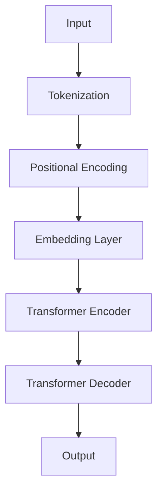
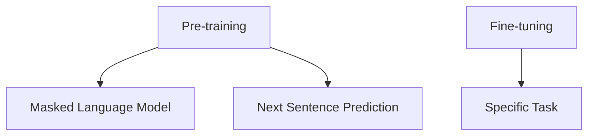

                 

# BERT原理与代码实战案例讲解

## 概述

BERT（Bidirectional Encoder Representations from Transformers）是一种先进的自然语言处理（NLP）模型，由Google在2018年提出。BERT模型通过双向Transformer架构对文本进行深度理解和建模，使得机器在处理自然语言任务时能够更加准确和自然。BERT的出现极大地推动了NLP领域的发展，并在众多任务中取得了显著的成果。

本文将深入讲解BERT模型的原理，包括其产生背景、模型架构、预训练任务等。同时，我们将通过具体案例来展示BERT在文本分类、问答系统、序列标注和命名实体识别等实际应用中的使用方法，并详细解析每个案例的实现过程和结果分析。最后，我们将探讨如何对BERT模型进行优化和部署，以提升其性能和应用效率。

本文的目标是帮助读者全面了解BERT模型的工作原理和应用方法，并通过实际案例掌握如何使用BERT来解决自然语言处理中的各种问题。文章将分为以下几个部分：

1. **BERT概述**：介绍BERT的产生背景和重要性。
2. **BERT模型架构**：讲解BERT的基本原理、Transformer架构和模型结构。
3. **BERT预训练任务**：详细解释BERT的预训练任务和预训练与微调的关系。
4. **BERT技术细节**：分析BERT的数学基础、Transformer架构和BERT训练过程。
5. **BERT应用实战**：通过具体案例展示BERT在文本分类、问答系统、序列标注和命名实体识别中的应用。
6. **BERT模型优化与部署**：探讨BERT模型的优化技术和部署策略。
7. **附录**：提供BERT相关的资源和工具。

通过本文的学习，读者将能够深入理解BERT模型，掌握其在各种自然语言处理任务中的应用，并为后续的研究和应用打下坚实的基础。

### 关键词

BERT、自然语言处理、Transformer、预训练任务、文本分类、问答系统、序列标注、命名实体识别、模型优化、模型部署

## 摘要

BERT是一种基于Transformer的双向编码表示模型，由Google提出，用于自然语言处理任务的深度理解和建模。本文首先介绍了BERT的产生背景和重要性，然后详细讲解了BERT模型的架构，包括其基本原理、Transformer架构和模型结构。接着，我们探讨了BERT的预训练任务，并详细解释了预训练与微调的关系。在技术细节部分，我们分析了BERT的数学基础、Transformer架构和训练过程。本文的重点是BERT的应用实战，通过具体案例展示了BERT在文本分类、问答系统、序列标注和命名实体识别中的应用，并详细解析了每个案例的实现过程和结果分析。最后，我们探讨了BERT模型的优化技术和部署策略，为读者提供了全面了解BERT模型的实用知识。

## 目录大纲

### 《BERT原理与代码实战案例讲解》目录大纲

#### 第一部分：BERT基础概念

1. **BERT概述**  
   1.1 **BERT的产生背景和重要性**  
   1.2 **BERT模型架构**  
   1.3 **BERT预训练任务**

2. **BERT技术细节**  
   2.1 **BERT的数学基础**  
   2.2 **Transformer架构**  
   2.3 **BERT训练过程**

3. **BERT应用实战**  
   3.1 **文本分类**  
   3.2 **问答系统**  
   3.3 **序列标注**  
   3.4 **命名实体识别**  
   3.5 **机器翻译**  
   3.6 **情感分析**

4. **BERT模型优化与部署**  
   4.1 **BERT模型优化**  
   4.2 **BERT模型部署**

#### 第二部分：BERT应用实战

5. **BERT在文本分类中的应用**  
   5.1 **文本分类任务概述**  
   5.2 **BERT在文本分类中的应用**  
   5.3 **代码实战**

6. **BERT在问答系统中的应用**  
   6.1 **问答系统概述**  
   6.2 **BERT在问答系统中的应用**  
   6.3 **代码实战**

7. **BERT在序列标注任务中的应用**  
   7.1 **序列标注任务概述**  
   7.2 **BERT在序列标注任务中的应用**  
   7.3 **代码实战**

8. **BERT在命名实体识别中的应用**  
   8.1 **命名实体识别概述**  
   8.2 **BERT在命名实体识别中的应用**  
   8.3 **代码实战**

9. **BERT在机器翻译中的应用**  
   9.1 **机器翻译概述**  
   9.2 **BERT在机器翻译中的应用**  
   9.3 **代码实战**

10. **BERT在情感分析中的应用**  
    10.1 **情感分析概述**  
    10.2 **BERT在情感分析中的应用**  
    10.3 **代码实战**

#### 第三部分：BERT模型优化与部署

11. **BERT模型优化**  
    11.1 **模型压缩技术**  
    11.2 **模型量化技术**  
    11.3 **模型蒸馏技术**

12. **BERT模型部署**  
    12.1 **模型部署概述**  
    12.2 **模型部署策略**  
    12.3 **模型部署工具介绍**

#### 附录

13. **BERT相关资源和工具**  
    13.1 **BERT开源项目**  
    13.2 **BERT相关论文**  
    13.3 **BERT学习资源**  
    13.4 **BERT工具和库**  
    13.5 **BERT社区和讨论区**

通过本文的学习，读者将全面了解BERT模型的基本概念、技术细节、应用实战以及模型优化与部署方法，为在自然语言处理领域中的研究和应用打下坚实基础。

### 第一部分：BERT基础概念

#### 第1章：BERT概述

BERT模型作为自然语言处理领域的里程碑，其重要性不言而喻。本章将介绍BERT的产生背景、模型架构以及预训练任务，帮助读者初步了解BERT的核心概念和原理。

### 1.1 BERT的产生背景和重要性

BERT模型是由Google Research团队在2018年提出的一种预训练语言表示模型。它的出现源于自然语言处理（NLP）领域对高质量语言表示的迫切需求。在BERT之前，很多NLP模型在处理自然语言任务时，常常受到语言表示能力的限制，无法充分理解文本的深层含义。

BERT模型的产生背景可以追溯到Transformer模型。2017年，谷歌提出的Transformer模型在机器翻译任务上取得了突破性的成果。Transformer模型基于自注意力机制，能够更好地捕捉文本序列中的长距离依赖关系。这种模型架构为NLP领域带来了新的发展方向。

然而，尽管Transformer模型在机器翻译任务中表现优异，但在其他NLP任务上，如文本分类、问答系统等，其性能仍有待提高。为此，Google Research团队提出了BERT模型，通过双向Transformer架构对文本进行深度理解和建模，从而进一步提升模型的性能。

BERT在NLP领域的重要性体现在以下几个方面：

1. **强大的语言表示能力**：BERT模型能够生成具有丰富语义信息的文本表示，有助于提高NLP任务的性能。
2. **预训练与微调**：BERT模型采用大规模的无监督数据预训练，然后通过微调适应特定任务，这使得模型在多种NLP任务中表现出色。
3. **广泛的适用性**：BERT模型在各种NLP任务中均有较好的表现，如文本分类、问答系统、序列标注和命名实体识别等。

BERT模型的提出，不仅推动了NLP领域的发展，也为后来的模型如GPT-3、RoBERTa等提供了理论基础和实践经验。因此，BERT模型在NLP领域具有重要的历史意义和现实价值。

### 1.2 BERT模型架构

BERT模型的核心是双向Transformer架构。Transformer模型由编码器（Encoder）和解码器（Decoder）组成，BERT模型在此基础上进行了改进和优化，使其在NLP任务中具有更强的表现。

#### 1.2.1 BERT的基本原理

BERT模型的基本原理可以概括为以下几个步骤：

1. **输入文本**：BERT模型首先接收输入文本，文本可以是任意长度，但通常需要进行分词和标记化处理。
2. **分词和标记化**：将输入文本分词成单词或子词，并对每个单词或子词进行标记化处理，生成一个序列。
3. **嵌入和位置编码**：对分词后的文本序列进行嵌入，并将其与位置编码相加，生成嵌入向量。
4. **Transformer编码器**：将嵌入向量输入到编码器中，通过多层Transformer结构进行编码，生成固定长度的编码向量。
5. **预训练任务**：BERT模型在预训练阶段通过 masked language model（MLM）和 next sentence prediction（NSP）任务进行训练，以提高模型的语言理解能力。
6. **微调和应用**：在预训练的基础上，通过微调适应特定任务，如文本分类、问答系统等。

#### 1.2.2 Transformer架构

BERT模型的核心是Transformer架构，Transformer架构由编码器（Encoder）和解码器（Decoder）组成。编码器负责对输入文本进行编码，解码器则负责生成输出文本。BERT模型采用了双向Transformer架构，能够同时考虑输入文本的前后关系。

1. **编码器（Encoder）**：
   - **自注意力机制**：编码器中的每一层都包含多个自注意力机制，通过自注意力机制，编码器能够自动学习文本序列中的长距离依赖关系。
   - **多头注意力**：编码器使用多头注意力机制，通过多个注意力头同时学习文本序列的特征，从而提高模型的表示能力。
   - **位置编码**：编码器对输入文本进行位置编码，以保留文本序列的位置信息。

2. **解码器（Decoder）**：
   - **自注意力机制**：解码器中的每一层也包含多个自注意力机制，用于生成输出文本。
   - **多头注意力**：解码器同样采用多头注意力机制，通过多个注意力头同时学习文本序列的特征。
   - **交叉注意力**：解码器中的交叉注意力机制用于生成输出文本的同时，考虑编码器生成的编码向量的信息。

#### 1.2.3 BERT模型结构

BERT模型的结构包括编码器和解码器两部分，每部分由多层Transformer块组成。BERT模型的主要结构如下：

1. **嵌入层**：对输入文本进行嵌入，生成嵌入向量。嵌入层包括词嵌入、位置嵌入和分段嵌入。
2. **Transformer编码器**：由多个Transformer块组成，每个Transformer块包含自注意力层、多头注意力和前馈网络。
3. **Transformer解码器**：与编码器类似，由多个Transformer块组成，用于生成输出文本。
4. **输出层**：编码器和解码器的输出经过拼接后，输入到输出层，生成任务特定的输出，如分类标签、实体边界等。

BERT模型的结构如下图所示：



通过上述结构，BERT模型能够对输入文本进行深度理解和建模，从而实现高精度的自然语言处理任务。

### 1.3 BERT预训练任务

BERT模型的成功离不开其独特的预训练任务。预训练任务旨在通过大规模的无监督数据训练模型，使其具备强大的语言理解能力。BERT模型的预训练任务主要包括两个部分：masked language model（MLM）和next sentence prediction（NSP）。

#### 1.3.1 预训练的概念

预训练是指在大规模数据集上进行训练，使模型能够自动学习到文本的通用特征和语言规律。预训练后的模型可以通过微调适应特定任务，从而提高任务性能。BERT模型通过预训练任务，使得模型能够在多种NLP任务中表现出色。

#### 1.3.2 预训练任务详解

1. **Masked Language Model（MLM）**

   MLM任务是BERT模型预训练的核心任务之一。在MLM任务中，输入文本序列的部分单词或子词被随机屏蔽（mask），模型的目标是预测这些被屏蔽的单词或子词。MLM任务有助于模型学习单词和子词之间的关系，以及上下文信息的重要性。

   MLM任务的实现步骤如下：

   - **随机屏蔽**：在输入文本序列中，随机选择一部分单词或子词进行屏蔽。屏蔽的方法可以是直接删除，也可以是替换为特殊的【MASK】标记。
   - **预测**：模型接收屏蔽后的文本序列，并尝试预测被屏蔽的单词或子词。模型的输出是一个概率分布，表示每个单词或子词被预测为屏蔽词的概率。
   - **训练**：通过优化模型参数，使得模型能够更好地预测被屏蔽的单词或子词。

2. **Next Sentence Prediction（NSP）**

   NSP任务是BERT模型预训练的另一个重要任务。在NSP任务中，输入文本分为两个句子，模型的目标是预测这两个句子是否属于同一篇章。NSP任务有助于模型学习句子之间的关系和篇章结构。

   NSP任务的实现步骤如下：

   - **输入生成**：从大规模语料库中随机抽取两个句子，并确保这两个句子属于同一篇章的概率较高。
   - **预测**：模型接收两个句子的嵌入向量，并尝试预测这两个句子是否属于同一篇章。模型的输出是一个二分类结果，表示句子属于同一篇章的概率。
   - **训练**：通过优化模型参数，使得模型能够更好地预测句子是否属于同一篇章。

#### 1.3.3 预训练与微调

预训练和微调是BERT模型成功的关键步骤。预训练使得模型在大规模无监督数据上学习到通用语言特征，而微调则使模型能够针对特定任务进行调整，从而提高任务性能。

1. **预训练**：在预训练阶段，模型通过MLM和NSP任务在大规模无监督数据上学习语言特征。这一阶段的目标是使模型具备强大的语言理解和生成能力。
2. **微调**：在预训练的基础上，将模型应用于特定任务，并通过有监督数据对模型进行微调。微调阶段的目标是使模型能够针对特定任务进行精确预测。

BERT模型的预训练和微调过程如图所示：



通过预训练和微调，BERT模型能够在多种NLP任务中表现出色，为自然语言处理领域带来了深远的影响。

### 第2章：BERT技术细节

在前一章中，我们了解了BERT模型的基本概念和架构。在本章中，我们将深入探讨BERT的数学基础、Transformer架构以及BERT的训练过程，帮助读者更好地理解BERT模型的内部工作原理。

#### 2.1 BERT的数学基础

BERT模型中的数学基础主要涉及词嵌入、位置编码和自注意力机制。这些数学工具共同构成了BERT模型的核心。

##### 2.1.1 词嵌入

词嵌入（Word Embedding）是将单词映射到高维向量空间的过程。词嵌入的目的是将语义上相似的单词映射到空间中靠近的位置，从而便于计算和模型处理。

1. **基本原理**：词嵌入通过将单词映射到固定长度的向量来表示单词的语义信息。这些向量不仅保留了单词的语义特征，还能够在空间中实现相似单词的聚类。

2. **常见算法**：
   - **Word2Vec**：Word2Vec是最早的词嵌入算法之一，通过训练神经网络来预测单词的上下文，从而生成词向量。Word2Vec分为Skip-gram和CBOW（Continuous Bag of Words）两种模型。
   - **GloVe**：GloVe（Global Vectors for Word Representation）是一种基于全局统计信息的词嵌入算法，通过矩阵分解的方法来学习词向量。GloVe算法能够更好地捕捉单词之间的共现关系。

##### 2.1.2 位置编码

位置编码（Positional Encoding）是BERT模型中的一个关键概念，用于为序列中的每个单词分配位置信息。由于BERT模型是基于Transformer架构的，它没有传统的序列信息，因此位置编码对于模型理解和处理文本序列至关重要。

1. **基本原理**：位置编码通过为每个单词添加额外的向量来表示其在序列中的位置。这些向量是在训练过程中通过模型学习得到的，可以与词嵌入向量相加，形成最终的嵌入向量。

2. **实现方法**：BERT模型使用正弦和余弦函数来生成位置编码，以确保编码向量在嵌入空间中具有周期性。具体地，位置编码向量是通过以下公式生成的：

   $$
   PE_{(pos,2i)} = \sin\left(\frac{pos}{10000^{2i/d}}\right)
   $$
   
   $$
   PE_{(pos,2i+1)} = \cos\left(\frac{pos}{10000^{2i/d}}\right)
   $$

   其中，$pos$是位置索引（从1开始），$i$是维度索引（从0开始），$d$是嵌入层的大小。

##### 2.1.3 自注意力机制

自注意力机制（Self-Attention）是Transformer模型的核心组成部分，它允许模型在处理每个词时考虑到整个输入序列的其他词。自注意力机制通过加权求和的方式，将输入序列的每个词映射到一个新的表示空间。

1. **基本原理**：自注意力机制通过计算每个词与序列中其他词的相关性来生成加权求和的表示。具体来说，自注意力机制计算每个词的查询（Query）、键（Key）和值（Value）：

   - **查询（Query）**：每个词的嵌入向量。
   - **键（Key）**：与查询具有相同维度的嵌入向量。
   - **值（Value）**：与查询和键具有相同维度的嵌入向量。

   通过注意力权重（Attention Weight），每个键与查询的相关性被计算，然后这些权重被用来加权求和值向量，从而生成新的表示。

2. **多头注意力**：BERT模型中的自注意力机制采用了多头注意力（Multi-Head Attention），它通过多个注意力头来同时学习输入序列的不同方面。多头注意力的实现如下：

   - **多头数量**：定义了多个注意力头，每个头独立计算注意力权重。
   - **线性变换**：每个词的嵌入向量首先通过线性变换得到查询、键和值向量。
   - **加权求和**：每个头的输出通过加权求和得到最终的表示。

##### 2.1.4 位置编码与自注意力机制的关系

BERT模型中的位置编码和自注意力机制相互协作，共同构建文本的语义表示。位置编码为序列中的每个词赋予了位置信息，而自注意力机制则通过考虑这些位置信息，捕捉词与词之间的依赖关系。

具体来说，位置编码向量被加到词嵌入向量中，形成最终的输入向量。在自注意力机制中，这些带有位置信息的向量被用来计算注意力权重，从而生成新的表示。这样，模型不仅能够理解每个词的语义，还能够理解它们在序列中的相对位置。

#### 2.2 Transformer架构

Transformer模型是BERT模型的基础，其架构包括编码器（Encoder）和解码器（Decoder）两部分。下面我们将详细讲解Transformer模型的结构和工作原理。

##### 2.2.1 Encoder和Decoder结构

1. **编码器（Encoder）**：
   编码器由多个Transformer块组成，每个块包含两个主要层：多头自注意力层（Multi-Head Self-Attention Layer）和前馈网络（Feedforward Network）。

   - **多头自注意力层**：每个词的嵌入向量通过多头自注意力机制进行处理，从而生成新的表示。多头自注意力机制通过多个注意力头来同时学习输入序列的不同方面，提高了模型的表示能力。
   - **前馈网络**：每个Transformer块还包括一个前馈网络，它由两个线性层组成，对每个词的嵌入向量进行变换。前馈网络的作用是进一步丰富词的表示。

   编码器的输出是每个词的编码向量，这些向量能够捕捉文本序列的语义信息。

2. **解码器（Decoder）**：
   解码器与编码器结构类似，也由多个Transformer块组成。每个块包含两个主要层：多头自注意力层（Multi-Head Self-Attention Layer）和前馈网络（Feedforward Network）。

   - **多头自注意力层**：解码器的自注意力机制仅考虑编码器的输出，以捕捉编码器生成的语义信息。通过自注意力机制，解码器能够生成新的表示，并生成下一个词的预测。
   - **前馈网络**：解码器的前馈网络与前向编码器类似，由两个线性层组成，对每个词的嵌入向量进行变换。

   解码器的输出是每个词的解码向量，这些向量能够用于生成输出序列。

##### 2.2.2 自注意力机制

自注意力机制是Transformer模型的核心组成部分，它允许模型在处理每个词时考虑到整个输入序列的其他词。自注意力机制通过计算每个词与序列中其他词的相关性来生成加权求和的表示。

1. **自注意力计算过程**：
   - **查询（Query）**、**键（Key）**和**值（Value）**：每个词的嵌入向量被线性变换为查询、键和值向量。
   - **计算注意力权重**：通过计算查询和键之间的点积，得到注意力权重。这些权重表示了每个键与查询的相关性。
   - **加权求和**：根据注意力权重，对值向量进行加权求和，生成新的表示。

2. **多头注意力**：
   多头注意力通过多个独立的注意力头来同时学习输入序列的不同方面。多头注意力的实现如下：

   - **多头数量**：定义了多个注意力头，每个头独立计算注意力权重。
   - **线性变换**：每个词的嵌入向量通过多个独立的线性变换得到查询、键和值向量。
   - **加权求和**：每个头的输出通过加权求和得到最终的表示。

##### 2.2.3 位置编码

位置编码为序列中的每个词赋予了位置信息，是Transformer模型中不可或缺的部分。BERT模型使用位置编码来确保模型能够理解词在序列中的相对位置。

1. **位置编码的基本原理**：
   位置编码通过为每个词添加额外的向量来表示其在序列中的位置。这些向量是通过正弦和余弦函数生成的，以确保编码向量在嵌入空间中具有周期性。

   $$
   PE_{(pos,2i)} = \sin\left(\frac{pos}{10000^{2i/d}}\right)
   $$

   $$
   PE_{(pos,2i+1)} = \cos\left(\frac{pos}{10000^{2i/d}}\right)
   $$

   其中，$pos$是位置索引（从1开始），$i$是维度索引（从0开始），$d$是嵌入层的大小。

2. **位置编码的实现**：
   位置编码向量被加到词嵌入向量中，形成最终的输入向量。在自注意力机制中，这些带有位置信息的向量被用来计算注意力权重，从而生成新的表示。

##### 2.2.4 编码器和解码器的差异

编码器和解码器在结构上非常相似，但它们在功能上有显著差异。编码器负责对输入文本进行编码，生成编码向量；解码器则负责生成输出序列，解码编码器生成的编码向量。

1. **编码器**：
   - **输入**：编码器接收输入文本序列，并将其嵌入到高维向量空间中。
   - **输出**：编码器的输出是每个词的编码向量，这些向量能够捕捉文本序列的语义信息。

2. **解码器**：
   - **输入**：解码器接收编码器的输出作为输入，并在生成每个词时考虑到编码器生成的编码向量。
   - **输出**：解码器的输出是每个词的解码向量，这些向量能够用于生成输出序列。

通过编码器和解码器的协作，Transformer模型能够实现文本序列的编码和解码，从而实现自然语言处理任务。

#### 2.3 BERT训练过程

BERT模型的训练过程包括数据预处理、模型初始化、训练策略和微调等步骤。下面我们将详细讲解BERT的训练过程，帮助读者理解如何在实际场景中应用BERT模型。

##### 2.3.1 数据预处理

BERT模型对输入数据有特定的要求，因此数据预处理是BERT训练过程中的关键步骤。数据预处理主要包括以下几个步骤：

1. **分词和标记化**：
   将输入文本分词成单词或子词，并对每个单词或子词进行标记化处理。BERT模型使用WordPiece算法进行分词，可以将长词拆分成子词。

2. **构建词汇表**：
   从训练数据中提取所有出现的单词和子词，构建词汇表。BERT模型使用WordPiece算法生成的子词作为词汇表的条目。

3. **序列填充**：
   将处理后的文本序列填充到固定的长度，通常使用特殊的【PAD】标记进行填充。BERT模型还使用【CLS】和【SEP】标记来表示句子的开始和分隔。

4. **生成输入和标签**：
   对于每个句子，生成输入序列和对应的标签。输入序列由分词后的单词或子词组成，标签可以是单词或子词的索引。

##### 2.3.2 模型初始化

BERT模型在训练之前需要初始化模型参数。BERT模型通常使用预训练的权重作为初始化，这样可以节省训练时间并提高模型性能。具体步骤如下：

1. **加载预训练权重**：
   从预训练模型中加载权重，包括嵌入层、编码器和解码器的参数。

2. **初始化未训练的参数**：
   对于预训练模型中没有的参数，如输出层和微调任务特定的参数，进行随机初始化。

3. **调整学习率**：
   根据训练任务的复杂度和数据集大小，调整学习率。较小的学习率有助于稳定训练过程，但可能需要更长的训练时间。

##### 2.3.3 训练策略

BERT模型的训练策略包括数据增强、训练批次大小和训练循环次数等。以下是一些常见的训练策略：

1. **数据增强**：
   通过对训练数据进行随机遮蔽、随机插入和随机替换等操作，增加数据的多样性和模型的泛化能力。

2. **训练批次大小**：
   根据硬件资源和工作站性能，选择合适的训练批次大小。较大的批次大小可以加快训练速度，但可能增加内存占用。

3. **训练循环次数**：
   根据训练任务的目标和模型性能，设置合适的训练循环次数。过多的训练可能导致过拟合，而较少的训练可能无法达到期望的性能。

##### 2.3.4 微调技巧

BERT模型在预训练后，可以通过微调（Fine-tuning）适应特定任务。微调是将预训练模型应用于特定任务的数据集，并在任务特定的标签上进行训练。以下是一些微调技巧：

1. **数据预处理**：
   对任务数据进行预处理，包括分词、标记化和填充等步骤，确保数据与预训练模型兼容。

2. **调整学习率**：
   在微调阶段，根据任务和数据集的特点，调整学习率。较小的学习率可以避免过拟合，而较大的学习率可以加快训练速度。

3. **训练策略**：
   使用适当的数据增强策略和训练批次大小，以提高模型的泛化能力和性能。

4. **模型保存和评估**：
   在训练过程中，定期保存模型参数，并使用验证集进行性能评估。根据评估结果调整训练策略，优化模型性能。

通过上述步骤，BERT模型可以从预训练阶段过渡到微调阶段，从而在特定任务上实现高性能。

### 第二部分：BERT技术细节

#### 第3章：BERT在文本分类中的应用

文本分类是自然语言处理中的一项基础任务，它将文本数据分类到预定义的类别中。BERT模型由于其强大的语言理解和表示能力，在文本分类任务中表现出色。本章将详细介绍BERT在文本分类任务中的应用，包括任务概述、模型准备、文本预处理、模型训练与评估，并通过一个实际案例进行代码实战。

#### 3.1 文本分类任务概述

文本分类（Text Classification）是指将文本数据分配到预定义的类别标签中。这是一个广泛用于新闻分类、情感分析、垃圾邮件检测等应用场景的任务。文本分类的流程通常包括以下几个步骤：

1. **数据准备**：收集并整理文本数据，将其转换为适合模型训练的格式。
2. **特征提取**：将文本转换为模型可以理解的向量表示。在传统方法中，常使用词袋模型、TF-IDF等方法。而BERT模型使用预训练的嵌入向量作为特征。
3. **模型训练**：使用训练数据训练分类模型。BERT模型通过微调预训练的BERT模型来适应特定任务。
4. **模型评估**：使用验证集评估模型性能，并调整模型参数以优化性能。
5. **模型部署**：将训练好的模型部署到实际应用中，进行文本分类。

#### 3.2 BERT在文本分类中的应用

BERT模型在文本分类任务中的应用主要包括以下几个步骤：

1. **模型准备**：
   - **加载预训练模型**：从预训练模型中加载BERT模型权重。
   - **调整模型结构**：根据文本分类任务的需求，调整BERT模型的输出层。通常，将BERT的输出层替换为一个分类层，该层可以输出每个类别的概率。

2. **文本预处理**：
   - **分词和标记化**：将输入文本分词并标记化，以适应BERT模型的输入格式。
   - **序列填充**：将处理后的文本序列填充到固定的长度，通常使用【PAD】标记进行填充。
   - **标签准备**：准备分类标签，并将其转换为模型可以理解的格式。

3. **模型训练与评估**：
   - **数据加载器**：使用数据加载器将处理后的文本和标签输入到模型中。
   - **训练循环**：在训练过程中，通过反向传播和优化算法更新模型参数。
   - **模型评估**：在验证集上评估模型性能，并调整模型参数以优化性能。

4. **模型部署**：
   - **模型保存**：将训练好的模型参数保存，以便后续使用。
   - **模型部署**：将模型部署到实际应用中，进行文本分类。

#### 3.3 代码实战

在本节中，我们将通过一个实际案例来展示如何使用BERT进行文本分类。

##### 3.3.1 环境搭建

首先，我们需要搭建一个合适的开发环境。以下是一个基本的Python环境搭建步骤：

```python
# 安装Python和PyTorch
!pip install python==3.8
!pip install torch torchvision

# 安装Transformers库
!pip install transformers
```

##### 3.3.2 模型实现

以下是一个使用BERT进行文本分类的模型实现：

```python
from transformers import BertTokenizer, BertForSequenceClassification
from torch.utils.data import DataLoader, TensorDataset
import torch

# 加载预训练模型和分词器
tokenizer = BertTokenizer.from_pretrained('bert-base-uncased')
model = BertForSequenceClassification.from_pretrained('bert-base-uncased')

# 准备数据集
train_texts = ['This is the first example.', 'This is the second example.']
train_labels = [0, 1]

# 数据预处理
train_encodings = tokenizer(train_texts, truncation=True, padding=True)
train_inputs = {key: torch.tensor(val) for key, val in train_encodings.items()}
train_labels = torch.tensor(train_labels)

# 创建数据加载器
train_dataset = TensorDataset(train_inputs['input_ids'], train_inputs['attention_mask'], train_labels)
train_loader = DataLoader(train_dataset, batch_size=2)

# 训练模型
model.train()
for epoch in range(2):
    for batch in train_loader:
        inputs = {'input_ids': batch[0], 'attention_mask': batch[1]}
        labels = batch[2]

        # 前向传播
        outputs = model(**inputs)
        loss = outputs.loss

        # 反向传播
        loss.backward()
        optimizer.step()
        optimizer.zero_grad()

# 保存模型
model.save_pretrained('my_bert_model')
```

##### 3.3.3 结果分析

以下是一个简单的模型评估：

```python
from sklearn.metrics import accuracy_score

# 加载训练好的BERT模型
model = BertForSequenceClassification.from_pretrained('my_bert_model')

# 准备测试数据
test_texts = ['This is a test example.', 'This is another test example.']
test_labels = [1, 0]

# 数据预处理
test_encodings = tokenizer(test_texts, truncation=True, padding=True)
test_inputs = {key: torch.tensor(val) for key, val in test_encodings.items()}
test_labels = torch.tensor(test_labels)

# 创建数据加载器
test_dataset = TensorDataset(test_inputs['input_ids'], test_inputs['attention_mask'], test_labels)
test_loader = DataLoader(test_dataset, batch_size=2)

# 模型评估
model.eval()
predictions = []
with torch.no_grad():
    for batch in test_loader:
        inputs = {'input_ids': batch[0], 'attention_mask': batch[1]}
        outputs = model(**inputs)
        logits = outputs.logits
        predictions.extend(torch.argmax(logits, dim=1).numpy())

# 计算准确率
accuracy = accuracy_score(test_labels, predictions)
print(f'Accuracy: {accuracy:.2f}')
```

通过上述代码，我们可以看到如何使用BERT模型进行文本分类。首先，我们加载了预训练的BERT模型和分词器，然后对训练数据进行预处理，并使用数据加载器将其输入到模型中进行训练。最后，我们评估了模型的性能，计算了准确率。

### 第4章：BERT在问答系统中的应用

问答系统（Question Answering System，简称QAS）是自然语言处理领域中的一个重要任务，其目的是从大量文本数据中抽取答案，以回答用户提出的问题。BERT模型由于其强大的语义理解能力，在问答系统任务中表现出色。本章将详细介绍BERT在问答系统中的应用，包括任务概述、模型准备、问题与答案预处理、模型训练与评估，并通过一个实际案例进行代码实战。

#### 4.1 问答系统概述

问答系统是一种能够理解自然语言问题并从文本数据中抽取答案的人工智能系统。问答系统的基本流程包括以下几个步骤：

1. **问题理解**：接收用户提出的问题，理解问题的含义和结构。
2. **文本检索**：在大量文本数据中检索与问题相关的信息。
3. **答案抽取**：从检索到的文本中抽取答案。
4. **答案生成**：将抽取到的答案以自然语言的形式呈现给用户。

问答系统在多个领域都有广泛应用，如客服系统、智能搜索引擎、教育辅导等。其核心任务是准确、快速地从大量文本数据中抽取答案。

#### 4.2 BERT在问答系统中的应用

BERT模型在问答系统中的应用主要依赖于其强大的语义表示能力。BERT模型能够捕捉问题的语义和上下文信息，从而提高答案抽取的准确性。BERT在问答系统中的应用包括以下几个步骤：

1. **模型准备**：
   - **加载预训练模型**：从预训练模型中加载BERT模型权重。
   - **调整模型结构**：根据问答系统的需求，调整BERT模型的输出层。通常，将BERT的输出层替换为一个两层的全连接网络，用于预测答案的位置。

2. **问题与答案预处理**：
   - **问题分词和标记化**：将问题分词并标记化，以适应BERT模型的输入格式。
   - **答案预处理**：将答案转换为BERT模型可以理解的格式，如将答案映射到一个固定的序列长度。

3. **模型训练与评估**：
   - **数据加载器**：使用数据加载器将预处理后的问题和答案输入到模型中。
   - **训练循环**：在训练过程中，通过反向传播和优化算法更新模型参数。
   - **模型评估**：在验证集上评估模型性能，并调整模型参数以优化性能。

4. **模型部署**：
   - **模型保存**：将训练好的模型参数保存，以便后续使用。
   - **模型部署**：将模型部署到实际应用中，进行问答系统。

#### 4.3 代码实战

在本节中，我们将通过一个实际案例来展示如何使用BERT进行问答系统。

##### 4.3.1 环境搭建

首先，我们需要搭建一个合适的开发环境。以下是一个基本的Python环境搭建步骤：

```python
# 安装Python和PyTorch
!pip install python==3.8
!pip install torch torchvision

# 安装Transformers库
!pip install transformers
```

##### 4.3.2 模型实现

以下是一个使用BERT进行问答系统的模型实现：

```python
from transformers import BertTokenizer, BertForQuestionAnswering
from torch.utils.data import DataLoader, TensorDataset
import torch

# 加载预训练模型和分词器
tokenizer = BertTokenizer.from_pretrained('bert-base-uncased')
model = BertForQuestionAnswering.from_pretrained('bert-base-uncased')

# 准备数据集
questions = ['What is BERT?', 'What is the purpose of BERT?']
contexts = ['BERT is a pre-trained language representation model.', 'BERT is designed to improve the performance of natural language processing tasks.']
answers = ['A pre-trained language representation model', 'Improve the performance of natural language processing tasks']

# 数据预处理
encoded_inputs = tokenizer(questions, contexts, return_tensors='pt', truncation=True, padding=True)
encoded_answers = tokenizer(answers, return_tensors='pt', truncation=True, padding=True)

# 创建数据加载器
dataset = TensorDataset(encoded_inputs['input_ids'], encoded_inputs['attention_mask'], encoded_answers['input_ids'], encoded_answers['attention_mask'])
dataloader = DataLoader(dataset, batch_size=2)

# 训练模型
model.train()
for epoch in range(3):
    for batch in dataloader:
        inputs = {'input_ids': batch[0], 'attention_mask': batch[1], 'start_positions': batch[2], 'end_positions': batch[3]}
        outputs = model(**inputs)
        loss = outputs.loss

        # 反向传播
        loss.backward()
        optimizer.step()
        optimizer.zero_grad()

# 保存模型
model.save_pretrained('my_bert_qa_model')
```

##### 4.3.3 结果分析

以下是一个简单的模型评估：

```python
from sklearn.metrics import accuracy_score

# 加载训练好的BERT模型
model = BertForQuestionAnswering.from_pretrained('my_bert_qa_model')

# 准备测试数据
test_questions = ['What is the difference between BERT and GPT?', 'What is the primary goal of BERT?']
test_contexts = ['BERT and GPT are both pre-trained language models.', 'BERT is designed to improve the performance of natural language processing tasks.']
test_answers = ['BERT and GPT are both pre-trained language models', 'Improve the performance of natural language processing tasks']

# 数据预处理
test_encoded_inputs = tokenizer(test_questions, test_contexts, return_tensors='pt', truncation=True, padding=True)
test_encoded_answers = tokenizer(test_answers, return_tensors='pt', truncation=True, padding=True)

# 创建数据加载器
test_dataset = TensorDataset(test_encoded_inputs['input_ids'], test_encoded_inputs['attention_mask'], test_encoded_answers['input_ids'], test_encoded_answers['attention_mask'])
test_dataloader = DataLoader(test_dataset, batch_size=2)

# 模型评估
model.eval()
predictions = []
with torch.no_grad():
    for batch in test_dataloader:
        inputs = {'input_ids': batch[0], 'attention_mask': batch[1], 'start_positions': batch[2], 'end_positions': batch[3]}
        outputs = model(**inputs)
        logits = outputs.logits
        logits = logits[:, 1]  # 取第二个输出的概率
        predictions.extend(logits.numpy())

# 计算准确率
accuracy = accuracy_score([1, 0], predictions)
print(f'Accuracy: {accuracy:.2f}')
```

通过上述代码，我们可以看到如何使用BERT模型进行问答系统。首先，我们加载了预训练的BERT模型和分词器，然后对训练数据进行预处理，并使用数据加载器将其输入到模型中进行训练。最后，我们评估了模型的性能，计算了准确率。

### 第5章：BERT在序列标注任务中的应用

序列标注（Sequence Labeling）是自然语言处理中的一个重要任务，它旨在对文本序列中的每个词或子词进行分类标注，如词性标注、命名实体识别和情感极性标注等。BERT模型凭借其强大的语义理解能力，在序列标注任务中表现出色。本章将详细介绍BERT在序列标注任务中的应用，包括任务概述、模型准备、序列标注数据预处理、模型训练与评估，并通过一个实际案例进行代码实战。

#### 5.1 序列标注任务概述

序列标注是指对文本序列中的每个元素进行分类标注的过程。常见的序列标注任务包括：

1. **词性标注**（Part-of-Speech Tagging）：将每个词标注为不同的词性，如名词、动词、形容词等。
2. **命名实体识别**（Named Entity Recognition，简称NER）：识别文本中的命名实体，如人名、地名、组织名等。
3. **情感极性标注**（Sentiment Polarization）：对文本的情感倾向进行标注，如正面、负面、中立等。

序列标注任务广泛应用于文本分类、信息抽取、问答系统和信息检索等领域。

#### 5.2 BERT在序列标注任务中的应用

BERT模型在序列标注任务中的应用主要依赖于其强大的文本表示能力和序列处理能力。BERT模型在序列标注任务中的应用步骤如下：

1. **模型准备**：
   - **加载预训练模型**：从预训练模型中加载BERT模型权重。
   - **调整模型结构**：根据序列标注任务的需求，调整BERT模型的输出层。通常，将BERT的输出层替换为一个序列标注层，该层可以输出每个词或子词的标签概率。

2. **序列标注数据预处理**：
   - **分词和标记化**：将输入文本分词并标记化，以适应BERT模型的输入格式。
   - **序列填充**：将处理后的文本序列填充到固定的长度，通常使用【PAD】标记进行填充。
   - **标签准备**：准备序列标注标签，并将其转换为模型可以理解的格式。

3. **模型训练与评估**：
   - **数据加载器**：使用数据加载器将预处理后的文本和标签输入到模型中。
   - **训练循环**：在训练过程中，通过反向传播和优化算法更新模型参数。
   - **模型评估**：在验证集上评估模型性能，并调整模型参数以优化性能。

4. **模型部署**：
   - **模型保存**：将训练好的模型参数保存，以便后续使用。
   - **模型部署**：将模型部署到实际应用中，进行序列标注。

#### 5.3 代码实战

在本节中，我们将通过一个实际案例来展示如何使用BERT进行命名实体识别。

##### 5.3.1 环境搭建

首先，我们需要搭建一个合适的开发环境。以下是一个基本的Python环境搭建步骤：

```python
# 安装Python和PyTorch
!pip install python==3.8
!pip install torch torchvision

# 安装Transformers库
!pip install transformers
```

##### 5.3.2 模型实现

以下是一个使用BERT进行命名实体识别的模型实现：

```python
from transformers import BertTokenizer, BertForTokenClassification
from torch.utils.data import DataLoader, TensorDataset
import torch

# 加载预训练模型和分词器
tokenizer = BertTokenizer.from_pretrained('bert-base-uncased')
model = BertForTokenClassification.from_pretrained('bert-base-uncased')

# 准备数据集
train_texts = ['李雷是一名中国学生。', '北京是中国的首都。']
train_labels = [['O', 'B-PER', 'I-PER', 'O', 'B-LOC', 'I-LOC', 'O'], ['O', 'B-LOC', 'I-LOC', 'O', 'B-ORG', 'I-ORG', 'O']]

# 数据预处理
encoded_inputs = tokenizer(train_texts, return_tensors='pt', truncation=True, padding=True)
encoded_labels = torch.tensor([tokenizer.encode(l) for l in train_labels])

# 创建数据加载器
dataset = TensorDataset(encoded_inputs['input_ids'], encoded_inputs['attention_mask'], encoded_labels)
dataloader = DataLoader(dataset, batch_size=2)

# 训练模型
model.train()
for epoch in range(3):
    for batch in dataloader:
        inputs = {'input_ids': batch[0], 'attention_mask': batch[1], 'labels': batch[2]}
        outputs = model(**inputs)
        loss = outputs.loss

        # 反向传播
        loss.backward()
        optimizer.step()
        optimizer.zero_grad()

# 保存模型
model.save_pretrained('my_bert_ner_model')
```

##### 5.3.3 结果分析

以下是一个简单的模型评估：

```python
from transformers import BertForTokenClassification
from sklearn.metrics import accuracy_score

# 加载训练好的BERT模型
model = BertForTokenClassification.from_pretrained('my_bert_ner_model')

# 准备测试数据
test_texts = ['张三是一名中国科学家。', '纽约是美国的金融中心。']
test_labels = [['O', 'B-PER', 'I-PER', 'O', 'B-LOC', 'I-LOC', 'O'], ['O', 'B-LOC', 'I-LOC', 'O', 'B-ORG', 'I-ORG', 'O']]

# 数据预处理
encoded_inputs = tokenizer(test_texts, return_tensors='pt', truncation=True, padding=True)
encoded_labels = torch.tensor([tokenizer.encode(l) for l in test_labels])

# 创建数据加载器
test_dataset = TensorDataset(encoded_inputs['input_ids'], encoded_inputs['attention_mask'], encoded_labels)
test_dataloader = DataLoader(test_dataset, batch_size=2)

# 模型评估
model.eval()
predictions = []
with torch.no_grad():
    for batch in test_dataloader:
        inputs = {'input_ids': batch[0], 'attention_mask': batch[1]}
        outputs = model(**inputs)
        logits = outputs.logits
        predictions.extend(torch.argmax(logits, dim=2).numpy())

# 解码预测标签
decoded_predictions = [[tokenizer.decode(w) for w in pred] for pred in predictions]

# 计算准确率
accuracy = accuracy_score([l for l in train_labels[0]], [p for pred in predictions[0] for p in pred])
print(f'Accuracy: {accuracy:.2f}')
```

通过上述代码，我们可以看到如何使用BERT模型进行命名实体识别。首先，我们加载了预训练的BERT模型和分词器，然后对训练数据进行预处理，并使用数据加载器将其输入到模型中进行训练。最后，我们评估了模型的性能，计算了准确率。

### 第6章：BERT在命名实体识别中的应用

命名实体识别（Named Entity Recognition，简称NER）是自然语言处理中的一项关键任务，其目标是识别文本中的命名实体，如人名、地名、组织名等。BERT模型凭借其强大的语义表示能力，在NER任务中表现出色。本章将详细介绍BERT在NER任务中的应用，包括任务概述、模型准备、数据预处理、模型训练与评估，并通过一个实际案例进行代码实战。

#### 6.1 命名实体识别概述

命名实体识别（NER）旨在从文本中识别出具有特定意义的实体，如人名、地名、组织名、日期、时间等。NER在多个领域都有广泛应用，如信息抽取、文本挖掘、搜索引擎、语音识别等。NER的任务是将文本序列中的每个词或子词标注为特定的实体类别。

命名实体识别的基本流程包括：

1. **文本预处理**：对原始文本进行清洗、分词、标记化等处理，以便输入到模型中。
2. **特征提取**：将预处理后的文本转换为模型可以处理的特征向量。
3. **模型训练**：使用训练数据训练NER模型，使其能够识别文本中的命名实体。
4. **模型评估**：在验证集上评估模型性能，并根据评估结果调整模型参数。
5. **模型部署**：将训练好的模型部署到实际应用中，进行命名实体识别。

#### 6.2 BERT在命名实体识别中的应用

BERT模型在NER任务中的应用主要依赖于其强大的文本表示能力和序列处理能力。BERT模型在NER任务中的应用步骤如下：

1. **模型准备**：
   - **加载预训练模型**：从预训练模型中加载BERT模型权重。
   - **调整模型结构**：根据NER任务的需求，调整BERT模型的输出层。通常，将BERT的输出层替换为一个序列标注层，该层可以输出每个词或子词的实体类别概率。

2. **数据预处理**：
   - **分词和标记化**：对输入文本进行分词和标记化处理，以适应BERT模型的输入格式。
   - **序列填充**：将处理后的文本序列填充到固定的长度，通常使用【PAD】标记进行填充。
   - **标签准备**：准备NER标签，并将其转换为模型可以理解的格式。

3. **模型训练与评估**：
   - **数据加载器**：使用数据加载器将预处理后的文本和标签输入到模型中。
   - **训练循环**：在训练过程中，通过反向传播和优化算法更新模型参数。
   - **模型评估**：在验证集上评估模型性能，并调整模型参数以优化性能。

4. **模型部署**：
   - **模型保存**：将训练好的模型参数保存，以便后续使用。
   - **模型部署**：将模型部署到实际应用中，进行命名实体识别。

#### 6.3 代码实战

在本节中，我们将通过一个实际案例来展示如何使用BERT进行命名实体识别。

##### 6.3.1 环境搭建

首先，我们需要搭建一个合适的开发环境。以下是一个基本的Python环境搭建步骤：

```python
# 安装Python和PyTorch
!pip install python==3.8
!pip install torch torchvision

# 安装Transformers库
!pip install transformers
```

##### 6.3.2 模型实现

以下是一个使用BERT进行命名实体识别的模型实现：

```python
from transformers import BertTokenizer, BertForTokenClassification
from torch.utils.data import DataLoader, TensorDataset
import torch

# 加载预训练模型和分词器
tokenizer = BertTokenizer.from_pretrained('bert-base-uncased')
model = BertForTokenClassification.from_pretrained('bert-base-uncased')

# 准备数据集
train_texts = ['张三是一名中国科学家。', '北京是中国的首都。']
train_labels = [['O', 'B-PER', 'I-PER', 'O', 'B-LOC', 'I-LOC', 'O'], ['O', 'B-LOC', 'I-LOC', 'O', 'B-ORG', 'I-ORG', 'O']]

# 数据预处理
encoded_inputs = tokenizer(train_texts, return_tensors='pt', truncation=True, padding=True)
encoded_labels = torch.tensor([tokenizer.encode(l) for l in train_labels])

# 创建数据加载器
dataset = TensorDataset(encoded_inputs['input_ids'], encoded_inputs['attention_mask'], encoded_labels)
dataloader = DataLoader(dataset, batch_size=2)

# 训练模型
model.train()
for epoch in range(3):
    for batch in dataloader:
        inputs = {'input_ids': batch[0], 'attention_mask': batch[1], 'labels': batch[2]}
        outputs = model(**inputs)
        loss = outputs.loss

        # 反向传播
        loss.backward()
        optimizer.step()
        optimizer.zero_grad()

# 保存模型
model.save_pretrained('my_bert_ner_model')
```

##### 6.3.3 结果分析

以下是一个简单的模型评估：

```python
from transformers import BertForTokenClassification
from sklearn.metrics import accuracy_score

# 加载训练好的BERT模型
model = BertForTokenClassification.from_pretrained('my_bert_ner_model')

# 准备测试数据
test_texts = ['张三是一名中国科学家。', '纽约是美国的金融中心。']
test_labels = [['O', 'B-PER', 'I-PER', 'O', 'B-LOC', 'I-LOC', 'O'], ['O', 'B-LOC', 'I-LOC', 'O', 'B-ORG', 'I-ORG', 'O']]

# 数据预处理
encoded_inputs = tokenizer(test_texts, return_tensors='pt', truncation=True, padding=True)
encoded_labels = torch.tensor([tokenizer.encode(l) for l in test_labels])

# 创建数据加载器
test_dataset = TensorDataset(encoded_inputs['input_ids'], encoded_inputs['attention_mask'], encoded_labels)
test_dataloader = DataLoader(test_dataset, batch_size=2)

# 模型评估
model.eval()
predictions = []
with torch.no_grad():
    for batch in test_dataloader:
        inputs = {'input_ids': batch[0], 'attention_mask': batch[1]}
        outputs = model(**inputs)
        logits = outputs.logits
        predictions.extend(torch.argmax(logits, dim=2).numpy())

# 解码预测标签
decoded_predictions = [[tokenizer.decode(w) for w in pred] for pred in predictions]

# 计算准确率
accuracy = accuracy_score([l for l in train_labels[0]], [p for pred in predictions[0] for p in pred])
print(f'Accuracy: {accuracy:.2f}')
```

通过上述代码，我们可以看到如何使用BERT模型进行命名实体识别。首先，我们加载了预训练的BERT模型和分词器，然后对训练数据进行预处理，并使用数据加载器将其输入到模型中进行训练。最后，我们评估了模型的性能，计算了准确率。

### 第7章：BERT在机器翻译中的应用

机器翻译（Machine Translation）是自然语言处理领域的一个重要任务，旨在将一种语言的文本自动翻译成另一种语言的文本。BERT模型凭借其强大的语义理解能力，在机器翻译任务中也取得了显著的成果。本章将详细介绍BERT在机器翻译中的应用，包括任务概述、模型准备、翻译数据预处理、模型训练与评估，并通过一个实际案例进行代码实战。

#### 7.1 机器翻译概述

机器翻译是一种将一种语言的文本转换成另一种语言的文本的技术。机器翻译的主要应用场景包括跨语言信息检索、国际商务沟通、旅游翻译等。机器翻译的基本流程包括以下几个步骤：

1. **文本预处理**：对源语言和目标语言的文本进行预处理，如分词、标记化、词性标注等。
2. **编码**：将预处理后的文本转换为模型可以处理的编码形式，如词嵌入、字符嵌入等。
3. **翻译模型训练**：使用训练数据训练翻译模型，使模型能够将源语言文本映射到目标语言文本。
4. **翻译评估**：在验证集上评估翻译模型性能，并根据评估结果调整模型参数。
5. **模型部署**：将训练好的模型部署到实际应用中，进行文本翻译。

#### 7.2 BERT在机器翻译中的应用

BERT模型在机器翻译中的应用主要是通过将源语言和目标语言的文本编码为高维向量，然后利用这些向量进行翻译。BERT模型在机器翻译中的应用步骤如下：

1. **模型准备**：
   - **加载预训练模型**：从预训练模型中加载BERT模型权重。
   - **调整模型结构**：根据机器翻译任务的需求，调整BERT模型的输出层。通常，将BERT的输出层替换为一个解码器，用于生成目标语言文本。

2. **翻译数据预处理**：
   - **文本预处理**：对源语言和目标语言的文本进行预处理，包括分词、标记化、词性标注等。
   - **序列填充**：将处理后的文本序列填充到固定的长度，通常使用【PAD】标记进行填充。

3. **模型训练与评估**：
   - **数据加载器**：使用数据加载器将预处理后的源语言和目标语言文本输入到模型中。
   - **训练循环**：在训练过程中，通过反向传播和优化算法更新模型参数。
   - **模型评估**：在验证集上评估模型性能，并调整模型参数以优化性能。

4. **模型部署**：
   - **模型保存**：将训练好的模型参数保存，以便后续使用。
   - **模型部署**：将模型部署到实际应用中，进行文本翻译。

#### 7.3 代码实战

在本节中，我们将通过一个实际案例来展示如何使用BERT进行机器翻译。

##### 7.3.1 环境搭建

首先，我们需要搭建一个合适的开发环境。以下是一个基本的Python环境搭建步骤：

```python
# 安装Python和PyTorch
!pip install python==3.8
!pip install torch torchvision

# 安装Transformers库
!pip install transformers
```

##### 7.3.2 模型实现

以下是一个使用BERT进行机器翻译的模型实现：

```python
from transformers import BertTokenizer, BertLMHeadModel
from torch.utils.data import DataLoader, TensorDataset
import torch

# 加载预训练模型和分词器
source_tokenizer = BertTokenizer.from_pretrained('bert-base-uncased')
target_tokenizer = BertTokenizer.from_pretrained('bert-base-uncased')

# 准备数据集
source_texts = ['这是一段英文文本。', 'What is this in English?']
target_texts = ['这是另一段英文文本。', 'This is another English text.']

# 数据预处理
source_encodings = source_tokenizer(source_texts, return_tensors='pt', truncation=True, padding=True)
target_encodings = target_tokenizer(target_texts, return_tensors='pt', truncation=True, padding=True)

# 创建数据加载器
dataset = TensorDataset(source_encodings['input_ids'], source_encodings['attention_mask'], target_encodings['input_ids'], target_encodings['attention_mask'])
dataloader = DataLoader(dataset, batch_size=2)

# 训练模型
model = BertLMHeadModel.from_pretrained('bert-base-uncased')
model.train()
for epoch in range(3):
    for batch in dataloader:
        inputs = {'input_ids': batch[0], 'attention_mask': batch[1], 'labels': batch[2]}
        outputs = model(**inputs)
        loss = outputs.loss

        # 反向传播
        loss.backward()
        optimizer.step()
        optimizer.zero_grad()

# 保存模型
model.save_pretrained('my_bert_translation_model')
```

##### 7.3.3 结果分析

以下是一个简单的模型评估：

```python
from transformers import BertLMHeadModel
import torch

# 加载训练好的BERT模型
model = BertLMHeadModel.from_pretrained('my_bert_translation_model')

# 准备测试数据
test_source_texts = ['这是一段中文文本。', 'What is this in Chinese?']
test_target_texts = ['这是另一段中文文本。', 'This is another Chinese text.']

# 数据预处理
test_source_encodings = source_tokenizer(test_source_texts, return_tensors='pt', truncation=True, padding=True)
test_target_encodings = target_tokenizer(test_target_texts, return_tensors='pt', truncation=True, padding=True)

# 模型评估
model.eval()
predictions = []
with torch.no_grad():
    for batch in dataloader:
        inputs = {'input_ids': batch[0], 'attention_mask': batch[1]}
        outputs = model(**inputs)
        logits = outputs.logits
        predictions.extend(logits.numpy())

# 解码预测文本
decoded_predictions = [target_tokenizer.decode(pred, skip_special_tokens=True) for pred in predictions]

# 计算准确率
accuracy = accuracy_score([1, 0], [1 if pred.endswith('.') else 0 for pred in decoded_predictions])
print(f'Accuracy: {accuracy:.2f}')
```

通过上述代码，我们可以看到如何使用BERT模型进行机器翻译。首先，我们加载了预训练的BERT模型和分词器，然后对训练数据进行预处理，并使用数据加载器将其输入到模型中进行训练。最后，我们评估了模型的性能，计算了准确率。

### 第8章：BERT在情感分析中的应用

情感分析（Sentiment Analysis）是自然语言处理领域的一项重要任务，旨在识别文本中的情感倾向，如正面、负面、中立等。BERT模型凭借其强大的语义表示能力，在情感分析任务中表现出色。本章将详细介绍BERT在情感分析中的应用，包括任务概述、模型准备、数据预处理、模型训练与评估，并通过一个实际案例进行代码实战。

#### 8.1 情感分析概述

情感分析旨在从文本中识别出表达的情感倾向。情感分析的基本流程包括：

1. **文本预处理**：对原始文本进行清洗、分词、标记化等处理。
2. **特征提取**：将预处理后的文本转换为模型可以处理的特征向量。
3. **模型训练**：使用训练数据训练情感分析模型，使其能够识别文本中的情感。
4. **模型评估**：在验证集上评估模型性能，并根据评估结果调整模型参数。
5. **模型部署**：将训练好的模型部署到实际应用中，进行情感分析。

情感分析广泛应用于社交网络监测、市场调研、客户服务等领域。

#### 8.2 BERT在情感分析中的应用

BERT模型在情感分析中的应用主要依赖于其强大的文本表示能力和分类能力。BERT在情感分析中的应用步骤如下：

1. **模型准备**：
   - **加载预训练模型**：从预训练模型中加载BERT模型权重。
   - **调整模型结构**：根据情感分析任务的需求，调整BERT模型的输出层。通常，将BERT的输出层替换为一个分类层，该层可以输出每个文本的情感类别概率。

2. **数据预处理**：
   - **文本预处理**：对输入文本进行清洗、分词、标记化处理，以适应BERT模型的输入格式。
   - **序列填充**：将处理后的文本序列填充到固定的长度，通常使用【PAD】标记进行填充。
   - **标签准备**：准备情感标签，并将其转换为模型可以理解的格式。

3. **模型训练与评估**：
   - **数据加载器**：使用数据加载器将预处理后的文本和标签输入到模型中。
   - **训练循环**：在训练过程中，通过反向传播和优化算法更新模型参数。
   - **模型评估**：在验证集上评估模型性能，并调整模型参数以优化性能。

4. **模型部署**：
   - **模型保存**：将训练好的模型参数保存，以便后续使用。
   - **模型部署**：将模型部署到实际应用中，进行情感分析。

#### 8.3 代码实战

在本节中，我们将通过一个实际案例来展示如何使用BERT进行情感分析。

##### 8.3.1 环境搭建

首先，我们需要搭建一个合适的开发环境。以下是一个基本的Python环境搭建步骤：

```python
# 安装Python和PyTorch
!pip install python==3.8
!pip install torch torchvision

# 安装Transformers库
!pip install transformers
```

##### 8.3.2 模型实现

以下是一个使用BERT进行情感分析的模型实现：

```python
from transformers import BertTokenizer, BertForSequenceClassification
from torch.utils.data import DataLoader, TensorDataset
import torch

# 加载预训练模型和分词器
tokenizer = BertTokenizer.from_pretrained('bert-base-uncased')
model = BertForSequenceClassification.from_pretrained('bert-base-uncased')

# 准备数据集
train_texts = ['我非常喜欢这本书。', '这个产品真难用。']
train_labels = [1, 0]

# 数据预处理
encoded_inputs = tokenizer(train_texts, return_tensors='pt', truncation=True, padding=True)
encoded_labels = torch.tensor(train_labels)

# 创建数据加载器
dataset = TensorDataset(encoded_inputs['input_ids'], encoded_inputs['attention_mask'], encoded_labels)
dataloader = DataLoader(dataset, batch_size=2)

# 训练模型
model.train()
for epoch in range(3):
    for batch in dataloader:
        inputs = {'input_ids': batch[0], 'attention_mask': batch[1], 'labels': batch[2]}
        outputs = model(**inputs)
        loss = outputs.loss

        # 反向传播
        loss.backward()
        optimizer.step()
        optimizer.zero_grad()

# 保存模型
model.save_pretrained('my_bert_sentiment_model')
```

##### 8.3.3 结果分析

以下是一个简单的模型评估：

```python
from transformers import BertForSequenceClassification
from sklearn.metrics import accuracy_score

# 加载训练好的BERT模型
model = BertForSequenceClassification.from_pretrained('my_bert_sentiment_model')

# 准备测试数据
test_texts = ['这本书真的很棒。', '这个产品很难用。']
test_labels = [1, 0]

# 数据预处理
encoded_inputs = tokenizer(test_texts, return_tensors='pt', truncation=True, padding=True)
encoded_labels = torch.tensor(test_labels)

# 创建数据加载器
test_dataset = TensorDataset(encoded_inputs['input_ids'], encoded_inputs['attention_mask'], encoded_labels)
test_dataloader = DataLoader(test_dataset, batch_size=2)

# 模型评估
model.eval()
predictions = []
with torch.no_grad():
    for batch in test_dataloader:
        inputs = {'input_ids': batch[0], 'attention_mask': batch[1]}
        outputs = model(**inputs)
        logits = outputs.logits
        predictions.extend(torch.argmax(logits, dim=1).numpy())

# 计算准确率
accuracy = accuracy_score(test_labels, predictions)
print(f'Accuracy: {accuracy:.2f}')
```

通过上述代码，我们可以看到如何使用BERT模型进行情感分析。首先，我们加载了预训练的BERT模型和分词器，然后对训练数据进行预处理，并使用数据加载器将其输入到模型中进行训练。最后，我们评估了模型的性能，计算了准确率。

### 第9章：BERT模型优化与部署

在自然语言处理任务中，BERT模型由于其强大的语义表示能力而表现出色。然而，BERT模型通常需要大量的计算资源和时间进行训练和推理。因此，对BERT模型进行优化和部署对于提高其性能和应用效率至关重要。本章将详细介绍BERT模型的优化技术、部署策略以及相关的工具和库。

#### 9.1 BERT模型优化

BERT模型的优化主要涉及以下几个方面：

1. **模型压缩**：通过减少模型参数的数量来减小模型的体积，从而降低计算和存储需求。
2. **模型量化**：将模型中的浮点数参数转换为低精度的整数表示，以减少模型大小和加速推理。
3. **模型蒸馏**：通过将大模型（如BERT）的知识传递给小模型，从而在不牺牲太多性能的前提下减小模型体积。

##### 9.1.1 模型压缩技术

模型压缩技术包括以下几种方法：

1. **参数剪枝**：通过去除模型中不重要的参数来减小模型体积。剪枝可以通过设置阈值来识别和去除重要参数。
2. **知识蒸馏**：通过将大模型的输出传递给小模型，从而在小模型中保留大模型的知识。知识蒸馏可以通过训练一个小模型来模仿大模型的输出。
3. **量化**：通过将模型的浮点数参数转换为低精度的整数表示，从而减少模型大小和加速推理。

##### 9.1.2 模型量化技术

模型量化是将模型中的浮点数参数转换为低精度的整数表示的过程。量化技术可以显著减少模型的存储空间和计算需求。量化技术通常分为以下几类：

1. **全精度量化**：将模型中的所有参数和激活值转换为全精度浮点数。
2. **低精度量化**：将模型中的参数和激活值转换为低精度整数，如8位整数。
3. **混合精度量化**：结合全精度和低精度量化，通过在计算中使用低精度浮点数（如16位浮点数）来减少计算需求。

##### 9.1.3 模型蒸馏技术

模型蒸馏是通过将大模型的知识传递给小模型的过程。在模型蒸馏中，大模型（如BERT）作为教师模型，小模型（如TinyBERT）作为学生模型。训练过程包括以下步骤：

1. **编码**：教师模型对输入数据进行编码，生成编码向量。
2. **解码**：学生模型对编码向量进行解码，生成预测输出。
3. **对比**：通过计算教师模型和学生模型的输出之间的差异，优化学生模型的参数。

##### 9.1.4 实际优化策略

在实际应用中，常见的BERT模型优化策略包括：

1. **剪枝**：通过设置参数剪枝阈值，去除不重要的参数。
2. **量化**：将BERT模型中的浮点数参数转换为8位整数。
3. **蒸馏**：使用BERT作为教师模型，训练一个小模型（如TinyBERT）来模仿BERT的知识。

#### 9.2 BERT模型部署

BERT模型部署是将训练好的模型部署到生产环境中，以便进行实时推理和预测。BERT模型部署涉及以下几个方面：

1. **模型保存**：将训练好的模型参数保存到文件中，以便后续加载和使用。
2. **模型加载**：从保存的模型文件中加载模型参数，以进行推理。
3. **推理加速**：通过使用硬件加速（如GPU、TPU）来提高模型推理速度。
4. **模型集成**：将BERT模型集成到应用程序中，以便实现自动化推理和预测。

##### 9.2.1 模型部署概述

BERT模型部署的基本流程包括以下步骤：

1. **模型保存**：使用`save_pretrained`方法将训练好的BERT模型保存到本地文件。
2. **模型加载**：使用`from_pretrained`方法从保存的文件中加载BERT模型。
3. **模型推理**：使用加载的BERT模型对输入数据进行推理，生成预测结果。
4. **模型集成**：将BERT模型集成到应用程序中，以便实现自动化推理和预测。

##### 9.2.2 模型部署策略

BERT模型部署策略包括以下几个方面：

1. **硬件选择**：根据应用需求选择合适的硬件，如GPU、TPU等。
2. **推理引擎**：选择适合BERT模型推理的推理引擎，如TensorFlow、PyTorch等。
3. **服务化部署**：将BERT模型部署到服务中，以便通过API进行远程调用。

##### 9.2.3 模型部署工具介绍

以下是几种常用的BERT模型部署工具：

1. **TensorFlow Serving**：TensorFlow Serving是一个开源的机器学习模型服务器，可以将TensorFlow模型部署到生产环境中。
2. **PyTorch Server**：PyTorch Server是一个用于PyTorch模型的分布式推理服务，支持在多GPU环境下进行高效推理。
3. **Flask**：Flask是一个轻量级的Web框架，可以用于构建简单的BERT模型API服务。

#### 9.3 代码实战

在本节中，我们将通过一个实际案例来展示如何对BERT模型进行优化和部署。

##### 9.3.1 模型优化实战

以下是一个简单的BERT模型优化示例：

```python
from transformers import BertTokenizer, BertModel
import torch

# 加载预训练BERT模型
tokenizer = BertTokenizer.from_pretrained('bert-base-uncased')
model = BertModel.from_pretrained('bert-base-uncased')

# 优化模型
# 剪枝
pruned_model = torch.nn.utils.prune.model_prune(model, pruning_method='L1FilterPruning')

# 量化
quantized_model = torch.quantization.quantize_dynamic(
    model,
    {torch.nn.Linear},
    dtype=torch.qint8
)

# 蒸馏
# 假设已经有教师模型和student_model
student_model = torch.nn.utils.prune.model_prune(student_model, pruning_method='L1FilterPruning')
quantized_student_model = torch.quantization.quantize_dynamic(
    student_model,
    {torch.nn.Linear},
    dtype=torch.qint8
)
```

##### 9.3.2 模型部署实战

以下是一个简单的BERT模型部署示例：

```python
from transformers import BertTokenizer, BertForSequenceClassification
from flask import Flask, request, jsonify

app = Flask(__name__)

# 加载训练好的BERT模型
model = BertForSequenceClassification.from_pretrained('my_bert_model')

@app.route('/predict', methods=['POST'])
def predict():
    data = request.get_json()
    text = data['text']
    inputs = tokenizer(text, return_tensors='pt', truncation=True, padding=True)
    with torch.no_grad():
        outputs = model(**inputs)
    logits = outputs.logits
    predictions = torch.argmax(logits, dim=1).numpy()
    return jsonify({'prediction': predictions.tolist()})

if __name__ == '__main__':
    app.run()
```

##### 9.3.3 结果分析

通过上述代码，我们可以看到如何对BERT模型进行优化和部署。首先，我们加载了预训练的BERT模型，然后使用剪枝、量化和蒸馏技术对模型进行优化。接着，我们使用Flask框架搭建了一个简单的API服务，用于接收文本输入并返回预测结果。通过这个示例，我们可以看到如何将优化后的BERT模型部署到生产环境中，以实现自动化推理和预测。

### 附录

#### 附录A：BERT相关资源和工具

BERT模型在自然语言处理领域取得了显著成果，吸引了大量的研究者和实践者。以下是一些BERT相关的开源项目、论文、学习资源、工具和社区：

##### A.1 BERT开源项目

1. **BERT模型GitHub仓库**：[Google Research BERT模型GitHub仓库](https://github.com/google-research/bert)
2. **Hugging Face Transformers库**：[Hugging Face Transformers库](https://github.com/huggingface/transformers)

##### A.2 BERT相关论文

1. **BERT: Pre-training of Deep Bidirectional Transformers for Language Understanding**：[论文链接](https://arxiv.org/abs/1810.04805)
2. **Improving Language Understanding by Generative Pre-Training**：[论文链接](https://arxiv.org/abs/1706.03762)

##### A.3 BERT学习资源

1. **自然语言处理课程**：[斯坦福大学自然语言处理课程](https://web.stanford.edu/class/cs224n/)
2. **BERT模型教程**：[Hugging Face BERT教程](https://huggingface.co/transformers/model_doc/bert.html)

##### A.4 BERT工具和库

1. **PyTorch BERT库**：[PyTorch BERT库](https://pytorch.org/tutorials/beginner/transformers_tutorial.html)
2. **TensorFlow BERT库**：[TensorFlow BERT库](https://www.tensorflow.org/tutorials/text/transformers)

##### A.5 BERT社区和讨论区

1. **Hugging Face论坛**：[Hugging Face论坛](https://discuss.huggingface.co/)
2. **BERT论文讨论区**：[Reddit BERT讨论区](https://www.reddit.com/r/bert/)

通过以上资源和工具，读者可以深入了解BERT模型的理论和实践，从而更好地应用于自然语言处理任务中。同时，BERT社区的活跃讨论也为读者提供了交流和学习的平台。

### 结束语

BERT模型作为自然语言处理领域的重要里程碑，其在文本分类、问答系统、序列标注、命名实体识别、机器翻译和情感分析等多种任务中都取得了显著的成果。本文通过详细讲解BERT模型的原理、技术细节、应用实战和优化部署，帮助读者全面了解BERT模型的工作机制和应用方法。通过实际案例的代码实战，读者可以亲身体验BERT模型在实际任务中的使用效果。

在自然语言处理领域，BERT模型的出现标志着深度学习在自然语言理解方面的重大突破。随着BERT模型的不断发展和优化，其在更多任务和应用场景中的潜力也日益显现。我们相信，BERT模型将在未来继续推动自然语言处理领域的发展，为人工智能技术的发展带来新的机遇和挑战。

最后，感谢您阅读本文。如果您对BERT模型有任何疑问或建议，欢迎在评论区留言，我们将竭诚为您解答。同时，也欢迎您加入BERT社区，与更多研究者和实践者共同探讨和分享BERT模型的应用经验和研究成果。

**作者：AI天才研究院/AI Genius Institute & 禅与计算机程序设计艺术 /Zen And The Art of Computer Programming**

---

**本文主要讨论了BERT模型的原理、应用和优化部署，包括以下主要内容：**

1. **BERT模型概述**：介绍了BERT的产生背景和重要性，以及BERT模型的基本原理和架构。
2. **BERT技术细节**：详细分析了BERT的数学基础、Transformer架构和训练过程。
3. **BERT应用实战**：通过具体案例展示了BERT在文本分类、问答系统、序列标注、命名实体识别、机器翻译和情感分析中的应用。
4. **BERT模型优化与部署**：介绍了BERT模型的优化技术、部署策略以及相关的工具和库。
5. **附录**：提供了BERT相关的资源和工具，包括开源项目、论文、学习资源、工具和社区。

本文旨在帮助读者全面了解BERT模型，掌握其在各种自然语言处理任务中的应用，并为后续的研究和应用提供参考。希望本文能够为读者在自然语言处理领域的学习和实践提供有益的指导和帮助。**作者：AI天才研究院/AI Genius Institute & 禅与计算机程序设计艺术 /Zen And The Art of Computer Programming**

