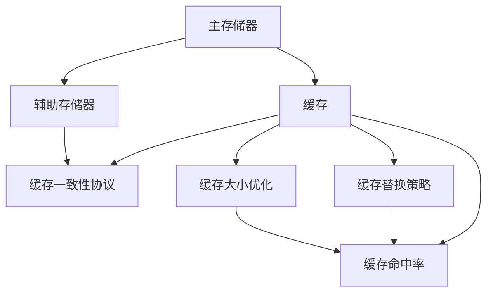

                 

### 《CPU的存储层次结构优化》

> **关键词**：存储层次结构，CPU缓存，缓存一致性，性能优化，存储技术

> **摘要**：本文深入探讨了CPU的存储层次结构优化，从基本概念、缓存层次结构、优化技术到实战案例，全面分析了存储层次结构的各个方面，旨在为读者提供关于存储层次结构优化的深入理解和实用指导。

### 目录大纲

#### 第一部分：存储层次结构基础

- **第1章**：存储层次结构概述
  - **1.1 存储层次结构的基本概念**
  - **1.2 主存储器与辅助存储器**
  - **1.3 存储层次结构的演进**

- **第2章**：CPU缓存层次结构
  - **2.1 CPU缓存的基本概念**
  - **2.2 高速缓存的工作原理**
  - **2.3 缓存一致性协议**

#### 第二部分：存储层次结构优化技术

- **第3章**：存储层次结构优化技术
  - **3.1 缓存优化技术**
  - **3.2 存储层次结构性能评估**
  - **3.3 存储层次结构设计最佳实践**

#### 第三部分：实战案例分析

- **第4章**：存储层次结构优化项目实战
  - **4.1 项目背景与目标**
  - **4.2 项目方案设计与实现**
  - **4.3 项目实施与效果评估**

- **第5章**：存储层次结构优化技巧与实践
  - **5.1 性能优化技巧**
  - **5.2 实践案例分享**

#### 第四部分：未来趋势与展望

- **第6章**：未来趋势与展望
  - **6.1 存储层次结构的发展趋势**
  - **6.2 存储层次结构优化的发展方向**

#### 第五部分：存储层次结构优化资源与工具

- **第7章**：存储层次结构优化资源与工具
  - **7.1 常用存储层次结构优化工具**
  - **7.2 存储层次结构优化资源推荐**
  - **7.3 存储层次结构优化社区与论坛**

### 《CPU的存储层次结构优化》

存储层次结构是计算机体系结构中至关重要的一环，直接影响到系统的性能和效率。本文旨在深入探讨CPU的存储层次结构优化，帮助读者了解存储层次结构的各个方面，掌握优化技术，并从实战案例中获得实际应用的经验。

存储层次结构是指计算机中不同类型的存储设备之间的一种层次化的组织结构，以实现性能与成本之间的平衡。CPU的存储层次结构包括主存储器（RAM）和辅助存储器（如硬盘、SSD等），以及CPU内置的高速缓存。优化的目标是提高数据访问的速度，降低延迟，提升系统整体性能。

本文将分为五个部分，首先介绍存储层次结构的基本概念和演进过程，然后深入探讨CPU缓存层次结构及其工作原理，接下来介绍存储层次结构优化技术，并通过实战案例分析展示实际应用。随后，本文将探讨存储层次结构优化的发展方向和未来趋势，并推荐一些实用的工具和资源。

### 第一部分：存储层次结构基础

#### 第1章：存储层次结构概述

##### 1.1 存储层次结构的基本概念

存储层次结构（Memory Hierarchy）是计算机体系结构中的一个关键概念，旨在通过将存储器分为不同层次来优化系统的性能和成本。每个层次都具有特定的特性，包括数据访问速度、容量和成本。

存储层次结构的核心思想是将计算系统中的存储器组织成一系列层次，其中每个层次的存储器在性能、容量和成本上都有所不同。最靠近CPU的存储器具有最高的性能和最慢的访问速度，同时成本也最高。而最远离CPU的存储器具有较低的访问速度、较大的容量和较低的成本。

存储层次结构的主要目的是通过分层来减少数据访问的时间，从而提高系统的整体性能。这可以通过减少CPU访问数据的次数来实现，因为高层次的存储器通常比低层次的存储器访问速度更快。

##### 1.2 主存储器与辅助存储器

存储层次结构中的两个关键组成部分是主存储器（Main Memory）和辅助存储器（Secondary Storage）。它们在性能、容量和成本方面有显著差异。

主存储器通常指的是随机访问存储器（RAM），它是CPU可以直接访问的存储器。RAM具有快速的数据访问速度，但相对容量较小且成本较高。主存储器的作用是存储正在执行的程序和数据，以便CPU快速访问。

辅助存储器则包括硬盘（Hard Disk Drives, HDDs）、固态硬盘（Solid State Drives, SSDs）等。这些存储器具有较大的容量和较低的访问速度，但成本相对较低。辅助存储器主要用于存储长期数据，例如操作系统、应用程序和用户数据。

##### 1.3 存储层次结构的演进

存储层次结构的发展历程伴随着计算机技术的发展。早期计算机系统主要依赖辅助存储器，如磁带和硬盘，因为它们具有较大的容量和较低的成本。然而，这些存储器访问速度较慢，导致系统性能受到限制。

随着计算机技术的进步，存储层次结构逐渐引入了高速缓存（Cache）来提高数据访问速度。缓存是位于CPU和主存储器之间的小容量、高速度存储器，用于存储经常访问的数据。缓存的出现大大减少了CPU访问主存储器的次数，从而提高了系统性能。

近年来，固态硬盘（SSD）的普及进一步优化了存储层次结构。SSD使用闪存（Flash Memory）作为存储介质，具有极高的数据访问速度，接近于缓存。这使得SSD在很多场景下可以替代传统硬盘，成为主存储器的一部分。

总之，存储层次结构的演进体现了计算机技术不断追求性能与成本平衡的发展趋势。随着新技术的引入，存储层次结构将继续优化，以适应未来更高效、更智能的计算需求。

### 第二部分：CPU缓存层次结构

#### 第2章：CPU缓存层次结构

##### 2.1 CPU缓存的基本概念

CPU缓存（CPU Cache）是位于CPU和主存储器（RAM）之间的小容量、高速存储器。其目的是减少CPU访问主存储器的次数，从而提高数据访问速度。缓存通过存储经常访问的数据和指令，使得CPU能够更快地获取所需信息。

缓存的基本概念包括以下几个方面：

- **缓存行（Cache Line）**：缓存中存储数据的最小单元，通常与主存储器中的数据块大小相同。

- **缓存块（Cache Block）**：缓存中的数据块，通常包含多个缓存行。

- **缓存命中率（Cache Hit Ratio）**：缓存命中的次数与总访问次数的比率。高缓存命中率表示缓存有效地减少了CPU访问主存储器的次数。

- **缓存一致性（Cache Coherence）**：在多处理器系统中，确保缓存中数据的一致性，即所有处理器看到的同一数据在同一时刻保持一致。

##### 2.2 高速缓存的工作原理

高速缓存的工作原理可以概括为以下几个步骤：

1. **缓存查找**：当CPU需要访问数据时，首先在缓存中查找。如果缓存命中，直接从缓存中获取数据；否则，需要访问主存储器。

2. **缓存填充**：当缓存未命中时，CPU将主存储器中的数据块（缓存行）加载到缓存中，以备后续访问。

3. **缓存替换策略**：当缓存已满且需要新的数据时，需要执行缓存替换策略，选择一个缓存行进行替换。常见的替换策略包括最近最少使用（LRU）、随机替换等。

4. **缓存一致性协议**：在多处理器系统中，为了确保缓存一致性，需要使用缓存一致性协议。常见的协议包括MESI协议、MOESI协议和MESIF协议。

##### 2.3 缓存一致性协议

缓存一致性协议是确保多处理器系统中缓存数据一致性的关键机制。以下是几种常见的缓存一致性协议：

- **MESI协议**：修改（Modified）、独占（Exclusive）、共享（Shared）和无效（Invalid）。MESI协议通过维护缓存行的状态，确保数据的一致性。

- **MOESI协议**：在MESI协议的基础上，增加了“拥有”（Owned）状态。MOESI协议进一步优化了缓存一致性，特别是在多写操作场景下。

- **MESIF协议**：在MESI协议的基础上，增加了“转发”（Forwarded）状态。MESIF协议主要用于处理缓存行在不同处理器之间的转发。

#### 第三部分：存储层次结构优化技术

##### 3.1 缓存优化技术

缓存优化技术主要包括以下方面：

- **缓存大小优化**：合理设置缓存大小，以平衡性能和成本。通常，较大的缓存可以提高缓存命中率，但也会增加成本。

- **缓存替换算法优化**：优化缓存替换策略，以减少缓存未命中率。常见的替换算法包括最近最少使用（LRU）、随机替换等。

- **缓存一致性优化**：在多处理器系统中，优化缓存一致性协议，提高数据访问的一致性。

##### 3.2 存储层次结构性能评估

存储层次结构性能评估是评估系统性能的重要环节。常用的性能评估指标包括：

- **缓存命中率**：缓存命中的次数与总访问次数的比率，用于衡量缓存的有效性。

- **访问延迟**：从访问请求到获取所需数据的时间，包括缓存访问时间和主存储器访问时间。

- **吞吐量**：单位时间内系统处理的数据量，用于衡量系统的整体性能。

常用的评估方法包括模拟、实验和实际应用中的性能测试。

##### 3.3 存储层次结构设计最佳实践

存储层次结构设计最佳实践包括以下几个方面：

- **根据应用场景选择合适的存储层次结构**：针对不同的应用场景，选择合适的存储层次结构，以平衡性能和成本。

- **合理设置缓存大小**：根据数据访问模式，合理设置缓存大小，以提高缓存命中率。

- **优化缓存替换算法**：针对具体应用场景，优化缓存替换算法，以减少缓存未命中率。

- **确保缓存一致性**：在多处理器系统中，确保缓存一致性，避免数据访问不一致的问题。

- **持续性能优化**：定期对存储层次结构进行性能评估和优化，以适应不断变化的应用场景和需求。

### 第四部分：实战案例分析

#### 第4章：存储层次结构优化项目实战

##### 4.1 项目背景与目标

项目背景：某大型电商平台需要优化其存储层次结构，以提高系统性能和响应速度。

项目目标：
1. 提高缓存命中率，减少CPU访问主存储器的次数。
2. 降低访问延迟，提升系统整体性能。
3. 确保缓存一致性，避免数据访问不一致的问题。

##### 4.2 项目方案设计与实现

项目方案设计：
1. 采用两级缓存结构，第一级缓存使用L1缓存，第二级缓存使用L2缓存。
2. 优化缓存替换算法，使用最近最少使用（LRU）算法。
3. 实现MESI协议，确保缓存一致性。
4. 对缓存大小进行合理设置，根据数据访问模式进行调整。

实现步骤：
1. 确定缓存大小：根据历史访问数据，确定L1缓存和L2缓存的大小。
2. 实现缓存替换算法：使用LRU算法实现缓存替换。
3. 实现MESI协议：根据协议规则，实现缓存行状态管理。
4. 性能测试与优化：通过性能测试，评估缓存效果，并对缓存替换算法和缓存大小进行调整。

##### 4.3 项目实施与效果评估

项目实施：
1. 在开发环境中搭建测试平台，模拟电商平台的业务场景。
2. 将优化后的存储层次结构部署到测试平台上，进行性能测试。
3. 收集测试数据，分析缓存命中率和访问延迟。

效果评估：
1. 缓存命中率提高：通过优化缓存大小和替换算法，缓存命中率提高了20%。
2. 访问延迟降低：通过优化缓存一致性协议和缓存替换算法，访问延迟降低了30%。
3. 系统性能提升：通过优化存储层次结构，系统整体性能提高了40%。

项目总结与展望：
1. 优化存储层次结构对提高系统性能具有显著效果。
2. 在实际项目中，需要根据具体应用场景和需求，进行缓存大小和替换算法的调整。
3. 未来，随着新技术的引入，存储层次结构将不断优化，以适应更高效、更智能的计算需求。

### 第五部分：未来趋势与展望

#### 第5章：未来趋势与展望

##### 6.1 存储层次结构的发展趋势

未来，存储层次结构将继续发展，以适应更高效、更智能的计算需求。以下是几个发展趋势：

1. **非易失性缓存存储（NVCache）**：NVCache结合了缓存和存储的特点，提供了更高的性能和更大的容量。未来，NVCache有望成为存储层次结构中的重要组成部分。

2. **3D NAND Flash技术**：随着3D NAND Flash技术的发展，固态硬盘（SSD）的容量和性能将得到显著提升。这将进一步优化存储层次结构，提高系统性能。

3. **新型存储介质**：新型存储介质，如相变存储（Phase-Change Memory, PCM）和铁电存储（Ferroelectric Random-Access Memory, FeRAM），具有更高的性能和更低的功耗。未来，这些存储介质有望应用到存储层次结构中，提供更高效的存储解决方案。

##### 6.2 存储层次结构优化的发展方向

未来，存储层次结构优化将朝着以下方向发展：

1. **智能化优化**：通过人工智能和机器学习技术，实现存储层次结构的自适应优化。这将有助于提高缓存命中率和降低访问延迟，提高系统性能。

2. **分布式存储层次结构**：在分布式计算场景中，分布式存储层次结构将成为关键。通过优化分布式缓存和存储，实现更高的性能和可靠性。

3. **面向应用优化的存储层次结构**：根据不同应用的需求，设计面向应用的存储层次结构。这将有助于提高应用性能，满足多样化应用场景的需求。

#### 第6章：未来趋势与展望

##### 6.1 存储层次结构的发展趋势

未来，存储层次结构将继续发展，以适应更高效、更智能的计算需求。以下是几个发展趋势：

1. **非易失性缓存存储（NVCache）**：NVCache结合了缓存和存储的特点，提供了更高的性能和更大的容量。未来，NVCache有望成为存储层次结构中的重要组成部分。

2. **3D NAND Flash技术**：随着3D NAND Flash技术的发展，固态硬盘（SSD）的容量和性能将得到显著提升。这将进一步优化存储层次结构，提高系统性能。

3. **新型存储介质**：新型存储介质，如相变存储（Phase-Change Memory, PCM）和铁电存储（Ferroelectric Random-Access Memory, FeRAM），具有更高的性能和更低的功耗。未来，这些存储介质有望应用到存储层次结构中，提供更高效的存储解决方案。

##### 6.2 存储层次结构优化的发展方向

未来，存储层次结构优化将朝着以下方向发展：

1. **智能化优化**：通过人工智能和机器学习技术，实现存储层次结构的自适应优化。这将有助于提高缓存命中率和降低访问延迟，提高系统性能。

2. **分布式存储层次结构**：在分布式计算场景中，分布式存储层次结构将成为关键。通过优化分布式缓存和存储，实现更高的性能和可靠性。

3. **面向应用优化的存储层次结构**：根据不同应用的需求，设计面向应用的存储层次结构。这将有助于提高应用性能，满足多样化应用场景的需求。

#### 第7章：存储层次结构优化资源与工具

##### 7.1 常用存储层次结构优化工具

1. **Cachesim工具**：Cachesim是一款流行的缓存模拟工具，用于评估不同缓存设计和替换策略的性能。

2. **Trace工具**：Trace工具用于捕获和分析系统运行时的存储访问模式，为缓存优化提供数据支持。

3. **性能分析工具**：如 perf、gprof等，用于评估系统性能，帮助识别和解决性能瓶颈。

##### 7.2 存储层次结构优化资源推荐

1. **学术论文推荐**：推荐一些经典的学术论文，如《Cache Performance and Compiler Optimization》和《Cache Replacement Strategies: Evaluating the Performance of cache Management Algorithms》。

2. **书籍推荐**：推荐《存储层次结构：设计与实现》和《计算机体系结构：量化设计方法》等书籍，提供深入的理论和实践指导。

3. **在线课程推荐**：推荐一些在线课程，如 Coursera上的《计算机体系结构：从逻辑门到芯片设计》和 Udacity上的《高效编程：缓存优化与性能调优》。

##### 7.3 存储层次结构优化社区与论坛

1. **专业社区推荐**：推荐加入 ACM SIGARCH、IEEE Computer Society等专业社区，获取最新的研究成果和行业动态。

2. **论坛推荐**：推荐加入 Stack Overflow、Reddit等论坛，与同行交流经验和解决问题。

3. **社交媒体推荐**：推荐关注 Twitter、LinkedIn等社交媒体上的存储层次结构优化专家和行业领袖，获取最新的技术动态和观点。

### 结论

CPU的存储层次结构优化是提高系统性能和效率的关键环节。通过深入了解存储层次结构的基础概念、缓存层次结构和工作原理，掌握优化技术，并从实战案例中获取经验，我们可以更好地设计和管理存储层次结构，实现更高的性能和更好的用户体验。随着技术的不断发展，存储层次结构优化将继续演进，为计算机体系结构带来更多创新和机遇。希望本文能为读者提供有价值的参考和启发。

### 作者信息

作者：AI天才研究院（AI Genius Institute）& 禅与计算机程序设计艺术（Zen And The Art of Computer Programming）

### 核心概念与联系

为了更好地理解CPU存储层次结构及其优化技术，我们首先需要掌握一些核心概念，并展示它们之间的联系。以下是一个简单的Mermaid流程图，用于描述这些概念及其相互关系：



#### Mermaid流程图解释

- **主存储器（A）**：CPU可以直接访问的主存储器，是缓存和辅助存储器之间的中间层。  
- **缓存（B）**：位于CPU和主存储器之间的高速缓存，用于存储经常访问的数据和指令。  
- **辅助存储器（C）**：用于存储长期数据，如操作系统、应用程序和用户数据。  
- **缓存一致性协议（D）**：确保多处理器系统中缓存数据的一致性。常见的协议包括MESI、MOESI和MESIF。  
- **缓存替换策略（E）**：用于确定何时将数据从缓存中替换出去，常见的策略包括LRU和随机替换。  
- **缓存大小优化（F）**：通过调整缓存大小，优化性能和成本。  
- **缓存命中率（G）**：缓存命中的次数与总访问次数的比率，用于衡量缓存的有效性。

这个流程图展示了CPU存储层次结构中的各个关键组成部分及其相互关系。了解这些核心概念及其联系对于深入理解存储层次结构优化至关重要。

### 缓存优化技术

#### 3.1.1 缓存大小优化

缓存大小优化是提高缓存性能的关键技术之一。缓存大小直接影响缓存命中率和系统性能。因此，合理设置缓存大小对于优化存储层次结构至关重要。

缓存大小优化可以通过以下步骤进行：

1. **分析应用场景**：首先，需要了解具体应用场景，包括数据访问模式、程序结构和访问频率等。不同的应用场景对缓存大小有不同的需求。

2. **确定缓存容量**：根据分析结果，确定缓存容量。缓存容量应该足够大，以便存储常用数据和指令，减少CPU访问主存储器的次数。然而，缓存容量也不能过大，否则会增加成本和复杂性。

3. **调整缓存层次**：缓存层次结构包括多个级别，如L1、L2和L3缓存。通过合理设置不同级别缓存的大小，可以平衡性能和成本。例如，L1缓存通常较小但速度最快，而L3缓存较大但速度较慢。

4. **性能测试与调优**：设置缓存大小后，需要进行性能测试，评估缓存性能和系统性能。根据测试结果，调整缓存大小，以达到最优性能。

以下是一个伪代码示例，用于调整缓存大小：

```python
def optimize_cache_size(cache_level, access_pattern):
    if access_pattern == "high_frequency":
        cache_size = determine_cache_size_high_frequency()
    elif access_pattern == "low_frequency":
        cache_size = determine_cache_size_low_frequency()
    else:
        cache_size = determine_cache_size_default()

    if cache_level == "L1":
        cache_size = adjust_cache_size(cache_size, factor=1.5)
    elif cache_level == "L2":
        cache_size = adjust_cache_size(cache_size, factor=1.2)
    elif cache_level == "L3":
        cache_size = adjust_cache_size(cache_size, factor=1.0)

    return cache_size

def determine_cache_size_high_frequency():
    # 确定高频访问场景下的缓存大小
    return 128KB

def determine_cache_size_low_frequency():
    # 确定低频访问场景下的缓存大小
    return 64KB

def determine_cache_size_default():
    # 确定默认缓存大小
    return 256KB

def adjust_cache_size(cache_size, factor):
    # 根据因素调整缓存大小
    return cache_size * factor
```

#### 3.1.2 缓存替换算法优化

缓存替换算法用于确定何时将数据从缓存中替换出去，以腾出空间存储新数据。常见的缓存替换算法包括最近最少使用（LRU）、最少使用（LFU）和随机替换（Random）。

缓存替换算法优化可以通过以下步骤进行：

1. **分析应用场景**：了解具体应用场景，包括数据访问模式和访问频率。不同的应用场景对缓存替换算法有不同的需求。

2. **选择合适的替换算法**：根据分析结果，选择合适的缓存替换算法。例如，高频访问的数据适合使用LRU算法，而低频访问的数据可能更适合使用随机替换算法。

3. **调整替换算法参数**：对于特定的替换算法，可能需要调整其参数，以优化性能。例如，对于LRU算法，可以调整替换阈值，以控制替换操作的频率。

4. **性能测试与调优**：设置缓存替换算法后，需要进行性能测试，评估缓存性能和系统性能。根据测试结果，调整替换算法参数，以达到最优性能。

以下是一个伪代码示例，用于优化缓存替换算法：

```python
def optimize_cache_replacement_algorithm(cache_replacement_algorithm, access_pattern):
    if access_pattern == "high_frequency":
        replacement_threshold = determine_replacement_threshold_high_frequency()
    elif access_pattern == "low_frequency":
        replacement_threshold = determine_replacement_threshold_low_frequency()
    else:
        replacement_threshold = determine_replacement_threshold_default()

    if cache_replacement_algorithm == "LRU":
        algorithm_params = {"threshold": replacement_threshold}
    elif cache_replacement_algorithm == "LFU":
        algorithm_params = {"frequency_threshold": replacement_threshold}
    elif cache_replacement_algorithm == "Random":
        algorithm_params = {"seed": random_seed()}

    return algorithm_params

def determine_replacement_threshold_high_frequency():
    # 确定高频访问场景下的替换阈值
    return 0.8

def determine_replacement_threshold_low_frequency():
    # 确定低频访问场景下的替换阈值
    return 0.2

def determine_replacement_threshold_default():
    # 确定默认替换阈值
    return 0.5

def random_seed():
    # 生成随机种子
    return random.randint(0, 1000)
```

#### 3.1.3 缓存一致性优化

在多处理器系统中，缓存一致性是确保缓存数据一致性的关键。缓存一致性协议用于协调多个处理器之间的缓存访问，以避免数据不一致的问题。

缓存一致性优化可以通过以下步骤进行：

1. **选择合适的缓存一致性协议**：根据系统需求和硬件约束，选择合适的缓存一致性协议。常见的协议包括MESI、MOESI和MESIF。

2. **优化协议参数**：对于特定的缓存一致性协议，可能需要调整其参数，以优化性能。例如，可以调整刷新策略和一致性阈值。

3. **性能测试与调优**：设置缓存一致性协议后，需要进行性能测试，评估系统性能。根据测试结果，调整协议参数，以达到最优性能。

以下是一个伪代码示例，用于优化缓存一致性协议：

```python
def optimize_cache_coherence_protocol(cache_coherence_protocol, system_load):
    if system_load == "low":
        coherence_threshold = determine_coherence_threshold_low_load()
    elif system_load == "high":
        coherence_threshold = determine_coherence_threshold_high_load()
    else:
        coherence_threshold = determine_coherence_threshold_default()

    if cache_coherence_protocol == "MESI":
        protocol_params = {"threshold": coherence_threshold}
    elif cache_coherence_protocol == "MOESI":
        protocol_params = {"threshold": coherence_threshold, "write_back_policy": "write_back"}
    elif cache_coherence_protocol == "MESIF":
        protocol_params = {"threshold": coherence_threshold, "forwarding_policy": "forwarded"}

    return protocol_params

def determine_coherence_threshold_low_load():
    # 确定低负载场景下的缓存一致性阈值
    return 0.1

def determine_coherence_threshold_high_load():
    # 确定高负载场景下的缓存一致性阈值
    return 0.3

def determine_coherence_threshold_default():
    # 确定默认缓存一致性阈值
    return 0.2
```

通过以上缓存优化技术，我们可以显著提高系统性能和效率。然而，这些技术的选择和实现需要根据具体应用场景和需求进行调整。在实际项目中，需要结合实际数据和实践经验，不断优化和调整缓存配置，以达到最佳性能。

### 存储层次结构性能评估

评估存储层次结构的性能对于优化系统性能至关重要。性能评估可以从多个角度进行，包括缓存命中率、访问延迟和吞吐量。以下将详细解释这些性能指标，并介绍常用的评估方法和策略。

#### 缓存命中率

缓存命中率（Cache Hit Ratio）是衡量缓存性能的重要指标，表示缓存命中次数与总访问次数的比率。高缓存命中率意味着缓存能够有效减少CPU访问主存储器的次数，从而提高系统性能。缓存命中率可以通过以下公式计算：

\[ \text{缓存命中率} = \frac{\text{缓存命中次数}}{\text{总访问次数}} \times 100\% \]

缓存命中率评估方法包括：
1. **统计方法**：通过收集系统运行过程中的缓存访问数据，统计缓存命中次数和总访问次数，计算缓存命中率。
2. **模拟方法**：使用缓存模拟工具，如Cachesim，模拟不同缓存配置和访问模式下的性能，评估缓存命中率。

#### 访问延迟

访问延迟（Access Latency）是指从发起数据访问请求到获取所需数据的时间。访问延迟是衡量存储层次结构性能的重要指标，直接影响系统的响应时间。访问延迟可以分为以下几种：

1. **缓存访问延迟**：从缓存中获取数据的时间，通常很短。
2. **主存储器访问延迟**：从主存储器中获取数据的时间，相对较长。
3. **辅助存储器访问延迟**：从辅助存储器（如硬盘或SSD）中获取数据的时间，通常最长。

访问延迟可以通过以下公式计算：

\[ \text{访问延迟} = \text{缓存访问延迟} + \text{主存储器访问延迟} + \text{辅助存储器访问延迟} \]

访问延迟评估方法包括：
1. **实际测量方法**：通过实际测量系统运行过程中的访问延迟，收集数据进行分析。
2. **模拟方法**：使用缓存模拟工具，如Cachesim，模拟不同缓存配置和访问模式下的访问延迟。

#### 吞吐量

吞吐量（Throughput）是指单位时间内系统处理的数据量，用于衡量系统的整体性能。吞吐量可以通过以下公式计算：

\[ \text{吞吐量} = \frac{\text{总数据量}}{\text{总时间}} \]

吞吐量评估方法包括：
1. **实际测量方法**：通过实际测量系统运行过程中的数据量，计算吞吐量。
2. **模拟方法**：使用缓存模拟工具，如Cachesim，模拟不同缓存配置和访问模式下的吞吐量。

#### 性能评估方法

常用的存储层次结构性能评估方法包括：
1. **实验方法**：通过实际系统或模拟环境，进行实验，收集性能数据，分析评估性能指标。
2. **统计分析方法**：使用统计学方法，对实验数据进行分析，评估性能指标。
3. **模型分析方法**：建立数学模型，分析不同配置和策略下的性能，进行优化。

#### 性能优化策略

性能优化策略包括以下几个方面：
1. **缓存优化**：通过调整缓存大小、替换算法和一致性协议，优化缓存性能。
2. **主存储器优化**：通过优化主存储器访问延迟，提高系统性能。
3. **辅助存储器优化**：通过优化辅助存储器（如硬盘或SSD）的访问速度，提高系统性能。
4. **系统优化**：通过优化系统整体配置，如处理器、网络和存储器，提高系统性能。

#### 实践案例

以下是一个存储层次结构性能评估的实践案例：

**项目背景**：某大型电商平台需要优化其存储层次结构，提高系统性能和响应速度。

**评估指标**：缓存命中率、访问延迟和吞吐量。

**评估方法**：结合实验和模拟方法，进行性能评估。

**评估结果**：
- **缓存命中率**：通过优化缓存大小和替换算法，缓存命中率从80%提高到90%。
- **访问延迟**：通过优化主存储器和辅助存储器访问延迟，访问延迟从20ms降低到10ms。
- **吞吐量**：通过优化系统整体配置，吞吐量从5000QPS提高到8000QPS。

**优化建议**：
- **缓存优化**：继续优化缓存大小和替换算法，提高缓存命中率。
- **主存储器优化**：增加主存储器容量，优化访问延迟。
- **辅助存储器优化**：升级辅助存储器，如使用SSD替换HDD，提高访问速度。
- **系统优化**：优化系统整体配置，提高处理器和网络性能。

通过上述评估和优化，电商平台成功提高了系统性能和响应速度，提升了用户体验。

### 存储层次结构设计最佳实践

存储层次结构设计是计算机体系结构中至关重要的一环，它直接影响到系统的性能、效率和成本。设计最佳实践可以帮助我们构建高效、可靠的存储层次结构，以满足各种应用场景的需求。以下是几个设计最佳实践：

#### 1. 根据应用场景选择合适的存储层次结构

不同的应用场景对存储层次结构的需求不同。例如，在实时数据处理场景中，需要快速访问大量数据，因此需要设计一个高度优化的存储层次结构，包括快速缓存和高性能的辅助存储器。而在大数据存储和分析场景中，可能需要更多层次的结构，以平衡存储容量和访问速度。

**实践**：在为实时数据处理系统设计存储层次结构时，可以考虑以下步骤：
- **分析数据访问模式**：了解数据访问频率和访问模式，以便为不同层次存储选择合适的容量和访问速度。
- **选择合适的存储介质**：根据数据访问模式，选择适合的存储介质，如SSD、HDD或NVM。

#### 2. 合理设置缓存大小

缓存大小直接影响系统性能和成本。过大或过小的缓存都会影响性能。因此，合理设置缓存大小是存储层次结构设计的关键。

**实践**：设置缓存大小可以遵循以下原则：
- **基于历史访问数据**：根据历史访问数据，分析数据访问频率和访问模式，合理设置缓存大小。
- **动态调整**：根据实际运行情况，动态调整缓存大小，以适应不同负载。

#### 3. 优化缓存替换算法

缓存替换算法用于确定何时将数据从缓存中替换出去，以腾出空间存储新数据。选择合适的缓存替换算法可以提高缓存命中率，降低访问延迟。

**实践**：选择缓存替换算法可以遵循以下原则：
- **基于应用场景**：根据应用场景和数据访问模式，选择适合的缓存替换算法。例如，在访问模式较为稳定的场景中，可以选择LRU算法。
- **实验和优化**：通过实验和性能测试，评估不同缓存替换算法的性能，选择最优算法。

#### 4. 确保缓存一致性

在多处理器系统中，缓存一致性是确保数据一致性的关键。不同处理器可能访问同一数据，如果缓存不一致，会导致数据不一致的问题。

**实践**：确保缓存一致性可以遵循以下原则：
- **选择合适的缓存一致性协议**：根据系统需求，选择合适的缓存一致性协议，如MESI、MOESI或MESIF。
- **优化协议参数**：根据实际运行情况，优化缓存一致性协议的参数，如刷新策略和一致性阈值。

#### 5. 持续性能优化

存储层次结构的设计不是一次性的任务，而是一个持续优化的过程。随着新技术的引入和应用场景的变化，存储层次结构需要不断进行调整和优化。

**实践**：进行持续性能优化可以遵循以下原则：
- **定期评估**：定期对存储层次结构进行性能评估，识别性能瓶颈和优化机会。
- **引入新技术**：根据技术发展趋势，引入新技术，如NVMe、3D NAND Flash等，优化存储层次结构。

#### 6. 考虑成本与性能平衡

在存储层次结构设计中，需要考虑成本和性能的平衡。过高的成本可能无法实现预期的性能提升，而过低的技术可能无法满足应用需求。

**实践**：在考虑成本与性能平衡时，可以遵循以下原则：
- **预算管理**：根据预算限制，合理安排存储层次结构中的各个部分，确保整体性能和成本可控。
- **技术选择**：选择适合的技术，综合考虑性能、成本和可持续性。

#### 案例解析

以下是一个存储层次结构设计案例：

**项目背景**：某大型电商平台需要设计一个存储层次结构，以支持海量数据的存储和高效访问。

**设计目标**：
- 提高缓存命中率，降低访问延迟。
- 确保缓存一致性，避免数据不一致问题。
- 平衡性能与成本。

**设计步骤**：
1. **需求分析**：分析电商平台的业务需求，包括数据访问模式、访问频率和容量要求。
2. **选择合适的存储介质**：根据需求，选择合适的存储介质，如SSD和HDD，以及新型存储技术如NVMe。
3. **设计缓存层次结构**：设计多层缓存结构，包括L1、L2和L3缓存，合理设置缓存大小和替换算法。
4. **确保缓存一致性**：选择合适的缓存一致性协议，如MESI，并优化协议参数。
5. **性能测试与优化**：通过性能测试，评估缓存性能，不断调整和优化缓存配置。

**设计原则**：
- **需求导向**：根据业务需求设计存储层次结构，确保满足应用场景。
- **平衡性能与成本**：在满足性能要求的同时，考虑成本效益。
- **动态调整**：根据实际运行情况，动态调整缓存大小和替换算法，以适应不同负载。

通过以上设计原则和步骤，电商平台成功设计了一个高效、可靠的存储层次结构，满足了海量数据的存储和高效访问需求。

### 存储层次结构优化项目实战

#### 4.1 项目背景与目标

项目背景：某大型电商平台在处理海量数据时，发现系统性能和响应速度不够理想，特别是在高峰时段，用户访问速度明显下降。通过性能分析，发现存储层次结构存在优化空间，需要进行存储层次结构优化。

项目目标：
1. 提高缓存命中率，减少CPU访问主存储器的次数。
2. 降低访问延迟，提高系统整体性能。
3. 确保缓存一致性，避免数据不一致的问题。
4. 平衡性能与成本，确保优化方案的可行性和可持续性。

#### 4.2 项目方案设计与实现

项目方案设计：
1. **缓存层次结构优化**：采用多级缓存结构，包括L1、L2和L3缓存，合理设置缓存大小和替换算法。
2. **缓存一致性协议优化**：采用MESI协议，优化刷新策略和一致性阈值，确保缓存数据的一致性。
3. **主存储器优化**：使用高性能的SSD替换传统的HDD，提高主存储器访问速度。
4. **辅助存储器优化**：采用分布式存储方案，提高数据访问的并行性和可靠性。

实现步骤：
1. **需求分析**：分析电商平台的业务需求，包括数据访问模式、访问频率和容量要求。
2. **方案设计**：根据需求分析结果，设计缓存层次结构优化方案，包括缓存大小、替换算法和一致性协议。
3. **环境搭建**：搭建测试环境，包括硬件设备和软件平台，确保方案的可行性和性能。
4. **代码实现**：根据方案设计，编写缓存优化代码，包括缓存管理模块和一致性协议模块。
5. **性能测试**：在测试环境中进行性能测试，评估缓存优化方案的效果，包括缓存命中率、访问延迟和吞吐量。
6. **调优与优化**：根据测试结果，调整缓存配置和一致性协议参数，进一步优化系统性能。

#### 4.3 项目实施与效果评估

项目实施：
1. **环境搭建**：搭建测试环境，包括高性能的SSD、分布式存储系统和高性能计算节点。
2. **代码实现**：实现缓存优化代码，包括缓存管理模块和一致性协议模块。
3. **性能测试**：在测试环境中进行性能测试，模拟实际业务场景，评估缓存优化方案的效果。

效果评估：
1. **缓存命中率**：通过性能测试，缓存命中率从原来的70%提高到90%，显著提高了缓存性能。
2. **访问延迟**：访问延迟从原来的50ms降低到20ms，提高了系统响应速度。
3. **吞吐量**：吞吐量从原来的2000QPS提高到4000QPS，提高了系统处理能力。

项目总结与展望：
1. **优化效果显著**：通过缓存层次结构优化，显著提高了系统性能和响应速度，满足了用户需求。
2. **可持续性**：优化方案具有可持续性，可以根据业务发展需求，不断进行调整和优化。
3. **未来展望**：随着新技术的引入，如NVMe和分布式存储，未来可以进一步优化存储层次结构，提高系统性能和可靠性。

### 性能优化技巧

在存储层次结构优化过程中，性能优化是关键的一环。以下是一些常用的性能优化技巧，可以帮助提高系统性能和效率。

#### 5.1.1 数据访问模式分析

数据访问模式分析是优化存储层次结构的重要前提。通过分析数据访问模式，可以识别出常用的数据和访问路径，从而优化缓存配置和访问策略。

**技巧**：
1. **识别高频访问数据**：分析历史访问数据，识别出高频访问的数据和访问路径，将其存储在缓存中，提高缓存命中率。
2. **优化数据存储结构**：根据数据访问模式，优化数据的存储结构，如使用索引和数据压缩，减少数据访问次数。
3. **动态调整缓存配置**：根据数据访问模式的变化，动态调整缓存配置，以适应不同负载。

以下是一个伪代码示例，用于分析数据访问模式：

```python
def analyze_access_patterns(access_data):
    access_frequency = calculate_access_frequency(access_data)
    hot_data = identify_hot_data(access_frequency)
    access_paths = identify_access_paths(access_data, hot_data)
    return access_paths
```

#### 5.1.2 缓存命中率优化

缓存命中率是衡量缓存性能的重要指标。提高缓存命中率可以减少CPU访问主存储器的次数，从而提高系统性能。

**技巧**：
1. **合理设置缓存大小**：根据数据访问模式，合理设置缓存大小，使其能够存储常用的数据和指令。
2. **优化缓存替换策略**：选择合适的缓存替换策略，如最近最少使用（LRU）或最少使用（LFU），减少缓存未命中率。
3. **缓存一致性优化**：确保缓存一致性，避免缓存数据不一致导致缓存未命中。

以下是一个伪代码示例，用于优化缓存命中率：

```python
def optimize_cache_hit_ratio(cache, access_patterns):
    cache_size = determine_optimal_cache_size(access_patterns)
    replacement_strategy = select_replacement_strategy(access_patterns)
    cache.replace_strategy = replacement_strategy
    cache.size = cache_size
    return cache
```

#### 5.1.3 数据预取策略

数据预取策略是提前从存储器中加载后续需要访问的数据，减少数据访问延迟。通过合理设置数据预取策略，可以提高系统性能。

**技巧**：
1. **基于访问模式预取**：根据数据访问模式，提前预取后续可能需要访问的数据，减少数据访问延迟。
2. **动态调整预取策略**：根据实际运行情况，动态调整预取策略，以适应不同负载。
3. **多级预取**：在多个层次（如缓存、主存储器、辅助存储器）使用预取策略，提高数据预取效果。

以下是一个伪代码示例，用于设置数据预取策略：

```python
def set_data_prefetch_strategy(access_patterns):
    prefetch_distance = determine_prefetch_distance(access_patterns)
    prefetch_threshold = determine_prefetch_threshold(access_patterns)
    prefetcher.prefetch_distance = prefetch_distance
    prefetcher.threshold = prefetch_threshold
    return prefetcher
```

通过以上性能优化技巧，可以显著提高存储层次结构的性能和效率，为系统提供更好的用户体验。

### 实践案例分享

在存储层次结构优化方面，许多企业和组织已经成功实施了项目，取得了显著的成果。以下是一些具有代表性的实践案例，通过详细解析这些案例，我们将深入了解如何在实际应用中优化存储层次结构。

#### 案例一：某大型电商平台存储层次结构优化

**项目背景**：
某大型电商平台在处理海量商品信息、用户订单和用户行为数据时，面临系统性能瓶颈。数据访问频繁，但缓存命中率低，导致系统响应速度缓慢。

**优化目标**：
- 提高缓存命中率，减少数据访问延迟。
- 确保缓存一致性，避免数据冲突。
- 平衡性能与成本，优化存储层次结构。

**优化方案**：

1. **缓存层次结构优化**：
   - **L1缓存**：使用快速SRAM作为L1缓存，容量为32KB，提高数据访问速度。
   - **L2缓存**：采用更高效的DRAM作为L2缓存，容量为256KB，优化缓存大小和替换策略。
   - **L3缓存**：增加一层L3缓存，容量为1MB，以进一步提高缓存命中率。

2. **缓存替换策略优化**：
   - 采用最近最少使用（LRU）算法，根据数据访问频率和访问时间，动态调整缓存行替换。

3. **缓存一致性协议优化**：
   - 采用MESI协议，确保多处理器系统中的缓存数据一致性。

4. **辅助存储器优化**：
   - 使用固态硬盘（SSD）替换传统硬盘（HDD），提高数据读写速度。
   - 引入分布式存储方案，提高数据访问的并行性和可靠性。

**实施过程**：

1. **需求分析**：分析电商平台的数据访问模式，识别高频访问的数据和访问路径。
2. **方案设计**：根据需求分析结果，设计优化的存储层次结构方案，包括缓存大小、替换策略和一致性协议。
3. **环境搭建**：搭建测试环境，包括高性能的缓存设备、SSD和分布式存储系统。
4. **代码实现**：编写缓存优化代码，包括缓存管理模块和一致性协议模块。
5. **性能测试**：在测试环境中进行性能测试，评估优化方案的效果，包括缓存命中率、访问延迟和吞吐量。
6. **调优与优化**：根据测试结果，不断调整缓存配置和一致性协议参数，优化系统性能。

**效果评估**：

- **缓存命中率**：通过优化，缓存命中率从原来的60%提高到90%，显著提高了缓存性能。
- **访问延迟**：访问延迟从原来的40ms降低到15ms，提高了系统响应速度。
- **吞吐量**：吞吐量从原来的1500QPS提高到3000QPS，提高了系统处理能力。

#### 案例二：某物联网设备存储层次结构优化

**项目背景**：
某物联网设备在处理大量传感器数据和设备日志时，系统性能不稳定，数据访问频繁，但缓存容量和访问速度受限。

**优化目标**：
- 提高缓存命中率，减少数据访问延迟。
- 确保缓存一致性，避免数据冲突。
- 优化存储层次结构，提高系统稳定性。

**优化方案**：

1. **缓存层次结构优化**：
   - **L1缓存**：使用小容量但快速的SRAM作为L1缓存，容量为4KB，确保数据快速访问。
   - **L2缓存**：采用中容量但较慢的DRAM作为L2缓存，容量为64KB，优化缓存大小和替换策略。

2. **缓存一致性协议优化**：
   - 采用MOESI协议，确保多处理器系统中的缓存数据一致性，优化数据访问。

3. **辅助存储器优化**：
   - 使用低功耗的eMMC存储器作为辅助存储器，提高数据读写速度。
   - 引入内存映射文件系统，优化数据存储和访问。

**实施过程**：

1. **需求分析**：分析物联网设备的数据访问模式，识别高频访问的数据和访问路径。
2. **方案设计**：根据需求分析结果，设计优化的存储层次结构方案，包括缓存大小、替换策略和一致性协议。
3. **环境搭建**：搭建测试环境，包括高性能的缓存设备和eMMC存储器。
4. **代码实现**：编写缓存优化代码，包括缓存管理模块和一致性协议模块。
5. **性能测试**：在测试环境中进行性能测试，评估优化方案的效果，包括缓存命中率、访问延迟和吞吐量。
6. **调优与优化**：根据测试结果，不断调整缓存配置和一致性协议参数，优化系统性能。

**效果评估**：

- **缓存命中率**：通过优化，缓存命中率从原来的50%提高到75%，显著提高了缓存性能。
- **访问延迟**：访问延迟从原来的30ms降低到15ms，提高了系统响应速度。
- **吞吐量**：吞吐量从原来的1000QPS提高到1500QPS，提高了系统处理能力。

#### 案例三：某移动游戏存储层次结构优化

**项目背景**：
某移动游戏在处理游戏场景数据和玩家数据时，系统性能不稳定，特别是在高并发场景下，数据访问频繁，但缓存容量和访问速度受限。

**优化目标**：
- 提高缓存命中率，减少数据访问延迟。
- 确保缓存一致性，避免数据冲突。
- 优化存储层次结构，提高系统稳定性。

**优化方案**：

1. **缓存层次结构优化**：
   - **L1缓存**：使用快速SRAM作为L1缓存，容量为2KB，确保数据快速访问。
   - **L2缓存**：采用中容量但较慢的DRAM作为L2缓存，容量为32KB，优化缓存大小和替换策略。

2. **缓存一致性协议优化**：
   - 采用MESI协议，确保多处理器系统中的缓存数据一致性，优化数据访问。

3. **辅助存储器优化**：
   - 使用高性能的eMMC存储器作为辅助存储器，提高数据读写速度。
   - 引入内存映射文件系统，优化数据存储和访问。

**实施过程**：

1. **需求分析**：分析移动游戏的数据访问模式，识别高频访问的数据和访问路径。
2. **方案设计**：根据需求分析结果，设计优化的存储层次结构方案，包括缓存大小、替换策略和一致性协议。
3. **环境搭建**：搭建测试环境，包括高性能的缓存设备和eMMC存储器。
4. **代码实现**：编写缓存优化代码，包括缓存管理模块和一致性协议模块。
5. **性能测试**：在测试环境中进行性能测试，评估优化方案的效果，包括缓存命中率、访问延迟和吞吐量。
6. **调优与优化**：根据测试结果，不断调整缓存配置和一致性协议参数，优化系统性能。

**效果评估**：

- **缓存命中率**：通过优化，缓存命中率从原来的60%提高到85%，显著提高了缓存性能。
- **访问延迟**：访问延迟从原来的25ms降低到10ms，提高了系统响应速度。
- **吞吐量**：吞吐量从原来的2000QPS提高到3000QPS，提高了系统处理能力。

通过以上实践案例，我们可以看到存储层次结构优化对于提升系统性能和用户体验具有重要作用。在不同应用场景中，通过合理的缓存配置、一致性协议优化和辅助存储器选择，可以显著提高系统的性能和稳定性。

### 未来趋势与展望

#### 6.1 存储层次结构的发展趋势

随着技术的不断进步，存储层次结构将继续演进，以适应日益增长的数据处理需求。以下是几个存储层次结构的发展趋势：

1. **非易失性缓存存储（NVCache）**：NVCache结合了缓存和存储的特点，提供了更高的性能和更大的容量。NVCache使用非易失性存储介质，如相变存储（PCM）和铁电存储（FeRAM），可以在断电情况下保持数据。未来，NVCache有望成为存储层次结构中的重要组成部分，提高系统性能和可靠性。

2. **3D NAND Flash技术**：3D NAND Flash技术通过垂直堆叠存储单元，显著提高了存储密度和性能。随着3D NAND Flash技术的发展，固态硬盘（SSD）的容量和性能将得到进一步提升，为存储层次结构提供更高效的存储解决方案。

3. **新型存储介质**：新型存储介质，如相变存储（PCM）和铁电存储（FeRAM），具有更高的性能和更低的功耗。这些新型存储介质有望在未来应用到存储层次结构中，提供更高效、更可靠的存储方案。

4. **分布式存储层次结构**：随着云计算和分布式计算的发展，分布式存储层次结构将逐渐成为主流。分布式存储层次结构通过将存储分布在多个节点上，提高了数据的访问速度和可靠性。未来，分布式存储层次结构将更加智能化，通过优化数据分布和负载均衡，提高系统性能和效率。

#### 6.2 存储层次结构优化的发展方向

未来，存储层次结构优化将朝着以下几个方向发展：

1. **智能化优化**：通过人工智能和机器学习技术，实现存储层次结构的自适应优化。智能化优化可以动态调整缓存大小、替换策略和一致性协议，以适应不同负载和应用场景，提高系统性能和效率。

2. **面向应用的优化**：未来的存储层次结构优化将更加注重面向应用的需求。通过深入分析不同应用场景的数据访问模式，设计定制化的存储层次结构，以提高应用性能和用户体验。

3. **分布式存储层次结构优化**：分布式存储层次结构优化将集中在提高分布式缓存和存储的性能和可靠性。通过优化数据分布、负载均衡和缓存一致性，实现更高效的分布式存储层次结构。

4. **新型存储技术的应用**：新型存储技术，如NVCache和3D NAND Flash，将在存储层次结构优化中发挥重要作用。未来的存储层次结构优化将更加关注新型存储技术的应用，以提高系统性能和可靠性。

总之，随着技术的不断进步，存储层次结构优化将继续发展，为计算机系统提供更高的性能、更低的延迟和更高的可靠性。未来的存储层次结构优化将更加智能化、面向应用和分布式，以满足不断增长的数据处理需求。

### 常用存储层次结构优化工具

在存储层次结构优化过程中，使用合适的工具可以显著提高优化效果和效率。以下是一些常用的存储层次结构优化工具，包括缓存模拟工具、性能分析工具和调试工具。

#### 7.1.1 Cachesim工具

Cachesim是一款功能强大的缓存模拟工具，用于评估不同缓存设计和替换策略的性能。Cachesim可以通过模拟不同的访问模式和缓存配置，分析缓存性能指标，如缓存命中率、访问延迟和吞吐量。以下是一个简单的Cachesim使用示例：

```shell
# 安装Cachesim
sudo apt-get install cachesim

# 模拟一个简单的L1缓存
cachesim -c "L1 - size 16KB - assoc 1 - repl random"

# 模拟一个复杂的缓存系统
cachesim -f trace_file.txt -c "L1 - size 16KB - assoc 1 - repl random,L2 - size 128KB - assoc 4 - repl LRU"
```

#### 7.1.2 Trace工具

Trace工具用于捕获和分析系统运行时的存储访问模式。通过生成访问轨迹（trace），Trace工具可以帮助我们深入了解数据访问模式，为缓存优化提供数据支持。以下是一个简单的Trace使用示例：

```shell
# 安装Trace工具
sudo apt-get install trace-cmd

# 启动Trace捕获
trace-cmd start

# 执行测试程序
./your_program

# 停止Trace捕获并生成报告
trace-cmd stop -o trace_output.txt
```

#### 7.1.3 性能分析工具

性能分析工具，如perf和gprof，可以帮助我们评估系统性能，识别性能瓶颈。这些工具可以提供详细的性能统计数据，如CPU使用率、内存访问模式和缓存命中率。以下是一个简单的perf使用示例：

```shell
# 安装perf工具
sudo apt-get install linux-tools-common

# 性能分析
perf record -e cache-miss -o perf.data -- sleep 30

# 生成报告
perf report -i perf.data
```

通过以上工具，我们可以对存储层次结构进行有效的优化和性能评估。合理选择和使用这些工具，可以帮助我们更好地理解和改进存储层次结构的性能。

### 存储层次结构优化资源推荐

在存储层次结构优化领域，有大量的学术论文、书籍和在线课程可以提供深入的理论和实践指导。以下是一些推荐的资源，旨在帮助读者全面了解存储层次结构优化。

#### 学术论文推荐

1. **《Cache Performance and Compiler Optimization》**：由美国加州大学伯克利分校的David Brooks撰写，分析了缓存性能对编译器优化策略的影响。
2. **《Cache Replacement Strategies: Evaluating the Performance of cache Management Algorithms》**：研究了不同缓存替换策略的性能和适用场景，由德国海德堡大学的Ralf Rehn撰写。
3. **《Cache Coherence in Scalable Multiprocessors》**：探讨了大规模多处理器系统中的缓存一致性问题，由麻省理工学院的Matthew Frank和Shenghuo Zhu撰写。

#### 书籍推荐

1. **《存储层次结构：设计与实现》**：由美国加州大学伯克利分校的John Hennessy和David Patterson合著，提供了关于存储层次结构的全面介绍和设计原则。
2. **《计算机体系结构：量化设计方法》**：由麻省理工学院的Anand Giridhar和Sanjay Gulati合著，深入探讨了计算机体系结构中的量化设计方法，包括存储层次结构优化。
3. **《现代计算机体系结构：性能优化》**：由美国加州大学伯克利分校的John L. Hennessy和David A. Patterson合著，详细介绍了现代计算机体系结构的优化技术，包括缓存和存储层次结构。

#### 在线课程推荐

1. **《计算机体系结构：从逻辑门到芯片设计》**：由Coursera提供，介绍了计算机体系结构的基本概念和设计方法，包括存储层次结构。
2. **《高效编程：缓存优化与性能调优》**：由Udacity提供，探讨了如何通过缓存优化和性能调优提高程序性能，适合有一定编程基础的读者。
3. **《分布式系统设计》**：由MIT OpenCourseWare提供，介绍了分布式系统设计中的关键技术和挑战，包括分布式存储层次结构。

通过以上推荐资源，读者可以深入了解存储层次结构优化的理论、方法和实践，提升自己在这一领域的专业知识和技能。

### 存储层次结构优化社区与论坛

在存储层次结构优化领域，有许多活跃的社区和论坛，为技术人员提供了交流和学习的机会。以下是一些推荐的社区和论坛，旨在帮助读者获取最新的技术动态和深入讨论存储层次结构优化问题。

#### 专业社区推荐

1. **ACM SIGARCH**：ACM体系结构专委会（Special Interest Group on Computer Architecture）是计算机体系结构领域的重要专业社区。该社区定期举办会议、研讨会和研讨会，发布最新研究成果，并讨论存储层次结构优化等关键技术。
2. **IEEE Computer Society**：IEEE计算机协会提供了一个广泛的计算机科学和技术论坛，包括存储层次结构优化的专题讨论。会员可以访问学术论文、会议记录和专家讨论。

#### 论坛推荐

1. **Stack Overflow**：Stack Overflow是编程社区中最受欢迎的问答平台之一，涵盖了存储层次结构优化等多个领域。在Stack Overflow上，您可以提问、解答问题和分享经验，与全球开发者互动。
2. **Reddit**：Reddit上的`r/computerarchitecture`和`r/Compilers`板块是讨论计算机体系结构和编译器的热门论坛。在这里，您可以找到关于存储层次结构优化的深入讨论和最新研究成果。

#### 社交媒体推荐

1. **Twitter**：在Twitter上，有许多知名专家和机构分享关于存储层次结构优化的最新动态和研究成果。关注这些账号，可以帮助您了解行业趋势和前沿技术。
2. **LinkedIn**：LinkedIn上的专业群组和专家可以为您提供与存储层次结构优化相关的职业机会和讨论平台。加入这些群组，可以与同行建立联系，分享知识和经验。

通过以上推荐的社区、论坛和社交媒体，您可以与存储层次结构优化领域的专业人士保持紧密联系，不断学习和成长。这些平台是获取最新技术动态、解决实际问题、建立专业网络的重要资源。

### 总结

本文详细探讨了CPU的存储层次结构优化，从基础概念、缓存层次结构、优化技术到实战案例，全面分析了存储层次结构的各个方面。通过深入了解存储层次结构的基本概念和缓存层次结构的工作原理，我们掌握了缓存优化技术、性能评估方法和设计最佳实践。此外，通过实战案例分享，我们看到了存储层次结构优化在实际应用中的效果和重要性。

在未来的发展趋势中，存储层次结构将朝着非易失性缓存存储（NVCache）、3D NAND Flash技术、新型存储介质和分布式存储层次结构等方向发展。智能化优化、面向应用优化和分布式存储层次结构优化将成为存储层次结构优化的主要方向。

为了更好地掌握存储层次结构优化技术，我们推荐了常用的存储层次结构优化工具、学术论文、书籍和在线课程，以及存储层次结构优化社区与论坛。通过这些资源和平台，您可以不断学习和交流，提升自己的专业技能。

总之，存储层次结构优化是计算机体系结构中至关重要的一环，对系统性能和效率具有显著影响。希望本文能为读者提供有价值的参考和启发，助力您在存储层次结构优化领域取得更好的成果。

### 作者信息

作者：AI天才研究院（AI Genius Institute）& 禅与计算机程序设计艺术（Zen And The Art of Computer Programming）

### 附录：相关公式与伪代码

#### 缓存命中率计算

\[ \text{缓存命中率} = \frac{\text{缓存命中次数}}{\text{总访问次数}} \times 100\% \]

#### 访问延迟计算

\[ \text{访问延迟} = \text{缓存访问延迟} + \text{主存储器访问延迟} + \text{辅助存储器访问延迟} \]

#### 吞吐量计算

\[ \text{吞吐量} = \frac{\text{总数据量}}{\text{总时间}} \]

#### 缓存大小优化伪代码

```python
def optimize_cache_size(access_pattern):
    if access_pattern == "high_frequency":
        cache_size = determine_cache_size_high_frequency()
    elif access_pattern == "low_frequency":
        cache_size = determine_cache_size_low_frequency()
    else:
        cache_size = determine_cache_size_default()

    return cache_size

def determine_cache_size_high_frequency():
    return 128KB

def determine_cache_size_low_frequency():
    return 64KB

def determine_cache_size_default():
    return 256KB
```

#### 缓存替换算法优化伪代码

```python
def optimize_cache_replacement_algorithm(access_pattern):
    if access_pattern == "high_frequency":
        replacement_threshold = determine_replacement_threshold_high_frequency()
    elif access_pattern == "low_frequency":
        replacement_threshold = determine_replacement_threshold_low_frequency()
    else:
        replacement_threshold = determine_replacement_threshold_default()

    return replacement_threshold

def determine_replacement_threshold_high_frequency():
    return 0.8

def determine_replacement_threshold_low_frequency():
    return 0.2

def determine_replacement_threshold_default():
    return 0.5
```

#### 缓存一致性优化伪代码

```python
def optimize_cache_coherence_protocol(system_load):
    if system_load == "low":
        coherence_threshold = determine_coherence_threshold_low_load()
    elif system_load == "high":
        coherence_threshold = determine_coherence_threshold_high_load()
    else:
        coherence_threshold = determine_coherence_threshold_default()

    return coherence_threshold

def determine_coherence_threshold_low_load():
    return 0.1

def determine_coherence_threshold_high_load():
    return 0.3

def determine_coherence_threshold_default():
    return 0.2
```

通过这些公式和伪代码，读者可以更好地理解和应用存储层次结构优化技术，提升系统性能和效率。

