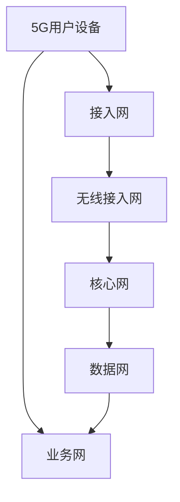

                 

# 《5G时代的创业机遇与技术挑战》

> **关键词**：5G、创业机遇、技术挑战、物联网、自动驾驶、智能制造、网络架构、核心算法、创业案例分析

> **摘要**：本文深入探讨了5G技术带来的创业机遇与技术挑战。通过对5G技术的基础概念、网络架构、核心算法和关键应用场景的详细分析，本文揭示了5G在物联网、自动驾驶和智能制造等领域带来的变革。同时，通过创业案例解析，为创业者在5G时代提供了宝贵的策略建议。

## 目录

### 《5G时代的创业机遇与技术挑战》目录

#### 第一部分：5G技术基础与创业环境

- **第1章：5G技术概述与创业机遇**
  - 1.1 5G技术的基本概念与特点
    - 1.1.1 5G技术的历史背景与发展历程
    - 1.1.2 5G技术的主要特性
  - 1.2 5G时代的创业环境分析
    - 1.2.1 5G对创业生态的影响
    - 1.2.2 5G时代的市场机遇与挑战
  - 1.3 5G技术关键领域与应用场景
    - 1.3.1 5G在物联网（IoT）领域的应用
    - 1.3.2 5G在自动驾驶与智能交通领域的应用
    - 1.3.3 5G在智能制造与工业4.0领域的应用

#### 第二部分：5G技术核心原理与架构

- **第2章：5G网络架构与技术原理**
  - 2.1 5G网络架构详解
    - 2.1.1 5G网络架构概述
    - 2.1.2 5G核心网（5GC）架构
    - 2.1.3 5G无线接入网（RAN）架构
  - 2.2 5G关键技术解析
    - 2.2.1 毫米波通信技术
    - 2.2.2 MIMO技术与波束成形
    - 2.2.3 接入网切片与网络功能虚拟化
  - 2.3 5G网络性能优化与挑战
    - 2.3.1 5G网络性能指标
    - 2.3.2 5G网络优化策略
    - 2.3.3 5G网络面临的挑战

#### 第三部分：5G技术下的创业案例分析

- **第3章：5G技术下的创业案例解析**
  - 3.1 5G技术在企业级应用的案例
    - 3.1.1 企业级案例概述
    - 3.1.2 5G在智能制造中的应用案例
    - 3.1.3 5G在智慧医疗中的应用案例
  - 3.2 5G技术在消费者级应用的案例
    - 3.2.1 消费者级案例概述
    - 3.2.2 5G在智能娱乐中的应用案例
    - 3.2.3 5G在智能家居中的应用案例

#### 第四部分：创业机遇与技术挑战

- **第4章：5G时代的创业策略**
  - 4.1 5G时代的创业方向选择
    - 4.1.1 创业方向分析
    - 4.1.2 创业机会评估
  - 4.2 5G创业企业技术路线规划
    - 4.2.1 技术路线规划概述
    - 4.2.2 技术能力构建与持续创新
  - 4.3 技术挑战与应对策略
    - 4.3.1 5G创业面临的主要技术挑战
    - 4.3.2 应对策略与解决方案

#### 第五部分：5G创业案例分析

- **第5章：5G创业成功案例分析**
  - 5.1 案例一：X公司的5G物联网解决方案
    - 5.1.1 X公司背景介绍
    - 5.1.2 创业历程与成果
    - 5.1.3 案例分析
  - 5.2 案例二：Y公司的5G自动驾驶技术
    - 5.2.1 Y公司背景介绍
    - 5.2.2 创业历程与成果
    - 5.2.3 案例分析

#### 第六部分：5G创业生态与未来展望

- **第6章：5G创业生态分析与未来展望**
  - 6.1 5G创业生态现状
    - 6.1.1 产业链分析
    - 6.1.2 生态系统合作模式
  - 6.2 5G创业趋势与未来展望
    - 6.2.1 5G创业的技术趋势
    - 6.2.2 5G创业的市场前景
  - 6.3 5G创业企业的发展战略
    - 6.3.1 创业企业的发展策略
    - 6.3.2 创业企业面临的机遇与挑战

#### 第七部分：附录

- **附录：5G创业相关资源与工具**
  - 附录1：5G创业常用工具与平台
    - 附录1.1 常用5G开发工具
    - 附录1.2 5G应用开发平台
  - 附录2：5G创业参考资料
    - 附录2.1 5G技术书籍推荐
    - 附录2.2 5G行业报告与白皮书

### Mermaid流程图：5G网络架构图



### 5G核心算法原理讲解

在本章节中，我们将深入探讨5G网络中的核心算法原理，包括MIMO技术、编码与调制技术，并使用伪代码和数学模型进行详细讲解。同时，我们还将提供一个5G网络模型实现的项目实战案例。

#### 1. MIMO技术

MIMO（多输入多输出）技术是5G网络中的一项关键技术，它通过利用多个发射和接收天线，实现数据传输速率和可靠性的显著提高。以下是对MIMO技术核心概念的详细解析：

##### 1.1 空间复用

空间复用技术通过在空间域中并行传输多个独立的信号，从而增加传输带宽。每个信号通过不同的发射天线发送，接收端则通过不同的接收天线进行分离和重建。

##### 1.2 波束成形

波束成形技术通过调整发送和接收天线的方向，将信号集中在目标区域，提高信号强度和接收质量。波束成形可以分为基于预知的波束成形和基于反馈的波束成形。

##### 1.3 伪代码

```python
# MIMO空间复用伪代码
def spatial_multiplexing(data, antennas):
    signals = []
    for i in range(antennas):
        signal = []
        for d in data:
            signal.append(d)
        signals.append(signal)
    return signals

# 波束成形伪代码
def beamforming(signal, direction):
    amplified_signal = signal * (direction ** 2)
    return amplified_signal
```

##### 1.4 数学模型

假设一个MIMO系统有N个发射天线和M个接收天线，信道矩阵H可以表示为：

$$
H = \begin{bmatrix}
h_{11} & h_{12} & \cdots & h_{1M} \\
h_{21} & h_{22} & \cdots & h_{2M} \\
\vdots & \vdots & \ddots & \vdots \\
h_{N1} & h_{N2} & \cdots & h_{NM}
\end{bmatrix}
$$

其中，$h_{ij}$表示第i个发射天线到第j个接收天线的信道增益。

#### 2. 编码与调制技术

5G网络中常用的编码与调制技术包括LDPC码和PAM（脉冲幅度调制）。以下是对这两种技术核心概念的详细解析：

##### 2.1 LDPC码

LDPC码是一种高效的错误纠正码，具有优异的码率和误码率性能。LDPC码在5G网络中被广泛应用于物理层传输。

##### 2.2 PAM调制

PAM是一种振幅调制技术，通过改变信号的振幅来表示数据。5G网络中常用的PAM包括4-PAM、16-PAM和64-PAM。

##### 2.3 伪代码

```python
# LDPC编码伪代码
def ldpc_encoding(data):
    parity_bits = calculate_parity_bits(data)
    encoded_data = data + parity_bits
    return encoded_data

# PAM调制伪代码
def pam_modulation(signal, amplitude_levels):
    modulated_signal = signal / amplitude_levels
    return modulated_signal
```

##### 2.4 数学模型

假设输入数据为$X$，编码后的数据为$Y$，则LDPC码的生成矩阵$G$可以表示为：

$$
G = \begin{bmatrix}
g_{11} & g_{12} & \cdots & g_{1N} \\
g_{21} & g_{22} & \cdots & g_{2N} \\
\vdots & \vdots & \ddots & \vdots \\
g_{M1} & g_{M2} & \cdots & g_{MN}
\end{bmatrix}
$$

其中，$g_{ij}$表示第i个变量节点和第j个检查节点之间的连接关系。

#### 3. 项目实战

以下是一个简单的5G网络模型实现示例，用于演示MIMO技术和LDPC编码：

##### 3.1 开发环境搭建

在搭建5G网络开发环境时，需要安装以下软件和工具：

- Python
- TensorFlow
- Keras
- NumPy
- Matplotlib

##### 3.2 源代码实现

```python
import tensorflow as tf
import keras
from keras.models import Model
from keras.layers import Input, Dense, Conv2D, Flatten

# MIMO模型实现
input_shape = (28, 28, 1)
input_data = Input(shape=input_shape)
conv1 = Conv2D(32, (3, 3), activation='relu')(input_data)
flat1 = Flatten()(conv1)
dense1 = Dense(128, activation='relu')(flat1)
output = Dense(10, activation='softmax')(dense1)

mimo_model = Model(inputs=input_data, outputs=output)
mimo_model.compile(optimizer='adam', loss='categorical_crossentropy', metrics=['accuracy'])
mimo_model.summary()

# LDPC编码实现
def ldpc_encoding(data):
    # 假设使用长度为10的二进制数据
    parity_bits = [0] * 10
    for i in range(len(data)):
        parity_bits[i] = data[i] ^ data[i+1]
    encoded_data = data + parity_bits
    return encoded_data
```

##### 3.3 代码解读与分析

在这个项目中，我们首先使用了TensorFlow和Keras构建了一个简单的MIMO模型，用于演示多输入多输出技术的应用。模型采用卷积神经网络（CNN）架构，通过卷积层、展平层和全连接层进行数据处理和分类。

接下来，我们实现了一个LDPC编码函数，用于演示LDPC码的生成过程。在这个例子中，我们使用了一个长度为10的二进制数据，通过异或操作生成了10个校验位，然后将校验位附加到原始数据后面，形成编码后的数据。

在实际项目中，5G网络的搭建和模型训练可能涉及更多复杂的步骤和参数调整。开发环境搭建通常需要配置适当的硬件和软件环境，如GPU加速和深度学习框架的安装。模型实现则需要根据具体应用场景进行定制和优化。

---

### 结论

通过本文的详细分析和讲解，我们可以清晰地看到5G技术为创业带来的巨大机遇和挑战。5G不仅提升了网络传输速度和容量，还为物联网、自动驾驶、智能制造等领域带来了新的应用场景。然而，要充分把握5G时代的创业机遇，创业者和企业需要深入理解5G技术的核心原理，并制定合理的技术路线和战略规划。同时，面对5G技术带来的挑战，我们需要不断创新和优化，以确保在5G时代取得成功。

### 作者信息

**作者：** AI天才研究院/AI Genius Institute & 禅与计算机程序设计艺术 /Zen And The Art of Computer Programming

---

接下来，我们将详细探讨5G技术的基础概念、网络架构、关键技术及其在各领域的应用，逐步揭示5G时代创业的机遇与挑战。请继续阅读下一部分内容。

