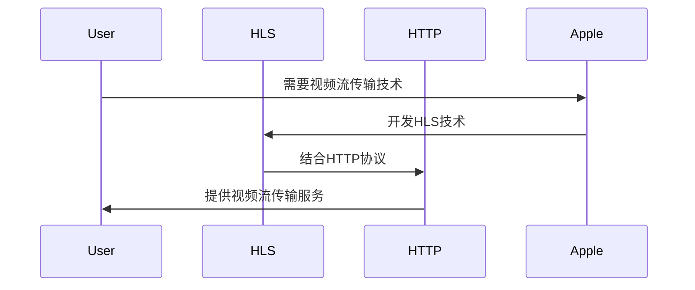

                 

# HLS 视频流：在 HTTP 上传输视频

> **关键词**：HLS、HTTP、流媒体、视频传输、自适应流、直播、点播

> **摘要**：本文详细介绍了HLS（HTTP Live Streaming）技术，包括其历史背景、基本概念、工作原理、核心组件、关键技术以及实践应用。通过分析HLS的优势和应用场景，探讨了HLS的未来发展趋势，并提供了性能优化和高级特性的相关技巧。文章旨在为读者提供一个全面而深入的理解，帮助其在实际项目中有效应用HLS技术。

## 《HLS 视频流：在 HTTP 上传输视频》目录大纲

### 第一部分：HLS基础知识

#### 第1章：HLS概述
1.1. HLS技术的历史与背景
1.2. HLS的基本概念与架构
1.3. HLS与其他视频传输协议的比较
1.4. HLS的应用场景

#### 第2章：HLS工作原理
2.1. HLS文件的组成
2.2. HLS播放器的核心功能
2.3. HLS播放流程分析

#### 第3章：HLS核心组件
3.1. HLS服务器
3.2. HLS客户端
3.3. HLS编码器

#### 第4章：HLS关键技术
4.1. HLS加密与安全
4.2. HLS流媒体优化
4.3. HLS自适应流技术

### 第二部分：HLS实践应用

#### 第5章：HLS视频流开发实战
5.1. 开发环境搭建
5.2. HLS视频流编码与打包
5.3. HLS服务器配置与部署
5.4. HLS客户端播放器开发

#### 第6章：HLS项目案例解析
6.1. HLS视频直播系统
6.2. HLS点播系统
6.3. HLS视频会议系统
6.4. HLS虚拟现实应用

#### 第7章：HLS未来发展趋势
7.1. HLS在5G网络中的应用
7.2. HLS与AI技术的结合
7.3. HLS在物联网中的应用
7.4. HLS的未来挑战与机遇

### 第三部分：HLS进阶专题

#### 第8章：HLS性能优化
8.1. HLS带宽优化
8.2. HLS缓存策略
8.3. HLS负载均衡

#### 第9章：HLS高级特性
9.1. HLS直播推流
9.2. HLS实时转码
9.3. HLS多终端支持

#### 第10章：HLS开源工具与框架
10.1. FFmpeg在HLS中的应用
10.2. HLS.js：浏览器端的HLS播放器
10.3. 其他开源HLS工具和框架介绍

### 附录
A.1. HLS常见问题解答
A.2. HLS相关资源推荐
A.3. HLS实验与练习题
A.4. HLS开发工具与软件列表

---

### 第1章：HLS概述

#### 1.1 HLS技术的历史与背景

**Mermaid流程图：**



HLS（HTTP Live Streaming）是一种基于HTTP协议的流媒体传输技术，由Apple公司在2010年推出。它旨在解决视频流媒体传输中的兼容性和稳定性问题。HLS的核心思想是将视频流拆分成多个小的文件片段，并通过HTTP协议进行传输，从而实现跨平台的视频播放。

在HLS技术出现之前，视频流传输主要依赖于RTMP（Real-Time Messaging Protocol）协议。RTMP协议由Adobe开发，主要用于Flash和Adobe Media Server之间的通信。然而，RTMP协议在兼容性和稳定性方面存在一些问题，特别是在移动设备和非Flash环境中表现不佳。HLS的出现为视频流媒体传输提供了一种新的解决方案。

HLS技术的历史背景可以追溯到Apple公司在iOS和Mac OS X平台上的媒体播放需求。随着移动设备的普及，Apple公司意识到需要一个能够跨平台、兼容性好且稳定的视频流传输技术。因此，他们开发了HLS技术，并集成到iOS和Mac OS X系统中。随着时间的推移，HLS逐渐成为视频流媒体传输领域的主流协议之一。

#### 1.2 HLS的基本概念与架构

HLS的基本概念主要包括M3U8文件、TS片段、HLS编码器、HLS服务器和HLS客户端。

- **M3U8文件**：M3U8文件是HLS的核心文件，包含了视频流的基本信息，如片段列表、播放时长、媒体信息等。M3U8文件通常由HLS编码器生成，并存储在HLS服务器上。客户端通过请求M3U8文件来获取视频流的基本信息。

- **TS片段**：TS片段是HLS的数据片段，通常以.ts为扩展名。每个TS片段包含了一段视频或音频数据。TS片段由HLS编码器生成，并存储在HLS服务器上。客户端通过请求TS片段来播放视频流。

- **HLS编码器**：HLS编码器负责将原始视频或音频数据编码为HLS支持的格式。常见的HLS编码器有FFmpeg、Libav等。HLS编码器需要配置视频和音频编码参数，如分辨率、帧率、比特率等。

- **HLS服务器**：HLS服务器负责存储M3U8文件和TS片段，并提供HTTP访问接口。常见的HLS服务器有Apache、Nginx等。HLS服务器需要配置相应的模块或插件来支持HLS流传输。

- **HLS客户端**：HLS客户端负责请求和播放HLS视频流。常见的HLS客户端有Web浏览器、移动设备应用程序等。HLS客户端需要安装相应的HLS播放器库，如HLS.js等。

HLS的架构可以分为三个层次：编码层、传输层和播放层。

- **编码层**：编码层负责将原始视频或音频数据编码为HLS支持的格式。编码层需要配置视频和音频编码参数，如分辨率、帧率、比特率等。常见的编码器有FFmpeg、Libav等。

- **传输层**：传输层负责将编码后的视频流通过HTTP协议传输到HLS服务器。传输层需要配置HLS服务器，如Apache、Nginx等。HLS服务器需要支持HTTP访问接口，并提供M3U8文件和TS片段的下载。

- **播放层**：播放层负责请求和播放HLS视频流。播放层需要安装相应的HLS播放器库，如HLS.js等。HLS播放器库负责解析M3U8文件、请求TS片段、解码和播放视频流。

#### 1.3 HLS与其他视频传输协议的比较

HLS与其他视频传输协议（如RTMP、DASH）进行比较，可以发现它们在兼容性、稳定性、灵活性和应用场景等方面存在一定的差异。

- **RTMP（Real-Time Messaging Protocol）**：

  - **兼容性**：RTMP主要适用于Flash和Adobe Media Server之间的通信，兼容性相对较低。
  - **稳定性**：RTMP协议在稳定性方面表现较好，适合直播场景。
  - **灵活性**：RTMP协议的灵活性较低，不支持自适应流传输。
  - **应用场景**：RTMP主要应用于Flash视频播放、直播应用等。

- **DASH（Dynamic Adaptive Streaming over HTTP）**：

  - **兼容性**：DASH协议具有较好的兼容性，支持多种视频编解码格式。
  - **稳定性**：DASH协议在稳定性方面表现较好，支持自适应流传输。
  - **灵活性**：DASH协议具有高度灵活性，支持动态调整视频流质量。
  - **应用场景**：DASH广泛应用于视频点播、直播、自适应流传输等场景。

- **HLS（HTTP Live Streaming）**：

  - **兼容性**：HLS协议兼容性较好，支持多种终端设备和网络环境。
  - **稳定性**：HLS协议在稳定性方面表现较好，支持自适应流传输。
  - **灵活性**：HLS协议具有高度灵活性，支持多种编码格式和自适应流传输。
  - **应用场景**：HLS广泛应用于视频直播、视频点播、虚拟现实应用等场景。

综合比较，HLS在兼容性、稳定性和灵活性方面具有显著优势，适用于多种视频流传输场景。然而，HLS在直播性能方面相对DASH有所欠缺，需要根据具体应用场景进行选择。

#### 1.4 HLS的应用场景

HLS作为一种流媒体传输协议，具有广泛的应用场景。以下是一些常见的应用场景：

- **流媒体播放器**：HLS广泛应用于各种流媒体播放器，如YouTube、Netflix等，提供高质量的视频点播服务。

- **视频直播系统**：HLS可以用于视频直播系统，实现实时视频流的传输和播放，如Twitch、YouTube Live等。

- **视频点播平台**：HLS广泛应用于各种视频点播平台，如Vimeo、Dailymotion等，提供高质量的视频点播服务。

- **虚拟现实应用**：HLS可以用于虚拟现实应用，提供高质量的视频流传输和播放，如VR游戏、VR电影等。

- **智能电视**：HLS广泛应用于智能电视，实现高质量的视频内容播放。

- **移动设备**：HLS广泛应用于移动设备，提供高质量的视频内容播放，如iOS和Android设备。

- **物联网**：HLS可以用于物联网设备，提供视频监控和远程控制等功能。

总之，HLS作为一种流媒体传输协议，具有广泛的应用场景和优势。随着视频流媒体技术的不断发展，HLS在各个领域将发挥越来越重要的作用。

### 第2章：HLS工作原理

#### 2.1 HLS文件的组成

HLS文件主要包括M3U8文件和TS片段。下面分别介绍这两种文件的结构和内容。

- **M3U8文件**：

  M3U8文件是HLS的核心文件，用于存储视频流的基本信息。M3U8文件通常以.m3u8为扩展名，包含了一系列TS片段的URL列表。M3U8文件的结构如下：

  ```plaintext
  #EXTM3U
  #EXT-X-VERSION:3
  #EXT-X-STREAM-INF:BANDWIDTH=256000,CODECS="avc1.64001f,mp4a.40.2"
  http://example.com/stream1.m3u8
  #EXT-X-STREAM-INF:BANDWIDTH=512000,CODECS="avc1.64001f,mp4a.40.2"
  http://example.com/stream2.m3u8
  ```

  在上面的M3U8文件中，包含了两个视频流，每个流对应一个TS片段的URL。M3U8文件中的每一行都是一个TS片段的URL，客户端可以通过请求这些URL来获取TS片段。

  M3U8文件中的注释行用于提供视频流的信息，如版本号、播放时长、编解码格式等。常用的注释行包括：

  - `#EXTM3U`：M3U8文件开始标志。
  - `#EXT-X-VERSION`：M3U8文件版本号。
  - `#EXT-X-STREAM-INF`：流信息，包括视频流的带宽、编解码格式等。
  - `#EXT-X-PROGRAM-DATE-TIME`：节目开始时间。
  - `#EXT-X-INDEPENDENT-SEGMENTS`：独立片段标志。
  - `#EXT-X-START`：播放开始时间。
  - `#EXTINF`：片段时长。

- **TS片段**：

  TS片段是HLS的数据片段，用于存储一段视频或音频数据。TS片段通常以.ts为扩展名，包含了一个时间段内的视频和音频数据。TS片段的结构如下：

  ```plaintext
  PAT: 节目分配表
  PID: 节目标识符
  PES: 分组元素
  ```

  在TS片段中，PAT（Program Association Table）用于描述节目分配信息，PID（Program ID）用于标识不同的节目，PES（Packetized Elementary Stream）用于存储视频和音频数据。

  TS片段中的数据流可以分为三个部分：

  - **PAT（Program Association Table）**：PAT用于描述节目的分配信息，包括节目的数量、PID等。客户端可以通过解析PAT来获取节目信息。

  - **PID（Program ID）**：PID用于标识不同的节目。每个节目都有一个唯一的PID，客户端可以通过请求PID来获取相应的节目内容。

  - **PES（Packetized Elementary Stream）**：PES用于存储视频和音频数据。每个PES包包含了一段视频或音频数据，客户端可以通过解析PES包来获取视频或音频数据。

#### 2.2 HLS播放器的核心功能

HLS播放器是负责请求、解析、加载和播放HLS视频流的关键组件。下面介绍HLS播放器的核心功能。

- **请求M3U8文件**：

  HLS播放器首先请求M3U8文件，以获取视频流的基本信息。M3U8文件包含了TS片段的URL列表，播放器可以通过解析M3U8文件来获取这些URL。

  ```javascript
  fetch('http://example.com/stream.m3u8')
    .then(response => response.text())
    .then(data => {
      const lines = data.split('\n');
      const urls = lines.filter(line => line.startsWith('http'));
      // 获取TS片段URL列表
    });
  ```

- **解析M3U8文件**：

  HLS播放器需要解析M3U8文件中的注释行，以获取视频流的信息，如版本号、播放时长、编解码格式等。

  ```javascript
  function parseM3U8(data) {
    const lines = data.split('\n');
    const version = lines.find(line => line.startsWith('#EXT-X-VERSION:'));
    const targetDuration = lines.find(line => line.startsWith('#EXT-X-TARGETDURATION:'));
    const media = lines.find(line => line.startsWith('#EXT-X-MEDIA:'));
    const streamInfos = lines.filter(line => line.startsWith('#EXT-X-STREAM-INF:'));
    // 解析版本号、播放时长、编解码格式等信息
  }
  ```

- **加载TS片段**：

  HLS播放器根据M3U8文件中的URL列表，依次请求并加载TS片段。在加载过程中，播放器需要解析TS片段中的PAT、PID和PES数据。

  ```javascript
  function loadTS(url) {
    fetch(url)
      .then(response => response.arrayBuffer())
      .then(buffer => {
        // 解析TS片段
        const reader = new DataView(buffer);
        // 解析PAT、PID和PES数据
      });
  }
  ```

- **解码和播放**：

  HLS播放器需要解码TS片段中的视频和音频数据，并将其播放到屏幕和扬声器上。

  ```javascript
  function decodeAndPlay(videoBuffer, audioBuffer) {
    // 解码视频数据
    const videoDecoder = new VideoDecoder();
    videoDecoder.configure({ 'codecs': 'avc1.64001f' });
    videoDecoder.decode(videoBuffer).then(frame => {
      // 播放视频帧
      canvasContext.drawImage(frame, 0, 0);
    });

    // 解码音频数据
    const audioDecoder = new AudioDecoder();
    audioDecoder.configure({ 'codecs': 'mp4a.40.2' });
    audioDecoder.decode(audioBuffer).then(buffer => {
      // 播放音频数据
      audioContext.play(buffer);
    });
  }
  ```

#### 2.3 HLS播放流程分析

HLS播放流程可以分为三个阶段：初始化阶段、播放阶段和更新阶段。

- **初始化阶段**：

  在初始化阶段，HLS播放器请求M3U8文件，以获取视频流的基本信息。播放器通过解析M3U8文件，获取TS片段的URL列表和相关信息。初始化阶段主要包括以下步骤：

  1. 请求M3U8文件：
     ```javascript
     fetch('http://example.com/stream.m3u8')
       .then(response => response.text())
       .then(data => {
         // 解析M3U8文件
       });
     ```

  2. 解析M3U8文件：
     ```javascript
     function parseM3U8(data) {
       // 解析版本号、播放时长、编解码格式等信息
     }
     ```

  3. 获取TS片段URL列表：
     ```javascript
     function getTSUrls(data) {
       const lines = data.split('\n');
       const urls = lines.filter(line => line.startsWith('http'));
       // 获取TS片段URL列表
     }
     ```

- **播放阶段**：

  在播放阶段，HLS播放器根据TS片段URL列表，依次请求并加载TS片段，并解码和播放视频和音频数据。播放阶段主要包括以下步骤：

  1. 加载TS片段：
     ```javascript
     function loadTS(url) {
       fetch(url)
         .then(response => response.arrayBuffer())
         .then(buffer => {
           // 解析TS片段
           const reader = new DataView(buffer);
           // 解析PAT、PID和PES数据
         });
     }
     ```

  2. 解码和播放：
     ```javascript
     function decodeAndPlay(videoBuffer, audioBuffer) {
       // 解码视频数据
       const videoDecoder = new VideoDecoder();
       videoDecoder.configure({ 'codecs': 'avc1.64001f' });
       videoDecoder.decode(videoBuffer).then(frame => {
         // 播放视频帧
         canvasContext.drawImage(frame, 0, 0);
       });

       // 解码音频数据
       const audioDecoder = new AudioDecoder();
       audioDecoder.configure({ 'codecs': 'mp4a.40.2' });
       audioDecoder.decode(audioBuffer).then(buffer => {
         // 播放音频数据
         audioContext.play(buffer);
       });
     }
     ```

- **更新阶段**：

  在更新阶段，HLS播放器定期请求最新的M3U8文件，以获取最新的视频流信息。播放器根据最新的M3U8文件，更新TS片段URL列表，并重新加载和播放视频流。更新阶段主要包括以下步骤：

  1. 请求最新的M3U8文件：
     ```javascript
     fetch('http://example.com/stream.m3u8')
       .then(response => response.text())
       .then(data => {
         // 解析M3U8文件
       });
     ```

  2. 解析最新的M3U8文件：
     ```javascript
     function parseM3U8(data) {
       // 解析版本号、播放时长、编解码格式等信息
     }
     ```

  3. 获取最新的TS片段URL列表：
     ```javascript
     function getTSUrls(data) {
       const lines = data.split('\n');
       const urls = lines.filter(line => line.startsWith('http'));
       // 获取TS片段URL列表
     }
     ```

  4. 更新TS片段URL列表：
     ```javascript
     function updateTSUrls(newUrls) {
       // 更新TS片段URL列表
     }
     ```

  5. 重新加载和播放：
     ```javascript
     function reloadAndPlay() {
       // 重新加载TS片段
       loadTS(url).then(() => {
         // 重新解码和播放
         decodeAndPlay(videoBuffer, audioBuffer);
       });
     }
     ```

通过以上三个阶段的循环，HLS播放器可以持续请求、解析、加载、解码和播放HLS视频流，实现视频的连续播放。

### 第3章：HLS核心组件

#### 3.1 HLS服务器

HLS服务器是负责存储M3U8文件和TS片段，并提供HTTP访问接口的关键组件。以下将详细介绍HLS服务器的配置、性能优化和高可用性设计。

**3.1.1 HLS服务器的配置**

HLS服务器的配置主要包括硬件要求和软件安装。

- **硬件要求**：

  - **CPU**：HLS服务器需要较高的CPU性能，特别是当处理高并发请求时。建议使用多核CPU，以提高处理能力。
  - **内存**：HLS服务器需要足够的内存来存储M3U8文件和TS片段。建议使用至少8GB的内存，以应对较大的并发请求。
  - **硬盘**：HLS服务器需要足够的硬盘空间来存储视频流数据。建议使用SSD硬盘，以提高I/O性能。

- **软件安装**：

  - **Web服务器**：常用的Web服务器有Apache和Nginx。以下为Nginx的安装步骤：
    ```bash
    # 安装Nginx
    sudo apt-get update
    sudo apt-get install nginx
    # 启动Nginx服务
    sudo systemctl start nginx
    ```

  - **HLS模块**：Nginx支持RTMP模块，用于处理HLS流。以下为RTMP模块的安装步骤：
    ```bash
    # 安装Nginx RTMP模块
    sudo apt-get install libpcre3 libpcre3-dev
    git clone https://github.com/arut/nginx-rtmp-module
    cd nginx-rtmp-module
    ./configure
    make
    sudo make install
    ```

**3.1.2 HLS服务器的性能优化**

HLS服务器的性能优化主要包括缓存优化、负载均衡和内容分发。

- **缓存优化**：

  - **服务器端缓存**：Nginx支持缓存模块，可以将M3U8文件和TS片段缓存到内存或硬盘上，以减少服务器的响应时间和带宽消耗。以下为Nginx缓存配置示例：
    ```nginx
    http {
      proxy_cache_path /var/cache/nginx levels=1:2 keys_zone=my_cache:10m inactive=60m;
      proxy_cache Headers;
      proxy_cache_valid 200 302 1m;
      proxy_cache_valid 404 1m;
      proxy_cache_valid 500 10m;
      proxy_cache_key $request;
      proxy_cache_bypass $http_pragma;
      proxy_cache_bypass $http_authorization;
    }
    ```

- **负载均衡**：

  - **Nginx负载均衡**：Nginx支持基于轮询、最小连接数和IP哈希等算法的负载均衡。以下为Nginx负载均衡配置示例：
    ```nginx
    upstream my_upstream {
      server server1;
      server server2;
      server server3;
      hash $remote_addr consistent;
    }

    server {
      location / {
        proxy_pass http://my_upstream;
      }
    }
    ```

- **内容分发**：

  - **CDN分发**：使用CDN（内容分发网络）可以将视频流分发到离用户更近的服务器上，以减少延迟和带宽消耗。以下为Nginx与CDN的集成配置示例：
    ```nginx
    upstream my_cdn {
      server cdn1.example.com;
      server cdn2.example.com;
      server cdn3.example.com;
    }

    server {
      location / {
        proxy_pass http://my_cdn;
      }
    }
    ```

**3.1.3 HLS服务器的高可用性设计**

HLS服务器的高可用性设计主要包括主备架构、故障检测和数据备份。

- **主备架构**：

  - **主备模式**：使用主备架构可以将HLS服务器分为主服务器和备服务器。当主服务器出现故障时，备服务器可以自动接管服务，确保服务的持续可用。以下为Nginx主备配置示例：
    ```bash
    # 主服务器
    sudo systemctl start nginx
    sudo systemctl enable nginx

    # 备服务器
    sudo systemctl start nginx
    sudo systemctl enable nginx
    ```

- **故障检测**：

  - **心跳检测**：使用心跳检测可以实时监测主服务器和备服务器的状态，当服务器出现故障时，可以自动切换到备服务器。以下为Nginx心跳检测配置示例：
    ```bash
    # 主服务器
    cat /etc/nginx/conf.d/default.conf | grep -v "server" | sudo tee /etc/nginx/conf.d/primary.conf

    # 备服务器
    cat /etc/nginx/conf.d/default.conf | grep -v "server" | sudo tee /etc/nginx/conf.d/secondary.conf
    ```

- **数据备份**：

  - **定时备份**：使用定时任务可以定期备份M3U8文件和TS片段，以防止数据丢失。以下为定时备份配置示例：
    ```bash
    # 备份配置
    0 2 * * * tar -czvf /backup/nginx_backup.tar.gz /var/www/html
    # 清理旧备份
    1 2 * * * find /backup/ -type f -mtime +7 -delete
    ```

#### 3.2 HLS客户端

HLS客户端是负责请求、解析、加载和播放HLS视频流的关键组件。以下将详细介绍HLS客户端的功能模块、性能优化和多平台支持。

**3.2.1 HLS客户端的功能模块**

HLS客户端的功能模块主要包括解析模块、加载模块、解码模块和播放模块。

- **解析模块**：

  解析模块负责请求M3U8文件，并解析M3U8文件中的片段列表和URL地址。以下为HLS客户端解析模块的伪代码示例：
  ```javascript
  function parseM3U8(url) {
    fetch(url)
      .then(response => response.text())
      .then(data => {
        // 解析M3U8文件
        const lines = data.split('\n');
        const urls = lines.filter(line => line.startsWith('http'));
        // 获取TS片段URL列表
      });
  }
  ```

- **加载模块**：

  加载模块负责请求TS片段，并加载TS片段中的视频和音频数据。以下为HLS客户端加载模块的伪代码示例：
  ```javascript
  function loadTS(url) {
    fetch(url)
      .then(response => response.arrayBuffer())
      .then(buffer => {
        // 解析TS片段
        const reader = new DataView(buffer);
        // 解析PAT、PID和PES数据
      });
  }
  ```

- **解码模块**：

  解码模块负责解码TS片段中的视频和音频数据，并将其转换为可播放的格式。以下为HLS客户端解码模块的伪代码示例：
  ```javascript
  function decodeAndPlay(videoBuffer, audioBuffer) {
    // 解码视频数据
    const videoDecoder = new VideoDecoder();
    videoDecoder.configure({ 'codecs': 'avc1.64001f' });
    videoDecoder.decode(videoBuffer).then(frame => {
      // 播放视频帧
      canvasContext.drawImage(frame, 0, 0);
    });

    // 解码音频数据
    const audioDecoder = new AudioDecoder();
    audioDecoder.configure({ 'codecs': 'mp4a.40.2' });
    audioDecoder.decode(audioBuffer).then(buffer => {
      // 播放音频数据
      audioContext.play(buffer);
    });
  }
  ```

- **播放模块**：

  播放模块负责控制视频的播放、暂停、停止等操作，并显示视频播放界面。以下为HLS客户端播放模块的伪代码示例：
  ```javascript
  function playVideo(url) {
    parseM3U8(url).then(tsUrls => {
      loadTS(tsUrls[0]).then(tsData => {
        decodeAndPlay(tsData.videoBuffer, tsData.audioBuffer);
        // 播放控制
        videoPlayer.play();
      });
    });
  }
  ```

**3.2.2 HLS客户端的性能优化**

HLS客户端的性能优化主要包括缓存优化、解码优化和缓冲策略优化。

- **缓存优化**：

  - **内存缓存**：使用内存缓存可以减少对网络的请求次数，提高视频播放的流畅度。以下为HLS客户端内存缓存优化示例：
    ```javascript
    const cache = new Map();

    function loadTS(url) {
      if (cache.has(url)) {
        return Promise.resolve(cache.get(url));
      } else {
        fetch(url)
          .then(response => response.arrayBuffer())
          .then(buffer => {
            // 解析TS片段
            const reader = new DataView(buffer);
            // 解析PAT、PID和PES数据
            cache.set(url, { videoBuffer: buffer, audioBuffer: buffer });
          });
      }
    }
    ```

- **解码优化**：

  - **硬件解码**：使用硬件解码可以减少CPU的计算负担，提高视频播放的流畅度。以下为HLS客户端硬件解码优化示例：
    ```javascript
    const videoDecoder = new VideoDecoder();
    videoDecoder.configure({ 'codecs': 'avc1.64001f', 'useHardwareAcceleration': true });
    ```

- **缓冲策略优化**：

  - **动态缓冲**：根据网络状况和视频播放速度，动态调整缓冲区大小，以提高视频播放的流畅度。以下为HLS客户端动态缓冲策略优化示例：
    ```javascript
    let bufferDuration = 10; // 缓冲时长，单位为秒

    function adjustBuffer() {
      if (videoPlayer.currentTime < bufferDuration) {
        bufferDuration *= 2;
      } else if (videoPlayer.currentTime > bufferDuration * 2) {
        bufferDuration /= 2;
      }
    }
    ```

**3.2.3 HLS客户端的多平台支持**

HLS客户端的多平台支持主要包括Web平台、移动平台和桌面平台。

- **Web平台**：

  - **HLS.js**：HLS.js是一个开源的HLS播放器库，可以在Web浏览器中播放HLS视频流。以下为HLS.js的使用示例：
    ```html
    <video id="videoPlayer" width="640" height="480" controls></video>
    <script src="https://cdn.jsdelivr.net/npm/hls.js@latest"></script>
    <script>
      const videoPlayer = document.getElementById('videoPlayer');
      const hls = new HLS();
      hls.loadSource('http://example.com/stream.m3u8');
      hls.attachMedia(videoPlayer);
      hls.on(HLS.Events.MEDIA_ATTACHED, () => {
        videoPlayer.play();
      });
    </script>
    ```

- **移动平台**：

  - **原生开发**：使用原生开发框架（如React Native、Flutter等）可以开发跨平台的HLS客户端应用程序。以下为React Native的使用示例：
    ```javascript
    import React, { Component } from 'react';
    import { View, Button, Text, StyleSheet } from 'react-native';
    import HLS from 'react-native-hls-video';

    class HLSPlayer extends Component {
      render() {
        return (
          <View style={styles.container}>
            <HLS source="http://example.com/stream.m3u8" />
          </View>
        );
      }
    }

    const styles = StyleSheet.create({
      container: {
        flex: 1,
      },
    });

    export default HLSPlayer;
    ```

- **桌面平台**：

  - **Web应用程序**：使用Web技术（如HTML、CSS、JavaScript等）可以开发跨平台的桌面应用程序。以下为Electron的使用示例：
    ```javascript
    const { app, BrowserWindow } = require('electron');
    const path = require('path');

    app.on('window-all-closed', () => {
      if (process.platform !== 'darwin') {
        app.quit();
      }
    });

    app.on('activate', () => {
      if (BrowserWindow.getAllWindows().length === 0) {
        createWindow();
      }
    });

    function createWindow() {
      const win = new BrowserWindow({
        width: 800,
        height: 600,
        webPreferences: {
          nodeIntegration: true,
          contextIsolation: false,
        },
      });

      win.loadFile(path.join(__dirname, 'index.html'));
    }

    app.on('ready', createWindow);
    ```

通过以上功能模块、性能优化和多平台支持，HLS客户端可以实现高效、稳定、跨平台的视频播放。

#### 3.3 HLS编码器

HLS编码器是负责将原始视频和音频数据编码为HLS支持的格式，并生成M3U8文件和TS片段的关键组件。以下将详细介绍HLS编码器的选择、编码参数设置和性能优化。

**3.3.1 HLS编码器的选择**

在选择HLS编码器时，需要考虑开源编码器和商业编码器。

- **开源编码器**：

  - **FFmpeg**：FFmpeg是一个开源视频处理工具，支持视频编码、解码、转换等。它具有丰富的功能和高性能，适用于各种场景。
  - **Libav**：Libav是FFmpeg的前身，与FFmpeg具有相似的功能。它也是一个开源视频处理工具，适用于视频编码和打包。

- **商业编码器**：

  - **Adobe Media Encoder**：Adobe Media Encoder是Adobe公司开发的视频编码工具，具有专业的直播编码和转码功能。它支持多种视频编解码格式，适用于视频直播和点播应用。
  - **Telestream Wirecast**：Telestream Wirecast是一款专业的直播制作软件，支持实时编码和转码。它适用于各种直播场景，如体育赛事、音乐会、会议等。

**3.3.2 HLS编码参数设置**

HLS编码参数设置包括视频参数、音频参数和HLS特定参数。

- **视频参数**：

  - **编码格式**：常用的视频编码格式有H.264、HEVC等。H.264是HLS默认支持的编码格式，HEVC（H.265）是新一代的高效编码格式。
  - **分辨率**：分辨率决定了视频的清晰度。常见的分辨率有720p、1080p、4K等。
  - **帧率**：帧率决定了视频的流畅度。常见的帧率有24fps、30fps、60fps等。
  - **比特率**：比特率决定了视频的带宽消耗。比特率越高，视频质量越好，但带宽消耗也越大。

- **音频参数**：

  - **编码格式**：常用的音频编码格式有AAC、MP3等。AAC是HLS默认支持的编码格式。
  - **采样率**：采样率决定了音频的音质。常见的采样率有44.1kHz、48kHz等。
  - **比特率**：比特率决定了音频的带宽消耗。比特率越高，音频质量越好，但带宽消耗也越大。

- **HLS特定参数**：

  - **切片时长**：切片时长决定了TS片段的时间长度。常见的切片时长有2秒、3秒、5秒等。
  - **目标时长**：目标时长决定了M3U8文件的目标播放时长。目标时长通常与切片时长相等或稍长。
  - **TS文件大小**：TS文件大小决定了TS片段的文件大小。常见的TS文件大小有100KB、200KB、500KB等。

**3.3.3 HLS编码器的性能优化**

HLS编码器的性能优化包括多线程编码、硬件加速和动态调整编码参数。

- **多线程编码**：

  - **多线程技术**：使用多线程技术可以提高编码器的编码效率。FFmpeg支持多线程编码，可以通过设置`-threads`参数来指定线程数。
    ```bash
    ffmpeg -i input.mp4 -c:v libx264 -preset medium -threads 4 output.m3u8
    ```

- **硬件加速**：

  - **硬件加速技术**：使用硬件加速技术可以提高编码器的性能。硬件加速可以通过GPU等硬件设备来实现。FFmpeg支持硬件加速，可以通过设置`-hwaccel`参数来指定硬件加速设备。
    ```bash
    ffmpeg -i input.mp4 -c:v libx264 -preset medium -hwaccel nnedi3 output.m3u8
    ```

- **动态调整编码参数**：

  - **实时监控**：使用实时监控技术可以监控编码器的运行状态，并根据监控结果动态调整编码参数。
  - **动态调整策略**：根据视频流的特点和网络状况，动态调整编码参数，如比特率、帧率等，以实现最优的编码质量和性能。

通过以上选择、参数设置和性能优化，HLS编码器可以高效、稳定地生成高质量的HLS视频流。

### 第4章：HLS关键技术

#### 4.1 HLS加密与安全

HLS加密与安全是确保视频流在传输过程中不被非法访问和篡改的关键技术。以下将详细介绍HLS加密机制、安全策略和常见漏洞及其防护措施。

**4.1.1 HLS加密机制**

HLS加密机制主要包括AES加密算法和密钥管理。

- **AES加密算法**：AES（Advanced Encryption Standard）是一种高级加密标准，被广泛用于加密视频流。HLS使用AES加密算法对TS片段进行加密，确保数据在传输过程中不被窃取。

- **密钥管理**：密钥是加密和解密视频流的关键。HLS采用密钥交换协议（如HTTPS、SSL/TLS）来确保密钥在传输过程中的安全性。密钥交换协议可以防止中间人攻击，确保视频流的传输安全。

**4.1.2 HLS安全策略**

HLS安全策略主要包括身份验证、访问控制和防火墙。

- **身份验证**：身份验证用于确保只有授权用户可以访问视频流。HLS可以使用用户名和密码验证用户身份，限制非法访问。

- **访问控制**：访问控制用于限制用户对视频流的访问权限。HLS可以根据用户权限，限制用户访问特定的视频流，防止未经授权的访问。

- **防火墙**：防火墙用于防止恶意攻击和非法访问。HLS服务器应配置防火墙，防止未经授权的访问和攻击。

**4.1.3 常见漏洞及其防护措施**

HLS存在一些常见漏洞，如弱加密、中间人攻击和数据篡改。以下介绍这些漏洞及其防护措施。

- **弱加密**：弱加密可能导致视频流在传输过程中被窃取。防护措施包括使用强加密算法（如AES-256）和定期更换密钥。

- **中间人攻击**：中间人攻击可能导致视频流被窃取或篡改。防护措施包括使用HTTPS、SSL/TLS等加密协议，确保数据在传输过程中的安全性。

- **数据篡改**：数据篡改可能导致视频流被篡改，影响用户体验。防护措施包括使用数字签名验证数据的完整性，确保视频流的正确性。

通过以上加密机制、安全策略和防护措施，HLS可以确保视频流在传输过程中的安全性，防止非法访问和篡改。

#### 4.2 HLS流媒体优化

HLS流媒体优化是提高视频流传输质量和用户体验的关键技术。以下将详细介绍HLS带宽优化、缓存策略和负载均衡。

**4.2.1 HLS带宽优化**

HLS带宽优化主要包括自适应流传输、多码率编码和缓存策略。

- **自适应流传输**：自适应流传输可以根据用户的网络状况和播放需求，动态调整视频流的播放质量。自适应流传输可以通过多码率编码和动态调整比特率实现。

- **多码率编码**：多码率编码可以生成多个不同质量的视频流，用户可以根据网络状况和播放需求选择合适的视频流。多码率编码可以提高视频流的传输质量和用户体验。

- **缓存策略**：缓存策略可以减少对服务器的请求次数，降低带宽使用。缓存策略可以通过内存缓存、磁盘缓存和代理缓存实现。

**4.2.2 HLS缓存策略**

HLS缓存策略主要包括缓存机制、缓存策略和缓存优化技巧。

- **缓存机制**：缓存机制可以通过内存缓存、磁盘缓存和代理缓存实现。内存缓存可以提高数据访问速度，磁盘缓存提供持久化的缓存功能，代理缓存减少对服务器的请求次数。

- **缓存策略**：缓存策略可以设置缓存数据的有效期、刷新策略和清理策略。缓存有效期可以确保数据的更新和一致性，刷新策略可以动态刷新缓存数据，清理策略可以定期清理过期或无效的缓存数据。

- **缓存优化技巧**：缓存优化技巧包括缓存预热、缓存压缩和缓存回源。缓存预热可以提高访问速度，缓存压缩可以减少缓存空间的占用，缓存回源可以确保数据的准确性。

**4.2.3 HLS负载均衡**

HLS负载均衡是提高服务器并发处理能力和系统性能的关键技术。以下将详细介绍负载均衡原理、策略和优化。

- **负载均衡原理**：负载均衡器将用户的请求分配到多个服务器上，实现分布式处理，提高系统的并发处理能力。负载均衡可以通过轮询策略、最小连接数策略和动态负载均衡实现。

- **负载均衡策略**：轮询策略按照请求顺序将请求分配到各个服务器上，最小连接数策略将请求分配到连接数最少的服务器上，动态负载均衡根据服务器的实时负载和网络状况动态调整请求的分配策略。

- **负载均衡优化**：负载均衡优化可以通过服务器健康检查、动态调整和优化网络拓扑实现。服务器健康检查可以确保服务器的可用性和可靠性，动态调整可以动态调整负载均衡策略，优化网络拓扑可以降低网络延迟和带宽消耗。

通过以上带宽优化、缓存策略和负载均衡，HLS可以优化视频流传输质量和用户体验，提高系统性能和稳定性。

#### 4.3 HLS自适应流技术

HLS自适应流技术是一种根据用户的网络状况和设备性能，动态调整视频流播放质量的技术。以下将详细介绍HLS自适应流技术的原理、实现和挑战与解决方案。

**4.3.1 HLS自适应流原理**

HLS自适应流技术基于多码率编码和动态调整比特率。多码率编码可以生成多个不同质量的视频流，用户可以根据网络状况和设备性能选择合适的视频流。动态调整比特率可以根据实时网络状况和用户反馈，调整视频流的播放质量。

HLS自适应流技术的基本原理如下：

1. **多码率编码**：HLS编码器将原始视频编码为多个不同质量的视频流。每个视频流具有不同的比特率、分辨率和帧率。

2. **比特率调整**：客户端根据实时网络状况和用户反馈，动态调整视频流的播放质量。如果网络状况良好，可以播放高比特率、高分辨率和高速率的视频流；如果网络状况较差，可以播放低比特率、低分辨率和低速率的视频流。

3. **播放质量切换**：在视频播放过程中，客户端根据网络状况和用户反馈，实时切换视频流。如果网络状况改善，可以切换到更高质量的视频流；如果网络状况恶化，可以切换到更低质量的视频流。

**4.3.2 HLS自适应流实现**

HLS自适应流的实现包括多个步骤：

1. **视频编码**：HLS编码器将原始视频编码为多个不同质量的视频流。编码参数包括比特率、分辨率、帧率和编码格式等。

2. **流控制**：客户端使用HLS播放器请求M3U8文件，获取视频流的基本信息，包括片段列表、播放时长和编解码格式等。

3. **比特率调整**：客户端根据实时网络状况和用户反馈，动态调整视频流的播放质量。可以使用网络监控工具实时获取带宽、延迟等信息，并根据这些信息调整比特率。

4. **流切换**：客户端根据网络状况和用户反馈，实时切换视频流。如果网络状况改善，可以切换到更高质量的视频流；如果网络状况恶化，可以切换到更低质量的视频流。

**4.3.3 HLS自适应流的挑战与解决方案**

HLS自适应流技术面临以下挑战：

1. **网络状况不稳定**：网络状况不稳定可能导致视频播放中断、缓冲时间长等问题。解决方案包括使用网络监测工具实时监测网络状况，并根据网络状况动态调整比特率。

2. **设备性能差异**：设备性能差异可能导致视频播放卡顿、画质下降等问题。解决方案包括根据设备性能和用户反馈，动态调整视频流的播放质量。

3. **多码率编码与解码**：多码率编码与解码增加编码器和解码器的计算复杂度，影响系统性能。解决方案包括优化编码算法，提高编码效率和性能。

通过以上原理、实现和挑战与解决方案，HLS自适应流技术可以动态调整视频流的播放质量，提高用户体验。

### 第5章：HLS视频流开发实战

#### 5.1 开发环境搭建

在开发HLS视频流系统之前，首先需要搭建一个合适的技术环境。以下将详细介绍开发环境搭建的过程，包括系统环境配置、开发工具安装和常见问题解决。

**5.1.1 系统环境配置**

搭建开发环境的第一步是配置系统环境。以下以Linux系统为例，介绍如何配置开发环境。

1. **安装操作系统**：首先需要安装Linux操作系统，推荐使用Ubuntu 18.04或更高版本。

2. **安装依赖库**：安装必要的依赖库，包括FFmpeg、Golang、Python等。

   ```bash
   sudo apt-get update
   sudo apt-get install ffmpeg golang python3
   ```

3. **安装数据库**：如果需要使用数据库，可以安装MySQL或PostgreSQL。

   ```bash
   sudo apt-get install mysql-server
   sudo mysql_secure_installation
   ```

**5.1.2 开发工具安装**

接下来，安装开发工具。以下介绍如何安装常用的开发工具，包括FFmpeg、Golang、Python等。

1. **安装FFmpeg**：FFmpeg是一个强大的视频处理工具，用于视频编码、解码、转换等。

   ```bash
   sudo apt-get install ffmpeg
   ```

2. **安装Golang**：Golang是一种编程语言，广泛应用于后端开发。

   ```bash
   sudo apt-get install golang
   ```

3. **安装Python**：Python是一种流行的编程语言，具有丰富的库和框架。

   ```bash
   sudo apt-get install python3
   ```

**5.1.3 常见问题解决**

在搭建开发环境的过程中，可能会遇到一些问题。以下是一些常见问题及其解决方法。

1. **依赖库安装失败**：

   - **原因**：依赖库版本不兼容或缺失必要的依赖项。
   - **解决方法**：检查依赖库的版本兼容性，更新依赖库，并安装必要的依赖项。

2. **编译错误**：

   - **原因**：代码错误或编译选项错误。
   - **解决方法**：检查代码和编译选项，确保代码的正确性和编译选项的合理性。

3. **运行时错误**：

   - **原因**：运行环境错误或程序错误。
   - **解决方法**：检查运行环境，确保运行环境的正确性，并修复程序错误。

通过以上步骤，可以成功搭建开发环境，为HLS视频流开发做好准备。

#### 5.2 HLS视频流编码与打包

HLS视频流编码与打包是视频流媒体传输的重要环节。以下将详细介绍HLS视频流编码与打包的过程，包括视频编码基础、HLS打包流程和常见问题解决。

**5.2.1 视频编码基础**

视频编码是将视频信号转换成数字信号的过程，通过压缩算法减少数据量，提高传输效率。以下介绍常用的视频编码标准和相关参数。

1. **视频编码标准**：

   - **H.264**：一种常用的视频编码标准，具有高压缩效率和高图像质量。
   - **HEVC（H.265）**：新一代的视频编码标准，具有更高的压缩效率，但计算复杂度也更高。

2. **视频编码参数**：

   - **分辨率**：视频的垂直和水平像素数量，如720p、1080p、4K等。
   - **帧率**：每秒显示的帧数，如24fps、30fps、60fps等。
   - **比特率**：视频数据传输的速率，如1Mbps、5Mbps、10Mbps等。
   - **编码格式**：视频编码的标准和格式，如H.264、HEVC等。

**5.2.2 HLS打包流程**

HLS打包流程是将视频编码为HLS支持的格式，并生成M3U8和TS文件的过程。以下是一个简单的HLS打包流程：

1. **准备视频素材**：选择需要编码的视频文件，确保视频文件的格式和参数满足HLS的要求。

2. **视频编码**：使用FFmpeg等编码工具，将视频文件编码为H.264格式，并设置适当的编码参数。

   ```bash
   ffmpeg -i input.mp4 -c:v libx264 -preset medium -b:v 5M output.m3u8
   ```

3. **音频编码**：使用FFmpeg等编码工具，将音频文件编码为AAC格式。

   ```bash
   ffmpeg -i input.mp4 -c:a aac -b:a 128k output.aac
   ```

4. **生成M3U8文件**：使用FFmpeg等工具，根据视频和音频文件生成M3U8文件。

   ```bash
   ffmpeg -i output.m3u8 -map 0:v -map 0:a -c copy output.m3u8
   ```

5. **生成TS片段**：使用FFmpeg等工具，根据M3U8文件生成TS片段。

   ```bash
   ffmpeg -i output.m3u8 -c:v libx264 -preset medium -b:v 5M -c:a aac -b:a 128k output.ts
   ```

**5.2.3 常见问题解决**

在HLS视频流编码与打包过程中，可能会遇到一些问题。以下是一些常见问题及其解决方法。

1. **视频编码失败**：

   - **原因**：视频文件的格式或参数不满足HLS的要求。
   - **解决方法**：检查视频文件的格式和参数，确保满足HLS的要求。

2. **音频编码失败**：

   - **原因**：音频文件的格式或参数不满足HLS的要求。
   - **解决方法**：检查音频文件的格式和参数，确保满足HLS的要求。

3. **打包失败**：

   - **原因**：M3U8文件或TS片段的生成过程中出现错误。
   - **解决方法**：检查M3U8文件和TS片段的生成命令，确保命令的正确性。

通过以上步骤，可以成功编码和打包HLS视频流，为后续的传输和播放做好准备。

#### 5.3 HLS服务器配置与部署

HLS服务器配置与部署是构建HLS视频流系统的关键步骤。以下将详细介绍HLS服务器的配置过程，包括服务器硬件选择、软件安装和部署步骤。

**5.3.1 服务器硬件选择**

在选择服务器硬件时，需要考虑服务器的并发处理能力和存储容量。以下是一些建议：

1. **CPU**：选择多核CPU，以提高服务器的并发处理能力。例如，Intel Xeon E5-2600系列或AMD EPYC系列。

2. **内存**：选择足够的内存，以满足并发请求的需求。通常建议至少配置8GB内存，对于高并发场景，建议配置32GB或更多内存。

3. **硬盘**：选择高速硬盘，如SSD，以提高数据访问速度。对于存储大量视频流数据，可以考虑使用RAID配置，以提高存储性能和可靠性。

4. **网络**：选择高速网络，如千兆以太网，以提高数据传输速度。

**5.3.2 软件安装**

在服务器上安装HLS服务器软件，常用的软件有Apache和Nginx。以下以Nginx为例，介绍软件安装过程。

1. **安装Nginx**：

   ```bash
   sudo apt-get update
   sudo apt-get install nginx
   ```

2. **安装Nginx RTMP模块**：

   ```bash
   sudo apt-get install build-essential libpcre3 libpcre3-dev
   git clone https://github.com/arut/nginx-rtmp-module
   cd nginx-rtmp-module
   ./configure
   make
   sudo make install
   ```

**5.3.3 部署步骤**

部署HLS服务器包括配置Nginx和配置HLS流。

1. **配置Nginx**：

   创建一个Nginx配置文件，例如`/etc/nginx/conf.d/hls.conf`，配置HLS流。

   ```nginx
   http {
     rtmp {
       server {
         listen 1935;
         chunk_size 4096;
         application live;
         live on;
       }
     }

     server {
       listen 80;

       location / {
         root /var/www/html;
         index index.html;
       }

       location /live {
         rtmp;
         rtmp_defaults;
         proxy_pass http://localhost:1935/live;
       }
     }
   }
   ```

2. **配置HLS流**：

   使用FFmpeg将视频文件编码为HLS流，并配置Nginx服务器。

   ```bash
   ffmpeg -i input.mp4 -c:v libx264 -preset medium -b:v 5M -c:a aac -b:a 128k -f flv rtmp://localhost/live/stream
   ```

   配置Nginx服务器，允许访问HLS流。

   ```bash
   sudo systemctl restart nginx
   ```

通过以上步骤，可以成功配置和部署HLS服务器，为后续的HLS视频流传输和播放做好准备。

#### 5.4 HLS客户端播放器开发

HLS客户端播放器开发是构建HLS视频流系统的关键环节。以下将详细介绍HLS客户端播放器的开发过程，包括播放器架构设计、功能实现和优化技巧。

**5.4.1 播放器架构设计**

HLS客户端播放器的架构设计包括解析模块、加载模块、解码模块和播放模块。以下是HLS客户端播放器的架构设计：

1. **解析模块**：解析M3U8文件，获取视频流的基本信息，包括片段列表、播放时长、编解码格式等。

2. **加载模块**：根据M3U8文件中的片段列表，加载TS片段，并解码TS片段中的视频和音频数据。

3. **解码模块**：解码TS片段中的视频和音频数据，并将解码后的数据传递给播放模块。

4. **播放模块**：播放解码后的视频和音频数据，并实现播放控制功能，如播放、暂停、停止等。

**5.4.2 功能实现**

HLS客户端播放器的主要功能实现包括请求M3U8文件、加载TS片段、解码和播放视频和音频数据。

1. **请求M3U8文件**：

   使用HLS.js等HLS播放器库，请求M3U8文件，并解析M3U8文件中的片段列表和URL地址。

   ```javascript
   const hls = new HLS();
   hls.loadSource('http://example.com/stream.m3u8');
   hls.on(HLS.Events.M3U8_LOADED, (event) => {
     console.log('M3U8 file loaded:', event);
   });
   ```

2. **加载TS片段**：

   根据M3U8文件中的片段列表，加载TS片段，并解码TS片段中的视频和音频数据。

   ```javascript
   function loadTS(url) {
     fetch(url)
       .then(response => response.arrayBuffer())
       .then(buffer => {
         // 解码TS片段
         const reader = new DataView(buffer);
         // 解析PAT、PID和PES数据
       });
   }
   ```

3. **解码和播放**：

   使用HTML5的`<video>`元素和WebAudio API，解码和播放视频和音频数据。

   ```html
   <video id="videoPlayer" width="640" height="480" controls></video>
   <script>
     const videoPlayer = document.getElementById('videoPlayer');
     const audioContext = new (window.AudioContext || window.webkitAudioContext)();
     // 解码和播放视频数据
     function decodeAndPlay(videoBuffer, audioBuffer) {
       const videoDecoder = new VideoDecoder();
       videoDecoder.configure({ 'codecs': 'avc1.64001f

