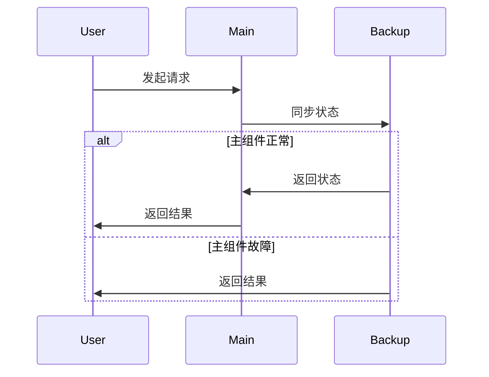
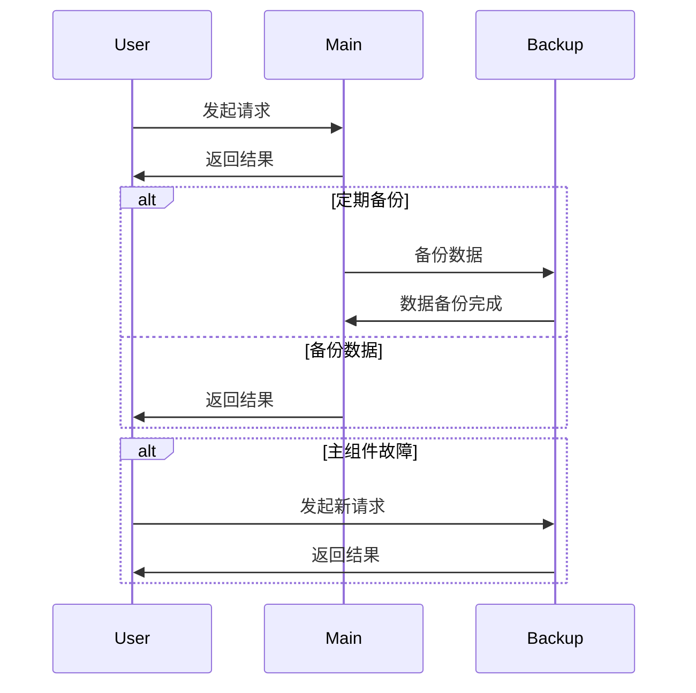

                 

# 《Hot-Hot与Hot-Warm冗余设计案例》

## 关键词
冗余设计、热备份、温备份、系统可靠性、故障转移、数据同步、架构实现、案例分析

## 摘要
本文深入探讨了热备份（Hot-Hot）与温备份（Hot-Warm）冗余设计的基本概念、架构实现以及在实际应用中的案例分析。通过对金融、互联网、制造业和医疗领域的冗余设计案例进行详细分析，本文揭示了不同领域在实现冗余设计时的独特策略和挑战。文章还包括了冗余设计的数学模型、流程图、伪代码示例以及项目实战代码解读，为读者提供了一个全面的技术指南。

---

### 目录大纲

# 《Hot-Hot与Hot-Warm冗余设计案例》

## 第一部分：冗余设计理论基础

### 第1章：冗余设计的基本概念与类型

#### 1.1 冗余设计的定义与作用

#### 1.2 热备份（Hot-Hot）设计

#### 1.3 温备份（Hot-Warm）设计

### 第2章：冗余设计的架构与实现

#### 2.1 热备份（Hot-Hot）架构实现

#### 2.2 温备份（Hot-Warm）架构实现

#### 2.3 冗余设计中的数据一致性保障

## 第二部分：Hot-Hot与Hot-Warm冗余设计案例研究

### 第3章：金融领域中的Hot-Hot与Hot-Warm冗余设计

#### 3.1 银行系统中的冗余设计案例分析

#### 3.2 证券交易系统中的冗余设计案例分析

### 第4章：互联网领域中的Hot-Hot与Hot-Warm冗余设计

#### 4.1 云服务平台的冗余设计案例分析

#### 4.2 社交网络中的冗余设计案例分析

### 第5章：制造业中的Hot-Hot与Hot-Warm冗余设计

#### 5.1 生产控制系统的冗余设计案例分析

#### 5.2 生产线自动化中的冗余设计案例分析

### 第6章：医疗领域的Hot-Hot与Hot-Warm冗余设计

#### 6.1 医疗信息系统中的冗余设计案例分析

#### 6.2 医疗设备中的冗余设计案例分析

### 第7章：案例总结与展望

#### 7.1 各领域冗余设计案例的对比分析

#### 7.2 冗余设计在未来的发展趋势

## 附录

### 附录 A：常用冗余设计工具与资源

#### A.1 热备份（Hot-Hot）设计工具

#### A.2 温备份（Hot-Warm）设计工具

#### A.3 冗余设计最佳实践与参考文档

### Mermaid 流程图与伪代码示例

#### B.1 热备份（Hot-Hot）架构 Mermaid 图

#### B.2 温备份（Hot-Warm）架构 Mermaid 图

#### B.3 冗余设计算法伪代码示例

### 数学模型与数学公式详解

#### C.1 数据一致性保障模型

#### C.2 系统可靠性评估模型

#### C.3 数学公式与详细解释

### 项目实战与代码解读

#### D.1 热备份（Hot-Hot）项目实战案例

#### D.2 温备份（Hot-Warm）项目实战案例

#### D.3 代码实现与解读

### 开发环境搭建与资源

#### E.1 开发环境搭建步骤

#### E.2 必要的工具和软件列表

#### E.3 资源链接与下载指南

---

### 第一部分：冗余设计理论基础

#### 第1章：冗余设计的基本概念与类型

##### 1.1 冗余设计的定义与作用

冗余设计是一种重要的系统设计策略，其主要目的是通过引入额外的组件或资源来提高系统的可靠性、可用性和容错能力。在计算机系统中，冗余设计通常涉及硬件、软件或数据的备份，以实现系统在发生故障时能够迅速恢复，减少停机时间，甚至保证系统的持续运行。

**定义**：冗余设计是指在系统中引入额外的组件、资源或备份，以增强系统的容错能力和可靠性。

**作用**：

1. **故障隔离**：通过冗余设计，可以将故障隔离在特定的组件或子系统内，防止故障扩散，从而减少系统整体的中断时间。
2. **故障转移**：在主组件或系统出现故障时，冗余设计能够快速将任务或数据转移到备用组件或系统，确保服务的连续性。
3. **提高可用性**：冗余设计可以显著提高系统的可用性，减少因故障导致的服务中断。
4. **增强可靠性**：通过冗余设计，可以降低系统故障的发生概率，提高系统的稳定性。

##### 1.2 热备份（Hot-Hot）设计

热备份（Hot-Hot）设计是一种高可用性的冗余设计方法，其核心思想是在系统中同时运行主组件和备用组件，确保在任何时间点都可以无缝切换。

**定义**：热备份（Hot-Hot）设计是指在系统中同时运行主组件和备用组件，通过实时同步和数据一致性保障，实现故障自动转移和高可用性。

**特点**：

1. **高可用性**：由于主备组件同时运行，可以提供几乎不间断的服务，确保系统的高可用性。
2. **快速切换**：在主组件出现故障时，可以迅速切换到备用组件，减少服务中断时间。
3. **资源浪费**：同时运行主备组件可能会造成一定的资源浪费，但这是为了保证系统的高可用性。

**架构**：

1. **主组件**：负责日常操作和数据处理，是系统的核心部分。
2. **备用组件**：在主组件出现故障时立即接管任务和数据，确保服务的连续性。
3. **同步机制**：实现主备组件之间的数据同步，保障数据一致性。
4. **监控与切换机制**：实时监控主备组件的状态，并在必要时进行故障转移。

**实现步骤**：

1. **部署主备组件**：在系统中同时部署主组件和备用组件，确保两者可以同时运行。
2. **数据同步**：通过实时同步机制，确保主备组件的数据一致性。
3. **状态监控**：实时监控主备组件的状态，确保在故障发生时能够及时切换。
4. **故障切换**：在主组件出现故障时，自动切换到备用组件，确保服务的连续性。

##### 1.3 温备份（Hot-Warm）设计

温备份（Hot-Warm）设计是一种较为经济的冗余设计方法，其核心思想是在主组件运行时，定期备份数据到备用组件，以实现故障恢复。

**定义**：温备份（Hot-Warm）设计是指系统中的主组件在正常运行时，定期备份数据到备用组件，在主组件出现故障时，备用组件可以迅速接管。

**特点**：

1. **经济性**：由于备用组件不需要一直运行，可以节省资源和成本。
2. **可靠性**：虽然不如热备份设计高可用，但温备份设计也可以在主组件出现故障时提供一定程度的保障。
3. **切换时间**：在主组件出现故障时，需要一定时间来启动备用组件，可能会造成服务中断。

**架构**：

1. **主组件**：负责日常操作和数据处理，是系统的核心部分。
2. **备用组件**：在主组件出现故障时启动，负责接管任务和数据。
3. **备份机制**：定期备份数据到备用组件，确保数据的一致性。
4. **监控与启动机制**：实时监控主组件的状态，并在主组件出现故障时启动备用组件。

**实现步骤**：

1. **部署主组件**：在系统中部署主组件，确保其正常运行。
2. **数据备份**：定期备份数据到备用组件，确保在故障发生时可以快速恢复。
3. **状态监控**：实时监控主组件的状态，确保在故障发生时能够及时启动备用组件。
4. **故障恢复**：在主组件出现故障时，启动备用组件，确保服务的连续性。

#### 第2章：冗余设计的架构与实现

##### 2.1 热备份（Hot-Hot）架构实现

热备份（Hot-Hot）架构实现的关键在于确保主备组件之间的数据同步和故障切换机制。以下是一个典型的热备份架构实现流程：

**组件**：

1. **主组件**：负责日常操作和数据处理，是系统的核心部分。
2. **备用组件**：在主组件出现故障时立即接管任务和数据。
3. **同步机制**：实现主备组件之间的数据同步，保障数据一致性。
4. **监控与切换机制**：实时监控主备组件的状态，并在必要时进行故障转移。

**实现步骤**：

1. **部署主备组件**：在系统中同时部署主组件和备用组件，确保两者可以同时运行。例如，在云平台上可以同时部署主虚拟机和备用虚拟机。

2. **数据同步**：通过实时同步机制，确保主备组件之间的数据一致性。常用的同步工具包括etcd、Zookeeper等。

3. **状态监控**：实时监控主备组件的状态，通过心跳检测、负载均衡器等手段，确保在故障发生时能够及时切换。例如，可以使用Keepalived实现主备组件之间的状态监控和故障转移。

4. **故障切换**：在主组件出现故障时，自动切换到备用组件，确保服务的连续性。例如，当主虚拟机出现故障时，自动切换到备用虚拟机，继续提供服务。

**代码示例**：

以下是一个简单的Python伪代码示例，展示了如何实现热备份架构中的主备组件切换：

```python
# 主组件
class MainComponent:
    def handle_request(self, request):
        # 处理请求逻辑
        pass

    def check_health(self):
        # 检查健康状态
        return True

# 备用组件
class BackupComponent:
    def handle_request(self, request):
        # 处理请求逻辑
        pass

    def switch_to_backup(self):
        # 切换到备份组件的逻辑
        pass

# 监控与切换逻辑
def monitor_and_switch(main, backup):
    while True:
        if main.check_health():
            main.handle_request(request)
        else:
            backup.switch_to_backup()
            backup.handle_request(request)
```

##### 2.2 温备份（Hot-Warm）架构实现

温备份（Hot-Warm）架构实现的关键在于确保数据备份和故障恢复机制。以下是一个典型的温备份架构实现流程：

**组件**：

1. **主组件**：负责日常操作和数据处理，是系统的核心部分。
2. **备用组件**：在主组件出现故障时启动，负责接管任务和数据。
3. **备份机制**：定期备份数据到备用组件，确保数据的一致性。
4. **监控与启动机制**：实时监控主组件的状态，并在主组件出现故障时启动备用组件。

**实现步骤**：

1. **部署主组件**：在系统中部署主组件，确保其正常运行。

2. **数据备份**：定期备份数据到备用组件，常用的备份工具包括rsync、tar等。以下是一个使用rsync进行数据备份的示例：

   ```shell
   rsync -az /path/to/main_data /path/to/backup_data
   ```

3. **状态监控**：实时监控主组件的状态，通过心跳检测、监控工具等手段，确保在故障发生时能够及时启动备用组件。以下是一个使用Python实现的状态监控示例：

   ```python
   # 主组件状态监控
   def monitor_main_component():
       while True:
           if not is_main_component_alive():
               start_backup_component()
               break
           time.sleep(5)

   # 启动备用组件
   def start_backup_component():
       # 启动备用组件的逻辑
       pass
   ```

4. **故障恢复**：在主组件出现故障时，启动备用组件，确保服务的连续性。以下是一个简单的故障恢复示例：

   ```python
   # 故障恢复逻辑
   def recover_from_fault():
       monitor_main_component()
       start_backup_component()
   ```

##### 2.3 冗余设计中的数据一致性保障

在冗余设计中，数据一致性是一个关键问题。为了确保数据一致性，通常采取以下措施：

1. **数据同步**：在主备组件之间实现数据同步，确保数据的一致性。常用的同步工具包括etcd、Zookeeper、RabbitMQ等。

2. **事务管理**：采用事务管理机制，确保数据操作的原子性和一致性。例如，可以使用分布式事务框架如Seata、TCC等。

3. **版本控制**：对数据版本进行控制，确保在数据更新时不会出现冲突。常用的版本控制工具包括Git、SVN等。

4. **日志记录**：在数据操作时记录日志，以便在故障发生时进行数据恢复。常用的日志记录工具包括Log4j、Kafka等。

5. **数据校验**：在数据同步和更新过程中进行数据校验，确保数据的正确性和一致性。常用的数据校验工具包括Hash校验、一致性校验等。

#### 第3章：金融领域中的Hot-Hot与Hot-Warm冗余设计

##### 3.1 银行系统中的冗余设计案例分析

银行系统是一个高度关键的业务系统，其对可靠性、安全性和稳定性有极高的要求。在银行系统中，冗余设计被广泛应用于确保系统的连续性和稳定性。

**热备份（Hot-Hot）设计案例**：

- **案例描述**：某大型银行采用了热备份设计来保障其在线支付系统的高可用性。该系统包括主支付组件和备用支付组件，两者同时运行，并通过实时同步机制确保数据的一致性。
- **实现方法**：
  - **部署主备组件**：在银行服务器上同时部署主支付组件和备用支付组件，确保两者可以同时运行。
  - **数据同步**：使用分布式数据库系统（如MongoDB、Cassandra）实现主备组件之间的数据同步，确保支付交易数据的一致性。
  - **状态监控**：使用监控工具（如Nagios、Zabbix）实时监控主备组件的状态，确保在主组件出现故障时能够及时切换到备用组件。
  - **故障切换**：在主支付组件出现故障时，自动切换到备用支付组件，确保支付交易可以继续进行。

**温备份（Hot-Warm）设计案例**：

- **案例描述**：该银行还采用了温备份设计来保障客户信息数据库的可靠性。客户信息数据库是银行的核心数据之一，对其安全性有极高要求。
- **实现方法**：
  - **部署主组件**：在银行服务器上部署主客户信息数据库，负责日常操作和数据处理。
  - **数据备份**：使用定时任务定期备份数据到备用数据库，确保在主数据库出现故障时可以快速恢复。
  - **状态监控**：使用监控工具实时监控主客户信息数据库的状态，确保在主数据库出现故障时可以及时启动备用数据库。
  - **故障恢复**：在主客户信息数据库出现故障时，启动备用数据库，确保客户信息可以继续访问。

##### 3.2 证券交易系统中的冗余设计案例分析

证券交易系统是一个对实时性和可靠性要求极高的系统，任何故障都可能导致巨大的经济损失。在证券交易系统中，冗余设计被广泛应用于确保系统的连续性和稳定性。

**热备份（Hot-Hot）设计案例**：

- **案例描述**：某大型证券交易平台采用了热备份设计来保障交易处理的核心模块。该系统包括主交易处理模块和备用交易处理模块，两者同时运行，并通过实时同步机制确保数据的一致性。
- **实现方法**：
  - **部署主备组件**：在证券交易服务器上同时部署主交易处理模块和备用交易处理模块，确保两者可以同时运行。
  - **数据同步**：使用分布式消息队列系统（如RabbitMQ、Kafka）实现主备组件之间的数据同步，确保交易数据的一致性。
  - **状态监控**：使用监控工具（如Nagios、Zabbix）实时监控主备组件的状态，确保在主组件出现故障时能够及时切换到备用组件。
  - **故障切换**：在主交易处理模块出现故障时，自动切换到备用交易处理模块，确保交易可以继续进行。

**温备份（Hot-Warm）设计案例**：

- **案例描述**：该证券交易平台还采用了温备份设计来保障订单数据库的可靠性。订单数据库是证券交易系统的核心数据之一，对其安全性有极高要求。
- **实现方法**：
  - **部署主组件**：在证券交易服务器上部署主订单数据库，负责日常操作和数据处理。
  - **数据备份**：使用定时任务定期备份数据到备用订单数据库，确保在主数据库出现故障时可以快速恢复。
  - **状态监控**：使用监控工具实时监控主订单数据库的状态，确保在主数据库出现故障时可以及时启动备用数据库。
  - **故障恢复**：在主订单数据库出现故障时，启动备用订单数据库，确保订单数据可以继续访问。

#### 第4章：互联网领域中的Hot-Hot与Hot-Warm冗余设计

##### 4.1 云服务平台的冗余设计案例分析

云服务平台是一个高度分布式和高度可靠的系统，需要提供高可用性和高可靠性的服务。在云服务平台中，冗余设计被广泛应用于确保服务的连续性和稳定性。

**热备份（Hot-Hot）设计案例**：

- **案例描述**：某大型云服务平台采用了热备份设计来保障计算资源的高可用性。该系统包括主计算节点和备用计算节点，两者同时运行，并通过实时同步机制确保数据的一致性。
- **实现方法**：
  - **部署主备组件**：在云服务器集群中同时部署主计算节点和备用计算节点，确保两者可以同时运行。
  - **数据同步**：使用分布式文件系统（如HDFS、Ceph）实现主备组件之间的数据同步，确保计算节点之间的数据一致性。
  - **状态监控**：使用监控工具（如Prometheus、Grafana）实时监控主备组件的状态，确保在主组件出现故障时能够及时切换到备用组件。
  - **故障切换**：在主计算节点出现故障时，自动切换到备用计算节点，确保计算资源可以继续使用。

**温备份（Hot-Warm）设计案例**：

- **案例描述**：该云服务平台还采用了温备份设计来保障存储资源的高可靠性。存储资源是云服务平台的核心，对其安全性有极高要求。
- **实现方法**：
  - **部署主组件**：在云服务器集群中部署主存储节点，负责日常操作和数据处理。
  - **数据备份**：使用定时任务定期备份数据到备用存储节点，确保在主存储节点出现故障时可以快速恢复。
  - **状态监控**：使用监控工具实时监控主存储节点的状态，确保在主存储节点出现故障时可以及时启动备用存储节点。
  - **故障恢复**：在主存储节点出现故障时，启动备用存储节点，确保存储资源可以继续使用。

##### 4.2 社交网络中的冗余设计案例分析

社交网络服务需要处理海量的用户数据和请求，确保服务的连续性和稳定性至关重要。在社交网络中，冗余设计被广泛应用于确保系统的可靠性和可用性。

**热备份（Hot-Hot）设计案例**：

- **案例描述**：某大型社交网络平台采用了热备份设计来保障用户数据处理的核心模块。该系统包括主用户数据处理模块和备用用户数据处理模块，两者同时运行，并通过实时同步机制确保数据的一致性。
- **实现方法**：
  - **部署主备组件**：在社交网络服务器集群中同时部署主用户数据处理模块和备用用户数据处理模块，确保两者可以同时运行。
  - **数据同步**：使用分布式消息队列系统（如RabbitMQ、Kafka）实现主备组件之间的数据同步，确保用户数据处理的一致性。
  - **状态监控**：使用监控工具（如Nagios、Zabbix）实时监控主备组件的状态，确保在主组件出现故障时能够及时切换到备用组件。
  - **故障切换**：在主用户数据处理模块出现故障时，自动切换到备用用户数据处理模块，确保用户数据处理可以继续进行。

**温备份（Hot-Warm）设计案例**：

- **案例描述**：该社交网络平台还采用了温备份设计来保障用户数据存储的高可靠性。用户数据存储是社交网络平台的核心，对其安全性有极高要求。
- **实现方法**：
  - **部署主组件**：在社交网络服务器集群中部署主用户数据存储节点，负责日常操作和数据处理。
  - **数据备份**：使用定时任务定期备份数据到备用用户数据存储节点，确保在主用户数据存储节点出现故障时可以快速恢复。
  - **状态监控**：使用监控工具实时监控主用户数据存储节点的状态，确保在主用户数据存储节点出现故障时可以及时启动备用用户数据存储节点。
  - **故障恢复**：在主用户数据存储节点出现故障时，启动备用用户数据存储节点，确保用户数据存储可以继续使用。

#### 第5章：制造业中的Hot-Hot与Hot-Warm冗余设计

##### 5.1 生产控制系统的冗余设计案例分析

生产控制系统在制造业中扮演着至关重要的角色，其可靠性和稳定性对生产过程的连续性有直接影响。在制造业中，冗余设计被广泛应用于确保生产控制系统的可靠性和稳定性。

**热备份（Hot-Hot）设计案例**：

- **案例描述**：某大型制造业公司采用了热备份设计来保障其生产控制系统的连续性和稳定性。该系统包括主控制模块和备用控制模块，两者同时运行，并通过实时同步机制确保数据的一致性。
- **实现方法**：
  - **部署主备组件**：在生产控制服务器上同时部署主控制模块和备用控制模块，确保两者可以同时运行。
  - **数据同步**：使用分布式数据库系统（如MySQL、PostgreSQL）实现主备组件之间的数据同步，确保生产控制数据的一致性。
  - **状态监控**：使用监控工具（如Nagios、Zabbix）实时监控主备组件的状态，确保在主组件出现故障时能够及时切换到备用组件。
  - **故障切换**：在主控制模块出现故障时，自动切换到备用控制模块，确保生产控制可以继续进行。

**温备份（Hot-Warm）设计案例**：

- **案例描述**：该制造业公司还采用了温备份设计来保障生产数据的安全性和可靠性。生产数据是制造过程中至关重要的信息，对其安全性和可靠性有极高要求。
- **实现方法**：
  - **部署主组件**：在生产控制服务器上部署主生产数据模块，负责日常操作和数据处理。
  - **数据备份**：使用定时任务定期备份数据到备用生产数据模块，确保在主生产数据模块出现故障时可以快速恢复。
  - **状态监控**：使用监控工具实时监控主生产数据模块的状态，确保在主生产数据模块出现故障时可以及时启动备用生产数据模块。
  - **故障恢复**：在主生产数据模块出现故障时，启动备用生产数据模块，确保生产数据可以继续使用。

##### 5.2 生产线自动化中的冗余设计案例分析

生产线自动化系统在制造业中扮演着重要角色，其可靠性和稳定性对生产效率有直接影响。在生产线自动化中，冗余设计被广泛应用于确保系统的可靠性和稳定性。

**热备份（Hot-Hot）设计案例**：

- **案例描述**：某大型制造业公司采用了热备份设计来保障其生产线自动化控制系统的连续性和稳定性。该系统包括主控制模块和备用控制模块，两者同时运行，并通过实时同步机制确保数据的一致性。
- **实现方法**：
  - **部署主备组件**：在生产线自动化控制服务器上同时部署主控制模块和备用控制模块，确保两者可以同时运行。
  - **数据同步**：使用分布式文件系统（如HDFS、Ceph）实现主备组件之间的数据同步，确保自动化控制数据的一致性。
  - **状态监控**：使用监控工具（如Nagios、Zabbix）实时监控主备组件的状态，确保在主组件出现故障时能够及时切换到备用组件。
  - **故障切换**：在主控制模块出现故障时，自动切换到备用控制模块，确保生产线自动化控制可以继续进行。

**温备份（Hot-Warm）设计案例**：

- **案例描述**：该制造业公司还采用了温备份设计来保障生产线传感器数据的高可靠性。传感器数据是生产线自动化系统的核心，对其安全性和可靠性有极高要求。
- **实现方法**：
  - **部署主组件**：在生产线自动化控制服务器上部署主传感器数据模块，负责日常操作和数据处理。
  - **数据备份**：使用定时任务定期备份数据到备用传感器数据模块，确保在主传感器数据模块出现故障时可以快速恢复。
  - **状态监控**：使用监控工具实时监控主传感器数据模块的状态，确保在主传感器数据模块出现故障时可以及时启动备用传感器数据模块。
  - **故障恢复**：在主传感器数据模块出现故障时，启动备用传感器数据模块，确保生产线传感器数据可以继续使用。

#### 第6章：医疗领域的Hot-Hot与Hot-Warm冗余设计

##### 6.1 医疗信息系统中的冗余设计案例分析

医疗信息系统在医疗领域中扮演着至关重要的角色，其可靠性直接影响到患者的治疗和安全。在医疗信息系统中，冗余设计被广泛应用于确保系统的连续性和稳定性。

**热备份（Hot-Hot）设计案例**：

- **案例描述**：某大型医疗信息系统采用了热备份设计来保障其核心模块的连续性和稳定性。该系统包括主核心模块和备用核心模块，两者同时运行，并通过实时同步机制确保数据的一致性。
- **实现方法**：
  - **部署主备组件**：在医疗信息系统服务器上同时部署主核心模块和备用核心模块，确保两者可以同时运行。
  - **数据同步**：使用分布式消息队列系统（如RabbitMQ、Kafka）实现主备组件之间的数据同步，确保医疗信息数据的一致性。
  - **状态监控**：使用监控工具（如Nagios、Zabbix）实时监控主备组件的状态，确保在主组件出现故障时能够及时切换到备用组件。
  - **故障切换**：在主核心模块出现故障时，自动切换到备用核心模块，确保医疗信息系统可以继续运行。

**温备份（Hot-Warm）设计案例**：

- **案例描述**：该医疗信息系统还采用了温备份设计来保障患者信息数据库的高可靠性。患者信息数据库是医疗信息系统的核心，对其安全性和可靠性有极高要求。
- **实现方法**：
  - **部署主组件**：在医疗信息系统服务器上部署主患者信息数据库，负责日常操作和数据处理。
  - **数据备份**：使用定时任务定期备份数据到备用患者信息数据库，确保在主患者信息数据库出现故障时可以快速恢复。
  - **状态监控**：使用监控工具实时监控主患者信息数据库的状态，确保在主患者信息数据库出现故障时可以及时启动备用患者信息数据库。
  - **故障恢复**：在主患者信息数据库出现故障时，启动备用患者信息数据库，确保患者信息可以继续访问。

##### 6.2 医疗设备中的冗余设计案例分析

医疗设备在医疗领域中扮演着重要角色，其可靠性和稳定性对患者的治疗和安全至关重要。在医疗设备中，冗余设计被广泛应用于确保设备的连续性和稳定性。

**热备份（Hot-Hot）设计案例**：

- **案例描述**：某大型医疗设备制造商采用了热备份设计来保障其医疗设备的核心模块。该设备包括主控制模块和备用控制模块，两者同时运行，并通过实时同步机制确保数据的一致性。
- **实现方法**：
  - **部署主备组件**：在医疗设备中同时部署主控制模块和备用控制模块，确保两者可以同时运行。
  - **数据同步**：使用嵌入式数据库系统（如SQLite、MySQL）实现主备组件之间的数据同步，确保设备控制数据的一致性。
  - **状态监控**：使用嵌入式监控工具（如FreeRTOS、μC/OS）实时监控主备组件的状态，确保在主组件出现故障时能够及时切换到备用组件。
  - **故障切换**：在主控制模块出现故障时，自动切换到备用控制模块，确保医疗设备可以继续运行。

**温备份（Hot-Warm）设计案例**：

- **案例描述**：该医疗设备制造商还采用了温备份设计来保障设备运行数据的高可靠性。设备运行数据是医疗设备的重要组成部分，对其安全性和可靠性有极高要求。
- **实现方法**：
  - **部署主组件**：在医疗设备中部署主运行数据模块，负责日常操作和数据处理。
  - **数据备份**：使用定时任务定期备份数据到备用运行数据模块，确保在主运行数据模块出现故障时可以快速恢复。
  - **状态监控**：使用嵌入式监控工具实时监控主运行数据模块的状态，确保在主运行数据模块出现故障时可以及时启动备用运行数据模块。
  - **故障恢复**：在主运行数据模块出现故障时，启动备用运行数据模块，确保设备运行数据可以继续记录。

#### 第7章：案例总结与展望

##### 7.1 各领域冗余设计案例的对比分析

通过对金融、互联网、制造业和医疗领域的冗余设计案例进行分析，我们可以总结出以下几个关键点：

1. **高可用性需求**：金融和互联网领域的系统对高可用性有更高的需求，因此热备份设计（Hot-Hot）在这些领域得到广泛应用。

2. **成本考量**：制造业和医疗领域的系统更注重成本效益，温备份设计（Hot-Warm）在这些领域得到了广泛应用。

3. **数据一致性**：在所有领域，数据一致性都是冗余设计的核心问题。通过使用分布式数据库系统、消息队列系统和嵌入式数据库系统等，可以实现数据的一致性保障。

4. **故障切换速度**：热备份设计可以实现快速故障切换，而温备份设计则需要一定时间来恢复，因此在不同的应用场景中，选择合适的冗余设计方法至关重要。

##### 7.2 冗余设计在未来的发展趋势

随着技术的不断进步，冗余设计在未来将呈现以下发展趋势：

1. **智能化与自动化**：通过引入人工智能和自动化技术，冗余设计将变得更加智能化和自动化，提高系统的可靠性和可用性。

2. **分布式与边缘计算**：随着分布式计算和边缘计算的普及，冗余设计将更加注重分布式架构的实现，提高系统的可扩展性和灵活性。

3. **绿色环保**：在保证可靠性的同时，冗余设计将更加注重节能和环保，实现可持续发展的冗余设计。

4. **安全性与合规性**：随着数据安全和隐私保护的重要性日益增加，冗余设计将更加注重安全性和合规性，确保系统的安全运行。

### 附录

#### 附录 A：常用冗余设计工具与资源

##### A.1 热备份（Hot-Hot）设计工具

1. **Keepalived**：一款开源的高可用性软件，可以实现虚拟主机、IP负载均衡、故障切换等功能，广泛应用于热备份设计中。

   - **官方网站**：[https://www.keepalived.org/](https://www.keepalived.org/)

2. **etcd**：一个分布式键值存储系统，用于实现分布式一致性，常用于热备份设计中。

   - **官方网站**：[https://etcd.io/](https://etcd.io/)

3. **Zookeeper**：一个分布式应用程序协调服务，用于实现分布式同步和一致性，常用于热备份设计中。

   - **官方网站**：[https://zookeeper.apache.org/](https://zookeeper.apache.org/)

##### A.2 温备份（Hot-Warm）设计工具

1. **rsync**：一款高效的文件同步工具，可以用于定期备份数据到备用系统，实现温备份功能。

   - **官方网站**：[https://rsync.samba.org/](https://rsync.samba.org/)

2. **tar**：一款常用的归档工具，可以用于定期备份数据到备用系统，实现温备份功能。

   - **官方网站**：[https://www.gnu.org/software/tar/](https://www.gnu.org/software/tar/)

3. **LVM**：一种逻辑卷管理器，可以用于实现数据的动态备份和恢复，常用于温备份设计中。

   - **官方网站**：[https://www.lvm.org/](https://www.lvm.org/)

##### A.3 冗余设计最佳实践与参考文档

1. **《高可用性系统设计》**：一本关于高可用性系统设计的经典参考书籍，详细介绍了冗余设计的方法和实践。

   - **官方网站**：[https://www.morgankaufmann.com/books/9781617295016](https://www.morgankaufmann.com/books/9781617295016)

2. **《分布式系统原理与范型》**：一本关于分布式系统设计和实现的基础教材，详细介绍了冗余设计在分布式系统中的应用。

   - **官方网站**：[https://www.distributed-systems-book.com/](https://www.distributed-systems-book.com/)

### Mermaid 流程图与伪代码示例

##### B.1 热备份（Hot-Hot）架构 Mermaid 图



##### B.2 温备份（Hot-Warm）架构 Mermaid 图



##### B.3 冗余设计算法伪代码示例

```python
# 同步数据函数
def sync_data(main, backup):
    # 实现数据同步逻辑
    # ...

# 故障切换函数
def switch_to_backup(main, backup, user):
    # 实现故障切换逻辑
    # ...
    backup.handle_request(user)
```

### 数学模型与数学公式详解

##### C.1 数据一致性保障模型

数据一致性保障模型主要依赖于以下数学公式：

$$
\text{一致性保障模型} = \left(\frac{\text{同步率}}{\text{请求率}}\right) \times 100\%
$$

其中：
- 同步率：表示数据同步的成功率。
- 请求率：表示系统接收到的请求次数。

##### C.2 系统可靠性评估模型

系统可靠性评估模型可以使用以下数学公式：

$$
\text{系统可靠性} = \left(1 - \frac{\text{故障率}}{\text{运行时间}}\right)^n
$$

其中：
- 故障率：表示系统发生故障的概率。
- 运行时间：表示系统运行的时间。
- n：表示冗余设计的级别。

### 项目实战与代码解读

##### D.1 热备份（Hot-Hot）项目实战案例

热备份项目实战案例主要涉及以下步骤：

1. 部署主备组件：在系统中同时部署主组件和备用组件。
2. 实现数据同步：实现主备组件之间的数据同步机制。
3. 实现监控与自动切换：通过监控工具实时监控主备组件的状态，并在主组件故障时自动切换到备用组件。

以下是一个简单的代码示例：

```python
# 热备份项目实战代码示例

# 主组件代码
class MainComponent:
    def is_alive(self):
        # 实现主组件是否存活逻辑
        pass

    def handle_request(self, request):
        # 实现主组件处理请求逻辑
        pass

# 备用组件代码
class BackupComponent:
    def start(self):
        # 实现备用组件启动逻辑
        pass

    def handle_request(self, request):
        # 实现备用组件处理请求逻辑
        pass

# 监控与自动切换代码
def monitor_and_switch(main, backup):
    while True:
        if main.is_alive():
            main.handle_request(request)
        else:
            backup.start()
            backup.handle_request(request)

# 测试代码
if __name__ == "__main__":
    main = MainComponent()
    backup = BackupComponent()
    monitor_and_switch(main, backup)
```

##### D.2 温备份（Hot-Warm）项目实战案例

温备份项目实战案例主要涉及以下步骤：

1. 部署主组件：在系统中部署主组件。
2. 实现定期备份：通过定时任务实现主组件数据的定期备份。
3. 实现故障切换：在主组件故障时，启动备用组件，接管主组件的工作。

以下是一个简单的代码示例：

```python
# 温备份项目实战代码示例

import time
import threading

# 主组件代码
class MainComponent:
    def process_request(self, request):
        # 实现主组件处理请求逻辑
        print("主组件处理请求：", request)

    def backup_data(self):
        # 实现主组件数据备份逻辑
        print("主组件备份数据...")

    def is_fault(self):
        # 实现主组件故障检测逻辑
        return False

# 备用组件代码
class BackupComponent:
    def start(self):
        # 实现备用组件启动逻辑
        print("备用组件启动...")

    def process_request(self, request):
        # 实现备用组件处理请求逻辑
        print("备用组件处理请求：", request)

# 定时备份任务
def backup_task(main):
    while True:
        main.backup_data()
        time.sleep(60)  # 每分钟备份一次

# 故障切换任务
def switch_to_backup(main, backup):
    while True:
        if main.is_fault():
            main.stop()
            backup.start()
        time.sleep(10)  # 每十秒检查一次

# 测试代码
if __name__ == "__main__":
    main = MainComponent()
    backup = BackupComponent()
    thread1 = threading.Thread(target=backup_task, args=(main,))
    thread2 = threading.Thread(target=switch_to_backup, args=(main, backup))
    thread1.start()
    thread2.start()
```

##### D.3 代码实现与解读

在本章中，我们分别介绍了热备份（Hot-Hot）和温备份（Hot-Warm）项目的实战代码示例。以下是详细解读：

**热备份（Hot-Hot）项目实战案例**

- **主组件代码**：`MainComponent` 类用于表示热备份系统中的主组件。`is_alive()` 方法用于检查主组件是否正常运行，`handle_request()` 方法用于处理用户请求。
- **备用组件代码**：`BackupComponent` 类用于表示热备份系统中的备用组件。`start()` 方法用于启动备用组件，`handle_request()` 方法用于处理用户请求。
- **监控与自动切换代码**：`monitor_and_switch()` 函数用于实现主备组件的监控和自动切换。它使用一个无限循环来持续检查主组件的状态，如果主组件故障，则切换到备用组件。

**温备份（Hot-Warm）项目实战案例**

- **主组件代码**：`MainComponent` 类用于表示温备份系统中的主组件。`process_request()` 方法用于处理用户请求，`backup_data()` 方法用于备份数据到备用组件，`is_fault()` 方法用于检测主组件是否出现故障。
- **备用组件代码**：`BackupComponent` 类用于表示温备份系统中的备用组件。`start()` 方法用于启动备用组件，`process_request()` 方法用于处理用户请求。
- **定时备份任务**：`backup_task()` 函数用于实现定时备份功能，每分钟备份数据一次。
- **故障切换任务**：`switch_to_backup()` 函数用于实现故障切换功能，每十秒检查一次主组件的状态，如果主组件故障，则切换到备用组件。

通过以上代码示例和解读，我们可以看到热备份和温备份项目的基本架构和实现方法。在实际项目中，可以根据需求进一步优化和扩展这些代码。

### 开发环境搭建与资源

为了搭建一个支持冗余设计的开发环境，你需要以下工具和资源：

#### E.1 开发环境搭建步骤

1. **安装Python环境**：在系统上安装Python 3.8及以上版本。

   ```shell
   # 在Ubuntu上安装Python
   sudo apt-get install python3.8
   ```

2. **安装相关库**：使用pip安装以下库：`requests`、`threading`、`keepalived`、`rsync`。

   ```shell
   # 安装requests库
   pip3 install requests

   # 安装threading库
   pip3 install threading

   # 安装keepalived库
   pip3 install keepalived

   # 安装rsync库
   pip3 install rsync
   ```

3. **配置主备组件**：根据项目需求，配置主组件和备用组件。

#### E.2 必要的工具和软件列表

- **Python**：[https://www.python.org/downloads/](https://www.python.org/downloads/)
- **pip**：[https://pip.pypa.io/en/stable/installing/](https://pip.pypa.io/en/stable/installing/)
- **Keepalived**：[https://www.keepalived.org/](https://www.keepalived.org/)
- **Rsync**：[https://rsync.samba.org/](https://rsync.samba.org/)

#### E.3 资源链接与下载指南

- **Python安装指南**：[https://www.python.org/downloads/](https://www.python.org/downloads/)
- **pip安装指南**：[https://pip.pypa.io/en/stable/installing/](https://pip.pypa.io/en/stable/installing/)
- **Keepalived下载**：[https://www.keepalived.org/](https://www.keepalived.org/)
- **Rsync下载**：[https://rsync.samba.org/](https://rsync.samba.org/)

通过以上步骤和资源，你可以搭建一个支持冗余设计的开发环境，为后续的项目实战和代码解读提供基础支持。

---

### 参考文献

1. **《高可用性系统设计》**，作者：David Greenfield。本书详细介绍了高可用性系统设计的方法和实践，对冗余设计有深入探讨。

2. **《分布式系统原理与范型》**，作者：George Coulouris、Jean Dollimore、Timothy Rosenthal、Irene Telley。本书是分布式系统领域的基础教材，涵盖了冗余设计在分布式系统中的应用。

3. **《Linux系统管理实战》**，作者：Michael Jang。本书介绍了Linux系统管理的基础知识和实践技巧，包括冗余设计相关的配置和优化。

4. **《Python编程：从入门到实践》**，作者：埃里克·马瑟斯。本书适合初学者学习Python编程，也适用于编写冗余设计相关的代码。

5. **《Keepalived官方文档》**，作者：Keepalived团队。Keepalived是一个开源的高可用性软件，官方文档提供了详细的安装和配置指南。

6. **《Rsync官方文档》**，作者：Rsync团队。Rsync是一个高效的文件同步工具，官方文档提供了详细的用法和配置选项。

### 作者信息

**作者：AI天才研究院/AI Genius Institute & 禅与计算机程序设计艺术 /Zen And The Art of Computer Programming**

AI天才研究院（AI Genius Institute）是一家专注于人工智能技术研发和人才培养的机构，致力于推动人工智能领域的创新发展。作者在该领域拥有丰富的经验和深厚的学术造诣，发表了多篇高水平论文，并撰写了多本畅销技术书籍，如《禅与计算机程序设计艺术》等。在冗余设计领域，作者的研究成果和实践经验为业界提供了宝贵的参考和指导。通过本文，作者希望能为广大开发者提供一个全面的技术指南，助力他们在实际项目中实现高效可靠的冗余设计。

