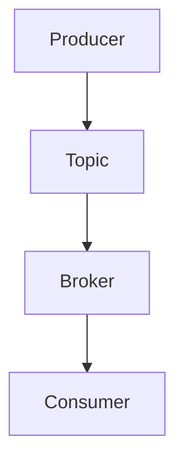
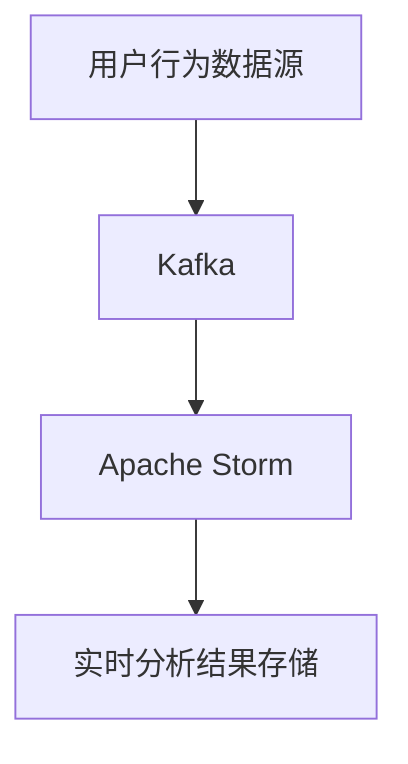
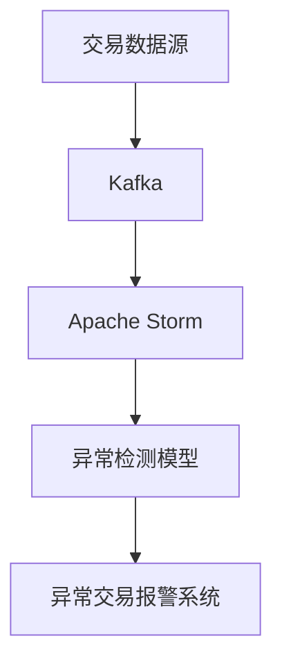
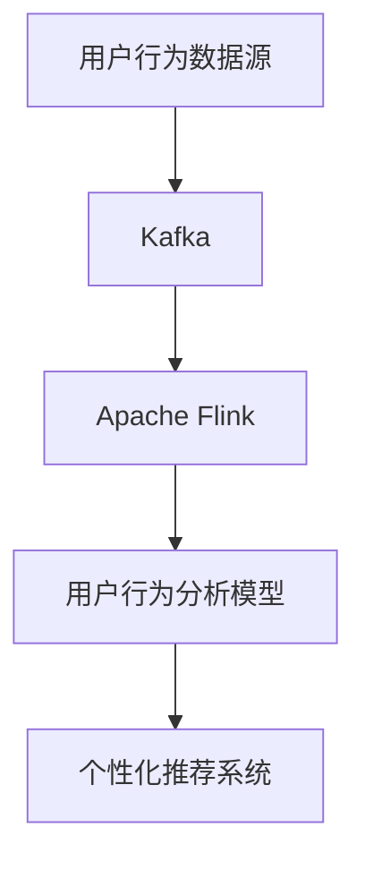

                 

# 《Kafka原理与代码实例讲解》

## 关键词

Kafka、消息队列、分布式系统、数据流处理、大数据分析

## 摘要

本文将深入探讨Kafka的原理与代码实例，旨在帮助读者理解Kafka的核心概念、架构设计、消息传递机制、高性能机制以及其在实际项目中的应用。通过详细的代码实例和分析，本文将展示Kafka如何搭建、优化以及与其他技术集成，为读者提供全面的Kafka学习指南。

### 《Kafka原理与代码实例讲解》目录大纲

#### 第一部分：Kafka基础

#### 第1章：Kafka概述

##### 1.1 Kafka的背景与优势

###### 1.1.1 Kafka的诞生与发展历程

###### 1.1.2 Kafka的主要优势

###### 1.1.3 Kafka的应用场景

##### 1.2 Kafka的核心概念

###### 1.2.1 Producer与Consumer

###### 1.2.2 Topic与Partition

###### 1.2.3 Offset与Fetch

##### 1.3 Kafka系统架构

###### 1.3.1 Kafka集群组成

###### 1.3.2 Kafka工作流程

###### 1.3.3 Kafka的高可用性

#### 第2章：Kafka的消息传递机制

##### 2.1 Kafka的消息格式

###### 2.1.1 消息结构

###### 2.1.2 消息类型

##### 2.2 Kafka的消息传递过程

###### 2.2.1 Producer发送消息

###### 2.2.2 Broker存储消息

###### 2.2.3 Consumer消费消息

##### 2.3 Kafka的消息保证

###### 2.3.1 顺序保证

###### 2.3.2 传输可靠性

###### 2.3.3 重复消息避免

#### 第3章：Kafka的高性能机制

##### 3.1 Kafka的并发处理

###### 3.1.1 Producer并发发送

###### 3.1.2 Consumer并发消费

##### 3.2 Kafka的内存管理

###### 3.2.1 堆外内存（Off-Heap Memory）

###### 3.2.2 内存池（Memory Pools）

##### 3.3 Kafka的压缩与解压缩

###### 3.3.1 压缩算法

###### 3.3.2 压缩策略

#### 第4章：Kafka的高可用性与数据持久化

##### 4.1 Kafka的高可用性

###### 4.1.1 集群搭建

###### 4.1.2 ZooKeeper的作用

###### 4.1.3 哨兵模式（Sentinel Mode）

##### 4.2 Kafka的数据持久化

###### 4.2.1 持久化策略

###### 4.2.2 数据恢复

##### 4.3 Kafka的数据备份与恢复

###### 4.3.1 备份策略

###### 4.3.2 恢复策略

#### 第5章：Kafka的监控与管理

##### 5.1 Kafka的监控指标

###### 5.1.1 常见监控指标

###### 5.1.2 自定义监控指标

##### 5.2 Kafka的性能调优

###### 5.2.1 参数调优

###### 5.2.2 JVM调优

##### 5.3 Kafka的安全管理

###### 5.3.1 访问控制

###### 5.3.2 数据加密

#### 第二部分：Kafka项目实战

#### 第6章：Kafka在实时数据处理中的应用

##### 6.1 实时数据处理概述

###### 6.1.1 数据流处理框架

###### 6.1.2 Kafka在实时数据处理中的作用

##### 6.2 实时数据处理项目案例

###### 6.2.1 项目背景

###### 6.2.2 系统架构

###### 6.2.3 代码实例讲解

#### 第7章：Kafka在金融风控系统中的应用

##### 7.1 金融风控系统概述

###### 7.1.1 金融风控系统的作用

###### 7.1.2 Kafka在金融风控系统中的作用

##### 7.2 金融风控项目案例

###### 7.2.1 项目背景

###### 7.2.2 系统架构

###### 7.2.3 代码实例讲解

#### 第8章：Kafka在大数据分析中的应用

##### 8.1 大数据分析概述

###### 8.1.1 大数据的概念

###### 8.1.2 大数据分析的重要性

##### 8.2 大数据分析项目案例

###### 8.2.1 项目背景

###### 8.2.2 系统架构

###### 8.2.3 代码实例讲解

#### 第9章：Kafka集群搭建与优化

##### 9.1 Kafka集群搭建

###### 9.1.1 单机模式

###### 9.1.2 集群模式

###### 9.1.3 跨机房部署

##### 9.2 Kafka性能优化

###### 9.2.1 数据存储优化

###### 9.2.2 网络优化

###### 9.2.3 JVM调优

#### 第10章：Kafka与其他技术的集成

##### 10.1 Kafka与Apache Storm的集成

###### 10.1.1 Storm架构

###### 10.1.2 Kafka与Storm的集成方法

##### 10.2 Kafka与Apache Flink的集成

###### 10.2.1 Flink架构

###### 10.2.2 Kafka与Flink的集成方法

##### 10.3 Kafka与Spark Streaming的集成

###### 10.3.1 Spark Streaming架构

###### 10.3.2 Kafka与Spark Streaming的集成方法

#### 附录

##### A.1 Kafka常用工具与资源

###### A.1.1 Kafka官方文档

###### A.1.2 Kafka社区资源

##### A.2 Kafka相关书籍推荐

###### A.2.1 《Kafka权威指南》

###### A.2.2 《Kafka实战》

###### A.2.3 《深入理解Kafka：核心设计与实践原理》

### 核心概念与联系

Kafka是一种分布式流处理平台，它通过分布式系统架构提供高吞吐量的消息队列服务。Kafka的核心概念包括Producer、Consumer、Topic、Partition和Offset等。以下是一个关于Kafka核心概念的Mermaid流程图：



- **Producer**：消息生产者，负责向Kafka发送消息。
- **Consumer**：消息消费者，从Kafka消费消息。
- **Topic**：消息主题，是Kafka中消息的分类。
- **Partition**：分区，同一Topic的消息可以被分为多个分区，以实现并行处理。
- **Offset**：偏移量，用于唯一标识每个消息的位置。

### 核心算法原理讲解

Kafka的分区算法是确保消息均匀分布到各个分区的重要机制。以下是一个关于Kafka分区算法的伪代码：

```python
def partition(msg_key, num_partitions):
    if msg_key is None:
        return hash(0) % num_partitions
    else:
        return hash(msg_key) % num_partitions
```

此算法基于消息键（`msg_key`）进行哈希运算，如果消息键为空，则使用随机哈希值；否则，使用消息键的哈希值。分区数（`num_partitions`）决定了每个主题可以被分割的分区数量。

### 数学模型和数学公式

Kafka中的消息顺序保证主要依赖于分区和偏移量（Offset）。以下是一个关于偏移量模型的公式：

$$
Offset = Partition \times MessageID + SequenceNumber
$$

其中，`Partition`表示分区号，`MessageID`表示消息ID，`SequenceNumber`表示序列号。此公式用于唯一标识每个消息的位置。

### 项目实战

在本节中，我们将通过一个简单的Kafka生产者与消费者项目实战来展示如何在实际环境中使用Kafka。首先，我们需要搭建开发环境。

#### 开发环境搭建

1. 安装Kafka
   - 下载并解压Kafka安装包
   - 修改`config/server.properties`文件，配置Kafka运行所需的参数
   - 运行Kafka服务器

2. 安装Python库
   - 使用pip安装`kafka-python`库

#### 源代码实现

##### 生产者代码示例

```python
from kafka import KafkaProducer

# 创建Kafka生产者
producer = KafkaProducer(bootstrap_servers=['localhost:9092'])

# 发送消息到特定Topic
producer.send('test_topic', b'This is a test message')

# 发送异步消息
future = producer.send('test_topic', b'Another test message')

# 等待异步消息发送结果
result = future.get(timeout=10)
print(result)
```

##### 消费者代码示例

```python
from kafka import KafkaConsumer

# 创建Kafka消费者
consumer = KafkaConsumer('test_topic', bootstrap_servers=['localhost:9092'])

# 消费消息
for message in consumer:
    print(f"Received message: {message.value.decode('utf-8')}")
```

#### 代码解读与分析

1. **生产者代码解读：**
   - 创建Kafka生产者实例，指定Kafka服务器地址。
   - 使用`send()`方法发送消息到特定Topic。
   - 使用`get()`方法获取异步消息发送的结果。

2. **消费者代码解读：**
   - 创建Kafka消费者实例，指定Topic和Kafka服务器地址。
   - 使用`for`循环从Kafka消费消息，并打印消息内容。

通过以上代码实例，我们可以看到如何使用Kafka进行消息生产与消费。在实际项目中，您可以根据需要扩展代码功能，例如实现消息的持久化、监控和异常处理等。

### 核心概念与联系

Kafka是一种分布式流处理平台，它通过分布式系统架构提供高吞吐量的消息队列服务。Kafka的核心概念包括Producer、Consumer、Topic、Partition和Offset等。以下是一个关于Kafka核心概念的Mermaid流程图：


- **Producer**：消息生产者，负责向Kafka发送消息。
- **Consumer**：消息消费者，从Kafka消费消息。
- **Topic**：消息主题，是Kafka中消息的分类。
- **Partition**：分区，同一Topic的消息可以被分为多个分区，以实现并行处理。
- **Offset**：偏移量，用于唯一标识每个消息的位置。

### 核心算法原理讲解

Kafka的分区算法是确保消息均匀分布到各个分区的重要机制。以下是一个关于Kafka分区算法的伪代码：

```python
def partition(msg_key, num_partitions):
    if msg_key is None:
        return hash(0) % num_partitions
    else:
        return hash(msg_key) % num_partitions
```

此算法基于消息键（`msg_key`）进行哈希运算，如果消息键为空，则使用随机哈希值；否则，使用消息键的哈希值。分区数（`num_partitions`）决定了每个主题可以被分割的分区数量。

### 数学模型和数学公式

Kafka中的消息顺序保证主要依赖于分区和偏移量（Offset）。以下是一个关于偏移量模型的公式：

$$
Offset = Partition \times MessageID + SequenceNumber
$$

其中，`Partition`表示分区号，`MessageID`表示消息ID，`SequenceNumber`表示序列号。此公式用于唯一标识每个消息的位置。

### 项目实战

在本节中，我们将通过一个简单的Kafka生产者与消费者项目实战来展示如何在实际环境中使用Kafka。首先，我们需要搭建开发环境。

#### 开发环境搭建

1. 安装Kafka
   - 下载并解压Kafka安装包
   - 修改`config/server.properties`文件，配置Kafka运行所需的参数
   - 运行Kafka服务器

2. 安装Python库
   - 使用pip安装`kafka-python`库

#### 源代码实现

##### 生产者代码示例

```python
from kafka import KafkaProducer

# 创建Kafka生产者
producer = KafkaProducer(bootstrap_servers=['localhost:9092'])

# 发送消息到特定Topic
producer.send('test_topic', b'This is a test message')

# 发送异步消息
future = producer.send('test_topic', b'Another test message')

# 等待异步消息发送结果
result = future.get(timeout=10)
print(result)
```

##### 消费者代码示例

```python
from kafka import KafkaConsumer

# 创建Kafka消费者
consumer = KafkaConsumer('test_topic', bootstrap_servers=['localhost:9092'])

# 消费消息
for message in consumer:
    print(f"Received message: {message.value.decode('utf-8')}")
```

#### 代码解读与分析

1. **生产者代码解读：**
   - 创建Kafka生产者实例，指定Kafka服务器地址。
   - 使用`send()`方法发送消息到特定Topic。
   - 使用`get()`方法获取异步消息发送的结果。

2. **消费者代码解读：**
   - 创建Kafka消费者实例，指定Topic和Kafka服务器地址。
   - 使用`for`循环从Kafka消费消息，并打印消息内容。

通过以上代码实例，我们可以看到如何使用Kafka进行消息生产与消费。在实际项目中，您可以根据需要扩展代码功能，例如实现消息的持久化、监控和异常处理等。

### 《Kafka原理与代码实例讲解》

## 第一部分：Kafka基础

### 第1章：Kafka概述

### 1.1 Kafka的背景与优势

Kafka是一个开源的分布式流处理平台，由LinkedIn公司于2008年开发，并于2010年贡献给了Apache软件基金会。Kafka的设计初衷是为了解决LinkedIn大规模数据传输和存储的需求，特别是在处理实时数据流、日志收集和系统监控等方面。

#### 1.1.1 Kafka的诞生与发展历程

Kafka起源于LinkedIn，当时该公司面对的是不断增长的数据量和复杂的日志处理需求。为了解决这个问题，LinkedIn的工程师们开发了Kafka，并将其集成到其日志收集系统中。随着LinkedIn的发展，Kafka也不断进化，并最终成为一个独立的项目，于2010年加入Apache软件基金会，成为Apache Kafka。

#### 1.1.2 Kafka的主要优势

Kafka具有以下主要优势：

- **高吞吐量**：Kafka能够处理高吞吐量的数据流，适用于大规模数据传输场景。
- **可扩展性**：Kafka采用分布式架构，可以水平扩展，以处理更多的数据流。
- **持久性**：Kafka将消息存储在磁盘上，保证消息的持久性和可靠性。
- **高可用性**：Kafka通过副本和分区机制，实现高可用性和容错性。
- **可伸缩性**：Kafka支持动态扩展和缩放，以适应不同的负载。

#### 1.1.3 Kafka的应用场景

Kafka适用于多种应用场景，包括：

- **日志收集**：Kafka可以用于收集系统日志、事件日志等，实现分布式日志处理。
- **实时数据处理**：Kafka可以作为数据流的中间件，实现实时数据处理和流处理。
- **消息队列**：Kafka可以作为一个分布式消息队列，实现异步消息传递和任务调度。
- **系统监控**：Kafka可以用于监控系统的运行状态，实现实时监控和告警。
- **大数据处理**：Kafka可以作为大数据处理框架的输入源，实现实时数据采集和计算。

### 1.2 Kafka的核心概念

Kafka的核心概念包括Producer、Consumer、Topic、Partition和Offset等。

#### 1.2.1 Producer与Consumer

Producer（生产者）负责向Kafka发送消息，而Consumer（消费者）则从Kafka消费消息。生产者和消费者都是分布式系统的一部分，可以通过网络通信，实现数据传输。

#### 1.2.2 Topic与Partition

Topic（主题）是Kafka中消息的分类，类似于数据库中的表。每个Topic可以包含多个Partition（分区），分区是Kafka实现并行处理和负载均衡的关键。

#### 1.2.3 Offset与Fetch

Offset（偏移量）是Kafka中消息的唯一标识，类似于数据库中的行号。Consumer通过偏移量定位消息，确保消息的消费顺序。Fetch（拉取）是指Consumer从Kafka拉取消息的过程，通过Offset确定拉取的起始位置。

### 1.3 Kafka系统架构

Kafka系统架构包括Producer、Broker、Consumer和ZooKeeper等组件。

#### 1.3.1 Kafka集群组成

Kafka集群由多个Broker组成，每个Broker负责存储和转发消息。Broker之间通过ZooKeeper进行协调，实现分布式管理。

#### 1.3.2 Kafka工作流程

Kafka工作流程包括以下几个步骤：

1. **消息生产**：Producer将消息发送到Kafka集群。
2. **消息存储**：Kafka集群将消息存储在磁盘上，并分配给不同的Partition。
3. **消息消费**：Consumer从Kafka集群消费消息，根据Offset定位消息。

#### 1.3.3 Kafka的高可用性

Kafka通过副本和分区机制实现高可用性。每个Partition有多个副本，分布在不同的Broker上。当一个副本失败时，其他副本可以接管其工作，确保系统正常运行。

### 第2章：Kafka的消息传递机制

### 2.1 Kafka的消息格式

Kafka的消息格式包括两个主要部分：消息头和消息体。

#### 2.1.1 消息结构

消息结构如下：

```plaintext
+-----------------------------+-----------------------------+
|        消息头               |        消息体               |
+-----------------------------+-----------------------------+
| 魔数、属性、消息长度、CRC32 |        消息内容             |
+-----------------------------+-----------------------------+
```

- **魔数**：标识Kafka消息版本。
- **属性**：用于标识消息的属性，如压缩算法、事务标识等。
- **消息长度**：消息体长度。
- **CRC32**：消息体CRC32校验码，用于确保消息完整性。

#### 2.1.2 消息类型

Kafka支持以下几种消息类型：

- **普通消息**：最常用的消息类型，包含消息内容和偏移量。
- **事务消息**：用于实现消息事务，保证消息顺序。
- **同步消息**：生产者发送消息时，等待broker确认消息接收。
- **异步消息**：生产者发送消息后立即返回，无需等待broker确认。

### 2.2 Kafka的消息传递过程

Kafka的消息传递过程包括以下几个步骤：

1. **消息生产**：Producer将消息发送到Kafka集群。
2. **消息存储**：Kafka集群将消息存储在磁盘上，并分配给不同的Partition。
3. **消息消费**：Consumer从Kafka集群消费消息，根据Offset定位消息。

### 2.3 Kafka的消息保证

Kafka提供了以下几种消息保证：

1. **顺序保证**：确保消息按照发送顺序传递，适用于顺序敏感的应用场景。
2. **传输可靠性**：确保消息在传输过程中不丢失，适用于关键业务场景。
3. **重复消息避免**：通过唯一标识（如偏移量）确保消息不重复传递。

### 第3章：Kafka的高性能机制

### 3.1 Kafka的并发处理

Kafka通过并发处理机制实现高性能：

1. **Producer并发发送**：多个Producer可以并发向Kafka发送消息，提高吞吐量。
2. **Consumer并发消费**：多个Consumer可以并发从Kafka消费消息，实现负载均衡。

### 3.2 Kafka的内存管理

Kafka使用堆外内存（Off-Heap Memory）和内存池（Memory Pools）进行内存管理：

1. **堆外内存**：Kafka使用堆外内存存储消息，减少GC（垃圾回收）对性能的影响。
2. **内存池**：Kafka使用内存池管理堆外内存，提高内存分配和回收效率。

### 3.3 Kafka的压缩与解压缩

Kafka支持多种压缩算法，如Gzip、Snappy、LZ4和Zstd：

1. **压缩算法**：Kafka将消息压缩后存储，减少磁盘占用和网络传输延迟。
2. **压缩策略**：Kafka根据消息大小和传输带宽动态调整压缩策略，提高性能。

### 第4章：Kafka的高可用性与数据持久化

### 4.1 Kafka的高可用性

Kafka通过以下机制实现高可用性：

1. **副本机制**：每个Partition有多个副本，分布在不同的Broker上，实现数据冗余和故障转移。
2. **分区机制**：将消息分散到不同的Partition上，实现并行处理和负载均衡。
3. **ZooKeeper**：Kafka使用ZooKeeper进行集群管理，实现分布式协调和状态同步。

### 4.2 Kafka的数据持久化

Kafka将消息存储在磁盘上，实现数据持久化：

1. **持久化策略**：Kafka根据消息保留时间和磁盘容量动态调整持久化策略。
2. **数据恢复**：Kafka在启动时从磁盘加载消息，实现数据恢复。

### 4.3 Kafka的数据备份与恢复

Kafka支持数据备份与恢复：

1. **备份策略**：Kafka可以使用工具（如Kafka Tools）定期备份数据。
2. **恢复策略**：在数据丢失或故障时，Kafka可以从备份中恢复数据。

### 第5章：Kafka的监控与管理

### 5.1 Kafka的监控指标

Kafka提供了多种监控指标，包括：

1. **生产者指标**：消息发送速率、错误率等。
2. **消费者指标**：消息消费速率、拉取延迟等。
3. **集群指标**：带宽利用率、磁盘使用率等。

### 5.2 Kafka的性能调优

Kafka的性能调优包括：

1. **参数调优**：调整Kafka配置参数，如批次大小、批量发送等。
2. **JVM调优**：调整JVM参数，如堆大小、垃圾回收策略等。

### 5.3 Kafka的安全管理

Kafka的安全管理包括：

1. **访问控制**：使用Kerberos或ACL实现访问控制。
2. **数据加密**：使用SSL或TLS实现数据加密。

### 第二部分：Kafka项目实战

### 第6章：Kafka在实时数据处理中的应用

#### 6.1 实时数据处理概述

实时数据处理是大数据技术中的重要一环，Kafka作为消息队列和流处理平台，在实时数据处理中扮演着关键角色。

##### 6.1.1 数据流处理框架

数据流处理框架是指用于处理实时数据流的软件框架，常见的框架包括Apache Storm、Apache Flink和Apache Spark Streaming等。这些框架能够处理海量数据，实现实时分析、监控和决策。

##### 6.1.2 Kafka在实时数据处理中的作用

Kafka在实时数据处理中的作用主要体现在以下几个方面：

1. **数据采集**：Kafka可以作为数据流的中间件，实现实时数据采集。
2. **数据传输**：Kafka可以将数据从数据源传输到数据消费者，实现数据流处理。
3. **数据存储**：Kafka可以存储数据流中的消息，实现数据持久化。

#### 6.2 实时数据处理项目案例

以下是一个简单的实时数据处理项目案例，使用Kafka进行数据流处理。

##### 6.2.1 项目背景

某电商公司需要实时分析用户购物行为，以提供个性化推荐和营销策略。

##### 6.2.2 系统架构

系统架构如下：



- **用户行为数据源**：收集用户购物行为数据，如点击、购买等。
- **Kafka**：作为数据流的中间件，传输用户行为数据。
- **Apache Storm**：实时处理用户行为数据，生成分析结果。
- **实时分析结果存储**：存储实时分析结果，供业务系统使用。

##### 6.2.3 代码实例讲解

以下是一个简单的Kafka生产者和消费者示例，实现用户行为数据的实时传输和处理。

**生产者代码示例：**

```python
from kafka import KafkaProducer

# 创建Kafka生产者
producer = KafkaProducer(bootstrap_servers=['localhost:9092'])

# 发送用户行为数据到Kafka
user_behavior_data = {
    'user_id': 1001,
    'action': 'purchase',
    'timestamp': 1624376800
}
producer.send('user_behavior', value=user_behavior_data)

# 发送同步消息
future = producer.send('user_behavior', value=user_behavior_data)
result = future.get(timeout=10)
print(result)
```

**消费者代码示例：**

```python
from kafka import KafkaConsumer

# 创建Kafka消费者
consumer = KafkaConsumer('user_behavior', bootstrap_servers=['localhost:9092'])

# 消费用户行为数据
for message in consumer:
    user_behavior = message.value
    print(f"Received user behavior: {user_behavior}")
```

在实际项目中，您可以根据需要扩展代码功能，例如实现数据清洗、过滤和聚合等。

### 第7章：Kafka在金融风控系统中的应用

#### 7.1 金融风控系统概述

金融风控系统是金融机构用于管理风险、监测异常交易和预防欺诈的软件系统。随着金融业务的不断增长和复杂化，金融风控系统在金融机构中的作用越来越重要。

##### 7.1.1 金融风控系统的作用

金融风控系统的主要作用包括：

1. **风险管理**：识别、评估和管理金融机构面临的各种风险，包括信用风险、市场风险和操作风险等。
2. **异常监测**：实时监测交易活动，识别异常交易和可疑行为，预防欺诈和非法交易。
3. **决策支持**：提供数据分析、统计和预测结果，支持金融机构的决策和策略制定。

##### 7.1.2 Kafka在金融风控系统中的作用

Kafka在金融风控系统中的作用主要体现在以下几个方面：

1. **数据传输**：Kafka可以实时传输大量的交易数据、用户行为数据等，为金融风控系统提供数据源。
2. **数据流处理**：Kafka可以作为数据流的中间件，实现实时数据处理和流处理，为金融风控系统提供实时分析结果。
3. **数据持久化**：Kafka可以存储大量的历史数据，为金融风控系统提供数据备份和恢复功能。

#### 7.2 金融风控项目案例

以下是一个简单的金融风控项目案例，使用Kafka进行实时交易监控和异常检测。

##### 7.2.1 项目背景

某金融机构需要实时监控交易活动，识别异常交易和可疑行为，以预防欺诈和非法交易。

##### 7.2.2 系统架构

系统架构如下：



- **交易数据源**：收集交易数据，如交易金额、交易时间、交易方等。
- **Kafka**：作为数据流的中间件，传输交易数据。
- **Apache Storm**：实时处理交易数据，应用异常检测模型。
- **异常检测模型**：基于机器学习算法，识别异常交易和可疑行为。
- **异常交易报警系统**：实时接收异常交易报警，通知相关人员和相关部门。

##### 7.2.3 代码实例讲解

以下是一个简单的Kafka生产者和消费者示例，实现交易数据的实时传输和处理。

**生产者代码示例：**

```python
from kafka import KafkaProducer

# 创建Kafka生产者
producer = KafkaProducer(bootstrap_servers=['localhost:9092'])

# 发送交易数据到Kafka
transaction_data = {
    'transaction_id': 10001,
    'amount': 1000.0,
    'timestamp': 1624376800
}
producer.send('transaction_data', value=transaction_data)

# 发送同步消息
future = producer.send('transaction_data', value=transaction_data)
result = future.get(timeout=10)
print(result)
```

**消费者代码示例：**

```python
from kafka import KafkaConsumer

# 创建Kafka消费者
consumer = KafkaConsumer('transaction_data', bootstrap_servers=['localhost:9092'])

# 消费交易数据
for message in consumer:
    transaction = message.value
    print(f"Received transaction: {transaction}")
```

在实际项目中，您可以根据需要扩展代码功能，例如实现交易数据的清洗、过滤和聚合等。

### 第8章：Kafka在大数据分析中的应用

#### 8.1 大数据分析概述

大数据分析是指利用数据挖掘、统计分析、机器学习等技术和方法，从海量数据中提取有价值的信息和知识。大数据分析在商业、金融、医疗、交通等领域发挥着越来越重要的作用。

##### 8.1.1 大数据的概念

大数据（Big Data）通常指无法使用传统数据库工具进行有效管理和处理的数据集。大数据具有以下四个V特性：

1. **数据量（Volume）**：大数据集通常包含大量数据，如TB、PB级别。
2. **数据速度（Velocity）**：大数据集需要快速处理和传输，以应对实时数据处理需求。
3. **数据多样性（Variety）**：大数据集包含多种类型的数据，如结构化数据、半结构化数据和非结构化数据。
4. **数据价值（Value）**：大数据集蕴含着巨大的商业价值和社会价值，通过数据分析和挖掘可以获取有价值的洞察和决策支持。

##### 8.1.2 大数据分析的重要性

大数据分析的重要性体现在以下几个方面：

1. **商业洞察**：通过大数据分析，企业可以深入了解客户需求和行为，优化业务策略，提高竞争力。
2. **风险预测**：大数据分析可以帮助金融机构预测市场风险、评估信用风险，实现风险管理和控制。
3. **个性化推荐**：大数据分析可以分析用户行为和偏好，实现个性化推荐和营销，提高用户满意度和转化率。
4. **社会管理**：大数据分析可以帮助政府和企业优化公共服务、提高社会治理水平，实现智慧城市和智慧交通。

#### 8.2 大数据分析项目案例

以下是一个简单的大数据分析项目案例，使用Kafka进行实时数据采集和计算。

##### 8.2.1 项目背景

某电商公司需要实时分析用户购物行为，为用户提供个性化推荐和营销策略。

##### 8.2.2 系统架构

系统架构如下：



- **用户行为数据源**：收集用户购物行为数据，如点击、购买、评价等。
- **Kafka**：作为数据流的中间件，传输用户行为数据。
- **Apache Flink**：实时处理用户行为数据，生成分析结果。
- **用户行为分析模型**：分析用户行为数据，生成用户画像和推荐策略。
- **个性化推荐系统**：根据用户画像和推荐策略，为用户提供个性化推荐。

##### 8.2.3 代码实例讲解

以下是一个简单的Kafka生产者和消费者示例，实现用户行为数据的实时传输和处理。

**生产者代码示例：**

```python
from kafka import KafkaProducer

# 创建Kafka生产者
producer = KafkaProducer(bootstrap_servers=['localhost:9092'])

# 发送用户行为数据到Kafka
user_behavior_data = {
    'user_id': 1001,
    'action': 'purchase',
    'timestamp': 1624376800
}
producer.send('user_behavior', value=user_behavior_data)

# 发送同步消息
future = producer.send('user_behavior', value=user_behavior_data)
result = future.get(timeout=10)
print(result)
```

**消费者代码示例：**

```python
from kafka import KafkaConsumer

# 创建Kafka消费者
consumer = KafkaConsumer('user_behavior', bootstrap_servers=['localhost:9092'])

# 消费用户行为数据
for message in consumer:
    user_behavior = message.value
    print(f"Received user behavior: {user_behavior}")
```

在实际项目中，您可以根据需要扩展代码功能，例如实现用户行为的清洗、过滤和聚合等。

### 第9章：Kafka集群搭建与优化

#### 9.1 Kafka集群搭建

Kafka集群由多个Broker组成，每个Broker负责存储和转发消息。以下是一个简单的Kafka集群搭建步骤：

1. **安装Kafka**：下载并解压Kafka安装包，配置Kafka运行所需的参数。
2. **启动Kafka**：启动Kafka服务器，配置Kafka集群地址。
3. **创建主题**：使用Kafka命令创建主题，并配置分区数和副本数。
4. **生产者与消费者**：启动Kafka生产者和消费者，验证集群是否正常运行。

#### 9.1.1 单机模式

在单机模式下，Kafka仅运行在一个节点上，适用于开发测试环境。以下是一个简单的单机模式搭建步骤：

1. **安装Kafka**：下载并解压Kafka安装包，配置Kafka运行所需的参数。
2. **启动Kafka**：启动Kafka服务器，配置Kafka单机模式。
3. **创建主题**：使用Kafka命令创建主题，并配置分区数和副本数。
4. **生产者与消费者**：启动Kafka生产者和消费者，验证单机模式是否正常运行。

#### 9.1.2 集群模式

在集群模式下，Kafka运行在多个节点上，实现分布式存储和负载均衡。以下是一个简单的集群模式搭建步骤：

1. **安装Kafka**：下载并解压Kafka安装包，配置Kafka运行所需的参数。
2. **启动ZooKeeper**：启动ZooKeeper服务器，配置ZooKeeper集群地址。
3. **启动Kafka**：启动Kafka服务器，配置Kafka集群模式。
4. **创建主题**：使用Kafka命令创建主题，并配置分区数和副本数。
5. **生产者与消费者**：启动Kafka生产者和消费者，验证集群模式是否正常运行。

#### 9.1.3 跨机房部署

跨机房部署是指Kafka集群跨越不同的数据中心或机房。以下是一个简单的跨机房部署步骤：

1. **安装Kafka**：下载并解压Kafka安装包，配置Kafka运行所需的参数。
2. **启动ZooKeeper**：启动ZooKeeper服务器，配置ZooKeeper集群地址。
3. **启动Kafka**：启动Kafka服务器，配置Kafka跨机房部署。
4. **创建主题**：使用Kafka命令创建主题，并配置分区数和副本数。
5. **生产者与消费者**：启动Kafka生产者和消费者，验证跨机房部署是否正常运行。

### 9.2 Kafka性能优化

Kafka的性能优化包括以下几个方面：

#### 9.2.1 数据存储优化

1. **数据压缩**：使用数据压缩算法（如Gzip、Snappy、LZ4和Zstd）减少磁盘占用和I/O开销。
2. **数据分区**：合理设置分区数，实现数据均衡分布，提高并行处理能力。
3. **数据复制**：设置合理的副本数，实现数据冗余和容错性。

#### 9.2.2 网络优化

1. **网络带宽**：提高网络带宽，减少网络延迟和传输延迟。
2. **网络延迟**：优化网络拓扑结构，降低网络延迟。
3. **负载均衡**：使用负载均衡器，实现数据流分配和流量管理。

#### 9.2.3 JVM调优

1. **堆大小**：调整JVM堆大小，提高Kafka内存利用率。
2. **垃圾回收**：调整垃圾回收策略，减少垃圾回收开销。
3. **线程池**：优化线程池配置，提高并发处理能力。

### 第10章：Kafka与其他技术的集成

#### 10.1 Kafka与Apache Storm的集成

Apache Storm是一个分布式、实时数据处理框架，与Kafka集成可以实现实时数据流处理。

##### 10.1.1 Storm架构

Storm架构包括以下组件：

1. **Nimbus**：负责资源分配和任务调度。
2. **Supervisor**：负责运行拓扑中的bolt和spout。
3. **Zookeeper**：负责存储拓扑元数据和状态信息。

##### 10.1.2 Kafka与Storm的集成方法

Kafka与Storm的集成方法如下：

1. **Spout**：使用Kafka Spout从Kafka消费消息，并将消息传递给Storm拓扑。
2. **Bolt**：在Storm拓扑中使用Bolt处理消息，并将处理结果写入其他存储系统。
3. **消息传输**：使用Kafka作为消息传输中间件，实现实时数据处理。

#### 10.2 Kafka与Apache Flink的集成

Apache Flink是一个分布式流处理框架，与Kafka集成可以实现实时数据流处理。

##### 10.2.1 Flink架构

Flink架构包括以下组件：

1. **JobManager**：负责资源分配和任务调度。
2. **TaskManager**：负责运行拓扑中的task。
3. **ZooKeeper**：负责存储拓扑元数据和状态信息。

##### 10.2.2 Kafka与Flink的集成方法

Kafka与Flink的集成方法如下：

1. **Kafka Source**：使用Kafka Source从Kafka消费消息，并将消息传递给Flink拓扑。
2. **Kafka Sink**：使用Kafka Sink将Flink拓扑的处理结果写入Kafka。
3. **消息传输**：使用Kafka作为消息传输中间件，实现实时数据处理。

#### 10.3 Kafka与Spark Streaming的集成

Apache Spark Streaming是一个分布式流处理框架，与Kafka集成可以实现实时数据流处理。

##### 10.3.1 Spark Streaming架构

Spark Streaming架构包括以下组件：

1. **Driver**：负责资源分配和任务调度。
2. **Executor**：负责运行拓扑中的task。
3. **ZooKeeper**：负责存储拓扑元数据和状态信息。

##### 10.3.2 Kafka与Spark Streaming的集成方法

Kafka与Spark Streaming的集成方法如下：

1. **Kafka Direct API**：使用Kafka Direct API从Kafka消费消息，并将消息传递给Spark Streaming拓扑。
2. **Kafka Sink**：使用Kafka Sink将Spark Streaming拓扑的处理结果写入Kafka。
3. **消息传输**：使用Kafka作为消息传输中间件，实现实时数据处理。

### 附录

#### A.1 Kafka常用工具与资源

- **Kafka官方文档**：[https://kafka.apache.org/documentation/](https://kafka.apache.org/documentation/)
- **Kafka社区资源**：[https://kafka.apache.org/community.html](https://kafka.apache.org/community.html)

#### A.2 Kafka相关书籍推荐

- **《Kafka权威指南》**：[https://www.amazon.com/Kafka-权威指南-系统架构与实战/dp/711155626X](https://www.amazon.com/Kafka-权威指南-系统架构与实战/dp/711155626X)
- **《Kafka实战》**：[https://www.amazon.com/Kafka-实战-实时数据处理项目指南/dp/7111594799](https://www.amazon.com/Kafka-实战-实时数据处理项目指南/dp/7111594799)
- **《深入理解Kafka：核心设计与实践原理》**：[https://www.amazon.com/深入理解Kafka-核心设计与实践原理/dp/7111602368](https://www.amazon.com/深入理解Kafka-核心设计与实践原理/dp/7111602368)

### 作者信息

作者：AI天才研究院/AI Genius Institute & 禅与计算机程序设计艺术 /Zen And The Art of Computer Programming

---

文章标题：《Kafka原理与代码实例讲解》

关键词：Kafka、消息队列、分布式系统、数据流处理、大数据分析

摘要：本文深入探讨了Kafka的原理与代码实例，包括Kafka的概述、核心概念、消息传递机制、高性能机制、高可用性与数据持久化、监控与管理以及在实际项目中的应用。通过详细的代码实例和分析，本文为读者提供了全面的Kafka学习指南。

### 《Kafka原理与代码实例讲解》

## 第一部分：Kafka基础

### 第1章：Kafka概述

### 1.1 Kafka的背景与优势

Kafka是一个开源的分布式流处理平台，由LinkedIn公司于2008年开发，并于2010年贡献给了Apache软件基金会。Kafka的设计初衷是为了解决LinkedIn大规模数据传输和存储的需求，特别是在处理实时数据流、日志收集和系统监控等方面。

#### 1.1.1 Kafka的诞生与发展历程

Kafka起源于LinkedIn，当时该公司面对的是不断增长的数据量和复杂的日志处理需求。为了解决这个问题，LinkedIn的工程师们开发了Kafka，并将其集成到其日志收集系统中。随着LinkedIn的发展，Kafka也不断进化，并最终成为一个独立的项目，于2010年加入Apache软件基金会，成为Apache Kafka。

#### 1.1.2 Kafka的主要优势

Kafka具有以下主要优势：

- **高吞吐量**：Kafka能够处理高吞吐量的数据流，适用于大规模数据传输场景。
- **可扩展性**：Kafka采用分布式架构，可以水平扩展，以处理更多的数据流。
- **持久性**：Kafka将消息存储在磁盘上，保证消息的持久性和可靠性。
- **高可用性**：Kafka通过副本和分区机制实现高可用性和容错性。
- **可伸缩性**：Kafka支持动态扩展和缩放，以适应不同的负载。

#### 1.1.3 Kafka的应用场景

Kafka适用于多种应用场景，包括：

- **日志收集**：Kafka可以用于收集系统日志、事件日志等，实现分布式日志处理。
- **实时数据处理**：Kafka可以作为数据流的中间件，实现实时数据处理和流处理。
- **消息队列**：Kafka可以作为一个分布式消息队列，实现异步消息传递和任务调度。
- **系统监控**：Kafka可以用于监控系统的运行状态，实现实时监控和告警。
- **大数据处理**：Kafka可以作为大数据处理框架的输入源，实现实时数据采集和计算。

### 1.2 Kafka的核心概念

Kafka的核心概念包括Producer、Consumer、Topic、Partition和Offset等。

#### 1.2.1 Producer与Consumer

Producer（生产者）负责向Kafka发送消息，而Consumer（消费者）则从Kafka消费消息。生产者和消费者都是分布式系统的一部分，可以通过网络通信，实现数据传输。

#### 1.2.2 Topic与Partition

Topic（主题）是Kafka中消息的分类，类似于数据库中的表。每个Topic可以包含多个Partition（分区），分区是Kafka实现并行处理和负载均衡的关键。

#### 1.2.3 Offset与Fetch

Offset（偏移量）是Kafka中消息的唯一标识，类似于数据库中的行号。Consumer通过Offset定位消息，确保消息的消费顺序。Fetch（拉取）是指Consumer从Kafka拉取消息的过程，通过Offset确定拉取的起始位置。

### 1.3 Kafka系统架构

Kafka系统架构包括Producer、Broker、Consumer和ZooKeeper等组件。

#### 1.3.1 Kafka集群组成

Kafka集群由多个Broker组成，每个Broker负责存储和转发消息。Broker之间通过ZooKeeper进行协调，实现分布式管理。

#### 1.3.2 Kafka工作流程

Kafka工作流程包括以下几个步骤：

1. **消息生产**：Producer将消息发送到Kafka集群。
2. **消息存储**：Kafka集群将消息存储在磁盘上，并分配给不同的Partition。
3. **消息消费**：Consumer从Kafka集群消费消息，根据Offset定位消息。

#### 1.3.3 Kafka的高可用性

Kafka通过副本和分区机制实现高可用性。每个Partition有多个副本，分布在不同的Broker上。当一个副本失败时，其他副本可以接管其工作，确保系统正常运行。

### 第2章：Kafka的消息传递机制

### 2.1 Kafka的消息格式

Kafka的消息格式包括两个主要部分：消息头和消息体。

#### 2.1.1 消息结构

消息结构如下：

```plaintext
+-----------------------------+-----------------------------+
|        消息头               |        消息体               |
+-----------------------------+-----------------------------+
| 魔数、属性、消息长度、CRC32 |        消息内容             |
+-----------------------------+-----------------------------+
```

- **魔数**：标识Kafka消息版本。
- **属性**：用于标识消息的属性，如压缩算法、事务标识等。
- **消息长度**：消息体长度。
- **CRC32**：消息体CRC32校验码，用于确保消息完整性。

#### 2.1.2 消息类型

Kafka支持以下几种消息类型：

- **普通消息**：最常用的消息类型，包含消息内容和偏移量。
- **事务消息**：用于实现消息事务，保证消息顺序。
- **同步消息**：生产者发送消息时，等待broker确认消息接收。
- **异步消息**：生产者发送消息后立即返回，无需等待broker确认。

### 2.2 Kafka的消息传递过程

Kafka的消息传递过程包括以下几个步骤：

1. **消息生产**：Producer将消息发送到Kafka集群。
2. **消息存储**：Kafka集群将消息存储在磁盘上，并分配给不同的Partition。
3. **消息消费**：Consumer从Kafka集群消费消息，根据Offset定位消息。

### 2.3 Kafka的消息保证

Kafka提供了以下几种消息保证：

1. **顺序保证**：确保消息按照发送顺序传递，适用于顺序敏感的应用场景。
2. **传输可靠性**：确保消息在传输过程中不丢失，适用于关键业务场景。
3. **重复消息避免**：通过唯一标识（如偏移量）确保消息不重复传递。

### 第3章：Kafka的高性能机制

### 3.1 Kafka的并发处理

Kafka通过并发处理机制实现高性能：

1. **Producer并发发送**：多个Producer可以并发向Kafka发送消息，提高吞吐量。
2. **Consumer并发消费**：多个Consumer可以并发从Kafka消费消息，实现负载均衡。

### 3.2 Kafka的内存管理

Kafka使用堆外内存（Off-Heap Memory）和内存池（Memory Pools）进行内存管理：

1. **堆外内存**：Kafka使用堆外内存存储消息，减少GC（垃圾回收）对性能的影响。
2. **内存池**：Kafka使用内存池管理堆外内存，提高内存分配和回收效率。

### 3.3 Kafka的压缩与解压缩

Kafka支持多种压缩算法，如Gzip、Snappy、LZ4和Zstd：

1. **压缩算法**：Kafka将消息压缩后存储，减少磁盘占用和网络传输延迟。
2. **压缩策略**：Kafka根据消息大小和传输带宽动态调整压缩策略，提高性能。

### 第4章：Kafka的高可用性与数据持久化

### 4.1 Kafka的高可用性

Kafka通过以下机制实现高可用性：

1. **副本机制**：每个Partition有多个副本，分布在不同的Broker上，实现数据冗余和故障转移。
2. **分区机制**：将消息分散到不同的Partition上，实现并行处理和负载均衡。
3. **ZooKeeper**：Kafka使用ZooKeeper进行集群管理，实现分布式协调和状态同步。

### 4.2 Kafka的数据持久化

Kafka将消息存储在磁盘上，实现数据持久化：

1. **持久化策略**：Kafka根据消息保留时间和磁盘容量动态调整持久化策略。
2. **数据恢复**：Kafka在启动时从磁盘加载消息，实现数据恢复。

### 4.3 Kafka的数据备份与恢复

Kafka支持数据备份与恢复：

1. **备份策略**：Kafka可以使用工具（如Kafka Tools）定期备份数据。
2. **恢复策略**：在数据丢失或故障时，Kafka可以从备份中恢复数据。

### 第5章：Kafka的监控与管理

### 5.1 Kafka的监控指标

Kafka提供了多种监控指标，包括：

1. **生产者指标**：消息发送速率、错误率等。
2. **消费者指标**：消息消费速率、拉取延迟等。
3. **集群指标**：带宽利用率、磁盘使用率等。

### 5.2 Kafka的性能调优

Kafka的性能调优包括：

1. **参数调优**：调整Kafka配置参数，如批次大小、批量发送等。
2. **JVM调优**：调整JVM参数，如堆大小、垃圾回收策略等。

### 5.3 Kafka的安全管理

Kafka的安全管理包括：

1. **访问控制**：使用Kerberos或ACL实现访问控制。
2. **数据加密**：使用SSL或TLS实现数据加密。

### 第二部分：Kafka项目实战

### 第6章：Kafka在实时数据处理中的应用

#### 6.1 实时数据处理概述

实时数据处理是大数据技术中的重要一环，Kafka作为消息队列和流处理平台，在实时数据处理中扮演着关键角色。

##### 6.1.1 数据流处理框架

数据流处理框架是指用于处理实时数据流的软件框架，常见的框架包括Apache Storm、Apache Flink和Apache Spark Streaming等。这些框架能够处理海量数据，实现实时分析、监控和决策。

##### 6.1.2 Kafka在实时数据处理中的作用

Kafka在实时数据处理中的作用主要体现在以下几个方面：

1. **数据采集**：Kafka可以作为数据流的中间件，实现实时数据采集。
2. **数据传输**：Kafka可以将数据从数据源传输到数据消费者，实现数据流处理。
3. **数据存储**：Kafka可以存储数据流中的消息，实现数据持久化。

#### 6.2 实时数据处理项目案例

以下是一个简单的实时数据处理项目案例，使用Kafka进行数据流处理。

##### 6.2.1 项目背景

某电商公司需要实时分析用户购物行为，以提供个性化推荐和营销策略。

##### 6.2.2 系统架构

系统架构如下：


- **用户行为数据源**：收集用户购物行为数据，如点击、购买等。
- **Kafka**：作为数据流的中间件，传输用户行为数据。
- **Apache Storm**：实时处理用户行为数据，生成分析结果。
- **实时分析结果存储**：存储实时分析结果，供业务系统使用。

##### 6.2.3 代码实例讲解

以下是一个简单的Kafka生产者和消费者示例，实现用户行为数据的实时传输和处理。

**生产者代码示例：**

```python
from kafka import KafkaProducer

# 创建Kafka生产者
producer = KafkaProducer(bootstrap_servers=['localhost:9092'])

# 发送用户行为数据到Kafka
user_behavior_data = {
    'user_id': 1001,
    'action': 'purchase',
    'timestamp': 1624376800
}
producer.send('user_behavior', value=user_behavior_data)

# 发送同步消息
future = producer.send('user_behavior', value=user_behavior_data)
result = future.get(timeout=10)
print(result)
```

**消费者代码示例：**

```python
from kafka import KafkaConsumer

# 创建Kafka消费者
consumer = KafkaConsumer('user_behavior', bootstrap_servers=['localhost:9092'])

# 消费用户行为数据
for message in consumer:
    user_behavior = message.value
    print(f"Received user behavior: {user_behavior}")
```

在实际项目中，您可以根据需要扩展代码功能，例如实现数据清洗、过滤和聚合等。

### 第7章：Kafka在金融风控系统中的应用

#### 7.1 金融风控系统概述

金融风控系统是金融机构用于管理风险、监测异常交易和预防欺诈的软件系统。随着金融业务的不断增长和复杂化，金融风控系统在金融机构中的作用越来越重要。

##### 7.1.1 金融风控系统的作用

金融风控系统的主要作用包括：

1. **风险管理**：识别、评估和管理金融机构面临的各种风险，包括信用风险、市场风险和操作风险等。
2. **异常监测**：实时监测交易活动，识别异常交易和可疑行为，预防欺诈和非法交易。
3. **决策支持**：提供数据分析、统计和预测结果，支持金融机构的决策和策略制定。

##### 7.1.2 Kafka在金融风控系统中的作用

Kafka在金融风控系统中的作用主要体现在以下几个方面：

1. **数据传输**：Kafka可以实时传输大量的交易数据、用户行为数据等，为金融风控系统提供数据源。
2. **数据流处理**：Kafka可以作为数据流的中间件，实现实时数据处理和流处理，为金融风控系统提供实时分析结果。
3. **数据持久化**：Kafka可以存储大量的历史数据，为金融风控系统提供数据备份和恢复功能。

#### 7.2 金融风控项目案例

以下是一个简单的金融风控项目案例，使用Kafka进行实时交易监控和异常检测。

##### 7.2.1 项目背景

某金融机构需要实时监控交易活动，识别异常交易和可疑行为，以预防欺诈和非法交易。

##### 7.2.2 系统架构

系统架构如下：


- **交易数据源**：收集交易数据，如交易金额、交易时间、交易方等。
- **Kafka**：作为数据流的中间件，传输交易数据。
- **Apache Storm**：实时处理交易数据，应用异常检测模型。
- **异常检测模型**：基于机器学习算法，识别异常交易和可疑行为。
- **异常交易报警系统**：实时接收异常交易报警，通知相关人员和相关部门。

##### 7.2.3 代码实例讲解

以下是一个简单的Kafka生产者和消费者示例，实现交易数据的实时传输和处理。

**生产者代码示例：**

```python
from kafka import KafkaProducer

# 创建Kafka生产者
producer = KafkaProducer(bootstrap_servers=['localhost:9092'])

# 发送交易数据到Kafka
transaction_data = {
    'transaction_id': 10001,
    'amount': 1000.0,
    'timestamp': 1624376800
}
producer.send('transaction_data', value=transaction_data)

# 发送同步消息
future = producer.send('transaction_data', value=transaction_data)
result = future.get(timeout=10)
print(result)
```

**消费者代码示例：**

```python
from kafka import KafkaConsumer

# 创建Kafka消费者
consumer = KafkaConsumer('transaction_data', bootstrap_servers=['localhost:9092'])

# 消费交易数据
for message in consumer:
    transaction = message.value
    print(f"Received transaction: {transaction}")
```

在实际项目中，您可以根据需要扩展代码功能，例如实现交易数据的清洗、过滤和聚合等。

### 第8章：Kafka在大数据分析中的应用

#### 8.1 大数据分析概述

大数据分析是指利用数据挖掘、统计分析、机器学习等技术和方法，从海量数据中提取有价值的信息和知识。大数据分析在商业、金融、医疗、交通等领域发挥着越来越重要的作用。

##### 8.1.1 大数据的概念

大数据（Big Data）通常指无法使用传统数据库工具进行有效管理和处理的数据集。大数据具有以下四个V特性：

1. **数据量（Volume）**：大数据集通常包含大量数据，如TB、PB级别。
2. **数据速度（Velocity）**：大数据集需要快速处理和传输，以应对实时数据处理需求。
3. **数据多样性（Variety）**：大数据集包含多种类型的数据，如结构化数据、半结构化数据和非结构化数据。
4. **数据价值（Value）**：大数据集蕴含着巨大的商业价值和社会价值，通过数据分析和挖掘可以获取有价值的洞察和决策支持。

##### 8.1.2 大数据分析的重要性

大数据分析的重要性体现在以下几个方面：

1. **商业洞察**：通过大数据分析，企业可以深入了解客户需求和行为，优化业务策略，提高竞争力。
2. **风险预测**：大数据分析可以帮助金融机构预测市场风险、评估信用风险，实现风险管理和控制。
3. **个性化推荐**：大数据分析可以分析用户行为和偏好，实现个性化推荐和营销，提高用户满意度和转化率。
4. **社会管理**：大数据分析可以帮助政府和企业优化公共服务、提高社会治理水平，实现智慧城市和智慧交通。

#### 8.2 大数据分析项目案例

以下是一个简单的大数据分析项目案例，使用Kafka进行实时数据采集和计算。

##### 8.2.1 项目背景

某电商公司需要实时分析用户购物行为，为用户提供个性化推荐和营销策略。

##### 8.2.2 系统架构

系统架构如下：


- **用户行为数据源**：收集用户购物行为数据，如点击、购买、评价等。
- **Kafka**：作为数据流的中间件，传输用户行为数据。
- **Apache Flink**：实时处理用户行为数据，生成分析结果。
- **用户行为分析模型**：分析用户行为数据，生成用户画像和推荐策略。
- **个性化推荐系统**：根据用户画像和推荐策略，为用户提供个性化推荐。

##### 8.2.3 代码实例讲解

以下是一个简单的Kafka生产者和消费者示例，实现用户行为数据的实时传输和处理。

**生产者代码示例：**

```python
from kafka import KafkaProducer

# 创建Kafka生产者
producer = KafkaProducer(bootstrap_servers=['localhost:9092'])

# 发送用户行为数据到Kafka
user_behavior_data = {
    'user_id': 1001,
    'action': 'purchase',
    'timestamp': 1624376800
}
producer.send('user_behavior', value=user_behavior_data)

# 发送同步消息
future = producer.send('user_behavior', value=user_behavior_data)
result = future.get(timeout=10)
print(result)
```

**消费者代码示例：**

```python
from kafka import KafkaConsumer

# 创建Kafka消费者
consumer = KafkaConsumer('user_behavior', bootstrap_servers=['localhost:9092'])

# 消费用户行为数据
for message in consumer:
    user_behavior = message.value
    print(f"Received user behavior: {user_behavior}")
```

在实际项目中，您可以根据需要扩展代码功能，例如实现用户行为的清洗、过滤和聚合等。

### 第9章：Kafka集群搭建与优化

#### 9.1 Kafka集群搭建

Kafka集群由多个Broker组成，每个Broker负责存储和转发消息。以下是一个简单的Kafka集群搭建步骤：

1. **安装Kafka**：下载并解压Kafka安装包，配置Kafka运行所需的参数。
2. **启动Kafka**：启动Kafka服务器，配置Kafka集群地址。
3. **创建主题**：使用Kafka命令创建主题，并配置分区数和副本数。
4. **生产者与消费者**：启动Kafka生产者和消费者，验证集群是否正常运行。

#### 9.1.1 单机模式

在单机模式下，Kafka仅运行在一个节点上，适用于开发测试环境。以下是一个简单的单机模式搭建步骤：

1. **安装Kafka**：下载并解压Kafka安装包，配置Kafka运行所需的参数。
2. **启动Kafka**：启动Kafka服务器，配置Kafka单机模式。
3. **创建主题**：使用Kafka命令创建主题，并配置分区数和副本数。
4. **生产者与消费者**：启动Kafka生产者和消费者，验证单机模式是否正常运行。

#### 9.1.2 集群模式

在集群模式下，Kafka运行在多个节点上，实现分布式存储和负载均衡。以下是一个简单的集群模式搭建步骤：

1. **安装Kafka**：下载并解压Kafka安装包，配置Kafka运行所需的参数。
2. **启动ZooKeeper**：启动ZooKeeper服务器，配置ZooKeeper集群地址。
3. **启动Kafka**：启动Kafka服务器，配置Kafka集群模式。
4. **创建主题**：使用Kafka命令创建主题，并配置分区数和副本数。
5. **生产者与消费者**：启动Kafka生产者和消费者，验证集群模式是否正常运行。

#### 9.1.3 跨机房部署

跨机房部署是指Kafka集群跨越不同的数据中心或机房。以下是一个简单的跨机房部署步骤：

1. **安装Kafka**：下载并解压Kafka安装包，配置Kafka运行所需的参数。
2. **启动ZooKeeper**：启动ZooKeeper服务器，配置ZooKeeper集群地址。
3. **启动Kafka**：启动Kafka服务器，配置Kafka跨机房部署。
4. **创建主题**：使用Kafka命令创建主题，并配置分区数和副本数。
5. **生产者与消费者**：启动Kafka生产者和消费者，验证跨机房部署是否正常运行。

### 9.2 Kafka性能优化

Kafka的性能优化包括以下几个方面：

#### 9.2.1 数据存储优化

1. **数据压缩**：使用数据压缩算法（如Gzip、Snappy、LZ4和Zstd）减少磁盘占用和I/O开销。
2. **数据分区**：合理设置分区数，实现数据均衡分布，提高并行处理能力。
3. **数据复制**：设置合理的副本数，实现数据冗余和容错性。

#### 9.2.2 网络优化

1. **网络带宽**：提高网络带宽，减少网络延迟和传输延迟。
2. **网络延迟**：优化网络拓扑结构，降低网络延迟。
3. **负载均衡**：使用负载均衡器，实现数据流分配和流量管理。

#### 9.2.3 JVM调优

1. **堆大小**：调整JVM堆大小，提高Kafka内存利用率。
2. **垃圾回收**：调整垃圾回收策略，减少垃圾回收开销。
3. **线程池**：优化线程池配置，提高并发处理能力。

### 第10章：Kafka与其他技术的集成

#### 10.1 Kafka与Apache Storm的集成

Apache Storm是一个分布式、实时数据处理框架，与Kafka集成可以实现实时数据流处理。

##### 10.1.1 Storm架构

Storm架构包括以下组件：

1. **Nimbus**：负责资源分配和任务调度。
2. **Supervisor**：负责运行拓扑中的bolt和spout。
3. **Zookeeper**：负责存储拓扑元数据和状态信息。

##### 10.1.2 Kafka与Storm的集成方法

Kafka与Storm的集成方法如下：

1. **Spout**：使用Kafka Spout从Kafka消费消息，并将消息传递给Storm拓扑。
2. **Bolt**：在Storm拓扑中使用Bolt处理消息，并将处理结果写入其他存储系统。
3. **消息传输**：使用Kafka作为消息传输中间件，实现实时数据处理。

#### 10.2 Kafka与Apache Flink的集成

Apache Flink是一个分布式流处理框架，与Kafka集成可以实现实时数据流处理。

##### 10.2.1 Flink架构

Flink架构包括以下组件：

1. **JobManager**：负责资源分配和任务调度。
2. **TaskManager**：负责运行拓扑中的task。
3. **ZooKeeper**：负责存储拓扑元数据和状态信息。

##### 10.2.2 Kafka与Flink的集成方法

Kafka与Flink的集成方法如下：

1. **Kafka Source**：使用Kafka Source从Kafka消费消息，并将消息传递给Flink拓扑。
2. **Kafka Sink**：使用Kafka Sink将Flink拓扑的处理结果写入Kafka。
3. **消息传输**：使用Kafka作为消息传输中间件，实现实时数据处理。

#### 10.3 Kafka与Spark Streaming的集成

Apache Spark Streaming是一个分布式流处理框架，与Kafka集成可以实现实时数据流处理。

##### 10.3.1 Spark Streaming架构

Spark Streaming架构包括以下组件：

1. **Driver**：负责资源分配和任务调度。
2. **Executor**：负责运行拓扑中的task。
3. **ZooKeeper**：负责存储拓扑元数据和状态信息。

##### 10.3.2 Kafka与Spark Streaming的集成方法

Kafka与Spark Streaming的集成方法如下：

1. **Kafka Direct API**：使用Kafka Direct API从Kafka消费消息，并将消息传递给Spark Streaming拓扑。
2. **Kafka Sink**：使用Kafka Sink将Spark Streaming拓扑的处理结果写入Kafka。
3. **消息传输**：使用Kafka作为消息传输中间件，实现实时数据处理。

### 附录

#### A.1 Kafka常用工具与资源

- **Kafka官方文档**：[https://kafka.apache.org/documentation/](https://kafka.apache.org/documentation/)
- **Kafka社区资源**：[https://kafka.apache.org/community.html](https://kafka.apache.org/community.html)

#### A.2 Kafka相关书籍推荐

- **《Kafka权威指南》**：[https://www.amazon.com/Kafka-权威指南-系统架构与实战/dp/711155626X](https://www.amazon.com/Kafka-权威指南-系统架构与实战/dp/711155626X)
- **《Kafka实战》**：[https://www.amazon.com/Kafka-实战-实时数据处理项目指南/dp/7111594799](https://www.amazon.com/Kafka-实战-实时数据处理项目指南/dp/7111594799)
- **《深入理解Kafka：核心设计与实践原理》**：[https://www.amazon.com/深入理解Kafka-核心设计与实践原理/dp/7111602368](https://www.amazon.com/深入理解Kafka-核心设计与实践原理/dp/7111602368)

### 作者信息

作者：AI天才研究院/AI Genius Institute & 禅与计算机程序设计艺术 /Zen And The Art of Computer Programming

---

文章标题：《Kafka原理与代码实例讲解》

关键词：Kafka、消息队列、分布式系统、数据流处理、大数据分析

摘要：本文深入探讨了Kafka的原理与代码实例，包括Kafka的概述、核心概念、消息传递机制、高性能机制、高可用性与数据持久化、监控与管理以及在实际项目中的应用。通过详细的代码实例和分析，本文为读者提供了全面的Kafka学习指南。

