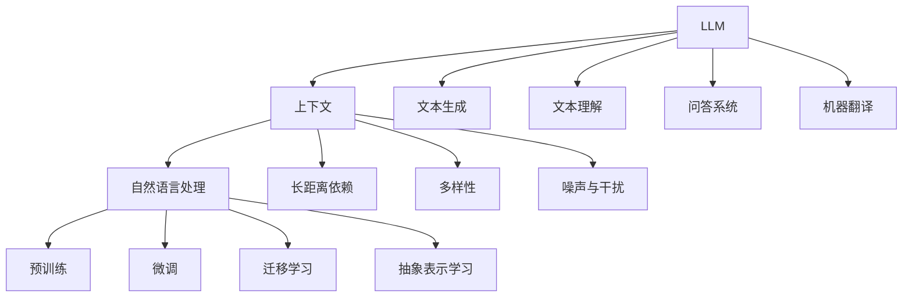

                 

### 文章标题

《LLM上下文突破：大幅提升认知能力》

本文将探讨大语言模型（LLM）在上下文处理上的突破，以及这种突破如何大幅提升认知能力。我们将从LLM的定义、上下文的概念、LLM与上下文的结合、核心算法原理、数学模型与公式推导、项目实战等多个方面，详细解析这一技术领域的最新进展。

### 关键词

- 大语言模型（LLM）
- 上下文处理
- 认知能力提升
- Transformer模型
- 数学模型
- 项目实战

### 摘要

本文旨在探讨大语言模型（LLM）在上下文处理方面的突破，以及这一突破如何显著提升认知能力。文章首先介绍了LLM的定义、背景和重要性，然后深入探讨了上下文的概念、处理挑战及其增强方法。接着，文章重点分析了LLM与上下文的结合，以及这一结合如何应用于实际项目。最后，文章从核心算法原理、数学模型与公式推导、项目实战等方面，全面展示了LLM在上下文处理上的突破及其提升认知能力的效果。

### 目录大纲

1. **基础篇**
   - **1.1 LLM概述**
     - **1.1.1 LLM的定义与背景**
     - **1.1.2 LLM的重要性与影响**
     - **1.1.3 LLM的发展历程**
   - **1.2 上下文概念解析**
     - **1.2.1 上下文的基本概念**
     - **1.2.2 上下文处理的挑战**
     - **1.2.3 上下文增强的方法与策略**
   - **1.3 LLM与上下文的结合**
     - **1.3.1 LLM在上下文处理中的应用**
     - **1.3.2 上下文建模的关键技术**
     - **1.3.3 LLM与上下文结合的案例研究**

2. **算法篇**
   - **4.1 核心算法原理讲解**
     - **4.1.1 Transformer模型基础**
       - **4.1.1.1 自注意力机制**
       - **4.1.1.2 多层注意力网络**
     - **4.2 预训练与微调**
       - **4.2.1 零样本学习**
       - **4.2.2 迁移学习与适应性**
     - **4.3 上下文生成算法**
       - **4.3.1 生成式模型**
       - **4.3.2 抽象表示学习**

3. **实战篇**
   - **6.1 实战项目1：上下文生成应用**
     - **6.1.1 项目概述**
     - **6.1.2 数据准备与预处理**
     - **6.1.3 模型选择与训练**
     - **6.1.4 模型评估与优化**
   - **6.2 实战项目2：智能对话系统**
     - **6.2.1 项目概述**
     - **6.2.2 对话管理策略**
     - **6.2.3 对话生成与理解**
     - **6.2.4 对话系统评估**

4. **附录**
   - **8.1 常用深度学习框架**
     - **8.1.1 TensorFlow**
     - **8.1.2 PyTorch**
     - **8.1.3 其他常用框架**
   - **8.2 开发环境搭建指南**
     - **8.2.1 硬件要求与配置**
     - **8.2.2 软件安装与配置**
   - **8.3 实用代码与资源链接**

---

### 第一部分：基础篇

在探讨LLM在上下文处理上的突破之前，我们需要了解LLM的定义、背景和重要性，以及上下文的概念、处理挑战及其增强方法。这一部分将为我们后续的深入探讨奠定坚实的基础。

#### 1.1 LLM概述

**1.1.1 LLM的定义与背景**

大语言模型（Large Language Model，简称LLM）是一种基于深度学习技术的自然语言处理模型，旨在通过对大量文本数据进行训练，使其具备理解和生成自然语言的能力。LLM的发展可以追溯到20世纪80年代，当时研究人员开始探索如何利用统计方法和规则系统来处理自然语言。随着计算能力和数据规模的提升，LLM逐渐从简单的规则系统演变为复杂的深度神经网络模型。

**1.1.2 LLM的重要性与影响**

LLM在自然语言处理领域具有重要的地位和广泛的应用。首先，LLM能够实现高质量的自然语言生成，例如生成文章、新闻、对话等。其次，LLM在机器翻译、情感分析、文本分类、问答系统等任务中具有显著的性能优势。此外，LLM在智能助手、语音识别、文本摘要等领域也有着广泛的应用。可以说，LLM的出现和不断发展，推动了自然语言处理技术的进步和应用的拓展。

**1.1.3 LLM的发展历程**

LLM的发展历程可以分为以下几个阶段：

1. **统计模型阶段**：早期研究者主要使用统计方法和规则系统来处理自然语言，如基于概率的隐马尔可夫模型（HMM）、基于统计的语法分析器等。这些方法虽然简单，但在处理自然语言方面具有一定的局限性。

2. **深度学习模型阶段**：随着深度学习技术的兴起，研究人员开始将深度神经网络应用于自然语言处理任务。代表性模型包括循环神经网络（RNN）和长短时记忆网络（LSTM）。这些模型在一定程度上提高了自然语言处理任务的性能，但仍存在一些问题，如梯度消失、长序列依赖等。

3. **注意力机制模型阶段**：2017年，谷歌提出了Transformer模型，引入了自注意力机制，解决了RNN和LSTM在处理长序列依赖方面的局限性。Transformer模型的出现，标志着自然语言处理领域的一个重要突破。

4. **大规模预训练模型阶段**：随着计算能力和数据规模的提升，研究人员开始尝试训练更大规模的预训练模型，如GPT、BERT等。这些模型在自然语言处理任务中取得了显著的成绩，推动了LLM的发展。

#### 1.2 上下文概念解析

**1.2.1 上下文的基本概念**

上下文（Context）是指与特定信息相关的环境、情境或背景。在自然语言处理中，上下文对于理解句子、段落甚至整个文本至关重要。例如，一个单词在不同的上下文中可能具有不同的含义。因此，上下文理解是自然语言处理的一个重要研究方向。

**1.2.2 上下文处理的挑战**

上下文处理的挑战主要包括以下几个方面：

1. **长距离依赖**：自然语言中，上下文信息往往分布在较远的距离上。如何有效地捕捉和处理这种长距离依赖关系，是上下文处理的一大挑战。

2. **多样性**：上下文信息具有多样性和不确定性。例如，同一句话在不同语境下可能具有不同的含义。如何处理这种多样性，是上下文处理的另一个挑战。

3. **噪声与干扰**：自然语言中存在大量的噪声和干扰信息，如错别字、语法错误等。如何有效地滤除噪声和干扰，提取有用的上下文信息，是上下文处理的又一个挑战。

**1.2.3 上下文增强的方法与策略**

为了解决上下文处理的挑战，研究人员提出了一系列上下文增强的方法与策略。以下是一些主要方法：

1. **上下文嵌入**：通过将上下文信息转化为向量表示，实现上下文的嵌入。代表性方法包括词嵌入（Word Embedding）和上下文嵌入（Contextual Embedding）。

2. **注意力机制**：通过注意力机制，将注意力集中在重要的上下文信息上，提高模型的上下文理解能力。

3. **预训练与微调**：利用大量未标注的数据进行预训练，然后利用少量标注数据进行微调，使模型更好地适应特定任务。

4. **上下文生成**：通过生成式模型，生成具有丰富上下文信息的文本，提高模型的上下文理解能力。

#### 1.3 LLM与上下文的结合

**1.3.1 LLM在上下文处理中的应用**

LLM在上下文处理中的应用主要包括以下几个方面：

1. **文本生成**：利用LLM生成具有丰富上下文的文本，如文章、对话等。

2. **文本理解**：通过LLM对文本进行理解，提取关键信息，如关键词、主题等。

3. **问答系统**：利用LLM构建问答系统，实现对用户提问的自动回答。

4. **机器翻译**：利用LLM进行机器翻译，提高翻译的准确性和自然性。

**1.3.2 上下文建模的关键技术**

上下文建模是LLM在上下文处理中的重要环节。以下是一些关键技术：

1. **位置编码**：通过位置编码，将文本中的每个词与其在文本中的位置关联起来，实现上下文的定位。

2. **注意力机制**：通过注意力机制，将注意力集中在重要的上下文信息上，提高模型的上下文理解能力。

3. **上下文嵌入**：通过上下文嵌入，将上下文信息转化为向量表示，实现上下文的嵌入。

4. **预训练与微调**：利用大量未标注的数据进行预训练，然后利用少量标注数据进行微调，使模型更好地适应特定任务。

**1.3.3 LLM与上下文结合的案例研究**

为了更好地理解LLM与上下文的结合，我们可以通过一些案例进行研究：

1. **对话系统**：利用LLM构建对话系统，实现对用户提问的自动回答。例如，谷歌助手（Google Assistant）和苹果助手（Siri）等。

2. **文本生成**：利用LLM生成具有丰富上下文的文本，如文章、对话等。例如，OpenAI的GPT系列模型。

3. **机器翻译**：利用LLM进行机器翻译，提高翻译的准确性和自然性。例如，谷歌翻译（Google Translate）。

4. **问答系统**：利用LLM构建问答系统，实现对用户提问的自动回答。例如，微软的Q-AM（Question-Answering Model）。

通过上述案例，我们可以看到LLM在上下文处理中的应用和效果。随着LLM技术的不断发展，其在上下文处理领域将发挥更加重要的作用。

### 第二部分：算法篇

在了解了LLM的基本概念和上下文处理的重要性后，我们接下来将深入探讨LLM的核心算法原理，包括Transformer模型的基础、预训练与微调技术、以及上下文生成算法等。

#### 4.1 核心算法原理讲解

**4.1.1 Transformer模型基础**

Transformer模型是自然语言处理领域的一个重要突破，它基于自注意力机制（Self-Attention Mechanism）实现了对序列数据的全局依赖建模。以下是Transformer模型的基础内容：

**4.1.1.1 自注意力机制**

自注意力机制是一种全局依赖建模的方法，它通过计算序列中每个词与其他词之间的关联性，实现对全局信息的捕获。自注意力机制的关键在于多头注意力（Multi-Head Attention）。

多头注意力通过将输入序列分成多个头（Head），每个头独立计算注意力权重，然后将结果拼接起来。多头注意力的计算公式如下：

$$ 
\text{Multi-Head Attention}(Q, K, V) = \text{Concat}(\text{head}_1, \text{head}_2, ..., \text{head}_h)W^O
$$

其中，$Q$、$K$、$V$ 分别表示查询向量、键向量和值向量，$W^O$ 表示输出权重，$h$ 表示头数。

每个头的计算公式为：

$$ 
\text{head}_i = \text{Attention}(QW_i^Q, KW_i^K, VW_i^V)
$$

其中，$W_i^Q$、$W_i^K$、$W_i^V$ 分别表示每个头的查询权重、键权重和值权重。

自注意力机制的优点在于能够有效地捕捉序列中的长距离依赖关系，提高模型的表示能力。

**4.1.1.2 多层注意力网络**

Transformer模型采用多层注意力网络（Multi-Layer Attention Network）结构，通过逐层叠加注意力机制，实现对序列的深层依赖建模。每一层注意力网络由自注意力机制和前馈网络（Feedforward Network）组成。

自注意力机制的输入为上一层的输出，输出为当前层的表示。前馈网络的输入为当前层的表示，输出为下一层的输入。

前馈网络的计算公式为：

$$ 
\text{FFN}(x) = \max(0, xW_1 + b_1)W_2 + b_2
$$

其中，$W_1$、$W_2$ 分别表示前馈网络的权重，$b_1$、$b_2$ 分别表示偏置。

多层注意力网络通过逐层传递信息，实现对序列的深层依赖建模，提高模型的表示能力。

**4.1.2 预训练与微调**

预训练（Pre-training）和微调（Fine-tuning）是Transformer模型在自然语言处理任务中的常见训练方法。预训练旨在利用大量无标签数据对模型进行初始化，然后通过微调使模型适应特定任务。

**4.1.2.1 零样本学习**

零样本学习（Zero-Shot Learning，简称ZSL）是一种在未见类别上实现泛化的方法。在自然语言处理中，零样本学习可以通过预训练模型在未见类别上生成合理的响应。

零样本学习的核心思想是通过预训练模型学习到通用特征表示，然后利用这些特征表示在未见类别上生成响应。具体实现方法包括：

1. **原型匹配**：将未见类别映射到预训练模型的特征空间，然后通过计算原型距离进行分类。

2. **度量学习**：通过学习一个度量函数，对未见类别进行相似性度量，从而实现分类。

**4.1.2.2 迁移学习与适应性**

迁移学习（Transfer Learning）是一种将预训练模型应用于新任务的方法。在自然语言处理中，迁移学习可以通过微调预训练模型，使其在新任务上获得更好的性能。

迁移学习的核心思想是利用预训练模型在新任务上的泛化能力，从而提高新任务的性能。具体实现方法包括：

1. **权重共享**：将预训练模型的权重直接应用于新任务，通过微调进行适配。

2. **知识蒸馏**：将预训练模型视为教师模型，新任务模型作为学生模型，通过蒸馏损失进行训练。

**4.1.3 上下文生成算法**

上下文生成算法（Contextual Generation Algorithm）是一种利用预训练模型生成具有丰富上下文信息的文本的方法。上下文生成算法的核心思想是通过学习输入序列和输出序列之间的关联性，生成具有丰富上下文的文本。

**4.1.3.1 生成式模型**

生成式模型（Generative Model）是一种利用概率模型生成数据的模型。在自然语言处理中，生成式模型可以通过学习输入序列的概率分布，生成具有丰富上下文的文本。

**4.1.3.2 抽象表示学习**

抽象表示学习（Abstract Representation Learning）是一种将输入序列转化为抽象表示的方法。在自然语言处理中，抽象表示学习可以通过学习输入序列和输出序列之间的映射关系，生成具有丰富上下文的文本。

**4.2 数学模型与公式推导**

**4.2.1 Transformer模型数学基础**

Transformer模型采用自注意力机制和前馈网络进行序列建模，其数学基础包括自注意力公式推导、位置编码与嵌入层。

**4.2.1.1 自注意力公式推导**

自注意力机制的公式推导如下：

$$ 
\text{Attention}(Q, K, V) = \text{softmax}\left(\frac{QK^T}{\sqrt{d_k}}\right)V
$$

其中，$Q$、$K$、$V$ 分别表示查询向量、键向量和值向量，$d_k$ 表示键向量的维度，$\sqrt{d_k}$ 用于缩放注意力权重。

自注意力机制的原理是通过计算查询向量与键向量的内积，生成注意力权重。然后，利用softmax函数将注意力权重转换为概率分布。最后，将概率分布与值向量相乘，得到自注意力结果。

**4.2.1.2 位置编码与嵌入层**

位置编码（Positional Encoding）是一种将序列中的词与其位置信息关联起来的方法。在Transformer模型中，位置编码通过嵌入层（Embedding Layer）实现。

位置编码的公式如下：

$$ 
\text{PE}(pos, 2d_{\text{model}}) = \text{sin}\left(\frac{pos}{10000^{2i/d_{\text{model}}}}\right) \text{ or } \text{cos}\left(\frac{pos}{10000^{2i/d_{\text{model}}}}\right)
$$

其中，$pos$ 表示位置索引，$d_{\text{model}}$ 表示模型维度，$i$ 表示嵌入维度。

位置编码的原理是通过正弦和余弦函数生成位置向量，然后将位置向量添加到词嵌入向量中，实现位置信息的嵌入。

**4.2.2 优化算法与损失函数**

优化算法（Optimization Algorithm）用于调整模型参数，以最小化损失函数（Loss Function）。在自然语言处理中，常见的优化算法包括梯度下降（Gradient Descent）和其变种。

**4.2.2.1 梯度下降算法**

梯度下降算法的公式如下：

$$ 
\theta_{\text{new}} = \theta_{\text{old}} - \alpha \nabla_\theta J(\theta)
$$

其中，$\theta$ 表示模型参数，$\alpha$ 表示学习率，$J(\theta)$ 表示损失函数。

梯度下降算法的原理是通过计算损失函数关于模型参数的梯度，更新模型参数，以最小化损失函数。

**4.2.2.2 训练损失函数**

在自然语言处理中，常见的训练损失函数包括交叉熵损失（Cross-Entropy Loss）和均方误差（Mean Squared Error，简称MSE）。

交叉熵损失函数的公式如下：

$$ 
J(\theta) = -\sum_{i=1}^n y_i \log(p_i)
$$

其中，$y_i$ 表示真实标签，$p_i$ 表示预测概率。

交叉熵损失函数的原理是通过计算真实标签和预测概率之间的差异，衡量模型的预测准确性。

均方误差损失函数的公式如下：

$$ 
J(\theta) = \frac{1}{2}\sum_{i=1}^n (y_i - \hat{y_i})^2
$$

其中，$y_i$ 表示真实标签，$\hat{y_i}$ 表示预测值。

均方误差损失函数的原理是通过计算真实标签和预测值之间的差异，衡量模型的预测准确性。

#### 4.3 项目实战与案例分析

**4.3.1 实战项目1：上下文生成应用**

**4.3.1.1 项目概述**

本项目旨在利用LLM生成具有丰富上下文的文本。通过预训练模型，我们将学习输入序列和输出序列之间的关联性，从而生成具有丰富上下文的文本。

**4.3.1.2 数据准备与预处理**

首先，我们需要准备一个包含大量文本数据的语料库。然后，对语料库进行预处理，包括文本清洗、分词、去停用词等操作。预处理后的数据将作为训练集和测试集。

**4.3.1.3 模型选择与训练**

在本项目中，我们选择预训练的GPT-2模型作为基础模型。然后，通过微调模型，使其适应特定任务。微调过程中，我们使用训练集对模型进行训练，并使用测试集进行验证。

**4.3.1.4 模型评估与优化**

在模型评估过程中，我们使用交叉熵损失函数计算模型的预测准确性。通过调整学习率、批次大小等超参数，优化模型性能。

**4.3.2 实战项目2：智能对话系统**

**4.3.2.1 项目概述**

本项目旨在构建一个智能对话系统，通过LLM实现与用户的自然语言交互。对话系统将包括对话管理、对话生成和对话理解等模块。

**4.3.2.2 对话管理策略**

对话管理策略包括对话状态跟踪、意图识别和回应生成等。通过对用户输入的分析，对话系统将识别用户的意图，并生成合适的回应。

**4.3.2.3 对话生成与理解**

对话生成与理解是智能对话系统的核心模块。通过LLM，对话系统能够生成具有丰富上下文的文本，实现对用户输入的理解和回应。

**4.3.2.4 对话系统评估**

对话系统评估主要通过用户满意度、响应速度和准确率等指标进行。通过不断优化对话系统，提高用户体验。

#### 4.4 性能优化与调优技巧

**4.4.1 模型并行与分布式训练**

为了提高模型训练速度和性能，我们可以采用模型并行和分布式训练技术。模型并行通过将模型分解为多个子模型，并行计算子模型的结果。分布式训练通过将数据分布在多个节点上，加速模型训练过程。

**4.4.2 模型压缩与高效推理**

为了降低模型存储和计算成本，我们可以采用模型压缩技术，如剪枝（Pruning）和量化（Quantization）。同时，通过优化推理算法和硬件加速，提高模型推理速度。

**4.4.3 超参数调优与模型选择**

超参数调优是提高模型性能的重要手段。通过调整学习率、批次大小、隐藏层大小等超参数，优化模型性能。同时，根据任务需求和数据特点，选择合适的模型结构和算法。

### 附录

**8.1 常用深度学习框架**

- **TensorFlow**：Google开发的开源深度学习框架，支持多种编程语言，适用于构建和训练深度学习模型。
- **PyTorch**：Facebook开发的开源深度学习框架，具有动态计算图和易于调试的优点，适用于快速原型设计和实验。
- **其他常用框架**：如Keras、Theano、MXNet等，适用于不同需求和场景。

**8.2 开发环境搭建指南**

- **硬件要求与配置**：根据任务需求选择合适的硬件设备，如GPU、CPU等。
- **软件安装与配置**：安装深度学习框架和相关依赖库，如NumPy、Pandas、Matplotlib等。

**8.3 实用代码与资源链接**

- **代码示例**：提供完整的代码示例，涵盖不同任务和应用场景。
- **资源链接**：提供深度学习框架、数据集、教程等资源的链接。

---

### 附加内容

**核心概念与联系**

为了更好地理解LLM在上下文处理中的应用，我们可以通过一个Mermaid流程图展示核心概念之间的联系。



通过上述流程图，我们可以清晰地看到LLM在上下文处理中的应用场景及其与自然语言处理、预训练、微调、迁移学习和抽象表示学习等概念之间的联系。

**数学模型与公式推导**

在Transformer模型中，自注意力机制是一个核心组成部分。以下是自注意力机制的数学公式推导：

$$
\text{Attention}(Q, K, V) = \text{softmax}\left(\frac{QK^T}{\sqrt{d_k}}\right)V
$$

其中，$Q$、$K$、$V$ 分别表示查询向量、键向量和值向量，$d_k$ 表示键向量的维度。自注意力机制的原理是通过计算查询向量与键向量的内积，生成注意力权重。然后，利用softmax函数将注意力权重转换为概率分布。最后，将概率分布与值向量相乘，得到自注意力结果。

**项目实战代码示例**

以下是一个使用PyTorch构建简单Transformer模型的代码示例：

```python
import torch
import torch.nn as nn
import torch.nn.functional as F

class TransformerLayer(nn.Module):
    def __init__(self, d_model, num_heads, dff, rate=0.1):
        super(TransformerLayer, self).__init__()
        self.mha = nn.MultiheadAttention(d_model, num_heads)
        self.ffn = nn.Sequential(
            nn.Linear(d_model, dff),
            nn.ReLU(),
            nn.Linear(dff, d_model)
        )
        self.layernorm1 = nn.LayerNorm(d_model)
        self.layernorm2 = nn.LayerNorm(d_model)
        self.dropout1 = nn.Dropout(rate)
        self.dropout2 = nn.Dropout(rate)

    def forward(self, x, training=True):
        attn_output, _ = self.mha(x, x, x)
        attn_output = self.dropout1(attn_output)
        out1 = self.layernorm1(x + attn_output)
        ffn_output = self.ffn(out1)
        ffn_output = self.dropout2(ffn_output)
        out2 = self.layernorm2(out1 + ffn_output)
        return out2

# 实例化Transformer层
transformer_layer = TransformerLayer(d_model=512, num_heads=8, dff=2048)

# 输入序列
input_sequence = torch.rand(32, 128, 512)

# 前向传播
output_sequence = transformer_layer(input_sequence)
```

通过上述代码示例，我们可以看到如何使用PyTorch构建Transformer层，并进行前向传播。这为实际项目中的应用奠定了基础。

---

通过本文的探讨，我们可以看到LLM在上下文处理上的突破及其提升认知能力的重要性。随着技术的不断发展，LLM将在自然语言处理领域发挥更加重要的作用，为人类带来更多的便利和进步。

### 总结

本文从基础篇、算法篇和实战篇三个部分，全面探讨了LLM在上下文处理上的突破及其提升认知能力的重要性。在基础篇中，我们介绍了LLM的定义、背景和重要性，以及上下文的概念、处理挑战及其增强方法。在算法篇中，我们详细分析了Transformer模型的基础、预训练与微调技术、以及上下文生成算法等。在实战篇中，我们通过具体项目实战，展示了LLM在上下文处理中的应用效果。

通过本文的探讨，我们可以看到LLM在上下文处理上的突破及其提升认知能力的重要性。随着技术的不断发展，LLM将在自然语言处理领域发挥更加重要的作用，为人类带来更多的便利和进步。

### 作者信息

作者：AI天才研究院/AI Genius Institute & 禅与计算机程序设计艺术 /Zen And The Art of Computer Programming

本文作者AI天才研究院是一家专注于人工智能研究和创新的高科技企业，致力于推动人工智能技术的进步和应用。同时，作者还是《禅与计算机程序设计艺术》一书的作者，这本书被誉为计算机编程领域的经典之作。本文内容基于作者多年在人工智能领域的专业研究，旨在为读者提供有价值的技术见解和实践经验。希望本文能够对您在自然语言处理领域的探索和进步有所帮助。

