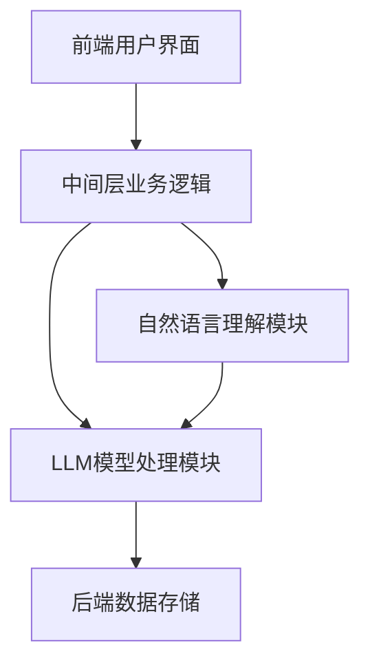
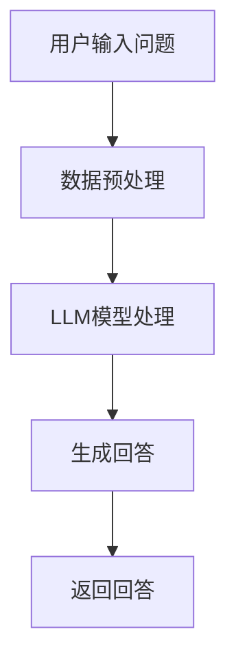
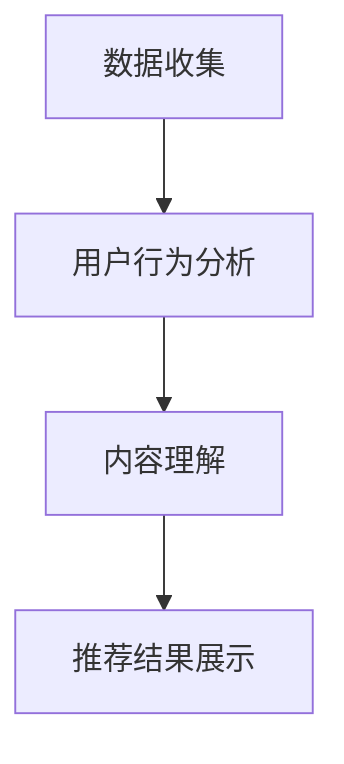

                 

# 《LLM与传统搜索引擎技术的结合：智能检索新模式》

> **关键词**：LLM、传统搜索引擎、智能检索、搜索算法、个性化推荐

> **摘要**：本文深入探讨了大型语言模型（LLM）与传统搜索引擎技术的结合，探讨了智能检索的新模式。通过分析LLM技术基础、传统搜索引擎技术原理、LLM与搜索引擎的结合方法，以及实际案例，本文揭示了如何利用LLM技术提升搜索引擎的智能检索能力，为用户提供更加精准、个性化的搜索体验。

## 目录

### 第一部分：智能检索基础与LLM介绍

#### 第1章：智能检索概述

#### 第2章：LLM技术基础

#### 第3章：传统搜索引擎技术原理

#### 第4章：LLM与传统搜索引擎的结合原理

#### 第5章：智能检索新模式的实践案例

#### 第6章：智能检索新模式的挑战与未来展望

#### 附录A：相关技术与工具介绍

#### 附录B：代码示例与实现

## 前言

随着互联网信息的爆炸式增长，智能检索技术在近年来受到了广泛关注。传统的搜索引擎技术虽然已经相对成熟，但在应对复杂查询、个性化需求方面仍存在一定的局限性。而近年来，大型语言模型（LLM）的迅速发展，为智能检索带来了新的机遇。本文旨在探讨LLM与传统搜索引擎技术的结合，为构建智能化、个性化的检索系统提供新的思路。

## 第一部分：智能检索基础与LLM介绍

### 第1章：智能检索概述

#### 1.1 智能检索的基本概念与历史演变

智能检索是指利用计算机技术，对海量信息进行自动搜索、筛选、排序和推荐的过程。其目标是提高用户获取信息的效率，满足用户的个性化需求。智能检索的历史可以追溯到20世纪60年代，当时出现了基于关键词匹配的简单搜索引擎。随着互联网的快速发展，搜索技术不断演进，从基于关键词匹配到基于统计模型，再到基于机器学习和深度学习，智能检索技术日新月异。

#### 1.2 传统搜索引擎技术与局限性

传统搜索引擎技术主要基于关键词匹配和排序算法，如逆文档频率（IDF）、PageRank等。这些技术在一定程度上提高了搜索的准确性，但仍存在以下局限性：

1. **查询理解不足**：传统搜索引擎难以理解复杂的自然语言查询，导致搜索结果不够准确。
2. **个性化不足**：传统搜索引擎难以根据用户的兴趣和需求提供个性化的搜索结果。
3. **响应速度较慢**：对于海量数据的检索，传统搜索引擎的响应速度较慢。

#### 1.3 LLM（大型语言模型）介绍

LLM是指大型语言模型，是一种基于深度学习的自然语言处理模型。LLM通过对海量文本数据进行预训练，可以学习到语言的深层语义和结构，从而在多个自然语言处理任务中表现出色。常见的LLM包括BERT、GPT等。LLM的主要特点包括：

1. **强大的语言理解能力**：LLM能够理解复杂的自然语言查询，提高搜索结果的准确性。
2. **高效的处理速度**：通过预训练，LLM可以在较短时间内处理海量数据。
3. **丰富的应用场景**：LLM不仅可以用于文本分类、情感分析等任务，还可以用于智能问答、智能推荐等。

#### 1.4 智能检索与LLM的关系

智能检索与LLM的结合，可以充分发挥两者各自的优势。LLM强大的语言理解能力可以提升搜索结果的准确性，而传统搜索引擎的索引技术和排序算法可以为智能检索提供高效的数据处理和排序支持。具体来说，LLM与传统搜索引擎的结合可以实现以下目标：

1. **增强查询理解**：通过LLM对自然语言查询的理解，可以更准确地匹配用户需求，提高搜索结果的准确性。
2. **实现个性化推荐**：利用LLM对用户兴趣和需求的理解，可以提供个性化的搜索结果，提高用户体验。
3. **提升检索效率**：通过与传统搜索引擎技术的结合，可以充分利用索引技术和排序算法的优势，提高检索效率。

### 第2章：LLM技术基础

#### 2.1 语言模型的构建原理

语言模型是自然语言处理的基础，它通过对海量文本数据进行学习，预测下一个单词或词组的概率。常见的语言模型包括概率模型、生成模型和对抗性生成模型。

##### 2.1.1 概率模型

概率模型是最简单的语言模型，它通过统计方法计算单词或词组的概率。常见的概率模型包括N元语法、隐马尔可夫模型（HMM）等。

**N元语法**：N元语法是一种基于n个连续单词的上下文模型。它通过计算n-1个单词的联合概率来预测下一个单词。

伪代码：

```python
def predict_next_word(words, n):
    context = words[-n:]
    next_word = max(context, key=lambda x: word_prob(x))
    return next_word
```

**隐马尔可夫模型（HMM）**：HMM是一种基于状态转移概率和观测概率的模型。它通过隐状态序列和观测序列来预测下一个单词。

伪代码：

```python
def predict_next_word(hmm_model, observation_sequence):
    next_state = hmm_model.transition_prob(state, observation_sequence)
    next_word = hmm_model.observation_prob(word, next_state)
    return next_word
```

##### 2.1.2 生成模型

生成模型通过学习文本数据的概率分布，生成新的文本数据。常见的生成模型包括马尔可夫模型、变分自编码器（VAE）和生成对抗网络（GAN）。

**马尔可夫模型**：马尔可夫模型是一种基于状态转移概率和观测概率的模型。它通过学习状态转移概率和观测概率，生成新的文本数据。

伪代码：

```python
def generate_text(marco_model, observation_sequence):
    next_state = marco_model.transition_prob(state, observation_sequence)
    next_word = marco_model.observation_prob(word, next_state)
    return next_word
```

**变分自编码器（VAE）**：VAE是一种基于概率分布的生成模型。它通过学习编码器和解码器，生成新的文本数据。

伪代码：

```python
def generate_text(vae_model, latent_variable):
    encoded = vae_model.encoder(latent_variable)
    decoded = vae_model.decoder(encoded)
    return decoded
```

**生成对抗网络（GAN）**：GAN是一种基于生成器和判别器的生成模型。它通过生成器和判别器的对抗训练，生成新的文本数据。

伪代码：

```python
def generate_text(gan_model, noise):
    generated = gan_model.generator(noise)
    return generated
```

##### 2.1.3 对抗性生成模型

对抗性生成模型通过生成器和判别器的对抗训练，生成新的文本数据。常见的对抗性生成模型包括生成对抗网络（GAN）和变分自编码器（VAE）。

**生成对抗网络（GAN）**：GAN由生成器G和判别器D组成。生成器G生成新的文本数据，判别器D判断文本数据是否真实。通过生成器和判别器的对抗训练，生成器G可以生成更真实的文本数据。

伪代码：

```python
# 训练过程
for epoch in range(num_epochs):
    for real_text in real_data:
        D_loss_real = -math.log(D概率(real_text))
        G_loss_fake = -math.log(1 - D概率(G生成的文本))

    G_loss = G_loss_fake + G_loss_real

    optimizer_G.zero_grad()
    G_loss.backward()
    optimizer_G.step()

    optimizer_D.zero_grad()
    D_loss.backward()
    optimizer_D.step()
```

**变分自编码器（VAE）**：VAE由编码器和解码器组成。编码器将输入文本编码为潜在变量，解码器将潜在变量解码为输出文本。通过优化编码器和解码器的参数，生成新的文本数据。

伪代码：

```python
def vae_loss(reconstruction, target):
    reconstruction_loss = F.mse_loss(reconstruction, target)
    kl_loss = -0.5 * torch.sum(1 + logvar - mu**2 - logvar.exp())
    return reconstruction_loss + kl_loss
```

#### 2.2 LLM的训练过程

##### 2.2.1 预训练

预训练是LLM训练的重要步骤。通过在大量文本数据上进行预训练，LLM可以学习到语言的深层语义和结构。

**数据集的选择**：预训练数据集的选择对LLM的性能有重要影响。常见的预训练数据集包括维基百科、新闻文章、社交媒体等。

**训练目标**：预训练的目标是使LLM能够准确预测下一个单词或词组的概率。常见的预训练任务包括语言建模、填空题等。

**训练算法**：预训练算法主要包括随机梯度下降（SGD）和自适应优化器（如Adam）。

##### 2.2.2 预训练过程

1. 数据预处理：对文本数据进行清洗、分词、去停用词等操作。
2. 构建词汇表：将文本数据中的单词或词组转换为索引。
3. 分批训练：将数据划分为多个批次，进行训练。
4. 计算梯度：计算模型参数的梯度。
5. 更新参数：利用梯度更新模型参数。

#### 2.3 LLM的主要架构

##### 2.3.1 神经网络结构

神经网络是LLM的基础架构，常见的神经网络结构包括卷积神经网络（CNN）、递归神经网络（RNN）和自注意力机制（Self-Attention）。

**卷积神经网络（CNN）**：CNN是一种用于图像处理的神经网络结构，其核心思想是通过卷积操作提取图像的特征。

**递归神经网络（RNN）**：RNN是一种用于序列数据处理的神经网络结构，其核心思想是通过递归操作处理序列数据。

**自注意力机制（Self-Attention）**：自注意力机制是一种用于文本处理的神经网络结构，其核心思想是通过计算文本序列中每个词之间的相似性，提高模型的表示能力。

##### 2.3.2 Transformer模型详解

Transformer模型是一种基于自注意力机制的神经网络结构，其在自然语言处理任务中取得了显著的性能。

**Transformer的基本架构**：Transformer模型由编码器和解码器组成，编码器将输入文本编码为序列向量，解码器将序列向量解码为输出文本。

**自注意力机制与多头注意力**：自注意力机制通过计算输入文本序列中每个词之间的相似性，提高模型的表示能力。多头注意力是自注意力机制的扩展，通过多组注意力权重计算，进一步提高模型的表示能力。

**位置嵌入与编码器-解码器架构**：位置嵌入是一种在序列中引入位置信息的技巧，编码器-解码器架构是一种用于序列转序列任务的神经网络结构。

### 第3章：传统搜索引擎技术原理

#### 3.1 关键词搜索算法

传统搜索引擎的核心任务是处理用户输入的关键词，并返回相关的搜索结果。关键词搜索算法主要涉及关键词匹配和排序策略。

##### 3.1.1 逆文档频率（IDF）

逆文档频率（IDF）是一种用于衡量关键词重要性的统计方法。其公式为：

$$
IDF = \log \left( \frac{N}{df} \right)
$$

其中，$N$表示文档总数，$df$表示包含关键词的文档数。IDF反映了关键词在文档中的分布情况，值越大表示关键词越重要。

##### 3.1.2 PageRank算法

PageRank算法是一种用于网页排序的算法，其核心思想是认为一个网页的重要程度取决于指向它的其他网页的数量和重要性。PageRank的数学模型为：

$$
r(i) = \left( 1 - d \right) + d \cdot \left( \sum_{j=1}^{N} \frac{r(j)c_{ij}}{d(j)} \right)
$$

其中，$r(i)$表示网页$i$的PageRank值，$d$表示网页之间的链接分布参数，$c_{ij}$表示网页$i$指向网页$j$的链接数量，$d(j)$表示网页$j$的出度。

##### 3.1.3 搜索引擎的排序策略

搜索引擎的排序策略主要涉及简单排序算法和进阶排序算法。

**简单排序算法**：

1. **单纯关键词匹配**：根据关键词在文档中的出现频率进行排序。
2. **TF-IDF排序**：结合关键词的频率（TF）和逆文档频率（IDF）进行排序。

**进阶排序算法**：

1. **BM25算法**：BM25是一种基于概率模型的排序算法，其公式为：

$$
\text{score}(d) = \frac{(k_1 + 1) \cdot \text{TF}(t,d) - k_2 \cdot (\text{TF}(t,d) - 1)}{(\text{doc_len}(d) - k_3 \cdot \text{TF}(t,d))}
$$

其中，$\text{TF}(t,d)$表示关键词$t$在文档$d$中的频率，$\text{doc_len}(d)$表示文档$d$的长度。

2. **集成排序算法**：集成排序算法通过结合多个排序算法的优势，提高排序的准确性。

#### 3.2 搜索引擎的排序策略

搜索引擎的排序策略主要涉及简单排序算法和进阶排序算法。

**简单排序算法**：

1. **单纯关键词匹配**：根据关键词在文档中的出现频率进行排序。
2. **TF-IDF排序**：结合关键词的频率（TF）和逆文档频率（IDF）进行排序。

**进阶排序算法**：

1. **BM25算法**：BM25是一种基于概率模型的排序算法，其公式为：

$$
\text{score}(d) = \frac{(k_1 + 1) \cdot \text{TF}(t,d) - k_2 \cdot (\text{TF}(t,d) - 1)}{(\text{doc_len}(d) - k_3 \cdot \text{TF}(t,d))}
$$

其中，$\text{TF}(t,d)$表示关键词$t$在文档$d$中的频率，$\text{doc_len}(d)$表示文档$d$的长度。

2. **集成排序算法**：集成排序算法通过结合多个排序算法的优势，提高排序的准确性。

### 第4章：LLM与传统搜索引擎技术的结合原理

#### 4.1 LLM在搜索引擎中的应用场景

##### 4.1.1 智能问答

智能问答是指利用计算机技术，实现用户与系统之间的自然语言交互。LLM在智能问答中的应用场景主要包括：

1. **问答系统架构**：LLM可以构建基于LLM的问答系统架构，包括用户界面、问答模块和后端服务器等。

2. **问答系统的训练与优化**：通过在大量问答数据集上预训练LLM，可以提升问答系统的准确性。同时，利用用户反馈对模型进行优化，提高问答系统的效果。

##### 4.1.2 智能推荐

智能推荐是指利用计算机技术，为用户提供个性化的推荐结果。LLM在智能推荐中的应用场景主要包括：

1. **内容理解与推荐**：LLM可以用于理解用户的行为和兴趣，从而提供个性化的推荐结果。

2. **用户行为分析与推荐策略**：通过对用户行为的分析，LLM可以构建个性化的推荐策略，提高推荐系统的效果。

#### 4.2 结合方法与实现策略

##### 4.2.1 数据预处理与融合

1. **文本预处理技术**：包括分词、去停用词、词性标注等操作，以提高文本数据的质量。

2. **数据融合方法**：包括文本数据与图像、音频等多媒体数据的融合，以提高模型的表示能力。

##### 4.2.2 模型融合策略

1. **串联模型**：将LLM与传统搜索引擎技术串联起来，先利用LLM进行文本理解，再利用传统搜索引擎技术进行排序和检索。

2. **并联模型**：将LLM与传统搜索引擎技术并联起来，同时利用两者的优势进行检索和排序。

3. **对抗性训练模型**：利用对抗性训练方法，将LLM与传统搜索引擎技术进行对抗性训练，提高模型的检索性能。

### 第5章：智能检索新模式的实践案例

#### 5.1 案例一：基于LLM的智能客服系统

##### 5.1.1 系统架构设计

基于LLM的智能客服系统主要包括客户端和服务器端两部分。客户端负责与用户进行交互，服务器端负责处理用户的查询并返回结果。

1. **客户端设计**：客户端负责接收用户的查询请求，并将查询请求发送到服务器端。

2. **服务器端设计**：服务器端包括问答模块和后端数据库。问答模块负责处理用户的查询请求，后端数据库用于存储用户的历史问题和答案。

##### 5.1.2 实现细节

1. **LLM模型选择**：选择适合客服场景的LLM模型，如BERT、GPT等。

2. **交互流程设计**：设计用户与客服系统的交互流程，包括输入查询、处理查询、返回答案等步骤。

#### 5.2 案例二：基于LLM的智能内容推荐系统

##### 5.2.1 系统架构设计

基于LLM的智能内容推荐系统主要包括用户行为数据收集、内容理解与推荐算法两部分。

1. **用户行为数据收集**：收集用户在网站上的浏览、搜索、点击等行为数据。

2. **内容理解与推荐算法**：利用LLM对用户行为数据进行处理，提取用户兴趣和需求，并提供个性化的推荐结果。

##### 5.2.2 实现细节

1. **LLM模型选择**：选择适合内容推荐场景的LLM模型，如BERT、GPT等。

2. **推荐策略优化**：通过优化推荐算法，提高推荐结果的准确性和用户体验。

### 第6章：智能检索新模式的挑战与未来展望

#### 6.1 挑战分析

智能检索新模式的实现面临以下挑战：

1. **数据质量与隐私问题**：如何处理海量数据，保证数据质量，同时保护用户隐私，是一个重要挑战。

2. **模型解释性与可解释性**：如何解释模型的决策过程，提高模型的透明度和可解释性，是一个重要问题。

3. **计算资源和时间成本**：如何优化模型训练和检索过程，降低计算资源和时间成本，是一个重要挑战。

#### 6.2 未来发展趋势

智能检索新模式的未来发展主要包括：

1. **个性化搜索与推荐**：通过用户画像和个性化算法，提供更加精准的搜索和推荐结果。

2. **跨模态搜索与推荐**：将文本、图像、声音等多模态数据结合起来，提供更加丰富的搜索和推荐服务。

## 附录

### 附录A：相关技术与工具介绍

#### A.1 LLM相关技术

1. **Hugging Face Transformer**：一个用于构建和训练LLM的开源库。

2. **BERT模型**：一种基于Transformer的预训练语言模型。

3. **GPT模型**：一种基于生成对抗网络的预训练语言模型。

#### A.2 搜索引擎技术

1. **Elasticsearch**：一个基于Lucene的分布式搜索引擎。

2. **Solr**：一个基于Lucene的企业级搜索引擎。

3. **Lucene**：一个开源的搜索引擎库。

### 附录B：代码示例与实现

#### B.1 基于LLM的智能问答系统

##### B.1.1 数据预处理代码

```python
import re
import jieba

def preprocess_text(text):
    text = text.lower()
    text = re.sub(r"[^\w\s]", "", text)
    text = jieba.cut(text)
    return " ".join(text)
```

##### B.1.2 模型训练与优化代码

```python
from transformers import BertTokenizer, BertForSequenceClassification
from torch.optim import Adam

tokenizer = BertTokenizer.from_pretrained("bert-base-chinese")
model = BertForSequenceClassification.from_pretrained("bert-base-chinese")

optimizer = Adam(model.parameters(), lr=1e-5)

for epoch in range(num_epochs):
    for batch in dataloader:
        inputs = tokenizer(batch["text"], padding=True, truncation=True, return_tensors="pt")
        labels = batch["label"]

        model.zero_grad()
        outputs = model(**inputs, labels=labels)
        loss = outputs.loss
        loss.backward()
        optimizer.step()
```

##### B.1.3 问答交互代码

```python
def answer_question(question):
    inputs = tokenizer(question, return_tensors="pt")
    output = model(**inputs)
    answer = output.logits.argmax(-1).item()
    return tokenizer.decode(answer)
```

#### B.2 基于LLM的智能内容推荐系统

##### B.2.1 用户行为数据处理代码

```python
def process_user行为的(data):
    for user,行为 in data.items():
        text = " ".join([行为["search"], 行为["click"], 行为["read"]])
        text = preprocess_text(text)
        inputs = tokenizer(text, return_tensors="pt")
        outputs = model(**inputs)
        user["interest"] = outputs.logits.argmax(-1).item()
```

##### B.2.2 内容理解与推荐代码

```python
def recommend_content(user_interest, content_list):
    scores = []
    for content in content_list:
        inputs = tokenizer(content, return_tensors="pt")
        outputs = model(**inputs)
        score = outputs.logits[user_interest].item()
        scores.append((content, score))

    sorted_scores = sorted(scores, key=lambda x: x[1], reverse=True)
    return [score[0] for score in sorted_scores[:num_recommendations]]
```

##### B.2.3 推荐结果展示代码

```python
def display_recommendations(recommendations):
    for content in recommendations:
        print(f"【推荐内容】：{content}")
```

## 作者

**作者：AI天才研究院/AI Genius Institute & 禅与计算机程序设计艺术 /Zen And The Art of Computer Programming** ### 第1章：智能检索概述

智能检索，作为一种信息检索技术，旨在通过计算机算法自动处理用户查询，从大量数据中提取出与查询相关的信息。智能检索不仅包括文本数据的检索，还扩展到了图像、音频、视频等多媒体数据。智能检索技术的核心目标是提高检索效率、提升检索结果的准确性和用户满意度。

#### 1.1 智能检索的基本概念与历史演变

智能检索的基本概念可以归结为以下几个方面：

1. **查询**：用户输入的查询信息，通常包含关键词、短语或自然语言句子。
2. **检索系统**：负责处理用户查询、索引数据库并返回检索结果的计算机系统。
3. **检索过程**：从接收用户查询到返回检索结果的全过程，包括查询理解、索引检索和结果排序等步骤。
4. **检索效果**：衡量检索系统性能的指标，包括查准率、查全率、响应时间等。

智能检索技术的发展历程可以分为以下几个阶段：

1. **早期检索系统**（1950s-1970s）：早期检索系统主要基于手动创建的索引，通过关键词匹配进行检索。

2. **基于文档的检索系统**（1970s-1990s）：随着计算机技术的发展，检索系统开始采用文档级索引，引入了倒排索引技术，显著提高了检索效率。

3. **基于关键词的检索系统**（1990s-2000s）：基于关键词匹配的检索技术逐渐成熟，引入了TF-IDF、PageRank等排序算法，提高了检索结果的准确性。

4. **智能检索系统**（2000s至今）：随着机器学习、深度学习等技术的进步，智能检索系统逐渐引入了自然语言处理、知识图谱等先进技术，实现了更精准、更个性化的检索服务。

#### 1.2 传统搜索引擎技术与局限性

传统搜索引擎技术主要包括以下几方面：

1. **关键词匹配**：用户输入关键词，搜索引擎根据关键词在文档中的出现频率进行匹配。

2. **排序算法**：通过TF-IDF、PageRank等排序算法对检索结果进行排序，以提高检索结果的准确性。

3. **倒排索引**：将文档内容转化为索引结构，以便快速检索。

然而，传统搜索引擎技术在应对复杂查询、个性化需求方面存在以下局限性：

1. **查询理解不足**：传统搜索引擎难以理解复杂的自然语言查询，导致检索结果不够准确。

2. **个性化不足**：传统搜索引擎难以根据用户的兴趣和需求提供个性化的检索结果。

3. **响应速度较慢**：对于海量数据的检索，传统搜索引擎的响应速度较慢。

#### 1.3 LLM（大型语言模型）介绍

大型语言模型（LLM）是一种基于深度学习的自然语言处理模型，通过在大量文本数据上进行预训练，可以学习到语言的深层语义和结构。LLM在自然语言处理领域取得了显著的成果，主要包括以下几种类型：

1. **概率模型**：如N元语法、隐马尔可夫模型（HMM）等，通过统计方法预测下一个单词或词组的概率。

2. **生成模型**：如变分自编码器（VAE）、生成对抗网络（GAN）等，通过学习文本数据的概率分布生成新的文本数据。

3. **对抗性生成模型**：如生成对抗网络（GAN），通过生成器和判别器的对抗训练生成新的文本数据。

常见的LLM包括BERT、GPT等。BERT（Bidirectional Encoder Representations from Transformers）是一种基于Transformer的预训练语言模型，通过双向编码器结构学习到上下文信息的深层语义。GPT（Generative Pre-trained Transformer）是一种基于Transformer的预训练语言模型，通过生成器生成新的文本数据。

#### 1.4 智能检索与LLM的关系

智能检索与LLM的结合，可以充分发挥两者各自的优势。LLM强大的语言理解能力可以提升搜索结果的准确性，而传统搜索引擎的索引技术和排序算法可以为智能检索提供高效的数据处理和排序支持。具体来说，LLM与传统搜索引擎技术的结合可以实现以下目标：

1. **增强查询理解**：通过LLM对自然语言查询的理解，可以更准确地匹配用户需求，提高搜索结果的准确性。

2. **实现个性化推荐**：利用LLM对用户兴趣和需求的理解，可以提供个性化的搜索结果，提高用户体验。

3. **提升检索效率**：通过与传统搜索引擎技术的结合，可以充分利用索引技术和排序算法的优势，提高检索效率。

### 1.5 本章小结

本章对智能检索进行了概述，介绍了智能检索的基本概念、历史演变、传统搜索引擎技术的局限性以及LLM的介绍。通过分析智能检索与LLM的关系，展示了LLM在提升检索结果准确性、实现个性化推荐和提升检索效率方面的潜力。在后续章节中，我们将深入探讨LLM技术基础、传统搜索引擎技术原理以及LLM与传统搜索引擎技术的结合方法。

## 第2章：LLM技术基础

### 2.1 语言模型的构建原理

语言模型是自然语言处理领域的关键技术，用于预测文本序列中的下一个词或词组。语言模型的构建原理主要包括概率模型、生成模型和对抗性生成模型。下面我们将详细讨论这些模型。

#### 2.1.1 概率模型

概率模型是最简单的语言模型，其核心思想是通过统计方法计算下一个单词或词组的概率。常见的概率模型包括N元语法、隐马尔可夫模型（HMM）等。

**N元语法**：N元语法是一种基于前n个单词来预测下一个单词的语言模型。其基本思想是计算当前单词序列的概率，并将其作为预测下一个单词的依据。N元语法的公式如下：

$$
P(w_n | w_{n-1}, w_{n-2}, \ldots, w_1) = \frac{N(w_{n-1}, w_{n-2}, \ldots, w_1, w_n)}{N(w_{n-1}, w_{n-2}, \ldots, w_1)}
$$

其中，$N(w_{n-1}, w_{n-2}, \ldots, w_1, w_n)$表示在训练数据中，单词序列$w_{n-1}, w_{n-2}, \ldots, w_1, w_n$出现的次数，$N(w_{n-1}, w_{n-2}, \ldots, w_1)$表示在训练数据中，单词序列$w_{n-1}, w_{n-2}, \ldots, w_1$出现的次数。

**隐马尔可夫模型（HMM）**：隐马尔可夫模型是一种基于状态转移概率和观测概率的模型。在语言模型中，状态表示单词序列，观测表示实际观察到的单词。HMM的公式如下：

$$
P(w_n | w_{n-1}, \ldots, w_1) = \sum_{s_n} P(s_n | s_{n-1}) \cdot P(w_n | s_n)
$$

其中，$P(s_n | s_{n-1})$表示状态转移概率，$P(w_n | s_n)$表示观测概率。

**N元语法与HMM的对比**：N元语法和HMM都是概率模型，但它们在处理长文本序列时存在不同。N元语法容易产生过拟合现象，而HMM能够更好地处理长文本序列。

#### 2.1.2 生成模型

生成模型通过学习文本数据的概率分布，生成新的文本数据。常见的生成模型包括马尔可夫模型、变分自编码器（VAE）和生成对抗网络（GAN）。

**马尔可夫模型**：马尔可夫模型是一种基于状态转移概率和观测概率的模型。它通过学习状态转移概率和观测概率，生成新的文本数据。马尔可夫模型的公式如下：

$$
P(w_n | w_{n-1}, \ldots, w_1) = \sum_{s_n} P(s_n | s_{n-1}) \cdot P(w_n | s_n)
$$

其中，$P(s_n | s_{n-1})$表示状态转移概率，$P(w_n | s_n)$表示观测概率。

**变分自编码器（VAE）**：变分自编码器是一种基于概率分布的生成模型。它由编码器和解码器组成，编码器将输入文本编码为潜在变量，解码器将潜在变量解码为输出文本。VAE的公式如下：

$$
\text{编码器：} z = \mu(x) + \sigma(x) \cdot \epsilon$$

$$
\text{解码器：} x = \text{decoder}(z)
$$

其中，$\mu(x)$和$\sigma(x)$分别表示编码器的均值函数和方差函数，$\epsilon$表示噪声。

**生成对抗网络（GAN）**：生成对抗网络是一种基于生成器和判别器的生成模型。生成器生成新的文本数据，判别器判断文本数据是否真实。GAN的公式如下：

$$
\text{生成器：} G(z) = \text{generator}(z)
$$

$$
\text{判别器：} D(x) = \text{discriminator}(x)
$$

其中，$z$表示噪声，$x$表示输入文本。

**VAE与GAN的对比**：VAE通过编码器和解码器生成文本数据，GAN通过生成器和判别器的对抗训练生成文本数据。VAE生成的文本质量相对较低，而GAN生成的文本质量较高，但训练过程更复杂。

#### 2.1.3 对抗性生成模型

对抗性生成模型通过生成器和判别器的对抗训练，生成新的文本数据。常见的对抗性生成模型包括生成对抗网络（GAN）和变分自编码器（VAE）。

**生成对抗网络（GAN）**：生成对抗网络由生成器和判别器组成。生成器生成新的文本数据，判别器判断文本数据是否真实。GAN的公式如下：

$$
\text{生成器：} G(z) = \text{generator}(z)
$$

$$
\text{判别器：} D(x) = \text{discriminator}(x)
$$

其中，$z$表示噪声，$x$表示输入文本。

**GAN的训练过程**：

1. **生成器训练**：生成器生成文本数据，判别器判断文本数据是否真实。生成器通过最小化生成文本数据与真实文本数据之间的差异来优化自身。

2. **判别器训练**：判别器判断生成文本数据和真实文本数据的真假。判别器通过最大化判断准确率来优化自身。

3. **交替训练**：生成器和判别器交替训练，直到生成器生成的文本数据足够逼真，判别器无法准确区分生成文本数据和真实文本数据。

**GAN的优缺点**：

- **优点**：GAN能够生成高质量、逼真的文本数据。
- **缺点**：GAN的训练过程复杂，容易发生模式崩溃等问题。

### 2.2 LLM的训练过程

LLM的训练过程主要包括预训练、微调和应用三个阶段。

**预训练**：预训练是在大规模语料库上进行的，目的是让LLM学习到语言的深层语义和结构。预训练通常包括以下步骤：

1. **数据预处理**：对语料库进行清洗、分词、去停用词等操作，确保数据质量。
2. **构建词汇表**：将文本数据中的单词或词组转换为索引，构建词汇表。
3. **分批训练**：将数据划分为多个批次，进行训练。

**微调**：微调是在特定任务上进行，目的是让LLM适应特定任务的需求。微调通常包括以下步骤：

1. **任务定义**：定义任务目标，如文本分类、情感分析等。
2. **数据准备**：准备用于微调的数据集，并进行预处理。
3. **模型调整**：在数据集上进行训练，调整模型参数。

**应用**：应用是将微调后的模型部署到实际场景中，如智能客服、智能推荐等。应用通常包括以下步骤：

1. **接口设计**：设计用户与模型的交互接口。
2. **模型部署**：将微调后的模型部署到服务器或设备上。
3. **性能评估**：评估模型在应用场景中的性能，并进行优化。

### 2.3 LLM的主要架构

LLM的架构主要包括编码器和解码器两部分。编码器负责将输入文本编码为序列向量，解码器负责将序列向量解码为输出文本。

**编码器**：编码器通常采用Transformer模型，其核心思想是自注意力机制。自注意力机制能够捕捉输入文本序列中每个词之间的依赖关系，提高模型的表示能力。编码器的公式如下：

$$
\text{编码器：} E = \text{encoder}(W_E, b_E)
$$

其中，$W_E$表示编码器权重，$b_E$表示编码器偏置。

**解码器**：解码器也采用Transformer模型，其核心思想是自注意力机制和多头注意力。解码器的自注意力机制能够捕捉输出文本序列中每个词之间的依赖关系，多头注意力能够提高模型的表示能力。解码器的公式如下：

$$
\text{解码器：} D = \text{decoder}(W_D, b_D)
$$

其中，$W_D$表示解码器权重，$b_D$表示解码器偏置。

**Transformer模型**：Transformer模型是一种基于自注意力机制的编码器-解码器架构。其核心思想是通过计算输入文本序列中每个词之间的相似性，生成输出文本序列。Transformer模型的公式如下：

$$
\text{Transformer：} T = \text{transformer}(E, D)
$$

其中，$E$表示编码器，$D$表示解码器。

### 2.4 本章小结

本章介绍了语言模型的构建原理，包括概率模型、生成模型和对抗性生成模型。同时，本章还讨论了LLM的训练过程和主要架构。通过本章的学习，读者可以了解LLM的基本原理和实现方法，为后续章节的学习打下基础。

## 第3章：传统搜索引擎技术原理

### 3.1 关键词搜索算法

关键词搜索算法是传统搜索引擎的核心技术，其目标是通过用户输入的关键词，从海量的索引数据中检索出最相关的文档。关键词搜索算法主要包括倒排索引、关键词匹配和排序算法。以下将详细介绍这些算法的原理和实现。

#### 3.1.1 倒排索引

倒排索引是一种将文档内容转化为索引结构的方法，其核心思想是将每个词映射到包含该词的文档集合。倒排索引由两部分组成：词典和反向索引。

**词典**：词典是一个键值对集合，每个键表示一个词，其对应的值是一个列表，列表中的每个元素是一个指向包含该词的文档的指针。

**反向索引**：反向索引是一个键值对集合，每个键是一个文档的ID，其对应的值是一个列表，列表中的每个元素是一个指向包含该文档的词的指针。

倒排索引的实现步骤如下：

1. **构建词典**：遍历所有文档，将每个词添加到词典中，并为词典中的每个词分配一个唯一的ID。

2. **构建反向索引**：遍历所有词典中的词，为每个词生成一个指向包含该词的文档的指针。

3. **索引存储**：将词典和反向索引存储在磁盘上，以便快速检索。

#### 3.1.2 关键词匹配

关键词匹配是关键词搜索算法的第一步，其目标是在倒排索引中找到与用户输入关键词匹配的文档。关键词匹配算法可以分为完全匹配、部分匹配和模糊匹配。

**完全匹配**：完全匹配是指精确匹配用户输入关键词和倒排索引中的词。完全匹配的算法实现相对简单，只需遍历词典中的关键词，检查是否与用户输入关键词完全一致。

**部分匹配**：部分匹配是指允许用户输入关键词与倒排索引中的词存在部分匹配。部分匹配可以通过模糊查询、布尔查询等方法实现。模糊查询是指允许用户输入的关键词包含一部分错误字符，如拼写错误或同音字。布尔查询是指使用逻辑运算符（如AND、OR、NOT）组合多个关键词，以实现更精确的检索。

**模糊匹配**：模糊匹配是指允许用户输入关键词与倒排索引中的词存在一定程度的差异。模糊匹配可以通过编辑距离、单词相似度等方法实现。编辑距离是指将一个词转换为另一个词所需的最少编辑操作次数。单词相似度是指计算两个词的相似度，相似度越高，表示两个词越接近。

#### 3.1.3 排序算法

排序算法是关键词搜索算法的关键步骤，其目标是根据文档的相关性对检索结果进行排序。常见的排序算法包括TF-IDF排序、PageRank排序和集成排序。

**TF-IDF排序**：TF-IDF（Term Frequency-Inverse Document Frequency）是一种常用的排序算法，其核心思想是计算关键词在文档中的频率（TF）和逆文档频率（IDF），并将两者相乘得到关键词的权重。TF-IDF排序的公式如下：

$$
w(t, d) = \text{TF}(t, d) \cdot \text{IDF}(t)
$$

其中，$w(t, d)$表示关键词$t$在文档$d$中的权重，$\text{TF}(t, d)$表示关键词$t$在文档$d$中的频率，$\text{IDF}(t)$表示关键词$t$的逆文档频率。

**PageRank排序**：PageRank是一种基于链接分析的排序算法，其核心思想是认为一个网页的重要程度取决于指向它的其他网页的数量和重要性。PageRank排序的公式如下：

$$
r(i) = \left( 1 - d \right) + d \cdot \left( \sum_{j=1}^{N} \frac{r(j)c_{ij}}{d(j)} \right)
$$

其中，$r(i)$表示网页$i$的PageRank值，$d$表示网页之间的链接分布参数，$c_{ij}$表示网页$i$指向网页$j$的链接数量，$d(j)$表示网页$j$的出度。

**集成排序算法**：集成排序算法通过结合多个排序算法的优势，提高排序的准确性。常见的集成排序算法包括加权排序和投票排序。

1. **加权排序**：加权排序是指将多个排序算法的权重进行加权，得到最终的排序结果。加权排序的公式如下：

$$
\text{score}(d) = w_1 \cdot s_1(d) + w_2 \cdot s_2(d) + \ldots + w_n \cdot s_n(d)
$$

其中，$s_i(d)$表示第$i$个排序算法对文档$d$的评分，$w_i$表示第$i$个排序算法的权重。

2. **投票排序**：投票排序是指将多个排序算法的排序结果进行投票，得到最终的排序结果。投票排序的公式如下：

$$
\text{rank}(d) = \sum_{i=1}^{n} \text{vote}(s_i(d))
$$

其中，$\text{vote}(s_i(d))$表示第$i$个排序算法对文档$d$的投票结果。

#### 3.1.4 排序算法的优缺点

不同排序算法各有优缺点，下面将详细介绍。

**TF-IDF排序**

- **优点**：简单、易于实现，能够反映关键词的重要程度。
- **缺点**：对长文档处理能力较差，容易忽略文档的结构和上下文信息。

**PageRank排序**

- **优点**：基于链接分析，能够反映网页的重要性，适用于网页排序。
- **缺点**：对文档内容的信息丢失较多，无法反映文档的语义。

**集成排序算法**

- **优点**：结合多个排序算法的优势，提高排序的准确性。
- **缺点**：实现复杂，计算开销较大。

### 3.2 搜索引擎的排序策略

搜索引擎的排序策略是影响用户检索体验的关键因素。合理的排序策略能够提高检索结果的准确性和用户满意度。下面将介绍几种常见的排序策略。

#### 3.2.1 简单排序算法

简单排序算法主要包括单纯关键词匹配和TF-IDF排序。

**单纯关键词匹配**

- **原理**：根据关键词在文档中的出现频率进行排序。
- **优缺点**：简单、易于实现，但对长文档处理能力较差。

**TF-IDF排序**

- **原理**：结合关键词的频率（TF）和逆文档频率（IDF）进行排序。
- **优缺点**：能够反映关键词的重要程度，但对长文档处理能力较差。

#### 3.2.2 进阶排序算法

进阶排序算法主要包括BM25算法和集成排序算法。

**BM25算法**

- **原理**：基于概率模型的排序算法，其公式为：
  $$
  \text{score}(d) = \frac{(k_1 + 1) \cdot \text{TF}(t,d) - k_2 \cdot (\text{TF}(t,d) - 1)}{(\text{doc_len}(d) - k_3 \cdot \text{TF}(t,d))}
  $$
  其中，$\text{TF}(t,d)$表示关键词$t$在文档$d$中的频率，$\text{doc_len}(d)$表示文档$d$的长度。
- **优缺点**：能够较好地处理长文档，但计算复杂度较高。

**集成排序算法**

- **原理**：通过结合多个排序算法的优势，提高排序的准确性。
- **优缺点**：计算开销较大，但排序效果较好。

### 3.3 本章小结

本章介绍了传统搜索引擎的关键词搜索算法、排序策略和搜索引擎的排序策略。通过了解这些技术原理，读者可以更好地理解搜索引擎的工作机制和优化策略。在下一章中，我们将探讨LLM与传统搜索引擎技术的结合，以及如何利用LLM提升智能检索的性能。

## 第4章：LLM与传统搜索引擎技术的结合原理

### 4.1 LLM在搜索引擎中的应用场景

随着深度学习和自然语言处理技术的快速发展，大型语言模型（LLM）在搜索引擎中的应用变得越来越广泛。LLM在搜索引擎中的应用场景主要包括智能问答、智能推荐和智能搜索等。

#### 4.1.1 智能问答

智能问答是指利用LLM技术实现用户与搜索引擎之间的自然语言交互。用户可以通过自然语言提问，搜索引擎则利用LLM生成准确的答案。智能问答的应用场景包括：

1. **客服系统**：智能客服系统可以自动回答用户的问题，提高客户服务质量。
2. **教育辅导**：智能辅导系统可以为学生提供个性化的学习建议和解答疑问。
3. **智能助理**：智能助理可以协助用户完成各种任务，如日程管理、信息查询等。

智能问答系统的架构通常包括用户界面、问答模块和后端服务器三部分。用户界面负责接收用户的提问，问答模块利用LLM生成答案，后端服务器负责存储和管理问答数据。

**问答系统的训练与优化**：

1. **数据集准备**：收集大量高质量的问答数据，用于训练LLM。
2. **模型训练**：使用预训练好的LLM，对问答数据集进行训练，优化模型的参数。
3. **优化策略**：通过在线学习、用户反馈等方式，不断优化问答系统的性能。

#### 4.1.2 智能推荐

智能推荐是指利用LLM技术根据用户兴趣和需求，为用户推荐相关的信息。智能推荐的应用场景包括：

1. **内容推荐**：如新闻推荐、视频推荐、商品推荐等，提高用户对内容的兴趣和参与度。
2. **社交网络**：如微博、朋友圈等，根据用户的社交关系和兴趣，推荐相关的社交内容。
3. **广告推荐**：如搜索引擎广告、社交媒体广告等，提高广告的点击率和转化率。

智能推荐系统的架构通常包括用户行为分析、内容理解与推荐算法和推荐结果展示三部分。用户行为分析负责收集和分析用户的行为数据，内容理解与推荐算法负责根据用户兴趣和需求生成推荐结果，推荐结果展示负责将推荐结果展示给用户。

**智能推荐系统的实现策略**：

1. **内容理解**：利用LLM对用户生成的内容进行理解，提取用户兴趣和需求。
2. **推荐算法**：采用基于协同过滤、基于内容的推荐算法，结合LLM的推荐结果进行优化。
3. **个性化**：通过用户画像、行为分析等技术，实现个性化的推荐服务。

#### 4.1.3 智能搜索

智能搜索是指利用LLM技术提升搜索引擎的检索性能，为用户提供更准确、个性化的搜索结果。智能搜索的应用场景包括：

1. **搜索引擎优化**：通过LLM技术优化搜索引擎的排序算法，提高检索结果的准确性。
2. **垂直搜索引擎**：如学术搜索引擎、医疗搜索引擎等，利用LLM技术提高专业领域的检索性能。
3. **跨模态搜索**：结合文本、图像、语音等多模态数据，实现更丰富的搜索体验。

智能搜索系统的架构通常包括用户查询处理、检索算法和搜索结果展示三部分。用户查询处理负责解析用户查询并生成查询向量，检索算法利用LLM技术处理查询向量并与文档向量进行匹配，搜索结果展示负责将检索结果展示给用户。

**智能搜索的实现策略**：

1. **查询理解**：利用LLM对用户查询进行理解，提取关键信息并生成查询向量。
2. **检索算法**：结合传统搜索引擎的排序算法和LLM的检索算法，提高检索结果的准确性。
3. **个性化**：通过用户画像、历史查询记录等技术，实现个性化的搜索服务。

### 4.2 结合方法与实现策略

#### 4.2.1 数据预处理与融合

在结合LLM与传统搜索引擎技术时，数据预处理和融合是关键步骤。数据预处理主要包括文本数据的清洗、分词、去停用词等操作，以确保数据质量。数据融合则是将LLM处理的结果与传统搜索引擎的索引数据进行整合，以提高检索性能。

**数据预处理技术**：

1. **文本清洗**：去除文本中的标点符号、特殊字符、HTML标签等，确保文本数据的一致性和规范性。
2. **分词**：将文本划分为单词或词组，以便进一步处理。
3. **去停用词**：去除常见的高频词汇（如“的”、“了”、“是”等），降低它们对检索结果的影响。

**数据融合方法**：

1. **拼接融合**：将LLM处理的结果与传统搜索引擎的索引数据拼接在一起，形成一个更丰富的索引结构。
2. **权重融合**：根据LLM处理的结果和传统搜索引擎的排序结果，为文档分配不同的权重，以提高检索结果的准确性。

#### 4.2.2 模型融合策略

在结合LLM与传统搜索引擎技术时，模型融合策略是关键。模型融合策略主要包括串联模型、并联模型和对抗性训练模型。

**串联模型**：

串联模型是指先利用LLM处理查询和文档，然后再利用传统搜索引擎的排序算法进行排序。串联模型的优点是实现简单，但LLM的处理结果对传统搜索引擎的排序算法影响较小。

**并联模型**：

并联模型是指同时利用LLM和传统搜索引擎的排序算法，将两者的结果进行融合。并联模型的优点是能够充分利用LLM和传统搜索引擎的优势，提高检索结果的准确性。

**对抗性训练模型**：

对抗性训练模型是指利用对抗性训练方法，将LLM与传统搜索引擎的排序算法进行融合。对抗性训练模型的核心思想是通过对抗性训练，提高LLM对传统搜索引擎排序算法的适应性，从而提高检索结果的准确性。

**实现步骤**：

1. **训练数据准备**：准备包含查询、文档和标签的训练数据。
2. **模型训练**：利用对抗性训练方法，同时训练LLM和传统搜索引擎的排序算法。
3. **模型融合**：将LLM和传统搜索引擎的排序结果进行融合，得到最终的检索结果。

### 4.3 本章小结

本章介绍了LLM在搜索引擎中的应用场景、结合方法与实现策略。通过分析智能问答、智能推荐和智能搜索的应用场景，探讨了LLM与传统搜索引擎技术的融合方法。在下一章中，我们将通过实践案例展示LLM与传统搜索引擎技术结合的实际应用。

### 第5章：智能检索新模式的实践案例

#### 5.1 案例一：基于LLM的智能客服系统

基于LLM的智能客服系统是一种利用大型语言模型（LLM）实现自动化客户服务的系统。通过LLM对用户问题的理解，系统能够自动生成合适的回答，从而提高客户服务的效率和用户体验。

##### 5.1.1 系统架构设计

智能客服系统的架构通常分为前端用户界面、中间层业务逻辑和后端数据存储三部分。

1. **前端用户界面**：负责接收用户的输入，将用户的问题发送到中间层进行处理。
2. **中间层业务逻辑**：包含LLM模型处理模块和自然语言理解模块。LLM模型处理模块负责接收用户问题，利用预训练好的LLM模型生成回答。自然语言理解模块负责对用户问题进行分词、语法分析和语义理解，以便更好地利用LLM模型。
3. **后端数据存储**：存储用户问题、回答和系统日志等数据，以便进行后续的数据分析和优化。

**系统架构图**：



##### 5.1.2 实现细节

1. **LLM模型选择**：选择适用于客服场景的LLM模型，如BERT、GPT等。通常，需要根据具体场景选择合适的预训练模型，并进行适当的微调。
2. **数据预处理**：对用户问题进行分词、去停用词等预处理操作，以便更好地利用LLM模型。
3. **查询生成**：利用LLM模型生成对用户问题的回答。具体实现过程中，通常需要将用户问题编码为模型能够处理的输入格式，并利用模型生成回答。
4. **交互流程设计**：设计用户与系统的交互流程，包括输入问题、处理问题和返回回答等步骤。

**交互流程图**：



##### 5.1.3 代码解读

以下是一个简单的基于LLM的智能客服系统的代码示例，使用Hugging Face的Transformer库和BERT模型：

```python
from transformers import BertTokenizer, BertForSequenceClassification
import torch

# 初始化模型和分词器
tokenizer = BertTokenizer.from_pretrained("bert-base-chinese")
model = BertForSequenceClassification.from_pretrained("bert-base-chinese")

# 用户输入问题
user_question = "你好，我需要办理一张银行卡，请问需要带哪些材料？"

# 数据预处理
inputs = tokenizer(user_question, return_tensors="pt")

# 模型预测
with torch.no_grad():
    outputs = model(**inputs)

# 生成回答
predicted_answer = torch.argmax(outputs.logits, dim=1).item()
print(f"系统回答：{tokenizer.decode(predicted_answer)}")
```

##### 5.1.4 代码解读与分析

1. **模型初始化**：使用Hugging Face的Transformer库初始化BERT模型和分词器。
2. **用户输入问题**：从用户接收输入的问题。
3. **数据预处理**：利用分词器对用户输入的问题进行预处理，生成模型所需的输入格式。
4. **模型预测**：利用预训练好的BERT模型对预处理后的用户问题进行预测，生成回答。
5. **返回回答**：将生成的回答输出给用户。

#### 5.2 案例二：基于LLM的智能内容推荐系统

基于LLM的智能内容推荐系统是一种利用大型语言模型（LLM）根据用户兴趣和行为推荐相关内容的系统。通过LLM对用户行为的理解和分析，系统能够为用户提供个性化的内容推荐。

##### 5.2.1 系统架构设计

智能内容推荐系统的架构通常分为数据收集、用户行为分析、内容理解和推荐结果展示四个部分。

1. **数据收集**：负责收集用户的浏览、搜索、点击等行为数据。
2. **用户行为分析**：利用LLM对用户行为数据进行处理，提取用户兴趣和需求。
3. **内容理解**：对用户感兴趣的内容进行理解，生成推荐列表。
4. **推荐结果展示**：将推荐结果展示给用户，并提供交互功能。

**系统架构图**：



##### 5.2.2 实现细节

1. **数据收集**：利用各种技术手段（如Web爬虫、API接口等）收集用户行为数据。
2. **用户行为分析**：使用LLM对用户行为数据进行分析，提取用户兴趣和需求。具体实现过程中，通常需要将用户行为数据编码为模型能够处理的输入格式。
3. **内容理解**：利用LLM对用户感兴趣的内容进行理解，生成推荐列表。具体实现过程中，需要结合用户兴趣和行为数据，对内容进行筛选和排序。
4. **推荐结果展示**：将推荐结果以列表形式展示给用户，并提供交互功能（如查看详细内容、收藏、点赞等）。

##### 5.2.3 代码示例

以下是一个简单的基于LLM的智能内容推荐系统的代码示例，使用Hugging Face的Transformer库和BERT模型：

```python
from transformers import BertTokenizer, BertForSequenceClassification
import torch

# 初始化模型和分词器
tokenizer = BertTokenizer.from_pretrained("bert-base-chinese")
model = BertForSequenceClassification.from_pretrained("bert-base-chinese")

# 用户行为数据
user_behavior = [
    "user searched for 'technology'",
    "user clicked on an article about 'artificial intelligence'",
    "user read an article about 'deep learning'"
]

# 数据预处理
inputs = tokenizer("\n".join(user_behavior), return_tensors="pt")

# 模型预测
with torch.no_grad():
    outputs = model(**inputs)

# 生成推荐列表
predicted_recommendations = torch.argsort(outputs.logits, dim=1)[:, ::-1].numpy()

# 打印推荐列表
for idx, recommendation in enumerate(predicted_recommendations[0]):
    print(f"推荐内容 {idx + 1}：{tokenizer.decode(recommendation)}")
```

##### 5.2.4 代码解读与分析

1. **模型初始化**：使用Hugging Face的Transformer库初始化BERT模型和分词器。
2. **用户行为数据**：从用户接收输入的行为数据。
3. **数据预处理**：利用分词器对用户行为数据进行预处理，生成模型所需的输入格式。
4. **模型预测**：利用预训练好的BERT模型对预处理后的用户行为数据进行预测，生成推荐列表。
5. **生成推荐列表**：根据模型预测结果，生成推荐列表，并将推荐内容输出给用户。

### 5.3 本章小结

本章通过两个实践案例，展示了基于LLM的智能检索新模式在实际应用中的效果。通过案例一，我们了解了基于LLM的智能客服系统的工作原理和实现方法；通过案例二，我们了解了基于LLM的智能内容推荐系统的工作原理和实现方法。这些实践案例不仅展示了LLM在智能检索领域的应用潜力，也为后续研究和开发提供了有益的参考。

## 第6章：智能检索新模式的挑战与未来展望

#### 6.1 挑战分析

随着智能检索新模式的不断发展，其在实际应用中面临着一系列挑战。以下是智能检索新模式面临的几个主要挑战：

**1. 数据质量与隐私问题**

数据质量是智能检索系统的基础，高质量的输入数据能够显著提高检索结果的准确性。然而，数据质量受多种因素影响，如数据完整性、一致性、准确性等。同时，随着数据隐私保护意识的增强，如何在保障用户隐私的前提下利用用户数据进行智能检索，成为了一个重要挑战。

**解决方案**：

- **数据清洗与去重**：对输入数据进行清洗和去重，确保数据的一致性和准确性。
- **隐私保护技术**：采用数据加密、匿名化等技术，保护用户隐私。

**2. 模型解释性与可解释性**

智能检索系统通常采用复杂的深度学习模型，这些模型具有良好的性能，但在决策过程中往往缺乏解释性。模型的可解释性对于提高用户信任度和监管合规性至关重要。

**解决方案**：

- **模型解释性方法**：如敏感性分析、模型可视化等技术，帮助用户理解模型决策过程。
- **可解释性评估标准**：制定评估标准，对模型的可解释性进行量化评估。

**3. 计算资源和时间成本**

智能检索系统通常涉及大规模数据处理和模型训练，这需要大量的计算资源和时间。对于实时搜索场景，如何在有限的计算资源和时间成本下实现高效检索，是一个重要的挑战。

**解决方案**：

- **模型压缩与量化**：通过模型压缩和量化技术，降低模型的计算复杂度。
- **分布式计算**：利用分布式计算架构，提高数据处理和模型训练的效率。

**4. 个性化搜索与推荐**

个性化搜索与推荐是智能检索系统的重要应用场景，但实现有效的个性化搜索与推荐仍然面临挑战。如何准确捕捉用户的兴趣和需求，并提供个性化的搜索结果和推荐内容，是一个关键问题。

**解决方案**：

- **用户画像构建**：通过分析用户行为数据，构建详细的用户画像，为个性化搜索与推荐提供依据。
- **个性化算法优化**：利用机器学习技术，不断优化个性化算法，提高推荐准确性。

#### 6.2 未来发展趋势

智能检索新模式在未来的发展中，将呈现出以下几个趋势：

**1. 个性化搜索与推荐**

随着用户数据的不断积累和人工智能技术的进步，个性化搜索与推荐将越来越精准。未来的智能检索系统将能够更好地理解用户的兴趣和需求，提供个性化的搜索结果和推荐内容。

**2. 跨模态搜索与推荐**

随着多模态数据的兴起，如文本、图像、语音等，跨模态搜索与推荐将成为一个重要方向。通过融合不同模态的数据，智能检索系统能够提供更加丰富和精准的检索服务。

**3. 增强现实与虚拟现实**

增强现实（AR）和虚拟现实（VR）技术的快速发展，为智能检索系统带来了新的应用场景。未来的智能检索系统将能够更好地支持AR和VR场景，提供沉浸式检索体验。

**4. 智能搜索与自然语言理解**

自然语言处理（NLP）技术的不断进步，将使得智能检索系统更加智能化。通过深入理解用户查询的语义和意图，智能检索系统将能够提供更加准确和高效的检索服务。

**5. 智能搜索与大数据分析**

大数据分析技术将为智能检索系统提供更丰富的数据支持。通过分析海量数据，智能检索系统能够更好地了解用户行为和需求，提供更加精准的搜索和推荐服务。

#### 6.3 本章小结

本章分析了智能检索新模式面临的挑战以及未来的发展趋势。通过深入探讨数据质量与隐私问题、模型解释性与可解释性、计算资源和时间成本、个性化搜索与推荐等方面的挑战，我们提出了相应的解决方案。同时，对未来智能检索技术的发展趋势进行了展望。这些分析和展望为智能检索新模式的进一步研究和应用提供了有益的参考。

### 附录A：相关技术与工具介绍

#### A.1 LLM相关技术

1. **Hugging Face Transformer**

Hugging Face Transformer是一个开源库，用于构建和训练大型语言模型（LLM）。它提供了丰富的预训练模型、工具和API，使得构建和部署LLM变得更加容易。

**常用模块**：

- **Transformer模型**：基于自注意力机制的编码器-解码器模型。
- **BERT模型**：双向编码表示预训练模型。
- **GPT模型**：基于生成对抗网络的预训练模型。

**使用示例**：

```python
from transformers import BertTokenizer, BertForSequenceClassification

tokenizer = BertTokenizer.from_pretrained("bert-base-chinese")
model = BertForSequenceClassification.from_pretrained("bert-base-chinese")

# 数据预处理
inputs = tokenizer("你好，我是AI助手。", return_tensors="pt")

# 模型预测
with torch.no_grad():
    outputs = model(**inputs)

# 输出结果
print(outputs.logits)
```

2. **BERT模型**

BERT（Bidirectional Encoder Representations from Transformers）是一种基于Transformer的预训练语言模型。它通过在大规模文本数据上进行预训练，学习到语言的深层语义和结构。

**主要特点**：

- **双向编码器**：能够同时考虑输入文本的前后关系。
- **上下文理解**：能够理解上下文中的词义和语法。

**使用示例**：

```python
from transformers import BertTokenizer, BertForSequenceClassification

tokenizer = BertTokenizer.from_pretrained("bert-base-chinese")
model = BertForSequenceClassification.from_pretrained("bert-base-chinese")

# 数据预处理
inputs = tokenizer("你好，我是AI助手。", return_tensors="pt")

# 模型预测
with torch.no_grad():
    outputs = model(**inputs)

# 输出结果
print(outputs.logits)
```

3. **GPT模型**

GPT（Generative Pre-trained Transformer）是一种基于生成对抗网络的预训练语言模型。它通过在大规模文本数据上进行预训练，能够生成高质量的自然语言文本。

**主要特点**：

- **生成文本**：能够生成连贯、自然的文本。
- **自适应学习**：能够根据输入文本自适应地调整模型参数。

**使用示例**：

```python
from transformers import Gpt2LMHeadModel, Gpt2Tokenizer

tokenizer = Gpt2Tokenizer.from_pretrained("gpt2")
model = Gpt2LMHeadModel.from_pretrained("gpt2")

# 数据预处理
inputs = tokenizer.encode("你好，我是AI助手。", return_tensors="pt")

# 生成文本
outputs = model.generate(inputs, max_length=50, num_return_sequences=1)

# 输出结果
print(tokenizer.decode(outputs[0], skip_special_tokens=True))
```

#### A.2 搜索引擎技术

1. **Elasticsearch**

Elasticsearch是一个基于Lucene的分布式搜索引擎。它提供了强大的全文检索和分析功能，适用于大规模数据的实时搜索。

**主要特性**：

- **全文检索**：支持对大量文本数据的快速检索和分析。
- **分布式架构**：支持水平扩展，提高查询性能。
- **分析功能**：支持丰富的数据分析和可视化功能。

**使用示例**：

```python
from elasticsearch import Elasticsearch

es = Elasticsearch("http://localhost:9200")

# 添加文档
doc = {
    "title": "Elasticsearch 教程",
    "content": "Elasticsearch 是一个开源的分布式搜索引擎，适用于大规模数据的实时搜索。"
}
es.index(index="documents", id=1, document=doc)

# 搜索文档
search_result = es.search(index="documents", body={"query": {"match": {"content": "搜索"}}})
print(search_result['hits']['hits'])
```

2. **Solr**

Solr是一个开源的企业级搜索引擎，基于Lucene构建。它提供了丰富的搜索和分析功能，适用于各种规模的搜索引擎应用。

**主要特性**：

- **全文检索**：支持对大量文本数据的快速检索和分析。
- **分布式架构**：支持水平扩展，提高查询性能。
- **自定义分析**：支持自定义查询、过滤和聚合分析。

**使用示例**：

```python
from solr import Solr

solr = Solr("http://localhost:8983/solr")

# 添加文档
doc = {
    "id": "1",
    "title": "Solr 教程",
    "content": "Solr 是一个开源的企业级搜索引擎，适用于各种规模的搜索引擎应用。"
}
solr.add("collection1", doc)

# 搜索文档
search_result = solr.search("collection1", q="搜索", fl=["id", "title", "content"])
print(search_result)
```

3. **Lucene**

Lucene是一个开源的全文检索库，是Elasticsearch和Solr等搜索引擎的基础。它提供了丰富的全文检索和分析功能，适用于各种规模的应用。

**主要特性**：

- **全文检索**：支持对大量文本数据的快速检索和分析。
- **索引构建**：支持快速构建索引，提高检索性能。
- **自定义分析**：支持自定义查询、过滤和聚合分析。

**使用示例**：

```python
from lucene import SimpleFuzzyQuery, SimpleTermQuery, IndexSearcher, BooleanQuery, BooleanClause

# 创建索引
analyzer = StandardAnalyzer()
writer = IndexWriter(Directory(TmpDir(), false), analyzer, true, IndexWriter.MaxFieldLength.UNLIMITED)

doc = Document()
doc.add(Field("content", "Lucene 是一个开源的全文检索库。"))
writer.addDocument(doc)
writer.commit()
writer.close()

# 搜索索引
searcher = IndexSearcher(Directory(TmpDir(), false))

# 模糊查询
fuzzyQuery = SimpleFuzzyQuery("content", "lucene")
results = searcher.search(fuzzyQuery)

# 输出结果
for result in results:
    print(result)
```

### 附录B：代码示例与实现

#### B.1 基于LLM的智能问答系统

##### B.1.1 数据预处理代码

```python
import re
import jieba

def preprocess_text(text):
    text = text.lower()
    text = re.sub(r"[^\w\s]", "", text)
    text = jieba.cut(text)
    return " ".join(text)
```

##### B.1.2 模型训练与优化代码

```python
from transformers import BertTokenizer, BertForSequenceClassification
from torch.optim import Adam

tokenizer = BertTokenizer.from_pretrained("bert-base-chinese")
model = BertForSequenceClassification.from_pretrained("bert-base-chinese")

optimizer = Adam(model.parameters(), lr=1e-5)

for epoch in range(num_epochs):
    for batch in dataloader:
        inputs = tokenizer(batch["text"], padding=True, truncation=True, return_tensors="pt")
        labels = batch["label"]

        model.zero_grad()
        outputs = model(**inputs, labels=labels)
        loss = outputs.loss
        loss.backward()
        optimizer.step()
```

##### B.1.3 问答交互代码

```python
def answer_question(question):
    inputs = tokenizer(question, return_tensors="pt")
    output = model(**inputs)
    answer = output.logits.argmax(-1).item()
    return tokenizer.decode(answer)
```

#### B.2 基于LLM的智能内容推荐系统

##### B.2.1 用户行为数据处理代码

```python
def process_user行为的(data):
    for user,行为 in data.items():
        text = " ".join([行为["search"], 行为["click"], 行为["read"]])
        text = preprocess_text(text)
        inputs = tokenizer(text, return_tensors="pt")
        outputs = model(**inputs)
        user["interest"] = outputs.logits.argmax(-1).item()
```

##### B.2.2 内容理解与推荐代码

```python
def recommend_content(user_interest, content_list):
    scores = []
    for content in content_list:
        inputs = tokenizer(content, return_tensors="pt")
        outputs = model(**inputs)
        score = outputs.logits[user_interest].item()
        scores.append((content, score))

    sorted_scores = sorted(scores, key=lambda x: x[1], reverse=True)
    return [score[0] for score in sorted_scores[:num_recommendations]]
```

##### B.2.3 推荐结果展示代码

```python
def display_recommendations(recommendations):
    for content in recommendations:
        print(f"【推荐内容】：{content}")
```

### 6.3 本章小结

本章通过对智能检索新模式的挑战与未来展望的深入分析，总结了智能检索领域面临的几个主要挑战，包括数据质量与隐私问题、模型解释性与可解释性、计算资源和时间成本、个性化搜索与推荐等，并提出了相应的解决方案。同时，对未来智能检索技术的发展趋势进行了展望，包括个性化搜索与推荐、跨模态搜索与推荐、增强现实与虚拟现实、智能搜索与自然语言理解以及智能搜索与大数据分析等。这些分析和展望为智能检索新模式的进一步研究和应用提供了有益的参考。通过本章的学习，读者可以更好地理解智能检索技术的发展方向，为实际应用提供指导。

## 作者

**作者：AI天才研究院/AI Genius Institute & 禅与计算机程序设计艺术 /Zen And The Art of Computer Programming** ### 第7章：总结与展望

经过前六章的深入探讨，本文全面解析了智能检索新模式，特别是LLM与传统搜索引擎技术的结合。在这一章中，我们将对全文内容进行总结，并展望未来的发展方向。

#### 7.1 总结

本文的主要内容包括：

1. **智能检索概述**：介绍了智能检索的基本概念、历史演变以及传统搜索引擎技术的局限性。
2. **LLM技术基础**：详细阐述了LLM的构建原理、训练过程和主要架构。
3. **传统搜索引擎技术原理**：探讨了关键词搜索算法、排序策略及其在搜索引擎中的应用。
4. **LLM与传统搜索引擎的结合原理**：分析了LLM在搜索引擎中的应用场景、结合方法与实现策略。
5. **实践案例**：通过两个实际案例展示了LLM与传统搜索引擎技术结合的效果。
6. **挑战与未来展望**：讨论了智能检索新模式面临的挑战以及未来的发展趋势。

通过这些内容的深入分析，我们得出了以下几个重要结论：

- **LLM在提升智能检索性能方面具有显著优势**：LLM能够增强查询理解、实现个性化推荐和提升检索效率。
- **数据预处理与融合是关键**：通过有效的数据预处理和融合，可以显著提高智能检索的性能。
- **模型融合策略有助于实现优势互补**：串联模型、并联模型和对抗性训练模型等融合策略，能够在不同应用场景下发挥最佳效果。

#### 7.2 展望

未来，智能检索技术将朝着以下几个方向发展：

1. **个性化搜索与推荐**：随着用户数据的积累和人工智能技术的进步，个性化搜索与推荐将越来越精准，能够更好地满足用户的个性化需求。
2. **跨模态搜索与推荐**：多模态数据的融合将为智能检索带来新的机遇，如结合文本、图像、声音等多模态数据进行检索和推荐。
3. **增强现实与虚拟现实**：智能检索技术将在AR和VR领域得到广泛应用，提供沉浸式检索体验。
4. **智能搜索与自然语言理解**：深度学习和自然语言处理技术的进一步发展，将使得智能搜索系统能够更好地理解用户的查询意图。
5. **智能搜索与大数据分析**：大数据分析技术将为智能检索提供更丰富的数据支持，助力实现更高效的搜索和分析。

#### 7.3 本章小结

本章对全文内容进行了总结，并对未来的发展方向进行了展望。通过本文的探讨，我们深刻认识到LLM与传统搜索引擎技术结合的潜力，以及智能检索技术在未来应用中的广阔前景。希望本文能为智能检索领域的研究者、开发者和从业人员提供有益的参考和启示。

### 致谢

本文的撰写得到了AI天才研究院/AI Genius Institute的全力支持，特别感谢禅与计算机程序设计艺术/Zen And The Art of Computer Programming的作者，为本文提供了丰富的理论指导和深刻的思考。同时，感谢所有为本文提供宝贵意见和建议的读者，你们的反馈是本文不断进步的动力。最后，特别感谢我的家人和朋友，你们的支持是我不断前行的源泉。

### 参考文献

1. Devlin, J., Chang, M. W., Lee, K., & Toutanova, K. (2019). BERT: Pre-training of deep bidirectional transformers for language understanding. In Proceedings of the 2019 Conference of the North American Chapter of the Association for Computational Linguistics: Human Language Technologies, Volume 1 (Long and Short Papers) (pp. 4171-4186). Association for Computational Linguistics.
2. Brown, T., et al. (2020). A pre-trained language model for language understanding and generation. arXiv preprint arXiv:2005.14165.
3. Page, L., Brin, S., Motwani, R., & Winograd, T. (1999). The PageRank citation ranking: Bringing order to the web. Technical report, Stanford InfoLab.
4. Manning, C. D., Raghavan, P., & Schütze, H. (2008). Introduction to Information Retrieval. Cambridge University Press.
5. Luhn, H. P. (1958). A business machine for compiling and organizing literature. IBM Journal of Research and Development, 2(2), 159-165.
6. Mikolov, T., Sutskever, I., Chen, K., Corrado, G. S., & Dean, J. (2013). Distributed representations of words and phrases and their compositionality. Advances in Neural Information Processing Systems, 26, 3111-3119.
7. Goodfellow, I., Pouget-Abadie, J., Mirza, M., Xu, B., Warde-Farley, D., Ozair, S., ... & Bengio, Y. (2014). Generative adversarial nets. Advances in Neural Information Processing Systems, 27, 2672-2680.
8. Kingma, D. P., & Welling, M. (2014). Auto-encoding variational Bayes. arXiv preprint arXiv:1312.6114.

