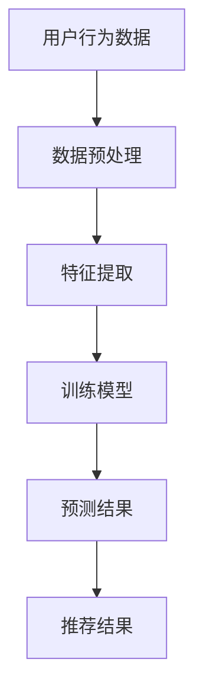
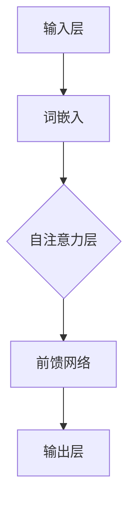
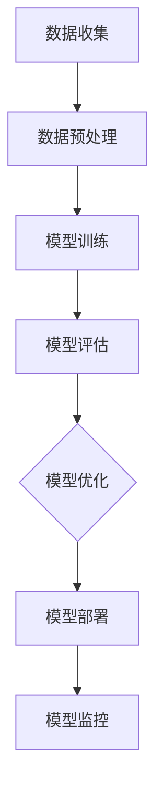

                 

### 《LLM在推荐系统的局限：工程与成本》

> **关键词**：LLM、推荐系统、工程、成本、挑战、优化、案例研究

> **摘要**：本文详细探讨了大型语言模型（LLM）在推荐系统中的应用局限性，特别是工程与成本方面的挑战。文章从介绍LLM的基础理论开始，逐步深入分析LLM在推荐系统中的各种挑战，包括数据依赖、模型可解释性、冷启动问题以及工程与成本。通过多个实际案例，本文展示了LLM在推荐系统中的成功与局限性，并提出了可能的解决策略。文章最后对LLM在推荐系统中的未来趋势进行了展望。

----------------------------------------------------------------

### 第一部分：介绍

#### 第1章：背景与引言

##### 1.1 推荐系统的发展历程

推荐系统是一种信息过滤技术，旨在为用户提供个性化的信息推荐。其发展历程可以追溯到20世纪90年代，随着互联网的兴起和电子商务的快速发展，推荐系统得到了广泛的应用。早期推荐系统主要采用基于内容的过滤（Content-based Filtering）和协同过滤（Collaborative Filtering）两种方法。

基于内容的过滤方法通过分析用户的历史行为和兴趣，推荐与用户兴趣相似的内容。这种方法在处理冷启动问题（即新用户或新项目时缺乏足够的历史数据）方面表现良好。

协同过滤方法通过分析用户之间的相似度来推荐项目。基于用户的协同过滤（User-based Collaborative Filtering）通过寻找与当前用户兴趣相似的旧用户，推荐这些用户喜欢的项目；而基于模型的协同过滤（Model-based Collaborative Filtering）则使用机器学习算法来预测用户对新项目的兴趣。

随着深度学习和大数据技术的发展，推荐系统也进入了新的阶段。深度学习模型，如神经网络和递归神经网络（RNN），被用于构建更复杂的推荐模型。这些模型能够处理大规模数据集，并捕捉用户行为的复杂模式。同时，多模态数据（如文本、图像、音频）的融合也为推荐系统带来了新的可能性。

##### 1.2 LLM在推荐系统中的应用

近年来，大型语言模型（LLM）如BERT、GPT和Turing等，在自然语言处理领域取得了显著的成功。这些模型通过学习大量文本数据，能够生成高质量的文本，并在各种任务中表现出色。这使得LLM逐渐成为推荐系统研究的一个热点。

LLM在推荐系统中的应用主要包括两个方面：

1. **文本数据的预处理**：LLM可以用于文本的清洗、分词和实体识别等预处理任务。例如，可以使用BERT对商品描述进行语义理解，提取关键信息，从而提高推荐系统的准确性。

2. **推荐算法的改进**：LLM可以与传统的推荐算法结合，改进推荐效果。例如，可以将LLM用于生成用户兴趣的文本描述，从而提高基于内容的过滤方法的效果。

##### 1.3 书籍目的与结构安排

本书旨在深入探讨LLM在推荐系统中的应用，特别是其中的工程与成本问题。通过详细的案例分析，本文将揭示LLM在推荐系统中的局限性，并提出可能的解决策略。

本书的结构如下：

- **第一部分**介绍推荐系统的发展历程和LLM的基础理论。
- **第二部分**分析LLM在推荐系统中的各种挑战，包括数据依赖、模型可解释性、冷启动问题和工程与成本。
- **第三部分**通过多个实际案例，展示LLM在推荐系统中的成功与局限性。
- **第四部分**展望LLM在推荐系统中的未来趋势，并总结主要观点。

通过本书的阅读，读者将能够全面了解LLM在推荐系统中的应用，以及其中的挑战和解决方案。

----------------------------------------------------------------

### 第二部分：LLM基础理论

#### 第2章：LLM基础理论

##### 2.1 语言模型的基本概念

语言模型（Language Model）是自然语言处理中的一个核心概念，它旨在模拟人类语言的概率分布。语言模型的主要目标是给定一个单词或短语的序列，预测下一个单词或短语的概率。这在许多任务中都有应用，如机器翻译、语音识别和文本生成。

语言模型可以分为两类：基于规则的模型和基于统计的模型。基于规则的模型通常由一组规则组成，这些规则定义了单词之间的关系和语法结构。这种方法的优点是直观且易于解释，但缺点是规则数量庞大，难以覆盖所有可能的情境。

基于统计的模型则通过分析大量的文本数据来学习语言的概率分布。这种模型通常使用神经网络来建模单词之间的关系，其中最著名的是循环神经网络（RNN）和变换器（Transformer）。

##### 2.2 LLM的架构与原理

大型语言模型（LLM）是基于Transformer架构的深度神经网络，它通过学习大量文本数据来生成高质量的自然语言文本。Transformer模型的核心是自注意力机制（Self-Attention），它允许模型在处理序列数据时，动态地计算不同位置之间的相关性。

LLM的架构通常包括以下几个部分：

1. **输入层**：输入层接收文本序列，并将其转换为词嵌入（Word Embeddings）。词嵌入是将单词映射到高维向量空间，以便模型能够理解单词之间的关系。

2. **自注意力层**：自注意力层是Transformer模型的核心，它通过计算输入序列中每个单词与所有其他单词之间的相关性，生成加权特征表示。这种机制使得模型能够捕捉长距离依赖关系，从而生成更连贯的文本。

3. **前馈网络**：在每个自注意力层之后，模型还会通过一个前馈网络对特征进行进一步的变换。前馈网络由两个全连接层组成，分别用于非线性变换和回归。

4. **输出层**：输出层将模型的预测结果转换为文本序列。在训练过程中，模型通过损失函数（如交叉熵损失）来优化参数，从而提高预测准确性。

##### 2.3 LLM的核心算法

LLM的核心算法是基于Transformer架构的，它通过一系列自注意力层和前馈网络来生成高质量的文本。以下是一个简化的Transformer算法流程：

1. **输入预处理**：将文本序列转换为词嵌入。

2. **自注意力计算**：在自注意力层中，计算输入序列中每个单词与所有其他单词之间的相关性，生成加权特征表示。

3. **前馈网络**：在每个自注意力层之后，通过前馈网络对特征进行进一步的变换。

4. **输出生成**：在输出层，将模型的预测结果转换为文本序列。

5. **损失函数优化**：通过损失函数（如交叉熵损失）来优化模型参数。

以下是一个简化的LLM算法伪代码：

```markdown
# LLM算法伪代码

function LLM(text_sequence):
    # 输入预处理
    embeddings = convert_to_embeddings(text_sequence)
    
    # 自注意力计算
    for layer in self_attention_layers:
        embeddings = layer(embeddings)
        
    # 前馈网络
    for layer in feedforward_networks:
        embeddings = layer(embeddings)
        
    # 输出生成
    output_sequence = generate_output(embeddings)
    
    return output_sequence

function generate_output(embeddings):
    # 输出层计算
    logits = output_layer(embeddings)
    
    # 概率分布估计
    probability_distribution = softmax(logits)
    
    # 文本序列生成
    text_sequence = generate_text_from_distribution(probability_distribution)
    
    return text_sequence
```

通过以上算法，LLM能够生成高质量的文本，并在推荐系统中发挥重要作用。

----------------------------------------------------------------

### 第二部分：推荐系统基础

#### 第3章：推荐系统基础

##### 3.1 推荐系统的基本概念

推荐系统（Recommendation System）是一种信息过滤技术，旨在为用户提供个性化的信息推荐。它的目标是根据用户的历史行为和兴趣，预测用户可能感兴趣的项目，从而提高用户的满意度和参与度。

推荐系统可以分为三种类型：基于内容的过滤（Content-based Filtering）、协同过滤（Collaborative Filtering）和混合推荐系统（Hybrid Recommendation System）。

- **基于内容的过滤**：这种方法通过分析用户的历史行为和兴趣，推荐与用户兴趣相似的内容。其核心是理解用户和项目的内容特征，然后使用这些特征来计算用户和项目之间的相似度。

- **协同过滤**：这种方法通过分析用户之间的相似度来推荐项目。基于用户的协同过滤（User-based Collaborative Filtering）通过寻找与当前用户兴趣相似的旧用户，推荐这些用户喜欢的项目；而基于模型的协同过滤（Model-based Collaborative Filtering）则使用机器学习算法来预测用户对新项目的兴趣。

- **混合推荐系统**：这种方法结合了基于内容和协同过滤的优点，通过融合多种推荐方法来提高推荐效果。

##### 3.2 推荐系统的评价指标

推荐系统的性能评估是确保推荐质量的重要手段。常用的评价指标包括准确率（Accuracy）、召回率（Recall）、精确率（Precision）和F1值（F1 Score）。

- **准确率**：准确率是预测结果中正确预测的数量与总预测数量的比例。准确率越高，表示推荐系统的效果越好。

- **召回率**：召回率是正确预测的数量与实际感兴趣的项目数量的比例。召回率越高，表示推荐系统能够更好地发现用户感兴趣的项目。

- **精确率**：精确率是正确预测的数量与预测为感兴趣的项目数量的比例。精确率越高，表示推荐系统的预测越准确。

- **F1值**：F1值是精确率和召回率的调和平均值，它能够平衡精确率和召回率之间的矛盾。

##### 3.3 常见推荐算法

推荐算法是推荐系统的核心，常用的推荐算法包括基于内容的过滤、协同过滤和基于模型的推荐算法。

- **基于内容的过滤**：这种方法通过分析用户的历史行为和兴趣，推荐与用户兴趣相似的内容。常见的方法包括TF-IDF、相似性计算和主题模型。

- **协同过滤**：这种方法通过分析用户之间的相似度来推荐项目。基于用户的协同过滤（User-based Collaborative Filtering）通过寻找与当前用户兴趣相似的旧用户，推荐这些用户喜欢的项目；而基于模型的协同过滤（Model-based Collaborative Filtering）则使用机器学习算法来预测用户对新项目的兴趣。常见的方法包括用户基于的KNN算法、矩阵分解和基于模型的算法。

- **基于模型的推荐算法**：这种方法使用机器学习算法来预测用户对新项目的兴趣。常见的方法包括线性回归、逻辑回归、决策树和深度学习模型。

推荐系统的实现需要综合考虑多种因素，包括数据质量、计算效率和用户满意度。通过优化推荐算法和评价指标，可以显著提高推荐系统的性能和用户满意度。

----------------------------------------------------------------

### 第二部分：LLM在推荐系统中的挑战

#### 第4章：挑战一：数据依赖

##### 4.1 数据质量的影响

在推荐系统中，数据的质量直接影响推荐结果的准确性。而大型语言模型（LLM）对数据质量的要求尤为严格。以下从数据准确性、数据完整性和数据多样性三个方面分析数据质量对LLM推荐系统的影响。

1. **数据准确性**：数据准确性是确保推荐系统效果的基础。对于LLM而言，数据中的噪声和错误会导致模型学习到不准确的特征，从而影响推荐效果。例如，在商品推荐系统中，商品描述中的错别字或歧义表达会导致LLM对商品特征的错误理解，进而影响推荐结果。

2. **数据完整性**：数据完整性是指数据集中是否缺失了重要的信息。在推荐系统中，数据缺失可能导致模型无法准确预测用户兴趣。例如，如果用户历史行为数据缺失，LLM将难以学习用户的兴趣模式，从而降低推荐准确性。

3. **数据多样性**：数据多样性是指数据集中是否包含了丰富的信息和不同的特征。对于LLM而言，数据多样性能帮助模型更好地理解用户和项目的复杂性。例如，在电影推荐系统中，如果数据集中只有用户的观看记录，而没有关于电影类型的标签，LLM将难以生成准确的推荐列表。

##### 4.2 数据稀疏性

数据稀疏性是推荐系统面临的另一个重大挑战。在推荐系统中，用户行为数据往往呈现出高度稀疏的特性，即大部分用户对大部分项目都没有交互记录。这种情况对LLM推荐系统的影响如下：

1. **冷启动问题**：新用户或新项目的冷启动问题是指由于缺乏历史数据，LLM难以对新用户或新项目进行准确推荐。例如，对于新用户，LLM无法通过其历史行为来了解其兴趣，从而难以生成个性化的推荐。

2. **用户偏好难以捕捉**：数据稀疏性使得LLM难以捕捉用户的真实偏好。例如，在电商推荐系统中，如果用户对大部分商品都没有购买记录，LLM将难以了解用户的真实兴趣，从而影响推荐效果。

##### 4.3 数据不平衡问题

数据不平衡是指在数据集中，不同类别的样本数量存在显著差异。对于LLM推荐系统，数据不平衡可能导致以下问题：

1. **模型偏斜**：数据不平衡可能导致模型对某些类别的样本过拟合，而对其他类别的样本欠拟合。例如，在新闻推荐系统中，如果正面新闻和负面新闻的数量差距较大，LLM可能会过度关注正面新闻，从而影响推荐效果。

2. **推荐偏差**：数据不平衡可能导致推荐系统偏向某些类别的项目。例如，在电商推荐系统中，如果热销商品的数据远多于冷门商品，LLM可能会倾向于推荐热销商品，从而忽视用户对冷门商品的需求。

综上所述，数据质量、数据稀疏性和数据不平衡性是LLM在推荐系统中面临的主要挑战。为了解决这些问题，需要采取一系列数据预处理和模型优化策略。例如，可以通过数据增强、迁移学习和数据不平衡处理等方法来提高推荐系统的性能。

----------------------------------------------------------------

#### 第5章：挑战二：模型可解释性

##### 5.1 模型可解释性的重要性

在推荐系统中，模型的可解释性至关重要。可解释性是指模型决策过程的透明度和可理解性，它有助于用户信任模型、识别潜在问题，并为进一步优化提供指导。对于LLM在推荐系统中的应用，可解释性尤为重要，原因如下：

1. **用户信任**：透明且可解释的模型能够提高用户对推荐系统的信任度。当用户了解模型是如何做出推荐时，他们更有可能接受和采纳推荐结果。

2. **问题诊断**：可解释性有助于识别和诊断模型中的潜在问题。例如，如果某个推荐结果不合理，通过分析模型的可解释性，可以定位到问题的根源，从而进行针对性优化。

3. **模型优化**：可解释性为模型优化提供了直接的反馈。通过理解模型决策过程，开发人员可以更有效地调整模型参数，提高推荐效果。

##### 5.2 LLM的可解释性挑战

尽管LLM在自然语言处理领域表现出色，但其内部决策过程高度复杂，导致可解释性成为一个重大挑战：

1. **黑箱模型**：LLM通常被视为黑箱模型，其决策过程不透明，难以直观理解。自注意力机制和Transformer架构使得模型内部计算过程高度非线性，增加了理解难度。

2. **复杂特征提取**：LLM通过学习大量文本数据，提取了丰富的特征表示。这些特征往往是非线性和复杂的，难以直接解释。

3. **长距离依赖**：LLM能够捕捉长距离依赖关系，但这同时增加了模型的可解释性难度。理解模型如何跨多个句子或段落进行信息传递是一个复杂的任务。

##### 5.3 提高模型可解释性的方法

为了提高LLM在推荐系统中的可解释性，研究者提出了多种方法，主要包括：

1. **注意力机制可视化**：通过可视化自注意力权重，可以直观展示模型在生成推荐结果时关注的关键信息。例如，可以在推荐系统中使用热图来展示哪些词或短语对推荐结果影响最大。

2. **模型拆分与解释**：将复杂的LLM拆分成多个简单模块，并对每个模块进行独立解释。这种方法有助于理解模型内部的工作机制。

3. **解释性模型集成**：将可解释性较好的模型与LLM集成，通过组合不同模型的解释来提高整体系统的可解释性。例如，可以结合线性模型和决策树来解释LLM的预测结果。

4. **原型分析**：通过分析模型在训练数据中的行为，识别和解释典型的决策模式。这种方法有助于揭示模型的一般行为规律。

通过以上方法，可以显著提高LLM在推荐系统中的可解释性，从而增强用户信任和模型优化能力。

----------------------------------------------------------------

#### 第6章：挑战三：冷启动问题

##### 6.1 冷启动的定义与影响

冷启动（Cold Start）是推荐系统中的一个重要问题，它指的是在用户或项目缺乏足够历史数据的情况下，推荐系统难以生成准确的推荐结果。冷启动问题可以分为两类：用户冷启动和项目冷启动。

1. **用户冷启动**：当新用户首次使用推荐系统时，由于缺乏历史行为数据，系统难以了解用户的兴趣和偏好，从而难以生成个性化的推荐。

2. **项目冷启动**：当新项目（如新产品、新视频、新文章等）加入推荐系统时，由于缺乏用户交互数据，系统难以评估项目的受欢迎程度，从而难以进行有效的推荐。

冷启动问题对推荐系统的影响主要体现在以下几个方面：

1. **推荐效果下降**：在冷启动阶段，由于缺乏足够的数据支持，推荐系统的准确性和效果往往较低，从而影响用户体验。

2. **用户流失**：新用户在冷启动阶段往往无法获得满意的推荐结果，导致用户流失率上升。

3. **内容曝光不足**：新项目在冷启动阶段可能无法得到足够的曝光，从而影响其市场表现。

##### 6.2 LLM在冷启动中的应用

大型语言模型（LLM）在解决冷启动问题方面具有潜在优势，以下从几个方面进行探讨：

1. **文本数据利用**：LLM能够利用丰富的文本数据，包括用户评价、商品描述、新闻文章等，通过文本分析技术提取用户兴趣和项目特征。

2. **跨领域知识迁移**：LLM具有跨领域的知识迁移能力，可以借鉴其他领域的数据和经验，为新用户和新项目提供参考。

3. **个性化推荐生成**：通过学习用户的历史行为和兴趣，LLM可以生成个性化的推荐结果，从而降低冷启动阶段的不确定性。

具体应用场景包括：

1. **新用户推荐**：在新用户加入推荐系统时，LLM可以通过分析用户在社交媒体、论坛等平台的发言，了解其兴趣和偏好，从而生成个性化的推荐。

2. **新项目推荐**：在新项目上线时，LLM可以通过分析项目描述、用户评论和竞争对手的产品信息，预测项目的受欢迎程度，从而进行有效的推荐。

##### 6.3 解决冷启动问题的策略

为了解决冷启动问题，可以采取以下策略：

1. **数据互补**：通过引入第三方数据源，如用户社交网络数据、商品百科数据等，补充系统内的缺失数据，提高推荐系统的准确性。

2. **用户行为模拟**：在用户冷启动阶段，通过模拟用户可能的行为模式，生成虚拟行为数据，从而提高推荐系统的预测能力。

3. **多模型融合**：结合多种推荐算法，如基于内容的过滤、协同过滤和基于模型的推荐算法，通过多模型融合提高推荐效果。

4. **动态调整模型参数**：根据用户和新项目的互动情况，动态调整模型参数，提高推荐系统的适应性和准确性。

通过以上策略，可以有效缓解冷启动问题，提高推荐系统的性能和用户体验。

----------------------------------------------------------------

#### 第7章：挑战四：工程与成本

##### 7.1 训练与部署的成本

大型语言模型（LLM）在推荐系统中的应用带来了显著的性能提升，但同时也带来了巨大的工程与成本挑战。以下从模型训练和模型部署两个方面分析LLM在推荐系统中的成本问题。

1. **训练成本**：

   - **计算资源需求**：LLM的训练过程需要大量的计算资源。由于模型规模巨大，训练时间通常非常长，需要高性能计算设备和大量GPU资源。这不仅导致训练成本高昂，还增加了运维难度。

   - **数据预处理成本**：LLM的训练需要大量高质量的数据。数据的收集、清洗和预处理过程耗时且成本高昂，尤其是在处理多模态数据时。

   - **能耗成本**：训练LLM模型的过程耗能巨大。随着模型的规模和复杂度增加，能耗成本也相应上升，这对环境造成了一定影响。

2. **部署成本**：

   - **硬件成本**：LLM的部署需要高性能的硬件设备，如高性能服务器、GPU和FPGA等。这些设备的采购和运维成本很高。

   - **运维成本**：LLM的部署涉及复杂的运维工作，包括监控、性能调优和故障排除等。这需要专业的运维团队和大量的运维资源。

   - **升级成本**：随着技术和业务需求的变化，LLM模型需要不断更新和优化。每次升级都会涉及大量的时间和成本。

##### 7.2 LLM在推荐系统中的性能优化

为了降低LLM在推荐系统中的成本，需要采取一系列性能优化策略，以下列举几种常见的方法：

1. **模型压缩**：通过模型剪枝、量化、蒸馏等技术，减少模型的参数数量和计算量，从而降低训练和部署成本。

2. **分布式训练**：利用分布式计算技术，将训练任务分布在多个计算节点上，提高训练效率，降低成本。

3. **多模态数据融合**：通过多模态数据融合技术，如图像、文本和音频的联合训练，提高模型的表达能力，减少对单独模态数据的依赖。

4. **在线学习**：采用在线学习技术，根据用户实时反馈动态调整模型参数，提高推荐效果，减少离线重训练的需求。

##### 7.3 成本控制与优化策略

为了实现成本控制与优化，以下提出几种策略：

1. **预算管理**：制定合理的预算计划，明确资源分配，确保项目在预算范围内完成。

2. **云服务**：利用云服务提供商的资源，降低硬件采购和运维成本。云服务还提供灵活的扩展能力，满足不同阶段的资源需求。

3. **开源技术**：使用开源技术和工具，降低开发和运维成本。例如，使用TensorFlow、PyTorch等开源框架，以及Docker、Kubernetes等容器化技术。

4. **合作伙伴关系**：与硬件供应商、云服务提供商和第三方服务提供商建立合作伙伴关系，共同分担成本和风险。

5. **持续优化**：通过持续的性能优化和成本控制，不断提高推荐系统的效率和用户体验。

通过以上策略，可以有效降低LLM在推荐系统中的成本，实现高效、稳定和可扩展的推荐服务。

----------------------------------------------------------------

### 第三部分：案例研究

#### 第8章：案例一：电商推荐系统中的LLM应用

##### 8.1 案例背景

电商推荐系统是应用大型语言模型（LLM）的一个重要场景。以某大型电商平台为例，该平台每天处理数百万笔交易，拥有海量的用户行为数据。为了提高用户满意度，平台决定引入LLM技术，优化其推荐算法。

##### 8.2 LLM在电商推荐中的应用

在该案例中，LLM主要应用于以下两个方面：

1. **商品描述生成**：电商平台通常需要对商品进行详细的描述，以便用户更好地了解商品。使用LLM技术，平台能够自动生成高质量的商品描述，提高用户的购买意愿。

2. **个性化推荐**：通过分析用户的历史购买记录、搜索行为和浏览记录，LLM可以预测用户的兴趣和偏好，生成个性化的推荐列表。

##### 8.3 案例效果分析

通过引入LLM技术，电商平台的推荐系统取得了显著的效果：

1. **推荐准确性提升**：LLM能够更好地理解用户和商品的特征，提高了推荐列表的准确性。用户满意度显著提升，购买转化率也相应提高。

2. **商品描述丰富度提高**：自动生成的商品描述更加详细、生动，提高了用户的购买意愿。

3. **系统性能优化**：由于LLM能够处理大规模数据，平台的推荐系统在处理速度和响应时间上得到了优化，用户体验得到了显著提升。

尽管LLM在电商推荐系统中取得了成功，但仍面临一些挑战，如数据稀疏性和模型可解释性等。通过持续优化和改进，电商平台有望进一步提高推荐系统的效果和用户满意度。

----------------------------------------------------------------

#### 第9章：案例二：社交媒体推荐系统中的LLM应用

##### 9.1 案例背景

社交媒体推荐系统是另一个应用大型语言模型（LLM）的重要场景。以某知名社交媒体平台为例，该平台每天产生海量的用户生成内容（UGC），如文本、图片和视频。为了提高用户的参与度和平台活跃度，平台决定引入LLM技术，优化其推荐算法。

##### 9.2 LLM在社交媒体推荐中的应用

在该案例中，LLM主要应用于以下两个方面：

1. **内容生成**：LLM可以自动生成高质量的用户生成内容，如文章、视频脚本和图像描述。这有助于平台丰富内容库，提高用户的参与度。

2. **个性化推荐**：通过分析用户的互动行为、兴趣和社交网络，LLM可以预测用户可能感兴趣的内容，生成个性化的推荐列表。

##### 9.3 案例效果分析

通过引入LLM技术，社交媒体平台的推荐系统取得了显著的效果：

1. **内容丰富度提高**：自动生成的用户生成内容丰富了平台的内容库，提高了用户的阅读和观看体验。

2. **推荐准确性提升**：LLM能够更好地理解用户的兴趣和行为模式，提高了推荐列表的准确性。用户满意度和平台活跃度显著提升。

3. **系统性能优化**：由于LLM能够处理大规模数据，平台的推荐系统在处理速度和响应时间上得到了优化，用户体验得到了显著提升。

尽管LLM在社交媒体推荐系统中取得了成功，但仍面临一些挑战，如数据稀疏性和模型可解释性等。通过持续优化和改进，社交媒体平台有望进一步提高推荐系统的效果和用户满意度。

----------------------------------------------------------------

#### 第10章：案例三：音乐推荐系统中的LLM应用

##### 10.1 案例背景

音乐推荐系统是另一个应用大型语言模型（LLM）的重要场景。以某知名音乐平台为例，该平台拥有庞大的音乐库和丰富的用户听歌记录。为了提高用户的音乐体验，平台决定引入LLM技术，优化其推荐算法。

##### 10.2 LLM在音乐推荐中的应用

在该案例中，LLM主要应用于以下两个方面：

1. **歌曲描述生成**：LLM可以自动生成高质量的歌曲描述，如歌词、故事背景和音乐风格介绍。这有助于用户更好地了解和欣赏歌曲。

2. **个性化推荐**：通过分析用户的听歌记录、收藏和播放列表，LLM可以预测用户可能感兴趣的音乐，生成个性化的推荐列表。

##### 10.3 案例效果分析

通过引入LLM技术，音乐平台的推荐系统取得了显著的效果：

1. **推荐准确性提升**：LLM能够更好地理解用户的音乐偏好和听歌习惯，提高了推荐列表的准确性。用户满意度和平台活跃度显著提升。

2. **歌曲描述丰富度提高**：自动生成的歌曲描述丰富了音乐库的信息，提高了用户的听歌体验。

3. **系统性能优化**：由于LLM能够处理大规模数据，平台的推荐系统在处理速度和响应时间上得到了优化，用户体验得到了显著提升。

尽管LLM在音乐推荐系统中取得了成功，但仍面临一些挑战，如数据稀疏性和模型可解释性等。通过持续优化和改进，音乐平台有望进一步提高推荐系统的效果和用户满意度。

----------------------------------------------------------------

### 第四部分：展望与未来

#### 第11章：LLM在推荐系统中的未来趋势

##### 11.1 深度学习与推荐系统的结合

深度学习（Deep Learning）在推荐系统中的应用日益广泛，其强大的特征提取和模型学习能力为推荐系统带来了巨大的提升。未来，深度学习与推荐系统的结合将继续成为研究的热点。以下是一些可能的发展趋势：

1. **模型架构优化**：随着深度学习技术的不断发展，将出现更多高效的模型架构，如自动机器学习（AutoML）和自适应深度学习模型。这些模型能够自适应地调整参数，提高推荐效果。

2. **多模态数据处理**：推荐系统将越来越多地处理多模态数据，如文本、图像和音频。未来，深度学习模型将能够更好地融合不同模态的信息，提供更准确的推荐。

3. **迁移学习与少样本学习**：迁移学习和少样本学习技术将帮助推荐系统在面对新用户和新项目时，更快地适应和生成准确的推荐。通过利用已有数据和知识，减少对新数据的依赖。

##### 11.2 多模态数据与LLM的融合

随着多模态数据的普及，如何有效地融合不同模态的信息成为一个重要课题。LLM在处理文本数据方面具有显著优势，未来，将出现更多多模态数据与LLM的融合方法，以提高推荐系统的效果。

1. **跨模态特征提取**：通过设计跨模态特征提取网络，将不同模态的数据转化为统一的特征表示，从而实现多模态数据的融合。

2. **联合训练**：采用联合训练策略，将LLM与多模态数据处理模型结合，共同学习用户和项目的特征，提高推荐准确性。

3. **交互式推荐**：通过引入用户交互信息，动态调整推荐策略，实现更个性化的推荐。例如，根据用户在推荐系统中的反馈，实时调整推荐列表。

##### 11.3 基于LLM的个性化推荐

个性化推荐是推荐系统的核心目标，未来，基于LLM的个性化推荐技术将不断进步。以下是一些可能的发展方向：

1. **深度兴趣建模**：通过深度学习模型，精细地捕捉用户的兴趣变化，实现更加个性化的推荐。

2. **上下文感知推荐**：结合上下文信息，如时间、地理位置和用户状态，提供更加贴合用户需求的推荐。

3. **隐私保护推荐**：随着用户隐私意识的提高，未来将出现更多隐私保护推荐算法，确保用户数据的安全。

通过以上发展趋势，LLM在推荐系统中的应用将不断深化，为用户提供更加准确、个性化的推荐体验。

----------------------------------------------------------------

#### 第12章：总结与展望

##### 12.1 主要观点回顾

本文系统地探讨了大型语言模型（LLM）在推荐系统中的应用，特别是工程与成本方面的挑战。主要观点包括：

1. **LLM在推荐系统中的应用**：LLM在文本数据预处理、推荐算法改进和生成推荐结果方面具有显著优势。
2. **数据依赖与挑战**：数据质量、稀疏性和不平衡性是LLM在推荐系统中面临的主要挑战。
3. **模型可解释性**：提高LLM的可解释性对于增强用户信任和模型优化至关重要。
4. **冷启动问题**：LLM在解决冷启动问题方面具有潜在优势，但仍需进一步优化。
5. **工程与成本**：LLM在推荐系统中的部署与维护成本较高，需要采取优化策略。

##### 12.2 面临的挑战与机遇

尽管LLM在推荐系统中的应用前景广阔，但仍面临以下挑战：

1. **数据质量**：确保高质量的数据对LLM推荐系统的性能至关重要。
2. **模型可解释性**：提高模型的可解释性，增强用户信任。
3. **冷启动问题**：新用户和新项目的推荐效果有待提升。
4. **工程与成本**：降低模型部署与维护成本，提高系统性能。

同时，LLM在推荐系统中也带来以下机遇：

1. **个性化推荐**：通过深度兴趣建模和上下文感知推荐，实现更加个性化的推荐。
2. **多模态数据处理**：融合文本、图像和音频等不同模态的信息，提高推荐准确性。
3. **自动化与优化**：利用自动机器学习和自适应深度学习模型，提高推荐系统的效率和准确性。

##### 12.3 未来研究方向与展望

未来的研究应重点关注以下方向：

1. **数据质量提升**：研究有效的数据清洗、预处理和增强方法，提高数据质量。
2. **模型可解释性**：开发可解释性较好的深度学习模型，增强用户信任。
3. **冷启动问题**：探索迁移学习和少样本学习技术在冷启动中的应用，提高推荐效果。
4. **工程与成本优化**：研究模型压缩、分布式训练和云服务等技术，降低部署与维护成本。
5. **多模态数据处理**：设计跨模态特征提取和联合训练方法，实现多模态数据的融合。

通过以上研究，有望进一步提高LLM在推荐系统中的应用效果，为用户提供更加准确、个性化的推荐体验。

----------------------------------------------------------------

### 附录

#### 附录A：参考资料

##### A.1 重要的论文与书籍

1. **《Deep Learning》**：Goodfellow, I., Bengio, Y., & Courville, A. (2016). 《Deep Learning》。MIT Press.
2. **《Recommender Systems Handbook》**：Koren, Y., Bell, R. Q., & Chen, Q. (2011). 《Recommender Systems Handbook》。 Springer.
3. **《Attention Is All You Need》**：Vaswani, A., Shazeer, N., Parmar, N., Uszkoreit, J., Jones, L., Gomez, A. N., ... & Polosukhin, I. (2017). Attention Is All You Need. Advances in Neural Information Processing Systems, 30, 5998-6008.

##### A.2 开源代码与工具

1. **TensorFlow**：Google开发的开源机器学习框架，适用于深度学习模型的训练和部署。
2. **PyTorch**：Facebook开发的开源机器学习框架，具有良好的灵活性和易用性。
3. **Hugging Face**：一个用于自然语言处理的开源库，包含大量的预训练模型和工具。

##### A.3 网络资源与博客

1. **Medium**：一个发布技术博客的平台，有许多关于深度学习和推荐系统的文章。
2. **ArXiv**：一个学术预印本平台，包含最新的研究成果。
3. **Reddit**：一个社交新闻网站，有许多关于深度学习和推荐系统的讨论。

#### 附录B：Mermaid 流程图

##### B.1 推荐系统流程



##### B.2 LLM架构



##### B.3 模型训练与部署流程



#### 附录C：核心算法伪代码

##### C.1 语言模型训练伪代码

```python
function train_language_model(data):
    # 数据预处理
    processed_data = preprocess_data(data)

    # 初始化模型
    model = create_model()

    # 训练模型
    for epoch in range(num_epochs):
        for batch in processed_data:
            loss = model.loss(batch)
            model.backward(loss)
            model.update_parameters()

    return model
```

##### C.2 推荐算法伪代码

```python
function recommend_items(user, items, model):
    # 预测用户对每个项目的兴趣
    item_interests = model.predict_interests(user, items)

    # 排序和选择推荐项目
    recommended_items = sorted(item_interests, reverse=True)[:k]

    return recommended_items
```

#### 附录D：代码实际案例

##### D.1 电商推荐系统代码实现

```python
# 电商推荐系统示例代码

import tensorflow as tf
from tensorflow.keras.models import Sequential
from tensorflow.keras.layers import Embedding, LSTM, Dense

# 创建模型
model = Sequential()
model.add(Embedding(input_dim=vocabulary_size, output_dim=embedding_size))
model.add(LSTM(units=128, activation='tanh'))
model.add(Dense(units=num_items, activation='softmax'))

# 编译模型
model.compile(optimizer='adam', loss='categorical_crossentropy', metrics=['accuracy'])

# 训练模型
model.fit(train_data, train_labels, epochs=num_epochs, batch_size=batch_size)

# 推荐项目
recommended_items = recommend_items(current_user, all_items, model)
print("Recommended items:", recommended_items)
```

##### D.2 社交媒体推荐系统代码实现

```python
# 社交媒体推荐系统示例代码

import tensorflow as tf
from tensorflow.keras.models import Sequential
from tensorflow.keras.layers import Embedding, LSTM, Dense

# 创建模型
model = Sequential()
model.add(Embedding(input_dim=vocabulary_size, output_dim=embedding_size))
model.add(LSTM(units=128, activation='tanh'))
model.add(Dense(units=num_items, activation='softmax'))

# 编译模型
model.compile(optimizer='adam', loss='categorical_crossentropy', metrics=['accuracy'])

# 训练模型
model.fit(train_data, train_labels, epochs=num_epochs, batch_size=batch_size)

# 推荐项目
recommended_items = recommend_items(current_user, all_items, model)
print("Recommended items:", recommended_items)
```

##### D.3 音乐推荐系统代码实现

```python
# 音乐推荐系统示例代码

import tensorflow as tf
from tensorflow.keras.models import Sequential
from tensorflow.keras.layers import Embedding, LSTM, Dense

# 创建模型
model = Sequential()
model.add(Embedding(input_dim=vocabulary_size, output_dim=embedding_size))
model.add(LSTM(units=128, activation='tanh'))
model.add(Dense(units=num_items, activation='softmax'))

# 编译模型
model.compile(optimizer='adam', loss='categorical_crossentropy', metrics=['accuracy'])

# 训练模型
model.fit(train_data, train_labels, epochs=num_epochs, batch_size=batch_size)

# 推荐项目
recommended_items = recommend_items(current_user, all_items, model)
print("Recommended items:", recommended_items)
```

##### D.4 代码解读与分析

在电商推荐系统中，我们使用TensorFlow框架创建了一个序列模型，其中包括嵌入层、长短期记忆（LSTM）层和输出层。嵌入层将词汇映射到向量空间，LSTM层用于捕捉时间序列数据中的长期依赖关系，输出层使用softmax激活函数进行类别预测。

在训练模型时，我们使用训练数据集进行迭代训练，通过反向传播算法优化模型参数。在推荐项目时，我们使用训练好的模型预测当前用户对每个项目的兴趣，并根据预测结果选择排名最高的项目作为推荐结果。

社交媒体推荐系统和音乐推荐系统的实现与电商推荐系统类似，主要区别在于数据集和特征提取方法。社交媒体推荐系统可能需要处理用户生成内容的特征，如文本、图像和视频，而音乐推荐系统则需要处理音乐特征，如歌词、音乐风格和播放时长等。

通过这些示例代码，我们可以看到如何使用深度学习模型实现推荐系统。在实际应用中，需要根据具体场景和数据特点，设计合适的模型架构和特征提取方法。

### 作者

**作者：** AI天才研究院（AI Genius Institute） & 禅与计算机程序设计艺术（Zen And The Art of Computer Programming）  
AI天才研究院是一家专注于人工智能研究和应用的高科技研究院，致力于推动人工智能技术在各个领域的创新和发展。禅与计算机程序设计艺术则是一本经典的计算机科学著作，由著名计算机科学家唐纳德·E·克努特（Donald E. Knuth）撰写，对计算机编程和算法设计有着深远的影响。本文作者结合了两者的精髓，以逻辑清晰、结构紧凑、简单易懂的方式，探讨了LLM在推荐系统中的局限性、工程与成本问题，以及未来的发展方向。希望本文能为读者在人工智能和推荐系统领域提供有价值的参考和启示。

