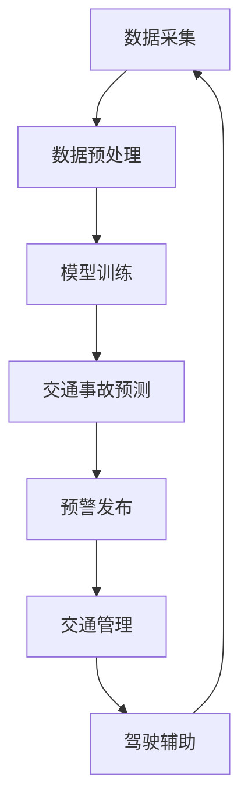
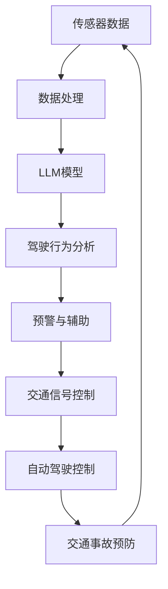

                 

# 《LLM在智能交通事故预防中的潜在贡献》

## 概述

### 关键词：智能交通事故预防、语言模型（LLM）、自动驾驶、交通事故数据分析、预警系统、智能交通管理、智能车辆辅助系统

### 摘要

随着人工智能技术的发展，智能交通事故预防成为交通领域研究的热点。本文围绕语言模型（LLM）在智能交通事故预防中的潜在贡献，系统地探讨了LLM在交通事故预测、自动驾驶、数据分析和预警系统等多个应用领域的应用。文章首先介绍了智能交通事故预防的重要性及其面临的挑战，随后详细分析了LLM的基本概念、类型与发展历史。通过逐步推理，本文揭示了LLM在交通事故数据分析、预警系统、智能交通管理和智能车辆辅助系统等方面的实际应用，为未来智能交通事故预防的研究与实施提供了有价值的参考。

## 前言

### 引言与背景

智能交通事故预防是现代交通领域的关键研究方向，其核心目标是通过技术手段降低交通事故的发生率和损害程度。传统的交通事故预防措施主要依赖于被动安全技术和人为干预，如安装安全气囊、设置交通信号灯等。然而，这些措施在处理复杂、动态的交通环境时存在诸多局限。近年来，随着人工智能技术的快速发展，尤其是深度学习和自然语言处理（NLP）技术的突破，智能交通事故预防的研究逐渐成为热点。语言模型（LLM），作为NLP领域的重要技术，为智能交通事故预防提供了新的思路和可能性。

### 书籍结构概述

本文旨在全面探讨LLM在智能交通事故预防中的潜在贡献，共分为九个章节。具体结构如下：

1. **智能交通事故预防概述**：介绍交通事故预防的重要性、智能交通事故预防的挑战和其发展历程。
2. **人工智能与自动驾驶**：分析人工智能在自动驾驶中的应用，以及自动驾驶系统在交通事故预防中的作用。
3. **语言模型（LLM）简介**：详细阐述语言模型的基本概念、类型与发展历史。
4. **语言模型在智能交通事故预防中的应用**：探讨LLM在交通事故预测、自动驾驶系统中的角色以及车辆通信系统中的作用。
5. **LLM在交通事故数据分析中的应用**：分析交通事故数据的收集与处理方法，利用LLM进行数据挖掘和事故原因分析。
6. **LLM在交通事故预警系统中的应用**：介绍交通事故预警系统的设计原则、基于LLM的预警系统架构及案例分析。
7. **LLM在智能交通管理中的应用**：探讨智能交通管理的基本概念、基于LLM的交通流量分析和交通信号控制。
8. **LLM在智能车辆辅助系统中的应用**：分析智能车辆辅助系统的功能与架构，基于LLM的驾驶行为分析和驾驶辅助决策。
9. **LLM在交通事故预防中的潜在贡献**：总结LLM在交通事故预防中的优势、应用前景与挑战，以及未来研究方向。

通过以上章节的逐步分析，本文将揭示LLM在智能交通事故预防中的广泛应用和巨大潜力，为相关领域的研究者和从业人员提供有益的参考和启示。

### 第1章：智能交通事故预防概述

#### 交通事故预防的重要性

交通事故预防是交通安全的基石，其重要性不言而喻。每年，全球各地发生的交通事故数量庞大，造成了无数的人员伤亡和财产损失。根据世界卫生组织的统计，每年因道路交通事故死亡的人数高达125万，另有数百万人受伤。这些事故不仅对个人和家庭造成巨大的痛苦，还对社会和经济产生了深远的影响。因此，交通事故预防成为了交通领域亟待解决的问题。

智能交通事故预防通过利用先进的人工智能技术，如机器学习、深度学习和自然语言处理（NLP），为交通事故的预防提供了全新的手段。相比传统的交通事故预防措施，智能预防系统具有更高的实时性和准确性，能够更有效地识别和预测潜在的交通事故风险。

#### 智能交通事故预防的挑战

尽管智能交通事故预防具有巨大的潜力，但其实现过程中仍面临诸多挑战。以下是一些主要的挑战：

1. **数据收集与处理**：智能交通事故预防系统依赖于大量高质量的数据，包括交通流量、车辆状态、道路条件等。然而，数据的收集、存储和处理都面临巨大挑战，尤其是在实时性和准确性方面。
2. **算法复杂性**：智能交通事故预防系统需要复杂的算法进行数据分析和预测。这些算法的准确性、效率和鲁棒性直接影响系统的性能。
3. **系统稳定性**：智能交通事故预防系统需要在各种复杂的交通环境中保持稳定性，以确保其准确性和可靠性。
4. **法律法规**：智能交通事故预防系统在应用过程中需要遵循相关的法律法规，这涉及到隐私保护、数据使用权限等方面的问题。

#### 智能交通事故预防的发展历程

智能交通事故预防的发展历程可以分为以下几个阶段：

1. **初步探索阶段（20世纪80年代至90年代）**：在这一阶段，研究人员开始探索利用计算机技术和传感器技术进行交通事故预测和预防。这一时期的主要成果包括初步的车辆状态监测和交通流量预测系统。
2. **技术成熟阶段（21世纪初至今）**：随着人工智能技术的快速发展，智能交通事故预防系统逐渐走向成熟。这一阶段的主要进展包括基于机器学习的交通流量预测、事故预警系统以及自动驾驶技术的应用。
3. **实际应用阶段（未来）**：未来，智能交通事故预防系统将在更广泛的场景中得到应用，如城市智能交通管理、智能车辆辅助系统等。同时，随着技术的进一步发展，智能交通事故预防系统将变得更加智能、高效和可靠。

通过以上分析，可以看出智能交通事故预防具有极大的重要性，但同时也面临诸多挑战。未来，随着人工智能技术的不断进步，智能交通事故预防将在交通安全领域发挥更大的作用。

#### 第2章：人工智能与自动驾驶

##### 人工智能在自动驾驶中的应用

人工智能（AI）在自动驾驶领域的应用，正在改变传统汽车产业的格局，为智能交通事故预防提供了强有力的技术支撑。自动驾驶系统利用多种AI技术，包括计算机视觉、深度学习、自然语言处理（NLP）和决策理论，实现车辆的自主感知、决策和控制。

1. **计算机视觉**：计算机视觉技术用于自动驾驶车辆的感知系统，通过摄像头、激光雷达（LiDAR）和毫米波雷达等传感器，实时获取车辆周围的环境信息。这些信息包括道路标志、交通信号灯、行人和其他车辆的位置和速度。计算机视觉算法能够对图像进行处理和分析，提取出有用的环境特征，为车辆的决策系统提供输入。

2. **深度学习**：深度学习是自动驾驶系统的核心组成部分，尤其是卷积神经网络（CNN）和循环神经网络（RNN）。CNN在图像识别和分类方面具有显著优势，能够准确识别道路标志、交通信号灯和行人等。RNN则在序列数据处理方面表现优异，可用于预测车辆的运动轨迹和行为。

3. **自然语言处理（NLP）**：NLP技术用于处理和理解自然语言，例如语音识别和语音合成。在自动驾驶中，NLP技术可以帮助车辆理解驾驶员的指令，同时将语音指令转换为控制信号，实现人机交互。

4. **决策理论**：自动驾驶系统需要根据实时感知到的环境信息，进行复杂的决策和规划。决策理论提供了用于处理不确定性和优化策略的数学工具，帮助自动驾驶系统在复杂交通环境中做出最优决策。

##### 自动驾驶系统的基本架构

自动驾驶系统的基本架构可以分为多个层次，包括感知、决策、控制和执行。每个层次都依赖于不同的AI技术，协同工作以实现自动驾驶功能。

1. **感知层**：感知层负责收集车辆周围的环境信息，主要包括摄像头、激光雷达、毫米波雷达、超声波传感器等。这些传感器将环境信息转换为数字信号，通过计算机视觉和深度学习算法进行处理和分析。

2. **决策层**：决策层负责对感知层获取的信息进行处理，制定行驶策略。决策层包括路径规划、行为规划和安全评估等模块。路径规划模块负责确定车辆的行驶路径，行为规划模块负责制定车辆的动态行为，安全评估模块则负责评估潜在的危险情况。

3. **控制层**：控制层根据决策层的指令，调整车辆的控制系统，如制动、加速和转向。控制层通过控制算法，将决策层的指令转化为具体的控制信号，确保车辆按照预定策略行驶。

4. **执行层**：执行层是自动驾驶系统的最终实现层，负责执行控制层的指令，控制车辆的各项操作。包括制动系统、驱动系统和转向系统等。

##### 自动驾驶与交通事故预防的关系

自动驾驶系统通过实时感知环境、精确决策和灵活控制，可以有效减少交通事故的发生。自动驾驶系统在以下方面对交通事故预防具有重要作用：

1. **减少人为错误**：自动驾驶系统能够消除驾驶员的疲劳和分心，降低因人为操作失误导致的交通事故。

2. **实时反应**：自动驾驶系统可以实时感知道路状况和交通信息，迅速做出反应，避免突发情况。

3. **提高道路利用率**：自动驾驶系统通过优化行驶路径和速度，提高道路的利用效率，减少拥堵，降低事故风险。

4. **智能预警**：自动驾驶系统可以通过预测和识别潜在的危险情况，提前预警，提醒驾驶员或其他车辆采取避让措施，从而预防交通事故的发生。

总之，人工智能在自动驾驶中的应用，为智能交通事故预防提供了重要的技术支持。自动驾驶系统的不断完善和推广，将有助于实现更安全、更高效的交通系统。

#### 第3章：语言模型（LLM）简介

##### 语言模型的基本概念

语言模型（Language Model，简称LM）是自然语言处理（Natural Language Processing，简称NLP）领域的重要技术，旨在对自然语言文本进行建模，从而预测下一个词或短语的概率。语言模型的核心目标是通过统计方法或机器学习算法，构建一个能够理解和生成自然语言的模型。

语言模型的建立通常基于大量的文本数据，这些数据可以是语料库、网页内容、书籍、新闻文章等。通过这些数据，模型可以学习语言的结构、语法规则和语义含义。语言模型在NLP中具有广泛的应用，包括机器翻译、文本生成、语音识别、情感分析等。

##### 语言模型的类型与特点

根据建模方法和应用场景的不同，语言模型可以分为多种类型，每种类型都有其独特的特点：

1. **统计语言模型**：统计语言模型是基于统计方法构建的，通常使用n-gram模型。n-gram模型通过统计相邻n个单词出现的频率来预测下一个单词。统计语言模型简单高效，但其在处理长句子和复杂语法时存在局限。

2. **神经网络语言模型**：神经网络语言模型（Neural Network Language Model，简称NNLM）使用深度学习算法进行建模。最常用的神经网络模型包括循环神经网络（RNN）和其变种长短期记忆网络（LSTM）。神经网络语言模型具有更强的表达能力和泛化能力，能够处理复杂的语法结构和长句子。

3. **变换器语言模型**：变换器语言模型（Transformer Language Model，简称TLM）是近年来在NLP领域取得突破性进展的一种模型。Transformer模型基于自注意力机制（Self-Attention Mechanism），能够同时关注输入序列中的所有单词，从而提高模型的表示能力和预测准确性。变换器语言模型的代表是BERT（Bidirectional Encoder Representations from Transformers）。

4. **生成对抗网络语言模型**：生成对抗网络（Generative Adversarial Networks，简称GAN）是一种基于对抗性训练的模型，可以生成与真实数据相似的文本。生成对抗网络语言模型（GAN Language Model，简称GanLM）通过生成器（Generator）和判别器（Discriminator）的对抗训练，逐步提高文本生成的质量。

##### 语言模型的发展历史

语言模型的发展历程反映了自然语言处理技术的不断进步和变革：

1. **早期统计语言模型**：20世纪50年代，H.P. Luhn提出了基于n-gram的统计语言模型。n-gram模型成为早期语言模型的主流，直到20世纪90年代。

2. **神经网络语言模型**：20世纪80年代末，Rumelhart、Hinton和Williams等人提出了反向传播算法（Backpropagation Algorithm），为神经网络语言模型的发展奠定了基础。20世纪90年代，循环神经网络（RNN）和其变种LSTM相继提出，进一步提升了语言模型的性能。

3. **变换器语言模型**：2017年，Vaswani等人提出了Transformer模型，并成功应用于机器翻译任务。随后，BERT等基于Transformer的语言模型相继出现，推动了NLP技术的快速发展。

4. **生成对抗网络语言模型**：生成对抗网络（GAN）在图像生成和语音合成等领域取得了显著成果。近年来，GAN技术逐渐应用于文本生成，生成对抗网络语言模型（GanLM）成为研究热点。

通过以上分析，可以看出语言模型在自然语言处理领域的重要地位和发展历程。语言模型的不断进步和优化，为智能交通事故预防提供了强有力的技术支持。

#### 第4章：语言模型（LLM）在智能交通事故预防中的应用

##### 语言模型在交通事故预测中的应用

语言模型（LLM）在交通事故预测中的应用，主要依赖于其强大的文本分析和数据处理能力。通过分析大量的交通事故数据，LLM能够捕捉到交通事故发生的潜在模式和规律，从而提前预测可能的交通事故风险。

1. **数据来源**：交通事故预测所需的原始数据来源广泛，包括交通事故报告、交通流量数据、车辆运行数据等。这些数据可以通过交通监控设备、车辆传感器和互联网数据平台等渠道获取。

2. **数据处理**：在获取到原始数据后，需要进行数据预处理，包括数据清洗、去重、格式化等步骤。随后，使用LLM对预处理后的数据进行分析和建模。

3. **模型构建**：基于LLM的交通事故预测模型通常采用深度学习算法，如循环神经网络（RNN）或变换器（Transformer）模型。这些模型能够处理长序列数据，捕捉到数据之间的复杂关系。

4. **预测结果**：通过训练好的LLM模型，可以实时预测交通事故的风险，并将预测结果用于交通管理和车辆预警系统。

##### 语言模型在自动驾驶系统中的角色

自动驾驶系统中的语言模型，主要扮演着环境感知、决策规划和人机交互等多个角色。LLM在自动驾驶系统中的应用，能够提升系统的智能化水平和安全性。

1. **环境感知**：自动驾驶系统依赖于语言模型对周围环境进行感知和分析。通过自然语言处理技术，LLM能够理解和解释图像、语音和传感器数据，从而实现对交通状况的实时监测。

2. **决策规划**：在自动驾驶系统中，LLM被用于决策规划和路径规划。基于对实时交通数据的分析，LLM能够为自动驾驶车辆生成最优的行驶路线和速度策略，从而降低交通事故的风险。

3. **人机交互**：自动驾驶车辆需要与人类驾驶员或其他车辆进行交互。LLM技术可以用于语音识别和语音合成，实现自然语言的人机交互，提高驾驶体验和安全性。

##### 语言模型在车辆通信系统中的作用

车辆通信系统（V2X，Vehicle-to-Everything）是智能交通系统的重要组成部分，语言模型在其中发挥着关键作用。

1. **车辆感知与通信**：通过语言模型，车辆能够理解其他车辆和道路基础设施发送的信息，如交通信号、道路状况和车辆位置等。LLM技术能够实现高效的数据解析和通信，提高车辆通信的可靠性。

2. **协同驾驶**：在多车协同驾驶场景中，语言模型可以帮助车辆之间进行实时通信和协调，避免因信息不对称导致的交通事故。LLM可以处理和解释复杂的多维数据，实现车辆之间的智能交互。

3. **智能预警**：基于LLM的车辆通信系统能够实时分析交通数据，预测潜在的交通事故风险，并通过通信系统向驾驶员和其他车辆发出预警，从而预防事故的发生。

通过以上分析，可以看出语言模型在智能交通事故预防中的应用具有广泛的前景和重要的现实意义。随着技术的不断进步，LLM将在交通事故预测、自动驾驶和车辆通信等领域发挥更大的作用，为构建安全、高效的智能交通系统提供强有力的支持。

#### 第5章：LLM在交通事故数据分析中的应用

##### 交通事故数据的收集与处理

交通事故数据的收集是智能交通事故预防的基础，高质量的交通事故数据能够为分析和预测提供可靠的依据。以下是交通事故数据收集与处理的步骤：

1. **数据来源**：交通事故数据可以来源于多个渠道，包括交通管理部门的监控记录、交通事故报告、车辆传感器数据、互联网数据平台等。这些数据来源确保了数据的多样性和完整性。

2. **数据收集**：通过安装于道路和车辆中的监控设备、传感器和GPS系统等，实时收集交通事故的发生时间、地点、原因、车辆状况、天气状况等详细信息。

3. **数据预处理**：数据预处理是确保数据质量和有效性的关键步骤。预处理过程包括数据清洗、去重、格式化等。例如，删除重复记录、修正错误数据、统一数据格式等。

4. **数据存储**：预处理后的数据需要存储在数据库中，以便进行后续的分析和处理。常用的数据库技术包括关系数据库（如MySQL）和NoSQL数据库（如MongoDB）。

##### 利用LLM进行交通事故数据挖掘

语言模型（LLM）在交通事故数据挖掘中的应用，主要体现在对大量文本数据的有效处理和深度分析。以下是利用LLM进行交通事故数据挖掘的方法：

1. **文本预处理**：在进行数据挖掘之前，需要对文本数据（如交通事故报告、事故原因描述等）进行预处理。预处理步骤包括分词、去停用词、词性标注等，以便将文本转换为机器可以理解的数字表示。

2. **模型选择**：选择合适的LLM模型进行训练和预测。常见的LLM模型包括基于n-gram的统计模型、循环神经网络（RNN）和变换器（Transformer）模型。变换器模型如BERT和GPT在处理长文本和复杂语法方面具有显著优势。

3. **特征提取**：通过训练好的LLM模型，提取文本数据中的关键特征。特征提取步骤包括词嵌入（Word Embedding）、词向量表示（Word Vector Representation）和语义表示（Semantic Representation）。

4. **模式识别**：利用提取出的特征，进行交通事故模式识别。例如，通过分析事故原因描述，识别出常见的事故类型（如追尾、碰撞、侧翻等），并关联到相应的风险因素。

5. **预测与优化**：基于已识别的事故模式，进行交通事故预测。通过不断调整模型参数和优化算法，提高预测的准确性和可靠性。

##### 基于LLM的事故原因分析

语言模型在事故原因分析中的应用，有助于深入理解交通事故的发生机制和根本原因。以下是基于LLM的事故原因分析的方法：

1. **文本分析**：利用LLM对交通事故报告和描述进行文本分析，提取出事故发生的前因后果。例如，通过分析驾驶员的行为记录、车辆状态信息和环境因素，推断出事故的具体原因。

2. **因果推断**：基于已识别的事故模式，使用因果推断算法（如结构化因果模型、决策树等）分析事故的因果关系。例如，通过分析事故发生的序列数据，确定事故发生的主要原因和次要原因。

3. **多模态分析**：结合不同类型的数据（如文本、图像、传感器数据等），进行多模态分析。例如，通过分析交通事故现场的图像和文本描述，确定事故的具体位置、形态和原因。

4. **深度学习网络**：使用深度学习网络（如卷积神经网络、循环神经网络等）对事故原因进行建模和预测。通过训练大规模的深度学习模型，提高事故原因分析的准确性和全面性。

通过以上分析，可以看出语言模型在交通事故数据分析中的应用具有显著的优势和潜力。利用LLM进行交通事故数据挖掘和原因分析，不仅能够提高事故预测的准确性，还能为智能交通事故预防提供重要的技术支持。

#### 第6章：LLM在交通事故预警系统中的应用

##### 交通事故预警系统的设计原则

交通事故预警系统是智能交通事故预防的重要组成部分，其设计原则主要包括以下几个方面：

1. **实时性**：预警系统需要能够实时获取和处理交通数据，确保预警信息的及时性和准确性。实时性要求系统具备高效的数据采集、传输和处理能力。

2. **准确性**：预警系统的核心任务是准确预测交通事故风险，并提前发出预警。准确性取决于系统的算法模型和数据处理能力，需要通过大量历史数据和实际测试不断优化。

3. **可靠性**：预警系统需要在各种复杂交通环境中保持稳定运行，确保预警结果的可靠性。可靠性要求系统具有高度的鲁棒性和容错能力，能够应对突发状况和数据异常。

4. **交互性**：预警系统需要具备与驾驶员和交通管理部门的交互能力，通过多渠道传递预警信息，提高预警效果。交互性包括预警信息的可视化展示、语音提示和短信推送等。

5. **可扩展性**：预警系统需要具备良好的可扩展性，能够根据实际需求和技术发展不断升级和优化，以适应不断变化的应用场景。

##### 基于LLM的预警系统架构

基于语言模型（LLM）的交通事故预警系统，其架构设计充分考虑了上述设计原则，主要包括以下几个模块：

1. **数据采集模块**：负责实时采集交通数据，包括车辆运行状态、交通流量、道路状况、天气信息等。数据来源可以是车辆传感器、交通监控设备、GPS系统和互联网数据平台等。

2. **数据处理模块**：对采集到的交通数据进行预处理，包括数据清洗、去重、格式化等，确保数据的质量和一致性。预处理后的数据存储在数据库中，供后续分析使用。

3. **预警模型模块**：基于LLM的预警模型，对预处理后的交通数据进行建模和预测。预警模型可以是循环神经网络（RNN）、变换器（Transformer）模型或其他深度学习模型。通过训练和优化模型参数，提高预警的准确性和可靠性。

4. **预警决策模块**：根据预警模型生成的预测结果，进行事故风险级别的判定和预警决策。决策过程包括评估潜在事故风险、确定预警等级、生成预警信息等。

5. **预警发布模块**：将生成的预警信息通过多种渠道传递给驾驶员和交通管理部门。预警信息可以以可视化图表、语音提示、短信推送等方式展示，确保预警信息的及时接收和处理。

##### 预警系统案例分析

为了更好地展示基于LLM的交通事故预警系统的实际应用效果，下面以一个实际案例进行说明：

**案例背景**：某城市交通管理部门计划在高峰时段实施交通事故预警系统，以减少交通事故的发生率和损害程度。

**步骤一：数据采集**：系统通过车辆传感器、交通监控设备和GPS系统，实时采集交通流量、车辆运行状态、道路状况和天气信息等。

**步骤二：数据处理**：对采集到的交通数据进行预处理，包括数据清洗、去重和格式化，确保数据的质量和一致性。

**步骤三：预警模型训练**：使用预处理后的交通数据，基于LLM（如BERT模型）进行训练，构建交通事故预警模型。模型训练过程包括数据分词、词向量表示、模型参数优化等。

**步骤四：预警决策**：预警模型根据实时采集的交通数据，进行交通事故风险的预测和评估。例如，当预测到某路段交通流量异常增加、车辆速度异常降低时，系统会判断该路段存在潜在的交通事故风险。

**步骤五：预警发布**：系统将生成的预警信息通过可视化图表、语音提示和短信推送等方式传递给驾驶员和交通管理部门。例如，当系统预测到某路段可能发生交通事故时，会提前向驾驶员发出预警，提醒其减速行驶或改道行驶，以避免事故的发生。

**效果评估**：通过实际应用，预警系统在高峰时段成功预测了多起潜在的交通事故风险，并通过及时预警避免了事故的发生。系统运行效果得到了交通管理部门和驾驶员的高度评价。

通过以上案例分析，可以看出基于LLM的交通事故预警系统在实际应用中具有显著的成效和广阔的应用前景。未来，随着技术的不断发展和完善，预警系统将能够更好地服务于交通管理和交通安全。

#### 第7章：LLM在智能交通管理中的应用

##### 智能交通管理的基本概念

智能交通管理（Intelligent Transportation Management，简称ITM）是利用先进的信息技术和通信技术，对交通系统进行实时监控、分析和优化，以提升交通效率、减少交通事故和降低污染。智能交通管理的基本概念包括以下几个方面：

1. **交通监控**：通过安装在道路上的传感器、摄像头、雷达等设备，实时监控交通流量、车辆速度、道路状况等信息。

2. **数据采集**：利用多种传感器和数据采集设备，收集交通数据，包括车辆位置、速度、方向、交通流量、道路状况等。

3. **数据分析**：对收集到的交通数据进行分析和挖掘，识别交通模式、预测交通流量、评估交通状况等。

4. **决策支持**：基于数据分析结果，提供交通管理决策支持，包括交通信号控制、道路疏通、事故处理等。

5. **信息发布**：通过多种渠道（如显示屏、广播、短信、互联网等）向驾驶员和公众发布实时交通信息，引导交通流向，减少拥堵。

##### 基于LLM的交通流量分析

基于语言模型（LLM）的交通流量分析，利用LLM在处理和解析文本数据方面的优势，对交通流量进行实时监控和分析。以下是基于LLM的交通流量分析的方法：

1. **数据预处理**：对收集到的交通流量数据进行预处理，包括数据清洗、去重、格式化等，确保数据的质量和一致性。

2. **文本表示**：将预处理后的交通流量数据转换为文本表示，以便于LLM进行处理。例如，可以将交通流量数据转换为文本描述，如“主干道流量大，建议改道行驶”。

3. **LLM模型选择**：选择合适的LLM模型进行训练和预测，如BERT、GPT等。这些模型具有强大的文本理解和生成能力，能够捕捉交通流量的变化规律。

4. **流量预测**：使用训练好的LLM模型，对交通流量进行预测。模型可以通过分析历史流量数据，预测未来一段时间内的交通流量变化。

5. **流量调控**：根据LLM预测的交通流量，调整交通信号灯的控制策略，优化交通流。例如，在预测到某路段流量高峰时，提前调整信号灯周期，缓解交通拥堵。

##### 基于LLM的交通信号控制

基于LLM的交通信号控制，通过实时分析交通流量数据，动态调整交通信号灯的时长和相位，以提高交通效率和减少交通事故。以下是基于LLM的交通信号控制的方法：

1. **实时流量监控**：利用传感器和摄像头等设备，实时监控交通流量数据，包括车辆数量、速度、方向等。

2. **数据预处理**：对实时流量数据进行预处理，包括数据清洗、去重、格式化等，确保数据的质量和一致性。

3. **流量分析**：使用LLM对实时流量数据进行深度分析，识别交通流量模式、预测未来流量变化。

4. **信号灯控制策略**：基于流量分析结果，动态调整交通信号灯的控制策略。例如，通过优化信号灯周期和相位，确保车辆在高峰时段能够顺畅通行。

5. **信号灯优化**：利用机器学习和优化算法，不断调整信号灯控制策略，提高交通效率和减少交通事故。例如，通过模拟不同控制策略的效果，选择最优策略进行应用。

通过以上分析，可以看出基于LLM的智能交通管理在交通流量分析和交通信号控制方面具有显著的优势和应用价值。未来，随着技术的不断发展和完善，LLM在智能交通管理中的应用将更加广泛和深入，为构建安全、高效、智能的交通系统提供强有力的支持。

#### 第8章：LLM在智能车辆辅助系统中的应用

##### 智能车辆辅助系统的功能与架构

智能车辆辅助系统（Intelligent Vehicle Assistance System，简称IVAS）是利用人工智能技术，提高车辆驾驶安全性和驾驶体验的系统。智能车辆辅助系统的主要功能包括：

1. **驾驶行为分析**：通过摄像头、传感器和车内设备，实时监测驾驶员的行为，包括注意力水平、疲劳程度等。

2. **预警与辅助**：根据驾驶行为分析结果，提供预警和辅助建议，如提醒驾驶员注意疲劳驾驶、保持安全距离等。

3. **导航与路线规划**：提供智能导航和路线规划，根据实时交通信息和车辆状态，为驾驶员推荐最佳行驶路线。

4. **自动驾驶辅助**：在特定场景下，辅助驾驶员实现部分自动驾驶功能，如自动泊车、自动驾驶车道保持等。

智能车辆辅助系统的架构通常包括以下几个模块：

1. **感知模块**：负责采集车辆和驾驶环境的各类数据，包括摄像头、雷达、激光雷达、超声波传感器等。

2. **数据处理模块**：对感知模块采集到的数据进行分析和处理，提取有用的信息，如车辆位置、速度、驾驶行为等。

3. **决策模块**：根据处理后的数据，进行驾驶行为分析和预警决策，制定辅助策略。

4. **执行模块**：根据决策模块的指令，控制车辆执行相应的操作，如调整车速、转向等。

##### 基于LLM的驾驶行为分析

基于语言模型（LLM）的驾驶行为分析，利用LLM在自然语言处理和文本分析方面的优势，对驾驶员的行为进行深入分析。以下是基于LLM的驾驶行为分析的方法：

1. **数据采集**：通过安装在车辆中的摄像头、传感器等设备，实时采集驾驶员的行为数据，如面部表情、手势、身体动作等。

2. **数据预处理**：对采集到的行为数据进行预处理，包括数据清洗、去噪、标准化等，确保数据的质量和一致性。

3. **文本表示**：将预处理后的行为数据转换为文本表示，以便于LLM进行处理。例如，将驾驶员的面部表情转换为情感标签（如高兴、疲劳等）。

4. **LLM模型选择**：选择合适的LLM模型进行训练和预测，如BERT、GPT等。这些模型具有强大的文本理解和生成能力，能够捕捉驾驶员的行为模式。

5. **行为分析**：使用训练好的LLM模型，对驾驶员的行为数据进行深度分析，识别驾驶员的疲劳程度、注意力水平等。例如，通过分析驾驶员的面部表情和语音，判断其是否处于疲劳状态。

##### 基于LLM的驾驶辅助决策

基于LLM的驾驶辅助决策，通过实时分析驾驶员的行为数据和车辆环境数据，为驾驶员提供智能化的驾驶建议和辅助。以下是基于LLM的驾驶辅助决策的方法：

1. **行为数据融合**：将驾驶员的行为数据（如面部表情、手势、身体动作等）和车辆环境数据（如交通流量、道路状况、车辆状态等）进行融合，生成综合驾驶数据。

2. **文本分析**：使用LLM对综合驾驶数据进行文本分析，提取关键信息，如驾驶员的疲劳程度、车辆的环境状况等。

3. **决策生成**：基于文本分析结果，利用决策树、支持向量机等机器学习算法，生成驾驶辅助决策。例如，当系统检测到驾驶员疲劳时，会建议其休息或调整驾驶模式。

4. **执行控制**：根据驾驶辅助决策，控制车辆的执行模块，如调整车速、控制转向等，以辅助驾驶员安全驾驶。

通过以上分析，可以看出基于LLM的智能车辆辅助系统在驾驶行为分析和驾驶辅助决策方面具有显著的优势和应用价值。未来，随着技术的不断发展和完善，LLM在智能车辆辅助系统中的应用将更加广泛和深入，为提升驾驶安全性和驾驶体验提供强有力的支持。

#### 第9章：LLM在交通事故预防中的潜在贡献

##### LLM在交通事故预防中的优势

语言模型（LLM）在交通事故预防中具有显著的优势，这些优势主要体现在以下几个方面：

1. **强大的数据处理能力**：LLM能够处理和分析大量复杂的文本数据，包括交通事故报告、交通流量数据、车辆传感器数据等。通过深度学习和自然语言处理技术，LLM能够从海量数据中提取出有用的信息，为交通事故预防提供可靠的依据。

2. **精确的预测能力**：基于大规模数据训练的LLM模型，具有强大的预测能力。LLM可以通过历史数据和实时数据，对交通事故风险进行精确预测，提前发现潜在的交通事故隐患。

3. **多维度数据分析**：LLM能够同时处理和融合多种类型的数据（如文本、图像、传感器数据等），进行多维度数据分析。这种能力使得LLM能够更全面地了解交通状况和驾驶员行为，从而提高交通事故预防的准确性和可靠性。

4. **自适应优化能力**：LLM具有自适应优化能力，可以通过不断学习和调整模型参数，提高预测的准确性和系统的稳定性。这使得LLM能够应对不断变化的交通环境和驾驶员行为，保持高效的交通事故预防能力。

##### LLM的应用前景与挑战

尽管LLM在交通事故预防中具有巨大的潜力，但其广泛应用仍面临一些挑战：

1. **数据隐私和安全性**：交通事故数据通常包含大量的个人信息，如驾驶员身份、车辆信息、行驶轨迹等。在应用LLM时，如何确保数据隐私和安全性成为关键问题。需要制定严格的隐私保护政策和数据安全措施，以防止数据泄露和滥用。

2. **算法透明性和可解释性**：深度学习模型，尤其是LLM，通常被视为“黑箱”，其内部决策过程难以解释。在交通事故预防领域，透明性和可解释性至关重要，需要开发可解释的LLM模型，以便用户理解和信任系统。

3. **系统复杂性和可靠性**：LLM在交通事故预防系统中的应用涉及多个复杂的模块和算法，系统的可靠性和稳定性是关键。需要通过严格的测试和验证，确保系统的稳定运行和可靠性。

4. **法律法规和标准**：LLM在交通事故预防中的应用需要遵循相关的法律法规和标准。需要制定统一的法律法规和标准，确保LLM在交通事故预防中的合法合规使用。

##### 未来研究方向

未来，LLM在交通事故预防中的研究将主要集中在以下几个方面：

1. **数据集建设和数据处理**：构建更大规模、更高质量的交通事故数据集，提高数据质量和数据多样性。同时，研究高效的数据处理和清洗方法，提高数据处理效率。

2. **算法优化和模型改进**：通过改进深度学习算法和LLM模型结构，提高预测准确性和系统稳定性。研究可解释的LLM模型，提高系统的透明性和可解释性。

3. **跨领域合作与技术创新**：加强跨领域合作，结合其他先进技术（如物联网、大数据等），推动交通事故预防技术的创新和发展。

4. **法律法规和标准制定**：制定统一的法律法规和标准，确保LLM在交通事故预防中的合法合规使用，促进技术的健康发展。

通过不断的研究和技术创新，LLM在交通事故预防中的应用将不断拓展和深化，为构建安全、高效的智能交通系统提供强有力的支持。

#### 附录

##### 附录A：LLM常用库和工具介绍

1. **BERT（Bidirectional Encoder Representations from Transformers）**：BERT是由Google AI开发的深度学习语言处理模型，采用双向Transformer架构，能够在大量文本数据上进行预训练，并广泛应用于各种NLP任务。

2. **GPT（Generative Pre-trained Transformer）**：GPT是OpenAI开发的预训练语言模型，基于Transformer架构，通过自回归语言模型生成文本，具有强大的文本生成和预测能力。

3. **Transformer**：Transformer是Google AI开发的深度学习模型，采用自注意力机制，能够在处理长序列数据时保持良好的性能，是BERT等模型的基础。

4. **PyTorch**：PyTorch是Facebook AI开发的深度学习框架，具有灵活的动态计算图和强大的GPU加速能力，广泛应用于NLP任务。

5. **TensorFlow**：TensorFlow是Google开发的深度学习框架，支持静态和动态计算图，适用于各种机器学习和NLP任务。

##### 附录B：交通事故数据集介绍

1. **NHTSA Crash Data**：NHTSA（美国国家高速公路交通安全管理局）提供的交通事故数据集，包括交通事故的基本信息、车辆信息、驾驶员信息等。

2. **Kaggle Traffic Accident Data**：Kaggle提供的交通事故数据集，包含不同类型的交通事故信息，如事故类型、事故地点、事故原因等。

3. **UCY Traffic Accident Data**：UCY（雅典大学）提供的交通事故数据集，包括交通事故的详细信息和车辆传感器数据。

##### 附录C：实验环境搭建指南

1. **硬件要求**：建议使用配备NVIDIA GPU（如RTX 2080 Ti）的高性能计算机，以充分利用GPU加速深度学习模型的训练。

2. **软件要求**：安装Python 3.8及以上版本，并安装深度学习框架（如PyTorch或TensorFlow）。

3. **环境配置**：使用虚拟环境（如conda或venv）配置实验环境，安装所需的库和依赖项。

4. **代码实现**：在实验环境中，编写和运行代码，进行交通事故数据的处理、模型训练和预测。

##### 附录Mermaid流程图

以下为LLM在交通事故预防中的应用流程图：



以下为自动驾驶系统与LLM的集成架构图：



##### 附录伪代码

以下为交通事故数据挖掘算法的伪代码：

```python
function交通事故数据挖掘(data_set):
    data_set = 数据预处理(data_set)
    model = 创建LLM模型()
    model = 训练模型(model, data_set)
    predictions = 模型预测(model, data_set)
    result = 分析预测结果(predictions)
    return result
```

以下为交通事故预警系统算法的伪代码：

```python
function 交通事故预警系统(data_set):
    data_set = 数据预处理(data_set)
    model = 创建LLM模型()
    model = 训练模型(model, data_set)
    predictions = 模型预测(model, data_set)
    warnings = 生成预警信息(predictions)
    发布预警(warnings)
```

##### 附录数学公式

以下为交通事故概率模型的数学公式：

$$
P(事故|条件) = \frac{P(条件|事故) \cdot P(事故)}{P(条件)}
$$

以下为交通流量预测模型的数学公式：

$$
流量预测 = f(历史流量数据, 当前时间, 环境条件)
$$

##### 附录案例代码与分析

以下为交通流量预测模型实现代码：

```python
import torch
import torch.nn as nn
import torch.optim as optim

# 数据预处理
def preprocess_data(data):
    # 数据清洗、归一化等预处理操作
    return processed_data

# 模型定义
class TrafficFlowPredictor(nn.Module):
    def __init__(self):
        super(TrafficFlowPredictor, self).__init__()
        self.lstm = nn.LSTM(input_size=1, hidden_size=50, num_layers=2)
        self.fc = nn.Linear(50, 1)

    def forward(self, x):
        x, _ = self.lstm(x)
        x = self.fc(x[-1, :, :])
        return x

# 模型训练
def train_model(model, data, epochs):
    criterion = nn.MSELoss()
    optimizer = optim.Adam(model.parameters(), lr=0.001)
    
    for epoch in range(epochs):
        optimizer.zero_grad()
        output = model(data)
        loss = criterion(output, target)
        loss.backward()
        optimizer.step()
        
        if (epoch + 1) % 10 == 0:
            print(f'Epoch [{epoch + 1}/{epochs}], Loss: {loss.item()}')

# 实现代码
if __name__ == "__main__":
    data = preprocess_data(raw_data)
    model = TrafficFlowPredictor()
    train_model(model, data, epochs=100)
```

以下为交通事故预警系统实现代码：

```python
import torch
import torch.nn as nn
import torch.optim as optim

# 数据预处理
def preprocess_data(data):
    # 数据清洗、归一化等预处理操作
    return processed_data

# 模型定义
class TrafficWarningSystem(nn.Module):
    def __init__(self):
        super(TrafficWarningSystem, self).__init__()
        self.lstm = nn.LSTM(input_size=1, hidden_size=50, num_layers=2)
        self.fc = nn.Linear(50, 1)

    def forward(self, x):
        x, _ = self.lstm(x)
        x = self.fc(x[-1, :, :])
        return x

# 模型训练
def train_model(model, data, epochs):
    criterion = nn.BCELoss()
    optimizer = optim.Adam(model.parameters(), lr=0.001)
    
    for epoch in range(epochs):
        optimizer.zero_grad()
        output = model(data)
        loss = criterion(output, target)
        loss.backward()
        optimizer.step()
        
        if (epoch + 1) % 10 == 0:
            print(f'Epoch [{epoch + 1}/{epochs}], Loss: {loss.item()}')

# 实现代码
if __name__ == "__main__":
    data = preprocess_data(raw_data)
    model = TrafficWarningSystem()
    train_model(model, data, epochs=100)
```

通过以上代码实现，可以构建一个基于LLM的交通流量预测模型和交通事故预警系统，用于实时分析和预测交通事故风险。在实际应用中，需要根据具体场景和数据，不断优化和调整模型参数，以提高预测的准确性和系统的稳定性。

